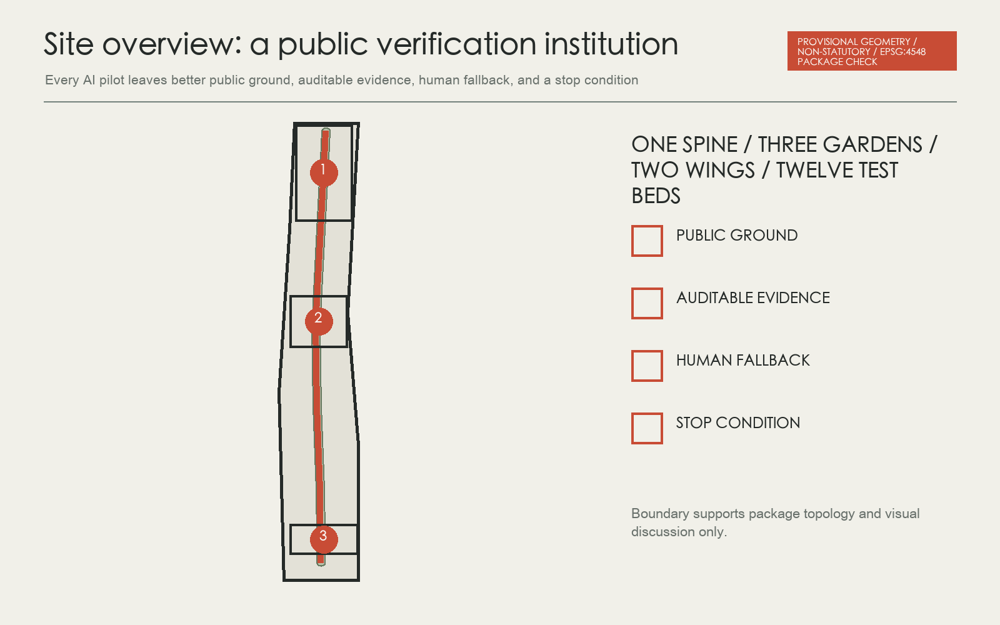
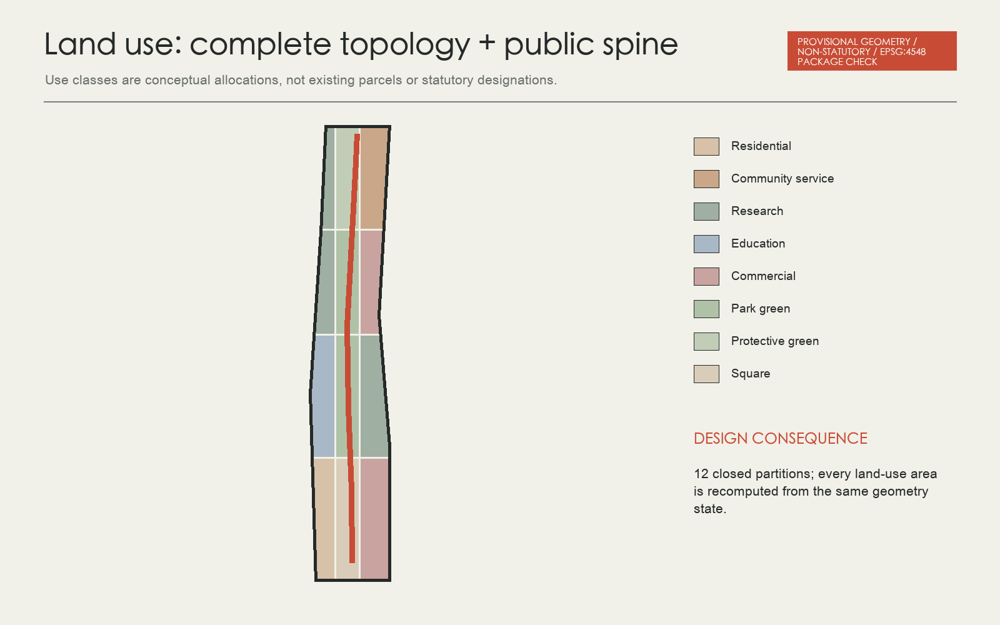
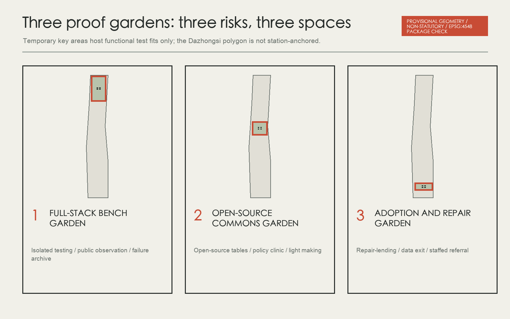
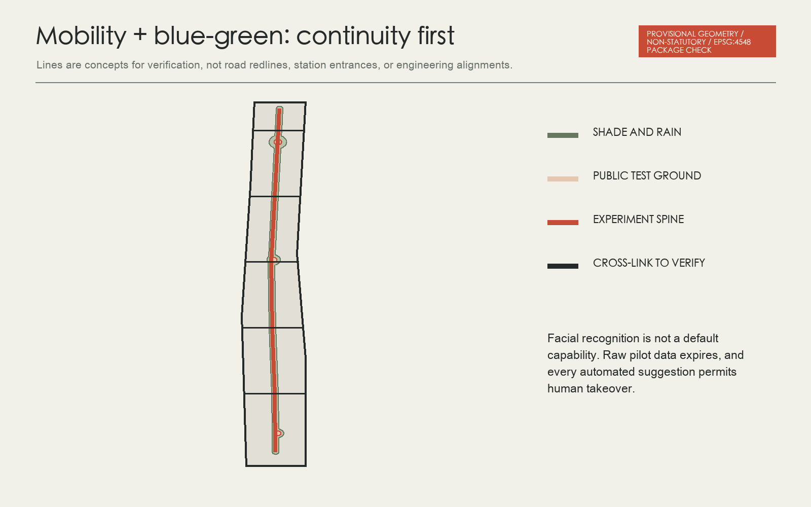
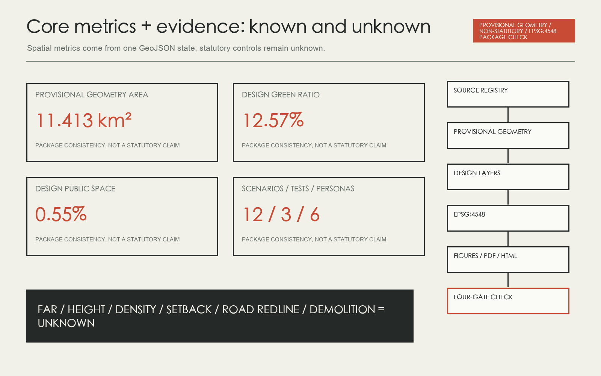

# Jing-Zhang Proof Gardens / 京张可证花园

> Provisional geometry warning: the entire package uses repository-published provisional boundaries for topology, metric consistency, and design discussion. They are not official redlines, precise areas, or statutory controls.

## Design Basis and Source List

This proposal treats the AI Innovation Belt first as a public verification institution and only then as an industrial image. Any AI pilot entering public space must leave four reviewable outcomes: a visible improvement to public ground, an auditable evidence card, a human fallback that can be used immediately, and a stop condition written in advance. These rules form one public experiment spine, three proof gardens, a two-wing collaboration network, and twelve everyday test beds. This is neither a government commitment nor an approved control plan. It is an urban-design and operating proposal for professional calibration.[source:OFFICIAL-ANNOUNCEMENT] [source:AGENT-TASKBOOK] [depth:overall_spatial_structure]

The repository currently contains no trusted official polygons for the overall design area or the three key areas. The package therefore carries forward maintainer-published provisional geometry for topology, layout, and design discussion only. Values such as `site_area_sqm` are machine recomputations of the submitted temporary geometry in EPSG:4548, not precise site areas or statutory evidence. When official boundaries arrive, all nine GeoJSON files, metrics, five figure pairs, A3/A0 outputs, HTML, and checks must be recomputed together.[data:geometry/site_boundary.geojson#SITE-001] [metric:site_area_sqm] [source:PROVISIONAL-BOUNDARIES]

The primary problem is not a shortage of AI signage. It is the lack of verifiable interfaces between innovation resources and everyday public life. Campuses, companies, neighbourhoods, the railway-heritage park, and transit nodes are adjacent at a strategic scale, but published material cannot support precise claims about existing roads, ownership, building condition, utility capacity, or demolition. The design therefore separates connection into three types: the public experiment spine supports continuous north-south walking and narrative; the two-wing network coordinates east-west open hours and service reciprocity across campuses, parks, and neighbourhoods; and the three gardens contain higher-risk testing in manageable places.[source:SOURCE-REGISTRY] [depth:existing_conditions_diagnosis] [standard:MOHURD-URBAN-DESIGN-MEASURES]

Two maintainer issues directly change the scale of representation. Issue #846 identifies a clear mismatch between the provisional overall boundary and an OSM park object, so OSM remains background only and cannot justify moving the boundary. Issue #1029 shows that the centroid of `PROV-KEY-003` is not anchored to Dazhongsi Station. This proposal therefore makes no station-distance, four-quadrant engineering, or precise interchange claim on the temporary polygon. It offers a functional prototype to be relocated after correction. Known task scopes and area names come from the announcement and taskbook; unknown controls, buildings, utilities, ownership, and heritage conditions remain in assumptions.[source:ISSUE-846] [source:ISSUE-1029] [data:geometry/constraints.geojson#DATA-GAP]

## Three-Level Scope Framework

The strategic study scope answers who collaborates with whom: university research, open-source collaboration, enterprise validation, public adoption, and international communication form an AI ecosystem chain tested against seven global cases. The overall design scope answers how collaboration enters the city: one spine, three gardens, two wings, and twelve test beds organise land use, walking, blue-green systems, new infrastructure, and events. The key areas answer where risk is contained: Zhongzhiyuan validates technology, Beijing AI Origin organises shared learning, and Dazhongsi tests adoption, exit, and repair. All three levels share the same four-gate evidence card so strategy, space, and operations do not become separate slogans.[source:OFFICIAL-ANNOUNCEMENT] [depth:three_level_scope_framework] [standard:PROJECT-OFFICIAL-ANNOUNCEMENT]

| Level | Design decision | Spatial action | Quantified consequence |
| --- | --- | --- | --- |
| Strategic study | The belt is a collaboration network, not one campus | Create two-wing institutional reciprocity and a case-mechanism library | 7 cases and 6 personas |
| Overall design | Public ground is shared infrastructure | One experiment spine and 12 test beds | 12 scenario cards and 9 renewal projects |
| Key areas | Differentiated roles outperform copied landmarks | Gardens for validation, learning, and adoption-repair | 3 industry tests and 4 pilgrimage-honour nodes |

## Coordinated Research Area: Industry and Future City Research

Jing-Zhang Proof Gardens translates the memory of a century-scale linear infrastructure from transport efficiency into the way public knowledge is carried, tested, and repaired. The mark is made from four open cells representing public improvement, evidence, human fallback, and a stop condition. Paths remain between the cells so the AI district does not resemble a sealed chip. The identity uses graphite, chalk, mineral green, and a single vermilion accent. Green belongs to public ground; vermilion marks a review threshold and never becomes a technological glow.[source:AGENT-TASKBOOK] [depth:height_massing_character] [standard:PROJECT-AGENT-OPEN-CALL-TASKBOOK]

The identity becomes four physical elements: bilingual walking signs along the spine, four-gate evidence cards at each garden, a contribution and honour ledger, and labels for failure specimens. No company logo, portrait, or third-party case image enters this version. Any later addition requires separate rights clearance. The brand does not endorse an unconfirmed public project and does not present a proposed global event as an established programme.

The cultural narrative does not place railway, technology, and AI images side by side. It moves through transporting knowledge, opening knowledge, and repairing knowledge. The linear memory of Jing-Zhang corresponds to the public experiment spine; Zhongguancun's collaborative culture to the Open-source Canopy; and new AI culture to public manners that are explainable, optional, and repairable. Four pilgrimage and honour nodes are the Proof Gate, Open-source Canopy, Repair Beacon, and Failure Specimen Grove. Honour includes maintenance, translation, care, accessibility, and data-governance contributors as well as model authors.[source:AGENT-TASKBOOK] [depth:height_massing_character] [standard:MOHURD-URBAN-DESIGN-MEASURES]

Long-term operations use a proposed rhythm: monthly Repair Night and Open-source Table, quarterly Open Bench Day and Resident Jury, annual Global AI Proof Season, and an ongoing contribution ledger. An independent operating alliance of universities, companies, communities, public services, and professional bodies may propose tests while planning and regulatory authorities retain statutory duties. Event counts, budget, host, and government support are undetermined. Any public announcement requires renewed checks of public-space permission, event safety, rights, data, and representation.[source:CASE-PARIS-SACLAY] [metric:landmark_count] [depth:phasing_implementation]

## Overall Design Area: Urban Renewal and Regulatory-Plan-Level Urban Design

The overall structure is one spine, three gardens, two wings, and twelve test beds. The public experiment spine follows the long direction of the provisional corridor and indicates continuity for walking, cycling, rainwater, wayfinding, and events. It does not replace the actual Jing-Zhang railway-heritage park boundary. The three gardens contain higher-risk tests. The two wings are not additional development strips; they are relationships that existing institutions could form through shared opening hours, reciprocal services, and safer crossings. Twelve small, reversible installations host the scenario cards.[data:geometry/roads.geojson#SPINE-001] [data:geometry/public_space.geojson#PUBLIC-COMMONS] [depth:overall_spatial_structure]

Spatial consequences are recomputed from the design layers. The land-use partition covers the submitted boundary without overlap. Green and public-space allocations are conceptual and their ratios support internal design comparison only. The building layer represents test-fit footprints in the three key areas, not existing conditions, demolition, or approved scale. Statutory FAR, height, density, setbacks, and road redlines remain unknown.

## Detailed Design of Key Areas

Zhongzhiyuan carries the role: prove that technology is controllable before it enters the city. The garden combines a public observation walk, isolated test sheds, a Failure Specimen Grove, and a low-carbon compute passport desk. Professional teams may run model red-teaming, edge-compute, and low-speed embodied-AI tests in contained settings. The public sees the task, permission, energy band, human takeover, and stop reason without access to sensitive inputs. Shade and rain gardens turn waiting, discussion, and observation into public space rather than an enterprise showroom.[data:geometry/key_areas.geojson#PROV-KEY-001] [depth:three_key_area_detailed_design] [source:CASE-PUNGGOL]

The quantified consequence is four conceptual building footprints, one key-area public-space node, and two industry tests, TEST-A and TEST-B. Building height, river and flood conditions, fire safety, external access, and existing building status await official data. Any human risk, enclosure breach, failed human takeover, or unauthorised data use stops a test immediately.

The Origin Community translates research into reproducible public knowledge. The Open-source Canopy anchors long tables with model-card and data-licence racks, a policy clinic, a light makerspace, research-translation advice, and community talks. Ground-floor edges should admit ordinary residents without identity recognition as the default threshold. Every release displays reproduction steps, known failures, an exit route, and a human contact.[data:geometry/key_areas.geojson#PROV-KEY-002] [source:CASE-MILA] [depth:three_key_area_detailed_design]

Spatial actions include four conceptual building footprints, east-west walking connections between campus and park, and a demountable canopy. The quantified goal is not an invented number of incubated companies. It is that at least four of the twelve scenario cards can receive community co-review here. Final siting requires campus boundaries, ownership, fire safety, ground-floor access, and permission for evening operation.

Dazhongsi tests how ordinary people adopt, refuse, and repair AI. The Repair Beacon makes device repair, lending, updating, recycling, data exit, and staffed referral visible as one process. Pitches may only show projects that have passed the four-gate evidence card. Commercial and public services share a forecourt, but demonstrations cannot occupy an accessible route or replace a staffed counter.[data:geometry/key_areas.geojson#PROV-KEY-003] [source:CASE-SEOUL-AI-HUB] [depth:three_key_area_detailed_design]

Maintainers have confirmed that the temporary key area is not anchored to Dazhongsi Station. This proposal therefore refuses to publish station-entry distances, four-quadrant bridge claims, or footfall forecasts on the current geometry. The four building footprints and public space in the layer are functional test fits to be relocated and recomputed when official polygons and station data are published. TEST-C stops when sources cannot be explained, users cannot exit, or appeals receive no human response.[source:ISSUE-1029] [metric:key_area_count] [data:geometry/buildings.geojson#BLDG-DZS-01]

## AI Innovation Ecosystem, Personas, and AI+ Scenarios

Six personas test the proposal together: open-source developer, startup validation lead, university researcher or student, resident and caregiver, front-line public-service worker, and international visitor or event organiser. Personas are not commercial recommendation labels and never enter facial recognition or individual tracking. They only test whether spaces provide collaboration, exit, care, human takeover, bilingual access, and accessibility at the same time.[source:AGENT-TASKBOOK] [standard:PROJECT-AGENT-OPEN-CALL-TASKBOOK] [depth:risk_missing_data]

Twelve scenario cards cover accessibility auditing, slow-mobility conflict, rain-garden maintenance, bilingual service, education-health-legal referral, open-source reproduction, model red-teaming, low-carbon compute, device repair, supported night travel, data exit, and Global AI Proof Season. Each card has users, a spatial host, data limits, human fallback, and a stop condition. Full bilingual cards enter the A3 booklet and visual. Three industry tests examine full-stack model and edge compute, low-speed embodied-AI coexistence, and agent-service adoption and repair. Multimedia never substitutes for structured layers or metrics.[data:geometry/public_space.geojson#PUBLIC-COMMONS] [metric:ai_scenario_count] [metric:industry_test_count]

## Land Use, Building Scale, and Retain-Renovate-Demolish Strategy

Land use uses the project subset of the national spatial-use classification, forming a complete partition of research, education, housing, community service, commercial service, roads, green space, and squares. The geometry is a rule-based division of the provisional site used to test allocation and topology. It is not a claim about existing parcels or statutory use. Every colour in the figure resolves to a `land_use_code`, and its area is recomputed in EPSG:4548.[data:geometry/land_use.geojson#LU-01] [standard:MNR-LAND-USE-CLASSIFICATION-GUIDE] [metric:green_ratio]

Buildings are capacity test fits only. Four conceptual footprints in each key area host testing, shared learning, repair, or service space. Every footprint sets `retain_renovate_demolish` to `pending_official_survey`; height, floors, FAR, and ownership remain empty. Professional development must first obtain existing-condition survey, ownership, structural safety, fire, heritage, and control-plan data, then decide retention, repair, adaptation, removal, or new building by building. The current footprint metric is only the sum of submitted test-fit polygons.[data:geometry/buildings.geojson#BLDG-ZZY-01] [metric:building_footprint_area_sqm] [depth:retain_renovate_demolish]

Intensity controls use three columns: known, proposed, and unknown. Known content is limited to announced scope levels and submitted geometry. Proposals include public ground-floor edges, demountable canopies, green roofs, and avoidance of sealed campus walls. FAR, height, density, green-space control, setbacks, and total floor area remain unknown and cannot be filled with case-study averages or rendered imagery.

## Transport, Rail, Municipal Infrastructure, and Public Services

Mobility starts with continuous walking before smart transport. The public experiment spine carries a north-south path, while six conceptual east-west links identify crossings between campuses, parks, and neighbourhoods that deserve priority review. They are not road redlines or engineering alignments. Each link first passes an accessibility co-audit, conflict observation, and night-lighting pilot before entering engineering design. Connections associated with Dazhongsi Station must wait for correction of `PROV-KEY-003`.[data:geometry/roads.geojson#SPINE-001] [depth:traffic_rail_slow_parking] [source:ISSUE-1029]

The blue-green system combines linear shade, rain gardens, and the open ground of the three gardens into a maintainable network. AI only helps identify ponding, planting damage, crowding, and lighting faults; people retain work dispatch and facility control. Green and public-space ratios are conceptual allocations over a provisional denominator, not approved green-space or statutory public-space ratios.[data:geometry/green_space.geojson#GREEN-SPINE] [metric:public_space_ratio] [depth:blue_green_public_space]

Public services use small nodes with staffed referral. Bilingual explanation, education-health-legal referral, accessibility audits, repair and lending, data-licence clinics, and low-carbon edge compute all retain paper or human alternatives. Power, communications, drainage, flood, fire, and waste capacities are missing, so all new infrastructure requires professional verification before siting.

## Blue-Green Network, Public Space, and Urban Character

Mobility starts with continuous walking before smart transport. The public experiment spine carries a north-south path, while six conceptual east-west links identify crossings between campuses, parks, and neighbourhoods that deserve priority review. They are not road redlines or engineering alignments. Each link first passes an accessibility co-audit, conflict observation, and night-lighting pilot before entering engineering design. Connections associated with Dazhongsi Station must wait for correction of `PROV-KEY-003`.[data:geometry/roads.geojson#SPINE-001] [depth:traffic_rail_slow_parking] [source:ISSUE-1029]

The blue-green system combines linear shade, rain gardens, and the open ground of the three gardens into a maintainable network. AI only helps identify ponding, planting damage, crowding, and lighting faults; people retain work dispatch and facility control. Green and public-space ratios are conceptual allocations over a provisional denominator, not approved green-space or statutory public-space ratios.[data:geometry/green_space.geojson#GREEN-SPINE] [metric:public_space_ratio] [depth:blue_green_public_space]

Public services use small nodes with staffed referral. Bilingual explanation, education-health-legal referral, accessibility audits, repair and lending, data-licence clinics, and low-carbon edge compute all retain paper or human alternatives. Power, communications, drainage, flood, fire, and waste capacities are missing, so all new infrastructure requires professional verification before siting.

The cultural narrative does not place railway, technology, and AI images side by side. It moves through transporting knowledge, opening knowledge, and repairing knowledge. The linear memory of Jing-Zhang corresponds to the public experiment spine; Zhongguancun's collaborative culture to the Open-source Canopy; and new AI culture to public manners that are explainable, optional, and repairable. Four pilgrimage and honour nodes are the Proof Gate, Open-source Canopy, Repair Beacon, and Failure Specimen Grove. Honour includes maintenance, translation, care, accessibility, and data-governance contributors as well as model authors.[source:AGENT-TASKBOOK] [depth:height_massing_character] [standard:MOHURD-URBAN-DESIGN-MEASURES]

Long-term operations use a proposed rhythm: monthly Repair Night and Open-source Table, quarterly Open Bench Day and Resident Jury, annual Global AI Proof Season, and an ongoing contribution ledger. An independent operating alliance of universities, companies, communities, public services, and professional bodies may propose tests while planning and regulatory authorities retain statutory duties. Event counts, budget, host, and government support are undetermined. Any public announcement requires renewed checks of public-space permission, event safety, rights, data, and representation.[source:CASE-PARIS-SACLAY] [metric:landmark_count] [depth:phasing_implementation]

## Renewal Projects, Implementation Policy, and Phasing

Nine projects follow evidence first, connection second, and scale last. Near-term work tests public benefit through temporary markings, accessibility audits, three lightweight garden demonstrators, and operating protocols. Mid-term safe crossings, rain gardens, wayfinding, and edge-compute nodes proceed only after roads, utilities, fire, and ownership are confirmed. Official spatial data triggers package-wide recomputation as soon as it is released. Phasing polygons cover the provisional site for topology checking only and do not represent a public investment timetable.[data:geometry/phasing.geojson#PHASE-01] [depth:renewal_project_list] [depth:phasing_implementation]

| Project group | First action | Pass condition | If it fails |
| --- | --- | --- | --- |
| PG-01 to PG-04 | Small public pilot | Accessibility co-audit, human fallback, reversibility | Remove the installation and publish why |
| PG-05 to PG-07 | Spatial and infrastructure connection | Professional conditions and maintenance responsibility confirmed | Remain a strategy and do not enter engineering |
| PG-08 | Operating protocol | Community representation, appeal, and event safety | Pause the event and revise rules |
| PG-09 | Data replacement | Official boundaries and base data complete | Retain the provisional warning |

The proposal assigns no investment amount, construction agency, displacement, or public procurement. Every project publishes dependencies, failures, and stop records before proceeding.

## Metrics, Area Recalculation, and Compliance Matrix

Known metrics fall into two groups. The first contains machine facts about submitted geometry: provisional site area, design green and public-space areas, conceptual building footprints, and three key areas. These support package consistency only. The second contains programme counts: 12 scenario cards, 3 industry tests, 6 personas, 4 landmarks, and 9 projects. FAR, height, density, setbacks, road redlines, demolition area, and total floor area remain unknown.[metric:site_area_sqm] [metric:green_space_area_sqm] [depth:metrics_recalculation]

The standards matrix covers the announcement, agent taskbook, urban-design administration, control-plan preparation, and land-use classification. The official architectural design-depth document remains unavailable, so its snapshot stays `data_gap`; building expression is deliberately reduced to test fits and never claims architectural or construction-document depth. All fifteen required design-depth items are complete within the published-data boundary. That completeness does not mean missing official controls have been supplied.[standard:MOHURD-CONTROL-DETAILED-PLANNING] [standard:MOHURD-ARCH-DESIGN-DEPTH-2016] [depth:development_intensity_controls]

Key risks are misreading temporary boundaries, mislocating a key area, harm from technology tests, privacy or exit failure, underestimated maintenance labour, unrepresentative events, and transfer of case-study numbers. Controls are a package-wide warning, unknown fields, human takeover, data minimisation, stop conditions, a maintenance ledger, and mechanism-only case translation.

## Risk, Copyright, and Compliance

The proposal, translation, nine GeoJSON layers, metrics, assumptions, sources, three matrices, self-check, five bilingual figure pairs, A3 booklets, A0 boards, report HTML, offline interactive visual, cover, and short film come from one generation state. Figures and PDFs use only submission data, code-drawn graphics, and one original cover base generated for this task. There are no remote fonts, CDNs, map tiles, iframes, trackers, or forms. The silent film does not autoplay and includes Chinese and English VTT, posters, and transcript; the Canvas is keyboard operable and honours reduced motion.[source:COVER-IMAGEGEN] [data:geometry/site_boundary.geojson#SITE-001] [depth:risk_missing_data]

First-party case pages are used for factual citation only; no imagery or long passage is copied. Their rights are recorded as reserved with factual-citation use. Proposal text and code follow repository display terms. Detailed rights and the final generation prompt are in `report/copyright_statement.md` and `sources.json`.

Known metrics fall into two groups. The first contains machine facts about submitted geometry: provisional site area, design green and public-space areas, conceptual building footprints, and three key areas. These support package consistency only. The second contains programme counts: 12 scenario cards, 3 industry tests, 6 personas, 4 landmarks, and 9 projects. FAR, height, density, setbacks, road redlines, demolition area, and total floor area remain unknown.[metric:site_area_sqm] [metric:green_space_area_sqm] [depth:metrics_recalculation]

The standards matrix covers the announcement, agent taskbook, urban-design administration, control-plan preparation, and land-use classification. The official architectural design-depth document remains unavailable, so its snapshot stays `data_gap`; building expression is deliberately reduced to test fits and never claims architectural or construction-document depth. All fifteen required design-depth items are complete within the published-data boundary. That completeness does not mean missing official controls have been supplied.[standard:MOHURD-CONTROL-DETAILED-PLANNING] [standard:MOHURD-ARCH-DESIGN-DEPTH-2016] [depth:development_intensity_controls]

Key risks are misreading temporary boundaries, mislocating a key area, harm from technology tests, privacy or exit failure, underestimated maintenance labour, unrepresentative events, and transfer of case-study numbers. Controls are a package-wide warning, unknown fields, human takeover, data minimisation, stop conditions, a maintenance ledger, and mechanism-only case translation.

## References

The seven cases provide mechanism background, not transferable performance. Punggol suggests university-industry co-location; Kalasatama, short co-created pilots; Seoul, a distributed service network; Mila, intersections among research, policy, and making; Knowledge Quarter London, a common identity for existing institutions; Paris-Saclay, circular economy and a network of innovation places; and Kendall Square, a shift from innovation park to innovation community. Every case uses a first-party page from an operator, government, or public development agency. Access date, rights boundary, and use are recorded in `sources.json`.[source:CASE-PUNGGOL] [source:CASE-KALASATAMA] [source:CASE-KQ-LONDON]

| Case mechanism | Local translation | Explicitly not transferred |
| --- | --- | --- |
| University-industry co-location and real-world validation | Differentiated gardens and bookable test grounds | Area, jobs, investment |
| Agile pilots and resident co-review | Four-gate evidence card and resident jury | Success rate, budget, governing authority |
| Shared identity and network brokerage | Two-wing wayfinding, open hours, contribution ledger | Membership size and economic output |
| Innovation community and connected open space | Public experiment spine and public ground-floor edges | Land value, development intensity, engineering standards |

## Appendix A: Six design personas

| Persona | Typical need | Use boundary |
| --- | --- | --- |
| Open-source developer | Needs low-barrier collaboration, reproducible tests, and visible contribution | Spatial design testing only; no personal labels or recommendations |
| Startup validation lead | Needs a real setting, small-scope permission, failure review, and compliance referral | Spatial design testing only; no personal labels or recommendations |
| University researcher or student | Needs cross-campus exchange, translation support, walking links, and safe evening access | Spatial design testing only; no personal labels or recommendations |
| Resident and caregiver | Needs quiet, accessibility, non-digital fallback, and a voice in whether a pilot continues | Spatial design testing only; no personal labels or recommendations |
| Front-line public-service worker | Needs tools that do not add hidden labour, with human takeover and fault reporting | Spatial design testing only; no personal labels or recommendations |
| International visitor and event organiser | Needs bilingual wayfinding, credible cases, transit access, and clear rights information | Spatial design testing only; no personal labels or recommendations |

## Appendix B: Twelve AI scenario cards

| Card | Scenario | Spatial host | Human and data boundary |
| --- | --- | --- | --- |
| SC-01 | Co-audited accessible route | Public experiment spine | Residents, wheelchair users, and maintainers mark barriers together; AI aggregates issues without tracking individuals. |
| SC-02 | Slow-mobility conflict observatory | Cross-street links | Anonymous manual counts and short-term sensors compare walking-cycling conflicts; raw data is deleted when the test ends. |
| SC-03 | Rain-garden maintenance assistant | Blue-green nodes | Flags dryness, blockage, and planting damage; maintainers verify before dispatch and no automatic irrigation changes are allowed. |
| SC-04 | Bilingual community-service explainer | Community-service frontage | Turns public service information into plain Chinese and English while retaining a staffed counter and paper guide. |
| SC-05 | Education-health-legal referral desk | Origin Commons Garden | Provides public institutions and booking routes only, with no diagnosis, legal opinion, or eligibility decision. |
| SC-06 | Open-source release and reproduction table | Open-source Canopy | Releases include data licence, model card, reproduction steps, and known failures; contributions enter a reversible honour ledger. |
| SC-07 | Public model red-team gallery | Zhongzhiyuan Bench Garden | Professional red teams work in isolation while the public sees methods and findings rather than sensitive inputs. |
| SC-08 | Low-carbon edge-compute passport | Proof node | Records task type, energy band, and shutdown condition without exposing proprietary model details. |
| SC-09 | Intelligent-device repair library | Dazhongsi Repair Beacon | Offers inspection, borrowing, updating, and recycling routes, with repair before replacement as the default. |
| SC-10 | Low-intrusion night route | Public experiment spine | Lighting responds by time and aggregate footfall; emergency calls reach people first and facial recognition is excluded. |
| SC-11 | Data licence and exit clinic | Adoption and Repair Garden | Helps teams document data origin, exit mechanism, appeal route, and deletion responsibility. |
| SC-12 | Global AI Proof Season | One belt and three gardens | A one-week public walking review links trials, resident juries, open-source releases, and a failure archive. |

## Appendix C: Three industry test protocols

| Protocol | Location | Observations | Stop condition |
| --- | --- | --- | --- |
| TEST-A Full-stack model and edge-compute validation | Zhongzhiyuan Bench Garden | Energy band, latency, offline availability, and human takeover time | Unauthorised data use or failed human takeover |
| TEST-B Low-speed embodied-AI coexistence test | A small closed segment of the public experiment spine | Yielding, emergency stop, accessible detour, and maintenance burden | Human risk, blocked accessible route, or exit from the enclosure |
| TEST-C Agent-service adoption and repair test | Dazhongsi Adoption and Repair Garden | Explainability, human handoff, opt-out rate, and repair time | Untraceable source, unavailable exit, or unanswered appeal |

## Appendix D: Nine evidence-gated projects

| ID | Project | Phase | Prerequisite |
| --- | --- | --- | --- |
| PG-01 | Temporary marking and accessibility audit for the public experiment spine | Near-term pilot | Official road limits, traffic safety review, and co-audit with disabled users |
| PG-02 | Lightweight Zhongzhiyuan Bench Garden demonstrator | Near-term pilot | Official key-area boundary, site permission, ecological and fire-safety conditions |
| PG-03 | Origin Open-source Canopy and policy clinic | Near-term pilot | Campus-park limits, operating partner, IP, and data licensing |
| PG-04 | Dazhongsi Repair Beacon and lending library | Near-term pilot | Location correction, commercial-space permission, product liability, and recycling channels |
| PG-05 | East-west safe crossings and rain-garden set | Mid-term connection | Road redlines, utilities, drainage-flood review, and maintenance responsibility |
| PG-06 | Bilingual three-garden wayfinding and contribution ledger | Mid-term connection | Brand permission, privacy rules, content review, and ongoing maintenance |
| PG-07 | Low-carbon edge compute and human takeover nodes | Mid-term connection | Power capacity, cybersecurity, energy accounting, and staffed takeover |
| PG-08 | Proof Season and resident jury protocol | Operations first | Public-space permission, event safety, representation, and appeal mechanism |
| PG-09 | Official-data replacement and package-wide recomputation | Trigger on data release | Official overall and key-area boundaries, control plan, roads, buildings, ownership, utilities, and heritage data |

## Appendix E: Evidence entry points

Full access dates, rights, and processing methods are in `sources.json`. Professional standards and depth are in `standard_matrix.json` and `design_depth_matrix.json`.[source:SOURCE-REGISTRY] [standard:PROJECT-OFFICIAL-ANNOUNCEMENT]
