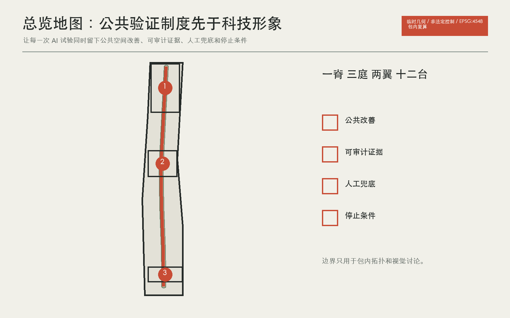
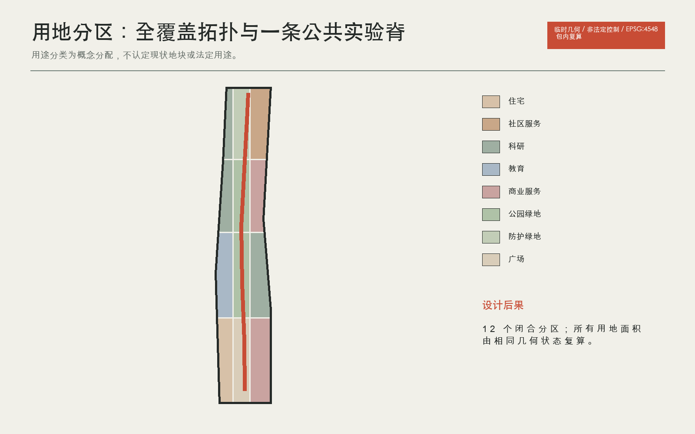
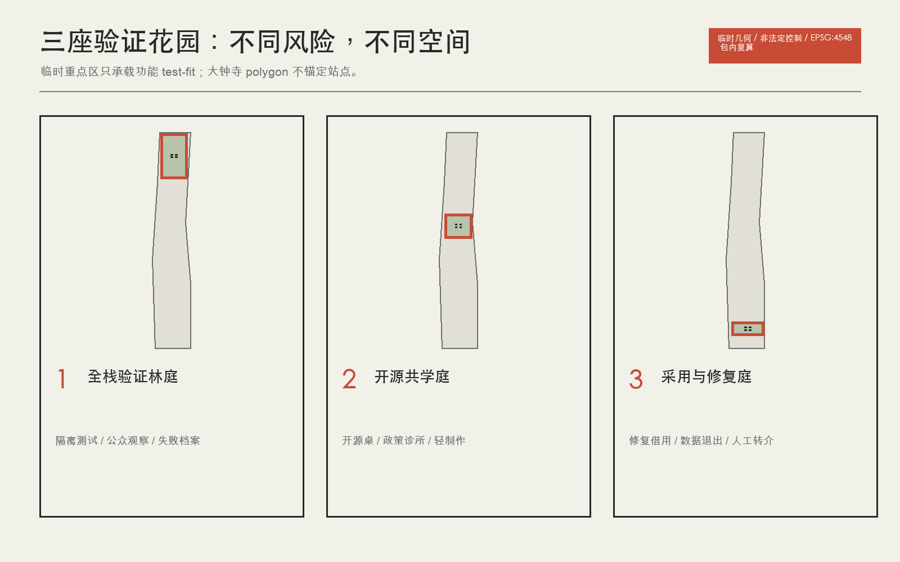
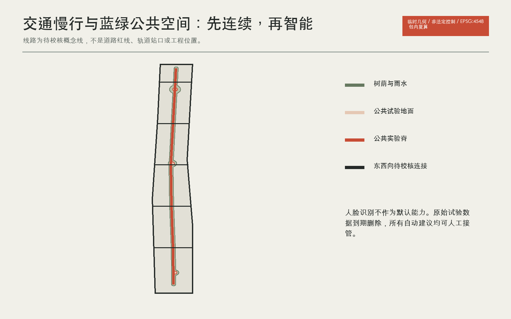
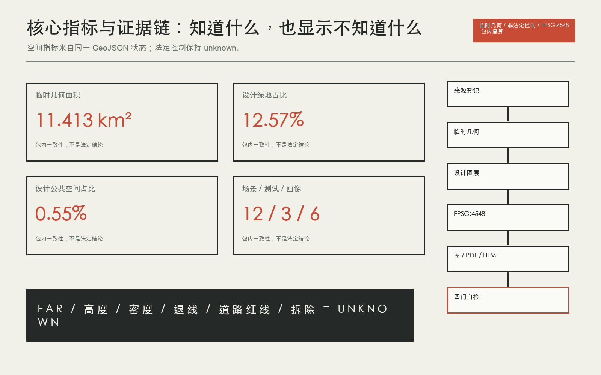

# 京张可证花园 / Jing-Zhang Proof Gardens

> 临时几何警示：全包使用仓库发布的 provisional boundary 进行拓扑、指标一致性和设计讨论。它不是 official redline、精确面积或法定控制依据。

## 设计依据与资料清单

本方案把 AI 创新带首先理解为一种公共验证制度，其次才是产业形象。核心规则是：任何进入公共空间的 AI 试验，都必须同时留下四项可审查结果，即一处可见的公共地面改善、一张可审计证据卡、一条可立即启用的人工兜底路径，以及一项事先写明的停止条件。由此形成“一个公共实验脊、三座验证花园、两翼协作网、十二个日常试验台”。这不是政府承诺，也不是审定控规，而是一套可由专业团队继续校准的城市设计与运营提案。[source:OFFICIAL-ANNOUNCEMENT] [source:AGENT-TASKBOOK] [depth:overall_spatial_structure]

当前仓库没有可信的总体设计范围和三处重点区官方 polygon。提交包沿用维护者发布的 provisional geometry，仅用于拓扑、版式和方案讨论。`site_area_sqm` 等数值只表示所提交临时几何在 EPSG:4548 下的机器复算结果，不是精确场地面积或法定依据。官方边界发布后，九个 GeoJSON、全部指标、五组图、A3/A0、HTML 和自检必须整体重算，不允许只换边界文件。[data:geometry/site_boundary.geojson#SITE-001] [metric:site_area_sqm] [source:PROVISIONAL-BOUNDARIES]

场地的首要矛盾不是缺少 AI 标识，而是创新资源与日常公共生活之间缺少可验证的接口。高校、企业、社区、遗址公园与轨道站点在总体方向上相邻，但公开资料不足以支持精确现状路网、地块权属、建筑质量、市政容量或拆改判断。因此设计把“连接”拆成三类：公共实验脊负责南北连续步行和叙事，两翼协作网负责东西向校园、园区与社区的开放时段和服务互认，三座花园负责把高风险试验收纳到可管理的地点。[source:SOURCE-REGISTRY] [depth:existing_conditions_diagnosis] [standard:MOHURD-URBAN-DESIGN-MEASURES]

两个维护者问题直接改变表达尺度。Issue #846 表明临时总体边界与一处 OSM 公园对象之间存在明显偏差，因此 OSM 只能作背景，不能用来移动边界。Issue #1029 表明 `PROV-KEY-003` 的质心并不锚定大钟寺站，因此本方案不在临时 polygon 上声称站口距离、四象限工程或精准接驳，只提出待位置校正后的功能原型。已知的任务范围和三处名称来自公告与任务书，未知的法定控制、现状建筑、市政、权属和文保条件进入 assumptions。[source:ISSUE-846] [source:ISSUE-1029] [data:geometry/constraints.geojson#DATA-GAP]

## 三层范围工作框架

统筹研究范围回答“谁与谁协作”：以高校策源、开源协作、企业验证、公共采用、国际传播组成 AI 生态链，并用七个全球案例校对机制。总体设计范围回答“协作如何进入城市”：用一脊、三庭、两翼和十二试验台组织用地、步行、蓝绿、新基建与活动。重点区域回答“风险在哪里被收纳”：众智园验证技术，北京 AI 原点组织共学，大钟寺验证采用、退出和修复。三个层次共享同一套四门证据卡，避免战略、空间和运营各写一套口号。[source:OFFICIAL-ANNOUNCEMENT] [depth:three_level_scope_framework] [standard:PROJECT-OFFICIAL-ANNOUNCEMENT]

| 层级 | 设计判断 | 空间动作 | 量化后果 |
| --- | --- | --- | --- |
| 统筹研究 | 创新带是协作网络，不是单一园区 | 建立两翼机构互认和案例机制库 | 7 个案例、6 类画像 |
| 总体设计 | 公共地面是共同基础设施 | 一条实验脊、12 个试验台 | 12 张场景卡、9 个更新项目 |
| 重点区域 | 三地分工比复制地标更有效 | 验证、共学、采用修复三庭 | 3 类产业测试、4 个朝圣与荣誉节点 |

## 统筹研究范围产业与未来城市研究

“京张可证花园”把百年线性基础设施的记忆，从运输效率转译为公共知识如何被传递、检验和修复。Logo 由四个开口方格组成，分别代表公共改善、证据、人工兜底、停止条件；方格之间留有通路，避免把 AI 园区表现为封闭芯片。识别色只使用石墨黑、粉笔白、矿物绿和一处朱红：绿对应公共地面，朱红只标示需要审查的门槛，不用于制造科技光晕。[source:AGENT-TASKBOOK] [depth:height_massing_character] [standard:PROJECT-AGENT-OPEN-CALL-TASKBOOK]

识别系统落到四种实体：沿脊的双语步行标牌、三庭入口的四门证据卡、贡献与荣誉账本、以及失败标本标签。任何企业 Logo、人物肖像和外部案例图像都不进入本版；正式运营若加入，必须单独清权。品牌不为尚未确定的政府项目背书，也不把“全球活动”写成既定安排。

文化叙事不把铁路、科技和 AI 并排贴图，而沿“运输知识、开放知识、修复知识”展开。百年京张的线性记忆对应公共实验脊，中关村的协作文化对应开源棚，AI 新文化则以可解释、可退出、可修复作为公共礼仪。四个朝圣与荣誉节点分别是可证门、开源棚、修复灯塔和失败标本园，荣誉对象不仅包括模型作者，也包括维护、翻译、照护、无障碍和数据治理贡献者。[source:AGENT-TASKBOOK] [depth:height_massing_character] [standard:MOHURD-URBAN-DESIGN-MEASURES]

长期运营采用提案式节奏：每月修复夜与开源桌，每季度开放验证日与居民陪审，每年全球 AI 可证季，持续维护贡献账本。建议由高校、企业、社区、公共服务与专业机构组成的独立运营联盟提出试验，规划与监管部门保留法定职责。活动数量、预算、承办主体和政府支持均未确定；任何对外发布需再次确认公共空间许可、活动安全、版权、数据和代表性。[source:CASE-PARIS-SACLAY] [metric:landmark_count] [depth:phasing_implementation]

## 总体设计范围城市更新与控规深度城市设计

总体结构为“一脊、三庭、两翼、十二台”。公共实验脊沿 provisional corridor 的长向布置，只表达应连续的步行、骑行、雨水、导视和活动界面，不替代真实京张遗址公园边界。三庭是高风险试验的空间容器。两翼不是新增建设带，而是既有机构未来可通过开放时段、服务互认和安全过街形成的关系。十二台以小尺度、可撤回的设施承载场景卡。[data:geometry/roads.geojson#SPINE-001] [data:geometry/public_space.geojson#PUBLIC-COMMONS] [depth:overall_spatial_structure]

空间后果通过设计图层复算：完整用地分区覆盖提交边界且相互不重叠；绿地和公共空间为概念性设计分配，比例只用于本轮方案内部比较；建筑层只表达三处重点区的 test-fit 基底，不表达现状、拆除或审定规模。法定容积率、高度、密度、退线和道路红线保持 unknown。

## 重点区域详细设计

众智园承担“先证明技术可控，再进入城市”的角色。林庭由一条公众观察廊、隔离测试棚、失败标本园和低碳算力通行证台组成。专业团队可在隔离环境进行模型红队、边缘算力和具身智能低速验证；公众看到任务、许可、能耗区间、人工接管和停止原因，不接触敏感输入。树荫与雨水花园把等候、讨论和观察变成公共空间，而非企业展厅。[data:geometry/key_areas.geojson#PROV-KEY-001] [depth:three_key_area_detailed_design] [source:CASE-PUNGGOL]

量化后果是四个概念建筑基底、一个重点区公共空间节点和 TEST-A/TEST-B 两类产业验证。建筑高度、河道、防洪、消防、对外交通和现状建筑状态均待官方资料。任何测试发生人身风险、越出围挡、人工接管失败或使用未经授权数据时立即停止。

原点社区承担“把研究翻译成可复现公共知识”的角色。共学庭以开源棚为中心，围绕长桌布置模型卡与数据许可架、政策诊所、轻制作间、成果转化咨询和社区讲堂。首层界面应允许普通居民进入，不以身份识别作为默认门槛。发布项目必须展示复现步骤、已知失败、退出路径和人工联系人。[data:geometry/key_areas.geojson#PROV-KEY-002] [source:CASE-MILA] [depth:three_key_area_detailed_design]

空间动作包括四个概念建筑基底、校园园区两翼慢行缝合和可拆装开源棚。量化目标不是虚构孵化企业数，而是保证 12 张场景卡中至少 4 张可在此接受社区共同评审。正式选址需取得校区边界、权属、消防、首层开放条件和夜间运营许可。

大钟寺承担“AI 如何被普通人采用、拒绝和修复”的角色。修复灯塔把智能终端维修、借用、更新、回收、数据退出和人工转介排成可见流程；路演只展示通过四门证据卡的项目。商业与公共服务共享前场，但企业演示不得占用无障碍通道或替代人工窗口。[data:geometry/key_areas.geojson#PROV-KEY-003] [source:CASE-SEOUL-AI-HUB] [depth:three_key_area_detailed_design]

由于维护者已确认临时重点区并不锚定大钟寺站，本方案拒绝在当前几何上给出站口距离、四象限连桥或人流预测。图层中的四个建筑基底和公共空间只是功能 test-fit，待官方 polygon 与站点资料发布后整体迁移重算。TEST-C 的停止条件是来源不可说明、用户无法退出或申诉无人响应。[source:ISSUE-1029] [metric:key_area_count] [data:geometry/buildings.geojson#BLDG-DZS-01]

## AI 创新生态、人才画像与 AI+ 场景

六类画像共同检验方案：开源开发者、初创验证负责人、高校研究者与学生、周边居民与照护者、公共服务一线人员、国际访客与活动组织者。画像不是商业推荐标签，不进入人脸识别或个体追踪。它只用于检查空间是否同时具备协作、退出、照护、人工接管、双语和无障碍条件。[source:AGENT-TASKBOOK] [standard:PROJECT-AGENT-OPEN-CALL-TASKBOOK] [depth:risk_missing_data]

十二张场景卡覆盖无障碍巡检、慢行冲突、雨水养护、双语服务、教育医疗法律转介、开源复现、模型红队、低碳算力、终端修复、夜行护航、数据退出和全球可证季。每张卡都有服务对象、空间载体、数据边界、人工兜底与停止条件；完整双语卡片进入 A3 文册和 visual。三项产业测试分别验证全栈模型与边缘算力、具身智能低速共行、智能体服务采用与修复，不能用富媒体替代结构化图层和指标。[data:geometry/public_space.geojson#PUBLIC-COMMONS] [metric:ai_scenario_count] [metric:industry_test_count]

## 用地、建筑规模与拆改留方案

用地采用任务书提供的国土空间用途分类子集，按科研、教育、居住、社区服务、商业服务、道路、绿地和广场形成完整分区。分区几何来自 provisional site 的规则切分，目的是验证空间配比和拓扑，不是对现状地块或法定用途的认定。图件中的每个色块都可回到 `land_use_code`，并由 EPSG:4548 复算面积。[data:geometry/land_use.geojson#LU-01] [standard:MNR-LAND-USE-CLASSIFICATION-GUIDE] [metric:green_ratio]

建筑只做容量试装：每个重点区放入四个概念基底，分别对应开放测试、共学、维修或服务空间。所有基底的 `retain_renovate_demolish` 均为 `pending_official_survey`，高度、层数、容积率和产权为空。正式深化需先取得现状测绘、权属、结构安全、消防、文保和控规，再逐栋形成保留、修缮、改造、拆除或新建判断。当前建筑基底面积只是所提交 test-fit 多边形之和。[data:geometry/buildings.geojson#BLDG-ZZY-01] [metric:building_footprint_area_sqm] [depth:retain_renovate_demolish]

强度控制采用“已知、建议、未知”三栏。已知仅限公告范围层级和提交几何；建议包括首层公共界面、可拆装棚架、绿色屋面与避免封闭园墙；未知包括 FAR、高度、密度、绿地率、退线和总建筑规模。未知值不得由案例平均数或视觉效果图补齐。

## 交通、轨道、市政与公共服务设施

交通策略先解决步行连续，再讨论智能交通。公共实验脊提供南北连续路径，六条概念性东西连接提示校园、园区和社区应优先校核的跨街位置；它们不是道路红线或工程线位。每个连接先通过无障碍共审、冲突观察和夜间照明试验，再决定是否进入工程设计。大钟寺站相关连接必须等待 `PROV-KEY-003` 位置校正。[data:geometry/roads.geojson#SPINE-001] [depth:traffic_rail_slow_parking] [source:ISSUE-1029]

蓝绿系统把线性树荫、雨水花园和三庭开放地面叠加为一套可维护网络。AI 只帮助发现积水、植被损伤、拥挤和照明故障，最终派单和设施控制由人完成。绿色与公共空间比例是本方案在 provisional denominator 上的概念分配，不是审定绿地率或公共空间法定比例。[data:geometry/green_space.geojson#GREEN-SPINE] [metric:public_space_ratio] [depth:blue_green_public_space]

公共服务采用“小节点加人工转介”：双语解释、教育医疗法律转介、无障碍巡检、修复借用、数据许可诊所和低碳边缘算力均保留纸质或人工替代。电力、通信、排水、防洪、消防和环卫容量缺失，所有新型基础设施必须在专业核查后才能定位。

## 蓝绿空间、公共空间与城市风貌

交通策略先解决步行连续，再讨论智能交通。公共实验脊提供南北连续路径，六条概念性东西连接提示校园、园区和社区应优先校核的跨街位置；它们不是道路红线或工程线位。每个连接先通过无障碍共审、冲突观察和夜间照明试验，再决定是否进入工程设计。大钟寺站相关连接必须等待 `PROV-KEY-003` 位置校正。[data:geometry/roads.geojson#SPINE-001] [depth:traffic_rail_slow_parking] [source:ISSUE-1029]

蓝绿系统把线性树荫、雨水花园和三庭开放地面叠加为一套可维护网络。AI 只帮助发现积水、植被损伤、拥挤和照明故障，最终派单和设施控制由人完成。绿色与公共空间比例是本方案在 provisional denominator 上的概念分配，不是审定绿地率或公共空间法定比例。[data:geometry/green_space.geojson#GREEN-SPINE] [metric:public_space_ratio] [depth:blue_green_public_space]

公共服务采用“小节点加人工转介”：双语解释、教育医疗法律转介、无障碍巡检、修复借用、数据许可诊所和低碳边缘算力均保留纸质或人工替代。电力、通信、排水、防洪、消防和环卫容量缺失，所有新型基础设施必须在专业核查后才能定位。

文化叙事不把铁路、科技和 AI 并排贴图，而沿“运输知识、开放知识、修复知识”展开。百年京张的线性记忆对应公共实验脊，中关村的协作文化对应开源棚，AI 新文化则以可解释、可退出、可修复作为公共礼仪。四个朝圣与荣誉节点分别是可证门、开源棚、修复灯塔和失败标本园，荣誉对象不仅包括模型作者，也包括维护、翻译、照护、无障碍和数据治理贡献者。[source:AGENT-TASKBOOK] [depth:height_massing_character] [standard:MOHURD-URBAN-DESIGN-MEASURES]

长期运营采用提案式节奏：每月修复夜与开源桌，每季度开放验证日与居民陪审，每年全球 AI 可证季，持续维护贡献账本。建议由高校、企业、社区、公共服务与专业机构组成的独立运营联盟提出试验，规划与监管部门保留法定职责。活动数量、预算、承办主体和政府支持均未确定；任何对外发布需再次确认公共空间许可、活动安全、版权、数据和代表性。[source:CASE-PARIS-SACLAY] [metric:landmark_count] [depth:phasing_implementation]

## 更新项目清单、实施政策与分期计划

九个项目按“先证据、再缝合、后规模”推进。近期以临时标线、无障碍巡检、三个轻量花园样板和运营协议验证公共收益；中期只在道路、市政、消防和权属确认后实施安全过街、雨水花园、导视和边缘算力节点；官方空间数据到位即触发全包重算。分期 polygon 只覆盖 provisional site 以检查拓扑，不表示行政投资时序。[data:geometry/phasing.geojson#PHASE-01] [depth:renewal_project_list] [depth:phasing_implementation]

| 项目组 | 先做什么 | 通过条件 | 不通过时 |
| --- | --- | --- | --- |
| PG-01 至 PG-04 | 小尺度公共试点 | 无障碍共审、人工兜底、可撤回 | 删除设施并公开原因 |
| PG-05 至 PG-07 | 空间与新基建缝合 | 获得专业条件和维护责任 | 保留为策略，不进入工程 |
| PG-08 | 运营制度 | 社区代表性、申诉、活动安全 | 暂停活动并修订规则 |
| PG-09 | 数据替换 | 官方边界与基础资料齐备 | 继续保留 provisional 警示 |

方案不指定投资额、建设主体、拆迁或政府采购。每个项目必须在进入下一阶段前公开依赖、失败和停止记录。

## 指标体系、面积复算与合规矩阵

已知指标分两类。第一类是提交几何的机器事实，包括 provisional site 面积、设计绿地与公共空间面积、概念建筑基底面积和三处重点区数量；它们只用于包内一致性。第二类是方案计数，包括 12 张场景卡、3 项产业测试、6 类画像、4 个地标和 9 个项目。FAR、高度、密度、退线、道路红线、拆除面积和总建筑规模均为 unknown。[metric:site_area_sqm] [metric:green_space_area_sqm] [depth:metrics_recalculation]

标准矩阵覆盖公告、智能体任务书、城市设计管理、控规编制和用地分类。建筑设计深度官方文件仍未取得，因此该标准快照保持 data_gap，但相关建筑表达已主动降级为 test-fit，不假装完成施工或方案设计深度。15 项 required design-depth 均“在已发布资料边界内完成”，其完整并不意味着缺失的官方控制已被补齐。[standard:MOHURD-CONTROL-DETAILED-PLANNING] [standard:MOHURD-ARCH-DESIGN-DEPTH-2016] [depth:development_intensity_controls]

主要风险为临时边界误读、重点区位置误读、技术试验伤害、隐私与退出失败、维护劳动被低估、活动代表性不足和案例数字误移植。对应控制是全包水印、unknown 字段、人工接管、数据最小化、停止条件、维护账本和只转译机制。

## 风险、版权与合规说明

本包的 proposal、译稿、九个 GeoJSON、指标、假设、来源、三类矩阵、自检、五组中英图、A3 文册、A0 展板、报告 HTML、离线交互页、封面和短片来自同一次生成状态。图件和 PDF 只使用提交内数据、代码生成图形和一张本任务生成的原创封面基底；没有远程字体、CDN、地图瓦片、iframe、跟踪或表单。短片无音频、不自动播放，提供中英 VTT、海报和文字稿；Canvas 可用键盘操作并遵守 reduced-motion。[source:COVER-IMAGEGEN] [data:geometry/site_boundary.geojson#SITE-001] [depth:risk_missing_data]

公开案例页面仅作事实引用，不复制其图像或大段文字，许可记为权利保留、仅事实引用。提案文本与代码按仓库提交规则展示，详细权利与生成提示词见 `report/copyright_statement.md` 和 `sources.json`。

已知指标分两类。第一类是提交几何的机器事实，包括 provisional site 面积、设计绿地与公共空间面积、概念建筑基底面积和三处重点区数量；它们只用于包内一致性。第二类是方案计数，包括 12 张场景卡、3 项产业测试、6 类画像、4 个地标和 9 个项目。FAR、高度、密度、退线、道路红线、拆除面积和总建筑规模均为 unknown。[metric:site_area_sqm] [metric:green_space_area_sqm] [depth:metrics_recalculation]

标准矩阵覆盖公告、智能体任务书、城市设计管理、控规编制和用地分类。建筑设计深度官方文件仍未取得，因此该标准快照保持 data_gap，但相关建筑表达已主动降级为 test-fit，不假装完成施工或方案设计深度。15 项 required design-depth 均“在已发布资料边界内完成”，其完整并不意味着缺失的官方控制已被补齐。[standard:MOHURD-CONTROL-DETAILED-PLANNING] [standard:MOHURD-ARCH-DESIGN-DEPTH-2016] [depth:development_intensity_controls]

主要风险为临时边界误读、重点区位置误读、技术试验伤害、隐私与退出失败、维护劳动被低估、活动代表性不足和案例数字误移植。对应控制是全包水印、unknown 字段、人工接管、数据最小化、停止条件、维护账本和只转译机制。

## 参考资料

七个案例只提供机制背景，不提供可移植绩效。榜鹅提示产学共址，卡拉萨塔玛提示短周期共同试验，首尔提示多点服务网络，Mila 提示研究、政策与制作文化交叉，伦敦知识区提示既有机构共同品牌，巴黎萨克雷提示循环经济与场所网络，Kendall Square 提示从园区转向创新社区。每个案例均采用运营主体、政府或公共开发机构的一手页面，访问日期、许可边界和用途记录在 `sources.json`。[source:CASE-PUNGGOL] [source:CASE-KALASATAMA] [source:CASE-KQ-LONDON]

| 案例机制 | 本地转译 | 明确不移植 |
| --- | --- | --- |
| 产学共址与真实验证 | 三庭分工、可预约试验地 | 面积、岗位、投资 |
| 敏捷试验与居民共同评审 | 四门证据卡、居民陪审 | 成功率、预算、治理权限 |
| 多机构品牌与网络经纪 | 两翼导视、开放时段、贡献账本 | 会员规模、经济产出 |
| 创新社区与连续开放空间 | 公共实验脊、首层公共界面 | 地价、开发强度、工程标准 |

## 附录 A：六类设计画像

| 画像 | 典型需求 | 使用边界 |
| --- | --- | --- |
| 开源开发者 | 需要低门槛协作、复现实验和可见贡献 | 仅用于空间检验，不生成个人标签或推荐 |
| 初创验证负责人 | 需要真实场景、小尺度许可、失败复盘和合规转介 | 仅用于空间检验，不生成个人标签或推荐 |
| 高校研究者与学生 | 需要跨校交流、成果转化、步行连接和夜间安全 | 仅用于空间检验，不生成个人标签或推荐 |
| 周边居民与照护者 | 需要安静、无障碍、非数字兜底和参与决定试验是否继续 | 仅用于空间检验，不生成个人标签或推荐 |
| 公共服务一线人员 | 需要不增加隐性劳动的工具、人工接管和故障申报 | 仅用于空间检验，不生成个人标签或推荐 |
| 国际访客与活动组织者 | 需要双语导视、可信案例、公共交通和清晰权利说明 | 仅用于空间检验，不生成个人标签或推荐 |

## 附录 B：十二张 AI 场景卡

| 卡片 | 场景 | 空间载体 | 人工与数据边界 |
| --- | --- | --- | --- |
| SC-01 | 无障碍路线共同巡检 | 公共实验脊 | 居民、轮椅使用者与维护人员共同标记断点；AI 只聚合问题，不做个人追踪。 |
| SC-02 | 慢行冲突观察台 | 跨街连接 | 以匿名人工计数和短期传感比较步行、骑行冲突，试验结束即删除原始数据。 |
| SC-03 | 雨水花园养护助手 | 蓝绿节点 | 识别缺水、堵塞和植被损伤，维护人员复核后派单，不能自动改变灌溉。 |
| SC-04 | 社区服务双语解释台 | 社区服务界面 | 把公开办事信息转换为中英易读版本，同时保留人工窗口和纸质指南。 |
| SC-05 | 教育医疗法律转介台 | 原点共学庭 | 只提供公开机构与预约路径，不生成诊断、法律意见或资格决定。 |
| SC-06 | 开源发布与复现桌 | 开源棚 | 发布必须附数据许可、模型卡、复现步骤和已知失败，贡献进入可撤回的荣誉账本。 |
| SC-07 | 模型红队公众观察廊 | 众智园验证林庭 | 专业红队在隔离环境测试，公众看到方法和结论而非敏感输入。 |
| SC-08 | 低碳边缘算力通行证 | 验证节点 | 记录任务类型、能耗区间和关停条件，不公开商业模型细节。 |
| SC-09 | 智能终端修复图书馆 | 大钟寺修复灯塔 | 提供检查、借用、更新与回收路径，默认先修复再替换。 |
| SC-10 | 低干扰夜行护航 | 公共实验脊 | 照明按时段和人流分级，紧急求助优先人工接听，不启用人脸识别。 |
| SC-11 | 数据许可与退出诊所 | 采用与修复庭 | 帮助团队说明数据来源、退出机制、申诉路径和删除责任。 |
| SC-12 | 全球 AI 可证季 | 一带三庭 | 用一周公开步行评审串联试验、社区陪审、开源发布和失败档案。 |

## 附录 C：三项产业测试协议

| 协议 | 位置 | 观察指标 | 停止条件 |
| --- | --- | --- | --- |
| TEST-A 全栈模型与边缘算力验证 | 众智园验证林庭 | 能耗区间、延迟、离线可用性、人工接管时间 | 触及未经授权数据，或人工接管失败 |
| TEST-B 具身智能低速共行验证 | 公共实验脊封闭小段 | 让行率、急停、无障碍绕行、维护负担 | 发生人身风险、阻断无障碍路线或超出围挡 |
| TEST-C 智能体服务采用与修复验证 | 大钟寺采用与修复庭 | 答复可解释性、人工转接、退出率、修复时长 | 无法说明来源、无法退出或申诉无人响应 |

## 附录 D：九个证据门控项目

| 编号 | 项目 | 阶段 | 前置条件 |
| --- | --- | --- | --- |
| PG-01 | 公共实验脊临时标线与无障碍巡检 | 近期试点 | 官方道路边界、交通安全复核、无障碍共审 |
| PG-02 | 众智园验证林庭轻量样板 | 近期试点 | 重点区官方边界、场地授权、生态与消防条件 |
| PG-03 | 原点开源棚与政策诊所 | 近期试点 | 校园园区边界、运营伙伴、知识产权与数据许可 |
| PG-04 | 大钟寺修复灯塔与借用库 | 近期试点 | 位置校正、商业空间授权、产品责任与回收渠道 |
| PG-05 | 东西向安全过街与雨水花园组 | 中期缝合 | 道路红线、市政管线、排水防洪与维护责任 |
| PG-06 | 三庭双语导视与贡献账本 | 中期缝合 | 品牌授权、隐私规则、内容审核与持续运维 |
| PG-07 | 低碳边缘算力与人工接管节点 | 中期缝合 | 电力容量、网络安全、能耗核算和人工值守 |
| PG-08 | 可证季与社区陪审制度 | 运营先行 | 公共空间许可、活动安全、代表性与申诉机制 |
| PG-09 | 官方数据替换与全包复算 | 数据到位即启动 | 官方总体边界、三重点区、控规、道路、建筑、权属、市政和文保资料 |

## 附录 E：证据入口

完整访问日期、权利和处理方法见 `sources.json`。专业标准与深度见 `standard_matrix.json` 和 `design_depth_matrix.json`。[source:SOURCE-REGISTRY] [standard:PROJECT-OFFICIAL-ANNOUNCEMENT]
