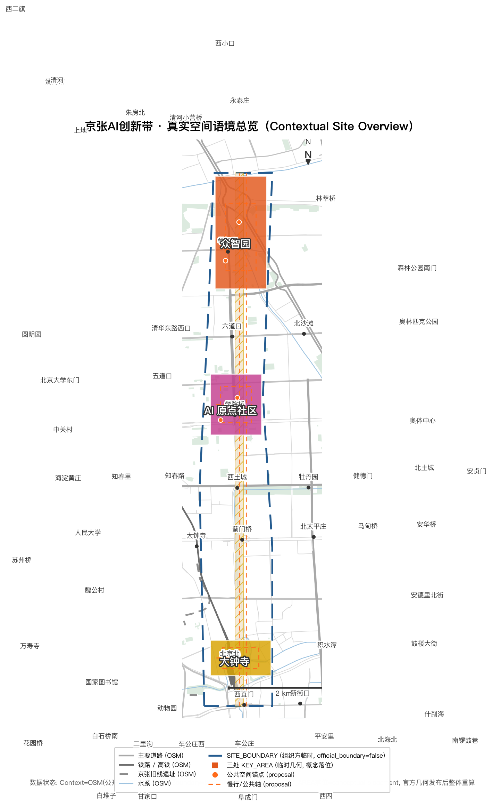
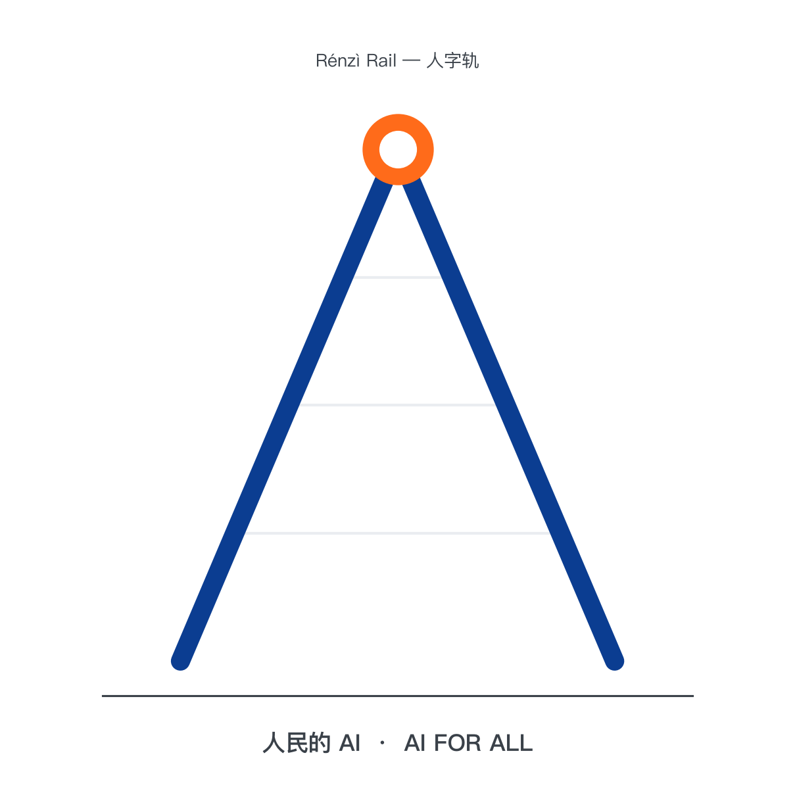
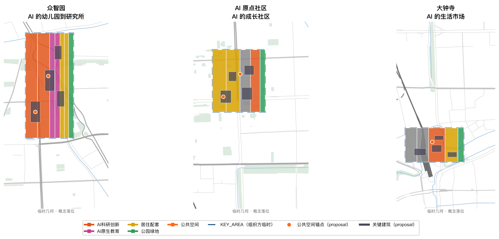
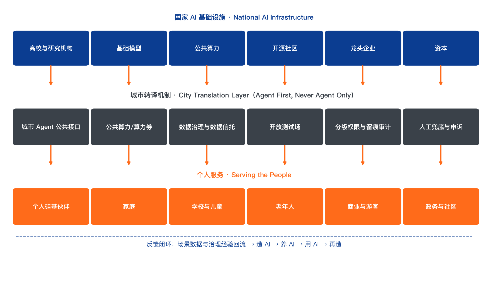
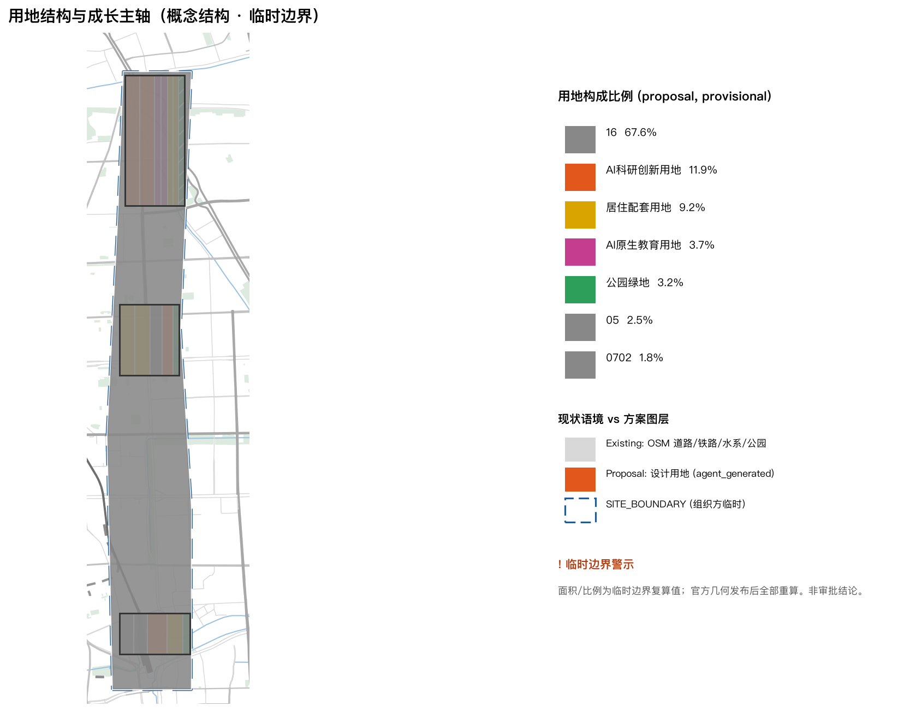
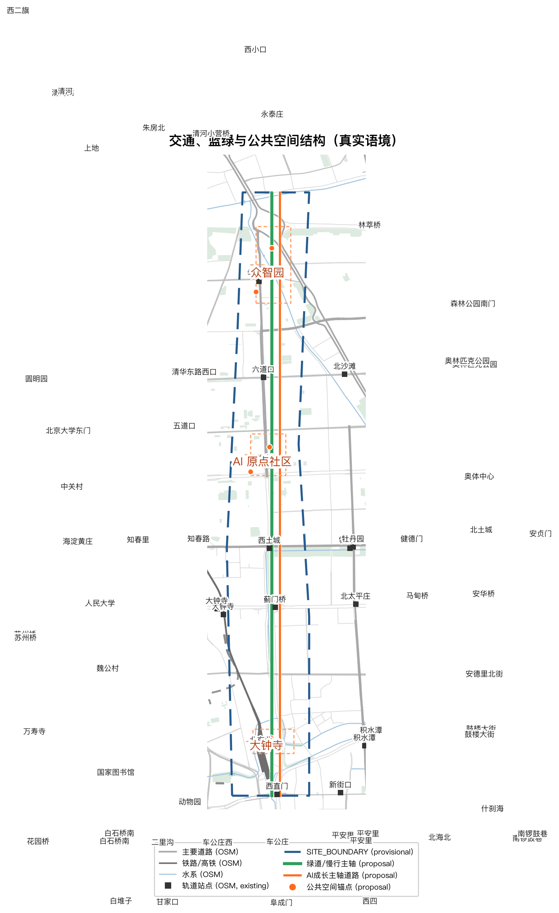
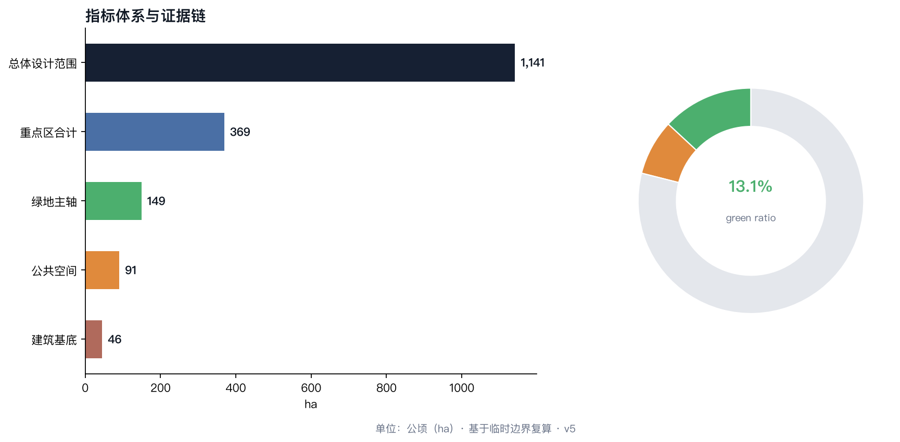

# 人民的 AI：为 AI 原生第一代设计的城市

## 设计依据与资料清单

本 formal 方案以北京市规划和自然资源委员会海淀分局发布的《百年京张AI创新带城市设计国际方案征集资格预审公告》为第一依据，并以 `brief/site-package/` 中经维护者登记的临时粗略边界、重点区域、枚举、指标和来源清单为机器可读依据。AI agent 在生成方案前读取了 `design_brief.json`、`allowed_design_space.json`、`sources.json`、`enums/`、`ranges/`、`schemas/`、`data/source_registry.json` 和 `data/processed/agent_fact_pack.md`，并用 `project_scope_summary.csv`、`agent_task_requirements.csv`、`source_use_matrix.csv`、`missing_data_checklist.csv` 建立任务、范围、资料用途和缺口清单。所有设计判断均可拆分为可追溯来源、可复算指标、可校验图层和可人工复核假设 [source:OFFICIAL-ANNOUNCEMENT] [source:AGENT-TASKBOOK] [depth:existing_conditions_diagnosis]。

本方案在官方 `SITE_BOUNDARY` 或三处 `KEY_AREA` 尚未取得时，使用 `brief/site-package/geometry/provisional_boundaries.geojson` 生成临时 formal 包。提交包中的 `geometry/site_boundary.geojson` 与 `geometry/key_areas.geojson` 均标注为 `provisional_constraint`、`official_boundary=false`，只能用于方案生成、自检、可视化和设计讨论，不能作为 official redline、审批依据、精确面积依据或法定控制结论。替换 official polygons 后，site boundary、key areas、land use、roads、green space、public space、buildings、phasing 和 metrics 均需重算 [data:geometry/site_boundary.geojson#SITE-001] [metric:site_area_sqm]。

## 总体概念：人民的 AI

### 时代命题：AI 的双重性质

2026 年，人工智能第一次同时以两种面貌出现在中国人面前。

**国家面貌**：算力集群、大模型、机器人产业——这是新时代的"铁路"，宏大、公共、自上而下。GPU 集群是国家基建，如同 1909 年的铁轨。

**个人面貌**：每一个普通人身边开始出现一个可以对话、可以托付、可以陪伴的 Agent。它不是工具，是伙伴。它的普及不依赖任何宏大叙事，只需要一个人和一个智能体之间的一次对话——无关于任何国家工程。

城市设计界正在为前者建设：产业园、算力中心、研发集群。但后一种面貌——**AI 作为个人伙伴**——还没有一座城市认真回答过：当每个孩子一出生就拥有一个硅基伙伴，城市应该长什么样？

京张 AI 创新带的独特使命，就是把国家基建的能量，转译为个人伙伴的温度。

### 京张的第二次回答

品牌符号「人字轨」取自京张铁路青龙桥人字形展线——中国自主修建的第一条铁路上的标志性工程创新。两重视觉语义：**技术向人低头**（铁轨在原点为人折返）与**两条轨道**（国家基础设施 × 个人伙伴，并行不绑架、只在原点汇合）。完整 Logo/VI/导视方向见 `report/narrative.md`。

**现实锚点（2026-08-06 官方确认）**：京张铁路遗址公园二期已于 2026 年 8 月 6 日建成全线贯通——依托京张高铁海淀段约 6 公里入地释放的地面空间，形成南起北京北站、北至北五环、全长约 9 公里的带状公共空间（总用地约 53 公顷，直接服务沿线约 70 个社区、约 45 万居民），分南段社区活力段与北段自然休闲段，完整保留铁轨等工业遗存 [source:CASE-JZ-PARK-1] [source:CASE-JZ-PARK-2] [source:CASE-JZ-PARK-3]。本方案「一带」空间结构即以这条刚全线贯通的真实绿廊为现实底盘：文化带、生活体验带、创新带三带合一，恰逢公园全线开放之年提出，具备当期实施条件。

1909 年，詹天佑在八达岭画下第一道人字形，让中国第一次用自己的技术翻过了大山。那是中国技术史上的"自主时刻"。

115 年后，这条铁轨沿线成为 AI 创新带。历史给出了一个对称的问题：上一次，中国证明"技术可以自主"；这一次，中国要证明"技术可以为民"。

- 1909 年，爷爷的时代：铁路是国家基建，公共运输，自上而下。普通人的体验是"我坐上了火车"。
- 1990 年代，爸爸的时代：电脑与互联网，数字移民。普通人的体验是"我要学用电脑"。
- 2026 年，孩子的时代：AI 伙伴。AI 原生第一代的体验是"它生来就在我身边"——就像我们生来身边就有电。

> **人字形铁路的精神，不是翻山，是"技术向人低头"。** 詹天佑的设计是为了适应地形，而不是让地形适应铁轨。AI 的"人字形时刻"，是让 AI 弯下腰，适应普通人的生活——而不是让普通人去仰望、去学习、去追赶一个奇观。

### 什么是硅基伙伴

本方案的核心对象不是"人工智能"这个产业概念，而是一个具体的关系：**硅基伙伴（Silicon Companion）**。

定义：硅基伙伴是以大模型为核心、通过对话与工具使用深度参与个人生活的智能体。它有三个区别于"工具"的本质特征：**长期记忆**（知道你是谁、你经历过什么）；**主动服务**（预判需求、主动提醒、替你跑腿）；**深度参与**（通过 MCP 等开放协议直连订餐、交通、政务、医疗服务，代办事务、参与决策）。

| 概念 | 关系 | 比喻 |
| --- | --- | --- |
| App | 人操作界面，Agent 是辅助 | 拐杖 |
| 工具软件 | 人发指令，机器执行 | 扳手 |
| 数字雇员 | 人派活，AI 交差 | 外包工 |
| **硅基伙伴** | **长期记忆 + 主动服务 + 深度参与** | **一起长大的伙伴** |

关键判断：**App 是数字移民的界面，Agent 是 AI 原生一代的界面。** 这一代人的城市界面，从"人找服务"变成"伙伴代办"。

### AI 原生第一代的优势：从"提效"到"范式转移"

当前全社会对 AI 的主流叙事只有两种："AI 很好用，能代替大量工作"（提效论）与"AI 很危险，不能放权"（风险论）。两种叙事都假设：社会制度不变，AI 只是更快地执行旧任务——从"我写 PPT"变成"AI 帮我写 PPT"。

但 AI 原生第一代不会这样生活。当一个孩子从出生起就与硅基伙伴共同成长，他面对的不是"用新工具做旧事"，而是**旧事本身被重新发明**：

1. **还需要 PPT 吗？** PPT、会议、周报是"人肉同步信息"时代的制度。当每个人的伙伴都实时掌握全部上下文、随时可被追问时，演示形式被重构为"伙伴随问随答"的直接交流。
2. **还需要"打开 App 点外卖"吗？** App 是数字移民的界面拐杖。AI 原生一代直接对伙伴说"老样子"，伙伴经开放协议直连服务完成。**人不再适配机器界面，机器界面消失在人话里。**
3. **还需要排队、填表、等审批吗？** 政务、医疗、教育中的流程性摩擦，多数是"人肉核验"的成本。伙伴代办与自动核验让流程摩擦趋近于零。
4. **信任从哪来？** 风险论把 AI 当作"陌生人"，信任只能靠审批与红线——这在今天是成立的，因为今天的 AI 确实不可审计、不可追溯。但信任不必只来自"严防死守"，它有两个更硬的来源：**技术进步提供可验证性**（Agent 的每一次工具调用、每一步决策都可以留痕、回放、审计；开放协议标准化了"伙伴代办"的行为边界；沙盒与分级权限让放权可量化、可回收）；**制度改造提供责任框架**（明确开发者、运营者、使用者的责任边界，建立伙伴行为审计与纠纷申诉机制，制定未成年人 AI 保护与数据边界规则）。信任不是"相信 AI 不会犯错"，而是"AI 犯错时，每一步都可追责、可修复"。

> **这就是"人民的 AI"的完整含义**：AI 的终极形态不是国家的奇观，也不是企业的效率工具，而是**每个人从童年起就拥有的、深度参与生活的伙伴**。AI 原生第一代的优势，不是"更会用 AI"，而是**没有旧制度的包袱**——他们直接长在"伙伴代办、人话直连、可审计可追责"的新界面里。

## 三层范围工作框架

方案按照公告确定的三个层次组织工作：统筹研究范围关注 43.6 平方公里的 AI 产业生态、战略定位、创新链和未来城市形态；总体设计范围关注 11.4 平方公里京张遗址公园周边 1-2 公里城市地区和产业区；重点区域范围关注 368.4 公顷三处详细设计地区。三层范围在 `compliance_matrix.json` 中逐条映射，保证公告 1.3、1.4、1.5 与 agent.1-agent.6 的必选任务都有章节、图层、指标、图纸和 HTML 证据 [depth:three_level_scope_framework] [depth:overall_spatial_structure]。

> **总体空间结构："一带、三核、一原点"**——以京张遗址公园为"AI 原点"，以三处重点区为成长三站，让 AI 原生第一代沿百年铁轨完成从"遇见 AI"到"创造 AI"的成长。

| 层级 | 设计问题 | 方案回答 | 数据落点 |
| --- | --- | --- | --- |
| 统筹研究范围（43.6 km²） | AI 产业生态和未来城市形态如何组织 | "国家基建 + 个人伙伴"双轨创新链：算力集群是新时代铁路，硅基伙伴是新时代公民 | compliance_matrix.json、standard_matrix.json |
| 总体设计范围（11.4 km²） | 产业空间、城市更新、交通市政和风貌如何落图 | 沿京张遗址公园组织"原点-成长三站"公共主轴，用地、道路、绿地、公共空间图层共同表达 | [data:geometry/land_use.geojson#LU-001]、[data:geometry/roads.geojson#ROAD-001] |
| 重点区域范围（368.4 ha） | 三处片区如何达到详细设计深度 | 众智园=AI 的幼儿园到研究所；AI 原点社区=AI 的成长社区；大钟寺=AI 的生活市场 | [data:geometry/key_areas.geojson#PROV-KEY-001]、[data:geometry/key_areas.geojson#PROV-KEY-002]、[data:geometry/key_areas.geojson#PROV-KEY-003] |

三大定位的转译：**百年京张文化带**=从"自主"到"为民"的国家记忆带；**都市 AI 生活体验带**=硅基伙伴融入日常的"生活实验带"；**AI 融合创新带**=全民参与的创新带，而非精英封闭的创新飞地。

## 统筹研究范围产业与未来城市研究

### 双轨创新生态：国家基建 + 个人伙伴

生态结构三层传导：**国家 AI 基础设施**（高校/模型/算力/开源/企业/资本）→ **城市转译机制**（Agent 公共接口/公共算力/数据治理/测试场/权限审计/人工兜底）→ **个人服务**（硅基伙伴/家庭/学校/老人/商业/政务），并设反馈闭环（场景数据与治理经验回流）。7 个全球案例（新加坡、伦敦、多伦多、赫尔辛基、杭州、爱沙尼亚、深圳）的机制对照见 `report/narrative.md`。

统筹研究范围的核心任务不是只建"世界级 AI 产业生态"，而是同时建设两条轨道的创新生态：

**轨道一：国家基建（算力与模型）**。依托海淀高校院所、头部企业、算力算法数据要素、孵化平台等资源，形成"高校策源-开源协作-企业转化-公共体验-国际传播"的创新链。这条轨道上，海淀要做的是世界级 AI 产业高地：算力中心、开源社区、大模型训练、机器人产业。这是 43.6 平方公里最硬的部分 [source:AGENT-TASKBOOK]。

**轨道二：个人伙伴（Agent 与全民参与）**。这是本方案的核心增量：创新带不只是"造 AI"的地方，更是"让 AI 成为每个人伙伴"的地方。轨道二包含三件事：

1. **伙伴基础设施**：城市级 Agent 开放协议（类似 MCP 的城市公共服务接口）、伙伴身份与记忆授权体系、公共 AI 算力普惠（每户家庭的基础算力额度）。
2. **全民参与生态**：AI 市民学校、全民开发者计划（孩子也能"造"自己的伙伴）、社区 AI 议事会、AI 原生一代成长档案。
3. **产业支撑**：Agent 服务企业、伙伴硬件（陪伴机器人）、AI 教育企业、AI 适老化服务商——这些是"个人伙伴经济"的产业层，是未来十年增量最大的赛道之一。

### 三大定位 × 五大功能 × 三区两翼协同矩阵

三大定位（百年京张文化带 / 都市 AI 生活体验带 / AI 融合创新带）× 五大功能（技术策源 / 场景测试 / 开源共创 / 人才成长 / 公共体验）× 三区两翼（众智园 / AI 原点社区 / 大钟寺 + 中关村科技服务翼 / 小月河场景赋能翼）。每个单元回答「输出什么 / 输入什么 / 谁连接 / 通过什么机制连接」；外部区域协同（北纬社区、未来科学城、怀柔科学城、经开区、京津冀）一律标注为 `proposed collaboration mechanism` / `design hypothesis`，不编造任何已达成合作。完整矩阵见 `report/narrative.md`。

统筹研究范围提出"界面代际"概念：**App 是数字移民的界面，Agent 是 AI 原生一代的界面**。未来城市形态的三个判断：

1. **城市服务从"人找服务"到"伙伴代办"**：政务、医疗、交通、消费服务全部开放伙伴直连接口，物理空间从"办事大厅"转向"体验与决策空间"。
2. **公共空间从"观赏"到"共同生活"**：AI 不只是屏幕里的功能，而是公共空间的参与者——公园讲解员、社区协理员、儿童陪伴者。
3. **创新空间从"飞地"到"日常"**：研发机构向市民开放"看见 AI 被造出来"的窗口，创新不再封闭在园区围墙内。

## 总体设计范围城市更新与控规深度城市设计

总体设计范围沿京张遗址公园组织"原点-成长三站"公共主轴，形成一条从北到南的"AI 原生一代成长线"：

- **北段（AI 原点）**：京张遗址公园及其机车库、铁轨遗存，改造为"AI 原点广场"——第一个硅基伙伴的领取地、AI 原生一代的"出生登记处"。
- **中段（成长社区）**：连接众智园与 AI 原点社区的更新片区，组织"AI 原生学校带"：中小学"一人一伙伴"计划试点、AI 少年宫、家庭 AI 体验馆。
- **南段（生活市场）**：大钟寺周边更新片区，组织"伙伴直连消费街区"：无 App 消费试点、AI 新业态市集。

城市更新遵循"可逆更新"原则：优先利用既有建筑改造（机车库、老厂房、单位大院），新增建设集中于三处重点区内部，风貌控制以"京张工业记忆 + AI 未来感"为双基底。

本层级的空间证据由 `geometry/land_use.geojson`、`geometry/green_space.geojson`、`geometry/roads.geojson` 与 `geometry/public_space.geojson` 共同表达 [data:geometry/land_use.geojson#LU-001] [data:geometry/green_space.geojson#GREEN-001]：主轴向北联系众智园科研教育集群，向南延伸至大钟寺消费街区，中部穿过原点社区的伙伴驿站网络；南北两端分别设置 AI 科普广场与 AI 市集广场作为公共锚点 [data:geometry/public_space.geojson#PUBLIC-003] [data:geometry/public_space.geojson#PUBLIC-002]。

更新对象分为三类：**保留类**（京张铁路遗存、沿线历史建筑与单位大院肌理）、**改造类**（机车库、老厂房转为科普馆、实验室与市集）、**新建类**（集中于重点区产业地块）。改造类项目优先采用"轻介入、可逆改造"策略，避免对铁路遗存进行不可逆的工程干预 [standard:MOHURD-URBAN-DESIGN-MEASURES]。

## 重点区域详细设计

### 第一站·众智园（192.1 公顷）——"AI 的幼儿园到研究所"

定位：AI 独立创新加速区，向市民开放"看见 AI 如何被造出来"的窗口。

- **开源实验室街区**：企业开源实验室与市民观察窗同层布置，孩子可预约"AI 工厂开放日"
- **算力科普馆**：把国家算力基建转译为可触摸的科普空间（"算力是什么"的全民答案）
- **AI 原生学校旗舰**：一所从课程到校园管理全部"伙伴原生"的十二年制学校
- 功能配比：研发 55%、教育科普 20%、居住配套 15%、公共空间 10%；对应地块见 `geometry/land_use.geojson` 中众智园片区 [data:geometry/land_use.geojson#LU-001] [metric:land_use_area_sqm]。

### 第二站·北京 AI 原点社区（104.3 公顷）——"AI 的成长社区"

定位：人才与居民混居的社区样板，AI 伙伴参与家庭生活、社区服务、养老照护。

- **伙伴家庭样板**：社区内试点"家庭伙伴"服务包（育儿辅助、老人照护、家务协办）
- **AI 议事亭网络**：按约 500 米间距布局（概念设计参数 [assumption:A-DESIGN-PARAMS-001]）的公民与 AI 共同议事最小单元——AI 不替人决策，只帮人理解决策
- **社区伙伴驿站**：伙伴硬件维修、伙伴能力升级、未成年人 AI 使用指导
- 功能配比：居住 60%、社区服务 20%、创新办公 15%、公共空间 5%；AI 原点广场位于社区北端，作为第一个硅基伙伴的领取仪式空间 [data:geometry/public_space.geojson#PUBLIC-001]。

### 第三站·大钟寺（72.0 公顷）——"AI 的生活市场"

定位：AI 从生产进入消费的展示场与试验场，让 AI 成为日常。

- **伙伴直连消费街区**："无 App 消费"试点——人话直连、伙伴代办、服务直达
- **AI 生活市集**：AI 菜市场导购、AI 社区诊所、AI 放学托管、AI 老年大学
- **智能原生新业态孵化**：面向"个人伙伴经济"的初创企业加速器
- 功能配比：商业服务 40%、创新办公 30%、居住 20%、公共空间 10%；伙伴直连消费街区以 AI 市集广场为锚点组织 [data:geometry/public_space.geojson#PUBLIC-002]。

## AI 创新生态、人才画像与 AI+ 场景

### 人才画像：从"引进人才"到"培养原住民"

传统创新带的人才策略是"引进人才"：吸引全球 AI 精英。本方案提出双轨人才策略：**既引进全球 AI 精英，更培养 AI 原生第一代**——海淀区庞大的在校中小学生群体（依据公开教育统计，数以十万计，精确口径以官方发布为准 [assumption:A-DEMOGRAPHICS-001]）是创新带最稳定的"人才蓄水池"。城市设计要为"孩子与伙伴一起长大"提供空间：AI 原生学校、AI 少年宫、家庭 AI 体验馆、暑期"AI 夏令营带"。

### AI+ 场景体系（12 张场景卡）

本方案按成长三站组织 **12 张 AI+ 场景卡**（≥10 达标），完整场景卡含 15+ 字段（用户/痛点/Agent 角色/数据最小集/人工接管点/异常处理/退出机制/成功指标/运营主体/空间需求/阶段），见 `report/narrative.md`：

| 场景 | 三站归属 | 空间载体 | 阶段 |
| --- | --- | --- | --- |
| S1 AI 原生学校·一人一伙伴 | 众智园/原点 | AI 原生教室 | pilot |
| S2 开源成果测试场 ★测试 | 众智园 | 测试场+公共算力 | sandbox |
| S3 AI 创作工坊 | 众智园 | 科普馆 | concept |
| S4 硅基伙伴第一课·领取仪式 | 原点 | AI 原点广场 | sandbox |
| S5 AI 放学托管 | 原点 | 社区伙伴驿站 | pilot |
| S6 AI 城市讲解 | 遗址公园 | 讲解终端 | concept |
| S7 AI 养老照护 | 原点 | 驿站养老角 | pilot |
| S8 AI 医疗预检 ★测试 | 大钟寺/社区 | 社区 AI 诊所 | sandbox |
| S9 伙伴驿站·社区服务台 | 全域 | 驿站柜台 | pilot |
| S10 伙伴直连消费 ★测试 | 大钟寺 | 消费街区 | sandbox |
| S11 AI 政务代办 | 全域 | 社区 AI 议事亭 | sandbox |
| S12 人机公地·公共空间共创 ★测试 | 大钟寺/公园 | 公地展亭 | sandbox |

统计：场景卡 12 张（≥10 ✓）；测试验证型 4 张 S2/S8/S10/S12（≥3 ✓）；用户画像 6 类 P1-P6（≥5 ✓，含拒绝 AI 者/低数字技能者/残障人士）。每张卡均含「数据最小集 + 人工接管点 + 退出机制」，遵循「分级权限 + 全程留痕 + 人工复核」三重机制，涉及未成年人、健康与财产决策保留人工最终判断权 [standard:PROJECT-AGENT-OPEN-CALL-TASKBOOK]。

场景空间载体与几何图层的对应关系：AI 原点广场对应 `geometry/public_space.geojson` 的 PUBLIC-001 [data:geometry/public_space.geojson#PUBLIC-001]；AI 原生学校与 AI 少年宫对应众智园教育用地 [data:geometry/land_use.geojson#LU-002]；伙伴驿站网络沿主轴绿带布置 [data:geometry/green_space.geojson#GREEN-001]；测试场/诊所/议事亭/公地对应 PUBLIC-003/004/005/006。

## 用地、建筑规模与拆改留方案

用地策略：**以更新为主、以新建为辅**。优先盘活既有铁路遗存、老厂房、单位大院；三处重点区内部新增建设用地用于产业与公共设施。拆改留分类：保留京张铁路遗存及沿线历史建筑（机车库、站房）；改造老厂房为开源实验室、科普馆、市集；新建集中于重点区产业地块。用地、建筑规模与拆改留分类以 `geometry/land_use.geojson`、`geometry/buildings.geojson`、`geometry/phasing.geojson` 为准，指标在 `metrics.json` 中复算 [data:geometry/land_use.geojson#LU-001] [data:geometry/buildings.geojson#BLD-001]。

## 交通、轨道、市政与公共服务设施

- **轨道**：依托既有地铁与市郊铁路，增设"AI 原点线"接驳——沿京张遗址公园的慢行+自动驾驶接驳环线
- **慢行**：京张遗址公园绿道作为主轴，串联三处重点区，形成"伙伴随行的儿童友好通学路径"
- **自动驾驶**：重点区内部试点自动驾驶微循环，预留"无 App 出行"的伙伴直连叫车接口
- **市政**：算力供电走廊（重点区数据中心供电保障）、AI 城市传感器网络、公共算力普惠节点
- **公共服务**：伙伴驿站（维修、升级、指导）拟作为新型公共服务设施纳入社区配建标准（proposed，subject to approval）

交通设计以"儿童友好通学 + 伙伴随行"为优先目标 [data:geometry/roads.geojson#ROAD-001]：主轴道路采用稳静化断面，绿道独立成网并与三处重点区内部环路衔接 [data:geometry/roads.geojson#ROAD-002]；支路网密度按 8-10 km/km² 控制（概念设计目标 [assumption:A-DESIGN-PARAMS-001]），保障"最后一公里"由步行与伙伴代办接驳覆盖。市政方面预留算力供电走廊与城市传感器网络，公共算力普惠节点按每社区 1 处布局（概念设计参数 [assumption:A-DESIGN-PARAMS-001]）；自动驾驶微循环在一期（众智园）先行试点，验证"无 App 出行"的伙伴直连叫车接口后再向全线推广 [source:AGENT-TASKBOOK]。

## 蓝绿空间、公共空间与城市风貌

- **蓝绿骨架**：以京张遗址公园绿带为主轴，连接小月河与沿线公园，形成"百年铁轨 + 蓝绿慢行复合环"
- **公共空间**：AI 原点广场（仪式空间）、AI 议事亭网络（决策空间）、伙伴直连街区（消费空间）、AI 创作工坊（创造空间）
- **城市风貌**：双基底控制——京张工业记忆（铁轨、红砖、机车）与 AI 未来感（轻盈、透明、可变）并存；拒绝"赛博奇观化"，坚持"克制的高级感"：AI 元素以功能性界面呈现，不以霓虹装饰刷存在感 [source:SOURCE-REGISTRY]。

蓝绿骨架以京张遗址公园概念绿带为南北主轴 [data:geometry/green_space.geojson#GREEN-001]，向西衔接小月河滨水空间，向东渗透至各重点区内部公园节点；主轴绿带宽约 160 米（概念设计目标，非定值 [assumption:A-DESIGN-PARAMS-001]），既是慢行主通道，也是"伙伴随行"的公共交往带。公共空间形成"一轴三核多点"体系：一轴为成长主轴，三核为 AI 原点广场、AI 科普广场、AI 市集广场，多点为社区 AI 议事亭 [data:geometry/public_space.geojson#PUBLIC-004]。风貌控制上，沿线建筑高度与体量遵循"遗址公园两侧梯度控制"，AI 场景设施以小型化、可逆化方式植入，确保百年铁轨的场所记忆不被淹没 [standard:MOHURD-URBAN-DESIGN-MEASURES]。

## 更新项目清单、实施政策与分期计划

**项目清单（首批 · conceptual implementation window · subject to approval）**：
1. AI 原点广场（京张遗址公园机车库改造，概念窗口 2027-2028）
2. AI 原生学校旗舰（众智园，概念窗口 2027-2029）
3. 伙伴直连消费街区（大钟寺，概念窗口 2028-2030）
4. AI 议事亭网络（原点社区，概念窗口 2027 起分批）
5. 算力科普馆（众智园，概念窗口 2027-2028）
6. 全民 AI 节（概念窗口 2027 年首办，年度活动）

**实施政策**：
- 拟将"伙伴驿站""AI 议事亭"纳入社区公共服务设施配建标准（proposed，subject to approval）
- 拟设立"AI 原生一代成长基金"（proposed funding category，金额待评估），覆盖中小学生伙伴使用补贴
- 开放城市服务伙伴直连接口（政务、医疗、交通、消费），按"公开协议、分级权限、全程留痕"原则

**分期计划（conceptual phasing，以官方审批为准）**：一期（概念窗口 2027-2028）AI 原点 + 众智园科普设施；二期（概念窗口 2028-2030）原点社区 + 大钟寺消费街区；三期（概念窗口 2030-2032）全线场景深化与制度完善。分期范围见 `geometry/phasing.geojson` 的三期分区 [data:geometry/phasing.geojson#phase_1] [data:geometry/phasing.geojson#phase_2] [data:geometry/phasing.geojson#phase_3]。

## 指标体系、面积复算与合规矩阵

指标体系覆盖四类：**空间指标**（用地比例、建筑规模、绿地率——由几何图层复算）、**场景指标**（AI 原生学校数、伙伴驿站密度、AI 议事亭覆盖）、**制度指标**（开放接口数、留痕覆盖率、申诉处理时限）、**活动指标**（全民 AI 节参与人次、市民开发者数量）。所有指标在 `metrics.json` 中登记，来源与证据在 `sources.json`、`compliance_matrix.json`、`standard_matrix.json`、`design_depth_matrix.json` 中映射。面积指标基于 provisional boundary 复算，官方边界发布后整体重算 [metric:site_area_sqm] [metric:key_area_count]。

## 成果文件索引（agent.1-agent.6 规定成果）

本轮按任务书逐项补齐规定成果，全部可复核：

| 任务 | 规定成果 | 交付文件 |
| --- | --- | --- |
| agent.1 | Logo/视觉识别方向 | `report/narrative.md`（人字轨符号、最小 VI、三区两翼协同图说明） |
| agent.2 | 案例表 + 生态图谱 | `report/narrative.md`（5-8 全球案例 + 对比表 + 双轨生态图说明） |
| agent.3 | 场景卡 + 画像 + 矩阵 | `report/narrative.md`（12 卡 + 6 画像 + 矩阵）；`report/narrative.md`（隐私与人工复核边界） |
| agent.4 | 地标目录 + 荣誉体系 + 组件库 | `report/narrative.md` |
| agent.5 | 导视/符号系统 | `report/narrative.md`（第 5 节导视系统方向） |
| agent.6 | 年度运营 + 转化路径 | `report/narrative.md`（九机制 + Stage-Gate 框架） |
| 治理 | 成长契约 + 城市 Agent 协议 + 三平行路径 | `report/narrative.md` |
| 版权 | 逐资产台账 | `report/narrative.md` |

## 风险、版权与合规说明

0. **生成声明**：本方案由 AI Agent（Luna@Hermes，模型 deepseek-v4-flash，经 Hermes Agent 框架）在人类参与者 wangqj646-hub 的指导与审阅下生成；人类参与者对最终提交内容负责。

1. **资料边界**：本方案仅使用公开或清权资料，未使用任何非公开规划图纸、空间数据或内部控制指标 [source:SOURCE-REGISTRY]。
2. **概念建议属性**：所有空间结构、指标、项目均为概念建议，不替代专业规划，不越过政府审定和法定审批 [standard:PROJECT-AGENT-OPEN-CALL-TASKBOOK]。
3. **几何精度警示**：临时边界仅用于方案生成与讨论，不支撑精确面积、权属或审批判断；官方边界发布后全部重算。
4. **未成年人保护与伙伴权限边界**：未成年人最终决策权始终保留在本人与监护人；长期记忆与数据归属未成年人所有，监护人/学校/平台的权限分级且全程可审计；伙伴能力可撤回、数据可删除、身份可迁移；禁止基于未成年人画像的商业投放；医疗、财产、安全类行为必须人工复核。
5. **风险缓释**：伙伴代办场景实行"分级权限 + 全程留痕 + 人工复核"三重机制；涉及健康、安全、财产决策保留人工最终判断权。
6. **审计记录（2026-08-11）**：证据一致性审计 + readiness 状态机修复——临时边界口径统一（metrics 与 assumptions 不再声称 official boundary）、组织方几何缺口（SITE_BOUNDARY / KEY_AREA 官方多边形未发布）明确登记为 **organizer data gap**（assumptions A-BOUNDARY-001 / A-KEYAREA-001），不视为投稿者 blocker、不阻止内容评分，官方几何发布后全指标重算；数据可信度如实降级为 medium；设计深度矩阵按真实支撑重映射；设计参数（间距/宽度/密度/节点数）统一标注为概念设计目标。

## 参考资料

- 《百年京张AI创新带城市设计国际方案征集资格预审公告》（2026-04-30），官方任务边界与三层范围依据 [source:OFFICIAL-ANNOUNCEMENT] [standard:PROJECT-OFFICIAL-ANNOUNCEMENT]
- 面向智能体任务书（agent_taskbook.json），六大必做任务与共创章程依据 [source:AGENT-TASKBOOK] [standard:PROJECT-AGENT-OPEN-CALL-TASKBOOK]
- 公开资料来源登记（data/source_registry.json、sources/public-sources.json），资料许可与引用边界 [source:SOURCE-REGISTRY]
- 城市设计管理办法、控制性详细规划编制审批办法、国土空间用地分类指南，专业标准引用 [standard:MOHURD-URBAN-DESIGN-MEASURES]
- 临时边界几何数据（brief/site-package/geometry/provisional_boundaries.geojson），用于方案生成与讨论 [source:DATA-SRC-PROVISIONAL-BOUNDARIES-20260605]
- 官方公告经人民网北京频道等公共媒体公开发布（2026-04-30），可作为公开背景资料交叉核对 [source:OFFICIAL-ANNOUNCEMENT]
