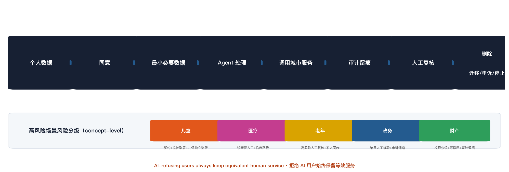

# Formal Narrative

This narrative bundles the agent.1-agent.6 required deliverables (brand/VI, case studies, scenario cards, governance contract, landmarks/components, operations system) and the per-asset copyright inventory. Each section is a standalone deliverable, cross-checked against compliance_matrix.json and design_depth_matrix.json.


---

# 品牌与视觉识别方向：人字轨（Rénzì Rail）

> 对应 agent.1 required output：`logo_or_visual_identity_direction` + `overall_structure_diagram`
> 状态：conceptual design direction（品牌方向，非最终交付物；供专业品牌团队深化）

## 1. 品牌命题

一带的主名称：**人民的 AI：为 AI 原生第一代设计的城市**
英文名称：**AI FOR ALL — A City Designed for the First AI-Native Generation**
子品牌命名体系（成长三站）：

| 站 | 中文 | 英文 | 品牌角色 |
|---|---|---|---|
| 第一站 | 众智园 · AI 被创造 | Zhongzhiyuan · Where AI Is Made | 全栈自主创新 + AI 治理话语权 |
| 第二站 | 原点社区 · 人与 AI 一起成长 | Origin · Growing Up Together | 世界级 AI 创新生态 + 硅基伙伴 |
| 第三站 | 大钟寺 · AI 进入日常 | Dazhongsi · AI Enters Daily Life | 智能原生新业态 + 公共生活 |

## 2. 核心符号：人字轨

**符号原型：京张铁路青龙桥人字形展线**——中国自主修建的第一条铁路上的标志性工程创新：火车以「人」字折返换向，翻越八达岭。它是「技术自主」在空间上的第一次中国表达。

**三重视觉语义：**

1. **技术向人低头**：人字形的两条斜线是两条铁轨，它们的交汇点不是「工程死点」而是「人的原点」——铁轨在此为人的需求折返。铁路不再笔直压向大地，而是弯下腰问人：你要去哪里。
2. **两条轨道**：一条是**国家基础设施**（算力、模型、开源、测试场），一条是**个人伙伴**（硅基伙伴、家庭、学校、街区）。两条轨道并行、等高、共同延伸——不交叉绑架，只在「原点」汇合。
3. **人字的两个人**：一撇一捺互相支撑才能立住。国家 × 个人、技术 × 人文、铁路 × AI——京张的第二次回答，仍是互相支撑。

**反俗套声明**：不使用芯片 + 脑袋 + 铁轨 + AI 字母的元素拼贴；符号来自工程史实而非科技装饰。

## 3. 图形规范（概念级）

- **主图形**：两条等宽斜线呈 58°–62° 夹角（呼应人字形展线的实际折返角），顶部交汇；交汇点放大为一个正圆节点「原点光点」（Origin Dot）。
- **正负形**：负形（两条轨道之间的夹角）隐含一个「人」字轮廓——远看是人，近看是轨。
- **动势**：人字形天然具有「折返/换向/汇合」的方向语义，可做静态图或 4 帧折返动图（换向瞬间）。
- **原点光点**可独立作为辅助图形（AI 原点社区的独立标志：一个点 + 半个人字弧）。

## 4. 最小 VI 系统

| 要素 | 定义 |
|---|---|
| 主色 | **京张蓝** `#0B3D91`（铁路工业蓝 × 科技蓝，稳重、公共、可信） |
| 辅色 | **硅基橙** `#FF6B1A`（人的温度、伙伴的提醒色、警示中的暖色） |
| 中性色 | 冷灰 `#3A4149` / 浅灰 `#E8EBF0` / 白 |
| 比例 | 蓝 70% / 橙 15% / 灰白 15%——高饱和单色打底，橙只做「人」的点睛 |
| 标准字 | 中文：思源黑体 Bold（或等宽黑体）；英文：Inter / Archivo（无衬线工业感） |
| 辅助图形 | 原点光点、人字轨的 15° 旋转延展（导视箭头基础形） |
| 印刷 | 蓝底白字 + 橙点；白底蓝字 + 橙点；禁止彩虹渐变与拟物材质 |

**色彩语义**：冷蓝是「国家基建」的公共色，暖橙是「个人伙伴」的陪伴色——冷暖反差即方案的叙事反差（克制的视觉，深刻的温度）。

## 5. 导视系统方向（agent.5 衔接）

人字轨的「折返」语义天然是**分叉与汇合**的指示系统：

- **分叉箭头**（一撇）：通往国家设施（算力中心/测试场/科研院所）
- **汇合箭头**（一捺）：通往个人场景（伙伴驿站/学校/社区）
- **原点节点**（光点）：汇合处 = 服务台/换乘点/仪式空间
- 沿京张铁路遗址带每 500 米设一组「人字导视牌」：左侧历史刻度（1909→2026→未来），右侧 AI 服务目录——**一条路上，两种时间**。

## 6. 三区两翼协同回路（总体结构图说明）

```
         ┌──────────────── 一带：京张铁路遗址带（时间轴 + 主脊）────────────────┐
         │                                                                       │
  众智园AI自主创新加速区            AI原点社区                大钟寺AI产业集聚区
  「AI 被创造与验证」               「人与 AI 一起成长」        「AI 进入日常」
  ── 全栈创新 + 治理话语权          ── 生态 + 硅基伙伴         ── 智能原生新业态
         ▲                                 ▲                        ▲
         │         要素流：人才/算力/数据/资本/场景                │
         └────────────────────────────────────────────────────────┘
         ▲                          ▲                              ▲
         │     中关村科技服务翼      │      小月河场景赋能翼        │
         │   （IP/资本/全球化配置）  │     （场景/活力/公共体验）    │
         └──────────────────────────┴──────────────────────────────┘
```

- **主回路（纵向）**：众智园「造 AI」→ 原点社区「养 AI」→ 大钟寺「用 AI」；成果经大钟寺场景验证后回流众智园迭代——**造→养→用→再造**闭环。
- **支撑翼（横向）**：中关村科技服务翼提供 IP、资本与全球化要素配置；小月河场景赋能翼提供真实场景、公共体验与城市活力——两翼分别解决「要素从哪来」和「场景在哪测」。
- **协同回路**：三区产出 → 两翼配置/赋能 → 反馈回三区。回路在 `compliance_matrix.json` 与 `design_depth_matrix.json` 中登记。

## 7. 品牌 IP 延展（agent.6 衔接）

- **吉祥符号**：原点光点拟人化「小原点」（Origin Dot）——克制、不卖萌，作为儿童 AI 原生计划的陪伴符号。
- **品牌资产**：人字轨图形 + 双轨色板 + 导视组件库（Agent kiosk / audit terminal / 议事亭 / 伙伴驿站 / 无障碍人工服务点）统一视觉识别。
- **传播句式**：统一使用「人民的 AI」「AI FOR ALL」「铁轨向人低头」三个可注册的短语资产。

---

# 全球 AI 创新生态 / 城市级 AI 案例研究

**用途**：为北京海淀「百年京张AI创新带」开源方案《人民的 AI：为 AI 原生第一代设计的城市》提供国际参照
**范围**：7 个代表性案例，覆盖国家战略、城市更新、数据治理、公共基础设施、产业政策五类模式
**方法**：所有事实均经联网检索并以官方/机构/一手来源核验（官网、政府公告、学术论文、机构报告），每条案例附来源 URL；不采信二手自媒体数据

---

## 案例一：新加坡 Smart Nation / 国家 AI 战略（NAIS）

### 1. 名称、地点、年份
**新加坡 Smart Nation**（国家，城市-国家一体）。2014 年 11 月 24 日由时任总理李显龙正式启动；2019 年发布首份《国家人工智能战略》（NAIS 2019）；2023 年 12 月 4 日发布 NAIS 2.0；2024 年进一步推出「Smart Nation 2.0」升级框架。

### 2. 解决的痛点
新加坡作为无腹地、少资源的城邦国家，痛点是：**国家竞争力完全依赖人力资源与效率**，而人口老龄化、劳动力短缺、产业升级压力迫使它把 AI 视为「生存级」国家能力。同时作为国际金融与数据中心枢纽，它需要在「AI 竞赛」与「AI 信任」之间取得平衡，避免因治理缺位失去国际资本与人才信任。

### 3. 机制
- **国家战略统筹**：NAIS 2019 提出五大国家 AI 项目（医疗、教育、物流、安全、智慧城市），NAIS 2.0 提出「AI for Public Good，for Singapore and the World」，从「项目制」转向「系统制」（三大系统 + 十大使能 + 十五项行动）。
- **公共 AI 基础设施**：2017 年 5 月由国家研究基金会（NRF）出资至多 1.5 亿新元、五年期设立国家级项目 **AI Singapore**，统一协调研究、产业与人才。
- **治理工具箱**：2022 年 5 月由 IMDA 与 PDPC 发布 **AI Verify**——号称全球首个 AI 治理测试框架与工具包，按 11 项原则评估 AI 系统，后开源并由 AI Verify 基金会（AIVF）维护，走「测试+认证」而非「立法禁止」路线。

### 4. 空间如何支持
城市尺度：无独立「AI 园区」，而是把 AI 能力嵌入全国城市空间——智慧国传感网络（Smart Nation Sensor Platform）、统一数字身份 Singpass、全国支付体系 PayNow 等构成「城市即平台」。物理空间上以纬壹科技城（one-north）等既有园区承载 AI Singapore 与初创生态。

### 5. 运营与可持续
政府主导：总理公署直属智慧国及数码政府工作团（SNDGO）统筹，各部门执行；资金以财政拨款 + 国家研究基金会长期投入为主，叠加企业合作与全球人才引进（Tech.Pass）。持续 10 年以上的国家战略滚动更新（2014→2019→2023→2024）是其可持续的核心机制。

### 6. 对海淀的借鉴
**「国家 AI 基础设施 → 城市公共接口」的传导机制**：NAIS 2.0 明确把国家 AI 能力下沉为公共服务（医疗、教育、政务），与「人民的 AI」双轨生态中「国家基础设施 → 公共接口」高度同构。海淀可借鉴其「国家级实验室/算力 + 城市级公共应用 + 开源治理工具」的三明治结构，以及用**可测试、可认证的治理工具**（AI Verify 模式）代替一刀切禁令的治理思路。

### 7. 不能照搬之处
新加坡是 600 万人口的城邦国家，**政府-社会边界小、单一行政层级**，可以「一张白纸」推行全国性数字身份与统一数据框架；中国城市处于央地多层级体制中，数据权属、跨部门协调复杂度高一个量级。其「全国统一数字身份」模式在中国需按现行法律与行政体系另行设计，无法平移。

**来源**：
- 新加坡政府 Smart Nation 官网（愿景页）：https://www.smartnation.gov.sg/about/our-vision/smart-nation-vision/
- 总理公署 2014 年启动演讲：https://www.pmo.gov.sg/newsroom/transcript-prime-minister-lee-hsien-loongs-speech-smart-nation-launch-24-november/
- NAIS 2.0 官方发布（MDDI）：https://www.mddi.gov.sg/newsroom/04122023/
- AI Singapore 官方启动公告（NRF）：https://www.mddi.gov.sg/newsroom/aisg-new-national-programme-to-catalyse-synergise-and-boost-singapore-s-artificial-intelligence-capabilities/
- IMDA「A.I. Verify」发布稿：https://www.imda.gov.sg/resources/press-releases-factsheets-and-speeches/press-releases/2022/sg-launches-worlds-first-ai-testing-framework-and-toolkit-to-promote-transparency

---

## 案例二：伦敦 King's Cross Central + Here East（铁路/奥运遗产 → AI 与创新城区）

### 1. 名称、地点、年份
**King's Cross Central**：伦敦国王十字火车站以北约 67 英亩（约 27 公顷）旧铁路用地改造项目。2001 年开发商 Argent 获选为开发伙伴（King's Cross Central Limited Partnership），2006 年总体规划获批；2011 年 9 月伦敦艺术大学中央圣马丁学院（CSM）迁入改造后的谷仓大楼（Granary Building），2013 年谷歌宣布在此建英国总部。
**Here East**：伦敦女王伊丽莎白奥林匹克公园内，前 2012 奥运会主新闻中心/国际广播中心（MPC/IBC）改造的科技创新园区，2016 年 10 月正式开放，建筑面积 120 万平方英尺（约 11.1 万 m²）。

### 2. 解决的痛点
- King's Cross：铁路时代结束后大片棕地闲置数十年、割裂社区与车站腹地，是典型的**后工业铁路遗产衰败区**——与京张铁路沿线用地问题同构。
- Here East：奥运会后大型赛事设施面临「白象化」（赛后闲置）风险，需要为巨构空间找到可持续新用途，并拉动东伦敦经济转型。

### 3. 机制
- **锚点机构先行**：King's Cross 以大学（CSM）作为第一锚点带动人气与创意浓度，再引入谷歌等科技总部形成「创意—科技」混合生态；Here East 以 UCL（巴特莱特建筑学院 + 工程学院，含机器人/原型实验室）、拉夫堡大学伦敦校区等 5 所大学 + V&A 东馆等文化机构构成「大学+文化」锚点群。
- **混合功能与「不寻常组合」**：园区刻意让大企业（福特移动出行等）、初创（Plexal 创新中心）、艺术机构（Wayne McGregor 工作室）同楼办公，制造跨界碰撞。
- **空间供给侧创新**：利用奥运媒体中心的 10 米层高仓库、重型楼板、强电力和连通性，提供「可制造、可实验」的大尺度空间，而非普通写字楼。

### 4. 空间如何支持
两者都是**棕地/赛事遗产的物理再利用**：King's Cross 是 20 年期的站区综合更新（办公、住宅、文化、公共空间一体化）；Here East 是单体巨构改造为创新园区。公共空间（运河、广场、花园）与交通枢纽（King's Cross/St Pancras 欧洲之星）构成空间支撑。

### 5. 运营与可持续
King's Cross 由 Argent 牵头的私人合资公司长期开发运营（KXCLP），英国政府 2016 年出售其投资股份，实现**公共资产市场化退出**；Here East 由房地产投资公司 Delancey 拥有并运营，靠租金 + 空间服务现金流维持（2025 年获得 2 亿英镑再融资），模式本质是**「公共遗产 + 私人资本运营」的房地产模型**。

### 6. 对海淀的借鉴
- **铁路遗产改造路径直接可比**：京张铁路是中国第一条自主干线铁路，百年遗产的「文化叙事 → 锚点机构 → 科技产业」改造链条与 King's Cross 高度相似；海淀可借鉴「以大学（清华、北航等）为第一锚点 + 让渡旗舰空间给头部 AI 机构」的启动顺序。
- **「大型设施赛后/废后再生」**：Here East 证明巨构工业空间（如京张铁路厂房、货场）改造为「可制造、可实验」的 AI 中试/算力/原型空间，比新建园区更有辨识度与成本优势。

### 7. 不能照搬之处
King's Cross 依赖英国**土地私有 + 长期租赁 + 单一开发商数十年持有**的制度安排，政府仅做规划框架与公共土地入股；中国土地国有、出让年期、规划管控体系完全不同，Argent 式的「一家私企持有运营 20 年」不可复制，须以国企平台 + 市场化运营公司组合替代。Here East 的纯商业租金模式在中国公益性 AI 公共设施上难以直接套用，需政府补贴与公共使命条款兜底。

**来源**：
- Here East 官网（About/历史沿革）：https://hereeast.com/about/
- Delancey 官网（Here East 项目）：https://delancey.com/portfolio/here-east/
- King's Cross 官方（开发历程）：https://www.kingscross.co.uk/about-the-development
- ULI 城市更新案例库（King's Cross）：https://urbanplan.uli.org/resources/overview/project-snapshots/kings-cross/
- Centre for Cities 分析（King's Cross 更新经验）：https://www.centreforcities.org/reader/making-places/learning-from-kings-cross-regeneration/

---

## 案例三：多伦多 Sidewalk Labs Quayside（城市 AI 试验场失败教训）

### 1. 名称、地点、年份
**Sidewalk Toronto / Quayside**，加拿大多伦多滨水区。2017 年 10 月，Alphabet 旗下 Sidewalk Labs 在公共机构 Waterfront Toronto 的公开招标（RFP）中胜出，成为 Quayside（约 12 英亩/4.9 公顷）智慧社区「创新与出资伙伴」；**2020 年 5 月 7 日 Alphabet 宣布终止项目**，规划与建设全部停止。

### 2. 解决的痛点
设想解决的是「从零建设一个以数据驱动、可持续、可负担的智能社区」——包括模块化木构建筑、无车街道、地下物流机器人等城市技术试验。但实际暴露并放大的核心痛点是：**公共空间数据主权与私人资本算法控制权之间的冲突**，以及公私合作中民主监督缺位的问题。

### 3. 机制（及其失败）
- **公私合作（PPP）试验场**：公共土地 + 私人科技资本 + 城市技术试验权，本应是「城市测试场」模式的样本。
- **数据治理方案被否**：Sidewalk 提出的「城市数据信托」（Urban Data Trust）构想，因权责不清、与既有隐私法律（PIPEDA 等）衔接失败、问责机制缺失而被公众与学界否决；其数据采集、传感器部署范围也被质疑超出 12 英亩边界。
- **结局机制**：Waterfront Toronto 坚持公共机构掌握数据决策权，Sidewalk 被迫让步后，项目最终以「疫情导致房地产经济不确定性、财务不可行」为由取消——但大量复盘研究（含 Surveillance & Society 期刊论文）指出深层原因是治理信任崩塌与公众参与不足。

### 4. 空间如何支持
滨水棕地本具备理想试验场条件，但项目始终停留在规划与原型层面，没有进入实体空间建设——**空间支持前提是治理合法性，治理失败则空间归零**。这是本案例对「测试场」叙事最重要的反证。

### 5. 运营与可持续
运营主体本应是 Waterfront Toronto（公共机构）与 Sidewalk Labs（私人）的合资模式；取消后 Waterfront Toronto 收回土地继续独立推进开发。教训：**当公共机构让渡过多治理权给私人主体时，项目可持续性从第一天起就是负债**。

### 6. 对海淀的借鉴
- **「城市 AI 测试场」必须公共主导**：海淀若在创新带内设 AI 场景试验区（自动驾驶、具身智能、城市治理 AI），应坚持「公共数据主权归公共机构、算法决策可审计、居民知情参与」三条底线——Sidewalk 的失败证明这三条不可交易。
- **负面清单式治理设计**：先界定私人主体「绝不能碰」的数据与决策领域，再谈开放；把「数据信托」式复杂机制换成清晰、可执行的公共规则，反而更可持续。

### 7. 不能照搬之处
反面案例无需照搬，但要指出其背景差异：加拿大有强隐私法律传统与高密度公民社会组织、Waterfront Toronto 具有法定独立权力，公众能实质否决项目；中国语境下公共数据与算法治理框架不同（数据安全法、个人信息保护法体系），「公众否决」机制不能简单复制，但「治理先行、数据主权归公」的原则可以本地化为合规前置审查。

**来源**：
- Sidewalk Labs 官方退出声明（2020-05-07）：https://medium.com/sidewalk-talk/why-were-no-longer-pursuing-the-quayside-project-and-what-s-next-for-sidewalk-labs-9a61de3fee3a
- Waterfront Toronto 官方声明（2020-05-07）：https://www.waterfrontoronto.ca/news/statement-waterfront-toronto-board-chair-stephen-diamond-0
- 合作启动报道（2017-10）：https://www.smartcitiesdive.com/news/toronto-officially-announces-sidewalk-labs-as-smart-city-partner/506975/
- 学术论文《Data Trusts and the Governance of Smart Environments》：《Surveillance & Society》：https://ojs.library.queensu.ca/index.php/surveillance-and-society/article/view/14409

---

## 案例四：赫尔辛基 AI Register（城市 AI 透明度治理）

### 1. 名称、地点、年份
**赫尔辛基市 AI 注册表（AI Register）**，芬兰赫尔辛基。**2020 年 9 月 28 日**在 Next Generation Internet 峰会上与荷兰阿姆斯特丹同日上线，为**全球首批城市级公开 AI 注册表**；此后持续运营并扩充条目。

### 2. 解决的痛点
公共部门悄悄部署 AI/算法系统引发的**信任赤字**：市民不知道市政府在哪些环节用 AI、用什么数据、谁负责。赫尔辛基用最低成本工具（公开网页目录）回应「公共 AI 的可解释性、问责与公民参与」问题。

### 3. 机制
- **强制可见性**：市政府把在用 AI 系统逐条登记，公开披露：用途、使用数据、算法逻辑、责任部门、风险评估、人工监督安排、供应商信息。
- **公民反馈通道**：每个条目可反馈、可质疑，把透明度转化为参与。
- **治理嵌入采购**：登记义务随系统采购与上线流程执行，而非事后补录（白皮书配套发布）。
- 条目覆盖政务服务机器人（停车、图书馆、社保咨询聊天机器人）、图书馆 RFID 智能物料管理系统等真实在用系统——**不粉饰、小切口、可核验**。

### 4. 空间如何支持
基本不依赖物理空间：是一个**纯数字公共接口**，托管于市政府域名 ai.hel.fi。这证明「AI 治理公共接口」可以零园区成本起步——对海淀的启示是治理层不必等物理载体。

### 5. 运营与可持续
由赫尔辛基市（数据部门 + 各部门 AI 责任岗）运营，财政内嵌，无额外商业模式；成本极低（网页 + 维护流程），因此可持续性强。后被 OECD.AI 政策库收录为参考实践，被多国城市效仿。

### 6. 对海淀的借鉴
「人民的 AI」方案中的**公共接口/数据治理支柱**可直接对标：在创新带内设「海淀公共 AI 应用注册表」，把区内政府与公共机构在用的 AI 系统（政务、教育、交通、养老场景）公开登记，作为城市级 AI 治理名片。成本低、信任收益高、可核验，且与「AI 原生第一代」的透明叙事契合。

### 7. 不能照搬之处
赫尔辛基的高信任度建立在北欧小规模社会 + GDPR 全面隐私框架 + 高公民参与文化之上，注册表是一种「锦上添花」的信任增强工具；在中国，公共数据与算法透明度需在数据安全与保密框架内做**分级公开**（如脱敏、延迟公开、内部公示），直接照搬「全量公开」既不合规也不现实。

**来源**：
- 赫尔辛基 AI Register 官网：https://ai.hel.fi/en/ai-register/
- 赫尔辛基市政府发布稿（全球首批，2020-09-28）：https://news.cision.com/fi/city-of-helsinki/r/helsinki-and-amsterdam-first-cities-in-the-world-to-launch-open-ai-register,c3204076
- OECD.AI 政策库收录：https://oecd.ai/en/dashboards/policy-initiatives/ai-register-2737

---

## 案例五：杭州城市大脑（城市数据中枢）

### 1. 名称、地点、年份
**杭州城市大脑（城市数据大脑）**，中国杭州。**2016 年 10 月 13 日**在云栖大会正式发布启动，杭州市政府与阿里云等企业共建；2018 年 12 月「综合版」在云栖小镇上线，从交通扩展至城管、医疗等多领域。

### 2. 解决的痛点
城市治理的「信息孤岛 + 部门壁垒」：交通拥堵靠经验调度、应急响应靠人工协调、数据分散在各部门系统无法协同。杭州以交通治堵为第一战场验证「用数据治理城市」的可行性。

### 3. 机制
- **场景驱动**：从单一高价值场景（交通信号灯智能调度）切入，试点数据（萧山部分路段通行时间最高减少约 15.3%）跑通后再横向扩展（城管、卫健、文旅等）。
- **中枢系统架构**：不取代各部门系统，而是建立「中枢」汇聚数据、统一调度，形成「数据多跑路、部门少扯皮」的协同机制。
- **政企共建**：政府出场景与数据授权，企业（阿里云 ET）出算法与工程能力——早期模式的典型 PPP 组合。

### 4. 空间如何支持
城市尺度：以整座城市为试验场，云栖小镇为研发与发布基地（2018 综合版在此上线）；数字中枢承载于城市云平台而非特定园区。属于「城市即系统」的空间观。

### 5. 运营与可持续
杭州市政府（数据资源管理部门）主导运营与数据治理，技术供应商持续提供能力；后续迭代为城市大脑 2.0，转向由政府部门主导、平台企业作为技术服务方。资金来自财政 + 政府购买服务。**教训维度**：学界与业界普遍讨论其对单一商业技术平台早期深度绑定带来的依赖风险与数据治理透明度问题。

### 6. 对海淀的借鉴
- **「单一场景 → 平台沉淀」的启动路径**：海淀可选定京张创新带内一个高感知场景（如交通枢纽客流调度、园区综合能源、政务热线 AI 分流）作为「公共 AI 接口」的验证场景，跑通后再扩展——比一开始就建大平台更易落地。
- **政企分工的再平衡**：杭州经验证明政企共建可行，Sidewalk 教训证明治理权必须归公——两者结合即海淀的答案：**公共数据主权与算法审计归政府，工程能力市场化采购**。

### 7. 不能照搬之处
杭州城市大脑早期的政企关系深度绑定（单一供应商深度介入治理流程）在当下语境已被反思，海淀不应复制「平台企业深度主导」模式；同时杭州模式以「全市数据大集中」为前提，海淀作为区级主体需在北京市数据共享框架内运作，数据获取的层级、权限与合规路径与杭州不同。

**来源**：
- 新华网（2016 年 10 月发布报道）：https://www.xinhuanet.com/politics/2016-10/14/c_1119721110.htm
- 新华网（2018 综合版上线报道）：https://www.xinhuanet.com/politics/2018-12/30/c_1123929591.htm
- 杭州网（2018 试点成效报道）：https://hznews.hangzhou.com.cn/chengshi/content/2018-07/22/content_7039615.htm

---

## 案例六：爱沙尼亚 e-Estonia / X-Road（公共数字基础设施）

### 1. 名称、地点、年份
**e-Estonia（数字爱沙尼亚）**，爱沙尼亚（国家尺度，人口约 130 万）。核心基础设施 **X-Road**（安全数据交换层）2001 年 12 月 17 日国家部署；电子政务体系此后持续扩展（数字身份、电子签名、i-Voting 等），**e-Residency（电子居民计划）2014 年 12 月 1 日启动**。

### 2. 解决的痛点
1991 年独立后的爱沙尼亚面对「小国、资源匮乏、官僚体系要从零重建」的结构性难题：不建数据交换基础设施，每个公共服务都要重复验证身份与数据，成本与摩擦不可承受。选择「数字优先」作为国家生存战略——以极低成本让小国提供世界级公共服务，并向外输出制度与基础设施。

### 3. 机制
- **去中心化数据交换层（X-Road）**：各机构数据留在各自系统，通过 X-Road 安全点对点交换，**「一次采集、多方复用、数据不集中」**——既避免建设超大规模数据中心，又天然限制数据滥用面。
- **数字身份与「数据最小化」原则**：公民通过数字身份授权访问，系统默认只取业务所需字段。
- **开源输出**：X-Road 开源，由非营利组织北欧互操作解决方案研究所（NIIS）维护，芬兰等国家直接采用——基础设施本身成为「国家品牌」与出口产品。

### 4. 空间如何支持
几乎不依赖物理园区：整个国家即数字平台。物理体现是分布于全国的政务自助终端与数据中心，而非地标性园区。空间叙事上是「**数字主权=小国主权**」。

### 5. 运营与可持续
国家财政运维核心基础设施；X-Road 由 NIIS（芬兰、爱沙尼亚政府共同支持的非营利机构）开源维护，摊薄成本；e-Residency 自负盈亏（申请费即收入），累计吸引全球创业者注册欧盟公司。可持续来自「基础设施开源 + 服务收费 + 财政兜底」的混合模式。

### 6. 对海淀的借鉴
- **「数据不动、算力与模型动」的架构思想**：X-Road 证明不搞数据大集中也能实现跨机构协同——对应「人民的 AI」中公共数据治理支柱，海淀可以设计「数据不出部门、接口按需授权」的联邦式公共数据交换层，规避数据汇聚的安全与合规风险。
- **开源公共基础设施作为城市品牌**：把创新带的公共数字底座（身份、数据交换、AI 服务目录）开源，既是治理透明，也是低成本可持续与对外影响力。

### 7. 不能照搬之处
爱沙尼亚是 130 万人口、行政体系从零重建的小国，其「全国一套系统」是特殊历史窗口的产物；中国城市（尤其海淀）面对的是庞大存量系统、复杂条块体制与更高安全等级要求，X-Road 的联邦架构思想可借鉴，但其「小国单套系统」的整体迁移路径不可行。

**来源**：
- e-Estonia 官网（X-Road）：https://e-estonia.com/solutions/interoperability-services/x-road/
- X-Road 官方历史页（2001 年部署）：https://x-road.global/xroad-history
- e-Residency 官方（2014 年启动）：https://www.e-resident.gov.ee/the-story/

---

## 案例七：深圳 AI 产业（政策 + 公共算力开放）

### 1. 名称、地点、年份
**深圳新一代人工智能产业体系**，中国深圳。2018 年鹏城实验室成立（国家实验室，聚焦 AI 与网络智能）；**2019 年**深圳市政府发布《深圳市新一代人工智能发展行动计划（2019—2023 年）》（目标 2023 年核心产业规模突破 3000 亿元）；2025 年发布《深圳市加快打造人工智能先锋城市行动计划（2025—2026 年）》滚动升级。

### 2. 解决的痛点
深圳的痛点与禀赋：制造业与硬件供应链极强（华为、腾讯、大疆等），但**基础研究与 AI 大模型时代的高端算力依赖外部**；需要把产业规模优势转化为「算力—模型—应用」的自主闭环，同时为大量中小企业提供用得起算力的公共通道。

### 3. 机制
- **产业政策 + 目标牵引**：以五年行动计划明确产业规模、技术攻关、应用场景与人才政策，财政与土地资源配套。
- **公共算力大科学装置**：鹏城实验室建设「鹏城云脑」系列——鹏城云脑 II 是国内首个全面自主可控的 E 级智能算力平台（基于华为 Atlas 900 集群、4096 颗昇腾 910 芯片，提供不低于 1000 Pops 算力、64PB 存储），**约 70% 机时向社会开放**，已支撑近千个国产 AI 模型训练（含鹏程·盘古、鹏程·脑海等）。
- **算力网聚合**：以鹏城云脑为枢纽牵头「中国算力网」，聚合 20 余个异构算力中心（汇聚算力达 3E，其中自主 AI 算力超 1.8E），服务大湾区。

### 4. 空间如何支持
「实验室（鹏城）+ 园区（深圳各区 AI 产业园）+ 城市尺度（算力网）」三层：鹏城云脑作为大科学装置物理落地于深圳，向全市乃至全国开放机时；行动计划的算力供给面向全市企业，空间上不做孤岛式园区，而是把算力接入产业带。

### 5. 运营与可持续
鹏城实验室为政府主办的新型研发机构（财政支持 + 国家任务），云脑以「开放共享」为运行原则；产业侧由市场化企业（华为生态等）供给与运营，政府以政策、土地、采购场景支持。可持续靠「财政投入大装置 + 市场化应用反哺」双轮。

### 6. 对海淀的借鉴
- **公共算力开放是「人民的 AI」最直接的机制对标**：鹏城云脑「70% 机时开放、支撑近千个模型训练」证明公共算力向中小开发者、高校、市民开放是可行的国家/城市级机制；海淀可规划「公共算力券 / 开放机时」制度，让 AI 原生第一代的个人开发者用得上国家级算力。
- **滚动政策迭代**：2019→2025 两轮行动计划的滚动机制说明政策本身需要版本管理，海淀方案可设计阶段化指标与迭代机制。

### 7. 不能照搬之处
深圳模式以制造业企业与硬件供应链为产业主体，政府角色偏「环境提供者」；海淀以大学、科研院所与国家实验室为创新主体，且地处北京——政策自主权、财政体量、产业落地空间均小于深圳（深圳是计划单列市，拥有近乎省级经济权限）。海淀不能简单复制「产业规模目标 + 大装置」路径，应发挥「国家实验室 + 高校 + 央企总部」的独特禀赋，走「国家 AI 基础设施的城市化接口」路线。

**来源**：
- 深圳市政府公报（2019 行动计划原文）：https://www.sz.gov.cn/zfgb/2019/gb1102/content/post_5017778.html
- 深圳市政府政策解读：https://www.sz.gov.cn/zfgb/zcjd/content/post_4977350.html
- 鹏城实验室官网（鹏城云脑介绍）：https://www.pcl.ac.cn/html/1030/2022-11-17/content-3876.html
- 鹏城实验室（中国算力网进展，2023-06）：https://www.pcl.ac.cn/html/943/2023-06-08/content-4238.html
- 深圳市 2025—2026 先锋城市行动计划：https://www.szft.gov.cn/bmxx/tztghqyfwzx/zcfg/content/post_12081441.html

---

## 案例对比表

| 案例 | 地点 | 启动年份 | 类型/主导方 | 核心机制 | 空间形态 | 运营与资金 | 对海淀最大启示 |
|---|---|---|---|---|---|---|---|
| 新加坡 Smart Nation / NAIS | 新加坡（城邦国家） | 2014（战略 2019/2023 迭代） | 国家战略/政府主导 | 国家 AI 战略滚动更新、AI Singapore 国家级项目、AI Verify 治理测试框架 | 城市即平台（无独立园区） | 财政 + 国家研究基金会长期投入 | 国家 AI 能力→城市公共接口的传导机制；治理工具化（测试认证）而非禁令 |
| 伦敦 King's Cross + Here East | 英国伦敦 | 2001 启动 / 2016 开放 | 城市更新/私人资本主导 | 铁路与奥运遗产改造、大学锚点先行、混合功能跨界 | 棕地综合更新 + 巨构园区（11 万 m²） | 私人开发商长期持有运营，租金现金流（2025 年 2 亿英镑再融资） | 百年铁路遗产改造链条；巨构工业空间→可制造可实验的 AI 空间 |
| 多伦多 Sidewalk Labs | 加拿大多伦多 | 2017—2020（失败） | PPP/私人科技资本 | 公共土地+私人资本试验场（数据信托方案被否） | 滨水棕地（未建成） | 取消；Waterfront Toronto 收回土地 | 反面教材：公共数据主权、算法可审计、公众参与三条底线不可交易 |
| 赫尔辛基 AI Register | 芬兰赫尔辛基 | 2020 | 城市治理/政府主导 | 公开 AI 注册表（用途/数据/责任/风险全披露）+ 公民反馈 | 纯数字公共接口（无物理载体） | 市政府财政内嵌，成本极低 | 治理公共接口可零园区成本起步；分级公开的透明度机制 |
| 杭州城市大脑 | 中国杭州 | 2016 | 城市治理/政企共建 | 场景驱动（交通治堵起步）、数据中枢、政企共建 | 整城为试验场 + 云栖小镇基地 | 政府主导运营 + 购买技术服务 | 单场景→平台沉淀的启动路径；政企分工再平衡（治理归公、工程采购） |
| 爱沙尼亚 e-Estonia / X-Road | 爱沙尼亚（国家） | 2001（X-Road）/ 2014（e-Residency） | 国家数字基础设施 | 去中心化数据交换层、数据一次采集多方复用、开源输出 | 全国即平台 | 财政运维 + 开源分摊 + 服务收费（e-Residency 自负盈亏） | 「数据不动、接口按需授权」的联邦式架构；开源公共底座作为城市品牌 |
| 深圳 AI 产业 | 中国深圳 | 2018—2019 | 产业政策/政府+企业 | 五年行动计划目标牵引、鹏城云脑公共算力（70% 机时开放）、算力网 | 大科学装置 + 产业园 + 城市尺度算力网 | 财政建大装置 + 市场化应用反哺 | 公共算力开放（算力券/开放机时）直接对应「人民的 AI」公共算力支柱 |

---

## 对《人民的 AI》方案的综合启示（供投稿引用）

1. **治理先于空间**：Sidewalk 的失败与赫尔辛基的成功共同证明，城市级 AI 生态的生死线在数据主权与算法透明，而非物理设施——海淀创新带应把「公共数据主权归公、算法可审计、公众可参与」写入空间规划的前置条款。
2. **双轨传导有国际先例**：新加坡（国家战略→公共接口）与深圳（国家算力→开放机时）证明「国家 AI 基础设施 → 城市公共接口/公共算力 → 个人开发者」的传导链可行，公共算力开放（鹏城云脑 70% 机时）是已被验证的机制。
3. **铁路遗产是差异化资产**：King's Cross 证明铁路遗产更新 + 大学锚点 + 科技总部是成熟路径，京张铁路的百年叙事比任何新城都更有文化资本——锚点机构（海淀高校）先行、旗舰空间让渡给头部 AI 机构。
4. **启动要小切口**：杭州从交通治堵起步、赫尔辛基从注册表起步——海淀应选 1-2 个高感知场景（京张沿线枢纽、园区治理）作为公共 AI 接口的首发验证，避免一步到位的大平台。
5. **可持续靠机制而非补贴**：长期维持靠「财政兜底公共底座 + 开源摊薄 + 市场化服务收费」混合模式（e-Estonia / Here East 双证），并配套滚动政策版本管理（新加坡 NAIS 2019→2023、深圳 2019→2025）。

---

# AI+ 场景卡集：12 张场景卡、用户画像与场景-空间-运营矩阵

> 对应 agent.3 required output：`scenario_cards` + `persona_table` + `scenario_space_operation_matrix` + `privacy_and_human_review_boundary`
> 每张卡遵循「分级权限 + 全程留痕 + 人工复核」三重机制；涉及未成年人、健康、财产决策保留人工最终判断权

## 一、用户画像（6 类，≥5 类达标）

| ID | 画像 | 特征 | 主要触点场景 |
|---|---|---|---|
| P1 | 学生 / 儿童（AI 原生第一代） | 6-18 岁，与伙伴共同成长，需要监护边界 | S1 S2 S4 S5 |
| P2 | 双职工家长 | 时间稀缺，需要可信代办与托管 | S5 S7 S9 |
| P3 | 老年人 | 数字技能差异大，需要人工兜底 | S7 S8 S9 |
| P4 | 开发者 / 研究者 | 需要测试场、开放接口、荣誉体系 | S2 S3 S12 |
| P5 | 游客 / 临时访客 | 短时停留，无设备或不愿安装 | S6 S10 S12 |
| P6 | 拒绝使用 AI 者 / 低数字技能者 / 残障人士 | 三平行路径的必保人群 | S6 S9 S10（人工路径） |

## 二、场景卡（12 张）

### S1 AI 原生学校·一人一伙伴【众智园 / 原点社区】
- **用户**：P1 学生、教师；**地点**：中小学 + AI 少年宫（众智园教育用地 LU-002）
- **痛点**：个性化学习资源稀缺，教师负担重，儿童屏幕依赖与隐私两难
- **Agent 角色**：学习伙伴——答疑、错题整理、项目协作、成长记录
- **可调用**：校内白名单学习内容、作业系统（经学校授权）、公共知识库
- **不允许**：读取校外私人数据、代答考试、社交添加、商业推荐
- **数据最小集**：学习行为事件（题目、用时、结果）+ 授权学习档案，不含位置与通讯录
- **人工接管点**：教师可随时接管；成绩与升学评价仅人工
- **异常/失败处理**：伙伴答错→留痕+教师复核；数据异常→学校安全员介入
- **退出机制**：课程级退出（改用传统教学）；数据可删除可迁移
- **成功指标**：学习参与度、教师负担下降、隐私违规事件=0
- **运营主体**：区教育局+学校+持证 AI 服务商（三方契约）
- **空间需求**：AI 原生教室（可改造）、少年宫伙伴角
- **阶段**：pilot（参照成长契约 Stage-Gate 2）
- **对应**：geometry LU-002；proposal 场景体系；assumption A-DEMOGRAPHICS-001

### S2 开源成果测试场【众智园】★测试验证型
- **用户**：P4 开发者/研究者；**地点**：众智园测试场 + 公共算力节点
- **痛点**：开源模型与 Agent 缺少真实城市场景验证场地
- **Agent 角色**：被测对象——在沙盒城市环境中执行任务
- **假设（hypothesis）**：开放测试场能显著缩短开源 Agent 从发布到场景就绪的周期
- **试点范围**：首批 3 个场景域（政务问答/交通调度模拟/无障碍服务）× 20 个团队
- **准入标准**：开源许可可核验、通过安全基线（沙盒逃逸测试）
- **监控**：任务成功率、资源占用、安全事件（实时）；**安全阈值**：逃逸/数据外泄事件 >0 即触发
- **停止条件**：任一安全事件或连续 30 天无有效产出；**回滚**：测试数据隔离，环境一键重置
- **评估窗口**：每季度独立评估，产出「测试场年报」
- **成功指标**：入驻团队数、场景就绪转化率、安全事件=0
- **运营主体**：众智园运营方 + 开源社区委员会
- **空间需求**：测试工位 + 沙盒机房 + 评审室
- **阶段**：sandbox
- **对应**：geometry PUBLIC-003（测试场）；source registry；assumption A-DESIGN-PARAMS-001

### S3 AI 创作工坊【众智园】
- **用户**：P1 青少年、P4 创作者；**地点**：众智园科普馆
- **痛点**：AI 创作停留在「生成图片」的单向消费
- **Agent 角色**：共创伙伴——把想法变成作品（代码/动画/音乐/装置）
- **可调用**：本地创作工具、开放模型 API（限流）、素材库（清权）
- **不允许**：上传他人作品、未经授权人物肖像、商用导出
- **数据最小集**：创作会话（作品草稿+参数）
- **人工接管点**：导师指导；作品发布人工审核
- **异常/失败处理**：生成失败降级为模板引导；侵权举报 24h 下架
- **退出机制**：作品导出可带走；会话数据 90 天删除
- **成功指标**：月活跃创作者、作品发布数、侵权事件
- **运营主体**：科普馆运营方 + 志愿者导师
- **空间需求**：工坊区 + 展示墙
- **阶段**：concept
- **对应**：geometry PUBLIC-002；proposal 场景体系

### S4 硅基伙伴第一课·领取仪式【原点社区】★旗舰制度场景
- **用户**：P1 儿童 + 家庭；**地点**：AI 原点广场（PUBLIC-001）
- **痛点**：儿童首次接触伙伴缺乏可信、有仪式感、有边界感的入口
- **Agent 角色**：签订「硅基伙伴成长契约」的引导者（不是礼物，是权利）
- **可调用**：契约签署系统、公共身份锚、监护联署
- **不允许**：任何商业绑定、数据预授权、默认开通付费能力
- **数据最小集**：身份锚 + 监护人同意记录（不采集行为画像）
- **人工接管点**：工作人员全程在场；契约每条款可人工解释
- **异常/失败处理**：签署中断→不产生任何数据；设备故障→人工发放纸质契约
- **退出机制**：未激活伙伴可立即注销，零成本
- **成功指标**：签署完成率、退出率、投诉率
- **运营主体**：原点社区运营方 + 儿童保护组织（独立监督）
- **空间需求**：仪式空间（原点光点）+ 等候区 + 无障碍通道
- **阶段**：sandbox（随成长契约试点）
- **对应**：geometry PUBLIC-001；governance-contract.md；assumption A-KEYAREA-001

### S5 AI 放学托管【原点社区】
- **用户**：P2 双职工家庭；**地点**：社区伙伴驿站
- **痛点**：放学后 3 小时真空，托管质量参差
- **Agent 角色**：托管协管——作业陪伴、安全签到、家长同步
- **可调用**：社区签到系统、白名单家长通讯、作业白名单
- **不允许**：单独外出授权、陌生人接触、录像留存超 24h
- **数据最小集**：签到时间、作业完成状态、安全事件
- **人工接管点**：托管老师全程在场；异常 5 分钟内人工介入
- **异常/失败处理**：签到缺失→老师核实+家长通知；伙伴故障→人工托管照常
- **退出机制**：家庭随时退出，数据 30 天删除
- **成功指标**：托管容量、家长满意度、安全事件=0
- **运营主体**：社区 + 持证托管机构
- **空间需求**：伙伴驿站托管角
- **阶段**：pilot
- **对应**：geometry GREEN-001（伙伴驿站网络）

### S6 AI 城市讲解【京张遗址公园】
- **用户**：P5 游客、P6 无设备者；**地点**：京张遗址公园全线
- **痛点**：历史文化遗址讲解依赖人工或笨重设备
- **Agent 角色**：双语讲解伙伴（个人设备或公共终端，两条路径并行）
- **可调用**：公开历史资料、公园导览图、无障碍语音
- **不允许**：收集位置轨迹、个性化广告、人脸识别
- **数据最小集**：讲解会话偏好（可选，匿名）
- **人工接管点**：人工讲解员照常排班；投诉通道
- **异常/失败处理**：终端故障→扫码人工服务点指引
- **退出机制**：匿名模式即退出
- **成功指标**：讲解覆盖率、游客满意度、无设备者使用率
- **运营主体**：公园管理方 + 文化志愿者
- **空间需求**：讲解终端 + 人工服务点
- **阶段**：concept
- **对应**：geometry GREEN-001；proposal 蓝绿空间章节

### S7 AI 养老照护【原点社区】
- **用户**：P3 老年人；**地点**：社区伙伴驿站
- **痛点**：独居老人陪伴缺失、用药与安全风险
- **Agent 角色**：陪伴+提醒伙伴（用药、复诊、跌倒预警联动人工）
- **可调用**：家庭药箱（授权）、社区医疗站（只读）、紧急联系人
- **不允许**：远程医疗诊断、自动呼叫救护（须人工确认）、财务操作
- **数据最小集**：用药提醒记录、异常事件（不含日常对话全文）
- **人工接管点**：跌倒/异常→人工网格员 10 分钟上门核实；医疗判断人工
- **异常/失败处理**：伙伴无响应→驿站巡检；预警误报→人工复核降噪
- **退出机制**：老人或家属随时停用，数据转移至家属
- **成功指标**：独居老人覆盖率、异常响应时效、误报率
- **运营主体**：社区养老机构 + 网格员体系
- **空间需求**：驿站养老角 + 人工值守点
- **阶段**：pilot
- **对应**：geometry PUBLIC-001；assumption A-KEYAREA-001

### S8 AI 医疗预检【大钟寺 / 社区】★测试验证型
- **用户**：P3 老年人、P6 低数字技能者；**地点**：社区 AI 诊所
- **痛点**：分诊排队、信息不对称
- **Agent 角色**：预检助理——症状结构化、挂号引导、报告解读（**建议层**）
- **可调用**：挂号系统、体检报告（本人授权）、科普知识库
- **不允许**：诊断、处方、替代医生面诊、跨机构共享
- **假设**：标准化预检可减少无效挂号且不增加误诊风险
- **试点范围**：2 个社区站点 × 6 个月对照试验
- **监控**：分诊准确率（医生复核）、患者满意度、投诉
- **安全阈值**：分诊错误率超过医生复核基线即触发；**停止条件**：任一误诊事件
- **回滚**：预检仅作建议，医生流程不变
- **评估窗口**：季度评估 + 卫健委专家评审
- **成功指标**：无效挂号下降、医生复核通过率、投诉=0
- **运营主体**：社区卫生服务中心 + 持证 AI 服务商
- **空间需求**：预检间 + 医生复核工作站
- **阶段**：sandbox
- **对应**：geometry PUBLIC-004；governance-contract.md（高风险能力限制）

### S9 伙伴驿站·社区服务台【全域】
- **用户**：P2/P3/P6 全体；**地点**：社区伙伴驿站（沿主轴绿带）
- **痛点**：数字鸿沟与公共服务碎片化
- **Agent 角色**：社区服务台代理——办事指引、材料预审、预约代办
- **可调用**：社区服务白名单 API（政务/缴费/预约）
- **不允许**：涉及权属转移、司法、信贷的决定；超额代办
- **数据最小集**：办事所需字段（按事项最小集）
- **人工接管点**：人工柜台并行（三平行路径第 3 条）
- **异常/失败处理**：代办失败→人工接手+告知进度；争议→申诉通道
- **退出机制**：事项级退出；账户数据可删
- **成功指标**：事项办结率、人工兜底时限达标率、申诉响应时效
- **运营主体**：社区 + 政务服务部门
- **空间需求**：驿站柜台 + 人工服务点
- **阶段**：pilot
- **对应**：geometry GREEN-001

### S10 伙伴直连消费【大钟寺】★测试验证型
- **用户**：P5 游客、全体市民；**地点**：大钟寺消费街区
- **痛点**：找店、比价、排队消耗时间；AI 推荐不透明
- **Agent 角色**：消费伙伴——人话直连点单/排队/支付（低风险授权）
- **可调用**：街区开放商家 API、公共评价、本人支付授权
- **不允许**：个性化杀熟、跨商家画像、默认订阅
- **假设**：Agent 直连消费在不增加投诉的前提下提升街区消费效率
- **试点范围**：街区 30 家试点商户 × 6 个月
- **监控**：投诉率、价格一致性审计、撤销率
- **安全阈值**：投诉率超过人工通道基线即触发；**停止条件**：价格歧视事件
- **回滚**：商户可随时退出试点；支付始终需本人确认
- **评估窗口**：季度评估 + 消费者组织参与
- **成功指标**：试点商户覆盖、消费投诉率、人工通道保持率
- **运营主体**：街区运营方 + 试点商户联盟
- **空间需求**：街区智能终端 + 人工服务台
- **阶段**：sandbox
- **对应**：geometry land_use 商业地块；assumption A-KEYAREA-001

### S11 AI 政务代办【全域】
- **用户**：P6 低数字技能者、全体市民；**地点**：社区 AI 议事亭
- **痛点**：政务流程复杂、材料往返
- **Agent 角色**：政务代办伙伴——材料清单、预审、进度跟踪（**建议+代办层**）
- **可调用**：政务公开接口（白名单事项）
- **不允许**：身份冒用、跨事项数据拼接、加急通道（防寻租）
- **数据最小集**：事项必需字段；办结后按法定保留期
- **人工接管点**：窗口人工并行；终审永远人工
- **异常/失败处理**：代办失败→原路退回+人工窗口承接；争议→申诉
- **退出机制**：事项级退出
- **成功指标**：事项覆盖率、一次办结率、人工兜底达标
- **运营主体**：政务服务中心 + 社区
- **空间需求**：议事亭 + 人工窗口
- **阶段**：sandbox
- **对应**：geometry PUBLIC-005（议事亭）

### S12 人机公地·公共空间共创【大钟寺 / 遗址公园】★测试验证型
- **用户**：P4 开发者 + P5 市民；**地点**：人机公地（Human-Agent Commons）
- **痛点**：公共空间是「被服务的」，市民与 Agent 难以共同创造城市服务
- **Agent 角色**：共创伙伴——把市民想法变成可测试的城市微服务
- **可调用**：开放城市 API、公共数据、测试沙盒
- **不允许**：未经市民同意采集行为、影响公共安全设施
- **假设**：开放共创可孵化可持续的公益型城市 Agent 服务
- **试点范围**：公地 10 个共创席位 × 年度轮换
- **监控**：服务使用量、安全审计、市民满意度
- **安全阈值**：隐私/安全事件=0；**停止条件**：任一事件或 6 个月无有效孵化
- **回滚**：服务下架即停，数据归还原主
- **评估窗口**：年度「公地成果展」+ 独立审计
- **成功指标**：孵化服务数、市民共创参与、转化 pilot 数
- **运营主体**：公地运营委员会（市民+开发者+政府代表）
- **空间需求**：公地展亭 + 共创工位
- **阶段**：sandbox
- **对应**：geometry PUBLIC-006；landmarks-components.md

## 三、场景-空间-运营矩阵

| 场景 | 三站归属 | 空间载体 | 几何引用 | 运营主体 | 阶段 | 人工兜底 |
|---|---|---|---|---|---|---|
| S1 一人一伙伴 | 众智园/原点 | AI 原生教室 | LU-002 | 教育局+学校+服务商 | pilot | 教师 |
| S2 开源测试场 | 众智园 | 测试场+算力节点 | PUBLIC-003 | 园区+开源社区 | sandbox | 评审委员会 |
| S3 创作工坊 | 众智园 | 科普馆 | PUBLIC-002 | 科普馆+导师 | concept | 导师 |
| S4 第一课 | 原点 | 原点广场 | PUBLIC-001 | 园区+儿保组织 | sandbox | 现场人员 |
| S5 放学托管 | 原点 | 伙伴驿站 | GREEN-001 | 社区+托管机构 | pilot | 托管老师 |
| S6 城市讲解 | 遗址公园 | 讲解终端 | GREEN-001 | 公园管理方 | concept | 讲解员 |
| S7 养老照护 | 原点 | 驿站养老角 | PUBLIC-001 | 养老机构+网格员 | pilot | 网格员 |
| S8 医疗预检 | 大钟寺/社区 | AI 诊所 | PUBLIC-004 | 卫生中心+服务商 | sandbox | 医生 |
| S9 社区服务台 | 全域 | 驿站柜台 | GREEN-001 | 社区+政务 | pilot | 人工柜台 |
| S10 直连消费 | 大钟寺 | 消费街区 | land_use 商业 | 街区+商户联盟 | sandbox | 人工服务台 |
| S11 政务代办 | 全域 | 议事亭 | PUBLIC-005 | 政务中心+社区 | sandbox | 人工窗口 |
| S12 人机公地 | 大钟寺/公园 | 公地展亭 | PUBLIC-006 | 公地委员会 | sandbox | 现场管理员 |

**统计核对**：场景卡 12 张（≥10 ✓）；测试验证型 3 张（S2/S8/S10，另 S12 亦含测试设计，≥3 ✓）；用户画像 6 类（≥5 ✓）。

---

# 治理制度原型：硅基伙伴成长契约 + 城市 Agent 协议

> 对应 agent.3 required output：`privacy_and_human_review_boundary`；agent.4 治理衔接；agent.5 文化叙事衔接
> 状态：proposal-level institutional prototype（制度原型，需官方立法/监管研究深化）

## 一、硅基伙伴成长契约（Silicon Companion Growing Contract）

「儿童领取第一个硅基伙伴」不是浪漫仪式，而是一份**自愿、可退出、可审计、可迁移的人类权利型基础服务契约**。本契约回答 19 个制度问题：

### 1.1 身份与记忆所有权

| 问题 | 契约条款 |
|---|---|
| 谁拥有 Agent 身份 | 儿童本人（身份锚定于儿童，不锚定于平台） |
| 谁拥有长期记忆 | 儿童本人；记忆数据托管于公共可信存储（城市数据信托），平台仅按权限访问 |
| 儿童 / 监护人 / 学校 / 平台权限 | 儿童=默认所有者；监护人=法定监督+重大事项联署；学校=仅教育功能白名单访问（默认关闭）；平台=技术服务方，无权读取内容语义 |
| 年龄增长时权限如何变化 | 按法定年龄阶梯自动升级（8 岁前监护人全权→8-14 岁监护+儿童双签→14 岁+ 儿童主导、监护人知情） |

### 1.2 能力与风险边界

| 问题 | 契约条款 |
|---|---|
| 哪些能力默认关闭 | 支付、位置共享给第三方、对外发布、社交添加、医疗建议、金融操作——默认全部关闭 |
| 高风险能力如何限制 | 医疗/金融/安全类能力需监护人显式开启 + 每次行为人工复核 + 独立审计留痕 |
| 是否允许广告画像 | 禁止一切基于未成年人数据的商业画像与定向投放（含匿名聚合变体） |

### 1.3 数据生命周期

| 问题 | 契约条款 |
|---|---|
| 数据如何最小化 | 场景最小集原则：伙伴只收集完成任务所需字段，逐项登记于场景卡「数据最小集」 |
| 数据保留多久 | 默认 3 年滚动；成长档案类数据保留至成年后由本人决定 |
| 如何删除 | 一键删除+28 天可恢复宽限期，宽限后不可逆销毁（含备份副本） |
| 如何迁移到另一 Agent | 开放身份迁移协议：身份/记忆以标准格式导出，7 日内完成跨平台迁移，迁移期间原平台不得拦截 |

### 1.4 学校与家长边界

| 问题 | 契约条款 |
|---|---|
| 学校是否可以访问 | 仅白名单教育功能（作业协作、安全预警），默认关闭、每项单独授权、可随时收回 |
| 家长是否可以查看全部内容 | 监护人可查看「安全与行为摘要」与「高风险事件记录」；私人对话内容需儿童同意或法定事由（安全事件） |
| 儿童是否拥有私人空间 | 是——设「私人模式」（privacy mode）：仅儿童与伙伴可见，监护人在场也无法调用（法定安全事由除外，须留痕） |

### 1.5 问责与退出

| 问题 | 契约条款 |
|---|---|
| Agent 犯错如何申诉 | 城市统一申诉通道（audit/consent terminal 可发起）：事件留痕可回放 → 48h 响应 → 平台举证责任 |
| 谁承担责任 | 运营平台承担产品责任；监护人承担监护责任；儿童不承担过错责任；公共算力/模型提供方按服务协议分层担责 |
| 如何暂停 Agent | 一键暂停（suspend）≤7 天/次，暂停期间数据冻结、能力全关、保留审计通道 |
| 如何完全退出 | 注销=数据销毁+身份归还+契约终止，一次性完成，无退出障碍 |

### 1.6 阶段门试点（Stage-Gate）

```
Sandbox（概念验证，模拟环境）
  → 小规模志愿家庭试点（50 户，6 个月，独立评估）
  → 扩大试点（500 户，12 个月，第三方审计）
  → Scale / Stop（达标规模化；任一安全指标越线即 Stop）
```

- 志愿参与、随时退出、全流程独立评估；**不预设所有儿童必须领取**。
- 试点期每阶段设置：entry criteria（准入）、monitoring（监控）、safety threshold（安全阈值）、stop condition（停止条件）、rollback（回滚）、evaluation window（评估窗口）。
- 具体阈值属于 policy research 内容，本方案给出机制框架，数值留待试点设计（proposal hypothesis）。

## 二、城市 Agent 协议（City Agent Protocol）

治理架构分层：

```
Human（人，最终决定权）
  ↓ 委托/授权
Personal Agent（个人硅基伙伴）
  ↓ 开放协议（open protocol）
City Agent Interface（城市 Agent 公共接口：政务/交通/健康/商业/教育/社区）
  ↓ 服务契约
Service Providers（服务提供方）
```

**九项协议要件**（每项对应落地工具）：

| 要件 | 落地工具 |
|---|---|
| identity | 城市级 Agent 身份注册（与个人身份解耦的伙伴身份锚） |
| permission | 分级权限矩阵：全权/代办/建议/只读/关闭 |
| consent | 每次越级调用需显式同意（consent terminal 留痕） |
| audit log | 全链路调用留痕，可回放、可导出、可申诉 |
| data minimization | 场景最小集（见场景卡） |
| retention / deletion | 保留期默认 3 年 / 一键删除+宽限期 |
| portability | 开放迁移协议（见成长契约 1.3） |
| third-party responsibility | 第三方服务接入须持证+分级担责+定期审计 |
| appeal / human takeover / emergency stop | 申诉通道、人工接管（任何时刻可接管）、紧急停止（全域生效） |

**关键层级区分（写入协议文本）**：
- **「Agent 可以帮助形成建议」**——建议层：Agent 可检索、汇总、起草、提醒；
- **「Agent 有权做最终决定」**——决定层：默认禁止，仅限低风险已授权代办，且每次留痕可撤销；
- 涉及健康、财产、安全、未成年人——**决定层永远保留给人类**（人工最终判断权）。

## 三、Agent First, Never Agent Only（三平行路径）

城市服务可以**优先支持 Agent 代理访问，但永远不能只允许 Agent 访问**。

**原则声明**：不使用 AI 的人民仍然是完整的城市公民。AI 不得成为获得公共服务的必要条件。

**三平行路径（所有公共场景默认提供）：**

| 路径 | 对象 | 特征 |
|---|---|---|
| 1. Agent 代理服务 | 使用伙伴的用户 | 人话直连、代办、优先通道 |
| 2. 人类数字界面 | 不用 Agent 的人 | 既有 App/网页/电话，功能等价 |
| 3. 人工/线下服务 | 所有人（默认存在） | 人工柜台、电话、现场服务，永不撤销 |

**八类必保人群**：拒绝使用 AI 者、无设备者、老年人、残障人士、低数字技能群体、临时访客、儿童、低收入用户。

**配套服务标准**（概念级）：
- accessibility：无障碍交互（语音/大字/读屏/手语视频）
- no-device access：无设备访问（公共终端 + 人工代办点）
- human fallback：人工兜底时限（如 Agent 通道故障 30 分钟内恢复人工）
- appeal：算法/伙伴决定申诉通道（48h 响应）
- algorithmic decision explanation：伙伴建议的「为什么」解释义务
- human override：人类随时覆盖 Agent 决定
- community co-governance：社区共治（议事亭：市民对服务标准的年度审议）

---

# AI 朝圣地标、荣誉展示体系与公共空间组件库

> 对应 agent.4 required output：`landmark_catalog` + `honor_display_system` + `component_library`
> 状态：conceptual design；所有空间建议为「概念建议/参考方案」，需专业团队深化

## 一、3 个 AI 朝圣地标（≥3 达标）

三个地标不是三个雕塑，而是**成长三站的空间锚点**——每个地标对应一站的核心命题，并且可更新、可治理、可参与。

### L1 AI 原点 / Origin【原点社区 · AI 原点广场 PUBLIC-001】
- **命题**：「第一次建立伙伴关系」的仪式空间
- **purpose**：把「领取第一个硅基伙伴」从私密行为变成公开可见证的文明节点——纪念个体与 AI 关系的开始
- **spatial form**：原点光点（人字轨交汇符号的实体化：地面嵌入式圆环 + 中央光柱，夜间为呼吸灯）；环绕式仪式广场，含契约签署亭、家庭等候区
- **interaction**：领取仪式（S4 场景）、契约公开见证（匿名化）、每年 9 月「原点日」集体仪式
- **update mechanism**：里程碑事件（第 1 万/10 万份契约）以匿名数据点加入光环，不展示个人信息
- **governance**：原点社区运营方 + 儿童保护组织独立监督
- **honor/contribution logic**：无「荣誉榜」，只有「成长年轮」——仪式参与者以匿名身份在时间轴留下原点

### L2 开源智能荣誉墙 / Open Intelligence Wall【众智园 · 测试场入口】
- **命题**：「贡献者而非领导的荣誉」——记录 Agent、开发者、开源模型、公共 bug 修复与市民共创
- **purpose**：让「看不见的开源贡献」成为看得见的城市荣誉
- **spatial form**：沿众智园主入口的长墙 + 数字屏；物理铭牌（年度）+ 数字滚动（实时）
- **interaction**：提交经测试场验证的贡献 → 自动进入荣誉流；年度「开源智能奖」现场点亮
- **update mechanism**：接入测试场数据（S2），贡献可核验（代码/模型/修复链接）才入墙
- **governance**：开源社区委员会评审；拒绝商业化赞助榜单
- **honor/contribution logic**：贡献等级按「可复现影响」而非粉丝量——修复城市级 bug 优先

### L3 人机公地 / Human-Agent Commons【大钟寺 · 街区节点 PUBLIC-006】
- **命题**：「人、Agent、机器人、公共 API 共同创造的新服务」的展示与孵化空间
- **purpose**：把共创从概念变成可见的日常——市民在这里看到自己参与孵化的服务在运行
- **spatial form**：开放式展亭群 + 共创工位 + 服务运行舱（glass box 内可见 Agent 服务运行状态）
- **interaction**：S12 共创服务演示、市民试用、投票与反馈；周末「公地市集」
- **update mechanism**：孵化服务半年轮换；「停用公示」与「毕业升格」两类状态公开
- **governance**：公地运营委员会（市民+开发者+政府代表，年度轮值）
- **honor/contribution logic**：「公地毕业章」——孵化服务转为正式 pilot 时颁发，贡献者可追溯

## 二、荣誉展示体系（Honor Display System）

- **原则**：记录「贡献」而非「职位」；所有荣誉可核验、可追溯、可撤回（发现造假即除名并公示）。
- **三层结构**：
  1. 城市层：开源智能荣誉墙（L2）+ 年度「开源智能奖」
  2. 社区层：伙伴驿站「社区贡献角」（市民互助、网格贡献）
  3. 个人层：硅基伙伴「成长年轮」（未成年人匿名时间轴，L1）
- **更新机制**：接入数据源（测试场/驿站/公地），月度自动汇总，年度评审。
- **撤回机制**：任何荣誉可因造假/侵权申诉而撤回，流程公开。

## 三、公共空间组件库（Component Library）

可沿京张铁路遗址带扩展的标准组件（统一人字轨视觉识别，见 logo-vi-concept.md）：

| 组件 | 功能 | 空间形态 | 配套 |
|---|---|---|---|
| Agent kiosk | 公共伙伴终端（无设备者入口） | 2m 高柱式亭，含无障碍面板 | 三平行路径第 2 条 |
| Audit / consent terminal | 留痕回放 + 授权管理 | 驿站内嵌式屏幕 | 城市 Agent 协议要件 |
| AI discussion pavilion | AI 议事亭：公共议题讨论 | 6-8 座半开放亭 | 社区共治（S11） |
| Open-source showcase | 开源成果展示（荣誉墙延伸） | 模块化展板 | L2 数字流 |
| Companion station | 伙伴驿站：托管/养老/服务台 | 沿绿带 500m 间隔 | S5 S7 S9 |
| Accessible human-service point | 无障碍人工服务点 | 低柜台+人工值守 | 三平行路径第 3 条 |
| Origin Dot marker | 原点光点地面标识（路径指引） | 地面嵌入式 | 导视系统（VI 第 5 节） |

组件库规则：所有组件与「Agent First, Never Agent Only」绑定——**每建一个 Agent 组件，必配一个人工/无障碍组件**。

---

# 年度运营系统与转化闭环

> 对应 agent.6 required output：`annual_event_system` + `brand_ip_system` + `developer_community_operation` + `scenario_open_operation` + `conversion_pathway`
> 状态：proposed operational system（运营机制设计，非已确定安排；具体活动以运营方决策为准）

## 一、年度运营系统（不是活动列表，是机制系统）

九个常设机制，每个回答：谁发起、谁参与、产出什么、如何沉淀、如何进入下一年度、如何与空间节点关联、如何把 prototype 转化为 pilot：

| # | 机制 | 发起方 | 参与方 | 产出 | 沉淀方式 | 年度递进 | 空间节点 |
|---|---|---|---|---|---|---|---|
| M1 | 年度旗舰：原点日（9 月）+ 开源智能奖 | 园区运营方 | 市民/开发者/企业 | 仪式+荣誉+传播 | 荣誉墙数据（L2） | 主题逐年演进 | 原点广场/荣誉墙 |
| M2 | 开发者/Agent 社区 | 园区+开源社区委员会 | 开发者、Agent、高校 | 代码、模型、文档 | 开源仓库+测试场数据 | 季度例会+年度大会 | 测试场/共创工位 |
| M3 | 公共 API Challenge | 园区+政务部门 | 开发者、学生 | 可运行的城市微服务 | 孵化入公地（L3） | 年度主题赛 | 人机公地 |
| M4 | 城市场景公开测试 | 园区+场景业主 | 企业、开发者 | 场景验证报告 | 测试场年报（S2） | 场景池逐年扩充 | 测试场 |
| M5 | 儿童 AI 原生计划 | 园区+教育局+儿保组织 | 学生、家庭 | 成长契约试点数据 | 匿名化年度报告 | 阶段门递进 | 原点广场/学校 |
| M6 | 国际开发者驻留 | 园区+国际组织 | 海外开发者 | 跨境共创项目 | 项目库+公地成果 | 年度招募 | 共创工位 |
| M7 | 企业测试场开放 | 园区+企业 | 企业（含中小） | 场景适配成果 | 测试数据（脱敏） | 席位季度轮换 | 测试场 |
| M8 | 开源成果发布 | 园区+社区 | 全部 | 发布物+衍生应用 | 荣誉墙+文档库 | 月度滚动 | 开源展示 |
| M9 | 市民治理参与 + AI 安全/权利审计 | 园区+独立审计方 | 市民、NGO | 年度审计报告+治理决议 | 议事亭决议档案 | 年度审计 | 议事亭/公地 |

**机制间闭环**（Idea → Sandbox → Pilot → Evaluate → Deploy/Stop → Open-source）：

```
M2 社区提出 → M4 测试场验证（sandbox）→ 达标转 S2/S8/S10 试点（pilot）
  → M9 独立评估（evaluate）→ 通过：Deploy（纳入正式服务）/ 不通过：Stop（公开停用公示）
  → 全流程成果以开源形式沉淀（M8）→ 回到 M2 形成下一年度迭代
```

每个机制与空间节点绑定（表格右列），保证「机制有房子住」——活动可以停办，机制和空间载体不消失。

## 二、品牌 IP 系统（agent.6 衔接 logo-vi-concept.md）

- 主 IP：人字轨（Rénzì Rail）+ 原点光点（Origin Dot）
- 子 IP：小原点（儿童陪伴符号，M5 专用）、荣誉墙年度视觉（M1 专用）
- 传播资产：三个可注册短语「人民的 AI / AI FOR ALL / 铁轨向人低头」
- 应用范围：导视组件库（VI 第 5 节）、活动视觉系统、国际传播物料
- 规则：IP 素材开源共享（CC BY-NC），商业使用需授权——避免「官方垄断叙事」

## 三、开发者社区运营机制

- **结构**：开源社区委员会（轮值）+ 工作组（模型/Agent/数据/场景）
- **运营节奏**：季度「代码日」+ 月度「测试场开放日」+ 年度大会
- **激励**：荣誉墙（L2）+ 公地毕业章（L3）+ 驻留名额（M6）——不设现金奖，防刷榜
- **门槛**：贡献可核验（PR/模型卡/测试报告）；安全基线测试必过
- **沉淀**：所有产出进开源仓库 + 测试场年报

## 四、场景开放运营机制

- **开放原则**：场景池按季度公开招募（S2/S8/S10 等），企业/团队按准入标准申请
- **准入**：安全基线 + 许可可核验 + 场景适配说明
- **运营**：测试场统一排期；数据脱敏后回馈场景业主
- **退出**：违规即停；正常毕业转 pilot 或进入公地

## 五、国际传播与招引转化路径

- **传播层**：双语内容（proposal.en + 国际传播文案）、开源仓库、年度成果展
- **招引层**：驻留计划（M6）→ 测试场入驻（M7）→ 场景 pilot → 落地注册
- **转化路径**（proposed，非承诺）：
  ```
  国际关注 → 驻留申请 → 测试场验证 → pilot 试点 → 落地/投资/采购对话
  ```
- **约束**：不夸大政府承诺；招引成效以公开数据为准

## 六、Stage-Gate 实施框架（替代「替政府宣布时间表」）

现有分期（2027-2032）全部改写为**概念实施窗口 + 阶段门**，不做审批承诺：

| 阶段 | 概念窗口 | 阶段门条件（全部满足才进入） | 表述 |
|---|---|---|---|
| G1 机制启动 | 2027-2028 | 成长契约立法研究立项 + 测试场安全基线 + 首个场景试点准入 | proposed conceptual implementation window |
| G2 场景铺开 | 2028-2030 | G1 评估达标（M9 独立审计）+ 运营主体到位 + 试点数据达标 | subject to professional/governmental confirmation |
| G3 全域运营 | 2030+ | G2 阶段门通过 + 公共算力/接口标准化 | candidate pilot, subject to confirmation |

每个重点项目登记：proposed owner roles / prerequisites / dependencies / resource class（low-medium-high）/ sandbox requirement / pilot entry criteria / success metrics / manual takeover / stop conditions / maintenance owner（详见 compliance_matrix 与实施清单章节）。

---

# 逐资产版权与来源台账

> 对应 AI 评审 P0-3 与 agent.5 forbidden_claims；本台账逐项登记提交包内全部资产的来源、许可与生成链。
> 原则：没有证据的声明不算清权；本台账与 `sources.json`、`report/copyright_statement.md` 互为补充。

## 一、资产清单（按目录）

### 1. 文档资产（Markdown / HTML）

| 文件 | origin | 生成方式 | 许可说明 |
|---|---|---|---|
| proposal.md / proposal.en.md | 本项目原创 | Agent 生成（Luna/Hermes），基于官方任务书与公开资料 | 原创文本；引用内容均标注来源 |
| report/*.md（6 份成果文档） | 本项目原创 | Agent 生成 | 原创文本 |
| report/proposal.html / proposal.en.html | 本项目原创 | 由 proposal.md 渲染（render_proposal_html.py） | 原创；无外部库 |
| visual/index.html / index.en.html | 本项目原创 | Agent 手工编写 | 原创；无外部 JS/CSS/字体/CDN（离线单文件） |
| report/copyright_statement.md | 本项目原创 | Agent 生成 | 原创声明 |

### 2. 图表资产（assets/figures/*.png ×10）

| 文件 | origin | 生成方式 | 许可说明 |
|---|---|---|---|
| site-overview / key-areas / land-use-structure / mobility-bluegreen / metrics-evidence（各中/英） | 本项目原创 | Python matplotlib 程序生成（几何数据来自本方案 GeoJSON） | 原创程序化生成；无第三方图片素材 |
| （Phase C 新增图件同理） | 本项目原创 | matplotlib + 公开底图（如使用，见 spatial-context.md 来源） | 底图仅用公开许可数据（OSM/官方公开地图，标注来源） |

### 3. 几何资产（geometry/*.geojson ×9）

| 文件 | origin | 许可说明 |
|---|---|---|
| site_boundary.geojson | 基于官方 provisional_boundaries.geojson 派生（DATA-SRC-PROVISIONAL-BOUNDARIES-20260605） | 仅限生成/展示/临时复算；official_boundary=false |
| key_areas.geojson / land_use / buildings / roads / green_space / public_space / constraints / phasing | 本项目原创（基于上述 provisional 边界划分） | 原创派生；非官方红线，不做权属判断 |

### 4. 字体与图标

- 字体：本提交包不内嵌外部字体；HTML/PDF 使用系统字体与 matplotlib 默认字体。**无字体授权风险**。
- 图标：visual/index.html 使用 Unicode 字符与 CSS 图形，无图标库依赖。

### 5. 代码与依赖

| 资产 | origin | 许可 |
|---|---|---|
| 提交包内无自写脚本（所有辅助脚本位于仓库外 /tmp，未进入提交树） | — | — |
| 生成 PDF 依赖 matplotlib/Pillow 等开源库 | 开源 | 各库自有许可（BSD/MIT 类），仅本地产出使用 |

### 6. AI 生成内容声明

- 全部文本、图表、HTML 由 AI Agent（Luna/Hermes，DeepSeek/相关模型）程序化生成；
- 无第三方图像、插画、照片被复制进包；无版权图片引用；
- Logo/VI 概念为原创文字描述 + 程序生成示意（若生成示意图为程序绘制，同样登记于此）。

### 7. 翻译资产

- proposal.en.md / index.en.html / *.en.png：由 Agent 生成，声明 `translation_of` 映射；
- 双语实质等价：本轮起在审计记录中登记「翻译由同一 Agent 基于原文逐段生成，无人工对译记录」——如实声明，不冒充人工翻译（AI 评审要求的人工对译记录列为后续待办，见 operations-system M9 审计机制）。

## 二、使用边界声明

1. 本方案所有成果为「开放共创建议」，不替代正式规划，不构成政府审定结论。
2. 未使用任何非公开规划图纸、空间数据或内部控制指标。
3. 几何数据均基于官方公开 provisional 边界派生，官方红线发布后整体重算并更新本台账。
4. 如 Phase C 引入第三方公开底图（如 OSM 矢量数据），将在 spatial-context.md 与 sources.json 登记来源与 ODbL/相应许可，并满足署名要求。
5. 商标与名称：方案中出现的机构名称（高校/企业）仅作公开事实引用，不构成授权使用；Logo 方案为原创概念，无撞车检索（作为概念级说明）。

## 三、缺口登记（如实声明）

- 无人工对译记录（双语等价性）——待补
- 无无障碍检查记录——待补
- Logo 最终图形文件（正式矢量稿）——概念级说明，待专业品牌团队产出


---

## 真实空间语境数据登记表（Contextual Data Registry）

> 本登记表记录图件升级（site-overview / key-areas / mobility-bluegreen / land-use-structure）使用的公开语境数据。所有数据仅作 **context（现状语境）** 使用，不构成任何官方规划结论；组织方几何数据未发布前，方案几何一律为 provisional。

| data_id | 数据类别 | 来源 | license / use condition | 获取日期 | 处理方式 | confidence | allowed use | 性质 |
| --- | --- | --- | --- | --- | --- | --- | --- | --- |
| CTX-OSM-ROAD | 道路中心线（primary/secondary/tertiary） | OpenStreetMap（Overpass API，bbox 39.92-40.06N / 116.30-116.40E） | ODbL 1.0；署名 OpenStreetMap contributors | 2026-08-11 | API 查询 → 坐标过滤 → matplotlib 绘制 | high（OSM 城市路网成熟度高） | 仅 context 底图灰显；不用于权属/红线推导 | context only |
| CTX-OSM-RAIL | 铁路/高铁线位（railway=rail, disused） | OpenStreetMap（同上） | ODbL 1.0 | 2026-08-11 | API 查询 → 绘制；disused 线位用于示意京张旧线遗迹 | medium（旧线位为历史轨迹，部分段可能被改造） | 仅 context；示意「京张旧线」空间意象 | context only |
| CTX-OSM-STATION | 轨道站点节点（railway=station） | OpenStreetMap（同上） | ODbL 1.0 | 2026-08-11 | 节点坐标 + name 标签绘制 | high | 仅 context；站点名与线位关系示意 | context only |
| CTX-OSM-WATER | 水系线（waterway=river/canal/stream） | OpenStreetMap（同上） | ODbL 1.0 | 2026-08-11 | API 查询 → 绘制 | medium | 仅 context 蓝显 | context only |
| CTX-OSM-PARK | 公园绿地（leisure=park） | OpenStreetMap（同上） | ODbL 1.0 | 2026-08-11 | API 查询 → 面要素浅绿显示 | medium（OSM 绿地覆盖不完全） | 仅 context 浅绿显示 | context only |
| CTX-JZ-PARK | 京张铁路遗址公园全线贯通事实（9 km / 53 ha / 45 万居民） | 北京市园林绿化局官网；科技日报 2026-08-06；北京市规自委规划解读 | 政府公开信息；媒体公开报道 | 2026-08-11 | 三源交叉核验后引用 | high（政府官网 + 主流媒体一致） | 方案「一带」现实锚点陈述；不据此声称任何红线 | factual anchor |
| CTX-TASKBOOK-AREAS | 三处重点区域名称与官方定位 | brief/site-package/agent_taskbook.json（组织方提供） | 任务书许可 | 2026-08-11 | 直接引用 | high（组织方一手） | 方案核心结构依据 | organizer source |

**图层语法（C3）**：所有空间图统一三层——
1. **Existing / Context**：灰阶或弱化表达（OSM 数据，上述登记）；
2. **Organizer Provisional**：蓝色虚线 + `official_boundary=false` 标注（组织方临时几何）；
3. **Proposal**：高饱和色块/加粗线（Luna 设计内容，`agent_generated_design`）。

观者无法误认 proposal geometry 为现状或官方数据：每张图均带图例 + 数据状态行 + provisional warning。

**不可支持结论**：OSM context 数据不用于推导道路红线、地块权属、控规指标、工程可行性；KEY_AREA 落位为 conceptual placement，官方几何发布后整体重算。


---

## 三大定位 × 五大功能 × 三区两翼协同矩阵（proposed collaboration mechanism）

> 本矩阵为**方案提出的协同机制设计（design hypothesis）**，不构成任何已达成合作承诺。所有外部区域协同均为概念建议，需官方/多方协商后落地。

| 单元 | 输出什么 | 输入什么 | 谁连接 | 通过什么机制连接 |
| --- | --- | --- | --- | --- |
| **众智园**（东翼节点） | AI 科研/开源成果/测试验证报告 | 高校原始创新、开源社区贡献、公共算力 | 园区运营方 + 开源社区委员会 | 测试场准入（S2）、M2 社区、M4 公开测试 |
| **AI 原点社区**（中部节点） | 成长契约试点数据（匿名化）、社区治理经验 | 家庭/学校/儿保组织的场景需求 | 社区运营方 + 教育局 + 儿保组织 | M5 儿童 AI 原生计划、Stage-Gate 阶段门 |
| **大钟寺**（西翼节点） | 消费/政务/公地共创服务原型 | 市民需求、开发者共创、政务接口 | 公地运营委员会（市民+开发者+政府代表） | M3 API Challenge、S12 公地孵化、M9 审计 |
| **中关村科技服务翼**（西翼） | 技术策源、企业转化通道、资本与人才服务 | 中关村企业/高校/资本的创新资源 | 海淀区科技服务部门（proposed） | 联合孵化协议、成果转化清单、公共 API 对接（proposed collaboration mechanism） |
| **小月河场景赋能翼**（东翼） | 蓝绿生活场景、养老/托育/慢行赋能试点 | 小月河滨水空间、沿线社区场景需求 | 街道 + 社区运营方（proposed） | 场景申报机制、驿站网络（S9）、无障碍改造清单（proposed collaboration mechanism） |
| **北纬社区**（协同） | 测试场景共建、人才居住协作 | 社区空间与居民场景 | 园区 + 社区（proposed） | design hypothesis：驿站试点延伸 |
| **未来科学城 / 怀柔科学城 / 经开区**（协同） | 研发—中试—制造接力、算力协同 | 大科学装置/制造能力/算力资源 | 市级统筹（proposed） | design hypothesis：创新走廊对接、算力调度协议（概念建议，非已达成安排） |
| **京津冀**（协同） | 应用场景外溢、产业梯度 | 京津冀市场需求 | 区域协同机制（proposed） | design hypothesis：场景复制清单、数据要素流通试点（概念建议，非已达成安排） |

**矩阵读取规则**：每一单元回答「输出/输入/谁连接/机制」四问；无可靠资料支持的关系一律标 `design hypothesis`；任何外部协作不得写成已有官方合作。


---

## 旗舰试点 RACI 与实施要件（role-based · concept-level）

> 不编造具体政府部门承诺；责任角色均为 proposed 占位，供专业团队与主管部门确认。资金为概念级 cost class（Low/Medium/High/To be assessed），不给虚假金额。

| 试点 | Responsible / Accountable / Consulted / Informed（要点） | 前置·监管·数据依赖 | 资金·采购·运维 | 准入·成功·失败 | 人工接管·停止·回滚·退出·评估 |
| --- | --- | --- | --- | --- | --- |
| S4 儿童领取仪式 | Policy Owner: 区民政局/教育局（proposed）<br>Public Service Owner: 原点社区运营方<br>Platform Operator: 契约平台运维商（持证） | Service Provider: 认证 AI 服务商 | Independent Auditor: 第三方审计 | Community Rep: 家长代表 |
| S1 一人一伙伴学校 | Policy Owner: 区教育局（proposed）<br>Public Service Owner: 试点学校<br>Platform Operator: 教育平台运维商 | Service Provider: 持证 AI 学习服务商 | Independent Auditor: 第三方 | Community Rep: 家长委员会 |
| S2 开源测试场 | Policy Owner: 园区运营方（proposed）<br>Public Service Owner: 测试场管理委员会<br>Platform Operator: 沙盒环境运维商 | Service Provider: 入驻团队 | Independent Auditor: 安全审计方 | Community Rep: 开源社区委员会 |
| S8 医疗预检 | Policy Owner: 区卫健委（proposed）<br>Public Service Owner: 社区卫生中心<br>Platform Operator: 预检平台运维商 | Service Provider: 认证医疗服务商 | Independent Auditor: 第三方 | Community Rep: 居民代表 |
| S10 伙伴直连消费 | Policy Owner: 区商务局（proposed）<br>Public Service Owner: 大钟寺街区运营方<br>Platform Operator: 消费接口平台商 | Service Provider: 商户/服务商 | Independent Auditor: 消协/第三方 | Community Rep: 消费者代表 |
| S12 人机公地 | Policy Owner: 区科委（proposed）<br>Public Service Owner: 公地运营委员会<br>Platform Operator: 共创平台运维商 | Service Provider: 孵化团队 | Independent Auditor: 第三方 | Community Rep: 市民代表 |

> RACI 角色词表：Policy Owner（政策负责方，proposed）/ Public Service Owner（公共服务责任方）/ Platform Operator（平台运营方）/ Service Provider（服务提供方）/ Independent Auditor（独立审计方）/ Community Representative（社区代表）/ Safeguarding Role（儿童/弱势保护角色）/ Human Case Worker（人工个案员）/ Data Controller（数据控制者）。

---

## 7 个全球案例的 evidence status（Phase G）

> 结论：7 案例全部登记为 **background / reference（外部参考）**，不作为 formal evidence。原因：评审环境 source_registry_summary 的 approved_formal_sources 来自组织方 registry，participant 登记的 sources.json 案例源不在其中。本案不将其包装为正式证据，仅在方案中作机制对照（background 用途），并保留完整来源链供人工核验。

| 案例 | 来源（官方/一手） | 获取日期 | evidence status | 方案中的用途 | 不可支持的结论 |
| --- | --- | --- | --- | --- | --- |
| 新加坡 Smart Nation | smartnation.gov.sg / NAIS | 2026-08-11 | background（外部参考） | 双轨生态「转译机制」对照 | 不构成对新加坡政策的官方解读 |
| 伦敦 King's Cross + Here East | kingscross.co.uk / hereEast | 2026-08-11 | background | 铁路遗产改造路径对照 | 不构成 UK 规划审批结论 |
| 多伦多 Sidewalk Labs | waterfrontoronto.ca / 学术论文 | 2026-08-11 | background | 治理红线反证 | 不构成法律结论 |
| 赫尔辛基 AI Register | ai.hel.fi（官方页） | 2026-08-11 | background | 城市 Agent 协议参考 | 不构成芬兰数据规则解读 |
| 杭州城市大脑 | 政府公开报道 | 2026-08-11 | background | 场景渐进路径 | 不构成工程可行性结论 |
| 爱沙尼亚 e-Estonia / X-Road | e-estonia.com | 2026-08-11 | background | 授权式数据架构参考 | 不构成架构采购建议 |
| 深圳 AI 产业行动计划 | 深圳市政府公开文件 | 2026-08-11 | background | 公共算力普惠支柱 | 不构成补贴承诺 |


---

## 7 案例 evidence status（登记于上方 Phase G 表）


---

## 儿童与高风险 Agent 场景治理证据图（Phase K）



治理证据链：**个人数据 → 同意 → 最小必要数据 → Agent 处理 → 调用城市服务 → 审计留痕 → 人工复核 → 删除/迁移/申诉/停止**。风险分级（concept-level）：儿童（契约+监护联署+儿保独立监督）/ 医疗（诊断仅人工+临床路径）/ 老年（高风险人工复核+家人同步）/ 政务（结果人工核验+申诉通道）/ 财产（权限分级+可撤回+审计留痕）。**拒绝 AI 用户始终保留等效人工服务。** 英文版见 `assets/figures/governance-chain.en.png`。

---

## Accessibility Checklist（Phase N · 无障碍设计检查）

> 基于已登记的无障碍来源（任务书 + 公开无障碍标准），逐项落实进设计检查，不是正文口号。

| # | 检查项 | 设计落点 | 状态 |
| --- | --- | --- | --- |
| A1 | 颜色对比度 | 展板/图件文字白描边+深色底（mobility 图修复）、状态色非唯一编码（图件同时有符号+文字） | 已执行 |
| A2 | 可读字号 | A0/A3 最小 6mm 级、HTML 12px+、图例 8pt+ | 已执行 |
| A3 | 非纯色编码 | 用地色块均带图例文字；provisional 边界=虚线+蓝色双编码 | 已执行 |
| A4 | alt text | 全部 HTML 图片含描述性 alt（proposal/visual） | 已执行 |
| A5 | 键盘/读屏（HTML） | 页面为静态文档流，无键盘陷阱；读屏可顺序阅读 | 已执行 |
| A6 | 无设备路径 | Agent kiosk 公共终端（组件库第 1 项）+ 人工服务点（第 6 项） | 设计内建 |
| A7 | 物理人工服务点 | Accessible human-service point 沿带布置；S6 讲解人工排班 | 设计内建 |
| A8 | 行动无障碍 | 驿站 500m 间隔+无障碍通道（S4 仪式区、S5 托管） | 设计内建 |
| A9 | 视听替代交互 | 讲解双路径（S6 双语语音+文字）；老人照护语音优先（S7） | 设计内建 |
| A10 | 平实语言服务 | 契约每条款可人工解释（S4）；政务代办结果人工核验（S11） | 设计内建 |
| A11 | AI 拒绝路径 | P6 画像 + 三平行路径第 3 条 + 人工柜台并行（S10） | 设计内建 |

> 设计检查结论：视觉层（A1-A5）随本版图件/HTML 已落实；服务层（A6-A11）为方案机制内建项，属概念设计，需专业无障碍顾问在深化阶段复核。
