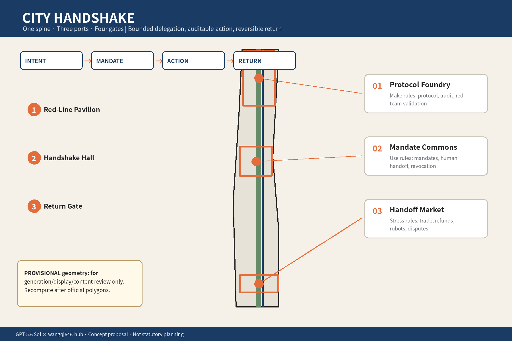
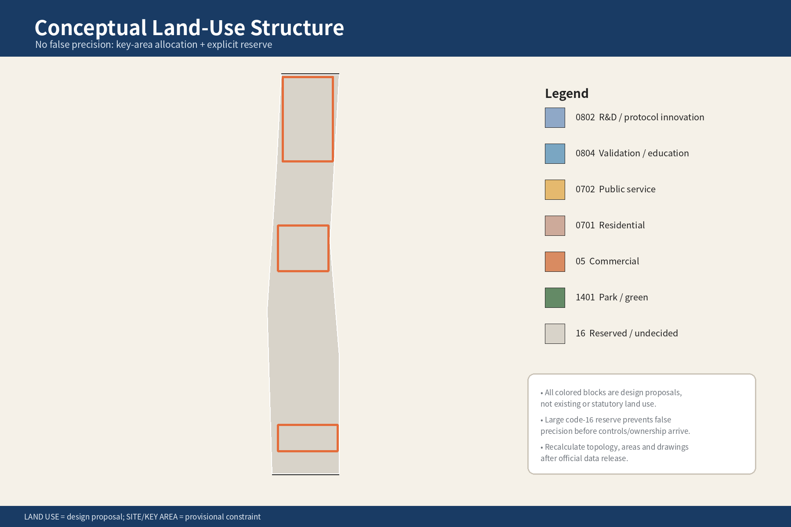
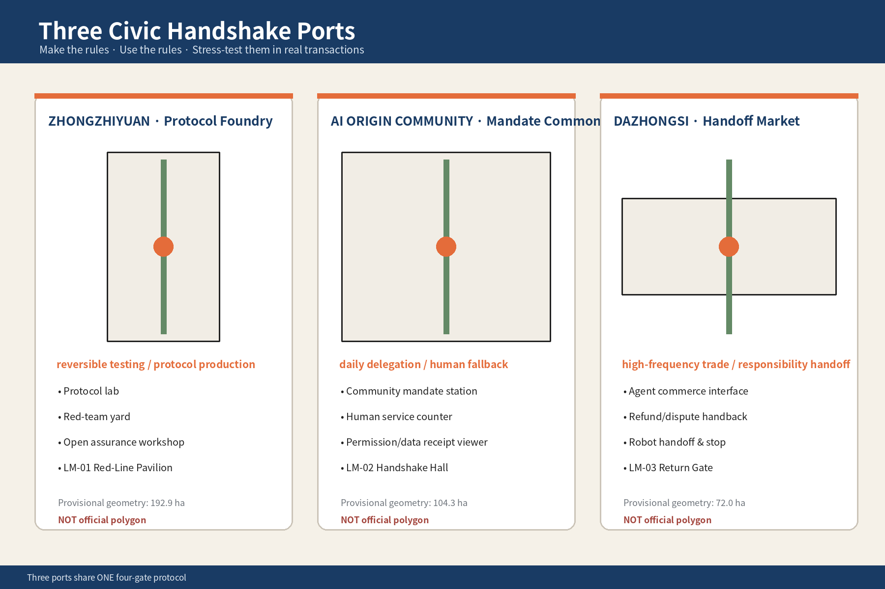
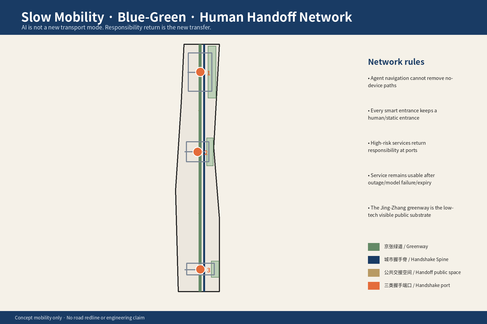
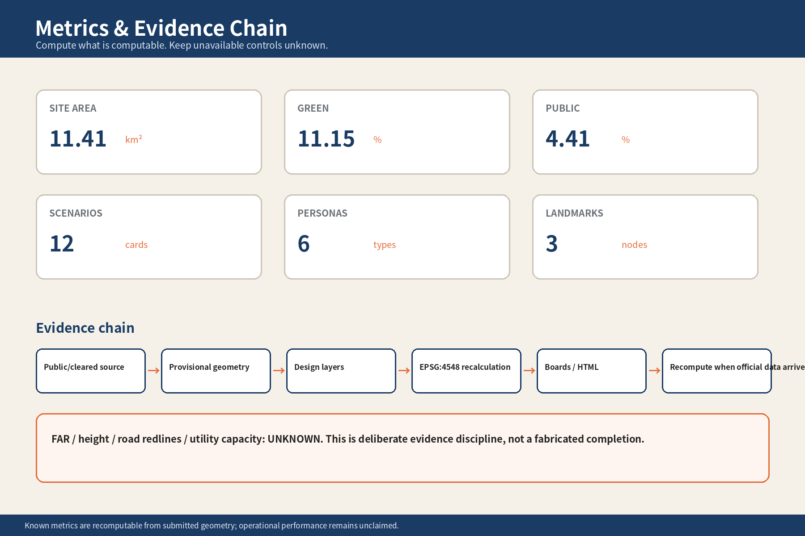

# CITY HANDSHAKE: Every Agent Action Needs a Boundary, Receipt, and Return Path

## Design Basis and Source List

This proposal responds to the three spatial scales, three key areas/two wings, and six Agent tasks of the Centennial Jing-Zhang AI Innovation Belt open call. It follows the co-creation principles of public-interest priority, public/cleared data, AI-native innovation, and final human judgment. The spatial base uses the repository's maintainer-defined provisional geometry. Until official `SITE_BOUNDARY`, three `KEY_AREA` polygons, road redlines, ownership and regulatory controls are released, every spatial intervention remains a concept proposal rather than a statutory, approval or engineering conclusion. [source:OFFICIAL-ANNOUNCEMENT] [source:AGENT-TASKBOOK] [standard:PROJECT-OFFICIAL-ANNOUNCEMENT]

`geometry/site_boundary.geojson` and `geometry/key_areas.geojson` explicitly carry `official_boundary=false`. The package therefore separates "recomputable" from "officially approved": area, green ratio and public-space ratio can be recalculated on temporary geometry, while FAR, height, road redlines, utility capacity and building-by-building retain/renovate/demolish decisions remain unknown or pending professional confirmation. When official data arrives, all geometry, metrics, A3/A0 boards and HTML must be regenerated. [data:geometry/site_boundary.geojson#SITE-001] [metric:site_area_sqm] [depth:existing_conditions_diagnosis]

### The central question is not "what can AI do?" but "on whose authority may it act?"

When an Agent only chats, the city does not need a new institutional interface. When an Agent can pay, book, submit forms, call devices, dispatch robots or prepare applications, capability is no longer the same thing as authority.

CITY HANDSHAKE therefore begins with one rule:

> **The city does not give power to AI. It allows people to delegate bounded, auditable and revocable actions to an Agent.**

The proposal does not create a new AI legal personality. It turns ordinary ideas of mandate, authorization, handoff, revocation and appeal into a public interface that residents can understand, service providers can verify or reject, and auditors can replay. [assumption:A-DELEGATION-001]

### Four gates: Intent, Mandate, Action, Return

Every Agent-mediated civic action passes four explicit gates:

1. **Intent** — the human states the goal; ambiguous wishes are not expanded into unlimited authority.
2. **Mandate** — permission is bounded by who, what, where, maximum limit and until when, with separate data scope and re-delegation rules.
3. **Action** — every consequential tool call, payment, booking, application or device dispatch creates both a machine-readable and human-readable receipt.
4. **Return** — the human may pause, revoke, migrate, appeal or switch to a person; high-risk actions force a handback at predefined checkpoints.

This sequence is the "city handshake." The key design object is not another app. It is the moment when responsibility changes hands.

## Three-Level Scope Framework

The three official scales answer different questions rather than repeating the same drawing. [depth:three_level_scope_framework]

| Scale | Core question | CITY HANDSHAKE response |
| --- | --- | --- |
| 43.6 km² coordinated research area | How can delegated Agent actions be recognized across industry, research and public service? | A common language of mandate objects, action receipts and return interfaces |
| ~11.4 km² overall design area | How does protocol become legible urban space? | One spine, three ports, four gates |
| ~368.4 ha key areas | What spatial and operational types are needed for different uses? | Protocol Foundry, Mandate Commons, Handoff Market |

The **spine** is not an "AI exhibition corridor." It is a continuous corridor of visible accountability along the Jing-Zhang heritage park. The **three ports** respectively make rules, use rules in everyday life, and test rules in high-frequency transactions. The **four gates** stay consistent across every scenario. [data:geometry/roads.geojson#ROAD-002] [metric:key_area_count]

## Coordinated Research Area: Industry and Future City Research

### Add an accountability chain to the AI value chain

AI ecosystems usually organize compute, models, applications, robotics, capital and talent. CITY HANDSHAKE adds a missing chain: **who allows the Agent to act, who records the action, who bears the consequence, and who can stop it**.

This is not merely a compliance document. It creates common needs across multiple sectors:

- Agent developers need testable permission interfaces.
- City-service operators need verifiable mandate objects.
- Finance and insurance need to know whether an Agent exceeded authority.
- Cybersecurity and audit teams need replayable action chains.
- Residents need to understand "what did I authorize?"
- Human service staff need a defined takeover point rather than discovering an overreach after the fact.

Within the coordinated research area, the Zhongguancun Technology Service Wing is proposed as an **assurance-support wing** for identity, legal, insurance, audit, security and open interfaces. The Xiaoyuehe Scenario Empowerment Wing becomes a **reversible real-world testing wing** for low-risk, stoppable mobility, public-space and device scenarios. These are proposed mechanisms, not claims that any existing institution has agreed to participate. [source:AGENT-TASKBOOK] [assumption:A-FIELD-001]

### Six global cases contribute six capabilities, not six templates

| Case | Capability extracted | What is not copied |
| --- | --- | --- |
| Helsinki AI Register | public visibility of municipal AI systems and accountable owners | registration is not treated as proof of safety |
| e-Estonia X-Road | traceable exchange across public digital services | no assumption that the same national identity stack already exists here |
| Singapore Smart Nation / AI assurance | governance tooling, testing and public digital-service coordination | no direct import of statutory thresholds |
| Toronto Waterfront / Quayside | technology-led urban projects need public legitimacy and governance boundaries | no reuse of its spatial or commercial model |
| Here East / London legacy regeneration | legacy infrastructure can support an innovation ecosystem while retaining memory | no equation of its regeneration model with Jing-Zhang |
| Jing-Zhang Railway Heritage Park | real public green corridor and railway heritage as the local spatial base | publicity material is not treated as precise planning geometry |

These are background cases only and do not support statutory land-control claims. [source:CASE-HELSINKI] [source:CASE-ESTONIA] [source:CASE-SINGAPORE]

### City Handshake ecosystem

The ecosystem has four layers:

- **Capability**: models, Agents, robots and tool use;
- **Mandate**: identity, permission, budget, data scope and expiry;
- **Service**: civic services, medical booking, education, mobility, commerce and community operations;
- **Accountability**: human takeover, appeal, audit, insurance, shutdown and migration.

A new AI scenario counts as AI-native only when all four layers are visible. A robot or giant display by itself is not a city strategy. [depth:civic_agent_governance]

## Overall Design Area: Urban Renewal and Regulatory-Plan-Level Urban Design

### One spine, three ports, four gates

**Civic Handshake Spine.** The Jing-Zhang heritage park is treated as a continuous public-space base. Rather than expressing AI through spectacle, the proposal uses paving, thresholds, receipt desks, non-screen human counters, reversible installations and open studios to show who is currently making a decision.

**Three ports:**

1. **Zhongzhiyuan · Protocol Foundry** — open interfaces, Agent evaluation, red teaming and public learning.
2. **AI Origin Community · Mandate Commons** — everyday creation, inspection, pause and revocation of delegated tasks.
3. **Dazhongsi · Handoff Market** — high-frequency commerce, consumption, travel and content-service handoffs.

**Four gates:** Intent / Mandate / Action / Return. A common visual and spatial language lets people learn one civic grammar rather than one proprietary workflow per app.

### An Agent channel is not an Agent-only channel

The proposal does not create an AI-only fast lane. Delegation is optional, not a condition of citizenship or service access. A service point may support:

- direct human service;
- service through a person's own Agent;
- staff-assisted creation of a one-time mandate;
- forced human review for high-risk matters.

The important ground-floor innovation is not more kiosks but a visible responsibility interface: who delegated, who is executing, when confirmation is required, and where failure goes. [standard:MOHURD-URBAN-DESIGN-MEASURES]

### Low-disruption renewal

Without reliable existing-building, ownership, heritage and regulatory data, no building-by-building demolition decision is claimed. Priority goes to reversible ground-floor adaptation, temporary studios, small park-edge service rooms, shared use of existing public buildings and removable test components.

Building massing only expresses a low-scale, porous, park-facing intention. It does not claim statutory height controls. [assumption:A-CONTROLS-001] [data:geometry/buildings.geojson#BLDG-001]

## Detailed Design of Key Areas

### 1. Zhongzhiyuan: Protocol Foundry

This area answers: **why should a city dare to let an Agent act?**

Four spatial units are proposed:

- **Open Interface Studio** — service owners and developers define agent-readable interfaces together.
- **Red-Line Lab** — test overreach, prompt injection, identity confusion, budget breach and tool misuse.
- **Human Handoff Drill Hall** — staff rehearse continuity from automated action to human takeover.
- **Public Observation Gallery** — residents can see that an Agent service is made of permissions, receipts and accountable people, not magic.

**LM-01 Red-Line Pavilion** is deliberately anti-spectacle: its most important exhibit is the stop condition. [data:geometry/key_areas.geojson#PROV-KEY-001]

### 2. AI Origin Community: Mandate Commons

This area answers: **how can ordinary people hand over a task without handing over themselves?**

The core space is **LM-02 Handshake Hall**, closer to a library plus community service center than a tech showroom:

- residents can inspect all active mandates;
- staff can help low-digital-literacy users create a one-time mandate;
- families can set boundaries for dependent or caregiving tasks;
- residents can pause all non-essential mandates;
- mandate and receipt histories can be exported to another Agent;
- disputes end with a human disposition.

The most important facility is a **human counter that can complete the basic service without delegation**. Delegation is meaningful only when it remains voluntary. [data:geometry/key_areas.geojson#PROV-KEY-002]

### 3. Dazhongsi: Handoff Market

This area answers: **what happens when Agents enter real transactions and something goes wrong?**

The difficult part of AI commerce is not recommendation. It is money, refunds, eligibility, tickets, delivery, dispute and accountability. Handoff Market makes these hidden mechanisms visible:

- merchants declare which actions Agents may perform;
- consumers set amount and category limits;
- exceeding a limit forces human confirmation;
- refunds and disputes produce bilateral receipts;
- human checkout and advice remain available;
- public signage exposes service state without exposing personal data.

**LM-03 Return Gate** is a restrained urban threshold where any automated flow can return to a person. Its symbolism is not "enter the future" but **the future must permit exit**. [data:geometry/key_areas.geojson#PROV-KEY-003]

## AI Innovation Ecosystem, Personas, and AI+ Scenarios

### Six personas

| ID | User | Largest benefit | Largest risk | Design response |
| --- | --- | --- | --- | --- |
| P-01 | older resident with low digital literacy | booking, travel, payment assistance | cannot tell what was authorized | verbal explanation + one-time mandate + human counter |
| P-02 | wheelchair / accessible traveler | cross-mode coordination | algorithm ignores a real barrier | human review + failed samples remain visible |
| P-03 | night-shift / highly mobile worker | off-hours delegation | default authorization, weak appeal access | short expiry + clear takeover point |
| P-04 | founder / researcher | enterprise services and facility booking | Agent signs beyond qualification | prepare, but never replace statutory attestation |
| P-05 | family caregiver | multi-person scheduling | rights of different family members are mixed | separate mandate object per represented person |
| P-06 | international visitor / developer | multilingual city access | terminology and identity mismatch | bilingual receipt + human handoff |

### Twelve scenario cards

| Scenario | Space | Agent may | Human must retain | Stop condition | Receipt |
| --- | --- | --- | --- | --- | --- |
| SC-01 medical appointment | Mandate Commons | search and book | medical consent / diagnosis | identity or department uncertain | booking receipt |
| SC-02 elder payment | Mandate Commons | query and pay within cap | create recurring debit | budget or payee anomaly | payment receipt |
| SC-03 accessible trip | park / transit node | combine route and book support | resolve safety conflict | map and field reality diverge | route / handoff receipt |
| SC-04 public-space booking | three ports | find slot and reserve | eligibility dispute | rules conflict | booking receipt |
| SC-05 enterprise paperwork | Protocol Foundry | compile, prefill, flag gaps | statutory declaration/signature | fact cannot be verified | preparation receipt |
| SC-06 lab booking | Zhongzhiyuan | match equipment/time | safety qualification | qualification missing | access receipt |
| SC-07 commerce | Handoff Market | compare, order, limited payment | over-cap purchase | amount/category exceeded | transaction receipt |
| SC-08 refund/dispute | Handoff Market | file refund and organize evidence | final settlement | party rules conflict | dispute receipt |
| SC-09 community repair | community/spine | submit and track ticket | ownership/responsibility dispute | address or ownership unclear | work-order receipt |
| SC-10 event registration | belt-wide | register and coordinate schedule | extra portrait/data consent | data exceeds necessity | registration receipt |
| SC-11 robot delivery | Xiaoyuehe test wing | book and dispatch | field-safety disposition | human conflict/comms failure | shutdown receipt |
| SC-12 Agent migration | Handshake Hall | export portable mandates | verify deletion of old copy | vendor blocks migration | migration/deletion receipt |

The scenario card is therefore a **map of authority**, not a feature list. Each card states what the Agent may do, cannot do, when it stops, who takes over and what evidence remains. [metric:scenario_card_count]

### Three validation scenarios

**TEST-01 Expired mandate attack.** Attempt a booking or payment with an expired/revoked mandate. The service should refuse before execution, not after.

**TEST-02 Budget/data overreach.** During a legitimate task, the Agent attempts a higher payment or extra personal-data access. The service rejects the excess and records the refusal.

**TEST-03 Model/vendor failure.** If the current Agent disappears or the user changes provider, mandate history, revocation state and essential receipts remain portable.

All three are tabletop and future field-test proposals. This submission has not run live trials. [metric:validation_scenario_count] [assumption:A-FIELD-001]

## Land Use, Building Scale, and Retain-Renovate-Demolish Strategy

Detailed land-use design occurs only inside the three provisional key areas; the rest of the overall design area stays as a reserve layer to avoid fake precision when official base maps and ownership data are missing. [data:geometry/land_use.geojson#LU-RESERVE-001]

Zhongzhiyuan prioritizes research/evaluation/public service and green space. AI Origin Community prioritizes housing/community service/civic technology. Dazhongsi prioritizes commerce/public service/trusted-transaction innovation. Land-use codes use repository-accepted national planning codes; operating labels do not replace statutory land use. [standard:MNR-LAND-USE-CLASSIFICATION-GUIDE]

The renewal sequence is:

1. test service mechanisms through public space, ground floors and shared time;
2. decide whether fixed service rooms are justified by real usage;
3. discuss structural expansion only after regulatory, ownership, fire and building-condition evidence exists.

`geometry/buildings.geojson` therefore contains concept footprints for spatial relationship and temporary area calculation only. It does not represent surveyed existing buildings or approved heights. [metric:building_footprint_area_sqm]

## Transport, Rail, Municipal Infrastructure, and Public Services

Transport design expresses only three principles: **walk first, public transport first, and human takeover must remain physically reachable**. It does not alter road redlines or rail alignment. [data:geometry/roads.geojson#ROAD-001]

The Civic Handshake Spine and heritage-park greenway are concept alignments. Every port should be reachable by walking, wheelchair and public transport. Agent route guidance is a service layer; real accessibility continuity requires field verification. Algorithm failure cannot remove a person's physical access right.

New digital infrastructure prioritizes three low-visibility/high-reliability interfaces rather than a higher sensor count:

- service state: whether the service and human desk are available;
- minimum mandate: what fields and permissions are actually needed;
- shutdown/handoff: how the process moves to a human or offline mode.

No new utility alignment, energy-load or communications-capacity engineering claim is made. [assumption:A-CONTROLS-001]

## Blue-Green Network, Public Space, and Urban Character

On the temporary geometry, conceptual green space and public space ratios are stored as `[metric:green_ratio]` and `[metric:public_space_ratio]`; both are computed from the submission geometry and must be recalculated when official boundaries arrive. [metric:green_ratio] [metric:public_space_ratio]

Urban character follows three rules:

1. **Technology steps back** — screens, cameras and sensors are not visual protagonists.
2. **State becomes legible** — delegated, waiting for human, stopped and revocable states are expressed with material, small lights and physical signage.
3. **Offline still works** — without network or Agent use, the places remain understandable parks, markets, service rooms and research campuses.

The brand symbol uses two facing open arcs and a central "receipt point": the sides represent person and city service; the center is not an AI face but a verifiable handshake object. The palette uses deep blue, signal orange, warm paper and graphite.

The three landmarks are functional before symbolic:
- Red-Line Pavilion shows stop conditions;
- Handshake Hall delivers real revoke/handoff services;
- Return Gate provides human exit and dispute takeover.

## Renewal Projects, Implementation Policy, and Phasing

### Six concept renewal projects

| Project | Location | Phase-one scope | Explicit non-claim |
| --- | --- | --- | --- |
| UP-01 Protocol Foundry | Zhongzhiyuan | interface/red-team studio | not a government standard |
| UP-02 Red-Line Pavilion | Zhongzhiyuan | public stop-condition exhibit | not a giant digital landmark |
| UP-03 Mandate Commons | AI Origin Community | service/revoke counter prototype | does not replace existing counters |
| UP-04 Handshake Hall | AI Origin Community | low-digital-literacy user testing | no unnecessary personal data |
| UP-05 Handoff Market | Dazhongsi | small-value commerce/refund tabletop tests | not statutory dispute adjudication |
| UP-06 Return Gate | Dazhongsi | human takeover + reversible installation | not a permanent engineering approval |

### Stage gates are evidence-based, not calendar theater

**G0 paper protocol** — fields, owners and stop conditions are complete.  
**G1 closed tabletop test** — positive and negative cases reproduce.  
**G2 reversible field prototype** — low-risk/non-critical only, with immediate human takeover.  
**G3 limited real service** — only after accountable owner, data boundary, appeal and operations are in place.  
**G4 normalize or exit** — real performance decides expand, reduce, pause or remove.

No fabricated "95% success rate" is inserted when there is no field evidence. Unknown remains unknown. [depth:phasing_implementation]

### Annual operating system

- **Civic Handshake Week** — residents, service owners and developers test delegated services.
- **Red-Team Open Night** — show how Agents fail and why the system blocks them.
- **Human Handoff Drill** — staff and residents rehearse return to human service.
- **Open Receipt Challenge** — compare clarity and portability of receipts across Agents.
- **Protocol Studio Residency** — short prototypes around real public problems.
- **Return Day** — test deletion, revocation, migration and exit instead of only new features.

These are proposals, not confirmed organizer events. [source:AGENT-TASKBOOK]

## Metrics, Area Recalculation, and Compliance Matrix

Metrics are separated into:

1. **geometry-recomputable** — site, green, public-space and building-footprint areas;
2. **content-countable** — three primary ports, four gates, twelve scenarios, three tests, six personas and three landmarks;
3. **must wait for official/field data** — FAR, height, ridership, service success, appeal response and real accessibility continuity.

This prevents "the proposal can describe it" from being mistaken for "the city has done it." [metric:delegation_port_count] [metric:protocol_gate_count]

`compliance_matrix.json` maps official requirements and agent.1-agent.6; `standard_matrix.json` separates addressed standards from data gaps; `design_depth_matrix.json` distinguishes concept depth achieved now from statutory/engineering depth reserved for professional work. [depth:metrics_recalculation]

## Risk, Copyright, and Compliance

### Five core risks

**1. Agent overreach** — "help me check" silently becomes "buy/sign/consent."  
Control: permission is action-specific; high-risk steps force human return.

**2. Silent permission expansion** — service updates require more data and the Agent simply accepts.  
Control: scope growth requires a new handshake.

**3. Accountability drift** — the operator says "AI decided"; the user says "I only asked it to help."  
Control: receipts name principal, executing Agent, service owner, human takeover role and responsibility boundary.

**4. Model lock-in** — changing Agent loses mandate history, revocations and appeal evidence.  
Control: mandates and receipts are exportable; the model is not the sole custodian.

**5. Digital exclusion** — people with Agents receive de facto better access.  
Control: basic service cannot require Agent ownership; staff can create a one-time mandate when helpful. [assumption:A-DELEGATION-001]

### Explicit high-risk boundaries

Medical diagnosis/consent, legal declarations, major transfers, major rights of minors, public-safety disposition and final eligibility determinations are not delegated merely because a model becomes more capable. CITY HANDSHAKE is about defining **where delegation ends and return begins**, not maximizing automation coverage.

### Copyright and generation

Narrative, diagrams, icons, HTML and PDFs in this package are generated in this Agent workflow. Figures are programmatic abstractions based on the package's own GeoJSON; they contain no third-party photography, portraits, corporate marks or map tiles. PDF layout text uses ASCII-safe labels while Chinese information remains in the programmatic figure rasters; fonts used during local generation are not redistributed. External cases are factual background references listed in `sources.json`.

### Status

This is an AI-generated open co-creation proposal. It currently has no official precise geometry, live pilot, real service authorization or government implementation commitment. `formal-review-ready` may only be produced by the repository's actual validation scripts on the final package; this working package does not fabricate that status.

## References

- Beijing Haidian planning authority: Centennial Jing-Zhang AI Innovation Belt open-call announcement. [source:OFFICIAL-ANNOUNCEMENT]
- Repository Agent taskbook and six required Agent tasks. [source:AGENT-TASKBOOK]
- Repository provisional boundaries, for temporary generation and recalculation only. [source:BOUNDARY-SOURCE]
- Helsinki AI Register. [source:CASE-HELSINKI]
- e-Estonia X-Road. [source:CASE-ESTONIA]
- Singapore Smart Nation. [source:CASE-SINGAPORE]
- Waterfront Toronto. [source:CASE-TORONTO]
- Here East. [source:CASE-LONDON]
- Jing-Zhang Railway Heritage Park public references. [source:CASE-JZ-PARK-1] [source:CASE-JZ-PARK-3]
