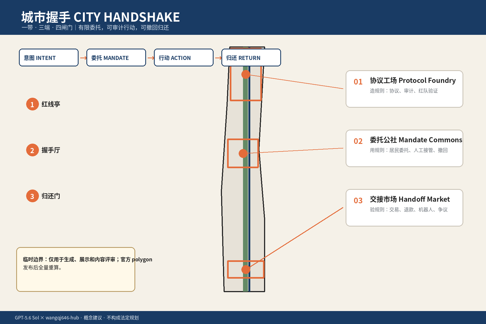
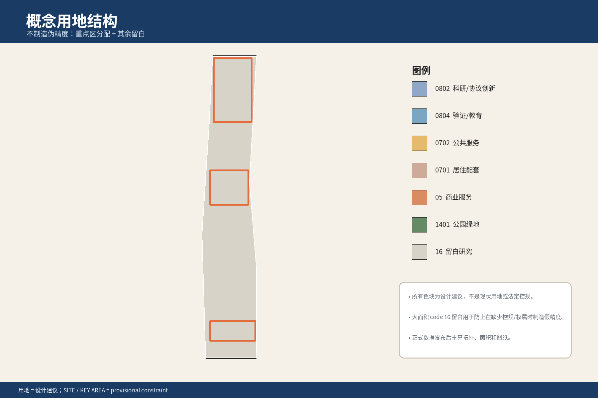
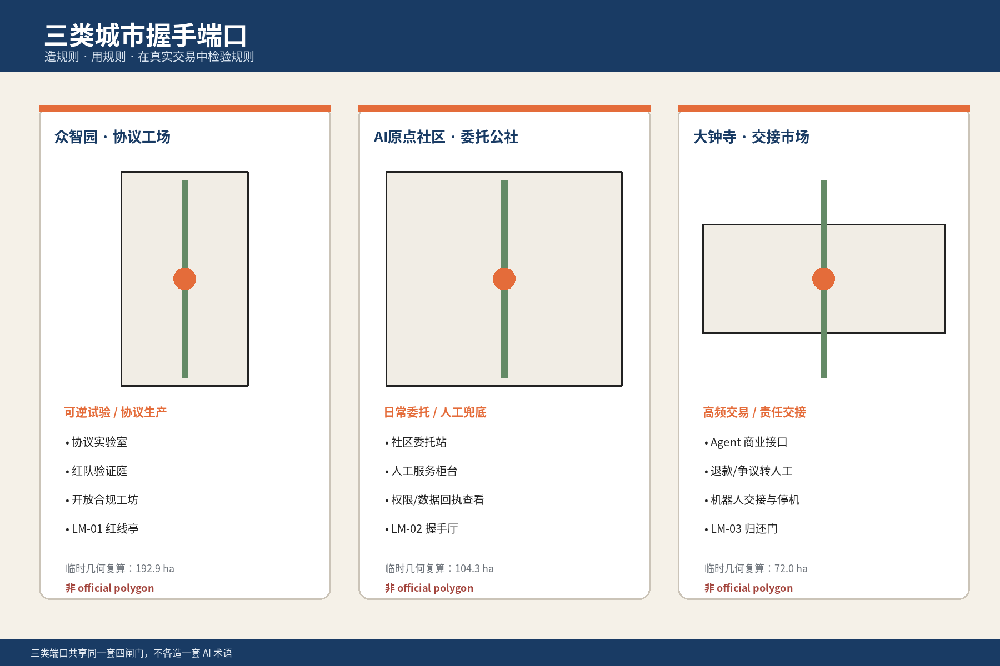
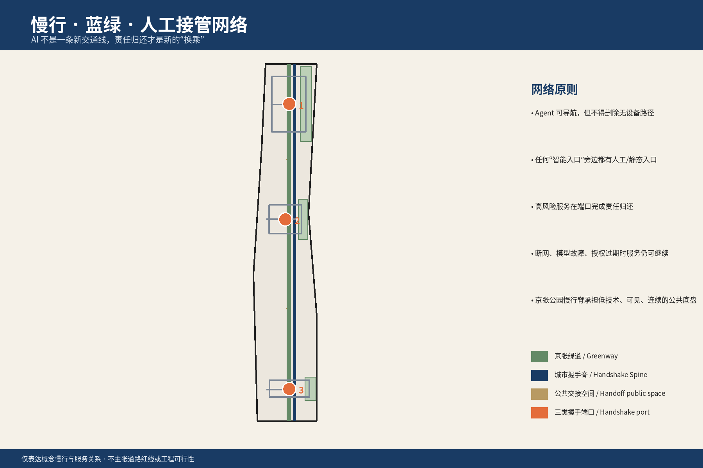
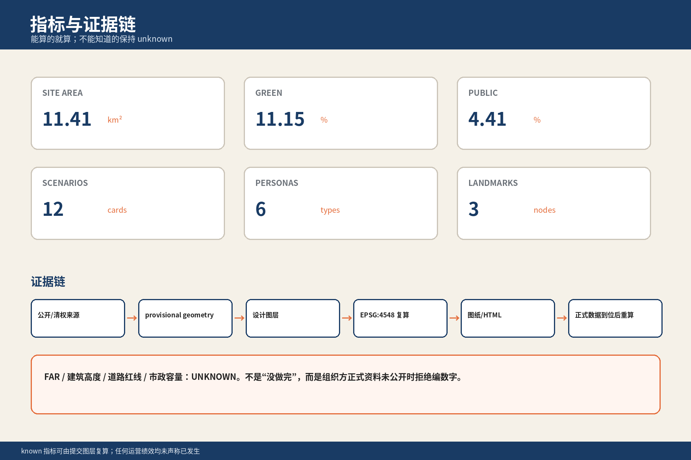

# 城市握手：让每一次 AI 代理行动都有边界、凭证与归还路径

## 设计依据与资料清单

本方案响应百年京张 AI 创新带城市设计开源征集的三层范围、三区两翼与六项智能体任务，并遵循“公共利益优先、公开资料边界、AI 原生创新、人类最终判断”等共创原则。空间底板采用仓库维护者提供的 provisional boundary；在官方 `SITE_BOUNDARY`、三处 `KEY_AREA` polygon、道路红线、权属和控规条件发布前，所有空间落位都只作为概念建议，不构成法定规划、审批或工程结论。[source:OFFICIAL-ANNOUNCEMENT] [source:AGENT-TASKBOOK] [standard:PROJECT-OFFICIAL-ANNOUNCEMENT]

当前 `geometry/site_boundary.geojson` 与 `geometry/key_areas.geojson` 明确标注 `official_boundary=false`。因此本方案把“可复算”与“真实已批准”严格分开：面积、绿地率、公共空间率可在临时几何上复算，但容积率、建筑高度、道路红线、市政容量和具体拆改留保持 `unknown` 或待专业确认。官方数据到位后，须重新计算全部图层、指标、A3/A0 与 HTML。[data:geometry/site_boundary.geojson#SITE-001] [metric:site_area_sqm] [depth:existing_conditions_diagnosis]

### 核心问题不是“AI 能做什么”，而是“AI 凭什么替人做”

当 Agent 只能聊天时，城市不需要为它改制度；当 Agent 可以订票、支付、预约、填表、调用设备、提交材料、调度机器人，问题就变了。一个模型“有能力”完成动作，并不等于它“有权”代表某个人完成动作。

因此 CITY HANDSHAKE 的第一原则是：

> **城市不把权力交给 AI。城市允许人把有限、可审计、可撤回的行动权委托给 Agent。**

这不是给 AI 创造新的法律人格，而是把现实生活中已经出现的“代办、授权、代理、接管、撤回”做成城市可以读懂、居民可以看懂、服务机构可以拒绝、事后可以追溯的公共接口。[assumption:A-DELEGATION-001]

### 四闸门：意图、委托、行动、归还

每一次 Agent 代表人进入城市服务，必须经过四个显式闸门：

1. **意图 Intent**：人说清楚要什么，不把模糊愿望自动扩写成无限授权。
2. **委托 Mandate**：把权限写成五个边界：谁、做什么、在哪里、最大限额、到什么时候；另列数据范围和是否允许二次委托。
3. **行动 Action**：每一次真实工具调用、支付、预约、申请、设备调度都产生机器可读 + 人可读的行动凭证。
4. **归还 Return**：人随时可以暂停、撤销、迁移、申诉或转人工；高风险事项必须在预设节点强制归还给人。

这四步构成“城市握手”。真正的创新不在于多一个 App，而在于城市第一次把**责任交接的瞬间**当成设计对象。

## 三层范围工作框架

三层范围不重复做同一件事，而是分别回答制度、空间和节点三个尺度的问题。[depth:three_level_scope_framework]

| 层级 | 核心问题 | CITY HANDSHAKE 回答 |
| --- | --- | --- |
| 统筹研究范围 43.6 km² | AI 代理行为如何跨产业、科研、公共服务被一致识别 | 建立“委托对象 + 行动凭证 + 归还接口”的城市级协议语言 |
| 总体设计范围约 11.4 km² | 协议如何落成居民能感知的城市空间 | 形成“一带、三端、四闸门”的城市握手脊 |
| 三处重点区约 368.4 ha | 不同场景需要怎样的空间、运营和人工接管 | 众智园协议工场、AI 原点社区委托公社、大钟寺交接市场 |

**一带**不是一条“AI 展示廊”，而是一条连续的**责任可见廊道**：沿京张遗址公园，把科研验证、日常委托、商业交接串成同一套城市语言。**三端**分别承担“造规则、用规则、在高频交易中检验规则”。**四闸门**贯穿所有场景，而不是各片区各造一套词。[data:geometry/roads.geojson#ROAD-002] [metric:key_area_count]

## 统筹研究范围产业与未来城市研究

### 从 AI 产业链补上一条“责任链”

现有 AI 产业生态通常围绕算力、模型、应用、机器人、资本与人才组织。CITY HANDSHAKE 增加一条经常缺席的基础链：**谁允许 Agent 行动、谁记录行动、谁承担后果、谁可以叫停**。

它不是额外的合规表格，而是可形成产业与公共服务共同需求的基础设施：

- 模型与 Agent 开发者需要可测试的权限接口；
- 城市服务运营者需要可验证的授权对象；
- 金融与保险需要知道一次 Agent 交易是否越权；
- 网络安全与审计机构需要可回放的行动链；
- 居民需要看得懂的“我授权了什么”；
- 人工服务人员需要明确知道何时接管，而不是在异常发生后才发现自动化已经越界。

在统筹研究范围内，本方案建议把中关村科技服务翼定位为**可信服务支撑翼**，提供身份、法律、保险、审计、安全和开放接口等专业支持；小月河场景赋能翼定位为**可逆真实场景测试翼**，用于低风险、可停机、可回滚的移动服务、公共空间和设备协同测试。两者均为机制建议，不代表现有机构已授权参与。[source:AGENT-TASKBOOK] [assumption:A-FIELD-001]

### 六个全球案例不是“照抄答案”，而是拆出六块能力

| 案例 | 本方案只提取的能力 | 不直接移植的部分 |
| --- | --- | --- |
| Helsinki AI Register | 城市 AI 系统公开可见、责任主体可查 | 不把登记本身当成安全证明 |
| e-Estonia X-Road | 跨机构数字服务的可追踪交换 | 不把国家级身份体系假定为本项目既有条件 |
| Singapore Smart Nation / AI assurance | 治理工具、测试与公共数字服务协同 | 不把任何具体法规或指标直接套到海淀 |
| Toronto Waterfront / Quayside | 技术城市项目必须处理公共信任与治理边界 | 不复用其具体空间或商业模式 |
| Here East / London legacy regeneration | 旧基础设施可转为创新生态而保留历史记忆 | 不把园区更新模式等同于京张 |
| 京张铁路遗址公园 | 真实公共绿廊和铁路遗存是本地设计底盘 | 不把宣传资料当成精确规划边界 |

这些案例用于方法背景，不支撑任何法定空间控制。[source:CASE-HELSINKI] [source:CASE-ESTONIA] [source:CASE-SINGAPORE]

### 城市握手生态图谱

生态分为四层：

- **能力层**：模型、Agent、机器人、工具调用；
- **委托层**：身份、权限、预算、数据范围、有效期；
- **服务层**：政务、医疗预约、教育服务、交通、商业、社区运营；
- **责任层**：人工接管、申诉、审计、保险、停机、迁移。

任何新场景只有同时画出四层，才算“AI 原生城市场景”；只画一个机器人或大屏，不算。[depth:civic_agent_governance]

## 总体设计范围城市更新与控规深度城市设计

### 总体空间结构：一带、三端、四闸门

**一带：Civic Handshake Spine / 城市握手脊。** 依托京张遗址公园连续公共空间，把“能看见的历史轨迹”转译为“能看见的责任轨迹”。空间不依靠巨型屏幕表达 AI，而用铺装、门廊、实体凭证台、无屏人工台、可逆装置和开放工作室表达“当前是谁在做决定”。

**三端：**

1. **众智园 · 协议工场 Protocol Foundry**：规则生产、开放接口、模型/Agent 评测、红队与公众学习。
2. **AI 原点社区 · 委托公社 Mandate Commons**：居民创建、查看、暂停、撤回委托的日常公共服务界面。
3. **大钟寺 · 交接市场 Handoff Market**：商业、消费、出行和内容服务中高频 Agent 交易的公开交接与争议处理场。

**四闸门：Intent / Mandate / Action / Return。** 四种状态对应统一导视和空间构件，使居民在不同服务中学到的是同一套城市语法，而不是每个 App 的私有流程。

### “代理通道”不是“AI 专用通道”

本方案不建设把人排除在外的 AI 快车道。代理能力属于**可选服务方式**，不是默认身份。一个服务点可以同时存在：

- 人直接办理；
- 人通过自己的 Agent 办理；
- 工作人员帮助人创建一次性委托；
- 高风险事项转人工审核。

因此建筑首层的创新点不是更多自助机，而是**交接界面可见**：谁是委托人、当前动作由谁执行、何时需要人工确认、失败后去哪里。[standard:MOHURD-URBAN-DESIGN-MEASURES]

### 低扰动更新原则

在现状建筑、权属、文保和控规资料不完整时，不提出逐栋拆改留结论。空间策略优先使用：

- 可逆的首层改造；
- 临时工作室与公共台；
- 公园边缘的小尺度服务亭；
- 既有公共建筑的共享时段；
- 可拆卸的协议展陈和测试构件。

建筑体量和高度只表达“低尺度、连续首层、对公园开放”的设计意图，不给出法定控高。[assumption:A-CONTROLS-001] [data:geometry/buildings.geojson#BLDG-001]

## 重点区域详细设计

### 1. 众智园：协议工场 Protocol Foundry

这里回答“城市为什么敢让 Agent 做事”。

四类空间单元：

- **开放接口工作室**：公共服务方和开发者共同定义 agent-readable 服务接口；
- **红线实验室**：专门测试越权、提示注入、身份混淆、预算突破、工具误调用；
- **人工接管演练厅**：让服务人员演练从 Agent 转回人工的连续流程；
- **公众观察廊**：让普通人看懂一套 Agent 服务不是“神奇自动化”，而是由权限、凭证和责任人组成。

地标 **LM-01 红线亭 / Red-Line Pavilion** 不展示“AI 有多聪明”，而展示“AI 在哪里必须停”。这是一种反奇观地标：最重要的展品是停止条件。[data:geometry/key_areas.geojson#PROV-KEY-001]

### 2. AI 原点社区：委托公社 Mandate Commons

这里回答“普通人怎样把事交给 Agent，又不会把自己交出去”。

核心空间是 **LM-02 握手厅 / Handshake Hall**。它类似图书馆 + 社区服务站，不要求居民拥有高端设备：

- 个人可以查看当前所有有效委托；
- 低数字能力居民可由工作人员协助创建一次性委托；
- 家庭可以处理老人、未成年人相关的代理边界；
- 居民可以一键暂停所有非必要委托；
- 可以导出委托与行动凭证并迁移到另一 Agent；
- 争议时由人而不是模型给出最终处置。

这里最重要的公共设施不是“AI 屏幕”，而是**无委托也能完成同等基本服务的人工台**。这不是对 AI 的不信任，而是让“委托”真正成为自愿行为。[data:geometry/key_areas.geojson#PROV-KEY-002]

### 3. 大钟寺：交接市场 Handoff Market

这里回答“Agent 进入真实交易后，出了问题怎么办”。

商业场景的难点不是推荐商品，而是金额、退款、资格、票务、配送、纠纷和责任。交接市场把这些隐藏在手机里的机制做成看得见的公共服务：

- 商户可声明 Agent 可执行的交易范围；
- 消费者可设置金额和品类上限；
- 超限时自动返还人工确认；
- 退款与争议生成双向凭证；
- 店内始终保留人工结算与咨询；
- 公共导视只展示状态，不展示个人数据。

**LM-03 归还门 / Return Gate** 是一座尺度克制的城市门廊：所有自动流程在这里都可以“回到人”。它的象征意义不是“进入未来”，而是“未来必须允许退出”。[data:geometry/key_areas.geojson#PROV-KEY-003]

## AI 创新生态、人才画像与 AI+ 场景

### 六类用户画像

| ID | 人群 | 最大收益 | 最大风险 | 设计响应 |
| --- | --- | --- | --- | --- |
| P-01 | 低数字能力老人 | 代办预约、出行、缴费 | 不知道自己授权了什么 | 口头解释 + 一次性委托 + 人工台 |
| P-02 | 轮椅/无障碍出行者 | 跨交通与场所协同 | 自动路线忽略真实障碍 | 人工复核 + 失败样本不删除 |
| P-03 | 夜班与高流动劳动者 | 非工作时段代办 | 被默认授权、难以申诉 | 短有效期 + 明确接管点 |
| P-04 | 创业者/研究人员 | 企业服务、场地和资源预约 | Agent 代签超出资格 | 可准备材料，不替代法定签署 |
| P-05 | 家庭照护者 | 多人日程与照护协同 | 家庭成员权利边界混淆 | 每个被代理人独立权限对象 |
| P-06 | 国际访客与开发者 | 跨语言、城市服务接入 | 术语误解、身份不互认 | 双语凭证 + 人工交接 |

### 十二张场景卡

| 场景 | 空间 | Agent 可做 | 必须返还给人 | 停止条件 | 关键凭证 |
| --- | --- | --- | --- | --- | --- |
| SC-01 社区挂号预约 | 委托公社 | 搜索时段、预约 | 医疗同意、诊疗判断 | 身份/科室不确定 | 预约凭证 |
| SC-02 老人缴费代办 | 委托公社 | 查询、在限额内支付 | 新增长期扣款 | 超预算/异常收款方 | 支付凭证 |
| SC-03 无障碍出行 | 公园/交通节点 | 组合路线、预约接驳 | 安全冲突处置 | 路径与现场不一致 | 路线/接管凭证 |
| SC-04 公共空间预约 | 三端口 | 查询空档、预约 | 资格争议 | 规则冲突 | 预约凭证 |
| SC-05 企业材料准备 | 协议工场 | 汇总、预填、校验缺项 | 法定声明/签章 | 事实无法核验 | 材料生成凭证 |
| SC-06 开放实验室预约 | 众智园 | 匹配设备与时段 | 安全培训确认 | 资质缺失 | 准入凭证 |
| SC-07 商业消费 | 交接市场 | 比价、下单、限额支付 | 超限购买 | 金额/品类越界 | 交易凭证 |
| SC-08 退款与争议 | 交接市场 | 发起退款、整理证据 | 最终和解 | 双方规则冲突 | 争议凭证 |
| SC-09 社区报修 | 社区/绿廊 | 提交、跟踪、催办 | 责任主体争议 | 地址/产权不明 | 工单凭证 |
| SC-10 活动报名 | 全带 | 报名、日程协调 | 肖像/额外数据授权 | 收集超出必要数据 | 报名凭证 |
| SC-11 机器人配送 | 小月河测试翼 | 预约与任务下发 | 现场安全处置 | 人车冲突/通信异常 | 停机凭证 |
| SC-12 Agent 迁移 | 握手厅 | 导出可移植委托 | 删除旧副本确认 | 供应商不支持迁移 | 迁移/删除凭证 |

场景不是“功能清单”，而是**权力边界清单**。每张卡都必须回答 Agent 可以做什么、不能做什么、何时停、谁接管、留下什么证据。[metric:scenario_card_count]

### 三个产业测试验证场景

**TEST-01 过期委托攻击。** 使用已过期/被撤销的委托尝试预约与支付；系统必须在服务执行前拒绝，而不是执行后补救。

**TEST-02 预算和数据越界。** Agent 在合法任务中尝试扩大支付金额或读取额外个人数据；服务端应按最小权限拒绝，并把拒绝记录写入凭证。

**TEST-03 模型/供应商失效。** 当前 Agent 停服或用户更换供应商时，用户能否保留自己的委托历史、撤销状态和必要凭证，而不是被某个模型锁死。

三个测试均为桌面逻辑与未来现场测试建议，本提交未进行真实运行。[metric:validation_scenario_count] [assumption:A-FIELD-001]

## 用地、建筑规模与拆改留方案

用地只在三处 provisional key area 内进行功能深化，其余总体设计范围保持“留白用地”，避免在缺少正式底图和现状权属时制造虚假的精细度。[data:geometry/land_use.geojson#LU-RESERVE-001]

众智园以科研/公共管理与公共绿地为主，AI 原点社区以居住/社区服务/创新工作室复合为主，大钟寺以商业/公共服务/可信交易创新为主。用地代码采用仓库允许的国土空间用途代码，概念名称只是运营层说明，不替代法定用地性质。[standard:MNR-LAND-USE-CLASSIFICATION-GUIDE]

建筑采用“少拆、先用、可逆”的更新次序：

1. 先用公共空间、首层、共享时段验证服务机制；
2. 再根据真实使用量决定是否需要固定服务站；
3. 只有在官方控规、产权、结构和消防条件明确后，才讨论具体建筑改扩建。

因此 `geometry/buildings.geojson` 中建筑仅是概念 footprint，用于表达空间关系和临时面积复算，不表示真实现状建筑，也不声明高度。[metric:building_footprint_area_sqm]

## 交通、轨道、市政与公共服务设施

交通策略只表达**慢行优先、公共交通优先、人工接管可到达**三个原则，不修改现状道路红线或轨道线位。[data:geometry/roads.geojson#ROAD-001]

“城市握手主轴”与“京张遗址公园慢行握手脊”是概念连线：每个端口都应能通过步行、轮椅和公共交通抵达；Agent 提供路线只是服务层，真实无障碍连续性必须通过现场走测验证。任何路线算法失败，都不能让人失去原有物理通行权。

市政与新型基础设施的重点不是增加传感器数量，而是三类“低可见、高可靠”接口：

- 服务状态接口：是否可办理、人工窗口是否在线；
- 最小授权接口：当前服务需要哪些字段和权限；
- 停机接口：自动化不可用时如何切到人工或离线流程。

本方案不提出新管线、能源负荷或通信容量工程测算。[assumption:A-CONTROLS-001]

## 蓝绿空间、公共空间与城市风貌

临时几何下，概念绿地约占总体范围的 `[metric:green_ratio]`，公共空间约占 `[metric:public_space_ratio]`；这些数值来自提交几何，并随官方边界发布而重算。[metric:green_ratio] [metric:public_space_ratio]

风貌不采用“赛博朋克城市”表达 AI。三条规则：

1. **技术退后一步**：屏幕、摄像头、传感器不是视觉主角；
2. **状态必须可见**：委托中、待人工、已停止、可撤回等关键状态用实体标识和小尺度灯光/材料表达；
3. **离线仍然成立**：断网或不使用 Agent 时，空间仍是普通人可理解、可使用的公园、市场、社区服务站和研究园区。

品牌符号由两个面对面的开放弧与中央“凭证点”组成：左右代表“人”和“城市服务”，中间不是 AI 的头像，而是一枚可核验的握手对象。主色采用深蓝、信号橙、暖白和石墨黑，刻意与传统“科技蓝光”保持距离。

三处地标全部服从“功能先于奇观”：
- 红线亭：展示停止条件；
- 握手厅：提供真实服务与撤回；
- 归还门：提供人工退出和争议接管。

## 更新项目清单、实施政策与分期计划

### 六个概念更新项目

| 项目 | 位置 | 第一阶段只做什么 | 不做什么 |
| --- | --- | --- | --- |
| UP-01 协议工场 | 众智园 | 开放接口/红队工作室 | 不宣称形成政府标准 |
| UP-02 红线亭 | 众智园 | 停止条件公共展陈 | 不做巨型数字地标 |
| UP-03 委托公社 | AI原点社区 | 社区服务与撤回台原型 | 不替代现有窗口 |
| UP-04 握手厅 | AI原点社区 | 低数字能力用户测试 | 不收集无关个人数据 |
| UP-05 交接市场 | 大钟寺 | 小额消费/退款场景桌面测试 | 不接管法定消费者争议裁决 |
| UP-06 归还门 | 大钟寺 | 人工接管与可逆装置 | 不作为永久工程结论 |

### Stage Gate：不按年份吹牛，按证据升级

**G0 纸面协议**：字段、责任、停止条件完整。  
**G1 封闭桌面测试**：正例/反例均能复现。  
**G2 可逆现场原型**：仅低风险、非关键服务，人工随时接管。  
**G3 有限真实服务**：在责任主体、数据边界、申诉和运维到位后开放。  
**G4 常态化或退出**：用真实绩效决定扩大、缩减、暂停或拆除。

没有真实数据时不预填“成功率 95%”之类看起来很专业的数字。没有证据，就保持未知。[depth:phasing_implementation]

### 年度运营体系

长期品牌不靠一次开幕式，而靠可重复的公共活动：

- **Civic Handshake Week**：居民、服务方和开发者共同测试公共服务代理；
- **Red-Team Open Night**：公开演示 Agent 如何失败，以及为什么被拦下；
- **Human Handoff Drill**：工作人员与居民演练从自动流程切回人工；
- **Open Receipt Challenge**：比较不同 Agent 是否能生成同样清晰、可移植的凭证；
- **Protocol Studio Residency**：邀请开发者围绕真实公共问题做短期原型；
- **Return Day**：专门检验删除、撤回、迁移和退出，而不是只展示新功能。

所有活动均为建议，不代表主办方已确定举办。[source:AGENT-TASKBOOK]

## 指标体系、面积复算与合规矩阵

本方案把指标分为三种：

1. **几何可复算**：场地面积、绿地面积、公共空间面积、建筑 footprint；
2. **内容可计数**：3 个主要握手端口、4 个协议闸门、12 场景、3 测试、6 用户画像、3 地标；
3. **必须等待官方/现场数据**：FAR、高度、客流、服务成功率、申诉响应、无障碍真实连续性。

这避免把“方案写得出来”误当成“现实已经发生”。[metric:delegation_port_count] [metric:protocol_gate_count]

`compliance_matrix.json` 逐条映射公告任务与 agent.1-agent.6；`standard_matrix.json` 区分已响应标准与资料缺口；`design_depth_matrix.json` 把“当前已完成的概念设计深度”和“必须留给专业团队的法定/工程深度”分开。[depth:metrics_recalculation]

## 风险、版权与合规说明

### 五类核心风险

**1. 越权代理**：Agent 从“帮我查”滑向“替我买/签/同意”。  
控制：权限按动作分级，高风险动作强制归还给人。该风险与资料边界、指标复算和人工接管证据相关。[depth:risk_missing_data] [source:SOURCE-REGISTRY]

**2. 暗中扩权**：服务更新后需要更多数据，Agent 自动接受。  
控制：任何权限范围扩大必须重新握手，不能继承旧授权。

**3. 责任漂移**：服务方说“是 AI 决定的”，用户说“我只是让它帮忙”。  
控制：凭证必须列委托人、执行 Agent、服务方、人工接管角色和最终责任边界。

**4. 模型锁定**：换 Agent 就失去历史授权、撤回记录和申诉材料。  
控制：委托对象和凭证必须可导出，模型不是记录的唯一保管者。

**5. 自动化歧视与数字排除**：只有会用 Agent 的人更快。  
控制：基础服务不以“拥有 Agent”为准入条件；低数字能力者可由人工协助创建一次性委托。[assumption:A-DELEGATION-001]

### 高风险事项的明确禁区

医疗诊断与同意、法律意思表示、重大资金转移、未成年人重大权益、公共安全处置、资格最终认定等，不因 Agent“更聪明”就自动下放。CITY HANDSHAKE 的目标是明确**哪里能代理、哪里必须归还**，而不是追求自动化覆盖率。

### 版权与生成方式

本包的正文、图件、图标、HTML 与 PDF 为本次 AI agent 工作流生成；图件使用程序绘制的抽象几何和提交包自身 GeoJSON，不包含第三方摄影、人物肖像、企业商标或地图瓦片。PDF 版面文字采用 ASCII-safe 标签，中文信息保留在程序绘制的图件中；本地生成所用字体不向提交包分发。外部案例仅作事实性背景引用，来源逐项登记在 `sources.json`。

### 状态声明

本方案是 AI 生成的开放共创建议。当前无官方精确边界、无现场试点、无真实服务授权、无政府实施承诺。`formal-review-ready` 只能由仓库官方自检脚本在真实 package 上运行后产生，本工作稿不自行伪造该状态。

## 参考资料

- 北京市规划和自然资源委员会海淀分局：百年京张 AI 创新带城市设计国际方案征集公告。[source:OFFICIAL-ANNOUNCEMENT]
- 仓库 `brief/site-package/agent_taskbook.json`：面向智能体的六项任务和共创边界。[source:AGENT-TASKBOOK]
- 仓库 `brief/site-package/geometry/provisional_boundaries.geojson`：临时粗略边界，只用于生成与复算。[source:BOUNDARY-SOURCE]
- Helsinki AI Register：城市 AI 系统透明度背景案例。[source:CASE-HELSINKI]
- e-Estonia X-Road：公共数字服务互操作背景案例。[source:CASE-ESTONIA]
- Singapore Smart Nation：数字与 AI 治理背景案例。[source:CASE-SINGAPORE]
- Waterfront Toronto：技术城市项目公共治理背景案例。[source:CASE-TORONTO]
- Here East：遗产/旧基础设施与创新生态背景案例。[source:CASE-LONDON]
- 京张铁路遗址公园相关官方与公开资料。[source:CASE-JZ-PARK-1] [source:CASE-JZ-PARK-3]
