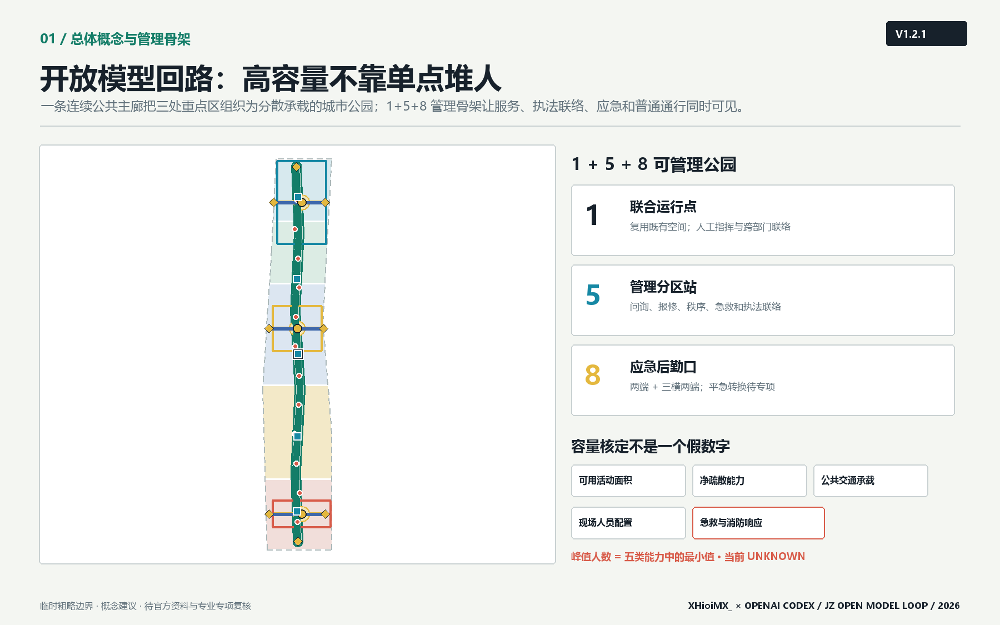
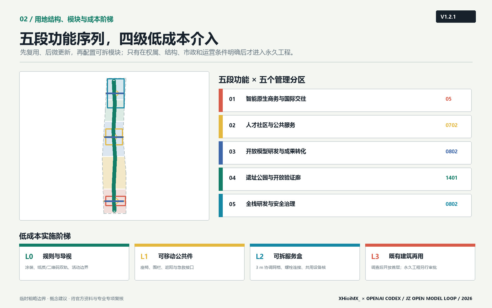
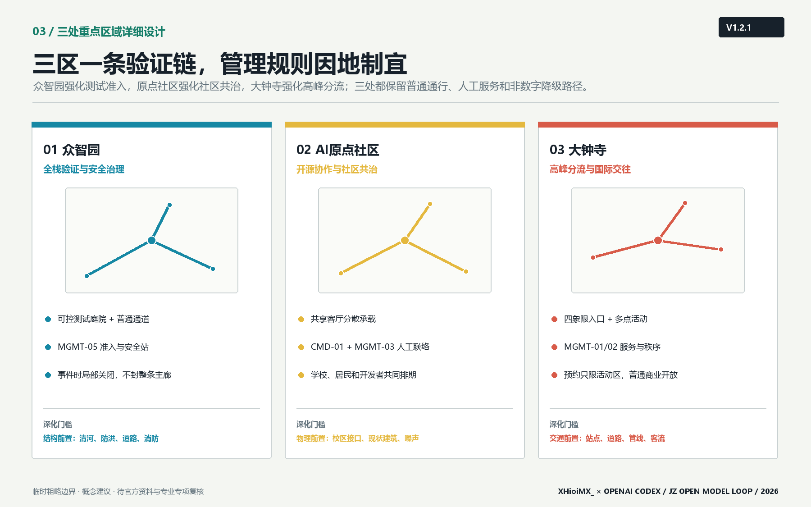
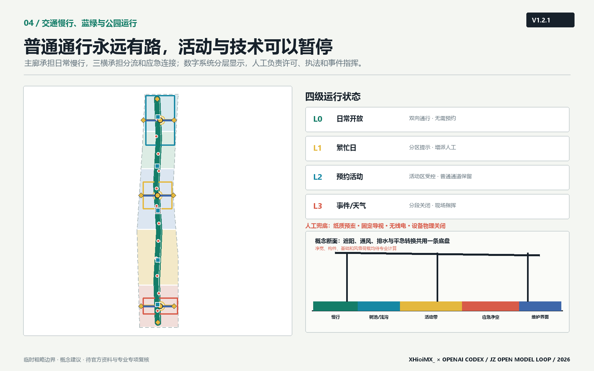
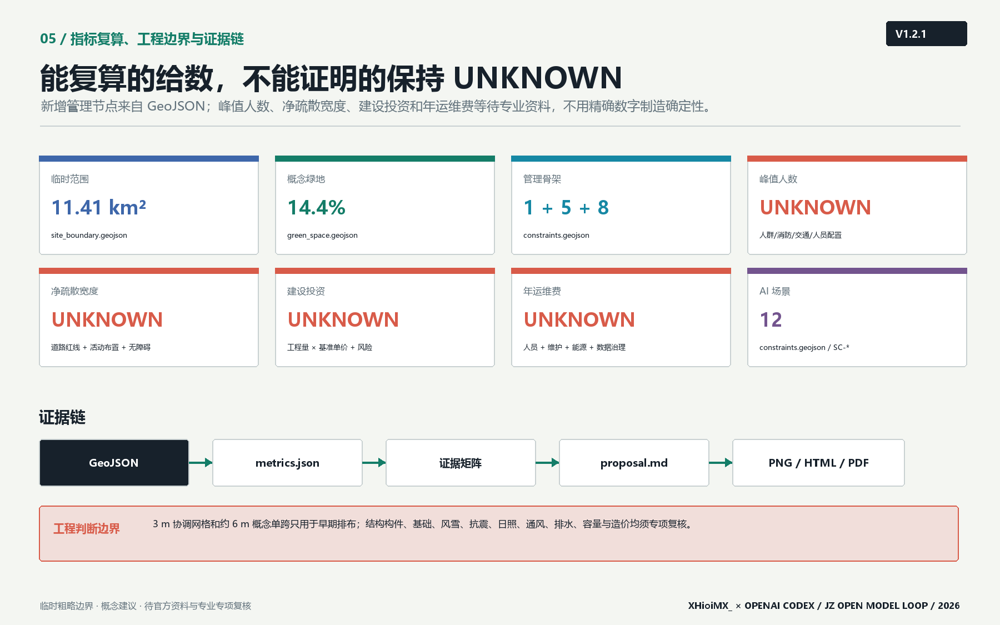

# 京张智轨开放模型回路：遗址公园驱动的AI验证城市

## 设计依据与资料清单

本方案把“资料能证明什么”置于“想画什么”之前。项目名称、三层范围、公告面积、三处重点区域、设计任务和成果语境来自官方公告；三大定位、五大功能、三区两翼、六项智能体任务及开放共创边界来自清权任务书摘录。[source:OFFICIAL-ANNOUNCEMENT] [source:AGENT-TASKBOOK] [standard:PROJECT-OFFICIAL-ANNOUNCEMENT] [standard:PROJECT-AGENT-OPEN-CALL-TASKBOOK] 当前仓库未提供 official SITE_BOUNDARY、official KEY_AREA、道路红线、控规指标、建筑现状、文保控制线、市政管线或权属资料，因此本方案只把 repository provisional polygons 用于生成、空间讨论、图面和 intake 自检，不将其称为官方红线或精确面积依据。[source:DATA-SRC-PROVISIONAL-BOUNDARIES-20260605]

资料分为三组：第一组是可支撑任务事实的 official/cleared 资料，包括公告、任务书和本地专业标准快照；第二组是 provisional-only 几何，只支撑临时图层和复算；第三组是尚缺资料，进入 `assumptions.json` 并触发结论降级。项目资料包定义允许值、范围和结构化成果约束。[source:SITE-PACKAGE] `data/processed/agent_fact_pack.md` 仅作导航，不升级原始来源的权威等级。[source:SOURCE-REGISTRY] [source:PROCESSED-FACT-PACK] 现状诊断因此不编造企业名单、建筑高度或交通流量，而聚焦可由任务确认的结构性矛盾：一条纵向遗址公共空间尚未被转译为三区协作基础设施；AI能力多在机构内部发生，公众难以理解其测试边界；人才服务、产业验证和城市体验缺少同一条可达、可审计的空间回路。[depth:existing_conditions_diagnosis]

专业依据采用《城市设计管理办法》对公共空间、城市风貌、建筑体量和重点地区协同的原则，[standard:MOHURD-URBAN-DESIGN-MEASURES] 采用《城市、镇控制性详细规划编制审批办法》区分法定控制、概念建议与待确认条件，[standard:MOHURD-CONTROL-DETAILED-PLANNING] 采用国土空间用地分类指南的仓库子集表达用地代码。[standard:MNR-LAND-USE-CLASSIFICATION-GUIDE] 建筑工程设计深度参考项缺少官方可访问正文，因此只登记为资料缺口，不把它写成已满足的权威依据。[standard:MOHURD-ARCH-DESIGN-DEPTH-2016]

### 北建大方法校准与杭州数字治理启发

本轮深化不复制任何院校作品图像或具体方案，而把北京建筑大学公开教学与实践中的方法转译为本项目自己的证据语言：以人为本、全生命周期、空间灵活性和数字化运维共同进入设计；遗产更新采用小微物理介入叠加数字内容与多方协作，先解决真实使用和维护问题，再增加互动技术。[source:BUCEA-GOOD-HOUSE-20250626] [source:BUCEA-TIANQIAO-WALK-20250626] 图面因此增加“总体结构—管理分区—场地剖面—模块构造—运营规则”的层级，保留北建大常见的分析性表达取向，但不声称代表该校官方设计风格。

杭州城市大脑案例提供的是分层治理启发：中枢汇总、跨部门协同、驾驶舱显示与具体场景服务应彼此分开，数字系统服务人工决策而非替代执法。[source:HANGZHOU-CITY-BRAIN-20201022] 本方案据此采用“现场标识/人工服务—分区站—联合指挥点”三级架构；预约只管理活动区，不把普通游园通行绑定到 App；断网时回落到纸质预案、固定导视、无线电和人工巡查。上述案例均为 background-only，不支撑本项目红线、容量、造价或工程可行性结论。

图中浅灰虚线是临时范围，绿色主廊、蓝色横向联系、红色场景节点和黄色地标才是方案主叙事。方案名称“京张智轨”中的“轨”同时指铁路历史轨迹、开放模型验证轨迹和公共治理责任轨迹；英文名 `JZ Open Model Loop` 强调这是一套可以被后续专业团队修正的开放回路，而不是封闭园区品牌。

## 三层范围工作框架

三层范围采用“战略定关系、总体定底盘、重点区做验证”的传导方式。[depth:three_level_scope_framework] 统筹研究范围约 43.6 km²，回答海淀人工智能产业与未来城市如何协同，不输出地块控制；总体设计范围公告约 11.4 km²，组织一廊三横、五段功能序列、慢行蓝绿系统和更新项目；重点区域公告约 368.4 ha，对众智园、AI原点社区和大钟寺分别形成产业、建筑更新、交通、公共空间、场景和风险小方案。[source:OFFICIAL-ANNOUNCEMENT]

| 范围层级 | 本方案工作 | 主要成果 | 数据状态 |
| --- | --- | --- | --- |
| 统筹研究范围 | 三区两翼协同、案例启发、五类资源回路 | 产业生态与区域协同框架 | 只有公告面积和文字四至，不作 polygon 复算 |
| 总体设计范围 | 一廊三横、五段用地、蓝绿慢行和节点网络 | 总体城市设计、项目与指标 | 使用 provisional SITE_BOUNDARY |
| 重点区域范围 | 三处差异化详细设计 | 重点区空间策略、场景和深化条件 | 使用 3 个 provisional KEY_AREA polygons |

提交边界记录于 [data:geometry/site_boundary.geojson#SITE-001]，其临时来源为仓库 provisional boundary [source:BOUNDARY-SOURCE]，几何复算约 11.41 km² [metric:site_area_sqm]；三处重点区记录于 [data:geometry/key_areas.geojson#PROV-KEY-001]，来源同为 provisional geometry [source:KEY-AREA-SOURCE]，数量为 3 [metric:key_area_count]。公告文字面积仍是任务事实，几何复算只用于检查图层是否闭合和是否越界，不能反向替代公告或 official polygon。official polygons 到位后须同时替换 site/key areas，并重生成 land use、buildings、roads、green space、public space、phasing、metrics、五张图、HTML 和 PDF，不能只改一处数字。

总体结构为“一廊、三横、五段、多节点”。一廊是京张开放模型慢行主廊；三横分别服务众智园全栈治理、原点社区开源转化和大钟寺国际交往；五段从南到北组织智能原生商务、人才社区、开放模型研发、遗址公园和全栈治理；多节点承载场景、公共服务和贡献展示。[depth:overall_spatial_structure] 这套结构可以随 official polygon 校准，却不会因边界替换而失去核心逻辑。

## 统筹研究范围产业与未来城市研究

### 三大定位、五大功能与三区两翼回路

三大定位不是三条平行口号，而是同一空间的三种时间尺度：百年京张文化带保存城市记忆，都市 AI 生活体验带让普通人感知并选择是否参与 AI 场景，AI 融合创新带让模型、算力、数据、场景和治理形成可审计回路。五大功能沿回路分工：众智园承接“AI全栈自主创新体系”和“AI治理全球话语权”，原点社区承接“世界级AI创新生态”，小月河场景赋能翼组织“AI+场景赋能新范式”和“智能化AI活力城市”，中关村科技服务翼提供知识产权、法务、人才、资本和国际服务，大钟寺把能力转译成城市型智能原生业态。[source:AGENT-TASKBOOK]

资源回路包含八类要素：土地只表达空间类型而不承诺供地；空间通过共享首层、公共客厅和可预约测试段提高复用；产业通过模型评测、端侧智能和智能终端形成验证链；资金只提出公开透明的多元机制研究，不写财政承诺；人才通过近校转化、生活服务和贡献声誉形成长期关系；算力采用边缘节点与集中平台协同的概念架构，容量待专项论证；数据实行授权、最小必要和版本追踪；场景采用准入、沙盒、复核、退出和归档协议。它们共同构成“能力进入城市之前先被说明、测试与治理”的未来城市形态。

### 六个国际案例启发

任务书要求 5-8 个全球案例。本方案选择六类已被广泛讨论的创新地区作为**方向性启发**，不把其面积、投资、企业或绩效数据纳入 formal 证据链；正式深化时应逐条登记官方/公开来源并复核。

| 案例启发 | 可转化机制 | 在京张的转译 | 不照搬之处 |
| --- | --- | --- | --- |
| Kendall Square [source:CASE-KENDALL-SQUARE] | 高校、研究机构、企业与公共街区紧密相邻 | 原点社区的近校成果转化和步行协作界面 | 不推导开发强度或企业名单 |
| Singapore one-north [source:CASE-ONE-NORTH] | 研发、生活和公共空间混合组织 | 众智园花园型验证街区与人才服务 | 不复制治理制度和投资模式 |
| Station F [source:CASE-STATION-F] | 大尺度共享服务降低初创协作门槛 | 开源发布厅、法务和模型卡公共服务 | 不主张单一超级建筑 |
| Barcelona 22@ [source:CASE-BARCELONA-22] | 产业更新与城市街区并行 | 大钟寺城市型智能经济和公共界面更新 | 不照搬地块指标和道路断面 |
| Toronto MaRS [source:CASE-TORONTO-MARS] | 研究、孵化、资本与公共传播连接 | 中关村科技服务翼的要素服务台 | 不编造转化率或资金安排 |
| Seoul Digital Media City [source:CASE-SEOUL-DMC] | 内容、终端、展示与城市体验联动 | 大钟寺智能终端、内容消费和国际路演 | 不以地标化替代日常公共空间 |

共同经验被压缩为三条：创新空间必须与日常城市而非门禁园区相连；技术展示必须与人才和企业服务共同发生；城市体验必须保留公共治理和退出机制。本方案的差异在于把“开放验证”作为贯穿三区的公共基础设施，使产业生态、公共利益和空间设计拥有同一套证据语言。[standard:PROJECT-AGENT-OPEN-CALL-TASKBOOK]

### 品牌和 Logo 方向

Logo 方向采用两条平行钢轨在三个节点处闭合为循环，负形形成字母 `JZ`；绿色代表公共回路，黄色代表人类判断节点，珊瑚红代表需要显性风险提示的测试场景。识别系统不使用企业商标、人物肖像、未经授权图片或特殊商业字体。命名体系分为总体品牌“京张智轨”、公共路线“开放模型回路”、场景计划“城市验证季”和贡献档案“京张开放里程”。文化导视与总体 Logo 分开：前者记录铁路里程和历史事件，后者标识开放验证协议。

## 总体设计范围城市更新与控规深度城市设计

总体设计不以拆建总量作为起点，而以“公共底盘能否连接三处能力”作为判断。完整用地分区由五条共享切线切分 site polygon，覆盖全部临时范围且无缝无重叠；其代码只用于功能结构研究，不是法定用地调整。[data:geometry/land_use.geojson#LU-001] [depth:land_use_layout] 南部以 05 商业服务业用地概念表达智能原生商务，中南部以 0702 表达人才社区服务，中部与北部以 0802 表达研发、转化和全栈验证，遗址公园段以 1401 表达连续开放空间。[standard:MNR-LAND-USE-CLASSIFICATION-GUIDE]

城市更新分为四类方法而不对具体权属建筑作结论：`保留候选`用于有历史、科研或社区价值且结构状态待核对象；`适应性再用候选`用于可通过首层开放、共享实验或人才服务提升公共性的对象；`微更新候选`用于慢行、导视、照明、无障碍和界面修补；`新增催化点候选`只表达公共服务和验证功能需要的空间容量。当前 10 个概念建筑基底面积约 61.4 ha [metric:building_footprint_area_sqm]，仅用于比较空间供给关系，不代表现状建筑、批准规模或具体新建位置。[data:geometry/buildings.geojson#BLDG-001] [depth:retain_renovate_demolish]

法定容积率、建筑高度、建筑密度、绿地率、退线、道路红线和四线全部保持 unknown。方案只提出可供专业团队深化的形态原则：遗址公园界面采用小体量、多入口、可穿行首层；近校界面优先适应性再用和共享空间；轨道门户允许形成清晰城市界面但须服从高度、消防、交通和文保条件；重要天际线与屋顶设备需在 official 控规和景观视廊到位后校核。[depth:development_intensity_controls] [depth:height_massing_character]

总体设计的创新指标不追求伪精确“产业产值”，而关注能否被持续审计：模型卡公开率、测试场景人工复核闭环率、公共空间等价退出路径覆盖率、开发者贡献归档量、居民投诉响应时间、无障碍问题修复率和 official 数据补齐率。它们需在未来运营中形成基线，本次不填造绩效数值。

### 高容量大型公园的空间承载逻辑

“容纳人数多”不等于造一个超大硬质广场，而是把高峰人流分散到五个管理分区、三处可预约活动客厅和连续普通游园带。空间上采用多入口、多目的地、可绕行环线、双向日常通行和活动区可局部围合；运营上把大型活动拆成多个同步小场景，避免所有观众在同一时间压向单一门户。提交图层增加 1 个联合运行与人工指挥点、5 个管理/服务站和 8 个应急后勤转换口。[data:geometry/constraints.geojson#CMD-01] [metric:management_sector_count] [metric:joint_command_point_count] [metric:emergency_logistics_gate_count]

峰值人数不在本轮虚构。正式容量应取“可用活动面积容量、净疏散能力、公共交通承载、现场人员配置、急救/消防响应能力”五者中的最小值，并按每种活动布置单独核定。[metric:peak_visitor_capacity_persons] 净疏散宽度也保持 unknown，[metric:minimum_clear_egress_width_m] 需在道路红线、围栏、摊位、树池、无障碍和消防通道共同落位后计算。[depth:metrics_recalculation]

<!-- V1.2-SCENARIO-ADMISSION -->
### 开放模型场景的准入、运行与退出协议

“开放模型回路”的原创性不只在空间形态，而在把每个 AI 场景写成一份可暂停的城市运行合约。任何场景先过五道门：`G0 任务匹配`确认服务对象与公共利益；`G1 数据最小化`确认来源、许可、保存期限和退出方式；`G2 空间安全`确认普通通行、无障碍、消防、气象和设备隔离；`G3 人工责任`明确现场负责人、专业复核者、投诉入口和物理关闭方式；`G4 限时试运行`记录事件、复盘和日落日期。任一门不满足，场景不进入公共空间。[data:geometry/constraints.geojson#SC-01] [depth:municipal_new_infrastructure]

运行中出现模型输出越权、告知失效、无障碍通道受阻、设备失控、投诉无法闭环、天气或人流超过已批准条件时，现场负责人直接暂停技术功能并保留普通通行；涉及许可、执法或应急指挥的决定交由有权人员。退出不是失败，而是协议的一部分：撤除设备、删除或归档依法允许的数据、恢复地面与导视、公开复盘结论，再决定修正后重试或永久退出。该协议把“可感知场景”与“可管理城市”连接起来，但不代表任何场景已经获批运营。[source:AGENT-TASKBOOK] [standard:PROJECT-AGENT-OPEN-CALL-TASKBOOK]

## 重点区域详细设计

三处重点区 polygon 均为 provisional constraint，图中以淡灰虚线表示，内部网络才表达方案动作。[depth:three_key_area_detailed_design] [data:geometry/key_areas.geojson#PROV-KEY-001]

### 众智园 AI 自主创新加速区：全栈验证与治理入口

定位是“模型进入城市之前的最后一公里验证”。空间结构采用“一条清河创新界面、一个可信评测核、多个可控测试庭院”的概念。建筑更新优先识别可适应性再用的研发空间，在公共首层配置模型卡阅览、测试预约、安全说明和专业复核；不对现状建筑作拆除判断。慢行以北部主廊与东西知识横街连接公共交通和园区入口，具体跨五环或道路工程不作可行性结论。公共空间采用可封闭测试庭院与持续开放通行路径并置，避免测试挤占日常通行。AI 场景集中开放模型评测、端侧安全沙盒和机器人共存试验。实施前必须取得清河防洪、道路红线、市政容量、消防和权属资料。

### 北京 AI 原点社区：开源协作与近校成果转化

定位是“从原始创新到可用公共产品的开源转化中枢”。空间结构采用“一条近校成果转化街、三个共享客厅、连续生活服务界面”。建筑策略以低扰动再用为先，在现有建筑调查完成后识别发布、孵化、人才居住和社区服务候选空间；不预判校园或企业建筑权属。慢行重点是校区—园区—轨道站之间的概念连接，优先修补步行连续性、无障碍和非机动车停放，站点一体化须由交通专项深化。公共空间设置开源发布台、公共数据授权舱和人才服务站。实施风险包括校区接口、现状建筑质量、首层业态、居民影响和活动噪声，需要共创工作坊和分时运营规则。

### 大钟寺 AI 产业聚集区：智能原生商务与国际交往门户

定位是“让智能体、智能终端和内容创新进入真实城市消费与商务环境”。空间结构采用“一座国际开发者会客厅、一条智能终端体验街、四象限步行连接概念”。建筑更新优先改善企业周边公共界面和可共享首层，不指定企业建筑改造。轨道站四象限通过地面过街、导视、非机动车组织和站城入口整合形成备选组合，地下或桥隧方案须另行工程论证。公共空间承载国际路演、内容展示和数据治理对话，并保留不参与AI体验的普通商业服务。实施前须补齐站点、道路、管线、交通流量、企业界面和权属资料。

三区通过三种可追溯对象循环：模型版本从众智园进入原点社区形成开源或服务接口，再在大钟寺接受真实但受控的城市体验；人才和企业需求反向进入原点社区和中关村科技服务翼；事件、投诉、退出和修复记录回到众智园治理节点。该回路是参考方案，不是既定运营或政府安排。

<!-- V1.2-KEY-AREA-CONTROLS -->
### 三处重点区的可执行控制单元

三处重点区共享“普通通行优先、活动局部围合、技术可暂停、责任可追溯”的底线，但不复制同一种设计。下表把差异落实为后续团队可以继续深化的控制单元；角色均为概念责任席位，不预设机构、编制或法定权限。[depth:three_key_area_detailed_design]

| 重点区 | 空间动作与主要使用者 | 概念责任席位 | 立即暂停条件 | 进入下一阶段的资料门 |
| --- | --- | --- | --- | --- |
| 众智园 | 可控测试庭院与连续普通通道并置；服务模型团队、专业评测者、园区职工与访客 | MGMT-05 记录准入，测试组织者负责设备，专业安全复核者签署运行条件 | 机器人/行人冲突、设备越界、告知失效、普通通道受阻或人工接管失效 | official 边界、清河防洪、道路/消防、权属、市政、结构与测试许可 |
| AI 原点社区 | 共享首层、近校转化工坊和分时公共客厅；服务师生、开发者、居民与创业团队 | CMD-01 协调，MGMT-03 接诉，空间运营者排期，社区代表参与复盘 | 噪声或排队外溢、投诉无响应、数据许可不清、无障碍路线被占 | 建筑调查、权属、轨道站接口、消防、噪声、无障碍与社区协商 |
| 大钟寺 | 四象限到达界面、多点活动客厅和普通商业通行并置；服务通勤者、国际访客、企业与居民 | MGMT-01/02 分流与服务，活动组织者负责场内秩序，有权部门决定许可和执法 | 出入口回流冲突、疏散线被占、非机动车溢出、活动区影响普通商业通行 | 站城接口、道路红线、交通仿真、停车底数、消防、权属和活动许可 |

三处控制单元都设置可见的“运营接缝”：固定导视说明谁负责、何时开放、如何投诉和如何退出；可移动围栏只围活动，不截断等价通道；设备电源和网络可分区物理关闭；事件记录从现场站点汇总到联合运行点，但不以此建立个人轨迹。[data:geometry/constraints.geojson#CMD-01] [data:geometry/constraints.geojson#MGMT-01]

## AI 创新生态、人才画像与 AI+ 场景

### 用户画像

| 画像 | 核心需求 | 空间响应 | 治理边界 |
| --- | --- | --- | --- |
| 开源开发者 | 发布、协作、测试、贡献声誉 | 原点开源发布台、开放模型回路 | 不追踪个人移动，贡献需本人授权 |
| 初创团队 | 低成本试验、法务、算力和首个城市用户 | 众智园沙盒、原点转化街 | 不承诺补贴、算力或采购 |
| 产业与专业复核者 | 可比较测试、责任链和审计记录 | 可信评测核、人工复核台 | 复核标准与利益冲突公开 |
| 周边居民 | 日常通勤、休闲、社区服务和低扰动环境 | 等价退出路径、社区服务站 | 不以居民画像做商业推荐 |
| 高校师生 | 成果转化、跨校协作和知识传播 | 近校共享客厅、成果转化台 | 科研数据和成果须另行授权 |
| 国际访客与企业来宾 | 清晰路线、双语服务、可信展示 | 大钟寺会客厅、三处地标 | 不使用未授权企业标识和案例 |

<!-- V1.2-PERSONA-MAP -->
### 画像—场景—空间—责任映射

| 画像 | 优先场景 | 主要空间 | 运营与复核责任 | 不依赖技术的等价服务 |
| --- | --- | --- | --- | --- |
| 开源开发者 | SC-01/02/06/07 | 众智园评测庭院、原点转化工坊 | 场景组织者提交模型卡；MGMT-05/03 登记；专业者复核数据与安全 | 纸质规则、人工预约与现场说明 |
| 青年科研人才 | SC-06/08/10 | 原点共享客厅、算力驿站、国际会客厅 | 空间运营者排期；数据管理员最小化记录；CMD-01 协调跨区资源 | 人工服务台、公开活动日历 |
| 创新企业团队 | SC-01/03/11 | 可控测试段、大钟寺体验街 | 企业对设备和撤场负责；安全复核者批准测试边界；有权人员决定许可 | 非测试时段恢复普通街区使用 |
| 周边居民与家庭 | SC-04/05/09/12 | 遗址公园、社区协作台、分区服务站 | MGMT 站接诉与协助；公共服务专业者处理实质事项 | 固定导视、人工窗口、无屏休息点和普通通道 |
| 国际访客及无障碍使用者 | SC-04/05/10 | 三处地标、连续慢行主廊、会客厅 | 现场服务人员提供多语与无障碍协助；体验反馈进入复盘 | 触觉/高对比导视、人工翻译、等价无障碍路线 |

该映射用于检查“谁被服务、谁承担责任、谁可以退出”。它不把画像变成商业推荐标签，也不以国籍、健康状况或出行能力推断个人身份。[depth:blue_green_public_space] [source:AGENT-TASKBOOK]

### 12 张场景卡

全部场景节点记录于 [data:geometry/constraints.geojson#SC-01]，总数 12 [metric:scenario_node_count]。每个场景执行“五项准入协议”：最小必要、显性告知、等价退出、人工复核、版本与事件可追溯。前三项属于产业测试验证场景，均是概念性沙盒，不代表获准运营。

| ID / 场景 | 服务对象与空间 | 输入与输出 | 隐私、人工复核和运营 |
| --- | --- | --- | --- |
| SC-01 开放模型评测场（产业验证） | 模型团队；众智园可信评测核 | 授权测试集、模型卡 → 分项评测与修复清单 | 不接入个人生产数据；专业评测委员会复核；版本归档 |
| SC-02 端侧智能安全沙盒（产业验证） | 终端团队；可控测试庭院 | 合成/授权传感数据 → 安全事件与回退记录 | 禁止人脸身份库；安全员可随时停止；运营需专项许可 |
| SC-03 城市机器人共存试验段（产业验证） | 机器人团队、行人；分时步行段 | 设备状态、现场观察 → 冲突点和无障碍问题 | 明示测试时段；保留等价通道；现场管理员人工接管 |
| SC-04 京张记忆智能导览 | 居民与访客；遗址主廊 | 清权历史文本、位置触发 → 多语种叙事 | 不做人群识别；史实由文博专业人员审核 |
| SC-05 无障碍慢行协助 | 行动不便者；主廊与横街 | 用户主动输入、公开设施信息 → 路线建议和问题单 | 不默认保存健康信息；用户确认；问题由人工派单 |
| SC-06 近校成果转化台 | 高校团队与初创；原点社区 | 团队自愿提交的模型卡 → 法务、标准和场景建议 | 商业秘密不公开；专家人工匹配；不承诺投资 |
| SC-07 公共数据授权舱 | 开发者、公众；原点共享客厅 | 公开数据目录、许可条款 → 可用性说明和撤销记录 | 不汇集个人数据；数据管理员审批和审计 |
| SC-08 低碳算力驿站 | 开发者和公共服务；主廊节点 | 设备负载、能源计量 → 资源使用摘要 | 只公布聚合指标；运维人员复核；容量待能源专项 |
| SC-09 社区法律与政务协作台 | 居民、小微企业；社区服务段 | 用户主动提问 → 办事材料清单和风险提示 | 不替代律师或行政决定；敏感材料不留存；人工窗口兜底 |
| SC-10 国际开发者会客厅 | 全球开发者和企业；大钟寺 | 自愿项目资料 → 双语路演、伙伴建议 | 企业授权后展示；人工策展；不声称招商结果 |
| SC-11 智能终端体验街 | 居民、访客；大钟寺商业界面 | 设备说明、体验反馈 → 可用性和安全问题单 | 默认匿名反馈；可跳过AI体验；专业机构复核 |
| SC-12 活动安全人工复核台 | 活动组织者和公众；公共路线 | 票务聚合、现场观察 → 疏导建议与事件记录 | 不做自动执法；现场指挥者决定；按活动规则删除数据 |

场景—空间—运营映射遵循“测试强度越高，空间可控性和人工责任越明确”。产业验证集中在众智园可控空间；公共服务和开源转化集中在原点社区；大规模公众体验与国际传播集中在大钟寺和遗址主廊。任何场景若无法提供等价退出路径、人工接管或授权来源，应在准入评审中暂停，而不是以创新名义先行部署。

## 用地、建筑规模与拆改留方案

用地 GeoJSON 是完整的拓扑分区，不是几块概念色带叠在空白底图上。[data:geometry/land_use.geojson#LU-001] 五段分区共享边界坐标，union 等于 submitted site boundary；任何 official polygon 替换都将触发重新切分和面积复算。[depth:land_use_layout] 0802 只表达研发与转化空间方向，0702 表达社区服务，05 表达商业服务，1401 表达公园绿地；这些代码来源于仓库登记的分类指南子集，不等于法定控规调整。[source:DATA-SRC-MNR-LAND-USE-CLASSIFICATION-202311]

建筑图层包含 10 个概念基底：国际路演客厅、人才服务站、开源孵化台、近校转化工坊、模型评测工坊、安全治理实验室、跨界协作楼、铁路记忆馆、创新服务楼和人才共居单元。[data:geometry/buildings.geojson#BLDG-001] 它们是功能容量原型，而不是对现状建筑的识别；约 61.4 ha 的合计只描述提交几何 [metric:building_footprint_area_sqm]，不推导层数、总建筑面积或容积率。

拆改留采用“调查—价值判断—安全与碳评估—权属协商—专业决策”五步法。历史与科研价值、结构安全、适配性、全生命周期碳、公共界面和使用者意愿都需进入判断。没有现状建筑和权属资料时，本方案只能列出保留/再用/微更新/新增的候选逻辑，不能指定哪栋建筑拆除或改建。[depth:retain_renovate_demolish] 高度与体量采用界面原则而非数值控制：遗址公园侧保持低扰动和细颗粒入口，轨道门户形成可识别但不过度封闭的公共界面，近校区域优先再用，所有数值待 official 控规、文保和景观专项确认。[depth:height_massing_character]

## 交通、轨道、市政与公共服务设施

交通概念由一条南北主廊和三条东西横街构成，[data:geometry/roads.geojson#ROAD-001] 主廊在临时边界内的几何长度约 9.33 km [metric:open_model_loop_length_m]。该数值用于比较连续性，不是工程里程。主廊优先服务步行、骑行、无障碍、文化导览和轻量场景；三横分别连接众智园、原点社区和大钟寺的公共界面。轨道站点策略采用“入口可见、换乘清晰、非机动车有序、过街连续、等价无AI路径”五项检查，不确定的桥隧、地下连通或道路断面不进入结论。[depth:traffic_rail_slow_parking]

众智园重点核对五环和园区入口的安全连接；原点社区重点核对五道口、清华东路西口及校区—园区慢行联系；大钟寺重点核对站点四象限地面步行、非机动车停放和企业访客路线。每处都需要 official 道路红线、站点设施、交通量、事故与无障碍数据后才能进入工程深化。

新型基础设施采用“小节点、可计量、可关闭、有人维护”的概念：低碳算力驿站只承担边缘推理、模型说明和公共服务接口，集中训练仍依赖合规专业设施；公共数据授权舱只展示目录、许可和撤销机制；环境与设备传感优先采用聚合数据，不形成个人轨迹。能源负荷、机房规模、网络、消防、防洪、排水和市政容量全部待专项测算。[depth:municipal_new_infrastructure]

公共服务以人而非技术分类：人才服务站整合法务、知识产权、标准和生活信息；社区协作台保留人工窗口；公共卫生、教育、养老等设施不编造容量，只在 official 设施底数到位后评估缺口。AI 只能辅助查询、翻译和问题归类，不替代专业服务与行政决定。

### 1+5+8 公园管理与执法联络骨架

`CMD-01` 是联合运行与人工指挥点，优先复用经调查适宜的既有建筑，不预设新建指挥中心；5 个 `MGMT-*` 站点分别服务五个功能分区，承担问询、设施报修、秩序观察、失物与走失协助、急救呼叫、活动签到和执法联络；8 个 `GATE-*` 对应主廊两端和三条横街两端，平时保持步行环境，事件时按批准预案转换为急救、消防、维护或后勤接入。[data:geometry/constraints.geojson#MGMT-01] [data:geometry/constraints.geojson#GATE-01]

管理站不自行扩大行政权力。自动识别结果只能形成待核提示，不能直接处罚、拒绝入园或建立个人轨迹；行政执法决定、强制措施、活动许可和事件指挥由有权限人员依法作出。每个站点保留人工记录、现场广播、电源隔离和设备物理关闭能力，停电、断网或模型异常时切换到固定导视、纸质清单、无线电和人工巡查。[depth:municipal_new_infrastructure]

| 运行等级 | 适用状态 | 空间动作 | 管理与执法边界 |
| --- | --- | --- | --- |
| L0 日常开放 | 普通游园、通勤和小型活动 | 主廊双向开放，活动设施收拢 | 分区巡查与人工服务；不要求预约 |
| L1 繁忙日 | 周末、节庆前后和局部客流上升 | 开启分区计数与替代路线，增加临时服务 | 只做提示和现场核验；不自动限流 |
| L2 预约活动 | 路演、演出、测试和市集 | 仅活动区凭预约进入，普通通道保持连续 | 许可、安保、医疗和疏散方案经人工批准 |
| L3 事件/极端天气 | 拥挤、设备故障、风雨雪、火情等 | 局部停用、反向疏散或全线分段关闭 | 现场指挥者决定；数字系统只提供状态与建议 |

<!-- V1.2-CAPACITY-RACI -->
### 活动容量六步决策与停止规则

高容量活动采用同一条人工签署链：`01 清除不可用面积`（树池、设备、围栏、后台、消防和无障碍通道不计入）；`02 按具体布置计算可用面积容量`；`03 复核各出口和连续净疏散能力`；`04 复核轨道、公交、步行和集散能力`；`05 复核现场人员、医疗、消防、气象和通信能力`；`06 取五类能力最小值并留出批准的安全余量`。最终峰值必须对应日期、时段、布置图和责任人，不存在脱离场景的公园永久总容量。[metric:peak_visitor_capacity_persons] [metric:minimum_clear_egress_width_m]

如果任一步资料缺失，活动只能降级为更小规模试运行或不准入；运行中触发入口持续回流、净宽被侵占、急救/消防资源不可用、极端天气阈值、通信失效或现场负责人无法接管时，立即从 L2 转为 L3，先停活动与设备，再由现场指挥决定分区疏散或关闭。普通游园路径只有在有权人员基于现实安全风险决定时才可关闭，不能由算法自动关闭。

### 概念 RACI：一件事只有一个可追责决定席位

| 决策事项 | R 执行 | A 最终负责/决定 | C 必须会商 | I 必须告知 |
| --- | --- | --- | --- | --- |
| 活动布置与撤场 | 活动组织者 | 经确认的公园运营主体 | 无障碍、消防、交通、医疗与分区站 | 周边使用者和维护人员 |
| 峰值容量与开放等级 | 专业安全复核团队 | 有权审批/运营负责人 | CMD-01、交通、消防、急救、气象 | 五个管理站和公众 |
| AI 场景上线与暂停 | 场景组织者、现场技术负责人 | 经授权的人类负责人 | 数据/伦理/安全专业者与所在 MGMT 站 | 使用者、投诉与维护渠道 |
| 行政执法与强制措施 | 有权执法人员 | 法定权限主体 | 公园运营、现场指挥和专业部门 | 当事人与受影响公众 |
| 事件处置与恢复开放 | 现场应急执行人员 | 经授权的现场指挥 | 消防、医疗、交通、设施与活动方 | 全部站点和公众 |
| 数据留存、删除与复盘 | 数据管理员 | 数据控制责任主体 | 法务、伦理、场景方和公众代表 | 被告知的参与者 |

`R/A/C/I` 只说明需在正式运营协议中落实的责任结构，不指定现实机构。一个事项可有多个执行者，但只能有一个经正式授权的最终决定席位；CMD-01 是联络和态势汇总位置，不因此取得行政权力。[depth:traffic_rail_slow_parking] [data:geometry/constraints.geojson#CMD-01]

## 蓝绿空间、公共空间与城市风貌

蓝绿公共空间不是AI场景的装饰底图，而是控制技术进入公共生活的空间制度。提交绿地 union 占临时范围约 14.4% [metric:green_ratio]，[data:geometry/green_space.geojson#GREEN-001] 公共空间 union 占约 4.1% [metric:public_space_ratio]。[data:geometry/public_space.geojson#PUBLIC-001] 两项都是概念设计比例，不是审定绿地率或公共空间指标。绿色主廊保持连续，三处公共客厅围绕重点区交点展开；技术测试区与普通通行区并置，活动可暂停，通行不依赖接受AI服务。[depth:blue_green_public_space]

城市风貌采用“铁路结构感、开源透明感、城市日常感”三层语言。铁路结构感来自双线、里程和耐久材料；开源透明感来自模型卡、责任人、测试版本和退出条件的可见表达；城市日常感要求导视、座椅、遮阴、照明和无障碍先于互动屏幕。建筑色彩、屋顶和体量只提出协调原则，待正式景观、文保和控规条件深化。[standard:MOHURD-URBAN-DESIGN-MEASURES]

三处“AI朝圣地标”不是巨型娱乐装置，而是知识与责任节点：

1. **原点开源碑**：在AI原点社区记录公共代码、模型卡、数据许可和城市贡献，以可更新信息层代替人物崇拜。
2. **京张时空信标**：在遗址主廊并置铁路里程、城市记忆和AI版本迭代，历史内容须经文博复核。
3. **模型治理罗盘**：在众智园显示测试适用边界、人工责任链、事件修复和退出机制，强调“可信来自可质疑”。

公共空间组件库包括双线导视、可逆贡献展示架、无屏幕休息点、可关闭传感杆、移动测试围栏、人工复核台和等价退出标识。所有组件采用可逆、低扰动和易维护原则，必须服从文保、绿地、蓝线、消防、交通和无障碍约束。文化叙事从“铁路缩短物理距离—中关村缩短知识转化距离—开放模型缩短技术与公共理解距离”展开，国际传播语为 `From Railway Link to Open Model Loop`，不歪曲历史，也不使用未清权图像。

### 低成本模块、建筑物理与结构合理性边界

建设策略采用“既有空间复用优先—地面微更新—可拆服务盒—必要时再做永久工程”的成本阶梯。近期只配置涂装导视、二维码/纸质双轨信息、可移动座椅和人工规则；第二级增加标准化遮阳、饮水、急救和管理模块；第三级才在取得权属、结构和市政条件后改造共享首层或公共客厅。总投资与年运维费保持 unknown，[metric:concept_capex_cny] [metric:annual_operating_cost_cny] 以经复核工程量、基准期单价、维护更换周期和风险预备费计算，不用“低价”口号替代造价文件。

模块原型采用 3 m 协调网格和不大于约 6 m 的概念单跨作为排布起点，便于普通运输、重复拼装和部件替换；这只是早期协调模数，不是结构定案。建议优先使用螺栓连接的轻型镀锌钢框架、可替换遮阳板和干式内装，端部或适当位置设置支撑跨；构件尺寸、节点、柱脚、基础、抗震、风雪荷载、冲击与疲劳必须由注册结构专业人员计算。基础优先研究可逆的地上配重或低扰动做法，但是否可用取决于岩土、地下管线、树根和文保条件。[data:geometry/buildings.geojson#BLDG-001]

建筑物理采用“少空调盒、多开放遮阴”的分层方式：连续顶棚负责夏季遮阳和降雨停留，封闭服务盒才承担冬季保温与设备保护；开敞模块保持对向通风，封闭入口设置可调风障或门斗；屋面坡向、溢流、积雪、冷凝、防水节点和地表排水须专项计算。透水铺装、浅沟和树池只作为源头减排概念，不占用消防净宽，不在缺少地下水与防洪资料时布置地下空间。日照、遮阳深度、风环境、热舒适、照明眩光、能耗和噪声均需基于北京逐时气象及具体场地模型复核。[depth:height_massing_character] [depth:risk_missing_data]

<!-- V1.2-MODULE-LIFECYCLE -->
### 模块族、维护替换与全寿命决策门

| 模块族 | 低成本构成 | 日常维护 | 触发替换/退出 | 升级为永久工程前置 |
| --- | --- | --- | --- | --- |
| M0 规则与导视 | 地面标识、纸质/二维码双轨信息、可更换面板 | 巡查可读性、内容版本和夜间反光 | 内容失效、磨损影响识读、投诉无法定位责任 | 文保、无障碍、视觉环境和运营规则确认 |
| M1 公共家具 | 可移动座椅、遮阳件、饮水/急救接口、无屏休息点 | 紧固、清洁、排水、边角和可达性检查 | 松动、积水、破损、阻挡净宽或维护成本失控 | 场地承载、树木、消防、排水和采购边界确认 |
| M2 可拆服务盒 | 3 m 协调网格、干式内装、可替换围护与设备接口 | 构件、密封、通风、能耗、设备和物理断电测试 | 腐蚀、渗漏、过热、结构异常、功能闲置或无法降级 | 岩土、基础、结构、抗震、风雪、热工、机电与审批 |
| M3 既有建筑再用 | 经调查适宜空间的共享首层和公共客厅 | 结构巡检、消防、设备、能耗与使用后评估 | 安全隐患、利用率过低、运营责任缺失或改造不可逆 | 权属、检测鉴定、文保、消防、市政和全过程造价 |

模块采购采用“接口标准化、部件可替换、设备与空间分寿命、先样段后扩展”。同一构件只有在安全、维护工时、备件可得性、能耗与公共价值共同通过复盘时才复制；若一年内持续需要临时加固、人工绕行或高频维修，则停止扩张并重新设计。造价评估必须分别列建设、运输安装、能源、保洁、备件、数据治理、人员和撤除恢复费用，避免把购置价误当全寿命成本。[metric:concept_capex_cny] [metric:annual_operating_cost_cny] [depth:phasing_implementation]

## 更新项目清单、实施政策与分期计划

分期图层把临时范围分为三段概念时序，[data:geometry/phasing.geojson#PHASE-001] 不是承诺开工日期。[depth:renewal_project_list] [depth:phasing_implementation] 近期优先可逆、低成本、无需法定控规调整的公共运营与调查；中期在数据和协商基础上深化原点社区及横向界面；远期必须以 official 红线、控规、市政、文保和权属条件为前提。

| 项目 | 阶段 | 概念动作 | 深化前置条件 |
| --- | --- | --- | --- |
| JZ-01 开放模型回路标识试点 | 近期 | 双线导视、退出标识、模型卡模板 | 文保、道路、无障碍和公共空间许可 |
| JZ-02 三处公共问题工作坊 | 近期 | 居民、开发者、专业者共同定义问题 | 参与规则、隐私和成果授权 |
| JZ-03 产业测试准入协议 | 近期 | 建立准入、沙盒、复核、退出和归档模板 | 法律、伦理、安全和责任主体复核 |
| JZ-04 大钟寺国际开发者会客厅 | 近期/中期 | 轻量路演与智能终端体验 | 权属、消防、活动和企业授权 |
| JZ-05 原点开源转化街 | 中期 | 共享首层、人才服务和成果发布 | 建筑调查、校区接口、权属和运营协议 |
| JZ-06 三条协作横街 | 中期 | 慢行、无障碍、非机动车和公共界面修补 | 道路红线、站点、交通与市政专项 |
| JZ-07 众智园可信评测核 | 中期/远期 | 模型评测、安全治理和标准展示 | 专业资质、数据授权、算力与能源条件 |
| JZ-08 全带蓝绿与市政协同深化 | 远期 | 绿廊、雨洪、照明、能源和维护一体化 | official polygons、河道、文保和市政资料 |
| JZ-09 1+5+8 公园管理试点 | 近期/中期 | 复用联合席位、五个可拆服务站、八个转换口标识 | 运营主体、执法权限、消防、道路与活动许可 |
| JZ-10 低成本模块样段 | 近期 | 3 m 协调网格的遮阳、座椅、管理和设备接口样段 | 文保、树木、结构、岩土、市政和全寿命成本复核 |

实施政策建议围绕四个公共机制：建立“临时试点不自动转长期”的日落条款；建立模型卡、数据许可、投诉、退出和事件修复公开档案；建立由居民、开发者、企业、专业者和维护者组成的多方复核机制；建立 official 数据补齐清单并在每次版本更新时重新跑空间和视觉校验。以上均为参考机制，不是已确定政策或政府承诺。

长期运营采用四季节律：春季“城市问题开源季”征集可验证公共问题；夏季“模型安全验证季”集中开展三类产业沙盒；秋季“京张开放模型周”串联公共路线、成果发布和国际交流；冬季“责任与修复季”公开事件、投诉、退出和改进档案。开发者贡献经许可进入“京张开放里程”，居民可对公共问题与体验边界提出异议，企业展示须提交模型卡和授权说明。转化路径为“问题登记—公开招募—准入评审—小规模测试—人工复核—公共反馈—修复归档—是否扩大再决策”，活动、招商、资金和成效均不作确定承诺。

## 指标体系、面积复算与合规矩阵

指标分为三类。第一类是提交几何可复算指标；第二类是法定或工程控制，当前保持 unknown；第三类是运营绩效，需试点后建立基线。这样既让方案可被机器检查，又避免用精确数字掩盖资料缺口。[depth:metrics_recalculation]

| 指标 | 当前状态与值 | 公式/依据 | 设计含义 |
| --- | --- | --- | --- |
| 临时范围面积 | known，约 11.41 km² | EPSG:4548 复算 SITE-001 [metric:site_area_sqm] | 仅检查提交图层关系，不替代公告或红线 |
| 概念建筑基底 | known，约 61.4 ha | concept footprints union [metric:building_footprint_area_sqm] | 比较催化点空间容量，不推导总建面 |
| 概念绿地比例 | known，约 14.4% | green union / site [metric:green_ratio] | 检查主廊连续性，不是审定绿地率 |
| 概念公共空间比例 | known，约 4.1% | public union / site [metric:public_space_ratio] | 支撑公共交往、测试退出和人工复核 |
| 开放模型主廊 | known，约 9.33 km | ROAD-001 length [metric:open_model_loop_length_m] | 比较南北连续性，不是工程里程 |
| AI场景节点 | known，12 | count SC-* [metric:scenario_node_count] | 覆盖任务书的场景数量要求 |
| 重点区域 | known，3 | count KEY_AREA [metric:key_area_count] | 数量确定，polygon 和面积仍 provisional |
| 管理分区 / 联合指挥点 / 转换口 | known，5 / 1 / 8 | count operations layers [metric:management_sector_count] [metric:joint_command_point_count] [metric:emergency_logistics_gate_count] | 表达概念责任骨架，不代表编制或执法管辖 |
| 峰值人数 / 净疏散宽度 | unknown | 五类能力取最小值、专业净宽计算 [metric:peak_visitor_capacity_persons] [metric:minimum_clear_egress_width_m] | 高容量目标不得越过消防、交通和人员配置 |
| 建设投资 / 年运维费 | unknown | 工程量×复核单价+风险；批准服务水平 [metric:concept_capex_cny] [metric:annual_operating_cost_cny] | 以模块化和再利用控制全寿命成本 |
| 容积率、建筑高度 | unknown | official 控规和专项缺失 | 禁止从概念基底反推 |
| 运营绩效 | baseline pending | 试点日志、投诉与人工复核记录 | 不在无运行数据时编造成果 |

证据优先级为 GeoJSON → metrics → compliance/standard/depth matrices → proposal → PNG/HTML/PDF。`compliance_matrix.json` 覆盖公告 1.3、1.4、1.5 和 agent.1-agent.6；`standard_matrix.json` 将五项 mandatory 标准映射到正文、图层、指标和图纸；`design_depth_matrix.json` 的 15 项均标为 complete，但“complete”表示证据链完整，不表示 official 数据已经补齐或方案已获专业批准。自检还需同时通过 deterministic validator、trusted spatial review、visual packaging 和 professional evidence review。

<!-- V1.2-EVIDENCE-LOCATOR -->
### 评审证据可定位索引

| 评审关注 | 最小充分证据 | 不应被误读为 |
| --- | --- | --- |
| 任务书相关性 | 三层范围、三区两翼、三大定位五大功能、六项 agent 任务及 12 场景 [standard:PROJECT-OFFICIAL-ANNOUNCEMENT] [standard:PROJECT-AGENT-OPEN-CALL-TASKBOOK] | 已取得官方资格或项目委托 |
| 原创性与 AI 规划创新 | 开放模型场景 G0-G4、普通通行优先、技术可暂停、1+5+8 人工责任骨架 [data:geometry/constraints.geojson#SC-01] | 自动执法或城市级技术部署承诺 |
| 可实施性 | 近期样段—中期协作界面—远期专业工程，容量六步决策、RACI 与 M0-M3 模块门 [data:geometry/phasing.geojson#PHASE-001] | 已批准工期、投资或采购计划 |
| 公共利益与包容性 | 五类画像映射、无 App 普通通行、等价无障碍路径、人工窗口与可投诉机制 [depth:blue_green_public_space] | 对个人身份、健康或偏好的推断 |
| 风险合规 | provisional 降级、unknown 指标、数据最小化、执法权与结构/物理专项边界 [depth:risk_missing_data] | official 红线、法定控规或工程可行性 |
| 表达完整度 | 逐项 compliance/standard/depth 矩阵、五张图、A3/A0、离线 HTML 和四道自检 | 图面替代 GeoJSON/metrics 权威链 |

本索引只帮助审稿人快速定位，不替代各章节论证。逐项矩阵已从“全量引用”改为每条要求对应最少章节、图层、指标、来源、假设和自检项，避免同一组证据被重复泛化。[depth:metrics_recalculation]

## 风险、版权与合规说明

| 风险 | 当前处理 | 进入专业深化的条件 |
| --- | --- | --- |
| official 边界和重点区缺失 | 全部标记 provisional，图面低对比，面积不作红线结论 | official CAD/GIS/清权文件与坐标、版本、哈希记录 |
| 控规和四线缺失 | FAR、高度、密度、退线保持 unknown | 经批准控规和相关专项 |
| 建筑、权属和实施底数缺失 | 只给候选方法和概念基底 | 测绘、结构、用途、年代、权属和协商资料 |
| 交通、市政、消防、防洪缺失 | 线位与设施为概念建议 | 道路、站点、管线、容量和安全专项 |
| 文保控制缺失 | 地标和导视可逆、低扰动 | 文物保护范围、建设控制地带和专业意见 |
| AI隐私、偏差与安全 | 最小必要、显性告知、可退出、有人审、可追溯 | 数据保护、伦理、安全与责任主体审查 |
| 版权与传播 | 不用外部图像、商标、肖像和远程资产 | 所有新增素材逐项登记许可 |
| 运营和承诺越界 | 全部活动、政策和分期写为参考机制 | 人类决策、正式审批、资金与实施条件另行确认 |
| 高峰容量和执法责任不清 | 峰值人数、净宽、人员配置保持 unknown；只画联络骨架 | 人群仿真、活动方案、消防/交通/急救评审与部门授权 |
| 轻型设施结构与气候性能 | 只给协调网格、构造原则和待算项目 | 岩土、结构、抗震、风雪、日照、风环境、排水与能耗计算 |
| 成本目标被误读为投资承诺 | 只给成本阶梯和可替换部件策略 | 工程量、基准单价、采购边界、维护周期和风险预备费 |

风险与缺资料主控见 [depth:risk_missing_data] 和 `assumptions.json`。建筑专业深度标准的本地条目未取得官方正文，因此 [standard:MOHURD-ARCH-DESIGN-DEPTH-2016] 只作为待补项，不能支撑“甲级院式”或施工图深度声明。版权说明见 `report/copyright_statement.md`：正文、GeoJSON、图像、HTML 与 PDF 均由本 AI agent 基于公开或清权材料生成；核心图不含外部地图截图、远程瓦片、企业标识或人物肖像；离线 HTML 不加载 CDN、远程字体、iframe、表单、API 或跟踪代码。

所有空间落地建议均为概念建议、参考方案或可供专业团队深化研究的材料，不替代正式规划，不构成政府审定结论。AI agent 对来源标注、结构化一致性、风险披露和可修复性负责；最终判断由人类、维护者和具备相应专业能力的团队完成。

## 参考资料

- [source:DATA-SRC-OFFICIAL-ANNOUNCEMENT-20260509] 官方公告：项目范围、任务、面积和成果语境。
- [source:DATA-SRC-AGENT-TASKBOOK-20260518] 清权任务书摘录：三大定位、五大功能、三区两翼、六项任务和边界条款。
- [source:DATA-SRC-PROVISIONAL-BOUNDARIES-20260605] 临时粗略边界：仅用于生成、展示和 intake 自检。
- [source:DATA-SRC-MOHURD-URBAN-DESIGN-MEASURES] 《城市设计管理办法》本地官方参考快照。
- [source:DATA-SRC-MOHURD-CONTROL-DETAILED-PLANNING] 《城市、镇控制性详细规划编制审批办法》本地官方参考快照。
- [source:DATA-SRC-MNR-LAND-USE-CLASSIFICATION-202311] 国土空间用地用海分类指南本地参考快照。
- [source:BUCEA-GOOD-HOUSE-20250626] 北建大“好房子”公开访谈：以人为本、全生命周期、灵活适应与数字运维，background-only。
- [source:BUCEA-TIANQIAO-WALK-20250626] 北建大“天桥 Walk+”实践：小微更新与物理—数字—社会空间融合，background-only。
- [source:HANGZHOU-CITY-BRAIN-20201022] 央视网报道的杭州城市大脑实践：分层数字治理与跨部门协同启发，background-only。
- `brief/site-package/design_brief.json`
- `brief/site-package/allowed_design_space.json`
- `brief/site-package/agent_taskbook.json`
- `data/source_registry.json`
- `data/processed/agent_fact_pack.md`
- `brief/site-package/standards/standards.json`

本方案引用的核心机器数据包括 [data:geometry/site_boundary.geojson#SITE-001]、[data:geometry/key_areas.geojson#PROV-KEY-001]、[data:geometry/land_use.geojson#LU-001]、[data:geometry/buildings.geojson#BLDG-001]、[data:geometry/roads.geojson#ROAD-001]、[data:geometry/green_space.geojson#GREEN-001]、[data:geometry/public_space.geojson#PUBLIC-001]、[data:geometry/constraints.geojson#SC-01] 和 [data:geometry/phasing.geojson#PHASE-001]。
