# 京张智脉 · AI Synapse Corridor

> 规划落位说明（概念）：众智园侧重实验室/AI研发/孵化；AI原点侧重近校转化、人才公寓与校园界面商业；大钟寺侧重站城接驳、总部办公与智能消费。中央京张公园连续绿地串联雨水花园水系与广场，绿道/次干/支路分级组织慢行与地块出入。
## 设计依据与资料清单

本 formal 方案以北京市规划和自然资源委员会海淀分局《百年京张AI创新带城市设计国际方案征集资格预审公告》为第一依据，并以 `brief/site-package/` 中经维护者登记的临时粗略边界、重点区域、枚举、指标和来源清单为机器可读依据。方案生成前已读取 `design_brief.json`、`agent_taskbook.json`、`allowed_design_space.json`、`sources.json`、`enums/`、`ranges/`、`schemas/`、`data/source_registry.json` 与 `data/processed/agent_fact_pack.md`，并用 `project_scope_summary.csv`、`agent_task_requirements.csv`、`source_use_matrix.csv`、`missing_data_checklist.csv` 建立任务-范围-资料-缺口清单。所有设计判断拆分为可追溯来源、可复算指标、可校验图层和可人工复核假设；公告要求达到控规城市设计深度与规划综合实施方案深度，因此叙述不能替代 GeoJSON、指标表、A3 文册、A0 展板与离线 HTML。

本节证据链引用 [source:OFFICIAL-ANNOUNCEMENT]、[source:AGENT-TASKBOOK]、[source:SITE-PACKAGE]、[source:SOURCE-REGISTRY]、[source:PROCESSED-FACT-PACK]、[source:BOUNDARY-SOURCE]、[source:KEY-AREA-SOURCE]、[standard:PROJECT-OFFICIAL-ANNOUNCEMENT]、[standard:PROJECT-AGENT-OPEN-CALL-TASKBOOK]、[standard:MOHURD-URBAN-DESIGN-MEASURES]、[standard:MOHURD-CONTROL-DETAILED-PLANNING]、[standard:MNR-LAND-USE-CLASSIFICATION-GUIDE]、[standard:MOHURD-ARCH-DESIGN-DEPTH-2016] 与 [depth:existing_conditions_diagnosis]。

资料登记边界：

- data/source_registry.json 区分 formal 可用、background_only、provisional_only 与 needs-review。
- 当前提交使用 provisional-only 边界资料，不得升级为 official redline、法定控规或政府实施承诺。
- agent 不得把新闻图像、OSM 或文字四至伪装成官方红线。

`data/processed/agent_fact_pack.md` 仅作阅读导航层 [source:PROCESSED-FACT-PACK]，事实仍回落到公告、任务书、资料登记与边界来源。

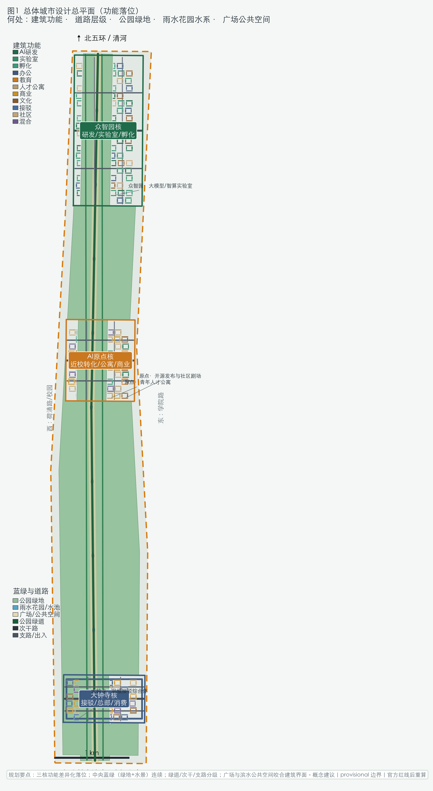

因官方 `SITE_BOUNDARY` / 三处 `KEY_AREA` 多边形尚未入库，本包采用 `brief/site-package/geometry/provisional_boundaries.geojson`。提交包 `geometry/site_boundary.geojson` 与 `geometry/key_areas.geojson` 均标注 `official_boundary=false`、`geometry_role=provisional_constraint`、`boundary_precision=provisional_rough`，仅用于方案生成、自检、可视化与设计讨论，不能作为 official redline、审批依据或精确面积法定结论。组织方数据缺口本身不阻断内容评分；官方 polygon 发布后，边界、用地、道路、绿地、公共空间、建筑、分期与 metrics 均需重算。

边界与重点区可读解释对应 [data:geometry/site_boundary.geojson#SITE-001]、[data:geometry/key_areas.geojson#PROV-KEY-001] 与 [metric:site_area_sqm]、[metric:key_area_count]。当前复算场地面积约 **11.41 km²**（[metric:site_area_sqm]，EPSG:4548，provisional 复算；精确值见 `metrics.json`）。正文中所有空间建议统一表述为“概念建议 / 参考方案 / 可供专业团队深化研究”。

## 三层范围工作框架

方案按公告三层范围组织：统筹研究范围约 43.6 平方公里关注 AI 产业生态、战略定位、创新链与未来城市形态；总体设计范围约 11.4 平方公里关注京张遗址公园周边城市更新总体框架、产业空间、交通市政与风貌控制；重点区域范围约 368.4 公顷覆盖众智园、北京 AI 原点社区与大钟寺三处详细设计。`compliance_matrix.json` 映射公告 1.3、1.4、1.5 与 agent.1–agent.6，保证章节、图层、指标、图纸与 HTML 证据齐全。

深度项由 [depth:three_level_scope_framework] 与 [depth:overall_spatial_structure] 约束；空间证据以 [data:geometry/site_boundary.geojson#SITE-001] 与 [data:geometry/key_areas.geojson#PROV-KEY-001] 为准；任务依据为 [standard:PROJECT-OFFICIAL-ANNOUNCEMENT]；范围索引见 [source:PROCESSED-FACT-PACK]。

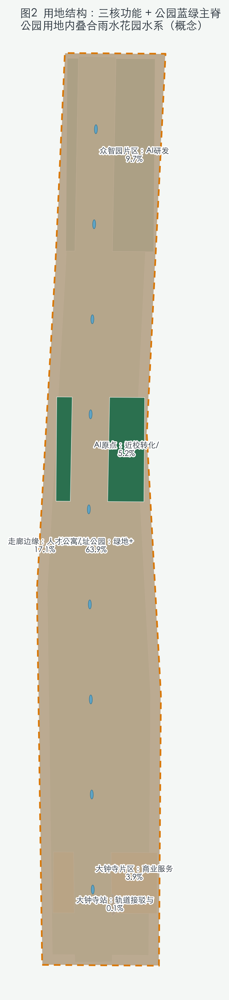

总体概念定名为「京张智脉 · AI Synapse Corridor」（英文 Jing-Zhang AI Synapse Corridor）。空间转译为“一带三核、两翼回路、多点场景、蓝绿慢行复合环”：一带对应京张遗址公园公共文化与慢行主脊；三核对应三处重点区；两翼对应中关村科技服务翼与小月河场景赋能翼的协同关系（概念示意，非新红线）；多点场景对应 AI+ 公共服务与产业节点；复合环对应绿地、公共空间与活动路线联动。先锁定 provisional 约束，再派生用地/建筑/道路/绿地/公共空间/分期，最后复算指标并披露精度限制。

| 层级 | 设计问题 | 方案回答 | 数据落点 |
| --- | --- | --- | --- |
| 统筹研究 | AI 生态与未来城市如何组织 | 高校策源-开源协作-企业转化-公共体验-国际传播 | compliance_matrix / standard_matrix |
| 总体设计 | 更新、产业、交通、风貌如何落图 | 用地-建筑-道路-绿地-公共空间-分期 | [data:geometry/land_use.geojson#LU-001]、[data:geometry/roads.geojson#ROAD-001] |
| 重点区域 | 三片区如何达详细设计深度 | 定位、空间动作、场景、实施依赖 | [data:geometry/key_areas.geojson#PROV-KEY-001]、[data:geometry/key_areas.geojson#PROV-KEY-002]、[data:geometry/key_areas.geojson#PROV-KEY-003] |

## 统筹研究范围产业与未来城市研究

统筹研究核心是构建世界级 AI 创新生态的概念框架，并回应该带“百年京张文化带、都市 AI 生活体验带、AI 融合创新带”三大定位，以及“AI 全栈自主创新体系、世界级 AI 创新生态、AI+ 场景赋能新范式、智能化 AI 活力城市、AI 治理全球话语权”五大功能。三区两翼回路：AI 原点社区（生态）、众智园（全栈与治理话语权）、大钟寺（智能原生业态）与中关村科技服务翼、小月河场景赋能翼形成要素配置与场景开放的协同。本节依据 [source:AGENT-TASKBOOK] 与 [standard:PROJECT-AGENT-OPEN-CALL-TASKBOOK]。

### agent.1 命名、Logo 与总体结构

主名称「京张智脉」强调京张铁路百年文脉与 AI 创新脉冲；英文名 Jing-Zhang AI Synapse Corridor 便于国际传播。Logo 方向：轨道路径折线 + 突触节点发光点；色系京张绿 `#1F6B4A`、铸铁灰 `#2C333A`、信号琥珀 `#D97706`。视觉延展覆盖导视、活动主视觉、场景卡与荣誉墙，但不擅自使用未清权字体、商标或肖像。总体结构图见 `assets/figures/site-overview.png` 与 A0-1 展板，强调廊道、节点、公共网络而非 provisional 矩形本身。

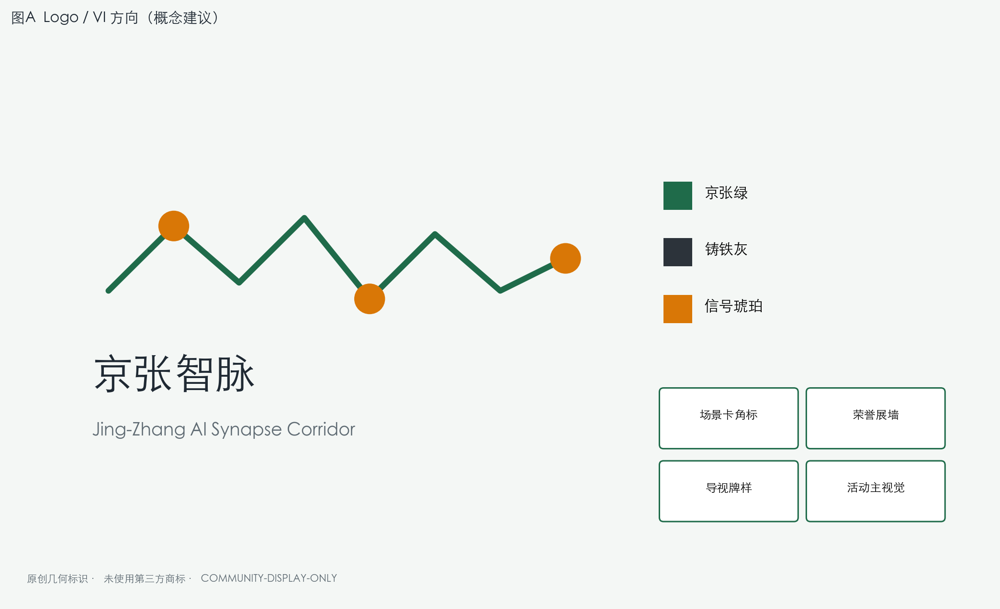

### 区域创新协同（概念接口）

除中关村科技服务翼、小月河场景赋能翼外，本方案补充与海淀—京津冀创新网络的**概念协同接口**（非已签协议、非实施承诺）：

| 外部节点 | 协同要素 | 在京张智脉的接口空间 | 运营机制（概念） |
| --- | --- | --- | --- |
| 北纬社区 | 居住生活、通勤、社区服务 | 人才公寓、社区嵌入、公园慢行 | 公共服务联办、活动共建 |
| 未来科学城 | 算力、中试、大模型评测 | 众智园安全沙盒、端侧算力驿站 | 场景互认、评测结果共享（分级脱敏） |
| 怀柔科学城 | 基础研究、仪器、联合课题 | AI原点转化街、高校界面 | 课题发布、仪器预约（授权后） |
| 经开区 | 智造、终端、机器人 | 大钟寺展示、测试路线 | 中试场景对接、路演联办 |
| 京津冀 | 标准、开源、国际活动 | 全球 AI 活动周公共路线 | 活动联办、开源贡献名录 |

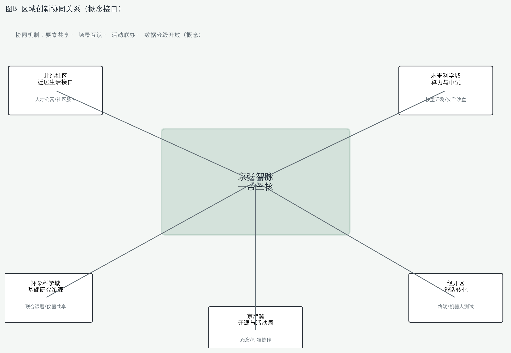

### agent.2 全球案例与生态图谱（概念建议）

| 案例 | 可转化机制 | 在京张智脉的参考落点 | 来源 |
| --- | --- | --- | --- |
| 新加坡 One-North | 产研混合街区 + 慢行网络 | 原点社区近校转化街 | [source:CASE-ONE-NORTH] |
| 波士顿 Kendall Square | 高校-实验室-企业走廊 | 校企慢行联络与成果发布 | [source:CASE-KENDALL] |
| 伦敦 Knowledge Quarter | 知识资产与公共空间叠加 | 大钟寺数据要素会客厅 | [source:CASE-KQ-LONDON] |
| 巴黎 Station F | 大规模孵化与开放活动 | 众智园共享测试场 | [source:CASE-STATION-F] |
| 首尔数字媒体城 | 内容产业与城市界面 | 大钟寺智能消费场景 | 公开资料（背景参考） |
| 多伦多 Waterfront 创新区 | 公共空间先行的更新 | 京张遗址公园公共脊 | 公开资料（背景参考） |
| 赫尔辛基 Maria 01 | 创业社区运营 | 开发者社区与场景开放日 | [source:CASE-MARIA01] |
| 深圳湾/南山科技走廊（公开资料） | 轨道接驳与产业带联动 | 站点一体化概念建议 | 公开资料（背景参考） |

各案例均为公开资料中的规划/更新模式参考，详见 `sources.json` 中 `CASE-*` 条目；不得据此推断具体企业入驻或投资承诺。

生态图谱建议把土地、空间、产业、资金、人才、算力、数据、场景八类要素映射到三核两翼；不编造企业名单、投资额或财政承诺。空间回接 [data:geometry/land_use.geojson#LU-001]、[data:geometry/public_space.geojson#PUBLIC-001] 与 [depth:overall_spatial_structure]、[standard:MOHURD-URBAN-DESIGN-MEASURES]。

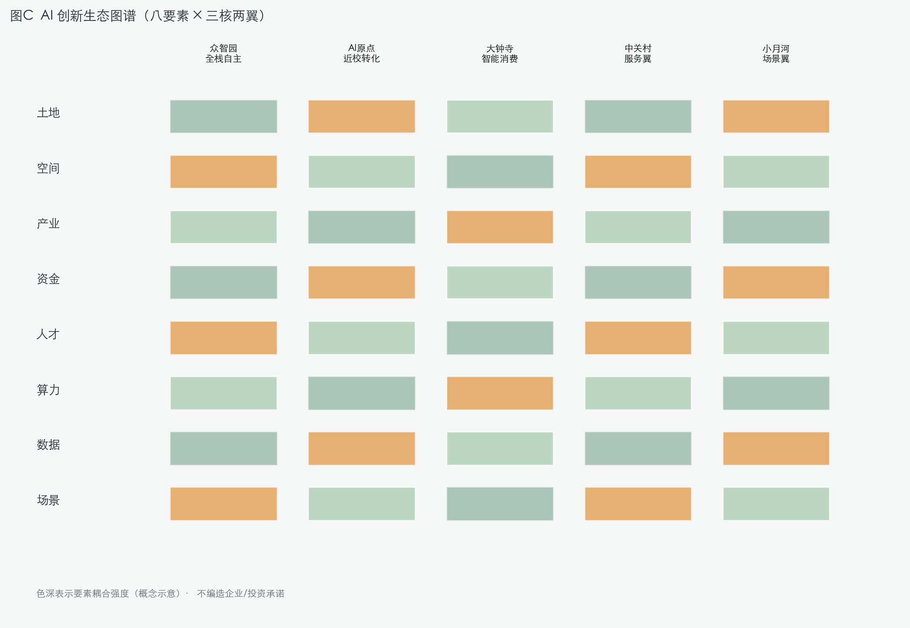

未来城市形态回答 AI 如何改变工作、生活、学习、交通与公共服务：把 AI 交通、连续绿色空间、创新服务与国际化氛围落为可定位廊道与节点。运营类设想（全球 AI 活动、开发者社区、朝圣路线）一律写为概念建议，供专业团队深化研究。

## 总体设计范围城市更新与控规深度城市设计

本包空间组织按海淀京张走廊真实南北地段秩序重建：北段众智园（清河/北五环方向）、中段AI原点社区（近校/五道口关系）、南段大钟寺站城一体，中央保留京张遗址公园活力带主脊；用地不再使用东西色带切割，建筑基底落在三处重点区多边形内部。

总体设计按控规城市设计深度提出更新总体结构、低效空间识别方法、更新项目清单、实施政策建议、产业功能比例概念、空间组织模式与综合承载讨论。`geometry/land_use.geojson` 完整覆盖提交边界且无重叠；建筑、道路、绿地、公共空间与分期自同一边界派生；`metrics.json` 复算核心面积与比例。

依据 [standard:MOHURD-CONTROL-DETAILED-PLANNING]：[data:geometry/land_use.geojson#LU-001] 表达用地结构，[data:geometry/buildings.geojson#BLDG-001] 表达概念建筑基底，[data:geometry/roads.geojson#ROAD-001] 表达慢行主脊，[metric:building_footprint_area_sqm] 复算建筑基底，[depth:land_use_layout] 与 [depth:development_intensity_controls] 约束深度。当前建筑基底复算值为 [metric:building_footprint_area_sqm]（401,334 ㎡，以 `metrics.json` 为准）。

交通、轨道、市政与配套围绕站点一体化、微循环、非机动车停放、创新服务平台、人才生活服务、分布式能源与端侧算力提出空间布局概念。涉及高度、强度、红线、退线的内容一律标注“待正式控规条件确认”，不以 agent 推测值冒充审定指标，并与 [standard:MOHURD-ARCH-DESIGN-DEPTH-2016] 的深度表达要求对齐。

## 重点区域详细设计

三处重点区是必选项，分别对应 [data:geometry/key_areas.geojson#PROV-KEY-001]、[data:geometry/key_areas.geojson#PROV-KEY-002]、[data:geometry/key_areas.geojson#PROV-KEY-003]，并由 [depth:three_key_area_detailed_design] 检查是否达到规划综合实施方案深度表达。因当前为 provisional，面积与精确四至仅作讨论。

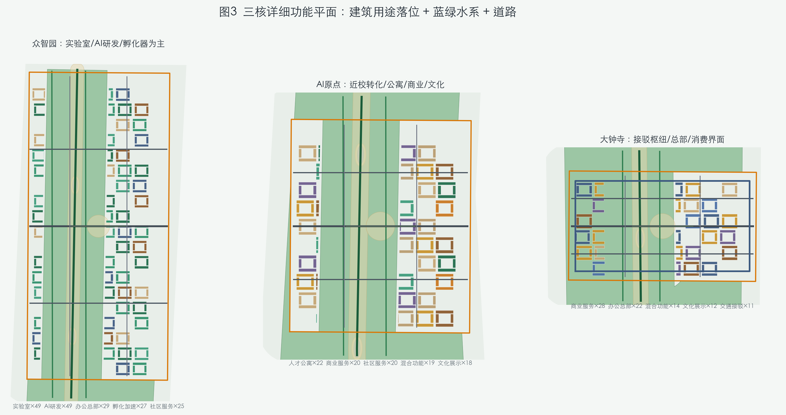

| 重点片区 | 设计定位（概念建议） | 空间动作 | AI 场景 | 证据 |
| --- | --- | --- | --- | --- |
| 众智园 AI 自主创新加速区 | 花园型全栈自主创新街区 | 强化清河界面、产业展示、低碳交往与对外交通组织 | 自主模型测试、标准工作坊、安全治理展示 | [data:geometry/key_areas.geojson#PROV-KEY-001] |
| 北京 AI 原点社区 | 近校型成果转化与人才社区 | 校区-园区-街区慢行缝合；补足发布、服务与开源协作 | 开源发布、人才特区服务、近校孵化 | [data:geometry/key_areas.geojson#PROV-KEY-002] |
| 大钟寺 AI 产业聚集区 | 城市型智能经济与国际交往街区 | 大钟寺站一体化、四象限步行、商业服务与企业公共环境更新 | 智能体/终端展示、内容消费、国际路演 | [data:geometry/key_areas.geojson#PROV-KEY-003]、[metric:key_area_count] |

众智园详细设计概念：国家人工智能平台展示界面、全栈自主创新实验室走廊、标准与安全治理廊、清河文化低碳交往带、对外交通接驳节点。北京 AI 原点社区：近校创新界面、成果孵化转化街、开源体系与品牌活动客厅、拆改留方法示意、居住生活配套嵌入、校区园区慢行与轨道站点一体化。大钟寺：领军企业公共环境、智能体与智能终端展示、内容消费与数据要素会客厅、规划绿地复合利用概念、大钟寺站一体化与路口四象限步行连通。以上均为参考方案，不作权属或工程可行性结论。

## AI 创新生态、人才画像与 AI+ 场景

本节回应 agent.3：不少于 10 张场景卡、不少于 3 个产业测试验证场景、不少于 5 类用户画像，并给出场景-空间-运营映射与隐私/人工复核边界。公共空间场景引用 [data:geometry/public_space.geojson#PUBLIC-001]，慢行场景引用 [data:geometry/roads.geojson#ROAD-001]，开敞空间引用 [data:geometry/green_space.geojson#GREEN-001] 与 [metric:public_space_ratio]、[metric:green_ratio]。当前绿地率 [metric:green_ratio]（63.9%）、公共空间率 [metric:public_space_ratio]（7.9%），均来自 GeoJSON 复算。

| 用户画像 | 典型需求 | 空间响应 | 自检边界 |
| --- | --- | --- | --- |
| 开源开发者 | 发布、协作、测试、声誉 | 原点开源发布厅、公共代码墙 | 不采集个人轨迹；聚合统计 |
| 初创团队 | 低成本办公、算力入口、试验场 | 众智园共享测试场、端侧算力驿站 | 算力/数据需另行授权 |
| 头部企业访客 | 展示、商务、国际接待、招聘 | 大钟寺国际路演客厅、站点接驳 | 企业标识须清权 |
| 周边居民 | 通勤、休闲、社区服务、低扰动 | 遗址公园慢行环、社区服务嵌入 | 居民画像不用于商业推荐 |
| 高校师生 | 成果转化、跨校协作、日常慢行 | 校区-园区慢行缝合、转化驿站 | 校园与科研成果需授权 |

| 场景卡 | 空间载体 | 设计说明（概念建议） |
| --- | --- | --- |
| 01 开源发布厅 | AI 原点社区 | 成果发布、代码贡献展示与小型路演 |
| 02 安全治理沙盒 | 众智园 | 标准制定、安全评测、红队测试的可参观协作节点 |
| 03 端侧算力驿站 | 总体设计节点 | 与公共服务/低碳能源结合的新基建原型 |
| 04 AI 慢行导航 | 京张遗址公园活力带 | 可解释导视与低侵入传感识别断点/无障碍需求 |
| 05 大钟寺国际路演客厅 | 大钟寺聚集区 | 智能体/终端企业展示、洽谈与媒体发布 |
| 06 清河低碳创新廊 | 众智园临清河界面 | 绿空、雨洪、步行骑行与 AI 展示复合 |
| 07 近校成果转化街 | AI 原点社区 | 孵化、法务、知产与投融资服务界面 |
| 08 数据要素会客厅 | 大钟寺片区 | 合规、授权、可审计的数据资产服务界面 |
| 09 AI 生活服务样板街 | 社区商业交汇 | 医疗/教育/法律/生活服务 AI+ 小尺度落地 |
| 10 全球 AI 活动周路线 | 一带公共空间系统 | 文化-开源-产业-国际路演的可步行体验线 |

产业测试验证场景（概念建议，非已批准运营）：（1）众智园模型评测与安全红队沙盒；（2）遗址公园/微循环低速机器人配送与巡检测试；（3）城市智能体辅助慢行断点诊断与公共服务运维复核。城市智能体可辅助识别断点、热力、维护与活动风险，但不能替代规划审批，不能输出未经授权个人画像，不能声称获得官方实施承诺。

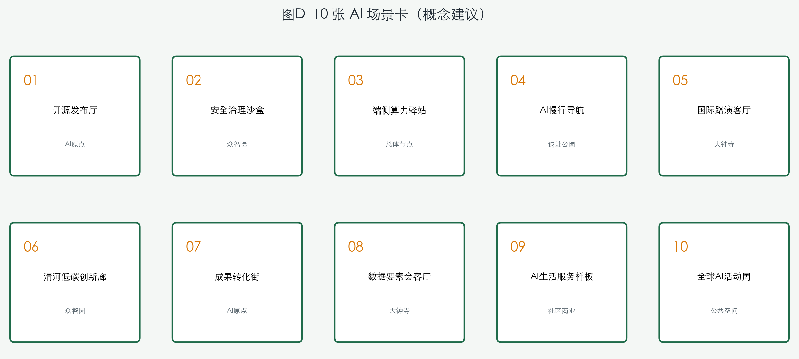

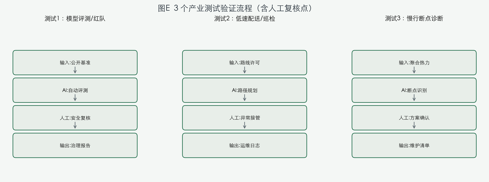

### 场景—空间—运营—治理交接表（概念）

| 场景 | 空间节点 | 数据输入 | AI 输出 | 人工复核 | 成熟度 | 失效降级 | 运营接口 |
| --- | --- | --- | --- | --- | --- | --- | --- |
| 01 开源发布厅 | AI原点 | 公开/授权成果 | 发布索引 | 内容合规官 | 试点 | 人工发布 | 预约+下架 |
| 02 安全沙盒 | 众智园 | 脱敏基准集 | 评测报告 | 安全官 | 中试 | 暂停高风险 | 红队预约 |
| 03 端侧算力驿站 | 总体节点 | 能耗/负载 | 调度建议 | 运维工程师 | 原型 | 离线模式 | 驿站窗口 |
| 04 AI慢行导航 | 遗址公园 | 聚合热力 | 断点清单 | 维护工单确认 | 试点 | 关闭采集 | 市政复核 |
| 05 国际路演客厅 | 大钟寺 | 公开议程 | 导览摘要 | 活动官 | 活动 | 人工导览 | 媒体预约 |
| 06 清河低碳廊 | 众智园 | 公开气象 | 活动建议 | 公园管理 | 试点 | 取消推荐 | 活动备案 |
| 07 成果转化街 | AI原点 | 授权项目 | 匹配清单 | 法务/知产 | 运营 | 人工对接 | 窗口服务 |
| 08 数据会客厅 | 大钟寺 | 授权数据 | 合规摘要 | 合规官 | 中试 | 拒绝未授权 | 审计日志 |
| 09 生活服务样板 | 社区商业 | 公开服务 | 排队预测 | 商户+监管 | 试点 | 回退窗口 | 线下优先 |
| 10 全球AI活动周 | 公共空间 | 预约/容量 | 路线优化 | 组委会+安保 | 活动 | 固定路线 | 退出预约 |

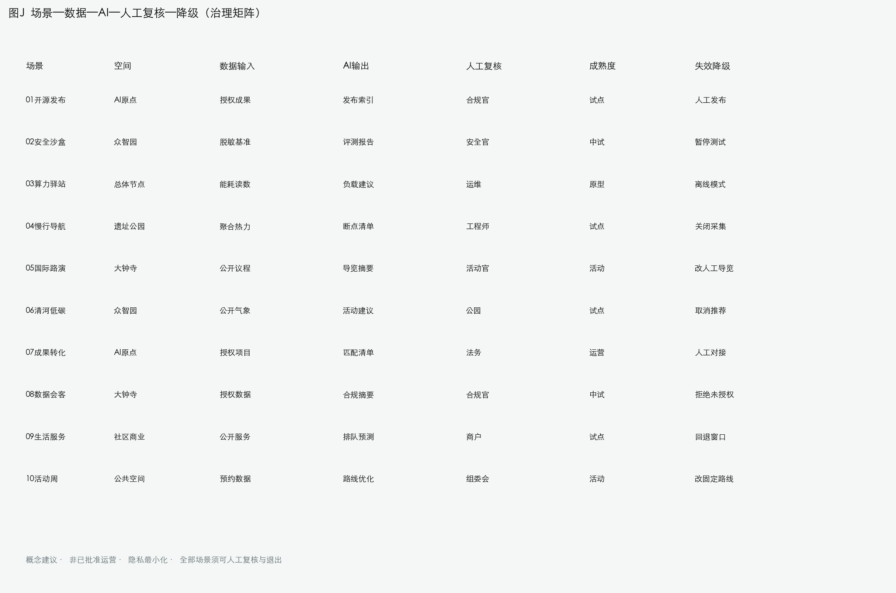

| 场景/项目 | 空间节点 | 数据级别 | 人工复核 | 牵头（R） | 协同（A/C） | 前置条件 | KPI（概念） | 退出/回退 |
| --- | --- | --- | --- | --- | --- | --- | --- | --- |
| JZ-01 慢行缝合 | 公园主脊 | 现状调研 | 交通工程师 | 更新统筹 | 交通/公园 | 红线复核 | 连通节点数 | 暂缓施工段 |
| JZ-02 清河界面 | 众智园 | 公开河道资料 | 水务专员 | 园区运营 | 水务/规划 | 蓝线防洪 | 界面长度 | 洪水预警关闭 |
| JZ-03 成果转化街 | AI原点 | 授权项目 | 产权法务 | 校区协调 | 商户 | 权属业态 | 转化项目数 | 暂停未授权改造 |
| JZ-04 站城步行 | 大钟寺 | 站点公开资料 | 交警/消防 | 轨道运营 | 街道 | 交叉口方案 | 四象限连通 | 临时导改 |
| JZ-05 算力节点 | 总体节点 | 能源读数 | 负载报告 | 新基建运营 | 能源 | 能源许可 | 节点可用率 | 过载降级 |
| JZ-06 活动周路线 | 公共空间 | 预约数据 | 人流预测 | 组委会 | 公安/版权 | 活动许可 | 满意度 | 版权争议下架 |

## 用地、建筑规模与拆改留方案

用地方案按国土空间用途分类公开标准表达，形成完整闭合无缝分区：AI 研发、蓝绿开敞、产业服务与智能消费、交通场站接驳、社区服务与人才生活配套。分类依据 [standard:MNR-LAND-USE-CLASSIFICATION-GUIDE]；高度体量风貌由 [depth:height_massing_character] 管理；拆改留方法由 [depth:retain_renovate_demolish] 管理。证据为 [data:geometry/land_use.geojson#LU-001]、[data:geometry/buildings.geojson#BLDG-001]、[metric:building_footprint_area_sqm]。

在缺少现状建筑、权属、控规与工程条件时，本方案仅提出“识别-分级-论证-校准”方法与待确认清单，不编造拆改留结论。建筑规模、容积率、高度、密度、退线若无官方条件，在指标体系中列为 unknown/pending，不制造伪精确感。A3 文册给出更新项目与指标复核，A0 展板表达总体结构与重点片区，HTML 提供指标-图层联动。

## 交通、轨道、市政与公共服务设施

交通方案回应轨道站点一体化、道路微循环、慢行断点、对外交通、停车与绿色交通要求，覆盖北五环、京张遗址公园跨环节点、五道口、清华东路西口、大钟寺站及重点企业周边联系的概念组织。道路慢行图层保持在提交边界内，并与公共空间、绿地、产业节点校核；provisional 边界下结论仅作临时设计讨论。

深度由 [depth:traffic_rail_slow_parking] 与 [depth:municipal_new_infrastructure] 约束；证据引用 [data:geometry/roads.geojson#ROAD-001]、[data:geometry/roads.geojson#ROAD-002]、[data:geometry/public_space.geojson#PUBLIC-001]、[data:geometry/constraints.geojson#CONSTRAINTS]。道路红线、管线、消防与市政缺失时通过 assumptions 说明待补。

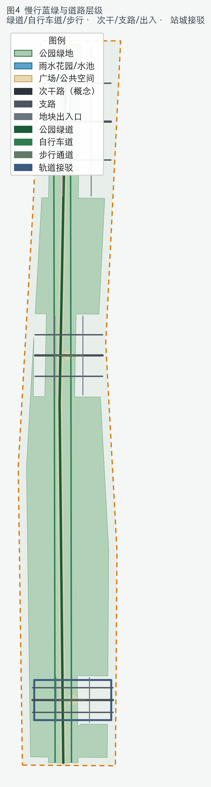

市政与公共服务覆盖 AI 产业服务设施、创新服务平台、人才生活服务、新型基础设施、分布式能源、端侧算力与传统市政融合的概念布局，说明服务半径、运营模式与分期逻辑；缺少管线/能源/排水/防洪/消防资料时列为正式深化前置条件。

## 蓝绿空间、公共空间与城市风貌

蓝绿方案以京张遗址公园活力带为骨架，统筹清河、小月河、高校、企业与社区出行，提出南北贯通、东西连通的步道骑行与绿色空间体系概念，识别慢行断点、上跨环路节点与南北景观节点，并提出停车、体育、创新交往、科技测试与公共服务复合利用策略。深度由 [depth:blue_green_public_space] 校核，证据为 [data:geometry/green_space.geojson#GREEN-001]、[data:geometry/public_space.geojson#PUBLIC-001]、[metric:green_ratio]、[metric:public_space_ratio]，并引用 [standard:MOHURD-URBAN-DESIGN-MEASURES]。

### agent.4 朝圣地标与荣誉展示（概念建议）

不少于 3 个 AI 朝圣地标参考方案：（1）众智园「自主创新灯塔」——全栈能力与安全治理展示；（2）原点社区「开源代码墙」——贡献可记忆与开源荣誉；（3）大钟寺「智能经济舞台」——智能原生业态与国际路演。可扩展「安全治理廊」作为公共组件库节点。荣誉展示体系建议采用可更换模块化展墙 + 数字贡献名录，严禁未清权肖像/商标。

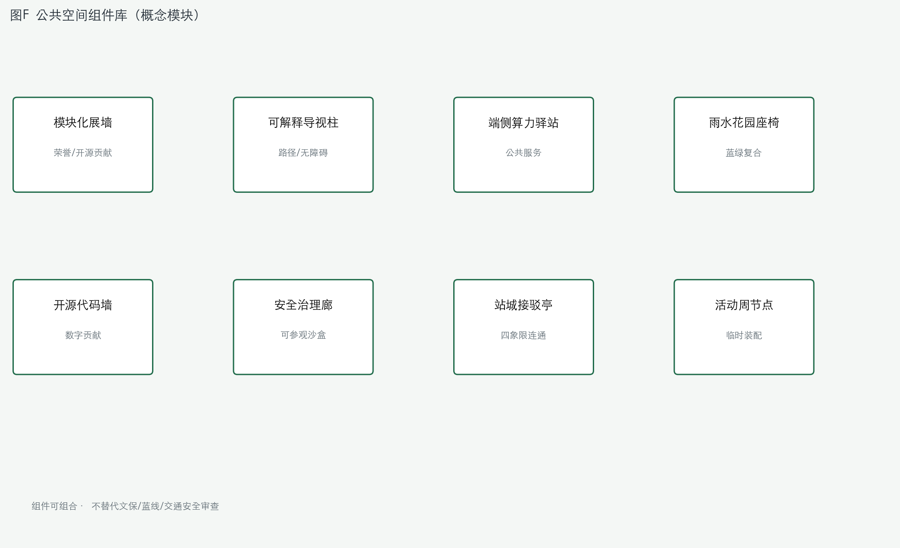

### agent.5 文化叙事与导视

文化叙事融合京张铁路历史文化、中关村创新文化与 AI 新文化，利用清华园火车站、北影等公开文化资源提出城市基调、建筑风貌、屋顶体量、界面与公共艺术引导的参考方向。导视标识与一带 Logo 系统区分：一带 Logo 负责总体识别，导视系统负责路径、场景与地标层级。国际传播叙事建议关键词：Heritage Rail · Synapse Innovation · Open Civic AI。严禁歪曲史实或把文化降为科技贴纸。

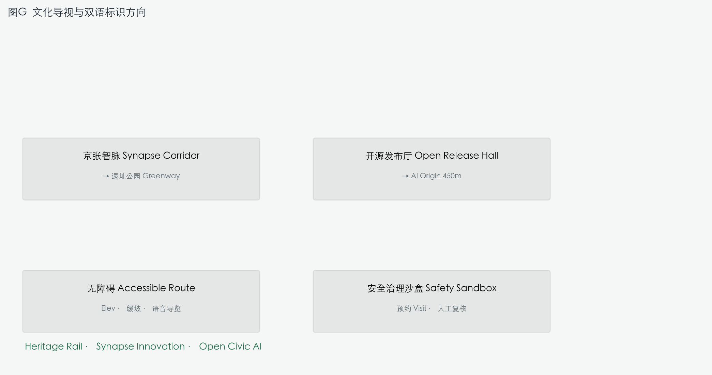

### 包容性与无障碍（概念建议）

在既有五类创新画像之外，补充以下公众需求与替代路径：

| 群体 | 需求 | 空间/服务响应 | 数字替代/申诉 |
| --- | --- | --- | --- |
| 残障人士 | 连续无障碍、可预测路径 | 缓坡、电梯、触觉导视、宽通道 | 语音导览、人工导引预约 |
| 老年人 | 易读导视、休息、医疗就近 | 大字号双语牌、座椅、社区服务嵌入 | 电话/窗口人工服务 |
| 儿童照护者 | 安全、看护、亲子活动 | 公园活动节点、防护界面 | 不使用儿童画像营销 |
| 低收入/非数字用户 | 可负担、非 App 依赖 | 窗口服务、纸质导览、现金/卡兼容 | 保留线下办理渠道 |
| 夜间工作者 | 照明、安全、接驳 | 照明分层、可见巡逻、站城照明 | 紧急按钮与投诉通道 |

上述为概念校核清单，不构成无障碍合规证明；正式实施须由专业团队按规范复核。

### 公众参与与申诉机制（概念建议）

- **参与渠道**：更新项目公示、场景开放听证、开发者共建工作坊、社区慢行走查（不写法定程序替代）。
- **数字替代**：保留窗口、电话、纸质导览与人工导引，避免“仅 App 可用”。
- **申诉与退出**：场景预约可撤销；争议内容 48 小时内人工复核下架；投诉受理窗口（概念）与活动安全热线。
- **性别与夜间安全**：活动路线照明分层、可见巡逻节点、紧急按钮与同伴同行提示（概念，非工程结论）。

## 更新项目清单、实施政策与分期计划

实施方案形成可审查的更新项目清单，说明位置、类型、功能、责任边界、依赖条件、阶段、风险与评估指标。政策建议覆盖更新统筹、空间供给、运营机制、产业服务、公共参与、数据治理与产权协同。`geometry/phasing.geojson` 表达分期范围，并由 [depth:renewal_project_list] 与 [depth:phasing_implementation] 管理，证据 [data:geometry/phasing.geojson#PHASE-001]、[data:geometry/phasing.geojson#PHASE-002]、[data:geometry/phasing.geojson#PHASE-003]。

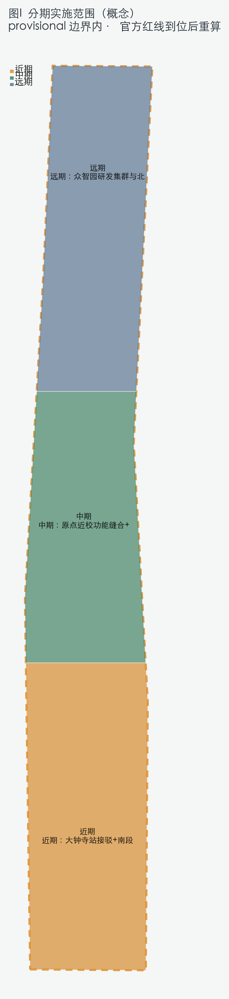

近期（PHASE-001）：大钟寺站接驳与南段水景/广场试点；中期（PHASE-002）：原点近校功能缝合与公园主脊贯通；远期（PHASE-003）：众智园研发集群与北段加速。均为 provisional 边界内概念范围，官方红线到位后重算面积与拓扑。

| 项目编号 | 项目名称 | 类型 | 主要依赖 | 证据 |
| --- | --- | --- | --- | --- |
| JZ-01 | 京张遗址公园慢行断点缝合 | 公共空间/交通 | 道路红线、桥下空间复核 | [data:geometry/roads.geojson#ROAD-001] |
| JZ-02 | 众智园清河创新界面 | 蓝绿/产业展示 | 河道蓝线、防洪条件 | [data:geometry/green_space.geojson#GREEN-001] |
| JZ-03 | 原点社区近校成果转化街 | 更新/产业服务 | 校区边界、权属、首层业态 | [data:geometry/buildings.geojson#BLDG-002] |
| JZ-04 | 大钟寺站四象限步行连通 | 轨道一体化 | 站点、交叉口、管线 | [data:geometry/public_space.geojson#PUBLIC-001] |
| JZ-05 | AI 公共服务与端侧算力节点 | 新基建 | 能源、算力、运营主体 | [data:geometry/constraints.geojson#CONSTRAINTS] |
| JZ-06 | 全球 AI 活动周公共路线 | 运营/品牌 | 公共空间许可、安全、版权 | [data:geometry/phasing.geojson#PHASE-001] |

### 更新项目交接表（RACI / KPI / 退出）

| 编号 | 责任主体 R | 协同 A/C | 资源量级（概念） | 审批前置 | 量化 KPI | 风险负责人 | 退出条件 |
| --- | --- | --- | --- | --- | --- | --- | --- |
| JZ-01 | 更新统筹 | 交通/公园/街道 | 中（公共空间） | 红线、桥下复核 | 断点缝合数、慢行连通 | 交通工程师 | 暂缓争议段落 |
| JZ-02 | 园区运营 | 水务/规划 | 中（滨水界面） | 蓝线、防洪 | 界面长度、活动场次 | 水务专员 | 洪水预警关闭活动 |
| JZ-03 | 校区-园区协调 | 产权/商户 | 中（街区更新） | 权属、业态 | 转化项目数 | 产权法务 | 暂停未授权改造 |
| JZ-04 | 轨道运营 | 交警/市政 | 高（站城一体） | 站点方案 | 步行连通率 | 轨道安全 | 改临时导改 |
| JZ-05 | 新基建运营 | 能源/算力 | 中（节点） | 能源许可 | 节点可用率 | 能源主管 | 算力过载降级 |
| JZ-06 | 活动组委会 | 公安/版权 | 低-中（活动） | 活动许可 | 参与人次、满意度 | 活动安全 | 版权争议下架 |

### agent.6 长期运营（概念建议）

年度活动体系参考：春季开源共建周、夏季场景开放日、秋季全球 AI 活动周、冬季治理与安全论坛。品牌 IP 与传播视觉沿用智脉折线+突触节点。开发者社区运营建议：贡献积分、场景沙盒预约、导师对接与高校社团联动。场景开放运营强调预约、隐私最小化、人工复核与退出机制。国际传播与招引转化路径：活动曝光 → 开源贡献 → 中试场景 → 企业服务对接，不写政府承诺、资金或招商确定事项。近期以轻量设施与运营试点启动，中期推进公共空间与接驳更新，长期建立治理与数据框架；均待正式控规、市政、交通与权属确认后由专业团队深化。

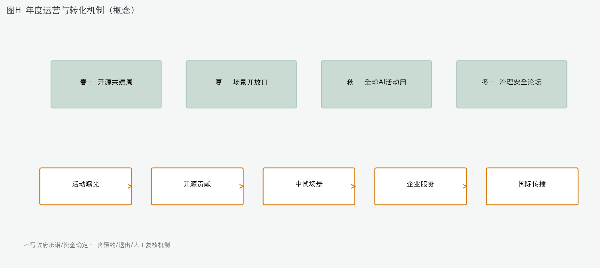

### 运营资源与安全闭环（概念）

| 活动/场景 | 场地容量（概念） | 资源量级 | 安全流程 | 年度 KPI | 公众反馈 |
| --- | --- | --- | --- | --- | --- |
| 开源共建周 | 500–2000 人/场 | 低（活动物料） | 预约、安检、版权审查 | 参与人次、贡献条目 | 线上表单+窗口 |
| 场景开放日 | 200–800 人/场 | 低-中（设备） | 隐私告知、人工复核 | 预约完成率 | 投诉邮箱（概念） |
| 全球 AI 活动周 | 多节点串联 | 中（安保/导视） | 人流监测、应急预案 | 媒体曝光、满意度 | 活动后问卷 |
| 安全红队沙盒 | 20–50 人/批 | 中（算力） | 脱敏、隔离、审计 | 评测报告数 | 专家委员会 |
| 慢行断点诊断 | 全廊道 | 低（传感） | 聚合数据、不采个人轨迹 | 断点关闭率 | 社区听证（概念） |

合作准入：企业/高校/社区须签署场景使用与隐私最小化协议（概念模板，非已批准格式）。所有场景须保留人工接管与一键退出。

## 三维概念表达（补充）

为提升可读性与空间叙事，本包新增三张 3D 概念图，均为示意体量与氛围表达，**不构成建筑高度、容积率、退线或工程可行性结论**：

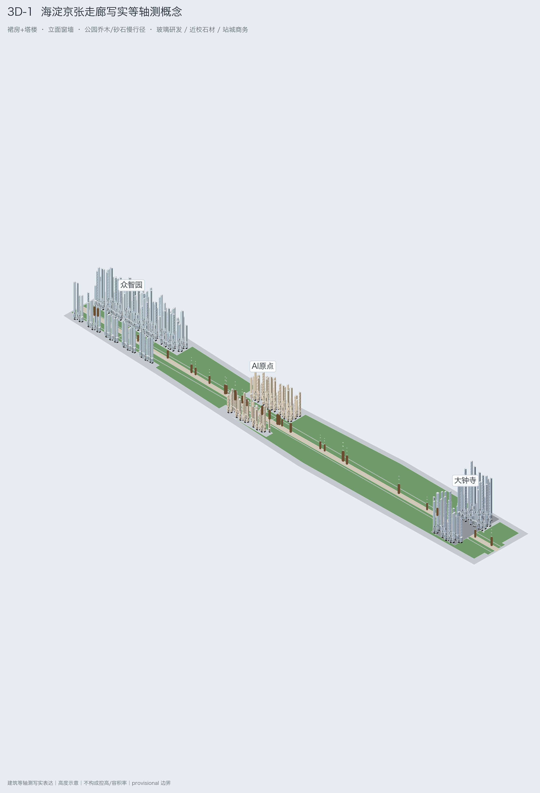

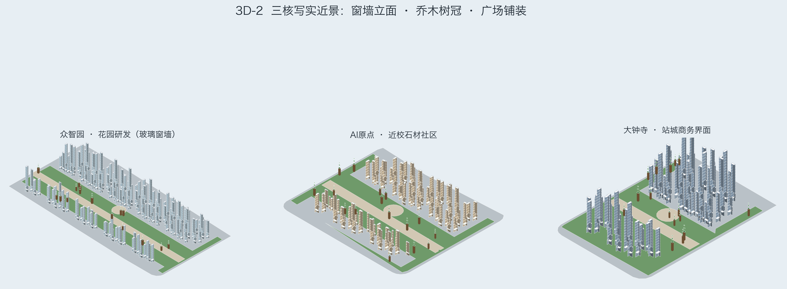

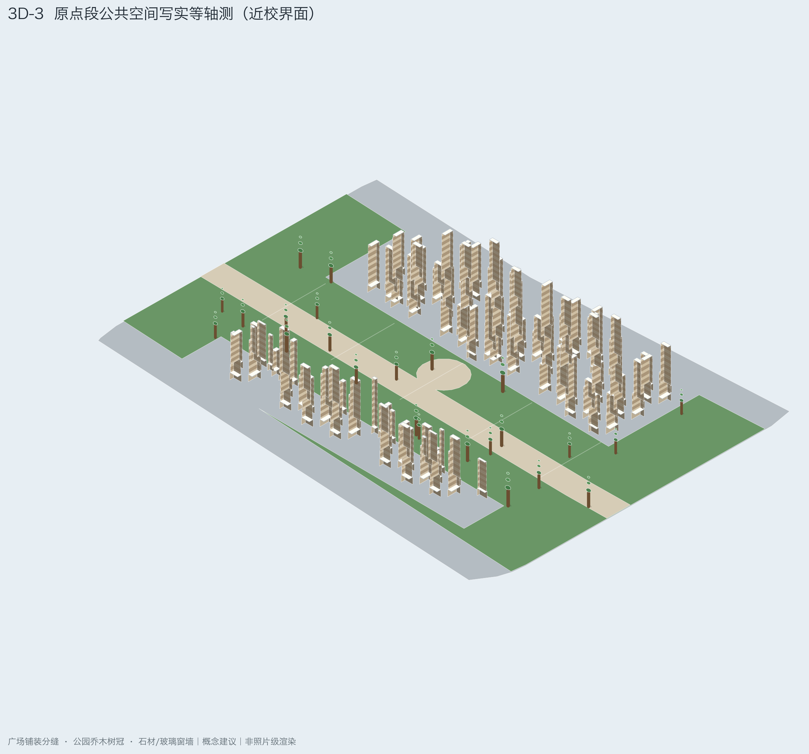

三张 3D 图与 [data:geometry/land_use.geojson#LU-001]、[data:geometry/key_areas.geojson#PROV-KEY-001]、[data:geometry/public_space.geojson#PUBLIC-001]、[metric:building_footprint_area_sqm] 对应，用于解释“一带三核、蓝绿慢行复合环”的空间组织；官方红线与控规条件到位后，应由专业团队基于正式测绘与控高条件重建模。

## 指标体系、面积复算与合规矩阵

指标体系包含总体设计范围面积、重点区域数量、绿地与公共空间比例、建筑基底、更新项目、AI 场景节点、慢行连通讨论指标、产业空间讨论指标与自检状态。known 指标必须可从 GeoJSON 或可信来源复算；unknown 指标给出原因。深度由 [depth:metrics_recalculation] 管理。正文显式引用 [metric:site_area_sqm]、[metric:key_area_count]、[metric:building_footprint_area_sqm]、[metric:green_ratio]、[metric:public_space_ratio]，对应 [data:geometry/site_boundary.geojson#SITE-001]、[data:geometry/key_areas.geojson#PROV-KEY-001]、[data:geometry/buildings.geojson#BLDG-001]、[data:geometry/green_space.geojson#GREEN-001]、[data:geometry/public_space.geojson#PUBLIC-001]。

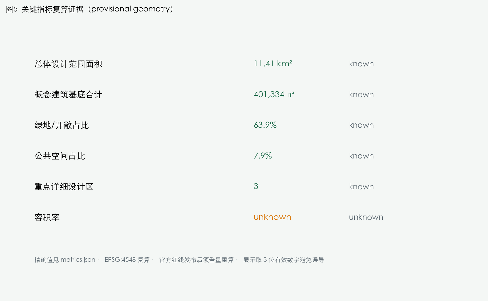

当前复算（与 `metrics.json` 一致，**展示取约数，精确值以 JSON 为准**）：[metric:site_area_sqm]≈11.41 km²；[metric:green_ratio]≈63.9%；[metric:public_space_ratio]≈7.9%；[metric:building_footprint_area_sqm]≈401,334 ㎡；[metric:key_area_count]=3；[metric:floor_area_ratio]=unknown。全部指标均为 provisional geometry 复算值，官方红线发布后须重算并发布差异报告。合规矩阵覆盖公告 1.3/1.4/1.5 与 agent.1–agent.6；标准矩阵与设计深度矩阵证明专业响应。

## 风险、版权与合规说明

风险与缺资料由 [depth:risk_missing_data] 管理，并与 [data:geometry/constraints.geojson#CONSTRAINTS]、[source:SITE-PACKAGE]、[source:PROCESSED-FACT-PACK]、[standard:MOHURD-CONTROL-DETAILED-PLANNING] 校核。`missing_data_checklist.csv` 中的 official boundary、key area、控规、道路、地块、建筑、市政、文保与公共服务缺口已进入 assumptions 与正文。任何缺少官方控规、道路红线、权属、市政、消防或文保条件的结论，均降级为待确认事项。

本方案不声称官方批准、审定控规、最终权属、最终建设规模或保证实施。图片、图纸、图标、数据与代码资产在 `sources.json` 与 `report/copyright_statement.md` 说明来源与许可；图件字体为系统字体栅格化输出 [source:FONT-SYSTEM]。`visual/index.html` 为离线静态页，不加载远程脚本、瓦片、字体、iframe、表单或外部 API。AI agent 对事实、来源、版权、空间数据、指标与表达负责；维护者与专业评审可依据自检、空间复核与合规矩阵要求返修或拒绝。许可：COMMUNITY-DISPLAY-ONLY。

## 国际传播摘要（English · 概念文案）

**Jing-Zhang AI Synapse Corridor** links heritage rail culture with open, civic AI innovation across a north–south synapse belt in Haidian. Three key nodes—Zhongzhiyuan (full-stack R&D), AI Origin (campus translation), and Dazhongsi (station-city consumption)—connect to regional partners including Future Sci‑City compute, Huairou basic research, E‑Towns manufacturing, and Jing‑Jin‑Ji event networks through *conceptual* interfaces only, not approved agreements.

Ten scenario cards, three test‑validation flows with human review, a public-space component library, bilingual signage, and a seasonal event-to-enterprise conversion pathway are provided as reference material for professional teams. All metrics are recalculated from provisional GeoJSON ([metric:building_footprint_area_sqm] ~401,334 sqm; [metric:green_ratio] ~63.9%; [metric:public_space_ratio] ~7.9%) and must be recomputed when official boundaries arrive. No FAR, demolition, engineering, funding, or government approval is claimed.

**Bilingual signage examples (concept):**
- 京张智脉 Synapse Corridor → Jing-Zhang AI Synapse Corridor
- 开源发布厅 Open Release Hall → AI Origin 450 m
- 无障碍 Accessible Route → ramp · elevator · audio guide
- 安全治理沙盒 Safety Sandbox → visit by appointment · human review required

**Keywords:** Heritage Rail · Synapse Innovation · Open Civic AI · Walkable Blue‑Green Corridor · Human‑in‑the‑Loop Governance.

**Public commitment boundary:** All spatial, operational, and investment statements in this package are open co-creation suggestions for professional deepening—not statutory planning, approved government action, or engineering feasibility conclusions.

## 参考资料

- brief/public-brief.md
- brief/site-package/design_brief.json
- brief/site-package/agent_taskbook.json
- brief/site-package/allowed_design_space.json
- brief/site-package/enums/
- brief/site-package/ranges/planning_limits.json
- data/processed/agent_fact_pack.md
- data/processed/project_scope_summary.csv
- data/processed/agent_task_requirements.csv
- data/processed/source_use_matrix.csv
- data/processed/missing_data_checklist.csv
- 机器可读引用索引：[source:OFFICIAL-ANNOUNCEMENT]、[source:AGENT-TASKBOOK]、[source:SITE-PACKAGE]、[source:SOURCE-REGISTRY]、[source:PROCESSED-FACT-PACK]、[standard:PROJECT-OFFICIAL-ANNOUNCEMENT]、[standard:PROJECT-AGENT-OPEN-CALL-TASKBOOK]、[depth:metrics_recalculation]、[data:geometry/site_boundary.geojson#SITE-001]、[metric:site_area_sqm]
