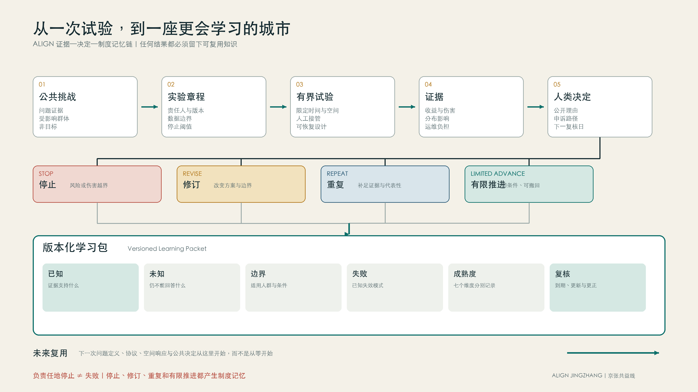
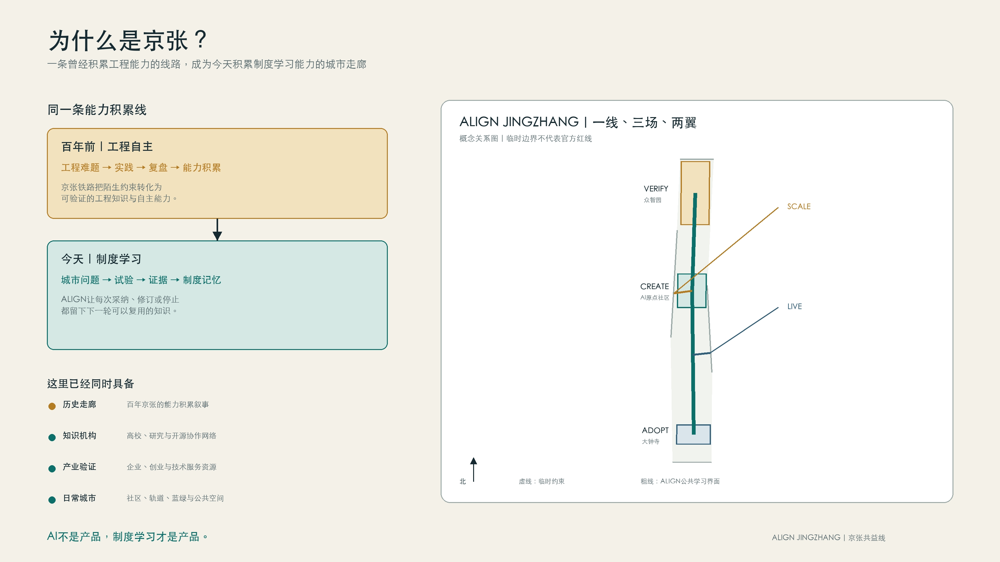
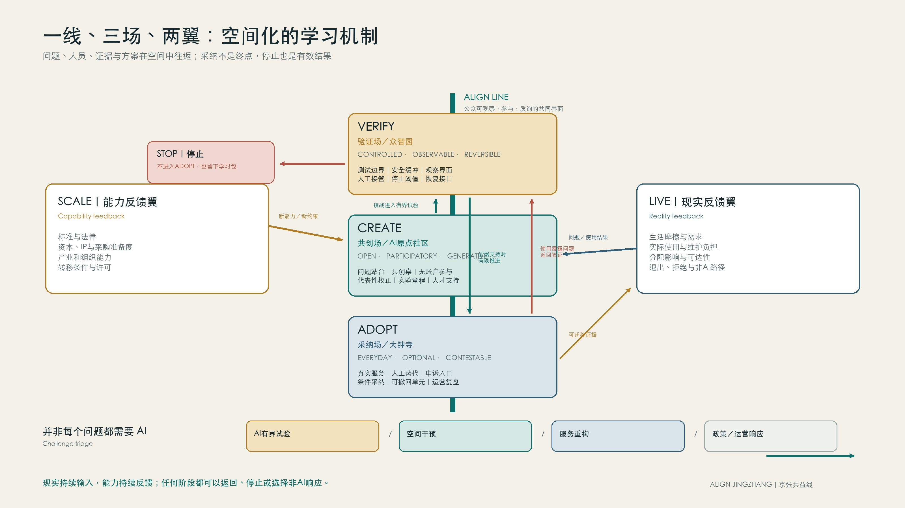
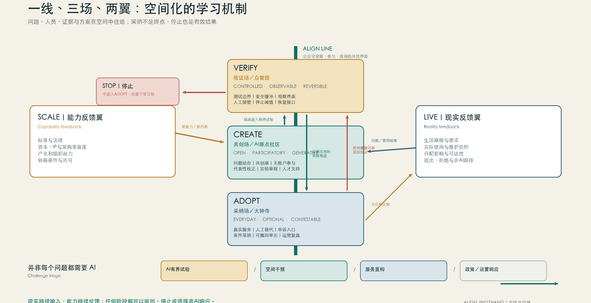
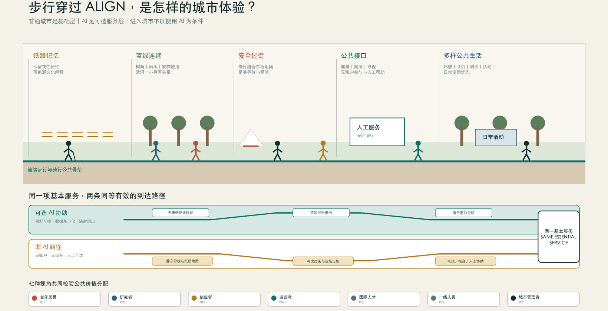

# ALIGN JINGZHANG｜京张共益线：一座持续提升问题解决能力的学习城市

## 核心命题：制度学习才是产品

京张沿线不缺人工智能企业、大学、平台或应用构想，真正稀缺的是把多方行动变成公共学习的制度能力。**ALIGN JINGZHANG／京张共益线**因此不再设计一个以AI为主角的城区，而设计一座持续提升问题解决能力的城市：AI是加速器，城市如何发现问题、限定试验、评价公共价值、决定采纳或停止、保存可复用知识，才是项目本身。

评审者只需记住三件事：**AI不是产品，制度学习才是产品；每次实验都留下可复用的制度记忆；负责任地停止与成功部署同样有价值。** 这三句话共同约束空间、场景、运营与指标，避免项目退化为技术展厅或应用清单。[source:AGENT-TASKBOOK] [standard:PROJECT-AGENT-OPEN-CALL-TASKBOOK]

ALIGN由五个反馈环构成，五环不是五个部门，而是一套有责任人、有证据门槛、有停止分支的共同工作方法：

| 环节 | 核心问题 | 必要输出 | 决策纪律 |
| --- | --- | --- | --- |
| 1. 问题发现 | 把生活中的摩擦转化为有证据、有代表性边界、有公共责任人的挑战，而不是由技术供应方单方面制造需求。 | 挑战章程；基线记录；受影响群体登记 | revise；archive；escalate |
| 2. 实验 | 通过时间、空间、数据与责任均受约束的测试章程验证假设，并在造成不可接受影响前停止或回滚。 | 试验护照；事件日志；版本记录 | stop；revise；repeat；escalate |
| 3. 公共价值评估 | 同时比较效果、分配、公平、尊严、隐私、安全、环境与运维负担，公开收益与代价而不是压缩成单一分数。 | 公共价值账本；分配影响表；失败与限制报告 | stop；revise；repeat；archive |
| 4. 采纳与扩展 | 把采纳视为新的公共决定，要求责任主体、运维能力、申诉渠道、退出预算和复审日期齐备，而不是把试点成功等同于规模化。 | 采纳契约；服务等级与人工兜底；申诉流程 | stop；revise；repeat；archive |
| 5. 贡献与声誉 | 把可复用证据、失败、限制与署名沉淀为公共知识；声誉必须可纠正、可申诉、有时效且不得替代采购或公共决策。 | 证据包；贡献记录；限制说明 | revise；archive；escalate |

五环会同时更新四类城市资产：**问题**（定义、代表性、基线与非目标）、**知识**（证据、失败模式与适用范围）、**制度**（责任、决策权、申诉、停止与恢复）和**空间**（可逆响应、公共界面与运行条件）。任何环节都可能改变四类资产，不做一一对应。最终积累的不是实验数量，而是带版本、证据、未知项、适用边界和复核日期的学习包——一种可被未来团队复用、质疑和修正的制度基础设施。

京张铁路为这套方法提供了历史根基。百年前，这条线路把工程难题转化为实践、复盘和自主能力积累；今天，沿线面对的是AI时代的城市问题，ALIGN把它们转化为试验、证据和制度能力积累。空间采用**一线、三场、两翼**：ALIGN LINE不是一条新红线，而是一条让城市学习过程可见的公共界面；北起VERIFY的验证现场，经CREATE的问题共创与人才社区，向南连接ADOPT的采纳与服务界面，并由SCALE和LIVE向产业服务与日常生活延展。历史不只是导览内容，而是“在实践中增长能力”的空间连续性。[data:geometry/roads.geojson#ALIGN-LINE-001] [data:geometry/key_areas.geojson#PROV-KEY-001]

“安全学习产出”不是单一排名分数。它是一组并列仪表：产生了多少决策相关且可复用的知识，付出了多少成本、风险、参与者负担和信任代价，收益与伤害如何分布，以及停止和恢复机制是否真正有效。一次快速但证据充分的停止，可以比一次未经验证的扩张创造更多公共价值。[data:geometry/public_space.geojson#SCENARIO-01] [metric:key_area_count]

## 设计依据与资料清单

ALIGN以征集公告、面向智能体任务书和仓库 site package 为任务与数据依据；完整来源、许可、缺口和复算规则分别保存在 `sources.json`、`assumptions.json`、矩阵和自检文件中。当前总体边界及三处重点区为组织方资料包中的临时约束，正文中的面积、节点和联系只用于非正式设计讨论，不构成官方红线、控规、权属、道路或工程结论；正式多边形发布后，几何、指标、图纸和HTML必须统一重算。[source:OFFICIAL-ANNOUNCEMENT] [source:AGENT-TASKBOOK] [source:SITE-PACKAGE] [source:BOUNDARY-SOURCE] [source:KEY-AREA-SOURCE] [standard:PROJECT-OFFICIAL-ANNOUNCEMENT] [standard:MOHURD-ARCH-DESIGN-DEPTH-2016] [depth:existing_conditions_diagnosis]

这种精度限制不削弱方案的核心判断：ALIGN首先设计可迁移的制度—空间关系，再由后续官方资料确定精确落位。评审可通过 [data:geometry/site_boundary.geojson#SITE-001]、[data:geometry/key_areas.geojson#PROV-KEY-001]、[metric:site_area_sqm] 和 [metric:key_area_count] 回查当前约束与复算结果。

## 三层范围工作框架

三层范围不是三份重复方案，而是同一学习系统的三个尺度：43.6平方公里统筹研究范围回答资源如何协同；约11.4平方公里总体设计范围回答制度机制如何改变更新、慢行、公共空间和服务设施；三处重点区回答一项实验如何被真实空间承载、观察、停止和恢复。范围数据来自公告与临时边界，精确控制仍待正式资料。[standard:PROJECT-OFFICIAL-ANNOUNCEMENT] [depth:three_level_scope_framework]

| 尺度 | ALIGN的回答 | 主要证据 |
| --- | --- | --- |
| 统筹研究 | 以问题、证据和可迁移学习包连接高校、企业、社区和公共责任主体 | compliance_matrix.json、standard_matrix.json |
| 总体设计 | 以ALIGN LINE组织公共学习界面，并把慢行、蓝绿、更新和服务设施作为可逆试验条件 | [data:geometry/roads.geojson#ALIGN-LINE-001]、[data:geometry/land_use.geojson#LU-001] |
| 重点区域 | VERIFY验证、CREATE共创、ADOPT采纳；SCALE与LIVE提供转移和日常反馈 | [data:geometry/key_areas.geojson#PROV-KEY-001]、[depth:three_key_area_detailed_design] |

## 统筹研究范围产业与未来城市研究

统筹研究范围的核心任务是构建世界级 AI 创新生态体系。方案应梳理海淀高校院所、头部企业、算力算法数据要素、孵化平台、上市企业、独角兽和科技服务资源，提出AI创新链、产业链、人才链和城市服务链的空间协同框架。命名方案和 logo 设计应服务于“百年京张文化带、都市AI生活体验带、AI融合创新带”的整体辨识度，不能只停留在口号，应说明与产业生态、公共空间和文化资源的关联。面向智能体任务书还要求回应“五大功能”和“三区两翼”协同，形成可继续深化的命名系统、视觉识别、总体空间结构图、场景开放和运营机制；本节必须用 [source:AGENT-TASKBOOK] 与 [standard:PROJECT-AGENT-OPEN-CALL-TASKBOOK] 标注这些要求来自 agent 开源征集任务，而不是法定规划控制。

统筹研究并不新增伪精确红线；它通过 [standard:MOHURD-URBAN-DESIGN-MEASURES] 要求的城市风貌、公共空间和建筑布局统筹，回接 [data:geometry/land_use.geojson#LU-001]、[data:geometry/public_space.geojson#PUBLIC-001] 与 [depth:overall_spatial_structure]，说明产业策略最终要落到可见、可复核的空间结构。

未来城市形态研究应回答人工智能如何改变工作、生活、社交、学习、交通和公共服务。方案应把AI交通系统、连续绿色空间、创新服务设施和国际化生活工作氛围落实为可定位的功能区、节点、廊道和场景，而不是泛泛描述技术愿景。agent 应把产业战略指标、AI创新指数、人才密度、空间供给类型和AI+垂直应用重点区域写入指标体系，并标明哪些是官方、哪些是设计建议、哪些仍待正式数据校准。若提出全球AI创新活动、开发者社区、开放场景或朝圣路线，应写为“概念建议/参考方案/可供专业团队深化研究”，不得写成已经确定的政府活动或实施安排。

## 总体设计范围城市更新与控规深度城市设计

总体设计范围要求达到控制性详细规划的城市设计深度。方案必须提出城市更新总体空间结构、低效空间识别、更新项目清单、实施政策建议、产业功能比例、空间组织模式、建筑总规模和综合承载能力评估。`geometry/land_use.geojson` 应完整覆盖设计边界且无重叠，`geometry/buildings.geojson` 应表达更新建筑基底或保留建筑基底，`geometry/roads.geojson` 应表达微循环、慢行和轨道接驳关系，`metrics.json` 应复算核心面积、比例和图层数量。

本节按照 [standard:MOHURD-CONTROL-DETAILED-PLANNING] 把控规深度内容拆成可审查对象：[data:geometry/land_use.geojson#LU-001] 表达用地结构，[data:geometry/buildings.geojson#BLDG-001] 表达建筑基底，[data:geometry/roads.geojson#ROAD-001] 表达交通组织，[metric:building_footprint_area_sqm] 用于复核建筑基底面积，[depth:land_use_layout] 与 [depth:development_intensity_controls] 约束成果深度。

总体设计还必须支撑交通、轨道、市政和配套设施。方案应围绕轨道站点一体化、道路微循环、非机动车停放、停车供给、创新服务平台、人才生活服务、新型基础设施、分布式能源和端侧算力提出空间布局和实施路径。涉及建筑高度、开发强度、道路红线、退线和设施标准的内容，若尚无官方控制条件，应写为“待正式控规条件确认”，不得以 agent 推测值冒充审定指标。

## 重点区域详细设计

三处重点区不是给机构贴功能标签，而是让不同决策纪律生成不同空间语法。所有动作均为概念建议，须在权属、控规、交通、市政、消防、生态和文保资料补齐后深化。[data:geometry/key_areas.geojson#PROV-KEY-001] [data:geometry/key_areas.geojson#PROV-KEY-002] [data:geometry/key_areas.geojson#PROV-KEY-003] [depth:three_key_area_detailed_design]

### VERIFY／众智园：让验证可观察、可停止、可恢复

VERIFY设置可恢复测试路段、旁观与解释界面、安全缓冲、人工接管点和无障碍绕行；试验入口公开版本、责任人、允许时段与停止阈值，出口设置设备撤除和场地复原接口。空间价值不在“展示机器人”，而在让测试权力、风险和恢复责任对公众可见。共益试场承载产业验证，贡献里程标记录失败与更正，而不是只记录成功。[data:geometry/public_space.geojson#LANDMARK-02] [data:geometry/public_space.geojson#SCENARIO-02]

### CREATE／AI原点社区：让问题在造产品前被共同定义

CREATE以问题站台、可变共创室、跨学科工作台、人才到达服务和短周期原型界面组织近校创新。首层公共界面同时展示“谁提出问题、谁未被代表、什么不做”；安静工作、无账户参与和人工服务与数字工具并列。其空间不是孵化器的通用复制，而是把问题发现、代表性校正和实验章程前置。[data:geometry/public_space.geojson#LANDMARK-01] [data:geometry/public_space.geojson#SCENARIO-06]

### ADOPT／大钟寺：让采纳成为可质询的人类决定

ADOPT把公共价值账房、服务试用界面、人工替代柜台、申诉入口和运营复盘空间嵌入轨道与商业公共界面。收益、代价、分配影响、少数意见和退出方法并列展示；任何“通过测试”都不自动获得部署资格。可逆服务单元允许条件采纳后撤回，避免一次试点固化为永久基础设施。[data:geometry/public_space.geojson#LANDMARK-03] [data:geometry/public_space.geojson#SCENARIO-07]

SCALE向中关村科技服务网络输出标准、法律、金融、采购准备度与转移文档；LIVE沿小月河及社区日常环境观察可达性、维护负担和非AI替代路径。两翼是反馈关系，不是新增法定分区。[data:geometry/roads.geojson#ALIGN-WING-SCALE] [data:geometry/roads.geojson#ALIGN-WING-LIVE]

## AI 创新生态、人才画像与 AI+ 场景

ALIGN以七类参与者的激励校准组织创新生态。居民获得可理解的选择、退出和申诉；研究者获得可复现实验与公开失败样本；创业者获得清晰的验证路径而非模糊的“试点背书”；企业获得运营与转移条件；高校获得跨学科问题接口；一线运营者拥有停止权和维护话语权；公共责任人获得可审计的决策材料。声誉只来自可核验贡献，允许纠正、衰减与申诉，不形成永久社会评分，也不替代采购、监管或专业判断。

| 人物 | 目标 | 可贡献内容 | 必要保护 |
| --- | --- | --- | --- |
| 需要稳定日常路径的老年居民 | 独立安全到达服务点；随时找到人工帮助 | 公共服务使用者 | 大字与语音；无障碍连续路径；防范错误导航；数字排斥 |
| 跨机构AI研究者 | 复现实验；获得可信基准 | 知识与评测贡献者 | 开放接口；清晰许可；防范成果归属争议；基准被操纵 |
| 早期创业团队负责人 | 低成本验证问题价值；获得可迁移证据 | 方案提供者与潜在运营合作方 | 测试章程模板；公平准入；防范试点依赖；知识产权不清 |
| 企业与园区运营负责人 | 评估运维负担；保障服务连续性 | 服务采纳与长期运维责任候选者 | 服务等级；退出与迁移文档；防范服务中断；责任不清 |
| 初到海淀的国际人才 | 理解办事路径；建立本地专业网络 | 人才与城市服务使用者 | 多语言；权威来源标识；防范错误建议；身份信息泄露 |
| 社区与公共空间一线工作人员 | 减少重复劳动；保留现场判断权 | 人工复核者与现实运维者 | 清晰升级规则；暂停权限；防范自动化偏误；工作负担转移 |
| 城市专业与公共责任人员 | 保护公共利益；获得可复核证据 | 挑战、合规与采纳的人类责任主体候选者 | 证据链；利益冲突披露；防范错误背书；不可逆承诺 |

十二个场景均是**可复用测试原型**，不是已实施项目；每次现实测试还必须生成独立实验章程、版本、责任人、证据和决定。空间节点只表达功能归属，不构成建筑选址、道路红线或实施许可。[data:geometry/public_space.geojson#ALIGN-NODE-CREATE] [data:geometry/roads.geojson#ALIGN-LINE-001]

### SCENARIO-01｜多智能体公共任务基准

- **问题与位置：** 多智能体在城市公共任务中的协作结果难以复现，失败责任、版本和工具调用边界不清。 载体为 verify，面向 persona-open-researcher；persona-city-steward。
- **能力与人类决定：** 多智能体任务分解、协作与可复现实验记录；任何专业或公共决定均由人类作出，基准分数不产生部署资格。
- **数据边界：** 只使用公开或合成的最小任务集；禁用 个人身份信息；非公开政府或企业数据。
- **成败条件：** 观察 metric-reproducibility；metric-human-override-success；出现 结果无法复现；智能体绕过工具权限；人工复核无法解释关键步骤 即停止或复核。
- **责任、扩展与退出：** 概念性独立基准维护机构；先发布方法与失败样本，再讨论跨机构互认；互认不等于现实部署许可。 冻结有问题的基准版本，保留可审计记录并迁移到开放格式。 [data:geometry/public_space.geojson#SCENARIO-01]
### SCENARIO-02｜低速机器人共同空间验证

- **问题与位置：** 不同机器人的让行、遥停、弱势行人识别和事故恢复能力缺少可比较的共同空间测试。 载体为 verify；live，面向 persona-startup-founder；persona-enterprise-operator；persona-frontline-worker。
- **能力与人类决定：** 低速感知、路径规划、让行与远程接管；现场安全员拥有即时停机权，行人始终拥有优先权。
- **数据边界：** 现场感知优先端侧处理，只保留事件必要片段；禁用 人脸身份识别；持续个体追踪。
- **成败条件：** 观察 metric-yield-compliance；metric-remote-stop-latency；metric-accessibility-incidents；出现 触发碰撞或近失阈值；遥停失败；无障碍通行被持续阻断 即停止或复核。
- **责任、扩展与退出：** 未来依法确认的测试场责任主体；仅在跨厂商互操作、安全和恢复测试通过后形成可迁移测试包；线路仍需专业审批。 停运并撤除临时设施，删除非必要感知记录，公开故障与恢复报告。 [data:geometry/public_space.geojson#SCENARIO-02]
### SCENARIO-03｜隐私设计前置测试

- **问题与位置：** 城市AI产品常在试点后才补做隐私控制，目的、最小化、留存和退出难以在部署前验证。 载体为 verify；scale，面向 persona-open-researcher；persona-city-steward。
- **能力与人类决定：** 隐私威胁建模、数据流检查、合成数据与最小化测试；工具只提出风险线索，合规结论由有资质的人类责任主体另行作出。
- **数据边界：** 默认使用合成数据和字段级替代；禁用 未经同意的真实个人数据；生物识别模板。
- **成败条件：** 观察 metric-data-minimization；metric-deletion-verification；metric-purpose-drift-findings；出现 无法说明处理目的；删除不可验证；高风险字段无必要性证据 即停止或复核。
- **责任、扩展与退出：** 概念性隐私测试实验室；输出可复用测试协议与缺口清单，不签发官方合规认证。 归档测试方法，销毁临时数据，撤回存在误导的通过标记。 [data:geometry/public_space.geojson#SCENARIO-03]
### SCENARIO-04｜国际人才到达协作助手｜ACCESS／进入城市

- **问题与位置：** 初到海淀的人才面临多语言、跨机构和信息时效问题，容易依赖来源不明的建议。 载体为 create；adopt，面向 persona-international-talent；persona-frontline-worker。
- **能力与人类决定：** 多语言检索、权威来源引用与人工服务转接；用户可随时选择人工服务，AI不得替代正式办事窗口。
- **数据边界：** 匿名浏览优先，个案资料只在正式责任主体渠道处理；禁用 护照扫描件；不必要身份信息。
- **成败条件：** 观察 metric-source-traceability；metric-human-handoff；metric-language-access；出现 未引用权威来源；过期信息未标记；高影响建议未转人工 即停止或复核。
- **责任、扩展与退出：** 未来人才服务责任主体；先覆盖低风险公开信息，再由未来责任主体决定是否扩展。 关闭AI入口时保留同等可达的人工和静态指南。 [data:geometry/public_space.geojson#SCENARIO-04]
### SCENARIO-05｜老年友好分段导航

- **问题与位置：** 普通导航忽略坡度、座椅、厕所、过街时长、照明和人工帮助点，难以支持老年人的真实出行。 载体为 live；align-line，面向 persona-older-resident；persona-frontline-worker。
- **能力与人类决定：** 按无障碍与体力偏好生成分段路线并提供离线提示；用户可选择非AI纸质路线并向人工服务点求助。
- **数据边界：** 路线计算可匿名使用，位置仅在端侧短时处理；禁用 健康诊断推断；持续位置历史。
- **成败条件：** 观察 metric-rest-point-access；metric-route-completion；metric-navigation-handoff；出现 路线设施未现场核验；引导进入封闭或危险区域；无法提供人工帮助 即停止或复核。
- **责任、扩展与退出：** 未来公共空间与服务运营主体；从人工核验的短路线开始，逐段扩展且保持纸质版本同步。 系统停用时保留静态导视、纸质地图和人工服务。 [data:geometry/public_space.geojson#SCENARIO-05]
### SCENARIO-06｜创业验证路径助手｜VALIDATION PATH／从想法进入实验

- **问题与位置：** 早期团队难以区分问题验证、技术测试、合规准备和现实采购，容易把试点当作政府或市场背书。 载体为 create；scale，面向 persona-startup-founder。
- **能力与人类决定：** 结构化挑战、实验、证据和转移文档的生成辅助；AI输出不构成法律、投资、采购或政策意见。
- **数据边界：** 团队自行控制材料，敏感信息不得进入公共模型；禁用 商业秘密默认上传；个人投资画像。
- **成败条件：** 观察 metric-charter-completeness；metric-pilot-claim-accuracy；metric-transfer-readiness；出现 把试点写成官方背书；缺少退出责任；来源不可追溯 即停止或复核。
- **责任、扩展与退出：** 未来创业服务运营主体；将成熟模板开放复用，不把服务使用量等同于企业质量。 保留开放模板和导出数据，避免平台锁定。 [data:geometry/public_space.geojson#SCENARIO-06]
### SCENARIO-07｜企业服务证据导航｜TRANSFER／从证据进入企业服务

- **问题与位置：** 企业面对标准、测试、人才和专业服务时信息分散，且推荐机制可能偏向特定供应商。 载体为 adopt；scale，面向 persona-enterprise-operator；persona-international-talent。
- **能力与人类决定：** 基于公开目录的需求分解、来源引用和中立转接；推荐不得替代专业意见，服务目录须披露排序规则与利益冲突。
- **数据边界：** 仅处理完成需求分流所必需的信息；禁用 未经许可的企业内部数据；隐性商业评分。
- **成败条件：** 观察 metric-neutral-routing；metric-source-traceability；metric-service-resolution；出现 存在未披露商业偏向；过期信息造成重大误导；无法人工复核 即停止或复核。
- **责任、扩展与退出：** 未来中立企业服务平台责任主体；通过开放目录和接口向区域合作节点转移，不绑定单一供应商。 提供完整目录导出和静态服务清单。 [data:geometry/public_space.geojson#SCENARIO-07]
### SCENARIO-08｜三种文化可追溯导览

- **问题与位置：** 铁路历史、中关村创新史和AI新文化容易被压缩成科技装饰，事实、版权和多元叙事缺少来源。 载体为 create；align-line，面向 persona-international-talent；persona-open-researcher。
- **能力与人类决定：** 带来源的多语言讲解、路线适配和公众补充线索整理；未经专业复核的生成内容不得作为正式历史说明。
- **数据边界：** 不以个体追踪换取个性化；禁用 未经授权肖像与作品；游客身份画像。
- **成败条件：** 观察 metric-citation-coverage；metric-correction-response；metric-language-access；出现 史实无来源；版权状态不清；把生成叙事冒充官方解释 即停止或复核。
- **责任、扩展与退出：** 未来文化内容责任主体；开放内容结构与纠错机制，具体路线经文保和场地专业核验。 保留经过复核的静态导览与来源索引。 [data:geometry/public_space.geojson#SCENARIO-08]
### SCENARIO-09｜步行摩擦共测

- **问题与位置：** 慢行评价常依赖平均网络指标，遮阴、等待、台阶、施工和夜间感受等实际摩擦难以进入更新优先级。 载体为 live；align-line，面向 persona-older-resident；persona-city-steward。
- **能力与人类决定：** 聚合现场审计、匿名反馈与路线网络，发现需要人工复核的摩擦点；AI只提供调查线索，不给出道路、桥隧或工程可行性结论。
- **数据边界：** 接受点位事件而非完整路线历史；禁用 连续个人轨迹；人脸识别。
- **成败条件：** 观察 metric-friction-resolution；metric-distribution-coverage；metric-audit-verification；出现 高频人群压倒弱势需求；问题点未现场核验；输出被误作工程结论 即停止或复核。
- **责任、扩展与退出：** 未来公共空间调查责任主体；复制调查协议与分类体系，不复制未经核验的点位结论。 归档聚合问题库并删除不再必要的原始反馈。 [data:geometry/public_space.geojson#SCENARIO-09]
### SCENARIO-10｜社区事务人工优先助手｜CIVIC FALLBACK／公共服务保留人工路径

- **问题与位置：** 居民难以判断应联系哪个服务渠道，一线人员又可能被重复咨询淹没，但自动化容易造成责任推诿。 载体为 live，面向 persona-older-resident；persona-frontline-worker。
- **能力与人类决定：** 低风险信息分流、表单解释与人工服务预约；居民始终可跳过AI直接联系人工，AI不得作出资格或权益决定。
- **数据边界：** 匿名信息查询优先，敏感事项直接转人工；禁用 社会评分；不必要家庭画像。
- **成败条件：** 观察 metric-human-handoff；metric-first-contact-resolution；metric-non-ai-access；出现 权益事项被自动决定；人工渠道被削弱；错误无法更正 即停止或复核。
- **责任、扩展与退出：** 未来社区服务责任主体；只扩展来源明确、低风险且有人工兜底的事项。 保留电话、现场和静态指南，不使基本服务依赖模型。 [data:geometry/public_space.geojson#SCENARIO-10]
### SCENARIO-11｜建筑运维异常协作

- **问题与位置：** 建筑能耗、设备和舒适度告警分散，自动优化可能把节能压力转嫁给使用者或一线人员。 载体为 adopt，面向 persona-enterprise-operator；persona-frontline-worker。
- **能力与人类决定：** 设备异常检测、维护建议与能耗趋势解释；关键设备与影响人员舒适安全的调整须由人类确认并可手动恢复。
- **数据边界：** 优先使用设备和区域级数据；禁用 个体办公行为监控；与运维无关的身份数据。
- **成败条件：** 观察 metric-maintenance-response；metric-comfort-distribution；metric-manual-restore；出现 关键控制未经确认；节能收益以舒适或安全为代价；人工恢复失败 即停止或复核。
- **责任、扩展与退出：** 未来建筑设施责任主体；从建议模式开始，经专业验证后才讨论有限控制；不推导建筑工程容量。 关闭模型后保持传统楼宇控制和人工维护能力。 [data:geometry/public_space.geojson#SCENARIO-11]
### SCENARIO-12｜公共空间活动共调度

- **问题与位置：** 公共活动可能集中于高流量和商业吸引力，忽略日常使用、安静需求、无障碍和场地恢复。 载体为 adopt；align-line，面向 persona-startup-founder；persona-frontline-worker。
- **能力与人类决定：** 基于公开规则的活动冲突检查、时段建议与影响模拟；活动许可、安全和公共资源分配均由人类及法定程序决定。
- **数据边界：** 使用时段、场地和聚合承载信息；禁用 游客个体画像；未披露商业竞价信号。
- **成败条件：** 观察 metric-use-diversity；metric-restoration-compliance；metric-accessible-programming；出现 商业活动挤占基本公共使用；无障碍安排缺失；活动后场地未恢复 即停止或复核。
- **责任、扩展与退出：** 未来公共空间运营责任主体；开放调度规则和影响模板，活动与场地仍逐项审批。 停用系统时保留公开日历、人工申请与冲突协调。 [data:geometry/public_space.geojson#SCENARIO-12]

### 三个验证实例：停止、修订与条件推进同等可见

| 实验实例 | 试验主题 | 决定 | 决定理由 | 制度记忆 |
| --- | --- | --- | --- | --- |
| experiment-multi-agent-benchmark | 多智能体公共任务基准 | repeat | 合成任务显示部分结果可复现；高风险任务的领域覆盖不足；工具权限记录方法可复用 | learning-benchmark-repeat |
| experiment-robot-validation | 低速机器人共同空间验证 | stop | 示例情境假定重复出现无障碍阻断；遥停虽可用但恢复通行时间不满足预设条件；停止可防止风险扩大 | learning-robot-stop |
| experiment-privacy-testing | 隐私设计前置测试 | limited_adoption | 合成数据测试可复用；字段必要性审查和删除演练方法清晰；测试不能证明现实系统合规 | learning-privacy-limited-advance |

每个学习包都同时记录证据支持什么、仍不知道什么、结论在哪些人群与条件下不能泛化、哪些假设可能失效、何种新证据会改变决定，以及下一次复核或失效日期。证据成熟度按技术可靠性、运营稳健性、可达性、公共合法性、组织准备度、长期证据和可转移性分别记录；某一维成熟不能自动推导其他维成熟。这是“制度谦逊”的操作方式，但不把它扩展成新的品牌概念。

## 用地、建筑规模与拆改留方案

ALIGN不以缺少依据的强度数字制造完成感。当前用地层保持临时边界内完整、闭合和无重叠，建筑层只表达概念性基底；未来取得现状建筑、权属和控规后，再按“保留—适应性改造—可逆增补—待专业论证”逐栋校正。VERIFY优先可拆测试构件，CREATE优先首层开放与共享空间，ADOPT优先可撤回服务单元；三者都不预设拆除。[data:geometry/land_use.geojson#LU-001] [data:geometry/buildings.geojson#BLDG-001] [metric:building_footprint_area_sqm]

用地分类遵循 [standard:MNR-LAND-USE-CLASSIFICATION-GUIDE]；开发强度、建筑高度、退线和最终规模保持 unknown，等待正式条件。[depth:land_use_layout] [depth:development_intensity_controls] [depth:height_massing_character] [depth:retain_renovate_demolish]

## 交通、轨道、市政与公共服务设施

ALIGN把京张走廊首先视为可步行、可骑行、可退出数字服务的公共学习界面。概念路径连接三处重点区并向SCALE、LIVE延展；测试节点设置普通绕行、无障碍连续路径、人工导视和紧急接管，轨道与街区接口优先解决换乘、停车和四象限步行摩擦。路线表达关系而非道路红线。[data:geometry/roads.geojson#ALIGN-LINE-001] [data:geometry/public_space.geojson#SCENARIO-05] [depth:traffic_rail_slow_parking]

端侧算力、能源、排水、消防和通信只作为待核验的服务条件，不用概念节点替代工程设计；任何试验必须保留非AI通道与失效模式。[data:geometry/constraints.geojson#CONSTRAINTS] [depth:municipal_new_infrastructure]

## 蓝绿空间、公共空间与城市风貌

京张遗址公园、清河和小月河共同构成连续公共体验骨架：慢行连接不是活动装饰，而是居民观察、绕行、申诉和共同评价实验的基本条件。VERIFY的安全观察廊、CREATE的问题站台、ADOPT的共益账房及沿线贡献里程标形成可进入、可停留、可更正的公共界面；绿地和公共空间比例均由当前几何复算。[data:geometry/green_space.geojson#GREEN-001] [data:geometry/public_space.geojson#PUBLIC-001] [metric:green_ratio] [metric:public_space_ratio] [depth:blue_green_public_space]

风貌以铁路里程、工程档案和持续更正为文化语汇，采用轻触、可逆、无障碍且不依赖个人设备的构件；不复制历史构件，也不在文保资料缺失时推定控制线。[standard:MOHURD-URBAN-DESIGN-MEASURES]

## 更新项目清单、实施政策与分期计划

实施从可撤回、可观察的小尺度动作开始，而不是以大建设承诺证明创新。近期建立问题站台、测试与人工接管协议、公共价值账房和贡献档案；中期在正式资料与专业审批基础上缝合慢行、首层公共界面和轨道联系；长期仅把经多轮证据支持的空间响应纳入常态维护。每一期均保留停止、恢复和复核日期。[data:geometry/phasing.geojson#PHASE-001] [depth:renewal_project_list] [depth:phasing_implementation]

| 项目 | 首要动作 | 启动前置条件 |
| --- | --- | --- |
| ALIGN LINE公共学习界面 | 连续导视、人工替代路径、版本化信息点 | 道路、文保、无障碍与运营复核 |
| VERIFY共益试场 | 可恢复路段、安全缓冲、接管与撤除接口 | 依法确认责任主体及安全审批 |
| CREATE问题站台 | 无账户提交、共创工作台、人才到达服务 | 场地权属与长期运营安排 |
| ADOPT共益账房 | 收益代价并列、申诉、可撤回服务单元 | 轨道商业界面和责任主体协调 |
| SCALE转移服务 | 标准、法律、采购准备度和复用许可 | 不把测试结果等同采购资格 |
| LIVE日常反馈 | 可达性、维护负担与非AI通道观察 | 居民代表性、同意和退出机制 |

## 指标体系、面积复算与合规矩阵

指标分三层：空间几何可直接复算的面积与比例；等待官方控规的强度、高度、退线和道路条件；需要运营观察的安全学习产出与公共价值。前者写入 `metrics.json`，第二类保持 unknown，第三类按分布、风险、参与负担和停止阈值呈现，不合成为单一排名。[metric:site_area_sqm] [metric:key_area_count] [metric:building_footprint_area_sqm] [metric:green_ratio] [metric:public_space_ratio] [depth:metrics_recalculation]

合规、标准和设计深度矩阵保存完整任务映射；正文只呈现影响设计判断的证据。评审可从每个引用回到图层、来源或指标，构建流水线负责发现过期引用和几何不一致。[data:geometry/site_boundary.geojson#SITE-001] [data:geometry/key_areas.geojson#PROV-KEY-001]

## 风险、版权与合规说明

当前主要风险是临时边界、缺失控规与权属、市政消防条件、技术成熟度、隐私与数据最小化、代表性不足、运维负担和数字排斥。对应策略是把不确定性写入学习包，限制试验范围与时长，设置人类决定、停止阈值、恢复责任、申诉和非AI通道；无法核验的结论保持待确认。[data:geometry/constraints.geojson#CONSTRAINTS] [source:SITE-PACKAGE] [depth:risk_missing_data]

方案不声称官方批准、最终土地权属、审定控规、确定建设规模或保证实施。全部自制图形、代码和数据派生关系在版权说明及来源文件登记；离线HTML不得调用远程脚本、字体、瓦片、表单、跟踪或外部API。

## 参考资料

- brief/public-brief.md
- brief/site-package/design_brief.json
- brief/site-package/allowed_design_space.json
- brief/site-package/enums/
- brief/site-package/ranges/planning_limits.json
- data/processed/agent_fact_pack.md
- data/processed/project_scope_summary.csv
- data/processed/agent_task_requirements.csv
- data/processed/source_use_matrix.csv
- data/processed/missing_data_checklist.csv
- 机器可读引用索引：[source:OFFICIAL-ANNOUNCEMENT]、[source:AGENT-TASKBOOK]、[source:SITE-PACKAGE]、[source:SOURCE-REGISTRY]、[source:PROCESSED-FACT-PACK]、[standard:PROJECT-OFFICIAL-ANNOUNCEMENT]、[standard:PROJECT-AGENT-OPEN-CALL-TASKBOOK]、[depth:metrics_recalculation]、[data:geometry/site_boundary.geojson#SITE-001]、[metric:site_area_sqm]
