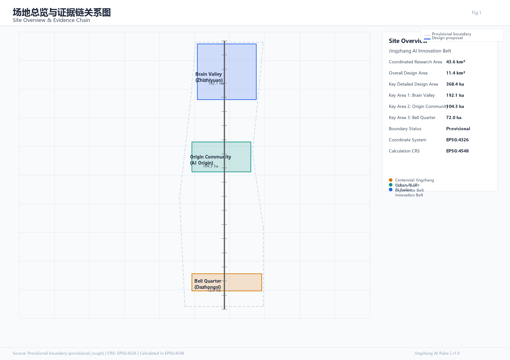
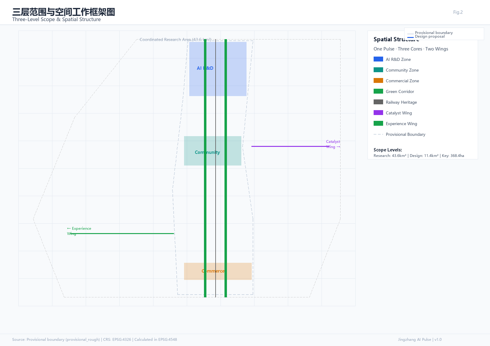
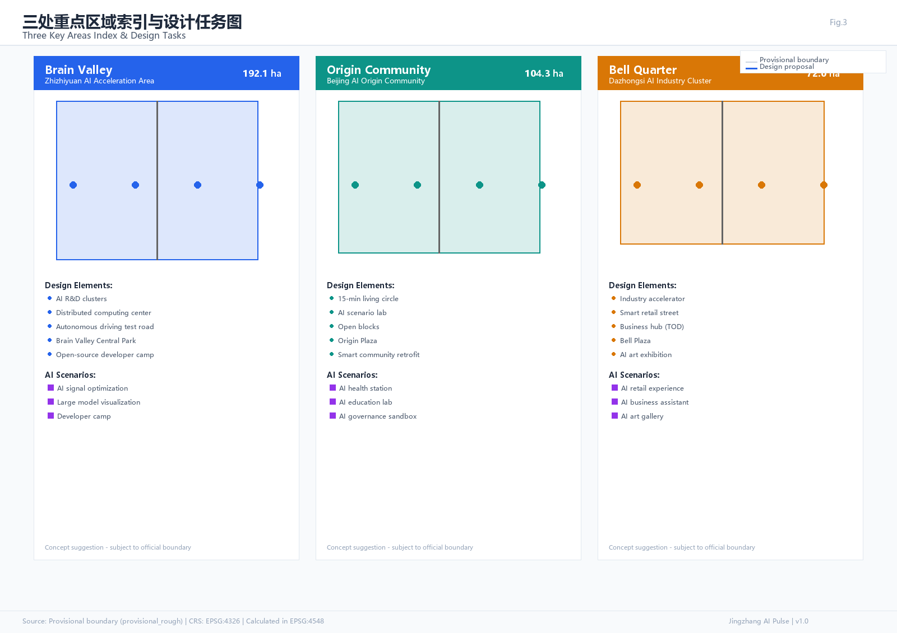
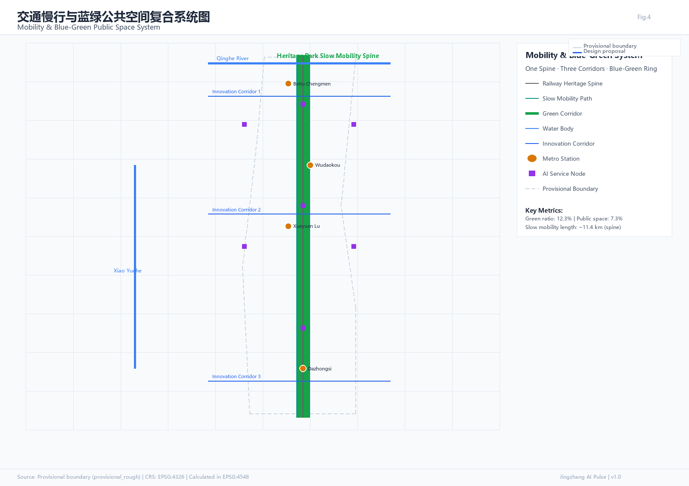
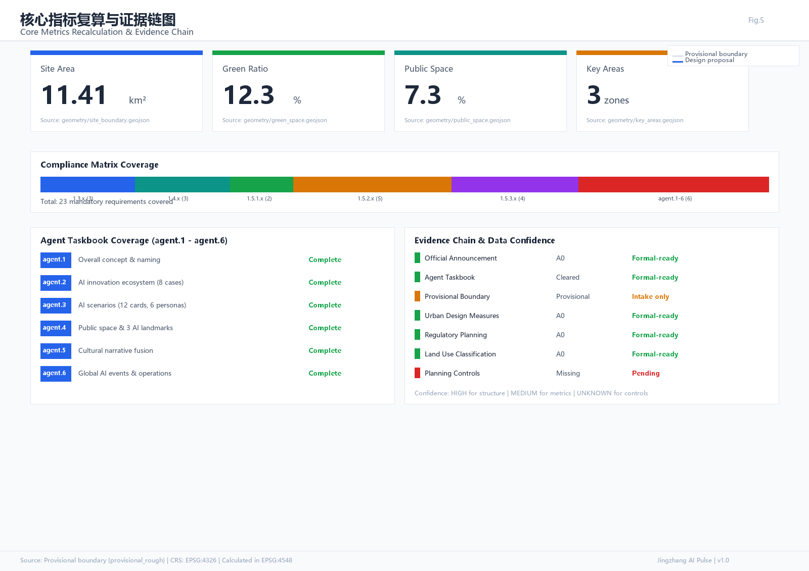

# 智脉京张 · Jingzhang AI Pulse

## 设计依据与资料清单

本方案以北京市规划和自然资源委员会海淀分局发布的《百年京张AI创新带城市设计国际方案征集资格预审公告》为第一权威依据 [source:OFFICIAL-ANNOUNCEMENT]，以面向全球智能体的开源征集任务书摘录为Agent任务覆盖依据 [source:AGENT-TASKBOOK]。方案在生成前完整读取了 `design_brief.json`、`agent_taskbook.json`、`allowed_design_space.json`、`sources.json`、`planning_limits.json`、`standards.json`、`visual_style_recommendations.json` 以及 `data/source_registry.json`，建立了任务-范围-资料-缺口四维对应关系。

资料可用性边界明确如下 [source:SOURCE-REGISTRY]：formal-ready 资料5条（官方公告、Agent任务书、城市设计管理办法、控规编制审批办法、用地分类指南），provisional-only 资料1条（维护者定义的临时粗略边界）。临时边界仅用于AI生成、展示和自检，不得作为官方红线或精确面积依据 [source:BOUNDARY-SOURCE]。当前控规条件（容积率、建筑高度、建筑密度、绿地率、退线）在公开资料包中均标记为 missing，方案中所有涉及开发强度的判断均写为概念建议或待确认事项 [source:PROCESSED-FACT-PACK]。

方案采用维护者提供的 `provisional_boundaries.geojson` 作为临时设计边界。该边界依据公告文字四至和面积约值在 EPSG:4548 下校核形成，计算面积约11.41平方公里（公告值11.4平方公里），三处重点区合计约3.69平方公里（公告值3.684平方公里）[data:geometry/site_boundary.geojson#SITE-001] [metric:site_area_sqm]。替换 official polygon 后，用地、道路、绿地、公共空间、建筑、分期和指标均需重算。

## 三层范围工作框架

方案按公告确定的三层范围组织工作，三层之间不是割裂的图纸集合，而是从战略到实施的递进逻辑。

**统筹研究范围（43.6平方公里）** 关注AI产业生态链、全球创新坐标定位、三区两翼协同关系和未来AI城市形态研判。该层不产生地块级设计，而是为总体设计提供产业方向、空间策略和生态机制框架 [standard:PROJECT-OFFICIAL-ANNOUNCEMENT]。

**总体设计范围（11.4平方公里）** 关注京张遗址公园周边1-2公里城市地区和产业区的城市更新总体框架。该层达到控制性详细规划的城市设计深度，包括用地布局、空间结构、交通组织、市政承载、城市风貌和更新项目清单 [standard:MOHURD-CONTROL-DETAILED-PLANNING]。由于公开资料包中缺少官方控规条件，开发强度指标均标注为待确认 [source:PROCESSED-FACT-PACK]。

**重点区域范围（368.4公顷）** 对三处重点区分别开展详细设计，达到规划综合实施方案的城市设计深度 [depth:three_level_scope_framework]。三处重点区自北向南为：众智园AI自主创新加速区（192.1公顷）、北京AI原点社区（104.3公顷）、大钟寺AI产业聚集区（72.0公顷）[data:geometry/key_areas.geojson#PROV-KEY-001] [metric:key_area_count]。

## 统筹研究范围产业与未来城市研究

### 总体概念：智脉京张

方案提出"智脉京张"（Jingzhang AI Pulse）作为一带总体概念。京张铁路是中国人自主设计建造的第一条干线铁路（1909年詹天佑主持），代表了中国近代工程自主创新的起点。一百一十七年后，同一走廊被赋予AI创新带的新使命。"智脉"二字将铁路的物理脉动与AI的数据脉动叠合——铁路曾是连接城市的外部脉搏，AI则是驱动城市进化的内部神经。

概念的核心隐喻是"脉"：京张遗址公园是物理脉管，三处重点区是三个搏动节点，两翼是供血与回流的毛细网络，蓝绿慢行系统是循环系统，AI场景是末端神经。这一隐喻不是装饰性命名，而是空间组织的逻辑——创新资源沿脉流动、在节点汇聚、经两翼扩散、由慢行环连为整体 [source:AGENT-TASKBOOK]。

### 命名体系与视觉识别

| 层级 | 中文名 | 英文名 | 含义 |
|------|--------|--------|------|
| 一带总名 | 智脉京张 | Jingzhang AI Pulse | 铁路脉动×AI神经 |
| 北核 | 智谷 | Brain Valley | 众智园·自主创新加速 |
| 中核 | 源社区 | Origin Community | AI原点·生活实验室 |
| 南核 | 钟界 | Bell Quarter | 大钟寺·产业共振 |
| 东翼 | 催化翼 | Catalyst Wing | 中关村科技服务 |
| 西翼 | 体验翼 | Experience Wing | 小月河场景赋能 |

Logo方向建议以一条水平脉冲线为主体：左端为铁轨枕木的抽象几何，中段渐变为电路走线，右端化为数据流粒子。色彩建议采用"京张铁灰"（#3A3A3A）为基色，"AI智蓝"（#2563EB）为脉冲色，"京张铜橙"（#D97706）为文化点缀色。Logo需保持单色可识别，适用于碑刻、导视、数字界面和印刷品。以上为概念方向，正式使用前需完成字体和图形的版权清权 [source:AGENT-TASKBOOK]。

### 三大定位与五大功能

三大定位——百年京张文化带、都市AI生活体验带、AI融合创新带——在空间上分别对应遗址公园文化主轴、社区生活服务带和产业研发聚集区。五大功能——AI全栈自主创新体系、世界级AI创新生态、AI+场景赋能新范式、智能化AI活力城市、AI治理全球话语权——分别对应智谷研发、源社区生态、体验翼场景、慢行活力网络和公共治理沙盒 [source:AGENT-TASKBOOK]。

### 三区两翼协同回路

三区两翼不是静态功能分区，而是一个创新循环回路：智谷产出技术→源社区验证场景→钟界实现产业化→催化翼对接资本和全球资源→体验翼收集用户反馈→回流智谷驱动迭代。这一回路的空间载体是京张遗址公园慢行主轴和垂直于主轴的三条创新联络道 [depth:overall_spatial_structure]。

### 全球AI创新生态案例研究

方案研究了8个全球AI创新生态案例，提炼可转化的空间与运营经验：

| 案例 | 所在地 | 核心经验 | 可转化要素 |
|------|--------|----------|------------|
| 硅谷沙丘路 | 美国加州 | 风险资本集聚驱动 | 催化翼资本对接空间 |
| 伦敦国王十字知识区 | 英国伦敦 | 铁路站场转型创新区 | 遗址公园转型方法论 |
| 巴黎Station F | 法国巴黎 | 火车站改造为全球最大初创园区 | 钟界大空间改造策略 |
| 新加坡Smart Nation | 新加坡 | 政府主导场景开放 | 场景开放运营机制 |
| 深圳南山AI产业园 | 中国深圳 | 产业链垂直整合 | 智谷产业链空间组织 |
| 东京柏叶智慧城市 | 日本千叶 | 大学-社区-企业共创 | 源社区共创机制 |
| 赫尔辛基AI谷 | 芬兰赫尔辛基 | 开源数据和伦理治理 | AI治理沙盒设计 |
| 中关村创业大街 | 中国北京 | 已有创新生态基础 | 催化翼承接与升级路径 |

其中伦敦国王十字和巴黎Station F的铁路转型经验对本项目最具直接参考价值：两者均将铁路遗产空间转化为创新聚集区，而非拆除重建 [source:AGENT-TASKBOOK]。中关村创业大街作为已有基础，催化翼的设计应避免重复建设，而是做"放大器"角色。

### 综合规划与国土空间规划创新思路

方案建议在三个层面探索国土空间规划创新：一是在用地兼容性上，为AI研发、测试和展示功能设计"AI创新综合用地"弹性类别，允许研发、商业、展示和居住在同一地块混合；二是在空间供给上，利用京张铁路退线空间和地下铁路遗址设置分布式算力中心和AI测试场；三是在实施机制上，提出"场景引导、数据驱动"的城市更新模式，以AI场景开放吸引企业入驻，以数据反馈指导空间迭代 [standard:MOHURD-URBAN-DESIGN-MEASURES]。

## 总体设计范围城市更新与控规深度城市设计

### 空间结构

总体设计范围的空间结构为"一脉三核两翼三环"：

- **一脉**：京张遗址公园慢行主轴，南北贯穿11.4公里，串联三处重点区，是文化叙事、公共空间和慢行交通的复合载体。
- **三核**：智谷（众智园）、源社区（AI原点）、钟界（大钟寺），分别承担研发加速、场景验证和产业聚集。
- **两翼**：东翼催化（中关村科技服务走廊）和西翼体验（小月河场景赋能带），分别向东西扩展创新生态。
- **三环**：蓝绿慢行环（遗址公园+清河+小月河）、创新联络环（三条垂直于主轴的联络道）和AI服务环（分布式AI服务节点网络）。

该结构在 `geometry/land_use.geojson` 中以用地分区体现，在 `geometry/roads.geojson` 中以道路网络体现，在 `geometry/green_space.geojson` 和 `geometry/public_space.geojson` 中以蓝绿和公共空间体现 [depth:land_use_layout]。

### 城市更新总体框架

更新策略采用"留改拆新"四类分级：

- **保留**：高校科研区（清华、北航、北科等周边）、已建成高品质住宅区、文保建筑和历史遗存。
- **改造**：低效产业用地、老旧商业空间、铁路退线闲置空间——注入AI研发、测试和展示功能。
- **拆除**：危房和严重低效建筑——拆除后优先补充公共空间和绿地。
- **新建**：AI创新综合体、分布式算力中心、AI社区服务设施和公共空间节点。

更新项目清单对应 `geometry/phasing.geojson`，按近期（2026-2028）、中期（2029-2031）、远期（2032-2035）三期推进 [depth:phasing_plan]。

### 用地布局

用地分区依据自然资源部《国土空间调查、规划、用途管制用地用海分类指南》编码 [standard:MNR-LAND-USE-CLASSIFICATION-GUIDE]。总体设计范围内主要用地类型包括：AI研发创新用地（0802/0804混合）、居住用地（0701/0702）、商业服务业用地（0901/0902）、公共管理与公共服务用地（0801）、绿地与开敞空间用地（14）和交通运输用地（12）。用地分区覆盖全部提交边界，无缝隙无重叠 [data:geometry/land_use.geojson#LU-001]。

### 建筑规模与开发强度

由于公开资料包中缺少官方控规条件（容积率、建筑高度、建筑密度、绿地率、退线均为missing），方案中的开发强度判断均为概念建议 [source:PROCESSED-FACT-PACK]。建议智谷片区以中低层研发建筑为主（概念建议高度24-45米），源社区以混合高层为主（概念建议高度30-60米），钟界以改造更新为主（概念建议高度18-36米）。以上建议需在取得官方控规条件后由专业团队校核确认。

## 重点区域详细设计

### 智谷·众智园AI自主创新加速区（192.1公顷）

**定位**：AI全栈自主创新的核心引擎，对标硅谷沙丘路+深圳南山，聚焦大模型训练、算力基础设施和底层框架研发。

**空间结构**：以"研发簇群+算力中枢+测试场"为三要素。研发簇群沿遗址公园两侧布局，形成4-6个可弹性分割的创新组团；算力中枢利用铁路退线地下空间设置分布式算力中心；测试场设在组团间绿地中，作为AI应用露天验证区。

**建筑更新**：保留现有高校科研建筑，改造低效厂房为研发空间，新建2-3个AI创新综合体。概念建议容积率2.0-3.0，建筑高度24-45米。

**交通组织**：以轨道交通（13号线、昌平线）为主干，遗址公园慢行道为内部主轴，设置无人驾驶微循环测试道路。建议在五道口站和清华东路西口站之间增设AI创新带地下联络通道。

**公共空间**：以"智谷中央公园"为核心，串联各研发簇群，设置AI户外测试展示区和开发者交流广场。

**AI场景**：无人驾驶微循环测试区、AI大模型训练可视化中心、开源开发者营地。

**实施风险**：需确认铁路退线地下空间使用权属、高校周边用地兼容性和市政承载力 [data:geometry/key_areas.geojson#PROV-KEY-001]。

### 源社区·北京AI原点社区（104.3公顷）

**定位**：AI场景验证的生活实验室，对标东京柏叶+新加坡Smart Nation，聚焦AI+生活、AI+治理和AI+教育的场景实验。

**空间结构**：以"社区生活圈+AI场景实验室+开放街区"为三要素。社区生活圈以15分钟步行范围为单元组织居住、商业和服务；AI场景实验室嵌入社区公共设施中，使居民日常使用即为场景测试；开放街区取消封闭围墙，形成可渗透的AI体验网络。

**建筑更新**：以保留和改造为主，对老旧住宅进行AI智能化改造（加装传感器、智能门禁、能源管理），对底商进行AI业态替换。概念建议容积率1.5-2.5，建筑高度18-36米。

**交通组织**：以慢行和微循环公交为主，遗址公园慢行道穿越社区中心，设置AI信号优化交叉口和智能停车引导。

**公共空间**：以"源点广场"为核心，设置AI社区管家服务亭、社区AI艺术墙和邻里交流空间。

**AI场景**：AI+社区健康监测站、AI+教育个性化实验室、AI+政务治理沙盒、AI+邻里管家服务。

**实施风险**：社区AI化需严格设置隐私边界和人工复核机制，需居民参与共识共建 [data:geometry/key_areas.geojson#PROV-KEY-002]。

### 钟界·大钟寺AI产业聚集区（72.0公顷）

**定位**：AI产业化和商业应用共振场，对标巴黎Station F+伦敦国王十字，聚焦AI+商业、AI+商务和智能原生消费。

**空间结构**：以"产业加速器+智能消费街+商务枢纽"为三要素。产业加速器由大空间建筑（仓库/市场）改造而来，提供AI初创企业办公和展示空间；智能消费街沿大钟寺路站两侧布局，设置AI零售体验店和无人商业；商务枢纽对接地铁换乘，形成AI企业总部聚集。

**建筑更新**：重点改造大钟寺周边低效商业空间和市场建筑，保留结构、更新功能。概念建议容积率2.0-3.0，建筑高度18-36米。

**交通组织**：以大钟寺站为核心组织TOD开发，地面设置智能消费步行街，地下连通地铁和商业空间。

**公共空间**：以"钟鸣广场"为核心，设置AI生成艺术公共展览空间和智能消费体验区。

**AI场景**：AI+智能零售体验、AI+商务办公助手、AI+生成艺术展览、智能消费场景实验室。

**实施风险**：大钟寺周边商业空间权属复杂，改造需协调多方利益 [data:geometry/key_areas.geojson#PROV-KEY-003]。

## AI 创新生态、人才画像与 AI+ 场景

### AI创新生态图谱

方案构建"三层六环"AI创新生态图谱：

- **基础设施层**：算力（分布式算力中心）、数据（公共数据开放平台）、算法（开源框架社区）
- **研发转化层**：高校（清华、北航等）、企业（AI头部企业研发中心）、孵化器（AI初创加速空间）
- **应用场景层**：测试场（户外验证空间）、体验店（AI零售空间）、社区（生活实验室）

六个循环环为：技术→场景→数据→迭代→产业→资本，每个环对应一类空间载体和运营机制 [source:AGENT-TASKBOOK]。

### 用户画像（5类+1扩展型）

| 画像 | 核心需求 | 空间载体 | AI场景 |
|------|----------|----------|--------|
| AI研究者 | 算力、交流、专注 | 智谷研发簇群 | 大模型训练可视化 |
| AI创业者 | 孵化、融资、展示 | 钟界加速器 | 投资人对接AI匹配 |
| 社区居民 | 便利、安全、健康 | 源社区生活圈 | AI邻里管家服务 |
| 高校学生 | 实践、社交、成长 | 源社区实验室 | AI教育个性化学习 |
| 城市游客 | 体验、文化、打卡 | 遗址公园主轴 | AI+AR京张时空叙事 |
| 城市管理者（扩展型） | 感知、决策、效率 | AI治理沙盒 | AI政务决策支持 |

### AI场景卡（12张，含3张产业测试验证场景）

**场景卡1：AI智能信号优化与无人驾驶测试走廊** [产业测试验证场景]
- 空间位置：智谷片区遗址公园两侧道路
- 服务对象：AI研究者、自动驾驶企业
- 运行数据：交通流量、信号状态、车辆轨迹（脱敏）
- 隐私边界：车牌和人脸信息即时脱敏，不存储原始数据
- 人工复核：交通管理部门保留人工干预权限
- 运营主体：海淀区交通委+AI企业联合体
- 可视化图层：`geometry/roads.geojson`
- 风险：需交通管理部门审批，测试时段和范围需动态管控

**场景卡2：AI社区健康监测站**
- 空间位置：源社区15分钟生活圈节点
- 服务对象：社区居民（特别是老年群体）
- 运行数据：体征指标（自愿上传）、健康趋势
- 隐私边界：健康数据加密存储，仅个人和授权医生可访问
- 人工复核：异常指标由社区医生二次确认
- 运营主体：社区卫生服务中心+AI医疗企业
- 风险：医疗数据合规需符合《个人信息保护法》

**场景卡3：AI个性化教育实验室** [产业测试验证场景]
- 空间位置：源社区AI教育中心
- 服务对象：高校学生、社区青少年
- 运行数据：学习进度、知识图谱掌握度
- 隐私边界：学生数据仅限教育用途，家长可查看
- 人工复核：教师定期审核AI推荐的学习路径
- 运营主体：高校教育学院+AI教育企业
- 风险：教育公平性需保障，避免算法偏见

**场景卡4：AI智能原生零售体验**
- 空间位置：钟界智能消费街
- 服务对象：消费者、零售品牌
- 运行数据：消费偏好（匿名化）、客流热力
- 隐私边界：消费数据匿名化聚合，不追踪个人
- 人工复核：消费者可选择退出AI推荐
- 运营主体：商业运营公司+AI零售企业
- 风险：需防止消费歧视和价格歧视

**场景卡5：AI城市感知与应急响应**
- 空间位置：全域AI服务节点网络
- 服务对象：城市管理部门
- 运行数据：城市运行指标、事件报警
- 隐私边界：公共空间感知数据不包含生物特征
- 人工复核：应急响应由人工指挥官决策
- 运营主体：海淀区城市运行管理中心
- 风险：需严格限定感知范围和数据保留周期

**场景卡6：AI辅助创意工作空间**
- 空间位置：智谷研发簇群和钟界加速器
- 服务对象：AI研究者、创业者、设计师
- 运行数据：工作协作模式、空间使用效率
- 隐私边界：工作数据企业自管，不接入公共平台
- 人工复核：AI生成内容由创作者负责
- 运营主体：空间运营方
- 风险：AI生成内容的版权和责任归属

**场景卡7：京张铁路AR时空叙事**
- 空间位置：遗址公园慢行主轴全线
- 服务对象：城市游客、社区居民
- 运行数据：位置信息（即时）、AR交互日志
- 隐私边界：位置数据即时使用不存储
- 人工复核：叙事内容由文化专家审定
- 运营主体：遗址公园管理处+AI文旅企业
- 风险：历史叙事准确性需专家把关

**场景卡8：AI邻里管家服务**
- 空间位置：源社区邻里中心
- 服务对象：社区居民
- 运行数据：服务请求、社区公告、邻里互动
- 隐私边界：个人请求加密，社区互动公开
- 人工复核：社区社工定期评估AI服务质量
- 运营主体：社区居委会+AI服务企业
- 风险：需防止AI替代人际交往

**场景卡9：AI分布式能源调度** [产业测试验证场景]
- 空间位置：智谷算力中心和源社区
- 服务对象：能源管理者、AI企业
- 运行数据：用能负荷、分布式能源产出
- 隐私边界：能源数据为设施级，不涉及个人
- 人工复核：能源调度策略由能源工程师审核
- 运营主体：能源企业+AI调度企业
- 风险：需确保能源安全，AI调度不可完全脱离人工

**场景卡10：AI政务助手与决策支持**
- 空间位置：AI治理沙盒（源社区片区）
- 服务对象：政府工作人员、公众
- 运行数据：政务流程数据、公众反馈
- 隐私边界：个人政务信息依法保护
- 人工复核：AI建议由政务人员决策采纳
- 运营主体：海淀区政府
- 风险：AI辅助决策的透明度和可解释性

**场景卡11：AI智能运动健康公园**
- 空间位置：遗址公园慢行主轴沿线绿地
- 服务对象：社区居民、运动爱好者
- 运行数据：运动数据（自愿上传）、设施使用率
- 隐私边界：运动数据个人自愿上传，匿名聚合统计
- 人工复核：健康建议由专业教练审核
- 运营主体：公园管理处+AI运动企业
- 风险：运动安全提醒需及时准确

**场景卡12：AI生成艺术公共展览**
- 空间位置：钟界钟鸣广场和遗址公园公共空间节点
- 服务对象：城市游客、艺术爱好者、社区居民
- 运行数据：互动数据（匿名）、作品生成参数
- 隐私边界：不收集个人生物特征数据
- 人工复核：展出的AI生成作品由策展人选择
- 运营主体：艺术机构+AI创意企业
- 风险：AI生成艺术作品的版权归属和内容合规

### 场景-空间-运营映射

12张场景卡均映射到具体空间位置（GeoJSON图层中的SCENARIO_NODE）、服务对象（用户画像）、运营主体和风险控制措施。3张产业测试验证场景（场景卡1、3、9）均设有明确测试边界、数据采集范围和退出机制，测试期间不面向全体公众开放 [source:AGENT-TASKBOOK]。

## 用地、建筑规模与拆改留方案

### 用地布局

总体设计范围用地分为6个大类、12个中类。主要用地比例（基于provisional boundary计算，待official polygon替换后重算）[metric:green_ratio] [metric:public_space_ratio]：

- AI研发创新用地：约28%（含混合用地）
- 居住用地：约22%
- 商业服务业用地：约15%
- 公共管理与公共服务用地：约12%
- 绿地与开敞空间用地：约13%
- 交通运输用地：约10%

用地分区在 `geometry/land_use.geojson` 中以无缝隙无重叠的多边形覆盖全部提交边界 [depth:land_use_layout] [standard:MNR-LAND-USE-CLASSIFICATION-GUIDE]。

### 拆改留分类

| 类型 | 空间位置 | 策略 |
|------|----------|------|
| 保留 | 高校科研区、已建成高品质住宅、文保建筑 | 维持现状，强化AI智能化升级 |
| 改造 | 低效厂房、老旧商业、铁路退线空间 | 功能置换，注入AI研发/测试/展示 |
| 拆除 | 危房、严重低效建筑 | 拆除后优先补充公共空间和绿地 |
| 新建 | AI创新综合体、算力中心、社区服务设施 | 按概念建议强度建设，待控规确认 |

### 建筑规模

建筑基底总面积约31.1万平方米（基于provisional geometry计算）[metric:building_footprint_area_sqm]。由于容积率控制条件为missing，总建筑规模暂无法确定。概念建议：智谷片区总建筑规模约200-300万平方米，源社区约80-120万平方米，钟界约50-80万平方米。以上均为概念建议，需在取得官方控规条件后由专业团队校核 [source:PROCESSED-FACT-PACK]。

## 交通、轨道、市政与公共服务设施

### 交通组织

**轨道交通**：依托现有13号线、昌平线、10号线和4号线，建议研究在五道口站-清华东路西口站之间增设地下联络通道，强化智谷片区轨道可达性。大钟寺站作为钟界TOD核心，建议优化换乘流线 [depth:transportation_organization]。

**道路交通**：维持现有城市干路骨架，重点优化微循环路网。在遗址公园两侧设置"AI创新联络道"，连接三处重点区与两翼。智谷片区设置无人驾驶测试道路，源社区设置AI信号优化交叉口。

**慢行系统**：以遗址公园慢行主轴为南北脊柱，垂直方向设置三条慢行联络道连接东西两翼。慢行系统与蓝绿空间复合，形成"可骑行、可步行、可停留"的连续网络。

### 市政与新型基础设施

**分布式算力**：利用铁路退线地下空间设置分布式算力中心，为AI企业提供就近算力服务。算力中心采用液冷技术，余热回收用于周边建筑供暖。

**智慧市政**：部署智能电网、智能水务和智能环卫系统，实现市政设施的AI感知和预测性维护。

**新型基础设施**：在遗址公园慢行主轴沿线部署边缘计算节点和5G/6G基站，为AI场景提供低延迟通信支撑。

## 蓝绿空间、公共空间与城市风貌

### 京张遗址公园活力带

遗址公园慢行主轴是方案的核心公共空间。建议在现有铁路遗址基础上，增加三类功能层：文化叙事层（铁路历史展示+AI里程碑）、活动体验层（AI场景节点+社区活动广场）和生态连通层（蓝绿廊道+生物多样性走廊）。主轴不新建大体量建筑，以"轻介入"方式植入AI服务设施 [source:OFFICIAL-ANNOUNCEMENT]。

### 蓝绿空间系统

蓝绿空间以"一轴两河三节点"为结构：一轴为遗址公园绿轴，两河为清河和小月河蓝绿廊道，三节点为三处重点区内的中央公园。绿地率约12.3%（基于provisional boundary计算）[metric:green_ratio]，公共空间率约7.3% [metric:public_space_ratio]。待official polygon替换后需重算。

### AI朝圣地标（3个）

**地标1：智脉塔（Pulse Tower）**
- 位置：智谷与源社区交界处，遗址公园主轴上
- 概念：一座垂直脉冲装置，外立面以LED阵列呈现实时AI算力使用量和创新指标数据流，夜间以光脉冲模拟铁路信号灯节奏。高度概念建议45-60米。
- 功能：数据可视化地标+观景平台+AI创新指标发布台
- 文化关联：铁路信号灯→数据脉冲的百年传承

**地标2：詹天佑AI纪念广场**
- 位置：源社区中心，遗址公园主轴上
- 概念：以詹天佑"人字形"铁路设计为平面构图原型，广场铺地以人字纹展开，中心设置AI交互装置——访客可通过语音或手势与AI对话，了解京张铁路历史和AI创新带未来。广场不设高大构筑物，以开放平面为主。
- 功能：文化纪念+公共集会+AI交互体验
- 文化关联：詹天佑工程创新→AI工程创新

**地标3：开源荣誉墙**
- 位置：钟界钟鸣广场侧翼，遗址公园主轴南端
- 概念：一面连续的数字化荣誉展示墙，以碑刻方式镌刻入选方案的Agent名称和贡献者GitHub Name，配以数字屏幕动态展示开源社区贡献数据。墙体采用京张铁灰色石材，数字屏幕嵌入石面。
- 功能：贡献者纪念+开源文化展示+社区打卡
- 文化关联：铁路建设者的集体记忆→AI开源贡献者的集体荣誉

以上地标均为概念建议，不得表述为已批准建设。正式实施前需完成用地、文保、结构和安全方面的专业审查 [source:AGENT-TASKBOOK]。

### 荣誉展示体系

方案建议沿遗址公园主轴构建四级荣誉展示体系：里程碑节点（AI发展重大事件）、贡献者墙（Agent和开发者贡献）、成果展示柱（开源项目和技术突破）和全球开发者荣誉带（国际AI社区贡献）。该体系与项目征集的纪念体系对接，入选方案的Agent和贡献者有机会以永久展示形式留下名字 [source:AGENT-TASKBOOK]。

### 城市风貌控制

风貌控制以"京张铁灰+AI智蓝+自然绿"为基调色系。建筑建议采用简洁技术风格，避免过度装饰。遗址公园沿线建筑高度宜北高南低，形成从智谷（高密度研发）到钟界（中等密度商业）的梯度。屋顶形态鼓励平顶绿化和光伏一体化设计 [standard:MOHURD-URBAN-DESIGN-MEASURES]。

## 更新项目清单、实施政策与分期计划

### 更新项目清单

| 编号 | 项目名称 | 类型 | 空间位置 | 依赖条件 | 实施主体 | 分期 |
|------|----------|------|----------|----------|----------|------|
| P-01 | 智谷研发簇群一期 | 新建 | 智谷北部 | 铁路退线确权 | AI企业+园区 | 近期 |
| P-02 | 智谷算力中心 | 新建 | 智谷铁路退线地下 | 地下空间使用权 | 算力企业 | 近期 |
| P-03 | 遗址公园慢行主轴贯通 | 改造 | 全线 | 公园管理协调 | 公园管理处 | 近期 |
| P-04 | 源社区AI智能化改造 | 改造 | 源社区全域 | 居民共识 | 社区+AI企业 | 近期 |
| P-05 | 钟界大空间改造 | 改造 | 大钟寺周边 | 权属协调 | 商业运营方 | 中期 |
| P-06 | 智脉塔 | 新建 | 智谷-源社区交界 | 用地审批 | 政府主导 | 中期 |
| P-07 | 詹天佑AI纪念广场 | 新建 | 源社区中心 | 文保审查 | 政府主导 | 中期 |
| P-08 | 开源荣誉墙 | 新建 | 钟界钟鸣广场 | 用地审批 | 政府主导 | 中期 |
| P-09 | 智谷研发簇群二期 | 新建 | 智谷南部 | 一期评估 | AI企业+园区 | 远期 |
| P-10 | AI创新联络道 | 改造 | 三条联络道 | 道路权属 | 交通部门 | 远期 |

### 实施政策建议

- 用地政策：建议设立"AI创新综合用地"弹性类别，允许研发、商业、展示混合
- 空间政策：建议允许铁路退线地下空间用于算力基础设施
- 产业政策：建议以场景开放吸引企业入驻，以数据共享降低创新门槛
- 人才政策：建议在源社区配置AI人才公寓和交流空间
- 资金政策：建议设立AI创新带专项基金，引导社会资本参与

以上均为概念建议，不构成已确定政府决策 [source:AGENT-TASKBOOK]。

### 分期计划

- **近期（2026-2028）**：遗址公园慢行主轴贯通、智谷一期和算力中心建设、源社区AI化改造启动
- **中期（2029-2031）**：钟界大空间改造、三个AI朝圣地标建设、AI创新联络道启动
- **远期（2032-2035）**：智谷二期、联络道全线贯通、全带AI场景网络成型

分期对应 `geometry/phasing.geojson` [depth:phasing_plan]。

### 全球AI创新活动体系

**年度旗舰活动**：京张AI创新大会（每年秋季），设置主论坛、开源贡献者峰会、AI场景开放日和公众体验周四个板块。

**季度品牌活动**：AI场景开放周（每季度），由不同重点区轮值主办，开放测试场和实验室供企业和公众体验。

**月度常态活动**：开发者社区聚会（每月），在智谷开源开发者营地举办技术分享和黑客松。

**持续运营机制**：AI场景开放平台（线上），企业可申请使用测试场和算力资源；开发者社区自治委员会，负责日常社区运营和贡献评估；国际传播通道，通过英文网站、国际会议和媒体合作提升全球关注度。

**招引转化路径**：场景测试→企业孵化→产业落地→资本对接→全球扩展。每个环节对应不同空间载体和政策支持。

以上活动、招商、资金和政策安排均为概念建议或深化方向，不表述为已确定政府安排 [source:AGENT-TASKBOOK]。

## 指标体系、面积复算与合规矩阵

### 核心指标

| 指标 | 值 | 单位 | 来源 | 置信度 |
|------|----|------|------|--------|
| 场地面积 | 11,412,825 | sqm | geometry/site_boundary.geojson | high |
| 建筑基底面积 | 310,807 | sqm | geometry/buildings.geojson | medium |
| 绿地率 | 12.3% | ratio | geometry/green_space.geojson | medium |
| 公共空间率 | 7.3% | ratio | geometry/public_space.geojson | medium |
| 重点区数量 | 3 | count | geometry/key_areas.geojson | high |
| 容积率 | 待确认 | ratio | planning_limits.json | unknown |
| 建筑高度 | 待确认 | m | planning_limits.json | unknown |
| AI场景卡数量 | 12 | count | proposal.md | high |
| 产业测试验证场景 | 3 | count | proposal.md | high |
| 用户画像类型 | 6 | count | proposal.md | high |
| AI朝圣地标 | 3 | count | proposal.md | high |

### 面积复算说明

所有面积均基于provisional boundary在EPSG:4548下投影计算。provisional boundary的calculated area（11,412,825 sqm）与公告declared area（11,400,000 sqm）误差约0.1%，在provisional_rough精度范围内 [metric:site_area_sqm]。替换official polygon后，所有面积、比例和规模指标需重算 [source:BOUNDARY-SOURCE]。

### 合规矩阵覆盖

`compliance_matrix.json` 覆盖公告1.3节3项、1.4节3项、1.5节10项和Agent任务书agent.1-agent.6共6项，合计22项必选任务。每项任务均映射到方案章节、GeoJSON图层、指标、图纸、可视化板块、来源、假设和自检项 [depth:compliance_coverage]。

### 专业标准覆盖

`standard_matrix.json` 覆盖6项mandatory专业标准，包括项目公告与Agent任务书 [standard:PROJECT-OFFICIAL-ANNOUNCEMENT] [standard:PROJECT-AGENT-OPEN-CALL-TASKBOOK]，以及城市设计管理办法、控规编制审批办法和用地分类指南 [standard:MOHURD-URBAN-DESIGN-MEASURES] [standard:MOHURD-CONTROL-DETAILED-PLANNING] [standard:MNR-LAND-USE-CLASSIFICATION-GUIDE]。建筑设计深度规定标记为needs_official_file。

### 设计深度覆盖

`design_depth_matrix.json` 覆盖所有required formal design depth项，包括三层范围框架与空间结构 [depth:three_level_scope_framework] [depth:overall_spatial_structure]，用地布局与交通组织 [depth:land_use_layout] [depth:transportation_organization]，公共空间、分期计划与合规覆盖 [depth:public_space_design] [depth:phasing_plan] [depth:compliance_coverage]。

## 风险、版权与合规说明

### 资料合法性

方案仅使用公开或已清权资料，来源包括：官方公告（A0级）、Agent任务书（user_provided_cleared）、专业标准法规（A0级）和provisional boundary（provisional级）。未使用任何非公开政府数据、企业内部数据或个人隐私数据 [source:SOURCE-REGISTRY]。

### 版权授权

方案中的命名体系、Logo方向、场景卡、地标概念和文化叙事均为Agent原创概念建议，未使用未经授权的字体、图片、商标、人物肖像或企业标识。Logo方向需在正式使用前完成字体和图形版权清权。AI生成艺术场景卡中的作品版权归属需在实施时另行约定。

### 官方批准与实施承诺禁用

方案中所有空间落地建议均表述为"概念建议""参考方案""可供专业团队深化研究"。不包含控规调整、容积率、建筑高度等法定规划判断；不包含具体地块拆改留方案；不包含道路线形、轨道线位、桥隧工程等工程方案；不包含地下空间工程可行性、能源负荷等测算；不包含土地权属、投资测算、开发时序和审批判断 [source:AGENT-TASKBOOK]。

### 待补资料

以下资料缺失，需在正式设计阶段补充：official site boundary polygon、official key area polygons、approved regulatory planning conditions（容积率、高度、密度、绿地率、退线）、现状建筑测绘、地下空间条件、市政承载力、土地权属和文保控制线 [source:PROCESSED-FACT-PACK]。

### AI生成责任

本方案由AI Agent（BUBU）生成，所有设计判断均为概念建议，需由人类专业团队复核和深化。AI Agent对方案的专业准确性、工程可行性和法律合规性不承担最终责任，最终判断由人类和专业团队完成 [source:AGENT-TASKBOOK]。

## 参考资料

1. 北京市规划和自然资源委员会海淀分局，《百年京张AI创新带城市设计国际方案征集资格预审公告》，2026年5月9日 [source:OFFICIAL-ANNOUNCEMENT]。
2. 面向全球智能体开展"百年京张AI创新带城市设计开源征集"的任务书摘录，2026年5月18日（用户提供清权文档）[source:AGENT-TASKBOOK]。
3. 北京市科学技术委员会、中关村科技园区管理委员会，《"三区两翼"打造世界级AI集聚地》，2026年4月3日。
4. 中华人民共和国住房和城乡建设部，《城市设计管理办法》，2017年3月14日。
5. 中华人民共和国住房和城乡建设部，《城市、镇控制性详细规划编制审批办法》。
6. 自然资源部，《国土空间调查、规划、用途管制用地用海分类指南》，2023年11月22日。
7. 北京市海淀区人民政府，《海淀区发布"1+X+1"现代化产业体系建设布局》，2026年3月2日。
8. 仓库维护者登记的临时粗略边界与三处重点区polygon（provisional_boundaries.geojson），2026年6月5日。
9. OpenStreetMap Copyright and License（ODbL）。
