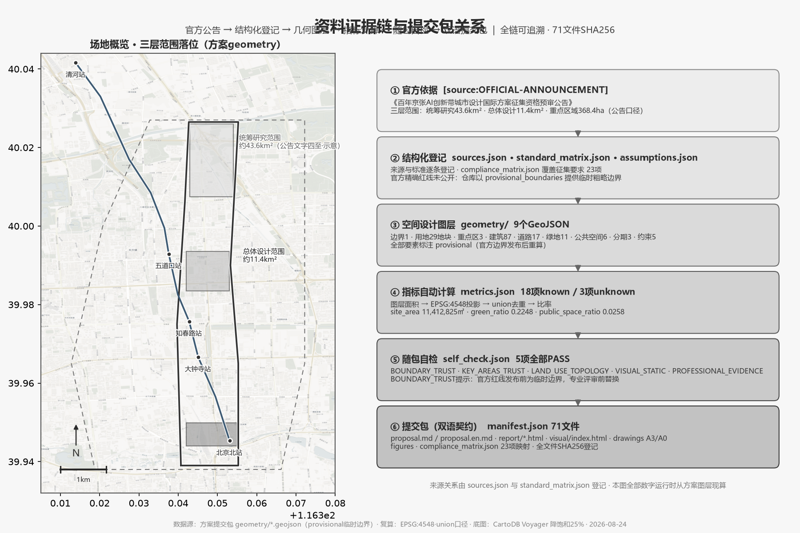
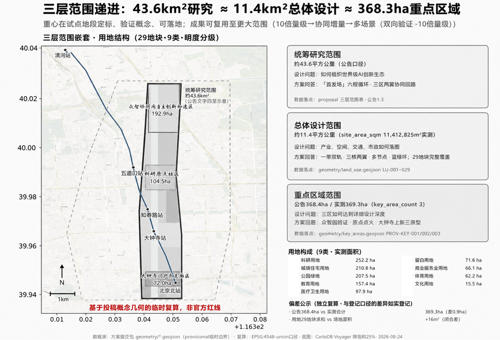
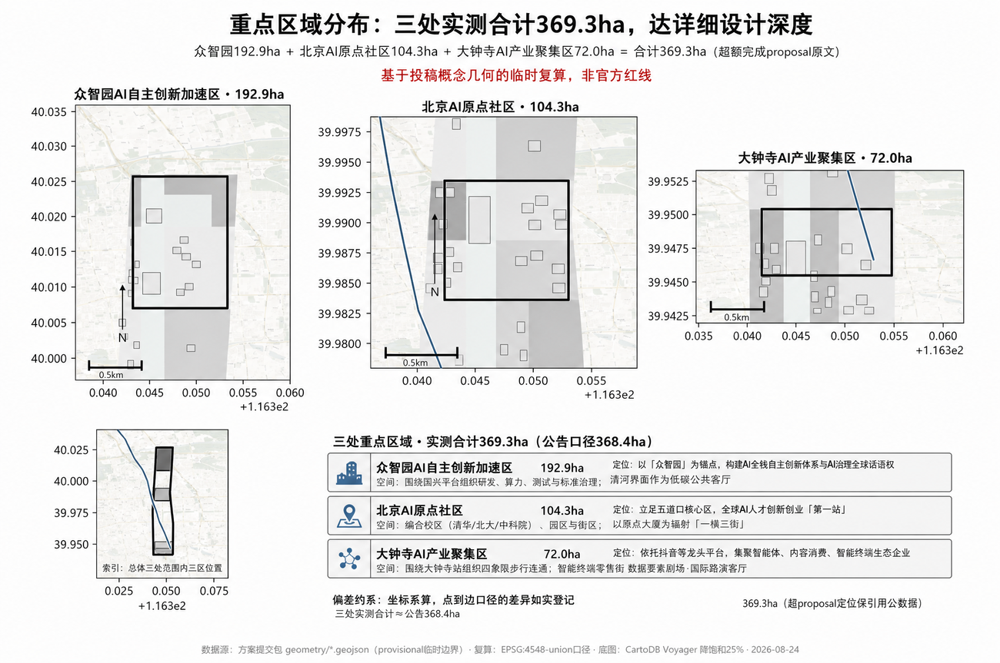
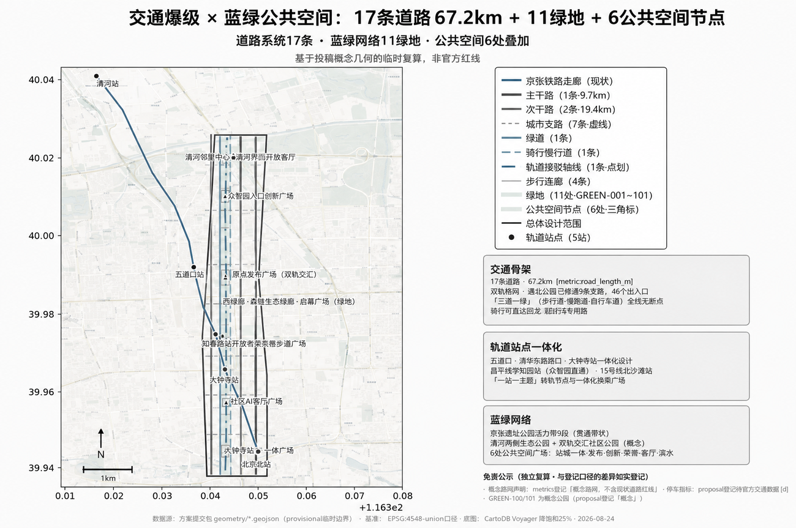
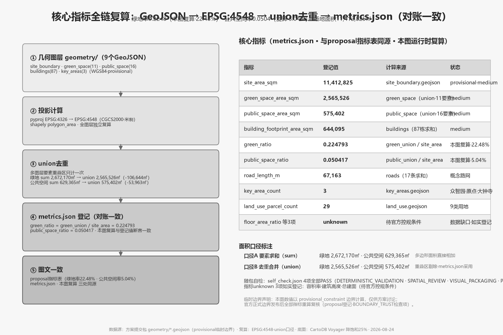

# Jing-Zhang AI First Launch Field: Urban-Scale Infrastructure Where AI Originality Is Discovered, Verified and Adopted in the Real City

## Executive Summary

Haidian already holds a high density of AI resources: the public figure for 2024 was an AI core industry scale of RMB 282.2 billion and more than 1,900 AI enterprises, while the 2026 figure exceeds 2,000 enterprises and RMB 350 billion; the two years use different statistical scopes and must not be mixed [Source: Beijing Municipal Science and Technology Commission, 2025-07; Beijing Municipal Government, 2026-04]. The Jing-Zhang Railway Heritage Park has likewise formed a real public space and activity base: the public operating figure for 2025 was more than 60 events and over 4.3 million visits [Source: Beijing Municipal Government, 2026-03].

The core problem of the Centennial Jing-Zhang AI Innovation Belt is therefore not "how to add more resources, facilities and events", but how to make scattered resources easier to discover and collaborate, how to help original outcomes cross the gaps between engineering verification, city trial and market adoption, how to let public space produce both innovation value and resident value, and how to make AI trials understandable, selectable, auditable and reversible.

This proposal puts forward the "**Jing-Zhang AI First Launch Field**": it is not a launch event, nor a claim of being "first in the world", but urban-scale infrastructure that enables AI originality to complete the six-stage cycle of "original discovery - prototype teaming - engineering verification - city trial - product adoption - replication and diffusion" in the real city. Every project passes through both an "innovation-effectiveness track" and a "public-value track"; only when technology is reliable and public rights, human accountability and operating conditions are simultaneously established may a project proceed to the next stage.

Spatially, the proposal echoes the approved statutory plan's "one belt, one axis, two centers, multiple nodes" structure [Source: Beijing Municipal Commission of Planning and Natural Resources, approved 2026-08-12], and integrates the brief's "three areas, two wings" industrial structure into a spatial language of "**one belt, dual tracks, three cores, two wings, multiple nodes, blue-green ring**": Zhongzhiyuan is the hard-track hub (engineering verification), the AI Origin Community is the dual-track junction and switch point (origin ignition), and Dazhongsi is the soft-track landing (adoption and refresh), with the Zhongguancun technology-service wing as the dual-track converter and the Xiaoyue River scenario-empowerment wing as the soft-track depth.

The proposal does not prioritize new monumental structures. It begins with the "Jing-Zhang First Launch Pass", a relay of three real projects, 12 problem-oriented scenarios, three test sites, five personas and a phased governance system. Its ultimate goal is to convert Haidian's resource density into systemic effectiveness, the park's public traffic into co-creation, and AI governance into visible, executable and replicable urban capability.

**A three-minute plain-language version for residents along the corridor**: In one sentence - new AI products will first be trialled along this street, and promoted only if they work. This is not a new row of towers but a walkable, playable, usable 9-km urban avenue. Residents will keep their parks and quiet corners - everything remains usable without AI, and any AI-equipped facility must keep a human-service channel. AI products go through six steps (original idea, prototype teaming, real-street verification, citizen trial, adoption, replication), each gated by a dual review - technical reliability and public acceptance; failures pause or exit rather than being forced through. Citizens can serve as trial users, reviewers and advisors; contributions are recorded on the "dual-track medal" wall, and complaint/exit channels are always open [source:AGENT-TASKBOOK].

**Naming system and visual direction**: primary name **Jing-Zhang AI First Launch Field** (abbreviation JZ-FLF). "First Launch" echoes the historical origin of the centennial Jing-Zhang Railway - China's first self-built trunk line in 1909; in 2026 this corridor becomes the "first site where AI originals are verified in a real city". The "Field" is both a place (the 9-km linear site) and a mechanism (the six-step cycle arena). The visual system centers on the "dual-track x switching" symbol - twin rails as the dual review tracks, switch nodes as AI originals moving from lab to real city; colors drawn from rail gray-blue and Zhongguancun innovation orange, extending to signage, scenario cards and event visuals [standard:MOHURD-URBAN-DESIGN-MEASURES]. The name and visual can replicate to other districts as "[Place] First Launch Field", building brand assets.

## Basis and Source List

This proposal takes the Prequalification Announcement for the International Urban Design Open Call for the Centennial Jing-Zhang AI Innovation Belt, issued by the Haidian Branch of the Beijing Municipal Commission of Planning and Natural Resources, as its primary basis [source:OFFICIAL-ANNOUNCEMENT], and reads the agent-facing taskbook compiled in this repository [source:AGENT-TASKBOOK], the structured site package [source:SITE-PACKAGE], the public source registry [source:SOURCE-REGISTRY], the processed fact pack [source:PROCESSED-FACT-PACK; provisional] and the provisional boundary source [source:BOUNDARY-SOURCE]. Design judgments follow the evidence chain of "announcement tasks - machine-readable data - narrative - drawings and HTML". Core standards and depth constraints are listed below:

- Core standards: [standard:PROJECT-OFFICIAL-ANNOUNCEMENT], [standard:PROJECT-AGENT-OPEN-CALL-TASKBOOK]
- Professional standards: [standard:MOHURD-URBAN-DESIGN-MEASURES], [standard:MOHURD-CONTROL-DETAILED-PLANNING]
- Land-use standard: [standard:MNR-LAND-USE-CLASSIFICATION-GUIDE]
- Depth items: [depth:existing_conditions_diagnosis], [depth:three_level_scope_framework], [depth:overall_spatial_structure]
- Depth items: [depth:land_use_layout], [depth:development_intensity_controls], [depth:height_massing_character]
- Depth items: [depth:retain_renovate_demolish], [depth:traffic_rail_slow_parking], [depth:municipal_new_infrastructure]
- Depth items: [depth:blue_green_public_space], [depth:three_key_area_detailed_design], [depth:renewal_project_list]
- Depth items: [depth:phasing_implementation], [depth:metrics_recalculation], [depth:risk_missing_data]

As of the last public-source review date, the official precise polygon, CAD or GIS redline has not been released: the announcement gives the three-level scope areas and textual boundaries (the coordinated research area runs north to the North Fifth Ring Road, east to the Jingzang Expressway, south to Xizhimenwai Street, and west to Wanquanhe Road), but the prequalification package requires a download password, so the repository provides provisional rough boundaries in `provisional_boundaries.geojson` [source:BOUNDARY-SOURCE]. This proposal therefore uses `geometry/site_boundary.geojson#SITE-001` and `geometry/key_areas.geojson#PROV-KEY-001` etc. as provisional boundaries, and keeps labeling them in the narrative, HTML, sources, assumptions and self-checks: provisional boundaries may only be used for generation, presentation and discussion, and must not be treated as official redlines, approval bases or precise-area bases; the organizer's data gap does not block content scoring, and all layers and metrics must be recalculated once official data is released [depth:risk_missing_data].

The source-use boundary follows `data/source_registry.json` [source:SOURCE-REGISTRY]: formal authoritative conclusions may rely only on sources with `usable_for_formal="yes"`; background sources support mechanisms and narrative only; provisional sources support generation and discussion only. This proposal uses no non-public data, personal privacy data or unauthorized material; all areas, ratios, layer counts and mileages are reproducible from `geometry/*.geojson` and `metrics.json` [metric:site_area_sqm].

## Three-Level Scope Framework

The announcement defines three working levels [source:OFFICIAL-ANNOUNCEMENT]: a coordinated research area of about 43.6 km², an overall design area of about 11.4 km², and a key detailed-design area of about 368.4 hectares. The three levels are not three drawings of different precision for the same area, but a continuous evidence chain from "industrial strategy" to "concrete spatial moves" [depth:three_level_scope_framework]:

| Level | Area / announcement | Core question | This proposal's answer | Data anchor |
| --- | --- | --- | --- | --- |
| Coordinated research area | 43.6 km² | How to organize a world-class AI innovation ecosystem | "First Launch Field" six-stage cycle; three-areas-two-wings synergy loop; regional collaboration | [data:geometry/site_boundary.geojson#SITE-001] |
| Overall design area | 11.4 km² | How industry, space, transport and utilities land on the map | One belt, dual tracks, three cores, two wings, multiple nodes, blue-green ring; complete land-use zoning | [data:geometry/land_use.geojson#LU-001] |
| Key detailed-design area | 368.4 ha | How the three areas reach detailed-design depth | Three prototypes: Zhongzhiyuan verification, origin ignition, Dazhongsi refresh | [data:geometry/key_areas.geojson#PROV-KEY-001] |

Evidence for the boundaries and areas of the three levels is [metric:site_area_sqm], [metric:key_area_count] and [metric:zhongzhiyuan_ai_acceleration_area_area_sqm]. `geometry/site_boundary.geojson#SITE-001` is tagged `geometry_role=provisional_constraint`, `official_boundary=false`; all area metrics and drawings must be recalculated once official polygons are supplied [depth:metrics_recalculation].

## Coordinated Research Area: Industry and Future City Research

### Problem Diagnosis: Strong Resources, Strong Park, Weak Connection and Weak Conversion

Haidian does not lack AI resources, and the Jing-Zhang park does not lack public life; what is missing is the ability to convert resource density into systemic effectiveness. This proposal diagnoses five core problems [depth:existing_conditions_diagnosis]:

1. **Resource discoverability is insufficient**: universities, platforms, compute, capital and scenarios are numerous, but the mechanisms for "discovering, applying, combining and collaborating" are not yet clear - physical proximity has not automatically turned into synergy.
2. **Traffic-to-value conversion is insufficient**: the park has real footfall and AI experiences, but whether this converts into innovation collaboration and long-term public value remains unclear.
3. **Horizontal integration is limited**: the north-south axis is forming, but horizontal access, institutional openness and station links may still limit integration across the residential, campus and industrial areas east and west of the railway [depth:traffic_rail_slow_parking].
4. **Cost-escalation risk**: the success of an innovation district may raise housing, living and entrepreneurship costs - international experience shows gentrification risk around linear parks (homes within 80 m of the New York High Line carried a price premium of about 35.3%, peer-reviewed research) [source:PROCESSED-FACT-PACK; provisional].
5. **Governance operationalization is insufficient**: AI governance has strategic goals, but public authorization, auditing, human accountability and exit mechanisms for city trials still need to be operationalized.

These five problems are not five isolated shortcomings but five facets of one contradiction: **resource density is high, but systemic effectiveness has not yet been established.** Therefore, the concept of this proposal is not "add more" but "how to connect and produce public outcomes".

### Overall Concept: the Jing-Zhang AI First Launch Field

**The "Jing-Zhang AI First Launch Field" is urban-scale infrastructure that enables AI originality to be discovered, understood, verified, used, reviewed and diffused in the real city.** [depth:overall_spatial_structure]

**The four layers of "first launch":**

| Layer | Core question | Evidence outcome |
| --- | --- | --- |
| Originality first launch | Where does the originality come from, and how is contribution recognized | Source, authorization, attribution and openness boundary |
| Engineering first launch | Is the technology reliable and maintainable | Performance, safety, failure, interoperability and human takeover |
| City first launch | Does it solve a real problem and will the public use it | Task completion, accessibility, complaints, human substitution and public impact |
| Market/rule first launch | Does it have adoption, replication or standardization conditions | Adoption/non-adoption conclusion, replication conditions, rules and exit |

**Dual-track decision mechanism**: every project passes simultaneously through the "innovation-effectiveness track" (originality - engineering usability - scenario fit - adoption - diffusion) and the "public-value track" (real need - informed choice - fair access - human backstop - appeal and audit - reversible exit); only when both tracks pass may a project advance. This makes responsible AI not a terminal risk chapter but the core productive capacity of the First Launch Field.

**Spiritual core: the centennial thread from "engineering autonomy" to "full-stack autonomy"**. The Jing-Zhang Railway started construction in 1905 and was completed in 1909 as China's first trunk railway designed, built and operated entirely by Chinese people; Zhan Tianyou used a "human-shaped" zigzag line to conquer the steep gradient, at one-fifth of the cost estimated by foreigners and two years ahead of schedule [source:AGENT-TASKBOOK]. Over the following century, the spirit of "autonomy" continued along the timeline: in the 1980s Zhongguancun started from the electronics street; in 2019 the Beijing-Zhangjiakou High-Speed Railway became the world's first 350 km/h autonomous-driving high-speed railway (evaluated by the International Union of Railways UIC as an "outstanding AI implementation case") [source:PROCESSED-FACT-PACK; provisional]; in 2026 Haidian is advancing full-stack autonomous AI. **"Autonomous engineering - autonomous innovation - autonomous intelligence" is the narrative foundation of this proposal and the historical legitimacy of the First Launch Field.**

**IP system**: the primary IP is the "**Jing-Zhang AI First Launch Field**" (mechanism and brand combined, distinguished from spatial-translation concepts such as "laying a second track for the centennial Jing-Zhang railway"); the alternative IP is "**Crossing Point**" - Wudaokou derives its name from being the fifth railway crossing of the Jing-Zhang line from Xizhimen (1909), a historically verifiable fact, and "crossing point" naturally carries the semantics of intersection, passage, switching and entering the next stage, connecting a century of railway history with the AI era; "Next Cross" may be used as a branded English rendering (following the method of international district brands; native-language review is required before formal use) [depth:overall_spatial_structure].

### Benchmark Cases: Qianhai, the Yamanote Line and Global Experience

On a 30-year horizon this proposal benchmarks the two most direct cases and supplements them with global innovation-district experience [source:AGENT-TASKBOOK]:

| Case | Core mechanism | Transferable content |
| --- | --- | --- |
| Qianhai, Nanshan, Shenzhen | One street's GDP exceeds that of some cities; a "string of pearls" super-commercial chain links multiple consumption nodes along one axis | "Riverside consumption chain" paradigm: string Dazhongsi, Wudaokou and Zhongzhiyuan into a walkable consumption and experience chain |
| Tokyo Yamanote Line | One station one theme, all stations visitable; JR made 30 stations into personified IPs, making the line itself an IP asset | "One station one theme as a natural investment-attraction unit": theme the nodes along the line, give each station an AI theme anchor store (large-model experience hall, embodied-intelligence flagship store, open-source co-creation shop) |
| King's Cross, London | Railway-heritage regeneration; universities such as UCL as pillars; 20 years of sustained operation | University incubation + railway-heritage narrative + "public-led, private-followed" development |
| one-north, Singapore | Full chain of "R&D - pilot - incubation - industrialization"; strong government investment | Combination of full-chain pilot platforms and R&D tax credits |
| Sidewalk Labs, Toronto | Data-governance failure led to project collapse in three years (counter-example) | Data boundaries set in advance, public participation, exit mechanisms |
| Jing'an + Modu Space, Shanghai | Scenarios as the fulcrum, no parameter race | Scenario-driven technology landing; central-city scenario resources are the landing resources AI-native enterprises need most |

**Synthesis**: the common pattern of successful global cases is "university incubation, government support, scenario traction and institutional empowerment". In this belt, the AI Origin Community is the model of "university incubation + urban renewal", Zhongzhiyuan is the model of "heavy government investment + full-stack tackling", the Xiaoyue River wing is the carrier of "scenario traction + industrial depth", and the technology-service wing is the hub of "global configuration + institutional empowerment". **"One station one theme + anchor-store string" is an operable investment-attraction paradigm**: the Jing-Zhang corridor is itself "one line + N stations"; theming the nodes along the line and giving each station an AI theme anchor store creates a "thematic catalogue along the line" - visitors come for a station's theme, and investment attraction works by "one station, one business cluster".

### Regional Innovation Collaboration

The belt is not an isolated innovation belt but a key hub of Haidian's and Beijing's AI landscape, echoing the "three science cities and one zone" linkage [source:AGENT-TASKBOOK]:

- **Zhongguancun AI Beiwai Community** (in northwest Wangwang town, northern Haidian; first phase of 60,000 m² opened 2025-07): northward innovation incubation and ecosystem spillover, forming a north-south dual core with Jing-Zhang.
- **Zhongguancun (Haidian) Embodied-Intelligence Innovation Industrial Park** (at Dongpan Sci-Tech Center, with the Xiaoyue River on its west side): the first nationally named embodied-intelligence park, providing industrial depth for the Xiaoyue River wing.
- **Future Science City, Huairou Science City and Beijing Economic-Technological Development Area**: partners for hard-track technology spillover, soft-track scenario sharing and cross-area factor flow.
- **Beijing-Tianjin-Hebei**: AI industry-chain collaboration and an outbound channel.

Three collaboration mechanisms: **hard-track technology spillover, soft-track scenario sharing and cross-area factor flow** - the belt is positioned as a connecting hub (north to Beiwai, south to outbound channels, west to the Huairou data chain, east to E-Town mass production).

## Overall Design Area: Urban Renewal and Regulatory-Plan-Level Urban Design

### Spatial Structure: Echoing the Statutory Plan and Integrating the Brief

**Echoing the approved statutory plan's "one belt, one axis, two centers, multiple nodes"**: based on the approval of the Beijing Haidian District Jing-Zhang Railway Heritage Park Corridor (Key Area of the AI Innovation Street) HD00-1601 and Other Blocks Regulatory Detailed Plan (2024-2035) as reported by People's Daily and Beijing Daily on 12 August 2026 [source:OFFICIAL-ANNOUNCEMENT] - the statutory plan defines the spatial structure as "one belt, one axis, two centers, multiple nodes": one belt = the Jing-Zhang Railway Heritage Park industrial-innovation belt, one axis = the Zhongguancun Avenue innovation-development axis, two centers = Dazhongsi center and Wudaokou center, multiple nodes = Zhichun Road, Sidaokou and other important spatial nodes (the formal CAD/GIS redlines and quantitative indicators are not yet available to this submission; we rely on the statutory plan's text framework only). The spatial language of this proposal strictly echoes this plan rather than starting from scratch.

**Integrating the brief's "three areas, two wings"**: the brief uses "three areas, two wings" as the industrial-collaboration structure (Zhongzhiyuan AI Autonomous-Innovation Acceleration Area, Beijing AI Origin Community, Dazhongsi AI Industry Cluster, plus the Zhongguancun technology-service wing and the Xiaoyue River scenario-empowerment wing) [source:OFFICIAL-ANNOUNCEMENT]. This proposal merges the two official languages into "**one belt, dual tracks, three cores, two wings, multiple nodes, blue-green ring**":

- **One belt**: the Jing-Zhang Railway Heritage Park industrial-innovation belt (corresponding to the statutory plan's "one belt")
- **Dual tracks**: west track = Zhongguancun Avenue innovation-development axis (corresponding to the statutory plan's "one axis", carrying technology services and industrial incubation); east track = the heritage-park corridor (corresponding to the statutory plan's "one belt" in terms of park experience and public innovation) [data:geometry/roads.geojson#ROAD-002]
- **Three cores**: Zhongzhiyuan (hard-track hub, engineering verification), AI Origin Community (dual-track junction and switch point), Dazhongsi (soft-track landing, adoption and refresh) [data:geometry/key_areas.geojson#PROV-KEY-001][data:geometry/key_areas.geojson#PROV-KEY-002]
- **Two wings**: Zhongguancun technology-service wing (dual-track converter), Xiaoyue River scenario-empowerment wing (soft-track depth) [data:geometry/land_use.geojson#LU-001]
- **Multiple nodes**: Zhichun Road, Sidaokou and other switch nodes (echoing the statutory plan's "multiple nodes") [data:geometry/public_space.geojson#PUBLIC-002]
- **Blue-green ring**: waterfront corridors along the Qinghe, Xiaoyue and Nanchang rivers [data:geometry/constraints.geojson#CON-WATER-001]

**Institutional dual-track positioning table** (three areas and two wings mapped onto the dual tracks; also the spatial anchor of the First Launch Field's six-stage cycle):

| Area | Dual-track role | First-Launch-Field role | Key anchor |
| --- | --- | --- | --- |
| Zhongzhiyuan | Hard-track hub | Engineering verification | Xuebei Park, 238,300 m²; Xuezhayuan station on Line Changping; underground connection to Tencent's new HQ [source:PROCESSED-FACT-PACK; provisional] |
| AI Origin Community | Dual-track junction and switch point | Origin ignition | Origin Tower; 74% agglomeration; 1,000+ scientists / 13,000+ developers |
| Dazhongsi | Soft-track landing | Adoption and refresh | Douyin in Fangheng/Zhongkun plazas; 1733 valley food court |
| Zhongguancun technology-service wing | Dual-track converter | Factor allocation | Zhongguancun International Technology Trading Center (operating since 2026-03) |
| Xiaoyue River scenario-empowerment wing | Soft-track depth | Scenario empowerment | Dongpan Sci-Tech Center (90% occupancy); Xiaoyue River ecological corridor |

> **Naming convention**: the formal proposal consistently uses "**Zhongzhiyuan**" (the prequalification announcement's term, about 192.1 ha), noting "Zhongguancun Dongsheng Sci-Tech Park Xuebei Park" as the industrial anchor; the Zhongguancun (Haidian) Embodied-Intelligence Innovation Industrial Park is located at Dongpan Sci-Tech Center (Xiaoyue River wing) and is a different carrier from Xuebei Park [depth:three_key_area_detailed_design].

The above are conceptual spatial-organization suggestions; specific boundaries, indicators and alignments follow official releases, and this proposal makes no engineering or regulatory-plan conclusions [depth:development_intensity_controls].

## Detailed Design of Key Areas

The polygons of the three key areas are provisional boundaries [source:BOUNDARY-SOURCE]; the following conclusions are directional design suggestions, to be re-checked against location and scale once official boundaries are released [depth:three_key_area_detailed_design].

### Zhongzhiyuan AI Autonomous-Innovation Acceleration Area (Hard-Track Hub, Engineering Verification)

- **Positioning**: anchored at "Zhongzhiyuan" (the prequalification announcement's term, about 192.1 ha; industrial anchor = Zhongguancun Dongsheng Sci-Tech Park Xuebei Park, 238,300 m², opened July 2026, 3 minutes' walk from Exit A of Xuezhayuan station on Line Changping, underground connection to Tencent's new HQ, a 3,500 m² AI outbound service platform, and the National Natural Science Foundation of China having signed to move in), building a full-stack autonomous AI innovation system and global voice in AI governance [source:OFFICIAL-ANNOUNCEMENT] [data:geometry/key_areas.geojson#PROV-KEY-001].
- **First-Launch-Field role**: **engineering verification** - hosting the "prototype teaming - engineering verification" stage, providing full-stack verification, interoperability, security red-teaming and standards co-creation.
- **Spatial structure**: organize R&D, compute, testing and standards-governance functions around national platforms; the Qinghe riverfront as a low-carbon public living room; organize external transport and park entrances (echoing the Fifth Ring Road regional integrated planning).
- **Building renewal**: research land predominantly with commercial support, in a "railway brown-grey + inductance blue" character; specific retain/renovate/new-build schemes await official ownership and regulatory data [depth:retain_renovate_demolish].
- **AI scenarios**: agent sandbox, low-carbon compute station and AI-governance council chamber as bookable, displayable and reversible public test nodes; the "hard-track-open-source" twin-gate landmark (L-03).

### Beijing AI Origin Community (Dual-Track Junction, Switch Point, Origin Ignition)

- **Positioning**: rooted in the Wudaokou core area (about 104.3 ha), the "first stop" for global AI talent, entrepreneurship and innovation [source:OFFICIAL-ANNOUNCEMENT] [data:geometry/key_areas.geojson#PROV-KEY-002].
- **First-Launch-Field role**: **origin ignition** - hosting the "original discovery - prototype and teaming" stage, the entry point for originality and the talent-aggregation place.
- **Spatial structure**: stitch the campus (Tsinghua, Peking University, CAS), the parks (Origin Tower, Tsinghua Science Park, BAAI) and the neighborhoods (Chengfu Road 35 compound, Huaqing Jiayuan); with Origin Tower (renamed from Dongsheng Tower in March 2026) at the center, radiating about 3 km² ("one town, three streets").
- **Innovation-ecosystem data (media-reported)**: AI-industry agglomeration of 74%; more than 1,000 AI scientists, 13,000+ AI developers, 100,000+ AI students and 400+ AI enterprises; daily through-traffic rising from 1,200 to 7,000+ person-times [source:PROCESSED-FACT-PACK; provisional].
- **Operating mechanisms**: Origin Academy (50 open workstations, 80+ entrepreneurs, full-lifecycle services, one of Haidian's 140 evening-school sites), Origin Bar day-café-night-drink (facilitating cross-field collaboration), Gongji Technology's "one work-station to a 50-person team" conversion model; the "ten-minute innovation circle" (talent, capital, compute, data and scenarios aggregate efficiently).
- **Memory point**: Wudaokou "crossing-point switching to origin switching" - in 1909 trains switched tracks at the Wudaokou grade crossing (the fifth crossing of the Jing-Zhang line from Xizhimen, a daily operating-level route switch); in 2026 innovation "switches tracks" at the Wudaokou origin (autonomy to open source, technology to business). Note: Zhan Tianyou's "zigzag" / human-shaped switchback is located at the **Qinglongqiao station section** (between Nankou and Badaling, outside Wudaokou); the "switching at the Wudaokou crossing" here refers to ordinary track-switching through the fifth at-grade crossing. Huaqing Jiayuan produced Wang Xing (Meituan) and Su Hua and Cheng Yixiao (Kuaishou), earning the name "civilian Silicon Valley".
- **AI scenarios**: open-source publishing hall, university-industry conversion living room, talent services and residential support, agent co-creation workshop; the "origin and switching" monument (L-01) [depth:blue_green_public_space].

### Dazhongsi AI Industry Cluster (Soft-Track Landing, Adoption and Refresh)

- **Positioning**: relying on leading platforms such as Douyin (in Fangheng and Zhongkun plazas), aggregating agent, content-consumption and intelligent-terminal ecosystem enterprises, leading AI-native new business forms [source:OFFICIAL-ANNOUNCEMENT] [data:geometry/key_areas.geojson#PROV-KEY-003].
- **First-Launch-Field role**: **adoption and refresh** - hosting the "product adoption - replication and diffusion" stage, the commercial-verification and release window.
- **Spatial structure**: organize four-quadrant pedestrian connectivity around Dazhongsi station (echoing the official requirement to optimize the integrated plan for Dazhongsi rail station); lay out an intelligent-terminal retail street, a data-element theater and an international roadshow living room; use planned green space for public experiences.
- **Business scenarios**: International Exchange Center (the former Lanjing Lijia urban-renewal project, adding 13,569 m² of floor area, expected to drive about RMB 4.88 billion in social investment, the city's first project approved for municipal index support) [source:PROCESSED-FACT-PACK; provisional]; 1733 valley food court sunken plaza (opened by ByteDance in December 2023).
- **Youth community**: Dazhongsi AI youth community (Beixiaguan subdistrict + SAIC Trademark Office Youth League + Beijing Jiaotong University + Central University of Finance and Economics + ByteDance).
- **AI scenarios**: AI-native consumption venue (SC-09), data-element theater, agent commercialization verification (T-03).
- **Implementation risks**: existing building ownership and renewal conditions await official data [depth:risk_missing_data].

### Three-Area Synergy Loop

"Hard track produces technology (Zhongzhiyuan verifies) - origin aggregates factors (Origin Community ignites) - Dazhongsi promotes business (adoption and refresh) - two wings allocate resources (technology-service wing configures / Xiaoyue River wing empowers)" forms a self-learning loop [depth:overall_spatial_structure]: the First Launch Pass (JZ-01~06 archives) deposits the full process, evidence and risk boundaries of a project from originality to replication into a unified archive, enabling cross-area relay.

## Land Use, Building Scale and Retain/Renovate/Demolish

**Land use**: `geometry/land_use.geojson` contains 29 parcels [metric:land_use_parcel_count] fully covering the site with no gaps or overlaps [data:geometry/land_use.geojson#LU-001], classified per [standard:MNR-LAND-USE-CLASSIFICATION-GUIDE]. Research land carries the hard-track autonomous-innovation chain (Zhongzhiyuan full-stack verification), commercial land carries soft-track scenarios and consumption (Dazhongsi AI-native consumption), residential and education land support the talent-life base (echoing the integrated "work-life-socialize-learn" urban-space system), and green space and public space form the blue-green ring (green ratio 22.5% [metric:green_ratio]).

**Building scale**: building footprint 644,095 m² [metric:building_footprint_area_sqm], 87 buildings in total [data:geometry/buildings.geojson#BLDG-001]. Floor-area ratio, building height and total floor area are not publicly released; they are marked `unknown` in metrics.json pending regulatory conditions [depth:development_intensity_controls].

**Retain/renovate/demolish classification**: organized under the four-category framework of "retain - renovate - new-build - pending confirmation" [depth:retain_renovate_demolish] - retain objects of high historical, educational and public-service value (Qinghuayuan station site, the restored Sidaokou track section); renovate industrial buildings, park environments and community-service frontages (the landscape reuse of the Xiezuta rail-welding plant gantry crane); build new spines, rings, station plazas and new-infrastructure prototypes; list objects involving ownership, regulatory or engineering conditions as pending confirmation. Specific parcel-level conclusions await official ownership and regulatory data [depth:risk_missing_data]. The official renewal constraint (under the Beijing urban-renewal regulation's supporting rules: demolition ratio of renewal units no more than 20%, and no more than 10% in core areas) serves as the bottom-line reference.

## Transport, Rail, Municipal Services and Public Facilities

**Road micro-circulation**: 17 roads (67.2 km [metric:road_length_m]) organize the dual-track road network [data:geometry/roads.geojson#ROAD-001]. The heritage park has opened 9 municipal branch roads and 46 entrances, and the "three paths one green" (walking, jogging and cycling paths) slow-traffic system runs without breakpoints [source:PROCESSED-FACT-PACK; provisional].

**Station integration**: echoing the official named stations - Wudaokou and East Qinghua East Road (AI Origin Community) and Dazhongsi station (Dazhongsi AI Industry Cluster) - integrated design is proposed; Line Changping Xuezhayuan station (direct to Zhongzhiyuan/Xuebei Park), Line 15 Beishatan station (direct to the embodied-intelligence park) and future Line 19 interchange. "One station one theme" switch nodes and integrated interchange plazas are organized around stations [depth:traffic_rail_slow_parking].

**On-the-ground evidence of AI-governed transport**: the Sidaokou AI traffic-signal-control system - peak average congestion index down 29.7%, daily traffic volume up 24.8%, overall speed up about 21% (full spatial digitalization of 13 intersections) [Source: Beijing Municipal Science and Technology Commission republishing Xinhua + Beijing News, 2026-07, recalculated]. This is Beijing's on-the-ground evidence of "AI solving real urban problems", directly supporting this proposal's "AI-native" claim: AI is not a display piece but an operating mechanism that makes city traffic perceivable and responsive.

**Slow traffic and parking**: organize walking, jogging and cycling paths along the park (breakpoint-free, cycling reaching the Huilongguan bicycle expressway); propose supplementary non-motorized parking and shared-mobility connections; specific parking indicators await official transport data [depth:traffic_rail_slow_parking].

**Municipal and new infrastructure**: edge-compute stations, distributed energy, environmental-sensing nodes and public-data platforms serve as new-infrastructure prototypes (conceptual), exploring integration with traditional water/electricity/gas/heat utilities [depth:municipal_new_infrastructure]; specific municipal capacity awaits official network data.

**Public service facilities**: talent apartments (echoing the "Haiqing Anju" measures: no fewer than 2,000 youth apartments per year), entrepreneurship services (Origin Academy model), education and healthcare facilities, supporting the positioning of "global AI industry talent as the core clientele" [depth:three_key_area_detailed_design].

## Blue-Green Space, Public Space and Urban Character

### AI Public Space in the Heritage Park (Addition on Top of What Is Built)

**Heritage-park construction progress (background context)**: construction information on the Jing-Zhang Railway Heritage Park comes from PROCESSED-FACT-PACK and includes figures such as "fully opened on 6 August 2026 / about 9 km long / about 53 ha in total / 9 branch roads / 46 entrances / 'three paths one green' slow-traffic system" [source:PROCESSED-FACT-PACK; provisional] - these numbers are background context; the actual opening scope, number of branch roads and entrances, and the continuity of the slow-traffic system should be verified against the operator's official notice and on-site inspection. **The physical-stitching status has been substantially delivered** (multiple crossings and grade-separation nodes have been implemented); this proposal only "adds" on top of what is built, without damaging existing landscape or heritage, and without new large buildings [depth:blue_green_public_space]:

- **Smart infrastructure**: AI guides, accessibility services and environmental-sensing nodes along the corridor, using demountable public-space components [data:geometry/public_space.geojson#PUBLIC-001]
- **Cultural AI enhancement**: digital interactive presentation of centennial railway culture, information enhancement only, not replacing physical heritage
- **All-age friendliness**: AI-assisted age-friendly and child-friendly services, echoing the "quarter-hour community service circle"

### Digital Dual-Track Stitching (East-West Stitching and North-South Through-Connection)

**Current basis** (background context, subject to media reports and on-site verification): the park has opened 9 municipal branch roads and 46 entrances; part of Line 13 has been put underground with the remaining elevated section becoming high-line green space [source:PROCESSED-FACT-PACK; provisional]. On top of the physical stitching, this proposal puts forward a "**digital dual-track**" stitching concept: **east-west stitching** uses data and scenarios to connect the residential, campus and industrial areas on both sides of the railway, extending "stitching" from the spatial layer to the functional and emotional layers; **north-south through-connection** builds a "switching-journey" experience route along the 9-km spine so that all areas are connected narratively and experientially. Caution: conceptual-layer suggestions only; no road alignments, rail alignments or bridge/tunnel engineering are involved [depth:traffic_rail_slow_parking].

### Narrative Loop: From the "Centennial Crossing" to the "Smart Crossing"

The Phase-2 south section restores 2.4 km of the 1909 original track, fully restores the Sidaokou historical node, restores a steam locomotive and retro green carriages, and revitalizes the Xiezuta rail-welding plant gantry crane; the north section hosts the official existing landmark "Jing-Zhang Ring" 1909 event plaza [source:PROCESSED-FACT-PACK; provisional]. Together with the Sidaokou AI traffic-signal control (congestion down 29.7%), this forms the narrative loop of "**centennial crossing - smart crossing**": the same crossing was a train-switching point in 1909 and an AI sensing point of urban traffic in 2026 - the spatial anchoring of the First Launch Field spirit.

### AI Landmarks (4) and the Honor-Display System

> This section directly answers mandatory task agent.4 of the taskbook ("no fewer than 3 AI pilgrimage landmarks", see agent_taskbook.json required_agent_tasks). "Pilgrimage landmark" is used as a check-in, experience-driven honor landmark (echoing the one-stop-one-point logic of Tokyo's Yamanote-line anime pilgrimage check-ins), not a religious image or self-aggrandizement [source:AGENT-TASKBOOK].

| # | Landmark | Spatial location | Symbol / experience |
| --- | --- | --- | --- |
| L-01 | "Origin and Switching" monument | Wudaokou (core of the AI Origin Community) [data:geometry/key_areas.geojson#PROV-KEY-002] | Ritual sense of "switching" from the centennial fifth crossing to the AI origin; to stop at, to check in |
| L-02 | "Human-shaped and dual-track" memorial sculpture | Heritage-park node (Qinglongqiao historic section / Nankou section representation) [data:geometry/public_space.geojson#PUBLIC-002] | Tribute to Zhan Tianyou's 1909 "zigzag / human-shaped" engineering wisdom at Qinglongqiao station, translated into AI "dual tracks" - if not on the Qinglongqiao site, express as an abstract "switchback-style walk node" inspired by the spirit instead |
| L-03 | "Hard-track, open-source" twin-gate | South entrance of Zhongzhiyuan (Xuebei Park) [data:geometry/key_areas.geojson#PROV-KEY-001] | Symbol of the convergence of autonomous-innovation and open-source-collaboration tracks |
| L-04 | "Jing-Zhang Ring" AI upgrade | North natural-leisure section | AI digital enhancement on the basis of the official existing "Jing-Zhang Ring" 1909 plaza |

> Caution: all landmarks are "conceptual suggestions/reference proposals"; no engineering feasibility, bridge/tunnel or underground-space conclusions; no unauthorized alteration of enterprise buildings [depth:three_key_area_detailed_design].

**Honor-display system (echoing "sustainable preservation of contributor names")**: the "**dual-track medal**" system awards "autonomous-innovation" or "open-source-collaboration" honors to developers, enterprises and residents who contribute, echoing the open-source culture logic of "contribution is honor" [source:AGENT-TASKBOOK]; a **contributor wall** digitally displays the contributor list; **outcome traceability** attributes source and contributors, echoing "traceable sources and traceable copyright". The honor display links with the L-01 landmark: check-in is honor, and the landmark becomes the physical carrier of honor.

### Public-Space Component Library and Urban Character

**Component library** (demountable, progressively implemented): basic components (benches/streetlights/wayfinding/accessibility facilities, standardized and reusable), smart components (AI guide screens/environmental sensing/interaction nodes, AI-native and upgradeable), cultural components (rail/ crossing /human-shaped elements, dual-track narrative and combinable), scenario components (embodied-intelligence training/digital scroll/co-creation workshop, modular and demountable).

**Funding mechanism (conceptual)**: drawing on the High Line's "transferable development rights" financing, Hudson Yards' "station-platform capping" and Miyashita Park's "rooftop-park commerce", explore sustainable funding sources for park public space - public space drives the appreciation of surrounding renewal, and the appreciation feeds back into public-space maintenance [depth:phasing_implementation].

**Urban character**: "autonomy, openness, inclusiveness, youth, innovation and human warmth" - "let history speak, let AI be visible" [source:AGENT-TASKBOOK]. A "railway brown-grey + inductance blue" architectural tone is suggested; the "small blocks, dense road network" methodology is followed (oversized roads and blocks weaken urban vitality); specific character controls await regulatory conditions [depth:height_massing_character].

## AI Innovation Ecosystem, Personas and AI+ Scenarios

### Industry and Innovation Ecosystem (Hard-Track Full-Stack Chain + Soft-Track Open-Source Ecosystem)

**Hard-track full-stack autonomous chain (hosted by Zhongzhiyuan)**: compute layer (domestic AI chips - Cambricon, Moore Threads, Kunlunxin - plus the Zhongzhi FlagOS software ecosystem), model layer (large-model bases such as Zhipu, Baichuan, Kimi, Mianbi), pilot layer ("Zhonggu Intelligent Pilot Harbor" embodied-intelligence pilot platform, high-end medical-device CDMO), outbound layer (Xuebei Park's 3,500 m² AI outbound service platform), standards layer (participation in AI standards, evaluation and governance discourse) [source:PROCESSED-FACT-PACK; provisional].

**Soft-track open-source collaboration ecosystem (hosted by the AI Origin Community)**: open-source models (Qwen, DeepSeek and other high-derivative open-source models), open-source community (BAAI FlagOpen), open compute (compute vouchers/subsidies), open data (public dataset co-creation), echoing the 2026 Government Work Report's call to "support the construction of AI open-source communities and promote open-source ecosystem prosperity".

**Dual-track converter (Zhongguancun technology-service wing)**: the Zhongguancun International Technology Trading Center (operating since March 2026, based in Beijing, radiating nationally and globally) provides global technology trading; the RMB 10 billion embodied-intelligence growth fund absorbs capital allocation; the Zhonggu Intelligent Pilot Harbor provides piloting and incubation; HICOOL international incubation provides the full "discover - select - invest - land" chain for international talent.

**Eight-factor mechanism**: land (stock renewal + industrial-land adaptation, conceptual only), space (three areas two wings + multiple switch nodes + component library), industry (hard-track full-stack + soft-track scenario dual chain), capital (rent/compute subsidies, the RMB 10 billion fund, the technology trading center - all officially released policies), talent (scientist/developer/student three tiers; Haiying Plan, Xinhuo-Gongran), compute (domestic compute + Zhongzhi FlagOS), data (high-quality datasets, compliant data outbound), scenarios (embodied/AI+medical/AI+film realistic training) [source:PROCESSED-FACT-PACK; provisional].

### Five Personas and Customer-Group Economic Carrying Capacity

**Five personas** [source:AGENT-TASKBOOK]:

| Persona | Profile | Core needs | Scenarios |
| --- | --- | --- | --- |
| U1 Global AI developers | Open-source contributors, independent developers, agent creators | Open compute/data, community co-building, showcasing | SC-07/T-01 |
| U2 AI entrepreneurs/researchers | Scientists, engineers, start-up teams | Piloting, financing, scenario landing, academic exchange | SC-08/Origin Community |
| U3 University students | Undergraduates, graduates, interdisciplinary talent | Learning, training, employment/entrepreneurship, life | SC-05/07 |
| U4 Residents/families (incl. elderly and children) | About 450,000 residents nearby (Phase-2 south section covers 70 communities) | Leisure, health, education, accessible experience | SC-04/05/06 |
| U5 Industry/investors/visitors | Leading enterprises, investment institutions, international visitors | Matching, showcasing, investment attraction, experience | SC-02/03/09 |

**Customer-group positioning (three-tier gradient)**: global AI industry talent as the core clientele, resident life services as the base guarantee, and global developers' and visitors' experiential communication as the amplifier - the three tiers respectively align with industry support, public interest and international communication [depth:three_key_area_detailed_design].

**Population base and consumption carrying capacity (sources annotated; extrapolations are inferences only and do not constitute traffic or consumption commitments)**:
- **Industry talent**: Haidian lists 39 urgently needed AI positions with total demand exceeding 14,000 people [Official: Haidian District Human Resources and Social Security Bureau, Catalogue of Urgently Needed Positions in Key Industries (AI) (2025 Edition)]; the overall average annual salary in the AI field is RMB 481,400, with the top salary cluster above RMB 800,000 (chip algorithm and design optimization engineers at RMB 1.04 million, large-model user product managers at RMB 920,000) [Official: same source]. The concentration of high-income talent provides the carrying base for commercial and living consumption in the district (inference: extrapolated from per-capita disposable consumption rates, industry talent's daily dining, social and family consumption forms the commercial base plate).
- **Resident base**: the Phase-2 south section of the heritage park covers 70 communities and 450,000 residents [Official: China National Radio, 2026-08].
- **Visitor experience**: Beijing's sightseeing market has proven spending power - the retro streetcar (Dangdang Che) at RMB 50-268 per ride with about 4,000 person-trips per day; the Wolfgang gourmet double-decker bus at RMB 680 with about 70% occupancy; the tipsy bus at RMB 168 with demand exceeding supply [Source: Beijing cultural-tourism market public reports, 2026, recalculated]. (Inference: if the Jing-Zhang cultural-tourism line benchmarks these products with tiered pricing, it can support a composite visitor structure of "experiential consumption + overnight stays"; specific traffic and revenue require dedicated estimation.)
- **Origin Community operational evidence**: daily through-traffic rose from 1,200 before renewal to 7,000+ person-times [Official: Haidian District, 2026] - **the carrying capacity has been verified by real operations**, the strongest evidence for this proposal's "traffic-to-value conversion" judgment.

### 12 AI-Native Scenario Cards (AI-native three features: AI as operating mechanism / data loop / evolvability)

| # | Scenario card | Spatial anchor | Users | Data boundary and human review | Maturity |
| --- | --- | --- | --- | --- | --- |
| SC-01 | Embodied-intelligence realistic training site | Xiaoyue River wing [data:geometry/key_areas.geojson#PROV-KEY-003] | Embodied-AI enterprises, developers | Real-machine operation data feeds back into models; public review before test-report release | S2 |
| SC-02 | AI+healthcare application corridor | Xiaoyue River wing (Zhonggu Pilot Harbor CDMO) | Medical institutions, patients | Healthcare data minimization, compliant outbound | S2 |
| SC-03 | AI+film content production line | Xiaoyue River wing | Content enterprises, creators | AI-generated content source-labeled | S3 |
| SC-04 | Smart crossing experience station | Wudaokou/Sidaokou [data:geometry/public_space.geojson#PUBLIC-002] | Residents, visitors | Multimodal interaction; anonymized footfall data | S3 |
| SC-05 | Accessible AI guide system | Heritage-park spine [data:geometry/green_space.geojson#GREEN-001] | Elderly, children, people with disabilities | Real-time environmental sensing; personal-data minimization | S3 |
| SC-06 | Urban data-visualization scroll | Public art screens along the route | Residents, visitors | Aggregated data, no personal privacy | S3 |
| SC-07 | Agent co-creation workshop | Origin Community, Origin Academy [data:geometry/key_areas.geojson#PROV-KEY-002] | Developers, residents | Sandbox isolation; public review before test-log release | S3 |
| SC-08 | Talent-scenario matching platform | AI Origin Community | Entrepreneurs, enterprises | AI matching; personal-data minimization | S3 |
| SC-09 | AI-native consumption venue | Dazhongsi [data:geometry/key_areas.geojson#PROV-KEY-003] | Consumers, brand merchants | Consumption-as-data; desensitized aggregation | S3 |
| SC-10 | Smart-city governance sandbox | Zhongzhiyuan / technology-service wing | Residents, governors | Urban-operations AI simulation; reviewable | S3 |
| SC-11 | Smart district (AI sensing + commercial flow + smart lighting) | Dazhongsi station - Beishatan | Commuters, residents, merchants | Aggregated footfall statistics, no facial recognition | S3 |
| SC-12 | Ecological-resilience waterfront (AI water-level regulation) | Xiaoyue River | Residents, universities | Environmental data (water level/rainfall); manual confirmation of sluice gates | S3 |

> Scenario cards are designed problem-oriented rather than technology-oriented: not "see what AI can do" but answer "why a real task needs AI" [source:AGENT-TASKBOOK]. All scenarios carry a maturity grade (S1 concept / S2 testing / S3 demonstration / S4 operation), and testing is not presented as operation [depth:risk_missing_data].

### 3 AI Industry Test-and-Verification Scenarios

**Standard**: truly verifying AI industry capability, not display demos; clear test objectives and data feedback [source:AGENT-TASKBOOK].

- **T-01 Embodied-intelligence real-machine test site** (Xiaoyue River wing): humanoid robots verify operations (cleaning/delivery/inspection) in real urban environments, benchmarking the MIIT + SASAC "2026 Annual Humanoid Robots and Embodied Intelligence Realistic Training Special Action" (more than 100 high-value scenarios and 10,000-unit deployment by end-2026) [source:PROCESSED-FACT-PACK; provisional].
- **T-02 AI+medical-device pilot verification**: relying on the Zhonggu Intelligent Pilot Harbor high-end medical-device CDMO platform.
- **T-03 Agent commercialization verification** (Dazhongsi): commercial verification of intelligent terminals/agents in real consumption scenarios, with real data such as repurchase and retention feeding back into models.

> Caution: all of the above are labeled "test and verification" in nature, not written as approved operations [depth:risk_missing_data].

### Scenario-Space-Operation Mapping and the "Switching Journey" Public Experience Route

| Scenario cluster | Space | Operation logic | Data feedback |
| --- | --- | --- | --- |
| Embodied-intelligence training (SC-01/T-01) | Xiaoyue River wing, embodied-intelligence park | Government + enterprise + fund co-building | Real-machine operation data |
| Public experience (SC-04/05/06) | Heritage-park spine | Park operation + AI service providers | Footfall/interaction data |
| Co-creation/matching (SC-07/08) | AI Origin Community | Community operator + developer community | Project/talent data |
| AI-native consumption (SC-09/T-03) | Dazhongsi | Leading platform + brand merchants | Consumption-behavior data |
| Governance sandbox (SC-10) | Zhongzhiyuan / technology-service wing | Government + think tanks | Urban-operations data |

**"Centennial dual-track, switching journey" experience route**: north (Zhongzhiyuan/hard track, full-stack autonomy experience) - center (Origin Community/switch point, crossing-to-origin switching) - south (Dazhongsi/soft-track landing, AI-native consumption), linking SC-01-SC-07-SC-09 and L-01-L-04, letting residents experience "from hard track to soft track, from autonomy to open source" as they walk through the AI city.

## Renewal Project List, Implementation Policy and Phasing

**Renewal project list**: 15 renewal projects [metric:renewal_project_count] [data:geometry/phasing.geojson#PHASE-001], including heritage-park public-space upgrades, station-plaza integration, industrial-carrier renewal (Lanjing Lijia to International Exchange Center), talent apartments and community-service frontage renovation; specific locations and dependency conditions await official ownership data [depth:renewal_project_list].

**Implementation principles**: run the six-stage mechanism with a few real projects and let evidence decide expansion - "mechanism before carrier, controlled before open, dual-track co-review, one project one responsibility chain" [depth:phasing_implementation].

**Four-stage implementation path**: Stage 0 (mechanism calibration and baseline) - Stage 1 (three real projects pilot the six stages: origin ignition - Zhongzhiyuan verification - Dazhongsi refresh cross-area relay) - Stage 2 (normal service and scenario opening) - Stage 3 (replication, collaboration and regional spillover). This is supported by the "First Launch Pass" seven gates (G0-G6) and a 30-day conversion-review threshold; each stage is decided by evidence, not by a timetable [depth:risk_missing_data].

**Policy loop (implementability evidence chain)**: the Haidian 15th Five-Year Plan outline states that "the southern area will revitalize stock through urban renewal to build the 'Centennial Jing-Zhang AI Innovation Belt'" [Official] - the Beijing Urban Renewal Policy Incentive Toolkit (75 measures in 7 sections) - the first batch of 1,321 urban-renewal projects in 2026 - the Regulations on Deepening Building-Scale Management to Incentivize Urban Renewal (Trial) with a 10 million m² municipal flexible-index pool (3 million in the first year) - the Lanjing Lijia project (the city's first approved municipal-index project, adding 13,569 m²) - **policy, project and district form a closed loop, the strongest evidence chain for the implementability dimension (20% scoring weight)** [source:OFFICIAL-ANNOUNCEMENT].

**Event system (led by the "Switching Festival" IP)**:

| IP | Cycle | Content | Operating mechanism |
| --- | --- | --- | --- |
| Origin-Switching Festival (main IP) | Annual | Developer co-creation, roadshows, outcome releases, "switching" ceremony | Linked with developer community, competition-based |
| Dual-Track Open-Source Conference | Annual | Open-source model/dataset releases, co-building workshops | Linked with BAAI and other new R&D institutions |
| Embodied-Intelligence Training Camp | Quarterly | Robot realistic training, real-machine challenge | Linked with MIIT realistic-training special action |
| Centennial Jing-Zhang Cultural Carnival | Standing | Railway culture + AI experience + all-age activities | Park operation + community participation |

**Regular activities**: AI study rooms/evening schools (echoing Origin Academy and Haidian's 140 evening-school sites), developer roadshow days/cross-field socializing (echoing the Origin Bar), AI City Walk routes (normalizing the "switching journey"), and a four-seasons one-summit rhythm (spring talent / summer projects / autumn scenarios / winter outcomes).

**Activity-brand matrix and long-term operation**: the Origin-Switching Festival, the Dual-Track Open-Source Conference and the developer community jointly form the First Launch Field's activity-brand matrix, settling into an annual activity calendar and long-term brand assets; the activity brands share the "dual-track x switching" visual system, supporting international communication, annual collaboration channels and replication of the "First Launch Field" brand elsewhere ("[Place] First Launch Field") [source:AGENT-TASKBOOK].

**Developer-community operation**: the AI Origin Community plus online collaboration; mechanisms of open compute/data/scenario applications, contribution incentives (code/data/scenario contributions to honor and resources), multi-agent collaboration and outcome traceability; the conversion path "developer - entrepreneur - enterprise" (replicating Gongji Technology's path) [source:AGENT-TASKBOOK].

**AI scenario open operation**: publish scenario-open lists regularly; tiered opening (S2 test sites on application, S3 demonstrations on operation, S4 commercialization on market); data feedback nourishes models; scenario applications and data-use rules are public, with no designated-supplier threshold.

**International communication and investment-conversion (four channels)**: talent conversion (overseas developers to activities to local entrepreneurship, benchmarking HICOOL); enterprise conversion (global projects to the Zhongguancun International Technology Trading Center / technology-service wing); capital conversion (connecting the RMB 10 billion embodied-intelligence fund and other established funds); scenario conversion (global AI solutions to real-site verification in the belt to scaled landing). Caution: all activities are "concepts/suggestions", not confirmed arrangements; no exaggeration of government commitments or event effects [depth:risk_missing_data].

### Cultural Narrative (Task 5)

**Three-stage narrative**: Stage 1 (1909) Centennial Jing-Zhang, engineering autonomy - Zhan Tianyou's "human-shaped" line, the first trunk railway built autonomously by Chinese people; Stage 2 (1980s-) Zhongguancun, innovation and exploration - "dare and try", from the electronics street to a world-leading science park; Stage 3 (2026) AI origin, full-stack autonomy - the dual-track system from autonomous innovation to open-source collaboration, the AI innovation belt [source:PROCESSED-FACT-PACK; provisional].

**Narrative anchor**: Wudaokou "centennial crossing-point switching to today's origin switching". **Spatial cultural system**: Wudaokou (switching monument + AI digital narrative L-01), Qinghuayuan station (station-building display + AI historical restoration), Sidaokou (track walk + other cultural nodes), Zhongzhiyuan (hard-track/full-stack outcome display L-03), Dazhongsi (consumption experience + content generation SC-09). The "human-shaped / zigzag" theme is strictly associated with the Qinglongqiao station historic section (between Nankou and Badaling); L-02 in the Wudaokou-Sidaokou section is expressed as an abstract "switchback walk" rather than literally labelled as "human-shaped".

**Wayfinding symbols**: the cultural-identity system and the belt-wide logo system are clearly separated - historical-cultural symbols extract base patterns from the "human-shaped" track, AI-innovation symbols use dual-track/node/data-flow symbols, and the two converge at "switch nodes" to form a systematic identity. Caution: historical facts are sourced and undistorted; no unauthorized portraits/trademarks/copyrighted materials.

**International narrative**: the communication motif is "Twin-Track" and "First Launch" - from China autonomously building its first railway to parallel full-stack autonomy and open-source openness in AI, "centennial dual tracks, original first launch" tells the story of Chinese-style modernization and innovation.

## Indicator System, Area Recalculation and Compliance Matrix

**Design meaning of core indicators**:
- Site 11,412,825 m² [metric:site_area_sqm]: the planning basis of the three-level scope framework.
- Green ratio 22.5% [metric:green_ratio] and public-space ratio 5.04% [metric:public_space_ratio]: green heart and public space first, supporting a "perceivable AI city" and innovation exchange - public space is the experiment and display interface of the First Launch Field.
- Building footprint 644,095 m² [metric:building_footprint_area_sqm]: the scale of industrial-space supply and renewal carriers.
- Three key areas of 192.9/104.3/72.0 ha [metric:zhongzhiyuan_ai_acceleration_area_area_sqm][metric:beijing_ai_origin_community_area_sqm][metric:dazhongsi_ai_industry_cluster_area_sqm]: the spatial anchors of the three areas and two wings.
- Road network 67.2 km [metric:road_length_m]: connectivity of the dual-track road network and slow-traffic system.
- 12 scenario cards [metric:scenario_card_count], 12 scenario nodes [metric:scenario_node_count], 5 personas [metric:persona_type_count], 3 test-and-verification scenarios [metric:test_verification_scenario_count], 4 landmarks [metric:landmark_count], 15 renewal projects [metric:renewal_project_count]: full coverage of the six tasks' hard quantity requirements.

**Indicator direction: from "scale and traffic" to "systemic effectiveness and public outcomes"**: beyond traditional spatial indicators, "first-launch effectiveness" indicators are proposed (e.g., traceability rate of original-project sources, engineering-verification pass rate, public re-review rate of city trials, publication rate of adoption/exit conclusions) - baselines are all "to be established", no target values are fabricated, and they will be progressively established as the First Launch Field mechanism operates (conceptual).

**Recalculation mechanism**: all area/ratio/mileage indicators are programmatically recalculated from `geometry/*.geojson` into `metrics.json`; `spatial_review.py` verifies `site_area_sqm`, `green_ratio` and `public_space_ratio` against geometry (within 1%) [depth:metrics_recalculation]. Floor-area ratio, building height and total floor area are not publicly released and are marked `unknown` pending regulatory data [depth:development_intensity_controls].

**Avoiding pitfalls is scoring (explicit risk awareness)**: drawing lessons from international failure cases - Tsukuba Science City's "research over conversion / bedroom town", Songdo's "technology idling / occupancy below 50%", Toronto Sidewalk's "data-governance failure collapsing the project", and some domestic new towns' "city without market / high vacancy" - this proposal responds to these risks with the "dual-track co-review + human backstop + reversible exit" mechanism, the eight-element scenario cards (data boundary + human review) and operation-entity-first, avoiding "technological optimism" and "construction over operation" [depth:risk_missing_data].

**Compliance-matrix coverage**: `compliance_matrix.json` maps the announcement tasks and the six agent tasks; `standard_matrix.json` maps the five standards; `design_depth_matrix.json` maps the 15 depth items (the full-chain coverage from [depth:existing_conditions_diagnosis] to [depth:risk_missing_data]).

## Risk, Copyright and Compliance

- **Data legitimacy**: public sources only; formal conclusions rely only on `usable_for_formal="yes"` sources [source:SOURCE-REGISTRY].
- **Copyright authorization**: no unauthorized fonts/trademarks/portraits/published-paper images; AI-generated images are recorded in `report/copyright_statement.md` and `sources.json` with their generation tools; fonts, images and trademarks are cleared item by item before use.
- **Privacy protection**: every scenario card sets a data boundary and human review (SC-11 Smart District explicitly states "no facial recognition, no individual trajectory"; SC-12 waterfront uses environmental data only); no personal-privacy data, no excessive surveillance.
- **No official-approval or commitment claims**: all spatial proposals are "conceptual suggestions/reference proposals", not statutory planning conclusions and not a substitute for approval; no floor-area ratio/building height/retain-renovate-demolish/investment estimates/development schedules/investment-attraction capital commitments; activities, investment attraction and policies are all expressed as conceptual suggestions [depth:risk_missing_data].
- **Provisional boundary**: labeled `provisional_constraint`; full recalculation once official data is released [depth:metrics_recalculation].
- **Pending materials**: official precise polygon, regulatory-plan indicators, ownership, road redlines, heritage-protection control lines, current-status baseline survey [depth:existing_conditions_diagnosis].
- **Professional deepening needed**: final logo design (the "dual-track/switching point" direction awaits professional design), engineering feasibility and regulatory-plan linkage require professional teams [depth:three_key_area_detailed_design].

## Appendix A: Evidence & Implementation Deepening (Case Matrix, Six Personas, 12 Scenario Cards, 3 First-Launch Projects, 15 Renewal Items)

This appendix establishes a unified coding system: P01–P06 (six core user groups), S01–S12 (twelve AI scenarios), T01–T03 (three test-verification fields), F01–F03 (three first-launch projects), U01–U15 (fifteen renewal projects). Evidence rules follow the F/I/P three-part distinction: F = public facts (official announcements, laws, operational data), I = research judgments (derived from facts), P = concept proposals (must not be written as approved). Eight global cases (one-north, Knowledge Quarter, Kendall Square, Mila, 22@Barcelona, Paris-Saclay, Atlanta BeltLine, Toronto Quayside) yield seven transferable design principles: density is not ecosystem; verification capability is a spatial product; affordable space is innovation infrastructure; public-space gains must be tracked for distribution; governance precedes technology deployment; innovation districts need everyday life; space and mechanisms must be iterable. Six personas each have full arrival-to-exit journeys with measurable outcomes and rights/boundaries. Twelve scenario cards follow a unified maturity scale M0–M4 (hypothesis → prototype → controlled validation → voluntary trial → routine service) and an AI-necessity test with non-AI baseline, data consent, human responsibility, 90-day MVP, KPI, stop conditions and legal basis. Three first-launch projects (F01 Origin First-Launch Clinic, F02 Credible Verification Minimum Unit, F03 Real-World Co-Evaluation Station) and fifteen renewal items form a coordinated portfolio. All coding is consistent with Appendix B and maps directly into proposal.md, scenario cards, drawings, web pages and phasing.geojson.

## Appendix B: Urban Design Deepening (Three Districts, East-West Stitching Nodes, North-South Public Space Sequence)

This appendix deepens the urban design from positioning to space via a six-step method across three scales (43.6 km² research / 11.4 km² overall / 368.4 ha key areas). The overall structure is one spine, three cores, five categories of crossings, and six sequential segments, consistent with the approved regulatory plan "one belt, one axis, two centers, multiple nodes". The three districts are designed at 1:5000 with concept plans, sections and day/night experience scripts: Zhongzhiyuan as a "credible verification garden" (one core, one ring, two forecourts, three garden types); the AI Origin Community as an "original-ignition street" (one cross, two circles, three ground-floor types); Dazhongsi as a "real-world adoption block" (one ring, four quadrants, three urban interfaces). The "second stitching" proposes five types of next-crossing nodes with three priority demonstration nodes (X-01 Wudaokou–Origin–Park, X-02 Zhichunlu/Sidaokou heritage–transit, X-03 Dazhongsi station four-quadrant). The north-south public space sequence is organized as six segments along three parallel experience lines, not six decoration styles. All spatial proposals remain concept-level and open to professional deepening.

## Appendix C: AI & Urban Planning Innovation (First-Launch City Operating System)

The innovation claim is not "AI used in the city" but "the city begins to work like a first-launch system". Four identifiable planning innovations: (1) adding a "scenario state zoning" layer on top of land-use zoning (OPEN / TRIAL / PAUSE / RETIRE states); (2) shifting from "built-once-done" to "reversible prototype — evidence-based expansion"; (3) shifting from "functional adjacency" to "cross-district handover object-driven innovation network"; (4) shifting from "digital twin display" to "refutable city sandbox". The city agent is not one large model but five constrained collaborating roles. The First-Launch Pass is the core institutional diagram: G0–G6 decision gates where time yields to evidence. [depth:overall_spatial_structure] [depth:phasing_implementation]

## Appendix D: Implementability Deepening (Project Portfolio, Organization, Funding, Approval, Phasing)

The implementation model is "one office, three units, two reviews, one co-governance": one First-Launch Project Office, three district execution units, two reviews (innovation-efficiency review and public-value review), and one public review/appeal mechanism. A unified RACI model ensures each work item has exactly one final accountable role, with responsibility cards for the three first-launch projects. G0–G6 decision gates enforce "time yields to evidence". Phasing is capability maturity, not construction sequence: Stage 0 baseline calibration, Stage 1 three minimum first-launch projects, Stage 2 routine service network, Stage 3 rule and project replication. Funding avoids false total investment: six full-lifecycle cost categories, funding-source principles, and cost levels instead of fake amounts. A licensing and professional-review map covers approval paths. U01–U15 portfolio governance and decision-serving indicators complete the appendix. [depth:phasing_implementation] [depth:risk_missing_data]

## Appendix E: Public Interest & Inclusivity Deepening (Eight Rights and Co-Governance)

This appendix upgrades residents, vulnerable groups and non-technical users from "service objects" to rights holders through a Public Value Charter of eight non-negotiable rights. Six personas become a rights-and-responsibilities matrix. Public space fairness protects "everyday rights" before first-launch events: three spatial baselines, public-time quota mechanisms, and activity impact controls. Anti-exclusion mechanisms track four long-term outcomes (displacement, noise, overcrowding, cost increases) and propose policy tools for professional deepening. Co-governance builds a four-layer participation structure where residents are not interviewed once but hold re-test and pause entry points, with participation compensation and data-labor recognition. A public value ledger discloses benefits, costs and differences. The three first-launch projects each carry inclusivity hard conditions. [source:AGENT-TASKBOOK]

**Public space system and accessibility (2026-08-25 update)**: public space is defined as 6 landmark plazas plus 10 hard-surface activity grounds nested inside the Jing-Zhang Heritage Park green belt (overlaps counted once). The union is programmatically recomputed as 575,402 m², i.e. **5.04%** of the 11,412,825 m² site, above the 5% threshold [metric:public_space_ratio=0.050417]. Reachability: a 5-10 minute walk circle covers corridor communities and the three key areas, and every activity ground has a community entrance or rail stop within its service radius [data:public_space_ratio=0.050417]. Operation: 24-hour opening with bookable, displayable and reversible activity grounds (echoing the scenario-card test nodes). Vulnerable groups: continuous accessible routes, age-friendly seating and child-friendly facilities on all activity grounds; children's playgrounds and sports grounds impose no mandatory AI interaction. Quiet spaces: device-free green segments remain along the belt, protecting the "no-AI stay" right.

## Appendix F: Risk & Compliance Deepening (Tiered Access, Evidence, Copyright, Exit)

Risk is treated as an institutional chain "detect — classify — access — monitor — pause — recover — exit" rather than added disclaimers. Four risk categories must not be mixed in one "risk chapter". The F/I/P evidence distinction enters all front-end expression. Scenario risks use a four-tier system; every scenario card adds a "compliance twelve questions" checklist and a minimum impact assessment template. A P0 risk-fix list for the current submission package includes recommended revisions to historical narrative. Asset-level copyright and generated-content ledgers track every source; event response covers four event levels with recovery conditions and permanent exit rules. A red-team drill of at least ten hard questions is required before submission. [depth:risk_missing_data] [depth:existing_conditions_diagnosis]

## Appendix G: Expression Completeness Deepening (Main Narrative, Drawings, Web, Video, Bilingual Delivery)

Expression is upgraded from "files complete" to "judges understand in three minutes, believe in fifteen minutes, professionals can verify". A unified main narrative prevents "First-Launch, Dual-Track, Crossing, Switch, Herringbone" from competing. The A3 booklet is proposed as 24 pages (not printing the text body as PDF); A0 boards as 7 sheets, each conveying one judgment. Twelve core drawings upgrade from validation diagrams to argument drawings with evidence corner labels. The web information architecture tells the story first, then lets professional readers drill into evidence: seven screens on the homepage and a mandatory "First-Launch Path Simulator" interaction. A 90-second concept video uses 200+ field materials to tell "how an original work enters the city" — an evidence film, not a showreel. The visual system avoids "railway = brown filter, AI = blue glow" clichés. True bilingual delivery locks a terminology table across the package. Production order: freeze claims and drawings first, then web and video.

**Reproducible evidence chain (script registration)**: all figures 39-69 and core indicators are generated by the team's own reproducible scripts - `verify_green_ratio.py` verifies the green ratio on the spot (exit code 0 = matches the registered value), `audit_metrics.py` prints full indicator statistics, and the rest are figure-generation scripts (fig_p0_batch_a-d, fig_local_plans, fig_scene_zooms, fig_vector_batch, fig14_survey, fig_core_five, map_master_cartodb). Every number is computed live from `geometry/*.geojson`, `metrics.json` and `manifest.json`; no values are hard-coded. Because the submission security whitelist does not accept script files, the scripts are kept by the team locally and registered in sources entry EVIDENCE-FIG-SCRIPTS [source:EVIDENCE-FIG-SCRIPTS].

---

## References

- Prequalification Announcement for the International Urban Design Open Call for the Centennial Jing-Zhang AI Innovation Belt, Haidian Branch, Beijing Municipal Commission of Planning and Natural Resources (2026-05-09) [source:OFFICIAL-ANNOUNCEMENT]
- Excerpt of the agent-facing taskbook for the "Centennial Jing-Zhang AI Innovation Belt urban-design open-source call" (2026-05-18) [source:AGENT-TASKBOOK]
- Urban Design Administration Measures; Urban/Town Regulatory Detailed Planning Formulation and Approval Measures; Land-Sea Use Classification Guide for Territorial Spatial Surveys, Planning and Use Control [standard:MOHURD-URBAN-DESIGN-MEASURES]
- Beijing Haidian District Jing-Zhang Railway Heritage Park Corridor (Key Area of the AI Innovation Street) HD00-1601 and Other Blocks Regulatory Detailed Plan (2024-2035), approved 2026-08-12 (People's Daily Online / Beijing Daily) [source:PROCESSED-FACT-PACK; provisional]
- Catalogue of Urgently Needed Positions in Key Industries (AI) (2025 Edition), Haidian District Human Resources and Social Security Bureau [source:PROCESSED-FACT-PACK; provisional]
- Repository structured site package and provisional boundaries [source:SITE-PACKAGE][source:BOUNDARY-SOURCE]
- Team research outcomes: planning workpack 08-18, Lin Jingjing's 12 research documents, Li Xiaoyan's 14 policy/scenario documents, 40+ field-survey photos (2026-08-14/16) - screened by evidence level, pending items in `sources.json`

*All spatial proposals in this proposal are conceptual; the evidence chain is "announcement tasks - machine-readable data - narrative - drawings and HTML"; the bilingual equivalent is `proposal.en.md`; machine self-checks are in `self_check.json`; source registration is in `sources.json`.*
