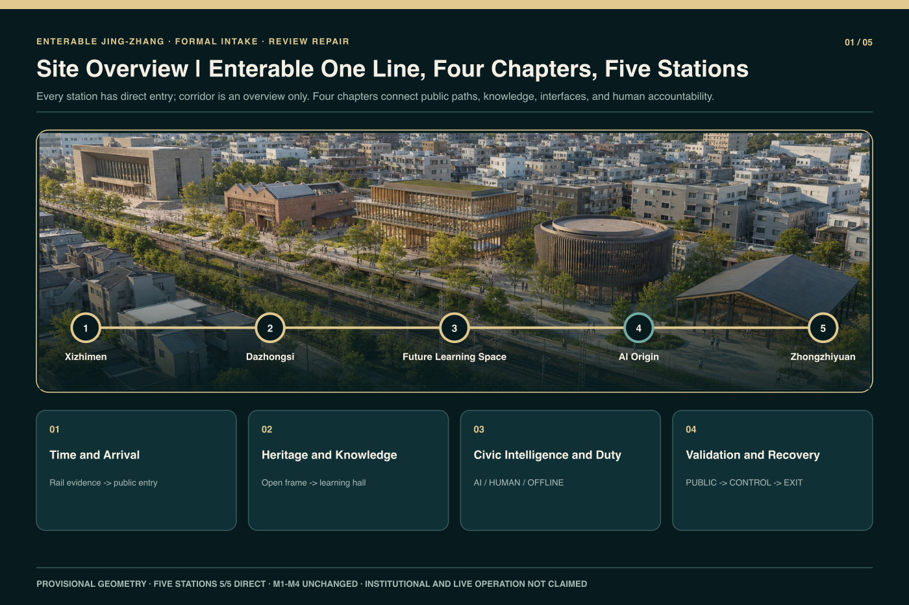
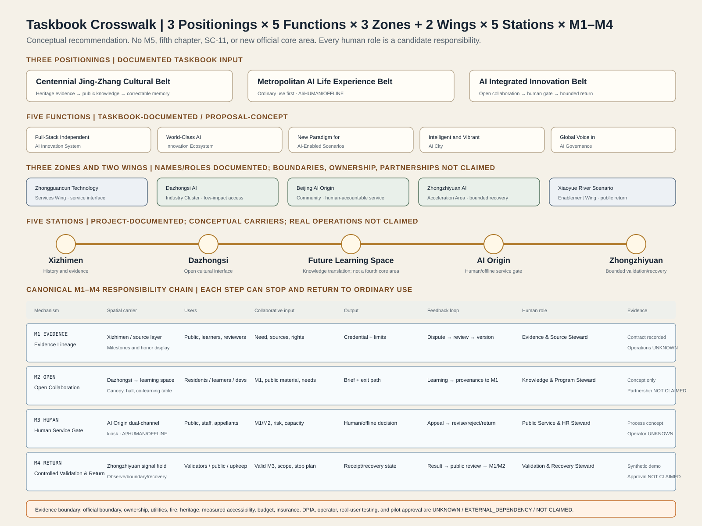
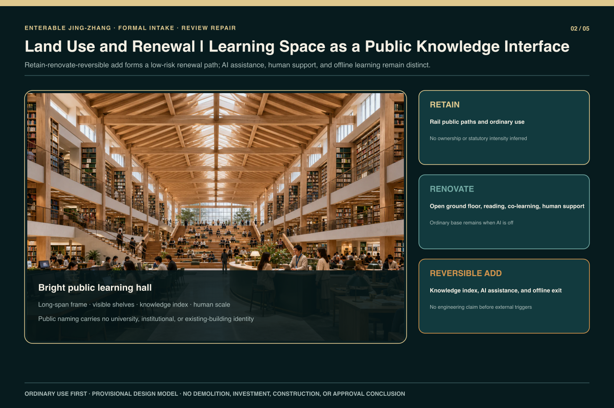
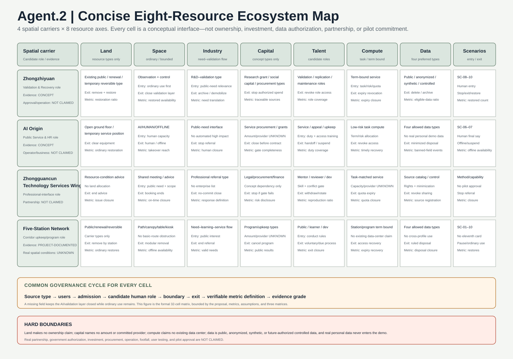
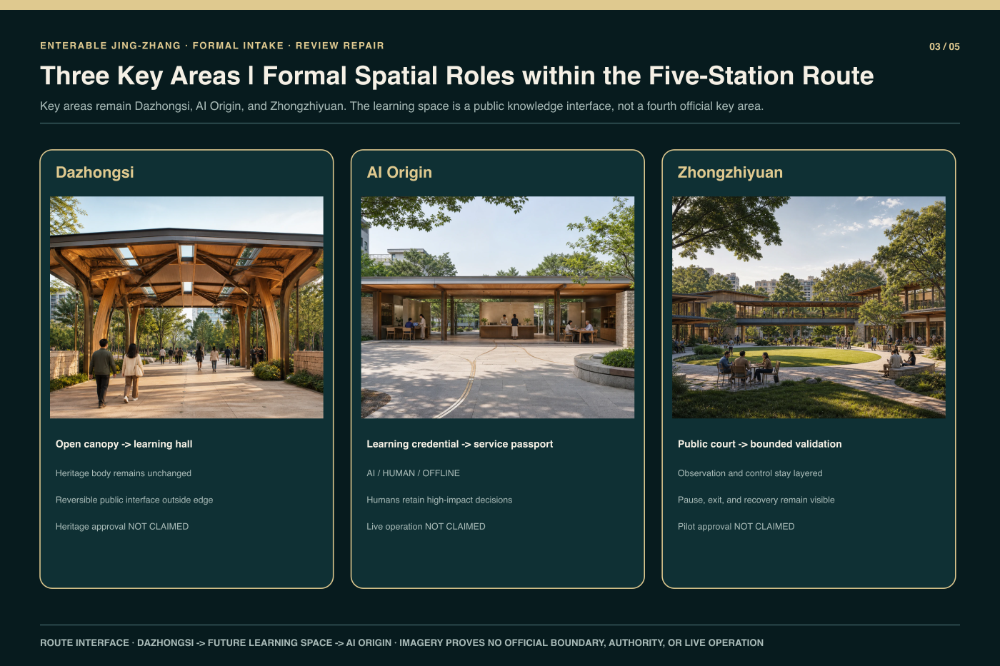
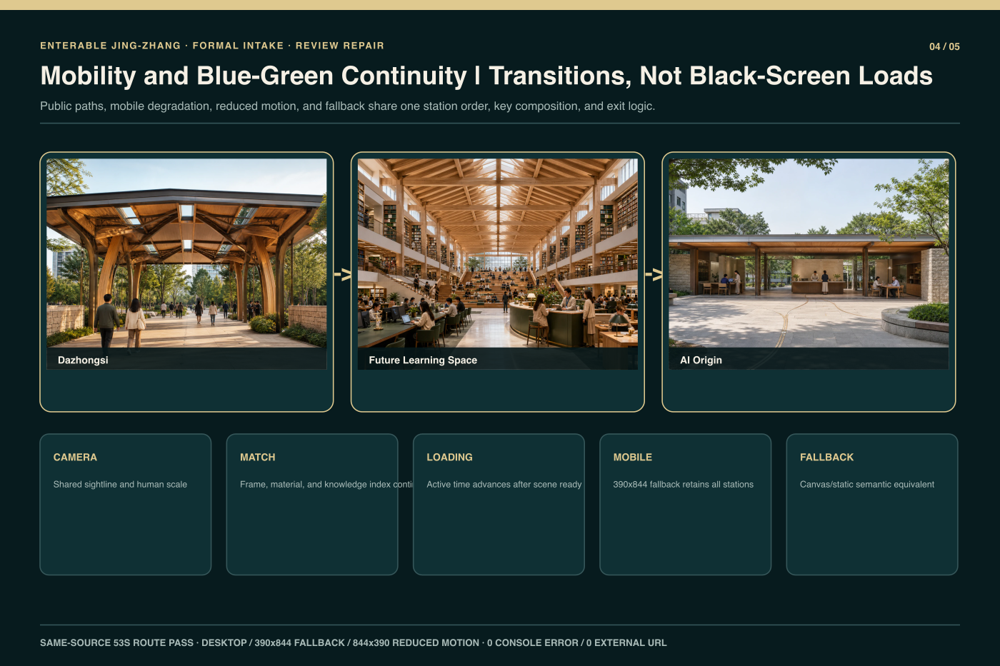
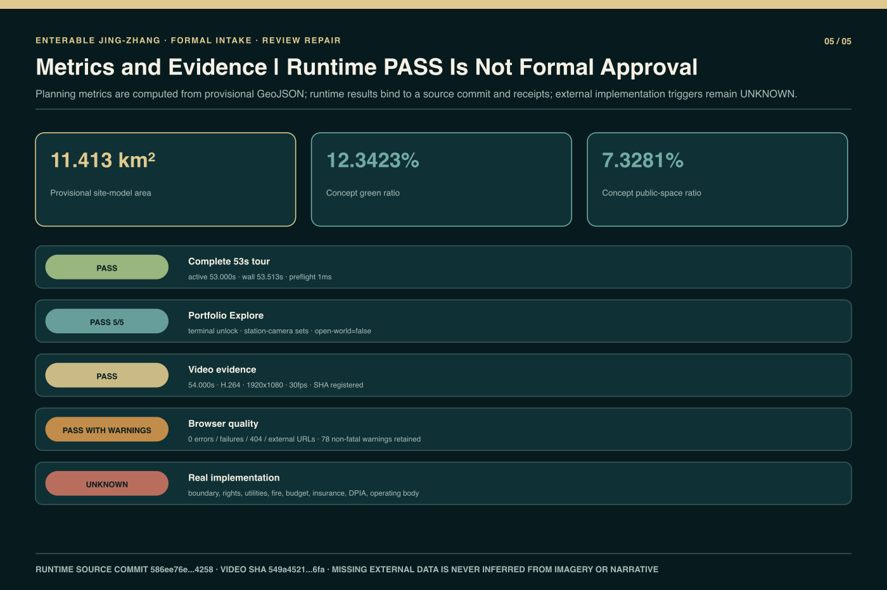

# Enterable Jing-Zhang | One Line, Four Chapters, Five Stations

> GitHub author `wen00710` · private source repository HEAD `8995821c467e96add6524d346d77cd51acb6b8fa` · 53-second runtime source commit `586ee76e37b0a34168054ef787b4e8c2b1ab4258`.

## Design Basis and Source List

The proposal registers the official announcement, the Agent taskbook, current official-repository format and terminology controls, and the project's reproducible design model as separate evidence layers. The announcement establishes Coordinated Research, Overall Design, and Key-Area Detailed Design scopes, but the available material does not provide a verifiable statutory redline, regulatory controls, ownership, utilities, fire review, or surveyed slopes. Accordingly, `site_boundary` and the three `key_areas` remain `provisional_constraint`, `official_boundary=false`, and `boundary_precision=provisional_rough`. Their areas and positions support conceptual organization, figure generation, and relative comparison only; they cannot support survey, approval, investment, or construction conclusions [source:OFFICIAL-ANNOUNCEMENT] [source:SITE-PACKAGE] [source:BOUNDARY-SOURCE]; existing-conditions depth is recorded at [depth:existing_conditions_diagnosis].

Runtime evidence is bound to the private-source HEAD and source commit `586ee76e37b0a34168054ef787b4e8c2b1ab4258`. The complete five-station route driven by one canonical cue source has browser and video PASS receipts: configured and observed active duration are both `53000 ms`, browser wall duration is `53513 ms`, and preflight is `1 ms`. Five-station Portfolio Explore, URL-state recovery, pause/resume, reduced motion, static fallback, and human/offline exits pass the bounded matrix. The packaged H.264 video is `54.000 s`, `1920×1080`, 30 fps, with SHA-256 `549a4521ff87cba989ec2104f2d82a27e570017cda41496ff64c4ab22f0486fa`. These PASS results prove only the cited commit, production package, and browser matrix; they do not prove institutional authorization, an official boundary, or live operation [source:PRIVATE-SOURCE-REPO] [source:R2-RUNTIME-READINESS-V02]. The status metrics are [metric:full_guided_tour_verified] and [metric:portfolio_explore_completion_ratio].

The submission directory contains only bilingual public-review text, structured data, provisional geometry, original core figures, a compiled offline visual, and the bounded formal screenshots and validation receipts from this repair. It excludes private source code, Git history, raw/internal QA material, the other production products, and uncleared material. `sources.json` records title, publisher, date, purpose, license, and evidence grade for every source. The copyright statement distinguishes original presentation assets, programmatic expression, official textual authority, and provisional geometry that must be replaced when better evidence arrives [source:SOURCE-REGISTRY] [source:R2-ORIGINAL-VISUALS].

## Three-Level Scope Framework

The formal title is “Enterable Jing-Zhang | One Line, Four Chapters, Five Stations.” The Coordinated Research Area addresses industry, talent, public value, and long-term operating mechanisms. The Overall Design Area organizes renewal, mobility, blue-green public space, public services, and reversible facilities. The Key-Area Detailed Design scope continues to cover the three announced areas of Dazhongsi, AI Origin, and Zhongzhiyuan. Five stations are narrative and runtime entrances, while the three key areas define professional design depth; they are not interchangeable. `corridor` is an overview and main-line return state, not a sixth station [standard:PROJECT-OFFICIAL-ANNOUNCEMENT] [depth:three_level_scope_framework] [data:geometry/site_boundary.geojson#SITE-001].

### Naming and Project-Original Identity Direction

“Enterable Jing-Zhang” states that ordinary citizens can enter its public paths, knowledge, and services; “One Line, Four Chapters, Five Stations” describes the narrative and runtime structure rather than an administrative division or official project name. The project-original Logo and visual-identity direction centers on the bilingual wordmark “京张可进入 / Enterable Jing-Zhang,” with one continuous line, four chapter beats, and five station markers forming a scalable route grammar for covers, figures, station navigation, and offline pages. The wordmark and identity direction represent only `wen00710`’s competition concept; they are not an official mark of any government, competition, railway, school, or institution and imply no endorsement, authorization, or partnership. They use no railway emblem, school badge, government mark, or third-party trademark [source:R2-ORIGINAL-VISUALS] [source:PRIVATE-SOURCE-REPO] [depth:overall_spatial_structure].

The fixed canonical order is `xizhimen`, `dazhongsi`, `qinghuayuan-knowledge`, `ai-origin`, and `zhongzhiyuan`. The third value is an internal machine ID only; its public name is always Future Library/Learning Space. It does not assert a university, institution, existing building, or authorization. The four chapters are: time and arrival at Xizhimen; heritage-to-knowledge translation from Dazhongsi into the learning space; public intelligence and human responsibility at AI Origin; and visible validation with ordinary-use recovery at Zhongzhiyuan. This creates one line and four chapters rather than five disconnected exhibit boxes [source:R2-RUNTIME-CONTRACT] [depth:overall_spatial_structure] [metric:station_count]; the chapter count is recorded at [metric:chapter_count].

All three scope levels share the same public rules. Every technical layer begins with an ordinary use before AI assistance. Every controlled activity requires a named human responsibility, stop condition, offline alternative, and exit. Every provisional boundary and numerical result keeps its evidence grade and replacement trigger. The route may connect bell inscriptions, roof frames, bookshelves, learning credentials, service passports, and a validation court, but those visual links do not create real partnerships, operators, or tests [source:AGENT-TASKBOOK] [depth:risk_missing_data].

### Taskbook Master Crosswalk

The master crosswalk places the three positionings, five functions, Three Zones and Two Wings, five stations, and current canonical M1–M4 in one responsibility chain. The four chapters remain responsibility classes, the five stations remain enterable spaces, and `corridor` remains only the overview. The complete 22-row backend matrix records the spatial carrier, service users, collaborative input, output, feedback, candidate human responsibility role, and evidence state for every item. The table and figure below are its formal summary and create no M5, fifth chapter, SC-11, third wing, or official core area [source:AGENT-TASKBOOK] [source:R2-DECISION-CONTRACT] [depth:overall_spatial_structure].

| Crosswalk group | Spatial carriers and service users | Collaborative input → output | Feedback and candidate human responsibility | Current evidence state |
| --- | --- | --- | --- | --- |
| Three positionings | Heritage-to-knowledge public path, AI Origin service interface, and Zhongzhiyuan validation/recovery interface; for the public, learners, service staff, and reviewers | Public needs/provenance/learning goals/risk boundaries → traceable knowledge, staffed service, and bounded public return | Corrections, appeals, or incidents trigger revision/offline/stop through the M1–M4 candidate roles | Taskbook requirements documented; spatial and operating claims are `CONCEPT / UNKNOWN / NOT CLAIMED` |
| Five functions | Three Zones and Two Wings plus the five-station public base; for residents, developers, researchers, professional-service roles, and international readers | Provenance, methods, role capabilities, scenario requests → evidence chain, collaboration brief, human decision, validation record | Reproduction differences or a failed gate require withdrawal, revision, or return to ordinary use | Functional requirements documented; no real-world performance claim for a full stack, ecosystem, pilot, or global standing |
| Three Zones and Two Wings | Dazhongsi, AI Origin, and Zhongzhiyuan conceptual key-area interfaces, plus the Zhongguancun Technology Services Wing and Xiaoyue River Scenario Enablement Wing | Public needs, knowledge, methods, and professional-service requests → non-binding translation and return | Corresponding M1–M4 candidate roles; close an interface when rights, permission, or exit is missing | Names/roles come from the taskbook; exact boundaries, ownership, partnerships, and operation are `UNKNOWN / NOT CLAIMED` |
| Five stations | Xizhimen–Dazhongsi–Future Learning Space–AI Origin–Zhongzhiyuan; for the public and responsibility roles | Evidence → open collaboration → human/offline service gate → bounded validation and recovery | Every station can correct, pause, exit, and return to ordinary use | Five-station project contract documented; real sites, activities, user testing, and operation are not claimed |
| M1–M4 | Provenance layer, knowledge-collaboration space, dual-channel kiosk, and pilot signal field | evidence credential → collaboration brief → human decision → validation/recovery receipt | Four candidate duties: `Evidence and Source`, `Knowledge and Program`, `Public Service and Human Review`, and `Independent Validation and Recovery` | R2 decision contract documented; real accountable bodies, signatures, and receipts are `UNKNOWN / NOT CLAIMED` |

## Coordinated Research Area: Industry and Future City Research

The coordinated layer uses the only canonical mechanisms in the frozen decision contract: M1 `EVIDENCE_LINEAGE` governs provenance registration and traceability; M2 `OPEN_COLLABORATION` governs open collaboration and knowledge translation; M3 `HUMAN_SERVICE_GATE` governs human final judgment, appeal, and offline service; and M4 `CONTROLLED_VALIDATION_RETURN` governs bounded validation, pause, exit, recovery, and public return [source:AGENT-TASKBOOK] [source:R2-DECISION-CONTRACT].

They form a responsibility chain rather than an automation ladder, maintenance levels, or four new buildings. Every step may stop and return to ordinary use [depth:municipal_new_infrastructure] [metric:mechanism_count].

### Six Global Ecosystem Cases and Their Jing-Zhang Translation

The preliminary comparison selects six global AI innovation-ecosystem cases to test mechanism questions, not to copy brands or spatial appearances or claim that their outcomes have already occurred in Jing-Zhang:

| Comparative case | Mechanism question tested by this proposal | Conceptual translation for Jing-Zhang |
| --- | --- | --- |
| STATION F [source:CASE-STATION-F] | How startup teams connect with mentors and professional services in an enterable place | M2 + M3: collaborative programming, staffed service, and non-binding referral |
| Punggol Digital District [source:CASE-PUNGGOL-DIGITAL-DISTRICT] | How research, learning, work, and urban services coordinate at district scale | M2 + M4: ordinary public base, collaboration, and public return |
| Seoul AI Hub [source:CASE-SEOUL-AI-HUB] | How talent development, startup support, and shared space form an urban AI community | M2: public learning, collaborative tasks, and exitable activities |
| Vector Institute [source:CASE-VECTOR-INSTITUTE] | How basic research, talent development, and industry adoption gain a translation interface | M1 + M2: evidence credentials, knowledge translation, and collaboration briefs |
| Mila [source:CASE-MILA] | How research communities, public learning, and venture support form an open knowledge network | M1 + M2: public learning, provenance, and open contributions |
| Cyber Valley [source:CASE-CYBER-VALLEY] | How academic research, corporate R&D, entrepreneurship, and public engagement sustain long-term connection | M2 + M4: cross-station collaboration, reproduction, and annual public review |

These names are research-comparison labels only. They are not a partner list, institutional authorization, brand license, or operating commitment, and they do not prove that the same systems can be deployed directly in Jing-Zhang. This round extracts only verifiable mechanism types from each case's official website, cites no unregistered claims about scale, funding, company counts, or performance, and reduces the translation to M1–M4. Any later case page must still add the operator, date, outcome evidence, license, and non-transferable conditions [source:AGENT-TASKBOOK] [source:SOURCE-REGISTRY] [metric:mechanism_count].

The mechanisms are not four new buildings. M1 is carried by Xizhimen's time/provenance line, Dazhongsi mileage markers, the learning-space knowledge index, and Zhongzhiyuan provenance display. M2 is carried by Dazhongsi's low-intervention open interface and the Future Learning Space's reading, co-learning, staffed support, and offline index. M3 is concentrated in AI Origin's AI/HUMAN/OFFLINE paths, staffed window, and ordinary exit. M4 is concentrated in Zhongzhiyuan's public observation layer, controlled boundary, physical stop, and recovery position. The `corridor` overview, program calendar, and maintenance log support cross-station continuity without becoming M5. Each remains a conceptual recommendation and implies no commitment by government, school, company, funder, or operator [source:R2-DECISION-CONTRACT] [source:R2-RUNTIME-CONTRACT] [source:R2-WAVE1-VISUAL-QA].

Urban meaning takes priority over technological spectacle. The proposal avoids full-screen neon, unexplained “superintelligence,” and automation presented as public value. Future character is conveyed through enterable ground floors, human scale, bright learning space, an ordinary-service base, and explicit human accountability. If AI is unavailable, the learning space still supports reading, co-learning, and offline indexes; public service still reaches a staffed window; and the validation court returns to ordinary observation and exchange. Graceful degradation is a design requirement rather than an emergency patch [standard:MOHURD-URBAN-DESIGN-MEASURES] [depth:phasing_implementation].

### Non-Commitment Regional Interfaces

The regional interfaces describe only future-optional, stoppable conceptual exchange and do not prove that exchange has occurred. Allowed exchange is limited to public problems, research knowledge, talent and developers, testing methods and capabilities, activities, professional services, and open-source outputs. Every row carries the same statement: **not an existing partnership, authorization, or government commitment**. No company, project list, amount, agreement, or confirmed operator is named [source:AGENT-TASKBOOK] [depth:risk_missing_data].

| Region | What Jing-Zhang receives | What Jing-Zhang outputs | Interface carrier and candidate human responsibility | Exit/stop condition | Current evidence state |
| --- | --- | --- | --- | --- | --- |
| Beiwei Community | De-identified public needs, accessibility needs, public learning methods, role-based developer contributions | Provenance-linked need brief, ordinary/offline service methods, accessibility checklist, open templates | Public-need brief + five-station learning route; M1/M2, with M3 review for public service | Close and archive/delete by permission if personal profiling is required, authorization cannot be checked, moderation/cancellation is absent, or exit is impossible | `CONCEPT_INTERFACE; counterpart/operator UNKNOWN; exchange NOT CLAIMED`; not an existing partnership, authorization, or government commitment |
| Future Science City | Public research abstracts, reproducible methods, failure conditions, synthetic fixtures, role-based capabilities | Urban public needs, M2 collaboration brief, stop/exit/recovery criteria, reproduction feedback | Knowledge index + knowledge-station collaboration table + desktop method review; M1–M4 candidate roles | Stop if provenance/rights/representative authority is unclear, non-public data is required, human stop/recovery is missing, or the interface is called a joint pilot | `CONCEPT_INTERFACE; joint test/authorization UNKNOWN; NOT CLAIMED`; not an existing partnership, authorization, or government commitment |
| Huairou Science City | Public scientific knowledge, public testing/measurement methods, applicability, failure conditions, synthetic data | Urban-scenario questions, provenance index, reproduction package, public-observation boundary, pause/recovery template | Offline source cards + reproduction package + conceptual Zhongzhiyuan observation layer; M1/M2/M4, with M3 for service entry | Stop if facility permission, site access, real equipment/personal data is required or independent review, stop, and recovery are absent | `CONCEPT_INTERFACE; facility access/authorization UNKNOWN; NOT CLAIMED`; not an existing partnership, authorization, or government commitment |
| Economic-Technological Development Area | Publishable application needs, development/maintenance methods, synthetic fixtures, risk/recovery checklist | Public-service needs, ten-card concept boundaries, human-admission template, ordinary-use restoration criteria | Need brief + professional-review request + AI Origin human gate + desktop method review; M1–M4 | Stop if company-internal data, a designated vendor, procurement/investment, real road/site admission, or missing insurance/permission is required | `CONCEPT_INTERFACE; company/procurement/pilot UNKNOWN; NOT CLAIMED`; not an existing partnership, authorization, or government commitment |
| Beijing–Tianjin–Hebei Region | Publishable needs, research abstracts, methods, activity topics, and open-source outputs with geographic/time limits | Provenance record, need/scenario templates, bilingual learning material, human responsibility/exit checklist, public summary | Regional need brief + five-station knowledge route + concept agenda + reproduction package; M1–M4 | Stop if applicability, cross-jurisdiction responsibility/publication rights are unclear, personal/non-public data is required, or it is presented as regional policy | `CONCEPT_INTERFACE; cross-jurisdiction authority UNKNOWN; regional program NOT CLAIMED`; not an existing partnership, authorization, or government commitment |

The interface state is `PROPOSED → HUMAN_SOURCE_AND_RIGHTS_REVIEW → CONCEPT_INTERFACE_OPEN → PERIODIC_HUMAN_REVIEW → CONTINUE | PAUSE | EXIT`. `CONCEPT_INTERFACE_OPEN` means only that this proposal's own process gate is satisfied, not that a counterpart consented. Exit stops use/distribution, archives or deletes material by permission, and restores ordinary use.

### Agent.2 Eight-Resource Ecosystem Map

The concise ecosystem map crosses Zhongzhiyuan, AI Origin, the Zhongguancun Technology Services Wing, and the five-station network with the eight axes of land, space, industry, capital, talent, compute, data, and scenarios. The backend truth for every cell must answer source type, service users, admission conditions, candidate responsibility role, use boundary, exit mechanism, verifiable metric definition, and current evidence grade. A missing field keeps the related AI/validation layer closed while ordinary use continues [source:AGENT-TASKBOOK] [source:R2-DECISION-CONTRACT] [metric:independent_reproduction_ratio].

Land describes only resource types such as existing public, renewal, or temporary reversible space and makes no ownership conclusion. Capital records only future conceptual types such as research funding, social capital, or procurement and names no amount or committed provider. Compute is a shared-service concept allocated by task, term, and risk and claims no existing data center, GPU, capacity, or supplier. Data prioritizes public, anonymized, synthetic, and controlled classes; real personal data never enters the demo. The complete 32-cell relationship is integrated into the formal bilingual figure `assets/figures/eight-resource-ecosystem.en.svg` and bounded jointly by this proposal, the three matrices, `metrics.json`, and `assumptions.json`; all real supply, partnership, investment, authorization, and operating outcomes remain `UNKNOWN / NOT CLAIMED`.

## Overall Design Area: Urban Renewal and Regulatory-Plan-Level Urban Design

The Overall Design layer uses provisional land-use and path layers as a shared base for low-intervention heritage, public learning and service, research and bounded validation, mobility, and blue-green continuity. `land_use.geojson`, `buildings.geojson`, `roads.geojson`, `green_space.geojson`, and `public_space.geojson` are conceptual design layers rather than existing-condition surveys or approved plans. `constraints.geojson` intentionally stays empty where official controls are absent, avoiding inferred lines presented as statutory redlines. FAR, height, road redlines, demolition, utility capacity, and implementation timing remain pending statutory material and professional review [standard:MOHURD-CONTROL-DETAILED-PLANNING] [data:geometry/land_use.geojson#LU-001] [data:geometry/constraints.geojson#CONSTRAINTS]; land-use layout depth is recorded at [depth:land_use_layout].

The five stations form distinct but continuous urban interfaces. Xizhimen is a brief time entrance and contemporary arrival. Dazhongsi addresses only an open canopy, structural rhythm, and low-intervention service outside the heritage boundary. The Future Learning Space is recognized by a large hall frame, bookshelf knowledge index, reading and co-learning areas, visible human scale, and a bright day presentation. AI Origin uses a shaded street, open ground floor, public service, and staffed handoff as an accountability interface. Zhongzhiyuan uses a tower silhouette, public court, observation ring, and bounded validation edge as a visible verification interface. A continuous public path, rather than repeated form, joins them [source:R2-WAVE1-VISUAL-QA] [depth:height_massing_character].

The runtime contract binds scene, camera, URL, tour anchor, explore anchor, loading boundary, and fallback state at each station. This is a presentation and interaction contract, not a statutory planning claim. The open frame leaving Dazhongsi visually matches the main learning-hall frame; a learning credential then matches the AI Origin public-service passport. Loading occurs within related material, direction, and light conditions, while mobile, reduced-motion, and fallback variants preserve meaning through shorter motion or a static continuous composition [source:R2-RUNTIME-CONTRACT] [metric:direct_entry_station_count].

## Detailed Design of Key Areas

The three announced key areas remain Dazhongsi, AI Origin, and Zhongzhiyuan. Dazhongsi is limited to the urban arrival and transition interface outside the heritage boundary. Public paths, an open canopy, reversible information points, and staffed service stay outside the low-intervention edge, and every dimension remains a non-survey-grade design-model value. The bell, temple body, statutory heritage controls, and historical conclusions are not reconstructed. Until surveyed heritage material is available, all buffers and clearances are prompts for further professional work [data:geometry/key_areas.geojson#PROV-KEY-003] [depth:three_key_area_detailed_design].

AI Origin joins a shaded public walk, open ground floor, ordinary service, assisted AI interface, and staffed handoff into an everyday edge with an exit. Equipment cannot consume basic circulation; offline mode retains both human service and an ordinary exit. It is not an automated eligibility system or an unmanned public-administration experiment. At Zhongzhiyuan the public enters only the observation and display layer. Controlled tasks use a unique authorized gate, while a dual boundary, physical stops, recovery positions, and minimal logs constrain the test area. The design does not prove safety certification, road admission, insurance, company participation, or live operations [data:geometry/key_areas.geojson#PROV-KEY-002] [data:geometry/key_areas.geojson#PROV-KEY-001] [source:AGENT-TASKBOOK].

The Future Library/Learning Space is an added public-knowledge node in the five-station route. It is not presented as a newly announced fourth key area and carries no institutional identity. Its hall frame, bookshelves, reading surfaces, co-learning areas, archive-to-knowledge interface, and human scale are formed from project-original procedural geometry and presentation assets. With AI disabled, it remains an ordinary learning space. The 20.5-second Dazhongsi–Learning Space–AI Origin Wave 1 segment is retained as a historical baseline; the current same-source 53-second five-station tour and terminal-unlocked five-station Portfolio Explore have passed bounded verification [source:R2-RUNTIME-CONTRACT] [source:R2-RUNTIME-READINESS-V02]. Status is recorded at [metric:full_guided_tour_verified] and [metric:portfolio_explore_completion_ratio].

## AI Innovation Ecosystem, Personas, and AI+ Scenarios

The machine-readable layer keeps ten scenario cards while redistributing them across five stations and adding no eleventh card. Xizhimen has two for accessible time interpretation and multilingual staffed service. Dazhongsi has two for bell-inscription knowledge access and low-impact acoustic rehearsal. The Future Learning Space has two for civic AI learning and a youth opportunity-to-human link. AI Origin has one for inclusive public-service rehearsal. Zhongzhiyuan has three for public-task safety evaluation, a low-speed-device boundary, and open reproducibility display. These cards define spatial needs and risk boundaries; they are not completed pilots, user tests, or operating results [source:AGENT-TASKBOOK] [source:R2-RUNTIME-CONTRACT] [depth:three_key_area_detailed_design].

Seven synthetic personas cover residents, older and disabled users, students and learners, public-service staff, developers and researchers, enterprise visitors, and operations and safety personnel. Personas are used to check seating, clear passage, staffed handoff, captioning, offline material, observation distance, and stop responsibility. They do not support identity inference, credit scoring, biometrics, or eligibility decisions. Every card must identify who enters, the ordinary use, what AI may do, what a person must decide, prohibited data, pause conditions, offline continuity, the exit, and restoration of the facility [depth:municipal_new_infrastructure] [source:SOURCE-REGISTRY].

M1 through M4 cross-check the cards. M1 Evidence Lineage requires provenance for knowledge and open-source results. M2 Open Collaboration requires reproducible, correctable, and exitable contributions. M3 Human Service Gate requires a human endpoint, appeal, and offline continuity for public service. M4 Controlled Validation and Public Return prevents controlled activity from crossing the public boundary and requires stop, recovery, and public return. There is no verified operator, budget, insurance, DPIA, partner, or personal-data operation; all scenes remain conceptual candidates. Any future pilot requires renewed rights, ethics, safety, accessibility, and professional approval [source:R2-DECISION-CONTRACT] [source:R2-WAVE1-VISUAL-QA] [depth:risk_missing_data].

## Land Use, Building Scale, and Retain-Renovate-Demolish Strategy

Land-use representation follows package enums and shared edges, but every partition is based on provisional site geometry. `site_area_sqm`, `building_footprint_area_sqm`, `green_ratio`, and `public_space_ratio` can be recomputed inside the current model; they are not official site area, statutory green ratio, public-space entitlement, or approved construction quantity. Without an existing-building register or ownership record, the proposal names no building for demolition and provides no fixed FAR, height, floor area, investment, or construction schedule [standard:MNR-LAND-USE-CLASSIFICATION-GUIDE] [metric:site_area_sqm] [metric:building_footprint_area_sqm]; development-intensity limits are recorded at [depth:development_intensity_controls].

Building actions are limited to retain, renovate, and reversible add. Retention covers legible heritage and functioning ordinary public bases. Renovation addresses enterable ground floors, shade, seating, staffed service, and accessible interfaces. Reversible additions cover information indexes, closable equipment, boundaries, stops, recovery, and temporary activity facilities. Dazhongsi avoids refining the heritage body, AI Origin strengthens an open ground floor, and Zhongzhiyuan separates public observation from bounded validation. Every action must be rebuilt against real building, fire, and engineering conditions when professional surveys arrive [data:geometry/buildings.geojson#BLDG-001] [depth:retain_renovate_demolish].

The learning space is recognized by its large-scale frame, hall depth, continuous shelves, knowledge index, reading and co-learning zones, and clear human scale rather than any existing building or a required Blender hero asset. Bright daytime is the primary presentation; night or signal atmosphere remains optional. Shelves and the room continue to work without AI. The current construction proves that procedural geometry can express the visual and interaction concept, not structural feasibility, building permission, institutional authorization, or a real address [source:R2-ORIGINAL-VISUALS] [source:R2-WAVE1-VISUAL-QA] [depth:height_massing_character].

## Transport, Rail, Municipal Infrastructure, and Public Services

Mobility joins transit arrival, walking and cycling, basic accessibility, blue-green public space, and ordinary exits into a continuous public-path system rather than adding railway-themed gameplay. Each station supports direct entry, return to the main line, and jumps to relevant adjacent stations. The free-explore prototype supports entering the learning space, local observation, returning to the route, and jumping to Dazhongsi or AI Origin. URL refresh recovery, basic mobile control, pause/resume, reduced-motion, and fallback are recorded at the declared checkpoint, but those checks are not real pedestrian counts, transport simulations, or operational tests [source:R2-RUNTIME-CONTRACT] [source:R2-WAVE1-VISUAL-QA] [metric:direct_entry_station_count].

Package path comparison uses a local directed graph, design-model service radii, and overlap between public edges and device buffers. Surveyed slopes are absent, so `accessible_continuity_strict` remains unknown. A `flat_design_model` can compare conceptual paths but cannot be written as an accessibility-compliance PASS. Public paths may not cross Zhongzhiyuan's controlled boundary, and every dynamic service in offline mode must reach both staffed service and an ordinary exit. All widths, clearances, and safety bands require professional and surveyed confirmation [data:geometry/roads.geojson#ROAD-001] [metric:accessible_continuity_strict] [depth:traffic_rail_slow_parking].

Municipal, energy, communications, fire, and device-power content is limited to interfaces, manual shutdown, network-loss degradation, and ordinary-use recovery principles, without capacity or alignment claims. Mobile degradation retains station identity, route order, key composition, and exit controls. Reduced motion substitutes cuts, short dissolves, or static visual matching for long camera movement. Canvas/static fallback retains station entry and ordinary learning or service meaning. The 53-second route passed the cited aggregate matrix, including desktop, 390×844 fallback, and 844×390 reduced-motion cases, with no console error, request failure, 404, external URL, or horizontal overflow. Seventy-eight non-fatal WebGL texture warnings remain disclosed in the receipt and are not deleted or generalized into universal device stability [source:R2-RUNTIME-READINESS-V02] [standard:MOHURD-URBAN-DESIGN-MEASURES] [metric:full_guided_tour_verified].

## Agent.4 | Blue-Green Network, Public Space, and Urban Character

Blue-green space is an ordinary low-technology base for walking, rest, learning, rainfall management, and public service rather than decorative fill. `green_space.geojson` and `public_space.geojson` derive from the same provisional boundary, allowing internal model recalculation and option comparison. They are not evidence of statutory green space, a water-system redline, or public-space ownership. When official polygons, roads, and water data arrive, related areas, five figure pairs, bilingual HTML, and all four PDFs must be regenerated [data:geometry/green_space.geojson#GREEN-001] [data:geometry/public_space.geojson#PUBLIC-001] [metric:green_ratio]; blue-green public-space depth is recorded at [depth:blue_green_public_space].

Five distinct spatial identities maintain legibility. Xizhimen uses a railway timeline and contemporary arrival. Dazhongsi uses an open frame, a warm low-intervention edge, and service outside the heritage body. The Future Learning Space uses a high hall, knowledge index, bookshelves, and co-learning activity. AI Origin uses a shaded street, open ground floor, public service, and human accountability. Zhongzhiyuan uses a tower silhouette, court observation ring, and explicit control boundary. Even without labels, the three Wave 1 spaces should remain distinguishable rather than becoming repeated boxes or full-screen neon [source:R2-ORIGINAL-VISUALS] [source:R2-WAVE1-VISUAL-QA] [depth:height_massing_character].

### East–West Stitching and North–South Continuity Concept Networks

East–west stitching is not a bridge, tunnel, or property-space engineering scheme. It organizes public problems, ordinary walking, knowledge, human service, and controlled validation into reviewable interfaces across the two sides of the heritage-park context and adjoining urban edges. North–south continuity follows the five-station canonical order as one accountability chain; it does not claim that the entire line is open or that surveyed accessibility has been achieved. Both networks may use only existing public space, renewal space, or temporary reversible space that is later verified as available. No engineering alignment is asserted before official boundary, ownership, heritage, fire, transport, and survey evidence arrives [source:AGENT-TASKBOOK] [source:R2-DECISION-CONTRACT] [depth:traffic_rail_slow_parking].

| Concept-network node | Public interface and ordinary/offline base | Input → output | Candidate human responsibility and stop condition | Current evidence status |
| --- | --- | --- | --- | --- |
| Xizhimen arrival interface | Static time/direction information, ordinary seating, staffed enquiry, ordinary exit | Urban arrival and public corrections → sourced timeline and issue ticket | M1 source role; stop dynamic guidance if paths are unverified, guidance conflicts, or staffed service/exit is unreachable | Concept mapping; paths, ownership, and surveyed accessibility `UNKNOWN / NOT CLAIMED` |
| Dazhongsi open interface | Open-Source Mileage Canopy, static mileage, paper sources, ordinary rest | Heritage questions and public sources → mileage index, accessible interpretation, learning task | M1/M2; do not site or stop activity if heritage boundary, passage, safety, or permission is unverified | Exact heritage control, location, and permission `UNKNOWN / EXTERNAL_DEPENDENCY` |
| Future Learning Space interface | Railway Knowledge Hall, reading/co-learning tables, offline information cabinet, staffed learning | Registered sources and learning needs → minimal learning receipt, knowledge index, human grouping advice | M2; do not open a physical/AI layer without institution, fire, capacity, accessibility, and maintenance gates | Concept station; not an approved building, real address, or institutional identity |
| AI Origin service interface | Dual-Channel Service Kiosk: human/offline base plus closable AI assistance | Minimum-necessary question → human decision, appeal/referral, offline result | M3; close AI if human takeover, privacy, offline continuity, or ordinary exit fails | Operations, data processing, and service authority `UNKNOWN / NOT CLAIMED` |
| Zhongzhiyuan observation interface | Public observation outside the Pilot Signal Yard, ordinary bypass, mechanical stop, human explanation | Human-gated synthetic/public task → result, limitation, pause/exit, and restoration record | M4; do not open the test layer unless enclosure, stop, staffing, insurance, and approval are all present | Synthetic concept; real pilot, permission, and certification `UNKNOWN / NOT CLAIMED` |

Issues from the east and west are manually deduplicated and classified; publishable issues enter knowledge and open-source material; independently reproducible methods alone may enter desktop review or a later controlled application; results, failures, pauses, and exits return to offline information and the Q4 human hearing. The current north–south test asks only whether every station has ordinary use, human responsibility, offline information, stop/exit semantics, and minimum transfer to adjacent stations. It does not use distance, completion percentage, or engineering feasibility as a false proxy for continuity.

### Four Public Landmarks

The taskbook term “pilgrimage landmark” is used here only for a memorable civic node that people can revisit, recognize, and use for public learning. It has no religious meaning and does not imply that a node is built, approved, institutionally named, or authorized [source:AGENT-TASKBOOK] [source:R2-ORIGINAL-VISUALS] [depth:height_massing_character].

| Landmark | Public use | Open boundary | Ordinary use with AI off | Closure and exit | Candidate maintenance role | Engineering claims that must not be made |
| --- | --- | --- | --- | --- | --- | --- |
| Open-Source Mileage Canopy | Shade, pause, low-height mileage reading, source checking, resident corrections, staffed interpretation | Study only on a later-confirmed public interface outside the exact heritage boundary; never attach to or obscure heritage fabric | Ordinary canopy, seating, static mileage, and paper-source display | Close networked interpretation, remove expired content, and detach information modules by segment | Evidence/source, public-space, and future heritage-review candidate roles | No claim of heritage clearance, span, wind/rain performance, foundation, fire safety, ownership, cost, or permission |
| Future Learning Space / Railway Knowledge Hall | Reading, co-learning, public-problem translation, source access, staffed learning, quiet rest | A conceptual five-station knowledge node; not an official core area, university facility, or approved building | Shelves, reading tables, paper archive, offline index, and staffed teaching remain | End sessions, handle data by rule, seal/remove terminals, remove stale content, and return to an ordinary learning hall | Knowledge/program, copyright/source, and facilities/accessibility candidate roles | No claim of real address, institutional authority, area, structure, fire approval, course accreditation, construction permission, or operator |
| Dual-Channel Service Kiosk | Human/offline channel alongside closable AI assistance for enquiry, wayfinding, referral, and appeal | Only on a later-verified open ground floor/public interface; never occupy passage, rest, egress, or exit | Staffed enquiry, telephone, paper directory, ordinary wayfinding, and offline service | Close AI, freeze high-impact advice, transfer unfinished matters to staff, and if needed remove the terminal for an ordinary help desk | Public-service/human-review, privacy/content, and facilities candidate roles | No claim of live government connection, data interface, authorization, staffing establishment, network, fire approval, accessibility certification, or SLA |
| Pilot Signal Yard | Make research, observation, pause, exit, and recovery visible while retaining walking, rest, and small events | Public observation is physically separate from the controlled area; public paths never cross the test zone; real boundary/permission remains pending | After equipment removal, ordinary walking, rest, exhibition, or community event space | Human stop, isolate equipment/data, retain necessary audit, remove enclosure/terminals, and manually verify restoration | Independent-validation/recovery, facility-safety, and public-observation/appeal candidate roles | No claim of pilot approval, company participation, certification, insurance, road access, equipment performance, capacity, construction, or result |

### Honor Display System and Reversible Public-Space Components

The honor display records public knowledge, reproducible methods, human responsibility, and honest exit. It does not create company rankings, exchange sponsorship for passage, or imitate an official award, certification, procurement shortlist, or institutional endorsement. The four layers—source milestones, learning contributions, reproduction/failure, and public-service responsibility—use the minimum fields of contribution title, version, source, license, limitation, date, and correction/appeal route. Candidate M1–M4 roles review each record manually, then renew, downgrade, archive, or withdraw it at expiry. Success, failure, pause, exit, and ordinary-use restoration are equally recordable.

| Reversible component | Ordinary / AI-off use | Dynamic layer and boundary | Closure, exit, and restoration | Candidate maintenance role | Claims that must not be made |
| --- | --- | --- | --- | --- | --- |
| Mileage information post | Low-height direction, mileage, source, tactile, and large-print information | Optional session-only multilingual layer; never obstruct sightline, passage, or heritage | Power off, remove content, detach by segment, and restore ordinary wayfinding | Evidence/source; facilities | Not surveyed mileage, official signage, or a foundation/wind conclusion |
| Modular canopy | Shade, rain cover, seating, and ordinary activity | Detachable interpretation box/status light; only study in public/reversible space | Remove electronics or the whole module and restore prior ordinary use | Public space; future heritage review | Not structure, drainage, fire, ownership, cost, or construction permission |
| Reading and co-learning table | Reading, homework, meeting, and staffed learning | Detachable local exercise/index; no mandatory scan and no loss of passage/seating | End session and remove terminal; paper material and ordinary table continue | Knowledge/program; accessibility/facilities | Not course accreditation, electrical capacity, or teaching operation |
| `AI / HUMAN / OFFLINE` service module | Staffed enquiry, telephone, paper directory, ordinary wayfinding/exit | AI only assists; people decide high-impact matters; real personal data is prohibited in demonstration | Stop AI when takeover fails, clear session state, and return to an ordinary help desk | Public-service/human-review; privacy | Not a government connection, automated eligibility, data authorization, or SLA |
| Movable test enclosure | Queueing, observation, and safe bypass | Separate public/test zones with one staffed gate; no real test before approval | Mechanically close, remove equipment/enclosure, and restore walking/activity | Independent validation/recovery; facility safety | Not road access, ownership, insurance, certification, or approval |
| Signal status tower | Static display of research, pause, exit, and restoration | Low-luminance, non-advertising; green never means government approval or real `passed` | Fail safe, remain legible without power, and remove as one unit | Independent validation/recovery; content | Not certification, live regulation, reliability, or an official signal |
| Offline information cabinet | Paper map, sources, learning, services, complaints, and exit instructions | Local read-only; no personal data; QR is never the only entry | Manually remove stale material; revert to an ordinary cabinet or remove | Evidence/source; public service | Not live information, institutional authority, fire approval, or permanent permission |
| Accessible rest module | Back-and-arm seating, wheelchair companion bay, shade, and ordinary help | Optional low-height call; does not replace staff and is not a compliance claim | Close failed dynamic parts; retain seating/staff help; move if it blocks passage | Facilities/accessibility; human service | Not surveyed accessibility, medical response, structure, or ownership conclusion |

Component state is `ORDINARY → ASSISTED → PAUSED → EXITED`. At pause, dynamic/test layers stop and hand over to human and offline service. At exit, dynamic assets are removed or sealed, source and honor records are updated, and a person verifies restoration of ordinary use. Maintenance frequencies, response targets, and real responsible entities remain external dependencies rather than contracts.

Transitions do not cut to black and load unrelated scenes. The Dazhongsi open canopy/frame matches the learning hall's primary structure, while mileage and contribution markers become shelves and knowledge indexes; a learning receipt then becomes an AI Origin public-service passport. Desktop, mobile, short-landscape, reduced-motion, and fallback variants may shorten or staticize movement, but preserve the visual and semantic match [source:R2-RUNTIME-CONTRACT] [metric:verified_wave1_segment_duration_seconds].

## Agent.6 | Renewal Projects, Implementation Policy, and Phasing

Implementation has three layers. Phase 0 establishes only the ordinary public base: continuous paths, reading and learning, staffed service, stop controls, exits, offline materials, and maintenance access. It works without AI. Phase 1 is the currently verified digital presentation layer: one cue source drives the 53-second route, terminal Portfolio Explore unlock, URL-state recovery, mobile/reduced-motion/fallback degradation, and separation of AI, human, and offline support. Phase 2 is real space and long-term operation; it can begin only after external triggers for official geometry, rights, an operating body, fire, accessibility, safety, budget, insurance, DPIA, and professional approval are satisfied. This proposal does not claim those conditions currently exist [source:R2-RUNTIME-READINESS-V02] [data:geometry/phasing.geojson#PHASE-001] [depth:phasing_implementation].

The renewal list stays reversible: repair the corridor public path; create the Xizhimen time entrance; provide low-impact arrival and a knowledge transition outside the Dazhongsi boundary; create an ordinarily usable future learning hall; clarify human-accountable service at AI Origin; establish public observation, bounded validation, stop, and recovery at Zhongzhiyuan; and maintain source, copyright, and evidence updates. This is a conceptual list rather than project approval, procurement, construction, or operating commitment, with no fixed investment, schedule, or delivery body [standard:MOHURD-CONTROL-DETAILED-PLANNING] [depth:renewal_project_list].

M1 through M4 receive candidate governance roles. The Evidence and Source Steward maintains evidence lineage. The Knowledge and Program Steward maintains open collaboration, knowledge translation, and contribution exit. The Public Service and Human Review Steward retains human decisions, appeals, and offline service. The Independent Validation and Recovery Steward controls validation, pause, recovery, and public return. If any role, permission, or exit mechanism is missing, the related AI layer remains closed and the place returns to ordinary use. No operator is currently confirmed; these are entry gates for a later stage [source:AGENT-TASKBOOK] [source:R2-DECISION-CONTRACT] [depth:risk_missing_data].

### Jing-Zhang Open Validation Week and Annual Operations Loop

The formal activity brand is **京张开放验证周 / Jing-Zhang Open Validation Week**. “Week” is a communications and organizing unit; it does not promise seven continuous days, fixed dates, or inevitable annual delivery. This is a conceptual operating contract, not evidence that the event, venue, organizer, participants, budget, insurance, DPIA, or pilot is approved. Every real accountable entity and performance result remains `UNKNOWN / NOT CLAIMED` [source:JZ-R2-CONTENT-REPAIR-V01] [depth:phasing_implementation].

| Quarter | Formal unit | Concept gate and candidate human responsibility | Output and pause/exit |
| --- | --- | --- | --- |
| Q1 | Public Problem Collection | Knowledge and Program plus Public Service and Human Review Stewards manually check public relevance, minimum information, privacy, and a non-digital entry | Deduplicated problems and an `UNKNOWN` list; stop intake for sensitive data, defamation, absent human review, or unclear boundary |
| Q2 | Open-Source Contributions and Learning Activities | Evidence and Source Steward checks provenance, licence, version, limitation, ordinary/offline learning, and independent reproduction | Versioned contribution, learning material, reproduction/failure record; remove or cancel when rights expire, content is malicious, or reproduction is impossible |
| Q3 | Controlled Validation Open Day | Ordinary base, real accountable entity, permission, insurance, applicable DPIA/fire/accessibility/safety review, human stop, and recovery rehearsal must precede opening; all are currently `UNKNOWN / NOT CLAIMED` | Release only bounded results, anomalies, pause/exit, and restoration records; any missing gate prevents opening or cancels it |
| Q4 | Public-Service Review and Human Hearing | Staffed and paper/telephone participation and appeal must be reachable; public summaries pass rights, privacy, and safety review | Bilingual summary and human recommendation to continue, retest, pause, or permanently exit; defer/cancel if responsibility, appeal, or material limitations are absent |

Q4 human recommendations return to the next Q1. A prior quarter's visual or media effect never authorizes the next. Event photographs, visits, sponsorship, and coverage do not replace reviewable outputs.

### Entry, Access, Maintenance, and Limited Conversion

The developer-community path is “understand → minimum application → human boundary review → public/synthetic/anonymous/approved-controlled-data sandbox → bounded contribution → independent review and release → renewal, withdrawal, or exit.” Exit is available at every step. Scope drift, unclear rights, real personal data in a demo, failed human stop, or absent maintenance revokes access. A contribution creates no automatic job, procurement, financing, compute, venue, policy benefit, pilot approval, or honor.

Scenario Access uses nine human-gated steps: (1) prove the ordinary base without AI or network; (2) register problem, audience, place, term, equipment, people, data, and post-exit use; (3) check sources and rights for code, models, data, images, fonts, identifiers, and methods; (4) classify data and prohibit real personal data in demonstrations; (5) name real signatories for entry, duty, stop, appeal, deletion, and restoration; (6) check every applicable external dependency; (7) rehearse boundary, bypass, mechanical stop, takeover, isolation, and restoration first; (8) open only for the approved boundary, time, and version; and (9) manually review results, failures, data disposition, complaints, removal, and restoration. An application missing ordinary use, human takeover, stop, or exit does not enter access review.

| Operating object | Maintenance and update rule | Pause/exit and ordinary use |
| --- | --- | --- |
| Public experience | Keep an ordinary path usable for free or without purchase, staffed/offline entry, easy-read/large-print/captions, complaints, and exits; no mandatory scan or personal profile | Stop the dynamic layer when staff/offline service is unreachable, exits are blocked, state is misleading, or a privacy/safety event occurs; walking, rest, reading, staffed enquiry, and paper information continue |
| Content, software, models, and data | Review source, licence, version, expiry, risk, rollback, and correction before release; changes need a new version and necessary reproduction, with no silent replacement | Remove for expired rights, overreach, failed rollback/takeover, or increased risk; retain human/offline service and dispose of data by rule |
| Facilities, landmarks, and honor | Put passage, enclosure, mechanical stop, cleaning, lighting, removability, and contribution evidence into a timestamped human queue; show success, failure, pause, and exit equally | Isolate or withdraw when passage is obstructed, stop fails, maintenance is absent, or a display imitates an award/partnership/advertisement; components return to ordinary canopy, table, seating, wayfinding, and cabinet uses |

International communication fixes the English brand as **Jing-Zhang Open Validation Week** and synchronizes version, date, definition, denominator, limitation, failure, pause, `UNKNOWN`, and `NOT CLAIMED`. “Conceptual interface” must not become existing partnership, and “candidate responsibility role” must not become confirmed operator. Talent, learners, developers, research teams, enterprise candidates, and international peers may move from bilingual awareness to participation through co-learning, problem submission, open-source contribution, reproduction, or method exchange, then—with consent and human review—only into a candidate queue for future review, sandbox, public activity, or referral. Limited conversion promises no degree, job, contract, procurement, investment, financing, venue, admission, policy benefit, visit approval, or pilot.

### Pause, Incident Response, and Metric Definitions

Pause or cancel when any applicable real accountable entity/duty role, venue or ownership permission, budget, insurance, fire, heritage, surveyed accessibility, DPIA, network/device safety, or pilot approval is missing; also stop for safety, privacy, discrimination, harassment, rights, source, human-takeover, mechanical-stop, ordinary-exit, offline-service, or ordinary-use-restoration failure. Incidents follow “human confirmation → stop dynamic layer → protect people and use formal emergency channels → isolate equipment and data → human takeover and notice → restore seating, reading, shade, staffed service, offline information, and ordinary bypass → independent human verification → release an allowed summary → future real accountable entity decides reopen or permanent exit.”

Without real activity data, every result below is `UNKNOWN / NOT MEASURED`. A zero denominator is `UNKNOWN`, never 0% or 100%; synthetic demos, expressions of interest, and scripts cannot fill results.

| Metric | Definition and calculation |
| --- | --- |
| Valid public problem count [metric:valid_public_problem_count] | Deduplicated count of unique problem IDs marked valid after human checks for completeness, public relevance, privacy, deduplication, and actionable boundary in the reporting period |
| Independent reproduction rate [metric:independent_reproduction_ratio] | Results for which at least one person/team independent of the contributor obtains a comparable result with the registered version ÷ results due with a complete reproduction package × 100% |
| Human-takeover reachability rate [metric:human_takeover_reachability_ratio] | Eligible cases reaching an authorized person within the preregistered service-test window ÷ eligible cases triggering human takeover × 100% |
| Offline-service availability rate [metric:offline_service_availability_ratio] | Audit windows completing every core ordinary service with network disconnected/AI closed ÷ planned and executed offline audit windows × 100% |
| Count of pilots exited and restored to ordinary use [metric:ordinary_use_restored_pilot_count] | Deduplicated unique pilot IDs with an exit decision, asset/data disposition, and independent human restoration sign-off; fabricated pilots are excluded |
| Public-result publication rate [metric:public_result_publication_ratio] | Activities publishing an on-time equivalent bilingual results-and-limitations summary after rights, privacy, safety, and human review ÷ activities due to publish × 100% |
| Maintenance response time [metric:maintenance_response_time_minutes] | For each issue, `safe-state or core-ordinary-service restoration time − human-confirmed receipt time`; report median and P90 by issue class, with no target in this package |

Every metric release states the reporting period, numerator, denominator, exclusions, missing data, version, and human responsibility role. The complete Agent.6 operations contract is integrated into this section, `metrics.json`, `assumptions.json`, and the three matrices.

## Metrics, Area Recalculation, and Compliance Matrix

Metrics are separated into planning-model results, runtime evidence, and unknown items. The public package registers frozen comparison results for B0_CURRENT_AUTHORED, A1_PUBLIC_CONTINUITY, and A2_BOUNDED_VALIDATION. Six raw families cover public reach, service coverage, pedestrian-device conflict, a flat accessibility proxy, offline exit and recovery, and public-controlled boundary crossings. Non-compensable hard gates precede any composite score. A1's relative preference belongs only to the provisional local model; it is not automatic approval, real crowd behavior, or operating performance [metric:planning_baseline_score] [metric:planning_a1_score] [metric:planning_a2_score]; recomputation must return to the private R1 source because the public package omits executable methods [depth:metrics_recalculation].

Runtime facts that may be stated are `station_count=5`, `chapter_count=4`, `key_area_count=3`, `mechanism_count=4`, five direct station entries, the historical `20.5s` Wave 1 segment, and the current same-source complete route at `53.000s` active / `53.513s` browser wall time. `full_guided_tour_verified=1` and `portfolio_explore_completion_ratio=1` have production-package browser receipts. The packaged video is `54.000s`; its additional second covers capture and terminal hold. URL refresh, pause/resume, reduced-motion, mobile, context-loss, and fallback remain commit- and matrix-specific results rather than guarantees for every browser, device, or network condition [metric:station_count] [metric:verified_wave1_segment_duration_seconds]. Current status is [metric:full_guided_tour_verified] and [metric:portfolio_explore_completion_ratio]; the testing boundary is recorded at [source:R2-RUNTIME-READINESS-V02].

All areas and ratios remain low-confidence and tied to source layers. Surveyed slopes, official boundaries, FAR, height, crowd data, energy, cost, schedule, model performance, and real-user results remain unknown. The compliance matrix locates responses across the announcement tasks, agent.1 through agent.6, thirteen proposal sections, five figure pairs, geometry, metrics, assumptions, and self-check. “Addressed” in a matrix means that reviewable evidence exists; it does not mean statutory compliance, professional approval, or a passed formal intake gate [source:SOURCE-REGISTRY] [depth:risk_missing_data].

## Risk, Copyright, and Compliance

Evidence uses four grades. Documented evidence includes the announcement, taskbook, source commit, runtime checkpoint, project-original presentation assets, and deterministic receipts. Inferred evidence includes land use, green and public space, and concept buildings derived from provisional boundaries. Interpretive evidence includes local-metre spatial models, mechanism mapping, weights, and composite scores. Unavailable evidence includes official redlines, regulatory controls, ownership, utilities, exact heritage controls, fire review, budget, insurance, DPIA, real operators, real tests, and institutional authorization. Visual polish cannot upgrade an evidence grade [source:SOURCE-REGISTRY] [source:BOUNDARY-SOURCE] [data:geometry/constraints.geojson#CONSTRAINTS]; risk and missing-data depth is recorded at [depth:risk_missing_data].

### External Dependencies and Future Trigger Conditions

The table below registers condition-triggered items using the PR #4375 requested-changes review. Every “current responsible party” is a future source provider or responsibility type, not an appointed entity or participant commitment. “Current blocker = No” means only that the item does not block this concept-content repair; after its trigger, an unmet applicable dependency must block the corresponding real activity, pilot, or works [source:JZ-R2-CONTENT-REPAIR-V01] [assumption:A-EXTERNAL-TRIGGERS-001].

| Item | Current status | Current responsible party | Does this proposal claim it is satisfied? | Future trigger | Current blocker? |
| --- | --- | --- | --- | --- | --- |
| official boundary | `UNKNOWN; EXTERNAL_DEPENDENCY; NOT CLAIMED; NOT REQUIRED AT CONCEPT STAGE` | Organizer provides formal verifiable material; participant performs versioned recalculation after receipt | No; provisional base only | Rebuild geometry, metrics, and figures after formal overall and three-key-area polygons arrive with version, CRS, precision, date, and limits | No; review treats it as condition-triggered follow-up |
| land ownership | `UNKNOWN; EXTERNAL_DEPENDENCY; NOT CLAIMED; NOT REQUIRED AT CONCEPT STAGE` | Future authorized client, rights holders, and qualified land/legal roles | No occupation, lease, procurement, or alteration right claimed | Before real siting, occupation, installation, maintenance, or procurement, verify title/use, consent, and exit rights | No; current work defines resource types only |
| municipal capacity | `UNKNOWN; EXTERNAL_DEPENDENCY; NOT CLAIMED; NOT REQUIRED AT CONCEPT STAGE` | Future authorized client, municipal-service bodies, and qualified MEP/municipal team | No power, communications, water, drainage, energy, or equipment capacity claimed | Verify capacity and interfaces before physical equipment, alteration, event load, or long-term operation enters pilot/implementation design | No; current work defines network-loss, stop, and restoration only |
| fire review | `UNKNOWN; EXTERNAL_DEPENDENCY; NOT CLAIMED; NOT REQUIRED AT CONCEPT STAGE` | Future project-accountable entity, fire professionals, and applicable competent process | No egress, resistance, occupant capacity, or installation pass claimed | Professional review before real alteration, facility, public event, or validation enters preparation/pilot/implementation design | No; future professional review |
| heritage professional review | `UNKNOWN; EXTERNAL_DEPENDENCY; NOT CLAIMED; NOT REQUIRED AT CONCEPT STAGE` | Future authorized client, heritage process, and qualified heritage team | No exact control, clearance, activity, or installation permission claimed | Obtain exact controls and review before physical siting, display, lighting, acoustic activity, or construction development near heritage | No; current work retains only detached, non-obscuring, low-impact principles |
| surveyed accessibility | `UNKNOWN; EXTERNAL_DEPENDENCY; NOT CLAIMED; NOT REQUIRED AT CONCEPT STAGE` | Future client, qualified accessibility/survey professionals, and human review with disabled users | No; `accessible_continuity_strict` remains `UNKNOWN` | Survey/review slope, clear width/headroom, surface, tactile provision, rest, and egress before a real route, entrance, seat, module, event, or pilot opens | No; review accepts unknown as not certification |
| budget | `UNKNOWN; EXTERNAL_DEPENDENCY; NOT CLAIMED; NOT REQUIRED AT CONCEPT STAGE` | Future authorized client and authorized finance/procurement entity | No amount, funding source, investor, or procurement commitment | Establish authorized budget, source, maintenance, and exit cost before real preparation/procurement/continuing operation | No; does not affect current concept scoring |
| insurance | `UNKNOWN; EXTERNAL_DEPENDENCY; NOT CLAIMED; NOT REQUIRED AT CONCEPT STAGE` | Future real operating/project-accountable entity and insurance professional | No public, equipment, professional-liability, cyber, or pilot cover claimed | Complete applicable risk, cover, exclusion, term, and notice arrangement before real activity, equipment test, validation, or long-term opening | No; no real activity or pilot exists |
| DPIA | `UNKNOWN; EXTERNAL_DEPENDENCY; NOT CLAIMED; NOT REQUIRED AT CONCEPT STAGE` | Future real data controller and privacy/legal/security roles | No formal DPIA; real personal data is prohibited in the demo | Before personal, controlled, or high-risk-impact data use, complete applicable lawfulness, minimization, DPIA, access, retention, deletion, and incident process | No; future-triggered professional review |
| operating entity | `UNKNOWN; EXTERNAL_DEPENDENCY; NOT CLAIMED; NOT REQUIRED AT CONCEPT STAGE` | Future authorized commissioning/selection body determines one formally; candidate roles are not the entity | No; operator references are candidate/conceptual roles | Before real preparation of an activity, scenario, public service, or institutional interface, determine entity, authority, duty, substitute, maintenance, appeal, incident, and exit | No; review says this does not affect concept scoring |
| real user testing | `UNKNOWN; EXTERNAL_DEPENDENCY; NOT CLAIMED; NOT REQUIRED AT CONCEPT STAGE` | Future accountable operator/research body, applicable professionals, and voluntary participants | No real footfall, behavior, satisfaction, usability, or result claimed | Only design/approve after entity, venue, consent, privacy, insurance, safety, accessibility, stop, and exit conditions are met | No; current results remain `UNKNOWN / NOT MEASURED` |
| pilot approval | `UNKNOWN; EXTERNAL_DEPENDENCY; NOT CLAIMED; NOT REQUIRED AT CONCEPT STAGE` | Future real applicant/operator, competent authority, rights holder, and professional reviewers | No; scenario card, URL, and open day do not mean `approved / passed / public` | Complete site, professional, safety, ethics, insurance, and competent approvals before AI service, device, data processing, or validation serves real public users | No; current work repairs concepts and processes only |

Before a trigger, retain ordinary use first, reversibility, and `NOT CLAIMED`. After a trigger, an unmet dependency blocks only the corresponding real placement, activity, data processing, pilot, or works. When material arrives, register provenance, version, authority, licence, date, responsibility, and limitations; qualified review may upgrade only the matching item. The complete bilingual register is integrated into this table, `assumptions.json`, `compliance_matrix.json`, and `design_depth_matrix.json`.

Seven WebP assets were generated independently on 2026-08-31 with Codex built-in ImageGen from project-authored text-only prompts. The prompt-to-output mapping was committed alongside the assets at private-source commit `5b073cb311bf3ce0a1b37ba6f07f161a0a94641f`, and the formal-package copies match the source-repository asset hashes. The retained record supports only the tool name, per-image prompts, dimensions, and local conversion to WebP quality 88. The underlying image model and version, generation IDs, seeds, source PNG files, and exact conversion tool were not retained and therefore remain unknown. This submission-packaging review consulted `docs/visual-style-recommendations.md` after generation; it does not rewrite that guide as a generation-time source, and no image was regenerated in this repair [source:R2-ORIGINAL-VISUALS] [source:PRIVATE-SOURCE-REPO].

Programmatic Three.js, Canvas, diagrams, HTML, and PDF are project-generated expression. The formal package distributes only the compiled offline visual, approved assets, and bounded formal validation receipts from this repair—not private `app`, `tests`, `scripts`, internal docs, raw QA artifacts, Git metadata, or other production products. The participant declares that the current imagery embeds no commercial map, third-party model, official logo, remote font, or institution-specific identity; this is a participant provenance statement rather than an independent pixel-forensics certification. Offline pages use no CDN, tracking, or uncleared remote media, and the machine ID `qinghuayuan-knowledge` confers no institutional identity or historical conclusion [source:R2-ORIGINAL-VISUALS] [source:PRIVATE-SOURCE-REPO].

The package may state the bounded PASS for the complete 53-second route and five-station Portfolio Explore under one cue source, supported by the packaged video, contact sheet, and browser/video receipts. It must not translate that runtime PASS into institutional authorization, live operation, a precise official redline, planning approval, or an engineering conclusion. Formal-submission status is determined only by the actual official `self_check` and participant-preflight outputs in this integration. If a mandatory intake gate fails, its failure must be preserved and pushing must stop. This proposal is not planning, legal, engineering, accessibility, fire-safety, or copyright legal advice [standard:PROJECT-OFFICIAL-ANNOUNCEMENT] [source:AGENT-TASKBOOK]. Runtime evidence is [source:R2-RUNTIME-READINESS-V02] and [metric:full_guided_tour_verified].

## References

Formal authorities include the official announcement and task scope [source:OFFICIAL-ANNOUNCEMENT], the Agent taskbook with six tasks and a unified boundary clause [source:AGENT-TASKBOOK], the official site package, formats, enums, and schemas [source:SITE-PACKAGE], and the source-use registry [source:SOURCE-REGISTRY]. The provisional overall and three key-area boundaries are registered as [source:BOUNDARY-SOURCE] and [source:KEY-AREA-SOURCE]. Both are provisional-only and are not official redlines.

Implementation provenance includes the declared private-source HEAD [source:PRIVATE-SOURCE-REPO], the five-station runtime contract [source:R2-RUNTIME-CONTRACT], the 53-second and Portfolio readiness receipts [source:R2-RUNTIME-READINESS-V02], the frozen current M1–M4 and five-station decision [source:R2-DECISION-CONTRACT], Wave 1 visual and browser checks [source:R2-WAVE1-VISUAL-QA], the original WebP and programmatic-presentation registry [source:R2-ORIGINAL-VISUALS], and the aggregate register for the integrated A-task inputs and four original SVGs [source:JZ-R2-CONTENT-REPAIR-V01].

Offline Chinese typography uses a properly licensed subset renamed under the OFL Reserved Font Name condition [source:SOURCE-HAN-SANS-2005R]. The R1 candidate is used only as a structural and reproducible planning-evidence migration source [source:R1-CANDIDATE-SKELETON]. Its old 63-second narrative, unavailable-owner status, and four-node figure are not inherited as R2 conclusions.

Professional standards and evidence locations are stored in `standard_matrix.json`, `compliance_matrix.json`, `design_depth_matrix.json`, `metrics.json`, and `assumptions.json`. The three option scores are registered in `metrics.json` as frozen low-confidence R1 results; their executable method remains in the private source and is not distributed with this formal public package, so they support only the current provisional planning comparison. R2 five-station runtime statements depend on the source commit, cue source, browser/video receipts, and bilingual readiness handoff. Every source records date, publisher, purpose, license, and evidence grade. Missing official material remains unknown rather than being inferred from images or narrative [depth:existing_conditions_diagnosis] [depth:metrics_recalculation].
