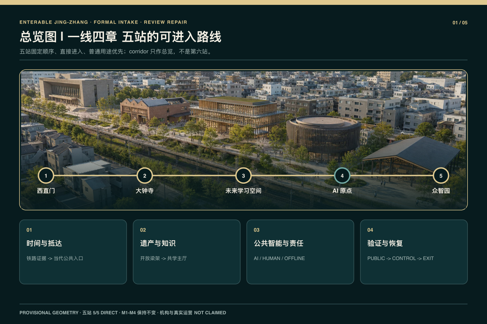
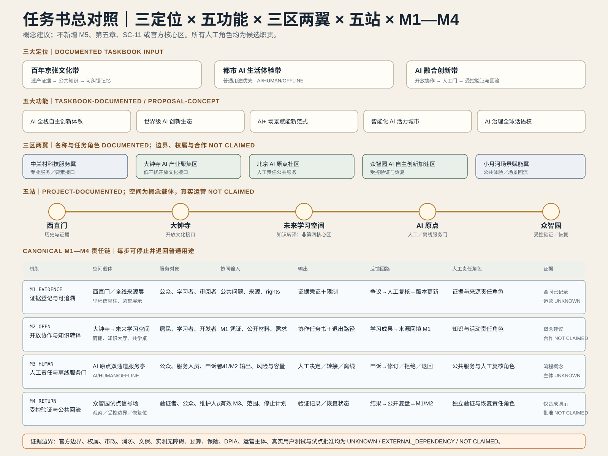
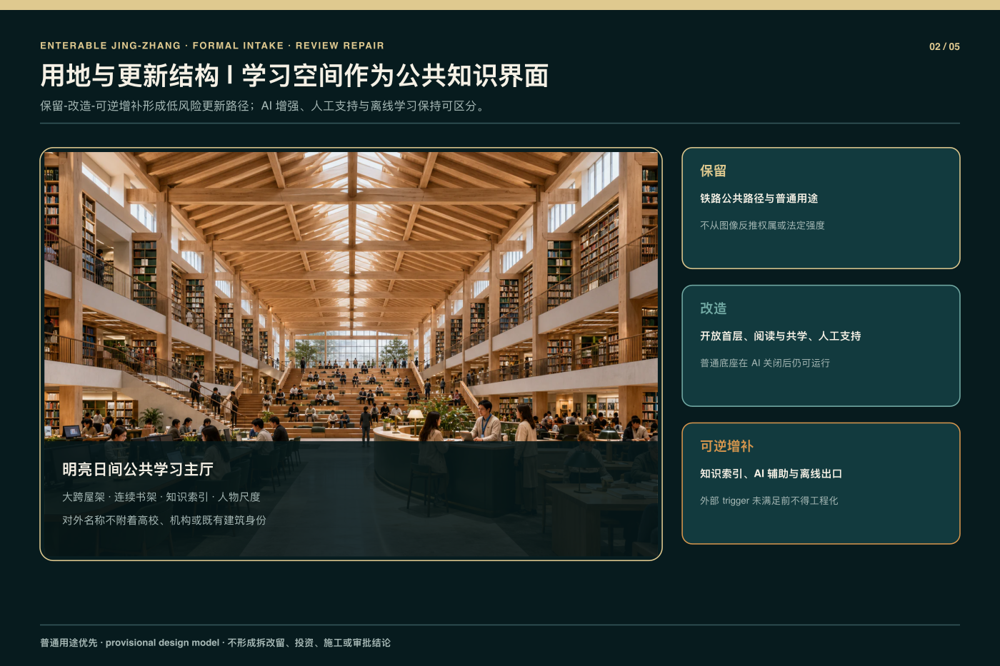
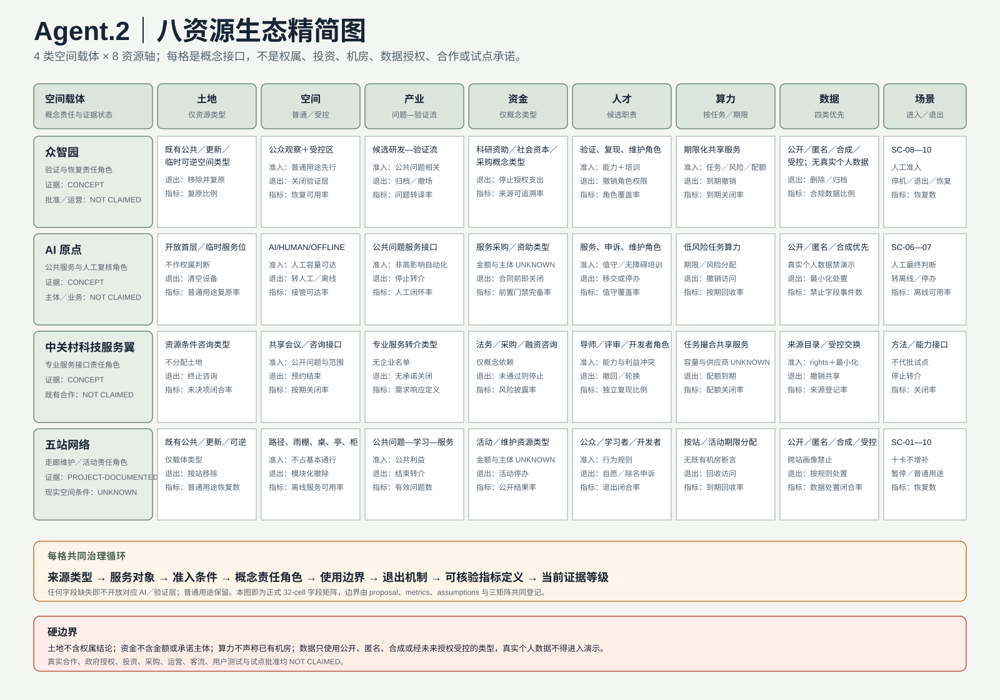
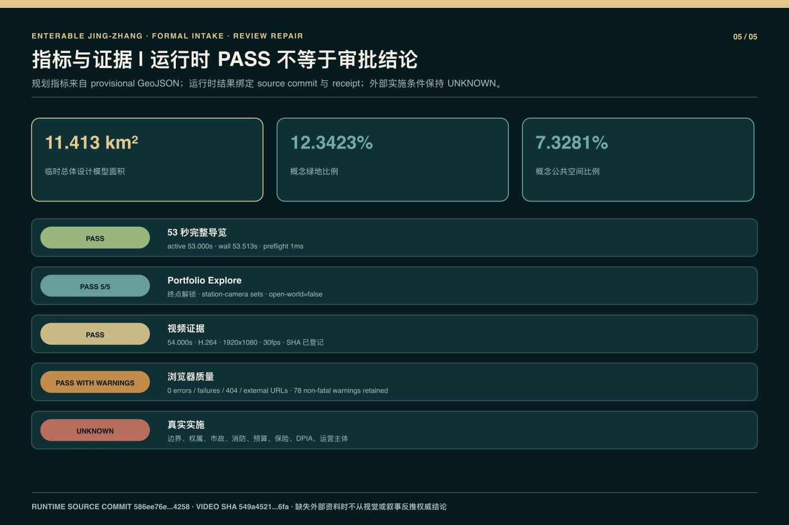

# 京张可进入｜一线四章·五站

> Enterable Jing-Zhang | One Line, Four Chapters, Five Stations · GitHub 作者 `wen00710` · 私有源仓库 HEAD `8995821c467e96add6524d346d77cd51acb6b8fa` · 53 秒运行时来源 commit `586ee76e37b0a34168054ef787b4e8c2b1ab4258`。

## 设计依据与资料清单

本方案把正式公告、面向智能体任务书、官方仓库中的格式与术语约束，以及项目自身可复核的设计模型分开登记。公告确认统筹研究、总体设计和重点区域三层任务，但当前材料没有提供可核验的法定红线、控规指标、权属、市政、消防或实测坡度。因此 `site_boundary` 与三处 `key_areas` 继续标为 `provisional_constraint`、`official_boundary=false`、`boundary_precision=provisional_rough`；其面积和位置只用于概念组织、图面生成和相对比较，不可转写为测绘、审批、投资或施工结论 [source:OFFICIAL-ANNOUNCEMENT] [source:SITE-PACKAGE] [source:BOUNDARY-SOURCE]；现状诊断深度见 [depth:existing_conditions_diagnosis]。

运行时证据绑定私有源仓库 HEAD 与来源 commit `586ee76e37b0a34168054ef787b4e8c2b1ab4258`。同一 canonical cue source 的完整五站导览已取得浏览器与视频 PASS：配置／实测 active duration 均为 `53000 ms`，浏览器 wall duration 为 `53513 ms`，preflight 为 `1 ms`；五站 Portfolio Explore、URL 状态恢复、pause/resume、reduced-motion、静态 fallback 与人工／离线出口均通过限定矩阵。正式包内 H.264 视频为 `54.000 s`、`1920×1080`、30 fps，SHA-256 为 `549a4521ff87cba989ec2104f2d82a27e570017cda41496ff64c4ab22f0486fa`。这些 PASS 只证明该 commit、production package 与所列浏览器矩阵，不证明机构授权、官方边界或真实运营 [source:PRIVATE-SOURCE-REPO] [source:R2-RUNTIME-READINESS-V02]；状态指标分别见 [metric:full_guided_tour_verified] [metric:portfolio_explore_completion_ratio]。

提交目录只包含公开审阅所需的双语文本、结构化数据、临时几何、原创核心图、编译后离线 visual，以及本轮限定的正式截图与验证回执；不包含私有源代码、Git 历史、原始／内部 QA 资料、其他 production 产品或未清权材料。所有来源在 `sources.json` 中记录标题、发布者、日期、用途、许可和证据等级，版权声明区分原创表现层、程序化表达、官方文本依据和仅供替换的临时几何 [source:SOURCE-REGISTRY] [source:R2-ORIGINAL-VISUALS]。

## 三层范围工作框架

作品正式名为“京张可进入｜一线四章·五站 / Enterable Jing-Zhang | One Line, Four Chapters, Five Stations”。统筹研究范围回答产业、人才、公共价值和长期运营机制；总体设计范围组织城市更新、交通慢行、蓝绿公共空间、公共服务与可逆设施；重点区域范围仍对应公告所指的大钟寺、AI 原点和众智园三处详细设计区。五个站点是叙事与运行时入口，三处重点区是专业设计深度，两者不能相互替代。`corridor` 只承担总览与返回主线，不被包装成第六站 [standard:PROJECT-OFFICIAL-ANNOUNCEMENT] [depth:three_level_scope_framework] [data:geometry/site_boundary.geojson#SITE-001]。

### 命名与原创识别方向

“京张可进入”强调普通市民可以进入公共路径、知识与服务；“一线四章·五站”说明叙事和运行时结构，而不是行政分区或官方项目名称。项目原创 Logo／视觉识别方向以“京张可进入 / Enterable Jing-Zhang”双语文字标为核心，以一条连续线、四个章节节拍和五个站点标记构成可缩放的路线语法，适用于封面、图件、站点导航和离线页面。该文字标和识别方向只代表 `wen00710` 的参赛概念，不是政府、赛事、铁路、学校或任何机构的官方标志，也不表示背书、授权或合作；它不使用铁路徽记、校徽、政府标识或第三方商标 [source:R2-ORIGINAL-VISUALS] [source:PRIVATE-SOURCE-REPO] [depth:overall_spatial_structure]。

五站 canonical order 固定为：`xizhimen`、`dazhongsi`、`qinghuayuan-knowledge`、`ai-origin`、`zhongzhiyuan`。其中第三项只是内部机器 ID，对外名称始终为“未来图书馆／学习空间”；它不代表高校、机构或既有建筑授权，也不引入任何特定校园身份。四章叙事依次为：西直门的时间与抵达；大钟寺到学习空间的遗产—知识转译；AI 原点的公共智能与人工责任；众智园的可见验证与恢复。五站因此形成“一线四章”，而不是五个彼此断开的展示盒子 [source:R2-RUNTIME-CONTRACT] [depth:overall_spatial_structure] [metric:station_count]；章节数量见 [metric:chapter_count]。

跨层传导采用同一组公共规则：任何技术节点先有普通用途，再有 AI 辅助；任何受控活动都有人工责任、停止条件、离线替代和退出路径；任何临时边界或数值都保留证据等级与替换触发。路线视觉可以把钟铭、屋架、书架、凭证、服务护照和验证庭院连续组织，但不能据此制造真实合作、真实运营或真实测试结论 [source:AGENT-TASKBOOK] [depth:risk_missing_data]。

### 任务书总对照矩阵

任务书总对照把三大定位、五大功能、三区两翼、五站和当前 canonical M1—M4 放在同一责任链中；四章仍是责任分类，五站仍是可进入空间，`corridor` 仍只作总览。完整 22 行后台矩阵逐项记录空间载体、服务对象、协同输入、输出、反馈、候选人工责任角色和证据状态；下表与图件是其正式摘要，不新增 M5、第五章、SC-11、第三翼或官方核心区 [source:AGENT-TASKBOOK] [source:R2-DECISION-CONTRACT] [depth:overall_spatial_structure]。

| 对照组 | 空间载体与服务对象 | 协同输入 → 输出 | 反馈与候选人工责任 | 当前证据状态 |
| --- | --- | --- | --- | --- |
| 三大定位 | 遗产—知识公共路径、AI 原点服务界面、众智园验证与恢复界面；面向公众、学习者、服务与复核人员 | 公开问题／来源／学习目标／风险边界 → 可追溯知识、人工服务、受控回流 | 纠错、申诉或事件触发更正／离线／停止；M1—M4 候选责任角色 | 任务要求已记录；空间与运营为 `CONCEPT / UNKNOWN / NOT CLAIMED` |
| 五大功能 | 三区两翼与五站公共底座；面向居民、开发者、研究者、专业服务与国际读者 | 来源、方法、角色能力、场景申请 → 证据链、协作简报、人工决定、验证记录 | 复现差异或门禁缺失即撤回、修订或退回普通用途 | 功能要求已记录；全栈、生态、试点和全球地位均不作现实成效声明 |
| 三区两翼 | 大钟寺、AI 原点、众智园三处概念重点区与中关村科技服务翼、小月河场景赋能翼 | 公共问题、知识、方法、专业服务需求 → 非约束性转译与回流 | 对应 M1—M4 候选角色；权利、许可或退出缺失即关闭接口 | 名称／角色来自任务书；精确边界、权属、合作与运营 `UNKNOWN / NOT CLAIMED` |
| 五站 | 西直门—大钟寺—未来学习空间—AI 原点—众智园；面向公众与各责任角色 | 证据 → 开放协作 → 人工／离线服务门 → 受控验证与恢复 | 每站可纠错、暂停、退出并回到普通用途 | 五站项目合同已记录；真实场地、活动、用户测试与运营不作声明 |
| M1—M4 | 来源层、知识协作空间、双通道服务亭、试点信号场 | evidence credential → collaboration brief → human decision → validation/recovery receipt | `Evidence and Source`、`Knowledge and Program`、`Public Service and Human Review`、`Independent Validation and Recovery` 四类候选职责 | R2 决策合同已记录；真实责任主体、签署与 receipt `UNKNOWN / NOT CLAIMED` |

## 统筹研究范围产业与未来城市研究

统筹层采用冻结决策合同中的唯一 canonical 机制：M1 `EVIDENCE_LINEAGE` 负责证据登记与可追溯；M2 `OPEN_COLLABORATION` 负责开放协作与知识转译；M3 `HUMAN_SERVICE_GATE` 负责人工终局、申诉与离线服务；M4 `CONTROLLED_VALIDATION_RETURN` 负责受控验证、暂停、退出、恢复和公共回流 [source:AGENT-TASKBOOK] [source:R2-DECISION-CONTRACT]。

它们是责任链而非自动化升级链、维护等级或四座新建筑；任一步都可停止并回到普通用途 [depth:municipal_new_infrastructure] [metric:mechanism_count]。

### 六个全球生态案例与京张转译

前期比较选择六个全球 AI 创新生态案例，用来检验机制问题，而不是复制品牌、空间外观或宣称案例成效已经在京张发生：

| 比较案例 | 本方案检验的机制问题 | 京张概念转译 |
| --- | --- | --- |
| STATION F [source:CASE-STATION-F] | 创业团队如何在可进入场所连接导师与专业服务 | M2 + M3：协作活动、人工服务与非约束性转介 |
| Punggol Digital District [source:CASE-PUNGGOL-DIGITAL-DISTRICT] | 研发、学习、工作与城市服务如何在街区层协同 | M2 + M4：普通公共底座、协作与结果回流 |
| Seoul AI Hub [source:CASE-SEOUL-AI-HUB] | 人才培养、创业支持与共享空间如何形成城市 AI 社群 | M2：公共学习、协作任务与可退出活动 |
| Vector Institute [source:CASE-VECTOR-INSTITUTE] | 基础研究、人才培养与产业采用如何建立转译接口 | M1 + M2：来源凭证、知识转译与协作简报 |
| Mila [source:CASE-MILA] | 研究社群、公共学习与创业支持如何形成开放知识网络 | M1 + M2：公共学习、来源链与开放贡献 |
| Cyber Valley [source:CASE-CYBER-VALLEY] | 学术研究、企业研发、创业与公众参与如何维持长期连接 | M2 + M4：跨站协作、复现与年度公开复盘 |

这些名称只是研究比较标签，不是合作方名单、机构授权、品牌许可或运营承诺，也不证明相同制度可以在京张直接落地。本轮只从各案例官方页面提取可核对的机制类型，不引用未经登记的规模、融资、企业数量或绩效，并把转译收敛为 M1—M4；未来若深化案例页，仍须逐项补齐运营主体、日期、成果证据、许可和不适用条件 [source:AGENT-TASKBOOK] [source:SOURCE-REGISTRY] [metric:mechanism_count]。

四项机制不是四座新建筑。M1 由西直门时代／来源线、大钟寺里程标识、学习空间知识索引和众智园来源展示共同承载；M2 由大钟寺低干扰开放界面和未来学习空间的阅读、共学、人工支持与离线索引承载；M3 集中于 AI 原点 AI/HUMAN/OFFLINE 三路径、人工窗口和普通出口；M4 集中于众智园公众观察层、受控边界、实体停止和恢复位。`corridor` 总览、活动日历和维护台账只支撑四机制跨站连续，不另成 M5。每项机制均为概念建议，不代表政府、学校、企业、基金或运营主体已经承诺参与 [source:R2-DECISION-CONTRACT] [source:R2-RUNTIME-CONTRACT] [source:R2-WAVE1-VISUAL-QA]。

城市意义优先于技术名词。系统不以满屏霓虹、不可解释的“超级智能”或自动化替代公共价值，而以可进入首层、人物尺度、明亮学习环境、普通服务底座和清晰人工责任表达未来。AI 关闭时，学习空间仍可阅读、共学和使用离线索引；公共服务仍可到人工窗口；验证庭院仍可恢复为普通观察与交流场所。这种可降级能力是正式方案的一部分，而非演示失败后的临时补丁 [standard:MOHURD-URBAN-DESIGN-MEASURES] [depth:phasing_implementation]。

### 非承诺式区域协同接口

区域接口只描述未来可选择、可停止的概念交换，不证明交换已经发生。所有接口允许交换的类别仅限公共问题、科研知识、人才与开发者、测试方法和能力、活动、专业服务与开源成果；所有五项统一声明：**非既有合作、非授权、非政府承诺**。本方案不列企业、项目、金额、协议或已确定运营主体 [source:AGENT-TASKBOOK] [depth:risk_missing_data]。

| 区域 | 京张接收什么 | 京张输出什么 | 接口载体与候选人工责任 | 退出／停止条件 | 当前证据状态 |
| --- | --- | --- | --- | --- | --- |
| 北纬社区 | 去标识公共问题、可访问性需求、公开学习方法、角色化开发者贡献 | 带来源的问题简报、普通／离线服务方法、可访问性清单、开放模板 | 公共问题简报＋五站学习路线；M1/M2，公共服务内容经 M3 复核 | 需要个人画像、授权不可核、无人主持／取消或无法退出即关闭并按许可归档／删除 | `CONCEPT_INTERFACE; counterpart/operator UNKNOWN; exchange NOT CLAIMED`；非既有合作、非授权、非政府承诺 |
| 未来科学城 | 公开科研摘要、复现方法、失败条件、合成 fixture、角色化能力 | 城市公共问题、M2 协作简报、停止／退出／恢复标准、复现反馈 | 知识索引＋知识站协作桌＋桌面方法审阅；M1—M4 候选角色 | 来源／rights／代表权不清、需非公开数据、缺人工停止恢复或被写成联合试点即停止 | `CONCEPT_INTERFACE; joint test/authorization UNKNOWN; NOT CLAIMED`；非既有合作、非授权、非政府承诺 |
| 怀柔科学城 | 公开科学知识、公开测试／测量方法、适用范围、失败条件、合成数据 | 城市场景问题、来源索引、复现包、公共观察边界、暂停／恢复模板 | 离线来源卡＋复现包＋众智园概念观察层；M1/M2/M4，公共服务经 M3 | 需要设施权限、现场接入、真实设备／个人数据，或缺独立复核、停止恢复即停止 | `CONCEPT_INTERFACE; facility access/authorization UNKNOWN; NOT CLAIMED`；非既有合作、非授权、非政府承诺 |
| 经开区 | 可公开应用问题、开发运维方法、合成 fixture、风险／恢复清单 | 公共服务需求、十卡概念边界、人工准入模板、普通用途恢复标准 | 问题简报＋专业复核请求＋AI 原点人工门＋桌面方法审阅；M1—M4 | 要求企业内部数据、指定供应商、采购／投资、真实道路／场地准入或缺保险许可即停止 | `CONCEPT_INTERFACE; company/procurement/pilot UNKNOWN; NOT CLAIMED`；非既有合作、非授权、非政府承诺 |
| 京津冀 | 标注地域／时效边界的公开问题、研究摘要、方法能力、活动议题和开源成果 | 来源登记、问题／场景模板、双语学习材料、人工责任／退出清单、公开摘要 | 区域问题简报＋五站知识路线＋概念议程＋复现包；M1—M4 | 地域适用性、跨域权责／发布权不清，需个人／非公开数据或被误读为区域政策即停止 | `CONCEPT_INTERFACE; cross-jurisdiction authority UNKNOWN; regional program NOT CLAIMED`；非既有合作、非授权、非政府承诺 |

接口状态遵循 `PROPOSED → HUMAN_SOURCE_AND_RIGHTS_REVIEW → CONCEPT_INTERFACE_OPEN → PERIODIC_HUMAN_REVIEW → CONTINUE | PAUSE | EXIT`；`CONCEPT_INTERFACE_OPEN` 只表示方案自身流程门成立，不表示对方同意。退出时停止使用／分发，按许可归档或删除，并恢复普通用途。

### Agent.2 八资源生态图谱

精简生态图把众智园、AI 原点、中关村科技服务翼和五站网络分别与土地、空间、产业、资金、人才、算力、数据、场景八轴交叉。每个 cell 的后台真值必须回答来源类型、服务对象、准入条件、概念责任角色、使用边界、退出机制、可核验指标定义和当前证据等级；缺任一字段则对应 AI／验证层不开放，普通用途继续 [source:AGENT-TASKBOOK] [source:R2-DECISION-CONTRACT] [metric:independent_reproduction_ratio]。

土地只表示既有公共空间、更新空间或临时可逆空间等资源类型，不作权属结论；资金只登记科研资助、社会资本、采购等未来概念类型，不写金额和承诺主体；算力按任务、期限与风险分配为共享服务概念，不声称已有机房、GPU、容量或供应商；数据优先使用公开、匿名、合成和受控四类，真实个人数据不得进入演示。完整 32-cell 关系已整合到正式双语图 `assets/figures/eight-resource-ecosystem.svg`，并由本 proposal、三矩阵、`metrics.json` 与 `assumptions.json` 共同限定；任何现实供应、合作、投资、授权或运行结果均为 `UNKNOWN / NOT CLAIMED`。

## 总体设计范围城市更新与控规深度城市设计

总体设计以 provisional 用地和路径图层作为共同底板，表达遗产低干扰、公共学习服务、研发验证、慢行与蓝绿连续的关系。`land_use.geojson`、`buildings.geojson`、`roads.geojson`、`green_space.geojson` 和 `public_space.geojson` 是概念设计图层，不是现状测绘或批准方案；`constraints.geojson` 对缺少官方控制线的部分保持空集合，避免用推定线条冒充正式红线。容积率、建筑高度、道路红线、拆改留、工程容量和建设时序均等待法定资料与专业复核 [standard:MOHURD-CONTROL-DETAILED-PLANNING] [data:geometry/land_use.geojson#LU-001] [data:geometry/constraints.geojson#CONSTRAINTS]；用地布局深度见 [depth:land_use_layout]。

五站形成不同而连续的城市界面。西直门是低时长的时间入口和当代抵达；大钟寺只处理遗产边界外的开放雨棚、梁架和低干扰服务；未来学习空间以大尺度主厅屋架、书架知识索引、阅读与共学区、人物尺度和明亮日间视觉成为公共学习节点；AI 原点以林荫街道、开放首层、公共服务与人工交接形成责任界面；众智园以塔楼剪影、公共庭院、观察环和受控验证边界形成可见验证节点。共同语言是连续公共路径，不是复制相同造型 [source:R2-WAVE1-VISUAL-QA] [depth:height_massing_character]。

运行时合同把 scene、camera、URL、tour anchor、explore anchor、loading boundary 与 fallback 状态绑定在每站；这是一项表现层和交互层合同，不改变法定规划性质。大钟寺离开时的开放梁架与学习主厅屋架构成视觉匹配，学习凭证与 AI 原点公共服务护照构成第二次匹配；加载可在同一材质、方向和亮度关系中发生，移动端、reduced-motion 与 fallback 则用缩短运动或静态连续构图保留语义 [source:R2-RUNTIME-CONTRACT] [metric:direct_entry_station_count]。

## 重点区域详细设计

公告意义上的三处重点区域仍为大钟寺、AI 原点和众智园。大钟寺只深化遗产边界之外的城市抵达与转场界面：公共路径、开放雨棚、可逆信息节点和人工服务都保持在低干扰边界外，任何尺寸均为 non-survey-grade design-model value。钟体、寺庙主体、法定文保范围和历史结论均不被本方案重构；取得正式文保与测绘资料前，所有缓冲和净距只能作为深化提示 [data:geometry/key_areas.geojson#PROV-KEY-003] [depth:three_key_area_detailed_design]。

AI 原点把林荫公共步道、开放首层、普通公共服务、AI 辅助界面和人工交接窗串成一条可退出的日常服务边。服务设备不占用基本通行，离线后仍保留人工办理和普通出口；它不是自动资格判断或无人公共管理实验。众智园的公众只进入观察与展示层，受控任务通过唯一授权 gate 进入和退出，双层边界、实体停止、恢复位和日志最小化限制测试范围。当前表达不证明安全认证、道路准入、保险、企业参与或真实运营 [data:geometry/key_areas.geojson#PROV-KEY-002] [data:geometry/key_areas.geojson#PROV-KEY-001] [source:AGENT-TASKBOOK]。

未来图书馆／学习空间是五站路线中的新增公共知识节点，不被冒充为公告新增的第四重点区，也不附着任何机构身份。其主厅屋架、书架、阅读台、共学区、档案—知识界面与人物尺度均由项目原创程序几何和表现资产形成；场景即使关闭 AI，仍可作为普通学习空间运行。大钟寺—未来学习空间—AI 原点的 20.5 秒 Wave 1 中段保留为历史基线；当前同源 53 秒五站导览与终点解锁后的五站 Portfolio Explore 已完成限定验证 [source:R2-RUNTIME-CONTRACT] [source:R2-RUNTIME-READINESS-V02]；状态指标见 [metric:full_guided_tour_verified] [metric:portfolio_explore_completion_ratio]。

## AI 创新生态、人才画像与 AI+ 场景

机器层保留十张场景卡，但按五站重新分配而不增加第十一张：西直门两张，覆盖时间可访问解释与多语言人工服务；大钟寺两张，覆盖钟铭知识解释与低干扰声学排演；未来学习空间两张，覆盖市民 AI 学习转化与青年机会—人工联络；AI 原点一张，覆盖包容性公共服务排演；众智园三张，覆盖公共任务安全评测、低速设备边界与开源复现展示。场景卡是空间需求和风险边界，不是已发生的试点、用户测试或运营绩效 [source:AGENT-TASKBOOK] [source:R2-RUNTIME-CONTRACT] [depth:three_key_area_detailed_design]。

七类合成人物画像包括居民、老年人与残障使用者、学生和学习者、公共服务人员、开发者与研究者、企业访客、运维与安全人员。画像只帮助检查座席、净通行、人工交接、字幕、离线材料、观察距离和停止责任，不用于身份推断、信用评分、生物识别或资格决定。每张卡都必须能回答：谁进入、普通用途是什么、AI 做什么、人负责什么、哪些数据禁止收集、何时暂停、离线如何继续、从哪里退出、设施如何恢复 [depth:municipal_new_infrastructure] [source:SOURCE-REGISTRY]。

M1—M4 与场景卡建立交叉核验：M1 证据登记与可追溯要求知识和开源成果有来源链；M2 开放协作与知识转译要求贡献可复现、可纠错并可退出；M3 人工责任与离线服务门要求公共服务存在人工终局、申诉和离线连续；M4 受控验证、暂停与公共回流要求验证活动不能穿越公共边界，并能停止、恢复和公开回流。当前没有真实运营者、预算、保险、DPIA、合作单位或个人数据，因而所有场景只到概念候选；任何未来试点都必须重新完成权利、伦理、安全、无障碍和专业审批 [source:R2-DECISION-CONTRACT] [source:R2-WAVE1-VISUAL-QA] [depth:risk_missing_data]。

## 用地、建筑规模与拆改留方案

用地表达沿用包内枚举和共享边线，但所有分区都建立在 provisional site geometry 上。`site_area_sqm`、`building_footprint_area_sqm`、`green_ratio` 与 `public_space_ratio` 可以从当前图层重复计算，却不等于官方用地面积、法定绿地率、公共空间指标或批准建设量。没有现状建筑台账和权属资料时，本方案不点名拆除任何建筑，也不提供 FAR、限高、建筑面积、投资额或施工工期的确定结论 [standard:MNR-LAND-USE-CLASSIFICATION-GUIDE] [metric:site_area_sqm] [metric:building_footprint_area_sqm]；开发强度边界见 [depth:development_intensity_controls]。

建筑动作只分为“保留、改造、可逆增补”。保留对象是可识别遗产及仍可使用的普通公共底座；改造对象是首层可进入性、遮阴、座席、人工服务和无障碍界面；可逆增补对象是信息索引、可关闭设备、边界、停机、恢复和临时活动设施。大钟寺避免深化遗产主体，AI 原点强化开放首层，众智园强化公众观察与受控验证的分离。所有动作需在正式调查到达后按真实建筑、消防和工程条件重建 [data:geometry/buildings.geojson#BLDG-001] [depth:retain_renovate_demolish]。

未来学习空间的建筑识别来自大尺度屋架、主厅纵深、连续书架、知识索引、阅读与共学区域以及清晰人物尺度，而不是依赖某一座既有建筑或 Blender hero asset。明亮日间是主状态，夜间或信号氛围只是可选表现；书架和空间在无 AI 时仍然工作。当前构造只证明视觉与交互概念可以被程序几何表达，不证明结构可行性、建设许可、机构授权或真实地址 [source:R2-ORIGINAL-VISUALS] [source:R2-WAVE1-VISUAL-QA] [depth:height_massing_character]。

## 交通、轨道、市政与公共服务设施

交通策略将轨道抵达、步行骑行、基本无障碍、蓝绿公共空间和普通退出组织为连续公共路径，而不是增加铁路主题玩法。五站均可直接进入、返回主线并跳转相邻关键站；自由探索样板支持进入学习空间、局部观察、返回主线以及跳至大钟寺和 AI 原点。URL 刷新恢复、移动端基础操作、pause/resume、reduced-motion 和 fallback 已在指定 checkpoint 记录，但这些运行时检查不等于真实客流、交通仿真或设施运营测试 [source:R2-RUNTIME-CONTRACT] [source:R2-WAVE1-VISUAL-QA] [metric:direct_entry_station_count]。

包内路径比较采用局部有向图、设计模型服务半径和设备缓冲重叠进行相对校核。实测坡度缺失，因此 `accessible_continuity_strict` 保持 unknown；`flat_design_model` 只能比较概念路径，不能写为无障碍合规 PASS。公众路径不得穿越众智园受控边界，动态服务离线时必须同时到达人工服务与普通出口。任何路径宽度、净距和安全带数值均需专业团队和实测资料确认 [data:geometry/roads.geojson#ROAD-001] [metric:accessible_continuity_strict] [depth:traffic_rail_slow_parking]。

市政、能源、通信、消防和设备供电仅提出接口、人工停机、断网降级和普通用途恢复原则，不推算容量或线位。移动端降级优先保留站点身份、路线顺序、关键构图和退出控制；reduced-motion 用切换、短溶解或静态匹配替代长镜头；Canvas/static fallback 保留站点入口和普通学习／服务语义。53 秒导览已在所列 desktop、390×844 fallback 与 844×390 reduced-motion 等聚合矩阵中通过，且无 console error、请求失败、404、外部 URL 或横向溢出；78 条非致命 WebGL 纹理 warning 已留在 receipt 中，不被删除或外推为所有设备稳定性 [source:R2-RUNTIME-READINESS-V02] [standard:MOHURD-URBAN-DESIGN-MEASURES] [metric:full_guided_tour_verified]。

## Agent.4｜蓝绿空间、公共空间与城市风貌

蓝绿空间被视为日常步行、休息、学习、雨洪和公共服务的低技术底座，而非装饰背景。`green_space.geojson` 与 `public_space.geojson` 从同一 provisional boundary 派生，所以可用于当前模型内部复算和方案比较；它们不是法定绿地、河道蓝线或公共空间权属证据。官方 polygons、道路和水系资料到达时，相关面积、五组图、双语 HTML 与四份 PDF 都必须重新生成 [data:geometry/green_space.geojson#GREEN-001] [data:geometry/public_space.geojson#PUBLIC-001] [metric:green_ratio]；蓝绿公共空间深度见 [depth:blue_green_public_space]。

五站通过不同的空间身份保持可读性：西直门以铁路时间线和当代抵达为主；大钟寺以开放梁架、暖色低干扰边界和院外服务为主；未来学习空间以高屋架、知识索引、书架和共学活动为主；AI 原点以林荫街道、开放首层、公共服务与人工责任为主；众智园以塔楼剪影、庭院观察环和明确控制边界为主。即使不看文字，三段 Wave 1 主空间也应被分辨，不依赖相同盒子或满屏霓虹 [source:R2-ORIGINAL-VISUALS] [source:R2-WAVE1-VISUAL-QA] [depth:height_massing_character]。

### 东西缝合与南北贯通概念网络

东西缝合不是跨线桥隧或权属空间工程，而是把遗址公园两侧及相邻城市界面的公共问题、普通步行、知识、人工服务和受控验证组织成可核对接口。南北贯通按五站 canonical order 组织同一责任链，也不声称全线已连续开放或达到实测无障碍。两张网络只可使用未来经核验可公开使用的既有公共空间、更新空间或临时可逆空间；未取得 official boundary、权属、文保、消防、交通与测绘资料前不落工程线位 [source:AGENT-TASKBOOK] [source:R2-DECISION-CONTRACT] [depth:traffic_rail_slow_parking]。

| 概念网络节点 | 公共接口与普通／离线底座 | 输入 → 输出 | 候选人工责任与停止条件 | 当前证据状态 |
| --- | --- | --- | --- | --- |
| 西直门到达接口 | 静态时间／方向信息、普通座席、人工问询、普通出口 | 城市到达与公众纠错 → 有来源时间线与问题单 | M1 来源角色；路径未核、导向冲突、人工或出口不可达即停动态导向 | 概念映射；路径、权属、实测无障碍 `UNKNOWN / NOT CLAIMED` |
| 大钟寺开放接口 | 开源里程雨棚、静态里程、纸本来源、普通休息 | 文化问题与公开来源 → 里程索引、可访问解释、学习任务 | M1/M2；文保边界、通行、安全或许可未核即不落位／停活动 | 精确文保范围、位置与许可 `UNKNOWN / EXTERNAL_DEPENDENCY` |
| 未来学习空间接口 | 铁路知识大厅、阅读／共学桌、离线信息柜、人工课程 | 登记来源与学习需求 → 最小学习凭证、知识索引、人工编组建议 | M2；机构、消防、容量、无障碍或维护未满足即不开实体／AI 层 | 概念站；非批准建筑、真实地址或机构身份 |
| AI 原点服务接口 | 双通道服务亭：人工／离线底座＋可关闭 AI 辅助 | 最小必要问题 → 人工决定、申诉／转介、离线结果 | M3；人工接管、隐私、离线或普通出口失效即关 AI | 运营、数据处理、服务授权 `UNKNOWN / NOT CLAIMED` |
| 众智园观察接口 | 试点信号场外侧观察、普通绕行、机械停止与人工说明 | 经人工门的合成／公开任务 → 结果、限制、暂停／退出与恢复记录 | M4；围界、停止、值守、保险或批准缺一即不开放试验层 | 合成概念；真实试点、许可与认证 `UNKNOWN / NOT CLAIMED` |

东西两侧问题经人工去重与分级后，公开问题进入知识和开源材料；可复现方法才进入桌面／未来受控申请；结果、失败、暂停与退出再回到离线信息和 Q4 人工听证。南北贯通的当前判据只检查每站是否具备普通用途、人工责任、离线信息、停止／退出语义及最小必要的前后站传递，不用距离、完工率或工程可行性冒充连续性。

### 四个公共地标

“朝圣地标”在本方案中只指可反复到访、容易辨认并承载公共学习的城市记忆节点，不含宗教意义，也不表示已建成、获批、冠名或获得机构授权 [source:AGENT-TASKBOOK] [source:R2-ORIGINAL-VISUALS] [depth:height_massing_character]。

| 地标 | 公共用途 | 开放边界 | AI 关闭后的普通用途 | 关闭和退出方式 | 候选维护角色 | 不可作出的工程断言 |
| --- | --- | --- | --- | --- | --- | --- |
| 开源里程雨棚 | 遮荫、停留、低位里程阅读、来源核对、居民纠错与人工讲解 | 只在未来确认公共界面和精确文保范围之外研究；不附着或遮挡文物 | 普通雨棚、座席、静态里程、纸本来源展架 | 关闭动态解释与网络、下架失效内容、分段移除信息模块 | 证据／来源、公共空间及未来文保复核候选角色 | 不声称文保净距、跨度、抗风排水、基础、消防、权属、造价或许可 |
| 京张未来学习空间／铁路知识大厅 | 阅读、共学、公共问题转译、来源查阅、人工课程和安静休息 | 五站概念知识站；不是官方核心区、高校设施或批准建筑 | 书架、阅读桌、纸本档案、离线索引、人工教学完整保留 | 终止会话、依规则处置数据、封存／拆终端、下架过期内容，回到普通学习大厅 | 知识／项目、版权／来源、设施／无障碍候选角色 | 不声称真实地址、机构授权、面积、结构、消防、课程认证、建设许可或运营 |
| 双通道服务亭 | 人工／离线通道与可关闭 AI 辅助并列提供问询、路径、转介和申诉 | 只在未来核验开放首层／公共界面；不占通行、休息、疏散或出口 | 人工问询、电话、纸本目录、普通导向和离线服务 | 关闭 AI、冻结高影响建议、未完成事项转人工、必要时拆终端变普通咨询点 | 公共服务／人工复核、隐私／内容、设施候选角色 | 不声称真实政务接入、数据接口、授权、编制、网络、消防、无障碍认证或 SLA |
| 试点信号场 | 让公众看见研究、观察、暂停、退出和恢复，并保留步行、休息和小型活动 | 公众观察与受控区物理分开；公众路径不穿测试区；真实边界许可待定 | 移除测试设备后成为普通步行、休息、展陈或社区活动空间 | 人工停止、隔离设备／数据、保留必要审计、撤围界与终端、人工核验普通用途恢复 | 独立验证／恢复、设施安全、公众观察／申诉候选角色 | 不声称试点批准、企业参与、认证、保险、道路准入、设备性能、容量、施工或结果 |

### 荣誉展示系统与可逆公共空间组件

荣誉展示记录公共知识、可复现方法、人工责任和诚实退出，不制作企业排行榜，不以赞助换通过，也不冒充官方奖项、认证、采购入围或机构背书。来源里程、学习贡献、复现／失败和公共服务责任四层都使用贡献标题、版本、来源、许可、限制、日期、纠错／申诉入口等最小字段；由相应 M1—M4 候选角色人工复核，到期后续展、降级、归档或撤回。成功、失败、暂停、退出与普通用途恢复同等可记录。

| 可逆组件 | 普通用途／AI 关闭后用途 | 动态层与使用边界 | 关闭、退出与恢复 | 候选维护角色 | 不可作出的断言 |
| --- | --- | --- | --- | --- | --- |
| 里程信息柱 | 低位方向、里程、来源、触觉与大字信息 | 可选会话级多语言；不挡视线、通行或文物 | 断电、下架内容、分段拆除，恢复普通导向 | 证据／来源、设施 | 非测绘里程、官方导视、基础／抗风结论 |
| 模块化雨棚 | 遮荫、避雨、座席、普通活动 | 可拆解释盒／状态灯；只研究公共／可逆空间 | 拆电子件或整体模块，恢复原普通用途 | 公共空间、未来文保复核 | 非结构、排水、消防、权属、造价或施工许可 |
| 阅读与共学桌 | 阅读、作业、会议、人工课程 | 可拆本地练习／索引；不强制扫码且保通行座席 | 终止会话、拆终端，纸本与普通桌继续 | 知识／项目、无障碍／设施 | 非课程认证、电气容量或教学运营 |
| `AI / HUMAN / OFFLINE` 服务模块 | 人工问询、电话、纸本目录、普通导向／出口 | AI 仅辅助；高影响由人，真实个人数据禁入演示 | 接管失败即停 AI、清会话、转普通咨询点 | 公共服务／人工复核、隐私 | 非政务接入、自动资格、数据授权或 SLA |
| 可移动试验围界 | 排队、观察、安全绕行 | 公众与测试分开，唯一人工 gate；未批不启真实测试 | 机械关闭、撤设备／围界，恢复步行／活动 | 独立验证／恢复、设施安全 | 非道路准入、权属、保险、认证或批准 |
| 信号状态塔 | 静态显示研究、暂停、退出、恢复 | 低亮非广告；绿色不代表政府批准／真实 `passed` | 默认安全，断电仍可读，可整体拆除 | 独立验证／恢复、内容 | 非认证、实时监管、可靠性或官方信号 |
| 离线信息柜 | 纸本地图、来源、课程、服务、投诉与退出说明 | 本地只读；不存个人数据；二维码非唯一入口 | 过期人工下架，转普通资料柜或拆除 | 证据／来源、公共服务 | 非实时信息、机构授权、消防或固定许可 |
| 无障碍休息模块 | 靠背扶手座席、轮椅并排位、遮荫与普通求助 | 可选低位呼叫；不替代人工、不宣称合规 | 动态件失效即关，座席／人工求助保留；碍通行即移 | 设施／无障碍、人工服务 | 非实测无障碍、医疗救助、结构或权属结论 |

组件状态为 `ORDINARY → ASSISTED → PAUSED → EXITED`。暂停时动态／试验层停止并转人工与离线；退出时拆除或封存动态资产，更新来源和荣誉记录，由人工核验普通用途恢复。维护频率、响应目标与真实主体等待外部依赖，不在本轮形成合同。

转场不是黑屏后载入无关场景。大钟寺开放雨棚／梁架过渡到学习空间主厅屋架，里程与贡献标识过渡到书架与知识索引；学习凭证再过渡到 AI 原点公共服务护照。桌面、移动端、短横屏、reduced-motion 与 fallback 可以缩短或静态化运动，但保持视觉和语义匹配 [source:R2-RUNTIME-CONTRACT] [metric:verified_wave1_segment_duration_seconds]。

## Agent.6｜更新项目清单、实施政策与分期计划

实施分三层推进。Phase 0 只建立普通公共底座：连续路径、普通阅读与学习、人工服务、停止、出口、离线资料和维护入口；没有 AI 也能工作。Phase 1 是当前已验证的数字表现层：同一 cue source 驱动 53 秒五站导览、终点 Portfolio Explore 解锁、URL 状态恢复、移动／减弱动效／fallback 降级与人工／离线区分。Phase 2 指真实空间与长期运营，只能在正式 geometry、权利、运营主体、消防、无障碍、安全、预算、保险、DPIA 和专业审批等外部触发条件满足后启动；本方案未声称这些条件当前具备 [source:R2-RUNTIME-READINESS-V02] [data:geometry/phasing.geojson#PHASE-001] [depth:phasing_implementation]。

更新项目清单保持可逆：修补走廊公共路径；建立西直门时间入口；在大钟寺边界外设置低干扰抵达与知识转场；构建普通可用的未来学习主厅；完善 AI 原点人工责任服务界面；在众智园建立公众观察、受控验证、停机和恢复位；维护来源、版权和证据更新。清单是概念建议，不是立项、采购、施工或运营承诺，不给出确定投资、工期和实施主体 [standard:MOHURD-CONTROL-DETAILED-PLANNING] [depth:renewal_project_list]。

M1—M4 分别配置候选治理责任：Evidence and Source Steward 维护证据来源；Knowledge and Program Steward 维护开放协作、知识转译与贡献退出；Public Service and Human Review Steward 保留人工终局、申诉与离线服务；Independent Validation and Recovery Steward 控制验证、暂停、恢复和公共回流。若任一角色、许可或退出机制缺失，相应 AI 功能不开放，空间退回普通用途。当前不存在已确认运营者，以上只是进入下一阶段的门槛设计 [source:AGENT-TASKBOOK] [source:R2-DECISION-CONTRACT] [depth:risk_missing_data]。

### 京张开放验证周与年度运营闭环

正式活动品牌为“**京张开放验证周 / Jing-Zhang Open Validation Week**”。“周”是传播与组织单元，不承诺连续七天、固定日期或每年必然举办；本节是概念运营合同，不表示活动、场地、主办方、参与者、预算、保险、DPIA 或试点已经获批。所有真实责任方与业绩均为 `UNKNOWN / NOT CLAIMED` [source:JZ-R2-CONTENT-REPAIR-V01] [depth:phasing_implementation]。

| 季度 | 正式单元 | 概念门槛与候选人工责任 | 输出与暂停／退出 |
| --- | --- | --- | --- |
| Q1 | 公共问题征集 | Knowledge and Program Steward 与 Public Service and Human Review Steward 人工核对公共相关性、最小信息、隐私和非数字入口 | 去重问题与 `UNKNOWN` 清单；敏感数据、诽谤、无人复核或边界不清即停收 |
| Q2 | 开源贡献与学习活动 | Evidence and Source Steward 核对来源、许可、版本、限制、普通／离线学习和独立复现 | 版本化贡献、学习材料、复现／失败记录；权利失效、恶意内容或不可复现即下架／停办 |
| Q3 | 受控验证开放日 | 普通底座、真实责任主体、许可、保险、适用的 DPIA／消防／无障碍／安全审查、人工停止与恢复演练必须先满足；当前均 `UNKNOWN / NOT CLAIMED` | 只发布有边界的结果、异常、暂停／退出和恢复记录；任一门缺失即不开放或停办 |
| Q4 | 公共服务复盘与人工听证 | 人工、纸本／电话参与和申诉可达，公开摘要经权利、隐私与安全复核 | 双语摘要与继续／复测／暂停／永久退出建议；责任人缺席、申诉不可达或限制未披露即延期／停办 |

Q4 的人工建议回到下一年度 Q1；前一季度的展示效果不能授权后一季度。活动照片、访问量、赞助或媒体曝光不能替代可审查输出。

### 进入、开放、维护与有限转化

开发者社区按“了解 → 最小申请 → 人工边界审核 → 公开／合成／匿名／获批受控数据沙盒 → 有限贡献 → 独立复核与发布 → 续期、撤回或退出”进入。任何步骤都可退出；范围漂移、权利不清、真实个人数据进入演示、人工停止失败或维护角色缺席即撤销访问。贡献不自动产生岗位、采购、融资、算力、场地、政策优惠、试点批准或荣誉。

场景开放按九步人工门推进：1）证明无 AI／断网时的普通底座；2）登记问题、对象、空间、期限、设备、人员、数据与退出用途；3）核对代码／模型／数据／图像／字体／标识／方法的来源和权利；4）数据分级，真实个人数据禁止进入演示；5）列明准入、值守、停止、申诉、删除和恢复的真实签署人；6）核对所有适用外部依赖；7）先做围界、绕行、机械停止、接管、隔离和恢复排演；8）只在获批边界与版本内限时开放；9）人工复核结果、失败、数据处置、投诉、撤场和恢复。缺普通用途、人工接管、停止或退出任一字段，申请不进入开放审查。

| 运营对象 | 维护与更新规则 | 暂停／退出及普通用途 |
| --- | --- | --- |
| 公众体验 | 保持免费或不消费可用的普通路径、人工／离线入口、易读／大字／字幕、投诉和出口；不强制扫码，不建立个人画像 | 人工或离线不可达、出口受阻、误导状态、隐私／安全事件即停动态层；步行、休息、阅读、人工问询和纸本信息继续 |
| 内容、软件、模型与数据 | 来源、许可、版本、有效期、风险、回滚和纠错先审后发；变更须新版本与必要复现，禁止静默替换 | 权利失效、越权、无法回滚／接管或风险升高即下架；人工与离线服务保留，数据按规则处置 |
| 设施、地标与荣誉 | 通行、围界、机械停止、清洁、照明、可拆性和贡献证据进入带时间戳人工队列；成功、失败、暂停和退出同等展示 | 妨碍通行、停止失效、维护缺席、冒充奖项／合作／广告即隔离或撤回；组件转为普通雨棚、桌、座席、导向和资料柜 |

国际传播固定使用 **Jing-Zhang Open Validation Week**，中英版本、日期、口径、分母、限制、失败、暂停、`UNKNOWN` 和 `NOT CLAIMED` 同步；“概念接口”不得译成 existing partnership，“候选责任角色”不得译成 confirmed operator。人才、学习者、开发者、研究团队、企业候选者和国际同行只能从双语信息“了解”，经共学、问题提交、开源贡献、复现或方法交流“参与”，再在本人同意和人工核验后进入未来评审、沙盒、公开活动或转介的候选队列。有限转化不承诺学历、岗位、签约、采购、投资、融资、场地、录取、政策优惠、访问批准或试点。

### 暂停、事件响应与指标定义

真实责任主体／值守、场地与权属许可、预算、保险、消防、文保、实测无障碍、DPIA、网络／设备安全或试点批准中任何适用门缺失，或发生安全、隐私、歧视、骚扰、权利、来源、人工接管、机械停止、普通出口、离线服务及普通用途恢复故障时，活动暂停或停办。事件按“人工确认 → 停止动态层 → 保护人员并转正式应急渠道 → 隔离设备和数据 → 人工接管与通知 → 恢复座席、阅读、遮荫、人工服务、离线信息与普通绕行 → 独立人工核验 → 在允许范围发布摘要 → 由未来真实责任主体决定重开或永久退出”处理。

没有真实活动数据时，下列结果一律为 `UNKNOWN / NOT MEASURED`；分母为零时报告 `UNKNOWN`，不得以合成演示、报名意向或脚本填数。

| 指标 | 定义与计算方法 |
| --- | --- |
| 有效公共问题数量 [metric:valid_public_problem_count] | 报告期内经人工完整性、公共相关性、去重、隐私和可行动边界复核后标为 valid 的唯一问题 ID 去重计数 |
| 独立复现比例 [metric:independent_reproduction_ratio] | 至少一个与原贡献者独立的人／团队用登记版本取得可比结果的结果数 ÷ 到期且有完整复现包的结果数 × 100% |
| 人工接管可达率 [metric:human_takeover_reachability_ratio] | 在预登记服务测试窗口内到达有权人工的 eligible cases ÷ 触发人工接管的 eligible cases × 100% |
| 离线服务可用率 [metric:offline_service_availability_ratio] | 断网／关 AI 后完成全部核心普通服务的 audit windows ÷ 已计划且实际执行的 offline audit windows × 100% |
| 退出并恢复普通用途的试点数量 [metric:ordinary_use_restored_pilot_count] | 同时具备退出决定、资产／数据处置与独立人工恢复签署的唯一 pilot ID 去重计数；虚构试点不得计入 |
| 公开结果发布率 [metric:public_result_publication_ratio] | 经权利、隐私、安全和人工复核后按时发布等价双语结果及限制摘要的活动数 ÷ 到期应发布结果的活动数 × 100% |
| 维护响应时间 [metric:maintenance_response_time_minutes] | 对每个问题计算“进入安全状态或恢复核心普通服务时间 − 人工确认接收时间”，按问题类报告 median 与 P90；本包不设目标值 |

每次指标发布必须同时给出报告期、分子、分母、排除项、缺失数据、版本和人工责任角色；完整 Agent.6 运营合同已整合在本节、`metrics.json`、`assumptions.json` 和三矩阵中。

## 指标体系、面积复算与合规矩阵

指标分为规划模型、运行时证据和未知项三类。公开包只登记 B0_CURRENT_AUTHORED、A1_PUBLIC_CONTINUITY 与 A2_BOUNDED_VALIDATION 三项冻结比较结果；六类原始指标覆盖公共可达、服务覆盖、行人—设备冲突、平地无障碍代理、离线退出恢复和公共／受控边界穿越，并以不可补偿 hard gate 先于综合分。A1 的相对偏好只属于 provisional local model，不是自动批准、真实人流或运营绩效 [metric:planning_baseline_score] [metric:planning_a1_score] [metric:planning_a2_score]；复算必须回到私有 R1 来源，当前公开包不附可执行算法 [depth:metrics_recalculation]。

运行时可陈述的离散事实为：`station_count=5`、`chapter_count=4`、`key_area_count=3`、`mechanism_count=4`、五站直接进入、历史 Wave 1 中段 `20.5s`，以及当前同源完整导览 active `53.000s`／browser wall `53.513s`。`full_guided_tour_verified=1` 与 `portfolio_explore_completion_ratio=1` 均有生产包浏览器 receipt；随包视频为 `54.000s`，其额外一秒用于捕获与终点停留。URL refresh、pause/resume、reduced-motion、mobile、context-loss 和 fallback 仍只作为指定 commit 与测试矩阵的结果，不外推到所有浏览器、设备和网络条件 [metric:station_count] [metric:verified_wave1_segment_duration_seconds]；当前状态见 [metric:full_guided_tour_verified] [metric:portfolio_explore_completion_ratio]，检查边界见 [source:R2-RUNTIME-READINESS-V02]。

所有面积和比率均标低置信度并绑定源图层；实测坡度、官方边界、FAR、建筑高度、客流、能耗、成本、工期、模型性能和真实用户结果保持 unknown。合规矩阵把公告任务、agent.1—agent.6、13 个正文章节、五组图、geometry、metrics、assumptions 和 self-check 互相定位，但矩阵的“addressed”只表示有可审查回应，不代表法定合规、专业审批或正式投稿 gate 已通过 [source:SOURCE-REGISTRY] [depth:risk_missing_data]。

## 风险、版权与合规说明

证据分四级：documented 包括公告、任务书、源仓库 commit、运行时 checkpoint、项目原创表现资产和确定性回执；inferred 包括从临时边界派生的用地、绿地、公共空间与概念建筑；interpretive 包括局部米制空间、机制映射、权重和综合分；unavailable 包括官方红线、控规、权属、市政、文保精确范围、消防、预算、保险、DPIA、真实运营者、真实测试和机构授权。视觉完成度不能提升证据等级 [source:SOURCE-REGISTRY] [source:BOUNDARY-SOURCE] [data:geometry/constraints.geojson#CONSTRAINTS]；风险与缺失资料见 [depth:risk_missing_data]。

### 外部依赖与未来触发条件表

下表依据 PR #4375 requested-changes 原文登记条件触发事项。所有“当前责任方”均为未来来源提供方或责任类型，不是已任命主体或参与者承诺；“当前是否阻断 = 否”只表示不阻断本轮概念内容返修，触发后未满足的适用依赖必须阻断对应真实活动、试点或工程 [source:JZ-R2-CONTENT-REPAIR-V01] [assumption:A-EXTERNAL-TRIGGERS-001]。

| 事项 | 当前状态 | 当前责任方 | 本方案是否声明已满足 | 未来触发条件 | 当前是否阻断 |
| --- | --- | --- | --- | --- | --- |
| official boundary | `UNKNOWN; EXTERNAL_DEPENDENCY; NOT CLAIMED; NOT REQUIRED AT CONCEPT STAGE` | 组织方提供正式可核验资料；参与者收到后版本化复算 | 否；当前仅 provisional 底板 | 正式总体边界和三重点区 polygons 连同版本、CRS、精度、日期与限制发布后重建 geometry、指标和图件 | 否；评审列为条件触发后续事项 |
| 土地权属 | `UNKNOWN; EXTERNAL_DEPENDENCY; NOT CLAIMED; NOT REQUIRED AT CONCEPT STAGE` | 未来有权委托方、权利人和合资格土地／法律角色 | 否；不声称可占用、租赁、采购或改造 | 真实落位、占用、安装、维护或采购前核验权属、使用、同意与退出权 | 否；当前仅定义资源类型 |
| 市政容量 | `UNKNOWN; EXTERNAL_DEPENDENCY; NOT CLAIMED; NOT REQUIRED AT CONCEPT STAGE` | 未来有权委托方、市政服务单位和合资格机电／市政团队 | 否；不声称电力、通信、给排水、能源或设备容量 | 实体设备、改造、活动负荷或长期运营进入试点／实施设计前完成容量和接口核验 | 否；当前只定义断网、停机和普通用途恢复 |
| 消防审查 | `UNKNOWN; EXTERNAL_DEPENDENCY; NOT CLAIMED; NOT REQUIRED AT CONCEPT STAGE` | 未来项目责任主体、消防专业团队和适用主管程序 | 否；不声称疏散、耐火、人员容量或设备安装通过 | 真实改造、设施、公众活动或验证进入筹备／试点／实施设计前专业审查 | 否；属未来专业审查 |
| 文保专业审查 | `UNKNOWN; EXTERNAL_DEPENDENCY; NOT CLAIMED; NOT REQUIRED AT CONCEPT STAGE` | 未来有权委托方、文保主管程序和合资格文保团队 | 否；不声称精确范围、净距、活动或安装许可 | 遗产邻近接口实体落位、布展、照明、声学活动或施工深化前取得精确控制并审查 | 否；当前只保留不附着、不遮挡、低干扰原则 |
| 实测无障碍 | `UNKNOWN; EXTERNAL_DEPENDENCY; NOT CLAIMED; NOT REQUIRED AT CONCEPT STAGE` | 未来委托方、合资格无障碍／测绘人员和残障使用者人工复核 | 否；`accessible_continuity_strict` 保持 `UNKNOWN` | 真实路线、入口、座席、模块、活动或试点开放前实测坡度、净宽、净空、路面、触觉、休息和疏散 | 否；评审认可 unknown 不等于认证 |
| 预算 | `UNKNOWN; EXTERNAL_DEPENDENCY; NOT CLAIMED; NOT REQUIRED AT CONCEPT STAGE` | 未来有权委托方和获授权财务／采购责任主体 | 否；无金额、资金来源、投资者或采购承诺 | 活动、设施、维护、人员、数据或试点进入筹备／采购／持续运营前形成授权预算与退出成本 | 否；不影响当前概念内容评分 |
| 保险 | `UNKNOWN; EXTERNAL_DEPENDENCY; NOT CLAIMED; NOT REQUIRED AT CONCEPT STAGE` | 未来真实运营／项目责任主体和保险专业方 | 否；不声称公众、设备、专业责任、网络或试点保险 | 真实活动、设备测试、受控验证或长期开放前完成适用风险、保障、例外、期限和通知安排 | 否；当前没有真实活动或试点 |
| DPIA | `UNKNOWN; EXTERNAL_DEPENDENCY; NOT CLAIMED; NOT REQUIRED AT CONCEPT STAGE` | 未来真实数据控制者和隐私／法律／安全角色 | 否；不声称正式 DPIA，真实个人数据不得进入演示 | 未来拟处理个人、受控或高风险影响数据前完成适用合法性、最小化、DPIA、访问、留存、删除和事件流程 | 否；属未来触发专业审查 |
| 运营主体 | `UNKNOWN; EXTERNAL_DEPENDENCY; NOT CLAIMED; NOT REQUIRED AT CONCEPT STAGE` | 未来有权委托／遴选主体通过正式程序确定；候选角色不等于主体 | 否；operator 仅为 candidate/conceptual role | 活动、场景、公共服务或机构接口真实筹备前确定主体、权限、值守、替补、维护、申诉、事件与退出责任 | 否；评审明确不影响概念评分 |
| 真实用户测试 | `UNKNOWN; EXTERNAL_DEPENDENCY; NOT CLAIMED; NOT REQUIRED AT CONCEPT STAGE` | 未来可问责运营／研究主体、适用专业角色和自愿参与者 | 否；不声称真实客流、行为、满意度、可用性或结果 | 主体、场地、同意、隐私、保险、安全、无障碍、停止和退出满足后才可设计与批准 | 否；当前结果均 `UNKNOWN / NOT MEASURED` |
| 试点批准 | `UNKNOWN; EXTERNAL_DEPENDENCY; NOT CLAIMED; NOT REQUIRED AT CONCEPT STAGE` | 未来真实申请／运营主体、适用主管机关、权利人和专业审查角色 | 否；场景卡、URL 和开放日不等于 `approved / passed / public` | 面向真实公众的 AI 服务、设备、数据处理或验证运行前完成场地、专业、安全、伦理、保险和主管批准 | 否；当前只返修概念图谱和流程 |

触发条件未发生时保持普通用途优先、可逆和 `NOT CLAIMED`；触发后依赖未满足，只阻断对应真实落位、活动、数据处理、试点或工程；材料到达时登记来源、版本、权威性、许可、日期、责任与限制，经合资格人员复核后只升级对应事项。完整双语登记已整合在本表、`assumptions.json`、`compliance_matrix.json` 与 `design_depth_matrix.json` 中。

七张 WebP 于 2026-08-31 使用 Codex built-in ImageGen 依据项目自写的纯文本 prompts 分别生成，并在私有源仓库 commit `5b073cb311bf3ce0a1b37ba6f07f161a0a94641f` 与 prompt—输出映射同时留档；正式包副本与源仓库资产哈希一致。留存记录只支持工具名称、逐图 prompt、尺寸和本地转为 WebP quality 88；底层图像模型及版本、generation ID、seed、源 PNG 和确切转换工具未留存，因此保持 unknown。本次投稿包装复核后验参考 `docs/visual-style-recommendations.md`，没有倒写为生成时已参考，也没有重新生成图像 [source:R2-ORIGINAL-VISUALS] [source:PRIVATE-SOURCE-REPO]。

程序化 Three.js、Canvas、图表、HTML 和 PDF 为项目原创生成表达。正式包只分发编译后离线 visual、批准资产和本轮限定的正式验证 receipts，不分发私有 `app`、`tests`、`scripts`、内部 docs、原始 QA artifacts、Git metadata 或其他 production 产品。项目声明当前图像不嵌入商业地图、第三方模型、官方 Logo、远程字体或机构专属身份；这是一项参赛者来源声明，不冒充独立像素鉴证。离线页面无 CDN、追踪或未清权远程媒体，机器 ID `qinghuayuan-knowledge` 也不赋予任何机构身份或历史结论 [source:R2-ORIGINAL-VISUALS] [source:PRIVATE-SOURCE-REPO]。

本包可以陈述同一 cue source 下完整 53 秒导览与五站 Portfolio Explore 的限定 PASS，并通过随包视频、contact sheet、浏览器与视频 receipt 复核；不得把该运行时 PASS 改写成机构授权、真实运营、精确官方红线、规划审批或工程结论。正式投稿状态只由本次官方 `self_check` 与 participant preflight 的实际输出决定；若任一 mandatory gate 失败，应保留失败输出并停止推送。当前文本同样不构成规划、法律、工程、无障碍、消防或版权法律意见 [standard:PROJECT-OFFICIAL-ANNOUNCEMENT] [source:AGENT-TASKBOOK]；运行时证据见 [source:R2-RUNTIME-READINESS-V02] [metric:full_guided_tour_verified]。

## 参考资料

正式依据包括：官方公告及其任务范围 [source:OFFICIAL-ANNOUNCEMENT]；面向智能体任务书、六项任务和统一边界条款 [source:AGENT-TASKBOOK]；官方场地包、格式、枚举和 schema [source:SITE-PACKAGE]；来源用途登记 [source:SOURCE-REGISTRY]。临时总体边界和三处重点区边界分别以 [source:BOUNDARY-SOURCE] 与 [source:KEY-AREA-SOURCE] 登记，二者均为 provisional-only，不是 official redline。

实现来源包括私有源仓库指定 HEAD [source:PRIVATE-SOURCE-REPO]、五站运行时合同 [source:R2-RUNTIME-CONTRACT]、53 秒与 Portfolio readiness receipt [source:R2-RUNTIME-READINESS-V02]、当前 M1—M4 与五站冻结决策 [source:R2-DECISION-CONTRACT]、Wave 1 视觉与浏览器检查 [source:R2-WAVE1-VISUAL-QA]、原创 WebP 与程序化表现登记 [source:R2-ORIGINAL-VISUALS]，以及 A 任务输入整合与四张原创 SVG 的聚合登记 [source:JZ-R2-CONTENT-REPAIR-V01]。

离线中文排版使用许可清楚、按 OFL 保留名称条件重命名的 2.005R 来源子集 [source:SOURCE-HAN-SANS-2005R]。R1 candidate 只作为结构和可复算规划证据的迁移来源 [source:R1-CANDIDATE-SKELETON]；其 63 秒旧叙述、owner unavailable 状态和四节点图不继承为 R2 结论。

专业标准与证据定位保存在 `standard_matrix.json`、`compliance_matrix.json`、`design_depth_matrix.json`、`metrics.json` 和 `assumptions.json`。三方案分值作为 R1 冻结低置信度结果登记在 `metrics.json`，可执行算法仍留在私有来源，不随正式公开包分发；因此它只能支持当前 provisional planning comparison。R2 的五站运行时结论以 source commit、cue source、浏览器／视频 receipt 和双语 readiness handoff 为准。所有来源均记录日期、发布者、用途、许可和 evidence grade，缺失官方资料时保持 unknown，不从图像或叙事反推权威结论 [depth:existing_conditions_diagnosis] [depth:metrics_recalculation]。
