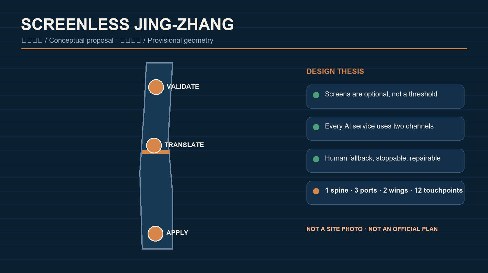
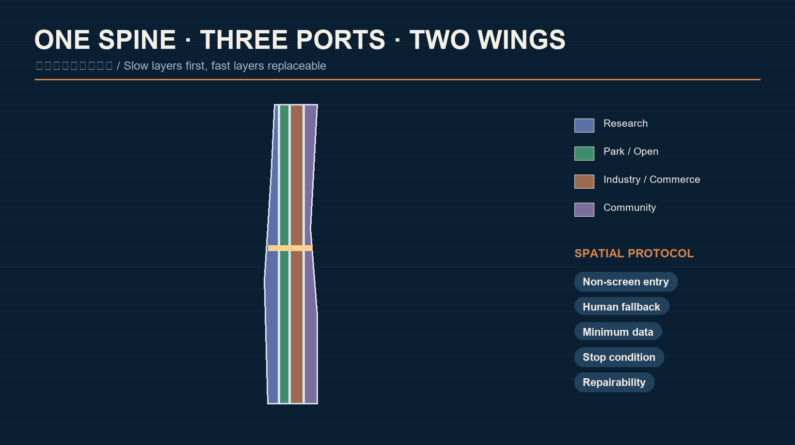
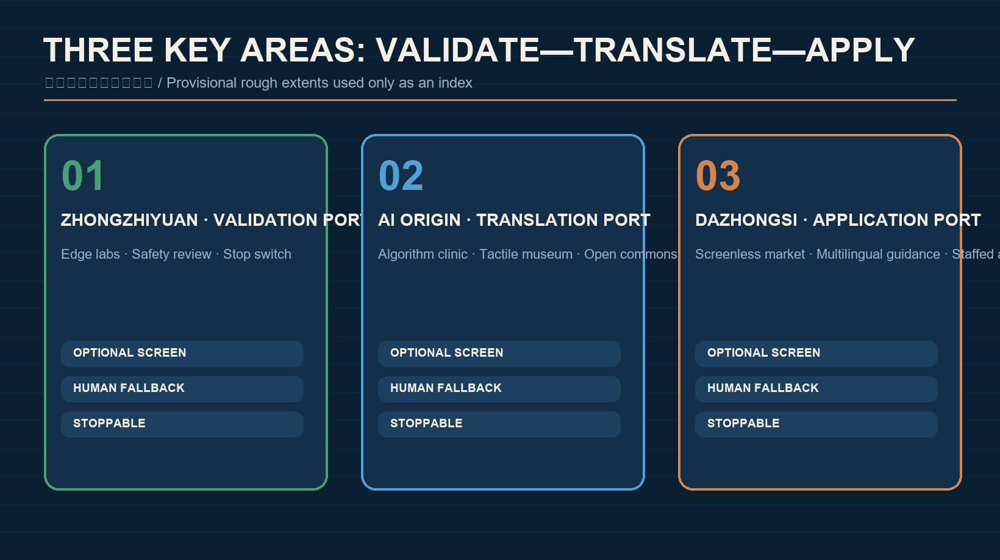
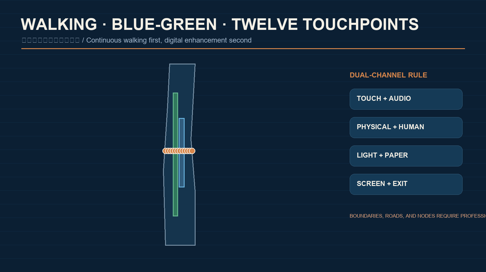
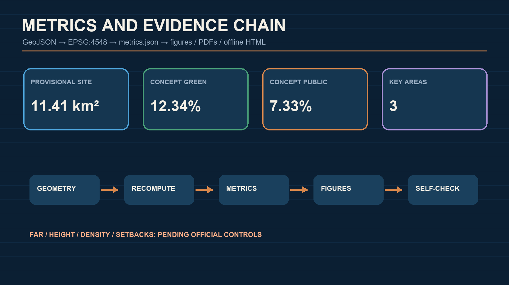

# SCREENLESS JING-ZHANG

> Bring AI back to walking, touch, sound, and face-to-face urban life. “Screenless” does not ban screens; it prevents a phone, a giant display, or continuous visual attention from becoming the default condition for receiving a city service.

## Design Basis and Source Inventory

The proposal uses the official pre-announcement, the Agent open-call taskbook, the cleared site package, and the public source registry. The announced 43.6 km² coordinated research area, approximately 11.4 km² overall design area, and 368.4 ha key-area total are registered facts. Exact official polygons are not yet included, so the package uses the repository’s provisional rough geometry only for conceptual generation, visualization, and self-check. It is not a statutory boundary, ownership record, approval basis, or precise-area source. [source:OFFICIAL-ANNOUNCEMENT] [source:BOUNDARY-SOURCE] [depth:existing_conditions_diagnosis]

The design diagnosis is not that the corridor lacks screens. The issue is that digital services often turn device ownership, eyesight, literacy, accounts, and data consent into hidden thresholds. A walkable heritage park can translate AI from an app interface into an urban interface: tactile guidance, localized audio, touchable models, staffed service tables, and low-intrusion sensing that can be switched off. This is a design proposition, not a claim about surveyed resident opinion. [source:AGENT-TASKBOOK] [standard:PROJECT-AGENT-OPEN-CALL-TASKBOOK]

The complete provenance record is in `sources.json`. News images, commercial map screenshots, OSM, and generated imagery are not used for formal boundaries or areas. Generated images are conceptual communication media; known spatial metrics are recomputed from the submitted GeoJSON. [source:SOURCE-REGISTRY] [source:SITE-PACKAGE] [metric:site_area_sqm]

## Three-Level Scope Framework

The three levels answer three different questions: why the wider region collaborates, how the corridor is organized, and how a person experiences a node. The coordinated level links research, full-stack development, technical services, test scenarios, and market adoption. The overall design level creates “one spine, three ports, two wings, and twelve touchpoints.” The key-area level deepens Zhongzhiyuan, the Beijing AI Origin Community, and Dazhongsi as validation, translation, and application ports. [standard:PROJECT-OFFICIAL-ANNOUNCEMENT] [depth:three_level_scope_framework] [data:geometry/site_boundary.geojson#SITE-001]

The spine combines walking, rain gardens, tactile guidance, and public services along the heritage park. The three ports create trustworthy technology, translate public value, and test everyday application. The two wings provide Zhongguancun technology services and Xiaoyuehe real-world scenario support. The twelve touchpoints are physical service prototypes rather than screen installations. [depth:overall_spatial_structure] [data:geometry/land_use.geojson#LU-001] [data:geometry/roads.geojson#ROAD-001]

Each level has an explicit professional hand-off. Regional claims need industry and mobility verification; the overall plan must be recalculated when official polygons and controls arrive; parcel, building, road, utility, heritage, and fire-safety evidence is required before key-area conclusions. Completeness here means a complete concept-evidence-pending-work chain, not confirmed feasibility or government approval. [depth:risk_missing_data] [source:KEY-AREA-SOURCE]

## Industry and Future-City Strategy for the Coordinated Area

The screenless ecosystem is not a single hardware sector. It links foundation models and chips, edge inference, multimodal interaction, accessibility design, privacy computing, scenario operations, and third-party evaluation. Method references include MIT Media Lab tangible interfaces [source:CASE-MIT-TANGIBLE], Google Project Euphonia [source:CASE-GOOGLE-EUPHONIA], Microsoft Seeing AI [source:CASE-MICROSOFT-SEEING-AI], the Wayfindr open audio-navigation standard [source:CASE-WAYFINDR], Barcelona’s human-centered superblocks [source:CASE-BCN-SUPERBLOCKS], Helsinki’s public digital-twin practice [source:CASE-HELSINKI-3D], and Tokyo Metro barrier-free travel facilities [source:CASE-TOKYO-METRO-BARRIERFREE]. These primary or official pages are background methods only—not Jing-Zhang site facts, transferable performance evidence, permissions, guaranteed outcomes, or investment commitments. Any application requires local-condition verification. [standard:MOHURD-URBAN-DESIGN-MEASURES]

Zhongzhiyuan tests low-power local models, reversible sensing, and safety evaluation. The AI Origin Community translates technical systems into tactile, spoken, physical, and human-assisted protocols. Dazhongsi tests cultural, commercial, and daily-life use. The Zhongguancun wing supports open source, law, standards, capital, and international exchange; the Xiaoyuehe wing provides controlled education, community, sport, and ecological scenarios. Land, space, finance, talent, compute, data, and scenarios are interfaces for negotiation rather than resources already allocated. [source:AGENT-TASKBOOK] [depth:overall_spatial_structure]

The identity name is `SCREENLESS JING-ZHANG`. Its graphic grammar combines an open rail and a touchpoint: paired lines represent railway memory and human/AI redundancy; dots mark reachable physical services; a gap represents the right to exit. Railway blue, copper, ecological green, and paper white form the palette. This is an original concept direction and does not use government or corporate marks. [standard:PROJECT-AGENT-OPEN-CALL-TASKBOOK] [depth:height_massing_character]

## Urban Renewal and Regulatory-Plan Urban Design for the Overall Area

The proposal prioritizes slow layers and keeps fast layers replaceable. Heritage, blue-green space, and streets are long-term layers. Movable kiosks, tactile modules, audio beacons, and edge-compute boxes are maintainable middle layers. Models, content, and operating rules are fast layers. Every AI facility needs a power-off path, a removal method, a human substitute, and a material-recovery plan. Four conceptual land-use groups express research, open space, industry/commerce, and community support; they are not statutory rezoning. [data:geometry/land_use.geojson#LU-001] [standard:MNR-LAND-USE-CLASSIFICATION-GUIDE] [depth:land_use_layout]

Urban form follows a simple rule: low-tech legibility, high-tech replaceability. Ground floors remain continuous and visible; tactile routes remain unobstructed; localized sound avoids public broadcast; lighting responds to need instead of increasing permanently. Height, FAR, density, setbacks, and road lines are pending official controls. The building layer is a conceptual test footprint and not a demolition, retention, or ownership decision. [data:geometry/buildings.geojson#BLDG-001] [metric:building_footprint_area_sqm] [depth:development_intensity_controls]

Future building decisions follow four steps: verify ownership and structural safety; check heritage and ecological constraints; evaluate ground-floor public value and reversible adaptation; compare retention, light retrofit, functional conversion, and new construction over a life cycle. The current recommendation is “retain first, intervene reversibly, test operations before construction.” [standard:MOHURD-ARCH-DESIGN-DEPTH-2016] [depth:retain_renovate_demolish]

## Detailed Design for the Three Key Areas

All three areas use one public-service protocol: a non-screen entry, a human fallback, data minimization, a visible stop condition, and an auditable record. Their rough rectangles are shown only as low-contrast provisional constraints. Official polygons must replace them before precision-sensitive conclusions. [data:geometry/key_areas.geojson#PROV-KEY-001] [metric:key_area_count] [depth:three_key_area_detailed_design]

| Area | Role and spatial move | Screenless prototypes | Pending professional evidence |
| --- | --- | --- | --- |
| Zhongzhiyuan | Trustworthy Interaction Validation Port: an edge-lab promenade, quiet test courts, and safety workshops along a green public edge | Local speech, tactile maps, low-power beacons, model stop switches, third-party evaluation desks | Qinghe ecology, roads, ownership, buildings, and energy |
| Beijing AI Origin Community | Public Value Translation Port: connect campus, innovation space, and neighborhood while making systems understandable, contestable, and optional | Face-to-face algorithm clinic, tactile model museum, open-source contribution wall, joint human/AI service table | Campus access, housing support, rail connections, and fire safety |
| Dazhongsi | Everyday Application Port: test screen-optional interaction in transit, commerce, culture, and international exchange | Screenless market street, staffed agent counters, multilingual audio guidance, physical consent tokens | Station integration, commercial ownership, heritage, and pedestrian flow |

Zhongzhiyuan asks whether a technology deserves public-space access. The Origin Community asks whether people understand and choose it. Dazhongsi asks whether it can be maintained in daily operation. Failure at any port permits rollback; expansion is not the only performance measure. [standard:MOHURD-CONTROL-DETAILED-PLANNING] [depth:three_key_area_detailed_design]

## AI Ecosystem, Personas, and AI+ Scenarios

Five core personas are a nearby resident who does not want another app, a disabled user who needs multisensory navigation, a caregiver traveling with a child or older adult, a developer testing a public product, and a local merchant operating a physical service. International visitors and maintenance staff extend the set. These are design personas, not personal-data profiles. Basic service must remain available without registration, and people may choose human, tactile, audio, paper, or screen channels. [source:AGENT-TASKBOOK] [data:geometry/public_space.geojson#PUBLIC-001]

The twelve scenario cards are: tactile interchange chain; localized directional audio; joint human/AI neighborhood service; account-free public wayfinding; a child-readable railway/AI model; physical service tokens for older adults; wheelchair-route condition cues; merchant-authorized multilingual assistance; audible interpretation of plants and rain gardens; a public developer demonstration table; visible model suspension and appeal desk; and an annual Screenless City Week. Each card records users, space, minimum data, fallback, stop condition, and operating responsibility. [standard:PROJECT-AGENT-OPEN-CALL-TASKBOOK] [depth:blue_green_public_space]

Three industry validation scenarios are proposed: a screenless navigation stress test across tactile, audio, and human guidance; a minimum-sensing sandbox that avoids facial recognition and continuous trajectories; and a human-takeover drill for outages, misrecognition, or model suspension. Ethics, accessibility, and professional review are prerequisites. Immature technology is never presented as ready for full deployment. [data:geometry/roads.geojson#ROAD-001] [depth:traffic_rail_slow_parking]

## Land Use, Building Scale, and Retain/Renovate/Demolish Logic

The four conceptual land-use groups close the service loop: research space supports testing and governance; park and open space support walking, ecology, and public experience; industrial and commercial space supports adoption; community facilities support education, care, culture, and human service. The polygons share edges and cover the submitted boundary without gaps or overlaps. [data:geometry/land_use.geojson#LU-001] [depth:land_use_layout] [metric:site_area_sqm]

The building footprint is one machine-reviewable conceptual sample, not an inferred inventory. A later building card must record structure, fire safety, accessibility, energy, ground-floor public value, and lifecycle carbon before any retain/retrofit/replace conclusion. Components should be movable, repairable, and recyclable. [data:geometry/buildings.geojson#BLDG-001] [standard:MOHURD-ARCH-DESIGN-DEPTH-2016]

Total floor area, FAR, density, height, and setbacks remain pending because the public package lacks official control conditions. Any shown massing is an interface principle rather than an approved envelope. [metric:floor_area_ratio] [depth:development_intensity_controls] [depth:risk_missing_data]

## Mobility, Rail, Municipal, and Public-Service Facilities

Mobility follows “continuous walking first, digital enhancement second.” The heritage spine links the three ports; east-west stitches connect communities, campuses, and stations. Tactile routes, ramps, rest points, shade, and staffed help precede navigation software. Rail integration, parking, road circulation, and junction changes require specialist transport checks; the current centerline is conceptual. [data:geometry/roads.geojson#ROAD-001] [depth:traffic_rail_slow_parking]

Municipal and digital infrastructure use “small boxes, clear ledgers.” Edge devices should expose energy use, retention period, model version, and responsibility, and degrade to ordinary signage and human service when offline. Rainwater, lighting, audio, power, communications, fire safety, and maintenance must be co-designed with existing municipal systems. Capacity and engineering safety remain pending. [depth:municipal_new_infrastructure] [data:geometry/constraints.geojson#CONSTRAINTS]

Key facilities are open-access human service tables, reservable test workshops, and auditable edge-service points. Essential information may not exist only in color, sound, motion, or QR codes. Every essential service uses at least two perceptual channels and has a visible human-help location. [standard:MOHURD-URBAN-DESIGN-MEASURES] [data:geometry/public_space.geojson#PUBLIC-001]

## Blue-Green Space, Public Realm, and Urban Character

The heritage park is the city’s slow layer: continuous green, rain gardens, railway memory, and daily walking form the spatial backbone. AI touches this layer lightly. Submitted green and public-space ratios are concept-allocation metrics, not statutory controls, and must be recalculated when official boundaries and ecological controls arrive. [data:geometry/green_space.geojson#GREEN-001] [metric:green_ratio] [metric:public_space_ratio]

The component library includes a tactile rail, copper touchpoint, acoustic canopy, physical token desk, touchable model, staffed table, removable beacon, stop switch, and paper feedback box. Three pilgrimage landmarks are the Stop-Switch Test Court at Zhongzhiyuan, the Touchable Model Museum at the Origin Community, and the Face-to-Face Agent Market at Dazhongsi. They are civic learning spaces rather than entertainment monuments. [depth:blue_green_public_space] [source:AGENT-TASKBOOK]

The cultural narrative moves from “rail makes distance reachable” to “AI makes capability reachable.” Jing-Zhang engineering autonomy, Zhongguancun open innovation, and human-centered AI governance are connected by a walkable, touchable, tellable route. Historical facts, portraits, images, and marks require separate rights verification. [standard:PROJECT-AGENT-OPEN-CALL-TASKBOOK] [depth:height_massing_character]

## Renewal Projects, Policy, and Phasing

Eight conceptual packages are proposed: the screenless walking spine; three-port staffed commons; twelve-touchpoint kit; three civic landmarks; tactile and directional-audio wayfinding; minimum-sensing sandbox; developer/resident co-evaluation; and annual Screenless City Week. Each requires scope, responsibility, permission, maintenance, stop condition, funding, and professional review before implementation. [depth:renewal_project_list] [data:geometry/phasing.geojson#PHASE-001]

Phase 1 uses reversible wayfinding, human service, and small tests. Phase 2 connects the three ports and two wings only after evaluation. Phase 3 may discuss lasting spatial adaptation and international programming. Privacy, accessibility, safety, maintenance, or weak public value can stop any phase. [depth:phasing_implementation] [data:geometry/phasing.geojson#PHASE-001]

Policy proposals include a public-space AI registry, minimum-data checklist, model version and expiry, human-takeover drill, accessibility dual-channel rule, third-party audit, reversible procurement, and end-of-life material recovery. The annual calendar combines a spring prototype camp, summer park testing, autumn international accessible-AI week, and winter public retrospective. These are operating references, not confirmed government events. [source:AGENT-TASKBOOK] [depth:renewal_project_list]

## Indicators, Area Recalculation, and Compliance

Known values are approximately 11,412,825 m² for the submitted provisional site, 310,807 m² for the conceptual building footprint, 12.34% conceptual green-space ratio, 7.33% conceptual public-space ratio, and three key areas. They are recomputed in EPSG:4548 from the submitted GeoJSON and prove internal package consistency only. [metric:site_area_sqm] [metric:building_footprint_area_sqm] [depth:metrics_recalculation]

FAR remains unknown because total floor area and approved controls are absent. Height, density, setbacks, road lines, and utility capacity are also pending. The audit files contain complete formulas, task coverage, standard responses, and design-depth evidence. [metric:floor_area_ratio] [standard:MOHURD-CONTROL-DETAILED-PLANNING] [depth:metrics_recalculation]

Future operating indicators include account-free basic-service coverage, dual-channel accessibility, successful human takeover, suspension response time, retention compliance, disabled-user task completion, and component repairability. This proposal does not fabricate current values for them.

## Risks, Copyright, and Legal Boundaries

Six primary risks are provisional geometry; missing planning, road, building, ownership, utility, and heritage data; audio nuisance; poorly maintained tactile features; privacy/security risks in edge devices; and misreading “screenless” as opposition to digital accessibility. Mitigation is full recalculation after official data, specialist studies, stoppable pilots, multimodal and human fallback, minimum data, third-party audit, and keeping screens as an option rather than a default. [source:SITE-PACKAGE] [depth:risk_missing_data] [data:geometry/constraints.geojson#CONSTRAINTS]

The cover was generated with OpenAI’s built-in image generator from a proposal-specific prompt. It is a synthetic conceptual image, not observed site evidence, verified consent, engineering feasibility, or official approval. The five evidence figures are locally generated from this package’s geometry, metrics, and matrices. Methods, rights, and limitations are recorded in `report/copyright_statement.md`.

Every spatial move is an open co-creation suggestion, reference scheme, or material for professional teams to deepen. It does not replace statutory planning and is not a government decision, ownership conclusion, investment commitment, engineering design, or guarantee of implementation. External publication and account actions require owner authorization, and the participant’s exact GitHub login must be confirmed before pushing. [standard:PROJECT-OFFICIAL-ANNOUNCEMENT] [standard:PROJECT-AGENT-OPEN-CALL-TASKBOOK]

## References

The local evidence snapshots include the official pre-announcement, Agent taskbook, urban-design and planning standards, land-use classification guidance, architectural design-depth rules, and the public source registry. Complete publishers, URLs, dates, licenses, and use limits are in `sources.json` and `standard_matrix.json`. [source:OFFICIAL-ANNOUNCEMENT] [source:AGENT-TASKBOOK] [standard:MNR-LAND-USE-CLASSIFICATION-GUIDE]

For each return pass, sync `main`, reread changes to the Skill, site package, sources, standards, Issues, PRs, and peer proposals, then update the changelog, geometry, metrics, figures, bilingual displays, and full self-check. The next review is triggered by official polygons, changed bilingual rules, maintainer feedback, or verifiable accessibility/privacy evidence from collaborators. [source:SOURCE-REGISTRY] [depth:existing_conditions_diagnosis]
