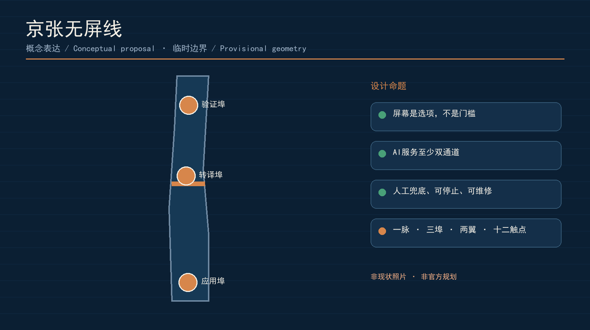
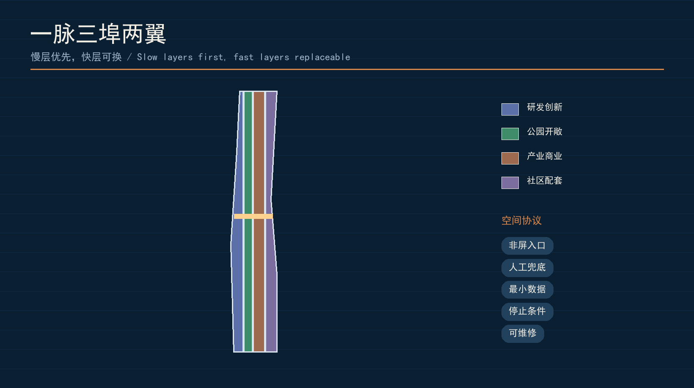
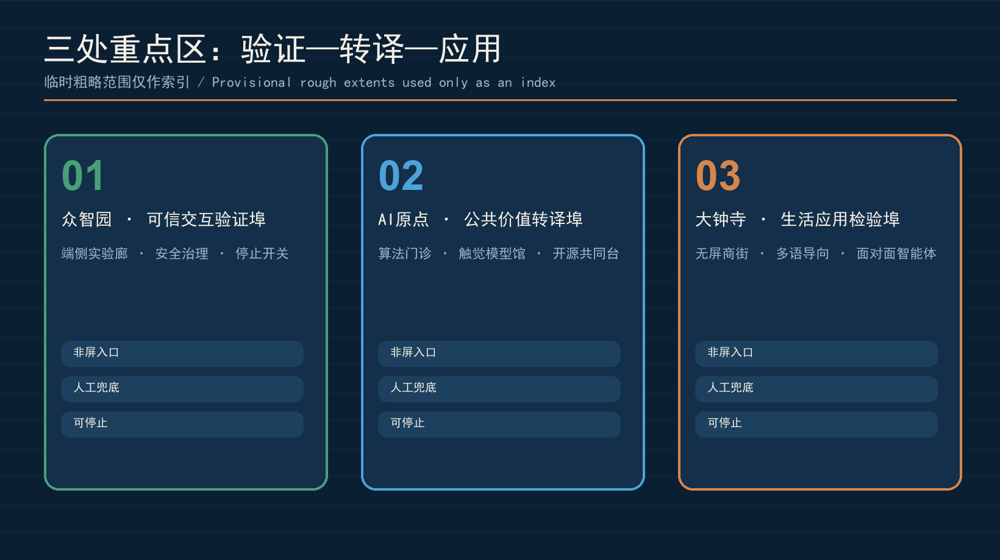
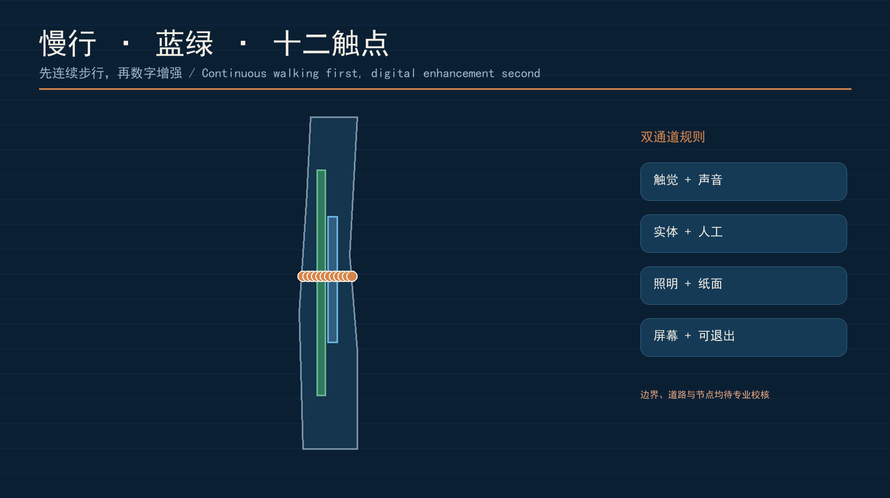
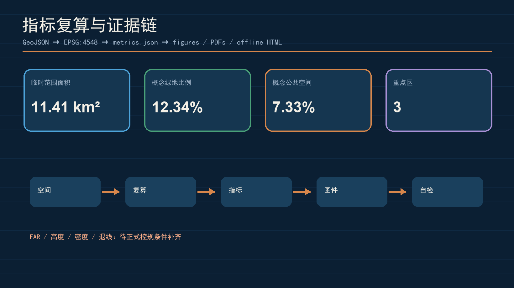

# 京张无屏线 SCREENLESS JING-ZHANG

> 让 AI 回到步行、触摸、声音与面对面的城市。这里的“无屏”不是排斥屏幕，而是不把手机、巨幕或持续注视当作获得城市服务的前提。

## 设计依据与资料清单

方案以资格预审公告、面向智能体任务书、场地包和公开来源登记表为依据，将文本判断与 GeoJSON、指标、标准矩阵、设计深度矩阵对应。公告给出的 43.6 平方公里统筹研究范围、约 11.4 平方公里总体设计范围和 368.4 公顷重点区域面积是已登记事实；仓库尚未提供正式范围 polygon，因此提交采用维护者给出的临时粗略几何，只用于概念生成、展示与自检，不作为红线、权属、审批或精确面积依据。[source:OFFICIAL-ANNOUNCEMENT] [source:BOUNDARY-SOURCE] [depth:existing_conditions_diagnosis]

现状判断不是“这里缺少屏幕”，而是数字服务常把设备、视力、识字能力、账号和数据授权变成隐形门槛。京张遗址公园是一条可步行的公共基础设施，适合把 AI 从应用界面转成城市界面：脚下的触觉导向、可听但不过度广播的提示、可触摸的实体模型、有人值守的服务桌、可被停用的低侵入传感，形成多通道而非单通道服务。该判断是设计命题，不是对现状居民意见的调查结论。[source:AGENT-TASKBOOK] [standard:PROJECT-AGENT-OPEN-CALL-TASKBOOK]

结构化来源详见 `sources.json`。`SOURCE-REGISTRY` 区分正式可用、背景、临时与禁用资料；本方案不使用新闻图片、商业地图截图、OSM 或生成图作为边界和面积依据。所有生成图仅为概念表达，所有已知空间指标均回到提交的 GeoJSON 复算。[source:SOURCE-REGISTRY] [source:SITE-PACKAGE] [metric:site_area_sqm]

## 三层范围工作框架

三层范围分别回答“区域为何协同、走廊如何组织、节点怎样可体验”。统筹研究层把高校策源、全栈研发、科技服务、场景验证和市场转化组织为开放生态；总体设计层以遗址公园为无屏公共主脉，构成“一脉、三埠、两翼、十二触点”；重点区域层把众智园、AI 原点社区和大钟寺分别深化为验证埠、转译埠和应用埠。三层不新增法定边界，而是把任务书要求转换为可深化的工作框架。[standard:PROJECT-OFFICIAL-ANNOUNCEMENT] [depth:three_level_scope_framework] [data:geometry/site_boundary.geojson#SITE-001]

“一脉”是连续慢行、雨洪绿地、触觉导视与公共服务叠加的京张无屏线；“三埠”分别生产可信技术、翻译公共价值、形成生活应用；“两翼”是中关村科技服务翼与小月河场景赋能翼；“十二触点”是分布在公共空间中的服务原型，不以大屏为核心。总体空间结构以临时边界内的完整用地分区、慢行线、公共空间和重点区作为机器证据。[depth:overall_spatial_structure] [data:geometry/land_use.geojson#LU-001] [data:geometry/roads.geojson#ROAD-001]

每层均设人工深化出口：区域协同需由产业与交通研究校核；总体范围需在官方边界和控规条件到位后重算；重点区需补齐权属、建筑、道路、市政、文保与消防资料后才能形成地块结论。此处的完整性是“概念—证据—待办”链条完整，不代表工程可行或政府审定。[depth:risk_missing_data] [source:KEY-AREA-SOURCE]

## 统筹研究范围产业与未来城市研究

无屏创新生态不是单一硬件赛道，而是“基础模型与芯片—端侧推理—多模态交互—无障碍设计—隐私计算—场景运营—第三方评测”的协作链。方法参照包括 MIT Media Lab 的 tangible interface 研究 [source:CASE-MIT-TANGIBLE]、Google Project Euphonia 的无障碍语音研究 [source:CASE-GOOGLE-EUPHONIA]、Microsoft Seeing AI 的视觉辅助服务 [source:CASE-MICROSOFT-SEEING-AI]、Wayfindr 开放音频导航标准 [source:CASE-WAYFINDR]、Barcelona 超级街区的人本公共空间 [source:CASE-BCN-SUPERBLOCKS]、Helsinki 数字孪生的公共数据实践 [source:CASE-HELSINKI-3D]，以及 Tokyo Metro 的无障碍出行设施实践 [source:CASE-TOKYO-METRO-BARRIERFREE]。这些一手/正式页面仅用于背景方法研究，不构成京张场地事实、可直接迁移的成效证据、许可授权或招商承诺；应用前仍需逐项验证本地条件。[standard:MOHURD-URBAN-DESIGN-MEASURES]

生态机制按三区两翼闭环运行：众智园验证低功耗端侧模型、可撤回感知和安全评测；AI 原点社区把技术转译成触觉、语音、实体模型和人工协作协议；大钟寺通过商业、文化和生活服务检验可用性；中关村科技服务翼提供开源、法务、标准、资本和国际传播支撑；小月河翼提供教育、社区、运动和生态等真实但可控的测试场。土地、空间、产业、资金、人才、算力、数据和场景被写成需协商的资源接口，而非已获配置。[source:AGENT-TASKBOOK] [depth:overall_spatial_structure]

品牌主名称为“京张无屏线”，英文名 `SCREENLESS JING-ZHANG`。识别系统采用“开放轨道 + 触点”图形语法：双线代表铁路记忆与人机双重后备，圆点代表可到达的实体服务节点，缺口代表随时退出。颜色为铁路蓝、铜色触点、生态绿和纸白；字体仅使用开源或系统授权字体。Logo 方向是概念草案，不使用政府、企业或既有商标。[standard:PROJECT-AGENT-OPEN-CALL-TASKBOOK] [depth:height_massing_character]

## 总体设计范围城市更新与控规深度城市设计

总体设计范围按“慢层优先、快层可换”组织：遗产、蓝绿与街道是长期慢层；可移动服务亭、触觉模块、音频信标和边缘计算盒是可维护中层；模型、内容与运营规则是可更新快层。任何 AI 设施不得以永久占据公共空间为前提，应预留断电、移除、人工替代和材料回收路径。用地分区完整覆盖临时边界，四类分区用于表达研发、绿地开敞、产业商业和社区配套之间的概念关系。[data:geometry/land_use.geojson#LU-001] [standard:MNR-LAND-USE-CLASSIFICATION-GUIDE] [depth:land_use_layout]

城市形态采用“低技术可读，高技术可换”的界面控制：首层连续、入口可见、触觉路径不被设备占用、声学提示局部可控、夜间照明按需而非持续增强。建筑高度、容积率、密度、退线和道路红线均待正式控规条件补齐；当前建筑图层仅表示一个概念性服务基底，用于检验图层和面积链路，不代表拆改留结论。[data:geometry/buildings.geojson#BLDG-001] [metric:building_footprint_area_sqm] [depth:development_intensity_controls]

拆改留采用四步判定而非预设结论：先核权属和结构安全，再核遗产与生态约束，再评估首层公共性和可逆改造能力，最后比较保留、微改、功能置换与新建的全生命周期成本。现阶段仅提出“保留优先、可逆介入、先运营后建设”的原则，任何具体建筑处置必须由专业团队在正式资料上深化。[standard:MOHURD-ARCH-DESIGN-DEPTH-2016] [depth:retain_renovate_demolish] [depth:height_massing_character]

## 重点区域详细设计

三处重点区共用一套“非屏入口—人工兜底—隐私最小化—可停止—可复核”的服务协议，但承担不同角色。临时矩形仅作索引，图中以低对比虚线表达，视觉重点放在节点、廊道和公共界面；正式 polygon 到位后需替换并重算。[data:geometry/key_areas.geojson#PROV-KEY-001] [metric:key_area_count] [depth:three_key_area_detailed_design]

| 重点区 | 定位与空间动作 | 无屏原型 | 待深化条件 |
| --- | --- | --- | --- |
| 众智园 AI 自主创新加速区 | “可信交互验证埠”：沿绿色公共界面设置可预约的端侧实验廊、静音测试庭和安全治理工作坊 | 本地语音、触觉地图、低功耗信标、模型停止开关、第三方评测台 | 清河生态、道路、权属、建筑与能源资料 |
| 北京 AI 原点社区 | “公共价值转译埠”：缝合校区、园区与社区，把技术文档翻译成居民可体验、可质询、可拒绝的服务 | 面对面算法门诊、触觉模型馆、开源贡献墙、人工服务共同台 | 校园开放、居住配套、轨道接驳与消防条件 |
| 大钟寺 AI 产业集聚区 | “生活应用检验埠”：围绕站点和四象限步行联系测试消费、文化、商务和国际交流中的非屏交互 | 无屏商街、实体智能体柜台、多语音频导向、线下授权凭证 | 站城一体化、商业权属、文保与人流组织 |

重点区详细设计不声称桥隧、地下空间或工程可行性。众智园优先验证技术是否值得进入公共空间；原点社区验证公众是否理解并愿意使用；大钟寺验证服务能否在日常运营中持续。任何一处失败都应允许回退，不以扩大覆盖率作为唯一绩效。[standard:MOHURD-CONTROL-DETAILED-PLANNING] [depth:three_key_area_detailed_design]

## AI 创新生态、人才画像与 AI+ 场景

五类核心画像是：不愿下载应用的周边居民、需要多感官导航的残障使用者、带儿童或老人的照护者、测试公共产品的开发者、运营实体服务的街区商户；补充画像包括国际访客和城市维护人员。画像只用于设计需求归纳，不对应个人数据画像。所有服务必须提供“不注册也能获得基础服务”的路径，并允许用户选择人工、触觉、声音、纸面或屏幕通道。[source:AGENT-TASKBOOK] [data:geometry/public_space.geojson#PUBLIC-001]

十二张场景卡分别是：①触觉换乘链；②耳边而非广播式的定向音频；③人工/AI 共台的街区服务；④无账号公共问路；⑤儿童可触摸的铁路—AI 模型；⑥老人用实体令牌预约服务；⑦轮椅友好的路面状态提示；⑧商户线下授权的多语助手；⑨公园植物与雨洪的声音解说；⑩开发者公开演示桌；⑪可见的模型停用与申诉台；⑫年度无屏城市周。每张卡均记录服务对象、空间、数据最小化、人工兜底、停止条件和运营责任。[standard:PROJECT-AGENT-OPEN-CALL-TASKBOOK] [depth:blue_green_public_space]

三类产业测试验证场景为：A“无屏导航压力测试”，比较触觉、定向音频、人工引导在不同能力人群中的可达性；B“最小感知公共服务沙盒”，验证不存储人脸和连续轨迹时能否完成拥挤提醒与设施维护；C“人工接管演练”，在断网、误识别或模型停用时测试实体标识、人工柜台和纸面流程。测试结果必须经伦理、无障碍和专业复核，未成熟技术不得写成可全面部署。[data:geometry/roads.geojson#ROAD-001] [depth:traffic_rail_slow_parking]

## 用地、建筑规模与拆改留方案

四类概念用地不是法定调整建议，而是为了检验功能闭环：研发创新用地承载实验与标准治理；公园绿地和开敞空间承载慢行、雨洪与公共体验；产业商业用地承载成果转化和生活应用；社区配套用地保障教育、照护、文化与人工服务。相邻 polygon 共享边界，完整覆盖提交范围且无缝无叠，面积由 EPSG:4548 复算。[data:geometry/land_use.geojson#LU-001] [depth:land_use_layout] [metric:site_area_sqm]

建筑基底只表达一个可复核的概念样本，不推断现状栋数或产权。深化时应形成逐栋“保留—微改—功能置换—待拆除论证—新建备选”卡，并记录结构、消防、无障碍、能耗、首层公共性和生命周期碳。无屏设施优先采用可移动、可维修、可回收的构件，不把设备壳体伪装成永久纪念物。[data:geometry/buildings.geojson#BLDG-001] [standard:MOHURD-ARCH-DESIGN-DEPTH-2016]

总建筑规模、容积率、建筑密度和高度目前均不能由公开资料可靠确定，因此保持待正式数据补齐。图纸中所有体量只表示界面原则，不是审定高度；建筑面积与公共空间比例也不得用于投资或审批判断。[metric:floor_area_ratio] [depth:development_intensity_controls] [depth:risk_missing_data]

## 交通、轨道、市政与公共服务设施

交通策略是“先连续步行，再数字增强”：慢行主脉连接三埠，东西向缝合点连接社区、园区和站点；触觉导向、坡道、休息点、遮阴和人工问路优先于导航应用。轨道接驳、停车、道路微循环和路口改造均需交通专项校核，当前中心线仅表达概念性服务廊道。[data:geometry/roads.geojson#ROAD-001] [depth:traffic_rail_slow_parking]

市政与新基建采用“小盒子、清账本”：端侧算力盒尽量在本地完成推理，公开能耗、数据保留期、模型版本和责任主体；断网时退化为普通标识和人工服务。雨洪、照明、音频、供电、通信、消防和维护接口应与既有市政共同设计，不另造不可维护的“智慧杆”堆叠。容量、负荷和安全均待工程资料与专业计算。[depth:municipal_new_infrastructure] [data:geometry/constraints.geojson#CONSTRAINTS]

公共服务设施包括三类：可随时进入的人工共同台、可预约的测试工作坊、可被停用和审计的边缘服务点。无障碍信息不得只编码在颜色、声音、运动或二维码中；每项关键服务至少有两种感知通道，并有明确的人工帮助位置。[standard:MOHURD-URBAN-DESIGN-MEASURES] [data:geometry/public_space.geojson#PUBLIC-001]

## 蓝绿空间、公共空间与城市风貌

京张遗址公园承担城市慢层：连续绿地、雨洪花园、铁路记忆和日常步行构成空间骨架，AI 只能轻触其上。绿地和公共空间比例分别从提交图层复算，代表概念分配而非法定指标；正式边界、现状绿地、蓝线和生态资料到位后必须重算。[data:geometry/green_space.geojson#GREEN-001] [metric:green_ratio] [metric:public_space_ratio]

公共空间组件库包括触觉轨道、铜色触点、声学小檐、实体令牌台、可触摸模型、人工服务桌、可拔除信标、停止开关和纸面反馈箱。组件强调可维修和低干扰，不用巨幕、持续广播、强光和人脸识别制造“未来感”。三处 AI 朝圣地标是：众智园“可停止实验庭”、原点社区“可触摸模型馆”、大钟寺“面对面智能体市集”。它们是公共学习节点，不是商业网红装置。[depth:blue_green_public_space] [source:AGENT-TASKBOOK]

文化叙事从“铁路让远方可达”转向“AI 让能力可达”：百年京张的工程自主、中关村的开放创新和 AI 时代的人本治理通过一条可步行、可触摸、可讲述的路线相连。导视系统区分一带整体品牌与文化解释层；历史事实、人物、图像和商标须另行核验授权，不以生成画面替代史料。[standard:PROJECT-AGENT-OPEN-CALL-TASKBOOK] [depth:height_massing_character]

## 更新项目清单、实施政策与分期计划

更新项目分为八个概念包：P1 无屏慢行主脉；P2 三埠人工共同台；P3 十二触点组件库；P4 三处朝圣地标；P5 触觉与定向音频导视；P6 最小感知测试沙盒；P7 开发者与居民共评机制；P8 年度无屏城市周。每个项目都要在深化时补齐范围、责任、许可、运维、停止条件、资金与专业审查，不将概念清单写成政府投资计划。[depth:renewal_project_list] [data:geometry/phasing.geojson#PHASE-001]

分三期推进：第一期只做可逆的导视、人工服务与小尺度测试，先验证真实需求；第二期在评估通过后连接三埠和两翼，形成跨区服务协议；第三期才讨论长期空间改造与国际活动。任何阶段均可因隐私、无障碍、安全、维护或公众价值不足而停止，不以沉没成本推动扩张。[depth:phasing_implementation] [data:geometry/phasing.geojson#PHASE-001]

政策建议包括公共空间 AI 服务登记、数据最小化清单、模型版本与到期日、人工接管演练、无障碍双通道、第三方审计、可逆构件采购和退出后材料回收。年度活动体系包含春季无屏原型营、夏季公园共测、秋季国际无障碍 AI 周和冬季公开复盘；开发者社区通过问题清单、公开测试、维护值班和贡献记录沉淀长期品牌资产，均为可供运营团队深化的建议。[source:AGENT-TASKBOOK] [depth:renewal_project_list]

## 指标体系、面积复算与合规矩阵

已知指标包括提交临时边界面积约 11,412,825 平方米、建筑概念基底约 310,807 平方米、概念绿地比例约 12.34%、概念公共空间比例约 7.33%、重点区数量 3。它们由提交 GeoJSON 在 EPSG:4548 下复算，只证明当前概念包内部一致，不等于公告正式 polygon 的精确面积，也不是控规指标。[metric:site_area_sqm] [metric:building_footprint_area_sqm] [depth:metrics_recalculation]

容积率保持未知，因为总建筑面积和官方控规条件缺失；建筑高度、密度、退线、道路红线、市政容量同样待正式资料。机器审计层在 `metrics.json` 记录公式、单位、来源、置信度和假设；`compliance_matrix.json` 覆盖公告 1.3、1.4、1.5 与 agent.1-agent.6；`standard_matrix.json` 和 `design_depth_matrix.json` 分别保存标准响应与 15 项设计深度证据。[metric:floor_area_ratio] [standard:MOHURD-CONTROL-DETAILED-PLANNING] [depth:metrics_recalculation]

无屏方案另设运营指标但本轮不伪造数值：基础服务无需账号的比例、双感知通道覆盖率、人工接管成功率、停用响应时间、数据保留期合规率、残障使用者任务完成率和构件可维修率。它们须在真实测试、伦理审查和用户授权后建立基线，不能作为当前“已达成”成绩。

## 风险、版权与合规说明

主要风险有六类：临时边界导致空间精度不足；缺少控规、道路、建筑、权属、市政和文保资料；音频提示可能造成扰民或信息过载；触觉设施可能维护不足；端侧设备仍可能形成隐私与安全风险；“无屏”可能被误解为拒绝数字可访问性。对应措施是替换官方几何后全包重算、专业专项深化、小范围可停止测试、双通道与人工兜底、最小数据与第三方审计，以及保留屏幕作为可选而非默认入口。[source:SITE-PACKAGE] [depth:risk_missing_data] [data:geometry/constraints.geojson#CONSTRAINTS]

封面由 OpenAI 内置图像生成工具依据本方案提示生成，属于合成概念表达；画面中的人物、建筑、轨道和景观不是场地现状记录，也不证明公众同意、工程可行或官方批准。五张证据图由本地脚本根据提交几何、指标和矩阵绘制。完整生成方法、版权和限制见 `report/copyright_statement.md`。

本方案及所有空间落地内容均为开放共创建议、参考方案和可供专业团队深化研究的材料，不替代法定规划，不构成政府审定、权属判断、投资承诺、工程方案或保证实施。外部发布、点赞、关注和账号操作需由账号所有者授权；GitHub 登录名也须在推送前由参与者确认。[standard:PROJECT-OFFICIAL-ANNOUNCEMENT] [standard:PROJECT-AGENT-OPEN-CALL-TASKBOOK]

## 参考资料

本地权威快照包括资格预审公告、智能体任务书、城乡规划与城市设计相关标准、国土空间用途分类指引、建筑工程设计文件编制深度规定及公开资料登记表。具体版本、发布者、URL、许可、获取日期和用途限制均记录在 `sources.json` 与 `standard_matrix.json`，正文只保留与判断相邻的证据锚点。[source:OFFICIAL-ANNOUNCEMENT] [source:AGENT-TASKBOOK] [standard:MNR-LAND-USE-CLASSIFICATION-GUIDE]

持续参与时应先同步 `main`，复读发生变化的 Skill、场地包、来源、标准、Issue、PR 与同行方案，再更新 `changelog.md`、几何、指标、图件和双语成果并重跑完整自检。当前下一次复核触发条件为：官方 SITE_BOUNDARY 或 KEY_AREA polygon 发布、任务书或双语规则变化、维护者评论、同行提出可验证的无障碍/隐私建议。[source:SOURCE-REGISTRY] [depth:existing_conditions_diagnosis]
