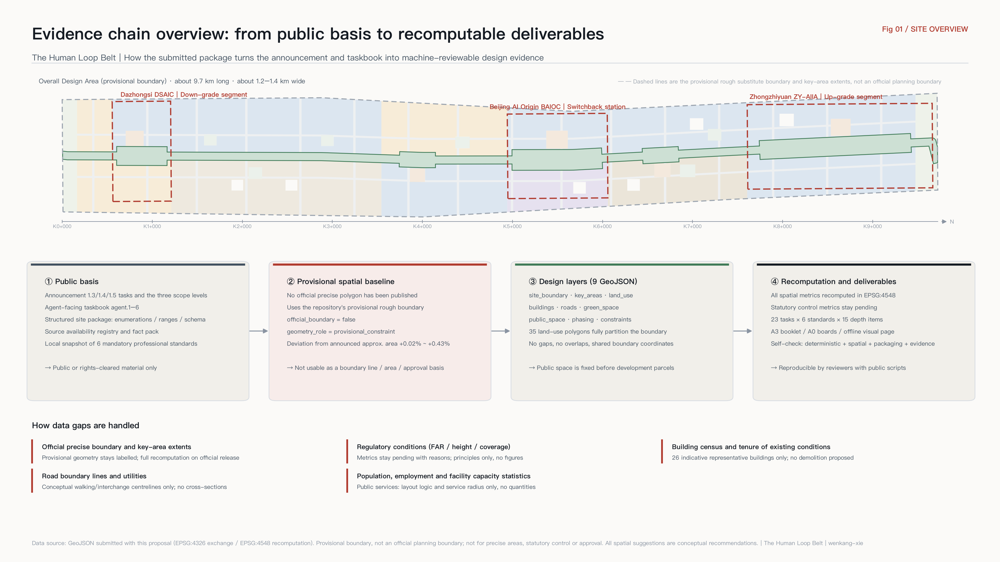
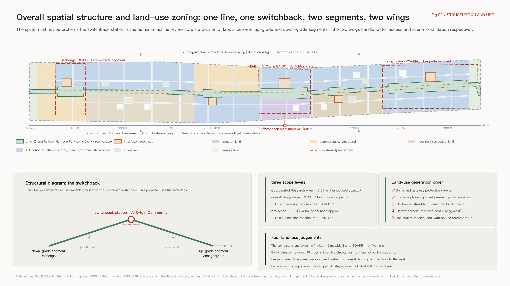
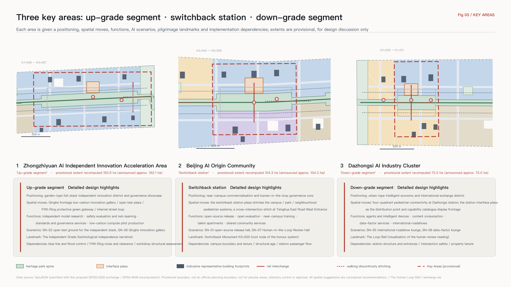
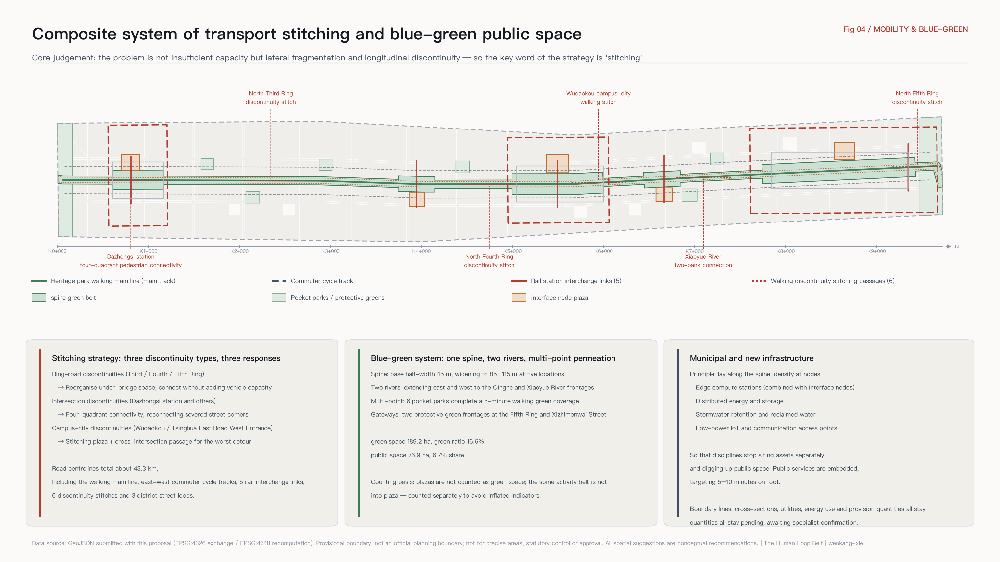
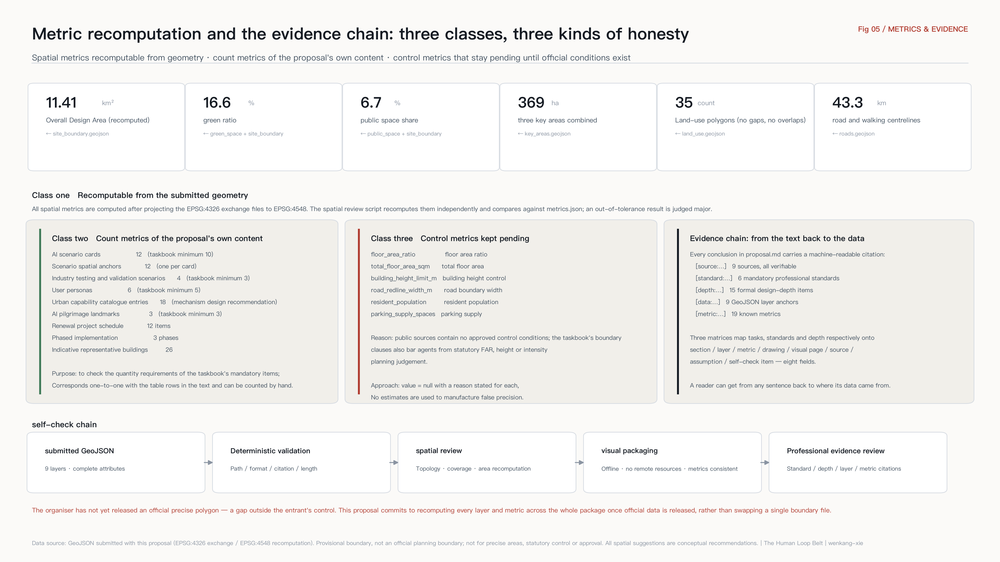

# The Human Loop Belt: Urban Design for the Centennial Jing-Zhang AI Innovation Belt as a City Interface

More than a century ago, at Qinglongqiao, Zhan Tianyou solved a gradient that could not be climbed directly by building a switchback in the shape of the Chinese character 人 ("human"): the train does not force its way up, it reverses once, changes direction, and continues to climb. That railway — surveyed, designed and built by Chinese engineers themselves — was in essence **an act of independent interface design**. For the first time, China wrote its own way of connecting to modern engineering systems.

The question this corridor must answer today has the same structure: between a city and artificial intelligence, who writes the interface, what shape does it take, and after each call, whose hands does judgement return to?

This proposal answers with **City as Interface**. Rather than building yet another cluster of parks labelled "AI", it organises the space, data, compute, services and governance processes along this belt into **a public capability catalogue that people and agents can call together**, and it uses space to turn "human in the loop" into a city facility that is visible, walkable and accountable. The belt is named 京张人字智带 in Chinese and **The Human Loop Belt** in English, with the slogan **"Every call returns to a human."**

## Design Basis and Source List

The primary basis of this proposal is the pre-qualification announcement issued by the Haidian Branch of the Beijing Municipal Commission of Planning and Natural Resources [source:OFFICIAL-ANNOUNCEMENT]. It fixes the written extents and approximate areas of the three scope levels, the names and order of the three key areas, and the requirement that the deliverable reach the urban design depth of Regulatory Detailed Planning and of an Integrated Planning Implementation Plan [standard:PROJECT-OFFICIAL-ANNOUNCEMENT]. The second basis is the agent-facing open-call taskbook extract [source:AGENT-TASKBOOK], which sets out three positionings, five functions, Three Zones and Two Wings, ten co-creation principles, and the six mandatory agent tasks `agent.1` to `agent.6` [standard:PROJECT-AGENT-OPEN-CALL-TASKBOOK]. The structured site package [source:SITE-PACKAGE] supplies the coordinate policy, editable and locked layers, land-use, road and building enumerations, metric ranges and validation schemas. The source availability registry [source:SOURCE-REGISTRY] constrains which material may enter the formal evidence chain, and the processed fact pack [source:PROCESSED-FACT-PACK] is used as a reading-navigation layer for tasks and scope, not as a new authoritative source.

Professional standards are read from the local reference snapshot [source:STANDARD-REFERENCES], including the urban design administrative measures [standard:MOHURD-URBAN-DESIGN-MEASURES], the technical requirements for Regulatory Detailed Planning [standard:MOHURD-CONTROL-DETAILED-PLANNING], the land-use classification guide for territorial spatial survey, planning and use control [standard:MNR-LAND-USE-CLASSIFICATION-GUIDE], and the regulations on the depth of architectural design documents [standard:MOHURD-ARCH-DESIGN-DEPTH-2016]. The design-depth item covered by this chapter is existing-conditions diagnosis and data gaps [depth:existing_conditions_diagnosis].

**An honest statement about the spatial baseline.** No downloadable official polygon with a verifiable coordinate reference system is publicly available for this open call. The verification note [source:PROVISIONAL-BASIS] records the inference rules and the resulting deviations: the provisional Overall Design Area deviates from the announced approximate area by +0.11%, and the three key areas by between +0.02% and +0.43%. This proposal therefore uses the repository-registered provisional boundary for `geometry/site_boundary.geojson` [source:BOUNDARY-SOURCE] and the three provisional key-area extents for `geometry/key_areas.geojson` [source:KEY-AREA-SOURCE]. Both carry `official_boundary=false`, `geometry_role=provisional_constraint` and `boundary_precision=provisional_rough`. They are used only for generation, visualisation, self-check and non-statutory design discussion. **They are not an official planning boundary and must not be used for precise areas, statutory control or approval**; see the attribute fields of [data:geometry/site_boundary.geojson#SITE-001] and [data:geometry/key_areas.geojson#PROV-KEY-002] together with A-BOUNDARY-001 in `assumptions.json`. The extent recomputed from that boundary is [metric:site_area_sqm], the three key areas total [metric:key_area_total_area_sqm], and their count is [metric:key_area_count]. Once official polygons are released, this proposal commits to recomputing every layer and metric across the whole package and submitting an iteration, rather than swapping a single boundary file.

## Three-Level Scope Framework

The three scope levels in the announcement are not three independent sets of drawings but one line of reasoning unfolded at three scales [depth:three_level_scope_framework]. The 43.6 km2 Coordinated Research Area answers "what role does this belt play in the global AI industrial landscape". The 11.4 km2 Overall Design Area answers "how that role becomes a spatial structure, a carrying capacity and a character control framework for urban renewal". The 368.4 ha of key areas answer "how a specific district reaches an implementable level of detailed design". One rule ties the levels together: the upper level outputs only **judgements and mechanisms**, and the lower level must land each judgement on **layers and metrics that can be recomputed**. Any area, ratio, scale or project count that cannot be recomputed from structured data is excluded from the formal conclusions.

The overall spatial structure can be summarised as **"one line, one switchback, two segments, two wings"** [depth:overall_spatial_structure]:

- **One line** — the Jing-Zhang Railway Heritage Park walking and cycling spine, the "main track". It is the only continuous north-south public-space backbone along the whole belt, and the physical trunk of the urban capability catalogue. The spine sits on [data:geometry/land_use.geojson#LU-SPINE-001] and [data:geometry/public_space.geojson#PUB-SPINE-001].
- **One switchback** — the Beijing AI Origin Community, the **switchback station**. The reversal point of the 人-shaped alignment is given a new meaning: people and agents meet, review, change direction and climb again. It is the spatial prototype of the belt's human-in-the-loop mechanism, corresponding to [data:geometry/key_areas.geojson#PROV-KEY-002].
- **Two segments** — the Zhongzhiyuan AI Independent Innovation Acceleration Area to the north is the **up-grade segment**, carrying the full-stack independent innovation system and AI governance voice. The Dazhongsi AI Industry Cluster to the south is the **down-grade segment**, carrying AI-native new business formats and the city's consumer interface.
- **Two wings** — the Zhongguancun Technology Services Wing to the west is the **junction wing**, responsible for connecting factors, capital and Zhongguancun IP. The Xiaoyue River Scenario Enablement Wing to the east is the **test-run wing**, responsible for on-site scenario testing and validation in everyday urban life.

The correspondence between the official layout of Three Zones and Two Wings and the sub-names used here is shown below. The sub-names exist only to make spatial roles easier to remember and communicate; they do not alter official terminology.

| Official name | Sub-name in this proposal | Spatial role | Corresponding main function | Evidence anchor |
| --- | --- | --- | --- | --- |
| Zhongzhiyuan AI Independent Innovation Acceleration Area | Up-grade segment | Technical depth and governance showcase at the north end | Full-Stack Independent AI Innovation System; global voice in AI governance | [data:geometry/key_areas.geojson#PROV-KEY-001] |
| Beijing AI Origin Community | Switchback station | Central hub and human-machine review core | World-class AI innovation ecosystem | [data:geometry/key_areas.geojson#PROV-KEY-002] |
| Dazhongsi AI Industry Cluster | Down-grade segment | Urban interface and consumption conversion at the south end | AI-native new business formats | [data:geometry/key_areas.geojson#PROV-KEY-003] |
| Zhongguancun Technology Services Wing | Junction wing | Access side for factors and capital | Global allocation of factors; Zhongguancun IP and capital enablement | [data:geometry/constraints.geojson#AIZ-002] |
| Xiaoyue River Scenario Enablement Wing | Test-run wing | Delivery and everyday-life validation side | AI-enabled scenarios; an intelligent and vibrant AI city | [data:geometry/constraints.geojson#AIZ-003] |

### Naming System and Visual Identity (Logo Direction)

What the taskbook asks for is not a name but **an extensible naming system** [standard:PROJECT-AGENT-OPEN-CALL-TASKBOOK]. This proposal offers four naming levels. The core move is to borrow the railway's **milepost convention** as the city's numbering language: it is inherently extensible, works in both Chinese and English, and can be cited stably by people and agents alike.

| Level | Name and rule | Notes |
| --- | --- | --- |
| L0 Belt name | 京张人字智带 / The Human Loop Belt | Slogan: "每一次调用，都折返回人 / Every call returns to a human" |
| L1 Sub-names for three zones and two wings | Up-grade segment / Switchback station / Down-grade segment / Junction wing / Test-run wing | Official names are retained; sub-names only add a memorable spatial role |
| L2 Node naming | "K-value + function", e.g. K5+500 Switchback Monument, K1+000 Station Interface Plaza | Measured from K0+000 at the southern Xizhimenwai Street frontage, increasing northward |
| L3 Scenario and project numbering | Scenario cards SN-01 to SN-12; renewal projects JZ-01 to JZ-12 | The number is the index, matched one-to-one with GeoJSON anchors and schedules, see [data:geometry/constraints.geojson#SN-04] |

**Logo and visual identity direction.** The mark is built from the two strokes of the character 人 — one stroke is the human, the other is intelligence, and the two meet at the switchback point — overlaid with the K of a milepost to form an infinitely extensible numbering family. It must be monochrome and gradient-free so it can be engraved, welded and cast, because this identity ultimately lands on mileposts, the switchback monument and honour walls rather than only on a printed booklet. The colour system uses neutral grey as its base and keeps a single alert colour to mark interfaces that "require human review", so governance status is legible at a glance in the city. Typography pairs Chinese and English with tabular figures, so K-values can be read quickly on wayfinding. All marks, typefaces and images must be rights-cleared; this proposal uses no unlicensed font files, trademarks, portraits or figures from published papers.

## Coordinated Research Area: Industry and Future City Research

### The Urban Interface Stack: the core mechanism of this proposal

The point of the Coordinated Research Area is not to draw another industrial distribution map but to answer an AI-native question: **when a large share of a city's users are agents, in what form should the city be used?** This proposal offers a four-layer model called the **Urban Interface Stack** as the coordinating method for the belt [standard:PROJECT-AGENT-OPEN-CALL-TASKBOOK]:

| Layer | Name | Content | Spatial carrier | Governance boundary |
| --- | --- | --- | --- | --- |
| L1 | Sensing | Minimum-necessary, explainable, switchable-off public-space sensing | Spine wayfinding masts, intersection stitching nodes | Aggregate statistics only; no personal profiling |
| L2 | Capability catalogue | A public list of callable city capabilities, each with a responsible party, authorisation scope, service level and review point | Five interface node plazas | Each entry must be confirmed by the competent authority |
| L3 | Scenario access protocol | A standard flow of apply, admit, test, evaluate, exit | Switchback station, open test grounds | Every admission must have an exit and a rollback |
| L4 | Human in the loop | Every public-facing call has a human review and an appeal channel | Human-in-the-Loop Review Hall | A scenario that cannot be reviewed by a human is not established |

The value of this model is that it is **implementable**: it does not require anything to be built first. It starts by organising the capabilities the city already has — scattered across departments and operators — into a list that can be confirmed, opened and withdrawn entry by entry. The catalogue size proposed here is [metric:capability_catalog_entry_count] entries across six domains — space, data, compute, services, governance and communication — as detailed below. It must be stated plainly that this catalogue is **a mechanism design recommendation**, not an existing government list; the openness of any entry must be confirmed by the relevant competent authority (`assumptions.json` A-CATALOG-004).

### Reference cases from global AI and innovation ecosystems

The seven cases below all rest on publicly verifiable information. This proposal extracts only their **mechanisms** and cites no unverified investment figures, output values or company rosters.

| Case | Location | Transferable mechanism | Implication for this belt |
| --- | --- | --- | --- |
| King's Cross Knowledge Quarter | London, UK | Comprehensive renewal of railway freight brownfield, with a library, research institutions and corporate headquarters coexisting along one public open axis | Structurally identical to the Jing-Zhang Railway Heritage Park: rail heritage is not an obstacle but the only public backbone that can run the length of the belt |
| Station F | Paris, France | A rail freight depot converted into a single very large startup facility, reducing friction through "a complete chain under one roof" | Supports concentrating launch, incubation, legal and investment services at the switchback station, cutting cross-district travel |
| one-north | Singapore | A government-led research city that designates public roads as on-street testing areas for technologies such as autonomous driving | Supports establishing the test-run wing, moving testing from closed grounds onto real city streets |
| MaRS Discovery District | Toronto, Canada | Adjacent to a university and hospital, with ground floors open to the public so innovation is visible in daily life | Supports a near-campus commercialisation street and publicly accessible ground floors, avoiding an enclosed innovation park |
| Maria 01 | Helsinki, Finland | A former hospital complex converted, with the city holding a stake in long-term operation rather than selling outright | Supports "renovation first" for existing buildings and municipal participation in long-term operation |
| Stanford Research Park | Palo Alto, USA | Long-term adjacency of university and industry, with talent moving freely between them | Supports the near-campus positioning of the AI Origin Community and walking-and-cycling stitching at the campus-city edge |
| Zhangjiang Artificial Intelligence Island | Shanghai, China | City-scale application scenarios opened intensively within a limited block, producing a visitable density of scenarios | Supports organising space around scenario cards and scenario nodes rather than around building leasing |

Two of the seven cases come directly from railway facility renewal, and that is no coincidence: rail corridors are inherently **linear, continuous and boundary-crossing**, precisely the qualities that public infrastructure most lacks. The Jing-Zhang Railway Heritage Park should therefore be understood as an already existing public-space trunk — the only continuous one at the 11.4 km2 scale [standard:MOHURD-URBAN-DESIGN-MEASURES] — and not merely as a stretch of landscape. The belt's land-use structure is accordingly organised around the spine as its axis [data:geometry/land_use.geojson#LU-D-B5E], with [metric:land_use_feature_count] land-use polygons covering the submitted boundary completely.

### Regional coordination

Northward, through the up-grade segment and the Qinghe direction, the belt connects to the research depth of Future Science City and Huairou Science City. Westward, through the junction wing, it plugs into Zhongguancun's core capital, legal, intellectual property and internationalisation services. Southward, through the down-grade segment and the Xizhimen transport hub, it links the central city with manufacturing and application capacity in the development zone. Eastward, through the test-run wing, it forms daily interaction on talent and scenarios with the Xueyuan Road university cluster and the Beiwei community. The instrument of coordination is not an inter-agency meeting but **mutual recognition of one shared capability catalogue across districts**: a team that has completed scenario admission and evaluation on this belt should have that record read and reused directly by other innovation districts, reducing duplicated review. This is a mechanism recommendation and requires agreement among the relevant parties.

## Overall Design Area: Urban Renewal and Regulatory-Plan-Level Urban Design

The Overall Design Area must reach the urban design depth of Regulatory Detailed Planning [standard:MOHURD-CONTROL-DETAILED-PLANNING], and this proposal accordingly lands its judgements on reviewable objects [depth:land_use_layout]. The land-use layer is generated by partitioning the submitted boundary through an ordered claim stack: first the spine and gateway buffer greens are locked, then interface node plazas, pocket greens and public-service parcels are cut, then block-level street land is laid in, then district parcels are filled, and the residual becomes reserve land. This order guarantees that **public space is determined before development parcels**, rather than treating greens and plazas as what is left over after parcels have been carved out.

There are four principal judgements in the land-use structure:

1. **The spine must not be broken.** The Jing-Zhang Railway Heritage Park spine is organised at a base half-width of 45 m, widening to 85–115 m at five locations — Dazhongsi, Zhichun Road, the switchback station, Tsinghua East Road West Entrance and Zhongzhiyuan — forming a rhythm of "one line, five halls" [data:geometry/green_space.geojson#GRN-SPINE-001]. Green space along the belt totals [metric:green_space_area_sqm], with a green ratio of [metric:green_ratio].
2. **Block sizes must come down.** Sixteen cross streets and two longitudinal service streets are arranged along the belt, forming the street land in [data:geometry/land_use.geojson#LU-ROAD-001]. The purpose of densifying local streets is not to add vehicle capacity but to shrink blocks, increase street frontage, and make publicly accessible ground floors economically viable.
3. **Research land forms a band on the east; housing and services form a band on the west.** The east side, close to Xueyuan Road and the Xiaoyue River, carries research and scenario testing. The west side, close to existing communities, carries housing, community services and health and education facilities, so that everyday functions are not pushed to the margins [standard:MNR-LAND-USE-CLASSIFICATION-GUIDE].
4. **Reserve land is a responsible statement.** Corners and parcels whose conditions are unclear are assigned to reserve land [data:geometry/land_use.geojson#LU-RESERVE-001]. Where regulatory, tenure and utility data are missing, the drawing is not filled with "precise" uses.

**The treatment of development intensity requires specific explanation** [depth:development_intensity_controls]. The taskbook's boundary clauses explicitly prohibit agents from issuing statutory planning judgements such as floor area ratio, building height or development intensity, and no approved control conditions exist in public sources. This proposal therefore gives no intensity figures: floor area ratio, total floor area and the building height limit in `metrics.json` are all marked as pending official data with reasons stated (`assumptions.json` A-CONTROLS-006). What this proposal offers instead is a **set of principles for allocating intensity**: within 100 m of the spine, low-rise high-density form with continuous frontage and publicly accessible ground floors; relative concentration around stations and in the cores of the three key areas; existing fabric maintained in residential districts. Professional teams can convert these principles into specific indicators once formal regulatory conditions are obtained.

## Detailed Design of Key Areas

The three key areas must reach the urban design depth of an Integrated Planning Implementation Plan [depth:three_key_area_detailed_design]. For each, this proposal gives a positioning, spatial moves, AI scenarios and implementation dependencies, all expressed as conceptual recommendations and reference schemes.

### Zhongzhiyuan AI Independent Innovation Acceleration Area (up-grade segment)

Positioned as a **garden-type full-stack independent innovation district and governance showcase**. Spatial moves: organise a low-carbon innovation gallery along the Qinghe frontage, overlaying river landscape, stormwater, walking and cycling, and outdoor display; place an open test plaza in the middle of the district [data:geometry/public_space.geojson#PUB-005] as a field test ground for embodied intelligence interacting with public space; set a protective green belt on the Fifth Ring side [data:geometry/land_use.geojson#LU-BUF-N01] doubling as the northern gateway frontage; organise internal circulation through a local street loop connected to northern gateway interchange facilities. Functions cover independent model research, safety evaluation and red-teaming, standard-setting and governance services, and low-carbon compute and pilot production. At building level, representative objects include a full-stack independent R&D main building, a safety governance laboratory, a cultural exhibition hall, a standards and governance services building, a low-carbon compute pilot building, retained and renovated existing workshops, and northern gateway interchange facilities [data:geometry/buildings.geojson#BLDG-ZZY-01]. Implementation dependencies: Qinghe blue line and flood control conditions, Fifth Ring noise and clearance conditions, tenure and structural assessment of the existing workshops.

### Beijing AI Origin Community (switchback station)

Positioned as a **near-campus commercialisation and human-in-the-loop governance core**. This is the only district on the belt assigned the role of "institutional prototype". Spatial moves: centre the district on the switchback station plaza [data:geometry/public_space.geojson#PUB-003] and stitch together three fragmented pedestrian systems — campus, park and neighbourhood; around the plaza, concentrate an open-source release hall, a Human-in-the-Loop Review Hall, an open evaluation laboratory, a near-campus commercialisation training building, young talent apartments and shared community service space; at Tsinghua East Road West Entrance, add a stitching plaza and a cross-intersection pedestrian link to resolve the most acute walking discontinuity at the campus-city boundary. The Human-in-the-Loop Review Hall is the key facility of this proposal: it is not an office building but **a public room that anyone can book a seat in**, where the public can see the review records of the city's AI services (aggregated and de-identified), file appeals and take part in deliberation. Implementation dependencies: campus boundary and tenure, structural age of existing buildings, passenger flow organisation at Wudaokou station.

### Dazhongsi AI Industry Cluster (down-grade segment)

Positioned as an **urban-type intelligent economy and international exchange district**. Spatial moves: organise four-quadrant pedestrian connectivity around Dazhongsi station [data:geometry/roads.geojson#ROAD-PED-01], reconnecting four street corners cut apart by the intersection into a single walkable whole; place a station interface plaza in front of the station [data:geometry/public_space.geojson#PUB-001] as the ground-level distribution point and the display frontage of the capability catalogue; organise AI-native R&D land to the east; renew the existing commercial podium to the west into an interface for intelligent devices and content consumption; add a pocket park to the north to complete green coverage. Functions cover agent and intelligent-device products, content consumption, data-factor services, international roadshows and business reception. Implementation dependencies: rail station structure and entrance conditions, intersection traffic organisation and safety assessment, tenure and operating intentions of the existing commercial property.

## AI Innovation Ecosystem, Personas, and AI+ Scenarios

### Urban capability catalogue (18 proposed entries)

The capability catalogue is layer L2 of the Urban Interface Stack and the most implementable output of this proposal. The table below lists three representative entries for each of the six domains; the full set of 18 is compiled to the same template, each with five fields — proposed responsible party, authorisation scope, proposed service level, human review point and exit mechanism.

| Domain | Representative entries | Proposed responsible party | Human review point | Exit mechanism |
| --- | --- | --- | --- | --- |
| Space | Temporary public-space occupation requests; opening hours and capacity queries; test-ground booking | Local city management and operators | Event safety and nuisance assessment | Automatic suspension above threshold, handed to a human |
| Data | Open city dataset catalogue; aggregated walking and footfall statistics; retrieval of planning disclosure documents | Data authority | Aggregation basis and minimum-necessary review | Disputed entries withdrawn for re-review |
| Compute | Edge compute station access; public compute quota applications; low-carbon time-window scheduling | Compute facility operators | Purpose compliance and energy verification | Quotas reclaimed automatically on expiry |
| Services | Enterprise service navigation; talent service navigation; community life service navigation | Government services and sub-district offices | Sampling checks on answer accuracy | Incorrect answers logged and corrected |
| Governance | Scenario admission applications; human review and appeals; exit and rollback | Scenario access coordinating body | Mandatory human sign-off throughout | One-click rollback to the previous state |
| Communication | Event venues and permits; wayfinding and display slot requests; honour engraving requests | Operations and communications bodies | Content and copyright clearance | Return and de-installation on expiry |

### Six user personas

The number of personas is [metric:user_persona_count], covering developers, founders, enterprises, university staff and students, residents and visitors.

| Persona | Core needs | Spatial response | Data and privacy boundary |
| --- | --- | --- | --- |
| Open-source developer | Publishing, collaboration, evaluation, community reputation | Open-source release hall at the switchback station, public code wall, night-time collaboration space | Only voluntarily submitted contributions are recorded; no personal movement traces collected |
| Startup founder | Low-cost space, compute access, a real testing ground | Edge compute stations, open test grounds, one-stop intake for scenario admission | Compute and data services require separate authorisation; business data is not retained by default |
| International business lead at a major company | Display, negotiation, international reception, recruitment | Dazhongsi international roadshow lounge, station interface plaza, rail interchange | Company marks and cases must be rights-cleared before use |
| University staff and students | Commercialisation, cross-campus collaboration, daily travel | Near-campus commercialisation street, campus-city walking stitching, training and education experience points | Campus and research data require authorisation; no access to personal academic records |
| Long-term local residents, including older people and those with reduced mobility | Commuting, leisure, community services, low-disturbance renewal | Spine walking loop, embedded community health and services, graded lighting and activity | Resident profiles are not used for commercial recommendation; accessibility needs are self-declared |
| Visitors and international developers | Fast comprehension, participation, something to take away | North and south gateway interface lounges, milepost wayfinding, pilgrimage landmark route | Guided tours use no facial recognition; location data is processed locally only |

### AI scenario cards (12)

The number of scenario cards is [metric:ai_scenario_card_count]. Each card corresponds to one spatial anchor in `geometry/constraints.geojson`, with [metric:scenario_node_count] anchors in total, see [data:geometry/constraints.geojson#SN-01]. All scenarios observe three preconditions — data minimisation, use of public or authorised data only, and retained human review (`assumptions.json` A-PRIVACY-008).

| No. | Scenario card | Spatial carrier | Users served | Data and minimum-necessary scope | Human review point |
| --- | --- | --- | --- | --- | --- |
| SN-01 | Open-source release hall | AI Origin Community | Developers, universities, startups | Voluntarily submitted project metadata | Human review of content and copyright |
| SN-02 | Open test ground for the independent stack | Zhongzhiyuan | Enterprises, research institutions | Test applications and evaluation records | Sign-off on admission and termination for each batch |
| SN-03 | Edge compute station | Zhichun Road node | Startups, developers | Quota applications and energy readings | Purpose compliance verification |
| SN-04 | Explainable walking navigation in the heritage park | Full spine | All users | Aggregated flows and discontinuity reports | Human confirmation of discontinuity findings and remediation priority |
| SN-05 | Dazhongsi international roadshow lounge | Dazhongsi | Enterprises, investors, visitors | Event registration and venue scheduling | Review of content and speaker credentials |
| SN-06 | Qinghe frontage low-carbon innovation gallery | North Zhongzhiyuan | Residents, enterprises, visitors | Public hydrological and meteorological data | Professional review of ecological and flood conditions |
| SN-07 | Human-in-the-Loop Review Hall | AI Origin Community | Public, regulators, operators | Aggregated and de-identified review ledger | Mandatory human sign-off throughout, with appeals intake |
| SN-08 | Data-factor lounge | Dazhongsi | Enterprises, data service providers | Circulation records of authorised data | Item-by-item verification of authorisation chain and compliance |
| SN-09 | Community AI life-service model station | Beitaipingzhuang | Residents, older people | Self-declared service needs | Sampling checks and correction of service answers |
| SN-10 | Xiaoyue River low-speed delivery and inspection test belt | Test-run wing | Residents, enterprises, operators | Vehicle operation and obstacle-avoidance logs | Incident replay and human takeover |
| SN-11 | Tsinghua East Road West Entrance accessibility stitching node | Campus-city boundary | People with reduced mobility, staff and students | Status reports on accessibility facilities | Human sign-off on intersection safety assessment |
| SN-12 | South gateway AI cultural guide lounge | Xizhimenwai | Visitors, citizens | Public cultural material and exhibition information | Human verification of historical facts and copyright |

### AI industry testing and validation scenarios (4)

The number of testing and validation scenarios is [metric:industry_test_scenario_count]. All four share one scenario access protocol: apply, admission assessment, testing bounded in time and space, public evaluation report, then transition to normal operation or exit.

| No. | Test scenario | Carrier | Test content | Exit condition |
| --- | --- | --- | --- | --- |
| T1 | Low-speed unmanned delivery and inspection loop | Test-run wing and spine branches | Low-speed movement, obstacle avoidance and human-machine coexistence in real street conditions | Suspend and roll back on any safety incident |
| T2 | Embodied intelligence public-space interaction test ground | Zhongzhiyuan open test plaza | Interaction boundaries between robots and the public in open space | Terminate when public complaints exceed threshold |
| T3 | Urban capability catalogue interface sandbox | Switchback station | Calling, rate limiting, auditing and rollback of catalogue entries | Revoke credentials on unauthorised calls |
| T4 | Joint edge-compute and low-carbon energy test | Qinghe frontage and edge stations | Urban impact of edge inference load on energy, noise and heat rejection | Reduce load when energy or noise exceeds limits |

The mapping between scenarios, space and operations is recorded in the `agent.3` entries of `compliance_matrix.json`. The spatial evidence for public-space scenarios is [data:geometry/public_space.geojson#PUB-003], with public space totalling [metric:public_space_area_sqm] and a share of [metric:public_space_ratio].

## Land Use, Building Scale, and Retain-Renovate-Demolish Strategy

Land-use classification follows the guide for territorial spatial use control [standard:MNR-LAND-USE-CLASSIFICATION-GUIDE]. Across the belt, [metric:land_use_feature_count] polygons cover the submitted boundary completely, do not overlap one another, and share boundary coordinates between neighbours. They comprise research land, commercial and business services land, residential and urban housing land, education land, cultural land, sports land, medical and health land, community service facility land, park green space, protective green space, plaza land, road land and reserve land.

**The evidence level of the building layer must be stated first** [depth:height_massing_character]. This proposal submits [metric:representative_building_count] indicative representative building footprints with a combined footprint area of [metric:building_footprint_area_sqm], see [data:geometry/buildings.geojson#BLDG-ORG-03]. They are **not a building census**, do not express tenure boundaries, and cannot be used to derive total floor area, floor area ratio or building coverage (`assumptions.json` A-BUILDING-002). Their purpose is to make the renewal logic visible: which objects are proposed for retention, which for renovation, and which for new construction.

The retain-renovate-demolish strategy uses **four categories rather than three** [depth:retain_renovate_demolish]: retain, renovate, new build and **pending**. The fourth category is deliberately kept. In the absence of a building census, structural age, tenure and regulatory conditions, classifying any specific building as "to be demolished" would be irresponsible. This proposal therefore **makes no demolition recommendation whatsoever** and offers only the principles of retention and renovation first: retain workshops and railway ancillary structures with structural and memorial value; achieve functional replacement through renovation wherever possible; concentrate new construction on parcels already identified for renewal and on gateway nodes. Recommendations on building height, massing, frontage and roof form are organised according to the expression requirements of the regulations on architectural design document depth [standard:MOHURD-ARCH-DESIGN-DEPTH-2016], but remain principles without figures until official control conditions are obtained.

## Transport, Rail, Municipal Infrastructure, and Public Services

The first judgement on transport is that **this belt's problem is not insufficient capacity but lateral fragmentation and longitudinal discontinuity** [depth:traffic_rail_slow_parking]. The North Third, Fourth and Fifth Ring Roads and several arterials cut the 9.7 km corridor into segments that do not connect, and people walking are interrupted repeatedly at intersection level. The transport strategy therefore takes "stitching" as its key word. The road layer submits the walking and cycling main line, commuter cycle tracks on the east and west sides, five rail interchange links, six stitching passages at walking discontinuities and three district street loops, with a total centreline length of [metric:road_network_length_m], see [data:geometry/roads.geojson#ROAD-TRUNK-01].

Transit-station integration focuses on five locations: four-quadrant pedestrian connectivity at Dazhongsi station, interchange at Zhichun Road station, interchange at Wudaokou station, stitching at Tsinghua East Road West Entrance, and shared-mobility interchange at the northern gateway. It must be emphasised that these lines are **conceptual centreline recommendations only**; they do not express road boundary lines, alignments, cross-sections, bridge or tunnel works, or utility schemes. Road boundary width and parking supply in `metrics.json` are marked as pending official data (`assumptions.json` A-TRAFFIC-003). The strategy for parking and cycle storage is to concentrate supply at stations and gateway nodes and return the interior of the spine to walking; specific quantities await a formal transport survey.

For municipal and new infrastructure [depth:municipal_new_infrastructure], this proposal adopts the principle of **"lay along the spine, densify at nodes"**: edge compute stations, distributed energy and storage, stormwater retention and reclaimed water, and 5G/6G and low-power IoT access points are all arranged in relation to the spine and the five interface nodes, so that public space is not dug up repeatedly because each discipline sites its own assets. Public service facilities use an embedded layout: community service and AI life-service stations, community health and care navigation points, a talent community service centre, sports and sports-technology grounds, and near-campus training and education experience points are distributed along the seam between the western living band and the eastern research band, targeting a 5–10 minute walking service radius. Population, employment and facility capacity statistics are missing, so no provision-scale figures are given (`assumptions.json` A-SERVICE-007).

## Blue-Green Network, Public Space, and Urban Character

The blue-green system takes the Jing-Zhang Railway Heritage Park spine as its backbone and extends east and west to the Qinghe and Xiaoyue rivers, forming a structure of "one spine, two rivers, multi-point permeation" [depth:blue_green_public_space]. Green space comprises the continuous spine belt, north and south gateway protective greens and six pocket parks, totalling [metric:green_space_area_sqm] at a green ratio of [metric:green_ratio], see [data:geometry/green_space.geojson#GRN-P-004]. Public space comprises five interface node plazas and the continuous public activity belt within the spine, totalling [metric:public_space_area_sqm] at a share of [metric:public_space_ratio]. Green space and public space are counted separately but overlap spatially: plazas are not counted as green space and the activity belt is not double-counted as plaza, so that no indicator is inflated.

### AI public space and pilgrimage landmarks

The taskbook requires at least three AI pilgrimage landmarks and an honour display system. This proposal offers [metric:pilgrimage_landmark_count] landmarks and deliberately **avoids photo-op installations**, giving each landmark a real urban function instead:

1. **The Switchback Monument** (AI Origin Community, spine milepost approximately K5+500). The root node of the contributor honour system, standing on the switchback point of the 人-shaped alignment. The monument is a growable structure: a new engraved face is added each year, sharing one numbering system with the mileposts along the line.
2. **The Independent Grade** (Zhongzhiyuan). A walkable ramp installation whose gradient is drawn from the climbing imagery of the switchback railway. Along the ramp runs the narrative thread of technological independence, from "the first railway the Chinese designed themselves" to "full-stack independent AI". The top of the ramp is the entrance to the open test plaza.
3. **The Loop Bell** (Dazhongsi). A pun on the "bell" of Dazhongsi and the "loop". The installation presents, in aggregated and anonymous form, the current count of human reviews and the handling of appeals for public AI services on the belt — turning "human in the loop" from an institutional promise into a public reading visible every day.

The **honour display system** uses the milepost convention: a milepost is set every 200 m along the spine (measured from K0+000 at the southern Xizhimenwai Street frontage, increasing northward), engraved with the proposal name, agent name and contributor GitHub name of the project completed in that segment. Together, the mileposts and the Switchback Monument form a commemorative system that **grows continuously and can be written into by later contributors**, rather than a one-off honour wall. A public-space component library provides six standard parts in parallel: milepost, wayfinding mast, demountable display platform, seating unit, shading and lighting unit, and temporary test enclosure unit, with unified materials and interfaces to support phased construction and rapid set-up during events.

### Cultural narrative: an independent interface

The taskbook requires the centennial Jing-Zhang culture, Zhongguancun innovation culture and new AI culture to be fused into one narrative [source:AGENT-TASKBOOK]. The through-line here is not a juxtaposition of "railway plus AI" but **the same thing happening twice**. More than a century ago, Zhan Tianyou answered a gradient that could not be climbed directly with an independent engineering solution: do not force it, reverse once, change direction and climb again. Today this belt must answer with an independent governance solution: where judgement cannot be handed directly to a machine, do not force it, return to human review and then continue. The Jing-Zhang railway remains and Tsinghuayuan Railway Station are therefore not decorative backdrop but the first scene of the narrative. Remains are kept in their existing state with minimal intervention, and the mileposts and interpretation along the spine speak not of technical parameters but of "what problem this segment solved then, and what problem this segment is solving now".

Zhongguancun innovation culture is expressed through **near-campus commercialisation and open-source collaboration**: the open-source release hall, the public code wall and the near-campus commercialisation street at the switchback station let innovation happen at street level rather than inside a closed park. New AI culture is expressed through **the public visibility of the human loop**: the Loop Bell turns the current human review count and appeal handling into a public reading visible every day. This proposal considers that the urban quality most worth communicating outward, and the core sentence of the international narrative: "The Human Loop Belt — where a city becomes an interface, and every call returns to a human." Historical statements are limited to publicly verifiable facts, without distortion or mythologising, and culture is not treated merely as decoration for technology. The cultural identity system is managed separately from the belt's overall logo system to avoid confusion. The related spatial carrier is [data:geometry/public_space.geojson#PUB-002].

### Urban character

Urban character is keyed to **"restraint in industrial heritage, transparency in innovation culture"** [standard:MOHURD-URBAN-DESIGN-MEASURES]. Railway remains are kept in their existing state with minimal intervention. Frontages along the spine emphasise publicly accessible ground floors and visual permeability, so that activity in laboratories, release halls and test grounds can be seen by passers-by. Building colour is mainly neutral grey and natural materials, leaving colour to wayfinding and events. The wayfinding system follows the milepost logic, using the unified "K-value + function" naming rule across the belt with Chinese and English side by side, which is inherently internationally legible and infinitely extensible. All character recommendations are design guidance and do not constitute heritage protection or regulatory control lines.

## Renewal Projects, Implementation Policy, and Phasing

The renewal project schedule contains [metric:renewal_project_count] items [depth:renewal_project_list], all of them recommended implementation paths. None represents a confirmed project approval, funding, tenure disposal or construction sequence (`assumptions.json` A-IMPLEMENT-005).

| No. | Project | Type | Main dependencies | Phase |
| --- | --- | --- | --- | --- |
| JZ-01 | Switchback station plaza and Human-in-the-Loop Review Hall | Public space / governance facility | Campus boundary, tenure, operating body | Phase 1 |
| JZ-02 | Open-source release hall and near-campus commercialisation street | Industry services / urban renewal | Structural assessment of existing buildings, ground-floor uses | Phase 1 |
| JZ-03 | Urban capability catalogue 1.0 and interface sandbox | Mechanism / new infrastructure | Entry-by-entry confirmation by competent authorities | Phase 1 |
| JZ-04 | Stitching of spine walking discontinuities (North Third and Fourth Ring sections) | Transport / public space | Road boundary lines, under-bridge space, traffic organisation | Phase 1 |
| JZ-05 | Zhongzhiyuan open test plaza and testing protocol | Industry testing / public space | Safety assessment, site tenure | Phase 2 |
| JZ-06 | Qinghe frontage low-carbon innovation gallery | Blue-green space / industry display | River blue line, ecological and flood conditions | Phase 2 |
| JZ-07 | Retention and renovation of existing Zhongzhiyuan workshops | Urban renewal | Structural assessment, tenure and industry introduction | Phase 2 |
| JZ-08 | Edge compute stations and distributed energy nodes | New infrastructure / public services | Energy, compute, safety and operating bodies | Phase 2 |
| JZ-09 | Four-quadrant pedestrian connectivity at Dazhongsi station | Transit-station integration / walking | Rail station, intersections, utilities | Phase 3 |
| JZ-10 | Dazhongsi commercial podium renewal and data-factor lounge | Urban renewal / industry services | Property tenure and operating intentions | Phase 3 |
| JZ-11 | Milepost and honour engraving system | Public art / operations | Public-space permits, copyright clearance | Rolling across phases |
| JZ-12 | Annual event programme and developer community operation | Operations / brand | Event safety, venue permits, communication clearance | Rolling across phases |

There are [metric:phase_count] phases [depth:phasing_implementation], with extents shown in [data:geometry/phasing.geojson#PHASE-001]. Phase 1 falls in the AI Origin Community because it has **the lowest cost of validating the mechanism**: the switchback station's core output is an institutional prototype and an operating process, which can start with lightweight facilities, renovation of existing buildings and public events, without waiting for large-scale construction. Phase 2 moves to Zhongzhiyuan, advancing open test grounds and low-carbon compute facilities alongside the supply of industrial space. Phase 3 moves to Dazhongsi, advancing renewal of the urban interface on the basis of transit-station integration.

**Policy and operating recommendations.** First, publish the scenario access protocol as a versioned public document, revised annually and open to public comment. Second, run the capability catalogue on a software release cadence — a major version each year and incremental releases each quarter — so enterprises and developers can plan ahead. Third, establish **cross-district mutual recognition** so that scenario evaluation records completed on this belt can be read and reused by other innovation districts. Fourth, separate public-space operating rights from honour engraving rights, so commercial sponsorship cannot encroach on the public commemorative system. The annual event programme has four occasions: "Switchback Day" in spring focusing on human-in-the-loop governance; "Open Testing Week" in summer releasing the annual batch of scenarios; "Milepost Week" in autumn holding the annual engraving and the developer conference; and "Catalogue Release" in winter publishing the new version of the capability catalogue. Developer community operation is gated on real contribution: those who take part in scenario testing, submit discontinuity reports or complete evaluation reports enter the contributor roll, which is tied directly to milepost engraving. All of the above are operating mechanism recommendations, and their effects and arrangements must be finally determined by the relevant parties.

## Metrics, Area Recalculation, and Compliance Matrix

The metric system falls into three classes, and the classification is itself a statement of honesty [depth:metrics_recalculation]. **The first class is spatial metrics recomputable directly from the submitted geometry** — thirteen items including total site area [metric:site_area_sqm], green ratio, public space share, representative building footprint area and total road centreline length. All are recomputed after projecting the submitted GeoJSON to EPSG:4548, and reviewers can recompute them independently with the repository's public scripts and reconcile against this proposal. **The second class is count metrics of the proposal's own content** — six items such as the number of scenario cards [metric:ai_scenario_card_count] and the number of capability catalogue entries [metric:capability_catalog_entry_count] — used to check the quantity requirements of the taskbook's mandatory items. **The third class is metrics that require official regulatory or operating data**, including floor area ratio, total floor area, building height, road boundary width, resident population and parking supply; all are marked as pending official data with reasons stated one by one, and no estimated values are used to manufacture false precision. The full list, definitions, formulas, source files and confidence levels for all three classes are recorded in `metrics.json` and are not repeated here.

The compliance matrix is the master file for task responsiveness: the 17 tasks in announcement sections 1.3, 1.4 and 1.5, together with the six agent tasks `agent.1` to `agent.6`, are mapped item by item to report sections, GeoJSON layers, metrics, drawings, visual page sections, sources, assumptions and self-check items. The evidence chain for land use and buildings is [data:geometry/land_use.geojson#LU-SPINE-001] and [data:geometry/buildings.geojson#BLDG-ZZY-01], and existing conditions and scenario anchors are at [data:geometry/constraints.geojson#EXR-001]. The results of the spatial review, visual packaging check and professional evidence review are recorded in `self_check.json`.

## Risk, Copyright, and Compliance

**Data and source risk** [depth:risk_missing_data]. The largest gap is the absence of an official precise boundary and of the extents of the three key areas, followed by regulatory conditions, a building census of existing conditions, tenure, road boundary lines, utility networks, heritage protection zoning, and population and employment statistics. Each gap is written into `assumptions.json` (A-BOUNDARY-001, A-BUILDING-002, A-TRAFFIC-003, A-CONTROLS-006, A-SERVICE-007), and the scope of conclusions affected is marked in the text. The operating principle of this proposal is: where data is missing, give a method and a calibration checklist, not a numerical conclusion.

**Privacy and governance risk.** All sensing and scenario recommendations are premised on data minimisation, the use of public or authorised data only, and retained human review (A-PRIVACY-008). This proposal proposes no personal profiling, no facial recognition, no automated disposal without review, and no scenario dependent on unauthorised data. Any scenario that cannot satisfy the human review condition is not established in this proposal.

**Implementation and policy risk.** The capability catalogue, scenario access protocol, cross-district mutual recognition, annual events and honour engraving are all mechanism recommendations involving multiple departments and operators, and carry the risk of long coordination cycles and unclear allocation of responsibility. The mitigation is to confine Phase 1 to the switchback station, where the cost of validation is lowest, trading small, reversible pilots for institutional experience.

**Copyright and legal boundaries.** All drawings, diagrams, pages and text in the submitted package were generated by this proposal. No third-party font files, images, trademarks, portraits, figures from published papers or commercial map tiles were used; see `report/copyright_statement.md`. The international cases cited describe only publicly verifiable mechanism characteristics and use none of their marks, images or unverified operating data.

**Statement.** This proposal claims no official review, approval, endorsement or implementation commitment. It does not constitute statutory planning, a regulatory plan amendment, a land tenure determination, an investment estimate or an engineering feasibility conclusion. All spatial delivery suggestions are conceptual recommendations, reference schemes, or material for professional teams to develop further. Maintainers and professional reviewers may require revision or return the submission on the basis of self-check results, spatial review and compliance matrix requirements.

## References

The complete evidence index is kept in the structured files designed for it and is not repeated here: sources, rights and permitted uses in `sources.json`; metric definitions and formulas in `metrics.json`; item-by-item coverage of announcement and agent tasks in the task coverage matrix `compliance_matrix.json`; professional standards and design depth in `standard_matrix.json` and `design_depth_matrix.json`; and data gaps and recalculation triggers in `assumptions.json`. Only the items on which the text depends most directly are listed below.

- **The announcement and the taskbook** are the primary basis for all task responses, fixing the three scope levels, Three Zones and Two Wings, and the six mandatory agent tasks [source:OFFICIAL-ANNOUNCEMENT] [source:AGENT-TASKBOOK].
- **Professional standards** are taken from the repository's local reference snapshot [source:STANDARD-REFERENCES], where the urban design administrative measures and the technical requirements for Regulatory Detailed Planning together set the design-depth basis of this proposal [standard:MOHURD-URBAN-DESIGN-MEASURES] [standard:MOHURD-CONTROL-DETAILED-PLANNING].
- **The spatial baseline** is the repository-registered provisional Overall Design Area and the three provisional key-area extents; inference rules, deviations and precision limits are in the verification note [source:BOUNDARY-SOURCE] [source:PROVISIONAL-BASIS].
- **The submitted layers** are controlled by the land-use partition, with green space, public space, buildings, roads, phasing and scenario anchors all derived from that same provisional boundary [source:KEY-AREA-SOURCE] to keep recomputation consistent [data:geometry/land_use.geojson#LU-SPINE-001].
- **Generation method disclosure.** The coordinate policy and layer enumerations follow the structured site package [source:SITE-PACKAGE]. Design layers were produced by Python scripts written for this proposal, partitioning the submitted boundary in EPSG:4548 and exporting to EPSG:4326 GeoJSON. Drawings and diagrams were generated with matplotlib from the same structured data. Pages are offline static HTML. See `generation_disclosure_zh` in `agent.json`.
