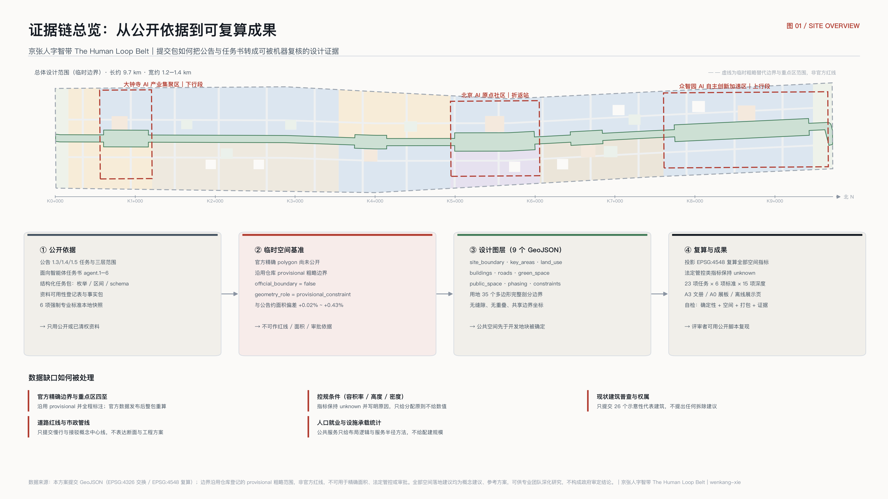
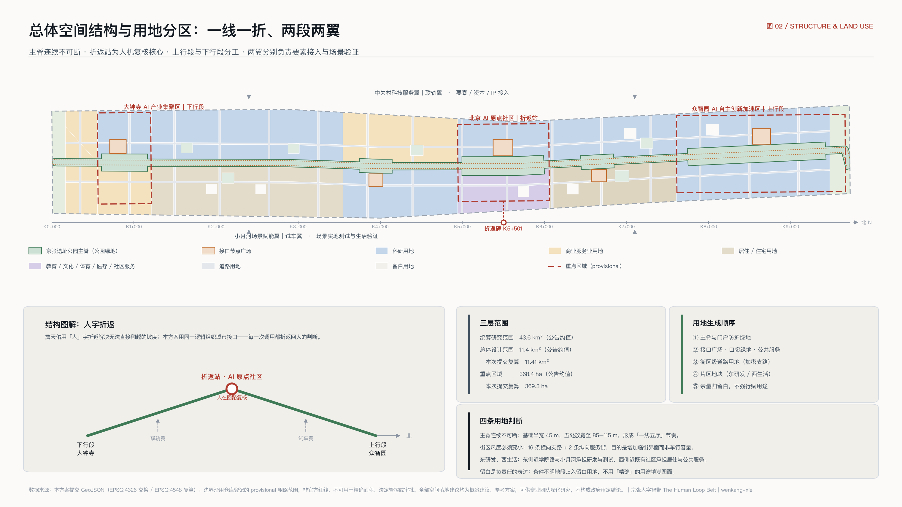
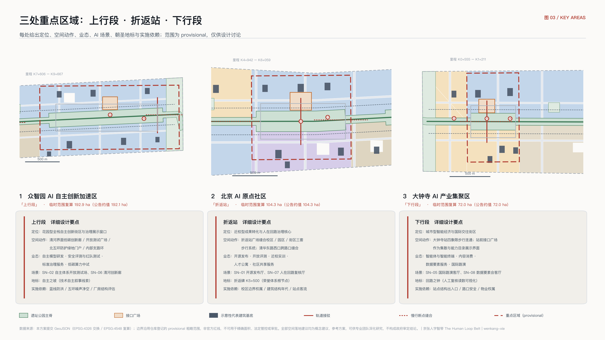
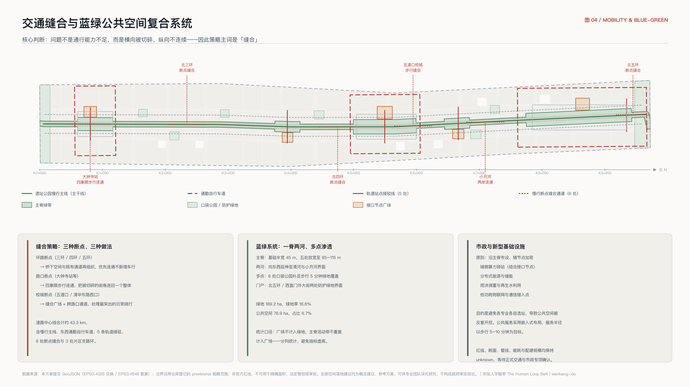
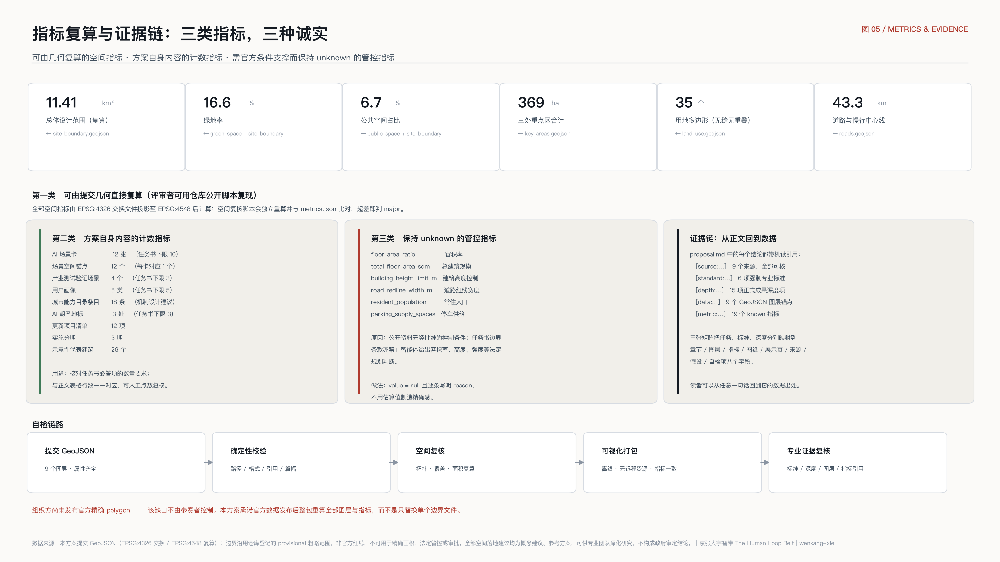

# 京张人字智带：城市即接口的百年京张 AI 创新带城市设计

一百多年前，詹天佑在青龙桥用「人」字形折返解决了一个当时无法直接翻越的坡度问题：列车不是硬冲上去，而是折返一次，换一个方向继续上行。这条中国人自己勘测、自己设计、自己施工的铁路，本质上是一次**自主的接口设计**——它让当时的中国与现代工程体系之间，第一次有了自己写的对接方式。

今天这条走廊要回答的问题结构相同：城市与人工智能之间，接口由谁来写，写成什么样，以及每一次调用之后，判断权回到谁手里。

本方案给出的答案是「**城市即接口**」：不是在城市里再建一批贴着 AI 标签的园区，而是把这条带上的空间、数据、算力、服务和治理流程，整理成一份**可被人与智能体共同调用的公共能力目录**，并用空间把「人在回路」这件事变成看得见、走得进、可追责的城市设施。一带的中文主名为「**京张人字智带**」，英文主名为「**The Human Loop Belt**」，口号是「**每一次调用，都折返回人**」。

## 设计依据与资料清单

本方案的第一依据是北京市规划和自然资源委员会海淀分局发布的资格预审公告 [source:OFFICIAL-ANNOUNCEMENT]，它确定了三层范围的文字四至与约面积、三处重点区的名称与顺序，以及成果须达到控制性详细规划的城市设计深度与规划综合实施方案的城市设计深度 [standard:PROJECT-OFFICIAL-ANNOUNCEMENT]。第二依据是面向智能体的开源征集任务书摘录 [source:AGENT-TASKBOOK]，它给出三大定位、五大功能、三区两翼、十条共创原则与 agent.1 至 agent.6 六项必答任务 [standard:PROJECT-AGENT-OPEN-CALL-TASKBOOK]。结构化任务包 [source:SITE-PACKAGE] 提供坐标策略、可编辑与锁定图层、用地与道路与建筑枚举、指标区间与校验 schema；资料可用性登记表 [source:SOURCE-REGISTRY] 约束哪些材料可以进入正式证据链；事实包 [source:PROCESSED-FACT-PACK] 用作任务与范围的阅读导航层，而不是新的权威来源。

专业标准从本地参考快照读取 [source:STANDARD-REFERENCES]，包括城市设计管理办法 [standard:MOHURD-URBAN-DESIGN-MEASURES]、控制性详细规划技术要求 [standard:MOHURD-CONTROL-DETAILED-PLANNING]、国土空间调查规划用途管制用地分类指南 [standard:MNR-LAND-USE-CLASSIFICATION-GUIDE] 与建筑工程设计文件编制深度规定 [standard:MOHURD-ARCH-DESIGN-DEPTH-2016]。本节对应的成果深度项为现状诊断与资料缺口 [depth:existing_conditions_diagnosis]。

**空间基准的诚实交代。** 公开渠道目前没有可下载、可验证坐标系的本次征集官方精确 polygon。核查说明 [source:PROVISIONAL-BASIS] 记录了推定规则与偏差：临时总体设计范围较公告约面积偏差 +0.11%，三处重点区偏差在 +0.02% 至 +0.43% 之间。因此本方案的 `geometry/site_boundary.geojson` 采用仓库登记的临时边界 [source:BOUNDARY-SOURCE]，`geometry/key_areas.geojson` 采用三处重点区临时范围 [source:KEY-AREA-SOURCE]，两者均设 `official_boundary=false`、`geometry_role=provisional_constraint`、`boundary_precision=provisional_rough`。它们只用于生成、可视化、自检与非法定设计讨论，**不是官方红线，不能用于精确面积、法定管控或审批**，详见 [data:geometry/site_boundary.geojson#SITE-001] 与 [data:geometry/key_areas.geojson#PROV-KEY-002] 的属性字段与 `assumptions.json` 中的 A-BOUNDARY-001。基于该边界复算的规模为 [metric:site_area_sqm]，三处重点区合计为 [metric:key_area_total_area_sqm]，数量为 [metric:key_area_count]。官方 polygon 发布后，本方案承诺整包重算全部图层与指标并提交迭代版本，而不是只替换单个边界文件。

## 三层范围工作框架

公告的三层范围不是三套彼此独立的图纸，而是同一套判断在三个尺度上的展开 [depth:three_level_scope_framework]。统筹研究范围 43.6 平方公里回答「这条带子在全球 AI 产业格局中承担什么角色」；总体设计范围 11.4 平方公里回答「这个角色如何落成城市更新的空间结构、设施承载与风貌控制」；重点区域 368.4 公顷回答「具体片区如何达到可实施的详细设计深度」。三层之间用一条规则串起来：上层只输出**判断与机制**，下层必须能把该判断落到**可复算的图层与指标**上；凡是无法从结构化数据复算的面积、比例、规模或项目数量，一律不写入正式结论。

本方案的总体空间结构可以概括为「**一线一折、两段两翼**」[depth:overall_spatial_structure]：

- **一线**：京张遗址公园慢行主脊，即「主干线」。它是全带唯一连续、南北贯通的公共空间骨架，也是城市能力目录的物理主干。主脊落在 [data:geometry/land_use.geojson#LU-SPINE-001] 与 [data:geometry/public_space.geojson#PUB-SPINE-001]。
- **一折**：北京 AI 原点社区，即「**折返站**」。人字形的折返点被赋予新含义——人与智能体在此交汇、复核、换向再上行，是全带「人在回路」机制的空间原型，对应 [data:geometry/key_areas.geojson#PROV-KEY-002]。
- **两段**：北侧众智园 AI 自主创新加速区为「**上行段**」，承担全栈自主创新体系与 AI 治理话语权；南侧大钟寺 AI 产业集聚区为「**下行段**」，承担智能原生新业态与城市消费界面。
- **两翼**：西侧中关村科技服务翼为「**联轨翼**」，负责要素、资本与中关村 IP 的接入；东侧小月河场景赋能翼为「**试车翼**」，负责场景的实地测试与城市生活验证。

「三区两翼」的官方布局与本方案命名的对应关系见下表，命名只是为了让空间角色更易被记住和传播，不改变官方口径。

| 官方名称 | 本方案副名 | 空间角色 | 主要功能对应 | 证据落点 |
| --- | --- | --- | --- | --- |
| 众智园 AI 自主创新加速区 | 上行段 | 全带北端的技术纵深与治理展示 | AI 全栈自主创新体系、AI 治理全球话语权 | [data:geometry/key_areas.geojson#PROV-KEY-001] |
| 北京 AI 原点社区 | 折返站 | 全带中枢与人机复核核心 | 世界级 AI 创新生态 | [data:geometry/key_areas.geojson#PROV-KEY-002] |
| 大钟寺 AI 产业集聚区 | 下行段 | 全带南端的城市界面与消费转化 | 智能原生新业态 | [data:geometry/key_areas.geojson#PROV-KEY-003] |
| 中关村科技服务翼 | 联轨翼 | 要素与资本的接入侧 | 要素全球化配置、中关村 IP 与资本赋能 | [data:geometry/constraints.geojson#AIZ-002] |
| 小月河场景赋能翼 | 试车翼 | 场景落地与生活验证侧 | AI+ 场景赋能、智能化 AI 活力城市 | [data:geometry/constraints.geojson#AIZ-003] |

### 命名体系与视觉识别（Logo 方向）

任务书要求的不是一个名字，而是一套**可延展的命名体系** [standard:PROJECT-AGENT-OPEN-CALL-TASKBOOK]。本方案提出四级命名，核心是把铁路的**里程制**借来当作城市的编号语言——它天然可扩展、中英并置、人与智能体都能稳定引用：

| 层级 | 名称与规则 | 说明 |
| --- | --- | --- |
| L0　一带主名 | 京张人字智带 / The Human Loop Belt | 口号「每一次调用，都折返回人 / Every call returns to a human」 |
| L1　三区两翼副名 | 上行段 / 折返站 / 下行段 / 联轨翼 / 试车翼 | 沿用官方名称，副名只增加易记的空间角色，不改变官方口径 |
| L2　节点命名 | 「K 值 + 功能名」，如 K5+500 折返碑、K1+000 站前接口广场 | 自南端西直门外大街界面 K0+000 起算、向北递增 |
| L3　场景与项目编号 | 场景卡 SN-01…SN-12、更新项目 JZ-01…JZ-12 | 编号即索引，与 GeoJSON 锚点和清单逐条对应，见 [data:geometry/constraints.geojson#SN-04] |

**Logo 与视觉识别方向**：字形取「人」字的一撇一捺——一撇是人，一捺是智，两笔交于折返点；叠加里程标的 K 字，形成可无限延展的编号族。要求单色、无渐变、可刻可焊可铸，因为这套标识最终要落到里程标、折返碑与荣誉墙上，而不只是印在册子上。色彩系统以中性灰为底，只保留一个警示色用于标注「需人工复核」的界面，让治理状态在城市里可被一眼识别。字体方向为中英并置、等宽数字，保证 K 值在导视上快速识读。所有标识、字体、图像均须清权，本方案不使用未经授权的字体文件、商标、肖像或论文图像。

## 统筹研究范围产业与未来城市研究

### 城市接口栈：本方案的核心机制

统筹研究范围的核心不是再画一张产业分布图，而是回答一个 AI 原生的问题：**当城市的使用者中出现了大量智能体，城市应该以什么形式被使用？** 本方案提出「城市接口栈」（Urban Interface Stack）四层模型，作为一带的统筹方法 [standard:PROJECT-AGENT-OPEN-CALL-TASKBOOK]：

| 层 | 名称 | 内容 | 空间载体 | 治理边界 |
| --- | --- | --- | --- | --- |
| L1 | 感知层 | 最小必要、可解释、可关停的公共空间感知 | 主脊导视杆、路口缝合节点 | 只做聚合统计，不建个人画像 |
| L2 | 能力目录 | 城市可被调用能力的公开清单，每条含责任方、授权范围、服务水平与复核点 | 五处接口节点广场 | 目录条目须由主管单位逐条确认 |
| L3 | 场景开放协议 | 申请—准入—测试—评估—退出的标准流程 | 折返站、开放测试场 | 有准入必须有退出与回滚 |
| L4 | 人在回路 | 每一次面向公众的调用都有人工复核与申诉入口 | 人在回路复核厅 | 无法人工复核的场景不予成立 |

这套模型的价值在于**可实施**：它不要求先建成什么，而是先把城市既有的、分散在各部门与运营主体手里的能力，整理成一份可以逐条确认、逐条开放、逐条退出的清单。本方案建议的目录规模为 [metric:capability_catalog_entry_count] 条，覆盖空间、数据、算力、服务、治理、传播六个域，详见后文。需要明确的是，该目录是**机制设计建议**，不是已存在的政府清单，任何条目的可开放性均须由相应主管单位确认（`assumptions.json` A-CATALOG-004）。

### 全球 AI 与创新生态案例借鉴

以下七个案例均基于公开可核信息，本方案只提炼其**机制**，不引用未经核实的投资额、产值或企业名单：

| 案例 | 地区 | 可借鉴机制 | 对本带的启示 |
| --- | --- | --- | --- |
| King's Cross Knowledge Quarter | 英国伦敦 | 铁路货运棕地整体更新，图书馆、研究机构与企业总部沿一条公共开放轴线共生 | 与京张遗址公园同构：铁路遗产不是障碍，是唯一能贯通全带的公共骨架 |
| Station F | 法国巴黎 | 铁路货站改造为单体超大创业设施，以「一个屋顶下的完整链条」降低创业摩擦 | 支持在折返站集中布置发布、孵化、法务与投融资服务，减少跨片区奔波 |
| one-north | 新加坡 | 政府主导科研城，并划定公共道路作为自动驾驶等技术的实地测试区 | 支持设立试车翼，把测试从封闭场地搬进真实城市街道 |
| MaRS Discovery District | 加拿大多伦多 | 紧邻大学与医院，底层空间对公众开放，创新过程可被日常看见 | 支持近校成果转化街与首层公共化，避免创新区变成封闭园区 |
| Maria 01 | 芬兰赫尔辛基 | 老医院建筑群改造，城市持股参与长期运营而非一次性出让 | 支持存量建筑「改造优先」与城市参与长期运营的模式 |
| Stanford Research Park | 美国帕洛阿尔托 | 大学与产业长期毗邻，人才在两侧自由流动 | 支持 AI 原点社区的近校定位与校城边界的慢行缝合 |
| 张江人工智能岛 | 中国上海 | 在有限街区内集中开放城市级应用场景，形成可参观的场景密度 | 支持以场景卡与场景节点组织空间，而不是以楼宇招商组织空间 |

七个案例中有两个直接来自铁路设施更新，这不是巧合：铁路走廊天然具备**线性、连续、跨越行政边界**三个特性，正是公共基础设施最稀缺的品质。京张遗址公园的价值应当被理解为一条已经存在的、11.4 平方公里尺度上唯一连续的公共空间干线 [standard:MOHURD-URBAN-DESIGN-MEASURES]，而不只是一段景观。全带的用地结构因此以主脊为轴组织 [data:geometry/land_use.geojson#LU-D-B5E]，共 [metric:land_use_feature_count] 个用地多边形完整覆盖提交边界。

### 区域协同

一带向北经上行段与清河方向联系未来科学城、怀柔科学城的科研纵深；向西经联轨翼接入中关村核心区的资本、法务、知识产权与国际化服务；向南经下行段与西直门交通枢纽联系中心城与经开区的制造与应用侧；向东经试车翼与学院路高校群、北纬社区形成人才与场景的日常互动。协同的抓手不是行政协调会，而是**同一份能力目录的跨区互认**：一个在本带完成场景准入与评估的团队，其记录应能被其他创新区直接读取复用，减少重复审查成本。这属于机制建议，需由相关主体协商确认。

## 总体设计范围城市更新与控规深度城市设计

总体设计范围要求达到控制性详细规划的城市设计深度 [standard:MOHURD-CONTROL-DETAILED-PLANNING]，本方案据此把判断落到可审查的对象上 [depth:land_use_layout]。用地图层由提交边界按有序 claim 栈剖分生成：先锁定主脊与门户防护绿地，再切出接口节点广场与口袋绿地、公共服务地块，随后铺设街区级道路用地，最后填入片区地块，余量归为留白用地。这一顺序保证了**公共空间优先于开发地块被确定**，而不是把绿地和广场当作地块划分后的剩余物。

用地结构的主要判断有四条：

1. **主脊连续不可断。** 京张遗址公园主脊按基础半宽 45 米组织，在大钟寺、知春路、折返站、清华东路西口、众智园五处放宽至 85–115 米，形成「一线五厅」的节奏 [data:geometry/green_space.geojson#GRN-SPINE-001]。全带绿地规模为 [metric:green_space_area_sqm]，绿地率为 [metric:green_ratio]。
2. **街区尺度必须变小。** 沿带布置 16 条横向支路与两条纵向服务性街道，构成 [data:geometry/land_use.geojson#LU-ROAD-001] 的街道用地。加密支路的目的不是增加车行容量，而是缩小街区、增加临街界面、让首层公共化在经济上成立。
3. **科研用地沿东侧成带、居住与服务沿西侧成带。** 东侧靠近学院路与小月河，承担研发与场景测试；西侧靠近既有社区，承担居住、社区服务与医疗教育配套，避免把生活性功能挤到边缘 [standard:MNR-LAND-USE-CLASSIFICATION-GUIDE]。
4. **留白是负责任的表达。** 边角与条件不明地段归入留白用地 [data:geometry/land_use.geojson#LU-RESERVE-001]，在缺少控规、权属与市政资料时，不用「精确」的用途填满图面。

**开发强度的处理方式**须特别说明 [depth:development_intensity_controls]。任务书边界条款明确禁止智能体给出容积率、建筑高度、建筑强度等法定规划判断，公开资料中也没有经批准的控制条件。因此本方案不给出任何强度数值：`metrics.json` 中的容积率、总建筑规模与建筑高度上限三项均标记为待正式数据补齐并写明原因（`assumptions.json` A-CONTROLS-006）。本方案提出的是**强度分配的原则**：主脊两侧 100 米范围内以低层高密度、连续界面、首层公共化为导向；站点周边与三处重点区核心允许相对集中；居住片区维持既有肌理。这些原则可供专业团队在取得正式控规条件后转化为具体指标。

## 重点区域详细设计

三处重点区必须达到规划综合实施方案的城市设计深度 [depth:three_key_area_detailed_design]。本方案对每处给出定位、空间动作、AI 场景与实施依赖四项内容，全部表述为概念建议与参考方案。

### 众智园 AI 自主创新加速区（上行段）

定位为**花园型全栈自主创新街区与治理展示窗口**。空间动作：沿清河界面组织低碳创新廊，把河道景观、雨洪、慢行与户外展示叠合；在片区中部设开放测试广场 [data:geometry/public_space.geojson#PUB-005]，作为具身智能与公共空间交互的实地测试场；北五环侧设防护绿地带 [data:geometry/land_use.geojson#LU-BUF-N01] 兼作北门户识别界面；片区内以支路环组织内部交通并与北门户接驳设施衔接。功能业态覆盖自主模型研发、安全评测与红队测试、标准制定与治理服务、低碳算力与中试。建筑层面提出全栈自主创新研发主楼、安全治理实验楼、文化展示馆、标准治理服务楼、低碳算力中试楼、现状厂房保留改造与北门户接驳设施等代表对象 [data:geometry/buildings.geojson#BLDG-ZZY-01]。实施依赖：清河蓝线与防洪条件、五环噪声与净空条件、既有厂房权属与结构评估。

### 北京 AI 原点社区（折返站）

定位为**近校型成果转化与人在回路治理核心**。这是全带唯一被赋予「制度原型」职责的片区。空间动作：以折返站广场 [data:geometry/public_space.geojson#PUB-003] 为中心，缝合校区、园区与街区三套割裂的步行系统；广场周边集中布置开源发布厅、人在回路复核厅、开放评测实验楼、近校成果转化实训楼、青年人才公寓与社区共享服务用房；清华东路西口设缝合广场与跨路口步行通道，处理校城交界处最突出的慢行断点。人在回路复核厅是本方案的关键设施：它不是办公楼，而是**一个可预约旁听的公共房间**，公众可以看到城市 AI 服务的复核记录（聚合、脱敏）、提出申诉、参与评议。实施依赖：校区边界与权属、既有建筑结构年代、五道口站点客流组织。

### 大钟寺 AI 产业集聚区（下行段）

定位为**城市型智能经济与国际交往街区**。空间动作：围绕大钟寺站组织四象限步行连通 [data:geometry/roads.geojson#ROAD-PED-01]，把被路口切碎的四个街角重新连成一个可步行整体；站前设接口广场 [data:geometry/public_space.geojson#PUB-001] 作为地面集散与能力目录展示界面；东侧组织智能原生业态研发用地，西侧更新既有商业裙房形成智能终端与内容消费界面；北侧口袋公园补足绿地覆盖。功能业态覆盖智能体与智能终端产品、内容消费、数据要素服务、国际路演与商务接待。实施依赖：轨道站点结构与出入口条件、路口交通组织与安全评估、既有商业物业权属与运营意愿。

## AI 创新生态、人才画像与 AI+ 场景

### 城市能力目录（18 条建议条目）

能力目录是城市接口栈的 L2 层，也是本方案最具可实施性的产物。下表列出六个域各三条代表性条目；完整 18 条按同一模板编制，每条包含责任方建议、授权范围、服务水平建议、人工复核点与退出机制五个字段。

| 域 | 代表条目 | 责任方建议 | 人工复核点 | 退出机制 |
| --- | --- | --- | --- | --- |
| 空间 | 公共空间临时占用申请、开放时段与容量查询、测试场地预约 | 属地城市管理与运营主体 | 活动安全与扰民评估 | 超阈值自动暂停并转人工 |
| 数据 | 公开城市数据集目录、聚合慢行与客流统计、规划公示文件检索 | 数据主管部门 | 聚合口径与最小必要审核 | 争议条目下架复审 |
| 算力 | 端侧算力驿站接入、公共算力配额申请、低碳时段调度 | 算力设施运营主体 | 用途合规与能耗核验 | 配额到期自动回收 |
| 服务 | 企业服务事项导航、人才服务事项导航、社区生活服务导航 | 政务服务与街道 | 答复准确性抽检 | 错误答复留痕并纠正 |
| 治理 | 场景准入申请、人工复核与申诉、退出与回滚 | 场景开放协调主体 | 全流程强制人工签署 | 一键回滚至上一状态 |
| 传播 | 活动场地与许可、导视与展陈位申请、荣誉铸刻申请 | 运营与传播主体 | 内容与版权清权 | 到期归还与撤展 |

### 六类用户画像

用户画像数量为 [metric:user_persona_count]，覆盖开发者、创业者、企业、师生、居民与访客六类。

| 画像 | 核心诉求 | 空间响应 | 数据与隐私边界 |
| --- | --- | --- | --- |
| 开源开发者 | 发布、协作、评测、社区声誉 | 折返站开源发布厅、公共代码墙、夜间协作空间 | 只记录自愿提交的贡献，不采集个人移动轨迹 |
| 初创团队负责人 | 低成本空间、算力入口、真实试验场 | 端侧算力驿站、开放测试场、场景准入一站式受理 | 算力与数据服务须单独授权，默认不留存业务数据 |
| 头部企业国际业务负责人 | 展示、洽谈、国际接待、招聘 | 大钟寺国际路演客厅、站前接口广场、轨道接驳 | 企业标识与案例须清权后使用 |
| 高校师生 | 成果转化、跨校协作、日常通行 | 近校成果转化街、校城慢行缝合、实训与教育体验点 | 校园与科研数据须授权，不接入个人学业信息 |
| 周边长住居民（含老年与行动不便者） | 通勤、休闲、社区服务、低扰动更新 | 主脊慢行环、社区服务与医疗嵌入、照明与活动分级 | 不将居民画像用于商业推荐，无障碍需求由本人申报 |
| 到访者与国际开发者 | 快速理解、可参与、可带走 | 南北门户接口客厅、里程标导视、朝圣地标路线 | 导览不做人脸识别，位置信息仅本地处理 |

### AI 场景卡（12 张）

场景卡数量为 [metric:ai_scenario_card_count]，每张卡对应 `geometry/constraints.geojson` 中一个空间锚点，锚点总数为 [metric:scenario_node_count]，见 [data:geometry/constraints.geojson#SN-01]。所有场景遵守数据最小化、只用公开或已授权数据、保留人工复核三条前提（`assumptions.json` A-PRIVACY-008）。

| 编号 | 场景卡 | 空间载体 | 服务对象 | 数据与最小必要范围 | 人工复核节点 |
| --- | --- | --- | --- | --- | --- |
| SN-01 | 开源发布厅 | AI 原点社区 | 开发者、高校、初创团队 | 自愿提交的项目元数据 | 发布内容与版权人工审核 |
| SN-02 | 自主体系开放测试场 | 众智园 | 企业、研究机构 | 测试申请与评估记录 | 每批次测试准入与终止签署 |
| SN-03 | 端侧算力驿站 | 知春路节点 | 初创团队、开发者 | 配额申请与能耗读数 | 用途合规核验 |
| SN-04 | 遗址公园可解释慢行导航 | 主脊全线 | 全体使用者 | 聚合通行量与断点上报 | 断点判定与整改排序人工确认 |
| SN-05 | 大钟寺国际路演客厅 | 大钟寺 | 企业、投资人、访客 | 活动报名与场地排期 | 内容与嘉宾资质审核 |
| SN-06 | 清河界面低碳创新廊 | 众智园北 | 居民、企业、访客 | 公开水文与气象数据 | 生态与防洪条件专业复核 |
| SN-07 | 人在回路复核厅 | AI 原点社区 | 公众、监管、运营方 | 聚合脱敏的复核台账 | 全流程强制人工签署与申诉受理 |
| SN-08 | 数据要素会客厅 | 大钟寺 | 企业、数据服务商 | 已授权数据的流通记录 | 授权链与合规逐笔核验 |
| SN-09 | 社区 AI 生活服务样板站 | 北太平庄 | 居民、老年人 | 本人申报的服务需求 | 服务答复抽检与纠错 |
| SN-10 | 小月河低速配送与巡检试验带 | 试车翼 | 居民、企业、运营方 | 车辆运行与避障日志 | 事件回放与人工接管 |
| SN-11 | 清华东路西口无障碍缝合节点 | 校城交界 | 行动不便者、师生 | 无障碍设施状态上报 | 路口安全评估人工签署 |
| SN-12 | 南门户 AI 文化导览客厅 | 西直门外 | 访客、市民 | 公开文化资料与展陈信息 | 史实与版权人工校核 |

### AI 产业测试验证场景（4 个）

测试验证场景数量为 [metric:industry_test_scenario_count]。四个场景共用同一套场景开放协议：申请 → 准入评估 → 限定时空测试 → 公开评估报告 → 转常态或退出。

| 编号 | 测试场景 | 载体 | 测试内容 | 退出条件 |
| --- | --- | --- | --- | --- |
| T1 | 低速无人配送与巡检测试环 | 试车翼与主脊支线 | 真实街道条件下的低速通行、避障与人机共处 | 出现安全事件即暂停并回滚 |
| T2 | 具身智能公共空间交互测试场 | 众智园开放测试广场 | 机器人与公众在开放空间的交互边界 | 公众投诉超阈值即终止 |
| T3 | 城市能力目录接口沙盒 | 折返站 | 目录条目的调用、限流、审计与回滚 | 越权调用即吊销凭证 |
| T4 | 边缘算力与低碳能耗联合测试 | 清河界面与端侧驿站 | 端侧推理负载与能耗、噪声、散热的城市影响 | 能耗或噪声超限即降载 |

场景与空间、运营的映射关系统一记录在 `compliance_matrix.json` 的 agent.3 条目中；公共空间类场景的空间证据为 [data:geometry/public_space.geojson#PUB-003]，公共空间规模为 [metric:public_space_area_sqm]、比例为 [metric:public_space_ratio]。

## 用地、建筑规模与拆改留方案

用地分类依据国土空间用途管制分类指南 [standard:MNR-LAND-USE-CLASSIFICATION-GUIDE]，全带用地由 [metric:land_use_feature_count] 个多边形完整覆盖提交边界、相互无重叠、相邻多边形共享边界坐标，主要包括科研用地、商业服务业用地、居住与城镇住宅用地、教育用地、文化用地、体育用地、医疗卫生用地、社区服务设施用地、公园绿地、防护绿地、广场用地、道路用地与留白用地。

**建筑层面必须先说清楚证据等级** [depth:height_massing_character]。本方案提交 [metric:representative_building_count] 个示意性代表建筑基底，合计基底面积 [metric:building_footprint_area_sqm]，见 [data:geometry/buildings.geojson#BLDG-ORG-03]。它们**不是建筑普查**，不表达权属边界，也不能用于推算总建筑规模、容积率或建筑密度（`assumptions.json` A-BUILDING-002）。代表建筑的作用是让更新逻辑可被看见：哪些对象建议保留、哪些建议改造、哪些建议新建。

拆改留采用**四分类而非三分类** [depth:retain_renovate_demolish]：保留（retain）、改造（renovate）、新建（new_build）、**待确认（pending）**。第四类是本方案刻意保留的类别——在缺少现状建筑普查、结构年代、权属与控规条件的情况下，把任何一栋具体建筑判定为「拆」都是不负责任的。因此本方案**不提出任何拆除建议**，只提出保留与改造优先的原则：优先保留有结构价值与记忆价值的厂房与铁路附属设施；优先以改造方式实现功能置换；新建集中在已明确为更新对象的地块与门户节点。建筑高度、体量、界面与屋顶形态的控制建议依据建筑工程设计文件深度规定 [standard:MOHURD-ARCH-DESIGN-DEPTH-2016] 的表达要求组织，但在取得官方控制条件前只给原则不给数值。

## 交通、轨道、市政与公共服务设施

交通方案的第一判断是：**这条带子的交通问题不是通行能力不足，而是横向被切碎、纵向不连续** [depth:traffic_rail_slow_parking]。北三环、北四环、北五环与几条主干路把 9.7 公里的走廊切成若干互不连通的片段，慢行者在路口层面被反复中断。因此交通策略以「缝合」为主词，道路图层提交慢行主线、东西两侧通勤自行车道、五条轨道接驳连接线、六处慢行断点缝合通道与三处片区支路环，中心线总长为 [metric:road_network_length_m]，见 [data:geometry/roads.geojson#ROAD-TRUNK-01]。

轨道一体化的重点是大钟寺站四象限步行连通、知春路站接驳、五道口站接驳、清华东路西口缝合与北门户共享出行接驳五处。需要强调：这些线仅为**概念中心线建议**，不表达道路红线、线形、断面、桥隧或市政管线方案；`metrics.json` 中的道路红线宽度与停车供给两项标记为待正式数据补齐（`assumptions.json` A-TRAFFIC-003）。停车与非机动车停放的策略是把供给集中到站点与门户节点、把主脊内部还给步行，具体规模待正式交通调查确认。

市政与新型基础设施方面 [depth:municipal_new_infrastructure]，本方案提出「**沿主脊布设、随节点加密**」的原则：端侧算力驿站、分布式能源与储能、雨洪调蓄与再生水利用、5G/6G 与低功耗物联网接入点，均结合主脊与五处接口节点布置，避免各专业各自选址造成公共空间被反复开挖。公共服务设施采用嵌入式布局：社区服务与 AI 生活服务站、社区医疗与健康导航点、人才社区综合服务中心、体育与运动科技场地、近校实训与教育体验点分布于西侧生活带与东侧研发带的交界处，服务半径以步行 5–10 分钟为目标。人口、就业与设施承载统计缺失，因此不给出配建规模数字（`assumptions.json` A-SERVICE-007）。

## 蓝绿空间、公共空间与城市风貌

蓝绿系统以京张遗址公园主脊为骨架，向东西两侧延伸至清河与小月河，形成「一脊两河、多点渗透」的结构 [depth:blue_green_public_space]。绿地由主脊连续绿带、南北门户防护绿地与六处口袋公园组成，规模为 [metric:green_space_area_sqm]、绿地率 [metric:green_ratio]，见 [data:geometry/green_space.geojson#GRN-P-004]。公共空间由五处接口节点广场与主脊内的连续公共活动带组成，规模 [metric:public_space_area_sqm]、比例 [metric:public_space_ratio]。绿地与公共空间在统计上分列、在空间上叠合：广场不计入绿地，活动带不重复计入广场，避免指标虚高。

### AI 公共空间与朝圣地标

任务书要求提出不少于三处 AI 朝圣地标与荣誉展示体系。本方案提出的地标数量为 [metric:pilgrimage_landmark_count]，且刻意**不做网红化装置**，而是让地标承担真实的城市功能：

1. **折返碑**（AI 原点社区，主脊里程约 K5+500）。贡献者荣誉体系的根节点，位于人字折返点上。碑体为可增长结构，每年新增一段刻面，与沿线里程标构成同一套编号系统。
2. **自主之坡**（众智园）。一段可步行的坡道装置，坡度取自人字形铁路的爬坡意象，沿坡记录从「中国人自己设计的第一条铁路」到「AI 全栈自主」的技术自主叙事线索。坡顶即开放测试广场入口。
3. **回路之钟**（大钟寺）。取大钟寺之「钟」与「回路」的双关。装置以聚合、匿名的方式呈现本带公共 AI 服务当期的人工复核次数与申诉处理情况——把「人在回路」从制度承诺变成每天可见的公共读数。

**荣誉展示体系**采用里程标制：沿主脊每 200 米设一根里程标（自南端西直门外大街界面 K0+000 起算、向北递增），标面刻录该段落成项目的方案名、Agent 名与贡献者 GitHub 名。里程标与折返碑共同构成一套**可持续增长、可被后续贡献者继续写入**的纪念系统，而不是一次性的荣誉墙。公共空间组件库同步给出六类标准件：里程标、导视杆、可拆卸展陈台、坐憩单元、遮阳与照明单元、临时测试围合单元，统一材料与接口，便于分期建设与活动期快速布置。

### 文化叙事：自主的接口

任务书要求把百年京张文化、中关村创新文化与 AI 新文化融合为一条叙事 [source:AGENT-TASKBOOK]。本方案的主线不是「铁路 + AI」的并置，而是**同一件事的两次发生**：一百多年前，詹天佑用人字折返给出了一个自主的工程解法——在无法直接翻越的坡度前，不硬冲，而是折返一次换向再上行；今天这条带子要给出的是一个自主的治理解法——在无法直接交给机器判断的地方，不硬推，而是折返回人的复核再继续。京张铁路遗存、清华园火车站等文化资源因此不被当作装饰性背景，而是叙事的第一现场：遗存以原状保留与最小干预为主，沿主脊设置的里程标与解说不讲技术参数，讲「这一段当年解决了什么问题、今天这一段又在解决什么问题」。

中关村创新文化以**近校转化与开源协作**表达：折返站的开源发布厅、公共代码墙与近校成果转化街，让创新过程发生在街道层面而不是封闭园区里。AI 新文化以**人在回路的公共可见性**表达：回路之钟把当期人工复核次数与申诉处理情况做成每天可见的公共读数——这是本方案认为最值得对外传播的城市气质，也是国际传播叙事的核心句：「The Human Loop Belt — where a city becomes an interface, and every call returns to a human.」历史表述以公开史实为限，不歪曲、不神化，也不把文化只当作科技的装饰；文化标识系统与一带整体 Logo 系统分开管理，避免混淆。相关空间载体见 [data:geometry/public_space.geojson#PUB-002]。

### 城市风貌

风貌以「**工业遗产的克制 + 创新文化的透明**」为基调 [standard:MOHURD-URBAN-DESIGN-MEASURES]。铁路遗存以原状保留与最小干预为主；沿主脊界面强调首层公共化与视线通透，让实验室、发布厅、测试场的活动可以被路过的人看见；建筑色彩以中性灰与自然材料为主，把色彩留给导视与活动。导视系统以里程制为逻辑，全带统一使用「K 值 + 功能名」的命名规则，中英文并置，天然具备国际可读性与无限可扩展性。所有风貌建议均为设计导向，不构成文保或控规控制线。

## 更新项目清单、实施政策与分期计划

更新项目清单共 [metric:renewal_project_count] 项 [depth:renewal_project_list]，均为实施路径建议，不代表已确定的立项、资金、权属处置或建设时序（`assumptions.json` A-IMPLEMENT-005）。

| 编号 | 项目 | 类型 | 主要依赖 | 阶段 |
| --- | --- | --- | --- | --- |
| JZ-01 | 折返站广场与人在回路复核厅 | 公共空间/治理设施 | 校区边界、权属、运营主体 | 一期 |
| JZ-02 | 开源发布厅与近校成果转化街 | 产业服务/城市更新 | 既有建筑结构评估、首层业态 | 一期 |
| JZ-03 | 城市能力目录 1.0 编制与接口沙盒 | 机制/新基建 | 各主管单位逐条确认 | 一期 |
| JZ-04 | 主脊慢行断点缝合（北三环、北四环段） | 交通/公共空间 | 道路红线、桥下空间、交通组织 | 一期 |
| JZ-05 | 众智园开放测试广场与测试协议 | 产业测试/公共空间 | 安全评估、场地权属 | 二期 |
| JZ-06 | 清河界面低碳创新廊 | 蓝绿空间/产业展示 | 河道蓝线、生态与防洪条件 | 二期 |
| JZ-07 | 众智园存量厂房保留改造 | 城市更新 | 结构评估、权属与产业导入 | 二期 |
| JZ-08 | 端侧算力驿站与分布式能源节点 | 新基建/公共服务 | 能源、算力、安全与运营主体 | 二期 |
| JZ-09 | 大钟寺站四象限步行连通 | 轨道一体化/慢行 | 轨道站点、交叉口、市政管线 | 三期 |
| JZ-10 | 大钟寺商业裙房更新与数据要素会客厅 | 城市更新/产业服务 | 物业权属与运营意愿 | 三期 |
| JZ-11 | 里程标与荣誉铸刻体系 | 公共艺术/运营 | 公共空间许可、版权清权 | 分期滚动 |
| JZ-12 | 年度活动体系与开发者社区运营 | 运营/品牌 | 活动安全、场地许可、传播清权 | 分期滚动 |

分期共 [metric:phase_count] 期 [depth:phasing_implementation]，空间范围见 [data:geometry/phasing.geojson#PHASE-001]。一期落在 AI 原点社区，理由是它**验证机制的成本最低**：折返站的核心产出是制度原型与运营流程，可以先用轻量设施、既有建筑改造和公共活动启动，不必等待大规模建设。二期转入众智园，配合产业空间供给推进开放测试场与低碳算力设施。三期转入大钟寺，依托轨道一体化推进城市界面更新。

**政策与运营建议**：一是把场景开放协议做成有版本号的公开文件，每年发布一次修订，接受公众意见；二是能力目录采用软件发布节奏，年度发布主版本、季度发布增量，让企业与开发者能够预期；三是建立**跨区互认**机制，本带完成的场景评估记录可被其他创新区读取复用；四是公共空间的运营权与荣誉铸刻权分离，避免商业赞助侵占公共纪念系统。年度活动体系设四场：春季「折返日」聚焦人在回路治理，夏季「开放测试周」发布年度场景批次，秋季「里程周」举行年度铸刻与开发者大会，冬季「目录发布」公布能力目录新版本。开发者社区运营以真实贡献为准入——参与场景测试、提交断点上报、完成评估报告者进入贡献者名录，名录与里程标铸刻直接挂钩。以上均为运营机制建议，效果与安排须由相关主体最终确定。

## 指标体系、面积复算与合规矩阵

指标体系分三类，分类本身就是一种诚实性声明 [depth:metrics_recalculation]。**第一类是可由提交几何直接复算的空间指标**，共十三项，包括总用地规模 [metric:site_area_sqm]、绿地率、公共空间比例、代表建筑基底面积与道路中心线总长等；它们全部由提交的 GeoJSON 投影至 EPSG:4548 后复算，评审者可以用仓库的公开脚本独立重算并与本方案对账。**第二类是方案自身内容的计数指标**，共六项，例如场景卡数量 [metric:ai_scenario_card_count] 与能力目录条目数 [metric:capability_catalog_entry_count]，用于核对任务书必答项的数量要求。**第三类是需要官方控规或运营数据支撑的指标**，包括容积率、总建筑规模、建筑高度、道路红线、常住人口与停车供给，全部标记为待正式数据补齐并逐条写明原因，不用估算值制造精确感。三类指标的完整清单、口径、公式、来源文件与置信度记录在 `metrics.json` 中，本节不重复罗列。

合规矩阵是任务响应性的主控文件：公告 1.3、1.4、1.5 共 17 项任务与 agent.1 至 agent.6 共 6 项智能体任务，逐条映射到报告章节、GeoJSON 图层、指标、图纸、展示页面章节、来源、假设与自检项。用地与建筑的证据链见 [data:geometry/land_use.geojson#LU-SPINE-001] 与 [data:geometry/buildings.geojson#BLDG-ZZY-01]，既有条件与场景锚点见 [data:geometry/constraints.geojson#EXR-001]。空间复核、可视化打包检查与专业证据复核的结果记录在 `self_check.json` 中。

## 风险、版权与合规说明

**资料与数据风险** [depth:risk_missing_data]。最大缺口是官方精确边界与三处重点区四至缺失，其次是控规条件、现状建筑普查、权属、道路红线、市政管线、文保区划与人口就业统计。这些缺口已逐项写入 `assumptions.json`（A-BOUNDARY-001、A-BUILDING-002、A-TRAFFIC-003、A-CONTROLS-006、A-SERVICE-007），并在正文中标明受影响的结论范围。本方案的处理原则是：缺资料时给方法与待校准清单，不给数值结论。

**隐私与治理风险**。所有感知与场景建议以数据最小化、只用公开或已授权数据、保留人工复核为前提（A-PRIVACY-008）。本方案不提出个人画像、人脸识别、无复核自动处置或依赖未经授权数据的场景；任何无法满足人工复核条件的场景，在本方案中不成立。

**实施与政策风险**。能力目录、场景开放协议、跨区互认、年度活动与荣誉铸刻均为机制建议，涉及多部门与多运营主体，存在协调周期长、责任划分不清的风险。缓解方式是把一期限定在验证成本最低的折返站，用可退出的小规模试点换取制度经验。

**版权与法律边界**。提交包内全部图纸、图示、页面与文本均由本方案生成，未使用第三方字体文件、图片、商标、肖像、论文图像或商用地图瓦片，详见 `report/copyright_statement.md`。文中引用的国际案例仅描述公开可核的机制特征，不使用其标识、图像或未经核实的经营数据。

**声明**。本方案不声称获得任何官方审定、审批、背书或实施承诺；不构成法定规划、控规调整、土地权属、投资测算或工程可行性结论。全部空间落地建议均为概念建议、参考方案或可供专业团队深化研究的材料。维护者与专业评审可依据自检结果、空间复核与合规矩阵要求返修或退件。

## 参考资料

完整的证据索引保存在为此设计的结构化文件里，不在本节重复：来源、权利与可用范围见 `sources.json`，指标口径与公式见 `metrics.json`，公告与智能体任务的逐条覆盖见任务覆盖矩阵 `compliance_matrix.json`，专业标准与成果深度分别见 `standard_matrix.json` 与 `design_depth_matrix.json`，数据缺口与复算触发条件见 `assumptions.json`。以下只列出正文判断最直接依赖的几项。

- **公告与任务书**是全部任务响应的第一依据，确定了三层范围、三区两翼与六项智能体必答任务 [source:OFFICIAL-ANNOUNCEMENT] [source:AGENT-TASKBOOK]。
- **专业标准**取自仓库的本地参考快照 [source:STANDARD-REFERENCES]，其中城市设计管理办法与控制性详细规划技术要求共同决定了本方案的成果深度口径 [standard:MOHURD-URBAN-DESIGN-MEASURES] [standard:MOHURD-CONTROL-DETAILED-PLANNING]。
- **空间基准**是仓库登记的临时总体设计范围与三处重点区临时范围，推定规则、偏差与精度限制见核查说明 [source:BOUNDARY-SOURCE] [source:PROVISIONAL-BASIS]。
- **提交图层**以用地剖分为主控，绿地、公共空间、建筑、道路、分期与场景锚点均由同一条临时边界 [source:KEY-AREA-SOURCE] 派生，保证复算口径一致 [data:geometry/land_use.geojson#LU-SPINE-001]。
- **生成方法披露**：坐标策略与图层枚举依据结构化任务包 [source:SITE-PACKAGE]；设计图层由本方案编写的 Python 脚本在 EPSG:4548 中剖分提交边界后导出为 EPSG:4326 GeoJSON；图纸与图示由 matplotlib 从同一批结构化数据生成；页面为离线静态 HTML。详见 `agent.json` 的 `generation_disclosure_zh`。
