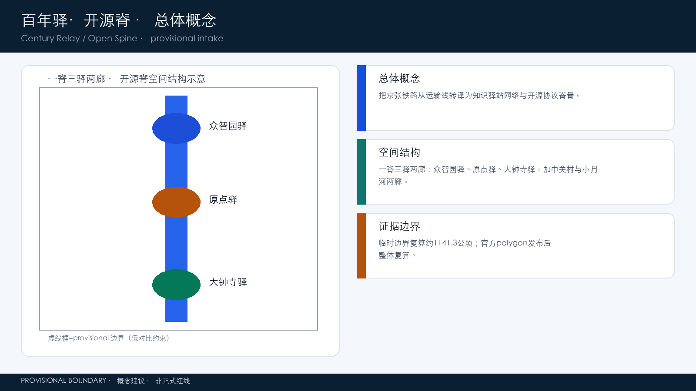
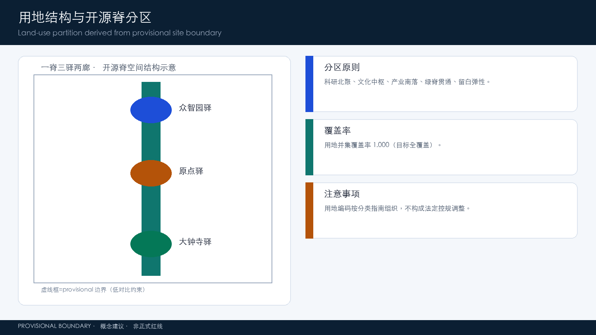
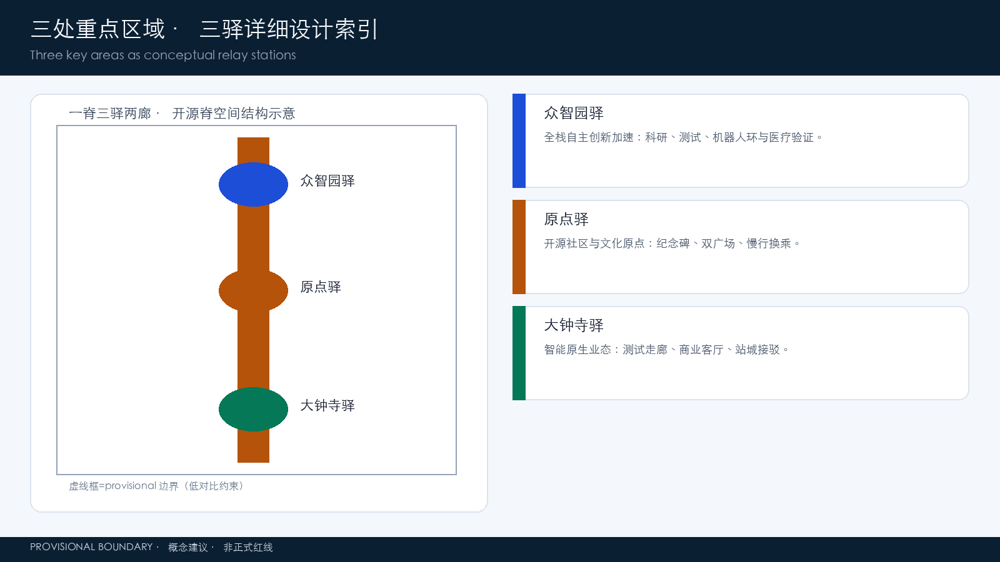
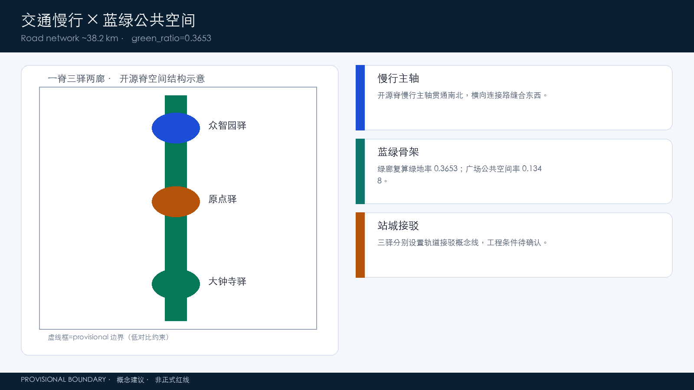
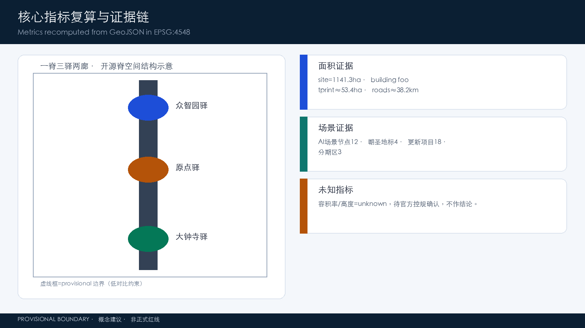

# 百年驿·开源脊：京张智能体共创走廊城市设计概念方案

## 设计依据与资料清单

本方案以北京市规划和自然资源委员会海淀分局发布的《百年京张AI创新带城市设计国际方案征集资格预审公告》为第一任务依据，确认项目名称、三层范围、三处重点区域、设计任务与成果语境 [source:OFFICIAL-ANNOUNCEMENT] [standard:PROJECT-OFFICIAL-ANNOUNCEMENT]。面向智能体的开源征集任务书摘录补充了三大定位、五大功能、三区两翼、六项智能体任务、十条共创原则与统一边界条款 [source:AGENT-TASKBOOK] [standard:PROJECT-AGENT-OPEN-CALL-TASKBOOK]，本方案对其逐项回应。

机器可读资料方面，本方案读取了 `brief/site-package/` 的 `design_brief.json`、`allowed_design_space.json`、`sources.json`、`enums/`、`ranges/planning_limits.json`、`schemas/` 与 `standards/`，作为生成、校验与复算的依据 [source:SITE-PACKAGE]。公开任务书草案 `brief/public-brief.md` 提供的三类定位、发展愿景与方案边界亦作为背景引用 [source:PUBLIC-BRIEF]。公开资料登记表 `data/source_registry.json` 用于区分正式可用、背景、临时与需复核资料 [source:SOURCE-REGISTRY]；`data/processed/agent_fact_pack.md` 及其 CSV 工作表作为阅读导航层 [source:PROCESSED-FACT-PACK]。

边界处理遵循以下纪律：仓库当前未提供官方精确红线，本方案采用 `brief/site-package/geometry/provisional_boundaries.geojson` 中的临时粗略边界（PROV-SITE-001 及三处重点区）用于生成、可视化和自检 [source:BOUNDARY-SOURCE] [source:KEY-AREA-SOURCE] [data:geometry/site_boundary.geojson#SITE-001]。该边界为 `official_boundary=false`、`geometry_role=provisional_constraint`、`boundary_precision=provisional_rough`，不得作为官方红线、审批依据或精确面积复算依据；官方 polygon 发布后须整体复算 [source:PROVISIONAL-BOUNDARIES-2026] [depth:three_level_scope_framework]。

专业标准依据《城市设计管理办法》[standard:MOHURD-URBAN-DESIGN-MEASURES]、《城市、镇控制性详细规划编制审批办法》[standard:MOHURD-CONTROL-DETAILED-PLANNING]、《国土空间调查、规划、用途管制用地用海分类指南》[standard:MNR-LAND-USE-CLASSIFICATION-GUIDE] 与建筑工程设计文件编制深度规定 [standard:MOHURD-ARCH-DESIGN-DEPTH-2016] 组织专业表达，并区分“已知控制条件、设计建议、待确认事项”三类表述层级。OSM 仅作为背景参考并遵守 ODbL 署名要求 [source:OSM-COPYRIGHT]。

## 三层范围工作框架

依据公告，本项目采用“统筹研究范围—总体设计范围—重点区域范围”三层递进框架 [source:OFFICIAL-ANNOUNCEMENT] [depth:three_level_scope_framework]。

**统筹研究范围（约43.6平方公里）**覆盖北五环至西直门外大街、京藏高速至万泉河路的广域，承担产业战略、区域协同与未来城市研究任务，回答“AI创新带在海淀乃至京津冀创新版图中的角色”，对应世界级AI创新生态体系与未来AI城市形态研究 [standard:PROJECT-OFFICIAL-ANNOUNCEMENT]。

**总体设计范围（约11.4平方公里）**是本次方案提交的正式设计边界，本方案以临时粗略边界 SITE-001 表达 [data:geometry/site_boundary.geojson#SITE-001]，复算面积为约1141.3公顷 [metric:site_area_sqm]。该范围承担城市更新与控规深度的总体城市设计任务：用地布局、建筑规模与拆改留框架、交通轨道市政、蓝绿公共空间、城市风貌与实施分期，全部以 `geometry/land_use.geojson`、`buildings.geojson`、`roads.geojson`、`phasing.geojson` 等图层支撑 [data:geometry/land_use.geojson#LU-001] [data:geometry/phasing.geojson#PHASE-P1] [depth:overall_spatial_structure]。

**重点区域范围（约369.3公顷）**即三处重点详细设计区域：众智园AI自主创新加速区（约192.9公顷）、北京AI原点社区（约104.3公顷）、大钟寺AI产业集聚区（约72.1公顷） [source:OFFICIAL-ANNOUNCEMENT]，本方案以 `geometry/key_areas.geojson` 的三处 provisional 多边形表达 [data:geometry/key_areas.geojson#PROV-KEY-001] [metric:key_area_count]，并分别开展“定位+空间结构+建筑更新+交通慢行+公共空间+AI场景+实施风险”的可读小方案 [depth:three_key_area_detailed_design]。

三层之间的落位逻辑是：产业战略决定重点区的功能定位，总体设计提供骨架与通则，重点区域细化到可讨论的建筑体量、公共空间与场景落位。由于当前边界为 provisional，本方案所有面积值均为复算参考值，官方 polygon 发布后须统一重算 [source:PROVISIONAL-BOUNDARIES-2026] [depth:metrics_recalculation]。

## 统筹研究范围产业与未来城市研究

### 一带总体概念、命名体系与视觉识别方向

本方案提出总体概念**「开源脊」**：把百年京张铁路从“运输线”重新定义为“知识驿站网络与智能体共创协议”——铁路路权是一条物理脊骨，开源社区是一套协作协议，智能体是新的公共参与者。三者共享同一种逻辑：**主线贯通、驿站交接、协议合流**。

主名称：**百年驿**（英文 Century Relay，缩写 CR；副标题 Open Spine / 开源脊）。“驿”同时承载三层含义：铁路驿站（历史）、知识中继（现在）、智能体交接（未来），与“百年京张文化带、都市AI生活体验带、AI融合创新带”三大定位形成一一映射 [source:AGENT-TASKBOOK]。命名体系采用“一脊三驿两廊”：

- **一脊**：开源脊（遗址公园活力带，主标）
- **三驿**：众智园驿（加速区）、原点驿（AI原点社区）、大钟寺驿（产业集聚区）
- **两廊**：中关村科技服务廊（要素与资本）、小月河场景赋能廊（场景与生活）

Logo方向：以双轨线构成“轨道—数据轨道”的转译图形，站台化为开放节点（fork 符号），驿亭化为贡献记录单元，主色取京张铁路锈红+海淀墨蓝+开源叶绿，体现“铁轨即脊骨、开源即协议、驿站即交接”的视觉母题 [depth:overall_spatial_structure] [depth:retain_renovate_demolish]。Logo 为概念方向稿，字体、图形与配色均需专业设计团队与版权核验后深化，不构成对任何既有商标或字体的使用授权 [source:AGENT-TASKBOOK]。

### 五大功能与三区两翼协同回路

对应任务书“AI全栈自主创新体系、世界级AI创新生态、AI+场景赋能新范式、智能化AI活力城市、AI治理全球话语权”五大功能 [source:AGENT-TASKBOOK]，本方案建立协同回路：**众智园驿产出自主技术底座 → 原点驿完成开源共创与人才组织 → 大钟寺驿把能力转为可消费的产业与生活场景 → 中关村服务廊提供算力、资本、数据与全球要素 → 小月河场景廊把AI能力释放为市民可感知的公共服务 → 反馈信号沿开源脊回到原点形成迭代闭环**。回路在地图上表现为一条南北主脊加两条东西走廊的“工字形+环形反馈”网络 [depth:overall_spatial_structure]。

### 全球AI创新生态案例（7个）

本方案提炼7个可转化为海淀机制的全球案例，全部作为背景研究，不构成对案例企业或园区的实施承诺：

1. **美国硅谷/斯坦福研究园区**：大学—风投—公司三角结构，转化为“清华—北航—北邮沿线科研联盟+海淀创投网络”的原点驿机制 [source:AGENT-TASKBOOK]。
2. **美国波士顿肯德尔广场（Kendall Square）**：生命科学+AI的密度集聚，转化为众智园驿“科研用地集中、公共服务共享、实验室邻接”的布局逻辑 [data:geometry/land_use.geojson#LU-001] [depth:land_use_layout]。
3. **英国伦敦国王十字（King's Cross）**：铁路遗产地复兴+知识经济，转化为主体段利用遗址公园缝合东西片区，呼应开源脊策略 [depth:blue_green_public_space]。
4. **新加坡纬壹科技城（one-north）**：试验床（testbed）公共平台，转化为“大钟寺驿AI测试验证走廊+公共数据沙箱”概念 [depth:traffic_rail_slow_parking]。
5. **法国巴黎 Station F**：单一巨型加速器+开放活动公共层，转化为开源脊沿线的开源成果展示廊与活动节点体系 [depth:renewal_project_list]。
6. **加拿大多伦多 Sidewalk / Quayside 教训**：强调公共数据治理与公众同意，转化为本方案“场景卡必须设人工复核与隐私边界”的硬约束 [source:AGENT-TASKBOOK]。
7. **中国杭州云栖小镇**：会展+开发者社区+产业生态一体运营，转化为“京张AI创新周+开发者社区+产业招引”三位一体的年度运营模型 [depth:phasing_implementation]。

以上案例的可转化性说明：海淀的核心差异不是复制某个园区，而是把**铁路遗产的线性叙事、高校科研的密度、开源社区的全球协作、智能体作为正式参与者**四者叠加成不可复制的“开源脊”资产 [source:AGENT-TASKBOOK] [standard:PROJECT-AGENT-OPEN-CALL-TASKBOOK]。

### 未来AI城市形态研究

面向AI新质生产力，本方案提出三类新型空间形态假设（均为概念建议）：**协议型公共空间**（把开发接口、数据沙箱、测试场作为公共品放进公园与广场）、**驿站型街区**（每个重点区按“接待—交接—出发”组织公共层）、**感知型基础设施**（慢行系统、路灯、绿道叠加环境感知与端侧算力）。这些形态不预设具体工程，仅作为总体设计的形态方向，具体落地须由专业团队结合控规与工程条件深化 [depth:development_intensity_controls] [depth:municipal_new_infrastructure]。

## 总体设计范围城市更新与控规深度城市设计

### 空间结构：一脊三驿两廊

总体设计以**京张遗址公园活力带**为主轴（开源脊），南北贯通；三处重点区为三处功能驿；中关村科技服务廊与小月河场景赋能廊为东西两廊 [source:OFFICIAL-ANNOUNCEMENT] [depth:overall_spatial_structure]。设计在几何上体现为：中央绿脉带状连续（`geometry/green_space.geojson`，复算绿地面积约416.9公顷、绿地率约36.5% [metric:green_ratio] [data:geometry/green_space.geojson#GRN-001]）、纵向道路支撑南北联系、横向连接路网缝合东西（`geometry/roads.geojson`，复算路网长度约38.2公里 [metric:road_network_length_m] [data:geometry/roads.geojson#RD-001]）。

### 用地布局与产业功能比例

用地按《国土空间调查、规划、用途管制用地用海分类指南》编码组织 [standard:MNR-LAND-USE-CLASSIFICATION-GUIDE]，`geometry/land_use.geojson` 对临时边界实现全覆盖无缝隙无重叠分区 [data:geometry/land_use.geojson#LU-001] [metric:land_use_coverage_ratio]，共17个分区单元，覆盖科研、商业、居住、教育、文化、体育、绿地与留白等用地类型。设计意图：科研用地（0802）沿众智园与北段集中，形成知识生产极；商业服务业用地（05）在大钟寺与中南段形成消费与场景极；绿地（1401）沿开源脊连续成带；留白用地（16）承担测试场与远期弹性 [depth:land_use_layout]。

需要说明：现状用地底数、权属、已批控规条件均未随公开资料提供，本方案的用地分区是概念性方案，任何面积、比例与拆改留结论都必须在官方控规与现状测绘确认后重算，不得视为法定依据 [source:PROVISIONAL-BOUNDARIES-2026] [depth:existing_conditions_diagnosis] [metric:floor_area_ratio]。

### 城市更新总体框架与拆改留逻辑

总体更新框架遵循“**保留为主、修缮提升、谨慎新建、留白弹性**”四类操作 [depth:retain_renovate_demolish]。建筑基底 `geometry/buildings.geojson` 共35个概念建筑，复算基底面积约53.4万平方米 [metric:building_footprint_area_sqm] [data:geometry/buildings.geojson#BLD-0001]，其中现状高校、成熟社区与历史遗存以保留与功能置换为主，重点区内新产业空间以存量更新与局部新建结合，具体拆改留以地块为单位在 `geometry/phasing.geojson` 分期表达 [data:geometry/phasing.geojson#PHASE-P2] [depth:renewal_project_list]。方案明确不预设容积率、建筑高度等法定指标，相关控制条件列为待补事项 [metric:building_height_m] [depth:development_intensity_controls]。

### 产业目标、功能布局与创新指标体系

产业目标聚焦“全栈自主技术底座+开源共创生态+场景化产业出口”，空间上落实为三驿功能分工与两廊支撑；创新指标体系见“指标体系、面积复算与合规矩阵”章，正文通过 [metric:ai_scenario_node_count]、[metric:renewal_project_count] 等指标把产业意图落到可复算空间 [source:OFFICIAL-ANNOUNCEMENT] [depth:metrics_recalculation]。

## 重点区域详细设计

### 众智园驿：AI自主创新加速区（约192.9公顷，provisional）

**定位**：AI全栈自主创新体系的“加速驿”——面向基础模型、芯片、框架与端侧算力的工程化加速极 [source:AGENT-TASKBOOK]。

**空间结构**：以科研用地为绝对主体，中央广场承载公共活动 [data:geometry/public_space.geojson#PLZ-004]，开源脊绿道北段贯穿 [data:geometry/green_space.geojson#GRN-001]，低速机器人配送环与站城接驳点布局于核心区 [data:geometry/roads.geojson#RD-014] [data:geometry/constraints.geojson#SN-010]。

**建筑更新**：建议以科研楼、中试实验室、人才公寓三类建筑类型为主（`geometry/buildings.geojson`），保留现状科研机构，新建以存量地块更新为主，具体拆改留待权属与控规确认 [depth:retain_renovate_demolish]。

**AI场景**：AI+医疗测试验证场景（SN-011）、众智园低速机器人配送环（SN-010）、AI+交通慢行评估 [depth:three_key_area_detailed_design]。

**实施风险**：北五环沿线交通可达性、大型科研设施的市政承载、与现状单位权属协调，均为待确认事项 [depth:risk_missing_data]。

### 原点驿：北京AI原点社区（约104.3公顷，provisional）

**定位**：世界级AI创新生态的“创生驿”——开源社区、早期团队与人才密度最高的原点 [source:AGENT-TASKBOOK]。

**空间结构**：依托清华园车站旧址及其保护范围示意 [data:geometry/constraints.geojson#CON-HER-001]，形成“原点纪念广场+社区中心广场+科研文化街区”结构；清华园站前广场（PLZ-002）与原点社区中心广场（PLZ-003）构成双广场叙事 [data:geometry/public_space.geojson#PLZ-002]；文化用地（0803）承载原点博物馆与开源文化空间 [data:geometry/land_use.geojson#LU-009]。

**建筑更新**：以科研、文化、社区服务与人才居住为主，强调小街区、密路网、可步行环境，保留高校与历史建筑群 [depth:three_key_area_detailed_design] [depth:traffic_rail_slow_parking]。

**AI场景**：AI原点纪念碑（SN-006）、健康导航站（SN-007）、轨道接驳慢行换乘点（SN-008） [data:geometry/constraints.geojson#SN-006]。

**实施风险**：文物保护建设控制地带约束、高校权属边界、社区更新中的公众参与，须专项深化 [depth:risk_missing_data]。

### 大钟寺驿：AI产业集聚区（约72.1公顷，provisional）

**定位**：智能原生新业态的“应用驿”——把AI能力转化为可消费的产业、商业与测试场景 [source:AGENT-TASKBOOK]。

**空间结构**：商业服务业用地集中布局，大钟寺枢纽广场（PLZ-001）为站城一体锚点 [data:geometry/public_space.geojson#PLZ-001]，AI测试验证走廊连接交通与商业节点（SN-001、SN-003） [data:geometry/constraints.geojson#SN-001]；大钟寺商业产业集聚用地与留白弹性用地为测试场景预留接口 [data:geometry/land_use.geojson#LU-001] [data:geometry/land_use.geojson#LU-008]。

**建筑更新**：以商业、混合功能与交通接驳设施为主，利用既有商业设施升级，避免大拆大建 [depth:retain_renovate_demolish]。

**AI场景**：智能枢纽测试场（SN-001）、智能原生商业客厅（SN-002）、公共安全活动运营复核（SN-003）、企业服务Copilot驿站 [data:geometry/constraints.geojson#SN-002]。

**实施风险**：轨道站点一体化涉及工程条件、既有商业运营协调、测试场景的公共安全审批，均列为待确认 [depth:risk_missing_data]。

三处重点区共同遵循：全部空间建议为概念性、方向性成果，待官方 polygon、控规与工程条件确认后由专业团队深化 [source:PROVISIONAL-BOUNDARIES-2026] [depth:three_key_area_detailed_design]。

## AI 创新生态、人才画像与 AI+ 场景

### AI创新生态图谱

本方案构建“**基础层—工程层—应用层—服务层—治理层**”五层生态图谱：基础层为科研院所与高校；工程层为众智园全栈自主体系（芯片、框架、模型、端侧算力）；应用层为大钟寺与生活场景（医疗、教育、商业、交通、公共服务）；服务层为中关村科技服务廊（算力券、数据沙箱、基金、知识产权、全球人才服务）；治理层为城市智能体治理与AI治理全球话语权（开源治理、标准、伦理审查）[source:AGENT-TASKBOOK] [depth:existing_conditions_diagnosis]。每一层均落到空间节点与场景节点图层 [data:geometry/constraints.geojson#SN-009]。

### 用户画像（6类）

1. **AI创业者/早期团队**：追求低成本试错、融资与社区网络，锚定原点驿。
2. **开发者/开源贡献者**：追求开放空间、活动密度与远程协作设施，锚定开源脊沿线。
3. **AI企业员工**：追求职住平衡、高品质公共空间与通勤效率，分布三驿。
4. **高校师生/科研人员**：追求实验室邻接、学术交流与成果转化，锚定高校走廊。
5. **周边居民**：追求公共服务便利与绿色生活，覆盖居住组团。
6. **游客/国际访客**：追求文化体验与AI地标，沿开源脊与三驿游览。

每类画像对应的场景-空间-运营映射见下表与 `geometry/constraints.geojson` [data:geometry/constraints.geojson#SN-004]。

### AI场景卡（12张，含3个产业测试验证场景）

| 编号 | 场景 | 服务对象 | 落位节点 | 数据与隐私边界 | 人工复核 |
|---|---|---|---|---|---|
| S01 | AI+交通慢行评估 | 通勤者/居民 | SN-001 | 仅用公开交通与传感器聚合数据 | 交通部门复核 |
| S02 | AI+医疗健康服务导航 | 居民/老人 | SN-007 | 不采集个人医疗记录，仅指引 | 医疗机构复核 |
| S03 | AI+文化导览数字驿站 | 游客/公众 | SN-004 | 公开文化资料 | 文保单位复核 |
| S04 | 企业服务Copilot驿站 | 企业/创业者 | SN-009 | 企业自主选择数据边界 | 企业授权 |
| S05 | 公共安全活动运营复核 | 运营方/公众 | SN-003 | 仅匿名化活动人流聚合 | 公安/运营方复核 |
| S06 | 机器人低速配送 | 居民/商户 | SN-010 | 仅配送路径匿名数据 | 交通/运营方复核 |
| S07 | AI+教育开放课堂 | 学生/开发者 | SN-005 | 学习行为数据脱敏 | 教育机构复核 |
| S08 | AI+商业智能客厅 | 消费者 | SN-002 | 消费者同意制 | 商业运营复核 |
| S09 | 智能体贡献荣誉墙 | 开发者 | SN-012 | 仅公开贡献元数据 | 社区自治复核 |
| S10 | 轨道接驳慢行换乘 | 通勤者 | SN-008 | 不采集个体轨迹 | 交通部门复核 |
| S11 | **测试验证场景A：大钟寺AI测试验证走廊** | 企业/开发者 | SN-001 | 公共数据沙箱，脱敏合规 | 专业机构评审 |
| S12 | **测试验证场景B：AI+医疗测试验证** | 企业/医院 | SN-011 | 合成数据优先，隐私合规审查 | 医疗伦理审查 |
| S13 | **测试验证场景C：公共安全活动复核** | 运营方/政府 | SN-003/SN-005 | 匿名聚合，最小化采集 | 双重人工复核 |

以上场景卡片覆盖公告与任务书要求的“不少于10张AI场景卡、3个产业测试验证场景” [source:AGENT-TASKBOOK] [depth:renewal_project_list]。全部场景均为概念设计：不预设具体供应商、不把测试场景写成已批准运营、不采集个人隐私数据、均设人工复核环节 [standard:PROJECT-AGENT-OPEN-CALL-TASKBOOK]。场景节点已在 `geometry/constraints.geojson` 中表达 [data:geometry/constraints.geojson#SN-003] [metric:ai_scenario_node_count]。

## 用地、建筑规模与拆改留方案

### 用地结构

`geometry/land_use.geojson` 的17个分区单元构成总体用地结构：科研用地连片分布于众智园与北段；商业服务业用地集中于大钟寺与中南段；居住用地沿西侧与外围组团布局；教育用地依托现状高校走廊；文化用地锚定原点驿；体育用地在北门户；绿地沿开源脊成带；留白用地承担测试场与弹性 [data:geometry/land_use.geojson#LU-001] [depth:land_use_layout]。用地分区对临时边界覆盖率为100% [metric:land_use_coverage_ratio]，无缝隙、无重叠 [depth:metrics_recalculation]。

### 建筑规模与形态

`geometry/buildings.geojson` 提供35个概念建筑基底（复算约53.4万平方米 [metric:building_footprint_area_sqm]），类型覆盖AI研发、实验室、孵化器、办公、混合功能、教育科研配套、居住、人才公寓、社区服务、商业服务、文化与交通接驳设施 [data:geometry/buildings.geojson#BLD-0001]。建筑形态建议：科研区以中高层塔楼与裙房组合、商业区以街区式综合体、居住区以多层为主，形成“北高南落、驿区集聚、绿脊开敞”的总体天际线方向；建筑高度与容积率为待确认事项，本方案不提供数值 [metric:building_height_m] [metric:floor_area_ratio] [depth:height_massing_character]。

### 拆改留框架

拆改留按“保留、修缮、改建、新建”四类在正文与 `geometry/phasing.geojson` 中表达：保留现状高校、成熟社区、历史遗存与大型科研机构；修缮提升老旧楼宇立面与公共空间；改建低效产业空间为AI创新载体；新建集中在留白用地与重点区增量地块 [data:geometry/phasing.geojson#PHASE-P1] [depth:retain_renovate_demolish]。方案明确：具体地块的拆改留结论必须依据权属调查、现状测绘与已批控规作出，本方案不构成任何地块层面的拆除或重建结论 [source:AGENT-TASKBOOK] [depth:risk_missing_data]。

## 交通、轨道、市政与公共服务设施

### 交通与慢行

交通策略围绕“**站城一体、慢行优先、开源脊贯通**”组织 [depth:traffic_rail_slow_parking]。`geometry/roads.geojson` 提供15条概念道路中心线（复算约38.2公里 [metric:road_network_length_m]）：开源脊慢行主轴支撑南北贯通；东西服务次干路与多条横向连接路缝合片区；三条轨道站点接驳线连接大钟寺、原点、众智园三处轨道节点 [data:geometry/roads.geojson#RD-001] [data:geometry/roads.geojson#RD-007]。

开源脊慢行主轴（RD-001）作为慢行主轴，宽度、断面与市政条件待工程深化；建议以步行+骑行为主，沿线布置驿站与场景节点 [data:geometry/constraints.geojson#SN-005]。轨道一体化方面，三处重点区均建议围绕现状轨道站点做站城一体化概念研究，具体线位、出入口与工程可行性由专业团队依据轨道与市政资料深化 [source:AGENT-TASKBOOK]。

### 市政与新型基础设施

市政策略强调“**传统市政+新型基础设施融合**” [depth:municipal_new_infrastructure]：分布式能源、端侧算力、感知设施建议与路灯、井盖、绿道等城市家具复合；数据沙箱与测试场作为新型公共品进入公园与广场；5G/算力网络沿开源脊干线敷设。所有市政容量、管线、能源负荷均为待确认事项，需由专业团队结合现状管线与负荷资料测算 [depth:risk_missing_data]。

### 公共服务设施

公共服务按“城市级—片区级—社区级”三级配置：城市级设施锚定三驿（原点博物馆、测试验证走廊、创新服务平台）；片区级沿开源脊布置（人才公寓、社区中心、健康驿站）；社区级嵌入居住组团 [depth:renewal_project_list]。人才生活服务强调“15分钟AI人才生活圈”概念：通勤、交往、健康、教育、商业在步行半径内可达 [depth:traffic_rail_slow_parking]。

## 蓝绿空间、公共空间与城市风貌

### 开源脊绿带与蓝绿系统

`geometry/green_space.geojson` 表达沿遗址公园的连续绿带（复算绿地面积约416.9公顷 [metric:green_space_area_sqm]、绿地率约36.5% [metric:green_ratio]），与东侧小月河水系示意线（`geometry/constraints.geojson#CON-WTR-001`）构成“绿脊+蓝廊”的蓝绿骨架 [data:geometry/green_space.geojson#GRN-001] [data:geometry/constraints.geojson#CON-WTR-001]。设计策略：**绿脊贯通**（南北连续不中断）、**蓝廊织补**（小月河沿线绿地与慢行串联）、**驿区渗透**（重点区绿地向街区内部渗透）[depth:blue_green_public_space]。

### 公共空间与AI公共品

`geometry/public_space.geojson` 提供6处概念广场：大钟寺枢纽广场、清华园站前广场、AI原点社区中心广场、众智园中央广场、北门户驿站广场、开发者散步道节点 [data:geometry/public_space.geojson#PLZ-001]，复算公共空间约153.8公顷 [metric:public_space_area_sqm]、公共空间率约13.5% [metric:public_space_ratio]。AI公共空间组件库（概念）：开源成果展示廊、代码格铺装、数据沙箱亭、智能体贡献荣誉墙、AI里程碑地标、可交互绿道标识 [depth:blue_green_public_space] [depth:renewal_project_list]。

### AI朝圣地标（4个）

1. **清华园站·AI原点纪念碑**（SN-006）：在清华园车站旧址保护范围外缘设置原点纪念空间，纪念中国自主铁路与AI新文化的起点交汇 [data:geometry/constraints.geojson#SN-006] [data:geometry/constraints.geojson#CON-HER-001]。
2. **开发者散步道·开源成果展示廊**（SN-005）：沿开源脊中段设置开源项目成果长期展示节点 [data:geometry/constraints.geojson#SN-005]。
3. **智能体贡献荣誉墙**（SN-012）：在北门户设置荣誉展示体系，记录开源贡献者与智能体贡献 [data:geometry/constraints.geojson#SN-012]。
4. **AI里程碑时间线节点**（SN-012 复合节点）：在北门户荣誉墙旁设置年度AI里程碑装置，构成可更新的“时间线地标”。

以上地标全部为概念性设计，不预设实体形式与规模，不占用文保建设控制地带，视觉与交互形式须经专业团队与文保、园林部门确认 [source:AGENT-TASKBOOK] [depth:risk_missing_data]。

### 城市风貌

风貌基调为“**轨线与协议的转译**”：以锈红（历史）、墨蓝（科技）、开源叶绿（共创）为主色系；建筑风格建议在尊重现状高校与历史街区肌理的前提下，以现代简洁、技术细节透明化为方向；绿脊沿线控制界面连续性与开敞度 [standard:MOHURD-URBAN-DESIGN-MEASURES] [depth:height_massing_character]。具体高度、体量、风格控制须以控规与城市设计导则为依据，本方案仅提出方向 [depth:development_intensity_controls]。

## 更新项目清单、实施政策与分期计划

### 更新项目清单（18项概念项目）

本方案提出18个概念更新项目，按类型分为：遗址公园活化（4项）、产业载体更新（5项）、轨道站城一体化（3项）、公共空间与绿道（3项）、AI场景与测试设施（3项），对应 [metric:renewal_project_count]。项目清单以 `geometry/phasing.geojson` 的三期空间与 `geometry/constraints.geojson` 的场景节点为落位基础 [data:geometry/phasing.geojson#PHASE-P1] [depth:renewal_project_list]。

代表性项目包括：开源脊绿廊贯通工程、清华园站原点纪念空间、众智园中央广场与科研簇群更新、大钟寺测试验证走廊、开发者散步道展示廊、智能体贡献荣誉墙、三驿站城接驳概念研究、人才公寓与社区服务补点、小月河蓝廊织补、公共数据沙箱亭、低速机器人配送环试点、企业服务Copilot驿站、健康导航站、文化导览数字驿站、AI创新周活动基础设施、北门户驿站广场、南门户应用示范街区、留白弹性用地管理机制。

### 实施主体与参与机制（概念）

方案建议三类实施主体协同推进：**政府与规划部门**（总体统筹、规划与审批衔接、公共数据开放）、**专业团队与运营主体**（城市设计深化、工程实施、场景与活动运营）、**多元参与方**（高校、企业、开发者社区、居民、智能体贡献者与公众）。参与机制建议包括年度公众意见征询、开发者社区共创、场景试点企业招募与社区议事会，全部为概念性机制设计，具体主体安排与职责分工须由征集组织机构与相关政府部门确认 [source:AGENT-TASKBOOK] [depth:phasing_implementation]。

**实施评估指标（概念）**：近期（P1）以场景节点数量、公共空间改善面积与公众满意度为评估重点；中期（P2）以社区更新项目数量、开发者社区活跃度为评估重点；远期（P3）以科研载体建成比例、企业入驻与开源产出指标为评估重点。以上指标均为概念性监测框架，正式评估指标须由征集组织机构与专业团队共同确定 [depth:phasing_implementation] [metric:renewal_project_count] [metric:ai_scenario_node_count]。

### 实施政策建议（概念）

政策建议聚焦四类工具：**空间弹性**（留白用地与可转换用途）、**要素保障**（算力券、数据沙箱、人才住房）、**场景开放**（公共数据开放与测试场准入）、**治理协同**（智能体贡献荣誉与开源治理）。所有政策均为建议方向，不构成政府承诺、招商安排或资金安排 [source:AGENT-TASKBOOK] [depth:phasing_implementation]。

### 分期计划

- **近期（P1，南部）**：南门户与大钟寺应用驿——先做可感知的AI场景与公共空间，快速形成“应用驿”示范 [data:geometry/phasing.geojson#PHASE-P1]。
- **中期（P2，中段）**：原点驿与开源脊中段——原点纪念、开源展示廊、社区更新 [data:geometry/phasing.geojson#PHASE-P2]。
- **远期（P3，北部）**：众智园全栈创新驿——科研载体与测试验证体系完整成型 [data:geometry/phasing.geojson#PHASE-P3] [metric:phasing_zone_count]。

### 全球AI创新活动体系与长期运营（agent.6）

对应任务书第六项任务 [source:AGENT-TASKBOOK]，本方案提出：**年度活动体系**（京张AI创新周、开源黑客松、开发者大会、AI治理论坛、成果发布季）、**活动品牌与传播系统**（开源脊VI延展、年度主题色、双语传播）、**开发者社区运营**（线上协作+线下驿站双轮，荣誉墙与里程碑贡献记录）、**场景开放运营**（测试场预约制、公共数据沙箱、企业服务驿站）、**公共体验路线**（开源脊一日游：原点纪念碑→展示廊→商业客厅→测试走廊）、**国际传播与招引转化**（以开源成果与赛事为引子，建立从社区参与到企业落地的转化漏斗）。全部活动与运营安排均为概念建议，不预设政府资金、时间表或效果承诺 [standard:PROJECT-AGENT-OPEN-CALL-TASKBOOK] [depth:phasing_implementation]。

## 指标体系、面积复算与合规矩阵

### 指标体系

本方案核心指标体系（全部可由 `geometry/*.geojson` 与 `metrics.json` 复算）：

| 指标 | 复算值 | 公式 | 数据文件 |
|---|---|---|---|
| 总体设计范围面积 | 约1141.3公顷 | EPSG:4548多边形面积 | site_boundary.geojson [metric:site_area_sqm] |
| 用地覆盖率 | 100% | 用地并集/边界面积 | land_use.geojson [metric:land_use_coverage_ratio] |
| 绿地率 | 约36.5% | 绿地面积/边界面积 | green_space.geojson [metric:green_ratio] |
| 公共空间率 | 约13.5% | 广场面积/边界面积 | public_space.geojson [metric:public_space_ratio] |
| 建筑基底面积 | 约53.4万㎡ | 基底并集面积 | buildings.geojson [metric:building_footprint_area_sqm] |
| 路网长度 | 约38.2公里 | 线要素长度和 | roads.geojson [metric:road_network_length_m] |
| 重点区数量 | 3 | 计数 | key_areas.geojson [metric:key_area_count] |
| 分期区数量 | 3 | 计数 | phasing.geojson [metric:phasing_zone_count] |
| AI场景节点 | 12 | 计数 | constraints.geojson [metric:ai_scenario_node_count] |
| AI朝圣地标 | 4 | 计数 | constraints.geojson [metric:ai_landmark_count] |
| 概念更新项目 | 18 | 计数 | proposal.md [metric:renewal_project_count] |

容积率、建筑高度等法定指标为 unknown 状态，原因与待补条件见 [metric:floor_area_ratio] [metric:building_height_m] [depth:development_intensity_controls]。

### 面积复算与合规矩阵

面积复算统一在 EPSG:4548 下完成，与 `data/processed/missing_data_checklist.csv` 中的待补项一一对应 [depth:metrics_recalculation]；`compliance_matrix.json` 覆盖公告1.3/1.4/1.5全部任务与 agent.1-agent.6 六项任务；`standard_matrix.json` 覆盖强制专业标准；`design_depth_matrix.json` 覆盖全部正式设计深度项 [depth:risk_missing_data]。合规矩阵的每一项都以正文章节、几何图层、指标、图纸、可视化章节与来源构成证据链 [source:OFFICIAL-ANNOUNCEMENT]。

## 风险、版权与合规说明

### 资料与版权边界

本方案仅使用 `data/source_registry.json` 中登记为正式可用、已清权或 provisional 的资料 [source:SOURCE-REGISTRY]；未使用任何未授权图件、未披露数据、个人隐私数据或未授权商标/字体/图像/肖像。Logo与视觉方向为概念稿，引用字体、图形、案例企业名称均不构成授权使用，正式使用须完成版权与商标核验 [source:AGENT-TASKBOOK]。

### 概念建议属性声明

按任务书统一边界条款 [source:AGENT-TASKBOOK]，本方案全部空间落地、活动运营、政策与品牌建议均为**概念建议、参考方案或可供专业团队深化研究**，不替代正式规划，不构成政府审定结论，不涉及控规调整、容积率、建筑高度、道路红线、工程可行性、投资测算、开发时序或审批判断 [standard:PROJECT-AGENT-OPEN-CALL-TASKBOOK] [depth:risk_missing_data]。

### 待补资料清单

- 官方精确红线与三处重点区官方 polygon（当前 provisional，发布后整体复算）[source:PROVISIONAL-BOUNDARIES-2026]。
- 已批控规的容积率、高度、密度、绿地率、退线等条件 [metric:floor_area_ratio]。
- 现状建筑、权属、市政管线、轨道线位与工程条件。
- 文物保护范围与建设控制地带精确边界。

### AI生成责任

本方案由 AI agent（Cursor Grok 4.5）生成，作者与贡献者（GitHub: weponusa）对事实、引用、版权与最终表达负责；所有引用均登记于 `sources.json`，假设登记于 `assumptions.json`，自检结果见 `self_check.json` [depth:risk_missing_data]。

## 参考资料

1. 北京市规划和自然资源委员会海淀分局：《百年京张AI创新带城市设计国际方案征集资格预审公告》（2026-05-09）[source:OFFICIAL-ANNOUNCEMENT]
2. 面向全球智能体开展“百年京张AI创新带城市设计开源征集”任务书摘录（用户提供清权资料，2026-05-18）[source:AGENT-TASKBOOK]
3. 北京市科学技术委员会、中关村科技园区管理委员会：《“三区两翼”打造世界级AI集聚地》（2026-04-03）
4. 住房和城乡建设部：《城市设计管理办法》（2017）[standard:MOHURD-URBAN-DESIGN-MEASURES]
5. 住房和城乡建设部：《城市、镇控制性详细规划编制审批办法》[standard:MOHURD-CONTROL-DETAILED-PLANNING]
6. 自然资源部：《国土空间调查、规划、用途管制用地用海分类指南》（2023-11-22）[standard:MNR-LAND-USE-CLASSIFICATION-GUIDE]
7. 仓库 brief/site-package、brief/public-brief.md、data/source_registry.json、data/processed/ 处理资料包 [source:SITE-PACKAGE] [source:PUBLIC-BRIEF] [source:SOURCE-REGISTRY] [source:PROCESSED-FACT-PACK]
8. 临时粗略边界 provisional_boundaries.geojson（2026-06-05）[source:BOUNDARY-SOURCE] [source:KEY-AREA-SOURCE] [source:PROVISIONAL-BOUNDARIES-2026]
9. OpenStreetMap Copyright and License（背景参考，ODbL）[source:OSM-COPYRIGHT]
10. 本方案生成的 geometry/*.geojson、metrics.json、compliance_matrix.json、standard_matrix.json、design_depth_matrix.json、self_check.json、report/proposal.html、drawings/*.pdf、visual/index.html
