# Human–Machine Friendly Jing-Zhang: A Concept Urban Design for Shared Movement, Shared Work and Shared Governance in the Age of Embodied AI

**Author: Dr Future wepon (`未来博士 wepon`)** · GitHub `weponusa` · drafted in collaboration with an AI agent

## Design Basis and Source Inventory

The primary brief for this proposal is the *Prequalification Announcement for the International Open Call for Urban Design of the Centennial Jing-Zhang AI Innovation Belt*, issued by the Haidian Branch of the Beijing Municipal Commission of Planning and Natural Resources. It fixes the three-tier scope, the three key areas and the design tasks [source:OFFICIAL-ANNOUNCEMENT] [standard:PROJECT-OFFICIAL-ANNOUNCEMENT]. The agent-facing taskbook adds the three strategic positionings, the five functions, the three zones and two wings, the six agent tasks and the common boundary clauses [source:AGENT-TASKBOOK] [standard:PROJECT-AGENT-OPEN-CALL-TASKBOOK].

The machine-readable material comprises `brief/site-package/`, `data/source_registry.json` and `data/processed/agent_fact_pack.md` [source:SITE-PACKAGE] [source:SOURCE-REGISTRY] [source:PROCESSED-FACT-PACK]. The boundary used here is a provisional polygon flagged `official_boundary=false`; once the official red line is published, everything must be recomputed as a whole [source:BOUNDARY-SOURCE] [source:KEY-AREA-SOURCE] [source:PROVISIONAL-BOUNDARIES-2026].

The methods and theory come from the author's long-term research and engineering translation. All of it is used as **conceptual method translation**. It does not reproduce the deliverables of any external project, and it does not write any external campus parameter into Haidian as a statutory standard:

1. **Doctoral research and book manuscript method**: *Building Human–Machine Friendly Space for the Future City* and the development volume of *Artificial Intelligence and the Future City* argue that future-city operation is "high-frequency, distributed and loosely coupled"; that space is organised through "flows–fields–networks" and a "digital tether"; that the human–machine relationship unfolds along three dimensions as "human–machine–environment (HME)"; and that spatial strategy is delivered as a five-dimensional adaptability system of "nodes–corridors–areas–flows–policies". The overall judgement is **spatial adaptability before machine iteration** — first make interfaces, continuity, signage and rules a public substrate, and only then discuss anthropomorphic machines and last-metre customisation [source:METHOD-THESIS-HMF] [source:METHOD-BOOK-FUTURE-CITY].
2. **Penguin Island / WeCityX (Shenzhen)**: at campus scale, the guideline was turned into enforceable clauses; shared movement was validated with a tiered dual-mode road network of "trunk efficiency plus last-metre slow-mobility integration" and a central green spine; comparative experiments and simulation support the finding that "adaptation on the environment side releases technical performance" [source:CASE-PENGUIN-WECITYX].
3. **Fuxing Island Human–Machine Friendly Urban Guideline (Shanghai)**: twin substrates (universal accessibility plus digital twin), the Five Settings × Five Friendliness Principles, an enterprise gate of test–certify–connect, and the full process in Chapter 12 of "planning assessment — construction in step — operational optimisation — rule iteration". Jing-Zhang translates only the procedure; it does not translate low-altitude flight, dedicated lanes or L4–L5 [source:CASE-FUXING-HMF-GUIDE].
4. **Haidian's public industrial narrative**: the three zones and two wings, and the background of AI clustering [source:INDUSTRY-PUBLIC-HAIDIAN-AI].

Professional standards cover urban design and regulatory detailed-planning depth [standard:MOHURD-URBAN-DESIGN-MEASURES] [standard:MOHURD-CONTROL-DETAILED-PLANNING], as well as architectural design depth and land-use classification [standard:MOHURD-ARCH-DESIGN-DEPTH-2016] [standard:MNR-LAND-USE-CLASSIFICATION-GUIDE]. The public draft brief defines the boundary of the deliverable as conceptual recommendation, to be developed further by professional teams and through statutory procedure `brief/public-brief.md` [source:PUBLIC-BRIEF].

"Human–machine friendly", as this proposal uses the term and as the author's research defines it, means that urban space, facilities and systems simultaneously support the operation, interaction and coexistence of human beings and embodied intelligent agents, forming a **unified human–machine–environment** order: human life safety, dignity, accessible passage, informed consent and the right to opt out always come first; machines must be identifiable, predictable, avoidable, capable of being taken over, and accountable; the environment must provide physical access, digital legibility and low-carbon operating conditions at the same time. The term explicitly rejects "machines first, squeezing out human comfort and aesthetics", and it equally rejects splitting "accessibility for people" and "machine-readiness for machines" into two mutually exclusive engineering programmes — in engineering terms the aim is one retrofit, multiple benefits [source:METHOD-BOOK-FUTURE-CITY] [source:CASE-FUXING-HMF-GUIDE]. Fuxing Island's dimensional parameters and WeCityX's right-of-way logic serve only as conceptual floors; before implementation, adaptation to Beijing's local regulations and dedicated heritage and traffic review must be completed.

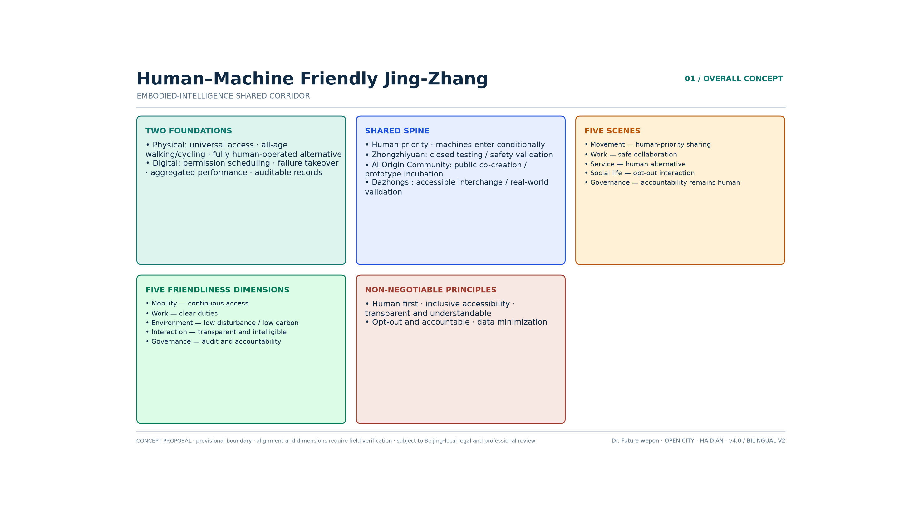

## Three-Tier Scope Working Framework

Following the announcement, the work advances through three nested tiers: coordinated study, overall design, and key-area detail [source:OFFICIAL-ANNOUNCEMENT] [depth:three_level_scope_framework].

**Coordinated study scope (approx. 43.6 km²)** answers what role the AI Innovation Belt plays within Haidian and the Beijing–Tianjin–Hebei innovation network, and corresponds to the study of a world-class ecosystem and future urban form.

**Overall design scope (approx. 11.4 km² / recomputed at approx. 1,141.3 ha)** is the submission boundary of this proposal [data:geometry/site_boundary.geojson#SITE-001] [metric:site_area_sqm]. The provisional geometry spans approx. 9.7 km north–south and approx. 1.4 km east–west, an aspect ratio of about 7:1 [metric:corridor_aspect_ratio_ns_ew]. That ratio dictates that space must be organised along a **linear spine** rather than as a homogeneous area [source:PROVISIONAL-BOUNDARIES-2026].

**Key-area scope (approx. 368.4 ha)** contains Zhongzhi Park at approx. 192.1 ha, the AI Origin Community at approx. 104.3 ha and Dazhongsi at approx. 72.0 ha — about 32.3% of the overall design scope [metric:key_area_share_of_overall] and 8.4% of the coordinated study scope. The three areas stand in a ratio of about **52:28:20**, weighted to the north [data:geometry/key_areas.geojson#PROV-KEY-001] [metric:key_area_count].

The logic across the three tiers is sequential: industrial strategy sets the role, overall design sets the spine and the general rules, and the key areas are resolved into nodes and scenarios concrete enough to be debated. All areas are recomputed reference values and will be recalculated together once the official polygon is available [depth:metrics_recalculation].

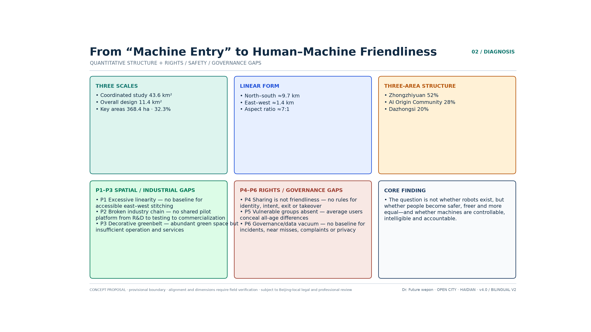

## Problem Diagnosis and Quantitative Structural Analysis

### Statement of the Core Problem

The Jing-Zhang corridor is statistically highly clustered and morphologically extremely linear, yet in operation it still resembles "three separate campuses plus one heritage green belt": the key areas occupy only about a third of the overall scope and are weighted to the north; east–west stitching and slow-mobility discontinuities have no recomputable baseline; the park has abundant green volume but sparse operating nodes; and shared human–machine movement lacks tiered right of way, machine identity and intent signalling, human takeover, privacy opt-out and a closed loop of accountability. The result is that **the intensity of industrial connection cannot be measured, and the human–machine relationship is still no more than "devices entering space" — not yet a public institution that is genuinely friendly to everyone** [depth:existing_conditions_diagnosis].

### Six Quantitative Diagnoses

| No. | Problem | Quantitative description | Structural implication |
|---|---|---|---|
| P1 | Excessively linear form, weak east–west stitching | Aspect ratio about 7:1; the announcement explicitly requires east–west stitching and north–south connection | Lateral connector branches must be strengthened, not only a north–south green belt |
| P2 | Spatial fracture of the industrial chain | The three areas at 52:28:20; policy has already divided the roles of substrate, origination and conversion | A shared pilot-test — testing — handover corridor is missing |
| P3 | The park reads as a decorative green belt | Conceptual green space ratio about 36.5% [metric:green_ratio], 12 scenario nodes, recomputed spine length 9.665 km (≈1.24 nodes/km) [metric:scenario_node_density_per_km] [metric:spine_length_m] | Green volume is sufficient; the operating layer is not |
| P4 | Human–machine friendly standards and spatial discontinuities | Guideline floors: clear width ≥2.5 m, turning ≥0.8 m, gradient ≤1:12, machine speed ≤1.2 m/s in pedestrian areas; the typical discontinuities identified in the book manuscript (entering doors, going up floors, crossing thresholds, wayfinding, recharging) are not yet inventoried along the corridor; the current state of identity marking, intent signalling and opt-out mechanisms is unknown | Survey the discontinuities before piloting; do not simply draw a "robot lane" or count on a single machine's capability to force its way through |
| P5 | Clustering has not converted into connection intensity | The belt accounts for about 70% or more of Haidian's AI enterprises, revenue and financing; the public figure for the AI core industry, RMB 282.2 billion → 350 billion+ | Recomputable KPIs for joint testing, entry-to-market conversion and public experience are missing |
| P6 | Data and governance vacuum | Floor area ratio / height = unknown; boundary provisional; no baseline for incidents, takeovers, complaints or accessibility continuity | Exact areas must be recomputed; human–machine friendly performance must be documented from zero |

### Five Non-Negotiable Human–Machine Friendly Principles

These align with the design principles in the thesis — safety first, people-centred, efficiency, sustainability and collaborative symbiosis — and are condensed into clauses that Jing-Zhang can actually accept on site:

1. **People first**: pedestrians, children, older people, people with disabilities and emergency personnel hold priority right of way and the final decision. AI assists; it does not replace the parties who bear public responsibility.
2. **Inclusive accessibility / one retrofit, multiple benefits**: machine passage is conditional on wheelchairs, prams and people with visual or hearing impairments also being able to pass safely; age-friendly, accessible and machine-ready works should share the same engineering path wherever possible, so that no second, exclusive space is built for machines [source:METHOD-BOOK-FUTURE-CITY].
3. **Machine-readable, human-understandable**: space carries continuous coding, beacons and docking interfaces; machines state their identity, task, movement intent and responsible party through light, sound and screen; a humanoid appearance must not disguise the fact that the object is a machine [source:CASE-FUXING-HMF-GUIDE].
4. **Opt-out, takeover, accountability**: the public may choose non-sensed or low-sensing routes and human service; devices must have geofencing, physical and remote emergency stops, human takeover, operating logs, insurance and a complaints channel.
5. **Data minimisation and continuous improvement**: anonymous aggregation by default, with facial recognition never a precondition for public service; continuous review through near-miss events, takeovers, faults, satisfaction and the experience of vulnerable groups.

### The Real Difficulties When Machines Enter the City (Method Translation)

What the book manuscript and engineering practice run into again and again is spatial discontinuity, not a shortage of "one more clever robot": difficulty entering doors, going up floors, crossing thresholds, finding the way, and recharging. A threshold two centimetres high is enough to stop a last-metre delivery unit; discontinuous lighting and highly reflective paving raise the rate of perception failure; sparse recharging points lock the service radius down. So if the Jing-Zhang corridor does no more than "deploy devices and stage marketing displays", the cost of failure is pushed onto every machine and every enterprise. If instead the discontinuity survey, the interface standards and the shared-movement rules are built first as a public substrate, the same retrofit can be reused by many brands and many machine types, and the industry can move from bespoke work to scale [source:METHOD-BOOK-FUTURE-CITY] [source:METHOD-THESIS-HMF].

### Conceptual Land-Use Snapshot (Not a Formal Regulatory Detailed Plan)

Indicative land use in the submission package: green and open space about 28.4%, research and innovation about 22.4%, commercial services about 20.0%, reserve land for flexibility about 10.2%, residential and higher education about 7.1% each, and cultural and commemorative about 4.9% [data:geometry/land_use.geojson#LU-001] [metric:land_use_coverage_ratio]. The structure already leans towards an innovation belt, but without a shared spine it remains a collage of functional colour blocks [depth:land_use_layout].

## Industry and Future-City Study at the Coordinated Study Scope

### Overall Concept, Naming and Identity Direction for the Belt

**Overall concept: Human–Machine Friendly Jing-Zhang · Embodied Shared Spine.**  
The Jing-Zhang railway is translated from a transport line and a landscape green belt into a public corridor that serves both everyday civic life and the iteration of the embodied-AI industry: for people, a park that is continuously accessible, offers choice and invites rest; for machines, a low-speed operating environment that is legible, allows docking and recharging, and can be taken over; for industry, a public pilot-test platform connecting "technology R&D — prototype testing — scenario validation — product display — commercial conversion".

**Primary name: Human–Machine Friendly Jing-Zhang** (subtitle *Low-Speed Shared Spine*).  
The naming logic maps onto the three strategic positionings: the Centennial Jing-Zhang cultural belt (memory of the rail line) → the urban AI living-experience belt (slow mobility and shared movement) → the AI convergence innovation belt (human–machine friendly operation, with data flowing back into research) [source:AGENT-TASKBOOK].

Spatial slogan: **One spine, three zones; Five Settings, Five Friendliness Principles; many nodes, twin substrates; Twelve Shichen**. Implementation slogan: **if it cannot get through the door, the whole corridor is downgraded**. Method slogan: **adapt the space first, admit the machines second**.

- **One spine**: the shared spine on which people come first, slow mobility dominates, and low-speed machines may share movement under conditions
- **Three zones**: Zhongzhi Park (technology validation end) / the AI Origin Community (R&D and incubation end) / Dazhongsi (product conversion end)
- **Five Settings**: the five real settings of mobility, work, service, social interaction and governance
- **Twelve Shichen**: twelve time-slot shared-movement clauses across one day (*shichen* are the twelve traditional two-hour periods); three of them are raised to field acceptance gates, and failing one downgrades the whole corridor
- **Five Friendliness Principles**: evaluation along five dimensions — movement, work, environment, interaction and governance
- **Many nodes**: quiet points for people, accessible rest points, machine docking and handover, charging and maintenance, emergency stop and takeover, test pods, and staffed service windows
- **Twin substrates**: a universally accessible physical space plus an auditable digital-twin operating system

### Brand and Identity System (Human–Machine Friendly Jing-Zhang)

Logo graphic: twin rail lines plus a low-speed movement envelope form a "rail — shared movement — station" figure, with the platform point resolved into a handover node. Primary colours: **rust red** (heritage) plus **ink blue** (autonomous driving and the digital substrate) plus **leaf green** (slow mobility and accessibility), with amber as a secondary colour for pilots and nodes. Applications cover the wayfinding system, machine identity marking, the digital-twin interface and event materials. This page is a conceptual identity system, not a formal VI deliverable; trademark and commercial use require separate rights clearance, and the identity must not be extrapolated into administrative endorsement, a basis for construction, or clauses in an investment contract [source:AGENT-TASKBOOK].

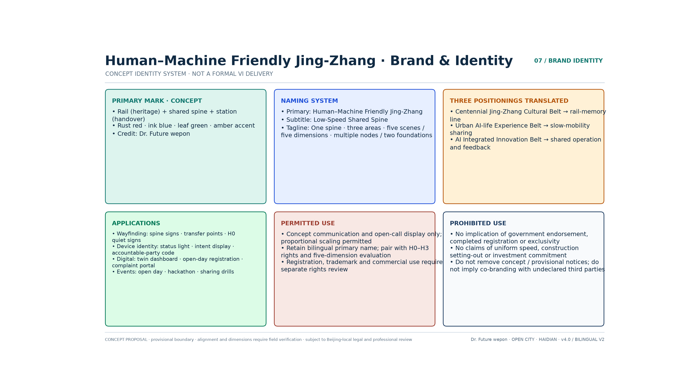

### Differentiation Across the Field

Many entries in this open call converge on the same narratives — "intelligent artery / open-source commons / the `人` (rén, 'person') character as cultural lineage / a closed evidence loop". This proposal does not compete for those slogans; it holds the scarce position instead: **an executable order for shared human–machine movement**. Against those high-frequency narratives, the difference lands on four points. The spatial spine is a recomputable curve rather than a symbolic straight line. Right of way is a four-tier H0–H3 rule set rather than a metaphor of coexistence. Public interest is resolved into accessibility, opt-out, takeover and the journeys of vulnerable groups. And evidence is handled honestly, constrained by precision grading and by "baseline to be surveyed", instead of fabricating KPIs for existing conditions.

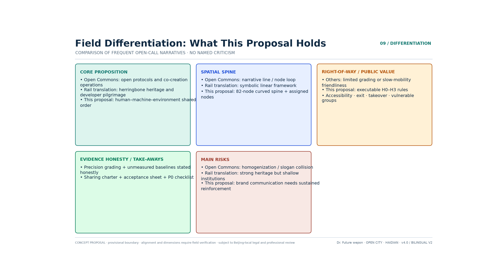

### The Five Functions and the Collaborative Loop of Three Zones and Two Wings

The five functions in the taskbook and this proposal's spatial response to each are set out below; they are kept separate from the "Five Settings / Five Friendliness Principles":

1. **A full-stack independent AI innovation system**: Zhongzhi Park carries generic technology, sensor calibration, simulation and safety validation, and closed testing is completed before any public space opens.
2. **A world-class AI innovation ecosystem**: the AI Origin Community connects universities, developers, start-up teams and public co-creation, bringing all-age usability and ethical review into prototype incubation.
3. **A new paradigm of AI-enabled scenarios**: the east wing and the spine open the five settings of mobility, work, service, social interaction and governance, but every scenario must pass acceptance against the Five Friendliness Principles.
4. **An intelligent, vibrant AI city**: Dazhongsi and the communities along the corridor provide real-life validation, human alternatives and accessible services, so that intelligent facilities enhance urban interaction rather than replace it.
5. **A global voice in AI governance**: machine admission, transparency of identity and intent, data minimisation, opt-out and takeover, near-miss reporting and public participation together form a replicable governance protocol.

To be explicit: **the five functions are the taskbook's industrial and urban goals; the Five Settings are a classification of scenarios; the Five Friendliness Principles are evaluation dimensions**. None of the three substitutes for another.

The collaborative loop is rewritten as an operable chain: **Zhongzhi Park produces the substrate and the safety protocol → open testing is entered along the spine → the AI Origin Community completes prototype iteration and organises talent → products then move along the spine into Dazhongsi for productisation and consumer validation → the west wing supplies capital, IP and overseas expansion → the east wing brings in embodied and vertical-sector scenarios → operating data flows back along the spine into research and development** [depth:overall_spatial_structure]. On the map this appears as a north–south spine plus two lateral wings: an "H-shaped chain with a feedback loop".

**West wing, technology-service mechanism**: it organises computing power, capital, intellectual property, testing and certification, legal and ethical services and internationalisation, with priority on safety assessment, liability insurance and standards export rather than an investment-promotion label alone. **East wing, scenario-enabling mechanism**: using the Xiaoyue River blue-green interface and community public services as the scenario interface, it establishes a process of demand publication — ethical pre-screening — closed validation — public co-creation — limited opening — review and withdrawal [data:geometry/constraints.geojson#CON-WTR-001].

### Method-Source Cases and Mechanism Analogies

The first three items are method sources the author can translate responsibly. The following five **are not verified facts about external projects**. They are mechanism analogies the author has abstracted from public urban practice, used to test Jing-Zhang's sequence of "substrate first, deployment second". They do not constitute acceptance of the outcomes, policies or data of Changi, Shinagawa, King's Cross, Sidewalk or Yunqi [source:METHOD-BOOK-FUTURE-CITY].

1. **Penguin Island / WeCityX (Shenzhen, method source)**: the *Human–Machine Friendly Spatial Design Guideline* was made the campus's underlying physical language; shared movement ran along a central green spine; a dual-mode arrangement of "high-speed platooning on the trunk plus low-speed integration at the last metre" (Mode B) was compared in simulation against homogeneous mixed traffic (Mode A), validating the trade of trunk efficiency for last-metre safety and slow-mobility quality. Jing-Zhang takes the "central green spine as the main axis, plus tiered integration" and does not copy the campus's internal speeds or dedicated-lane widths [source:CASE-PENGUIN-WECITYX] [source:METHOD-THESIS-HMF].
2. **Fuxing Island demonstration-area guideline (Shanghai, method source)**: twin substrates, the Five Settings × Five Friendliness Principles, six categories of robots; the enterprise pathway advances from testing and display, to tenancy and incubation, to R&D and innovation; a human–machine friendly impact assessment is carried out at the planning stage, and near-miss reports and satisfaction close the loop during operation. Jing-Zhang takes the "three-stage industrial gate plus whole-process assessment", and treats the parameters as conceptual floors [source:CASE-FUXING-HMF-GUIDE].
3. **Experience drafting the group standard for human–machine friendly communities (method source)**: turning principles into acceptance indicators and named responsible parties, so that they do not remain a vision statement. The dedicated Five Friendliness indicators and the P0 covenant in this proposal directly inherit that "concept — indicator — clause" coherence [source:METHOD-THESIS-HMF].
4. **Environment before devices (author's analogy)**: if corridor clearance, floor-reflection control and vertical-circulation interfaces come before deployment, the cost of failure is lower — this corresponds to "substrate first, deployment second". This item is a method analogy, not a measured conclusion about any particular airport.
5. **Signage and infrastructure first (author's analogy)**: before shared movement on open streets, complete the survey, the signage and closed testing — this corresponds to the sequence of P0 and the H2 pilot. This item is a method analogy, not a restatement of any particular special zone's policy.
6. **Stitch heritage rather than cover it (author's analogy)**: railway heritage is stitched in through commemoration and slow mobility rather than covered over by new functions — this corresponds to the commemoration at Qinghuayuan Station and to H0 heritage quiet zones [depth:blue_green_public_space].
7. **Public data requires consent first (author's analogy)**: data collection without public consent will drag down the technology narrative — hence mandatory human review of scenarios, data minimisation and the right to opt out [source:AGENT-TASKBOOK].
8. **Events and communities must both leave a deposit (author's analogy)**: open days and developer events are responsible for arrival; protocols and standards are responsible for what settles — this corresponds to the human–machine friendly open day and the conversion funnel [depth:phasing_implementation].

### The Form of the Future AI City: From Operating Mechanism to Spatial Translation at Jing-Zhang

The author's research summarises the operating mechanism of the future city in three points, and each directly determines how the Jing-Zhang corridor should "grow":

1. **High-frequency**: pedestrian flows, machine flows, service requests and near-miss events all require near-real-time sensing and dispatch. Static green-belt operation, "finished once it is drawn", is not enough.
2. **Distributed**: testing, incubation and conversion should not be piled into one super-campus. They should be deployed in segments along the spine, which lowers single-point failure and reduces conflicts of tenure.
3. **Loosely coupled**: transport, energy, communications, heritage protection and property management keep the ability to evolve independently, and the digital tether then coordinates them through interfaces — rather than forcing them into one ungovernable master network [source:METHOD-THESIS-HMF].

The corresponding spatial organisation is **flows–fields–networks plus the digital tether**: flows are the movement of matter, energy and information; fields are the rules of a domain where people and machines can be present together; networks are the physical skeleton of slow mobility, connection, recharging and sensing; the digital tether handles permissions, geofences, logs and dispatch. Applied to Jing-Zhang, the three conceptual formal hypotheses are:

- **People-centred shared corridor (corridor)**: the main body of the heritage park puts people first, admits machines by tier, and retains a purely pedestrian alternative route;
- **Human–machine handover block (node/area)**: staffed service, docking, goods handover and rest or refuge do not interfere with one another;
- **Dispatchable infrastructure (flow/policy)**: devices can be registered, space can be read, behaviour can be audited, anomalies can be stopped immediately, and the same kerb can switch between drop-off, delivery and maintenance flow fields by time of day.

No engineering cross-section or speed conclusion is presumed here [depth:municipal_new_infrastructure].

### Locating Nodes–Corridors–Areas–Flows–Policies Along the Corridor

| Dimension | Meaning in the thesis / manuscript | Placement in the Jing-Zhang proposal (concept) |
|---|---|---|
| Nodes | Interface standardisation: docking, recharging, lift call and access control, sensing poles | Every 0.5–1 km, combined points on both sides for "staffed service plus docking/handover/charging/emergency stop"; station-to-city connection points designed for step-free boarding |
| Corridors | Tiered passage: trunk efficiency plus last-metre integration; step-free continuity | RD-001 is the H1/H2 slow-mobility integration spine; the peripheral H3 connection carries efficiency; east–west stitching branches fill the lateral discontinuities |
| Areas | Area-wide guideline: consistent dimensions, evenness, lighting and signage | Five Friendliness clauses cover the park segments and the public layer of the three key areas; the heritage core is raised to an H0 quiet area |
| Flows | Spatio-temporal reuse and digital-twin dispatch | Authorisation by time slot and zone; the twin serves safety and dispatch only, and does not build full personal profiles |
| Policies | Regulatory sandbox, yielding priority, public participation | The P0 covenant and insurance; three admission tiers of closed — semi-open — public; near-miss review and withdrawal |

This translation compresses "embodied AI" from a slogan into spatial actions that can be discussed: change the environmental interfaces first, then release the machines; establish rules and complete the survey first, then open operation [source:METHOD-THESIS-HMF] [source:METHOD-BOOK-FUTURE-CITY].

### Regional Coordination (the Beijing–Tianjin–Hebei Innovation Network)

Internally the corridor stitches together three zones and two wings; externally it connects to a larger network in line with the public industrial narrative. To the north it can hold a conversation with research conversion towards Changping and the Future Science City; to the east, through the Xiaoyue River scenario wing, it connects communities and vertical-sector demand; to the west, through the Zhongguancun technology-service wing, it organises capital, IP, testing and certification and overseas services. At a larger scale it forms a "scenario supply — standards export" relationship with the Tongzhou Canal Business District, the Economic-Technological Development Area, Huairou Science City, and computing and data-factor resources across Beijing–Tianjin–Hebei. This proposal invents no cross-district project list. It states only what Jing-Zhang should produce as portable deliverables: a template shared-movement covenant, the Five Friendliness acceptance checklist, definitions of near-miss events, and an open-day toolkit — for professional teams to take forward within the coordination mechanism [source:INDUSTRY-PUBLIC-HAIDIAN-AI] [source:AGENT-TASKBOOK].

## Urban Renewal and Regulatory-Depth Urban Design at the Overall Design Scope

### Spatial Structure: One Spine and Three Zones, Five Settings and Five Friendliness Principles, Many Nodes and Twin Substrates

The Jing-Zhang Railway Heritage Park vitality belt becomes the **human–machine friendly shared spine** — not a decorative green belt and not a dedicated autonomous-driving road — running through from south to north. The three key areas are the industrial and public-service endpoints, while the west wing (technology services) and east wing (scenario enablement) provide lateral support [source:OFFICIAL-ANNOUNCEMENT] [depth:overall_spatial_structure]. In geometric terms: the green artery is divided into southern, central and northern segments [metric:green_ratio] [data:geometry/green_space.geojson#GRN-001]; the road skeleton measures approx. 41.5 km [metric:road_network_length_m]; there are 12 composite scenario nodes [metric:ai_scenario_node_count] and a network of co-located staffed-service and machine-maintenance points [data:geometry/roads.geojson#RD-001] [data:geometry/constraints.geojson#SN-001].

The spine RD-001 is an 82-vertex curved polyline with a recomputed length of 9.665 km [metric:spine_length_m] [metric:spine_vertex_count]. From south to north it passes in turn through the three key areas of Dazhongsi, the AI Origin Community and Zhongzhi Park, and lies entirely within the conceptual green-artery envelope. Of the 12 scenario nodes, 10 fall inside their designated key area; SN-005 and SN-009 are positioned by design as corridor-segment nodes and belong to no key area [metric:scenario_node_key_area_containment_ratio]. The alignment is indicative in precision (approx. ±200 m) and must be replaced by the surveyed centreline of the heritage park; see the section "Drawing Precision Grades and Verification of Existing Conditions".

**Definition of the spine (critical)**: it is a shared spine premised on human safety, comfort and choice. In park segments, walking and cycling have absolute priority, and machines enter only under authorisation by zone, time slot and tier. Every shared segment provides clear yielding, human takeover and an equivalent purely pedestrian alternative route. Low-speed connection is arranged on the periphery and inside the campuses. Converting the park into an arterial motor road is prohibited.

**Dual-mode translation**: when Mode B in the WeCityX research (trunk efficiency plus last-metre integration) is mapped onto Jing-Zhang, **the heritage park is defined as the "last-metre integration area", not the high-speed trunk area**. Efficiency functions are moved outward to the H3 connection and to a conceptual interface with city roads, and only low-speed integration that can be taken over and opted out of is retained inside the park. Only this arrangement satisfies the safety and character constraints of a linear heritage corridor, and it avoids mistakenly writing a campus's internal simulation parameters into an urban park as a speed limit [source:CASE-PENGUIN-WECITYX] [source:METHOD-THESIS-HMF].

### Tiered Right of Way for Shared Human–Machine Movement (Concept)

| Tier | Space | Operating parties | Direction of the rules |
|---|---|---|---|
| H0 human quiet zone | Heritage core, children's activity, dense interaction and rest points | Pedestrians, wheelchairs, prams | Autonomous machines are prohibited from entering on their own initiative; staffed service and a non-sensed option are retained |
| H1 slow-mobility priority zone | Main segments of the heritage park | Pedestrians, cyclists, accessible users plus approved service robots | People have absolute priority; machines enter briefly for a task and yield actively |
| H2 low-speed shared zone | Park edges and wide greenway sections | People plus low-speed connection, delivery and maintenance robots | Time-slot and zone control, intent signalling, interaction buffer, emergency stop and human takeover |
| H3 peripheral connection zone | Rail station — campus — car park | Low-speed AV shuttles plus ordinary slow mobility | Station-to-city connection, no crossing of the heritage core; interface with city roads is conceptual only |

Technical floors (translated from the demonstration-area guideline, subject to field verification before implementation): continuous clear width ≥2.5 m; turning radius ≥0.8 m; gradient ≤1:12; interaction buffer radius ≥1.5 m; principal entrances step-free with a one-way clear width ≥1.2 m; machine speed ≤1.2 m/s in ordinary pedestrian space. Device speeds for H2/H3 must not be presumed by this concept proposal; they require risk assessment, field testing and approval by the competent authorities. Drawings must not carry an unsubstantiated blanket conclusion of "20 km/h" [source:CASE-FUXING-HMF-GUIDE] [depth:traffic_rail_slow_parking].

### Twin Substrates and Six Categories of Spatial Module

The Fuxing Island guideline sets "universal accessibility retrofit plus digital-twin management" as the demonstration area's base platform; the thesis goes further and requires a move from "mapping physical space" to "calibrating the operating mechanism". Jing-Zhang keeps the twin substrates and expands them into modules that can be discussed:

1. **Universal accessibility substrate (corridor/area)**: continuous ramps (conceptual gradient ≤1:12), slip-resistant and low-reflectance paving, step-free entrances, all-age rest points, and multimodal visual, audible and tactile wayfinding; level transitions and gap control are subject to verification against on-site accessibility codes; machine passage must not encroach on the clear accessible width for people [source:CASE-FUXING-HMF-GUIDE].
2. **Auditable digital-twin substrate (flow/policy)**: it collects only the data necessary to accomplish dispatch and safety; it manages pedestrian, vehicle and machine flows, geofences, permissions, faults and takeover logs; personal data is minimised and anonymised by default; when the network is down, devices degrade and staffed service remains available.
3. **Purely pedestrian quiet module (area)**: H0 rest, children's, heritage and high-density interaction space, offering the choice of not being actively sensed and not sharing movement with machines.
4. **Shared-movement buffer module (corridor)**: warning strips, passing and pull-off bays, blind-spot mirrors and beacons, machine intent lights, physical emergency stops, and standing positions for human safety marshals; the conceptual floor for the interaction buffer radius is ≥1.5 m [source:CASE-FUXING-HMF-GUIDE].
5. **Handover and docking module (node)**: human waiting areas and machine docking areas are offset from each other, goods and services are handed over at the edge and do not occupy the main passage; a standardised orientation for multi-brand recharging and handover interfaces is supported.
6. **Maintenance and recharging module (node/flow)**: charging, cleaning, inspection and fault isolation are organised away from dense pedestrian flows, with clear responsible parties and fire-safety and green-energy requirements; photovoltaic-plus-storage and coordination with existing municipal systems take priority, and capacity awaits a dedicated study.

Module acceptance follows the "concept — indicator — method — clause" coherence of the thesis: measurable indicators and a named responsible person come first, and only then does open operation begin [source:METHOD-THESIS-HMF].

### Land Use and Renewal Framework

Land use is still organised according to the classification guide: research leans north, commerce leans south, green space forms a band along the spine, and reserve land carries the flexibility needed for testing [depth:land_use_layout]. Renewal follows "retain as the rule, repair and upgrade, build new with restraint, leave blank for flexibility" [depth:retain_renovate_demolish]. The indicative building footprint is about 534,000 m² [metric:building_footprint_area_sqm] [data:geometry/buildings.geojson#BLD-0001]; floor area ratio and height are unknown, and no pseudo-statutory conclusion is drawn on development intensity or height control [metric:floor_area_ratio] [metric:building_height_m] [depth:development_intensity_controls].

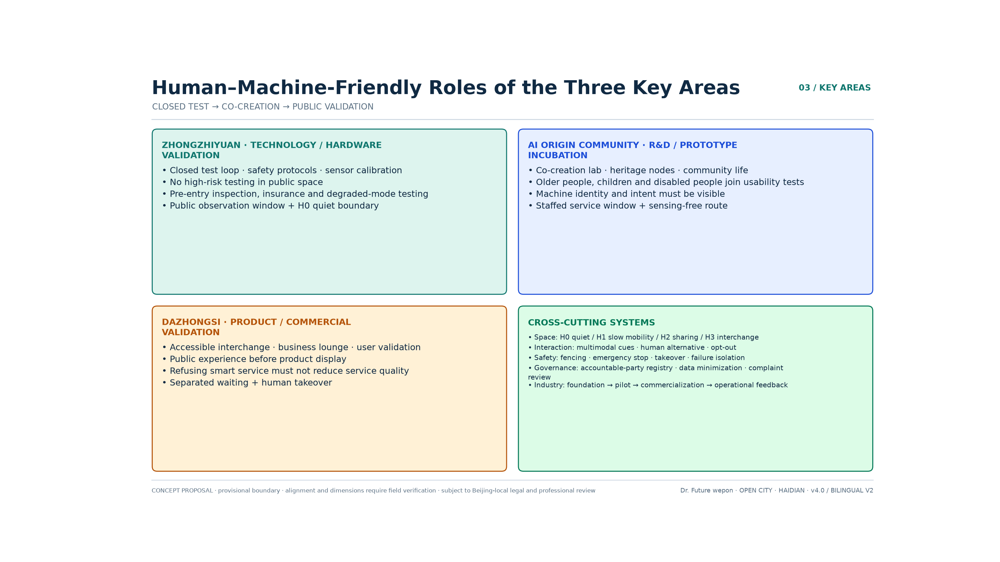

## Detailed Design of the Key Areas

The three key areas are developed under a division of labour of "substrate — pilot testing — conversion", down to nodes, shared-movement rules and risk registers that can be discussed. The depth is that of a conceptual detailed design, not construction drawings [depth:three_key_area_detailed_design].

### Zhongzhi Park: Technology and Hardware Validation End (approx. 192.1 ha, provisional)

**Positioning**: the validation end for full-stack independent innovation and for safety protocols [source:AGENT-TASKBOOK].  
**Structure**: predominantly research land plus a central public field plus a closed and semi-open test loop on the northern segment of the spine [data:geometry/key_areas.geojson#PROV-KEY-001] [data:geometry/public_space.geojson#PLZ-004].  
**Human–machine friendly focus**: this corresponds to the "testing and display" end of the Fuxing Island pathway and to the regulatory sandbox in the thesis. High-risk, extreme-weather and platooning tests stay inside the closed test loop; before opening, identity registration, safety inspection, liability insurance and degradation testing must be complete; enterprises receive conceptual support oriented towards high-precision maps and interfaces, but raw personal data does not leave the domain. The central public field provides public observation windows, human-guided interpretation and a machine-free quiet boundary, so that testing and everyday slow mobility do not intrude on each other [data:geometry/constraints.geojson#SN-010]. Generic technology platform orientation: sensor calibration, simulation, safety assessment and a liability-insurance service desk, lowering the cost of duplicated effort for small and medium teams [source:CASE-FUXING-HMF-GUIDE].  
**Risks**: accessibility from the 5th Ring Road, municipal capacity for large facilities, and coordination of tenure remain to be confirmed [depth:risk_missing_data].

### AI Origin Community: R&D and Prototype Incubation End (approx. 104.3 ha, provisional)

**Positioning**: a near-campus innovation ecosystem and prototype-production end [source:AGENT-TASKBOOK].  
**Structure**: the commemorative space at Qinghuayuan Station plus twin plazas plus a research and culture block [data:geometry/key_areas.geojson#PROV-KEY-002] [data:geometry/public_space.geojson#PLZ-002].  
**Human–machine friendly focus**: this corresponds to the "tenancy, incubation and prototype iteration" end. Open laboratories and prototype workshops are equipped with co-creation tables, simulated testing and ethical review; high-density plazas, heritage space and the community living surface are designated H0/H1, where machines must keep interference low, and actively declare their identity and movement intent. Usability testing is organised with older people, children and people with disabilities; the public may choose a staffed window and a non-sensed route. University–enterprise joint laboratories are encouraged to work on real corridor pain points such as human–machine interaction and environmental perception, rather than staging exhibitions [data:geometry/constraints.geojson#SN-006] [source:CASE-FUXING-HMF-GUIDE].  
**Risks**: the heritage control zone, university tenure, and participation in community renewal [depth:risk_missing_data].

### Dazhongsi: Productisation and Commercial Validation End (approx. 72.0 ha, provisional)

**Positioning**: the conversion end for intelligent agents, content consumption and smart terminals [source:AGENT-TASKBOOK].  
**Structure**: an interchange plaza plus a test and validation corridor plus a commercial living room [data:geometry/key_areas.geojson#PROV-KEY-003] [data:geometry/public_space.geojson#PLZ-001].  
**Human–machine friendly focus**: this corresponds to the "R&D innovation and commercial validation" end and to a pilot orientation across B2C, B2B and B2G models. Product validation is carried out in real commercial and interchange settings, but "public experience" is placed ahead of "product display". Every service provides a human alternative, explicit disclosure of price and data use, protection of minors, and a complaints channel. Low-speed connection links the metro to the campuses, and platforms provide separated human and machine waiting areas, step-free boarding, handover docking and human takeover. Clauses and toolkits are exported outward only once validated, rather than claimed replicable before validation [data:geometry/constraints.geojson#SN-001] [source:CASE-FUXING-HMF-GUIDE].  
**Risks**: engineering conditions for rail integration, coordination with existing commerce, and public-safety approvals [depth:risk_missing_data].

## AI Innovation Ecosystem, Talent Profiles and AI+ Scenarios

### Map of the AI Innovation Ecosystem

The five-layer map is reorganised along the spine: **foundation layer (universities and institutes) → engineering layer (Zhongzhi Park) → pilot-test layer (open testing along the spine) → application layer (Dazhongsi and everyday-life settings) → service and governance layer (west-wing factors plus covenant-based governance)** [source:AGENT-TASKBOOK] [depth:existing_conditions_diagnosis].

### Profiles of Human Users and Machine Actors

**Eight categories of human user**: AI founders and early-stage teams; developers and open-source contributors; employees of AI enterprises; university staff, students and researchers; nearby residents; tourists and international visitors; the groups requiring particular protection — **older people, children, people with disabilities and their carers**; and on-site operations and emergency personnel. Evaluation does not take the "average user" as its only measure: at minimum, the journeys of wheelchair users, white-cane users, hearing-aid users, pram users, people with cognitive impairment and people without smartphones must each be validated separately.

**Six categories of machine actor**: service (guiding, elder support, medical), operational (cleaning, maintenance), inspection and security, interactive and social, transport and delivery, and emergency and special-purpose. Different categories are subject to different admission rules, speeds, time slots, spatial permissions and levels of human supervision; a humanoid appearance must not disguise the fact that the object is a machine [source:CASE-FUXING-HMF-GUIDE].

### Five Settings × Five Friendliness Evaluation Matrix

Fuxing Island defines the scenario system as mobility, work, service, social interaction and governance, and defines friendliness along five dimensions: movement, work, environment, interaction and governance. Jing-Zhang keeps this matrix and adds the clause-level acceptance that the thesis requires: each scenario is first classified, then accepted against the five dimensions. The minimum common requirements are continuous accessibility, identifiable machine identity and intent, a human alternative, opt-out and yielding, emergency stop and takeover, data minimisation, a named responsible party and a complaints channel. Social-interaction settings add "courteous behaviour" (keeping distance, yielding to crowds) and the option to withdraw; governance settings add human–machine collaborative deliberation and near-miss disclosure. If any single requirement is unmet, the scenario must not move from closed testing into public operation [source:CASE-FUXING-HMF-GUIDE] [source:METHOD-THESIS-HMF].

### AI Scenario Cards (13 cards across 12 composite nodes, including 3 industrial test-validation cards)

| No. | Setting | Scenario and subjects | Location | Human–machine friendly limits | Human responsibility |
|---|---|---|---|---|---|
| S01 | Mobility | Assessment of slow mobility sharing movement with low-speed machines; commuters/residents | Central segment of the spine | People first, aggregated sensing, purely pedestrian alternative, near-miss logging | Transport authority |
| S02 | Mobility | Accessible low-speed connection and interchange; older people/people with disabilities/commuters | SN-008 | Step-free boarding, multimodal prompts, human backup | Rail/transport |
| S03 | Service | Low-speed robot delivery; residents/merchants | SN-010 | Edge handover, no entry to dense areas, identity and intent lights | Transport/operations |
| S04 | Work | Inspection, cleaning and maintenance; property management/public | Public layer of the three areas | Off-peak operation, noise control, fault isolation | Property management |
| S05 | Social interaction | AI cultural guiding; tourists/children/international visitors | SN-004 | Public materials, multilingual/large-type/voice, human interpretation | Heritage authority |
| S06 | Service | Health navigation; residents/older people | SN-007 | No collection of medical records, no diagnosis, referral to human medical staff | Medical institutions |
| S07 | Work | Enterprise service copilot; enterprises/founders | SN-009 | Enterprise authorisation, verifiable output, important decisions signed by a person | Enterprises |
| S08 | Service | AI-native commercial living room; consumers | SN-002 | Price and data use disclosed, refusal without degradation of service, human service | Commercial operator |
| S09 | Governance | Crowd-safety support at events; public/operator | SN-003 | Anonymous aggregation, no facial-recognition gate, dual review | Public security/operator |
| S10 | Social interaction | Open-source showcase gallery; developers/public | SN-005 | Machine nature clearly stated, distance kept, interaction can be withdrawn | Community self-governance |
| S11 | Mobility | **Test A: open test segment on the spine**; enterprises/public observers | Selected segment of the spine | Closed before open, geofence, emergency stop, safety marshal | Professional body |
| S12 | Service | **Test B: medical-navigation sandbox**; enterprises/hospitals | SN-011 | Synthetic data first, ethical review, no automated diagnosis | Medical/ethics body |
| S13 | Governance | **Test C: event-safety review exercise**; operator/government | Co-located with SN-003 | Minimised collection, controlled exercise, decision authority with people | Dual review |

The above are 13 conceptual scenario cards [metric:ai_scenario_card_count] reusing 12 spatial nodes [metric:ai_scenario_node_count]; "card count" and "node count" are no longer conflated. No supplier is presumed and no approved operation is claimed. Every card carries human takeover, stop conditions, a named responsible party and a public feedback channel [source:AGENT-TASKBOOK].

### The Jing-Zhang Human–Machine Friendly Twelve Shichen (Time-Slot Shared-Movement Table)

The Twelve Shichen are the **nodes** within nodes–corridors–areas: one day is divided into twelve operating clauses that can be accepted on site, hung on the shared spine RD-001 and on existing scenario nodes rather than on a separate timetable imported from another city's campus. Methodologically it borrows the **clock structure** of Fuxing Island's "organising scenarios by time period", while all content is rewritten for Jing-Zhang: let the park sleep first, then let people have the peak, and keep logistics on H3 only [source:CASE-FUXING-HMF-GUIDE] [source:METHOD-THESIS-HMF] [metric:hmf_twelve_hours_count].

| Period | Hours | Scene | Right of way | Setting | Location | People-first rule |
|---|---|---|---|---|---|---|
| Zi | 23:00–01:00 | Quiet return to depot | H0 | Governance | SN-006 central green artery / Qinghuayuan Station quiet memorial | Only human patrols remain in the park; autonomous machines must return to depot |
| Chou | 01:00–03:00 | Recharging and maintenance | H3 | Work | SN-010 Zhongzhi Park peripheral maintenance loop | Charging and servicing only on H3, never in the park or residential areas |
| Yin | 03:00–05:00 | Off-peak cleaning | H2 | Work | Edges of the public layer in the three areas | Cleaning is off-peak and noise-controlled; H0 is closed to it |
| Mao | 05:00–07:00 | Doors open, machines yield | H1 | Mobility | Spine RD-001 | Commuting begins, machines yield to people, staffed door-opening service |
| Chen | 07:00–09:00 | School and work peak | H1 | Mobility | SN-008 all-age accessible connection | Pedestrian peak; connection services yield most strictly or machine entry is suspended |
| Si | 09:00–11:00 | Shared-work workshop | H2 | Work | SN-009 enterprise human–machine collaboration service station | Collaborative support; important decisions must be signed by a person |
| Wu | 11:00–13:00 | Shared meals and rest | H1 | Service | Park seating / Dazhongsi edge handover bay | Meal delivery reaches the handover bay only, never seating or children's activity areas |
| Wei | 13:00–15:00 | Guided slow walk | H1 | Social interaction | SN-004 / SN-006 | Guiding can be opted out of, human interpretation runs in parallel, the heritage core stays H0 |
| Shen | 15:00–17:00 | Campus stitching | H1 | Mobility | East–west connection at the university gates | Between-class flows; machines wait in pull-off bays |
| You | 17:00–19:00 | Homeward yielding | H1 | Mobility | The whole spine | Evening peak; machines dock or downgrade, people have absolute priority |
| Xu | 19:00–21:00 | Evening care for elders | H1 | Service | SN-007 health navigation | Elder-support navigation adds a staffed window; it can be completed without a smartphone |
| Hai | 21:00–23:00 | Patrol handover | H2 | Governance | SN-003 public-safety dual review | Human patrol leads; machines only aggregate anonymously and impose no facial-recognition gate |

What must not be written into this clock: low-altitude delivery across the park, platooning of self-driving shuttles, L4–L5 full autonomy, a blanket speed limit, or another city's timetable with the place names swapped. The Twelve Shichen are a conceptual operating recommendation; opening and no-entry periods may be trialled only after dedicated review by transport, heritage, community and emergency authorities [depth:risk_missing_data].

Three of the twelve are raised to **field acceptance gates**: return to depot at Zi, yielding at peak, and logistics on H3 only. The other nine remain time-slot clauses; these three must be written as procedures that can be judged pass or fail on the spot, and failing one downgrades the whole corridor rather than being settled by fixing a single machine [metric:hmf_hard_gate_count].

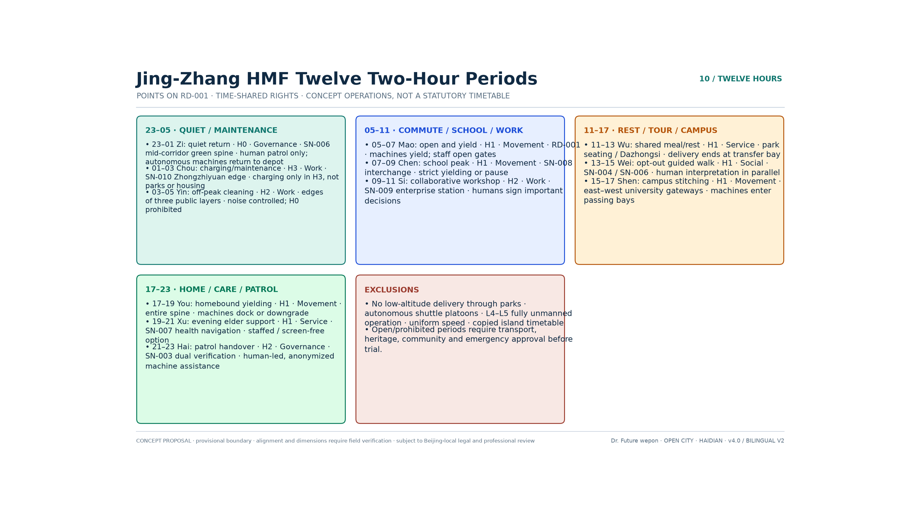

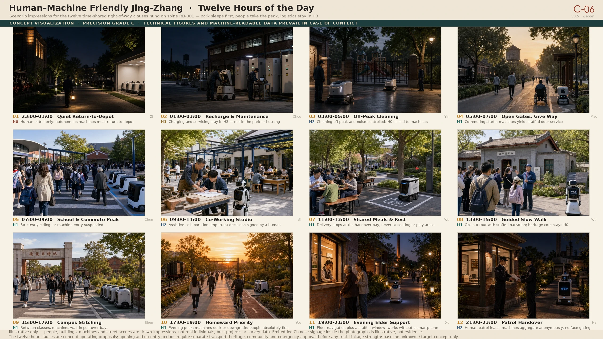

### Three Field Acceptance Gates (Fail One and the Whole Corridor Is Downgraded)

Implementability does not come from drawing yet another corridor. It comes from writing "people first" into procedures that can be **counted, stopped and reversed on site**. The three gates are hung on existing nodes and renewal projects; their positions are indicative at grade C and their widths await survey. They are recommendations for pilot acceptance, not an approved operating timetable [depth:phasing_implementation] [depth:risk_missing_data] [metric:hmf_hard_gate_count].

| Gate | Corresponding period | Field criterion (countable that night / that day) | Failure | Corridor-wide downgrade | Location |
|---|---|---|---|---|---|
| G-01 Return-to-depot closure | Zi 23:00–01:00 | After 23:00, the number of autonomous machines inside the H0 green artery and the SN-006 quiet segment must be 0 | Finding 1 machine is a FAIL for that night | 3 consecutive nights of FAIL: that machine type drops from H2 to H3 only, until a return-to-depot drill PASSes | SN-006 / RP-02 |
| G-02 Yielding at peak | Chen 07:00–09:00 · You 17:00–19:00 | The pedestrian centreline of RD-001 must not be occupied by machines; they must pull into a bay or suspend entry | Occupying the centreline counts as 1 near-miss | ≥1 near-miss that day: that machine type is barred from the same peak the next day | RD-001 / RP-03 |
| G-03 Logistics kept outside | All day · especially Wu 11:00–13:00 | The number of delivery machines inside the park, H0, seating and children's activity areas must be 0; meal delivery reaches the named handover bay only | 1 machine found inside the park is a FAIL for that day | Delivery permissions on the park side are closed for that day, leaving only the H3 periphery | Handover bay / RP-15 · H3 loop / SN-010 |

**A corridor-wide downgrade, not a single machine swapped out**: failure is recorded against the machine type and the time slot, and "this one broke, so we swapped in another and kept occupying the route" is not accepted. There is only one condition for restoration: redo the corresponding drill (return to depot / yielding / handover) and PASS on the spot. Human passage, accessibility and emergency response are never downgraded; what is downgraded is machine permission [source:METHOD-THESIS-HMF] [source:CASE-FUXING-HMF-GUIDE].

Five identifiable physical components put the procedures on the ground, all reusing renewal projects already listed rather than starting a separate works schedule [metric:hmf_field_component_count]:

| Component | Function | Attached to |
|---|---|---|
| FC-01 Quiet return-to-depot post | Counts machines inside H0 at Zi; staff can lock the park-segment entrance | SN-006 / RP-02 |
| FC-02 Peak pull-off bay | Machines must leave the centreline at the Chen and You peaks | RD-001 / RP-03 |
| FC-03 Handover bay | Meal delivery and parcel collection stop here and do not enter seating areas | Dazhongsi edge / RP-15 |
| FC-04 Emergency-stop post plus screen-free window | Anyone can stop a machine; help can be obtained without a smartphone | Area-wide / RP-16 |
| FC-05 H3 recharging loop | Charging, servicing and fault isolation stay out of the green artery | SN-010 / RP-16 |

Pilot sequence: until the six verification items of P0 are complete, the three gates run as closed drills only and do not enter the open spine; at P1, G-03 and G-02 are trialled only at the H3/H2 edge of Dazhongsi; G-01 may be tested at night only after item 3 of P0 is complete for the H0 quiet segment in the AI Origin Community. If any gate fails repeatedly, the opening permission for that segment reverts to the previous stage instead of adding more machines [data:geometry/phasing.geojson#PHASE-P1] [metric:hmf_rollback_rule_count].

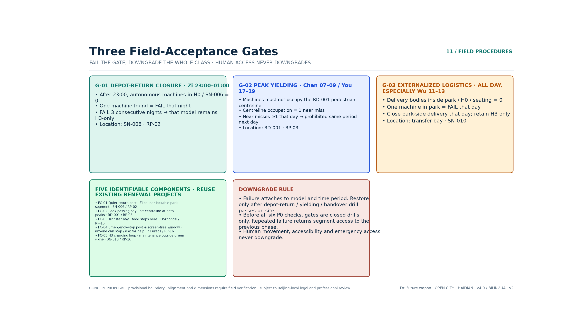

## Land Use, Building Scale and the Demolish–Retrofit–Retain Scheme

`geometry/land_use.geojson` covers the provisional overall boundary completely with 17 zoning units, with no gaps and no overlaps [data:geometry/land_use.geojson#LU-001] [metric:land_use_coverage_ratio]. The design intent is to concentrate research and innovation land in Zhongzhi Park and the northern segment, to cluster commercial services around Dazhongsi and the central-southern segment, to run green space as a band along the spine, and to let reserve land carry open testing and long-term flexibility — avoiding the structural ailment of "a collage of functional colour blocks with no operating spine" [depth:land_use_layout].

At the building level, `geometry/buildings.geojson` provides about 35 conceptual footprints with a recomputed footprint area of about 534,000 m², used only to discuss cluster density and public frontage; it does not represent a survey of existing conditions or any approved project [data:geometry/buildings.geojson#BLD-0001] [metric:building_footprint_area_sqm]. The demolish–retrofit–retain principle is "retain as the rule, repair and upgrade, build new with restraint, leave blank for flexibility": heritage assets and the railway heritage fabric itself receive only protective display and peripheral organisation; campuses and communities are addressed mainly through repair and functional substitution; new construction is concentrated at conceptual nodes where the intent to renew is already clear; test grounds are placed first on reserve land and low-sensitivity edges [depth:retain_renovate_demolish].

Because official floor area ratios, heights, tenure and a building survey were not supplied with the public material, floor area ratio and height remain unknown [metric:floor_area_ratio] [metric:building_height_m]. This proposal draws no pseudo-statutory conclusion on plot intensity or demolition volume; the relevant figures will be recomputed under the design-depth and missing-data rules once the official regulatory plan and the survey of existing conditions are available [depth:development_intensity_controls] [depth:risk_missing_data].

## Transport, Rail, Municipal Systems and Public Service Facilities

### Transport and Slow Mobility (Dedicated Section on the Spine)

Strategy: **continuity of human passage first, tiered authorisation for machines, accessible station-to-city connection, and east–west stitching** [depth:traffic_rail_slow_parking].  
In `geometry/roads.geojson`, RD-001 is defined as the **human–machine friendly shared spine**: walking and cycling dominate, and H0/H1/H2/H3 tiers govern low-speed connection and delivery and maintenance robots; the east–west connector roads carry the stitching; three rail-connection lines link the three areas [data:geometry/roads.geojson#RD-001] [metric:road_network_length_m].

Node-density target (concept): from about 1.3 scenario points per km to one combined pair of points on both sides every 0.5–1 km, each comprising "staffed service / accessible rest plus docking and handover / charging and maintenance / emergency stop and takeover". Machine facilities must not encroach on tactile paving, wheelchair turning space, fire access or standing space.

### Municipal and New Infrastructure

Sensing poles, recharging, communications and edge computing are combined with street lighting and greenway furniture, on the principle of "sense only when necessary, process at the edge first, and keep raw data inside the domain wherever possible". The digital twin registers machine identity, permissions, location, faults, takeovers and maintenance status; it does not build full personal profiles of public space. When the network is interrupted, devices enter a safe-stop or withdraw state and staffed service continues to be available. Recharging and maintenance points use renewable energy by preference and keep a safe separation from crowded areas; capacity and utility routing await professional calculation [depth:municipal_new_infrastructure].

### Public Services

Three levels: city-wide, district and community, with emphasis on the 15-minute living circle for talent and on continuous accessibility. All intelligent services follow the rule that "digital channels add convenience but must not abolish non-digital channels such as telephone, counter service and human guidance", so as to prevent a digital divide [depth:renewal_project_list].

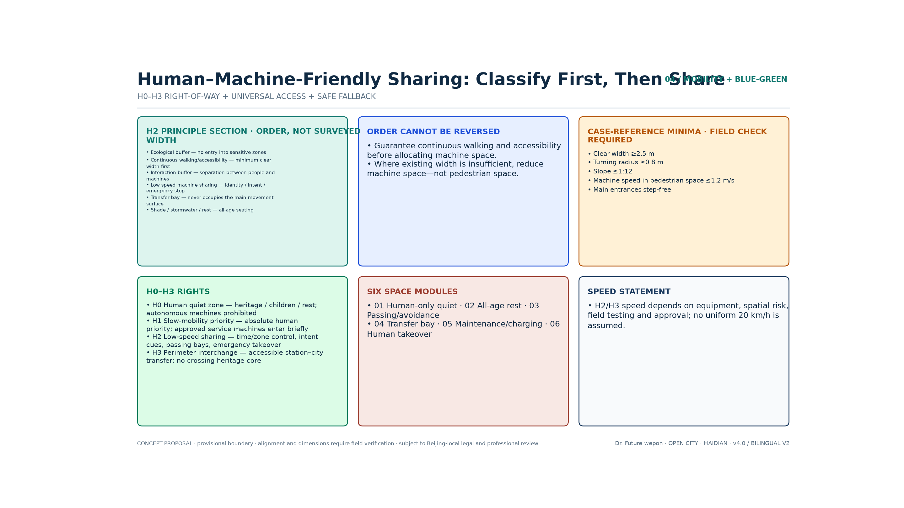

## Blue-Green Space, Public Space and Urban Character

### From Green Belt to Human–Machine Friendly Shared Corridor

The indicative green area is about 416.9 ha [metric:green_space_area_sqm] [data:geometry/green_space.geojson#GRN-001], a green space ratio of about 36.5% [metric:green_ratio]. From v3.1 onwards the green artery is split into three operating segments: GRN-001 southern segment (Dazhongsi to the south-central segment, the forecourt for public validation), GRN-002 central segment (AI Origin Community to the former Qinghuayuan Station, including the H0 quiet segment and the heritage buffer), and GRN-003 northern segment (Zhongzhi Park to the northern gateway, the observation frontage outside the closed test area). The footprint and area of the three segments combined are identical to v3.0, which makes it possible to assign operating responsibility segment by segment. The green artery must carry a human–machine friendly operating layer on top: a continuous accessible route, H0 quiet segments, shared-movement prompts and pull-off bays, shade and shelter, low-reflectance paving, charging and maintenance, emergency stop and human takeover. The blue corridor (Xiaoyue River, indicative) carries ecological cooling and the interface to the scenario wing; machine operation must not encroach on the ecologically sensitive belt [data:geometry/constraints.geojson#CON-WTR-001] [depth:blue_green_public_space].

### Public Space and Pilgrimage Landmarks (4)

Six conceptual plazas are retained as gateway and handover spaces [metric:public_space_ratio] [metric:public_space_area_sqm]. The plazas are equipped with separated human and machine docking, clear identity signalling, all-age seating, quiet corners, staffed service points and multimodal wayfinding. There are 4 conceptual pilgrimage landmarks in total [metric:ai_landmark_count]:

1. Qinghuayuan Station · Human–Machine Friendly Origin Memorial (SN-006)  
2. Developers' Promenade · Open-Source Showcase Gallery (SN-005)  
3. Wall of Honour for Agent Contributions (SN-012)  
4. AI Milestone Timeline nodes (updatable)

None occupies the core of the heritage construction-control zone, and their form awaits professional and heritage-authority confirmation [source:AGENT-TASKBOOK].

### Character

The keynote is "rail line, slow mobility and protocol": rust red / ink blue / leaf green; continuous frontage and an open park; height and massing to be governed by the regulatory plan [depth:height_massing_character].

## Renewal Project Register, Implementation Policy and Phasing Plan

### Renewal Project Register (18 conceptual projects)

Reorganised by type: shared-movement works on the spine (4), renewal of industrial premises (4), station-to-city connection (3), public space (3), and testing and operating facilities (4) [metric:renewal_project_count]. Priorities among the 18: an all-age accessibility survey and the stitching of discontinuities, human quiet segments, the H2 shared-movement pilot, the twin-point network of staffed service and machine maintenance, machine identity and intent marking, the public complaints and opt-out mechanism, the open test segment, the origin memorial, the Dazhongsi validation corridor, and the data sandbox and talent services. The policy sequence is "human bottom lines and governance rules first, then machine pilots, then industrial expansion", and no fiscal commitment is presumed [depth:renewal_project_list] [depth:phasing_implementation].

| ID | Type | Conceptual project | Main space / phase |
|---|---|---|---|
| RP-01 | Shared movement on the spine | All-age accessibility survey and stitching of discontinuities | Area-wide/P0 |
| RP-02 | Shared movement on the spine | H0 human quiet segment and purely pedestrian alternative route | AI Origin Community/P2 |
| RP-03 | Shared movement on the spine | H2 shared-movement cross-section, pull-off bays and prompt system | RD-001/P1–P3 |
| RP-04 | Shared movement on the spine | East–west accessible connection stitching | Three key areas/P1–P3 |
| RP-05 | Industrial premises | Zhongzhi Park closed testing and safety validation platform | Zhongzhi Park/P3 |
| RP-06 | Industrial premises | AI Origin Community human–machine co-creation and ethical review laboratory | AI Origin Community/P2 |
| RP-07 | Industrial premises | Dazhongsi public experience and commercial validation corridor | Dazhongsi/P1 |
| RP-08 | Industrial premises | Generic technology, testing and certification, and liability insurance service desk | West wing/P1–P3 |
| RP-09 | Station-to-city connection | Dazhongsi all-age accessible connection point | PLZ-001/P1 |
| RP-10 | Station-to-city connection | AI Origin Community rail connection and staffed service point | SN-008/P2 |
| RP-11 | Station-to-city connection | Zhongzhi Park low-speed connection and fault-isolation point | Zhongzhi Park/P3 |
| RP-12 | Public space | Qinghuayuan Station human–machine friendly origin memorial space | SN-006/P2 |
| RP-13 | Public space | Open-source showcase gallery with public opt-out | SN-005/P2 |
| RP-14 | Public space | Wall of honour for responsibility and contribution, AI milestone timeline | SN-012/P2 |
| RP-15 | Testing and operations | Twin-point network of staffed service and machine docking/handover | Area-wide/P1–P3 |
| RP-16 | Testing and operations | Charging and maintenance, physical emergency stop and human takeover network | Area-wide/P1–P3 |
| RP-17 | Testing and operations | Auditable data sandbox and public complaints platform | AI Origin Community/P2 |
| RP-18 | Testing and operations | Annual safety drills, near-miss review and standards iteration | Area-wide/routine operation |

### Phasing (Spatial Phases × Three Industrial Stages)

Spatially the work advances south — central — north; industrially it translates Fuxing Island's "testing and display — tenancy and incubation — R&D and innovation" in step, so that phasing does not exist in space alone without an enterprise gate:

- **P0 pre-admission (area-wide / policy)**: complete the accessibility, blind-spot, pedestrian-flow and heritage surveys and the human–machine friendly impact assessment checklist; establish the covenant, risk grading, data rules, insurance and the complaints mechanism. Until this is complete, open operation must not begin.
- **P1 southern segment (forecourt for conversion validation)**: Dazhongsi staffed service as a guaranteed baseline plus accessible connection plus H2 commercial validation and a shared-movement pilot; this corresponds to "limited-opening public validation" in the industrial pathway [data:geometry/phasing.geojson#PHASE-P1]
- **P2 central segment (incubation and co-creation)**: AI Origin Community H0/H1 quiet and heritage protection plus co-creation laboratories plus node densification; this corresponds to "tenancy, incubation and prototype iteration" [data:geometry/phasing.geojson#PHASE-P2]
- **P3 northern segment (testing and consolidation of standards)**: Zhongzhi Park's three-tier validation of closed testing — semi-open testing — public operation, with the spine connected end to end; this corresponds to "testing and display → standards export" [data:geometry/phasing.geojson#PHASE-P3] [metric:phasing_zone_count]

On the enterprise side there is no inversion of "attract investment first and add safety later": closed testing and a safety record come first, and only then is longer-term tenancy or joint R&D discussed. Exit mechanisms and liability insurance are written into the entry agreement [source:CASE-FUXING-HMF-GUIDE].

### Whole-Life-Cycle Governance Gates

These correspond to the guideline's "embedded in planning — construction in step — operational optimisation — iteration and rollout" and to the regulatory sandbox in the thesis:

1. **Before entry (planning/policy)**: device classification, third-party safety inspection, insurance, data impact assessment, accessibility impact assessment, and registration of the responsible person; high-risk capabilities stay inside the closed loop.
2. **During operation (flow)**: geofencing, identity and intent signalling, remote and physical emergency stops, human safety marshals, log retention, and near-miss reporting; the twin is used for dispatch and calibration, not for full profiling.
3. **In an anomaly**: protect people first, then property; automatic degradation on network loss, low battery or positioning failure; on-site personnel may stop a device unconditionally.
4. **After operation (policy)**: review of incidents and complaints, deliberation with public representatives, quarterly disclosure of aggregated performance, with downgrade or withdrawal where standards are not met; mature clauses enter the annual standards iteration and the external toolkit.

### Translating the Human–Machine Friendly Guideline: the Jing-Zhang Implementation Playbook

Chapter 12 of the Fuxing Island guideline breaks implementation into planning assessment, construction in step, operational optimisation and rule iteration; Chapters 8 and 9 write the enterprise pathway as "test — certify — connect", with a safety marshal assigned where the standard is not met and full autonomy never permitted directly. Jing-Zhang translates only the **procedure**, not the island's scenario list: it does not write in low-altitude delivery, dedicated autonomous-driving lanes or L4–L5 full autonomy, and it does not present "Fuxing Island certification / first-purchase-and-first-use / fiscal subsidy" as existing Haidian policy [source:CASE-FUXING-HMF-GUIDE] [source:METHOD-THESIS-HMF] [metric:hmf_playbook_stage_count].

The four-stage playbook is aligned with the three field gates and the five components. All of it is a conceptual implementation recommendation, and it may be trialled only after dedicated review under Beijing's local regulations and by the heritage, transport and emergency authorities [depth:phasing_implementation] [depth:risk_missing_data].

| Stage | Source in the guideline | Jing-Zhang field action | Pass condition | Attached to |
|---|---|---|---|---|
| S1 Planning assessment | 12.1 Human–machine friendly impact assessment | At P0, complete the transport / pedestrian-flow / heritage / accessibility impact assessments; register and publish device classification, risk grading, responsible person, insurance and the complaints channel | If the assessment checklist is not closed, the open spine must not be entered | RP-01 · P0 |
| S2 Construction in step | 12.2 Concealed works and handover drills | Beacons, emergency stops, handover bays and pull-off bays are accepted together with the civil works; before handover, closed drills of G-01 / G-02 / G-03 are mandatory | If a drill does not PASS, no night testing or peak opening | FC-01–05 · RP-16 |
| S3 Test, certify, connect | 2.6 / 8.3 Test — certify — connect | Closed testing first, then compatibility verification, then connection; geofence, remote takeover, physical emergency stop and auditable logs are mandatory; where the standard is not met, only a safety marshal is assigned and full autonomy is prohibited | Missing any one safety item = no connection; repeated gate failure triggers a corridor-wide downgrade | G-01–03 · RP-05 / RP-08 |
| S4 Operational review | 7.2 / 12.3–12.4 Human-in-the-loop and rule iteration | Important decisions signed by a person; H0 / campus gates / children's areas are listed as geographic and temporal red lines; rules revised at most every 12 months or after a major event; the Five Friendliness acceptance checklist passed item by item | If any Five Friendliness item is unmet, the scenario must not move from closed testing into public operation | RP-17 · RP-18 |

**Test — certify — connect (enterprise side; all three steps are indispensable)** [metric:hmf_enterprise_access_step_count]

1. **Test**: only inside the Zhongzhi Park closed loop or at the H3 edge; the enterprise submits machine type, task, time slot and responsible person; the platform provides de-identified environmental data, and raw personal data does not leave the domain.
2. **Certify**: verification of the orientation of communication and data interfaces (open protocols, unified JSON, written API), safety policy, insurance and emergency stop. This is Jing-Zhang's own compatibility verification; it does not borrow another city's certification brand.
3. **Connect**: once verification passes, time slots are authorised according to H0–H3 and the three gates. The enterprise must write test results and near-misses back, forming a written "test — feedback — optimise" loop. Failure to write back counts as a FAIL for that machine type for the quarter [source:CASE-FUXING-HMF-GUIDE].

**Five Friendliness field acceptance checklist (failing any item bars public operation)** [metric:hmf_playbook_check_count]

| Dimension | Field spot-check |
|---|---|
| Movement friendliness | Clear width, turning and gradient of the main route verified against the conceptual floors; a register exists for the five categories of discontinuity — entering doors, going up floors, crossing thresholds, wayfinding, recharging; machines must not encroach on the clear accessible width |
| Work friendliness | A register exists for operating machines: duties, time slots, responsible person, insurance; work routes do not cross peak pedestrian flows; maintenance only on H3 |
| Environmental friendliness | Low-reflectance paving, shade and shelter, recharging kept out of the green artery; identification lights visible at night |
| Interaction friendliness | Identity and intent lights, voice or large type, staffed window and screen-free route all present at once; interaction buffer verified against the conceptual floor |
| Governance friendliness | Collection devices disclosed, one-touch yielding, human-in-the-loop, traceable logs, complaints channel usable on the spot |

**Guideline clauses explicitly not transferred to Jing-Zhang**: dedicated autonomous-driving lanes, drone emergency stations, L4–L5 fully unmanned public testing, a blanket speed limit, another city's certification brand, and first-purchase-and-first-use or fiscal subsidies. These either conflict with Jing-Zhang's people-first stance or exceed the authority of this proposal, and must not be written into the drawings or the pilot agreements.

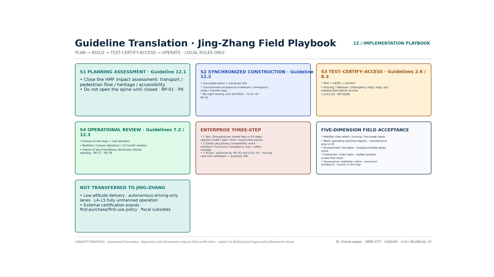

### Global Events and Operations (agent.6)

The aim is to make the belt a public platform that can be seen internationally, joined by teams and accumulated as an asset — not a one-off exhibition. Annual rhythm (concept): **Q1 shared-movement covenant and safety-marshal training → Q2 human–machine friendly open day and international observer delegation → Q3 open-source hackathon and scenario-admission assessment → Q4 developer conference and annual review disclosure**. The conversion funnel runs "see → arrive → participate → settle": bilingual portfolios and an open-source repository handle being seen; observer delegations and joint testing handle arrival; hackathons and shared-movement drills handle participation; protocol templates and standards export handle what settles. Portable assets include the template shared-movement covenant, the Five Friendliness acceptance checklist, definitions of near-miss events, and the open-day toolkit. All of this is a conceptual mechanism; no funding, host organisation or government commitment is presumed [source:AGENT-TASKBOOK].

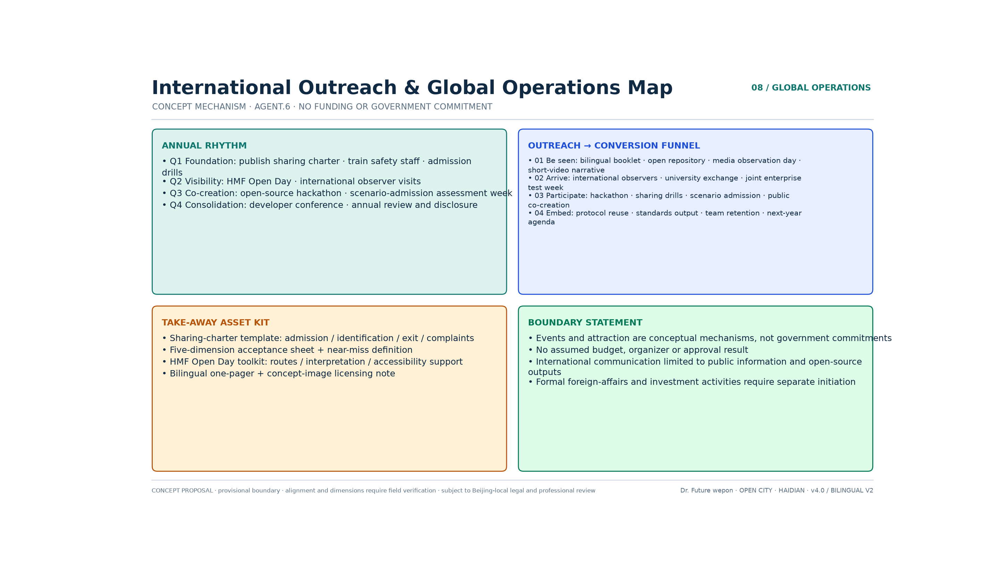

## Indicator System, Area Recomputation and Compliance Matrix

### Recomputed Spatial Indicators

| Indicator | Recomputed value | File |
|---|---|---|
| Overall area | ≈1,141.3 ha | [metric:site_area_sqm] |
| Land-use coverage | 100% | [metric:land_use_coverage_ratio] |
| Green space ratio | ≈36.5% | [metric:green_ratio] |
| Public space ratio | ≈13.5% | [metric:public_space_ratio] |
| Building footprint | ≈534,000 m² | [metric:building_footprint_area_sqm] |
| Road network length | ≈41.5 km | [metric:road_network_length_m] |
| Spine length / vertex count | ≈9.665 km / 82 | [metric:spine_length_m] [metric:spine_vertex_count] |
| Scenario nodes inside key areas | 10/12 ≈ 83.3% | [metric:scenario_node_key_area_containment_ratio] |
| Key areas / scenario nodes / scenario cards / landmarks / projects | 3 / 12 / 13 / 4 / 18 | Scenario cards may be reused across nodes |

Floor area ratio and height are unknown [metric:floor_area_ratio] [metric:building_height_m].

### Connection-Intensity Indicators (Added by This Proposal, Conceptual Monitoring)

| Dimension | Indicator | Phase target (concept) |
|---|---|---|
| Spatial connection | Number of east–west through routes, rate of slow-mobility discontinuities eliminated, travel time between the three areas | Improvement ≥30% after the baseline survey |
| Technical connection | Number of cross-enterprise interfaces, number of joint tests, component reuse rate | ≥50 joint tests per year |
| Industrial connection | Rate of prototypes entering testing, test-to-order conversion rate, number of cross-area projects | Entry-to-market conversion ≥20% |
| Talent connection | Number of joint teams, event participation, team retention | ≥100 active teams per year |
| Scenario connection | Service coverage, human takeover rate, fault rate, satisfaction | Falling takeover rate, satisfaction ≥80% |

"Multiplication" is defined as: more research outputs entering testing along the spine → more tests entering procurement or commercialisation → more operating data flowing back into research. The compliance matrix covers announcement items 1.3–1.5 and agent.1–6 [depth:metrics_recalculation].

### Dedicated Human–Machine Friendly Indicators (All Baselines Yet to Be Measured)

| Dimension | Core indicator | Direction of judgement |
|---|---|---|
| Movement friendliness | Accessibility continuity rate, end-to-end reachability for wheelchair and white-cane users, count of machine encroachments on clear width | Accessibility continuity rises, encroachment falls to zero |
| Work friendliness | Off-peak rate for operations, coverage of maintenance points, time for human takeover to arrive | Faults isolated quickly, personnel duties clear |
| Environmental friendliness | Coverage of shade and shelter, noise, low-reflectance paving, share of green power in recharging | Environmental burden falls |
| Interaction friendliness | Compliance rate of machine identity and intent marking, availability of human alternatives, success rate of opting out | The public can always understand and always refuse |
| Governance friendliness | Near-miss events per 1,000 km, takeover rate, complaint closure time, data-boundary breaches | Auditable, correctable, accountable |
| Equity | Gap in satisfaction between older people, children and people with disabilities and ordinary users | The gap between groups keeps narrowing |

All of the above is a monitoring framework whose baselines are still to be established. Accessible-route continuity and machine-identity compliance require field surveys [metric:accessible_route_continuity_ratio] [metric:machine_identity_compliance_ratio]; human takeover response, near misses and manual-service availability must likewise be recorded from zero [metric:human_takeover_response_time_s] [metric:near_miss_events_per_1000km] [metric:manual_service_availability_ratio]. This proposal invents no current values and promises no unverified target values.

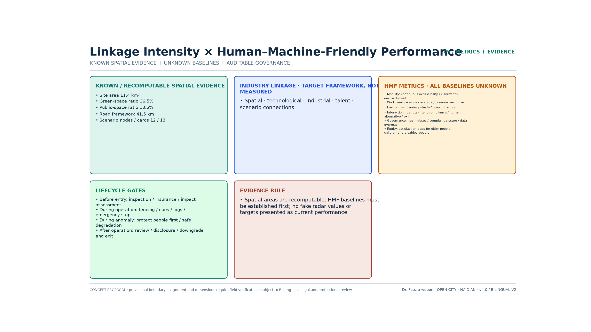

## Drawing Precision Grades and Verification of Existing Conditions

The drawings in this proposal are **conceptual urban design drawings**, not surveyed engineering drawings. To prevent misreading by the jury and by subsequent teams, this section declares, for each geometric layer, its degree of reliability, its permitted use and the conditions for its replacement. The content of this section corresponds one-to-one with the `alignment_precision`, `location_uncertainty_m` and `field_survey_required` fields in the properties of the submitted GeoJSON [depth:risk_missing_data].

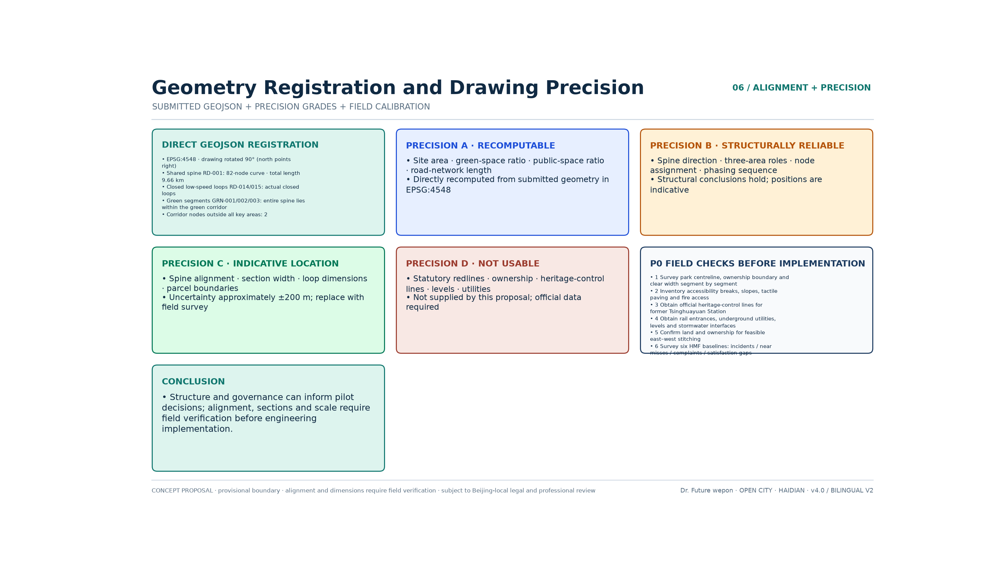

### Precision Grades

| Grade | Coverage | Reliability | Permitted use |
|---|---|---|---|
| A Recomputable | Scope areas, green space ratio, public space ratio, road network length, node counts | Recomputed directly from the submitted geometry in EPSG:4548 and reproducible by a third party | May be used for structural judgement and scheme comparison [metric:site_area_sqm] [metric:road_network_length_m] |
| B Structurally reliable | Spine alignment direction, the division of labour across three areas, node attribution, phasing sequence, the logic of tiered right of way | The structural judgement holds; specific positions are indicative | May be used for jury argument and pilot decisions |
| C Positionally indicative | Spine alignment, cross-section widths, service-loop dimensions, plot and plaza boundaries | Horizontal uncertainty of about ±200 m [metric:geometry_horizontal_uncertainty_m] | Indicative only; may be developed further only after replacement by survey |
| D Not usable | Red lines, tenure lines, heritage control lines, vertical levels, utilities, construction setting-out | Not provided by this proposal | Citation is strictly prohibited; must be supplied from official material |

### Alignment Problems Already Fixed in v3.1

| Problem (v3.0) | Treatment | Verification result |
|---|---|---|
| RD-001 was a 2-point straight line unrelated to the alignment of the heritage park | Rebuilt as an 82-vertex curved polyline passing through the three key areas | The spine lies 100% inside the conceptual green-artery envelope; it intersects Dazhongsi / AI Origin / Zhongzhi Park over about 0.65 / 1.11 / 2.06 km respectively [data:geometry/roads.geojson#RD-001] |
| 6 of the 12 scenario nodes fell outside the key areas | Relocated into their designated key areas, with new `key_area_id`, `within_key_area` and `distance_to_spine_m` attributes | 10 now fall inside their designated area; SN-005 and SN-009 are explicitly marked as corridor-segment nodes [metric:scenario_node_key_area_containment_ratio] |
| RD-014/015 were named "loops" but were in fact 2-point straight lines | Rebuilt as genuinely closed loops | Both loops are closed and lie 100% inside their corresponding key area |
| The green artery was a single block and responsibility could not be assigned by segment | Split into southern, central and northern segments | Footprint and total area are identical to v3.0, and the green space ratio is unchanged [metric:green_ratio] |
| All service branches were straight lines, disconnected from the spine | All changed to offsets following the spine curve or anchored to the spine | No road extends beyond the design scope; the recomputed road network length is updated from 38.2 km to 41.5 km |

It must be stated honestly that these fixes resolve **internal geometric consistency and correctness of relationships**; they do not mean the alignment is now matched to reality. The spine remains an indicative centreline derived within the provisional scope, and it must be replaced by the surveyed centreline of the Jing-Zhang Railway Heritage Park together with tenure boundaries and heritage control lines.

### Verification of Existing Conditions Required Before Implementation (P0, Six Items)

1. Surveyed centreline of the heritage park, tenure boundaries, and a segment-by-segment survey of cross-sectional clear widths;
2. A register of existing accessibility discontinuities, gradients, tactile paving and fire access routes;
3. The official heritage protection scope and construction-control zone boundary for the former Qinghuayuan Station;
4. Material on rail entrances and exits, underground utilities, vertical levels and stormwater interfaces;
5. Confirmation of land use and property rights for feasible east–west stitching routes;
6. A baseline survey of the six human–machine friendly performance items (accessibility continuity, compliance of identity marking, near-miss events, human takeover, complaint closure, and the satisfaction gap for vulnerable groups) [metric:field_survey_completion_ratio].

### Implementability Grades

| Tier | Content | Judgement |
|---|---|---|
| Can start now | H0–H3 tiered admission, machine identity and intent marking, human alternatives, emergency stop and takeover, data minimisation, complaint closure, Zhongzhi Park closed testing; **closed drills of the three field acceptance gates**; **the S1–S4 implementation playbook and the Five Friendliness acceptance checklist** (planning assessment / construction in step / test, certify, connect / operational review) | These belong to the domain of institutions and pilots, do not depend on precise alignment, and can begin immediately; a failed gate triggers a corridor-wide downgrade [metric:hmf_hard_gate_count] [metric:hmf_playbook_stage_count] |
| Feasible after dedicated studies | H2 shared-movement cross-section works, accessible station-to-city connection, the H0 quiet segment at Qinghuayuan Station; G-01 night testing, G-02 peak trial operation on the open spine | Items 1–4 of P0 must be completed first, and the design must be redone on the surveyed cross-section |
| Not constructible at this stage | Continuous shared-movement corridor works along the whole line, investment promotion based on the drawings, performance promised on the basis of the drawings | Grade C/D geometry is insufficient to support engineering or contractual conclusions |

The purpose of this section is to separate "looks implementable" from "genuinely implementable": **what this proposal can directly support is governance rules and a pilot pathway, not construction delivery**. Any use of grade C/D geometry for construction, land acquisition and resettlement, investment promotion or performance commitments falls outside the capability boundary this proposal declares [depth:phasing_implementation] [depth:metrics_recalculation].

## Concept Renderings (Generative Version, Revised in v3.1)

This proposal provides **two coexisting sets of drawings that do not substitute for each other**. The first set comprises **technical verification drawings** such as "Geometric Alignment and Drawing Precision" (`assets/figures/*.png`), rendered deterministically by scripts that read the submitted GeoJSON and `metrics.json` directly; any third party re-running the scripts should obtain the same image, and these drawings are used to verify geometry and indicators. The second set is the **concept renderings** in this section (`assets/figures/concept/*.webp`), drawn by an image-generation model to convey spatial intent, the atmosphere of cross-sections and the relationships between scenarios to non-specialist readers. They are more legible than the technical drawings but have **no measurement validity whatsoever** [depth:risk_missing_data].

In v2.0, generative images were used directly as formal drawings, and conclusions not confirmed in the body text had crept into them. The approach in v3.1 is **correction rather than abandonment**: the originals were redrawn using the earlier images as reference, revised item by item into consistency with the body text and `metrics.json`, and annotated on the face of the drawing with version and precision statements. The problems corrected are as follows.

| Figure | Problem in the v2.0 generative image | Result of the v3.1 revision |
|---|---|---|
| C-01 Overall concept | The legend carried an unsubstantiated "low-speed autonomous driving (<20 km/h)"; the title was still the v2.0 concept name; "five-area coordination" did not match the current system | The speed conclusion was removed entirely and replaced with "low-speed machines admitted by tiered authorisation · machine speed ≤1.2 m/s in pedestrian areas"; the title was corrected to Human–Machine Friendly Jing-Zhang · Embodied Shared Spine; it now shows two columns for the Five Settings and the Five Friendliness Principles [source:CASE-FUXING-HMF-GUIDE] |
| C-02 Quantitative structure | Dimensions were annotated as about 7.0 km × about 1.0 km, inconsistent with the recomputation; P1–P6 content was inconsistent with the diagnosis in the body text | Corrected to about 9.7 km north–south and about 1.4 km east–west, aspect ratio ≈7:1; P1–P6 aligned item by item with the six quantitative diagnoses in the body text [metric:corridor_aspect_ratio_ns_ew] |
| C-03 Three key areas | The spine was a straight line; information on tiered right of way and the containment rate was missing | The spine is now a curve annotated RD-001 ≈9.665 km / 82 vertices; H0–H3 right-of-way bands were added, together with "12 nodes, 10 inside their designated key area" [metric:scenario_node_key_area_containment_ratio] |
| C-04 Shared right of way | It used the old three-tier G1/G2/G3 system; the machine band was annotated "clear width ≥3.0 m", a fabricated dimension | Changed to the four tiers H0/H1/H2/H3; the fabricated dimension was deleted and replaced with "width of the shared-movement corridor to be determined by survey", and all cross-section dimensions now carry the note "pending field verification" [depth:traffic_rail_slow_parking] |
| C-05 Connection intensity | Five radar charts drew solid polygons for "the level of this area", which amounted to fabricating a baseline of existing conditions; the road network at 38.2 km and node density of 1.3/km were out of date | All solid data areas were removed, leaving only the dashed "phase target (concept)" and a "baseline to be surveyed" watermark; the figures were updated to a road network of 41.5 km and a density of 1.24 nodes/km, with the spine and containment rate added [metric:road_network_length_m] [metric:scenario_node_density_per_km] |
| C-06 Twelve Shichen rendering | None (added in v3.5; not a v2.0 image) | A 12-cell scene rendering corresponding to Zi–Hai: quiet return to depot, recharging and maintenance, off-peak cleaning, doors open and machines yield, school and work peak, shared-work workshop, shared meals and rest, guided slow walk, campus stitching, homeward yielding, evening care for elders, patrol handover; the figures, buildings and machine positions are all indicative [metric:hmf_twelve_hours_count] |

Limits of use: the concept renderings are declared as a set at **grade C (positionally indicative)**. The building footprints, street names, cross-section dimensions and scene illustrations within them are representational drawing and must not be used for measurement, setting-out, investment promotion or performance commitments. In the event of any inconsistency with the technical verification drawings or `metrics.json`, **the technical verification drawings and the machine-readable data prevail** [metric:geometry_horizontal_uncertainty_m]. The drawings now carry a uniform version number v3.1 and a precision statement, so that the jury can recognise their nature.

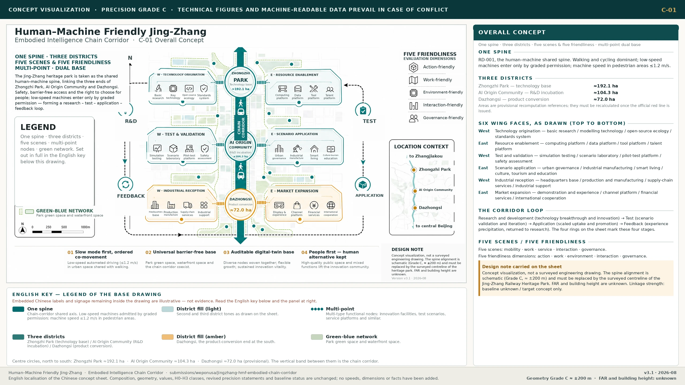

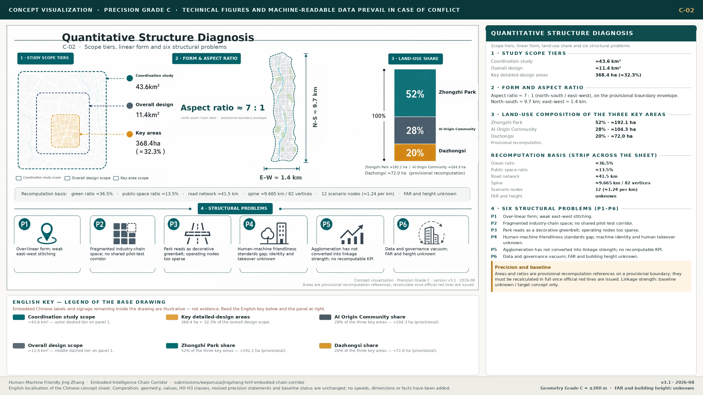

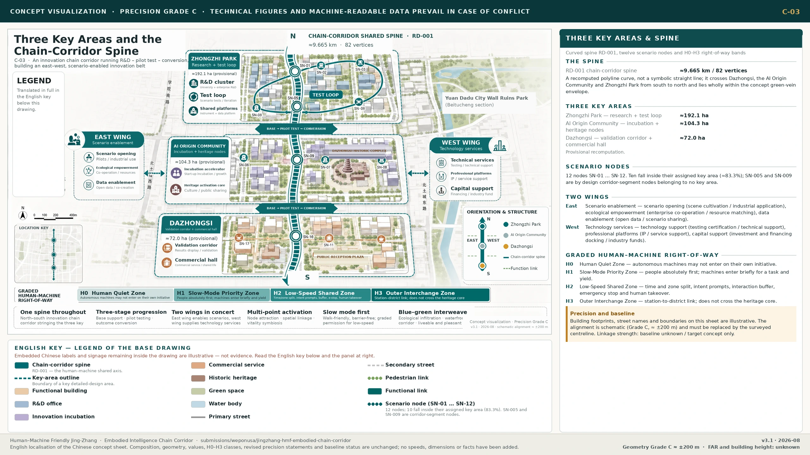

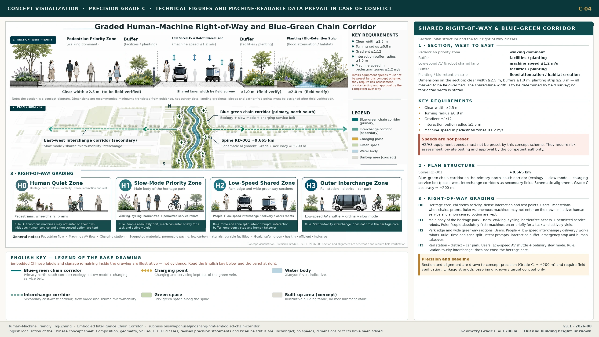

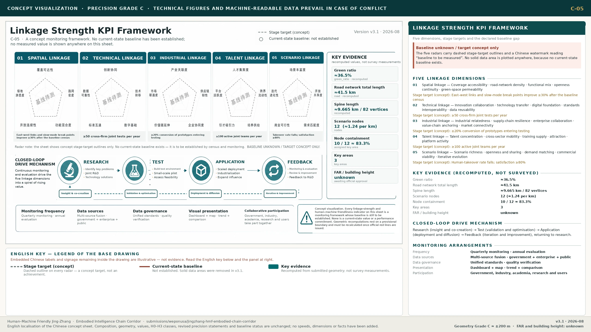

## Risk, Copyright and Compliance Statement

This proposal uses only the sources registered in `sources.json` and material in the repository that is public or rights-cleared. It introduces no non-public regulatory drawings, no unlicensed trademarks or portraits, and it collects no personal private data [source:SOURCE-REGISTRY] [source:SITE-PACKAGE]. All spatial layouts, shared right of way, speeds, scenario operations and policy recommendations are **conceptual recommendations** for professional teams to develop further. They do not replace statutory planning and do not constitute an approved operation or a government commitment [source:AGENT-TASKBOOK] [source:PUBLIC-BRIEF].

The principal data gaps at present are: the official red line and precise polygons for the key areas; regulatory conditions such as floor area ratio and height; existing buildings and tenure; municipal utilities and loads; the precise boundary of the heritage construction-control zone; the compliance rate for slow-mobility discontinuities and shared-movement cross-sections; and baselines for accessibility continuity, machine identity compliance, near-miss events, human takeover, complaints and the experience of vulnerable groups. Areas and ratios are therefore provisional recomputed references only, and human–machine friendly performance is presented only as a measurement framework; once official data is published, everything must be recalculated [source:PROVISIONAL-BOUNDARIES-2026] [depth:risk_missing_data] [depth:metrics_recalculation]. Where the base map draws on OpenStreetMap, it is used only as background reference and in compliance with ODbL attribution [source:OSM-COPYRIGHT].

On copyright: the text, geometry, drawings and offline HTML were conceived and approved under the direction of the human author **Dr Future wepon (`未来博士 wepon`)** (GitHub: weponusa), and generated and synchronised in collaboration with a declared AI agent (Cursor Grok 4.5). The theoretical frameworks and methods in the author's doctoral thesis and the book manuscript *Artificial Intelligence and the Future City*, together with the Fuxing Island guideline and the Penguin Island / WeCityX engineering experience, all enter this proposal as method translation. No claim is made to any right to reproduce the deliverables of Tencent, of the relevant Shanghai projects, or any third-party trademark, and no external campus data is written up as a statutory conclusion already accepted in Haidian. The offline HTML (`report/proposal.html`, `visual/index.html`) embeds SIL OFL 1.1 Chinese subsets of Noto Sans SC / Source Han Sans through the local `visual/assets/hmf-cjk.css`, so it depends on no CDN and no locally installed Chinese font and remains legible when previewed on Linux/Chrome [source:FONT-NOTO-SANS-SC-OFL]. The drawings fall into two categories, both annotated on their face: `assets/figures/*.png` are technical verification drawings rendered deterministically by scripts from the submitted GeoJSON and `metrics.json`, and are reproducible; `assets/figures/concept/*.webp` are concept renderings generated through OpenRouter using `openai/gpt-5.4-image-2` and revised item by item against the v3.1 body text — they are representational drawing, and the people, buildings and streetscapes in them are indicative and do not correspond to real individuals, built projects or surveyed conditions. The named author is responsible for the facts, citations and expression; the full evidence chain is in `sources.json`, `assumptions.json`, `self_check.json` and `report/copyright_statement.md`.

## References

1. Prequalification announcement of the Haidian Branch of the Municipal Commission of Planning and Natural Resources (2026-05-09) [source:OFFICIAL-ANNOUNCEMENT]  
2. Extract from the agent-facing open-call taskbook (2026-05-18) [source:AGENT-TASKBOOK]  
3. Public draft brief [source:PUBLIC-BRIEF]  
4. Municipal Science and Technology Commission: "three zones and two wings" to build a world-class AI cluster (2026-04-03) [source:INDUSTRY-PUBLIC-HAIDIAN-AI]  
5. Haidian statistical bulletin and public reporting on the AI industry (background on industrial structure and scale)  
6. Method translation from the author's doctoral research *Building Human–Machine Friendly Space for the Future City*: flows–fields–networks, HME, nodes–corridors–areas–flows–policies, dual-mode simulation and the approach to engineering validation [source:METHOD-THESIS-HMF]  
7. Method translation from the development volume of *Artificial Intelligence and the Future City* (embodied AI / human–machine friendly space): spatial adaptability first, the five-dimensional framework, and implications for urban renewal [source:METHOD-BOOK-FUTURE-CITY]  
8. Fuxing Island human–machine friendly demonstration-area guideline (local method translation) [source:CASE-FUXING-HMF-GUIDE]  
9. Penguin Island / WeCityX practice in human–machine friendly autonomous-driving transport systems (local method translation) [source:CASE-PENGUIN-WECITYX]  
10. Translation of key parameters from the *Guideline for Building Human–Machine Friendly Urban Communities (Draft for Comment)*  
11. Ministry of Housing and Urban-Rural Development (MOHURD) urban design management measures, measures for preparing regulatory detailed plans, and architectural design depth provisions; Ministry of Natural Resources land-use classification guide  
12. OpenStreetMap Copyright / ODbL [source:OSM-COPYRIGHT]  
13. Repository site-package, source_registry, public-brief, provisional_boundaries, and the geometry/metrics package of this proposal [source:PUBLIC-BRIEF]  
14. Offline Chinese web fonts: Noto Sans SC / Source Han Sans subsets, SIL Open Font License 1.1 [source:FONT-NOTO-SANS-SC-OFL]
