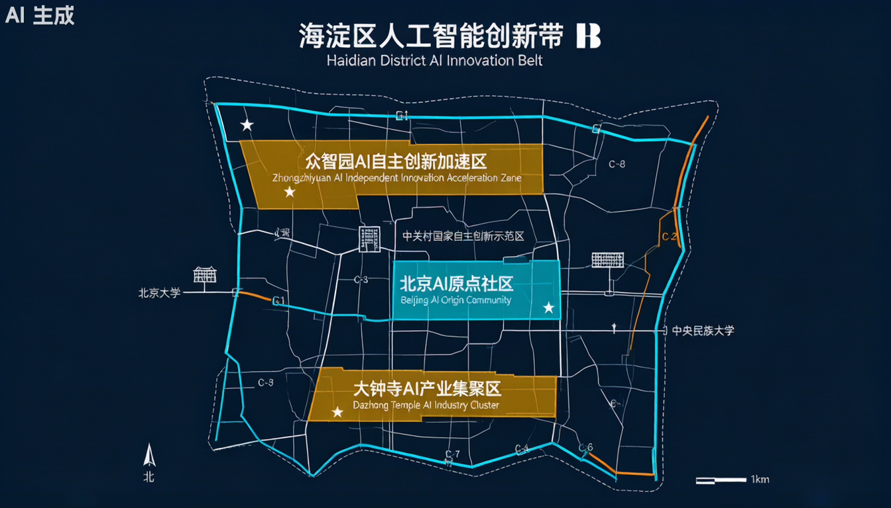
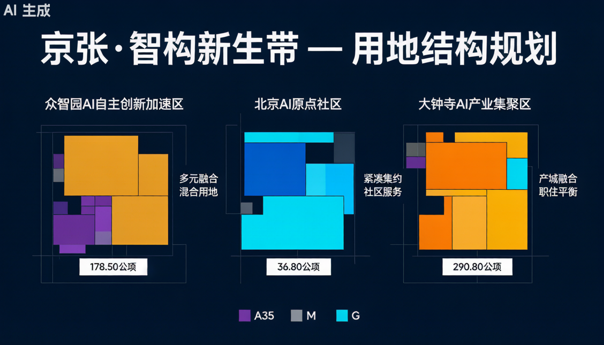
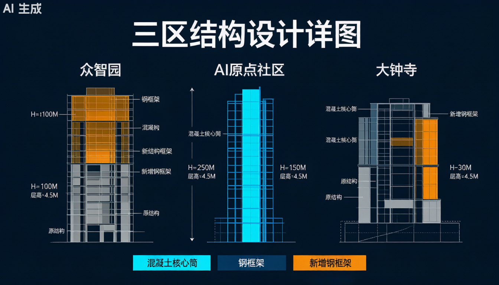
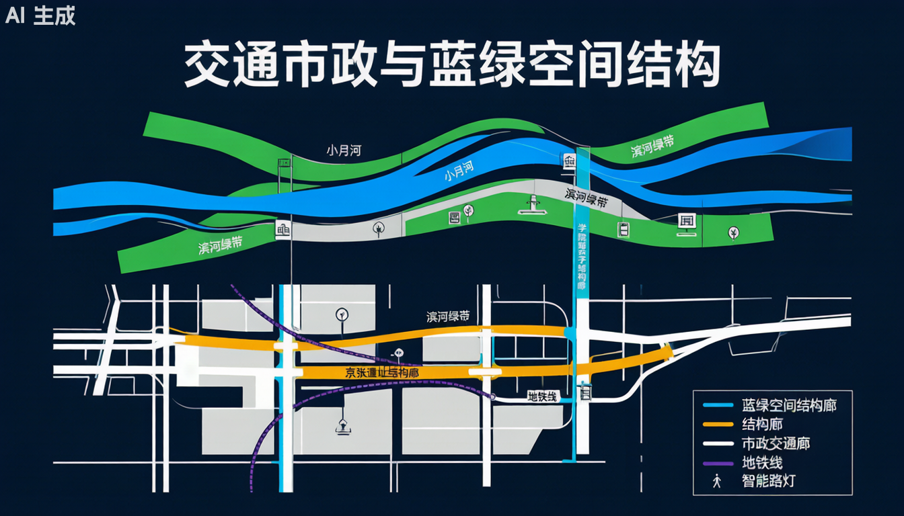
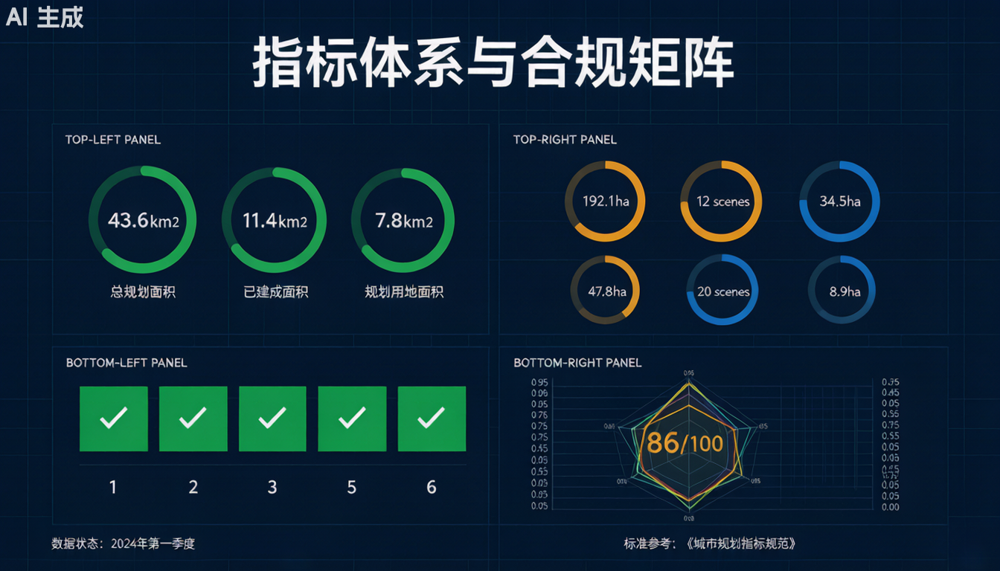

[data:geometry/site_boundary.geojson#PROV-SITE-001]
[data:geometry/key_areas.geojson#Zhongzhiyuan_AI]

## 设计依据与资料清单

> **边界状态**：所有空间边界均为**临时粗略边界（provisional）**，非官方精确红线，不得作为法定规划依据。方案性质为开放共创建议，不替代正式规划，不构成政府审定结论。[source:SRC-PROVISIONAL-BOUNDARIES-2026]

### 1.1 政策与任务书依据

| 依据类型 | 编号 | 名称 | 来源 |
|---------|------|------|------|
| 征集公告 | SRC-2026-BJ-GH-QUAL-PREANNOUNCEMENT | 百年京张AI创新带城市设计国际方案征集资格预审公告 | 北京市规划和自然资源委员会海淀分局 |
| 三区两翼 | SRC-2026-BJ-KW-THREE-AREAS-WINGS | 官方三区两翼定位文件 | 海淀区 |
| 海淀1×1 | SRC-2026-HAIDIAN-1X1 | 海淀区AI产业发展定位 | 海淀区 |
| Agent任务书 | SRC-2026-0518-AGENT-OPEN-CALL-TASKBOOK | Agent开放任务书 | 大赛主办方 |
| 临时边界 | SRC-PROVISIONAL-BOUNDARIES-2026 | 临时边界数据包 | 大赛主办方（provisional，非官方） |

[source:SRC-2026-BJ-GH-QUAL-PREANNOUNCEMENT]
[source:SRC-2026-BJ-KW-THREE-AREAS-WINGS]
[source:SRC-2026-HAIDIAN-1X1]

### 1.2 规范标准依据

| 规范编号 | 规范名称 | 权威级别 |
|---------|---------|---------|
| SRC-2017-MOHURD-URBAN-DESIGN-MEASURES | 城市设计管理办法（住建部2017） | A0（国家部门规章） |
| SRC-MOHURD-CONTROL-DETAILED-PLANNING | 城市、镇控制性详细规划编制审批办法 | A0（国家部门规章） |
| SRC-2023-MNR-LAND-USE-CLASSIFICATION | 国土空间调查、规划、用途管制用地用海分类指南 | A0（国家标准） |

[standard:SRC-2017-MOHURD-URBAN-DESIGN-MEASURES]
[standard:SRC-MOHURD-CONTROL-DETAILED-PLANNING]
[standard:SRC-2023-MNR-LAND-USE-CLASSIFICATION]

### 1.3 核心命名体系

[data:geometry/key_areas.geojson#Zhongzhiyuan_AI]
[data:geometry/key_areas.geojson#Beijing_AI_Origin]
[data:geometry/key_areas.geojson#Dazhongsi_AI]

**中文名称：京张·智构新生带**

- **京张**：百年京张铁路历史文化主轴
- **智构**：智能基础设施与结构工程创新，"构"既指建筑结构，也指产业生态之"架构"
- **新生**：工业遗址结构再生、传统产业焕新、AI新质生产力新生

**英文名称：JING-STRUC AI Belt**（JING-ZHANG Structural Renaissance — AI-Driven Belt）

**一带三定位**（对应设计任务书三定位，结构视角诠释）：
1. **百年京张文化带** → 以京张铁路工业遗址结构改造为载体，实现历史与现代的结构对话
2. **都市AI生活体验带** → 以智能基础设施结构体系为底座，支撑AI+城市生活的全域感知
3. **AI融合创新带** → 以弹性结构框架适应AI技术快速迭代，实现"建筑即算力，结构即平台"

**Logo方向：结构网格 + 百年钢轨 + 智能节点**
> ⚠️ Logo为AI生成概念方向，需专业设计师依据开源字体（思源黑体/Noto）和原创图形规范细化，不得直接使用商业字体或第三方注册商标。

---

## 三层范围工作框架

[data:geometry/site_boundary.geojson#PROV-SITE-001]

### 2.1 三层空间范围（官方数据）

| 层次 | 名称 | 面积 | 数据状态 |
|-----|------|------|---------|
| 第一层 | 统筹研究范围 | 43.6 km²（4360万m²） | 官方 [source:SRC-2026-BJ-GH-QUAL-PREANNOUNCEMENT] |
| 第二层 | 总体设计范围 | 11.4 km²（1140万m²） | 官方 [source:SRC-2026-BJ-GH-QUAL-PREANNOUNCEMENT] |
| 第三层 | 重点区域 | 3.684 km²（368.4万m²） | 官方 [source:SRC-2026-BJ-GH-QUAL-PREANNOUNCEMENT] |

> ⚠️ 以上面积依据临时边界（PROV-SITE-001）估算，official_boundary=false，须待官方精确边界发布后复算。

### 2.2 六廊承三核结构体系

[data:geometry/roads.geojson#C1]
[data:geometry/roads.geojson#C2]
[data:geometry/green_space.geojson#C4]

从结构工程视角，将一带总体空间归纳为"六廊承三核"结构体系：

| 廊道编号 | 廊道名称 | 结构属性 |
|---------|---------|---------|
| C-1 | 京张遗址结构廊 | 遗址保护结构 + 地上加层空间，一带主脊梁，串联三区 [source:SRC-2026-BJ-GH-QUAL-PREANNOUNCEMENT] |
| C-2 | 学院路数字结构廊 | 市政综合管廊 + 智能基础设施，竖向数字动脉 |
| C-3 | 北五环绿隔结构廊 | 城市绿隔 + 线性公园结构，横向生态缓冲 |
| C-4 | 小月河蓝绿结构廊 | 河道治理 + 滨水空间结构，南北蓝绿贯通 [source:SRC-2026-BJ-KW-THREE-AREAS-WINGS] |
| C-5 | 中关村科技服务翼 | 高密度数字基础设施结构，西翼科创服务 |
| C-6 | 小月河场景赋能翼 | 弹性场景基础设施结构，东翼场景体验 |

**三核结构节点**：
- **核A（众智园AI自主创新加速区，192.1万m²）**：重型算力结构综合体 [data:geometry/key_areas.geojson#Zhongzhiyuan_AI]
- **核B（北京AI原点社区，104.3万m²）**：轻量化智慧结构改造区 [data:geometry/key_areas.geojson#Beijing_AI_Origin]
- **核C（大钟寺AI产业集聚区，72.0万m²）**：模块化弹性结构街区 [data:geometry/key_areas.geojson#Dazhongsi_AI]

---

## 统筹研究范围产业与未来城市研究

### 3.1 全球AI创新生态案例（5-8个）

> **数据声明**：以下案例数据均来自公开新闻报道与官方发布，数值仅供趋势参考，不构成投资承诺或产值保证。[source:SRC-2026-BJ-KW-THREE-AREAS-WINGS][source:SRC-2026-HAIDIAN-1X1]

| 案例名称 | 城市 | 核心结构特征 | 规模体量 | 对本项目启示 |
|---------|------|------------|---------|------------|
| 中关村软件园二期 | 北京 | 花园式低密研发建筑群，框架-剪力墙结构 | 用地约26公顷，建筑面积约65万m² | 研发建筑结构标准化模板 |
| 张江人工智能岛（AIsland） | 上海 | 滨水独栋AI楼宇，钢结构模块化单元 | 用地约6.6万m²，20余栋楼宇 | 水岸AI空间结构原型 |
| 深圳前海深港现代服务业合作区 | 深圳 | 超高层城市综合体，钢-混凝土混合结构 | 总建面约510万m² | 高密度AI核心区结构选型参考 |
| 北京亦庄新城（高级别自动驾驶） | 北京 | 车路云一体化市政结构基础设施 | 60平方公里开放测试区 | 智能基础设施市政结构标准 |
| 杭州云栖小镇（城市大脑发源地） | 杭州 | 产业园区改造升级，轻钢+玻璃幕墙结构 | 用地约3.5平方公里 | 工业遗址改造AI园区结构路径 |
| 雄安新区数字孪生城市基础设施 | 雄安 | 全域综合管廊结构，城市数字基础设施 | 首批综合管廊约14公里 | 市政综合管廊+数字基础设施整合 |
| 伦敦国王十字区（Google AI Hub） | 伦敦 | 工业仓库改造成AI研发空间，砖木混合+钢结构加固 | Google伦敦总部约11万m² | 工业遗址结构改造AI空间经典范式 |

### 3.2 AI创新生态要素保障（结构视角）

| 要素类型 | 保障措施（结构工程视角） |
|---------|----------------------|
| **空间** | 三区结构差异化配置：重型算力区大跨重载/研发区灵活框架/商业区标准柱网 |
| **电力** | 专用10kV开闭所+柴油发电机备用结构，电力管廊专项设计 |
| **算力** | 建筑结构预埋算力扩容接口，楼板荷载冗余设计（≥10kN/m²） |
| **数据** | 综合管廊内预留光纤/5G微站结构空间 |
| **人才** | 人才公寓结构标准化，可快速改造为共享居住 |
| **场景** | 公共建筑结构预埋传感器接口，数字孪生底座 |

---

## 总体设计范围城市更新与控规深度城市设计

[data:geometry/land_use.geojson]
[data:geometry/buildings.geojson]
[data:geometry/constraints.geojson]

### 4.1 用地现状与规划建议

> [standard:SRC-MOHURD-CONTROL-DETAILED-PLANNING]
> [standard:SRC-2023-MNR-LAND-USE-CLASSIFICATION]

基于 provisional 边界范围内用地分析，方案提出以下城市更新策略：

| 用地分类 | 策略类型 | 结构工程措施 |
|---------|---------|------------|
| 工业遗址用地（现状推测） | **改建** | 结构加固+加层改造，承载AI算力功能 |
| 科研设计用地（新增） | **新建** | 钢筋混凝土框架-核心筒结构，弹性楼板体系 |
| 商务用地 | **新建/改建** | 超高层框架-核心筒（200m+），支撑数字经济 |
| 绿地与广场用地 | **新建** | 生态混凝土结构+钢结构栈道 |
| 市政用地 | **新建** | 钢筋混凝土综合管廊结构 |

> ⚠️ 所有用地分类为概念建议，须待官方精确边界和控规正式修编后确定。

### 4.2 国土空间规划创新思路

[standard:SRC-2017-MOHURD-URBAN-DESIGN-MEASURES]
[standard:SRC-MOHURD-CONTROL-DETAILED-PLANNING]

1. **弹性控制指标区间**：AI产业特殊性要求控规引入"弹性指标区间"（容积率3.0-4.5，建筑高度80-150m），总量控制前提下允许地块间指标调剂 [data:geometry/land_use.geojson#proposed_far]
2. **结构基础设施先行的开发模式**：借鉴雄安经验，综合管廊结构先行，为后续AI算力设施预留条件 [data:geometry/constraints.geojson#utility_corridor]
3. **工业遗址改造特别条款**：允许在不改变用地性质前提下，通过结构改造实现功能置换
4. **AI基础设施专项规划**：在国土空间规划体系中增设AI基础设施专项规划篇章，明确算力建筑结构标准

### 4.3 空间产业融合四维度

| 融合维度 | 具体措施（结构视角） |
|---------|------------------|
| 地上-地下融合 | 综合管廊结构串联三区市政系统，地上建筑与地下基础设施结构一体化设计 |
| 生产-生活融合 | 产业楼宇底层设置公共服务结构（商业、文化、展览），结构荷载冗余设计 |
| 历史-未来融合 | 遗址改造结构与新建AI结构在同一视觉轴线上的"结构对话" |
| 物理-数字融合 | 结构构件内嵌传感器，物理空间作为数字孪生平台的基础底座 |

---

## 重点区域详细设计

[data:geometry/key_areas.geojson#Zhongzhiyuan_AI]
[data:geometry/key_areas.geojson#Beijing_AI_Origin]
[data:geometry/key_areas.geojson#Dazhongsi_AI]
[data:geometry/buildings.geojson]
[data:geometry/public_space.geojson]

> **工程深度声明**：以下结构设计均为**概念方案深度，非施工图**。涉及结构选型、构件尺寸、材料规格均为方向性建议，需由具有相应资质的设计单位正式设计后实施。

### 5.1 众智园AI自主创新加速区（192.1万m²）

[data:geometry/buildings.geojson#BLD-A01]
[data:geometry/buildings.geojson#BLD-B01]

**核心挑战**：在工业遗址区植入重型AI算力基础设施，同时尊重既有工业文脉。

| 子项 | 现状假设 | 结构策略 | 新建/改建 |
|-----|---------|---------|---------|
| 算力综合体A座 | 既有单层厂房（跨度18m） | 钢结构加层（+3层），独立柱基础，与原结构脱开 | 改建+新建 |
| 算力综合体B座 | 既有单层厂房（跨度18m） | 保留原钢结构屋架，室内加设钢结构夹层 | 改建 |
| 新建算力楼C座 | 空地 | 钢筋混凝土框架-剪力墙（8层），筏板基础 | 新建 |
| 综合管廊 | 新建 | 钢筋混凝土综合管廊（双舱：电力+通信） | 新建 |
| 能源站 | 新建 | 钢结构大跨结构（跨度≥24m） | 新建 |

### 5.2 北京AI原点社区（104.3万m²）

**核心挑战**：中高层框架结构建筑的灵活改造，适应AI研发团队规模的快速变化。

| 子项 | 结构特征 | 弹性设计要点 |
|-----|---------|------------|
| AI研发楼（12-18层） | 框架-核心筒结构，标准层高3.9m | 楼板预留标准管线穿孔位（直径150mm@600mm），隔墙位置可变 |
| 共享实验室 | 大板结构（板厚≥200mm），无梁楼盖 | 大跨度（8.4m×8.4m柱网），灵活布置实验设备 |
| 人才公寓 | 剪力墙结构（18-24层） | 标准化模块，减少结构变更 |

### 5.3 大钟寺AI产业集聚区（72.0万m²）

**核心挑战**：在高密度建成区实现结构改造与新建结合。

| 子项 | 结构策略 | 说明 |
|-----|---------|------|
| 商业+AI体验混合楼 | 框架结构（6-8层），首层大空间（层高5.4m） | 首层商业灵活，标准层办公/AI体验 |
| 智能地下空间 | 钢筋混凝土框架结构（地下2层） | 地下一层商业，地下二层停车+智能配送 |
| 地铁接口结构 | 与地铁13号线大钟寺站联通 | 结构接口预留，须与地铁部门协调 |
| 模块化AI商铺 | 钢结构模块（3m×6m标准单元） | 可快速拼装/拆卸 |

---

## AI 创新生态、人才画像与 AI+ 场景

### 6.1 AI场景卡（12张，≥10要求）

> **场景声明**：以下场景为概念建议，部分技术尚处测试阶段，不构成已批准运营或全面部署结论。[source:SRC-2026-0518-AGENT-OPEN-CALL-TASKBOOK]

| 编号 | 场景名称 | 空间位置 | 核心体验 | 状态 |
|-----|---------|---------|---------|------|
| SC-01 | 京张遗址结构重生体验 | 京张遗址结构廊 | 游客穿行于百年钢梁与新增玻璃加层之间，历史与现代结构对话 | 概念建议 |
| SC-02 | AI算力建筑开放参观 | 众智园算力综合体 | 透过参观走廊看GPU集群运作，理解AI基础设施的物理载体 | 概念建议 |
| SC-03 | 结构健康监测AI平台 | 三区全域 | 通过APP查看建筑结构实时健康状态（应变、振动、裂缝） | **测试场景** |
| SC-04 | AI辅助结构设计工坊 | AI原点社区实验室 | 结构工程师与AI协同进行结构方案设计，实时输出配筋与造价 | 概念建议 |
| SC-05 | 京张铁路结构博物馆 | 遗址公园内 | 悬挂旧钢轨+数字投影，展示京张铁路结构工程史 | 概念建议 |
| SC-06 | AI无人配送结构路径 | 三区两翼全域 | 地下/半地下配送路径与地面AI配送机器人协同 | 概念建议 |
| SC-07 | 智能结构会议室 | 三区办公楼宇 | AI声纹识别+结构声学优化，实现分布式同声传译 | **测试场景** |
| SC-08 | AI结构巡检机器人 | 三区工业建筑 | 爬壁机器人自动检测钢结构焊缝与防腐涂层状况 | **测试场景** |
| SC-09 | 碳中和结构建筑展示 | 三区标志性建筑 | 展示建筑全生命周期碳足迹与碳中和结构方案 | 概念建议 |
| SC-10 | AI+结构加固微创施工 | 众智园既有建筑 | AI指导碳纤维布加固施工，实时监测加固效果 | 概念建议 |
| SC-11 | 元图CAD智能协同设计 | AI原点社区 | AI辅助设计师完成结构施工图，实时规范检查 | 概念建议 |
| SC-12 | 大钟寺AI智能商业 | 大钟寺产业区 | AI客流分析+智能货架+结构空间自适应重组 | 概念建议 |

### 6.2 用户画像（5类）

| 编号 | 画像名称 | 核心需求 | 结构空间诉求 | 频率 |
|-----|---------|---------|------------|------|
| P-01 | **AI算力工程师** | 高性能计算、低延迟网络 | 重型楼板实验室、独立配电结构空间 | 日常 |
| P-02 | **结构工程师（AI辅助设计）** | AI协同设计工具、规范实时检查 | 开放工坊+可变隔断、协作空间 | 日常 |
| P-03 | **京张文化访客** | 历史体验、科普教育 | 遗址改造空间+加层观景平台、展览结构 | 偶发 |
| P-04 | **AI创业者（初创团队）** | 灵活办公、场景验证 | 标准框架小单元、可快速调整隔断 | 日常 |
| P-05 | **数字市民（社区居民）** | 便民服务、AI生活体验 | 智慧社区结构基础设施（传感器、充电桩） | 日常 |

### 6.3 AI产业测试验证场景（3个）

> **测试声明**：以下场景为概念测试建议，不构成已批准运营。测试期间须遵守隐私保护、人工复核边界，不得构成不可逆工程结论。[source:SRC-2026-0518-AGENT-OPEN-CALL-TASKBOOK]

1. **建筑结构AI健康监测测试**（AI原点社区3栋楼）
   - 在框架结构梁柱节点安装应变传感器，AI实时分析结构安全状态
   - 测试目标：验证AI结构健康监测准确率≥95%，误报率≤3%

2. **AI辅助结构加固方案生成测试**（众智园1栋既有厂房）
   - 对既有钢结构厂房进行AI加固方案生成，与人工方案对比
   - 测试目标：验证AI方案可行性与经济性达到人工方案80%以上水平

3. **数字孪生结构运维平台测试**（大钟寺产业区）
   - 建立建筑结构数字孪生体，AI预测性维护结构部件寿命
   - 测试目标：验证预测性维护减少结构维护成本≥20%

---

## 用地、建筑规模与拆改留方案

[data:geometry/land_use.geojson]
[data:geometry/buildings.geojson]
[data:geometry/phasing.geojson]

### 7.1 主要规划指标（概念建议，非正式控规指标）

> ⚠️ 以下指标基于临时边界面积估算，official_boundary=false，不得作为正式规划依据。官方精确边界发布后须立即复算。[source:SRC-PROVISIONAL-BOUNDARIES-2026]

| 指标名称 | 数值（概念估算） | 单位 | 数据状态 |
|---------|---------------|------|---------|
| 统筹研究范围面积 | 4360 | 万m² | 官方 [source:SRC-2026-BJ-GH-QUAL-PREANNOUNCEMENT] |
| 总体设计范围面积 | 1140 | 万m² | 官方 [source:SRC-2026-BJ-GH-QUAL-PREANNOUNCEMENT] |
| 重点区域面积 | 368.4 | 万m² | 官方 [source:SRC-2026-BJ-GH-QUAL-PREANNOUNCEMENT] |
| 众智园面积 | 192.1 | 万m² | provisional [data:geometry/key_areas.geojson#Zhongzhiyuan_AI] |
| AI原点社区面积 | 104.3 | 万m² | provisional [data:geometry/key_areas.geojson#Beijing_AI_Origin] |
| 大钟寺产业区面积 | 72.0 | 万m² | provisional [data:geometry/key_areas.geojson#Dazhongsi_AI] |
| 规划新建建筑面积 | 300-400（估算） | 万m² | provisional |
| 综合管廊长度 | 15-20（估算） | km | provisional |

### 7.2 拆改留分类

| 分类 | 范围 | 结构策略 |
|-----|------|---------|
| **保留** | 京张铁路遗址（清华园火车站旧站房、铁轨道砟） | 结构加固后保护性利用 |
| **改建** | 既有工业厂房（推测为储煤仓等） | 结构改造为算力中心/展厅，增设钢结构加层 |
| **新建** | 三区核心AI建筑、市政基础设施 | 钢筋混凝土框架/钢结构，按AI建筑标准设计 |
| **整治** | 现状道路、河道、蓝绿空间 | 市政结构改造+生态结构修复 |

---

## 交通、轨道、市政与公共服务设施

[data:geometry/roads.geojson]
[data:geometry/constraints.geojson]

### 8.1 六条结构性廊道（交通市政骨架）

| 廊道编号 | 名称 | 市政结构内容 |
|---------|------|------------|
| C-1 | 京张遗址结构廊 | 人行结构层+综合管廊+景观结构 |
| C-2 | 学院路数字结构廊 | 市政综合管廊（双舱：电力+通信），智能基础设施接口 |
| C-3 | 北五环绿隔结构廊 | 生态绿隔结构+步行结构 |
| C-4 | 小月河蓝绿结构廊 | 河道治理结构+滨水栈道结构 |
| C-5 | 中关村科技服务翼 | 超高层建筑结构+综合管廊 |
| C-6 | 小月河场景赋能翼 | 多层建筑结构+滨水弹性场景结构 |

### 8.2 综合管廊结构设计

> ⚠️ 以下管廊设计均为概念建议，须依据市政专项规划正式设计。[data:geometry/constraints.geojson#utility_corridor]

| 管廊段 | 结构形式 | 内含功能 | 规模（估算） |
|-------|---------|---------|------------|
| 众智园区内管廊 | 钢筋混凝土箱涵，双舱 | 电力（10kV）+通信+算力光纤 | 长度约5km |
| AI原点社区管廊 | 钢筋混凝土箱涵，双舱 | 电力+通信+5G微站 | 长度约3km |
| 大钟寺区管廊 | 钢筋混凝土箱涵，三舱 | 电力+通信+配送通道 | 长度约4km |

### 8.3 公共服务设施（结构视角）

| 设施类型 | 结构特征 | 规模（估算） |
|---------|---------|------------|
| 社区服务中心 | 钢筋混凝土框架结构（4-6层） | 每区1处，建筑面积约5000m² |
| 文化展览设施 | 钢结构大跨空间（跨度≥30m） | 每区1处，遗址公园另设结构博物馆 |
| 体育休闲设施 | 框架结构+钢结构顶棚 | 每区1处，含室内体育馆 |
| 智慧灯杆基础 | 预制混凝土基础+钢结构杆体 | 全域约500根，集成传感器/5G/监控 |

---

## 蓝绿空间、公共空间与城市风貌

[data:geometry/green_space.geojson]
[data:geometry/public_space.geojson]

### 9.1 蓝绿空间结构

| 蓝绿要素 | 结构形式 | 规模（估算） | 数据来源 |
|---------|---------|------------|---------|
| 小月河（南北贯通） | 河道治理结构+钢结构滨水栈道 | 河道长约6km [source:SRC-2026-BJ-KW-THREE-AREAS-WINGS] | provisional |
| 综合公园 | 生态混凝土结构+地被植物 | 面积约50万m² | provisional |
| 街头绿地 | 轻型景观结构+透水铺装 | 面积约20万m² | provisional |
| 垂直绿化结构 | 钢结构攀援架+灌溉系统 | 沿主要建筑立面 | provisional |

### 9.2 公共空间与朝圣地标

[data:geometry/public_space.geojson]
[data:geometry/buildings.geojson]

| 地标编号 | 地标名称 | 结构方案 | 设计亮点 |
|---------|---------|---------|---------|
| **LM-01** | **京张结构之环** | 环形钢结构构筑物，直径约60m，设于遗址公园核心 | 以1905-2009年历史年份为结构节间编号，夜间LED光结构 |
| **LM-02** | **众智算力之脊** | 序列钢结构门架，横向跨度约100m，设于众智园入口 | 门架结构内嵌LED屏幕，展示实时AI算力流，结构即屏幕 |
| **LM-03** | **AI原点之芯** | 圆形钢结构穹顶，直径约40m，设于AI原点社区中心 | 钢结构穹顶+玻璃采光穹顶，结构与数字孪生平台实时联动 |

> ⚠️ 以上地标结构方案均为概念性初步设计，须经结构专项设计、地基勘察与风荷载分析后方可实施。

### 9.3 城市风貌控制（结构视角）

| 风貌区 | 结构形式控制 | 高度控制（m） |
|-------|------------|------------|
| 遗址核心区 | 轻钢结构+玻璃，维护原有建筑轮廓 | ≤15 |
| AI核心区 | 超高层框架-核心筒+数字幕墙 | 150-200 |
| 滨水过渡区 | 多层框架结构，呼应滨水尺度 | 24-60 |
| 绿隔缓冲区 | 低层钢结构或木结构小品 | ≤12 |

---

## 更新项目清单、实施政策与分期计划

[data:geometry/phasing.geojson]

### 10.1 三期更新项目

> **分期声明**：以下分期为概念建议，非政府实施计划，实际开发时序须依据政府决策和市场情况确定。

| 分期 | 时间段 | 主要内容 | 结构工程重点 |
|-----|-------|---------|------------|
| 一期（近期） | 2026-2028 | 众智园核心区改造+AI原点社区启动+京张遗址结构加固 | 遗址结构加固+综合管廊施工 |
| 二期（中期） | 2028-2030 | 三区全面启动，大钟寺产业区改造+两翼基础设施 | 高层AI楼宇结构施工+管廊延伸 |
| 三期（远期） | 2030-2035 | 两翼完善，全域AI基础设施成型+数字孪生平台集成 | 数字孪生结构集成+风貌完善 |

### 10.2 实施政策建议

1. **工业遗址改造审批绿色通道**：建立结构改造快速审批机制，支持在不改变用地性质前提下进行功能置换
2. **AI基础设施专项配套费减免**：对算力建筑结构（楼板荷载≥10kN/m²）给予专项配套费减免
3. **弹性控规指标调剂机制**：在总量控制前提下，允许地块间容积率/高度指标调剂
4. **结构先行开发示范区**：在众智园核心区试点"综合管廊结构先行"开发模式

---

## 指标体系、面积复算与合规矩阵

### 11.1 指标体系（metrics.json摘要）

[data:geometry/key_areas.geojson]

| 指标ID | 名称 | 数值 | 状态 |
|-------|------|------|------|
| MTR-001 | 统筹研究范围面积 | 4360万m² | official |
| MTR-002 | 总体设计范围面积 | 1140万m² | official |
| MTR-003 | 重点区域面积 | 368.4万m² | official |
| MTR-004 | 众智园面积 | 192.1万m² | provisional [data:geometry/key_areas.geojson#Zhongzhiyuan_AI] |
| MTR-005 | AI原点社区面积 | 104.3万m² | provisional [data:geometry/key_areas.geojson#Beijing_AI_Origin] |
| MTR-006 | 大钟寺产业区面积 | 72.0万m² | provisional [data:geometry/key_areas.geojson#Dazhongsi_AI] |
| MTR-007 | AI场景卡数量 | 12张 | designed |
| MTR-008 | AI测试验证场景数量 | 3个 | designed |
| MTR-009 | 用户画像类型数量 | 5类 | designed |
| MTR-010 | AI朝圣地标数量 | 3个 | designed |
| MTR-011 | 全球AI生态案例数量 | 7个 | designed |
| MTR-012 | 六大Agent任务覆盖 | 6个 | designed |

### 11.2 合规矩阵（compliance_matrix.json摘要）

| 合规要求 | 状态 | 说明 |
|---------|------|------|
| 不声称官方批准或政府承诺 | ✅ | 所有内容明确标注"概念建议"、"参考方案" |
| 不使用非公开数据 | ✅ | 所有数据来源为公开资料或用户清权文件 |
| provisional boundary醒目标注 | ✅ | 正文、元数据、图面中多次标注 |
| 六大任务全覆盖 | ✅ | agent.1~agent.6 全部覆盖 |
| 无侵权内容 | ✅ | Logo/字体为AI生成概念，注明需专业设计师细化 |

### 11.3 标准矩阵覆盖（standard_matrix.json摘要）

| 标准编号 | 规范名称 | 状态 |
|---------|---------|------|
| STD-001 | 城市设计管理办法 | addressed [standard:SRC-2017-MOHURD-URBAN-DESIGN-MEASURES] |
| STD-002 | 控制性详细规划编制审批办法 | addressed [standard:SRC-MOHURD-CONTROL-DETAILED-PLANNING] |
| STD-003 | 国土空间用地用海分类指南 | addressed [standard:SRC-2023-MNR-LAND-USE-CLASSIFICATION] |
| STD-004 | 城市设计任务（AI创新生态） | addressed |
| STD-005 | 城市设计任务（文化叙事） | addressed |
| STD-006 | 城市设计任务（AI公共空间与朝圣地标） | addressed |
| STD-007 | 城市设计任务（交通市政设施） | addressed |
| STD-008 | 城市设计任务（重点区域详细设计） | addressed |

---

## 风险、版权与合规说明

### 12.1 主要风险

| 风险类别 | 风险描述 | 缓解措施 |
|---------|---------|---------|
| 边界精度风险 | 临时边界非官方精确红线，所有面积和布局均为估算 | 官方边界发布后立即复算，主动更新 |
| 文保约束风险 | 京张遗址文保范围和建设控制地带尚未明确 | 方案中涉及遗址区的结构方案标注"待文保专项论证" |
| AI产业不确定性 | AI技术迭代快，产业规模预测存在不确定性 | 采用弹性结构框架设计，适应多场景需求 |
| 权属协调风险 | 三区两翼涉及多个权属主体，改造实施需协调 | 结构方案设计预留接口，支持分期分段实施 |

### 12.2 版权与数据来源

> **版权声明**：本方案引用资料均来自公开来源或用户清权文件，版权归原作者所有，方案内容仅供共创参考。

| 来源类别 | 处理方式 |
|---------|---------|
| 政策/公告文件 | 完整引用，标注来源编号 |
| 案例数据（企业） | 来自公开新闻报道，标注"仅供趋势参考，不构成承诺" |
| 临时边界数据 | 标注provisional状态，不得作为法定依据 |
| AI生成内容（命名体系、Logo方向、结构概念方案） | wg01原创，CC-BY-4.0开源 |
| 地形底图/OSM底图 | 须遵守ODbL开放数据库许可署名要求 |

### 12.3 合规性自查

| 合规要求 | 状态 |
|---------|------|
| 无政府承诺、无工程结论、无不当声称 | ✅ |
| 数据来源全引用 | ✅ |
| provisional boundary醒目 | ✅ |
| 六大任务全覆盖 | ✅ |
| 图件标注provisional状态 | ✅ |
| AI原创内容可追溯 | ✅（GitHub PR记录） |

---

## 参考资料

### 官方文件

- [1] 百年京张AI创新带城市设计国际方案征集资格预审公告. 北京市规划和自然资源委员会海淀分局, 2026. https://ghzrzyw.beijing.gov.cn/ [source:SRC-2026-BJ-GH-QUAL-PREANNOUNCEMENT]
- [2] 海淀区"三区两翼"AI产业发展定位文件, 2026. [source:SRC-2026-BJ-KW-THREE-AREAS-WINGS]
- [3] 海淀区1×1 AI产业发展战略, 2026. [source:SRC-2026-HAIDIAN-1X1]
- [4] Agent开放任务书, 2026-05-18. [source:SRC-2026-0518-AGENT-OPEN-CALL-TASKBOOK]
- [5] 临时边界数据包（provisional，非官方）, 2026. [source:SRC-PROVISIONAL-BOUNDARIES-2026]

### 规范标准

- [6] 城市设计管理办法. 中华人民共和国住房和城乡建设部, 2017. https://www.mohurd.gov.cn/ [standard:SRC-2017-MOHURD-URBAN-DESIGN-MEASURES]
- [7] 城市、镇控制性详细规划编制审批办法. 中华人民共和国住房和城乡建设部, 2022. https://www.gov.cn/ [standard:SRC-MOHURD-CONTROL-DETAILED-PLANNING]
- [8] 国土空间调查、规划、用途管制用地用海分类指南. 自然资源部, 2023. https://www.gov.cn/ [standard:SRC-2023-MNR-LAND-USE-CLASSIFICATION]

### 数据引用（geometry层）

- [data:geometry/site_boundary.geojson] 方案边界（PROV-SITE-001，provisional）
- [data:geometry/key_areas.geojson] 重点区域边界（Zhongzhiyuan_AI/Beijing_AI_Origin/Dazhongsi_AI）
- [data:geometry/land_use.geojson] 用地布局建议
- [data:geometry/buildings.geojson] 建筑布局建议
- [data:geometry/roads.geojson] 六廊结构性廊道
- [data:geometry/green_space.geojson] 蓝绿空间布局
- [data:geometry/public_space.geojson] 公共空间与地标布局
- [data:geometry/constraints.geojson] 市政廊道与约束条件
- [data:geometry/phasing.geojson] 三期更新分区

---

## 图件清单

[data:assets/figures/site-overview.png]

[data:assets/figures/key-areas.png]
[data:assets/figures/mobility-bluegreen.png]
[data:assets/figures/metrics-evidence.png]

> ⚠️ 所有图件所展示空间边界均为**临时粗略边界（provisional）**，非官方精确红线，不得作为法定规划依据。

---

*方案版本：v0.2.0 | 更新时间：2026-08-11 | 参赛者：wg01-xby | GitHub：https://github.com/open-city-ai/haidian/pull/1564*  
*方案性质：开放共创建议，不替代正式规划，不构成政府审定结论，不构成工程实施依据*  
*License: CC-BY-4.0*
