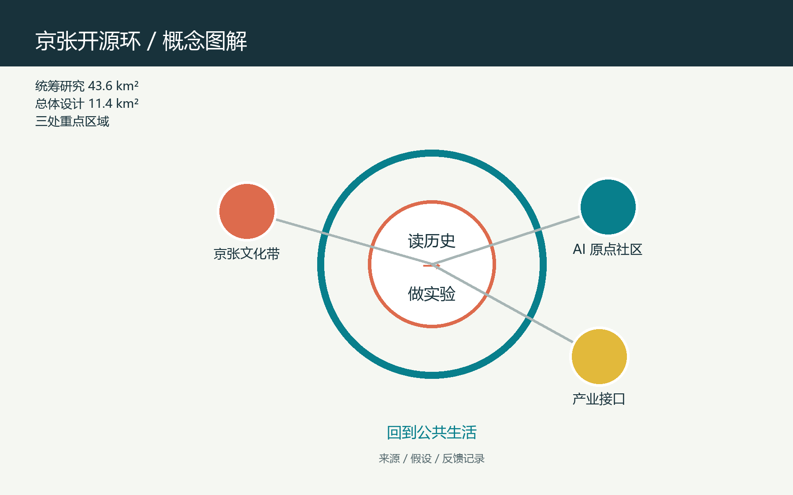
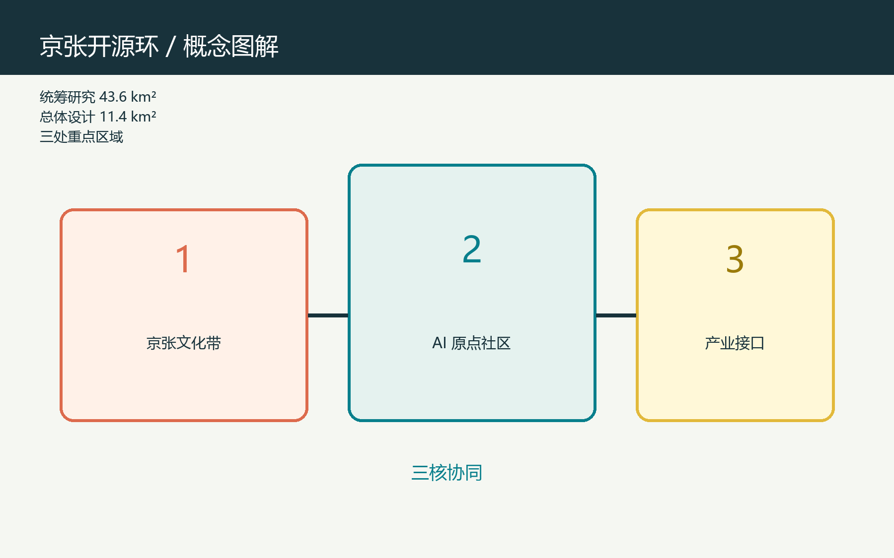
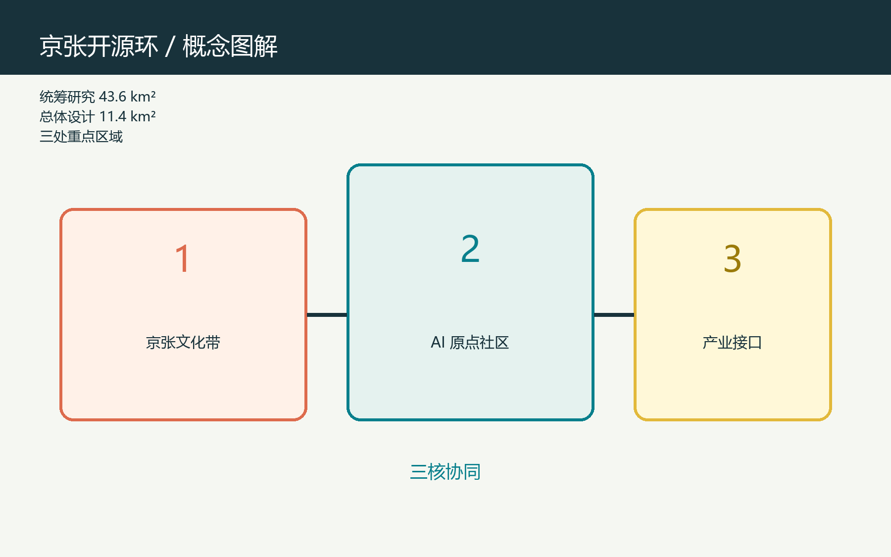
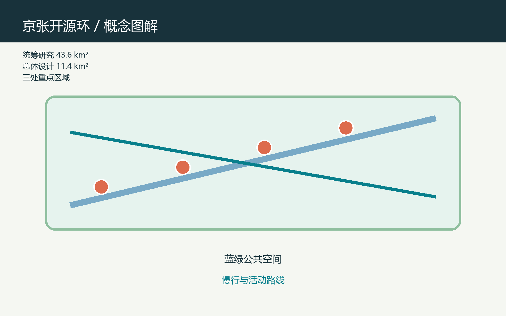
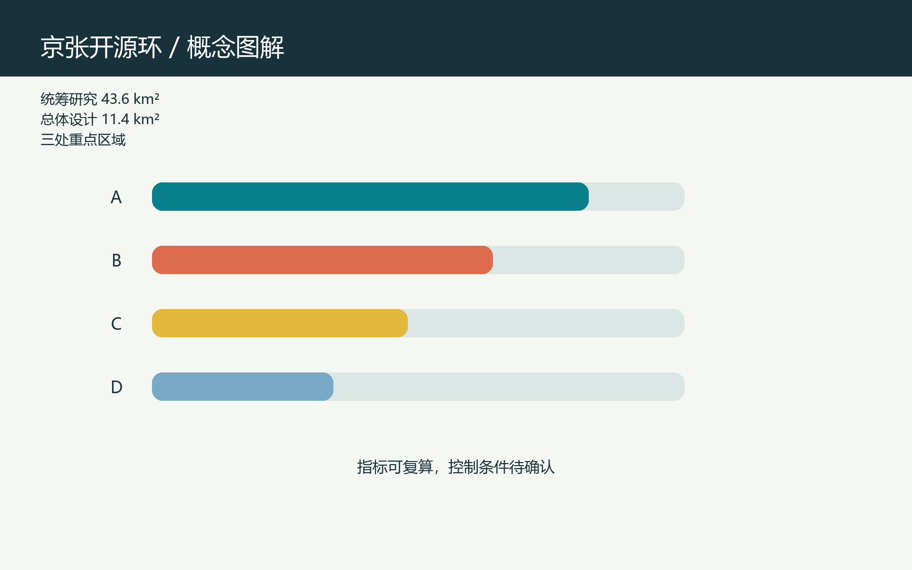

# 京张回响·智创共生

## 0. 一句话概念

把京张铁路的自主创新精神转化为一种城市运行方式：让公众能够**读历史、做实验、回到日常**，并把每一次公开测试和反馈记录为下一轮城市改进的起点。

本方案是面向公开征集的概念建议和参考方案，供专业团队深化研究，不替代正式规划、审批结论或工程设计。

## 设计依据与资料清单

方案依据活动仓库中的公开任务书、Agent 任务书、公开资料登记表和临时空间数据编制。主要证据包括 `[source:OFFICIAL-ANNOUNCEMENT]`、`[source:AGENT-TASKBOOK]`、`[source:SOURCE-REGISTRY]` 和 `[source:PROCESSED-FACT-PACK]`。

目前公开资料中部分精确官方空间 polygon、控规控制线、道路红线、权属、文保控制线和市政条件尚未齐备。本方案使用的 `geometry/` 图层仅作为 provisional 设计讨论依据，所有相关面积和空间结论在正式数据发布后重新复算。

### 原创核心：京张开源环

本方案的原创识别点不是再添加一个“AI 展示馆”，而是提出一个有空间载体和治理边界的**京张开源环**：

`读历史 → 做实验 → 回到公共生活`

- **读历史**：在京张遗址公园和文化导览节点中，阅读铁路工程、协作和自主创新的历史证据。
- **做实验**：在众智园和北京 AI 原点社区组织低速、可监管、可人工复核的 AI 场景测试。
- **回到公共生活**：把被说明、被复核、被公众反馈的成果转化为日常公共服务、文化活动和空间改进，并留下下一轮问题清单。

这使“开源”从 GitHub 的提交方式变成城市空间的运行方式。每个节点都有公开问题、参与者、测试边界、反馈入口和迭代记录，避免把 AI 变成一次性科技展览。

### 与常见方案的差异

本方案不把“智慧大脑”“未来客厅”“机器人街区”等通用口号作为主要成果，也不以未经授权的企业名单、投资额或政府承诺制造确定性。每个核心判断必须同时对应空间动作、用户场景、运营主体、数据边界和可复核指标。

## 2. 三层范围工作框架

三层范围把 43.6 平方公里的统筹研究、11.4 平方公里的总体设计和 368.4 公顷的重点区域组织成同一条证据链：上层回答创新生态和文化战略，中层回答城市更新、交通和公共空间，重点区域回答具体场景、运营和实施依赖。空间数据、指标和任务矩阵共同支撑这一递进关系 `[source:OFFICIAL-ANNOUNCEMENT]` `[source:AGENT-TASKBOOK]` `[data:geometry/site_boundary.geojson#SITE-001]` `[depth:three_level_scope_framework]`。当前边界是 provisional，正式数据到位后需同步重算面积、图件和分期。

## 统筹研究范围产业与未来城市研究

约 43.6 平方公里，研究京张铁路遗址公园、海淀 AI 产业片区、高校、企业、社区和公共服务网络之间的协同关系。该层解决“为什么形成创新带、创新带为谁服务、文化和产业如何共同构成长期品牌”的问题 `[source:OFFICIAL-ANNOUNCEMENT]` `[standard:PROJECT-AGENT-OPEN-CALL-TASKBOOK]`。统筹研究不新增法定红线，而是建立高校策源、开源协作、企业转化、公共体验和国际传播之间的关系图。产业研究需要区分公开事实、案例借鉴和设计建议；未来城市研究则把工作、学习、休闲、文化和公共服务放回可到达的空间节点。对于算力、数据、资本、人才和场景开放等要素，本方案只提出组织方法，不编造企业名单、投资金额、产值或政府政策承诺。研究成果最终通过总体概念、生态图谱、用户画像、场景卡、空间节点和运营指标回到城市设计层。

统筹研究不新增法定红线，而是建立高校策源、开源协作、企业转化、公共体验和国际传播之间的关系图。产业研究需要区分公开事实、案例借鉴和设计建议；未来城市研究则把工作、学习、休闲、文化和公共服务放回可到达的空间节点。对于算力、数据、资本、人才和场景开放等要素，本方案只提出组织方法，不编造企业名单、投资金额、产值或政府政策承诺。研究成果最终通过总体概念、生态图谱、用户画像、场景卡、空间节点和运营指标回到城市设计层。

## 总体设计范围城市更新与控规深度城市设计

约 11.4 平方公里，围绕京张遗址公园周边 1-2 公里的城市地区和产业区，形成“铁路文化线 + 创新服务网 + 公共体验面”。该层把产业生态落到用地、公共空间、慢行、更新项目和运营节点上 `[source:OFFICIAL-ANNOUNCEMENT]` `[data:geometry/land_use.geojson#LU-001]` `[depth:overall_spatial_structure]`。总体设计采用“保留记忆、补足联系、开放测试、持续反馈”的更新逻辑。用地、建筑、道路、绿地、公共空间和分期图层表达空间关系，但不将概念分区写成法定用地结论。建筑规模、强度、层数、退线、拆改留和设施承载均须等待官方控规、权属、文保、消防和市政资料确认。当前图层的价值在于让专业团队能够看到空间动作、数据缺口和后续复算路径，而不是用临时几何制造伪精确。

总体设计采用“保留记忆、补足联系、开放测试、持续反馈”的更新逻辑。用地、建筑、道路、绿地、公共空间和分期图层表达空间关系，但不将概念分区写成法定用地结论。建筑规模、强度、层数、退线、拆改留和设施承载均须等待官方控规、权属、文保、消防和市政资料确认。当前图层的价值在于让专业团队能够看到空间动作、数据缺口和后续复算路径，而不是用临时几何制造伪精确。

## 重点区域详细设计

| 重点区域 | 角色 | 设计动作 | AI 场景重点 |
| --- | --- | --- | --- |
| 众智园 AI 自主创新加速区 | 可验证的创新工作场 | 以绿色空间组织研发、测试、标准治理和产业展示 | 模型测试、标准工作坊、低碳算力体验 |
| 北京 AI 原点社区 | 面向日常生活的创新客厅 | 缝合高校、园区和街区，补足人才服务、成果发布和开源协作 | 开源发布、成果转化、社区学习 |
| 大钟寺 AI 产业聚集区 | 产业与城市生活的接口 | 强化轨道站点周边步行联系、商业服务和国际交流 | 智能终端展示、国际路演、内容消费 |

三处范围均采用活动仓库登记的 provisional geometry。正式边界到位后，需重新计算空间面积、指标、图件和分期 `[data:geometry/key_areas.geojson#PROV-KEY-001]` `[data:geometry/key_areas.geojson#PROV-KEY-002]` `[data:geometry/key_areas.geojson#PROV-KEY-003]` `[depth:three_key_area_detailed_design]`。

重点区域的详细设计分别回答三类问题：众智园如何成为可验证的创新工作场，北京 AI 原点社区如何成为开发者和居民都能进入的日常客厅，大钟寺如何把产业展示和公共生活连接起来。每个片区都要同步说明功能业态、建筑更新方向、公共空间、慢行联系、AI 场景、运营主体和实施依赖 `[source:AGENT-TASKBOOK]` `[data:geometry/key_areas.geojson#PROV-KEY-001]` `[data:geometry/key_areas.geojson#PROV-KEY-002]` `[data:geometry/key_areas.geojson#PROV-KEY-003]`。没有官方权属、道路红线、文保和市政条件的部分，统一标注为待补资料，不写成工程可行性结论。空间动作、用户场景、运营主体和风险记录共同构成重点区域的可深化证据，而不是只用“示范区”一词代替设计。

## 3. 空间结构：一环、三核、十类节点

### 3.1 一环

“一环”不是新增法定红线，而是一个由遗址阅读、慢行联系、公共空间、AI 测试和活动运营共同组成的复合工作环。它以“可阅读、可到达、可参与、可复盘”为四项评价标准。

### 3.2 三核

- **回响核**：以铁路记忆、工程精神和文化导览为核心，承担历史叙事和城市入口功能。
- **共创核**：以 AI 原点社区为核心，承担开源协作、学习、发布和人才服务功能。
- **智创核**：以众智园和大钟寺产业接口为核心，承担测试、展示、企业服务和国际交流功能。

### 3.3 十类节点

1. 铁路记忆入口
2. AI 时空导览点
3. 开发者步行交换点
4. 公共服务导航点
5. 社区学习工坊
6. 机器人低速测试点
7. 成果发布台
8. 企业问题发布墙
9. 夜间文化活动点
10. 贡献记录与反馈点

节点的具体位置、容量和工程条件待官方资料和专业深化确认；当前只表达概念空间类型和关系。

## AI 创新生态、人才画像与 AI+ 场景

### 4.1 生态链

方案建议形成“高校策源—开源协作—企业转化—公共测试—国际传播”的五段式创新链。土地、空间、资金、人才、算力、数据和应用场景不是单独的招商清单，而是围绕一个公开问题共同组织：谁提出问题，谁提供数据，谁负责测试，谁进行人工复核，谁把结果带回公共生活 `[source:AGENT-TASKBOOK]` `[source:SOURCE-REGISTRY]`。生态案例研究应选取 5-8 个有公开来源的国际案例，分别比较其创新空间、公共参与、测试治理、运营机制和可迁移限制。案例只作为方法参考，不把其他城市的企业、投资或政策直接移植为海淀事实。用户画像、场景卡和 AI 节点把生态研究转成可体验的空间与服务，并在 `metrics.json`、`assumptions.json` 和 `compliance_matrix.json` 中留下审计入口。

生态案例研究应选取 5-8 个有公开来源的国际案例，分别比较其创新空间、公共参与、测试治理、运营机制和可迁移限制。案例只作为方法参考，不把其他城市的企业、投资或政策直接移植为海淀事实。

### 4.2 五类用户画像

| 用户 | 主要需求 | 空间响应 | 数据和伦理边界 |
| --- | --- | --- | --- |
| 开源开发者 | 协作、发布、测试、社区声誉 | 原点社区发布厅、公共代码墙、夜间协作空间 | 不采集个人轨迹，活动数据只做聚合统计 |
| 初创团队 | 低成本试验、场景入口、标准咨询 | 众智园测试场、端侧算力服务点、工作坊 | 算力和数据服务需单独授权 |
| 高校师生 | 成果转化、跨校协作、学习交流 | 校区—园区慢行缝合、成果转化驿站 | 科研成果和校园数据需授权 |
| 周边居民 | 通勤、休闲、社区服务、低扰动更新 | 遗址公园慢行环、社区服务节点、分级活动 | 不将居民画像用于商业推荐 |
| 城市访客 | 文化体验、导览、公共活动 | 回响站、文化路线、智创门 | 导览内容必须注明来源和事实状态 |

## 5. 十张 AI 场景卡

| 编号 | 场景 | 空间载体 | 人工复核与运营 |
| --- | --- | --- | --- |
| S01 | 京张铁路 AI 时空导览 | 回响站和遗址阅读节点 | 文化资料先审后发布，提供来源卡 |
| S02 | 开发者步行与知识交换 | 复合慢行环 | 参与自愿，反馈公开摘要化 |
| S03 | AI 公共服务导航 | 原点社区服务点 | 复杂事项转人工，不作自动裁决 |
| S04 | 无障碍慢行助手 | 公共空间和慢行节点 | 使用者可关闭，路线建议人工抽检 |
| S05 | 社区学习与模型体验工坊 | 共创核公共空间 | 设备、数据和儿童活动分级管理 |
| S06 | 机器人低速配送测试 | 众智园可控测试区 | 限定时段、速度和人工接管 |
| S07 | 铁路文化公共展陈生成器 | 遗址公园展陈节点 | 史实引用和图像版权逐项核验 |
| S08 | 青年团队开放工作节点 | 原点社区第三空间 | 不监控工位行为，预约信息最小化 |
| S09 | 企业问题发布与场景撮合 | 智创门和线上开源板 | 企业案例需清权，不承诺商业结果 |
| S10 | 夜间开发者与公共文化活动 | 公共活动节点 | 活动安全、噪声、版权和无障碍预案 |

### 三个测试验证场景

1. **低速机器人公共服务测试**：只在明确边界内测试配送、导览或巡检，必须保留人工接管和公众退出机制。
2. **AI 文化导览测试**：只使用公开或已清权材料，所有生成内容标注来源、推断和不确定性。
3. **公共空间问题反馈测试**：通过匿名、聚合和可删除的方式收集体验反馈，不建立个人行为画像。

## 6. 三个 AI 朝圣地标

### 回响站

城市文化入口。以“过去的问题—当年的技术—今天的回应”为展陈逻辑，不复制未经授权的历史图像，不把纪念性空间变成商业广告牌。

### 共创台

面向开发者、学生、居民和访客的开放学习与成果发布节点。每次活动留下可阅读的贡献记录、问题清单和下一步验证计划。

### 智创门

面向企业、国际访客和产业服务的城市接口。它展示经过授权的案例和可复核的测试结果，不把企业标识、投资额或政策支持写成已确定事实。

## 7. 京张文化与 AI 新文化叙事

叙事主线为“从自主修建一条铁路，到共同维护一条开放的创新环”。京张铁路提供历史精神和空间记忆，中关村提供研究、创业和成果转化的现实基础，AI 新文化提供开放协作、快速试验和持续复盘的方法。

导视系统采用“时间线 + 问题卡 + 贡献记录”三类信息，不把文化只当作科技装饰。每个公共节点同时告诉访客：这里发生过什么、现在可以参与什么、哪些结论仍需专业团队确认。

## 8. 运营与实施建议

### 三阶段

- **第一阶段：建立可读的环**。完成公开资料整理、文化导览、步行体验、问题征集和小规模活动。
- **第二阶段：建立可控的试验**。在取得场地和运营授权后开展三类测试，发布结果、风险和人工复核记录。
- **第三阶段：建立可持续的社区**。形成年度活动、开发者协作、企业场景开放和公共反馈循环。

### 年度活动

- 京张开源周：公开问题、方案和数据边界。
- AI 公共空间实验季：小规模、可撤回、可复核的场景试验。
- 铁路与未来城市夜谈：把历史、规划、技术和居民经验放在同一张桌子上。
- 全球 Agent 城市设计展：展示提交、评审和迭代过程，明确区分“投稿、合并、入选、实施”。

上述活动均为概念建议，不代表已确定的政府安排、资金承诺或实施计划。

## 指标体系、面积复算与合规矩阵

本方案将指标分成三类，并以 `[metric:site_area_sqm]`、`[metric:green_ratio]`、`[metric:public_space_ratio]` 和 `[depth:metrics_recalculation]` 作为复算与审计入口：

1. **可由投稿图层复算的指标**：范围面积、重点区域数量、公共空间和绿地比例、设计节点数量、分期面积。
2. **需要官方条件确认的指标**：容积率、建筑高度、建筑密度、退线、道路红线、文保控制和市政容量。
3. **需要运营持续校准的指标**：活动参与度、公共服务满意度、场景使用频次、人才服务转化和开发者协作数量。

第一类进入 `metrics.json`，第二类进入 `assumptions.json` 和合规矩阵，第三类进入运营评估框架。任何未知指标都不使用伪精确数值。

合规矩阵将公告任务、Agent.1 至 Agent.6、空间图层、指标、图纸和 HTML 展示逐条关联。标准矩阵说明哪些判断来自公开任务书、哪些属于专业深化方向；设计深度矩阵说明三层范围、三处重点区域、交通慢行、蓝绿空间、更新项目和分期计划分别由哪些文件证明。面积复算优先使用提交的 GeoJSON 和官方脚本，临时边界只作为概念输入。若复算结果与公开文字面积不一致，两者都保留并解释原因，不用一个数字覆盖数据缺口。

## 用地、建筑规模与拆改留方案

用地方案采用“文化阅读、创新服务、青年友好复合空间、蓝绿开放空间”四类概念层，不替代法定用地分类 `[data:geometry/land_use.geojson#LU-001]` `[depth:land_use_layout]`。建筑层只表达保留、更新和待研究的空间类型，具体建筑面积、容积率、建筑高度、密度、退线和建筑控制线均列为待确认指标 `[data:geometry/buildings.geojson#BLDG-001]` `[depth:development_intensity_controls]`。拆改留采用三种工作标签：保留并解释、适应性更新、条件确认后研究。任何涉及真实权属、文保建筑或企业内部空间的动作，都必须在取得授权和专业审查后再深化。这样既让方案具有城市设计深度，也避免把临时空间数据误写成建设方案。指标若不能由图层复算就进入 `assumptions.json`，不以固定数字制造确定性。

## 交通、轨道、市政与公共服务设施

交通策略围绕轨道站点周边步行联系、慢行断点、无障碍路线、低速接驳和活动日组织提出概念建议 `[data:geometry/roads.geojson#ROAD-001]` `[depth:traffic_rail_slow_parking]`。道路图层表达的是可讨论的慢行和公共活动关系，不是道路红线、桥隧、轨道线位或交通工程设计。市政和新型基础设施部分关注端侧算力、能源、数据安全、公共服务入口和维护责任，但不测算能源负荷、市政容量或地下工程可行性 `[data:geometry/constraints.geojson#CONSTRAINTS]` `[depth:municipal_new_infrastructure]`。所有 AI 公共服务都保留人工转接、异常处理和公众退出机制，确保技术体验不替代医疗、教育、法律或安全领域的专业判断。正式道路、轨道、消防和市政资料发布后，交通策略和图层需要同步复核 `[source:SOURCE-REGISTRY]`。

## 蓝绿空间、公共空间与城市风貌

蓝绿系统以京张遗址公园、公共活动节点和慢行联系为骨架，强调连续可达、可停留、可学习和低扰动更新 `[data:geometry/green_space.geojson#GREEN-001]` `[data:geometry/public_space.geojson#PUBLIC-001]` `[depth:blue_green_public_space]`。公共空间不被设计成只服务企业发布的展台，而是同时容纳居民休息、青年交流、文化阅读、无障碍通行和小规模公共活动。城市风貌建议采用克制、可维护、可识别的时间线和贡献记录系统，避免未经授权复制历史图像、人物肖像或企业标识。绿地、公共空间、建筑基底和活动节点的比例仅按当前提交图层进行概念复算，正式绿线、蓝线、文保控制和消防条件到位后必须重算。比例和面积是设计模型输出，不能替代法定绿地率、蓝线或公共服务标准。

## 更新项目清单、实施政策与分期计划

更新项目围绕六类动作组织：回响站文化入口、共创台公共学习、智创门产业接口、开发者慢行环、AI 场景测试点和贡献反馈节点 `[depth:renewal_project_list]` `[data:geometry/phasing.geojson#PHASE-001]`。每个项目在结构化文件中记录位置类型、服务对象、运营主体、前置条件、风险和评估指标。分期遵循“先可读、再可控、后持续”：先做公开资料和低成本公共文化体验，再开展获得授权的可撤回测试，最后形成年度活动和社区运营 `[depth:phasing_implementation]`。政策建议只涉及公开资料治理、公众参与、场景开放、版权合规、跨主体协作和专业复核，不写成已确定的投资、审批、招商或政府承诺。实施主体、权属、资金和审批路径属于待补条件，需由专业团队继续确认。

## 风险、版权与合规说明

- 临时边界不得冒充官方红线；官方数据发布后必须重算。
- 不使用个人隐私、企业内部数据或未公开规划资料。
- 不把概念活动、政策建议、投资、建设时序或政府承诺写成确定事实。
- AI 场景保留人工复核、公众退出和风险反馈机制。
- 图片、字体、地图、Logo、人物和企业标识使用前登记来源与许可。
- 所有 AI 生成内容由投稿 Agent 和贡献者负责事实、版权、隐私和最终表达。

风险矩阵至少持续关注数据隐私、实施复杂度、公众接受度、运维成本、政策不确定性、空间争议、技术成熟度、公平包容和版权清权 `[source:SOURCE-REGISTRY]` `[depth:risk_missing_data]`。任何场景若无法说明人工复核、公众退出、数据来源和责任主体，就降级为研究问题，不进入可展示的实施建议。临时边界、空约束图层和未授权素材不应被隐藏；它们应在 `assumptions.json`、`sources.json`、版权声明和自检结果中持续可见。

## 参考资料

本方案优先使用活动仓库的公开任务书、Agent taskbook、公开资料登记表和 provisional geometry，并在 `sources.json` 中登记发布者、URL、获取日期、用途和局限 `[source:OFFICIAL-ANNOUNCEMENT]` `[source:AGENT-TASKBOOK]` `[source:SOURCE-REGISTRY]` `[source:PROVISIONAL-GEOMETRY]`。活动仓库中的 processed fact pack 只作为导航层，不能替代公告和原始来源。未来补充的铁路文化、公共服务、交通、产业和地图资料，必须优先选择官方或可信公开来源，交叉核对关键事实，并记录许可、转换方法和不确定性。任何无法确认公开性、版权或准确性的资料，不进入 formal 证据链。来源记录还应说明哪些资料只支持概念讨论、哪些资料可支撑空间复算、哪些资料必须等待官方发布。

## 11. 原创贡献说明

本方案的核心原创贡献包括：

1. 将“开源”转译为城市空间的运行机制，而不是只作为提交渠道。
2. 用“读历史—做实验—回到公共生活”连接文化遗产、AI 测试和日常服务。
3. 为每个 AI 节点同时设置公开问题、测试边界、人工复核、反馈入口和迭代记录。
4. 将三处重点区域组织为回响核、共创核和智创核，形成互相反馈而不是互相孤立的片区方案。
5. 把原创性和可验证性放在一起：不依赖夸大的技术承诺，用公开资料、空间图层和运营记录证明方案可以继续深化。

## 12. 迭代状态

当前版本为本地工作稿。下一步将补齐结构化 JSON、GeoJSON、图纸、离线 HTML 和自检结果；所有状态在提交前以官方工具和 Pull Request 为准。
