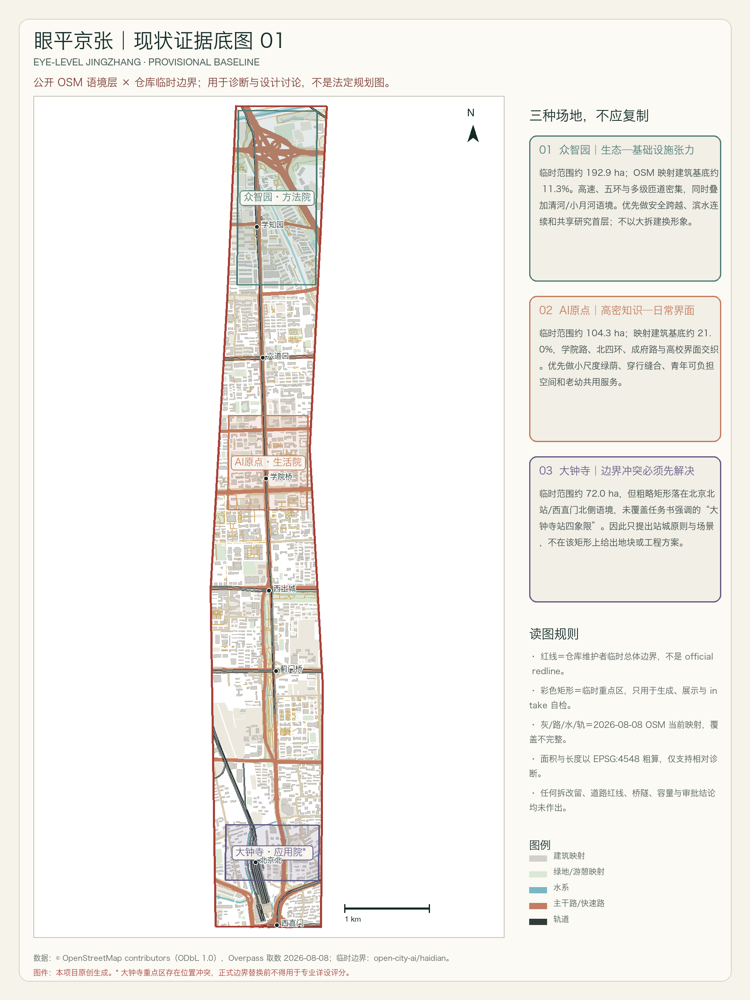
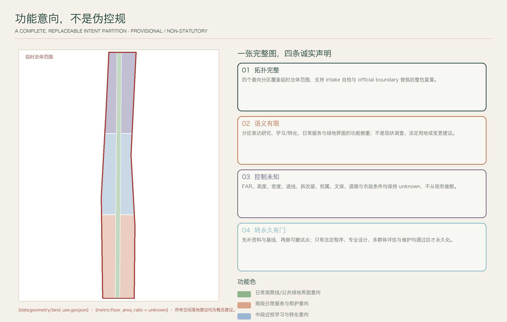
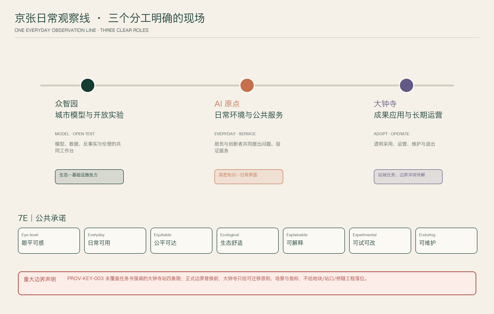
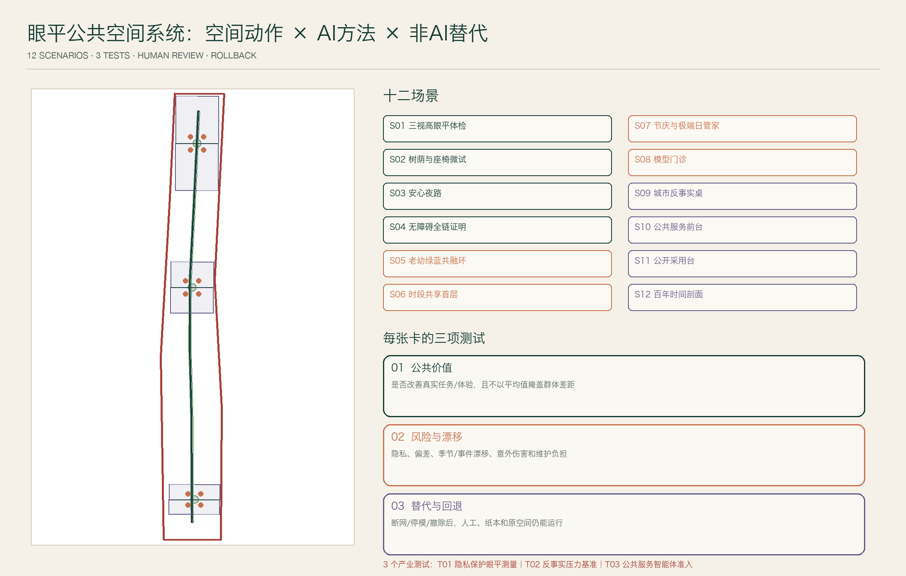
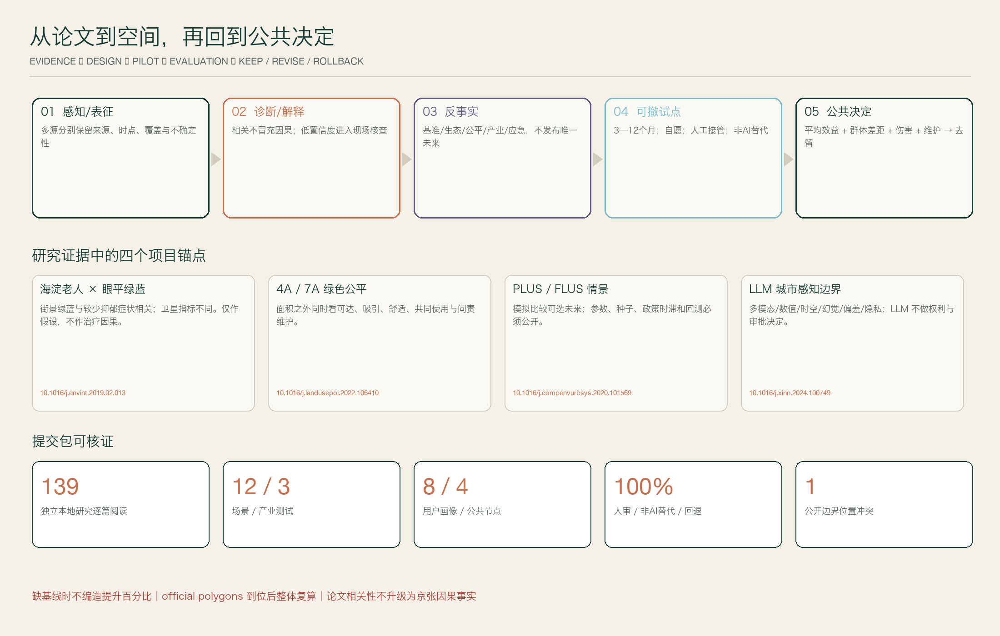

# Align with Jing-Zhang EYE-LEVEL JINGZHANG｜A People-Centric Urban Science Block

## Executive Summary

**Let innovation be tangible, and let evidence return to the everyday.** The first innovation of the Jing-Zhang Railway for a century uses engineering to bring the distant closer; the next innovation in the AI era should return abstract technology to a human scale. This plan understands the 11.4-hectare Overall Design Area as a "human-centered urban science district": AI helps to see differences, compare choices, and expose risks in advance and explain evidence, but it has no authority to automatically decide who will be served, where to build, or what will become permanent facilities.

The main structure is not another "Intelligence Track/Thread," but rather **a daily cross-section, three on-site research institutes, and seven public commitments**. Zhongzhiyuan becomes the "Method Court" for models/data/simulations/ethics, the AI Origin community becomes the "Life Court" for residents and innovators to jointly validate daily services, and Dazhongsi becomes the "Application Court" for transparent procurement, adoption, maintenance, and exit. The final score is judged by the green and blue spaces, shade, accessibility, day and night safety, services, interactions, and maintenance in the perspectives of children, seated/ wheelchair users, and adults, rather than by giant screens, robots, or platform usage volumes. [source:AGENT-TASKBOOK] [depth:overall_spatial_structure]

## Design Basis and Source List

The proposal should fully read the competition `urban-design-ai-submission` skill, formal submission guidelines, public task book, site package, professional standards, and scoring rules, with the official announcement text range and area as the primary reference, and the repository's provisional polygons as temporary generation/display constraints. [source:OFFICIAL-ANNOUNCEMENT] [source:AGENT-TASKBOOK] [source:SITE-PACKAGE] [standard:PROJECT-OFFICIAL-ANNOUNCEMENT]

The local authorization UrbanComp library contains 141 documents.PDF, 2,221 pages; after removing the journal covers and one duplicate preprint, there are 139 independent studies, all of which were individually formed into methods, findings, limitations, design translations, and testable items. 139 have text layers.UC-127/132 Two scanned copies have been visually reviewed; 137/139 There are.DOI. The website currently accessible contains seven additional full texts and one abstract-level increment after crawling, downloading, and re-verification over three pages. Some of the old paginated returns from the website resulted in server errors, so we only declare "full coverage of the local authorized library + current website accessible increment," without claiming exhaustive coverage of inaccessible server pages. [source:URBANCOMP-LOCAL] [source:URBANCOMP-WEBSITE]

Public OSM roads, buildings, tracks, waterways, green spaces/recreation, and facilities are provided only for context, with ODbL attribution noted; they cannot be used to directly quantify the absence of physical facilities in reality. [source:OSM-BASELINE] All generated graphics are original drawings for this project and do not reproduce academic figures, case study images, trademarks, or portraits.

### Boundary Conditions and Major Conflicts

`geometry/site_boundary.geojson` and three `key_areas` are both marked as `provisional_constraint`, with `official_boundary=false`; the area can only be temporarily recalculated relatively within EPSG:4548. [data:geometry/site_boundary.geojson#SITE-001] [metric:site_area_sqm]

The task book requires the "pedestrian connectivity design for the four quadrants of the intersection where the Dazhongsi Metro Station is located," but the rough rectangular area of `PROV-KEY-003` falls within the context of Beijing North Station/Xizhimen North Side, and does not cover the location of the task. This conflict has been documented in `constraints.geojson`, assumptions, and self-check: formal boundaries will only be submitted for station-city principles, scenarios, and indicators, without providing parcels, station entrances, bridges, tunnels, or engineering locations. [data:geometry/constraints.geojson#CONSTRAINT-KEY3] [source:KEY-AREA-SOURCE]

## Three-Level Scope Framework

Three layers share the same Evidence Chain but carry different levels of precision: the 43.6 km² Coordinating Layer only studies industry, knowledge, public value, and regional synergy; the 11.4 km² Overall Layer proposes functional intentions, daily profiles, and phased approaches that can be fully replaced or recalculated; and the 368.4 ha Focus Layer proposes three on-site research institutes and migratable scenarios. Any lower layer graphic cannot be upgraded to the official scope or legal conclusions of the upper layer.  [source:OFFICIAL-ANNOUNCEMENT] [source:BOUNDARY-SOURCE] [depth:three_level_scope_framework]

| Level | Known Official Text/Area | Work of This Proposal | Precision Boundary |
|---|---|---|---|
| Coordinated Research Area | Approximately 43.6 km² | Synergy of Industry—Knowledge—Public Value and Two-Wing Mechanism | No precise official polygon, no land parcel conclusion |
| Overall Design Area | Approximately 11.4 km² | A Daily Cross-Section, Toolbox of Breakpoints, Functional Intentions, and Phased Approach | Temporary polygon with an area of approximately 11.413 km², for Discussion/Recalculation |
| Three Key Areas | 192.1/104.3/72.0 ha | Methods Court/Life Court/Use Court and 12 Scenarios | All three polygons are temporary; Dazhongsi has an additional location conflict |

## Detailed Design of Key Areas

### Zhongzhiyuan: Ecological—Infrastructure Tension → Methods Court

Temporary scope approximately 192.9 ha; OSM mapped Building Footprint is about 11.3%; the area is characterized by dense infrastructure including highways, the fifth ring road, overpasses, and Xueqing Road, with the Qinghe/Xiaoyuehe context overlay. The strategy prioritizes safe crossings, waterfront continuity, forested understudy streets, and shared ground-level research; it does not aim to fill in low-density spaces or resort to extensive demolition and reconstruction to change the image. Bridge tunnels, blue lines, flood protection, road rights-of-way, and ownership are all pending professional verification. [data:geometry/key_areas.geojson#PROV-KEY-001]

### AI Origin Community: High-Density Knowledge — Daily Interface → Life Court

Temporary scope approximately 104.3 ha; OSM mapped Building Footprint is about 21.0%, with the college road, northern Fourth Ring Road, Chengfu Road, and university interfaces interwoven. The strategy is to use micro-greening, sitable boundaries, time-sharing ground floors, safe night paths, and elderly and child services to turn "physically close" into "encountering daily"; without pre-setting the opening of the campus/compound ownership boundaries. [data:geometry/key_areas.geojson#PROV-KEY-002]

### Dazhongsi: Station City—Industry—Culture Adoption → Application Institute

Only adopt the functional requirements specified in the assignment: new forms of entities such as intelligent agents/intelligent terminals/content consumption, public environment around key enterprises, composite utilization of planned green spaces, pedestrian and non-motorized connections between Dazhongsi station and key development areas, and organization of four quadrants for pedestrians and non-motorized vehicles. Current temporary rectangular positions are in conflict; all designs are expressed in migratable modules and will be positioned after the official polygon is determined. [data:geometry/key_areas.geojson#PROV-KEY-003] [depth:three_key_area_detailed_design]

## Coordinated Research Area: Industry and Future City Research

The coordinating layer does not add pseudo-precise redlines but connects the Three Zones and Two Wings through a value chain of "university/research—tools/standards—community issues—enterprise/public adoption—international public knowledge." The Zhongguancun Technology Services Wing inputs intellectual property, talent, capital, law, and international networks; the Xiaoyue River Scenario Enablement Wing inputs ecology, healthcare, education, embodied and cultural issues. Any resource support is presented as a mechanism suggestion, not as government funding, business attraction, or corporate commitments. [source:AGENT-TASKBOOK] [depth:three_level_scope_framework]

### Seven Global Case Studies: Translating Mechanisms, Not Copying Catchphrases

| Case | Approach | Not to Copy Verbally |
|---|---|---|
| Punggol Digital District | Campus—Industry—Community Synergy, Digital Twin Pre-Testing | No Central Control "Universal OS", Data Decentralization and Minimization |
| Smart Kalasatama | Real Street Agile Pilot, Urban Lab, Multi-Stakeholder Collaboration | Residents are not unconditional test subjects; they must have the option to opt out |
| Barcelona 22@ | Industrial Upgrading, Knowledge Transfer, and Mixed Use | Preventing Office Homogenization, Exclusion, and the Loss of Original Services |
| Kendall Square | University—Enterprise—Community Walkable and Public Interface | Avoid Duplication of High-Rent Headquarters Districts, Preserve Small Teams and Daily Services |
| Seoul AI Hub | Education—Incubation—Computing Power—PoC—International Cooperation Growth Chain | Membership and computing power do not equate to public value |
| STATION F | Project Duration, Partner Program, Housing/Support Interface | Do Not Create Closed Super Campuses; Keep Public Grounds Open |
| Toronto Quayside | Prioritize Digital Governance, Public Review, and Whole-Age Low-Carbon Goals | Do Not Replace Public Legal Rights and Democratic Accountability with Corporate Data Trusts |

Primary sources can be found at [source:PUNGGOL], [source:KALASATAMA], [source:BARCELONA22], [source:KENDALL], [source:SEOUL-AI-HUB], [source:STATION-F], [source:QUAYSIDE].

## UrbanComp Evidence and How It Can Transform Design

| Paper Evidence | What It Supports | What It Does Not Prove | This Plan's Actions |
|---|---|---|---|
| Haidian 1,190 seniors street scene green-blue and depression symptoms study [doi:10.1016/j.envint.2019.02.013] | Eye-level green-blue is worth considering as a local hypothesis | Cross-sectional cannot prove treatment/causal | Three views high, elderly actual walk, actual use, and voluntary longitudinal retesting |
| Street Scenery Greenness/NDVI and Well-being Multi-Pathway [doi:10.1016/j.envres.2019.108535] | Greening Needs to Be Evaluated Together with Activity, Stress, Environmental Perception, and Cohesion | Green Area Can Replace Quality and Usage | Canopy Shade, Quietness, Benches, Social Interaction, and Maintenance Integrated |
| Visible Green Space 4A Fair [doi:10.1016/j.landusepol.2022.106410] | Supply, accessibility, attractiveness, and appearance must be addressed equally. | The average area can illustrate fairness. | Expand to 7A, audit gaps by user profile |
| Primary School Students/Elderly Active Travel Non-Linear [doi:10.1016/j.jtrangeo.2022.103303] [doi:10.1016/j.jth.2024.101834] | Thresholds, Combinations, and Group Differences Are Important | More Is Better or Average Person Model | Children/Sitting/Adult Three-View Heights and Subgroup Journeys |
| PLUS/FLUS Multi-Scenario Simulation [doi:10.1016/j.compenvurbsys.2020.101569] [doi:10.1080/13658816.2018.1502441] | Compare Alternative Futures, Explicit Policy Levers | Predicting a Singular Future or Treating Importance as Causality | Baseline/Ecological/Fairness/Industry/Scenario Emergency + Sensitivity + Pilot Withdrawal |
| Multi-perspective Representation and Uncertainty [doi:10.1080/15481603.2024.2387392] [doi:10.1016/j.jag.2024.103805] | Modalities Selected by Task, Low Confidence Visible | More Data is Better | Cross-Modal Conflicts Enter the On-site Verification Queue |
| LLM Urban Perception Overview [doi:10.1016/j.xinn.2024.100749] | Citation Retrieval and Interpretation Interface | Automatic Spatial Computation, Approval, and Rights Determination | GIS/Script Deterministic Computation + Human Responsibility + No Citation Downgrading |
| Urban Systems—Bidirectional Cause and Effect [doi:10.1038/s41467-026-71377-0] | Intervene in Functions, Needs, and Networks | Widening Roads is the Default Answer | 15-Minute Services, Off-Peak, Active/Transit and Door-to-Door Evaluations |

Complete and standardized list of the paper, 21 individual reading packages, and evidence—design matrix as research attachments saved in the project directory; public submissions are only for legitimate citation, and the original PDF is not distributed to users. [source:URBANCOMP-LOCAL]

## Overall Design Area: Urban Renewal and Regulatory-Plan-Level Urban Design

Overall scope organized for adaptive updates with "eye-level public value + urban scientific loop": first, supplement the Official Boundary, control plan, and current data, then validate hypotheses with reversible seating/shade/wayfinding/service workflows. Only after multiple seasons, multiple groups, risks, maintenance, and legal procedures are all passed can permanent updates be entered. Functional intentions, research institute interfaces, audit routes, green/blue/Public Space experiment envelopes, and phased layers can all be recalculated after replacing the official boundary, without pre-judging Floor Area Ratio, height, demolish-renovate-retain strategy, road redlines, or engineering feasibility. [data:geometry/land_use.geojson#LU-001] [depth:land_use_layout] (Demolish–Renovate–Retain Strategy)

The spatial structure is not a pseudo-precise master plan drawn on the Provisional Boundary, but rather a set of objects that a professional team can continue to work with: `land_use` maintains topological integrity but is clearly only a functional intention; `roads` express a continuous experience and stitching of elements that are to be audited, not engineering lines; `green_space`/`public_space` express a temporary test envelope; `constraints` spatialize the boundaries, control plans, and conflicts of Dazhongsi; `phasing` uses phase gates to avoid the premature permanentization of unverified actions. Each object has a source, confidence level, geometry role, metrics, and assumptions, which can be recalculated once the official polygons are in place. [data:geometry/constraints.geojson#CONSTRAINT-KEY3] [metric:site_area_sqm]

The control plan depth in this submission is represented as a "comprehensive of issues, objects, validation, prerequisites, and responsibilities," rather than fabricated control values. The current facilities, ground floor, green-blue spaces, transportation, heat, rain, noise, ownership, and structure still require on-site/professional investigation; the floor area ratio (FAR), height, density, setback, Demolish-Renovate-Retain (démolir-réhabiliter-rétroger) strategy, bridges and tunnels, station entrances, and municipal capacity are to be maintained as unknown. Content can undergo intake evaluation, but statutory and engineering deepening must await documentation and procedures. [metric:floor_area_ratio] [standard:MOHURD-CONTROL-DETAILED-PLANNING] (Demolish–Renovate–Retain Strategy)

## 1. Value Proposition

**Let innovation be tangible, let evidence inform everyday practice.**

The Jing-Zhang Innovation Belt is not a showcase corridor for AI products, but a city science district oriented towards people. The role of AI is to help the city identify differences, compare options, preview risks, and explain evidence; it cannot automatically decide who will be served, where to build, or what will become permanent facilities. The ultimate result will be judged by whether people can more conveniently walk, stay, interact, access services, and return home safely at the human scale.

## 2. Overall Structure

### A Daily Cross-Section

Along the Jing-Zhang Heritage Park and the east-west connectivity path, continuously record history, shade, rainwater, sound, seating, first floor, cross-street, pedestrian-friendly, services, and people. It is a shared language of experience and evaluation, not a landscape axis that requires an entire segment to be uniformly identical.

### Three On-Site Research Institutes

- **Zhongzhiyuan·Fangyiuyuan**: A common workspace for models, data, counterfactuals, ethics, and standards.
- **Beijing AI Origin·Life Court**: Residents and innovators jointly identify problems and validate everyday services.
- **Dazhongsi·Application Institute**: Convert validated proposals into transparent procurement, operation, and maintenance capabilities.

### Synergistic Wings

- **Zhongguancun Technology Services Wing** receives inputs such as intellectual property, capital, talent, computing power, law, and international networks, but does not turn support into a definite commitment.
- The **Xiaoyue River Scenario Enablement Wing** provides ecological, medical, educational, embodied, and cultural real-world issues, but any testing must first pass through the doors of public interest, privacy, and human responsibility.

### Seven Public Commitments 7E

Eye-level, accessible at street level; Everyday, for daily use; Equitable, accessible to all; Ecological, comfortable for the ecosystem; Explainable, understandable and transparent; Experimental, testable and modifiable; Enduring, maintainable.

## 3. Eight User Archetypes and Irreconcilable Needs

| ID | User Profile | Key Journeys of the Day | Needs Often Overlooked by Averages | Solution Testing |
|---|---|---|---|---|
| P01 | Living Alone/Companion Elderly | Shopping for Groceries—Visiting Healthcare/Services—Visiting the Park—Returning Home | Rest Frequency, Glare, Hearing, Stairs, Unknown Digital Interfaces | Seated View Height, Rest Spacing, Continuous Accessibility, Human Service, Nighttime Safety |
| P02 | Children and Caregivers | Home—School/Care—Activity—Home | Child Perspective, Crosswalk Wait, Stroller, Toilets, Caregiver Visibility | Child Eye Level, Group Crosswalk, Shade, Toilets/Water, Caregiver Line of Sight |
| P03 | Wheelchair/Visually Impaired | Transfer—Transaction—Work/Activity | Slope, End Tactile Paving, Threshold, Redundant Cues, Detour | Door-to-Door Task Completion, Slope/Threshold, Multimodal Touch-Audio-Visual, Manual Assistance |
| P04 | College Students/Researchers | Campus—Lab—Entrepreneurship Space—Night Return | Cost-Effective Spaces, Cross-Institutional Openness, Nighttime Safety, and Technology Transfer | Affordable Workstations, Open Hours, Inter-Institutional Collaboration, Nighttime Routes |
| P05 | Startup Team/Independent Developer | Prototype—Test—Compliance—Procurement/Market | Computational/Data Thresholds, Testing Responsibility, Supplier Lock-in | Shared Tools, Model Clinic, Public Access, PoC Exit, Replication Rate |
| P06 | Commuting and Frontline Workers | Rail/Bus—Jobs—Dining—Pickup | Peak Hours, Breaks, Affordable Dining, Safety for Night Shifts | Full-Chain Transfer, Nighttime Services, Seats/Bathrooms, Affordability Retention |
| P07 | Community Workers/Facility Operators | Receive—Dispatch—Site—Review | AI Error Responsibility, Interdepartmental Coordination, Maintenance Burden | Manual Takeover, Responsibility Log, Maintenance Hours, Appeals and Reversals |
| P08 | Domestic and International Visitors/Short-Term Talent | Arrival—Visit—Cultural Engagement—Service—Departure | Multilingual, Account-Free Access, Historical Understanding, Clear Boundaries | Multilingual Staff/Print Alternative, Understandable Signage, Privacy Notice, No Registration Required Services |

## 4. Twelve AI+ Spatial Scenario Cards

All cards meet the following criteria: do not use personal identity/facial/device identifiers for public space scoring; have non-AI alternatives; key outputs are subject to human review; pilots have a defined term, stop thresholds, and restoration responsibilities.

### S01｜Three-Dimensional Visual Inspection at Eye-Level THREE-HEIGHT STREET SCAN

- **Location**: A segment of a breakpoint in a daily cross-section; select 1 segment in each of the three areas, and precisely locate them for on-site verification and property rights confirmation.
- **User/Issue**: P01—P03; adult street scenes may not account for the obstruction by children, seated individuals using wheelchairs, vegetation, signage, and crossing risks.
- **Spatial Actions**: Conduct a green-blue space, shading, visibility, threshold, and pause interface audit at three view heights of approximately 0.9m, 1.2m, and 1.6m, forming a remediation list.
- **AI Role**: On-device Semantic Segmentation; blur faces/plates first, retaining district-level aggregation and confidence; manual sampling for verification.
- **Three Tests**: 1) Consistency with records of three types of users; 2) Drift during different seasons/weather/lighting conditions; 3) Ability of paper audit to reproduce the same prioritization.
- **Stop/Retract**: Stop if unmasked personal information is present, low-confidence automatic conclusions are drawn, or there are significant divergences among groups; revert to manual walkthrough and paper checklist.

### S02｜Tree Canopy and Bench Micro-Trial SHADE + SEAT MICRO-TRIAL

- **Location**: Heat exposure, waiting, queuing, and long-distance segments without rest stops; prioritize the original point community and Zhongzhiyuan.
- **User/Issue**: P01—P03, P06; Green space area does not equal available space for lingering, shading, and comfort.
- **Spatial Actions**: Mobile tree pits/shade, varying heights and handrail seating, drinking/watering/rain indicator, temporary then permanent.
- **AI Role**: Combine deterministic solar/daylight and thermal comfort calculations with anonymous human count comparisons for placement; the model only proposes candidates.
- **Three Tests**: 1) Whether staying and task completion during hot periods are improved; 2) Whether there is any occupation of space for wheelchairs, fire safety, or passage; 3) Whether the effect can be maintained without the algorithm and with repositioning by on-site personnel.
- **Stop/Retreat**: Withdraw or relocate if there are traffic conflicts, an exacerbation of heat risks, or if maintenance is unaffordable; materials are reusable.

### S03｜Safe Night Walk CALM NIGHT WALK

- **Location**: Rail/bus routes for nighttime full-chain access to the community, campus, and park.
- **Users/Issues**: P01, P03, P04, P06; sense of security depends on lighting, visibility, maintenance, services, and social activities, not on the number of cameras.
- **Spatial Actions**: even lighting, clear exit signs, visible emergency points, active ground floor, pruning and maintenance, night stay points.
- **AI Role**: Analyze illumination/defect/maintenance work order data and voluntary aggregation surveys to help prioritize maintenance tasks; do not perform facial recognition, anomaly detection, or personnel risk identification.
- **Three Tests**: 1) Nighttime walk comfort for different genders/ages/capacities; 2) Lighting glare and dark areas; 3) Functionality of manual inspection, phone, and physical emergency assistance during a network outage.
- **Stop/Retract**: If the technology expands monitoring or generates group labels, immediately retract this feature; retain environmental and human service improvements.

### S04| Proof of Full Accessibility Chain ACCESS JOURNEY PROOF

- **Location**: Journey from the entrance—through the street—down to the first floor—through the toilet/service desk.
- **User/Issue**: P03; Local "compliance points" do not guarantee door-to-door completion.
- **Spatial Actions**: Record slopes, thresholds, waiting, detours, tactile/auditory/visual cues, and human assistance through authentic tasks.
- **AI Role**: Organize voluntary, desensitized obstacle records into a candidate repair queue; navigate suggestions for verification by accessibility users and operators before release.
- **Three Tests**: 1) Task Completion Rate for Three Types of Auxiliary Methods; 2) Route Validity After Temporary Construction/Temperature Changes; 3) Availability of Paper Maps, Tactile Maps, and Manual Guidance.
- **Stop/Retract**: Any unverified routes shall not be marked as "accessible"; incorrect routes shall be removed, and manual guidance and on-site signage shall be restored.

### S05| Elder-Youth Green-Blue Fusion Ring GREEN-BLUE CARE LOOP

- **Location**: Primarily around the AI Origin community, with the Zhongzhiyuan waterfront node as a secondary focus.
- **Users/Issues**: P01, P02; large-scale green spaces may be visible but not accessible, not comfortable to sit in, or not safe.
- **Spatial Actions**: Short Loop/Long Loop, Sit-and-Chat Natural Nodes, Toilets and Drinking Fountains, Low-Stimulation Zones, Children's Observation Points, and Continuous Accessibility.
- **AI Role**: Three-view High Green Blue, Tree Canopy, and Route Burden Diagnosis; Provides Only Population-Level Candidates, Not Individual Health Recommendations.
- **Three Tests**:
1. Elder/Caregiver Walkthrough Completion and Stay;
2. Are Green Views, Safety, Noise, Shade, and Social Interaction All Present Simultaneously?;
3. Can the Walkthrough Be Completed Without Using a Phone;
- **Stop/Retract**: Correct the text and approach if blue-green safety/management conflicts are identified or if health effects are overstated; do not diagnose individuals based on the survey results.

### S06｜etimeshared Ground Floor TIME-SHARED GROUND FLOOR

- **Location**: Negotiable ground floor of the campus, park, community, and the Dazhongsi station-town interface; no predefined ownership openness.
- **User/Issue**: P04—P08;  space may be idle at certain times, while small teams, residents, and night shift services lack affordable places.
- **Spatial Actions**: movable partitions, shared entrance hall, project desks, care/service front desk, combination of evening study hours and weekend markets.
- **AI Role**: Propose alternative schedules within the authorized capacity and rules, and explain any conflicts; the final confirmation will be made by the place operator.
- **Three Tests**: 1) Cross-group Time Period Coverage and Burden; 2) Noise, Safety, and Maintenance Conflicts; 3) Whiteboard/Phone Scheduling as an Alternative to Outages.
- **Cease/Retract**: Do not open if the ownership or safety conditions are not met; revert to the original function during conflicts or shorten the operating period.

### S07｜Festivals and Extreme-Day Stewardship EVENT + EXTREME-DAY STEWARD

- **Location**: Overall section, station entrances, and public activity nodes.
- **Users/Issues**: All; the average daily usage does not represent forum events, exhibitions, heavy rain, heat waves, or track disruptions.
- **Spatial Actions**: Elastic Queuing, Temporary Service Reconfiguration, Emergency Sheltering, Alternative Accessible Routes, and Dispersed Activity Points.
- **AI Role**: Use aggregated/synthesized data to perform counterfactual capacity testing, providing uncertain intervals; human command is unified and responsible.
- **Three Tests**: 1) Service retention for vulnerable groups during five scenarios; 2) Prediction failure threshold and speed of human takeover; 3) Operation of contingency plans without any prediction.
- **Cease/Retract**: Operate only according to the approved emergency plan when the model drifts or behaves abnormally; do not automatically limit individual passage based on predictions.

### S08｜Model Clinic MODEL CLINIC

- **Location**: Zhongzhiyuan·Fangyuan, rotating between two areas on a regular basis.
- **User/Issue**: P05 and P07 with public representatives; the models often go live with data sources, drift, biases, and explainability issues.
- **Spatial Actions**: Public model card wall, conflict evidence table, red team room, public question seat, and fix version records.
- **AI Role**: Automate the execution of deterministic unit tests, drift/coverage checks, and citation verification; cannot self-approve.
- **Three Tests**: 1) Independent Replication and Model/Artificial Disagreement; 2) Prompt Injection, Privacy, and Minority Group Pressure Testing; 3) Whether There Is an Artificial Process When the Model Is Disabled.
- **Stop/Retract**: Entry to the site is not permitted if any high-risk door fails; retract to the previous version or a non-AI process.

### S09｜Urban Counterfactual Table URBAN COUNTERFACTUAL TABLE

- **Location**: Three on-site research institutes and an annual evidence conference.
- **Users/Issues**: the public, planners, operators, and businesses; a single predictive map would obscure value choices and uncertainties.
- **Spatial Actions**: tangible tables for physical interaction + accessible screens/paper models, simultaneously comparing baseline, ecological, equitable, industrial, and emergency scenarios.
- **AI Role**: Synthesize scenarios, explain differences; areas, networks, accessibility, and rules are calculated deterministically by GIS/script.
- **Three Tests**: 1) Recalculation with the Same Parameters; 2) Sensitivity to Random Seeds/Hypothesis Sensitivity; 3) Participants' Ability to Distinguish Observations, Hypotheses, and Recommendations.
- **Stop/Retract**: Cannot recalculate or misrepresent as government forecast; retain paper plans, parameter tables, and human facilitation.

### S10｜Public Service Front Desk CIVIC SERVICE FRONT DESK

- **Location**: AI Origin·Life Court, connecting community services with the Dazhongsi application end.
- **User/Issue**: P01—P03, P06—P08; complex service information, language, and digital barriers hinder access to assistance.
- **Spatial Actions**: physical service counters, quiet consultation stations, multi-lingual/large-print/tactile information, manned transfer stations, and paper-based guidance.
- **AI Role**: Provide Q&A, translation, and navigation based solely on curated knowledge bases; do not determine eligibility, penalties, medical decisions, or funding.
- **Three Tests**: 1. Answer Citation and Obsolescence Rate; 2. Task Completion for Seniors/Disabled/Multilingual Users; 3. Equivalent Services for In-Person, Phone, and Paper.
- **Stop/Retract**: Automatically redirect to manual review when there is no reliable source, knowledge is outdated, or involves a decision of right; retain the full non-numeric channel.

### S11｜OPEN ADOPTION DESK

- **Location**: Dazhongsi·Yingyuan; precise location to be determined by official boundary.
- **User/Issue**: P05 and P07 with Enterprises/Public Procuring Entities; PoC Often Stalls or Gets Locked by Suppliers.
- **Spatial Actions**: Publish issue catalogs, set testing periods, establish neutral interfaces, and provide procurement/exit/data deletion lists and public demonstration slots.
- **AI Role**: Compare alternative scheme evidence and interoperability, generate a review summary with sources; procurement and authorities personnel are responsible.
- **Three Tests**:
1. **Replaceability by Different Suppliers and Data Portability**;
2. **Public Value/Maintenance Cost Rather Than Display Popularity**;
3. **Service Continuity and Data Deletion Post-Contract Exit**.
- **Cease/Retract**: Do not proceed to the real-world scenario if procurement, privacy, security, or liability are not clear; remove the PoC and restore the site upon completion of the PoC period.

### S12｜Centennial Time Section CENTURY TIME SECTION

- **Location**: Existing public paths within the site park and the cultural interfaces of the three zones; low-impact placement after archaeological verification.
- **Users/Issues**: P01—P08;  railway history, Zhongguancun innovation, and AI new culture are at risk of being reduced to mere technological decorations.
- **Spatial Actions**: tactile timeline, sittable archival window, sound dot, three-view high vantage frame, and "Keeper Honor" record.
- **AI Role**: Multilingual interpretation with cited sources, oral history retrieval, and optional AR; does not generate unverified historical facts, does not collect facial data.
- **Three Tests**: 1) Fact Reference Hit Rate and Expert/Community Verification; 2) Understandable to Blind, Deaf, Children, and Foreign Language Visitors; 3) Complete Wayfinding/Touch-Sense/Manual Interpretation when Equipment is Not Available.
- **Pause/Retract**: Remove the content from the platform if there are disputes over facts, copyright, or cultural heritage conditions; retain the revocable physical carrier for potential revision, without irreversible inscription.

## 5. Three Industry Testing and Validation Scenarios

### T01｜Toolbox for Eye-Level Urban Measurements to Protect Privacy

- **Composition**: S01, S03, S04, S05; end-side desensitization, three-view high sampling, manual spot check, street segment aggregation, model card.
- **Test Chain**: Synthetic/Public Sample → Closed Segment → Voluntary Implementation → Three-Pilot Zones.
- **Prerequisites:** Sensitive information does not enter the public package; consistency and errors are disclosed by group; non-AI prioritization lists are reproducible; and there is a degradation for cross-seasonal drift.
- **Output**: Neutral supplier data standards, sampling protocols, reproducible metrics, and stop lists, rather than a specific product.

### T02｜Urban Counterfactuals and Stress Testing Benchmarks

- **Composition**: S02, S07, S09; heat, rain, activities, track disruptions, flexible and equitable priority scenarios.
- **Test Chain**: Historical Backtesting → Seed/Parameter Sensitivity → Synthetic Intervention → Reversible Spatial Prototype → Deviation Review.
- **Prerequisites:** Observation/hypothesis/suggestion stratification; deterministic spatial calculations through unit testing; critical community services not sacrificed by average benefits; human emergency alternatives.
- **Output**: baseline data structure, scenario cards, failure thresholds, and public debriefing, without releasing a single future prediction.

### T03｜Certificate for the Admission and Adoption of Intelligent Public Service Entities

- **Composition**: S08, S10, S11, S12; knowledge base, references, permissions, call transfer, interoperability, exit, and historical copyright.
- **Test Chain**: Offline Red Team → Simulated User → Small Sample Voluntary Service → Time-Limited On-Site → Public Continuation/Correction/Exit Decision.
- **Prerequisites:** 100% rights/health/funding issues routed to human; citation, timeliness, accessibility, and multilingual testing qualified; no account/paper equivalent; supplier proof of replaceability and deletability.
- **Output**: A revocable and reviewable permit and version record, not a government certification or permanent authorization.

## 6. Multiple "Holy Sites": Memorials to Shared Inquiry, Not Devotional Equipment

| Landmark | Concept | Daily Function | AI/Non-AI Boundary |
|---|---|---|---|
| L01 Three-Dimensional Viewpoint for Heights Observation | 0.9/1.2/1.6m three open vision frames | Observe the tree canopies, crosswalks, signage, and urban changes; sit and discuss. | Overlay desensitized explanation; no screen remains a resting/observation facility |
| L02 Urban Counterfactual Table | A Public Table to Arrange Multiple Futures | Planning Discussions, Courses, Community Meetings, Annual Reviews | Calculations Are Computable, Human Decisions Are Final; Paper Plans and Tangible Models Are Equally Valued |
| L03 Centennial Time Slice | Railways—Zhu George—AI: Revisable Time Archive | Senses, Sounds, Multilingual, Oral History, and Walking Breaks | Only verifiable facts; AR optional and no facial recognition |
| L04 Honor Wall for Daily Maintainers | Record the collective contributions of residents, gardeners, custodians, engineers, developers, and data maintainers | Annual updates, records of issues committed to and resolved | Not scored based on individual behavior; display with consent, allowing revocation/correction |

## 7. AI Innovation Ecosystem: From Papers to the Field, and Back from the Field to Public Knowledge

### Six-step Transformation Chain

1. **Issue Submission**: Residents, operators, enterprises, and universities propose verifiable public/industrial issues.
2. **Evidence Prescription**: Model Clinic to Determine Data, Papers, Bias, Legal/Ethical, and Non-AI Baselines.
3. **Counterfactual Screening**: Compare multiple scenarios to exclude those that cause significant harm, are irrevocable, or are unfeasible to reverse.
4. **Limitation of PoC**: Implementable within a limited area, on a small scale, and for a short duration, with the possibility of immediate manual takeover.
5. **Public Assessment:** Evaluate the average benefits, group disparities, unintended consequences, maintenance costs, and public experience simultaneously.
6. **Adopt/Amend/Exit**: Dazhongsi Application Institute Establishes Neutral Adoption and Exit Records, Knowledge Flowing Back to Zhongzhiyuan and the Original Community.

### Seven categories of elements should not be merged into a single recruitment brochure.

| Element | Supply Mechanism Suggestion | Public Boundary |
|---|---|---|
| Land/Space | Pilot Site for Shared Use of the First Floor by Existing Stock, Conditional Reversibility, and Formal Update Pending Legal Procedures | No Prejudgment of Ownership, Demolish–Renovate–Retain Strategy, Floor Area Ratio and Height |
| Industry | Fundamental Research—Tools—Scenarios—Open Interfaces | No Commitment to Business Entry, Output, or Subsidies |
| Funding | Suggest phased allocation for small-scale experiments, public value milestones, and maintenance reserve | Do not write as government funding arrangements |
| Talent | Involvement of university courses, community researchers, operators, and international visitors | Not limited to high-education/capital-based selection |
| Computational Power | Tiered Sharing, Privacy-Security Zones, Energy Consumption Ledger, and Exit Mechanism | Do Not Replace Research Quality with Computational Power Scale |
| Data | Source Registration, Purpose Limitation, Minimization, Aggregation Threshold, Deletion, and Authorization | Excludes Non-Public Spaces/Personal/Corporate Internal Data |
| Scenario | Issue Checklist, Public Access, Time-Limited Testing and Exit | Do Not Write the Pilot as Approved Operation |

## 8. Public Space Component Library

1. Three-view high observation box; 2. Handrail/backrest/wheelchair-friendly movable seating; 3. Movable shading and tree pits; 4. Visible but slip-resistant stormwater drainage/garden; 5. Tactile, auditory, and visual multi-modal signposting; 6. Signage for services without account required; 7. Even nighttime lighting and visible emergency assistance; 8. Erasable issue/evidence board; 9. Reusable test boundary elements; 10. Maintenance QR code and phone number displayed together; 11. Workstations for small teams to book but not exclusively reserved; 12. Signage informing of data purposes and deletion times.

All components should first be checked for fire safety, accessibility, cultural heritage preservation, green spaces/blue lines, maintenance, and ownership; the scheme should only be considered provisional until verified.

## 9. Visual Identity and Logo Orientation

- **Symbol**: A vertical "time baseline" with three horizontal sightlines at 0.9/1.2/1.6m forms an open `E`; both an EYE/EVIDENCE/EVERYDAY and an open urban section that is not fully enclosed.
- **Text**: Chinese main name "eye level Jing-Zhang", English `EYE-LEVEL JINGZHANG`; subheading `URBAN SCIENCE AT HUMAN SCALE`.
- **Color**: Mocha Green `#143B34` (public and shaded areas), Terracotta `#C56F4C` (railway and time), Aquamarine `#7AB8C8` (ecological and open evidence), Paper White `#F5F1E8` (readable and non-screen experiences).
- **Animation Principles**: Information unfolds in three segments: "observation—comparison—decision"; avoid mimicking surveillance interfaces, face frames, radar scans, and corporate logos.
- **Authorization Principle**: The final font will use a redistributable open-source font or a system font that is not bundled; all icons, maps, and graphics are original or credited according to license.

## 10. Centennial Jing-Zhang Cultural Narrative

The Jing-Zhang project of the first generation brought the distant closer; today's urban science brings abstract AI back to human scale. The cultural system consists of three revisable records:

- **Past Records**: documented railway projects, individuals, place names, and urban changes;
- **Current Record**: eye-level observations, maintenance, use, and everyday narratives by different groups;
- **Future Record**: Multiple counterfactual scenarios and public choices, without casting a model prediction as destiny.

Signage is divided into three layers: one layer with a Logo (common identity), another with cultural identifiers (historical facts and locations), and a third with scene identifiers (AI purpose/data/responsibility/exit); it must not be mixed with technological decoration.

International Communication Copy:

> **A railway once brought distant places within reach. Eye-Level Jingzhang brings artificial intelligence back within human reach — observable, contestable, reversible, and judged by everyday public value.**

## 11. Annual Operations: Seasonality City Science

| Node | Activity | Output | Transformation |
|---|---|---|---|
| Spring·Baseline Week | Three-Dimensional Walk, Facility/Maintenance Inventory, Issue Collection | Annual Baseline and Gap List | Issues Enter the Model Clinic |
| Summer·Counterfactual Challenge | High School/Enterprise/Community Comparison of Heat, Rain, Transportation, and Service Scenarios | Public Scenarios and Failure Thresholds | Screen Fall Pilot Projects for Withdrawal |
| Fall·Daily Trial Season | 3-12 Months of Concentrated Openings for Space/Service Prototypes | Usage, Gap, Maintenance, and Risk Evidence | Form Adoption/Amendment/Exit Recommendations |
| Winter·Evidence Conference | Announce Results, Objections, and Commitments for the Next Year | Annual Public Value and Exit Report | Human Governance Actors Make Decisions for the Next Round |

Monthly joint walks, quarterly model clinics, semi-annual supplier interoperability drills, and annual international method forums constitute the long-term cycle; dissemination only reports verifiable facts and does not write assumptions as established activities.

## 12. Phasing and the "Permanent" Gate

| Stage | Time Suggestion | Permitted Actions | Gateway to Next Stage |
|---|---|---|---|
| 0 Materials and Co-Governance | 0—3 months | official boundary, current/survey/ownership/professional data, data and ethics, site walkthrough | boundary version, legal/professional list, responsible parties and exit budget in place |
| 1 Pilotable Area | 3—12 months | Signage, seating, shading, service process, paper/digital interface, limited activities | At least one multi-season/multi-group evaluation; no major injuries; maintenance feasible |
| 2 Adaptive Updates | 1—3 years | Approved Ground Floor, Pedestrian, Blue-Green, and Existing Building Updates | Professional Design, Legal Procedures, Funding/Operations, Life-Cycle Assessment Approved |
| 3 Network Expansion | 3—5 Year Rolling | Expand the validation mechanism to the wings/regions of cooperation | Re-baseline and review new locations, without mechanically replicating |

## 13. Indicator: Distinguish between "can be calculated now" and "will know after implementation."

### Submission packages are verifiable.

- 3 key areas, 12 scenario cards, 3 industrial tests, 8 types of profiles, 4 landmarks;
- 100% scene cards have human review, no AI substitution, term limits, pause/rollback, and data boundaries;
- 100% layer identifiers, source, confidence, geometry role, and provisional/official status;
- All spatial geometries should be recalculated in the temporary overall range after the official boundaries are in place. (Official Boundary)

### Set thresholds after establishing the baseline.

- Three perspectives on high green spaces: shading, lighting, seating, toilets/watering stations, and accessibility continuity.
- Door-to-door task completion, 15-minute service availability, safe and comfortable day and night; usable on weekdays and weekends.
- first-floor open hours, affordable spaces, cross-institutional collaboration, PoC adoption/exiting and maintenance costs;
- Citations hit, spatial/numerical testing, model/artificial divergence, drift, prompt injection, and artificial take-over.

Do not fabricate percentage increases in elevations when site baseline data are lacking; permanent thresholds are determined by a professional team, public authorities, and relevant stakeholders.

## 14. Major Risks and Active Boundaries

1. **Boundary Misalignment**: The temporary rectangular boundary of Dazhongsi does not align with the program site requirements; formal boundary delineation will be addressed prior to detailed site design.
2. **AI Spectacularization**: The number of giant screens or robots is not a success criterion; spaces must still hold up even without equipment.
3. **Monitoring and Profiling**: Prohibit facial, identity, device, and small sample trajectory data from being linked to individual or group risk scores.
4. **Health Causal Overreach**: The paper only generates testable hypotheses; it does not make individual diagnoses or "cure" claims.
5. **Modeling Misrepresenting Planning**: Relevant, categorized, and contextual scenarios do not equate to causal relationships, approval, or a unique future.
6. **Supplier Lock-in**: Review interfaces, data migration, manual alternatives, and contract exit strategies before the PoC.
7. **Innovation Expels the Everyday**: Use Affordability, Small Teams, Existing Services, Segmented Accessibility, and Shared Use as Counterindicators.
8. **Maintain Vacant Spaces**: Note operation, maintenance, full-life cost, and removal responsibilities for each construction.

## AI Innovation Ecosystem, Personas, and AI+ Scenarios

The complete description of the eight types of personas, twelve scenarios, three industrial tests, and four public landmarks is found in sections 3-7 of the main text. Structured package verification includes [metric:persona_count], [metric:scenario_node_count], [metric:industry_test_scenario_count], and [metric:ai_landmark_count]; all twelve scenarios achieve [metric:human_review_coverage_ratio], [metric:non_ai_alternative_ratio], and [metric:rollback_coverage_ratio] = 1.0. The Urban Agent is used only for retrieval, interpretation, and candidate comparison; spatial and numerical data are recalculated by deterministic scripts, with the final judgment made by authorized humans. [source:URBANCOMP-LOCAL]

## Land Use, Building Scale, and Retain-Renovate-Demolish Strategy

`land_use.geojson` is a complete topological **Functional Intention Zone** map, not a current land use survey, control plan, or land use change; `buildings.geojson` only contains symbolic envelope packages for three on-site research institutes, not current buildings, demolish–renovate–retain strategy, or construction baselines; `roads.geojson` is an experience/audit route, not road right-of-way, bridges, tunnels, or signal engineering. [data:geometry/land_use.geojson#LU-001] [data:geometry/buildings.geojson#BLDG-001] [data:geometry/roads.geojson#ROAD-001] (Demolish–Renovate–Retain Strategy)

Floor Area Ratio, Building Height, Building Coverage Ratio, setback distances, Demolish–Renovate–Retain Strategy, road red line, station entrance, municipal capacity, underground space, flood protection, fire safety, cultural heritage protection, green/blue line, ownership and investment are all listed as unknown/data gap. Formal phase 0 must first obtain official polygons, control plans, and professional materials, which will be evaluated by the corresponding professional teams, completing the current assessment, legal procedures, and engineering arguments. [metric:floor_area_ratio] [depth:development_intensity_controls] [depth:municipal_new_infrastructure]

Current symbolic architectural interfaces are only used for illustration, and their area is indicated by [metric:building_footprint_area_sqm], which should not be interpreted as the Building Coverage Ratio or construction scale. [depth:height_massing_character] [depth:retain_renovate_demolish] [standard:MOHURD-ARCH-DESIGN-DEPTH-2016]

## Transport, Rail, Municipal Infrastructure, and Public Services

"Daily Cross-Section + Three East-West Seam Audit Corridors" are only used to identify door-to-door experiences, cross-street access, accessibility, shading, transfers, and nighttime disruptions; they do not replace road right-of-way, signals, bridges, tunnels, parking, and station design. Municipal/end-side computing capacity is adopted with principles of tiering, low energy consumption, network resilience, and manual takeover. Energy, drainage, flood control, fire safety, underground space, and pipeline capacity remain unknown until professional documentation is available. [metric:road_network_length_m] [depth:traffic_rail_slow_parking] [depth:municipal_new_infrastructure]

Public service facilities are expressed through physical front desks, manned transfers, no-account/paper-based channels, and shared ground-floor spaces; AI cannot determine eligibility, healthcare, funding, penalties, or procurement. [source:AGENT-TASKBOOK]

## Blue-Green Network, Public Space, and Urban Character

`green_ratio` and `public_space_ratio` only represent conceptual trial envelopes, as detailed in [metric:green_ratio] and [metric:public_space_ratio], and are not indicative of the current or statutory proportions. Blue-Green Space is evaluated using the 7A assessment and three-dimensional perspectives; Public Space must exist even without facilities; the railway, Zhongguancun, and AI cultural expressions are based on editable time archives, tactile/sound/multilingual experiences, and daily maintenance honors, without replicating corporate logos or creating surveillance aesthetics. [depth:blue_green_public_space] [standard:MOHURD-URBAN-DESIGN-MEASURES]

Spatial actions integrate green views, tree shade, rainwater, noise, lighting, seating, toilets/watering stations, accessibility, social interaction, and maintenance as a system. Zhongzhiyuan addresses the conflict between waterfront ecology and infrastructure, while Yedian community focuses on the integration of small-scale natural elements and intergenerational coexistence. Dazhongsi only provides mobile station-city comfortable interfaces. Safety strategies prioritize even lighting, visibility, active ground floors, maintenance response, and visible human assistance, without defaulting to expanded surveillance or behavior recognition.

The façade does not require three identical forms, but rather uses a common informational language of emerald, terracotta, water blue, and paper white, along with three-view high observation frames and a "past-present-future" time section to maintain recognition. Any physical placement must first consider cultural heritage, green/blue line restrictions, fire safety, ownership, access, and maintenance; in cases where conditions are not met, use removable components, paper-based/tactile/sound carriers, and revert to the original site if necessary. [source:URBANCOMP-LOCAL] [depth:height_massing_character]

## Renewal Projects, Implementation Policy, and Phasing

Phase 0: Obtain official polygons, current/status quo/Control Detailed Plan/right-of-way/property conditions, and complete data governance; Phase 1: Conduct a 3-12 month pilot in Zhongzhiyuan and the Original Point Community, with only boundary verification and module deepening for Dazhongsi; Phase 2: Adaptively update after multiple seasonal/multigenerational evaluations and statutory approval; Phase 3: Expand after re-baselining in the wings or regional cooperation. The project does not commit to funding, stakeholders, or government timelines. [data:geometry/phasing.geojson#PHASE-000] [depth:renewal_project_list] [depth:phasing_implementation]

Recent project packages include three-dimensional pedestrian paths, shaded seating micro-trials, safe nighttime travel, full-chain accessibility, and model clinics; they primarily use movable facilities, service processes, and public evaluations, which can be cost-effectively reversed. Mid-term project packages include authorized shared ground floors, green-blue continuity, public service front desks, and public adoption platforms; entering this phase requires property consent, professional design, operational/maintenance entities, life-cycle costs, and exit budgets. Long-term projects only expand components that have been proven effective, do not exacerbate group disparities, and can be maintained locally; replication to other wings or districts requires re-establishing baselines, and cannot mechanically extrapolate Jing-Zhang results.

Implement policy recommendations that consist of a problem checklist, public access, phased funding, public value milestones, neutral interfaces, data deletion, and annual evidence summits. Each project should list the builders, operators, maintainers, beneficiaries/potential stakeholders, and removal responsibilities; a model or business entity cannot transition a PoC to permanent service on its own. Seasonal operations should link the spring baseline, summer counterfactual, autumn pilot, and winter public decision-making into a rolling cycle. [source:KALASATAMA] [metric:rollback_coverage_ratio]

## Metrics, Area Recalculation, and Compliance Matrix

The provisional total area and the provisional geometric area of the key zones are shown in [metric:site_area_sqm] and [metric:key_area_provisional_geometry_area_sqm], respectively, and the number of key zones is indicated in [metric:key_area_count]. Known metrics only describe the submitted geometry or content completeness; the current green spaces, FAR, height, and other factors that lack official or professional documentation are marked as unknown. The number of boundary location conflicts in Dazhongsi is [metric:boundary_location_conflict_count]. All derived quantities are recalculated in EPSG:4548, and the official polygons will be in place for a full re-run. [depth:metrics_recalculation]

## Risk, Copyright, and Compliance

Main risks include the Provisional Boundary, particularly conflicts at Dazhongsi; AI spectacularization and surveillance; exaggerated health causality; model pretense as planning; vendor lock-in; innovation displacing the everyday; maintenance hollowing. Corresponding actions are fact/suggestion layering, no personal/group risk scoring, certainty GIS + human review, non-AI equivalent pathways, PoC time limits/exit, and population-specific fairness and lifelong responsibility. [metric:boundary_location_conflict_count] [depth:risk_missing_data]

Copyright, licensing, and generation information can be found in `sources.json`, `agent.json`, and `report/copyright_statement.md`. OSM imagery is attributed © OpenStreetMap contributors; the paper is only cited with DOI; the figures are original; and the HTML has no remote dependencies.

## Scoring Dimensions Self-Validation

| Evaluation Criteria | Verifiable Response |
|---|---|
| Goal/Function Relevance | The three areas play roles corresponding to full-stack innovation, near-school ecology, and intelligent native adoption; the two wings input elements and real-world problems. |
| Originality | Out of 104 submissions, there were 40 "verified," 28 "open," while "level-eye/green vision/rwell-being/city science" all had 0; forming a result scale rather than another track name |
| AI/Planning Innovation | Multimodal Diagnosis—Counterfactual—Reversible Pilot—Cluster Evaluation—Retention/Modification/Exit Closed Loop |
| Feasibility | Phases 0-3, Three Tests for 12 Scenarios, Stop Thresholds, Non-AI Alternatives, and Maintenance Responsibility |
| Public Interest/Inclusivity | 8 Types of Portraits, Three Views, 7A, Fair Gap, No Account/Physical/Manual Pathway |
| Risk/Compliance | No individual/group scoring; data minimization; human review; explicit public disclosure of boundary conflicts and unknown conditions |
| Integrity | 9 GeoJSON, 5 PNG, A3, A0, HTML, Metrics, Sources, Assumptions, Self-Check, Standards/Depth Matrix |

## Machine-readable evidence index

- Boundaries/Key Areas: [data:geometry/site_boundary.geojson#SITE-001], [data:geometry/key_areas.geojson#PROV-KEY-001]
- Functional/Interface/Routes: [data:geometry/land_use.geojson#LU-001], [data:geometry/buildings.geojson#BLDG-001], [data:geometry/roads.geojson#ROAD-001]
- Blue/Green/Scenario/Constraints/Phasing: [data:geometry/green_space.geojson#GREEN-001], [data:geometry/public_space.geojson#S01], [data:geometry/constraints.geojson#CONSTRAINT-KEY3], [data:geometry/phasing.geojson#PHASE-000]
- Metrics: [metric:site_area_sqm], [metric:key_area_count], [metric:scenario_node_count], [metric:human_review_coverage_ratio], [metric:non_ai_alternative_ratio]
- Professional Boundaries: [standard:MOHURD-URBAN-DESIGN-MEASURES], [standard:MOHURD-CONTROL-DETAILED-PLANNING], [standard:MNR-LAND-USE-CLASSIFICATION-GUIDE], [depth:risk_missing_data]

## References

### Project and Public Data

1. Beijing Municipal Commission of Planning and Natural Resources Haidian Branch, Qualification Pre-Review Announcement for International Urban Design Proposals for the Centennial Jing-Zhang AI Innovation Belt, 2026.
2. open-city-ai/haidian, public task book, site package, formal submission guide, and schemas, 2026.
3. OpenStreetMap contributors, ODbL 1.0; Overpass retrieved on 2026-08-08.

Machine-readable reference index: [source:BOUNDARY-SOURCE] [source:KEY-AREA-SOURCE] [source:SOURCE-REGISTRY] [source:PROCESSED-FACT-PACK] [standard:PROJECT-AGENT-OPEN-CALL-TASKBOOK] [depth:existing_conditions_diagnosis] [depth:metrics_recalculation] [metric:site_area_sqm]

### UrbanComp Key Paper

1. Helbich et al. (2019). *Using deep learning to examine street view green and blue spaces and their associations with geriatric depression in Beijing, China*. https://doi.org/10.1016/j.envint.2019.02.013
2. Wang et al. (2019). *Urban greenery and mental wellbeing in adults*. https://doi.org/10.1016/j.envres.2019.108535
3. Yao et al. (2022). Visible street greenery and 4A equity. https://doi.org/10.1016/j.landusepol.2022.106410
4. Yao et al. (2022). Beijing schoolchildren, street-view environment and walking. https://doi.org/10.1016/j.jtrangeo.2022.103303
5. Yao et al. (2024). Older adults' active travel, needs and nonlinear thresholds. https://doi.org/10.1016/j.jth.2024.101834
6. Liang et al. (2021). PLUS multi-scenario land-use simulation. https://doi.org/10.1016/j.compenvurbsys.2020.101569
7. Liang et al. (2018). Explicit policy planning in FLUS. https://doi.org/10.1080/13658816.2018.1502441
8. Zhang et al. (2024). Multi-view urban region representation. https://doi.org/10.1080/15481603.2024.2387392
9. Zhang et al. (2024). Multimodal land-use mapping with uncertainty. https://doi.org/10.1016/j.jag.2024.103805
10. Hou et al. (2025). *Urban sensing in the era of large language models*. https://doi.org/10.1016/j.xinn.2024.100749
11. UrbanComp (2026). Bidirectional yet asymmetric causality between urban systems and traffic dynamics. https://doi.org/10.1038/s41467-026-71377-0

### Global Case Studies Direct Source

See the entries for PUNGGOL, KALASATAMA, BARCELONA22, KENDALL, SEOUL-AI-HUB, STATION-F, and QUAYSIDE in `sources.json`. The case numbers only describe the original projects and do not constitute a Jing-Zhang investment, employment, or performance commitment.

## Legal and Responsibility Statement

All spatial design suggestions are **Conceptual Recommendations or references for further professional development**, and do not replace formal planning, nor constitute a government endorsement, approval, investment, or implementation commitment. The current provisional geometry cannot be used for official redlining, precise area calculations, land ownership, statutory controls, or engineering feasibility. The AI generation process, paper citations, original images, and third-party data can be seen in `agent.json`, `sources.json`, and `report/copyright_statement.md`.
