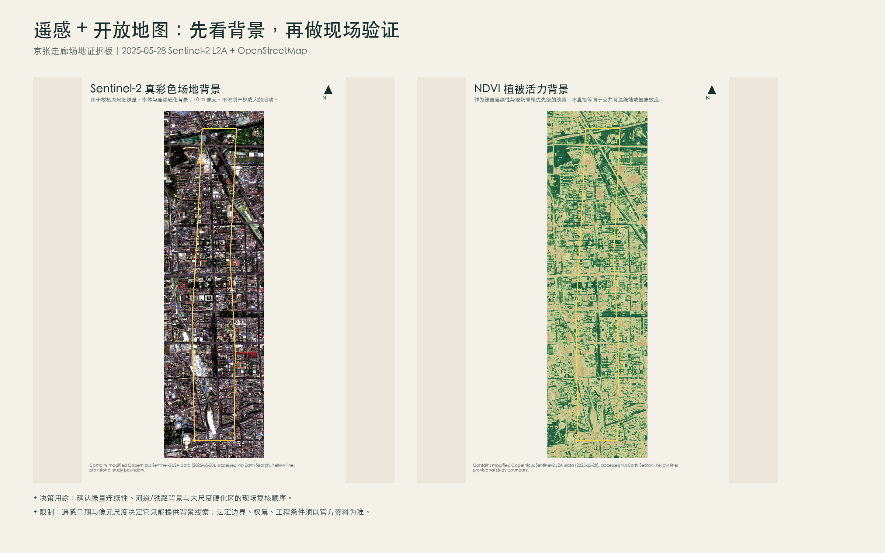
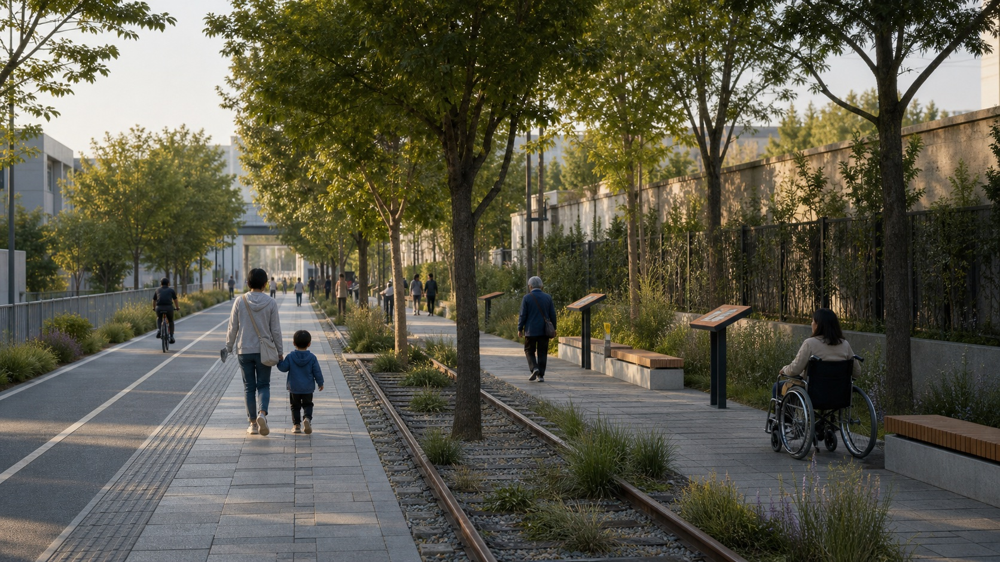
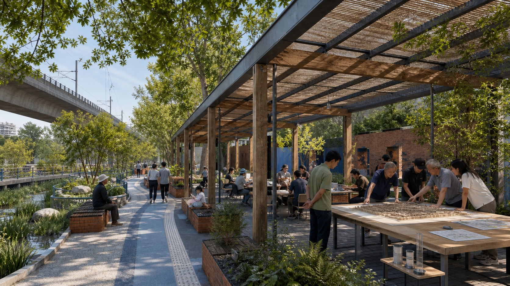
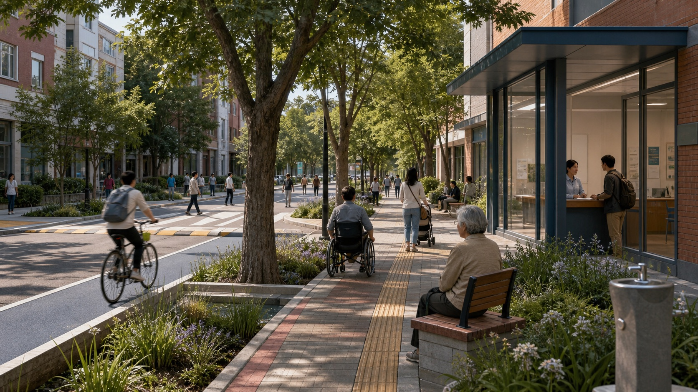
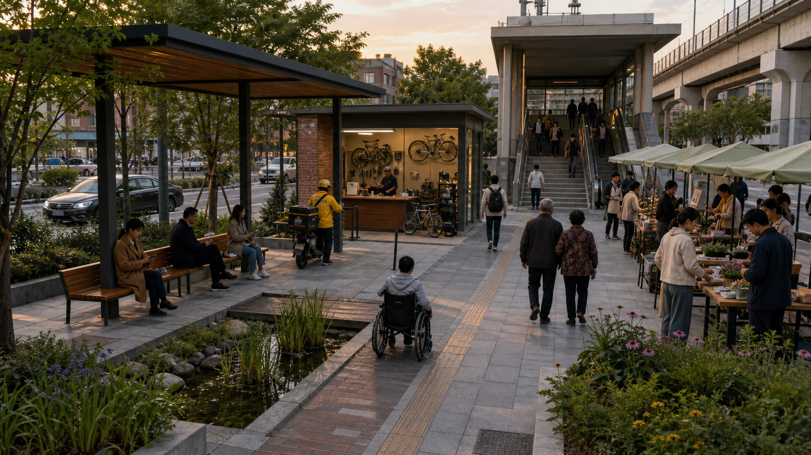
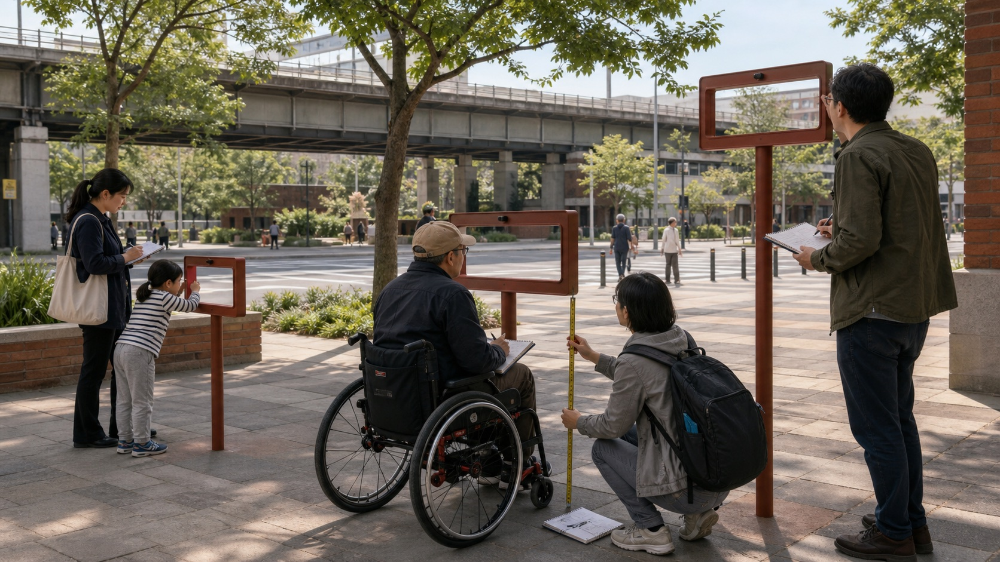
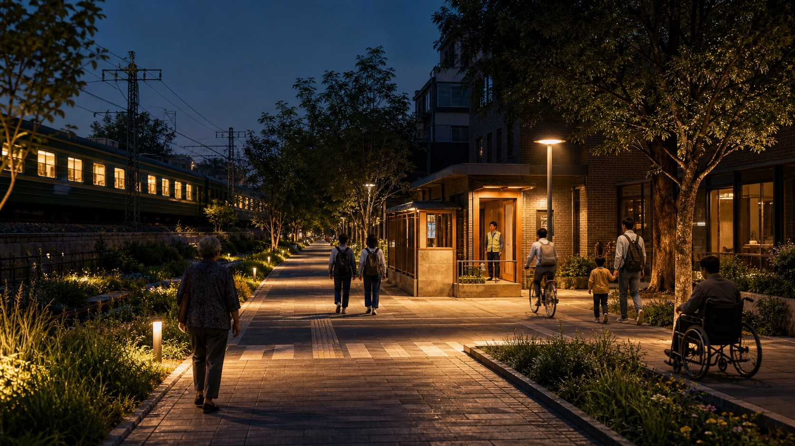
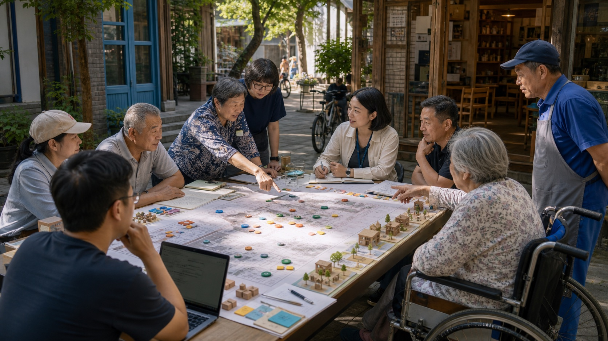
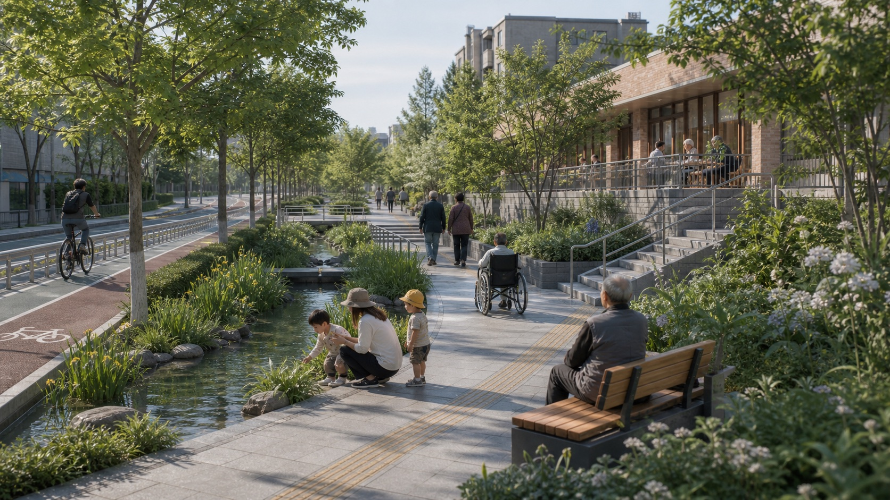

# 眼平京张 EYE-LEVEL JINGZHANG

## 执行摘要

**从日常环境出发，用证据比较选择。** 百年京张的第一种创新用工程把远方变近；AI 时代的下一种创新，应把抽象技术重新放回人的尺度。本方案以团队论文持续研究的“环境暴露—公共服务可达—行为响应—福祉结果”为主线，比较不同人群、时段和空间条件下的差异。AI 帮助整理证据、比较场景、提前暴露风险，但无权自动决定谁被服务、哪里建设或什么成为永久设施。

主结构不是另一条“智轨/智脉”，而是**京张日常观察线和三个分工明确的现场**：众智园负责城市模型与开放实验，AI 原点负责日常环境与公共服务，大钟寺负责成果应用与长期运营。最终成绩由儿童、坐姿/轮椅和成人不同视域中的绿蓝、遮阴、无障碍、日夜安全、服务、交往和维护来检验，而不是由巨屏、机器人或平台调用量来检验。[source:AGENT-TASKBOOK] [depth:overall_spatial_structure]

**作者**：Yao Yao, China University of Geosciences (Wuhan), Histoshibashi University. Github: whuyao

## 设计依据与资料清单

方案完整读取比赛 `urban-design-ai-submission` skill、正式提交指南、公开任务书、场地包、专业标准和评分规则，以官方公告文字范围与面积为第一依据，以仓库的 provisional polygons 作为临时生成/展示约束。[source:OFFICIAL-ANNOUNCEMENT] [source:AGENT-TASKBOOK] [source:SITE-PACKAGE] [standard:PROJECT-OFFICIAL-ANNOUNCEMENT]

本地授权 UrbanComp 论文库共 141 份 PDF、2,221 页；去除期刊封面和一个重复预印本后为 139 篇独立研究，全部逐篇形成方法、发现、局限、设计转译与可检验项。139 份有文本层，UC-127/132 两份扫描件另经视觉核读；137/139 有 DOI。官网当前可访问成果另经三页抓取、下载与重复核验，得到 7 篇新增全文和 1 条摘要级增量。官网部分旧分页返回服务器错误，因此只声明“本地授权库全覆盖 + 官网当前可访问增量”，不虚称穷尽不可访问服务器页面。[source:URBANCOMP-LOCAL] [source:URBANCOMP-WEBSITE]

公开 OSM 道路、建筑、轨道、水系、绿地/游憩和设施只作语境层，已注明 ODbL attribution；不能以映射数量直接认定现实设施缺口。[source:OSM-BASELINE] 所有生成图件由本项目原创绘制，不复制论文图、案例图、商标或人物肖像。

新增 Sentinel-2 L2A 遥感背景：从 Earth Search STAC 检索场地，选择 2025-05-28、瓦片云量约 0.004% 的场景，按 10 m 像元裁切红、绿、蓝和近红外波段，形成真彩色与 NDVI。它只用于校核大尺度绿量连续性、水体/铁路背景、连续硬化区和现场复核顺序；不用于产权、法定边界、微观空间质量、人的活动或健康效应判断。[source:SENTINEL2-L2A] [source:EARTH-SEARCH]

遥感和 OSM 共同改变了方案的先后顺序：先沿北部清河—基础设施交织区核查绿蓝连续与安全跨越，再在中南段高密街区核查树荫、座椅、过街和公共服务；所有细部动作仍需三种观察高度实走、专业调查和公众共同验证。这里的“遥感 + 开放地图”是复核线索，不是自动选址器。

### 边界状态与重大冲突

`geometry/site_boundary.geojson` 与三处 `key_areas` 均为 `provisional_constraint`、`official_boundary=false`；面积只可在 EPSG:4548 下作临时相对复算。[data:geometry/site_boundary.geojson#SITE-001] [metric:site_area_sqm]

任务书要求“大钟寺地铁站所在路口四象限的步行连通设计”，但 `PROV-KEY-003` 粗略矩形落在北京北站/西直门北侧语境，未覆盖该任务位置。此冲突已写入 `constraints.geojson`、assumptions 和 self-check：正式边界替换前只提交站城原则、场景和指标，不给地块、站口、桥隧或工程落位。[data:geometry/constraints.geojson#CONSTRAINT-KEY3] [source:KEY-AREA-SOURCE]

## 三层范围工作框架

三层范围共享同一条证据链但承担不同精度：43.6 km² 统筹层只研究产业、知识、公共价值和区域协同；11.4 km² 总体层提出可整体替换/复算的功能意向、日常观察线和分期；368.4 ha 重点层提出三个分工明确的现场和可迁移场景。任何下层图形都不能反向升级为上层官方范围或法定结论。[source:OFFICIAL-ANNOUNCEMENT] [source:BOUNDARY-SOURCE] [depth:three_level_scope_framework]

| 层级 | 已知官方文字/面积 | 本方案工作 | 精度边界 |
|---|---|---|---|
| 统筹研究范围 | 约 43.6 km² | 产业—知识—公共价值协同与两翼机制 | 无精确 official polygon，不做地块结论 |
| 总体设计范围 | 约 11.4 km² | 京张日常观察线、断点工具箱、功能意向与分期 | 临时 polygon 约 11.413 km²，仅讨论/复算 |
| 三重点区 | 192.1/104.3/72.0 ha | 城市模型与开放实验/日常环境与公共服务/成果应用与长期运营及 12 场景 | 三 polygon 均临时；大钟寺另有位置冲突 |

## 重点区域详细设计

### 众智园：城市模型与开放实验

临时范围约 192.9 ha；OSM 映射建筑基底约 11.3%，高速、五环、匝道与学清路等基础设施密集，同时叠加清河/小月河语境。策略是优先安全跨越、滨水连续、林下研究街和共享研究首层；不以填满低密空间或大拆建换形象。桥隧、蓝线、防洪、道路红线和权属均待专业核验。[data:geometry/key_areas.geojson#PROV-KEY-001]

### AI 原点：日常环境与公共服务

临时范围约 104.3 ha；OSM 映射建筑基底约 21.0%，学院路、北四环、成府路与高校界面交织。策略是用微绿荫、可坐边界、时段共享首层、安全夜路和老幼服务，把“物理上很近”变成“日常能相遇”；不预设打开校园/园区权属边界。[data:geometry/key_areas.geojson#PROV-KEY-002]

### 大钟寺：成果应用与长期运营

只采用任务书的功能要求：智能体/智能终端/内容消费等新业态、重点企业周边公共环境、规划绿地复合利用、大钟寺站与重点地块步行联系、四象限步行和非机动车组织。当前临时矩形位置冲突，所有设计以可迁移模块表达，待 official polygon 后再落位。[data:geometry/key_areas.geojson#PROV-KEY-003] [depth:three_key_area_detailed_design]

## 统筹研究范围产业与未来城市研究

统筹层不新增伪精确红线，而以“高校/研究—工具/标准—社区问题—企业/公共采用—国际公共知识”的价值链连接三区两翼。中关村科技服务翼输入知识产权、人才、资本、法律与国际网络；小月河场景赋能翼输入生态、医疗、教育、具身与文化等真实问题。任何资源支持均为机制建议，不写成政府资金、招商或企业承诺。[source:AGENT-TASKBOOK] [depth:three_level_scope_framework]

### 七个全球案例：转译机制，不复制口号

| 案例 | 采用 | 不照搬 |
|---|---|---|
| Punggol Digital District | 校园—产业—社区协同、数字孪生先测试 | 不建中央控制“万能 OS”，数据分权与最小化 |
| Smart Kalasatama | 真实街区敏捷试点、Urban Lab、多方合作 | 居民不是无条件测试对象，必须可退出 |
| Barcelona 22@ | 工业更新、知识转移和混合功能 | 防止办公单一化、排斥和原有服务消失 |
| Kendall Square | 大学—企业—社区步行和公共界面 | 不复制高租金总部化，保留小团队和日常服务 |
| Seoul AI Hub | 教育—孵化—算力—PoC—国际合作成长链 | 入驻数与算力不等于公共价值 |
| STATION F | 项目周期、伙伴计划、住房/支持接口 | 不造封闭超级园区，公共地面保持开放 |
| Toronto Quayside | 数字治理前置、公共审查、全龄低碳目标 | 不以企业 data trust 替代公共法权与民主问责 |

一手资料见 [source:PUNGGOL]、[source:KALASATAMA]、[source:BARCELONA22]、[source:KENDALL]、[source:SEOUL-AI-HUB]、[source:STATION-F]、[source:QUAYSIDE]。

## UrbanComp 证据如何改变设计

| 论文证据 | 它支持什么 | 它不能证明什么 | 本方案动作 |
|---|---|---|---|
| 海淀 1,190 名老人街景绿蓝与抑郁症状研究 [doi:10.1016/j.envint.2019.02.013] | 眼平绿蓝值得作为本地假设 | 横截面不能证明治疗/因果 | 三视高、老人实走、实际使用和自愿纵向复测 |
| 街景绿量/NDVI 与福祉多路径 [doi:10.1016/j.envres.2019.108535] | 绿化需与活动、压力、环境感知、凝聚一起评估 | 绿量面积可替代质量与使用 | 树荫、安静、座椅、社交与维护一体 |
| 可见绿地 4A 公平 [doi:10.1016/j.landusepol.2022.106410] | 供给、可达、吸引力、外观需并列 | 平均面积即可说明公平 | 扩展为 7A，按用户画像审计差距 |
| 小学生/老人主动出行非线性 [doi:10.1016/j.jtrangeo.2022.103303] [doi:10.1016/j.jth.2024.101834] | 阈值、组合和群体差异重要 | 越多越好或平均人模型 | 儿童/坐姿/成人三视高和分群体旅程 |
| PLUS/FLUS 多情景模拟 [doi:10.1016/j.compenvurbsys.2020.101569] [doi:10.1080/13658816.2018.1502441] | 比较可选未来、显式政策开关 | 预测唯一未来或把重要性当因果 | 基准/生态/公平/产业/应急情景 + 敏感性 + 可撤试点 |
| 多视角表征与不确定性 [doi:10.1080/15481603.2024.2387392] [doi:10.1016/j.jag.2024.103805] | 模态按任务选择，低置信度可见 | 数据越多越好 | 跨模态冲突进入现场核查队列 |
| LLM 城市感知综述 [doi:10.1016/j.xinn.2024.100749] | 带引文检索与解释界面 | 自动空间计算、审批、权利决定 | GIS/脚本确定性计算 + 人工责任 + 无引用降级 |
| 城市系统—交通双向因果 [doi:10.1038/s41467-026-71377-0] | 功能、需求和网络需组合干预 | 扩路是默认答案 | 15 分钟服务、错峰、慢行/公交和门到门评价 |

论文完整规范化清单、21 个逐篇阅读包和证据—设计矩阵作为研究附件保存在项目目录；公开提交只给合法引用，不分发用户授权的原始 PDF。[source:URBANCOMP-LOCAL]

## 总体设计范围城市更新与控规深度城市设计

总体范围以“眼平公共价值 + 城市科学闭环”组织适应性更新：先补 official boundary、控规和现状资料，再以可撤的座椅/遮阴/导视/服务流程验证假设，只有在多季节、多群体、风险、维护和法定程序均通过后才进入永久更新。功能意向、现场接口、审计路线、绿蓝/公共空间试验包络和分期图层全部可在官方边界替换后重算，不预判容积率、高度、拆改留、道路红线或工程可行性。[data:geometry/land_use.geojson#LU-001] [depth:land_use_layout]

空间结构不是在临时边界上画一张伪精确总图，而是建立可供专业团队继续工作的对象：`land_use` 保持拓扑完整却明确只是功能意向；`roads` 表达要被实走审计的连续体验和东西缝合，不是工程线位；`green_space`/`public_space` 表达临时试验包络；`constraints` 把边界、控规和大钟寺冲突空间化；`phasing` 用阶段门避免尚未验证的动作提前永久化。每个对象有来源、置信度、geometry role、指标与假设，可以在 official polygons 到位后一次性重算。[data:geometry/constraints.geojson#CONSTRAINT-KEY3] [metric:site_area_sqm]

控规深度在本提交中表现为“问题、对象、验证、前置和责任的完整”，而不是编造控制值。现状设施、首层、绿蓝、交通、热、雨、噪声、权属与结构仍需现场/专业调查；FAR、高度、密度、退线、拆改留、桥隧、站口和市政容量保持 unknown。内容可进行 intake 评价，法定/工程深化必须等待资料和程序。[metric:floor_area_ratio] [standard:MOHURD-CONTROL-DETAILED-PLANNING]

## 1. 价值主张

**从日常环境出发，用证据比较选择。**

京张创新带不是一条陈列 AI 产品的展廊，而是一座日常环境、公共服务与城市创新的证据型设计。AI 的角色是帮助城市看见差异、比较选择、预演风险、解释证据；它不能自动决定谁被服务、哪里建设或什么成为永久设施。最终结果由人在日常尺度上能否更方便地行走、停留、交往、获得服务和安全回家来判断。

## 2. 总体结构

### 京张日常观察线

沿京张遗址公园及东西向联系路径，连续记录历史、树荫、雨水、声音、座椅、首层、过街、慢行、服务与人群。它是体验和评估的共同语言，不是需要全段同形同材的景观轴。

### 三个分工明确的现场

- **众智园·城市模型与开放实验**：模型、数据、反事实、伦理与标准的共同工作台。
- **北京 AI 原点·日常环境与公共服务**：居民与创新者共同提出问题、验证日常服务。
- **大钟寺·成果应用与长期运营**：把通过验证的方案转为透明采购、运营和维护能力。

### 两翼协同

- **中关村科技服务翼**输入知识产权、资本、人才、算力、法律与国际网络，但不把支持写成确定承诺。
- **小月河场景赋能翼**提供生态、医疗、教育、具身与文化等真实问题，但任何测试先过公共利益、隐私和人工责任门。

### 七项公共承诺 7E

Eye-level 眼平可感、Everyday 日常可用、Equitable 公平可达、Ecological 生态舒适、Explainable 可解释、Experimental 可试可改、Enduring 可维护。

### 八个日常场景效果图

以下图片用于帮助公众理解空间气氛与设计意图，均为 AI 生成的**概念效果图**，不是现状照片、测绘证据、已批准方案或工程承诺。真实建筑、轨道、水系、树木、站口和权属条件须在官方资料与现场调查后重画。[source:IMAGEGEN-DISCLOSURE]

*概念效果图 01｜京张日常观察线。*

*概念效果图 02｜众智园：城市模型与开放实验。*

*概念效果图 03｜AI 原点：日常环境与公共服务。*

*概念效果图 04｜大钟寺：成果应用与长期运营；位置和形态待官方边界核验。*

*概念效果图 05｜三种观察高度；不用于个体识别。*

*概念效果图 06｜安心夜路。*

*概念效果图 07｜共同制图与公开比较。*

*概念效果图 08｜老幼绿蓝共融环；不承诺健康因果结果。*

## 3. 八类用户画像与不可平均的需求

| ID | 用户画像 | 一天中的关键旅程 | 常被平均值遗漏的需求 | 方案检验 |
|---|---|---|---|---|
| P01 | 独居/结伴老人 | 买菜—就医/服务—公园—回家 | 休息频率、眩光、听力、台阶、陌生数字界面 | 坐姿视高、休息间距、无障碍连续、人工服务、夜间安心 |
| P02 | 儿童与照护者 | 家—学校/托育—活动—家 | 儿童视域、过街等待、婴儿车、厕所、看护可见性 | 儿童视高、成组过街、遮阴、厕所/饮水、看护视线 |
| P03 | 轮椅/视听障碍者 | 换乘—办事—工作/活动 | 坡度、断头盲道、门槛、提示冗余、绕行 | 门到门任务完成、坡度/门槛、触听视三模态、人工协助 |
| P04 | 高校学生/研究者 | 校园—实验室—创业空间—夜归 | 低成本空间、跨校开放、夜间安全、成果转化 | 可负担工位、开放时段、跨机构协作、夜行路线 |
| P05 | 初创团队/独立开发者 | 原型—测试—合规—采购/市场 | 算力/数据门槛、测试责任、供应商锁定 | 共享工具、模型门诊、公开准入、PoC 退出、复现率 |
| P06 | 通勤与一线服务者 | 轨道/公交—岗位—用餐—接送 | 峰谷时间、休息、可负担餐饮、夜班安全 | 全链换乘、夜间服务、座椅/厕所、平价服务留存 |
| P07 | 社区工作者/设施运营者 | 受理—派单—现场—复盘 | AI 错误责任、跨部门协同、维护负担 | 人工接管、责任日志、维护工时、申诉与回退 |
| P08 | 国内外访客/短住人才 | 到达—访问—文化—服务—离开 | 多语、无账号访问、历史理解、清楚边界 | 多语人工/纸本替代、可理解导视、隐私告知、无注册服务 |

## 4. 十二张 AI+空间场景卡

所有卡均满足：不使用个人身份/面部/设备标识作公开空间评分；有非 AI 替代；关键输出人审；试点有期限、停止阈值和复原责任。

### S01｜三视高眼平体检 THREE-HEIGHT STREET SCAN

- **位置**：京张日常观察线的断点样段；先在三片区各选 1 段，精确落位待现场与权属核验。
- **用户/问题**：P01—P03；成人街景可能看不见儿童、坐姿与轮椅使用者的遮挡、绿量、标识和过街风险。
- **空间动作**：以约 0.9m、1.2m、1.6m 三视高完成绿蓝、遮阴、可见性、门槛和停留界面审计，形成可修复清单。
- **AI 角色**：端侧语义分割；先模糊人脸/车牌，只保留街段级汇总与置信度；人工抽样复核。
- **三项测试**：①与三类用户实走记录的一致性；②不同季节/天气/光照的漂移；③纸本审计能否复现相同优先级。
- **停止/回退**：出现未脱敏个人信息、低置信度却自动结论或群体间严重分歧即停止；回到人工实走与纸本清单。

### S02｜树荫与座椅微试 SHADE + SEAT MICRO-TRIAL

- **位置**：热暴露、候车、排队和长距离无休息段；优先原点社区和众智园。
- **用户/问题**：P01—P03、P06；绿地面积不等于可停留、可遮阴和舒适。
- **空间动作**：可移动树池/遮阴、不同高度和扶手座椅、饮水/雨水提示，先临时后永久。
- **AI 角色**：结合确定性日照/热舒适计算与匿名人工计数比较布置；模型只提出候选。
- **三项测试**：①热时段停留与任务完成是否改善；②是否挤占轮椅/消防/通行；③无算法、由现场人员调位能否保持效果。
- **停止/回退**：通行冲突、热风险恶化或维护无法承担即撤走/调位；材料可重复使用。

### S03｜安心夜路 CALM NIGHT WALK

- **位置**：轨道/公交至社区、校园和园区的夜间全链路线。
- **用户/问题**：P01、P03、P04、P06；安全感取决于照明、视线、维护、服务和社会活动，不等于摄像头数量。
- **空间动作**：均匀照明、清楚出口、可见求助点、活跃首层、修剪与维护、夜班停留点。
- **AI 角色**：只分析照度/故障/维修工单和自愿聚合问卷，帮助排维护优先级；不做人脸、行为异常或人员风险识别。
- **三项测试**：①不同性别/年龄/能力的夜间实走舒适；②照明眩光和暗区；③断网时人工巡检、电话和实体求助能否工作。
- **停止/回退**：若技术扩大监控或产生群体标签，立即取消该功能；保留环境与人工服务改造。

### S04｜无障碍全链证明 ACCESS JOURNEY PROOF

- **位置**：站口—过街—首层—厕所/服务台的完整旅程。
- **用户/问题**：P03；局部“合规点”不能保证门到门可完成。
- **空间动作**：以真实任务记录坡度、门槛、等待、绕行、触觉/声音/视觉提示和人工帮助。
- **AI 角色**：将自愿、脱敏的障碍记录整理为候选修复队列；导航建议发布前由无障碍用户与运营者共同核验。
- **三项测试**：①三种辅助方式任务完成率；②临时施工/天气变化后的路线有效性；③纸图、触觉图和人工引导可用性。
- **停止/回退**：任何未核路线不得标“无障碍”；错误路线下线，恢复人工引导和现场标识。

### S05｜老幼绿蓝共融环 GREEN-BLUE CARE LOOP

- **位置**：AI 原点社区为主，众智园滨水节点为辅。
- **用户/问题**：P01、P02；大尺度绿量可能看得见但进不去、坐不住或不安全。
- **空间动作**：短环/长环、可坐可聊自然节点、厕所饮水、低刺激区、儿童观察点和连续无障碍。
- **AI 角色**：三视高绿蓝、树荫和路线负担诊断；只提供群体级候选，不做个人健康建议。
- **三项测试**：①老人/照护者实走完成与停留；②绿视、安全、噪声、遮阴和社交是否同时成立；③不用手机能否完整使用。
- **停止/回退**：发现蓝绿安全/管理冲突或健康效果被夸大即修正文案和路线；不以调查结果诊断个人。

### S06｜时段共享首层 TIME-SHARED GROUND FLOOR

- **位置**：高校、园区、社区和大钟寺站城界面的可协商首层；不预设权属开放。
- **用户/问题**：P04—P08；空间可能在某时段闲置，而小团队、居民与夜班服务缺少可负担场所。
- **空间动作**：可移动隔断、共享门厅、项目桌、照护/服务前台、夜间学习与周末市场的时段组合。
- **AI 角色**：在授权容量与规则内提出排期备选、解释冲突；最终由场所运营者确认。
- **三项测试**：①跨群体时段覆盖与负担；②噪声、安全和维护冲突；③白板/电话排期作为断网替代。
- **停止/回退**：任何权属或安全条件不满足则不开放；冲突时缩短时段或恢复原功能。

### S07｜节庆与极端日管家 EVENT + EXTREME-DAY STEWARD

- **位置**：京张日常观察线、站口和公共活动节点。
- **用户/问题**：全体；平日平均不能代表论坛、展会、暴雨、热浪或轨道中断。
- **空间动作**：弹性排队、可撤临时服务、应急遮蔽、备用无障碍路径和分散活动点。
- **AI 角色**：用聚合/合成数据做反事实容量测试，给出不确定区间；人类指挥统一负责。
- **三项测试**：①五类情景的脆弱群体服务保持；②预测失效阈值与人工接管速度；③完全无预测时预案能否运行。
- **停止/回退**：模型漂移或异常时只按核定应急预案运行；不以预测自动限制个人通行。

### S08｜模型门诊 MODEL CLINIC

- **位置**：众智园·城市模型与开放实验，定期巡回到两片区。
- **用户/问题**：P05、P07 与公众代表；模型常在数据来源、漂移、偏差和可解释性上“带病上线”。
- **空间动作**：公开模型卡墙、冲突证据桌、红队室、公众问题席和修复版本记录。
- **AI 角色**：自动运行确定性单测、漂移/覆盖检查和引文核验；不能自我批准。
- **三项测试**：①独立复现与模型/人工分歧；②提示注入、隐私和少数群体压力测试；③停用模型后服务是否有人工流程。
- **停止/回退**：任一高风险门不通过即不得进入现场；回退至前一版本或非 AI 流程。

### S09｜城市反事实桌 URBAN COUNTERFACTUAL TABLE

- **位置**：三个分工明确的现场和年度证据大会。
- **用户/问题**：公众、规划师、运营者、企业；单一预测图会掩盖价值选择与不确定性。
- **空间动作**：实体可触摸桌 + 无障碍屏幕/纸图，同时比较基准、生态、公平、产业和应急情景。
- **AI 角色**：整理情景、解释差异；面积、网络、可达和规则由确定性 GIS/脚本计算。
- **三项测试**：①相同参数可复算；②随机种子/假设敏感性；③参与者能否分辨观测、假设和建议。
- **停止/回退**：无法复算或误导为政府预测即撤下；保留纸图、参数表和人工主持。

### S10｜公共服务前台 CIVIC SERVICE FRONT DESK

- **位置**：AI 原点·日常环境与公共服务，连接社区服务与大钟寺应用端。
- **用户/问题**：P01—P03、P06—P08；复杂服务信息、语言和数字门槛阻碍获得帮助。
- **空间动作**：实体服务台、安静咨询位、多语/大字/触觉信息、人工转接与纸本办理指引。
- **AI 角色**：仅基于核定知识库作带来源的问答、翻译和导航；不决定资格、处罚、医疗或资金。
- **三项测试**：①答案引文与过期率；②老人/残障/多语用户任务完成；③人工/电话/纸本等价服务。
- **停止/回退**：无可靠来源、知识过期或涉及权利决定时自动转人工；保留完整非数字通道。

### S11｜公开采用台 OPEN ADOPTION DESK

- **位置**：大钟寺·成果应用与长期运营；精确位置待 official boundary。
- **用户/问题**：P05、P07 与企业/公共采购方；PoC 常停在展示或被供应商锁定。
- **空间动作**：公开问题册、限定期测试位、中立接口、采购/退出/数据删除清单和公众演示时段。
- **AI 角色**：比较方案证据与互操作性，生成带来源的评审摘要；人类采购和主管部门负责。
- **三项测试**：①不同供应商可替换与数据可迁移；②公共价值/维护成本而非展示热度；③合同退出后服务连续和数据删除。
- **停止/回退**：采购、隐私、安全或责任不清即不进真实场景；PoC 期满拆除并恢复场地。

### S12｜百年时间剖面 CENTURY TIME SECTION

- **位置**：遗址公园的既有公共路径与三片区文化接口；文保核验后低扰动落位。
- **用户/问题**：P01—P08；铁路历史、中关村创新和 AI 新文化容易被压成科技装饰。
- **空间动作**：触觉年表、可坐档案窗、声音点、三视高观景框和“维护者荣誉”记录。
- **AI 角色**：带出处的多语讲解、口述史检索和可选择的 AR；不生成未核历史事实，不采集面部。
- **三项测试**：①史实引用命中与专家/社区复核；②盲、聋、儿童和外语访客可理解；③无设备时导视/触觉/人工讲解完整。
- **停止/回退**：史实争议、版权或文保条件未解决即下线相应内容；保留可修订的实体载体，不做不可逆刻写。

## 5. 三个产业测试验证场景

### T01｜隐私保护的眼平城市测量工具箱

- **组成**：S01、S03、S04、S05；端侧脱敏、三视高采样、人工抽检、街段聚合、模型卡。
- **测试链**：合成/公开样本 → 封闭样段 → 自愿实走 → 三片区限定试点。
- **通过条件**：敏感信息零进入公开包；分群体一致性和误差公开；非 AI 清单可复现优先级；跨季节漂移有降级。
- **产出**：供应商中立的数据规范、采样协议、可复算指标与停止清单，而非一个指定产品。

### T02｜城市反事实与压力测试基准

- **组成**：S02、S07、S09；热、雨、活动、轨道中断、弹性办公与公平优先情景。
- **测试链**：历史回测 → 种子/参数敏感性 → 合成干预 → 可撤回空间原型 → 偏差复盘。
- **通过条件**：观测/假设/建议分层；确定性空间计算通过单测；关键群体服务不被平均收益牺牲；有人工应急替代。
- **产出**：基准数据结构、情景卡、失效阈值和公开复盘，不发布唯一未来预测。

### T03｜公共服务智能体准入与采用证书

- **组成**：S08、S10、S11、S12；知识库、引用、权限、人工转接、互操作、退出和历史版权。
- **测试链**：离线红队 → 模拟用户 → 小样本自愿服务 → 限定期现场 → 公开续用/修正/退出决定。
- **通过条件**：100% 权利/健康/资金问题转人工；引用、时效、可访问性和多语测试合格；无账号/纸本等价；供应商可替换与删除证明。
- **产出**：一张可撤销、可复核的准入证及版本记录，不是政府认证或永久许可。

## 6. 四处公共观察与展示节点：纪念共同求证，而非崇拜设备

| 地标 | 概念 | 日常功能 | AI/非 AI 边界 |
|---|---|---|---|
| L01 三视高观测所 | 0.9/1.2/1.6m 三道开放视框 | 看树荫、过街、标识和城市变化；可坐可讨论 | 可叠加脱敏解释；无屏幕仍是休息/观景设施 |
| L02 城市反事实桌 | 一张能摆出多种未来的公共桌 | 规划讨论、课程、社区议事、年度复盘 | 计算可复算，人类决定；纸图与触觉模型等价 |
| L03 百年时间剖面 | 铁路—中关村—AI 的可修订时间档案 | 触觉、声音、多语、口述史与步行休息 | 只讲有出处的史实；AR 可选且不采脸 |
| L04 日常维护者荣誉墙 | 记录居民、园丁、保洁、工程师、开发者、数据维护者的共同贡献 | 年度更新、问题承诺与修复记录 | 不按个人行为评分；经同意展示，允许撤回/更正 |

## 7. AI 创新生态：从论文到现场，再从现场回到公共知识

### 六步转化链

1. **问题入库**：居民、运营者、企业、高校提出可验证的公共/产业问题。
2. **证据处方**：模型门诊确定数据、论文、偏差、法律/伦理和非 AI 基线。
3. **反事实筛选**：比较多种情景，排除伤害大、不可撤或不可维护的方案。
4. **限定 PoC**：在清权场地、小范围、短期限内实施，可随时人工接管。
5. **公开评估**：同时检查平均效益、群体差距、意外伤害、维护成本和公众体验。
6. **采用/修正/退出**：大钟寺成果应用与长期运营形成中立采用与退出记录，知识回流众智园与原点社区。

### 七类要素不混为一张招商表

| 要素 | 供给机制建议 | 公共边界 |
|---|---|---|
| 土地/空间 | 存量首层时段共享、可逆试点场、正式更新待法定程序 | 不预判权属、拆改留、容积率与高度 |
| 产业 | 基础研究—工具—场景—采用的开放接口 | 不承诺企业入驻、产值或补贴 |
| 资金 | 小试验分段拨付、公共价值里程碑、维护准备金建议 | 不写成政府资金安排 |
| 人才 | 高校课程、社区研究员、运营者和国际访问共同参与 | 不只按高学历/资本筛选 |
| 算力 | 分级共享、隐私安全区、能耗账本与退出 | 不以算力规模替代研究质量 |
| 数据 | 来源登记、目的限定、最小化、聚合阈值、删除与授权 | 不含非公开空间/个人/企业内部数据 |
| 场景 | 问题清单、公开准入、限定期测试和退出 | 不把试点写成获批运营 |

## 8. 公共空间组件库

1. 三视高观察框；2. 扶手/靠背/轮椅并坐的可移动座椅；3. 可移遮阴与树池；4. 雨水可见但防滑的边沟/花园；5. 触听视三模态导视；6. 无账号服务牌；7. 夜间均匀照明与可见人工求助；8. 可擦写问题/证据板；9. 可重复使用的试验边界构件；10. 维护二维码与电话并列；11. 小团队可预订但不专属的工作桌；12. 数据目的与删除时间告知牌。

所有组件先检查消防、通行、无障碍、文保、绿地/蓝线、维护和权属；未核验前只作参考方案。

## 9. 视觉识别与 Logo 方向

- **符号**：一条竖向“时间基准”与 0.9/1.2/1.6m 三道水平视线组成开放的 `E`；既是 EYE/EVIDENCE/EVERYDAY，也像一张未封闭的城市剖面。
- **文字**：中文主名“眼平京张”，英文 `EYE-LEVEL JINGZHANG`；副标 `URBAN SCIENCE AT HUMAN SCALE`。
- **色彩**：墨绿 `#143B34`（公共与树荫）、陶土 `#C56F4C`（铁路与时间）、水蓝 `#7AB8C8`（生态与开放证据）、纸白 `#F5F1E8`（可读与非屏幕体验）。
- **动效原则**：信息从“观测—比较—决定”三段展开；禁止模仿监控界面、脸框、雷达扫描和企业 Logo。
- **授权原则**：最终字体采用可再分发开源字体或系统字体不打包；图标、地图和图件均原创或按许可署名。

## 10. 百年京张文化叙事

第一代京张工程把远方变近；今天的城市科学把抽象 AI 带回人的尺度。文化系统由三份可修订记录构成：

- **过去的记录**：有出处的铁路工程、人物、地名与城市变迁；
- **当下的记录**：眼平观察、维护、使用与不同人群的日常叙事；
- **未来的记录**：多种反事实情景及公众选择，不把一个模型预测写成宿命。

导视区分三层：一带 Logo（共同身份）、文化标识（史实与地点）、场景标识（AI 目的/数据/责任/退出）；不得混成科技装饰。

国际传播文案：

> **A railway once brought distant places within reach. Eye-Level Jingzhang brings artificial intelligence back within human reach — observable, contestable, reversible, and judged by everyday public value.**

## 11. 年度运营：四季城市科学

| 节点 | 活动 | 产出 | 转化 |
|---|---|---|---|
| 春·基线周 | 三视高实走、设施/维护普查、问题征集 | 年度基线与缺口清单 | 问题进入模型门诊 |
| 夏·反事实挑战 | 高校/企业/社区比较热、雨、交通、服务情景 | 公开情景与失效阈值 | 筛选秋季可撤试点 |
| 秋·日常试城季 | 3—12 个月空间/服务原型集中开放 | 使用、差距、维护和风险证据 | 形成采用/修正/退出建议 |
| 冬·证据大会 | 公布结果、异议和下一年承诺 | 年度公共价值与退出报告 | 人类治理主体作下一轮决定 |

月度共同行走、季度模型门诊、半年供应商互操作演练和年度国际方法论坛构成长周期；传播只报告可核证事实，不把设想写成既定活动。

## 12. 分期与“转永久”门

| 阶段 | 时间建议 | 允许动作 | 转入下一阶段的门 |
|---|---|---|---|
| 0 资料与共治 | 0—3 个月 | official boundary、现状/权属/专业资料、数据与伦理、现场实走 | 边界版本、法定/专业清单、责任人与退出预算齐备 |
| 1 可撤试点 | 3—12 个月 | 标识、座椅、遮阴、服务流程、纸本/数字界面、限定活动 | 至少一轮多季节/多群体评价；无重大伤害；维护可承担 |
| 2 适应性更新 | 1—3 年 | 经审批的首层、慢行、蓝绿与存量建筑更新 | 专业设计、法定程序、资金/运营、全寿命评估通过 |
| 3 网络扩展 | 3—5 年滚动 | 将验证机制扩展到两翼/区域合作 | 新地点重新基线与审查，不机械复制 |

## 13. 指标：先分“现在能算”和“实施后才能知道”

### 提交包可验证

- 3 个重点区角色、12 张场景卡、3 个产业测试、8 类画像、4 个地标；
- 100% 场景卡具有人审、非 AI 替代、期限、停止/回退和数据边界；
- 100% 图层标示来源、置信度、geometry role 与 provisional/official 状态；
- 所有空间几何在临时总体范围内，官方边界到位后整体复算。

### 实施前基线后再设阈值

- 三视高绿蓝、遮阴、照明、座椅、厕所/饮水和无障碍连续；
- 分画像门到门任务完成、15 分钟服务可达、日夜安全舒适、平日/周末使用；
- 首层开放时段、可负担空间、跨机构协作、PoC 采用/退出与维护成本；
- 引文命中、空间/数值单测、模型/人工分歧、漂移、提示注入与人工接管。

不在缺少现场基线时编造提升百分比；永久阈值由专业团队、公共主体与相关群体共同确定。

## 14. 主要风险与主动边界

1. **边界错位**：大钟寺临时矩形与任务书站点要求冲突；正式边界前不做地块详设。
2. **AI 奇观化**：巨屏/机器人数量不计成功；空间无设备也必须成立。
3. **监控与画像**：禁止面部、身份、设备、小样本轨迹与个人/群体风险评分。
4. **健康因果夸大**：论文只生成可检验假设；不做个人诊断或“治愈”宣称。
5. **模型冒充规划**：相关、分类和情景不等于因果、审批或唯一未来。
6. **供应商锁定**：接口、数据迁移、人工替代与合同退出在 PoC 前审查。
7. **创新驱逐日常**：以可负担、小团队、原有服务、分群体可达和共同使用作反指标。
8. **维护空心化**：每项建设注明运营、维护、全寿命成本和撤除责任。

## AI 创新生态、人才画像与 AI+ 场景

八类画像、十二场景、三个产业测试和四个公共节点的完整说明见正文第 3—7 节。结构化包核验为 [metric:persona_count]、[metric:scenario_node_count]、[metric:industry_test_scenario_count]、[metric:ai_landmark_count]；十二场景均达到 [metric:human_review_coverage_ratio]、[metric:non_ai_alternative_ratio] 与 [metric:rollback_coverage_ratio] = 1.0。城市智能体只作带来源的检索、解释和候选比较；空间/数值由确定性脚本复算，最终判断由有权限的人类负责。[source:URBANCOMP-LOCAL]

## 用地、建筑规模与拆改留方案

`land_use.geojson` 是完整拓扑的**功能意向分区**，不是现状用地调查、控规或用地变更；`buildings.geojson` 只有三个分工明确的现场的符号性接口包络，不是现状建筑、拆改留或建设基底；`roads.geojson` 是体验/审计路线，不是道路红线、桥隧或信号工程。[data:geometry/land_use.geojson#LU-001] [data:geometry/buildings.geojson#BLDG-001] [data:geometry/roads.geojson#ROAD-001]

容积率、建筑高度、建筑密度、退线、拆改留、道路红线、站口、市政容量、地下空间、防洪、消防、文保、绿/蓝线、权属与投资均列为 unknown/data gap。正式阶段 0 必须先取得 official polygons、控规与专业资料，由相应专业团队完成现状评估、法定程序和工程论证。[metric:floor_area_ratio] [depth:development_intensity_controls] [depth:municipal_new_infrastructure]

当前符号性建筑接口总包络仅用于图示，其面积见 [metric:building_footprint_area_sqm]，不得解释为建筑密度或建设规模。[depth:height_massing_character] [depth:retain_renovate_demolish] [standard:MOHURD-ARCH-DESIGN-DEPTH-2016]

## 交通、轨道、市政与公共服务设施

“京张日常观察线 + 三条东西缝合审计走廊”只用于识别门到门体验、过街、无障碍、遮阴、换乘和夜间断点，长度见 [metric:road_network_length_m]；不替代道路红线、信号、桥隧、停车和站口设计。市政/端侧算力采用分级、低能耗、可断网、可人工接管原则，能源、排水、防洪、消防、地下空间和管线容量在专业资料齐备前保持 unknown。[depth:traffic_rail_slow_parking] [depth:municipal_new_infrastructure]

公共服务设施通过实体前台、人工转接、无账号/纸本通道和共享首层表达；AI 不能决定资格、医疗、资金、处罚或采购。[source:AGENT-TASKBOOK]

## 蓝绿空间、公共空间与城市风貌

`green_ratio` 和 `public_space_ratio` 只表示概念试验包络，分别见 [metric:green_ratio]、[metric:public_space_ratio]，绝非现状或法定比例。蓝绿空间采用 7A 评价和三视高；公共空间无设备也必须成立；铁路、中关村与 AI 的文化表达以可修订时间档案、触觉/声音/多语和日常维护者荣誉为主，不复制企业 Logo 或制造监控美学。[depth:blue_green_public_space] [standard:MOHURD-URBAN-DESIGN-MEASURES]

空间动作把绿视、树荫、雨水、噪声、照明、座椅、厕所/饮水、无障碍、社交与维护作为一个系统。众智园以滨水生态和基础设施冲突为前提，原点社区以小尺度可见自然和老幼共融为重点，大钟寺只给可迁移的站城舒适接口。安全策略优先处理照明均匀、视线、活跃首层、维修响应和可见人工帮助，不以扩大摄像或行为识别为默认手段。

风貌不要求三段同形同材，而以墨绿、陶土、水蓝、纸白的共同信息语言、三视高观察框和“过去—当下—可选未来”时间剖面保持识别。任何实体落位先核文保、绿/蓝线、消防、权属、通行和维护；无条件时使用可移构件、纸本/触觉/声音载体，失败可撤并恢复原场地。[source:URBANCOMP-LOCAL] [depth:height_massing_character]

## 更新项目清单、实施政策与分期计划

阶段 0 先取得 official polygons、现状/控规/权属/专业条件并完成数据治理；阶段 1 在众智园和原点社区开展 3—12 个月可撤试点，大钟寺只做边界核验和模块深化；阶段 2 经多季节/多群体评价与法定审批后适应性更新；阶段 3 在两翼或区域合作中重新基线后扩展。项目不承诺资金、主体或政府时序。[data:geometry/phasing.geojson#PHASE-000] [depth:renewal_project_list] [depth:phasing_implementation]

近期项目包包括三视高实走、树荫座椅微试、安心夜路、无障碍全链和模型门诊；它们主要使用可移设施、服务流程和公开评估，能够低成本撤回。中期项目包包括经授权的共享首层、绿蓝连续性、公共服务前台和公开采用台；进入这一阶段需要权属同意、专业设计、运营/维护主体、全寿命成本和退出预算。长期只扩展已经证明有效、没有扩大群体差距且可由当地维护的组件；复制到两翼或其他城区必须重新做基线，不能把京张结果机械外推。

实施政策建议以问题清单、公开准入、分段拨付、公共价值里程碑、中立接口、数据删除和年度证据大会组成。每个项目同时列建设者、运营者、维护者、受益/可能受损者与撤除责任人；模型或企业不能自行把 PoC 转为永久服务。四季运营把春季基线、夏季反事实、秋季试点和冬季公开决策串为滚动周期。[source:KALASATAMA] [metric:rollback_coverage_ratio]

## 指标体系、面积复算与合规矩阵

临时总体面积和三重点区临时几何面积见 [metric:site_area_sqm]、[metric:key_area_provisional_geometry_area_sqm]，重点区数见 [metric:key_area_count]。已知指标只描述提交几何或内容完整性；现状绿地、FAR、高度等没有官方/专业资料者保持 unknown。大钟寺位置冲突数为 [metric:boundary_location_conflict_count]。所有派生量在 EPSG:4548 复算，official polygons 到位后整体重跑。[depth:metrics_recalculation]

## 风险、版权与合规说明

主要风险是临时边界、尤其大钟寺位置冲突；AI 奇观化与监控；健康因果夸大；模型冒充规划；供应商锁定；创新驱逐日常；维护空心化。对应动作是事实/建议分层、无个人/群体风险评分、确定性 GIS + 人审、非 AI 等价通道、PoC 限期/退出、分群体公平与全寿命责任。[metric:boundary_location_conflict_count] [depth:risk_missing_data]

版权、许可和生成方式见 `sources.json`、`agent.json` 与 `report/copyright_statement.md`。OSM 图件署名 © OpenStreetMap contributors；论文只作 DOI 引用；图件原创；HTML 无远程依赖。

## 评分维度自证

| 评分维度 | 可核证响应 |
|---|---|
| 目标/功能相关性 | 三片区角色分别对应全栈创新、近校生态和智能原生采用；两翼输入要素和真实问题 |
| 原创性 | 104 份既有投稿中“验证”40、“开放”28，而“眼平/绿视率/福祉/城市科学”均为 0；形成结果尺度而非另一个轨线名称 |
| AI/规划创新 | 多模态诊断—反事实—可撤试点—分群评价—保留/修正/退出闭环 |
| 可实施性 | 阶段 0—3、12 张场景的三项测试、停止阈值、非 AI 替代和维护责任 |
| 公共利益/包容 | 8 类画像、三视高、7A、公平差距、无账号/纸本/人工通道 |
| 风险/合规 | 无个人/群体评分；数据最小化；人审；边界冲突与 unknown 条件显式公开 |
| 完整性 | 9 GeoJSON、5 PNG、A3、A0、HTML、指标、来源、假设、自检、标准/深度矩阵 |

## 机器可读证据索引

- 边界/重点区：[data:geometry/site_boundary.geojson#SITE-001]、[data:geometry/key_areas.geojson#PROV-KEY-001]
- 功能/接口/路线：[data:geometry/land_use.geojson#LU-001]、[data:geometry/buildings.geojson#BLDG-001]、[data:geometry/roads.geojson#ROAD-001]
- 蓝绿/场景/约束/分期：[data:geometry/green_space.geojson#GREEN-001]、[data:geometry/public_space.geojson#S01]、[data:geometry/constraints.geojson#CONSTRAINT-KEY3]、[data:geometry/phasing.geojson#PHASE-000]
- 指标：[metric:site_area_sqm]、[metric:key_area_count]、[metric:scenario_node_count]、[metric:human_review_coverage_ratio]、[metric:non_ai_alternative_ratio]
- 专业边界：[standard:MOHURD-URBAN-DESIGN-MEASURES]、[standard:MOHURD-CONTROL-DETAILED-PLANNING]、[standard:MNR-LAND-USE-CLASSIFICATION-GUIDE]、[depth:risk_missing_data]

## 参考资料

### 项目与公开数据

1. 北京市规划和自然资源委员会海淀分局，《百年京张AI创新带城市设计国际方案征集资格预审公告》，2026。
2. open-city-ai/haidian，公开任务书、site package、formal submission guide 与 schemas，2026。
3. OpenStreetMap contributors，ODbL 1.0；Overpass 获取于 2026-08-08。
4. Copernicus Data Space Ecosystem，Sentinel-2 Level-2A Surface Reflectance 产品说明；场景 S2B_50TMK_20250528_0_L2A。
5. Element 84 Earth Search STAC API，Sentinel-2 L2A 场景检索与公开 COG 访问，获取于 2026-08-08。

机器可读依据索引：[source:BOUNDARY-SOURCE] [source:KEY-AREA-SOURCE] [source:SOURCE-REGISTRY] [source:PROCESSED-FACT-PACK] [source:SENTINEL2-L2A] [source:EARTH-SEARCH] [standard:PROJECT-AGENT-OPEN-CALL-TASKBOOK] [depth:existing_conditions_diagnosis] [depth:metrics_recalculation] [metric:site_area_sqm]

### UrbanComp 关键论文

1. Helbich et al. (2019). *Using deep learning to examine street view green and blue spaces and their associations with geriatric depression in Beijing, China*. https://doi.org/10.1016/j.envint.2019.02.013
2. Wang et al. (2019). *Urban greenery and mental wellbeing in adults*. https://doi.org/10.1016/j.envres.2019.108535
3. Yao et al. (2022). Visible street greenery and 4A equity. https://doi.org/10.1016/j.landusepol.2022.106410
4. Yao et al. (2022). Beijing schoolchildren, street-view environment and walking. https://doi.org/10.1016/j.jtrangeo.2022.103303
5. Yao et al. (2024). Older adults' active travel, needs and nonlinear thresholds. https://doi.org/10.1016/j.jth.2024.101834
6. Liang et al. (2021). PLUS multi-scenario land-use simulation. https://doi.org/10.1016/j.compenvurbsys.2020.101569
7. Liang et al. (2018). Explicit policy planning in FLUS. https://doi.org/10.1080/13658816.2018.1502441
8. Zhang et al. (2024). Multi-view urban region representation. https://doi.org/10.1080/15481603.2024.2387392
9. Zhang et al. (2024). Multimodal land-use mapping with uncertainty. https://doi.org/10.1016/j.jag.2024.103805
10. Hou et al. (2025). *Urban sensing in the era of large language models*. https://doi.org/10.1016/j.xinn.2024.100749
11. UrbanComp (2026). Bidirectional yet asymmetric causality between urban systems and traffic dynamics. https://doi.org/10.1038/s41467-026-71377-0

### 全球案例一手来源

见 `sources.json` 的 PUNGGOL、KALASATAMA、BARCELONA22、KENDALL、SEOUL-AI-HUB、STATION-F 和 QUAYSIDE 条目。案例数字只描述原项目，不构成京张投资、就业或绩效承诺。

## 法律与责任声明

所有空间落地建议均为**概念建议、参考方案或可供专业团队深化研究**，不替代正式规划，不构成政府审定、审批、投资、招商或实施承诺。当前 provisional geometry 不能用于 official redline、精确面积、权属、法定管控或工程可行性。AI 生成过程、论文引用、原创图件和第三方数据许可见 `agent.json`、`sources.json` 与 `report/copyright_statement.md`。
