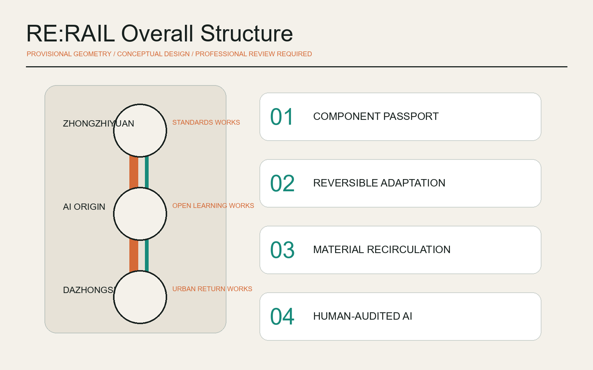
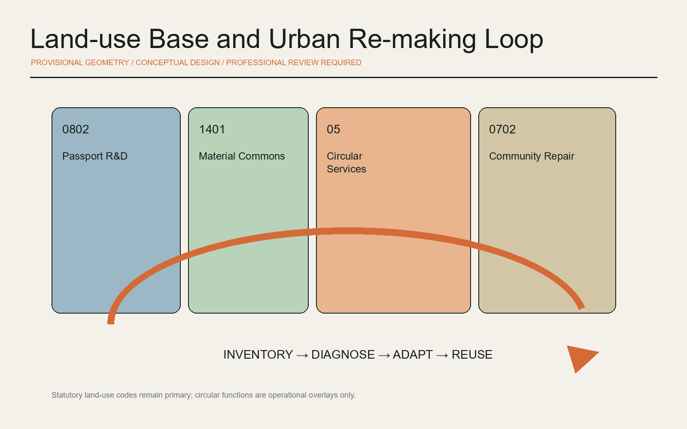
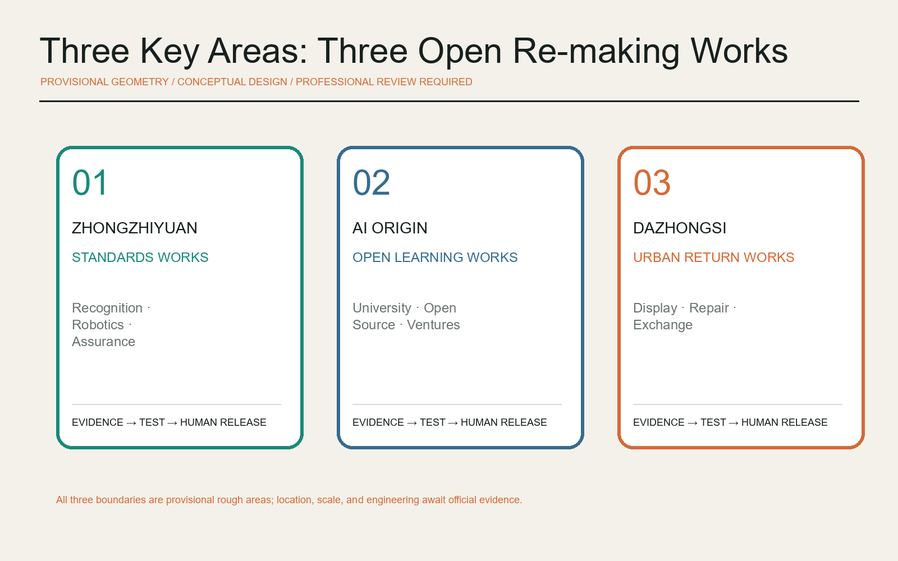
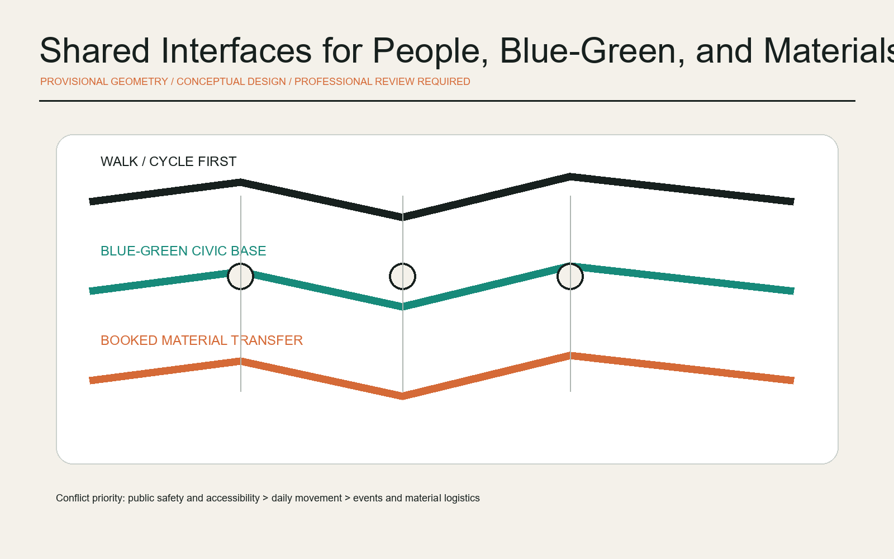
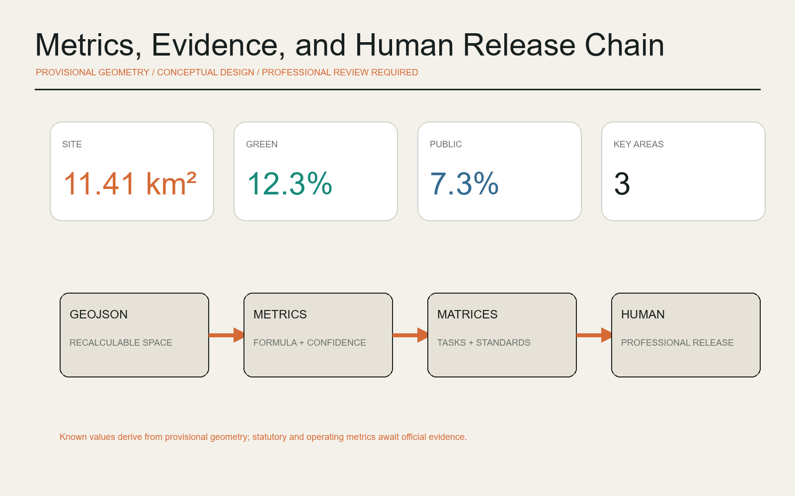

# RE:RAIL - AI Circular Construction and Urban Renewal Commons

## Design Basis and Source List

This proposal is grounded in the official prequalification announcement, the cleared Agent taskbook, the national urban-design measures, the control-plan procedure, and the national land-use classification guide. The announcement establishes the three working scales, three key areas, and the required urban-renewal agenda. The repository polygons are explicitly rough temporary geometry for generation and review; they are not official redlines and cannot support parcel ownership, precise area, engineering, or approval claims. [source:OFFICIAL-ANNOUNCEMENT] [standard:PROJECT-OFFICIAL-ANNOUNCEMENT] [depth:existing_conditions_diagnosis]

The design proposition is RE:RAIL. “Re-making” does not mean wholesale demolition. It makes maintenance, adaptation, component replacement, and public-space repair into traceable urban knowledge. AI reads public or cleared records, generates alternatives, flags uncertainty, and prepares human review. Licensed professionals, right holders, public authorities, operators, and residents retain final judgment. Sources are separated into formal task evidence, external precedents for method only, and provisional geometry for intake visualization. [source:SOURCE-REGISTRY] [source:DATA-SRC-PROVISIONAL-BOUNDARIES-20260605]

The nine GeoJSON layers, metrics, three matrices, five paired figures, offline bilingual pages, and bilingual PDFs are derived from the same geometry and narrative. When official boundaries, building surveys, road sections, heritage controls, utilities, and ownership data arrive, the complete chain must be recalculated. [data:geometry/site_boundary.geojson#SITE-001] [metric:site_area_sqm]

## Three-Level Scope Framework

At the coordinated-research scale, the proposal links research, testing, translation, use, maintenance, and reuse into one regional innovation chain. At the overall-design scale, the Jing-Zhang Heritage Park becomes a shared spine for material knowledge and civic life. At the detailed scale, the three key areas test standards, near-campus translation, and urban recirculation. A common component-passport, responsibility log, and public interface connects all scales. [standard:MOHURD-URBAN-DESIGN-MEASURES] [depth:three_level_scope_framework]

The spatial concept is “one line, three works, two wings, twelve interfaces.” The line is the RE:RAIL public spine. The three “works” are not factories: Zhongzhiyuan is a Standards Works, the AI Origin Community is an Open Learning Works, and Dazhongsi is an Urban Return Works. The Zhongguancun wing supplies research, IP, finance, and professional services; the Xiaoyue River wing supports trials, repair learning, and public feedback. Exact placement remains subject to official files and fieldwork. [data:geometry/key_areas.geojson#PROV-KEY-001] [depth:overall_spatial_structure]

Success is framed as safe life extension, traceable components, closed public repair cases, and human-review coverage rather than construction volume. These are monitoring categories, not achieved targets. Spatial values remain provisional recalculations with an explicit precision warning.

## Coordinated Research Area: Industry and Future City Research

RE:RAIL treats the AI ecosystem as an urban-renewal operating system. Standards create a common language; building and component passports preserve asset memory; city models compare alternatives; test spaces validate them; repair networks create public value; and professional responsibility gates release decisions. Zhongzhiyuan hosts recognition, robotics, component testing, and AI assurance. The AI Origin Community connects university research, open source, and young ventures. Dazhongsi connects exhibition, service, exchange, and recirculation. [source:AGENT-TASKBOOK] [standard:PROJECT-AGENT-OPEN-CALL-TASKBOOK]

Seven global precedents inform mechanisms, not local controls: STATION F demonstrates dense startup services; Mila connects research, industry, and entrepreneurship; Singapore AI Verify demonstrates open assurance; Amsterdam uses procurement and public space to support circularity; EU Level(s) provides a lifecycle language; Madaster demonstrates material passports; and EC3 demonstrates open environmental product data. Every precedent is recorded with a URL and usage limitation in sources.json. [source:CASE-STATION-F] [source:CASE-MILA] [source:CASE-AI-VERIFY]

The transfer to Haidian is an open service stack: research-to-venture support, auditable testing, material passports, pre-renovation audits, reusable procurement clauses, and civic repair feedback. It does not assume named companies, investment amounts, public funding, or confirmed programs. Each trial requires entry criteria, pause criteria, a named human responsibility role, and an archive of outcomes and failures.

The regional network can collaborate through shared schemas, annual challenges, professional residencies, and reproducible data packages. International exchange is valuable only when local evidence, Chinese planning procedures, public safety, and community access remain the controlling conditions.

## Overall Design Area: Urban Renewal and Regulatory-Plan-Level Urban Design

The renewal sequence is inventory first, diagnosis second, adaptation third, and replacement only after adequate evidence. AI may identify maintenance clues and produce retain, repair, adapt, or reversible-addition options, but it cannot decide a building's retain-renovate-demolish status from provisional geometry. Every suggestion must carry provenance, confidence, a field-check requirement, structural and fire review, right-holder consultation, and public-impact review. [standard:MOHURD-CONTROL-DETAILED-PLANNING] [depth:retain_renovate_demolish]

National land-use codes remain the primary classification. Operational overlays add circular functions without pretending to be statutory categories: research land supports component and robotics tests; park land hosts material learning; service land supports repair and exchange; community-service land supports residents, shared tools, and talent services. The four conceptual zones cover the submitted boundary topologically but are not approved land uses. [data:geometry/land_use.geojson#LU-001] [standard:MNR-LAND-USE-CLASSIFICATION-GUIDE]

Floor-area ratio, height, density, setbacks, and total floor area remain pending official controls and surveys. The proposal favors reversible connections, maintainable envelopes, accessible service zones, and incremental prototypes. Any load, fire, heritage, underground, or utility implication pauses the concept and transfers it to licensed professional review. [metric:floor_area_ratio] [depth:development_intensity_controls] [depth:height_massing_character]

The project list is therefore a set of verifiable work packages rather than fixed construction commitments: evidence inventory, repair stations, low-impact ground-floor adaptation, a component library, accessibility audits, route repairs, event-material recovery, and annual public review.

## Detailed Design of Key Areas

Zhongzhiyuan Standards Works combines a component-scanning and robotics test court, reversible joint mock-ups, an AI assurance room, and a Qinghe material garden. Tests begin in controlled or booked settings and require structural, fire, safety, and accessibility release before any public deployment. Failed tests enter a learning register. Exact locations remain pending official geometry and site evidence. [data:geometry/key_areas.geojson#PROV-KEY-001] [depth:three_key_area_detailed_design]

The AI Origin Open Learning Works links university research, open-source communities, young residents, and neighborhood repair. Its prototypes are an adaptation clinic, passport editing desk, student-craftsperson workshop, night study room, and small release space. No campus or privately controlled property is presumed available; initial work uses public interfaces and voluntarily cleared samples. [data:geometry/key_areas.geojson#PROV-KEY-002] [source:CASE-MILA]

Dazhongsi Urban Return Works overlays pedestrian continuity, commercial services, component display, repair booking, and citywide reuse matching. A component library, reversible exhibition system, design week, and public appeal desk make circularity visible as a civic service. Station integration, road works, and underground construction remain subject to official data and specialist studies. [data:geometry/key_areas.geojson#PROV-KEY-003] [metric:key_area_count]

All three areas use the same release logic: evidence before action, reversible before permanent, small trial before expansion. The designs are conceptual references for professional development and do not establish parcel construction, demolition, tenanting, investment, or approval decisions.

## AI Innovation Ecosystem, Personas, and AI+ Scenarios

Five primary personas are AI founders needing affordable tests, professionals responsible for safety and compliance, craftspeople and maintainers with field knowledge, residents using public space, and university researchers translating work into practice. Right-holder/operator coordinators and international visitors are supporting personas. Personas express role needs and never require personal trajectories, faces, or confidential business data. [source:AGENT-TASKBOOK] [depth:municipal_new_infrastructure]

The twelve scenario cards are: building-diagnosis assistant, component-passport desk, reversible-joint generator, robotic disassembly sandbox, low-carbon procurement comparison, repair-request translator, co-created accessibility audit, material library, shared-tool station, event-component return, Jing-Zhang construction-history guide, and public renewal retrospective. The first four are industry test scenarios. Every card uses cleared data, isolated testing, human release, and a withdrawal mechanism. [data:geometry/buildings.geojson#BLDG-001] [data:geometry/constraints.geojson#CONSTRAINTS]

Each card has eight fields: problem, space, inputs, model role, accountable human, output, pause conditions, and archive. Building diagnosis creates inspection prompts rather than structural conclusions. Procurement comparison shows sources and uncertainty without choosing vendors. The repair translator allows correction and appeal. Robotics tests require speed limits, geofencing, and a physical emergency stop. [source:CASE-AI-VERIFY] [source:CASE-EC3]

Operations follow quarterly open tests, six-month professional retrospectives, and an annual RE:RAIL Assembly. Data is minimized and de-identified before methods, failure cases, and improvement logs are published. Value is assessed through closed cases, review coverage, reproducibility, and public benefit, not the number of devices installed.

## Land Use, Building Scale, and Retain-Renovate-Demolish Strategy

Land use retains codes 0802, 1401, 05, and 0702. Circular functions are secondary operational labels so that a design narrative cannot be mistaken for statutory land classification. The provisional partition covers the submitted boundary without overlap, supporting topology checks and comparative diagrams while awaiting official parcels and controls. [data:geometry/land_use.geojson#LU-002] [depth:land_use_layout]

The building method uses five gates: R0 record and maintain, R1 repair, R2 adapt function, R3 reversible addition, and R4 consider replacement only through sufficient evidence and statutory procedure. Because the current building layer is conceptual, every object remains pending survey and ownership confirmation; no specific building is assigned a final action. [data:geometry/buildings.geojson#BLDG-001] [depth:retain_renovate_demolish]

A component passport can record provenance, age, material, connection, inspection, repair history, disassembly conditions, reuse limits, accountable parties, and data rights. AI may extract fields from cleared BIM, inventories, and reports and highlight omissions. Structural, fire, hazardous-material, and performance statements require licensed sign-off. Madaster and Level(s) provide method precedents, not mandated platforms. [source:CASE-MADASTER] [source:CASE-EU-LEVELS]

The footprint metric is a conceptual recalculation from submitted geometry, not an existing-building inventory or approved development quantum. Total floor area and floor-area ratio remain unknown until formal controls and surveys arrive. [metric:building_footprint_area_sqm] [metric:floor_area_ratio]

## Transport, Rail, Municipal Infrastructure, and Public Services

The mobility concept separates three flows while sharing visible interfaces. Walking and cycling take priority; low-speed material transfer uses booked times and limited nodes; professional vehicles remain governed by existing rules and future specialist plans. The heritage spine links the key areas, while east-west interfaces serve communities, universities, and parks. Station and intersection proposals are accessibility-review frameworks, not road-redline, tunnel, bridge, or station engineering. [data:geometry/roads.geojson#ROAD-001] [depth:traffic_rail_slow_parking]

Municipal and digital infrastructure combines small edge-computing stations, public status boards, and staffed service desks. Edge models process only authorized equipment and environmental inputs. Power, network, or model failure returns the service to a documented human mode. Energy, communications, fire, drainage, and installation loads require separate technical evidence. [depth:municipal_new_infrastructure] [data:geometry/constraints.geojson#CONSTRAINTS]

Public services combine repair, lending, learning, legal navigation, and accessibility advice at one entry point. AI supports information navigation and form completion only. Older people, children, disabled users, and non-Chinese speakers retain offline, staffed, and multimodal alternatives. Public safety and barrier-free movement override material logistics or event convenience.

## Blue-Green Network, Public Space, and Urban Character

The heritage park and the Qinghe and Xiaoyue River contexts form a low-impact civic base. Continuous shade, rain gardens, maintainable paving, and demountable exhibitions can support innovation without turning green space into a technology showroom. Any river, tree, drainage, or heritage action waits for official control lines and specialist review. Ratios are derived from provisional geometry and used only to compare the concept. [data:geometry/green_space.geojson#GREEN-001] [metric:green_ratio] [depth:blue_green_public_space]

The public-space kit includes a passport marker, component shelf, repair table, reversible stage, staffed-service beacon, and issue-receipt wall. Three pilgrimage landmarks are the Open Joint Wall at Zhongzhiyuan, the Centennial Construction Archive at AI Origin, and the Urban Re-making Bell at Dazhongsi. They honor contributions, failures, and repairs rather than individuals or companies. [data:geometry/public_space.geojson#PUBLIC-001] [standard:MOHURD-URBAN-DESIGN-MEASURES]

The identity uses two reconnecting rail lines: graphite represents the inherited city, copper-orange represents reactivated components, and blue-green represents civic and ecological loops. Wayfinding distinguishes fact, proposal, trial, and pending confirmation through text, geometry, and tactile redundancy. The mark is an original geometric direction and does not use third-party trademarks or restricted typefaces.

The cultural narrative connects the Jing-Zhang Railway's spirit of independent construction, Zhongguancun's open innovation, and an AI-era ethic of explainability, repair, and handover. Historical interpretation requires curatorial and factual review, and generated content must remain clearly labeled.

## Renewal Projects, Implementation Policy, and Phasing

Phase 1, Evidence and Consensus, builds public inventories, verifies the provisional boundary, conducts persona workshops, opens three light service desks, and creates initial passports. Phase 2, Test and Adapt, operates the three Works, repairs selected accessibility and walking issues, and tests a material library. Phase 3, Network and Governance, considers scaled procurement and cross-area matching only after statutory and professional confirmation. [data:geometry/phasing.geojson#PHASE-001] [depth:phasing_implementation]

Eight work packages are RR-01 renewal evidence base, RR-02 Zhongzhiyuan validation court, RR-03 Origin open-learning workshop, RR-04 Dazhongsi material library, RR-05 heritage repair spine, RR-06 accessibility-interface repair, RR-07 passport and data-rights rules, and RR-08 annual RE:RAIL Assembly. Each passes a data gate, professional gate, civic gate, and exit gate. [depth:renewal_project_list] [source:CASE-CIRCULAR-TOOLKIT]

Policy research suggestions include pre-renovation audits, procurement paths for compliant reused components, minimum-necessary and tiered-open material data, publication of failure cases, equitable repair-service access, and versioned AI outputs with human signatures. These are proposals for professional and public discussion, not confirmed policy, funding, or implementation arrangements.

The operating calendar proposes a spring City Diagnosis Week, summer Reversible Construction Challenge, autumn RE:RAIL Assembly, and winter Public Renewal Ledger. Developer residencies, craft mentors, community juries, and international case exchange support continuity, subject to future operators, safety review, resources, and permissions.

## Metrics, Area Recalculation, and Compliance Matrix

Machine-recalculable indicators include provisional site area, conceptual building footprint, green-space ratio, public-space ratio, and the count of key areas. Floor-area ratio, total floor area, height, density, setbacks, material stock, reuse rate, and carbon benefit remain pending official or operational data. Every displayed value matches metrics.json and exposes its formula, files, confidence, and assumptions. [metric:site_area_sqm] [metric:green_ratio] [metric:public_space_ratio]

The future operating framework tracks passport completeness, field-check closure, human-release coverage, reversible-joint use, accessibility repair, appeal response, and traceable reuse destinations. No target is assigned before real baseline data exists. Spatial indicators support topology review; operating indicators support future governance; neither substitutes for the other. [depth:metrics_recalculation] [source:CASE-EC3]

The compliance matrix covers announcement sections 1.3, 1.4, 1.5 and Agent tasks 1-6. The standards matrix links the five mandatory references. The design-depth matrix covers fifteen required items. The matrices retain exhaustive audit links, while this report explains intent, consequences, and limits in readable language.

The provisional polygon recalculates to about 11.41 square kilometers, close to the announcement's approximate 11.4 square kilometers. This only shows that the temporary geometry is suitable for package generation. It does not make the polygon official or precise. Official geometry triggers a complete regeneration of layers, metrics, figures, pages, and PDFs.

## Risk, Copyright, and Compliance

The primary risk is missing official evidence: exact boundaries, parcels, ownership, existing buildings, control-plan rules, utilities, road sections, heritage controls, and public-service baselines. The response is explicit provisional labeling, a ban on building-specific demolition decisions, no engineering alignment or capacity claims, a complete recalculation trigger, and professional review before any real-world action. [depth:risk_missing_data] [data:geometry/constraints.geojson#CONSTRAINTS]

AI risks include incorrect component recognition, missed hazards, stale sources, bias, surveillance creep, and unclear responsibility. Controls include minimum data, source allowlists, isolated tests, confidence display, two-person review, physical stop controls, appeal routes, and versioned audit. The system does not process biometric identity, determine eligibility for public services, or replace structural, fire, transport, medical, legal, or planning judgment. [source:CASE-AI-VERIFY]

Text, code-generated diagrams, geometric layouts, and the visual-identity direction were originally generated by OpenAI Codex from public or cleared materials. External cases are cited as text research only; their images, trademarks, and layouts are not copied. The package uses COMMUNITY-DISPLAY-ONLY and follows the competition's intellectual-property terms. Any external publication or deployment requires separate authorization.

All spatial moves are open co-creation concepts, reference schemes, or material for professional teams to develop. They are not an approved plan, government decision, investment promise, construction instruction, or operating commitment. Chinese is the primary proposal and English is a complete counterpart with aligned sections, claims, figures, and evidence anchors.

## References

Local task evidence includes the official announcement snapshot, agent_taskbook.json, national urban-design measures, control-plan procedure, land-use classification guide, source_registry.json, provisional geometry, and the missing-data checklist. Full provenance, access dates, rights, and prohibited uses are recorded in sources.json. Geometry, metrics, and matrices form the authoritative audit layer. [source:SITE-PACKAGE] [source:SOURCE-REGISTRY]

External method precedents include STATION F, Mila, Singapore AI Verify, Amsterdam Circular Economy, EU Level(s), Madaster, Building Transparency EC3, and the Circular Buildings Toolkit. They support comparisons of innovation ecosystems, assurance, passports, and circular construction, but never define Jing-Zhang boundaries, land use, scale, approval, or implementation. [source:CASE-EU-LEVELS] [source:CASE-AMSTERDAM-CIRCULAR] [source:CASE-MADASTER]

The retrieval date is 2026-08-09. Future changes to pages, policies, or tools require version review and a changelog entry. Peer proposals were read only for topic differentiation; no peer text, image, geometry, or structured asset is copied into this package.
