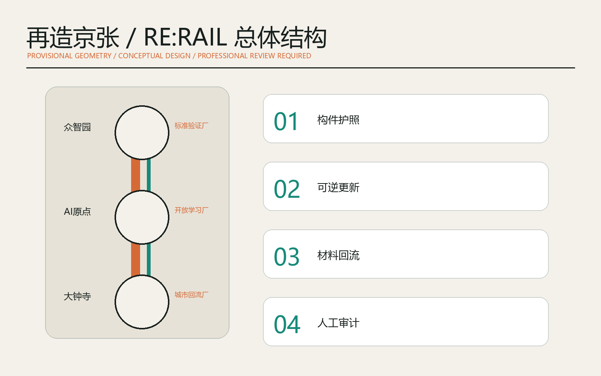
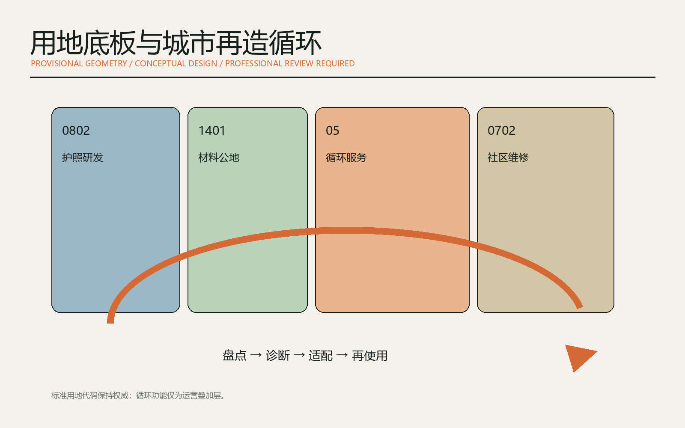
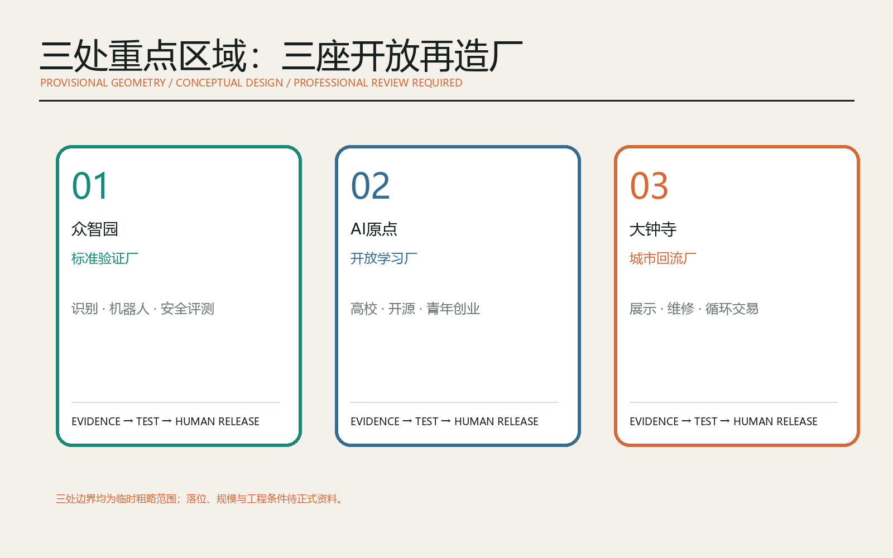
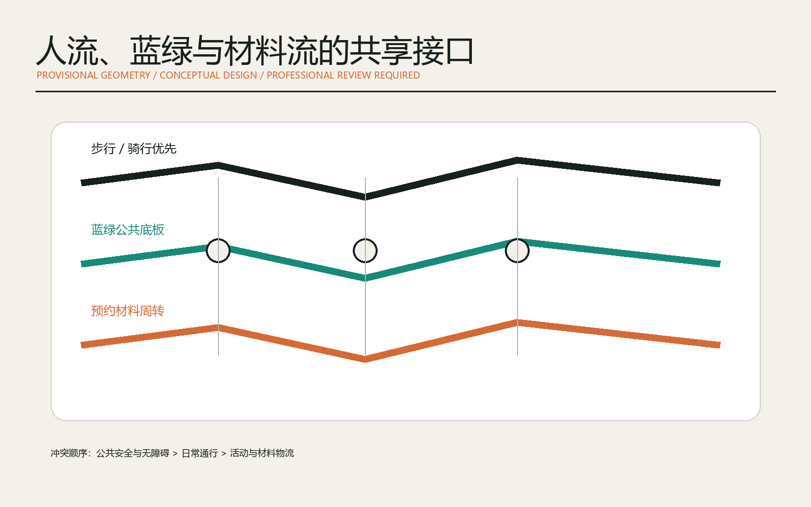
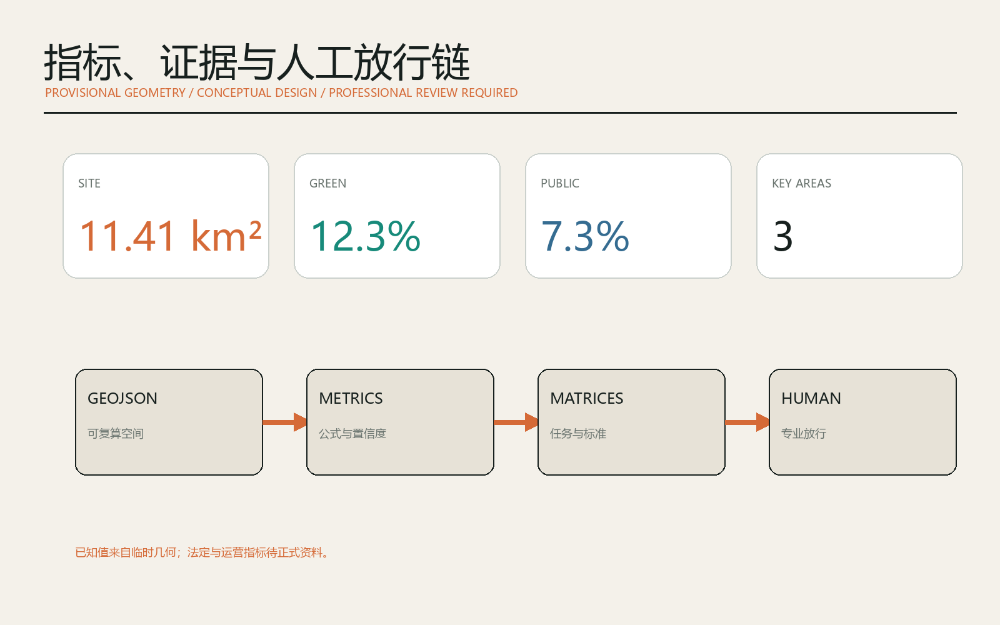

# 再造京张 RE:RAIL：AI循环建造与城市更新公地

## 设计依据与资料清单

本方案以官方资格预审公告、面向智能体的清权任务书、城市设计管理办法、控制性详细规划编制审批办法和国土空间用地分类指南为任务与专业边界。官方公告确认三层范围、三处重点区域和城市更新任务；仓库登记的临时粗略多边形只用于生成、讨论和机器校验，不是官方红线，也不能支撑精确面积、权属或审批判断。[source:OFFICIAL-ANNOUNCEMENT] [standard:PROJECT-OFFICIAL-ANNOUNCEMENT] [depth:existing_conditions_diagnosis]

设计命题为“再造京张 / RE:RAIL”。这里的“再造”不是拆除重建，而是把每一次修缮、适配、构件替换和公共空间维护变成可记录、可复核、可再次使用的城市知识。AI 的角色是读取公开或清权的建筑资料、生成多方案比选、标记不确定性并组织人工复核；专业团队、产权主体、管理部门与公众保留最终判断。资料分为三层：可正式引用的任务和标准、仅供案例研究的外部资料、仅供临时边界生成的几何数据。[source:SOURCE-REGISTRY] [source:DATA-SRC-PROVISIONAL-BOUNDARIES-20260605]

提交包中的九类 GeoJSON、指标、三张矩阵、五张中英图件、双语离线网页和双语 PDF 均由同一组临时几何与设计叙事派生。正式红线、重点区边界、现状建筑、道路断面、文保控制、市政和权属资料补齐后，应整体重算而不是局部替换。[data:geometry/site_boundary.geojson#SITE-001] [metric:site_area_sqm]

## 三层范围工作框架

统筹研究范围把“研发-验证-转化-使用-回收”视为一个区域创新链，连接三区两翼、全球案例与京津冀专业服务；总体设计范围把京张遗址公园组织为材料知识与公共生活共用的“再造主线”；三处重点区域分别验证构件标准、近校转化和城市消费回流。三个尺度之间通过同一套构件护照、空间清单、责任记录和公众接口传递，而不是各自形成孤立图纸。[standard:MOHURD-URBAN-DESIGN-MEASURES] [depth:three_level_scope_framework]

总体空间结构为“一线、三厂、两翼、十二接口”。一线是京张遗址公园再造主线；三厂不是生产工厂，而是众智园“标准验证厂”、AI 原点社区“开放学习厂”、大钟寺“城市回流厂”；中关村科技服务翼承担科研、知识产权、融资和专业服务，小月河场景赋能翼承担社区试用、维修教育与公共反馈。该结构只是一套概念建议，具体落位必须由正式资料和现场调研校准。[data:geometry/key_areas.geojson#PROV-KEY-001] [depth:overall_spatial_structure]

三层范围的共同评价不是“造了多少”，而是“有多少既有空间被安全延寿、多少构件信息可追溯、多少公共需求被及时修复、多少 AI 判断能由人复核”。现阶段没有可靠基线，因此这些绩效先作为监测框架，不写成已实现目标；空间面积仍以临时图形复算并保留精度警示。

## 统筹研究范围产业与未来城市研究

RE:RAIL 将 AI 生态从单一算力或办公集聚扩展为“城市更新操作系统”：公开标准负责共同语言，材料与建筑护照负责资产记忆，城市模型负责多方案推演，试验空间负责真实验证，社区维修网络负责公共价值，专业责任链负责放行与追责。众智园聚焦模型、机器人、构件识别和安全评测；原点社区连接高校研究、开源工具与青年创业；大钟寺连接展示、交易、维修和公众体验；两翼提供资本、法规、知识产权、场景和运营服务。[source:AGENT-TASKBOOK] [standard:PROJECT-AGENT-OPEN-CALL-TASKBOOK]

七个全球案例提供可转化机制而非照搬形态：巴黎 STATION F 的高密度创业服务提示共享支撑平台；蒙特利尔 Mila 的研究-产业-创业连接提示近校转化；新加坡 AI Verify 的开放测试提示可审计验证；阿姆斯特丹循环战略提示以采购和公共空间带动再利用；欧盟 Level(s) 提示全生命周期共同语言；Madaster 提示材料护照；EC3 提示开放环境产品数据。案例来源均记录在 sources.json，不能替代本项目的官方规划资料。[source:CASE-STATION-F] [source:CASE-MILA] [source:CASE-AI-VERIFY]

| 案例 | 可借鉴机制 | 京张转译 |
| --- | --- | --- |
| STATION F | 创业服务与伙伴同场 | 大钟寺城市回流厂 |
| Mila | 研究、应用与创业连续支持 | AI 原点开放学习厂 |
| AI Verify | 开源测试与治理报告 | 众智园标准验证厂 |
| Amsterdam Circular | 采购、维修与公共空间协同 | 两翼再利用服务网络 |
| EU Level(s) | 生命周期指标共同语言 | 构件护照字段体系 |
| Madaster | 材料与构件可追溯 | 京张材料账本 |
| EC3 | 开放环境产品数据 | 采购比选与人工复核 |

区域创新协同以公开接口、年度挑战、专业实习和可复现数据包为核心，不预设企业名单、投资额或政府承诺。每个场景都要有进入条件、暂停条件、人工负责人和退出后的资料归档，避免技术展示占用公共空间却不产生可持续价值。

## 总体设计范围城市更新与控规深度城市设计

总体设计以“先盘点、再诊断、后适配、最后才考虑替换”为更新顺序。AI 可辅助识别屋面、立面、设备和公共空间的维护线索，生成保留、修缮、功能适配与可逆加建方案，但不得根据临时图形直接判断具体建筑拆改留。每一项建议都需绑定来源、置信度、现场核查、结构与消防复核、产权意见和公众影响。[standard:MOHURD-CONTROL-DETAILED-PLANNING] [depth:retain_renovate_demolish]

用地分区保持国家分类语义，同时赋予运营层含义：科研用地承载构件识别与机器人验证，公园绿地承载材料故事和维修教育，商业服务用地承载再制造服务与循环交易，社区服务用地承载居民维修、人才服务和共享工具。四类概念分区完整覆盖提交边界，面积只用于拓扑与方案比较，不视为审定用地。[data:geometry/land_use.geojson#LU-001] [standard:MNR-LAND-USE-CLASSIFICATION-GUIDE]

建筑高度、容积率、密度、退线和建筑总规模均待正式控规和现状调查补齐。设计建议采用可逆连接、可维护界面、分层管线和小步改造，优先选择不改变主体结构的轻量原型；涉及新增荷载、消防疏散、文保、地下空间或市政容量的内容必须暂停并转交专业团队。[metric:floor_area_ratio] [depth:development_intensity_controls] [depth:height_massing_character]

更新项目不是固定建设清单，而是一组可验证工作包：建筑体检与材料建账、公共空间维修驿站、低扰动首层适配、构件样本库、慢行断点修复、无障碍复核、活动后材料回收和年度开放审计。每个工作包均可在条件不足时缩小或退出。

## 重点区域详细设计

众智园“标准验证厂”概念建议围绕花园型创新街区设置构件扫描与机器人作业测试庭、可逆节点样墙、AI 安全评测室和清河材料花园。测试对象先在封闭或预约环境中验证，再由结构、消防、安全与无障碍专业人员放行；测试失败进入问题库，不直接部署到公共空间。边界为临时粗略范围，具体位置须待官方图件与现场资料确认。[data:geometry/key_areas.geojson#PROV-KEY-001] [depth:three_key_area_detailed_design]

AI 原点社区“开放学习厂”概念建议把高校成果、开源社区、青年居住和街区维修连接起来。核心原型包括旧空间适配诊所、材料护照编辑台、学生-工匠协作工坊、夜间学习客厅和小尺度成果发布界面。这里不预设校区或产权空间可被改造，所有方案从公开空间和自愿参与的清权样本开始。[data:geometry/key_areas.geojson#PROV-KEY-002] [source:CASE-MILA]

大钟寺“城市回流厂”概念建议把地铁四象限的步行体验、商业服务、构件展示、维修预约与城市级回收撮合叠合。设置可拆展架、城市构件图书馆、再生设计周和公众申诉台，使材料循环成为可见的城市服务而非后场物流。站点一体化、道路与地下工程均待正式资料和专项论证。[data:geometry/key_areas.geojson#PROV-KEY-003] [metric:key_area_count]

三处区域共享“先证据、后动作；先可逆、后永久；先小范围、后扩展”的放行门槛。所有详细设计均为参考方案，可供专业团队深化研究，不构成具体地块的建设、拆除、招商或审批安排。

## AI 创新生态、人才画像与 AI+ 场景

五类核心画像是：需要低成本验证环境的 AI 创业者、负责安全与合规的专业人员、掌握现场经验的工匠和维护者、使用社区公共空间的居民、参与研究与转化的高校师生；另设产权与运营协调者、国际访客两类协作画像。画像只描述角色需求，不采集个人轨迹、面部或商业秘密。[source:AGENT-TASKBOOK] [depth:municipal_new_infrastructure]

十二张场景卡分别为：建筑体检助手、构件护照编辑台、可逆节点生成器、机器人拆解沙盒、低碳采购比选、维修需求翻译器、无障碍巡检共创、材料图书馆、共享工具驿站、活动构件回收、京张构造史导览、城市更新公开复盘。其中前三项加机器人拆解沙盒属于产业测试验证场景；它们都必须使用清权数据、隔离测试、人工放行和可撤回机制。[data:geometry/buildings.geojson#BLDG-001] [data:geometry/constraints.geojson#CONSTRAINTS]

每张卡遵循“问题-空间-输入-模型-人工责任-输出-暂停条件-归档”八字段。建筑体检仅生成现场核查清单，不给结构安全结论；采购比选展示来源与不确定性，不指定供应商；维修翻译器允许居民纠正和申诉；机器人测试设置速度、范围与人工急停；历史导览只使用可核查文字和清权图像。[source:CASE-AI-VERIFY] [source:CASE-EC3]

生态运营以季度开放测试、半年专业复盘、年度 RE:RAIL Assembly 为节奏。测试数据先脱敏和最小化，再发布方法、失败样本与改进日志。创新价值不以设备数量衡量，而以问题闭环、人工复核覆盖、可复现程度与公共受益记录衡量。

## 用地、建筑规模与拆改留方案

用地层继续使用 0802、1401、05、0702 等标准代码，RE:RAIL 的循环功能只作为第二层运营标签，防止自造分类与法定用途混淆。临时分区完整覆盖提交边界且无重叠，能够支持图面和面积复算，但正式用地性质必须等待控规与官方地块资料。[data:geometry/land_use.geojson#LU-002] [depth:land_use_layout]

建筑策略采用 R0-R4 五级门槛：R0 记录与维护，R1 修缮，R2 功能适配，R3 可逆加建，R4 在充分证据和法定程序下才讨论替换。当前只有概念性建筑图层，因此所有对象均标为“待现场和权属确认”，不做具体楼栋的保留、改造或拆除结论。[data:geometry/buildings.geojson#BLDG-001] [depth:retain_renovate_demolish]

构件护照建议包含来源、年代、材料、连接方式、检测记录、维修历史、拆解条件、再利用限制、责任主体和数据许可。AI 可以从清权 BIM、台账或检测报告提取字段并提示缺项；任何结构、消防、有害物质和性能结论由注册专业人员签认。材料护照借鉴 Madaster 与欧盟 Level(s) 的生命周期方法，但采用何种平台、标准和采购规则仍需本地专业团队确定。[source:CASE-MADASTER] [source:CASE-EU-LEVELS]

建筑基底面积是提交几何的概念性复算值，不代表现状总量或获批建设规模；总建筑面积与容积率保持待补状态。图纸中的体量只用于解释可逆更新的空间关系，不作工程计量。[metric:building_footprint_area_sqm] [metric:floor_area_ratio]

## 交通、轨道、市政与公共服务设施

交通系统提出“三流分离、接口共享”：日常步行骑行优先，低速材料周转采用预约时段和限定节点，专业车辆仍按既有管理与专项方案运行。京张遗址公园主线连接三处重点区，东西向接口服务社区、高校和园区；大钟寺站、五道口等节点只提出步行连续性和无障碍核查框架，不给道路红线、桥隧或站体工程结论。[data:geometry/roads.geojson#ROAD-001] [depth:traffic_rail_slow_parking]

市政与新基建采用“边缘计算小站+公开状态牌+人工服务台”的轻量组合。端侧模型只处理被授权的设备与环境数据，关键判断不上传个人信息；停电、断网或模型异常时恢复人工流程。能源负荷、通信、消防、排水和设备安装均待专项资料，不以展板示意替代工程论证。[depth:municipal_new_infrastructure] [data:geometry/constraints.geojson#CONSTRAINTS]

公共服务把维修、借用、教育、法律和无障碍咨询放在同一入口，AI 只承担信息导航和表单辅助。面向老年人、儿童、残障人士和非中文使用者保留线下、人工和多模态选择，避免数字化成为新的门槛。材料运输与公众活动冲突时，以公共安全和无障碍通行为先。

## 蓝绿空间、公共空间与城市风貌

蓝绿系统把京张遗址公园、清河和小月河相关空间视为低扰动的公共底板。概念建议以连续遮荫、雨水花园、可维修铺装和可拆展陈承载创新活动；任何临水、文保、树木和排水动作都必须等待正式控制线与专项审查。绿地与公共空间比例来自同一临时几何，仅用于比较设计结构。[data:geometry/green_space.geojson#GREEN-001] [metric:green_ratio] [depth:blue_green_public_space]

公共空间组件库包括“护照柱、构件书架、维修长桌、可逆舞台、人工服务灯、问题回执墙”。三个 AI 朝圣地标分别为众智园“开源节点墙”、原点社区“百年构造档案室”、大钟寺“城市再造钟”；它们展示贡献、失败与修复记录，而不是个人崇拜或企业广告。所有组件采用可拆、可修、可替换的参考构造，并设置无电状态和人工说明。[data:geometry/public_space.geojson#PUBLIC-001] [standard:MOHURD-URBAN-DESIGN-MEASURES]

视觉识别以两条不断续接的轨线组成 RE:RAIL 字标：石墨灰代表既有城市，铜橙代表被重新激活的构件，青绿代表公共与生态回路。导视区分“事实、建议、试验、待确认”四种状态，并以文字、图形和触觉冗余表达。Logo 方向为原创几何构想，不使用外部商标或受限字体。

文化叙事从京张铁路的自主建造精神出发，连接中关村的开放创新，再转向 AI 时代“可解释、可修复、可交接”的城市伦理。历史信息须由专业策展与史实核查确认，AI 生成内容必须显著标注。

## 更新项目清单、实施政策与分期计划

第一阶段“建账与共识”包括公开资料台账、临时边界复核、五类用户共创、三处轻量服务台和首批构件护照；第二阶段“验证与适配”包括三厂测试、慢行断点小尺度修复、材料图书馆和可逆空间原型；第三阶段“网络与治理”在法定程序和专业确认后才讨论规模化采购、跨片区撮合和长期运营。分期图层只是概念范围，不等于开发时序或财政安排。[data:geometry/phasing.geojson#PHASE-001] [depth:phasing_implementation]

项目清单包含：RR-01 城市更新证据底座，RR-02 众智园标准验证庭，RR-03 原点开放学习工坊，RR-04 大钟寺材料图书馆，RR-05 京张维修主线，RR-06 无障碍接口修复，RR-07 构件护照与授权规则，RR-08 年度再造大会。每项先设置资料门、专业门、公众门和退出门，再讨论空间实施。[depth:renewal_project_list] [source:CASE-CIRCULAR-TOOLKIT]

政策建议包括：公共项目先做改造前审计；采购文件允许合规再利用构件；材料数据采用最小必要和分级开放；失败案例纳入公开学习；社区维修服务按可达性而非消费能力配置；AI 输出保留版本、来源和人工签认。上述均为研究建议，不表示已有政策、资金或实施主体。

年度运营由春季“城市体检周”、夏季“可逆建造赛”、秋季“RE:RAIL Assembly”、冬季“更新公开账”组成，配套开发者驻留、工匠导师、社区陪审和国际案例交换。活动是否举办以及频率需由未来运营团队、安全条件和资源共同决定。

## 指标体系、面积复算与合规矩阵

机器可复算指标包括临时总体设计面积、建筑基底概念面积、绿地比例、公共空间比例和三处重点区数量；容积率、总建筑面积、高度、密度、退线、材料存量、再利用率和碳效益均待正式数据补齐。任何展示值都与 metrics.json 一致，公式、来源文件、置信度和假设可被独立检查。[metric:site_area_sqm] [metric:green_ratio] [metric:public_space_ratio]

方案另设运营指标框架：护照字段完整率、现场核查闭环率、人工放行覆盖率、可逆构造使用率、无障碍问题修复率、公众申诉响应时间、构件再利用去向可追溯率。这些指标在没有真实运营数据前不填目标值，避免把愿景写成成绩。空间指标用于拓扑审查，运营指标用于未来试点治理，两者不得互相替代。[depth:metrics_recalculation] [source:CASE-EC3]

compliance_matrix.json 覆盖公告 1.3、1.4、1.5 和 agent.1-agent.6；standard_matrix.json 连接五项强制标准；design_depth_matrix.json 覆盖十五项设计深度。矩阵不是正文替代品，正文解释设计意图和风险，结构化文件保存完整索引和复核路径。

当前临时边界复算面积约 11.41 平方公里，与公告约 11.4 平方公里接近，只说明临时图形适合投稿生成，不证明其为官方红线或精确面积。官方多边形发布后必须重算全部设计图层、指标、图件、网页和 PDF。

## 风险、版权与合规说明

首要风险是资料不完整：官方红线、三处重点区精确边界、地块权属、现状建筑、控规、市政、道路、文保和公共服务底数均缺失。相应控制措施是保持临时状态、禁止具体楼栋拆改留结论、禁止工程线位和容量判断、设置整体重算触发器，并由专业团队在任何现实实施前复核。[depth:risk_missing_data] [data:geometry/constraints.geojson#CONSTRAINTS]

AI 风险包括错误识别构件、低估安全隐患、来源过期、模型偏差、过度监控和责任模糊。控制措施是数据最小化、来源白名单、隔离测试、置信度显示、双人复核、人工急停、申诉渠道和版本化审计。系统不处理个人生物识别，不以算法评分决定公共服务资格，不替代结构、消防、交通、医疗、法律或规划专业判断。[source:CASE-AI-VERIFY]

本方案的文字、代码生成图、几何排版和 Logo 方向由 OpenAI Codex 在公开或清权资料基础上原创生成；外部案例仅作文字研究并在 sources.json 中署名链接，不复制其图像、商标或版式。投稿采用 COMMUNITY-DISPLAY-ONLY 许可并遵守征集知识产权条款。对外发布、活动和任何现实部署均需权利人与责任主体另行确认。

所有空间内容均为开放共创的概念建议、参考方案或可供专业团队深化研究，不替代正式规划，不构成政府审定、投资、建设或运营承诺。中文为主稿，英文为完整对照译文；两种语言的章节、图件位置、核心主张和证据锚点保持对应。

## 参考资料

本地任务依据包括官方公告快照、agent_taskbook.json、城市设计管理办法、控制性详细规划编制审批办法、国土空间用地分类指南、source_registry.json、临时边界与缺资料清单。完整来源字段、访问日期、许可与禁止用途见 sources.json；几何、指标和矩阵是复核权威层。[source:SITE-PACKAGE] [source:SOURCE-REGISTRY]

外部方法案例包括 STATION F、Mila、Singapore AI Verify、Amsterdam Circular Economy、EU Level(s)、Madaster、Building Transparency EC3 与 Circular Buildings Toolkit。它们用于比较创新生态、测试治理、材料护照与循环建造方法，不用于推导京张的边界、用地、规模、审批或实施承诺。[source:CASE-EU-LEVELS] [source:CASE-AMSTERDAM-CIRCULAR] [source:CASE-MADASTER]

检索日期统一为 2026-08-09。若网页、政策或工具后续更新，应重新核对版本和适用范围，并在 changelog.md 记录对方案的影响。同行方案只用于差异化选题观察，没有复制其文字、图件或结构化资产。
