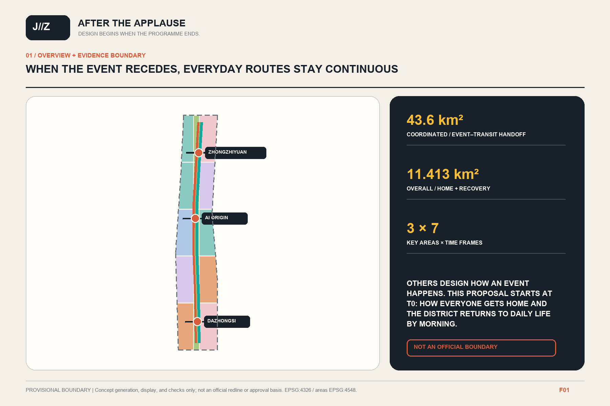
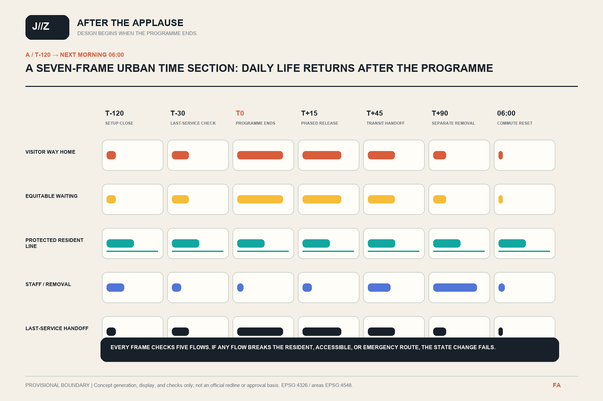
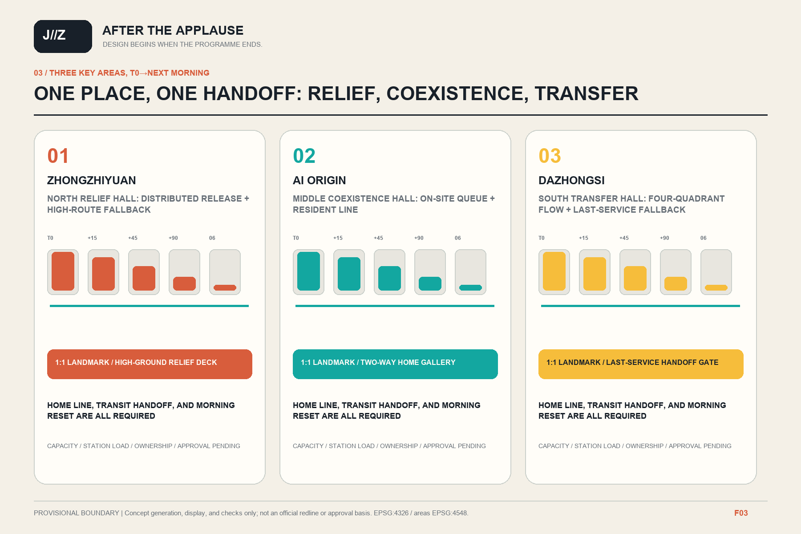
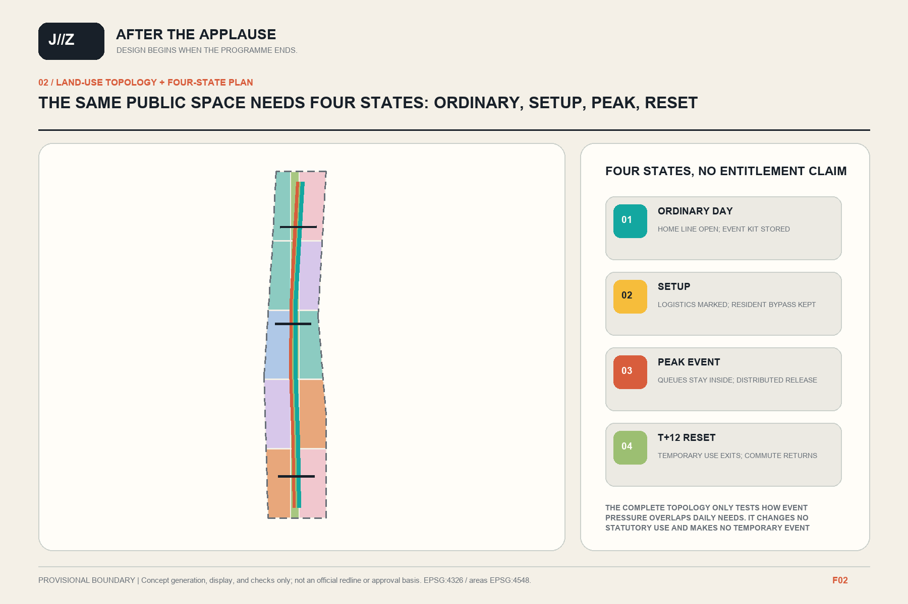
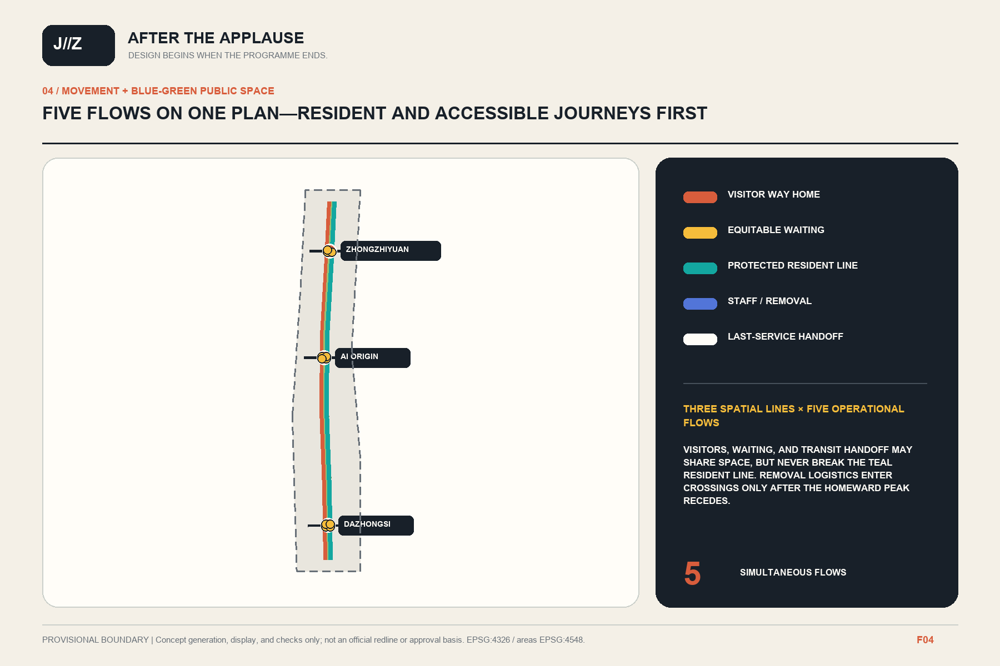
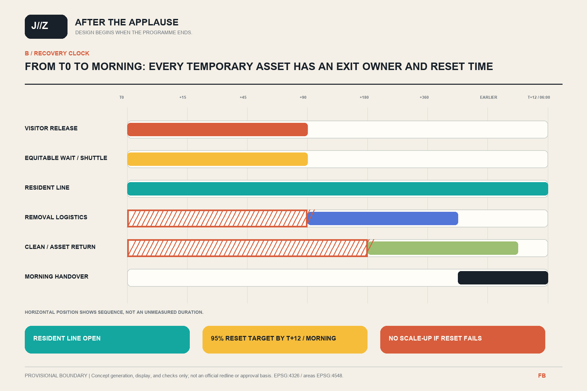
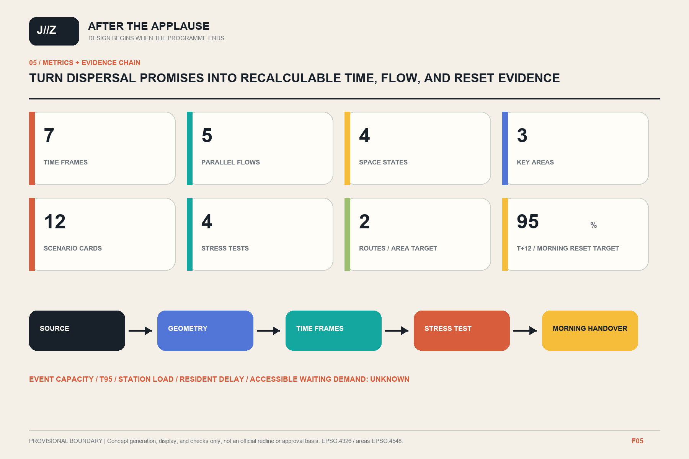

# AFTER THE APPLAUSE / 京张散场

> A world-class AI event is complete only when the last visitor has left safely, the neighbourhood can still get home, and the city has returned to ordinary life the next morning.

This proposal does not treat dispersal as a back-office platform. It makes it a drawable, walkable, rehearsable, and recoverable urban-design object. From setup close at T-120, through T0 when the applause stops, to 06:00 the next morning, seven time sections track five flows on the same drawing: visitor way home, equitable waiting, the protected resident line, staff and removal logistics, and the last-service transit handoff. Every frame asks the same three questions: how people get home, how the neighbourhood avoids being displaced by the event, and how public space returns to ordinary use.

## Design Basis and Source List

The official call requires the approximately 43.6-square-kilometre coordinated research area, the approximately 11.4-square-kilometre overall design area, and three key areas to address the AI innovation ecosystem, urban renewal, station-city integration, road micro-circulation, continuous slow-mobility and blue-green networks. It also asks AI Origin to support achievement display and release, Dazhongsi to answer international exchange and four-quadrant pedestrian connections, and the Jing-Zhang Heritage Park to support innovation exchange and application display. Safe departure and everyday recovery can therefore be used as a spatial stress test. The call does not approve any event, venue, or attendance, and this proposal never treats a world-class event scale as an existing fact. [source:OFFICIAL-ANNOUNCEMENT] [source:HD-OPEN-CALL-2026] [standard:PROJECT-OFFICIAL-ANNOUNCEMENT]

The Haidian Urban Renewal Guide calls for life-cycle management, continuous public space, integration of walking, greenway and waterfront networks, station-city integration, accessibility, public safety, and resilience. Beijing's Resilient City Spatial Plan calls for flexible conversion and rapid recovery. These sources support an everyday-first, reversible-event, next-morning-recovery principle, but they do not prove event capacity, transport capacity, or emergency performance at this site. [source:HD-URBAN-RENEWAL-GUIDE-2025] [source:BJ-RESILIENCE-PLAN-2035] [source:BJ-URBAN-RENEWAL-REG]

Evidence is managed in three tiers. Formal-ready announcements, laws, and the taskbook support requirements and principles; government pages and international cases support mechanism comparison only; provisional geometry supports generation, display, and checks only. The official site polygon, precise key-area boundaries, regulatory controls, ownership, station capacity, road redlines, fire and utility data, water controls, and event approvals are all unknown. Pale dashed envelopes, conceptual centrelines, and module footprints are not redlines, title boundaries, certified egress routes, or construction approvals. [source:SOURCE-REGISTRY] [source:BOUNDARY-SOURCE] [depth:existing_conditions_diagnosis]

## Three-Level Scope Framework

The three scopes are not one drawing at three zoom levels. They answer three different questions:

| Level | Official description | This proposal asks | Output and boundary |
| --- | --- | --- | --- |
| Coordinated research area | Approximately 43.6 km² | How events, homes, campuses, innovation parks, and regional transport jointly support the way home | Mechanisms, cases, roles, and data needs; no official capacity calculation |
| Overall design area | Approximately 11.4 km² in the call; 11.413 km² recalculated from the package's provisional geometry | How seven frames from T-120 to 06:00 become one spatial structure | Four-state plan, seven-frame section, five-flow overlay; not an official planning boundary |
| Three key areas | Approximately 368.4 ha in the call | How Zhongzhiyuan, AI Origin, and Dazhongsi respectively provide relief, co-existence, and transfer | Directional detailed design, 12 scenarios, and a project list; provisional rectangles are not parcels |

The research level states that safe departure belongs to an innovation ecosystem. The overall level forms one spine, three halls, four layers, and two states. The key-area level turns one principal conflict into a reversible full-scale sample and stress test. When an official polygon arrives, it must replace the provisional boundary as the single source; land use, buildings, roads, green space, public space, and phasing must then be clipped again and every area and ratio recalculated. [data:geometry/site_boundary.geojson#SITE-001] [data:geometry/key_areas.geojson#PROV-KEY-001] [depth:three_level_scope_framework]

Textual extents, web maps, and OSM must not be traced into an official redline. Until formal conditions arrive, every line is labelled as a conceptual way home, an entrance requiring agreement, or an interface requiring specialist review. The proposal does not say completed, capable, or approved. [standard:MOHURD-CONTROL-DETAILED-PLANNING] [depth:metrics_recalculation]

## Coordinated Research Area: Industry and Future City Research

AFTER THE APPLAUSE redefines a world-class AI innovation belt as an event-resilient corridor accountable to everyday life. The name looks beyond the celebration to those who remain visible afterwards: residents going home, visitors who miss the first departure wave, people needing accessible assistance, night workers, and the teams that remove and reset temporary uses.

The three positions are an everyday-first innovation-event district, a station-city corridor with more than one way home, and public space accepted through next-morning recovery. The five functions are event threshold, relief pocket, homeward fan, protected resident line, and recovery store. The identity uses an open ring for the end of an event and a continuous teal line passing through it to 06:00. Rust marks rail memory and event limits, teal marks continuity home, and yellow marks unknown conditions requiring human confirmation. The identity does not use protected organiser, railway, corporate, or third-party marks. [source:AGENT-TASKBOOK] [standard:PROJECT-AGENT-OPEN-CALL-TASKBOOK] [depth:overall_spatial_structure]

Eight primary cases transfer mechanisms only. Their attendance, capacity, laws, and outcomes are not local evidence:

| Source | Transferable mechanism | Local prohibition |
| --- | --- | --- |
| UK HSE event crowd management | Treat arrival, entry, onsite circulation, leaving, and external dispersal as one chain | Do not import UK attendance, density, or licensing conclusions [source:CASE-UK-HSE-CROWD] |
| UK SGSA Green Guide | Safe event capacity is constrained by the weakest entrance, holding, exit, emergency, communication, or management condition | Do not use its venue formula to certify this proposal [source:CASE-UK-SGSA-GREEN-GUIDE] |
| TfL London 2012 evaluation | Time-based monitoring and different arrival and departure stations or directions | Do not assume Haidian has London's network redundancy or exceptional resources [source:CASE-TFL-EXCEL-2012] |
| Île-de-France Mobilités Paris 2024 | Last-service porch, booked accessible shuttles, sheltered waiting, and extended service windows | Do not treat Games resources as local evidence or booking as universal design [source:CASE-IDFM-PARIS-2024] |
| Transport for NSW special-event guide | Four transport states: ordinary, setup, peak event, and removal, with resident communication | Do not copy NSW classifications or statutory processes [source:CASE-NSW-SPECIAL-EVENTS] |
| Paris public-space event and reinstatement guidance | Pair event and reinstatement plans, list temporary assets, and define setup and removal windows | Do not claim every Paris event recovers by morning [source:CASE-PARIS-EVENT-RESET] |
| Forum Virium Helsinki agile pilots | Co-design, field test, evaluate, and retain the option not to scale | Residents are not default test subjects and a pilot is not success [source:CASE-FI-KALASATAMA] |
| Singapore Punggol ODP | Modular asset records, scenario simulation, failure logs, and replaceable interfaces | No central personal surveillance; future efficiency claims are not verified outcomes [source:CASE-SG-PDD-ODP] |

The related-work audit identifies Mobility Commons, Encounter Commons, People First Jing-Zhang, Open Model Loop, and Jing-Zhang Civic Foundry as adjacent work on movement, encounter, human-machine priority, governance skeletons, and cultural production. This proposal credits them but copies none of their text, graphics, routes, protocols, or event mechanisms. Its distinct object is a spatial time section centred on T0, extending from T-120 to 06:00, with acceptance through ordinary-state recovery. [source:PEER-MOBILITY-COMMONS] [source:PEER-ENCOUNTER-COMMONS] [source:PEER-PEOPLE-FIRST]

[source:PEER-OPEN-MODEL-LOOP] [source:PEER-CIVIC-FOUNDRY]

## Overall Design Area: Urban Renewal and Regulatory-Plan-Level Urban Design

The overall structure is one spine, three halls, four layers, and two states. The Jing-Zhang relief and recovery green spine provides conceptual distribution and continuous public space; before verification it is not described as a certified egress route. The three halls are the northern relief hall at Zhongzhiyuan, the middle co-existence hall at AI Origin, and the southern transfer hall at Dazhongsi. The four layers are event threshold, relief pocket, homeward fan, and protected resident line. The two states are ordinary day and event day; storm and station failure are stress tests, not reasons to build a permanent event city. [data:geometry/roads.geojson#ROAD-001] [depth:overall_spatial_structure]

The seven-frame time section is centred on T0. Two earlier frames check setup close and last-service readiness; four later frames track the way home and reset. Every frame overlays all five flows rather than substituting a single event plan for temporal change:

| Frame | Urban state | Spatial question that must be drawn | Acceptance record |
| --- | --- | --- | --- |
| T-120 | Setup closes | Are removal logistics, the resident bypass, and the event threshold already separated? | Temporary-asset, owner, closure, and alternative-entry list |
| T-30 | Last-service check | Are last services, accessible shuttles, human advice, and failure alternatives confirmed? | Publish operator-confirmed information only; record unconfirmed interfaces |
| T0 | Release begins | Are the internal queue, protected resident line, and emergency access all visible? | Initial attendance N remains unknown; record usable and closed interfaces |
| T+15 | First departure wave | Can relief pockets absorb a short surge without blocking homes? | Conflict points, accessible waiting, and human guidance |
| T+45 | Transfer peak | Do multiple stations, directions, and modes truly distribute demand? | Directional allocation, external station queues, and resident delay |
| T+90 | Final onward journey | Do last-service users, stragglers, and night workers retain light and human help? | Remaining people, alternatives, accessible toilets, and rest |
| Next morning 06:00 | Ordinary day restarts | Can commuting, school, morning exercise, and first services operate? | Entrances, paths, kerbs, and public facilities reset |

The five fixed legend flows are: A rust for the visitor way home; B yellow for equitable waiting and accessible assistance; C teal for the protected resident line; D blue for staff and removal logistics; and E dark grey for the last-service transit handoff. Emergency access is overlaid and protected as a separate statutory safety constraint, not counted as an event-operation flow. All five appear in all seven frames, showing crossings, separation, waiting, and closure. Servicing is never hidden outside the drawing. [depth:traffic_rail_slow_parking] [depth:municipal_new_infrastructure]

A four-state plan supplements the section with ordinary day, setup, peak event, and recovery configurations. Only facilities that remain useful on ordinary days, reversible on event days, and closable on failure enter the project list. [metric:time_frame_count] [metric:state_plan_count]

## Detailed Design of Key Areas

All three key areas receive directional designs inside provisional index rectangles. Their edges are not roads, parcels, or title boundaries. Each area covers positioning, spatial structure, building renewal, transport and walking, public space, scenarios, landmark, projects, and risk. [data:geometry/key_areas.geojson#PROV-KEY-002] [depth:three_key_area_detailed_design]

### Zhongzhiyuan: Northern Relief Hall

This is a garden-like dispersal forecourt where people may move or pause, not an unapproved main venue. Movement progresses from an event threshold to high-route green relief and then divides towards walking, cycling, and onward transport to be verified. A low Qinghe route is never the only way home when weather or management closes it. S05 Distributed Arrival and S06 High-Route Relief form the reversible sample; T02 tests low-route closure. Buildings are limited to possible reuse of lawful existing ground floors or removable shelters. Permanent floor area, fire capacity, and shuttle scale remain unknown.

The High-Route Home Beacon is a removable direction and closure marker for visitors and residents. It collects no identity. Its exact position must avoid water controls, important trees, and existing works. It is neither an approved building nor a promised advertising or commercial operation.

### AI Origin: Middle Co-existence Hall

This is where events occur without forcing everyday life to leave. Release events and queues are first contained within their own sites. Wudaokou, Qinghuadongluxikou, and other lawful directions form a distribution fan, while residents, students, and night workers retain a protected line that does not cross the event queue. S07 On-Site Queueing, S08 Multi-Station Dispersal, and S09 Protected Resident Way Home work with T01 and T04 to test weekday-peak overlap and accessible-equipment failure.

The Quiet-Edge Time Mark near Qinghuayuan Station expresses the sequence from T0 to 06:00 only outside the heritage extent confirmed by the authority. It is not attached to the protected building and does not hold dense crowds. Web text describing protection controls is not digitised into a formal polygon. Repair, lighting, events, and new structures all await heritage approval. [source:BJ-QHY-HERITAGE-STATUS] [source:BJ-QHY-PROTECTION-2026]

### Dazhongsi: Southern Transfer Hall

This is an urban four-quadrant way-home hall. Event thresholds hold their own queues. The four street quadrants distribute people towards verified rail, walking, cycling, and other routes; the resident line is separated from ride-hail, bicycle parking, and removal loading. S10 Four-Quadrant Dispersal, S11 Last-Service Transit Porch, and S12 Next-Morning Reset work with T03 to test a single station-entry failure.

The Four-Way Reset Clock displays open directions, the next human review, and whether ordinary state has returned. It displays neither personal trajectories nor invented train information. Entrances, signal timing, last services, capacity, and underground works require operator and transport-professional confirmation.

## AI Innovation Ecosystem, Personas, and AI+ Scenarios

Personas are design constructs, not completed resident research. Six core users and the needs that cannot be traded away are listed below. [source:LAW-BARRIER-FREE-2023] [depth:municipal_new_infrastructure]

| Persona | Task after the applause | Spatial need | Unacceptable result |
| --- | --- | --- | --- |
| Visiting researcher or developer | Find the next lawful journey segment | Multi-direction guidance, human advice, accessible toilets | Locked into one app or one station |
| Nearby resident | Get home normally during an event | Continuous protected line and queue-free residential entrance | Permanent detour or loss of access |
| Student or campus worker | Cross campus-community edges | Timed access, night lighting, and quiet routes | Assuming internal campus roads are public |
| Wheelchair user, older person, or carer | Receive equal departure and waiting choice | Step-free route, rest, and human assistance | Booked transport without universal route |
| Night or event worker | Complete final journey, handover, and rest | Late porch, drinking water, toilet, visible help | The last worker left in an unserved space |
| On-site control, cleaning, or emergency worker | Close, remove, reset, and sign off | Independent service flow, physical stop, recovery checklist | Waiting only for a remote model |

T01–T04 are controlled AI-assisted validation scenarios. They begin with shadow simulation, human walks, and small authorised rehearsals. S05–S12 are public-space scenarios. AI handles only authorised anonymous aggregate counts, asset state, weather, and time. It does not use facial recognition, retain personal trajectories, or score resident risk.

| ID | Scenario / area | AI and data boundary | Human takeover | Verifiable output |
| --- | --- | --- | --- | --- |
| T01 | Weekday peak plus event / AI Origin | Anonymous directional counts; N and C(t) remain variables | On-site control changes release rate | T95 range, resident delay, conflict points |
| T02 | Storm closure of low route / Zhongzhiyuan | Official weather and route state; no individual prediction | Water and site staff physically close the path | High-route alternative and single points of failure |
| T03 | Station or entrance failure / Dazhongsi | Operator-confirmed status only | Transport staff activate alternatives | Remaining people, waiting, and alternative time |
| T04 | Accessible-equipment failure / AI Origin | Asset state and human audit; no disability inference | Human assistance and closure of incorrect advice | Completeness of a step-free alternative |
| S05 | Distributed arrival / Zhongzhiyuan | Publish entrance state only | Retain a non-digital entrance | Queue length beyond the event threshold |
| S06 | High-route relief / Zhongzhiyuan | Anonymous occupancy range | Human release control and low-route closure | Whether two independent ways home exist |
| S07 | On-site queueing / AI Origin | Ticketing data stays outside the city model | Venue retains its waiting inside | Zero permanent occupation of the city footway |
| S08 | Multi-station dispersal / AI Origin | Station capacity must come from operators | Humans replace direction signs | Directional load ranges, not promised capacity |
| S09 | Protected resident way home / AI Origin and corridor | Record anonymous blockage events only | Community may veto occupation | Continuity and route-directness ratio |
| S10 | Four-quadrant dispersal / Dazhongsi | Anonymous crossing flow and signal state | Police, station, and site control take priority | Quadrant conflicts and waiting areas |
| S11 | Last-service transit porch / Dazhongsi | Display confirmed service information only | Human advice, rest, and lawful alternatives | Remaining visitors and accessible waiting demand |
| S12 | Next-morning public-space reset / corridor | Asset, waste, lighting, and open-state data | Multi-party site sign-off | 06:00 usable area and residual blockages |

Model accuracy never releases a scenario on its own. Every card must include an accountable authority, data minimisation, a human stop, a non-digital alternative, ordinary-day value, and a failed-test removal condition. Missing any one keeps it out of public space. [metric:scenario_count] [metric:test_scenario_count]

## Land Use, Building Scale, and Retain-Renovate-Demolish Strategy

The land-use layer contains 15 topologically complete conceptual cells across the provisional overall boundary. It expresses the relationship among event thresholds, resident daily life, public services, AI release and controlled testing, campus sharing, and the Jing-Zhang relief green spine. It changes no current land use. Ordinary day, setup, peak event, and recovery use the same base; only reversible assets, access windows, and movement change. Event demand is not a reason for large-scale demolition. [data:geometry/land_use.geojson#LU-001] [standard:MNR-LAND-USE-CLASSIFICATION-GUIDE] [depth:land_use_layout]

The 18 module footprints total 3.84 ha, or 0.34% of the provisional area. They test adjacency among queue foyers, late-service porches, recovery storage, and removable shelters; they do not represent identified buildings. The evidence gate retains and shares a verified lawful and safe building first; makes a light retrofit only when everyday benefit is clear; uses removable modules for temporary demand; and keeps demolition, new build, storeys, height, total floor area, and FAR unknown. [data:geometry/buildings.geojson#BLDG-001] [metric:building_footprint_area_sqm]

Objects involving Qinghuayuan Station, rail heritage, important trees, water, rail, utilities, or fire access are protected first and wait for specialist conditions. Without a building survey and ownership evidence, no conceptual rectangle is described as an existing building and no development quantum is inferred from footprint. [depth:retain_renovate_demolish] [depth:height_massing_character] [depth:development_intensity_controls]

## Transport, Rail, Municipal Infrastructure, and Public Services

Transport uses a five-flow overlay but does not turn five flows into five permanent roads. The visitor way home spreads progressively after T0. Equitable waiting never depends on one lift or booking service. The protected resident line remains continuous. Staff and removal logistics enter crossings only after the homeward peak recedes. The last-service handoff uses only operator-confirmed rail, bus, cycle, and lawful alternative nodes. Emergency access remains clear as an additional constraint. The conceptual network contains 6 centrelines with a combined length of 29.75 km. It expresses interfaces, not road classes, redlines, station capacity, or engineering alignment. [data:geometry/roads.geojson#ROAD-001] [metric:movement_network_length_m] [depth:traffic_rail_slow_parking]

Wudaokou, Qinghuadongluxikou, and Dazhongsi each receive external waiting, directional distribution, bicycle parking, a resident bypass, and a single-failure plan. Different arrival and departure stations may be tested only after real entrances, train intervals, last services, external station space, and operator emergency plans are available. This proposal does not claim spare rail capacity. [source:CASE-TFL-EXCEL-2012] [source:CASE-IDFM-PARIS-2024]

Municipal and public services prioritise light, drinking water, accessible toilets, rest, physical guidance, temporary power, removable barriers, sorted waste, recovery storage, and human help. Local and offline operation is preferred. Paper cards, fixed signs, and staff maintain basic service during network loss. Fire, medical, drainage, temporary power, temporary structures, and night noise require their own professional approvals; a generic module never substitutes for them. [depth:municipal_new_infrastructure]

## Blue-Green Network, Public Space, and Urban Character

The Jing-Zhang Heritage Park is a continuous carrier of urban memory and everyday public life, not an event queue or service road. Phase one and the reported phase-two construction status are cited separately; a March 2026 expectation is not rewritten as full completion by August. Existing and approved Qinghe and Xiaoyuehe works are interface conditions. This proposal adds only high-route alternatives, closure information, resident bypasses, and next-morning recovery; it does not duplicate those projects or invent hydraulic performance. [source:JZ-PARK-P1-2023] [source:JZ-PARK-P2-STATUS-2026] [depth:blue_green_public_space]

Conceptual green space is 112.8 ha, or 9.89% of the provisional area. Conceptual public space is 55.2 ha, or 4.84%. The layers may overlap and cannot be added into an open-space ratio. A low waterfront route may serve ordinary recreation in suitable weather, but every event dispersal plan has a high alternative independent of it. Water-management boundaries, design levels, and closure thresholds remain unknown. [data:geometry/green_space.geojson#GREEN-001] [data:geometry/public_space.geojson#PUBLIC-001] [metric:green_ratio]

Urban character is organised around Rail Time and the City's Way Home. Rust retains rail memory, a continuous teal line represents ordinary people going home, and the 06:00 mark represents public-space recovery. The three conceptual landmarks are the High-Route Home Beacon at Zhongzhiyuan, the Quiet-Edge Time Mark at AI Origin, and the Four-Way Reset Clock at Dazhongsi. All are reversible, advertisement-free, and without personal identification. Their locations, dimensions, illuminance, heritage response, and construction approvals are undetermined. [standard:MOHURD-URBAN-DESIGN-MEASURES] [metric:landmark_count]

## Renewal Projects, Implementation Policy, and Phasing

Projects advance by evidence dependency rather than invented calendar years. [depth:renewal_project_list] [depth:phasing_implementation]

| ID | Project | Primary spatial object | Phase and release condition |
| --- | --- | --- | --- |
| P00 | Official Data and Shared Baseline | Boundaries, entrances, homes, water, heritage, and flows | Near term; no capacity design before evidence |
| P01 | Seven-Frame Five-Flow Site Walk | Real paths and blockages from T-120 to 06:00 | Near term; residents, disabled users, operators, and emergency staff participate |
| P02 | Zhongzhiyuan High-Route Relief Sample | High alternative, low-route closure, distributed ways home | Reversible pilot; reconsider only after T02 |
| P03 | AI Origin Internal Threshold and Resident Line | On-site queue, multi-station fan, resident bypass | Reversible pilot; ownership and campus agreement |
| P04 | Dazhongsi Four-Quadrant Transfer Sample | Crossing, external station waiting, cycle, and kerb | Joint test; station and transport review |
| P05 | Last-Service Transit Porch | Accessible waiting, toilet, water, and human advice | Light facility; service information always confirmed |
| P06 | Heritage Quiet Edge and Blue-Green Closure Interface | Heritage edge, high-low route, physical closure | Specialist review; heritage and water evidence |
| P07 | Event Recovery Store and Kerb Reset Kit | Removable assets, waste, loading, and cleaning | Checklist and tabletop rehearsal before any space |
| P08 | AFTER THE APPLAUSE Annual Rehearsal | Four stress tests, public review, stop or improve | Concept operation; every event separately approved, no promised frequency |

The near term contains evidence, walks, tabletop rehearsal, and reversible full-scale markings. The middle term tests the three halls only after site and operating permission. Long-term permanent work waits for regulatory, ownership, transport, fire, utility, heritage, and water approvals. Funding, delivery body, procurement, event calendar, and investment are unknown and are not written as government commitments. [data:geometry/phasing.geojson#PHASE-001] [metric:phase_count]

Long-term operation is not a new city OS. It retains an auditable event plan, way-home plan, removal plan, and recovery sign-off. Each rehearsal publishes failed routes, newly resolved unknowns, and assets to remove. Helsinki's right not to scale and Paris's paired event and reinstatement plans are method references only. [source:CASE-FI-KALASATAMA] [source:CASE-PARIS-EVENT-RESET]

## Metrics, Area Recalculation, and Compliance Matrix

Metrics are divided into recalculable design quantities, proposal service targets, and statutory or operational quantities that must remain unknown. [depth:metrics_recalculation]

| Class | Metric | Current expression |
| --- | --- | --- |
| Recalculable design quantity | Provisional overall area | 11.413 km²; recalculate with an official polygon [metric:site_area_sqm] |
| Recalculable design quantity | Scenarios, frames, personas, landmarks | 12 scenarios, 7 frames, 6 personas, 3 landmarks; inventory counts, not outcomes |
| Proposal service target | Independent ways home | At least 2 conceptual independent routes per key area; legality and ability pending [metric:independent_route_target_per_key_area] |
| Proposal service target | Protected resident line | 1 continuous conceptual line; selected OD directness target no greater than 1.30 [metric:resident_detour_ratio_target] |
| Proposal service target | Accessible continuity | 100% step-free on designated routes; dimensions await applicable standards and survey [metric:step_free_route_continuity_target] |
| Proposal service target | Recovery | At least 95% of temporary occupation reopened by T+12 or the next commuter peak, whichever is earlier [metric:recovery_area_target_ratio] |
| Must remain unknown | Approved event capacity | Entrance, holding, exit, emergency, transport, and staffed-management evidence is absent |
| Must remain unknown | T95, resident delay, accessible waiting demand | Calculable only after an authorised event, measured flow, and voluntary planning data |
| Must remain unknown | Station throughput, FAR, height, floor area, demolition, investment | Operator data, controls, survey, ownership, and approvals are absent |

The SGSA weakest-link principle is translated only as a release gate: candidate capacity is the minimum of locally verified entrance, holding, exit, emergency, onward transport, and staffed-management conditions. Until every component is confirmed, approved_event_capacity remains unknown and no precise-looking number is inserted. [source:CASE-UK-SGSA-GREEN-GUIDE] [metric:approved_event_capacity]

Four stress tests and one next-morning recovery gate report input variables, output ranges, and failure locations. They do not certify safety:

| Test | Condition | Primary output | If it fails |
| --- | --- | --- | --- |
| PT-01 Weekday-Peak Overlap | Event attendance N and ordinary flow C(t) are ranges | T95, resident delay, conflict areas | Reduce release rate or event size, or stop |
| PT-02 Storm Low-Route Closure | Close one low waterfront route | High alternative, accessible continuity, accumulation | Exclude the low route from event dispersal |
| PT-03 Single Station-Entry Failure | Close one critical entrance or station for 30 minutes | Remaining people, waiting, alternatives | No single station may be the sole exit |
| PT-04 Accessible-Asset Failure | One lift, ramp, or gate is unavailable | Step-free alternative and assistance time | No release without an alternative |
| RG-01 Next-Morning Recovery Gate | Barriers, waste, loading, or damage remain at the earlier of T+360 and next-morning 06:00 | Usable area and blockages at that earlier checkpoint | Shrink occupation and pause the next pilot |

The compliance matrix connects official tasks, all 13 chapters, seven figures, nine spatial layers, metrics, assumptions, and checks. The architectural design-depth document remains a data gap; a conceptual section is never presented as a construction drawing or safety review. [standard:MOHURD-ARCH-DESIGN-DEPTH-2016] [standard:MOHURD-CONTROL-DETAILED-PLANNING]

## Risk, Copyright, and Compliance

The following remain unknown until formal professional development: event type, frequency, legal class, and maximum attendance; real entrances, security, fire, and medical capacity; ownership and access permission for land, roads, park, campus, and compounds; residential entrances, night origins and destinations, and quiet periods; station throughput, train intervals, last services, and operator plans; bus, taxi, ride-hail, and bicycle demand and supply; road redlines, signal timing, traffic flow, and collision data; phase-two park completion and as-built drawings; official Qinghuayuan heritage vectors; Qinghe and Xiaoyuehe management lines, design levels, and closure rules; measured accessibility, light, noise, and drainage; and police, fire, medical, cleaning, storage, and removal resources. [depth:risk_missing_data]

The principal response is to avoid irreversible action. Unknown ownership means a line is not shown as public access. Unknown station capacity means no attendance promise. Unknown water conditions mean the low route is never the sole way home. Unknown heritage geometry moves a landmark to a pending outer edge. Unknown fire and temporary-structure conditions permit only a tabletop rehearsal. Personas never replace participation.

AI scenarios default to no facial recognition, no personal-trajectory retention, no disability inference, and no resident-risk scoring. Anonymous counts still state purpose, shortest retention, access, and deletion. On-site staff retain stop authority and every critical service has a non-digital entrance.

Government and international institutional pages are used for attribution, factual paraphrase, and mechanism comparison only. Their photographs, maps, logos, layouts, and long passages are not reused. The five peers are used only for collision review and attribution. COMMUNITY-DISPLAY-ONLY content is not copied or adapted; no derivative is made from the CC-BY-SA-4.0 Civic Foundry. New text and original figures are released under CC-BY-4.0. Full licensing and generation notes are in report/copyright_statement.md. [source:PEER-MOBILITY-COMMONS] [source:PEER-CIVIC-FOUNDRY]

This proposal claims no official approval, event permit, safety certification, adopted regulatory plan, final title, fixed development quantum, transport capacity, or guaranteed implementation. Known means internally recalculable in this package, never legally determined or verified onsite.

## References

1. Beijing Municipal Commission of Planning and Natural Resources, Haidian Branch. Official Centennial Jing-Zhang AI Innovation Belt urban-design call, 2026. [source:OFFICIAL-ANNOUNCEMENT]
2. Open-call site package, source registry, and Agent taskbook. [source:SITE-PACKAGE] [source:SOURCE-REGISTRY] [source:AGENT-TASKBOOK]
3. Haidian District People's Government. Haidian Urban Renewal Guide and Implementation Guidelines, 2025. [source:HD-URBAN-RENEWAL-GUIDE-2025]
4. Beijing Cultural Heritage Bureau material on Qinghuayuan Station; Beijing official material on Jing-Zhang Heritage Park phases. [source:BJ-QHY-HERITAGE-STATUS] [source:JZ-PARK-P1-2023] [source:JZ-PARK-P2-STATUS-2026]
5. Beijing Resilient City Spatial Plan 2022–2035 and the national Accessibility Environment Construction Law. [source:BJ-RESILIENCE-PLAN-2035] [source:LAW-BARRIER-FREE-2023]
6. UK Health and Safety Executive, Crowd Management Controls; Sports Grounds Safety Authority, Green Guide. [source:CASE-UK-HSE-CROWD] [source:CASE-UK-SGSA-GREEN-GUIDE]
7. Transport for London, Travel in London Report 5. [source:CASE-TFL-EXCEL-2012]
8. Île-de-France Mobilités, Paris 2024 accessible shuttle and transport-service material. [source:CASE-IDFM-PARIS-2024]
9. Transport for NSW, Guide to Traffic and Transport Management for Special Events. [source:CASE-NSW-SPECIAL-EVENTS]
10. Ville de Paris, public-space event and reinstatement guidance. [source:CASE-PARIS-EVENT-RESET]
11. Forum Virium Helsinki agile-pilot method; GovTech Singapore and Punggol Digital District ODP. [source:CASE-FI-KALASATAMA] [source:CASE-SG-PDD-ODP]
12. Full names, authors, licences, and use boundaries for Mobility Commons, Encounter Commons, and People First are in `sources.json`; they are used only for collision review and attribution. [source:PEER-MOBILITY-COMMONS] [source:PEER-ENCOUNTER-COMMONS] [source:PEER-PEOPLE-FIRST]

13. Open Model Loop and Civic Foundry are likewise cited only as related work; this proposal copies or adapts none of their prose, graphics, or mechanisms. [source:PEER-OPEN-MODEL-LOOP] [source:PEER-CIVIC-FOUNDRY]

Complete URLs, access dates, uses, transformations, and limitations are in sources.json. Complete metrics and requirement coverage are in metrics.json, compliance_matrix.json, standard_matrix.json, and design_depth_matrix.json.
