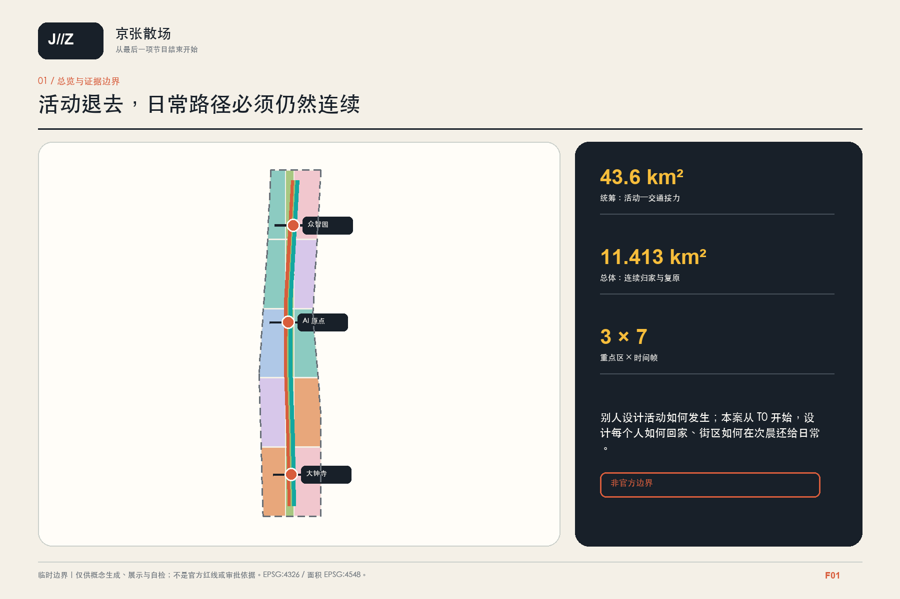
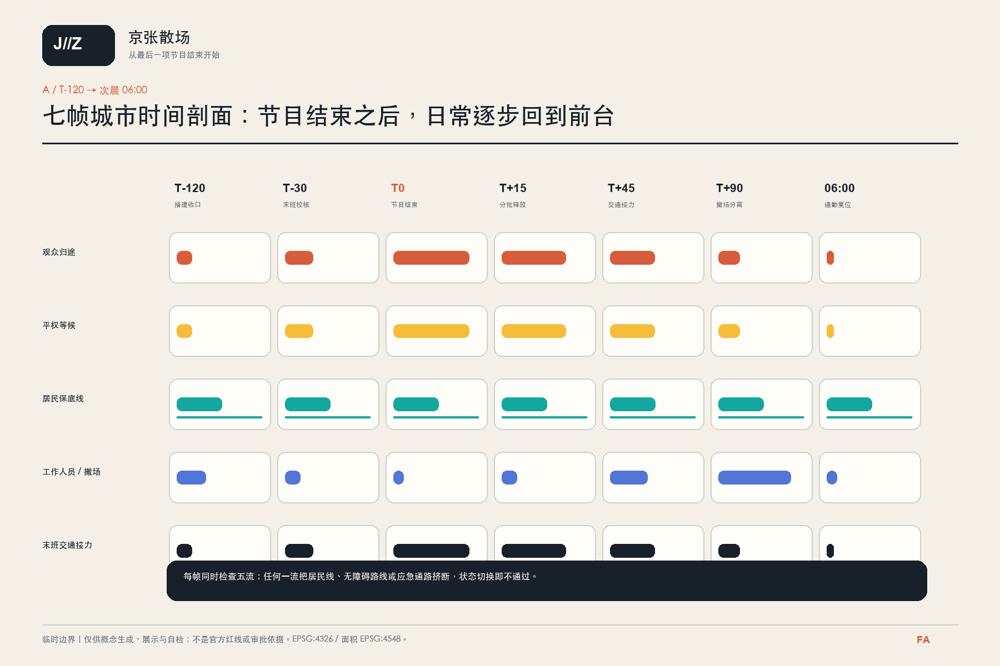
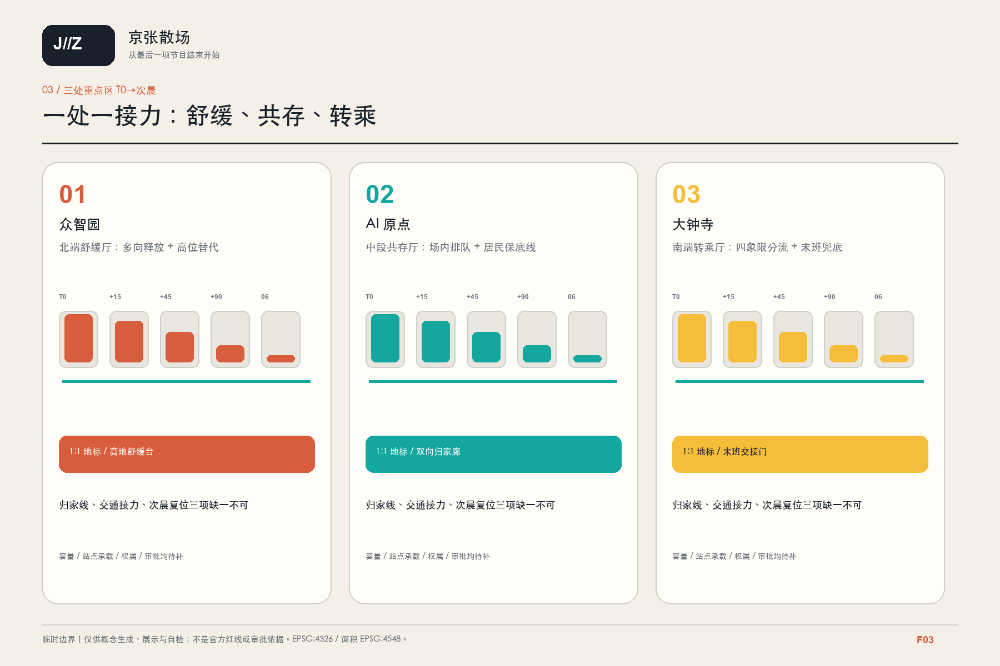
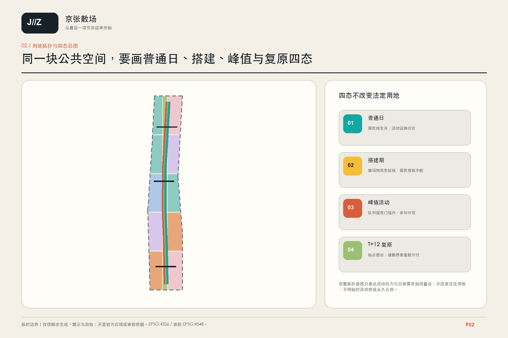
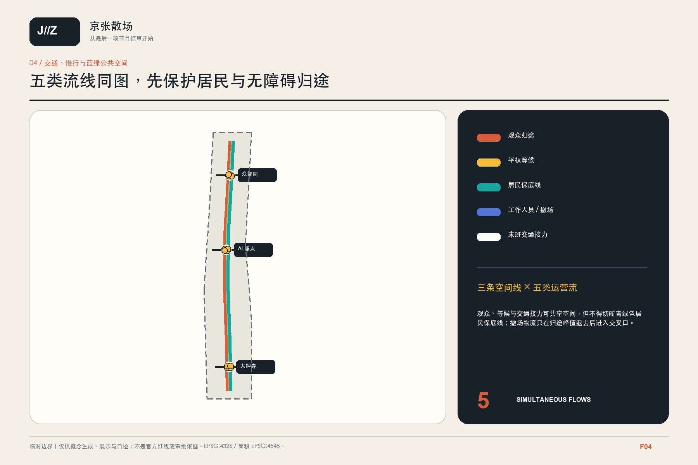
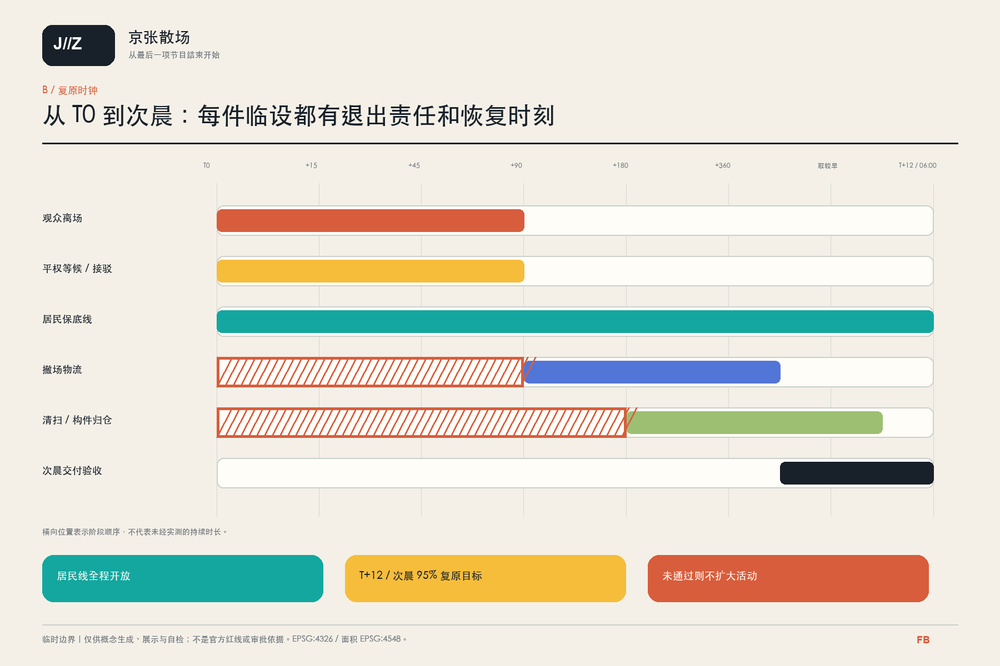
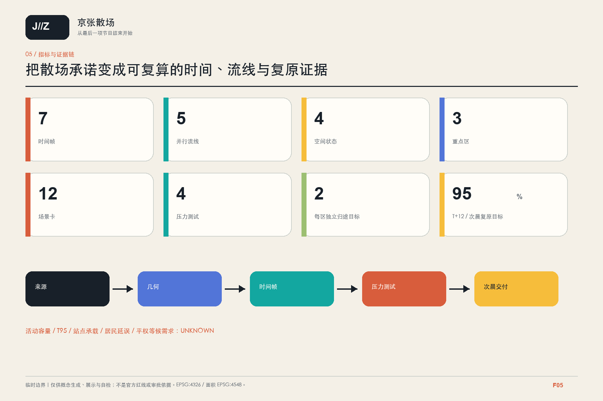

# 京张散场 / AFTER THE APPLAUSE

> 一场世界级 AI 活动，只有在最后一位访客安全离开、社区仍能回家、次晨城市恢复日常时，才真正完成。

本案不把“散场”理解为一套后台调度平台，而把它定义为可画、可走、可演练、可复原的城市设计对象：由 T-120 的搭建收口经过掌声停止的 T0，直到次晨 06:00，以七帧时间剖面持续追踪观众归途、平权等候、居民保底线、工作人员与撤场物流、末班交通接力五类流线。每一帧都同时回答三个问题：人怎样回家，社区怎样不被活动挤出，公共空间怎样恢复普通状态。

## 设计依据与资料清单

官方征集公告要求在约 43.6 平方公里统筹研究范围、约 11.4 平方公里总体设计范围和三处重点区内，统筹 AI 创新生态、城市更新、轨道站城融合、道路微循环、连续慢行与蓝绿空间，并在 AI 原点配置成果展示发布功能、在大钟寺回应国际交往与四象限步行联系、在京张遗址公园组织创新交往和应用展示。由此，“创新活动后的安全离开与日常复原”可以作为城市空间压力测试，但公告没有批准任何具体活动、场馆或人数，本案绝不把世界级活动规模当作既成事实。[source:OFFICIAL-ANNOUNCEMENT] [source:HD-OPEN-CALL-2026] [standard:PROJECT-OFFICIAL-ANNOUNCEMENT]

海淀城市更新导则提出全周期管理、公共空间无界贯通、慢行三网融合、站城融合、无障碍、公共安全和韧性更新；北京市韧性城市空间专项规划强调灵活转换与快速恢复。这些材料支撑“日常优先、事件可逆、次晨复原”的原则，却不能证明任何场地已经具备活动容量、交通承载或应急性能。[source:HD-URBAN-RENEWAL-GUIDE-2025] [source:BJ-RESILIENCE-PLAN-2035] [source:BJ-URBAN-RENEWAL-REG]

证据分为三层：正式可用的公告、法规和任务书支撑任务与原则；政府公开材料和国际案例只支撑机制比较；临时边界只用于生成、图示和自检。当前官方场地多边形、重点区精确边界、控规、权属、站点容量、道路红线、消防、市政、河道与活动许可均为 unknown。图中的淡灰虚线、概念中心线和模块基底不是红线、产权界、疏散认证或建设审批。[source:SOURCE-REGISTRY] [source:BOUNDARY-SOURCE] [depth:existing_conditions_diagnosis]

## 三层范围工作框架

三层范围不是同一张图逐级放大，而是三种不同问题：

| 层级 | 官方口径 | 本案问题 | 成果与边界 |
| --- | --- | --- | --- |
| 统筹研究范围 | 约 43.6 km² | 活动、居住、校园、园区与区域交通如何共同承担“回家” | 机制、案例、角色和数据需求；不计算官方容量 |
| 总体设计范围 | 公告约 11.4 km²；本包临时几何复算 11.413 km² | T-120 至次晨 06:00 的七帧如何落到一条空间骨架 | 四态总图、七帧剖面、五流同图；不是正式规划边界 |
| 三处重点区 | 公告约 368.4 ha | 众智园、AI 原点、大钟寺分别如何舒缓、共存和转乘 | 方向性详细设计、12 场景和项目清单；临时矩形不是地块 |

统筹层提出“安全离开是创新生态的一部分”；总体层形成一脊、三厅、四层、双态结构；重点区层把一个主要矛盾做成可逆样段和压力测试。任何 official polygon 到位后，必须以单一官方源替换临时边界，重新裁切用地、建筑、道路、绿地、公共空间和分期图层，并重算所有面积与比例。[data:geometry/site_boundary.geojson#SITE-001] [data:geometry/key_areas.geojson#PROV-KEY-001] [depth:three_level_scope_framework]

文字范围、网页地图和 OSM 不得被描摹成“官方红线”。官方条件到位前，所有线路均以“概念归途”“待协调入口”或“需专业审查接口”表达，不使用“已打通”“可承载”或“已批准”。[standard:MOHURD-CONTROL-DETAILED-PLANNING] [depth:metrics_recalculation]

## 统筹研究范围产业与未来城市研究

“京张散场”把世界级 AI 创新带重新定义为一条对日常生活负责的事件弹性走廊。英文名 AFTER THE APPLAUSE 不强调庆典本身，而强调掌声之后仍被看见的人：回家的居民、错过第一波列车的访客、需要无障碍协助的人、夜班人员以及负责清运和复位的现场团队。

三大定位是“日常优先的创新活动街区”“多路径回家的站城走廊”“以次晨复原作为验收的公共空间”。五大功能是活动门槛、舒缓口袋、归途扇面、居民保底线和复原仓。标识以一个未闭合的圆环表示活动结束，以一条连续青绿色线穿过圆环并延伸到 06:00；铁锈红只标铁路记忆和活动边界，青绿标归家连续性，黄色标需要人工确认的未知条件。名称和标识不使用组织方、铁路、企业或他人受保护标志。[source:AGENT-TASKBOOK] [standard:PROJECT-AGENT-OPEN-CALL-TASKBOOK] [depth:overall_spatial_structure]

八项一手案例只转译机制，不把异地人数、运力、法规或成效当作海淀证据：

| 来源 | 可转译机制 | 本地禁用边界 |
| --- | --- | --- |
| 英国 HSE 活动人群管理 | 将到达、入场、场内流动、离开和外部疏散视为一条连续链 | 不移植英国人数、密度或许可结论 [source:CASE-UK-HSE-CROWD] |
| 英国 SGSA Green Guide | 活动安全能力受入口、等候、出口、应急、通信和管理中的最弱环节约束 | 不引用其场馆公式认证本项目 [source:CASE-UK-SGSA-GREEN-GUIDE] |
| TfL 伦敦 2012 交通复盘 | 分时监测、到达与离开使用不同站点和方向引导 | 不假设海淀具有伦敦的网络冗余和临时资源 [source:CASE-TFL-EXCEL-2012] |
| Île-de-France Mobilités 巴黎 2024 | 末班服务门廊、无障碍接驳预订、遮蔽等候和延时服务窗口 | 不把赛事接驳规模或预约制替代通用设计 [source:CASE-IDFM-PARIS-2024] |
| Transport for NSW 特别活动指南 | 日常、搭建、峰值、撤场四态交通图和居民沟通 | 不复制 NSW 的活动分类和法定程序 [source:CASE-NSW-SPECIAL-EVENTS] |
| 巴黎公共空间活动与复原要求 | 活动图与复原图成对、临时资产有清单、搭拆时窗明确 | 不宣称所有巴黎活动均能次晨复原 [source:CASE-PARIS-EVENT-RESET] |
| Forum Virium Helsinki 敏捷试点 | 小规模共创、现场测试、评估，并保留不扩展的权利 | 居民不是默认实验对象，试点不等于成功 [source:CASE-FI-KALASATAMA] |
| 新加坡 Punggol ODP | 模块台账、场景模拟、故障记录和可替换接口 | 不建立集中个人监控，不引用前瞻效益为已验证结果 [source:CASE-SG-PDD-ODP] |

相关工作核查显示，京张共行环讨论移动公地，京张相遇公地讨论交往，京张先行讨论人机让行，开放模型回路讨论治理骨架，京张万象工场讨论文化生产。本案只作署名和碰撞边界说明，不复制其文字、图件、路线、协议或活动机制；独有研究对象是以 T0 为轴心、由 T-120 延伸至次晨 06:00 的空间时间剖面和日常复原验收。[source:PEER-MOBILITY-COMMONS] [source:PEER-ENCOUNTER-COMMONS] [source:PEER-PEOPLE-FIRST]

[source:PEER-OPEN-MODEL-LOOP] [source:PEER-CIVIC-FOUNDRY]

## 总体设计范围城市更新与控规深度城市设计

总体结构为“一脊、三厅、四层、双态”。一脊是京张舒缓与复原绿脊，只承担概念分流和连续公共空间，不在未核验时称为疏散通道；三厅是众智园北端舒缓厅、AI 原点中段共存厅、大钟寺南端转乘厅；四层依次为活动门槛、舒缓口袋、归途扇面和居民保底线；双态是普通日与活动日，暴雨、站点失效等进入压力测试而不另造永久“活动城市”。[data:geometry/roads.geojson#ROAD-001] [depth:overall_spatial_structure]

七帧时间剖面以掌声停止的 T0 为轴心，前置两帧校核搭建收口与末班服务，后置四帧追踪归途与复原；每一帧都叠画五类流线，不以单张活动总平面代替时间变化：

| 帧 | 城市状态 | 必须画出的空间问题 | 验收记录 |
| --- | --- | --- | --- |
| T-120 | 搭建收口 | 撤场后勤线、居民旁路和活动门槛是否已经分开 | 临时资产、责任人、封闭面与替代入口清单 |
| T-30 | 末班校核 | 末班服务、无障碍接驳、人工咨询和失效备选是否已确认 | 只发布运营方确认信息；记录未确认接口 |
| T0 | 活动释放开始 | 门槛内排队、居民保底线和应急通道是否同时可见 | 初始人数 N 保持 unknown；记录可用出口和关闭接口 |
| T+15 | 第一波离场 | 舒缓口袋是否吸收短时聚集而不堵住社区入口 | 冲突点、无障碍等待、人工引导位置 |
| T+45 | 转乘峰值 | 多站、多方向和不同方式是否真正分流 | 各方向分配、站外排队、居民延误 |
| T+90 | 最后一程 | 末班服务、落单访客和夜班人员是否仍有照明与人工帮助 | 剩余人数、替代路线、可达厕所和休息点 |
| 次晨 06:00 | 普通日重启 | 通勤、上学、晨练和首班服务能否恢复 | 主要入口、路径、路缘和公共设施复位状态 |

五类流线使用全篇固定图例：A 铁锈红为观众归途；B 亮黄色为平权等候与无障碍协助；C 青绿色为居民保底线；D 蓝色为工作人员与撤场物流；E 深灰色为末班交通接力。应急通路作为独立法定安全约束叠加保护，不被归入活动运营流。五流必须在七帧同图中显示交叉、分离、等待和关闭，不能把服务流藏在图外。[depth:traffic_rail_slow_parking] [depth:municipal_new_infrastructure]

四态总图补充表达普通日、搭建态、活动峰值和复原态的用地与公共空间转换；只有在普通日仍有价值、活动日可逆、失败时可关闭的设施才进入项目清单。[metric:time_frame_count] [metric:state_plan_count]

## 重点区域详细设计

三处重点区均在临时索引框内做方向性设计，框边不是道路、地块或权属红线。每区按照定位、空间结构、建筑更新、交通慢行、公共空间、场景、地标、项目与风险展开。[data:geometry/key_areas.geojson#PROV-KEY-002] [depth:three_key_area_detailed_design]

### 众智园：北端舒缓厅

定位是“可退可留的花园式散场前庭”，不是未经批准的主会场。空间从活动门槛进入高位舒缓绿地，再拆分为步行、骑行及待核验接驳方向；清河低位路径在暴雨或管理关闭时不得成为唯一归途。S05“多向到达”与 S06“高位舒缓”形成可逆样段，T02 负责检验低位路径关闭。建筑只建议复用合法既有首层或可拆雨棚，永久新增面积、消防容量和接驳规模保持 unknown。

地标“高位归家灯架”是一组可拆的方向与关闭状态标识，服务居民和访客，不采集身份；其具体位置须避开河道管理、重要树木和现状工程条件。它不是批准建筑，也不承诺广告、品牌或商业运营。

### AI 原点：中段共存厅

定位是“活动发生但日常不退场”的校园—社区共存核心。发布和排队首先在活动用地内部消化，五道口、清华东路西口及其他合法方向形成扇形分流；居民、学生和夜班人员拥有不穿越活动队列的保底归家线。S07“场内排队”、S08“多站分流”、S09“居民保底归家”与 T01、T04 共同验证晚高峰叠加和无障碍设备失效。

清华园站设置“静默边缘时间标”，只在主管部门确认的文保范围外表达 T0 至 06:00 的城市时间，不附着文物本体、不承担高密度等候。保护范围的网页文字不能数字化成正式控制线，任何修缮、照明、活动和新构筑物均待文保审批。[source:BJ-QHY-HERITAGE-STATUS] [source:BJ-QHY-PROTECTION-2026]

### 大钟寺：南端转乘厅

定位是“城市四象限归家门厅”。企业活动门槛内部容纳排队，路口四象限分别连接经核验的轨道、步行、骑行及其他方式；居民归家线与网约车、非机动车停放、装卸撤场分开。S10“四象限散场”、S11“最后一班车门廊”、S12“次晨复位”与 T03 共同检验单一站口失效。

地标“四向复位钟”只显示开放方向、下一次人工复核和普通状态是否恢复，不显示个人轨迹或虚构列车信息。站点出入口、信号配时、末班车、运力和地下工程均须由运营方与交通专业确认。

## AI 创新生态、人才画像与 AI+ 场景

画像是设计构造，不是已经完成的居民调查。六类核心使用者及其不可被牺牲的需求如下：[source:LAW-BARRIER-FREE-2023] [depth:municipal_new_infrastructure]

| 画像 | 掌声之后的任务 | 空间需求 | 不可接受结果 |
| --- | --- | --- | --- |
| 外地访客与开发者 | 找到下一段合法归途 | 多方向导向、人工咨询、可达厕所 | 被单一应用或单一站点锁定 |
| 周边居民 | 在活动同时正常回家 | 连续保底线、社区入口不排队 | 因活动永久绕行或无法入户 |
| 学生与校园员工 | 穿越校区—社区边界 | 分时开放、夜间照明、安静路径 | 把校园内部道路假定为公共通道 |
| 轮椅使用者、老人和照护者 | 获得同等离场和等候选择 | 无台阶路线、休息、人工协助 | 只提供预约接驳而无通用路线 |
| 夜班与活动工作人员 | 最后一程、交接和休息 | 晚间门廊、饮水、厕所、可见求助 | 最后一位工作人员被留在无服务空间 |
| 现场总控、保洁与应急人员 | 关闭、清运、复位和签收 | 独立服务流、实体停机、复原清单 | 只能等待远程模型判断 |

12 张场景卡中 T01—T04 是 AI 辅助的受控验证场景，先做影子模拟、人工走读和小规模演练；S05—S12 是公共空间场景。AI 只处理经授权的匿名汇总计数、设施状态、天气与时刻，不做人脸识别、个人轨迹留存或居民风险评分。

| ID | 场景 / 区域 | AI 与数据边界 | 人工接管 | 可核验输出 |
| --- | --- | --- | --- | --- |
| T01 | 晚高峰与活动叠加 / AI 原点 | 匿名方向计数；N、C(t) 保持变量 | 现场总控改变释放节奏 | T95 区间、居民延误、冲突点 |
| T02 | 暴雨关闭低位路径 / 众智园 | 官方天气和路径开闭状态；不预测个人 | 水务与现场人员实体封闭 | 高位替代路线和单点失效 |
| T03 | 单一站口或站点失效 / 大钟寺 | 仅使用运营方确认状态 | 交通人员启用替代导向 | 剩余人数、候车空间和替代时间 |
| T04 | 无障碍设备失效 / AI 原点 | 设施状态和人工审计；不推断残障身份 | 人工陪同并关闭错误推荐 | 无台阶替代路线完整性 |
| S05 | 多向到达 / 众智园 | 只发布入口状态 | 人工保留非数字入口 | 活动门槛外排队长度 |
| S06 | 高位舒缓 / 众智园 | 匿名占位区间 | 人工控制释放和关闭低位路 | 两条独立归途是否成立 |
| S07 | 场内排队 / AI 原点 | 活动票务不进入城市模型 | 场地方保留场内等候 | 城市人行道零永久占用 |
| S08 | 多站分流 / AI 原点 | 站点能力必须来自运营方 | 人工更换导向牌 | 各方向负荷区间而非承诺运力 |
| S09 | 居民保底归家 / AI 原点及全线 | 只记录匿名阻塞事件 | 社区可一票否决占用 | 归家线连续率和绕行系数 |
| S10 | 四象限散场 / 大钟寺 | 匿名过街流和信号状态 | 交警、站方与现场总控优先 | 四象限冲突和等待区 |
| S11 | 最后一班车门廊 / 大钟寺 | 只显示经确认服务信息 | 人工咨询、休息和合法替代方式 | 剩余访客与无障碍等候需求 |
| S12 | 次晨公共空间复位 / 全线 | 设施、垃圾、照明和开放状态 | 多方现场签收 | 06:00 可用面积与残留阻塞 |

场景不以模型准确率单独放行。每张卡必须同时有授权主体、数据最小化、人工停止、非数字替代、普通日价值和失败撤除条件；未满足任一项就不进入公共空间。[metric:scenario_count] [metric:test_scenario_count]

## 用地、建筑规模与拆改留方案

用地层以 15 个无缝无叠概念单元覆盖临时总体边界，表达活动门槛、居民日常、公共服务、AI 发布与受控测试、校园共用和京张舒缓绿脊的需求关系，不改变任何现行用地性质。普通日、搭建态、活动峰值和复原态使用同一用地底图，只改变可逆设施、开放时段和流线，不以活动需要推动大拆大建。[data:geometry/land_use.geojson#LU-001] [standard:MNR-LAND-USE-CLASSIFICATION-GUIDE] [depth:land_use_layout]

建筑图层的 18 个模块基底合计概念占地 3.84 ha、占临时范围 0.34%，仅用于检验排队前厅、晚间门廊、复原储物和可逆雨棚的邻接，不对应真实建筑。拆改留采用证据门：已核实安全、合法且不涉敏感约束时优先保留与共享；存在明确日常收益时再做轻改造；临时需求只用可拆模块；拆除、新建、层数、高度、总建筑面积和容积率全部保持 unknown。[data:geometry/buildings.geojson#BLDG-001] [metric:building_footprint_area_sqm]

涉及清华园站、铁路遗存、重要树木、水系、轨道、市政或消防的对象先保护并等待专业条件。缺正式建筑测绘和产权时，不把任何概念矩形写成既有建筑，也不从占地反推开发规模。[depth:retain_renovate_demolish] [depth:height_massing_character] [depth:development_intensity_controls]

## 交通、轨道、市政与公共服务设施

交通设计坚持五流同图，但不把五流等同于五条永久专用道路。观众归途在 T0 后逐级分散；平权等候不得依赖单一电梯或预约服务；居民保底线全程连续；工作人员与撤场物流只在归途峰值退去后进入交叉口；末班交通接力只使用运营方确认的轨道、公交、骑行及合法替代节点。应急通路始终作为额外约束保持畅通。概念路网共 6 条中心线、总长 29.75 km，只表达接口关系，不代表道路等级、红线、站口能力或工程线位。[data:geometry/roads.geojson#ROAD-001] [metric:movement_network_length_m] [depth:traffic_rail_slow_parking]

五道口、清华东路西口和大钟寺分别绘制站口外部等候、方向分流、非机动车停放、居民旁路和单点失效方案。任何“不同站到达、不同站离开”的策略都必须在真实站点入口、列车间隔、末班车、站外空间和运营方应急计划到位后重新计算；当前不得声称轨道有富余运力。[source:CASE-TFL-EXCEL-2012] [source:CASE-IDFM-PARIS-2024]

市政与公共服务优先提供照明、饮水、无障碍厕所、休息、实体导向、临时电源、可拆围挡、垃圾分类、复原储物和人工求助。设施采用本地离线优先和最少数据，失网时仍能用纸牌、固定标识和现场人员维持基本服务。消防、医疗、排水、临电、临建和夜间噪声必须由相应专业审批，本案不以通用模块替代专业设计。[depth:municipal_new_infrastructure]

## 蓝绿空间、公共空间与城市风貌

京张遗址公园是城市记忆和日常公共生活的连续载体，不被定义为活动排队区或后勤通道。已建一期与在建二期状态分别引用，不能把 2026 年 3 月的建设预期写成 8 月已经全部贯通。清河、小月河的现有和已批项目作为接口条件，本案只补充高位替代、关闭提示、居民旁路和次晨复原，不重复设计或虚构水利绩效。[source:JZ-PARK-P1-2023] [source:JZ-PARK-P2-STATUS-2026] [depth:blue_green_public_space]

概念绿地 112.8 ha、占临时范围 9.89%；概念公共空间 55.2 ha、占 4.84%。两层可能重叠，不能相加成“开放空间率”。低位亲水面可在普通天气服务日常游憩，但任何活动散场都必须有不依赖低位路径的高位方案；河道管理线、设计水位和关闭阈值保持 unknown。[data:geometry/green_space.geojson#GREEN-001] [data:geometry/public_space.geojson#PUBLIC-001] [metric:green_ratio]

城市风貌以“铁路时间—城市归途”为叙事：保留铁锈红的轨道记忆，用青绿连续线表现普通人的回家，用 06:00 刻度表现公共空间复原。三座概念地标为众智园“高位归家灯架”、AI 原点“静默边缘时间标”、大钟寺“四向复位钟”。它们都是可逆、无广告、无个人识别的公共说明设施；位置、尺寸、照度、文保和建设审批均未确定。[standard:MOHURD-URBAN-DESIGN-MEASURES] [metric:landmark_count]

## 更新项目清单、实施政策与分期计划

项目清单以证据依赖而不是虚构年份推进：[depth:renewal_project_list] [depth:phasing_implementation]

| 编号 | 项目 | 首要空间对象 | 阶段与放行条件 |
| --- | --- | --- | --- |
| P00 | 官方资料与共同基线 | 边界、站口、居民入口、河道、文保和客流 | 近期；资料未齐不得进入容量设计 |
| P01 | 七帧五流现场走读 | T-120 至 06:00 的真实路径和阻塞 | 近期；居民、无障碍使用者、站方和应急共同参加 |
| P02 | 众智园高位舒缓样段 | 高位替代、低位关闭、分布式归途 | 可逆试点；通过 T02 后再评估 |
| P03 | AI 原点场内门槛与保底线 | 场内排队、多站分流、居民旁路 | 可逆试点；权属与校园管理同意 |
| P04 | 大钟寺四象限转乘样段 | 过街、站外等候、骑行和路缘 | 联合测试；站方与交通专业审查 |
| P05 | 最后一班车门廊 | 无障碍等候、厕所、饮水、人工咨询 | 轻型设施；服务信息必须实时确认 |
| P06 | 遗产静区与蓝绿关闭界面 | 文保外缘、高低双路、实体关闭 | 专项审查；文保与水务条件到位 |
| P07 | 活动复原仓与路缘复位包 | 可拆设施、垃圾、装卸、清扫 | 先做清单和纸牌演练，再决定实体空间 |
| P08 | AFTER THE APPLAUSE 年度演练 | 四项压力测试、公开复盘、停止或改进 | 概念运营；每次活动单独许可，不承诺固定频率 |

近期只做资料、走读、纸牌演练和 1:1 可逆标识；中期在获得场地与运营授权后测试三厅；长期永久工程必须等待控规、权属、交通、消防、市政、文保和水务审批。任何资金、实施主体、采购、活动日历和招商安排均为 unknown，不写成政府承诺。[data:geometry/phasing.geojson#PHASE-001] [metric:phase_count]

长期运营不是建立新的城市 OS，而是保留一份可审计的活动图、归家图、撤场图和复原签收表。每次演练必须公开哪些路径失败、哪些 unknown 已补齐、哪些设施应撤除；Helsinki 的“允许不扩展”和巴黎的成对活动/复原计划只作为方法参照。[source:CASE-FI-KALASATAMA] [source:CASE-PARIS-EVENT-RESET]

## 指标体系、面积复算与合规矩阵

指标分为可复算设计量、方案服务目标和必须保持 unknown 的运营或法定量：[depth:metrics_recalculation]

| 类别 | 指标 | 当前表达 |
| --- | --- | --- |
| 可复算设计量 | 临时总体范围 | 11.413 km²；须随 official polygon 重算 [metric:site_area_sqm] |
| 可复算设计量 | 场景、时间帧、画像、地标 | 12 场景、7 帧、6 画像、3 地标；是清单数量，不是实施成效 |
| 方案服务目标 | 独立归途 | 每个重点区不少于 2 条相互独立的概念路线；合法性和能力待核验 [metric:independent_route_target_per_key_area] |
| 方案服务目标 | 居民保底线 | 1 条连续概念线；选定 OD 绕行系数目标不大于 1.30 [metric:resident_detour_ratio_target] |
| 方案服务目标 | 无障碍连续性 | 指定路线 100% 无台阶；具体尺寸依适用标准和现场复核 [metric:step_free_route_continuity_target] |
| 方案服务目标 | 复原 | 临时占用面积至少 95% 在 T+12 或次晨首个通勤高峰前恢复，以较早者为准 [metric:recovery_area_target_ratio] |
| 必须 unknown | 批准活动容量 | 入口、等候、出口、应急、交通、人员管理最弱环节资料均缺失 |
| 必须 unknown | T95、居民延误、无障碍等候需求 | 只有授权活动、实测流量和自愿需求资料后才能计算 |
| 必须 unknown | 站点吞吐、FAR、高度、总建面、拆除、投资 | 无运营方数据、控规、测绘、权属或审批 |

SGSA 的“最弱环节”只被转译为放行逻辑：候选能力取入口、等候、出口、应急、交通接续和现场管理中经本地专业确认的最小值；所有分项未确认前，approved_event_capacity 仍为 unknown，不能填一个看似精确的数字。[source:CASE-UK-SGSA-GREEN-GUIDE] [metric:approved_event_capacity]

四项压力测试与一项次晨复原门均报告输入变量、结果区间和失败位置，不出具安全认证：

| 测试 | 条件 | 主要输出 | 不通过时 |
| --- | --- | --- | --- |
| PT-01 晚高峰叠加 | 活动人数 N 与日常流 C(t) 均作区间 | T95、居民延误、冲突热区 | 降低释放速率、减少活动规模或停止 |
| PT-02 暴雨关闭低位路 | 关闭一条滨水低位路径 | 高位替代、无障碍连续、积压位置 | 低位路不得进入活动归途 |
| PT-03 单一站口失效 | 关闭一个关键站口或站点 30 分钟 | 剩余人数、等候、替代方向 | 不允许单站作为唯一出口 |
| PT-04 无障碍设备失效 | 一处电梯、坡道或门禁不可用 | 无台阶替代与人工协助时间 | 未形成替代路线则不放行 |
| RG-01 次晨复原门 | T+360 与次晨 06:00 二者较早时仍有围挡、垃圾、装卸或损伤 | 该较早时点的可用面积、残留阻塞 | 缩小临时占用并暂停下一次试点 |

合规矩阵必须把公告任务、13 个正文章节、七张图、九个空间图层、指标、假设和自检逐项挂接。建筑专业深度文件当前仍是 data_gap，不得用概念剖面冒充施工图或安全审核。[standard:MOHURD-ARCH-DESIGN-DEPTH-2016] [standard:MOHURD-CONTROL-DETAILED-PLANNING]

## 风险、版权与合规说明

以下数据必须在正式专业深化前保持 unknown：活动类型、频率、法定分类与最大人数；场地真实出入口、安检、消防和医疗；地块、道路、公园、校园及园区的权属和开放许可；居民入口、夜间归家 OD 和安静时段；站口吞吐、列车间隔、末班服务与运营方预案；公交、出租、网约车和非机动车供需；道路红线、信号配时、交通流量和事故数据；京张公园二期竣工状态与竣工图；清华园站正式文保矢量；清河、小月河管理线、设计水位和关闭规则；无障碍设施、照度、噪声和排水实测；警务、消防、医疗、保洁、临时存储和撤场资源。[depth:risk_missing_data]

主要风险采用“先不做不可逆动作”的应对：权属不明则不画成公共通道；站点容量不明则不承诺人数；河道条件不明则低位路不作为唯一归途；文保边界不明则地标退到待确认外缘；消防与临建条件不明则只做纸牌演练；居民意见未取得则画像不能代替公众参与。

AI 场景默认不采集人脸、不保留个人轨迹、不推断残障身份、不做居民风险评分。匿名计数也必须说明目的、最短保留期、访问者和删除方式；现场人员拥有停止权，所有关键服务保留非数字入口。

政府网页和国际机构资料仅作署名引用、事实转述和机制比较，不复用照片、地图、Logo、版式或长段文字。五项 peer 仅作碰撞审查和署名；COMMUNITY-DISPLAY-ONLY 内容不复制或改编，CC-BY-SA-4.0 的京张万象工场也不形成衍生作品。本案新增文字与原创图件以 CC-BY-4.0 发布，完整许可和生成说明见 report/copyright_statement.md。[source:PEER-MOBILITY-COMMONS] [source:PEER-CIVIC-FOUNDRY]

本案不声称官方批准、活动许可、安全认证、审定控规、最终土地权属、确定建设规模、交通承载或保证实施。known 只表示本包内部可复算，绝不等于法定已知或现场已验证。

## 参考资料

1. 北京市规划和自然资源委员会海淀分局，《百年京张 AI 创新带城市设计国际方案征集资格预审公告》，2026。[source:OFFICIAL-ANNOUNCEMENT]
2. 开源征集场地包、来源注册表与面向智能体任务书。[source:SITE-PACKAGE] [source:SOURCE-REGISTRY] [source:AGENT-TASKBOOK]
3. 北京市海淀区人民政府，《海淀区城市更新导则（2025 年版）》与《实施指引》。[source:HD-URBAN-RENEWAL-GUIDE-2025]
4. 北京市文物局清华园站文保资料；北京市园林绿化局和市政府京张遗址公园建设资料。[source:BJ-QHY-HERITAGE-STATUS] [source:JZ-PARK-P1-2023] [source:JZ-PARK-P2-STATUS-2026]
5. 《北京市韧性城市空间专项规划（2022—2035 年）》与《中华人民共和国无障碍环境建设法》。[source:BJ-RESILIENCE-PLAN-2035] [source:LAW-BARRIER-FREE-2023]
6. UK Health and Safety Executive，Crowd management controls；Sports Grounds Safety Authority，Green Guide。[source:CASE-UK-HSE-CROWD] [source:CASE-UK-SGSA-GREEN-GUIDE]
7. Transport for London，Travel in London Report 5。[source:CASE-TFL-EXCEL-2012]
8. Île-de-France Mobilités，Paris 2024 accessible shuttle and transport service material。[source:CASE-IDFM-PARIS-2024]
9. Transport for NSW，Guide to Traffic and Transport Management for Special Events。[source:CASE-NSW-SPECIAL-EVENTS]
10. Ville de Paris，public-space event and reinstatement guidance。[source:CASE-PARIS-EVENT-RESET]
11. Forum Virium Helsinki 敏捷试点方法；GovTech Singapore / Punggol Digital District ODP。[source:CASE-FI-KALASATAMA] [source:CASE-SG-PDD-ODP]
12. Mobility Commons、Encounter Commons 与 People First 的完整名称、作者、许可和用途边界见 `sources.json`；仅用于碰撞审查与署名。[source:PEER-MOBILITY-COMMONS] [source:PEER-ENCOUNTER-COMMONS] [source:PEER-PEOPLE-FIRST]

13. Open Model Loop 与 Civic Foundry 同样只作相关工作引用；本案不复制或改编其文案、图件或机制。[source:PEER-OPEN-MODEL-LOOP] [source:PEER-CIVIC-FOUNDRY]

完整 URL、访问日期、用途、转译方法和限制见 sources.json；完整指标与任务覆盖见 metrics.json、compliance_matrix.json、standard_matrix.json 和 design_depth_matrix.json。
