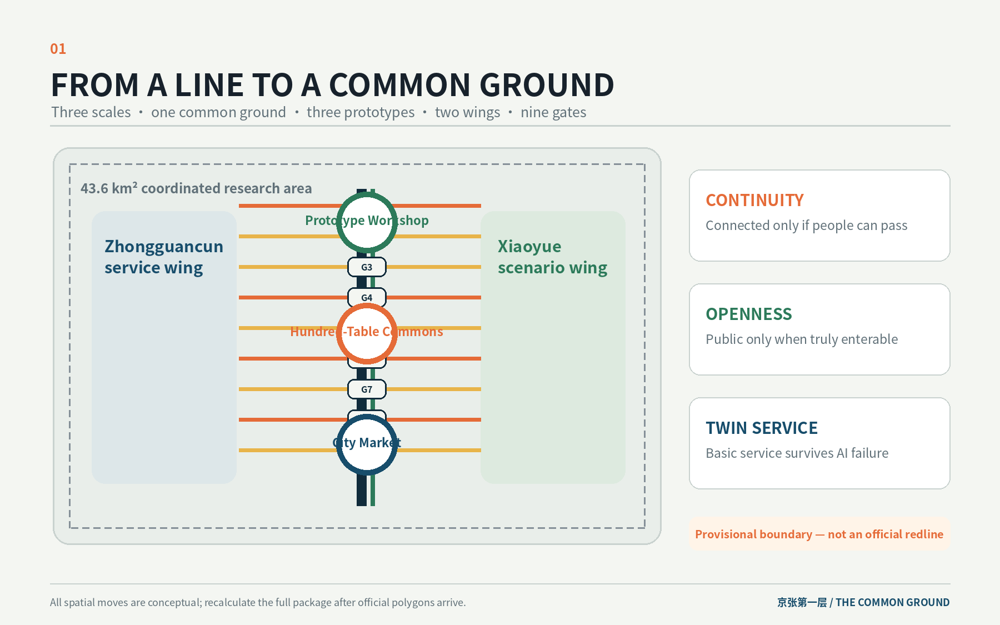
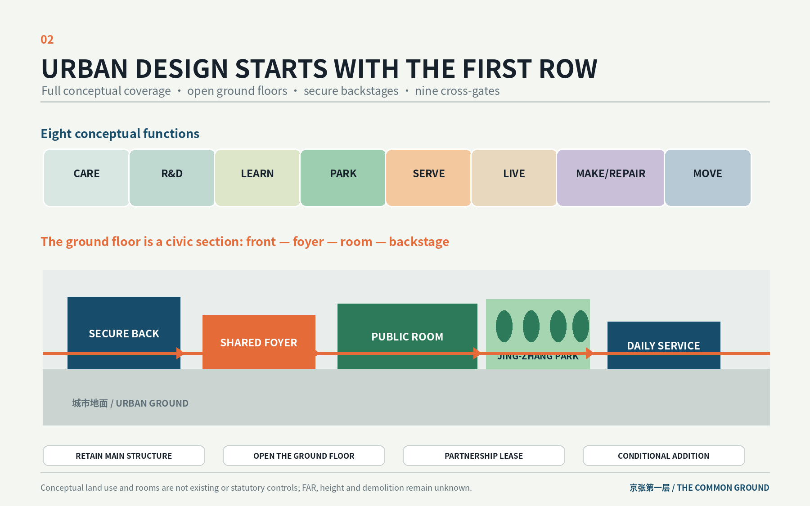
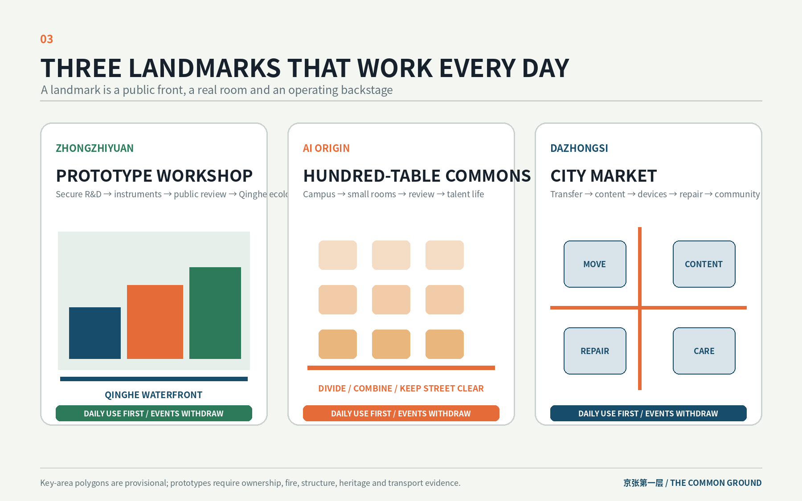
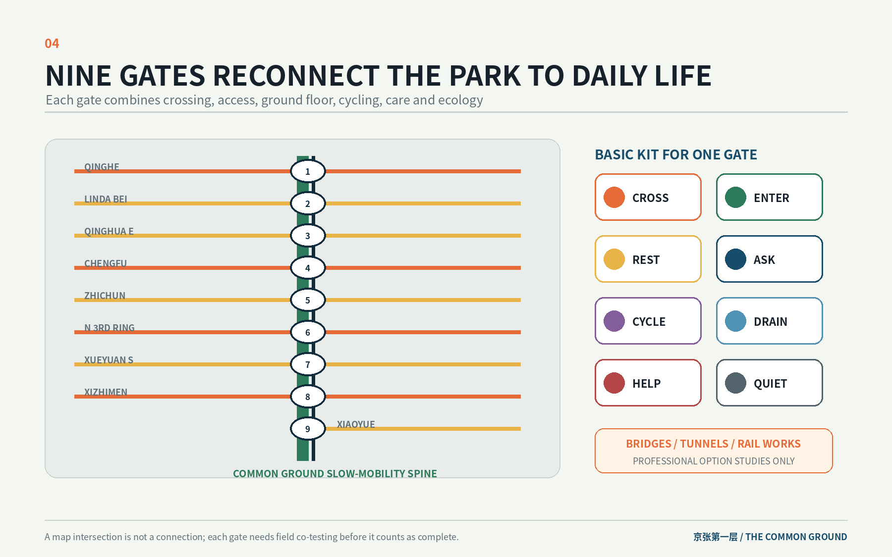
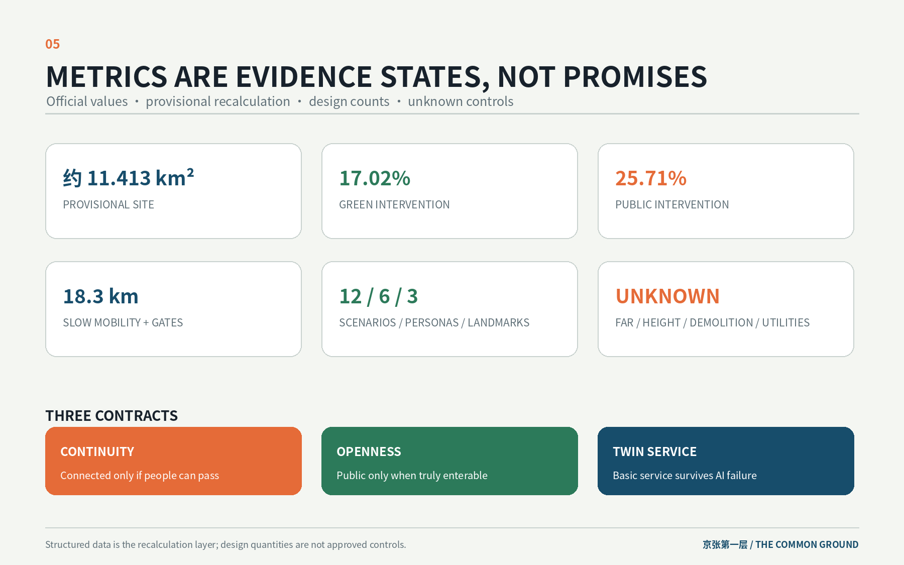

# THE COMMON GROUND / 京张第一层

> A century ago, the Jing-Zhang Railway connected the city to distant places. Today, The Common Ground reconnects the park, campuses, innovation compounds, neighbourhoods and stations through one accessible, shared and caring urban ground.
>
> This is an open co-creation proposal. It does not replace statutory planning and does not constitute government approval, investment commitment or engineering feasibility. Every spatial move is a conceptual suggestion and a reference scheme for professional teams to deepen.

## Design Basis and Source Inventory

The proposal begins by acknowledging that the site already has a powerful north-south public armature: the railway heritage, the emerging linear park, and its relationship to universities, workplaces, neighbourhoods and transit stations. The 11.4-square-kilometre provisional design area is not treated as a blank slate, and AI is not reduced to screens, robots or a city brain. The real design task is the first row of blocks beside the park: ground-floor entrances, crossings, station corners, back-of-house routes, river edges and ordinary services. Only when these daily interfaces become continuous can AI innovation operate as a civic capacity rather than an enclave asset. [source:OFFICIAL-ANNOUNCEMENT] [standard:MOHURD-URBAN-DESIGN-MEASURES]

Sources are used at four levels. The official announcement and the cleared Agent taskbook define the three scales, Three Areas and Two Wings, six required tasks and wording boundaries. National standards define urban-design purpose, the boundary between statutory control and concept design, and land-use terminology. Repository polygons are used only for generation, display and intake self-check. International cases support method comparison only. FAR, height, road redlines, heritage GIS, ownership, existing-building surveys, utility capacity and engineering conditions remain unavailable, so the package does not manufacture certainty. [source:SOURCE-REGISTRY] [data:geometry/constraints.geojson]

The submitted `SITE_BOUNDARY` and three `KEY_AREA` polygons are repository-maintained provisional geometry inferred from textual limits, location clues and approximate official areas. They are not official redlines and cannot support approvals, ownership, precise-area claims or statutory controls. Once official polygons arrive, the boundary, land use, buildings, roads, green space, public space, phases, metrics, five figures, HTML and PDFs must all be regenerated. [source:BOUNDARY-SOURCE] [metric:site_area_sqm]

## Three-Level Scope Framework

The 43.6 km² coordinated research area addresses how innovation resources cooperate: the Zhongguancun service wing, university clusters, Zhongzhiyuan, AI Origin, Dazhongsi, Xiaoyue River and transit hubs. The 11.4 km² overall design area addresses how the first urban layer becomes continuous through conceptual land use, active ground floors, walking, cycling, blue-green systems and public services. Only the 368.4-hectare set of three key areas enters ground-floor rooms, front/back interfaces, cross-gates, projects and daily/event states. [depth:three_level_scope_framework] [data:geometry/key_areas.geojson#PROV-KEY-002]

The single structure is “one common ground, three ground-floor prototypes, two support wings, nine gates and twelve rooms.” The common ground is not one paving treatment or another landscape axis. It is a shared operating layer across the heritage park and the first row of blocks. The three prototypes support public-facing R&D, near-campus co-creation and urban adoption. The nine gates reconnect the longitudinal park to daily east-west movement. The twelve rooms place AI scenarios inside real spaces with operational backstages rather than scattering devices throughout the park. [depth:overall_spatial_structure] [data:geometry/roads.geojson#ROAD-001]

Three design contracts guide every scale. The continuity contract says that a line counts only when wheelchair users, prams, pedestrians and cyclists can actually pass. The openness contract says that a ground floor counts as public only when it can be entered during declared hours without insider access or compulsory spending, or when public conditions are explicit. The twin-service contract says that high-impact AI services must retain a human or non-AI equivalent; the basic spatial service cannot collapse when automation fails. These are design rules, not claims that existing facilities already comply. [standard:BARRIER-FREE-ENVIRONMENT-LAW] [metric:cross_gate_count]

## Industry and Future-City Strategy for the Coordinated Research Area

The name “THE COMMON GROUND / 京张第一层” refers simultaneously to the physical ground, the building ground floor and a civic baseline. The mark is a north-south void opened by three lateral doors: the void represents the railway line and the three openings represent the three prototypes. Ballast Grey, Park Green, Signal Orange and Night Blue form the palette. Wayfinding leads with real place names, walking minutes, accessibility status and opening hours; the brand remains secondary and does not imitate company marks, tickets or cartoon robots. [source:AGENT-TASKBOOK]

The three positionings become usable interfaces. The Centennial Jing-Zhang Cultural Belt keeps authentic rail, station and engineering narratives inside arrival, walking and working spaces. The Metropolitan AI Life Experience Belt operates through nine gates, community services and twelve rooms that remain useful outside major events. The AI Integrated Innovation Belt links secure R&D backstages, public review fronts, open desks, repair loops and city scenarios through short walking chains. The five functions are distributed across the Three Areas and Two Wings: Zhongzhiyuan supports full-stack R&D and controlled trials; AI Origin supports open review and talent life; Dazhongsi supports content, devices, repair and adoption; Zhongguancun supplies professional services; Xiaoyue supplies ecological and daily-life scenarios. [standard:PROJECT-AGENT-OPEN-CALL-TASKBOOK]

| Element | Space on the common ground | Operating boundary |
| --- | --- | --- |
| Land and space | first-row compounds, street ground floors, station corners and conditional opportunity sites | survey, lease and adapt first; no expropriation or land-disposal promise |
| Industry | R&D backstage–public review–open desks–device/content–repair and reuse | no invented company list, investment or output value |
| Finance and services | eight venture clinics, instruments, short leases and an operating fund | mechanism proposal only, not a fiscal or investment pledge |
| Talent | five-minute work chains, night care, food, learning and family services | talent is not reduced to a single young male engineer persona |
| Compute and data | secure back rooms, booking foyers and controlled trial rooms | booking and R&D data separated; no continuous public identification |
| Scenarios | twelve bounded rooms with staff and maintenance space | voluntary use, human takeover, non-digital alternative and independent stop |

Six global references are translated cautiously. Singapore’s one-north shows the value of coordinating research, transit, housing and public space, but its unified land-development powers are not transferable. Kashiwa-no-ha and UDCK demonstrate the value of a permanent operating space rather than event-only governance. Barcelona 22@ shows that employment, housing, facilities and public space should be reviewed together, while also warning against employment real estate arriving before daily life. King’s Cross demonstrates sequencing a complete station–street–public-space chain before adjacent development. Brooklyn Navy Yard demonstrates why affordable prototyping, production and repair space matters. Rail Corridor and Yangpu Waterfront demonstrate sectional, ecological and everyday differentiation of linear heritage. [source:CASE-ONE-NORTH] [source:CASE-22AT] [source:CASE-NAVY-YARD]

Connections to Beiwei Community, Future Science City, Huairou Science City, Beijing E-Town and the Beijing-Tianjin-Hebei region are framed only as potential research, standards, prototyping, scenario-recognition and talent-service interfaces. The planning innovation is not a new totalising city brain, but one drawing that aligns industry, public space, ground-floor operation, ordinary services and exit conditions so professional teams can deepen the work gate by gate and room by room. [depth:existing_conditions_diagnosis]

## Urban Renewal and Regulatory-Plan-Depth Urban Design for the Overall Design Area

The overall design uses the heritage park as a north-south public spine while moving design attention to the first row of blocks and nine cross-gates. The provisional area is fully partitioned into community and care, AI R&D and prototyping, education and open learning, park and blue-green ground, industry services and shared work, housing and talent life, culture/content/repair, and mobility interfaces. Codes follow the national classification subset. The partition expresses desired functional mix and does not claim existing or approved land use. [data:geometry/land_use.geojson#LU-004] [standard:MNR-LAND-USE-CLASSIFICATION-GUIDE]

The nine gates correspond conceptually to Qinghe Waterfront, Lindabeilu, Qinghua East, Chengfu, Zhichun, North Third Ring, Xueyuan South, Xizhimen and Xiaoyue ecology connections. Each gate must coordinate crossing, accessibility, active ground floors, cycle parking, shade and rest, human service and stormwater ecology; at least four functions should be solved before the gate advances. Current lines express design intent and are not road redlines. Exact positions and engineering conditions require as-built drawings and field co-testing. [data:geometry/roads.geojson#DOOR-04] [metric:slow_mobility_network_m]

Building work uses five verbs: retain the main structure, open the ground floor, establish a partnership lease, add a lightweight conditional structure, or hold for professional confirmation. Twelve small footprints describe room and backstage relationships only; they are not surveyed buildings, ownership parcels or approved construction. Without structural, fire, heritage and ownership information, no demolition conclusion is made. FAR, height, density, setbacks and total floor area remain unknown. [depth:retain_renovate_demolish] [metric:floor_area_ratio]

Three section types guide urban form. The waterfront R&D section sequences habitat buffer, accessible path, stormwater terrace, public front and secure R&D backstage. The near-campus section sequences walking, cycling, small workrooms, the Hundred-Table Commons, professional clinics and night care. The station-market section first delivers four-corner at-grade arrival, accessible vertical circulation, cycle parking, shelter and enterable ground floors; bridges, tunnels, underground space or added massing remain later professional options. [depth:height_massing_character]

## Detailed Design for the Three Key Areas

### Zhongzhiyuan AI Acceleration Area: Prototype Workshop

The northern prototype is not an exhibition hall. It is a continuous block section of secure R&D backstage, shared-instrument foyer, public review front and Qinghe ecological waterfront. Visitors arrive from transit and the park, while equipment and logistics enter from an independent service side. Daily use includes booking, review, food and riverside rest. Open days add removable displays only to the public front; the secure boundary remains fixed. [data:geometry/key_areas.geojson#PROV-KEY-001] [data:geometry/public_space.geojson#PUBLIC-001]

Early conceptual projects include a station–compound–river accessible line, a shared foyer in the first row of buildings, separated public and logistics circulation, a stormwater terrace, dark-habitat edges and a closable testing corridor. The Prototype Workshop is a pilgrimage landmark because it makes the relationship between invention, explanation, trial and stopping physically legible. All building and waterfront moves remain conceptual until ownership, ecology, structure, fire and water conditions are confirmed. [depth:three_key_area_detailed_design]

### Beijing AI Origin Community: Hundred-Table Commons

The middle prototype is a five-minute chain from campus gate to small workroom, Hundred-Table Commons, eight venture clinics and talent daily life. Two distributed ground floors provide hourly open desks. The Commons is divided into review, learning and quiet rooms on ordinary days and can combine for events without occupying the street. Legal, compute, recruitment, space and scenario services share a staffed waiting front. The night route connects food, housing, seating, lighting and help points. [data:geometry/key_areas.geojson#PROV-KEY-002] [data:geometry/buildings.geojson#ROOM-05]

The Hundred-Table Commons is the second landmark. People can see how knowledge becomes prototypes, teams and public services, and how disagreement remains subject to human review. Early projects include campus-gate slow-mobility repair, two distributed ground floors, opening-hour and affordability clauses, a night-care chain and cycle parking. Its identity comes from daily use, not event spectacle.

### Dazhongsi AI Industry Cluster: City Market

Dazhongsi combines four station corners, content production, smart devices, repair/returns, night school and community services into a City Market. The design starts with at-grade crossings, accessible vertical routes, shelter, cycle parking and staffed information on all four corners. Accessible content, voluntary trial rooms and repair counters occupy existing ground floors. Freight and event setup use timed peripheral service access and queues cannot block station exits. [data:geometry/key_areas.geojson#PROV-KEY-003] [data:geometry/public_space.geojson#PUBLIC-003]

The City Market is a distributed third landmark, not one object. Commuting, repair, caption and audio-description production, and community service remain operational every day. Launches and screenings use one controlled corner while the other three remain public routes. Bridges, tunnels, rail alteration and added volume stay within later engineering option studies. [standard:MOHURD-CONTROL-DETAILED-PLANNING]

## AI Ecosystem, Personas and AI+ Scenarios

Six personas test every gate and room: university researchers and students; one-person companies and start-ups; hardware engineers and maintenance teams; residents and carers; wheelchair users, older people and sensory-sensitive users; and international visitors and developers. Their needs include review, affordable workrooms, equipment booking, logistics, commuting, food, toilets, seating, quiet routes, human service and clear pathways from a short visit to long-term collaboration. [metric:persona_count]

Twelve scenario cards are anchored in real rooms with staff and maintenance backstages. Four are explicit trials and eight are daily services. Each defines participation, minimum data, human responsibility, non-digital path and independent stop condition. AI has one bounded role rather than becoming the only service entrance. [source:AGENT-TASKBOOK] [metric:scenario_card_count]

| Card | Type and room | AI role and users | Data, human review and stop |
| --- | --- | --- | --- |
| SCN-01 | Test: Prototype Review Hall | presentation and test logging | no passer-by identity; safety officer present; stop if emergency control fails |
| SCN-02 | Test: Low-speed Robot Lane | limited logistics support | time, speed, route and fleet capped; stop if accessibility or fire route is occupied |
| SCN-03 | Test: Qinghe Ecology Window | environmental anomaly prompts | water, temperature, sound and manual species records only; stop on personal-data capture |
| SCN-04 | Service: Shared Instrument Foyer | booking and resource matching | booking separated from research data; staffed verification; stop if secure backstage is breached |
| SCN-05 | Service: Hundred-Table Commons | meeting support, captions and retrieval | public/confidential physical separation; stop event if egress or quiet boundary fails |
| SCN-06 | Service: Distributed Open Desks | desk matching and reminders | no facial gate; staffed front; suspend night opening without staff |
| SCN-07 | Service: Eight Venture Clinics | anonymous queue and knowledge retrieval | professional humans remain responsible; stop without staff or conflict disclosure |
| SCN-08 | Service: Night Care Station | route and environment assistance | no continuous identity tracking; static signs and human help remain; close broken sections |
| SCN-09 | Test: Urban Device Trial Rooms | voluntary indoor trial | no non-participant capture; deletion on site; stop without human after-sales support |
| SCN-10 | Service: Accessible Content Workshop | captions, audio description and translation | authorised material and human final review; stop release if rights or access version is missing |
| SCN-11 | Service: Repair and Circular Counter | diagnostic assistance | local data removal before repair; reject circulation if data or battery safety cannot be secured |
| SCN-12 | Service: Accessibility Relay Desk | navigation is assistance only | field co-test is authoritative; close and repair any unsafe segment without an alternative |

Each landmark includes a Common Ground Plaque system. It records only voluntary, human-verified contributions with public value: open tools, accessibility repairs, mentoring, repair/reuse, public standards and community problem solving. Every entry names the contributor, use, display term, correction and withdrawal route. It is not a personal behaviour score or advertising wall. [metric:pilgrimage_landmark_count]

## Land Use, Building Scale and Retain/Renovate/Demolish Strategy

The conceptual land-use partition completely covers the provisional boundary and supports care, R&D, education, green ground, services, housing, culture and mobility. Green and public-space ratios describe design intervention footprints and may overlap; they are not existing provision or statutory ratios. Geometry-derived metrics use the same package data and retain low or medium confidence. [metric:concept_land_use_area_sqm] [metric:green_ratio]

The twelve rooms receive actions such as opening an existing ground floor, partnership leasing, lightweight conditional addition or retain-and-adapt. Building height remains unknown. Demolition count is also unknown rather than zero because neither demolition nor retention can be professionally confirmed without surveys, ownership, structural, fire and heritage data. Once these arrive, each room must be re-anchored to real buildings and leases. [data:geometry/buildings.geojson#ROOM-11] [metric:demolition_building_count]

Character comes from low, enterable interfaces, clear doors, shelter, repairable materials and closable back rooms. Railway heritage is read as an authentic system rather than repeated sleeper, ticket and spike decoration. AI Origin remains fine-grained; Zhongzhiyuan emphasises R&D courts and ecology; Dazhongsi emphasises commuting, repair, content and night learning. Official height, skyline and heritage impacts require professional deepening. [depth:development_intensity_controls]

## Transport, Rail, Utilities and Public Services

Transport priorities are at-grade continuity, station access, east-west crossing, accessible slow mobility, cycle parking and timed logistics. The nine gates advance only after field co-testing; bridges, tunnels, underground space and rail works remain option studies. Static wayfinding and staffed help make basic arrival possible without an app, account or facial recognition. [depth:traffic_rail_slow_parking] [data:geometry/roads.geojson#DOOR-06]

Each gate receives a basic-service kit: accessible entrance and crossing, shade and seating, water and toilet directions, cycle parking and repair, stormwater overflow, event power and storage, human and digital information, night stewardship and dark-habitat boundaries. Utility capacity is not invented. Compute, charging, energy and communications equipment should remain in maintainable rooms; waste heat, underground capacity and utility load stay unknown pending specialist studies. [depth:municipal_new_infrastructure] [metric:municipal_capacity_index]

## Blue-Green Space, Public Space and Urban Character

The park, Qinghe and Xiaoyue form the ecological substrate. New design adds only necessary interfaces: step-free gates to the park, separation between maintenance and public paths, terraces that can temporarily hold stormwater, dark habitat zones protected from event lighting, and continuous shelter, seating and staffed service. Every public space is designed for at least two states among daily/event, dry/storm, summer/winter and day/night. [depth:blue_green_public_space] [data:geometry/green_space.geojson#GREEN-001]

The three landmarks share five entry tests: usable on ordinary days, at least one public service, a real operating backstage, continuous accessibility and a use after the event leaves. The Prototype Workshop is a waterfront R&D interface; the Hundred-Table Commons is an adaptable ground-floor institution; the City Market is a four-corner station system. Their identity does not depend on a giant screen, tower or entertainment IP.

The cultural narrative has three layers: track, gate and room. The track preserves the railway’s authentic engineering timeline. The gate converts a formerly divisive linear corridor into an entry interface. The room expresses Zhongguancun’s culture of making, review, repair and shared learning. International copy reads: “From a line that connected the nation to a common ground that connects people, knowledge and daily life.” Only rights-cleared fonts, original graphics and real place names are used.

## Renewal Projects, Policies and Phasing

Projects are phased by authority and data dependency rather than grand dates. Phase one prioritises surveys, co-testing, repair and minimum ground floors. Phase two uses real leases, operation and insurance to establish the three prototypes. Phase three deepens key blocks and station options only after statutory and engineering conditions are confirmed. Phase geometry expresses conceptual work zones, not approved timing or investment. [data:geometry/phasing.geojson#PHASE-001] [depth:phasing_implementation]

| Project group | Phase | Concept delivery |
| --- | --- | --- |
| official base map, ownership and first-row survey | 0–18 months | combine regulatory, heritage, as-built, rail, water, ownership and building evidence |
| nine-gate accessibility co-test | 0–18 months | test with users, close unsafe parts and publish repair list |
| basic-service kit and three minimum prototypes | 0–18 months | ordinary services plus one northern, central and southern pilot |
| Prototype Workshop, Hundred-Table Commons and City Market | 1–3 years | ground-floor adaptation with public/backstage separation |
| Qinghe/Xiaoyue interfaces and scenario agreements | 1–3 years | ecological sections, leases, insurance, takeover and exit clauses |
| station and key-block professional options | 3–10 years | compare at-grade, existing passage, bridge, underground and conditional building options |
| operating fund and five-year equity review | ongoing | spend first on safety/accessibility, repair, free service and public programming |

Long-term operation has four layers: public bodies protect the common ground and coordinate; asset and park/compound owners deliver physical work; a university–enterprise–community platform curates content and trials; an independent public-space team manages opening, maintenance, complaints, accessibility and night operation. The annual cycle is Spring Open-Gate Co-test, Summer Hundred-Table Review, Autumn Prototype Open Week and Winter Repair and Reuse Month. Participants move from public calendar to welcome desk, clinic, workspace/equipment, controlled test, short lease, long collaboration and public contribution. [source:AGENT-TASKBOOK] [metric:renewal_project_count]

## Metrics, Area Recalculation and Compliance Matrix

Metrics fall into four groups: official scope values, provisional geometry recalculation, conceptual design counts and unknown controls. The official approximate areas define the task. The package site, land use, green and public-space footprints come from provisional geometry. Nine gates, twelve rooms, twelve cards, six personas, three landmarks and fifteen projects come from the design inventory. FAR, height, demolition and utility capacity remain unknown. Known does not mean approved, and a design count does not mean existing. [metric:ground_floor_room_count] [depth:metrics_recalculation]

| Core item | Package result | Meaning and limitation |
| --- | --- | --- |
| provisional overall area | about 11.413 km² | geometry consistency only, not official redline |
| conceptual land-use coverage | full topology coverage | functional direction, not approved land use |
| green intervention ratio | about 17.02% | intervention footprint, not statutory green ratio |
| public-space intervention ratio | about 25.71% | may overlap green, not existing public-space supply |
| slow-mobility/gate lines | about 18.3 km and nine gates | conceptual lines requiring field and engineering verification |
| ground-floor rooms | 12 | operating prototypes, not approved building count |
| scenarios/personas/landmarks | 12 / 6 / 3 | taskbook coverage with spatial mapping |
| FAR/height/demolition/utilities | unknown | fill after official and professional data arrives |

`compliance_matrix.json` covers announcement sections 1.3–1.5 and agent.1–agent.6. `standard_matrix.json` covers mandatory professional standards. `design_depth_matrix.json` covers fifteen formal depth items. Structured files, figures, drawings and HTML are generated from the same proposal logic. Machine passing verifies package and topology consistency, not field, planning, transport, architecture, utility, heritage, legal or operating judgement. [standard:PROJECT-OFFICIAL-ANNOUNCEMENT]

## Risk, Copyright and Compliance

The central risk is that a concept drawing is mistaken for an approved plan. Boundary, key areas, land use, buildings, roads, phases and figures retain data status. When official polygons and controls arrive, the package must be recalculated rather than merely deleting the word “provisional.” Bridges, tunnels, rail, utilities, energy, heritage, ownership, investment and approvals remain with qualified professional teams. [depth:risk_missing_data] [source:CONTROL-PLANNING-MEASURES]

Privacy and ethics apply to the twelve bounded scenarios: purpose limitation, data minimisation, voluntary participation, human review, non-digital alternative, independent stopping, deletion and complaint channels. The proposal does not use citywide facial recognition, behaviour scores or universal traceability. Text, graphics, data, HTML and PDFs are original AI-generated concept material for this submission. No external photographs, portraits, company marks, commercial-map screenshots or remote fonts are used. Generation and copyright responsibilities are recorded in `report/copyright_statement.md`.

## References

- Beijing Municipal Commission of Planning and Natural Resources, Haidian Branch, official qualification announcement, 9 May 2026.
- Cleared taskbook excerpt for the global Agent open call, 18 May 2026.
- Ministry of Housing and Urban-Rural Development, Measures for Urban Design Administration.
- Ministry of Housing and Urban-Rural Development, Measures for Regulatory Detailed Planning.
- Ministry of Natural Resources, Land and Sea Use Classification Guide.
- Accessibility Environment Construction Law of the People’s Republic of China.
- open-city-ai/haidian source registry and provisional-boundary note.
- JTC Singapore, official one-north materials.
- Barcelona City Council, 22@ materials.
- Brooklyn Navy Yard Development Corporation, mission and production-ecosystem materials.
