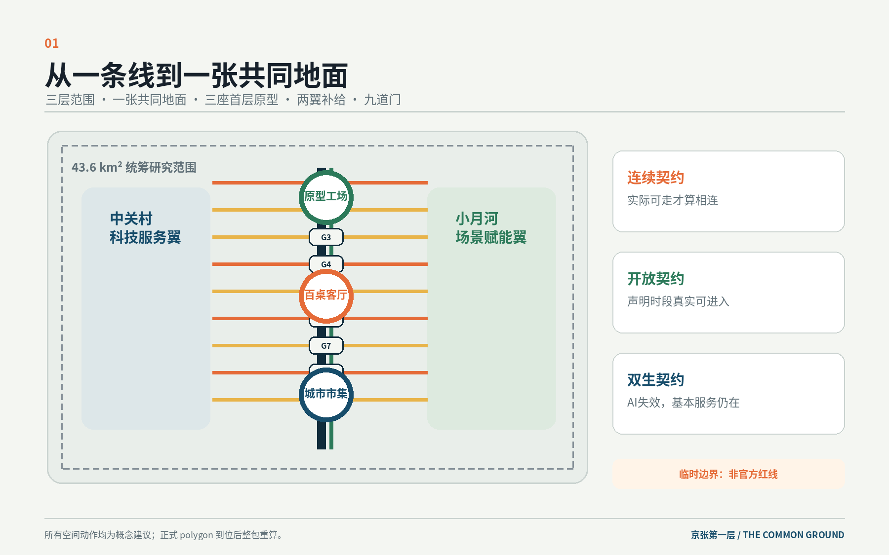
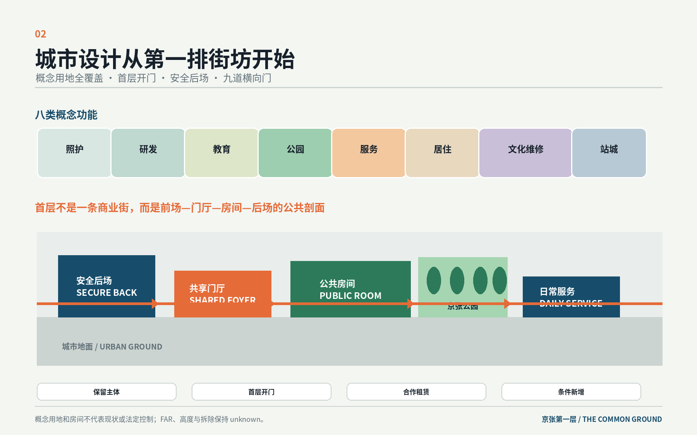
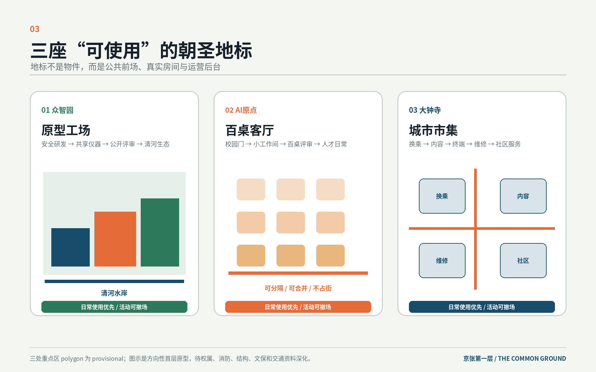
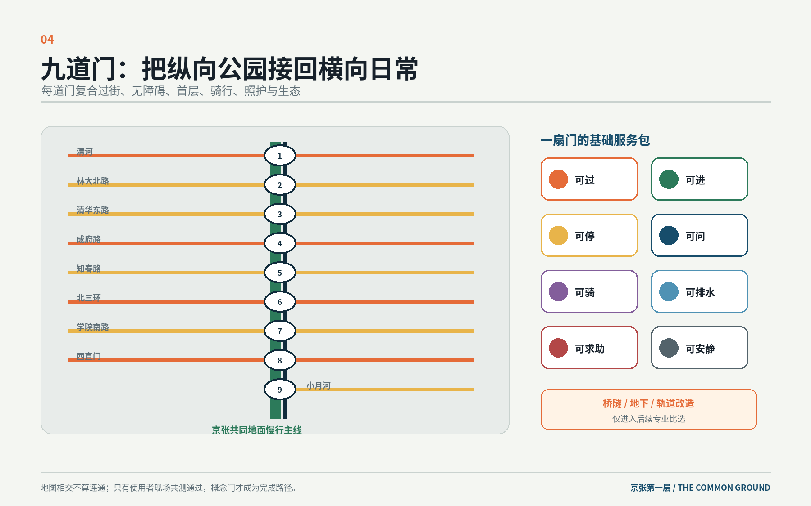
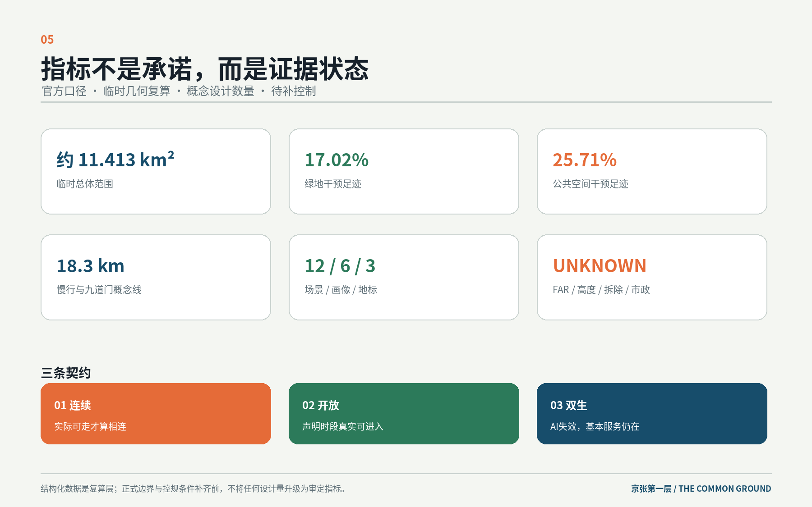

# 京张第一层 / THE COMMON GROUND

> 百年前，京张铁路把城市接向远方；今天，京张第一层把公园、园区、校园、社区和站口接回同一张可进入、可共享、可照护的城市地面。
>
> 本成果是开放共创建议，不替代正式规划，不构成政府审定、投资承诺或工程可行性结论。所有空间落地内容均为概念建议、参考方案，可供专业团队深化研究。

## 设计依据与资料清单

本方案首先承认场地已经拥有一条强有力的南北公共骨架：京张铁路遗产、沿线公园及其与高校、园区、社区和轨道站的关系。设计不再把11.4平方公里临时总体范围当作一张空白图，也不把AI等同于屏幕、机器人或数据大脑；真正需要设计的是公园两侧第一排街坊、首层入口、横向过街、站口、后勤、河岸和普通服务。只有这些最日常的界面连续，AI创新才从园区内部成为城市公共能力。[source:OFFICIAL-ANNOUNCEMENT] [standard:MOHURD-URBAN-DESIGN-MEASURES]

资料分四级使用。公告和面向智能体任务书确定三层范围、三区两翼、六项任务和禁止越界的表述；国家规范确定城市设计、控规边界和用地分类方法；仓库的临时多边形只用于生成、展示和intake自检；全球案例只用于方法比较。法定容积率、高度、道路红线、文保GIS、权属、现状建筑调查、市政容量和工程条件均未公开，本包不以推断替代缺失数据。[source:SOURCE-REGISTRY] [data:geometry/constraints.geojson]

当前提交的 `SITE_BOUNDARY` 与三处 `KEY_AREA` 是仓库维护者依据公告文字四至、位置线索和约面积形成的临时粗略几何。它们不是官方红线，不用于审批、土地权属、精确面积或法定控制；正式polygon到位后，必须替换边界并重算用地、建筑、道路、绿地、公共空间、分期、全部指标、五张核心图、HTML和PDF。[source:BOUNDARY-SOURCE] [metric:site_area_sqm]

## 三层范围工作框架

43.6平方公里统筹研究范围回答“创新资源如何协作”：中关村科技服务翼、学院路高校、众智园、AI原点、大钟寺、小月河和轨道枢纽如何形成从研究、试制、转化、采用到公共回馈的回路。11.4平方公里总体设计范围回答“城市第一层如何连续”：概念用地、首层、慢行、蓝绿和公共服务如何组合。368.4公顷三处重点区域才进入具体的首层房间、前后台、横向门、项目和日常/活动切换。[depth:three_level_scope_framework] [data:geometry/key_areas.geojson#PROV-KEY-002]

本方案用“一张共同地面、三座首层原型、两翼补给、九道门、十二间房”建立统一结构。“共同地面”不是统一铺装或一条新景观轴，而是京张遗址公园和两侧第一排街坊共同遵守的连续、开放与双生服务规则；三座首层原型分别承担研发公开、近校共创和城市采用；九道门把纵向公园接回横向日常；十二间房把AI场景放进有运营后台的真实空间，而不是把设备平均撒在公园中。[depth:overall_spatial_structure] [data:geometry/roads.geojson#ROAD-001]

三条设计契约贯穿三级范围。连续契约要求轮椅、婴儿车、步行者和骑行者可以实际通过，地图相交不算完成；开放契约要求一处首层在声明时段内无需熟人、无需强制消费，或有清晰公共进入条件，才计为公共首层；双生契约要求高影响AI服务保留人工或非AI等价路径，自动化失效时空间与基本服务仍能运行。这三项是概念性设计准则，具体合规仍由专业团队按场景核验。[standard:BARRIER-FREE-ENVIRONMENT-LAW] [metric:cross_gate_count]

## 统筹研究范围产业与未来城市研究

“京张第一层 / THE COMMON GROUND”的名称同时指地面层、建筑首层和共同基础。中文强调每个人都能进入的第一层，英文既是共同地面，也意味着最低共识。标志是一条南北留白与三块向两侧打开的门扇：留白代表京张主线，三处开口代表三座首层原型，也近似汉字“共”的中部结构。道砟灰、公园绿、信号橙、夜蓝构成识别色；导视首先写真实地名、步行分钟、无障碍状态和开放时段，品牌退到第二层，不复制企业标志、车票或机器人形象。[source:AGENT-TASKBOOK]

三大定位被转换为可使用的城市界面。百年京张文化带保留真实铁路、站房、桥梁和工程叙事，让文化进入抵达、行走和工作空间；都市AI生活体验带以九道门、社区服务和十二间房形成不用预约大型活动也能使用的日常；AI融合创新带则把安全研发后场、公开评审前场、开放工位、维修循环和城市场景按步行短链串联。五大功能由三区两翼协同：众智园负责全栈研发和受控试验，AI原点负责开放评审和人才生活，大钟寺负责内容、终端、维修与采用，中关村翼提供专业服务，小月河翼提供生态和生活场景。[standard:PROJECT-AGENT-OPEN-CALL-TASKBOOK]

| 要素 | 进入“第一层”的空间 | 运行边界 |
| --- | --- | --- |
| 土地与空间 | 存量园区第一排、沿街首层、站口四角、条件机会地 | 先普查、租赁和轻改造；不承诺征收出让 |
| 产业 | 研发后场—公开评审—开放工位—终端/内容—维修再用 | 不编造企业名单、投资和产值 |
| 资金与服务 | 八项创业门诊、共享仪器、短租首层、运营基金 | 均为机制建议，不是财政或招商承诺 |
| 人才 | 五分钟工作短链、夜间照护、餐饮、学习、家庭服务 | 不把人才简化为单一年轻男性研发者 |
| 算力与数据 | 安全后场、预约前台、受控试用室 | 预约与研发数据分离；公共空间不持续身份识别 |
| 场景 | 十二间有边界、有后台的真实房间 | 自愿参与、人工接管、非数字替代、可独立停止 |

六个全球案例提供可转译但不可照搬的经验。新加坡one-north说明共享研发、轨道、居住和公共空间需要协同，但统一土地与招商权不适用于海淀；柏之叶UDCK说明重点区要有常驻运营空间，而不是活动时临时搭台；巴塞罗那22@提醒产业、住房、设施和公共空间必须同表审查，也提醒警惕就业地产先行、生活后补；King’s Cross说明先交付连续站—街—公共空间链，再释放相邻项目；Brooklyn Navy Yard说明可负担试制、生产和维修空间不可被展示空间替代；Rail Corridor与杨浦滨江说明线性遗产应按断面、生态和日常用途分型。[source:CASE-ONE-NORTH] [source:CASE-22AT] [source:CASE-NAVY-YARD]

与北纬社区、未来科学城、怀柔科学城、经开区和京津冀的联系只提出课题协作、标准研究、试制衔接、场景互认和人才服务接口，不表述为既有合作。规划创新不在于另造“城市大脑”，而在于把产业链、公共空间、首层运营、普通服务和退出机制放在同一张城市设计图上，让专业团队可以逐门、逐房、逐项目深化。[depth:existing_conditions_diagnosis]

## 总体设计范围城市更新与控规深度城市设计

总体设计把京张公园作为南北公共脊，同时把设计重心移到第一排街坊和九道横向门。临时范围被完整划分为社区与照护、AI研发与试制、高校科研与开放学习、京张公园与蓝绿地面、产业服务与共享办公、居住与人才生活、文化内容与维修再用、交通与站城接口八类概念功能。分区采用统一用地代码并完整覆盖临时边界，但只表达期望的功能混合，不冒充现状或法定地类。[data:geometry/land_use.geojson#LU-004] [standard:MNR-LAND-USE-CLASSIFICATION-GUIDE]

九道门对应清河水岸、林大北路、清华东路、成府路、知春路、北三环、学院南路、西直门和小月河生态联系方向。每道门不只画一条线，而同时检查过街、无障碍入口、可进入首层、骑行停放、遮阴休息、人工服务和雨洪生态，至少完成四项才进入下一阶段。当前线位是概念设计意图，不是道路红线；实际门址、断点和工程条件必须通过竣工图与现场共测确认。[data:geometry/roads.geojson#DOOR-04] [metric:slow_mobility_network_m]

建筑更新采用五类工作语法：保留主体、首层开门、合作租赁、轻量条件新增、待专业确认。十二个小型建筑基底只用于说明首层房间和后场关系，不是现状测绘、地块权属或批准建筑。缺乏结构、消防、文保与权属时，本方案不判断拆除；FAR、高度、密度、退线和总建筑规模均保持待正式数据补齐。[depth:retain_renovate_demolish] [metric:floor_area_ratio]

城市形态由三种断面控制。水岸研发型依次组织生境缓冲、无障碍步道、雨洪台地、公开前场和安全研发后场；近校共创型依次组织步行、骑行、小工作间、百桌客厅、专业门诊与夜间照护；站城市场型先形成四角地面到达、无障碍垂直交通、骑行停放、雨棚和可进入首层，再讨论桥隧、地下或新增体量。断面只表达关系，法定和工程量纲待专业确认。[depth:height_massing_character]

## 重点区域详细设计

### 众智园AI自主创新加速区：原型工场

众智园的首层原型不是一座展示馆，而是“安全研发后场—共享仪器门厅—公开评审前场—清河生态水岸”的连续街坊。公众从站口和公园进入门厅，研发设备与装卸从独立后场进入，二者只在有人工管理的预约界面交接。日常承载仪器预约、午间评审、餐饮和河岸休息；开放日只在前场增加可撤展单元，安全边界不移动。[data:geometry/key_areas.geojson#PROV-KEY-001] [data:geometry/public_space.geojson#PUBLIC-001]

首批概念项目包括站—园—河无障碍工作线、园区第一排共享门厅、公众与后勤分流、清河雨洪台地、暗夜生境和可关闭的原型测试廊。“原型工场”同时作为AI朝圣地标，因为它把研发如何被解释、试用和停止做成可进入的空间，而不是用高塔、屏幕或机器人雕塑代表创新。正式权属、生态、结构、消防和水务条件确认前，所有建筑与河岸动作仅供专业深化。[depth:three_key_area_detailed_design]

### 北京AI原点社区：百桌客厅

AI原点的空间发动机是“校园门—小工作间—百桌客厅—八项门诊—人才日常”的五分钟短链。两个分布式首层提供按小时开放工位，百桌客厅在日常分为评审、共学与安静房间，活动时合并但不占街；法务、算力、招聘、空间和场景服务共用人工等候前台，夜间路线连接餐饮、居住、座椅、照明和求助点。[data:geometry/key_areas.geojson#PROV-KEY-002] [data:geometry/buildings.geojson#ROOM-05]

“百桌客厅”是第二处朝圣地标：任何人都能看到知识如何从论文变成样机、团队和公共服务，也能看到争议如何被人工评审。首批概念项目包括校园门口慢行修补、两个分布式首层、开放时段与可负担租赁条款、夜间照护链、骑行停放和人才家庭服务。它的价值来自每天可使用，不来自大型发布会的瞬时流量。

### 大钟寺AI产业聚集区：城市市集

大钟寺把站口四角、内容制作、智能终端、维修退换、青年夜校和社区服务组织为“城市市集”。设计先做四角地面过街、无障碍垂直路线、雨棚、骑行停放和人工问询，再把可访问内容工坊、试用室、维修循环柜台放入存量楼宇首层。货运与布撤展采用外围分时后勤，活动排队不得回堵站口。[data:geometry/key_areas.geojson#PROV-KEY-003] [data:geometry/public_space.geojson#PUBLIC-003]

“城市市集”不是单一建筑，而是四个站角共同构成的第三处朝圣地标。日常换乘、维修、字幕与音频描述制作、社区服务始终运行；发布和放映只占一个可控街角，另外三角保持通行。连桥、地下空间、轨道改造和新增体量只进入后续工程比选，不在本阶段给出可行性结论。[standard:MOHURD-CONTROL-DETAILED-PLANNING]

## AI 创新生态、人才画像与 AI+ 场景

六类画像校核每一扇门和每一间房：高校研究者与学生需要评审、工位、平价餐饮和夜间回程；一人公司与小团队需要按小时工作间、共享仪器和专业门诊；硬件工程师与运维人员需要装卸、储物、维修、急停和公众分流；沿线居民与照护者需要通学、就医、买菜、饮水、公厕和座椅不被创新活动挤出；轮椅使用者、老人及感官敏感者需要连续无障碍、安静替代、无需App和人工办理；国际访客与开发者需要双语抵达、短期工位与长期合作之间的清晰转换。[metric:persona_count]

十二张场景卡均落在有运营后台的真实房间。四张是测试场景，八张是日常服务；每张都规定参与方式、最少数据、人工责任、非数字路径和独立停止条件。AI只承担识别、辅助、调度或生成中的一个明确角色，不成为公共服务的唯一入口。[source:AGENT-TASKBOOK] [metric:scenario_card_count]

| 卡 | 类型与房间 | AI角色与服务对象 | 数据、人工复核和停止条件 |
| --- | --- | --- | --- |
| SCN-01 | 测试：原型评审厅 | 辅助展示与测试日志；研发团队、评审者、公众 | 不采路人身份；安全员在场；急停无效或越界即关闭 |
| SCN-02 | 测试：低速机器人巷 | 限时物流辅助；工程师与后勤人员 | 限速限量限线；占用无障碍或消防通道即停 |
| SCN-03 | 测试：清河生态窗 | 环境异常提示；公园运营、师生、居民 | 只采水位、温湿、声级和人工物种记录；采到个人信息即停 |
| SCN-04 | 运营：共享仪器门厅 | 预约与资源匹配；小团队与研究者 | 预约和研发数据分离；现场人工核验；后场失守即停 |
| SCN-05 | 运营：百桌客厅 | 会议辅助、字幕与资料检索；跨机构团队 | 公开/保密物理分区；疏散或安静边界被破坏即停活动 |
| SCN-06 | 运营：分布式开放工位 | 工位匹配与使用提醒；初创团队 | 不做人脸门禁；人工前台常驻；夜间无人值守即暂停夜间开放 |
| SCN-07 | 运营：八项创业门诊 | 匿名排队与知识检索；创业者 | 咨询由专业人员负责；利益冲突未披露或无人工人员即停 |
| SCN-08 | 运营：夜间照护站 | 路线与环境辅助；学生、居民、老人 | 不持续追踪身份；静态导向和人工求助常在；连续路径中断即关闭相关段 |
| SCN-09 | 测试：城市终端试用室 | 室内自愿试用；消费者与企业 | 非参与通勤者不采集；可现场删除；无人工售后即停 |
| SCN-10 | 运营：可访问内容工坊 | 字幕、音频描述和翻译辅助；内容创作者与观众 | 素材须授权，输出有人终审；授权链或可访问版本缺失即停发布 |
| SCN-11 | 运营：终端维修循环柜台 | 故障辅助诊断；居民、运维、维修者 | 维修前本地清除个人数据；无法清除或电池无法隔离即拒绝流转 |
| SCN-12 | 运营：无障碍接力台 | 导航只作辅助；残障使用者与运营团队 | 现场共测为准；发现无替代安全断点即关闭并修补 |

三处地标内嵌“共同地面铭牌”荣誉系统。只记录自愿公开、经人工核验且产生公共价值的开源工具、无障碍修补、导师服务、维修再用、公共标准和社区解题；每项写明贡献主体、用途、展示期限、纠错与撤回方式。它不记录全部城市行为，不建立个人积分榜，也不把企业广告当作荣誉。[metric:pilgrimage_landmark_count]

## 用地、建筑规模与拆改留方案

概念用地总面积与临时边界在拓扑上全覆盖，八类分区分别承载照护、研发、教育、绿地、服务、居住、文化和交通接口。绿地与公共空间指标只描述本方案干预足迹，可能相互重叠，不等同于现状供应率或法定绿地率。临时边界比公告约11.4平方公里略有差异，所有比例都以本包同源几何复算并标为低或中置信度。[metric:concept_land_use_area_sqm] [metric:green_ratio]

十二个概念房间被赋予首层开门、合作租赁、轻量条件新增或保留适配等动作，建筑高度统一保持未知。拆除数量也保持未知而不是写成零，因为缺少现状测绘、权属、结构、消防和文保资料时，“不拆”与“可拆”同样不能成为专业结论。正式资料到位后，应把每个概念房间重锚到真实建筑和租约，并重新审查入口、后勤、开放时段和公共利益。[data:geometry/buildings.geojson#ROOM-11] [metric:demolition_building_count]

风貌以低层可进入界面、清晰门洞、雨棚、耐久可维修材料和可关闭的后场构成。铁路遗产作为真实系统被阅读，不把轨枕、车票和道钉复制为全线装饰；AI原点保持小尺度、透明但可控；众智园强调研发院落和生态水岸；大钟寺强调维修、内容、换乘和夜校的城市性。正式高度、天际线和文保影响仍待专业团队依据官方资料深化。[depth:development_intensity_controls]

## 交通、轨道、市政与公共服务设施

交通优先级依次为地面连续、站口可达、东西横穿、慢行无障碍、骑行停放和后勤分时。九道门必须通过现场共测才能从“概念线”变为“完成路径”；桥隧、地下和轨道工程仅进入比选。站口和首层使用同一套静态导向，数字导航只是辅助，不依赖App、账号或人脸识别完成基本到达。[depth:traffic_rail_slow_parking] [data:geometry/roads.geojson#DOOR-06]

每道门配置基础服务包：无障碍入口与过街、遮阴座椅、饮水与厕所指引、骑行停放与维修、雨洪溢流、活动电源与储物、人工服务与数字信息、夜间值守与暗夜边界。市政策略不虚构容量，新型算力、充换电、能源和通信设施优先进入可维护设备间；余热、地下空间、能源负荷和管线能力保持未知，待专项测算。[depth:municipal_new_infrastructure] [metric:municipal_capacity_index]

## 蓝绿空间、公共空间与城市风貌

京张公园、清河与小月河是共同地面的生态底盘。设计只增加必要接口：横向门到公园的无门槛入口，水岸维护路与公众步道的分离，暴雨时可临时蓄排的台地，夜间不被活动照明侵入的生态暗区，以及首层雨棚、座椅和人工服务的连续。每个公共空间至少同时设计日常/活动、晴天/暴雨、夏季遮阴/冬季向阳或白天/夜间中的两种状态。[depth:blue_green_public_space] [data:geometry/green_space.geojson#GREEN-001]

三座地标共用五项准入：日常可进入，提供至少一种公共服务，具备运营后台，无障碍路径连续，活动退场后仍有用途。原型工场以水岸和研发前后台构成；百桌客厅以可分隔首层和夜间学习构成；城市市集以四角站口和维修内容服务构成。地标不是孤立物件，因此不需要巨大屏幕、超高塔或娱乐化IP来获得辨识度。

文化叙事分为“轨道—门—房间”三层：轨道保存中国自主铁路工程的真实时间线；门把曾经分隔两侧的线性空间变成横向进入城市的接口；房间呈现中关村动手解决问题、公开评审、维修和共同学习的当代文化。国际传播文案为：“From a line that connected the nation to a common ground that connects people, knowledge and daily life.” 导视只使用清权字体、原创图形和真实地名。

## 更新项目清单、实施政策与分期计划

项目按授权与数据依赖分三阶段。第一阶段优先做不依赖大规模建设的共测、普查、修补和最小首层；第二阶段通过真实租赁、运营和保险落地三座原型；第三阶段只在法定与工程条件成熟后深化重点街坊和站城选项。分期几何表达工作区段，不是批准时序或投资计划。[data:geometry/phasing.geojson#PHASE-001] [depth:phasing_implementation]

| 项目 | 位置与阶段 | 概念交付 |
| --- | --- | --- |
| PJ-01 官方底图与权属合图 | 全线，0—18个月 | 合并控规、文保、竣工、轨道、水务、权属和建筑调查 |
| PJ-02 九道门无障碍共测 | 全线，0—18个月 | 使用者与专业团队逐门验收、关闭危险段并形成修补清单 |
| PJ-03 首层空置与开放普查 | 第一排街坊，0—18个月 | 记录入口、时段、租赁、后勤、消防与无障碍条件 |
| PJ-04 横向门基础服务包 | 九道门，0—18个月 | 座椅、遮阴、饮水、厕所指引、人工求助与骑行维修 |
| PJ-05 众智园最小原型工场 | KA-01，0—18个月 | 共享门厅、公开评审前场与安全后场样板 |
| PJ-06 AI原点最小百桌客厅 | KA-02，0—18个月 | 两个分布式首层、评审与夜间照护样板 |
| PJ-07 大钟寺四角到达审计 | KA-03，0—18个月 | 过街、垂直交通、骑行与人工问询逐角核验 |
| PJ-08 清河生态窗与雨洪台地 | KA-01，1—3年 | 暗夜生境、环境观察和可撤展公共前场 |
| PJ-09 八项创业门诊 | KA-02，1—3年 | 八类专业服务轮值与匿名排队前台 |
| PJ-10 可访问内容工坊 | KA-03，1—3年 | 字幕、音频描述、翻译、版权咨询和小放映 |
| PJ-11 终端维修循环柜台 | KA-03，1—3年 | 维修、退换、备件、回收和二次使用 |
| PJ-12 首层合作租赁协议 | 三重点区，1—3年 | 写入开放时段、可负担性、维护、保险、退出与后台责任 |
| PJ-13 场景准入与停止协议 | 十二间房，1—3年 | 责任、最少数据、人工接管、非数字路径与停止条件 |
| PJ-14 站城与重点街坊深化 | 三区，3—10年 | 正式资料到位后比较地面、既有通道、连桥、地下与条件新增 |
| PJ-15 运营基金与五年公平复盘 | 全线，持续 | 收入优先用于安全无障碍、维修、免费服务和公共节目 |

长期运营分四层：公共部门和属地保障共同地面与跨部门协调；资产/园区主体负责工程和首层；高校—企业—社区平台编排内容与测试；独立运营团队负责开放、维护、投诉、无障碍和夜间。春季“开门共测”、夏季“百桌评审”、秋季“原型开放周”、冬季“维修与再用月”形成年度日历。参与者从公开日历进入迎新台、专业门诊、工位/设备、受控测试、短租首层、长期合作和公共回馈，未转化者仍可作为导师或社区协作者。[source:AGENT-TASKBOOK] [metric:renewal_project_count]

## 指标体系、面积复算与合规矩阵

指标被分为官方口径、临时几何复算、概念设计数量和未知控制四组。约43.6平方公里、11.4平方公里和三重点区公告面积只用于任务口径；本包 `site_area_sqm`、概念用地、绿地和公共空间来自临时几何；九道门、十二间房、十二张场景卡、六类画像、三座地标和十五个项目来自设计清单；FAR、高度、拆除和市政容量保持unknown。已知不代表已批准，设计数量不代表现状。[metric:ground_floor_room_count] [depth:metrics_recalculation]

| 核心项 | 本包结果 | 设计含义与限制 |
| --- | --- | --- |
| 临时总体范围 | 约11.413平方公里 | 仅用于本次几何一致性，不能当官方红线 |
| 概念用地覆盖 | 与临时边界拓扑全覆盖 | 表达功能混合方向，不是法定地类 |
| 绿地干预比 | 约17.02% | 设计干预足迹，不是法定绿地率或现状供应率 |
| 公共空间干预比 | 约25.71% | 可能与绿地重叠，不是存量公共空间率 |
| 慢行与门线 | 约18.3公里、九道门 | 概念线，需逐门现场共测与工程核验 |
| 首层房间 | 12间 | 真实运营空间原型，不是批准建筑数量 |
| 场景、画像、地标 | 12 / 6 / 3 | 满足任务书最低数量并与空间一一映射 |
| FAR、高度、拆除、市政 | unknown | 正式控规、权属、结构、文保和专项数据到位后补齐 |

`compliance_matrix.json`覆盖公告1.3—1.5与agent.1—agent.6；`standard_matrix.json`覆盖必需专业标准；`design_depth_matrix.json`覆盖十五项设计深度；结构化文件、图纸和HTML均由同一方案逻辑生成。机器通过只能证明结构、拓扑和包装一致，不能替代现场、规划、交通、建筑、市政、文保、法律和运营专业判断。[standard:PROJECT-OFFICIAL-ANNOUNCEMENT]

## 风险、版权与合规说明

最大风险不是“AI不够多”，而是把概念图误读成已批准计划。边界、重点区、用地、建筑、道路、分期和数值均保留数据等级；官方polygon和控规到位后应整包重算，不得只删除“临时”字样。桥隧、地下、轨道、市政、能源、文保、权属、投资与审批结论全部留给有资质团队。[depth:risk_missing_data] [source:CONTROL-PLANNING-MEASURES]

隐私与伦理只针对十二个明确场景：目的限定、最少数据、自愿参与、人工复核、非数字替代、独立停止、到期删除和投诉渠道。方案不提出全域人脸识别、个人积分或所有城市行为可追溯。生成文本、图形、结构化数据、HTML和PDF均为本次AI原创概念成果；未使用外部照片、人物肖像、企业商标、商业地图截图或远程字体。版权与生成责任见 `report/copyright_statement.md`。

## 参考资料

以下入口影响了方案判断；完整用途与限制见 `sources.json`。[source:SOURCE-REGISTRY]

- 北京市规划和自然资源委员会海淀分局：《百年京张AI创新带城市设计国际方案征集资格预审公告》，2026-05-09。
- 面向全球智能体的开源征集任务书摘录，仓库清权资料，2026-05-18。
- 住房和城乡建设部：《城市设计管理办法》。
- 住房和城乡建设部：《城市、镇控制性详细规划编制审批办法》。
- 自然资源部：《国土空间调查、规划、用途管制用地用海分类指南》。
- 《中华人民共和国无障碍环境建设法》。
- open-city-ai/haidian：`data/source_registry.json` 与临时边界说明。
- JTC Singapore：one-north官方资料。
- Barcelona City Council：22@更新资料。
- Brooklyn Navy Yard Development Corporation：园区使命与生产生态资料。
