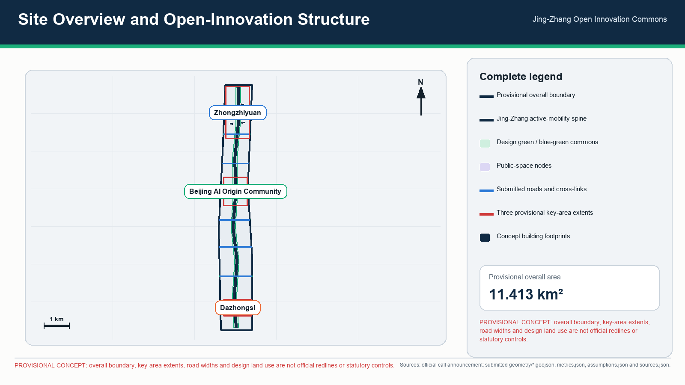
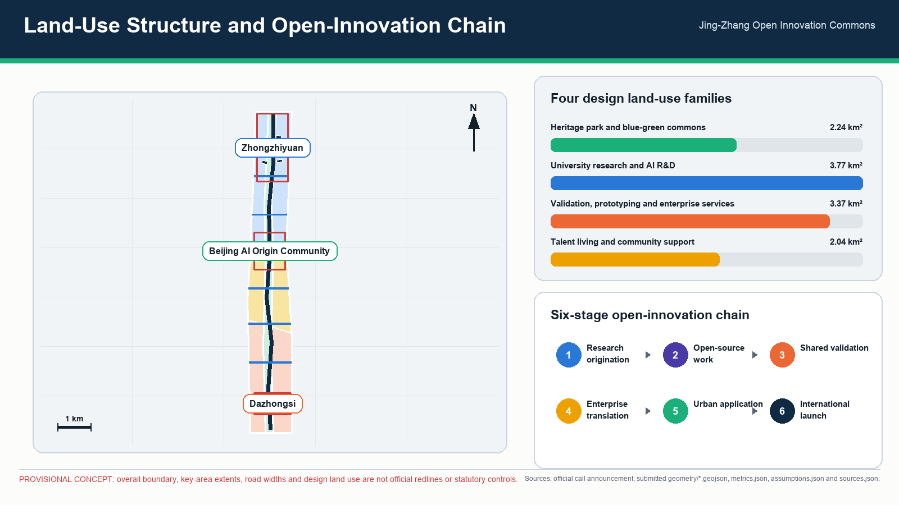
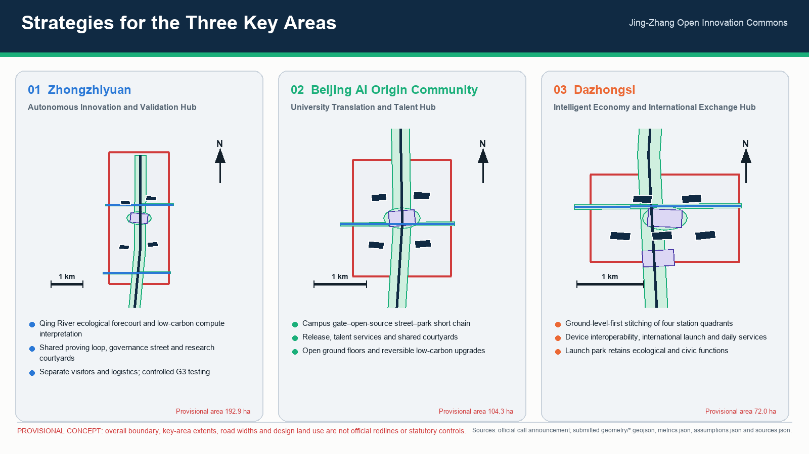
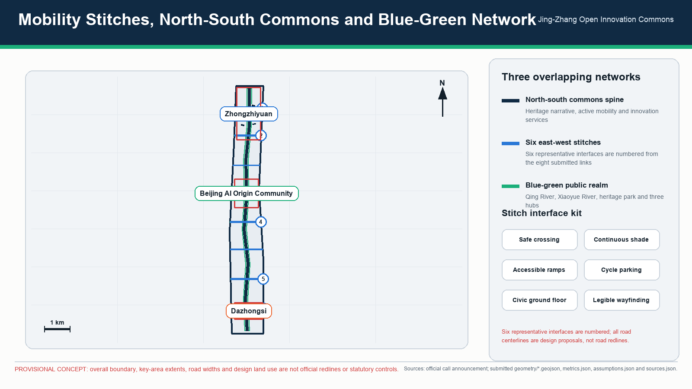
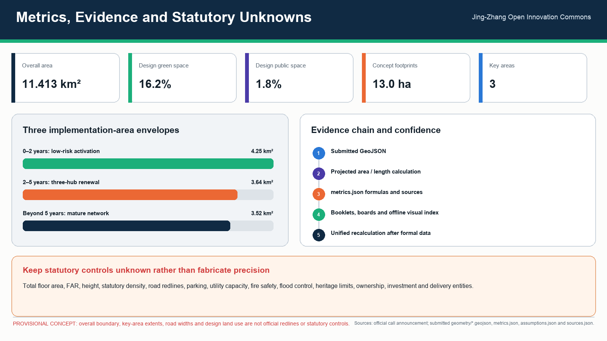

# 京张开放创新公地 / Jing-Zhang Open Innovation Commons

## 1. Proposal Summary

The Jing-Zhang Open Innovation Commons is not a closed technology park. It is an urban corridor where the heritage of the Jing-Zhang Railway provides shared memory, open AI innovation provides a productive method, and public space and community life provide the proving ground. The proposal organizes universities, enterprises, transit stations, community services, waterways, green space, and cultural resources as “one spine, three hubs, six node types, and twelve scenarios.” The Jing-Zhang Heritage Park forms a continuous north-south civic spine; Zhongzhiyuan, Beijing AI Origin Community, and Dazhongsi form three focused innovation hubs; east-west streets, campus edges, station areas, and community networks stitch adjacent districts into the corridor.

The proposal seeks four simultaneous shifts: from isolated campus attraction to an innovation ecosystem driven by shared facilities and open missions; from technology display to urban AI services that are testable, auditable, and reversible; from a false choice between heritage protection and industry to adaptive reuse of heritage space; and from one-time construction to a commons maintained by public agencies, universities, enterprises, communities, and professional institutions.

This proposal follows the three spatial scales and three key areas in the official announcement and fully answers agent.1 through agent.6. Submitted geometry uses rough provisional boundaries inferred from public information: `geometry/site_boundary.geojson` and `geometry/key_areas.geojson` are both `provisional_constraint` with `official_boundary=false`. Building height, floor-area ratio, building density, setbacks, road redlines, parcel ownership, municipal capacity, fire safety, river blue lines, and heritage-control requirements remain explicitly **unknown or subject to statutory confirmation** where authoritative information is absent. They are not approval or statutory-control conclusions. [source:OFFICIAL-ANNOUNCEMENT] [source:AGENT-TASKBOOK] [assumption:A-CONTROLS-001]

## 2. Vision and Spatial Proposition

### 2.1 One Spine, Three Hubs, Six Node Types

- **One spine: the Jing-Zhang Open Innovation Spine.** The Jing-Zhang Heritage Park and historic rail alignment combine continuous walking and cycling, stormwater ecology, heritage interpretation, civic activity, and low-risk AI services.
- **Three hubs:** Zhongzhiyuan as the Autonomous Innovation and Validation Hub; Beijing AI Origin Community as the University Translation and Talent Hub; and Dazhongsi as the Intelligent Economy and International Exchange Hub.
- **Six node types:** heritage gateways, open-source living rooms, industrial proving grounds, community service stations, blue-green pavilions, and international launch halls. Nodes can begin as lightweight interventions and mature as statutory planning and implementation conditions are confirmed.

### 2.2 North-South Continuity and East-West Stitching

**North-south continuity** is delivered through three parallel networks. A heritage narrative line connects railway memory, the history associated with Qinghuayuan Station, Dazhongsi cultural resources, and the innovation history of Zhongguancun. A slow-mobility and ecological line connects the Qing River, Xiaoyue River, Jing-Zhang Heritage Park, under-bridge spaces, and station plazas. An innovation-service line links the release, testing, incubation, and public-experience facilities of the three hubs. Continuity is therefore more than a landscape path: movement, ecological processes, cultural information, and innovation activity all continue across district boundaries.

**East-west stitching** follows a design principle of a recognizable lateral interface approximately every 800–1,200 metres; this spacing is a design recommendation, not a statutory control. Interfaces are prioritized at transit stations, campus entrances, enterprise gateways, community centres, and water crossings. Safe crossings, continuous shade, accessible ramps, cycle parking, active ground floors, and legible wayfinding reconnect districts that currently turn their backs on the Jing-Zhang corridor. Road redlines, bridge structures, and junction engineering require later transport studies.

### 2.3 Three Spatial Scales

| Scale | Announced scope | Design task | Proposal response |
| --- | --- | --- | --- |
| Regional / coordinated study | Approximately 43.6 sq km | World-class AI ecosystem, future urban form, talent, and international influence | Open innovation chain, six international mechanism transfers, industry-talent-city service network |
| Corridor / overall design | Approximately 11.4 sq km | Urban regeneration, industry layout, transport and utilities, heritage-park vitality, and character | One spine and three hubs, north-south continuity, east-west stitching, blue-green mobility, projects, and governance zones |
| Block / key areas | Approximately 368.4 ha in the announcement | Detailed design for three key areas | Programme, public space, mobility, retain-renovate-redevelop method, scenarios, and implementation dependencies |

`metrics.json` calculates approximately 11.413 sq km from the provisional overall boundary. This value is used for internal consistency only and does not replace an official redline area. [metric:site_area_sqm] [data:geometry/site_boundary.geojson#SITE-001]

## 3. A World-Class AI Innovation Ecosystem

### 3.1 Open Innovation Chain

The ecosystem is organized as six connected stages:

1. **University and research origination:** cross-campus networks for foundation models, embodied intelligence, intelligent devices, health, education, and related fields.
2. **Open-source collaboration:** the Origin Community provides a public front door for code releases, dataset documentation, model cards, contribution records, and cross-institution work.
3. **Shared validation:** Zhongzhiyuan provides controlled industrial test space, equipment, data governance, safety evaluation, and standards services.
4. **Enterprise translation:** all three hubs host intellectual-property, legal, finance, recruitment, compute access, first-application, and international-market support.
5. **Urban application:** transport, community, ecology, culture, and public facilities become low-risk application environments with observable and reversible feedback.
6. **International launch and communication:** Dazhongsi and the corridor landmarks support recurring demonstrations, forums, exhibitions, and public learning.

Industrial space is supplied as a mix of shared laboratories, affordable research premises, small-scale prototype validation, flexible offices, talent housing, and civic services rather than a single headquarters district. Access should be offered through leases, equipment time, test missions, open data, and mentor networks so that early-stage teams can participate.

### 3.2 Exactly Six International Cases and Transferable Mechanisms

These cases are mechanism references only; their scale, institutions, and visual identity are not copied. All URLs are public. This proposal uses **exactly six** international cases.

| # | Case and public source | Credible mechanism | Explicit transfer to Jing-Zhang |
| --- | --- | --- | --- |
| 1 | Waterfront Toronto Quayside, Canada — https://www.waterfrontoronto.ca/our-projects/quayside | A public agency retains long-term stewardship of public space and infrastructure, competitively selects private delivery partners, and continues public-interest calibration through design review and stakeholder advice. | Establish a Jing-Zhang Commons Council. Public bodies retain authority over public-space principles, data rules, and annual evaluation while market actors deliver projects under open briefs and public-value review. |
| 2 | High Tech Campus Eindhoven, Netherlands — https://www.hightechcampus.com/ | Firms, researchers, shared R&D facilities, and specialist services are concentrated around technology clusters, reducing the cost of collaboration and experimentation. | Prioritize shared testing equipment, trustworthy evaluation, safety governance, and standards services in Zhongzhiyuan rather than duplicating laboratories within every firm. |
| 3 | one-north, Singapore — https://www.jtc.gov.sg/find-space/one-north | A public industrial-space platform continuously matches premises to firms at different growth stages and mixes research, business, living, and amenities. | Create a space inventory and waiting-list matching system for laboratories, coworking, pilot production, demonstrations, and temporary projects. Statutory land use and pricing remain to be confirmed. |
| 4 | Mila, Canada — https://mila.quebec/en | A university-centred research community connects students, industry partners, applied projects, continuing education, and venture support, building a path from science to public benefit and commercialization. | Provide a cross-university translation desk, open-source contribution programme, student venture residency, and responsible-AI curriculum in the Origin Community. |
| 5 | Maria 01, Finland — https://maria.io/ | A shared physical hub convenes founders, investors, corporations, and support organizations, with curated events, founder programmes, and capital access sustaining the network. | Operate the Origin Community and Dazhongsi living rooms as curated collaboration infrastructure, with staff actively matching partners rather than merely renting desks. |
| 6 | Masdar City, United Arab Emirates — https://masdarcity.ae/ | Climate-conscious urban development is combined with a business platform that reduces setup friction and connects companies to investors, researchers, technology partners, and global markets. | Develop Zhongzhiyuan’s low-carbon energy, stormwater, compute infrastructure, and enterprise services together. Carbon, energy, and capacity targets enter performance contracts only after specialist verification. |

### 3.3 Industry Goals and Performance

A four-level performance framework is proposed: inputs, activities, outputs, and public value. Measures include shared-equipment opening hours, affordable-space provision, cross-institution projects, open-source contributions, validated products, financing and market translation, talent retention, resident benefit, energy use, and ecological performance. Except for metrics directly recalculable from submitted geometry, baselines and target values remain proposed operational metrics that require later industry surveys and approved budgets.

## 4. Detailed Design for the Three Key Areas

### 4.1 Zhongzhiyuan AI Autonomous Innovation Acceleration Area: Autonomous Innovation and Validation Hub

**Positioning.** A garden research and validation district for autonomous software and hardware, foundation models, embodied intelligence, and safety governance.

**Spatial structure.** The Qing River edge becomes a civic forecourt, while a shared testing loop, standards-and-governance street, and research courtyards create three nested environments. Openness is managed through hours, visitor booking, and security zoning rather than a single hard perimeter. The river edge accommodates low-carbon compute interpretation, rain gardens, cycling services, and small meeting pavilions; internal routes preserve the needs of research equipment and logistics.

**Buildings and retain-renovate-redevelop.** No building-specific demolition conclusion is made without a building survey, ownership information, and structural assessment. A dual value-and-carbon assessment is proposed: serviceable research buildings are retained and upgraded; inefficient storage may become test workshops; additions fill gaps in shared laboratories, talent services, and public frontage. Height, total floor area, FAR, and building density are unknown pending statutory planning.

**Mobility and public realm.** Improve links associated with the North Fifth Ring Road, external public transport, and separate visitor and logistics flows. Create a continuous slow-mobility connection between the Qing River and the Jing-Zhang Heritage Park. Cross-road and river works require transport, flood, and structural studies.

### 4.2 Beijing AI Origin Community: University Translation and Talent Hub

**Positioning.** A mixed community for near-campus innovation, technology transfer, open-source collaboration, and young talent.

**Spatial structure.** A short sequence links campus gates, an open-source street, a release hall, a talent-living loop, and the Jing-Zhang park. Ground floors prioritize open experiments, exhibitions, cafés, bookshops, IP and legal support, recruitment, and community services. Upper floors may host flexible research, short stays, and talent housing as a design recommendation; housing share and tenure are unknown.

**Campus-park-community stitching.** Around Wudaokou, Qinghua East Road West Exit, and other major interfaces, provide continuous accessible walking, cycle parking, night lighting, and legible wayfinding. Shared courses, open days, and community challenge programmes reduce the institutional boundary between university innovation and everyday life.

**Building approach.** Use reversible, low-carbon upgrades to existing buildings: open ground floors, link courtyards, improve fire safety and accessibility, and add shared meetings and release spaces. Campus boundaries, road redlines, and building safety require authoritative information and professional approval.

### 4.3 Dazhongsi AI Industry Cluster: Intelligent Economy and International Exchange Hub

**Positioning.** An urban innovation district for AI agents, intelligent devices, digital content, data-factor services, and international launch activity.

**Four-quadrant stitching.** Around Dazhongsi Station, prioritize legible movement between all four quadrants, station-city interchange, continuous active frontages, and night safety. Ground-level priority with grade separation as a supplement is recommended; the actual combination of bridges, underpasses, and road changes requires transport and utility design.

**Multi-use green space.** Planned green space retains ecological and public functions while potentially accommodating movable exhibition pavilions, outdoor launches, digital art, sport, and stormwater facilities where statutory green-space rules allow. Boundaries and permitted structures remain to be confirmed.

**Industry and daily life.** International launch halls, product-experience streets, content studios, data-compliance services, hospitality, and neighbourhood amenities create all-day activity. Non-commercial civic space, affordable food, and community services prevent the area becoming a single-purpose showroom.

## 5. Personas and Everyday Experience

| Persona | Core task | A typical day | Spatial and service response | Rights boundary |
| --- | --- | --- | --- | --- |
| 1. University researcher and student founder | Move from paper and code to prototype and team | Cross-campus seminar, shared laboratory, open-source event | Translation desk, open-source hall, affordable meetings, temporary workspace | Research outputs, campus data, and identity information require authorization; learning behaviour is not commercially profiled |
| 2. Startup product lead | Find premises, compute, testing, and first users | Product work in Zhongzhiyuan, small urban pilot, Dazhongsi pitch | Space matching, trustworthy evaluation, industry mentors, compliance and finance services | A pilot is not a procurement promise; failed tests can be appealed and exited |
| 3. Growth-stage or anchor-company team | Conduct joint R&D, recruitment, and global partnerships | Shared test, standards meeting, launch, interviews | Large shared facilities, international hall, enterprise service manager | Public-space naming, brands, and case materials require rights clearance |
| 4. Resident and family caregiver | Commute, access care and education, relax, handle community affairs | Park walk, community service, public course | Accessible continuous routes, child- and elder-friendly facilities, human service counters | No individual tracking; public services cannot require AI use |
| 5. International founder or visiting scholar | Understand institutions, find partners, and settle quickly | Bilingual navigation, temporary office, professional advice, cultural event | Bilingual wayfinding, landing services, international community, rail-heritage route | Immigration, legal, and investment advice is confirmed by licensed professionals |
| 6. City operator and frontline maintenance worker | Detect faults, schedule maintenance, coordinate incidents | Inspect facilities, process work orders, review AI alerts, report to the public | Operations desk, field sensing, work-order system, and training | AI assists prioritization only; authorized staff retain responsibility for penalties, emergency command, and final decisions |

## 6. Twelve Detailed AI Scenario Cards

Each card specifies users, place, operation, data, human review, operator, and performance. Four cards are explicitly labelled **Industrial Test/Validation Scenario**.

### Scenario 01: Open-Source Contribution and Release Hall
- **Users/place:** university teams, developers, and startups; Beijing AI Origin Community.
- **Operation:** publish model cards, dataset documentation, open projects, reproducibility results, and contribution records, connecting physical events to online repositories.
- **Data/governance:** display only public or explicitly licensed material; security-sensitive capabilities use delayed or controlled access.
- **Human review/operator:** an open-source foundation, universities, and a professional operator review licences and attribution.
- **Performance:** active contributors, cross-institution work, reproducible experiments, and sustained project activity.

### Scenario 02: Trustworthy Model Evaluation Sandbox — **Industrial Test/Validation Scenario 1/4**
- **Users/place:** model firms, researchers, and industry clients; shared validation area in Zhongzhiyuan.
- **Operation:** isolated robustness, bias, privacy, red-team, and energy testing produces traceable reports.
- **Data/governance:** tiered data, least privilege, and logged access; passing a test must not be represented as government certification.
- **Human review/operator:** independent evaluators and sector experts approve methods and findings.
- **Performance:** test cycle, issue closure, report reuse, and safety incidents.

### Scenario 03: Embodied-Intelligence Public-Environment Test Loop — **Industrial Test/Validation Scenario 2/4**
- **Users/place:** robotics, delivery, and sensing teams; controlled roads and courtyards in Zhongzhiyuan.
- **Operation:** tests open by time, speed, weather, and pedestrian-density tier, with barriers, emergency stop, and observers.
- **Data/governance:** edge processing and de-identification by default; unrelated faces and voices are not retained; rules and incident response are public.
- **Human review/operator:** a site safety officer authorizes and may immediately stop each test.
- **Performance:** safe kilometres, human takeover, near misses, and environmental adaptability.

### Scenario 04: Intelligent Device Interoperability Laboratory — **Industrial Test/Validation Scenario 3/4**
- **Users/place:** device, operating-system, chip, and application firms; Dazhongsi industrial premises.
- **Operation:** cross-brand connectivity, accessibility, cybersecurity, energy, and multilingual testing.
- **Data/governance:** participants retain test data; public reports contain aggregate findings only; vulnerabilities follow coordinated disclosure.
- **Human review/operator:** standards bodies, laboratories, and firms jointly confirm test cases.
- **Performance:** closed compatibility issues, standards proposals, participating firms, and energy improvement.

### Scenario 05: Low-Carbon Compute and Microgrid Validation Station — **Industrial Test/Validation Scenario 4/4**
- **Users/place:** compute, storage, cooling, and energy-management firms; Zhongzhiyuan-Qing River edge.
- **Operation:** compare scheduling, heat recovery, storage, and renewable strategies under real loads, with public energy interpretation.
- **Data/governance:** tiered release of energy and equipment data; operational control networks remain isolated from display networks.
- **Human review/operator:** energy specialists verify savings while facility operators retain control.
- **Performance:** energy per unit of compute, peak reduction, renewable share, and availability; targets await an energy study.

### Scenario 06: Jing-Zhang Slow-Mobility and Accessibility Navigation
- **Users/place:** residents, commuters, older people, children, and disabled people; corridor-wide public realm.
- **Operation:** public network data, facility status, and voluntary reports support routing around construction, flooding, and crowding.
- **Data/governance:** no personal journey archive; location is processed only for the active trip.
- **Human review/operator:** transport and park operators confirm closures and accessibility information; human help remains available.
- **Performance:** repaired gaps, accessibility accuracy, satisfaction, and complaint response.

### Scenario 07: Community Public-Service Copilot
- **Users/place:** residents, community workers, and visitors; corridor community service stations.
- **Operation:** policy search, form pre-check, booking, and multilingual explanation, with complex matters transferred to people.
- **Data/governance:** no automated eligibility, penalty, or benefit decision; sensitive data is not used for training or commercial recommendations.
- **Human review/operator:** neighbourhood offices and licensed professionals provide final answers.
- **Performance:** first-contact resolution, handoff quality, waiting time, and access for vulnerable groups.

### Scenario 08: Heritage Narrative and Urban Memory Guide
- **Users/place:** citizens, students, and visitors; heritage and cultural nodes.
- **Operation:** physical signs and optional digital guidance explain railway construction, urban change, Zhongguancun innovation, and contemporary contributions.
- **Data/governance:** historical sources and uncertainty are cited; synthetic imagery must not impersonate authentic archives.
- **Human review/operator:** historians, archives, and community representatives curate content.
- **Performance:** corrections, school use, accessible reach, and dwell time.

### Scenario 09: Blue-Green Resilience Steward
- **Users/place:** park, water, and maintenance teams and the public; Qing River, Xiaoyue River, and park green space.
- **Operation:** assist detection of waterlogging, vegetation stress, heat, and facility faults, creating work orders rather than automatic control.
- **Data/governance:** environmental data and low-resolution aggregate footfall only; identity recognition is prohibited.
- **Human review/operator:** water, landscape, and property staff review and act.
- **Performance:** response time, false alarms, tree survival, storm recovery, and public feedback.

### Scenario 10: Talent Life and Space-Matching Assistant
- **Users/place:** young talent, visiting scholars, and enterprises; service nodes in all three hubs.
- **Operation:** match offices, labs, housing, courses, and communities using criteria actively supplied by users.
- **Data/governance:** no inference of sensitive attributes; recommendations are explainable and personalization can be disabled.
- **Human review/operator:** talent agencies and space operators verify availability.
- **Performance:** successful matches, vacancy duration, cross-institution events, and appeal resolution.

### Scenario 11: Urban Event Safety Support Desk
- **Users/place:** event producers, security, medical teams, and the public; Dazhongsi and corridor event nodes.
- **Operation:** ticket totals, venue capacity, weather, and human inspection support staffing, evacuation, and communication.
- **Data/governance:** no routine facial recognition for crowd management; alerts show confidence and source.
- **Human review/operator:** the event commander and statutory emergency bodies make final decisions.
- **Performance:** response time, false alarms, accessible evacuation, and completed after-action reviews.

### Scenario 12: SME Compliance and Internationalization Desk
- **Users/place:** startup and growth firms; Dazhongsi hub and an online entry point.
- **Operation:** organize IP, contract, cross-border data, standards, and market-entry questions, then book professional advisers.
- **Data/governance:** results are informational, not legal, tax, or investment advice; business documents use encryption and minimum retention.
- **Human review/operator:** lawyers, accountants, standards, and IP professionals sign final advice.
- **Performance:** professional referrals completed, closure time, international projects, and reduced disputes.

## 7. Integrated Heritage, Ecology, Mobility, Community, and Industry

### 7.1 Heritage

The Jing-Zhang Railway is organizing infrastructure, not decorative background. A four-step method is used: identify, protect, adaptively reuse, and co-interpret. Objects with statutory or historical value are confirmed; where heritage-control boundaries are unknown the proposal avoids invented lines; appropriate existing spaces can support exhibitions, open-source work, education, and small events; railway workers, residents, schools, and historians participate in correction. Protection boundaries, construction-control zones, and repair methods remain subject to heritage-authority information and specialist design.

### 7.2 Ecology

The Qing River, Xiaoyue River, and Jing-Zhang Heritage Park form a blue-green network prioritizing shade continuity, local stormwater absorption, ecological banks, heat mitigation, and habitat. `geometry/green_space.geojson` and `geometry/public_space.geojson` are design representations. The calculated green-space ratio of about 16.19% and public-space ratio of about 1.79% support internal geometry review only; they are not statutory green-space or public-space controls. [metric:green_ratio] [metric:public_space_ratio]

### 7.3 Mobility

A “rail first, continuous walking and cycling, feeder transit, timed logistics, managed parking” system is proposed. The northern hub addresses external connections and research logistics; the Origin Community focuses on short campus-park trips; Dazhongsi focuses on four-quadrant interchange. AI supports information, diagnosis, and scheduling advice but does not replace traffic control or enforcement. Road redlines, parking standards, capacity, and station works remain unknown pending studies.

### 7.4 Community

The commons proves its public nature through daily service rather than signature events. Community stations provide human counters, child- and elder-friendly space, accessibility, health education, legal referrals, and public courses. New industrial premises include non-commercial places residents can enter. Resident satisfaction, noise, night disturbance, and access carry equal weight with investment indicators.

### 7.5 Industry

Industry development combines shared facilities, open missions, controlled validation, professional services, and patient capital. Public bodies define real urban problems and boundaries; enterprises propose solutions competitively; third parties assess safety and performance; residents and frontline staff provide use feedback. A pilot does not predetermine procurement, and display does not substitute for validation.

## 8. Four-Level AI Governance Zoning

| Level | Space and typical scenarios | Permitted AI role | Required controls |
| --- | --- | --- | --- |
| G1 Open Experience | exhibitions, heritage guidance, public information, open-source events | retrieval, translation, public guidance, non-personalized displays | cited sources, no mandatory login, human service available |
| G2 Assisted Service | mobility guidance, community help, space matching, ecological work orders | recommendations, ranking, pre-checks, and alerts | data minimization, explanation and appeal, human confirmation, periodic error audit |
| G3 Controlled Testing | model, robot, device, and microgrid industrial validation | testing within an approved mission, time, dataset, and geofence | permits, isolation, logs, observers, emergency stop, incident reporting, and exit mechanism |
| G4 No Automated Decision | planning approval, enforcement, benefit eligibility, medical diagnosis, emergency command, critical-infrastructure control | document organization and risk prompts only | authorized people make final decisions; AI output cannot directly create legal or bodily consequences |

Governance levels can overlap within a building. A launch-hall foyer may be G1, an enterprise desk G2, an isolated laboratory G3, and an administrative approval office G4. Risk, not building name, determines the zone.

## 9. Four Landmark and Contribution-Display Components

1. **Centennial Rail Timeline.** A walkable physical timeline along the corridor links railway history, urban development, and the AI era. Digital content is optional and historical material is reviewed by archives and historians.
2. **Open Contribution Wall.** The Origin Community displays open-source code, standards, datasets, education, and community contributions through verifiable links and consent. Anonymous and withdrawn contribution is possible; payment cannot determine ranking.
3. **Trusted Innovation Beacon.** A low-energy information structure at Zhongzhiyuan displays proving-ground status, safety rules, energy, and verified outcomes. It is not an oversized advertising screen.
4. **Global Collaboration Forum.** A convertible Dazhongsi venue hosts demonstrations, standards meetings, public forums, and international cooperation while remaining open for everyday non-event use through movable equipment.

Together they form a narrative of memory, contribution, validation, and exchange without relying on one monumental object.

## 10. Complete Response to agent.1—agent.6

| Task | Response |
| --- | --- |
| **agent.1 Overall corridor concept and functional coordination** | The Jing-Zhang Open Innovation Commons provides one spine, three hubs, six node types, north-south continuity, east-west stitching, and one implementation framework across all three scales. |
| **agent.2 Full-stack autonomous innovation and a world-class AI ecosystem** | A six-stage chain connects university origination, open source, shared validation, enterprise translation, urban application, and international launch, supported by shared facilities and specialist services. |
| **agent.3 New AI+ scenario paradigm and an AI-native vibrant city** | Twelve detailed scenario cards are provided, with four explicitly marked industrial test/validation scenarios and defined data, human review, operators, and performance. |
| **agent.4 AI public space, AI-native businesses, and pilgrimage landmarks** | AI services are embedded in parks, communities, stations, and hubs; four landmark/contribution components and non-commercial civic spaces are specified. |
| **agent.5 Integration of Jing-Zhang heritage, Zhongguancun culture, and new AI culture** | Railway history, urban innovation history, open contribution, and trustworthy validation form a correctable cultural narrative with heritage and copyright safeguards. |
| **agent.6 Global activity system and long-term operation** | An annual calendar, commons council, scenario-access system, diversified revenue, public performance reporting, and rolling renewal model are established. |

## 11. Implementation Path and Project Portfolio

### 11.1 Three Phases

**Phase 1: 0–2 years, low-risk activation.** Confirm statutory information; survey heritage and buildings; audit mobility gaps. Start wayfinding, the contribution wall, a temporary open-source hall, community copilot, environmental monitoring, and annual events. Establish four-level governance and pilot exit rules.

**Phase 2: 2–5 years, spatial renewal and shared facilities.** Advance ground-floor opening and existing-building upgrades in the Origin Community, shared validation in Zhongzhiyuan, the Qing River ecological frontage, Dazhongsi public realm, and the international forum. All development quantities follow the statutory plan, ownership, utilities, and engineering conditions then in force.

**Phase 3: beyond 5 years, mature network and rolling renewal.** Complete north-south ecological and slow-mobility continuity, multiple east-west interfaces, a stable industrial-validation service, and an international collaboration network. Space and scenarios are updated from annual performance and community feedback rather than frozen in a final build-out.

### 11.2 Priority Project Portfolio

| ID | Project | Early action | Main dependency / unknown |
| --- | --- | --- | --- |
| JZ-01 | Jing-Zhang mobility-gap stitching | audit, temporary wayfinding, accessibility repairs, crossing options | road redlines, traffic organization, bridge structure |
| JZ-02 | Zhongzhiyuan shared proving ground | equipment and safety brief, operator selection, indoor testing first | ownership, structure, fire safety, energy capacity |
| JZ-03 | Origin Community open-source street | ground-floor pilot, short-lease collaboration space, contribution wall | campus boundary, leases, fire safety, residential and industrial use |
| JZ-04 | Qing River low-carbon innovation edge | ecological survey, stormwater prototype, meeting pavilion | river blue line, flood control, ecological approval |
| JZ-05 | Dazhongsi four-quadrant stitching | pedestrian study, wayfinding, trial surface-crossing improvements | station engineering, roads, utilities |
| JZ-06 | International launch and collaboration forum | movable event equipment, quarterly pitches and standards meetings | venue permission, noise, event safety |
| JZ-07 | Community public-service station network | human counter plus assisted-service pilot | data authorization, neighbourhood operations, recurring budget |
| JZ-08 | Heritage timeline and education route | collect content, verify archives, co-create with schools | heritage advice, copyright, site conditions |

## 12. Long-Term Operations and Financial Resilience

### 12.1 Commons Council

A non-profit-oriented Jing-Zhang Open Innovation Commons Council is proposed with public agencies, universities and institutes, parks and enterprises, community representatives, professional institutions, and independent ethics and safety members. It oversees public-space principles, scenario admission, data governance, annual missions, performance disclosure, and disputes. Statutory approvals remain with competent authorities.

### 12.2 Annual Activity System

- Spring: open-source and student innovation season;
- Summer: urban AI scenario open month and public experience;
- Autumn: trustworthy AI, standards, and industrial validation conference;
- Winter: global collaboration week, annual contribution release, and community review.

The programme does not depend on a single summit. Each quarter includes smaller activities for residents, frontline operators, and young teams. Frequency and scale follow budget, venue permission, and safety capacity.

### 12.3 Revenue and Reinvestment

Sustainable income may include shared-equipment and validation services, space membership, enterprise training, events, sponsorship, research partnerships, and public-service procurement. Sponsorship cannot buy public data, governance privilege, or contribution ranking. A portion of net income should support affordable innovation space, community projects, heritage maintenance, and open-source microgrants; the proportion requires an operating charter and financial model.

### 12.4 Transparency and Exit

Annual reporting covers access, scenario tests, safety incidents, energy, community feedback, contribution distribution, and reinvestment. Every AI scenario has a sunset clause: if public value is weak, errors remain uncontrolled, complaints persist, or the operator cannot perform, the scenario can be paused, reduced, or retired.

## 13. Metrics, Design Depth, and Statutory-Control Statement

The current geometry can recalculate the provisional overall area, demonstration building footprint, design green-space and public-space ratios, and the count of key areas. [metric:site_area_sqm] [metric:building_footprint_area_sqm]

Green space, public space, and the number of key areas are verified through structured metrics. [metric:green_ratio] [metric:public_space_ratio] [metric:key_area_count]

The following remain **unknown or advisory**: statutory land-use designations, total floor area, FAR, building height, building density, statutory green-space ratio, road redlines, rail and station engineering boundaries, building setbacks, parking standards, utility routes and capacity, river blue lines, flood standards, heritage boundaries and construction-control zones, ownership and demolition, fire-safety conditions, investment, and delivery entities. When authoritative data and specialist review become available, `geometry/constraints.geojson`, `metrics.json`, `assumptions.json`, and all design matrices must be updated. Until then this is an urban design and operating framework, not a statutory plan, construction design, or government implementation commitment.

`compliance_matrix.json` maps announcement items 1.3, 1.4, 1.5 and agent.1—agent.6. `standard_matrix.json` maps project sources and professional standards. `design_depth_matrix.json` maps existing conditions, structure, land use, intensity, buildings, mobility, utilities, blue-green space, key areas, projects, phasing, metrics, and risk. Missing statutory controls are labelled provisional, unknown, or data_gap rather than fabricated.

## 14. Authorship, Sources, and Copyright

The public signature is GitHub-only: **windchaser1280**. Sources, case URLs, and use boundaries are in `sources.json`; asset rights and production disclosure are in `report/copyright_statement.md`. The package uses no remote fonts, scripts, map tiles, or tracking services. Third-party brands, archives, portraits, and enterprise cases require permission before later public display.

## 15. Referenced Files

- Official announcement: https://ghzrzyw.beijing.gov.cn/zhengwuxinxi/tzgg/hd/202605/t20260509_4643047.html
- `geometry/site_boundary.geojson`
- `geometry/key_areas.geojson`
- `metrics.json`
- `assumptions.json`
- `sources.json`
- `compliance_matrix.json`
- `standard_matrix.json`
- `design_depth_matrix.json`
## Design Basis and Source List

This section does not add a statutory conclusion; it reorganizes the full design material above according to the review contract. Design intent, spatial actions, operating mechanisms, and governance boundaries are stated in Sections 2–13 and cross-checked through submitted GeoJSON, metrics.json, compliance_matrix.json, standard_matrix.json, and design_depth_matrix.json. The overall boundary, three key areas, roads, green space, public realm, and building footprints support design discussion or internal checks only. Official redlines, regulatory intensity, ownership, municipal capacity, fire safety, flood controls, and heritage controls remain provisional or unknown when authoritative data is absent. Once formal data is supplied, geometry, metrics, drawings, HTML, assumptions, and matrices must be updated together and all four gates rerun. Until then, areas and ratios demonstrate package consistency and are not approvals, delivery commitments, or engineering conclusions.

The design basis comprises the official call announcement, agent taskbook, repository site package, submitted source register, assumptions, and professional matrices; absent formal controls are not replaced by guesses. [source:OFFICIAL-ANNOUNCEMENT] [source:AGENT-TASKBOOK] [source:SITE-PACKAGE]

## Three-Level Scope Framework

This section does not add a statutory conclusion; it reorganizes the full design material above according to the review contract. Design intent, spatial actions, operating mechanisms, and governance boundaries are stated in Sections 2–13 and cross-checked through submitted GeoJSON, metrics.json, compliance_matrix.json, standard_matrix.json, and design_depth_matrix.json. The overall boundary, three key areas, roads, green space, public realm, and building footprints support design discussion or internal checks only. Official redlines, regulatory intensity, ownership, municipal capacity, fire safety, flood controls, and heritage controls remain provisional or unknown when authoritative data is absent. Once formal data is supplied, geometry, metrics, drawings, HTML, assumptions, and matrices must be updated together and all four gates rerun. Until then, areas and ratios demonstrate package consistency and are not approvals, delivery commitments, or engineering conclusions.

The coordinated research area, overall design area, and three key areas form a progression from industry strategy to urban regeneration and detailed design; see Sections 2.3, 3, 4, and 11. [depth:three_level_scope_framework] [standard:PROJECT-OFFICIAL-ANNOUNCEMENT]

## Coordinated Research Area: Industry and Future City Research

This section does not add a statutory conclusion; it reorganizes the full design material above according to the review contract. Design intent, spatial actions, operating mechanisms, and governance boundaries are stated in Sections 2–13 and cross-checked through submitted GeoJSON, metrics.json, compliance_matrix.json, standard_matrix.json, and design_depth_matrix.json. The overall boundary, three key areas, roads, green space, public realm, and building footprints support design discussion or internal checks only. Official redlines, regulatory intensity, ownership, municipal capacity, fire safety, flood controls, and heritage controls remain provisional or unknown when authoritative data is absent. Once formal data is supplied, geometry, metrics, drawings, HTML, assumptions, and matrices must be updated together and all four gates rerun. Until then, areas and ratios demonstrate package consistency and are not approvals, delivery commitments, or engineering conclusions.

The open innovation chain, six international cases, industry goals, and operating system in Sections 3 and 12 answer the industry ecosystem, future-city form, talent, and international collaboration tasks. [depth:innovation_ecosystem] [source:AGENT-TASKBOOK]

## Overall Design Area: Urban Renewal and Regulatory-Plan-Level Urban Design

This section does not add a statutory conclusion; it reorganizes the full design material above according to the review contract. Design intent, spatial actions, operating mechanisms, and governance boundaries are stated in Sections 2–13 and cross-checked through submitted GeoJSON, metrics.json, compliance_matrix.json, standard_matrix.json, and design_depth_matrix.json. The overall boundary, three key areas, roads, green space, public realm, and building footprints support design discussion or internal checks only. Official redlines, regulatory intensity, ownership, municipal capacity, fire safety, flood controls, and heritage controls remain provisional or unknown when authoritative data is absent. Once formal data is supplied, geometry, metrics, drawings, HTML, assumptions, and matrices must be updated together and all four gates rerun. Until then, areas and ratios demonstrate package consistency and are not approvals, delivery commitments, or engineering conclusions.

Sections 2, 7, 11, and 13 set out the spatial structure, regeneration portfolio, phasing, and metric checks; all regulatory parameters remain subject to statutory confirmation. [standard:MOHURD-CONTROL-DETAILED-PLANNING] [data:geometry/land_use.geojson#LU-001]

## Detailed Design of Key Areas

Section 4 specifies positioning, spatial actions, mobility interfaces, public realm, scenarios, and delivery dependencies for Zhongzhiyuan, Beijing AI Origin Community, and Dazhongsi; all extents are provisional. [depth:three_key_area_detailed_design] [data:geometry/key_areas.geojson#PROV-KEY-001] [source:KEY-AREA-SOURCE]

## AI Innovation Ecosystem, Personas, and AI+ Scenarios

This section does not add a statutory conclusion; it reorganizes the full design material above according to the review contract. Design intent, spatial actions, operating mechanisms, and governance boundaries are stated in Sections 2–13 and cross-checked through submitted GeoJSON, metrics.json, compliance_matrix.json, standard_matrix.json, and design_depth_matrix.json. The overall boundary, three key areas, roads, green space, public realm, and building footprints support design discussion or internal checks only. Official redlines, regulatory intensity, ownership, municipal capacity, fire safety, flood controls, and heritage controls remain provisional or unknown when authoritative data is absent. Once formal data is supplied, geometry, metrics, drawings, HTML, assumptions, and matrices must be updated together and all four gates rerun. Until then, areas and ratios demonstrate package consistency and are not approvals, delivery commitments, or engineering conclusions.

Sections 3, 5, 6, and 8 provide the innovation ecosystem, six personas, twelve scenario cards, and four-level governance system, including four explicit industrial test/validation scenarios. [standard:PROJECT-AGENT-OPEN-CALL-TASKBOOK] [depth:ai_scenarios_governance]

## Land Use, Building Scale, and Retain-Renovate-Demolish Strategy

This section does not add a statutory conclusion; it reorganizes the full design material above according to the review contract. Design intent, spatial actions, operating mechanisms, and governance boundaries are stated in Sections 2–13 and cross-checked through submitted GeoJSON, metrics.json, compliance_matrix.json, standard_matrix.json, and design_depth_matrix.json. The overall boundary, three key areas, roads, green space, public realm, and building footprints support design discussion or internal checks only. Official redlines, regulatory intensity, ownership, municipal capacity, fire safety, flood controls, and heritage controls remain provisional or unknown when authoritative data is absent. Once formal data is supplied, geometry, metrics, drawings, HTML, assumptions, and matrices must be updated together and all four gates rerun. Until then, areas and ratios demonstrate package consistency and are not approvals, delivery commitments, or engineering conclusions.

Sections 4, 7, and 13 use provisional design land use, demonstration footprints, and a retain-repair-adapt-redevelop-after-verification method without claiming statutory scale. [data:geometry/buildings.geojson#BLDG-001] [depth:retain_renovate_demolish]

## Transport, Rail, Municipal Infrastructure, and Public Services

This section does not add a statutory conclusion; it reorganizes the full design material above according to the review contract. Design intent, spatial actions, operating mechanisms, and governance boundaries are stated in Sections 2–13 and cross-checked through submitted GeoJSON, metrics.json, compliance_matrix.json, standard_matrix.json, and design_depth_matrix.json. The overall boundary, three key areas, roads, green space, public realm, and building footprints support design discussion or internal checks only. Official redlines, regulatory intensity, ownership, municipal capacity, fire safety, flood controls, and heritage controls remain provisional or unknown when authoritative data is absent. Once formal data is supplied, geometry, metrics, drawings, HTML, assumptions, and matrices must be updated together and all four gates rerun. Until then, areas and ratios demonstrate package consistency and are not approvals, delivery commitments, or engineering conclusions.

Sections 2.2, 4, 6, and 7.3 organize north-south active travel, east-west stitching, station access, controlled testing, municipal prerequisites, and community services. [data:geometry/roads.geojson#ROAD-001] [depth:traffic_rail_slow_parking]

## Blue-Green Network, Public Space, and Urban Character

This section does not add a statutory conclusion; it reorganizes the full design material above according to the review contract. Design intent, spatial actions, operating mechanisms, and governance boundaries are stated in Sections 2–13 and cross-checked through submitted GeoJSON, metrics.json, compliance_matrix.json, standard_matrix.json, and design_depth_matrix.json. The overall boundary, three key areas, roads, green space, public realm, and building footprints support design discussion or internal checks only. Official redlines, regulatory intensity, ownership, municipal capacity, fire safety, flood controls, and heritage controls remain provisional or unknown when authoritative data is absent. Once formal data is supplied, geometry, metrics, drawings, HTML, assumptions, and matrices must be updated together and all four gates rerun. Until then, areas and ratios demonstrate package consistency and are not approvals, delivery commitments, or engineering conclusions.

Section 7 integrates heritage, ecology, public space, community, and industry interfaces; green and public-space ratios serve only as internal checks on submitted geometry. [data:geometry/green_space.geojson#GREEN-001] [metric:green_ratio] [metric:public_space_ratio]

## Renewal Projects, Implementation Policy, and Phasing

This section does not add a statutory conclusion; it reorganizes the full design material above according to the review contract. Design intent, spatial actions, operating mechanisms, and governance boundaries are stated in Sections 2–13 and cross-checked through submitted GeoJSON, metrics.json, compliance_matrix.json, standard_matrix.json, and design_depth_matrix.json. The overall boundary, three key areas, roads, green space, public realm, and building footprints support design discussion or internal checks only. Official redlines, regulatory intensity, ownership, municipal capacity, fire safety, flood controls, and heritage controls remain provisional or unknown when authoritative data is absent. Once formal data is supplied, geometry, metrics, drawings, HTML, assumptions, and matrices must be updated together and all four gates rerun. Until then, areas and ratios demonstrate package consistency and are not approvals, delivery commitments, or engineering conclusions.

Section 11 identifies near-term lightweight pilots, medium-term regeneration, long-term governance, a priority portfolio, responsibilities, and formal delivery dependencies. [depth:renewal_project_list] [data:geometry/phasing.geojson#PHASE-001]

## Metrics, Area Recalculation, and Compliance Matrix

This section does not add a statutory conclusion; it reorganizes the full design material above according to the review contract. Design intent, spatial actions, operating mechanisms, and governance boundaries are stated in Sections 2–13 and cross-checked through submitted GeoJSON, metrics.json, compliance_matrix.json, standard_matrix.json, and design_depth_matrix.json. The overall boundary, three key areas, roads, green space, public realm, and building footprints support design discussion or internal checks only. Official redlines, regulatory intensity, ownership, municipal capacity, fire safety, flood controls, and heritage controls remain provisional or unknown when authoritative data is absent. Once formal data is supplied, geometry, metrics, drawings, HTML, assumptions, and matrices must be updated together and all four gates rerun. Until then, areas and ratios demonstrate package consistency and are not approvals, delivery commitments, or engineering conclusions.

Section 13 together with metrics.json, compliance_matrix.json, standard_matrix.json, and design_depth_matrix.json preserves recalculable metrics and itemized evidence. [depth:metrics_recalculation] [metric:site_area_sqm]

## Risk, Copyright, and Compliance

This section does not add a statutory conclusion; it reorganizes the full design material above according to the review contract. Design intent, spatial actions, operating mechanisms, and governance boundaries are stated in Sections 2–13 and cross-checked through submitted GeoJSON, metrics.json, compliance_matrix.json, standard_matrix.json, and design_depth_matrix.json. The overall boundary, three key areas, roads, green space, public realm, and building footprints support design discussion or internal checks only. Official redlines, regulatory intensity, ownership, municipal capacity, fire safety, flood controls, and heritage controls remain provisional or unknown when authoritative data is absent. Once formal data is supplied, geometry, metrics, drawings, HTML, assumptions, and matrices must be updated together and all four gates rerun. Until then, areas and ratios demonstrate package consistency and are not approvals, delivery commitments, or engineering conclusions.

Sections 13 and 14 and assumptions.json disclose provisional boundaries, unknown statutory controls, copyright sources, human review, data minimization, and the prohibition on replacing approvals. [depth:risk_missing_data] [source:SUBMITTED-GEOMETRY]

## References

This section does not add a statutory conclusion; it reorganizes the full design material above according to the review contract. Design intent, spatial actions, operating mechanisms, and governance boundaries are stated in Sections 2–13 and cross-checked through submitted GeoJSON, metrics.json, compliance_matrix.json, standard_matrix.json, and design_depth_matrix.json. The overall boundary, three key areas, roads, green space, public realm, and building footprints support design discussion or internal checks only. Official redlines, regulatory intensity, ownership, municipal capacity, fire safety, flood controls, and heritage controls remain provisional or unknown when authoritative data is absent. Once formal data is supplied, geometry, metrics, drawings, HTML, assumptions, and matrices must be updated together and all four gates rerun. Until then, areas and ratios demonstrate package consistency and are not approvals, delivery commitments, or engineering conclusions.

The full source register is in sources.json; Section 15 lists submitted files, and report/copyright_statement.md records copyright and permission terms. [source:SITE-PACKAGE]

