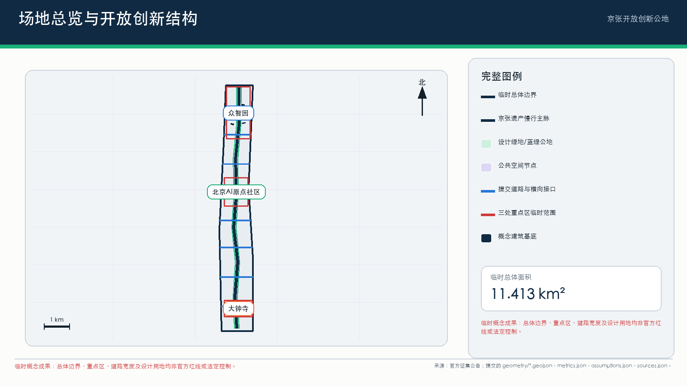
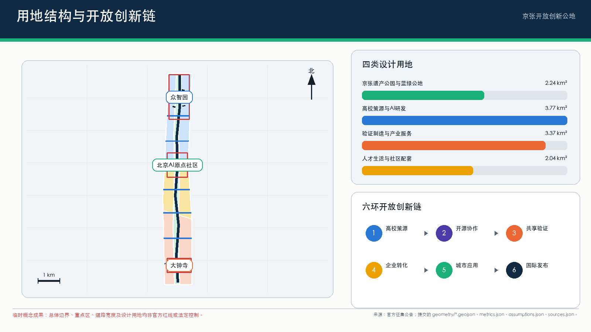
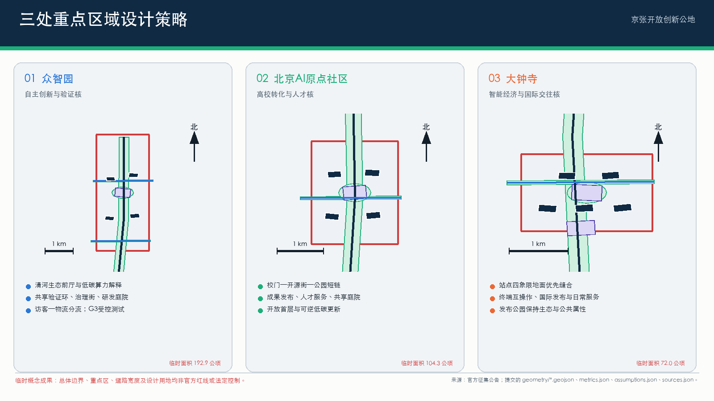
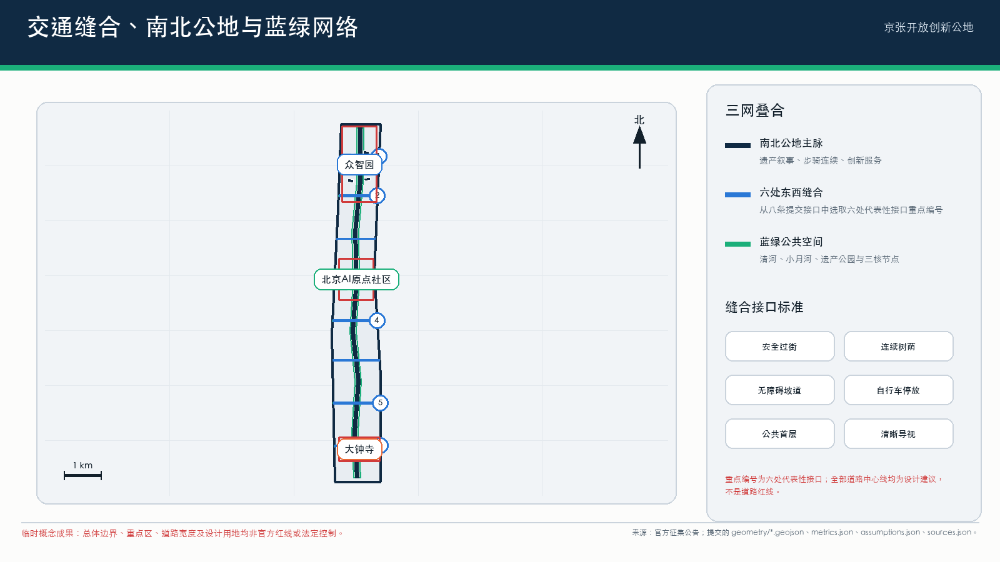
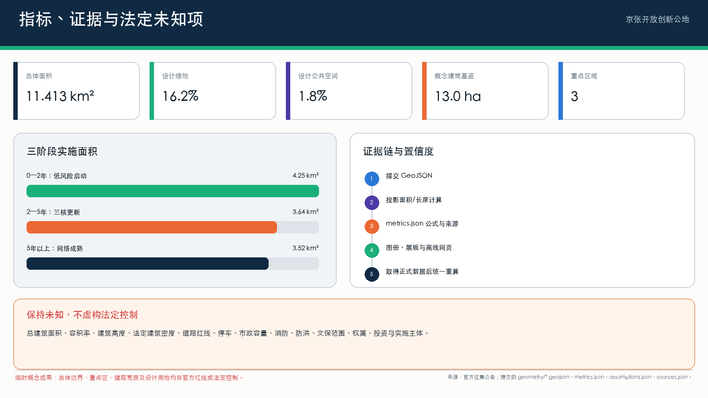

# 京张开放创新公地 / Jing-Zhang Open Innovation Commons

## 1. 提案摘要

“京张开放创新公地”不是封闭科技园区，而是一条以京张铁路遗产为共同记忆、以人工智能开放创新为生产方式、以公共空间和社区生活为检验场的城市走廊。方案将高校院所、企业园区、轨道站点、社区服务、河流绿地和文化资源组织为“一脉、三核、六类节点、十二个场景”的协同系统：京张遗址公园形成连续南北公共脉络；众智园、北京AI原点社区和大钟寺构成三处重点创新核心；东西向街道、校园界面、站点和社区服务网络完成横向缝合。

核心目标是同时实现四个转变：从单体园区招商转向共享设施和开放任务驱动的创新生态；从技术展示转向可测试、可审计、可撤回的城市AI服务；从遗产保护与产业发展二选一转向遗产空间的适应性再利用；从一次性建设转向由公共部门、大学、企业、社区和专业机构共同维护的长期公地。

本提案依据官方公告规定的三层范围和三处重点区域，并完整回应 agent.1—agent.6。提交几何采用公开资料推导的临时粗略边界：`geometry/site_boundary.geojson` 与 `geometry/key_areas.geojson` 均为 `provisional_constraint`、`official_boundary=false`。所有建筑高度、容积率、建筑密度、退线、道路红线、地块权属、市政容量、消防、河道蓝线和文保控制要求，在缺少法定资料时均明确为**未知或待正式确认**，不作为审批或法定控制结论。[source:OFFICIAL-ANNOUNCEMENT] [source:AGENT-TASKBOOK] [assumption:A-CONTROLS-001]

## 2. 设计愿景与空间主张

### 2.1 一脉三核六类节点

- **一脉：京张开放创新脉。** 以京张遗址公园及其历史线路为南北主轴，叠加连续步行骑行、雨洪生态、文化解释、公共活动和低风险AI服务。
- **三核：** 众智园“自主创新与验证核”、北京AI原点社区“高校转化与人才核”、大钟寺“智能经济与国际交往核”。
- **六类节点：** 遗产门户、开源客厅、产业试验场、社区服务站、蓝绿驿站、国际发布厅。节点可轻量启动，并随法定规划和实施条件逐步深化。

### 2.2 南北连续与东西缝合

**南北连续**通过三条并行网络完成：第一条是遗产叙事线，连接铁路历史节点、清华园火车站相关记忆、大钟寺地区文化资源与中关村创新史；第二条是慢行生态线，连接清河、小月河、京张遗址公园、桥下空间和站点广场；第三条是创新服务线，串联三处重点区的发布、测试、孵化和公共体验设施。连续性不等同于单一景观步道，而是保证行人、骑行、生态过程、文化信息和创新活动均可跨片区延续。

**东西缝合**以“每800—1200米一个可识别横向接口”为设计原则，但该间距是设计建议，不是法定指标。接口优先设置在轨道站点、校园出入口、企业园区门区、社区中心和水系 crossing 附近，通过安全过街、连续遮荫、无障碍坡道、自行车停放、首层公共功能和清晰导视，把原本背向京张走廊的街区重新接入公共脉络。具体道路红线、桥梁结构和交叉口渠化方案须待交通专项核实。

### 2.3 三类空间尺度

| 尺度 | 公告范围 | 设计任务 | 本提案成果 |
| --- | --- | --- | --- |
| 区域/统筹研究 | 约43.6平方公里 | 世界级AI创新生态、未来城市形态、人才与国际影响力 | 开放创新链、六个国际案例转化、产业—人才—城市服务网络 |
| 走廊/总体设计 | 约11.4平方公里 | 城市更新、产业布局、交通市政、遗址公园活力带与风貌 | 一脉三核、南北连续、东西缝合、蓝绿慢行、项目库与治理分区 |
| 街区/重点区域 | 公告合计约368.4公顷 | 三处重点区详细设计 | 功能、公共空间、交通、拆改留方法、场景与实施依赖 |

`metrics.json` 根据临时总体边界计算面积约11.413平方公里；该值用于设计包内部一致性校核，不替代官方红线面积。[metric:site_area_sqm] [data:geometry/site_boundary.geojson#SITE-001]

## 3. 世界级AI创新生态

### 3.1 开放创新链

方案把创新活动组织为六个连续环节：

1. **高校与研究策源：** 形成面向基础模型、具身智能、智能终端、医疗教育等方向的跨校研究网络。
2. **开源协作：** 以原点社区为主要公共入口，提供代码发布、数据说明、模型卡、贡献记录和跨机构协作。
3. **共享验证：** 在众智园建立受控产业试验场，提供设备、数据治理、安全评测和行业标准服务。
4. **企业转化：** 在三核布置知识产权、法务、融资、招聘、算力对接、首台套应用和国际市场服务。
5. **城市应用：** 以交通、社区、生态、文化和公共设施为低风险应用场，形成可观测、可回退的真实需求反馈。
6. **国际发布与传播：** 在大钟寺及沿线地标形成持续路演、论坛、展览和公众教育界面。

产业空间不按单一“大企业总部区”配置，而按共享实验、可负担研发、小型制造验证、复合办公、人才居住和公共服务的组合供给。建议以空间租赁、设备时段、测试任务、开放数据和导师网络等多种方式降低初创团队进入门槛。

### 3.2 恰好六个国际案例与可转移机制

以下案例仅作为机制参照，不复制其规模、制度或形象；所有URL均为公开来源。本提案采用**恰好六个**国际案例。

| # | 案例与公开来源 | 已验证的机制 | 对京张的明确转移方式 |
| --- | --- | --- | --- |
| 1 | 加拿大 Waterfront Toronto Quayside — https://www.waterfrontoronto.ca/our-projects/quayside | 公共机构保持公共空间与基础设施的长期主导，通过竞争性遴选引入私人开发，并以设计审查和利益相关者咨询持续校准公共目标。 | 成立“京张公地理事会”，公共部门保留公共空间、数据规则和年度评估权，具体项目可由市场主体实施但须通过公开任务书和公共价值审查。 |
| 2 | 荷兰 High Tech Campus Eindhoven — https://www.hightechcampus.com/ | 围绕技术集群集中企业、研究人员、共享研发设施与专业服务，降低合作和试验成本。 | 众智园优先建设共享测试设备、可信评测、安全治理和标准服务，不把每家企业重复建设实验室作为主要模式。 |
| 3 | 新加坡 one-north — https://www.jtc.gov.sg/find-space/one-north | 由公共产业空间平台持续匹配不同成长阶段企业的场地，并将研发、商业、生活和公共设施混合配置。 | 建立“空间清单+候补匹配”机制，为实验室、联合办公、中试、展示和短期项目提供可调整空间；法定用途与供应价格待实施阶段确认。 |
| 4 | 加拿大 Mila — https://mila.quebec/en | 以大学研究共同体为核心，连接学生、产业伙伴、应用项目、继续教育和创业支持，形成研究到公共利益与商业化的连续路径。 | 原点社区设置跨校研究转化服务台、开源贡献计划、学生创业驻留和负责任AI课程，使人才链与社区公共服务相连。 |
| 5 | 芬兰 Maria 01 — https://maria.io/ | 在共享物理场所中聚合创业者、投资者、企业与支持机构，并以策划活动、创始人项目和资本对接形成持续网络。 | 将原点社区和大钟寺的公共客厅作为“有策展的协作基础设施”，空间运营团队负责日常匹配，而非只提供工位。 |
| 6 | 阿联酋 Masdar City — https://masdarcity.ae/ | 将气候友好型城市空间与企业服务平台结合，降低设立与运营摩擦，并连接投资、研究和国际市场。 | 众智园与清河界面把低碳能源、雨洪管理、算力设施和企业服务同步建设；碳、能源与容量指标待专项核定后纳入绩效合同。 |

### 3.3 产业目标与绩效

建议建立“投入—活动—产出—公共价值”四层绩效体系：共享设备开放时长、可负担空间比例、跨机构项目数、开源贡献数、完成验证的产品数、转化融资、人才留存、居民受益、能耗与生态绩效。除可由提交几何复算的指标外，当前均为建议性运营指标，基线和目标值须由后续产业调查与年度预算确定。

## 4. 三处重点区域详细设计

### 4.1 众智园AI自主创新加速区：自主创新与验证核

**定位。** 面向自主软硬件、基础模型、具身智能和安全治理的花园型研发验证街区。

**空间结构。** 以清河生态界面为公共前厅，以共享测试环、标准治理街和研发庭院形成三层空间。园区边界不再由封闭围墙定义，而通过可管理的开放时段、访客预约和安全分区实现“可进入但不失控”。沿清河布置低碳算力展示、雨洪花园、骑行驿站和公共会议亭；内部保留大尺度研发和设备运输条件。

**建筑与拆改留。** 在缺少建筑普查、权属和结构鉴定时，不对具体建筑作拆除结论。采用“价值与碳排双评估”：具有使用价值的研发楼优先保留改造，低效仓储可转为测试工坊，新增建筑优先补足共享实验、人才服务和公共界面。高度、总量、容积率和建筑密度未知，待控规确认。

**交通与公共空间。** 强化北五环相关跨越节点、园区对外公交接驳、物流与访客分流；建立从清河到京张遗址公园的连续慢行接口。任何跨路工程和河道设施须经交通、防洪与结构专项论证。

### 4.2 北京AI原点社区：高校转化与人才核

**定位。** 面向近校创新、成果转化、开源协作和青年人才生活的复合社区。

**空间结构。** 形成“校门—开源街—成果发布厅—人才生活环—京张公园”的短链条。首层优先配置开放实验、展示、咖啡、书店、法务知识产权、招聘和社区服务；二层以上配置灵活研发、短期驻留和人才公寓的建议性功能。具体居住比例和产权路径未知。

**校区—园区—社区缝合。** 在五道口、清华东路西口及周边重要接口组织连续无障碍慢行、骑行停车、夜间照明和清晰导视；通过共享课程、开放日和社区挑战赛降低校园创新与日常生活的边界。

**建筑策略。** 对存量楼宇采用小尺度、可逆、低碳更新：开放首层、连接庭院、改善消防与无障碍、增加共享会议和成果展示。涉及校界、道路红线和建筑安全的改造必须待正式资料及专业审查。

### 4.3 大钟寺AI产业聚集区：智能经济与国际交往核

**定位。** 面向智能体、智能终端、数字内容、数据要素服务和国际发布的城市型创新街区。

**四象限缝合。** 以大钟寺站为中心，优先改善路口四象限之间的步行识别、站城换乘、首层连续界面和夜间安全。建议设置地面优先、立体补充的连通体系；具体天桥、地下通道或道路改造方式须由交通与市政专项确定。

**绿地复合利用。** 规划绿地保持生态和公共属性，可在不影响法定绿地功能的前提下容纳可移动展亭、户外发布、数字艺术、运动和雨洪设施。绿地边界和允许设施类型待法定规划确认。

**产业与生活。** 以国际路演厅、产品体验街、内容创作空间、数据合规服务、酒店及生活配套形成全天候活力。避免将街区变成单一展销中心，至少保证社区服务、可负担餐饮和非消费型公共空间。

## 5. 人群画像与日常体验

| 画像 | 核心任务 | 典型一天 | 空间与服务响应 | 权益边界 |
| --- | --- | --- | --- | --- |
| 1. 高校研究者与学生创业者 | 从论文、代码到原型和团队 | 上午跨校研讨，下午共享实验，晚间开源活动 | 原点社区研究转化台、开源厅、低成本会议与短期工位 | 科研成果、校园数据和身份信息须授权；不以学习行为做商业画像 |
| 2. 初创企业产品负责人 | 找场地、算力、测试对象和首批客户 | 众智园调试产品，社区场景小规模试点，大钟寺路演 | 空间匹配、可信评测、行业导师、合规与融资服务 | 试点不等于采购承诺；失败结果可申诉、可退出 |
| 3. 成长型与头部企业团队 | 跨机构研发、招聘和国际合作 | 共享测试、标准会议、产品发布、人才面试 | 大型共享设施、国际发布厅、企业服务专员 | 公共空间冠名、品牌和案例使用须清权 |
| 4. 周边居民与家庭照护者 | 通勤、就医、教育、休闲与社区事务 | 公园慢行、社区服务站办事、参与公共课程 | 无障碍连续路线、儿童与老人友好设施、人工服务窗口 | 不进行个体追踪；公共服务不得强制使用AI |
| 5. 国际创业者与访问学者 | 快速理解制度、找到伙伴并融入生活 | 双语导航、短期办公、专业服务、文化活动 | 双语导视、落地服务、国际社群与铁路遗产线路 | 移民、法律和投资建议由持证专业人员确认 |
| 6. 城市运营者与一线维护人员 | 发现故障、安排维护、应急协调 | 检查设施、处理工单、复核AI预警、向公众反馈 | 城市运行工作台、现场传感、工单系统和培训空间 | AI只做辅助排序；责任判断、处罚和应急指挥由授权人员承担 |

## 6. 十二张AI场景卡

每张场景卡均包含对象、位置、运行方式、数据、人工复核、运营者和成效指标。四张产业测试/验证卡以“**产业测试/验证场景**”明确标记。

### 场景01：开源贡献与成果发布厅
- **对象/位置：** 高校师生、开发者、初创团队；北京AI原点社区。
- **运行：** 发布模型卡、数据说明、开源项目、复现实验和贡献榜；线下活动与线上仓库对应。
- **数据与治理：** 只展示公开或明确授权内容；涉及安全敏感能力时延迟公开或采用受控访问。
- **人工复核/运营：** 开源基金会、高校与专业运营团队共同审核许可证和贡献记录。
- **指标：** 有效贡献者、跨机构协作、可复现实验和项目持续活跃率。

### 场景02：可信模型评测沙盒 — **产业测试/验证场景 1/4**
- **对象/位置：** 模型企业、研究团队、行业客户；众智园共享验证区。
- **运行：** 在隔离环境开展鲁棒性、偏差、隐私、红队和能耗评测，出具可追溯测试报告。
- **数据与治理：** 使用分级数据、最小权限和留痕访问；不得把测试通过表述为政府认证。
- **人工复核/运营：** 独立评测机构和行业专家确认测试方案与结论。
- **指标：** 评测周期、问题关闭率、报告复用率和安全事件数。

### 场景03：具身智能公共环境试验环 — **产业测试/验证场景 2/4**
- **对象/位置：** 机器人、无人配送与传感设备团队；众智园内受控道路和庭院。
- **运行：** 按时段、速度、天气和人流等级开放分级测试，设置物理隔离、急停与观察员。
- **数据与治理：** 默认边缘处理和去标识化，不保存无关人脸与声音；公开测试规则和事故处置。
- **人工复核/运营：** 场地安全官批准每次测试，必要时立即终止。
- **指标：** 安全完成里程、人工接管率、近失事件和环境适应性。

### 场景04：智能终端互操作实验室 — **产业测试/验证场景 3/4**
- **对象/位置：** 智能终端、操作系统、芯片与应用企业；大钟寺产业空间。
- **运行：** 提供跨品牌连接、无障碍、网络安全、能耗和多语言兼容测试。
- **数据与治理：** 测试数据归参与方所有，公共报告只发布聚合结论；漏洞按协调披露流程处理。
- **人工复核/运营：** 标准组织、实验室和企业联合确认测试用例。
- **指标：** 兼容问题关闭数、标准提案、测试企业数和能耗改善。

### 场景05：低碳算力与微网验证站 — **产业测试/验证场景 4/4**
- **对象/位置：** 算力、储能、制冷和能源管理企业；众智园—清河界面。
- **运行：** 在真实负荷下比较调度、余热利用、储能和可再生能源策略，并向公众解释能耗。
- **数据与治理：** 能源和设备数据分级发布；关键基础设施控制网与展示网隔离。
- **人工复核/运营：** 能源专业机构核验节能量，设施运营方保留控制权。
- **指标：** 单位算力能耗、峰值削减、可再生能源占比和可用率；目标值待能源专项确定。

### 场景06：京张慢行与无障碍协同导航
- **对象/位置：** 居民、通勤者、老人、儿童和残障人士；全线公共空间。
- **运行：** 基于公开道路、设施状态和用户主动反馈提供路线建议，提示施工、积水和拥挤。
- **数据与治理：** 不建立个人轨迹档案；位置仅在完成导航所需时间内处理。
- **人工复核/运营：** 交通与公园运营人员确认封路和无障碍信息，保留人工咨询。
- **指标：** 断点关闭数、无障碍信息准确率、慢行满意度和人工投诉响应。

### 场景07：社区公共服务协理
- **对象/位置：** 居民、社区工作者和访客；沿线社区服务站。
- **运行：** 提供政策查询、表单预检、预约和多语言解释，复杂事项转人工。
- **数据与治理：** 不自动作出资格、处罚或福利决定；敏感信息不得用于训练或商业推荐。
- **人工复核/运营：** 街道社区和持证专业服务人员负责最终答复。
- **指标：** 首次解答率、人工转接质量、等待时间和弱势群体可达性。

### 场景08：遗产叙事与城市记忆导览
- **对象/位置：** 市民、学生和游客；京张遗产节点及文化资源周边。
- **运行：** 通过实体标识和可选数字导览呈现铁路建设、城市变迁、中关村创新史和当代贡献。
- **数据与治理：** 历史资料注明出处和不确定性；不合成冒充真实档案的影像。
- **人工复核/运营：** 文史、档案和社区代表共同策展。
- **指标：** 内容校正次数、学校使用、无障碍触达和停留时间。

### 场景09：蓝绿空间韧性管家
- **对象/位置：** 公园、水务、养护人员和公众；清河、小月河及遗址公园绿地。
- **运行：** 辅助识别积水、植被胁迫、热环境和设施故障，形成工单而非自动控制。
- **数据与治理：** 使用环境数据和低分辨率人流统计，禁止身份识别。
- **人工复核/运营：** 水务、园林和物业人员复核并决定处置。
- **指标：** 工单响应、误报率、树木存活、雨洪事件恢复和公众反馈。

### 场景10：人才生活与空间匹配助手
- **对象/位置：** 青年人才、访问学者和企业；三核综合服务节点。
- **运行：** 根据用户主动填写条件，匹配办公、实验、居住、课程和社群活动。
- **数据与治理：** 不推断敏感属性；推荐理由可解释，允许关闭个性化。
- **人工复核/运营：** 人才服务机构和空间运营方确认供给真实性。
- **指标：** 匹配成功率、空置期、跨机构活动和用户申诉处理。

### 场景11：城市活动安全辅助台
- **对象/位置：** 活动主办方、安保、医疗和公众；大钟寺发布厅及沿线活动节点。
- **运行：** 依据票务总量、场地容量、天气和人工巡查辅助排班、疏散和信息发布。
- **数据与治理：** 不使用人脸识别进行常态化人群管理；风险提示须显示置信度和来源。
- **人工复核/运营：** 活动总指挥和法定应急机构拥有最终决策权。
- **指标：** 响应时间、误报、无障碍疏散覆盖和事件复盘完成率。

### 场景12：中小企业合规与国际化服务台
- **对象/位置：** 初创与成长企业；大钟寺国际交往核及线上服务入口。
- **运行：** 辅助梳理知识产权、合同、数据跨境、标准与市场进入问题，并预约专业顾问。
- **数据与治理：** 结果明确为信息辅助，不构成法律、税务或投资意见；商业文件加密和最小留存。
- **人工复核/运营：** 律师、会计师、标准和知识产权专业人员签署最终意见。
- **指标：** 专业转介完成率、问题关闭周期、国际合作项目和合规纠纷减少。

## 7. 遗产、生态、交通、社区与产业的一体化设计

### 7.1 遗产

京张铁路不是背景装饰，而是组织空间秩序和公共叙事的基础设施。方案采用“识别—保护—再利用—共同解释”四步法：确认具有法定或历史价值的对象；在文保范围未知时避免触碰和伪定控制线；将适宜的存量空间转为展览、开源协作、教育和小型活动；让铁路职工、居民、学校和文史机构参与内容校正。任何保护范围、建设控制地带和修缮方式均待文保主管部门资料和专项设计确认。

### 7.2 生态

以清河、小月河和京张遗址公园为蓝绿网络，优先实现树荫连续、雨水就地消纳、生态岸线、热环境缓解和多物种栖息。现有 `geometry/green_space.geojson` 与 `geometry/public_space.geojson` 为设计示意，绿地比例约16.19%、公共空间比例约1.79%仅用于当前几何内部复算，不代表法定绿地率或公共空间指标。[metric:green_ratio] [metric:public_space_ratio]

### 7.3 交通与移动

建立“轨道优先、步骑连续、公交接驳、物流分时、停车管理”的移动体系。三处重点区分别解决北部对外联系与园区物流、原点社区校区—园区短途出行、大钟寺站四象限换乘。AI用于信息、诊断和调度建议，不直接替代交通控制和执法。道路红线、停车配建、交通容量与站点工程均未知，需专项评估。

### 7.4 社区

公地的公共性通过日常服务而非大型活动证明。沿线社区服务站提供人工窗口、儿童与老人友好空间、无障碍设施、健康教育、法律咨询转介和公共课程。新产业空间应设置可由居民进入的非消费型场所；运营评价中居民满意度、噪声、夜间扰动和可达性与招商指标同等重要。

### 7.5 产业

产业发展采用“共享设施+开放任务+受控验证+专业服务+耐心资本”组合。公共部门提出真实城市问题和边界，企业竞争提出解决方案，第三方完成安全与绩效评估，居民和一线人员参与使用反馈。城市试点不得预设采购结果，避免以展示替代验证。

## 8. 四级AI治理分区

| 等级 | 空间与典型场景 | 允许的AI行为 | 必要控制 |
| --- | --- | --- | --- |
| G1 开放体验区 | 展览、遗产导览、公开信息、开源活动 | 内容检索、翻译、公共导览、无个性化展示 | 来源标注、无强制登录、人工服务可用 |
| G2 辅助服务区 | 慢行导航、社区咨询、空间匹配、生态工单 | 建议、排序、预检和提醒 | 数据最小化、解释与申诉、人工确认、定期误差审计 |
| G3 受控试验区 | 模型、机器人、终端、微网四类产业验证 | 在批准任务、时间、数据和地理围栏内测试 | 许可、隔离、日志、观察员、急停、事故报告和退出机制 |
| G4 禁止自动决策区 | 规划审批、执法处罚、福利资格、医疗诊断、应急指挥、关键基础设施控制 | AI仅可提供材料整理和风险提示 | 授权人员作最终决定；不得以AI结果直接产生法律或人身后果 |

治理区可叠加在同一建筑或公共空间中，例如发布厅前厅属于G1，企业服务台属于G2，隔离实验室属于G3，涉及行政审批的后台属于G4。分区规则由场景风险而不是建筑名称决定。

## 9. 四个地标与贡献展示组件

1. **京张百年时标 / Centennial Rail Timeline。** 沿南北主线设置可步行阅读的时间刻度，以实体材料为主、数字内容为辅，连接铁路历史、城市发展和AI时代；历史内容由档案与文史专家审核。
2. **开放贡献墙 / Open Contribution Wall。** 在原点社区展示开源代码、标准、数据集、教育与社区贡献。采用可核验链接和贡献者授权，允许匿名与撤回，不以企业付费决定排序。
3. **可信创新灯塔 / Trusted Innovation Beacon。** 众智园入口的低能耗信息构筑物，公开展示测试场开放状态、安全规则、能耗和经核验成果；不是夸张宣传屏。
4. **全球协作环 / Global Collaboration Forum。** 大钟寺可转换发布空间，容纳路演、标准会议、公众论坛和国际合作，并通过可移动设施与非活动日公共使用保持日常活力。

四个组件共同形成“记忆—贡献—验证—交流”的完整叙事，避免单一巨型地标占用公共资源。

## 10. agent.1—agent.6 完整回应

| 任务 | 回应 |
| --- | --- |
| **agent.1 一带总体概念与功能统筹** | 提出“京张开放创新公地”，形成一脉三核六类节点、南北连续与东西缝合，并把三层范围纳入同一实施框架。 |
| **agent.2 AI全栈自主创新体系与世界级生态** | 建立高校策源—开源—共享验证—企业转化—城市应用—国际发布六环创新链，配置共享实验、专业服务和空间匹配机制。 |
| **agent.3 AI+场景赋能新范式** | 提供十二张详细场景卡，其中四张明确为产业测试/验证场景，并规定数据、人工复核、运营和成效指标。 |
| **agent.4 AI公共空间、新业态与朝圣地标** | 将AI服务嵌入遗址公园、社区、站点和重点区，提出四个地标/贡献展示组件及非消费型公共空间。 |
| **agent.5 百年京张、中关村与AI新文化融合** | 以铁路时间线、城市创新史、开放贡献和可信验证组成可校正的文化叙事，保护历史真实性和版权。 |
| **agent.6 全球活动体系与长期运营** | 建立年度活动日历、公地理事会、场景开放机制、会员与服务收入、绩效公开和滚动更新制度。 |

## 11. 实施路径与项目组合

### 11.1 三阶段实施

**阶段一：0—2年，低风险启动。** 完成法定资料核实、遗产和建筑普查、慢行断点审计；以导视、开放贡献墙、临时开源厅、社区服务协理、环境监测和年度活动启动公地品牌；建立四级治理规则和试点退出机制。

**阶段二：2—5年，空间更新与共享设施。** 推进原点社区首层开放与存量楼宇改造、众智园共享验证设施、清河生态界面、大钟寺站周边公共空间和国际发布空间。所有建设规模依据届时有效控规、权属、市政和工程条件确定。

**阶段三：5年以上，网络成熟与滚动更新。** 形成完整南北慢行生态连续、多个东西接口、稳定的产业验证服务和国际协作网络；根据年度绩效和社区反馈更新空间和场景，而非一次性封版。

### 11.2 优先项目库

| 编号 | 项目 | 近期动作 | 主要依赖/未知 |
| --- | --- | --- | --- |
| JZ-01 | 京张慢行断点缝合 | 审计、临时导视、无障碍修补、跨路方案比选 | 道路红线、交通组织、桥梁结构 |
| JZ-02 | 众智园共享验证场 | 设备与安全需求书、运营机构遴选、室内先行测试 | 权属、建筑结构、消防、能耗容量 |
| JZ-03 | 原点社区开源街 | 首层试点、短租协作空间、贡献墙和活动机制 | 校界、租赁、消防、居住与产业用途 |
| JZ-04 | 清河低碳创新界面 | 生态调查、雨洪样段、公共会议亭 | 河道蓝线、防洪、生态许可 |
| JZ-05 | 大钟寺四象限缝合 | 人流调查、导视和地面过街优化试点 | 站点工程、道路与管线条件 |
| JZ-06 | 国际发布与协作环 | 可移动活动设施、季度路演与标准会议 | 场地许可、噪声、活动安全 |
| JZ-07 | 社区公共服务站网络 | 人工窗口+辅助服务试点 | 数据授权、街道运营和持续预算 |
| JZ-08 | 遗产时间线与教育路线 | 内容征集、档案核验、学校共创 | 文保意见、版权和现场条件 |

## 12. 长期运营与财务韧性

### 12.1 公地理事会

建议设立非营利导向的“京张开放创新公地理事会”，由公共部门、大学院所、园区和企业、社区代表、专业机构及独立伦理/安全成员组成。理事会负责公共空间原则、场景准入、数据治理、年度任务、绩效公开和争议处理；具体项目的法定审批仍由有权机关承担。

### 12.2 年度活动体系

- 春季：开源与学生创新季；
- 夏季：城市AI场景开放月与公众体验；
- 秋季：可信AI、标准和产业验证大会；
- 冬季：全球协作周、年度贡献发布和社区审议。

活动不以一次性峰会为唯一目标，每季度至少有面向居民、一线运营者和青年团队的小规模活动。具体频率和规模根据预算、场地许可和安全容量确定。

### 12.3 收入与再投入

可持续收入可来自共享设备与测试服务、空间会员、企业培训、活动、赞助、研究合作及公共服务采购。赞助不得换取公共数据、治理特权或贡献榜排名。建议把部分净收入锁定用于可负担创新空间、社区项目、遗产维护和开源小额资助；比例待运营章程和财务测算确定。

### 12.4 透明度与退出

每年公布空间开放、场景测试、安全事件、能耗、社区反馈、贡献分布和资金再投入摘要。每个AI场景均设日落条款：若公共价值不足、误差不可控、投诉持续或运营主体无法履责，可暂停、缩小或退出。

## 13. 指标、设计深度与法定条件声明

当前提交几何可复算：临时总体边界面积、建筑示范基底面积、设计绿地和公共空间比例、三处重点区数量。[metric:site_area_sqm] [metric:building_footprint_area_sqm]

Green space, public space, and key-area count are checked separately. [metric:green_ratio] [metric:public_space_ratio] [metric:key_area_count]

以下项目当前**未知或仅为建议**：法定用地性质、总建筑规模、容积率、建筑高度、建筑密度、绿地率、道路红线、轨道与站点工程边界、建筑退线、停车配建、市政管线和容量、河道蓝线、防洪标准、文保范围与建设控制地带、权属和拆迁、消防条件、项目投资及实施主体。它们必须在取得正式资料和专业审查后更新 `geometry/constraints.geojson`、`metrics.json`、`assumptions.json` 及各设计矩阵。在此之前，本提案是城市设计与运营框架，不是法定规划、施工图或政府实施承诺。

`compliance_matrix.json` 对应公告1.3、1.4、1.5和agent.1—agent.6；`standard_matrix.json` 对应项目依据和专业标准；`design_depth_matrix.json` 对应现状、结构、用地、强度、建筑、交通、市政、蓝绿、重点区、项目、分期、指标和风险。所有矩阵均把缺少法定控制的项目标记为 provisional、unknown 或 data_gap，而非虚构精确值。

## 14. 作者、来源与版权

公开署名仅使用 GitHub 用户名：**windchaser1280**。来源、案例URL与使用边界详见 `sources.json`；资产权利和生成方式说明详见 `report/copyright_statement.md`。本方案不使用远程字体、脚本、地图瓦片或跟踪服务。涉及第三方品牌、档案、肖像和企业案例的后续展示，须在公开前取得许可。

## 15. 参考文件

- 官方公告：https://ghzrzyw.beijing.gov.cn/zhengwuxinxi/tzgg/hd/202605/t20260509_4643047.html
- `geometry/site_boundary.geojson`
- `geometry/key_areas.geojson`
- `metrics.json`
- `assumptions.json`
- `sources.json`
- `compliance_matrix.json`
- `standard_matrix.json`
- `design_depth_matrix.json`
## 设计依据与资料清单

本节不是新增法定结论，而是把前文完整设计内容按赛事审查合同重新编排。设计意图、空间动作、运营机制和治理边界均以本提案第2—13节为人类可读依据，并由提交 GeoJSON、metrics.json、compliance_matrix.json、standard_matrix.json 与 design_depth_matrix.json 交叉校核。总体边界、三处重点区、道路、绿地、公共空间和建筑基底均为设计讨论或内部复核资料；官方红线、控规强度、权属、市政容量、消防、防洪及文保控制缺失时继续标为 provisional 或 unknown，不以推测数值填补。取得正式资料后，应统一更新图层、指标、图纸、HTML、假设和矩阵，再运行四道自检；在此之前，所有面积和比例只说明当前提交包内部一致性，不构成审批、实施承诺或专业工程结论。

设计依据包括官方征集公告、面向智能体任务书、仓库场地包、提交来源清单、假设清单与专业矩阵；正式控制缺失时不以推测替代。[source:OFFICIAL-ANNOUNCEMENT] [source:AGENT-TASKBOOK] [source:SITE-PACKAGE]

## 三层范围工作框架

本节不是新增法定结论，而是把前文完整设计内容按赛事审查合同重新编排。设计意图、空间动作、运营机制和治理边界均以本提案第2—13节为人类可读依据，并由提交 GeoJSON、metrics.json、compliance_matrix.json、standard_matrix.json 与 design_depth_matrix.json 交叉校核。总体边界、三处重点区、道路、绿地、公共空间和建筑基底均为设计讨论或内部复核资料；官方红线、控规强度、权属、市政容量、消防、防洪及文保控制缺失时继续标为 provisional 或 unknown，不以推测数值填补。取得正式资料后，应统一更新图层、指标、图纸、HTML、假设和矩阵，再运行四道自检；在此之前，所有面积和比例只说明当前提交包内部一致性，不构成审批、实施承诺或专业工程结论。

统筹研究、总体设计和三处重点区域构成从产业战略到城市更新再到详细设计的递进框架；对应内容见第2.3、3、4和11节。[depth:three_level_scope_framework] [standard:PROJECT-OFFICIAL-ANNOUNCEMENT]

## 统筹研究范围产业与未来城市研究

本节不是新增法定结论，而是把前文完整设计内容按赛事审查合同重新编排。设计意图、空间动作、运营机制和治理边界均以本提案第2—13节为人类可读依据，并由提交 GeoJSON、metrics.json、compliance_matrix.json、standard_matrix.json 与 design_depth_matrix.json 交叉校核。总体边界、三处重点区、道路、绿地、公共空间和建筑基底均为设计讨论或内部复核资料；官方红线、控规强度、权属、市政容量、消防、防洪及文保控制缺失时继续标为 provisional 或 unknown，不以推测数值填补。取得正式资料后，应统一更新图层、指标、图纸、HTML、假设和矩阵，再运行四道自检；在此之前，所有面积和比例只说明当前提交包内部一致性，不构成审批、实施承诺或专业工程结论。

第3节的开放创新链、六个国际案例、产业目标，以及第12节运营体系，共同回答产业生态、未来城市形态、人才与国际协作。[depth:innovation_ecosystem] [source:AGENT-TASKBOOK]

## 总体设计范围城市更新与控规深度城市设计

本节不是新增法定结论，而是把前文完整设计内容按赛事审查合同重新编排。设计意图、空间动作、运营机制和治理边界均以本提案第2—13节为人类可读依据，并由提交 GeoJSON、metrics.json、compliance_matrix.json、standard_matrix.json 与 design_depth_matrix.json 交叉校核。总体边界、三处重点区、道路、绿地、公共空间和建筑基底均为设计讨论或内部复核资料；官方红线、控规强度、权属、市政容量、消防、防洪及文保控制缺失时继续标为 provisional 或 unknown，不以推测数值填补。取得正式资料后，应统一更新图层、指标、图纸、HTML、假设和矩阵，再运行四道自检；在此之前，所有面积和比例只说明当前提交包内部一致性，不构成审批、实施承诺或专业工程结论。

第2、7、11和13节提出总体空间结构、更新组合、分期和指标校核；所有控规参数仍待法定资料确认。[standard:MOHURD-CONTROL-DETAILED-PLANNING] [data:geometry/land_use.geojson#LU-001]

## 重点区域详细设计

第4节分别给出众智园、北京AI原点社区和大钟寺的定位、空间动作、交通接口、公共空间、场景与实施依赖；范围均为临时边界。[depth:three_key_area_detailed_design] [data:geometry/key_areas.geojson#PROV-KEY-001] [source:KEY-AREA-SOURCE]

## AI 创新生态、人才画像与 AI+ 场景

本节不是新增法定结论，而是把前文完整设计内容按赛事审查合同重新编排。设计意图、空间动作、运营机制和治理边界均以本提案第2—13节为人类可读依据，并由提交 GeoJSON、metrics.json、compliance_matrix.json、standard_matrix.json 与 design_depth_matrix.json 交叉校核。总体边界、三处重点区、道路、绿地、公共空间和建筑基底均为设计讨论或内部复核资料；官方红线、控规强度、权属、市政容量、消防、防洪及文保控制缺失时继续标为 provisional 或 unknown，不以推测数值填补。取得正式资料后，应统一更新图层、指标、图纸、HTML、假设和矩阵，再运行四道自检；在此之前，所有面积和比例只说明当前提交包内部一致性，不构成审批、实施承诺或专业工程结论。

第3、5、6和8节形成创新生态、六类画像、十二张场景卡和四级治理体系，其中四个场景明确用于产业测试与验证。[standard:PROJECT-AGENT-OPEN-CALL-TASKBOOK] [depth:ai_scenarios_governance]

## 用地、建筑规模与拆改留方案

本节不是新增法定结论，而是把前文完整设计内容按赛事审查合同重新编排。设计意图、空间动作、运营机制和治理边界均以本提案第2—13节为人类可读依据，并由提交 GeoJSON、metrics.json、compliance_matrix.json、standard_matrix.json 与 design_depth_matrix.json 交叉校核。总体边界、三处重点区、道路、绿地、公共空间和建筑基底均为设计讨论或内部复核资料；官方红线、控规强度、权属、市政容量、消防、防洪及文保控制缺失时继续标为 provisional 或 unknown，不以推测数值填补。取得正式资料后，应统一更新图层、指标、图纸、HTML、假设和矩阵，再运行四道自检；在此之前，所有面积和比例只说明当前提交包内部一致性，不构成审批、实施承诺或专业工程结论。

第4、7和13节以临时设计用地、示范建筑基底和“保留—修缮—改造—重建须核实”方法表达，不声称法定规模。[data:geometry/buildings.geojson#BLDG-001] [depth:retain_renovate_demolish]

## 交通、轨道、市政与公共服务设施

本节不是新增法定结论，而是把前文完整设计内容按赛事审查合同重新编排。设计意图、空间动作、运营机制和治理边界均以本提案第2—13节为人类可读依据，并由提交 GeoJSON、metrics.json、compliance_matrix.json、standard_matrix.json 与 design_depth_matrix.json 交叉校核。总体边界、三处重点区、道路、绿地、公共空间和建筑基底均为设计讨论或内部复核资料；官方红线、控规强度、权属、市政容量、消防、防洪及文保控制缺失时继续标为 provisional 或 unknown，不以推测数值填补。取得正式资料后，应统一更新图层、指标、图纸、HTML、假设和矩阵，再运行四道自检；在此之前，所有面积和比例只说明当前提交包内部一致性，不构成审批、实施承诺或专业工程结论。

第2.2、4、6和7.3节组织南北慢行、东西缝合、站点接驳、受控试验、市政前置条件和社区服务。[data:geometry/roads.geojson#ROAD-001] [depth:traffic_rail_slow_parking]

## 蓝绿空间、公共空间与城市风貌

本节不是新增法定结论，而是把前文完整设计内容按赛事审查合同重新编排。设计意图、空间动作、运营机制和治理边界均以本提案第2—13节为人类可读依据，并由提交 GeoJSON、metrics.json、compliance_matrix.json、standard_matrix.json 与 design_depth_matrix.json 交叉校核。总体边界、三处重点区、道路、绿地、公共空间和建筑基底均为设计讨论或内部复核资料；官方红线、控规强度、权属、市政容量、消防、防洪及文保控制缺失时继续标为 provisional 或 unknown，不以推测数值填补。取得正式资料后，应统一更新图层、指标、图纸、HTML、假设和矩阵，再运行四道自检；在此之前，所有面积和比例只说明当前提交包内部一致性，不构成审批、实施承诺或专业工程结论。

第7节统筹遗产、生态、公共空间、社区和产业界面；绿地及公共空间比例仅用于提交几何内部复核。[data:geometry/green_space.geojson#GREEN-001] [metric:green_ratio] [metric:public_space_ratio]

## 更新项目清单、实施政策与分期计划

本节不是新增法定结论，而是把前文完整设计内容按赛事审查合同重新编排。设计意图、空间动作、运营机制和治理边界均以本提案第2—13节为人类可读依据，并由提交 GeoJSON、metrics.json、compliance_matrix.json、standard_matrix.json 与 design_depth_matrix.json 交叉校核。总体边界、三处重点区、道路、绿地、公共空间和建筑基底均为设计讨论或内部复核资料；官方红线、控规强度、权属、市政容量、消防、防洪及文保控制缺失时继续标为 provisional 或 unknown，不以推测数值填补。取得正式资料后，应统一更新图层、指标、图纸、HTML、假设和矩阵，再运行四道自检；在此之前，所有面积和比例只说明当前提交包内部一致性，不构成审批、实施承诺或专业工程结论。

第11节列出近期轻量试点、中期更新和长期治理，以及优先项目库、责任边界和正式实施依赖。[depth:renewal_project_list] [data:geometry/phasing.geojson#PHASE-001]

## 指标体系、面积复算与合规矩阵

本节不是新增法定结论，而是把前文完整设计内容按赛事审查合同重新编排。设计意图、空间动作、运营机制和治理边界均以本提案第2—13节为人类可读依据，并由提交 GeoJSON、metrics.json、compliance_matrix.json、standard_matrix.json 与 design_depth_matrix.json 交叉校核。总体边界、三处重点区、道路、绿地、公共空间和建筑基底均为设计讨论或内部复核资料；官方红线、控规强度、权属、市政容量、消防、防洪及文保控制缺失时继续标为 provisional 或 unknown，不以推测数值填补。取得正式资料后，应统一更新图层、指标、图纸、HTML、假设和矩阵，再运行四道自检；在此之前，所有面积和比例只说明当前提交包内部一致性，不构成审批、实施承诺或专业工程结论。

第13节与 metrics.json、compliance_matrix.json、standard_matrix.json、design_depth_matrix.json 共同保存可复算指标和逐项证据。[depth:metrics_recalculation] [metric:site_area_sqm]

## 风险、版权与合规说明

本节不是新增法定结论，而是把前文完整设计内容按赛事审查合同重新编排。设计意图、空间动作、运营机制和治理边界均以本提案第2—13节为人类可读依据，并由提交 GeoJSON、metrics.json、compliance_matrix.json、standard_matrix.json 与 design_depth_matrix.json 交叉校核。总体边界、三处重点区、道路、绿地、公共空间和建筑基底均为设计讨论或内部复核资料；官方红线、控规强度、权属、市政容量、消防、防洪及文保控制缺失时继续标为 provisional 或 unknown，不以推测数值填补。取得正式资料后，应统一更新图层、指标、图纸、HTML、假设和矩阵，再运行四道自检；在此之前，所有面积和比例只说明当前提交包内部一致性，不构成审批、实施承诺或专业工程结论。

第13、14节和 assumptions.json 明确临时边界、未知法定控制、版权来源、人工复核、数据最小化和禁止替代审批等边界。[depth:risk_missing_data] [source:SUBMITTED-GEOMETRY]

## 参考资料

本节不是新增法定结论，而是把前文完整设计内容按赛事审查合同重新编排。设计意图、空间动作、运营机制和治理边界均以本提案第2—13节为人类可读依据，并由提交 GeoJSON、metrics.json、compliance_matrix.json、standard_matrix.json 与 design_depth_matrix.json 交叉校核。总体边界、三处重点区、道路、绿地、公共空间和建筑基底均为设计讨论或内部复核资料；官方红线、控规强度、权属、市政容量、消防、防洪及文保控制缺失时继续标为 provisional 或 unknown，不以推测数值填补。取得正式资料后，应统一更新图层、指标、图纸、HTML、假设和矩阵，再运行四道自检；在此之前，所有面积和比例只说明当前提交包内部一致性，不构成审批、实施承诺或专业工程结论。

完整来源见 sources.json；正文第15节列出提交文件，版权与许可说明见 report/copyright_statement.md。[source:SITE-PACKAGE]

