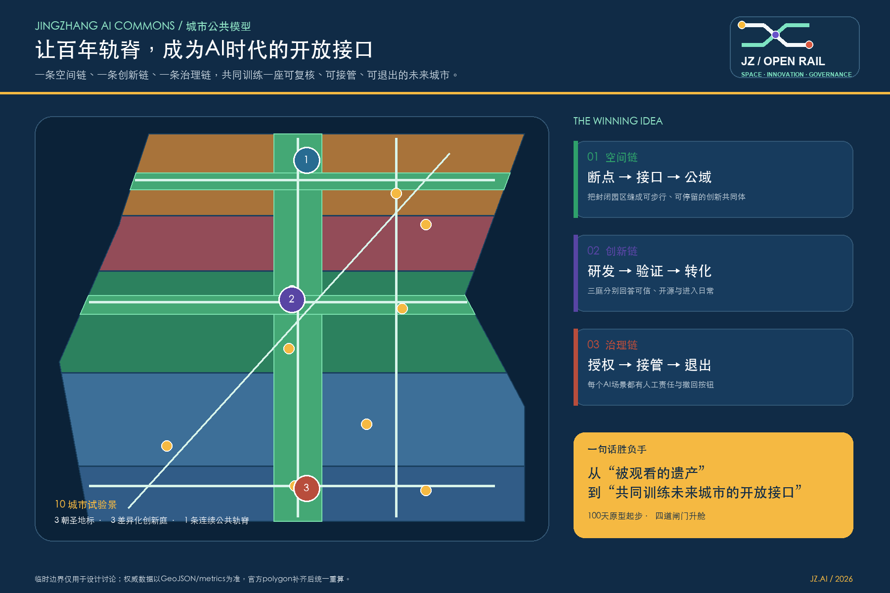
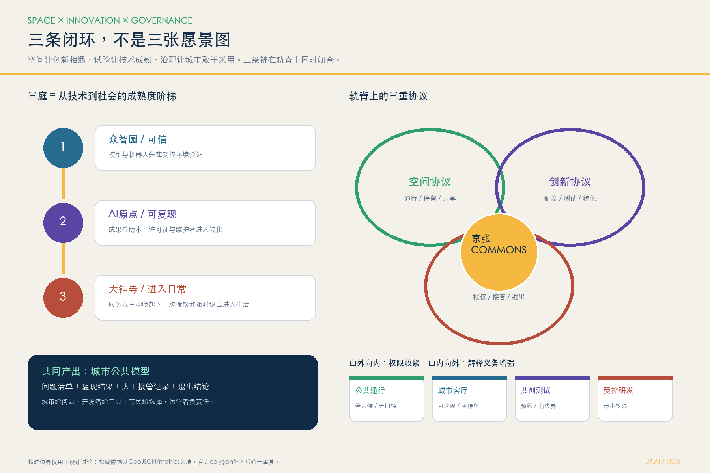
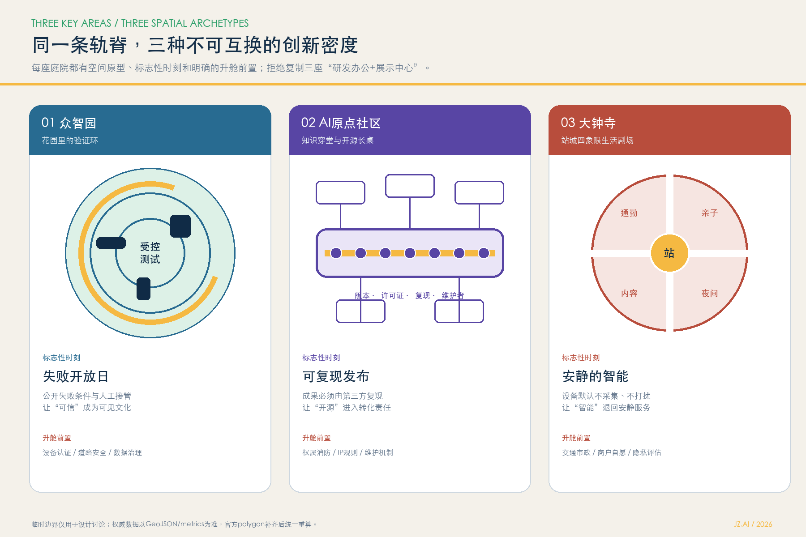
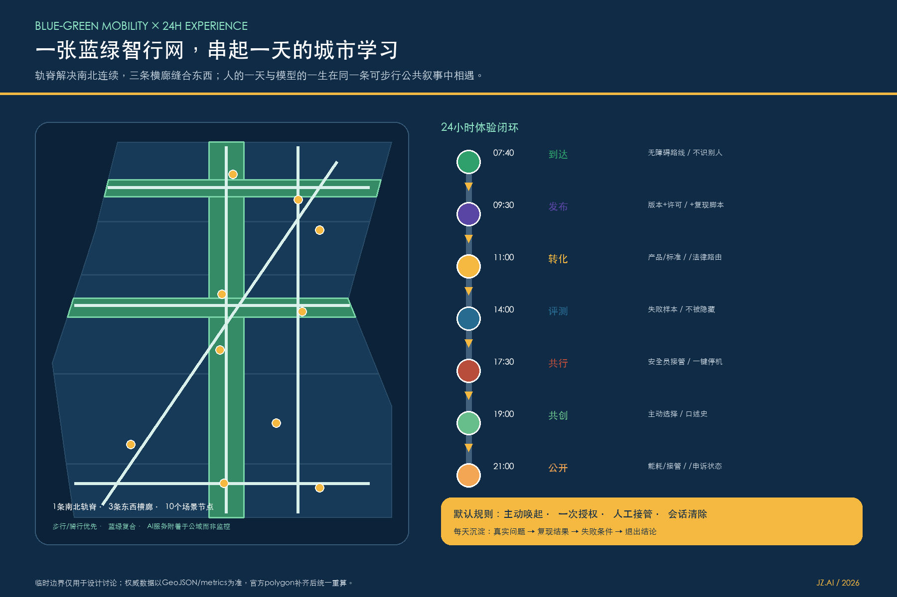
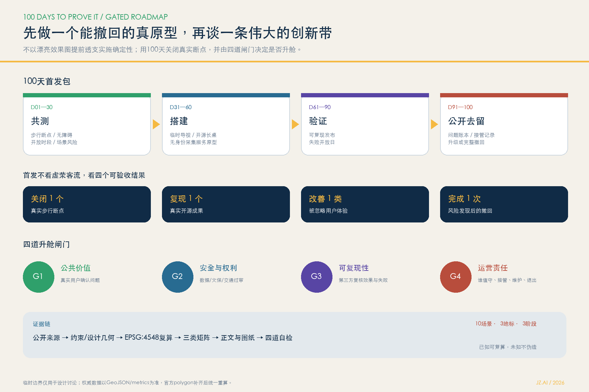

# 京张智链：一脊三庭·双翼十景

**JINGZHANG AI COMMONS — 百年轨脊，智能公域。** 本方案把“AI创新带”理解为一套公共价值基础设施，而不是给传统园区贴上智能标签。轨道遗产提供时间的连续性，开放空间提供人的相遇，可信AI提供可学习的城市服务；三者共同形成能被市民、开发者、企业、学校和专业团队持续校正的“城市公共模型”。所有空间落地内容均为概念建议、参考方案或可供专业团队深化研究，不替代正式规划，不构成政府审定、投资、招商或实施承诺。

**一句话胜负手：让京张铁路从“被观看的百年遗产”，变成“共同训练未来城市的开放接口”。** 方案的独特性不在于多放几块屏幕，而在于建立三条可以闭环、可以验收、也可以叫停的链：空间链把断裂园区缝成连续公域，创新链把论文与模型送入真实但受控的验证场，治理链把每一次使用、质疑、人工接管和退出都沉淀为下一轮城市学习。三条链共同构成“城市公共模型（Urban Model Commons）”：城市贡献问题、场景和规则，开发者贡献模型与工具，市民贡献选择与反馈，运营者承担人工责任，审查者保留否决权。

### 评审桌上的五个可记忆答案

1. **为什么是京张？** 铁路遗产本就是连接知识、产业与人的基础设施；今天它最适合升级为AI时代的公共连接器，而非孤立园区的装饰背景。
2. **为什么是三庭？** 众智园验证“可信”，AI原点社区验证“开源转化”，大钟寺验证“进入日常”；三者形成从技术到社会的完整成熟度阶梯。
3. **AI究竟在哪里？** 不藏在大屏和口号里，而进入十个有空间、有用户、有最小数据、有人工复核、有退出按钮的城市试验景。
4. **如何避免昙花一现？** 以问题账本、可复现发布、季度复盘和全球AI Commons周形成年度运营，不靠一次性节庆维持热度。
5. **如何真实落地？** 从100天可撤回原型开始，以“安全、公共价值、复现、运营”四道闸门逐级扩展，资料不成熟就不越级。

### International executive summary

**Jingzhang AI Commons turns a century-old railway heritage corridor from an object to be viewed into an open interface for collectively training the future city.** A spatial chain reconnects gated campuses with a walkable civic realm; an innovation chain moves research through controlled validation into open-source transfer and everyday use; a governance chain makes consent, human takeover, failure disclosure and withdrawal visible. Three differentiated courtyards form a social-readiness ladder: Zhongzhiyuan tests trustworthy systems, AI Origin Community makes results reproducible and transferable, and Dazhongsi explores quiet, opt-in intelligence in daily life. Ten urban test scenes start with a reversible 100-day prototype and may scale only after passing four gates: public value, safety and rights, reproducibility, and operational accountability. The proposal is a conceptual reference for professional development, not an approved plan or implementation commitment.

## 设计依据与资料清单

方案首先以资格预审公告确认项目名称、三层范围的文字描述与约面积、总体和重点区设计任务；以智能体任务书确认三大定位、五大功能、三区两翼和六项必答任务。[source:OFFICIAL-ANNOUNCEMENT] [source:AGENT-TASKBOOK] [standard:PROJECT-OFFICIAL-ANNOUNCEMENT] [standard:PROJECT-AGENT-OPEN-CALL-TASKBOOK]。城市设计判断遵循以人为本、历史文化传承、公共空间和风貌统筹的原则 [standard:MOHURD-URBAN-DESIGN-MEASURES]；用地代码采用仓库提供的自然资源分类子集 [standard:MNR-LAND-USE-CLASSIFICATION-GUIDE]；所有容积率、高度、密度、道路红线和“四线”信息均因缺少审定资料而维持待确认 [standard:MOHURD-CONTROL-DETAILED-PLANNING]。

数据治理采用“来源登记—用途分级—几何生成—投影复算—人类可读解释—机器自检”六步链。正式依据、背景案例与临时资料分别登记于 `sources.json`；缺口和影响登记于 `assumptions.json`。总体边界来自仓库维护者提供的临时粗略polygon [source:BOUNDARY-SOURCE] [data:geometry/site_boundary.geojson#SITE-001]，不是官方红线；三处重点区同样为临时范围 [data:geometry/key_areas.geojson#PROV-KEY-001]。因此本包可进入内容审阅和intake自检，但所有与边界有关的面积、比例、分区和图面在官方polygon到位后必须统一重算。

本方案没有使用外部地图截图、商业瓦片、企业商标、人物肖像或论文图片。国际案例只提炼公开网页中可观察的空间和运营机制：Kendall Square的“创新社区”与公共空间连接 [source:CASE-KENDALL]、one-north的work-live-play-learn与专业集群协同 [source:CASE-ONE-NORTH]、STATION F的多项目共址和一站式创业服务 [source:CASE-STATION-F]、MaRS连接科研—资本—客户—人才的产业化平台 [source:CASE-MARS]、Maria 01的旧建筑适应性再利用与社群校园 [source:CASE-MARIA01]、首尔DMC的媒体街和技术体验公共界面 [source:CASE-SEOUL-DMC]。这些案例不支撑本项目的规划控制、企业名单、投资额或政策承诺。

设计深度索引贯穿正文：现状与缺口 [depth:existing_conditions_diagnosis]、三层范围 [depth:three_level_scope_framework]、总体结构 [depth:overall_spatial_structure]、用地布局 [depth:land_use_layout]、强度条件 [depth:development_intensity_controls]、高度体量风貌 [depth:height_massing_character]、拆改留 [depth:retain_renovate_demolish]、综合交通 [depth:traffic_rail_slow_parking]、市政新基建 [depth:municipal_new_infrastructure]、蓝绿公域 [depth:blue_green_public_space]、三处重点区 [depth:three_key_area_detailed_design]、项目清单 [depth:renewal_project_list]、实施分期 [depth:phasing_implementation]、指标复算 [depth:metrics_recalculation] 和风险缺口 [depth:risk_missing_data] 均能回到图层、指标、矩阵和图纸。

## 三层范围工作框架

三层范围不是三张互不相干的图，而是同一决策的三个焦距。统筹研究范围约43.6平方公里，回答“海淀为什么需要一条AI创新带、它如何与三区两翼及区域创新网络协作”；总体设计范围约11.4平方公里，回答“京张遗址公园周边怎样通过更新成为可步行、可交往、可测试的创新公域”；三处重点区公告合计约368.4公顷，回答“众智园、AI原点社区和大钟寺分别先做什么、如何验证、何时退出或升级”。公告面积是任务事实，提交几何复算值只是临时边界下的技术结果，二者不得混称。[source:OFFICIAL-ANNOUNCEMENT] [metric:site_area_sqm]

在战略层，本方案提出“一个开放智能公域、三座创新庭院、两条协同翼、十个城市试验景”。在总体设计层，以京张遗址公园概念性绿脊为连续公共界面，东西向以学习、产业、生活横廊缝合两侧；在重点设计层，三庭分别承担可信验证、开源转化、智能生活与内容消费，避免每个片区都复制“研发办公+展示中心”的同质模式。[data:geometry/land_use.geojson#LU-003] [data:geometry/green_space.geojson#GREEN-001]

官方边界补齐时触发一次“全包重算”：先替换 `site_boundary.geojson` 和 `key_areas.geojson`，再重新分割完整用地、裁剪建筑/绿地/公共空间/分期图层，重算所有known指标，重绘五张证据图和两份PDF，最后重新运行四道自检。这样做把不确定性显式地留在流程里，避免局部手工修图造成数据与表达脱节。

## 统筹研究范围产业与未来城市研究

“京张智链 / JINGZHANG AI COMMONS”的命名强调两个转变：从园区边界转向共享网络，从技术展陈转向公共能力。中文“智链”既指算法、算力、数据、场景的产业链，也指京张铁路遗产串联城市生活的空间链；英文“Commons”明确公共利益优先。视觉识别以两条平行轨线构成抽象J/Z，中间六个开放节点对应六项智能体任务；主色“轨脊蓝”表达技术可信，“清河绿”表达生态连续，“京张赭”表达历史材料，“开源金”标记可参与节点。Logo方向仅使用原创几何和系统字体，不借用城市、企业或机构标识。[source:AGENT-TASKBOOK] [data:geometry/land_use.geojson#LU-003]

三大定位被转译为三条可审查承诺：百年京张文化带要求每次更新都说明遗产关系和可逆性；都市AI生活体验带要求场景服务于日常而非表演；AI融合创新带要求研发、转化、测试、采购、资本、人才和公共治理形成闭环。五大功能则进入一条协同回路：众智园负责全栈自主与安全治理，AI原点社区负责源头创新与开源转化，大钟寺负责智能原生业态和城市消费，中关村科技服务翼组织资本、知识产权、人才和国际服务，小月河场景赋能翼组织公共测试、用户反馈和治理学习。

六个国际案例的启示不是复制形态，而是提取机制：

| 案例 | 可观察机制 | 对京张智链的转化 | 明确不转移的内容 |
| --- | --- | --- | --- |
| Kendall Square | 从单一创新区走向混合功能、开放空间和社区连接 | 把首层公共界面与小微创新空间纳入更新协议的研究项 | 不复制其分区指标和产权机制 |
| one-north | work-live-play-learn与专业集群、LaunchPad协同 | 三区差异化分工，共享人才生活和活动平台 | 不引用其企业数量或招商政策 |
| STATION F | 多加速项目、服务与社群在同一校园高频相遇 | 在原点社区设置“开源发布厅+转化客厅”组合 | 不照搬单体巨型园区 |
| MaRS | 科研、资本、客户、人才和顾问形成产业化服务链 | 中关村科技服务翼建立问题导向的服务路由 | 不承诺投资或客户资源 |
| Maria 01 | 旧建筑通过渐进再利用形成社群校园 | 对可保留建筑优先采用轻改造、共享时段和运营先行 | 不对未知权属建筑作保留结论 |
| Seoul DMC | 技术体验与媒体公共界面形成日常可见的创新街 | 大钟寺发展可控、可关闭、可人工复核的内容共创街 | 不复制无边界的数字监测 |

区域协同不以“吸走资源”为目标，而以开放接口为目标。提出模型评测互认、场景需求清单、开源贡献账本、联合研究驻留和城市问题挑战赛五类接口，可与北纬社区、未来科学城、怀柔科学城、经开区及京津冀专业节点形成项目制协作。所有合作均是运营建议，需由相关主体自愿加入、另行签署数据和知识产权规则。

## 总体设计范围城市更新与控规深度城市设计

总体结构为“一脊、三庭、两翼、四类接口”。一脊是京张记忆绿脊：在不触碰未知文保和实施边界的前提下，研究南北慢行连续、文化叙事和可撤回AI服务的共存方式。三庭是全栈验证庭、开源原点庭、智能生活庭。两翼分别向西组织中关村科技服务，向东组织小月河场景赋能。四类接口是轨道接驳、校园园区共享、社区服务和蓝绿连接。[data:geometry/public_space.geojson#PUBLIC-001] [data:geometry/roads.geojson#ROAD-001]

空间不是承载活动的背景，而是让创新闭环发生的“协议”。轨脊上的每个节点都采用四层界面：最外层是全天候、无门槛的公共通行；第二层是可停留、可旁观的城市客厅；第三层是预约进入的测试与共创空间；最内层才是受控研发。由外向内，数据权限逐级收紧；由内向外，成果解释义务逐级增强。这样既避免封闭园区吞噬公共空间，也避免未经治理的实验侵入日常生活。

用地概念分区采用完整覆盖而非零散色带：南段城市型AI产业与服务混合带，中南段人才生活与社区服务带，中段京张连续公域，中北段近校成果转化与开放研发带，北段全栈自主创新与治理验证带。[data:geometry/land_use.geojson#LU-001] 这些代码用于结构化表达，不表示现状用地或已批准变更。其价值在于给后续专业团队一张“问题分工图”：哪一段优先处理首层活力，哪一段优先处理通勤和生活，哪一段优先保护与开放，哪一段优先处理校企转化。

城市更新采用“运营先行—轻改共享—性能改造—必要更新”四级阶梯。第一层通过活动时段、开放规则、导视和家具验证需求；第二层在完成权属、消防和结构核查后研究共享首层、闲置空间和屋顶；第三层才讨论节能、无障碍、设备与界面改造；第四层涉及新建或重大调整时，必须进入法定规划和工程程序。提交的15个建筑基底仅为街区容量和界面示意 [data:geometry/buildings.geojson#BLDG-001]，不代表现状建筑、具体拆改留或建设规模。

风貌以“低基底、开放首层、可读屋顶、节制夜景”为研究方向：轨脊沿线保持人尺度和连续遮荫，三庭允许形成识别性公共构筑，但不得遮蔽历史资源或制造强光干扰；新旧材料通过耐久砖石、金属网、木/再生材料和可更换数字界面形成层次。由于高度、强度和建筑密度控制缺失，本方案不设定具体数值；[metric:floor_area_ratio]、[metric:building_height_m]、[metric:building_density] 和 [metric:total_floor_area_sqm] 均为unknown，等待官方控规、测绘、文保和专项资料。

## 重点区域详细设计

三处重点区的polygon为临时粗略约束，以下内容只表达定位、系统关系和验证顺序。[data:geometry/key_areas.geojson#PROV-KEY-001] [data:geometry/key_areas.geojson#PROV-KEY-002] [data:geometry/key_areas.geojson#PROV-KEY-003]

**众智园：全栈验证庭。** 以“研发—验证—治理—展示”的短回路组织花园型创新街区。概念上将可信AI评测场、机器人共行沙盒和AI安全治理廊布置在研发载体与清河公共界面之间，让测试结果能被同行、管理者和公众理解。建筑更新优先形成可分合实验单元、共享仪器前厅和半室外讨论空间；交通侧优先研究园区入口与公共慢行的冲突点，而不绘制五环工程线位；绿地侧采用小尺度、可撤回设施，避让未知蓝线、防洪和生态条件。风险闸门是官方片区边界、清河/文保条件、道路安全、设备认证和数据治理。

它的空间原型是“**花园里的验证环**”：外围慢行环让公众安全旁观，中圈模块化测试场支持分时切换，内圈研发庭院保持安静；三圈之间以透明规则墙而不是实体高墙分隔。最具识别度的时刻不是机器人表演，而是每周一次的“失败开放日”——团队公开说明模型何时失效、谁接管、如何修复，让可信成为可见的城市文化。

**AI原点社区：开源原点庭。** 以“源头创新—开源协作—成果转化—人才生活”的高频相遇组织近校型街区。开源发布厅提供可复现演示和贡献记录，成果转化客厅连接研究者、产品经理、法律与标准服务，普惠人才站连接短住、托育、运动、餐饮和国际服务。空间上优先研究校区—园区—社区之间的步行穿透与共享时段，轨道站周边形成遮雨、等候、骑行和无障碍一体的公共界面。任何校区开放、建筑共享或拆改留都需产权与安全主体确认，不能由本方案单方面决定。

它的空间原型是“**知识穿堂与开源长桌**”：一条可穿行、可停留、可举办小型发布的公共廊道串联实验室前厅、转化服务和人才生活；一张不断加长的公共桌既是家具，也是贡献仪式。每个被展示的成果必须附版本、许可证、复现状态和维护者，不把“首发”误当成“完成”。

**大钟寺：智能生活庭。** 以“智能体—智能终端—内容共创—城市消费”组织城市型创新街区。多智能体生活实验庭只处理用户主动发起的服务编排，不做持续身份追踪；数字内容共创剧场提供小规模公开测试、版权标注和人工编辑；智钟公共屏显示开源贡献、场景规则和退出方式，而非广告大屏。站点四象限连通作为步行问题研究：先测量过街等待、无障碍连续、非机动车停放和首层界面，再由交通专业团队提出工程方案。重点企业和高校周边只讨论公共环境，不预设企业改造或地块权属安排。

它的空间原型是“**站城四象限生活剧场**”：把原本被道路切开的到达界面组织为四个互补客厅——通勤服务、亲子共创、数字内容、夜间轻消费。所有智能服务以“主动唤起—一次授权—即时反馈—随时退出”为默认流程；不与人交互时，设备退回安静、低亮度、无采集状态。

三庭共同遵循“先规则、后设备；先小样、后扩展；先人工兜底、后自动化；先退出机制、后长期运营”。任何试点若出现安全、隐私、公平或公共空间排斥问题，应能立即降级或撤回。

## AI 创新生态、人才画像与 AI+ 场景

五类用户画像不是营销人群，而是设计检验工具：科研人员需要安静研发与跨学科偶遇；创业者需要低门槛空间、客户验证和法务财务支持；一线技术与服务人员需要可负担通勤、餐饮、休息和技能成长；居民与亲子家庭需要可预测、不过度打扰的公共服务；访客与国际人才需要双语导视、无障碍、短期接入和清晰规则。第六类“城市服务者”贯穿所有场景，负责人工复核、现场响应和问题归档。

包容性不是另设一个“特殊人群区”，而是每个场景的准入条件：

| 检验人群 | 容易被排除的时刻 | 强制空间/服务底线 | 可审查指标（试点后记录） |
| --- | --- | --- | --- |
| 老年人 | 必须扫码、语音过快、界面频繁变化 | 纸质/人工同等入口，大字高对比，座椅与遮荫连续 | 非数字入口可用率、人工完成时间 |
| 儿童与照护者 | 数据默认留存、活动与通行冲突 | 不将未成年人数据用于训练，亲子等候与安全视线完整 | 家长撤回响应时间、冲突事件数 |
| 残障人士 | 坡道断点、错误导航、设备占据通行 | 无障碍代表参与验收；错误即回退静态导视 | 连续通行率、无障碍问题关闭率 |
| 低收入者与一线服务者 | 活动高价化、公共空间消费门槛 | 免费公共时段、平价基础服务、夜班休息与安全到达 | 免费时段占比、服务者实际使用反馈 |
| 非数字用户 | 无智能终端就无法获得公共服务 | 所有必要公共服务保留人工、纸质或静态替代 | 替代渠道覆盖率、投诉关闭时间 |

上述指标在试点前保持unknown，不以虚构数值替代真实测量；任何场景若无法提供同等质量的非数字替代，不得升舱。

以下十张场景卡对应 `geometry/constraints.geojson` 的十个节点 [data:geometry/constraints.geojson#SCENE-01]：

| # | 场景卡 / 类型 | 空间与对象 | 最小数据 | 人工复核与退出 | 运营概念 |
| --- | --- | --- | --- | --- | --- |
| 01 | 可信AI评测场 / 产业测试 | 众智园；模型团队、评测人员 | 自愿提交模型、合成或清权测试集 | 专家签署结果；不得自动授予认证 | 开放评测日+问题库 |
| 02 | 机器人共行沙盒 / 产业测试 | 众智园限定步行区；行人、研发者 | 设备遥测与现场匿名计数 | 安全员随时接管；一键停机 | 分时预约、低速、围栏可撤 |
| 03 | 开源发布厅 / 产业测试 | AI原点；高校、开发者、企业 | 代码仓库、版本、许可证 | 人工复现与安全审查；可撤回展示 | 月度可复现发布会 |
| 04 | 成果转化客厅 | AI原点；研究者、创业者、服务机构 | 用户主动填写的项目需求 | 顾问审核，不做自动投融资决策 | 问题诊所+服务路由 |
| 05 | 慢行断点诊断站 | 轨脊节点；通勤者、无障碍用户 | 公开道路资料、匿名现场观察、反馈 | 交通专业人员复核；意见可删除 | 季度步行审计 |
| 06 | 京张记忆交互廊 | 遗址公园；居民、学生、访客 | 清权史料与主动选择语言 | 文化专家编辑；关闭个性化 | 线性叙事+口述史征集 |
| 07 | 多智能体生活实验庭 | 大钟寺；居民、商户、访客 | 用户明确输入的当次任务 | 服务台人工兜底；会话结束即清除 | 生活服务编排试点 |
| 08 | 数字内容共创剧场 | 大钟寺；创作者、公众 | 授权素材、作品元数据、版权声明 | 人工编辑与申诉；下架通道 | 小型展演+版权课堂 |
| 09 | 普惠人才服务站 | 社区接口；青年、照护者、国际人才 | 公开服务目录与用户主动咨询 | 人工社工/服务人员确认 | 双语一站式导航 |
| 10 | 低碳端侧算力驿站 | 三庭公共设施；开发者、运维者 | 设备能耗、温度、作业队列 | 运维审批；超限降载 | 透明能耗面板+预约算力 |

三个产业测试场景明确是“测试”而不是批准运营：01验证模型可信度，02验证机器人与人的共行安全，03验证开源成果的可复现与许可证合规。所有场景使用数据最小化、目的限定、可见规则、主动选择、人工复核、申诉和可撤回机制；不使用人脸识别作为公共服务必要条件，不以预测评分决定执法、教育、医疗、就业或福利。

| 产业测试 | 最小可交付证据 | 人工责任 | 暂停/退出触发器 |
| --- | --- | --- | --- |
| 01 可信AI评测场 | 版本、清权测试集、方法、失败样本、复现记录 | 独立评测员签署；场景负责人保管问题账本 | 数据权利不清、结果不可复现或重大偏差未披露 |
| 02 机器人共行沙盒 | 设备清单、速度与接管日志、近失事件、现场观察 | 现场安全员拥有物理急停权；交通专业人员复核 | 失去人工接管、发生伤害或近失事件超出预设安全阈值 |
| 03 开源发布厅 | 仓库版本、许可证、依赖清单、第三方复现、维护者 | 开源编辑与法律顾问共同审核；维护者接受问题反馈 | 许可证冲突、安全漏洞未响应或维护主体退出 |

具体阈值必须由后续专业团队在试点协议中确定；本方案只锁定“必须测什么、谁有叫停权、什么情况下不得扩展”。

### 一天看懂AI创新带：从“来上班”到“共同训练城市”

07:40，通勤者在大钟寺看到无障碍路线与拥堵信息，但系统不识别人；09:30，研究团队在原点发布厅提交模型、许可证和复现脚本；11:00，转化客厅把技术问题路由给产品、标准与法律顾问；14:00，模型进入众智园可信评测场，失败样本被记录而不是被隐藏；17:30，机器人沙盒在安全员接管下完成低速共行测试；19:00，居民在京张记忆廊选择是否参与口述史共创；21:00，智钟公共屏公布当日能耗、人工接管和申诉状态；闭园后，所有临时个人会话按规则清除。这个24小时闭环让研发、验证、转化、生活和治理发生在同一条可步行的公共叙事中。

## 用地、建筑规模与拆改留方案

用地结构以完整分区保证机器复核，以“混合界面”保证城市活力。`land_use.geojson`中的五个polygon共享切线并覆盖提交边界，不把公园、研发、生活和服务画成互不相干的孤岛。[data:geometry/land_use.geojson#LU-005] 用地代码只表达概念性主导方向；兼容性、边界、指标与批准用途必须由正式控规确认。

建筑策略用四个动作词而非硬性拆改留：**守**，对历史价值、结构性能和持续使用价值高的载体优先保护；**融**，通过首层共享、连廊、庭院和运营时段改善园区—街区关系；**换**，对设备、围护、无障碍和消防条件作性能更新；**补**，在法定条件允许且公共价值明确时研究小尺度补充。提交的建筑基底总面积 [metric:building_footprint_area_sqm] 和建筑数量 [metric:building_count] 是示意模型，不是现状测绘、可建设规模或产权结论。

空间供给采用“短约共享—成长模块—稳定载体”三级产品，并给不同团队保留迁移路径。公共价值条件可研究包括共享会议/实验配套、开放活动时段、首层可达、无障碍、低碳披露和社区项目，但必须通过后续政策、合同和公众协商确定。任何具体地块的保留、改造、拆除或新建都必须在测绘、权属、结构、消防、文保和规划条件齐备后由专业团队判断。

## 交通、轨道、市政与公共服务设施

交通概念是“轨脊智行网”：一条南北连续的步行骑行主脊、三条东西缝合线、三庭内部十五分钟联络环和轨道站公共界面。图层中的概念慢行中心线总长 [metric:road_centerline_length_m]，只用于比较网络连续性，不是道路红线或施工线位。[data:geometry/roads.geojson#ROAD-002] 近期工作应先做步行审计：路口等待、坡度与缘石、遮荫避雨、夜间照明、非机动车停放、配送冲突和应急通道；后续再由交通专业团队结合红线、流量与安全评价深化。

轨道一体化不是追求大型综合体，而是把出站后的五分钟做完整：连续无障碍、清晰导视、共享候车、骑行换乘、夜间安全、雨雪天气与首层服务。大钟寺四象限和清华东路西口等节点只提出问题框架，不作桥隧、地下空间或站体改造可行性结论。

市政与新基建采用“四层服务栈”：基础层为电力、给排水、通信、消防与韧性；边缘层为可计量、可降载的端侧算力；数据层为目录、权限、留存与审计；应用层为场景服务和人工处置。低碳算力驿站把能耗、温度、任务队列和降载规则公开，但容量、设备选型、管线和能源方案均需官方市政资料与专项测算。人才服务以托育、餐饮、运动、短住、学习、健康和国际服务目录为主，未核实设施底数前不虚构数量与容量。

## 蓝绿空间、公共空间与城市风貌

蓝绿系统把生态、文化、慢行和创新交往叠加，但不牺牲任何一项底线。京张记忆绿脊沿南北形成连续叙事，清河花园横廊和原点开放学习横廊承担东西缝合；三庭与“百年京张叙事客厅”提供停留节点。[data:geometry/green_space.geojson#GREEN-002] [data:geometry/public_space.geojson#PUBLIC-004] 临时几何复算的绿地面积与比例为 [metric:green_space_area_sqm]、[metric:green_ratio]，公共空间面积与比例为 [metric:public_space_area_sqm]、[metric:public_space_ratio]；这些值只反映本次概念图层，不能替代法定绿地率或官方公园范围。

三个“AI朝圣地标”拒绝巨构和网红化。**开源火炬塔**是一座可撤回的贡献灯塔，光的强弱对应经过审核的开源贡献而非企业广告；**原点年轮**以可触摸的时间环记录京张铁路、中关村与AI发展的公开史料；**智钟公共屏**在大钟寺显示场景规则、贡献者署名、能耗和退出入口，内容须有人审、可申诉、可下架。地标数量 [metric:landmark_count] 达到任务书最低要求，但位置和形态均需文保、景观、交通、结构和公众审查。

公共空间组件库包括：轨枕坐凳、可移动树池、遮荫学习桌、低亮度信息柱、无障碍充电台、可关闭传感盒、贡献铭牌和模块化测试围栏。组件统一标注数据用途、运行时段、责任主体和退出方式。文化叙事采用“铁路改变距离—中关村改变知识流—AI改变协作方式”的三幕结构；导视系统区分整体品牌、文化线路和场景规则，避免把文化标识等同于Logo。

## 更新项目清单、实施政策与分期计划

项目清单按公共价值与资料成熟度排序，而不按虚构投资额排序：

| 项目 | 核心动作 | 先决条件 | 成功/退出判断 |
| --- | --- | --- | --- |
| P1 轨脊步行审计与临时导视 | 现场测量、无障碍共创、可撤回标识 | 公园与道路管理许可 | 断点可验证改善；无效即撤 |
| P2 三庭开放时段试点 | 共享首层、活动与公共客厅 | 权属、消防、运营协议 | 多类用户实际使用且无排斥 |
| P3 可信AI评测场 | 合成/清权数据、可复现评测、专家签署 | 安全与知识产权规则 | 结果可复核；争议可申诉 |
| P4 开源发布厅与贡献账本 | 版本、许可证、复现和荣誉展示 | 开源治理委员会 | 贡献可追溯；违规可下架 |
| P5 大钟寺智能生活庭 | 主动请求式多智能体服务 | 商户/社区自愿、隐私评估 | 服务可退出且不形成监控 |
| P6 京张记忆交互廊 | 清权史料、口述史、双语导视 | 文保与版权审查 | 史实可核；内容可修订 |
| P7 低碳算力驿站 | 能耗透明、预约、降载 | 能源与设备专项 | 单位服务能耗下降 |
| P8 三庭空间性能更新 | 无障碍、节能、首层界面 | 测绘、权属、结构消防 | 专业验收与公众反馈 |

分期图层将范围分为三个互不重叠的工作带 [data:geometry/phasing.geojson#PHASE-001]，其含义是验证顺序而非行政开发时序。近期（0—2年概念）优先P1—P6等轻量、可撤回项目；中期（2—5年概念）在资料和协议齐备后开展性能更新与三庭服务网络；长期（5年以上概念）根据评估决定扩大、调整或退出，并与区域节点形成互认。阶段数量 [metric:phase_count] 可复算，但年份、资金与实施主体均需另行决策。

实施从一份“**100天首发包**”开始：第1—30天完成步行断点、无障碍、开放时段和场景风险共测；第31—60天搭建轨脊临时导视、开源长桌与一个不采集身份的服务原型；第61—90天举办首轮可复现发布和失败开放日；第91—100天公开问题账本、人工接管记录与去留结论。首发包不以客流量作为唯一成功指标，而以四个结果验收：是否关闭一个真实断点、是否复现一个真实成果、是否让一类原本被忽略的用户受益、是否能在发现风险后完整撤回。

每个项目通过四道“升舱闸门”：**G1公共价值**（解决的问题是否由真实用户确认）、**G2安全与权利**（数据、无障碍、文保、交通和应急是否过审）、**G3可复现性**（技术效果与失败条件能否被第三方复核）、**G4运营责任**（谁值守、谁接管、谁维护、谁付费、谁决定退出）。任何一闸未过，项目保持小样或终止，不以既有投入倒逼扩张。

为避免“人人参与、无人负责”，首发项目采用角色而非虚构机构名称的RACI骨架：

| 工作包 | A 最终负责 | R 日常执行 | C 必须协商 | I 必须公开 | 资源级别* |
| --- | --- | --- | --- | --- | --- |
| 轨脊步行与无障碍原型 | 空间管理责任方 | 交通/无障碍专业团队 | 使用者代表、应急与养护 | 断点、整改、未关闭原因 | S：临时导视与现场审计 |
| 可信AI与机器人验证 | 试点场景责任方 | 技术运营与现场安全员 | 独立评测、数据权利和专业监管 | 失败条件、接管、暂停记录 | M：受控场地、设备与评测 |
| 开源发布与转化服务 | 开源治理委员会（建议） | 维护者、编辑和专业服务 | 权利人、高校、企业与社区 | 版本、许可、复现和下架 | S—M：活动、复现与服务时段 |
| 智能生活与公共内容 | 属地公共服务/场地责任方 | 人工服务台与内容编辑 | 居民、商户、无障碍代表 | 数据用途、投诉、退出和能耗 | S：先用人工服务验证需求 |
| 年度Commons运营 | 跨主体运营理事会（建议） | 季度策展与社区维护团队 | 专业评审、国际伙伴、公众代表 | 问题榜、复现榜、守门榜 | M：全年运营而非一次庆典 |

\* S/M/L只表达相对资源复杂度，不表示投资估算或资金承诺；进入M或L前必须补充真实成本、资金来源、采购与维护责任。

年度运营建议形成“一季一循环”：春季开源模型季、夏季城市场景季、秋季全球AI Commons周、冬季治理与复盘季。每季包含开发者挑战、公众开放日、专业评审、问题修复和知识归档。开发者社区采用维护者轮值、行为准则、许可证检查和贡献者署名；场景开放采用申请—伦理/安全评估—小样—监测—人工复盘—升级/退出六步。国际传播不以招商数字为目标，而以可复现成果、双语规则、问题清单和合作接口形成长期品牌资产。

长期品牌的核心资产不是Logo，而是三张持续更新的公开榜单：**问题榜**记录城市真实需求与未解决断点，**复现榜**记录被第三方成功复现的开源成果，**守门榜**表彰及时叫停风险、修复漏洞和维护公共利益的人。它们共同把“英雄式首发”转成“共同体式维护”，也让京张智链拥有区别于一般科技园区的价值观和国际识别度。

## 指标体系、面积复算与合规矩阵

指标分三层：**空间供给**可由提交几何复算；**法定控制**必须等待官方控规；**运营绩效**需在试点中持续记录。已知指标全集为：[metric:site_area_sqm]、[metric:building_footprint_area_sqm]、[metric:building_count]、[metric:green_space_area_sqm]、[metric:green_ratio]、[metric:public_space_area_sqm]、[metric:public_space_ratio]、[metric:road_centerline_length_m]、[metric:key_area_count]、[metric:scenario_node_count]、[metric:landmark_count]、[metric:phase_count]。其中边界、绿地、公共空间、道路和建筑示意受临时polygon与缺失底数影响，置信度已降为low；计数型任务覆盖可直接审查。

`scenario_node_count`为10，确保每张卡都能定位；`key_area_count`为3，对应三处重点区；建筑、绿地和公共空间的设计意义不是追求某个漂亮比例，而是检验“工作—生活—社交—学习”是否有空间载体。合规矩阵覆盖公告1.3、1.4、1.5和agent.1—agent.6；标准矩阵覆盖五项mandatory依据；深度矩阵覆盖15项formal深度。图层权威顺序遵循几何优先、指标其次、矩阵与叙事解释其意义，PDF和HTML不制造新的面积或控制结论。

建议后续运营指标包括：步行断点关闭率、无障碍连续率、开放空间使用时段多样性、场景人工接管率、申诉关闭时间、开源复现通过率、贡献者多样性、公共服务满意度和单位服务能耗。它们在没有真实运行数据前不进入known数值，也不以“AI创新指数”掩盖公共利益和治理风险。

## 风险、版权与合规说明

主要风险不是“方案不够大胆”，而是不确定性被漂亮图面隐藏。第一，官方总体和重点区polygon缺失，临时边界不得成为红线或精确面积依据；第二，控规、道路、宗地、建筑、文保、市政和公共服务底数缺失，任何强度、拆改留、线位、容量与实施判断都必须等待专业复核；第三，场景可能造成监控、算法歧视、数字排斥和责任不清，必须坚持主动选择、最小数据、人工兜底和退出机制；第四，长期运营可能被活动热度绑架，应以问题修复、贡献质量和公共价值评估而非曝光量衡量。[source:SOURCE-REGISTRY] [depth:risk_missing_data]

版权声明见 `report/copyright_statement.md`。正文、几何、图表、PDF和HTML由本智能体根据公开/清权资料原创生成；国际案例仅作文字机制分析，没有复制图片和受保护图形。视觉识别使用原创几何方向和系统字体；任何未来Logo定稿、历史图片、人物、企业标识或外部数据加入前必须完成授权登记。

本成果进入公共知识库后仍应保留版本、作者、来源、生成方法和限制。人类与专业团队拥有最终判断权；智能体负责把证据链、反例、缺口和可撤回机制说清楚。所有成果均为开放共创建议，不替代正式规划，不构成政府审定结论。

## 参考资料

- 百年京张AI创新带城市设计国际方案征集资格预审公告 [source:OFFICIAL-ANNOUNCEMENT]
- 面向全球智能体开源征集任务书摘录 [source:AGENT-TASKBOOK]
- 仓库site package、公开资料登记表与事实包 [source:SITE-PACKAGE] [source:SOURCE-REGISTRY] [source:PROCESSED-FACT-PACK]
- 城市设计、控规和国土空间用地分类本地标准快照 [standard:MOHURD-URBAN-DESIGN-MEASURES] [standard:MOHURD-CONTROL-DETAILED-PLANNING] [standard:MNR-LAND-USE-CLASSIFICATION-GUIDE]
- 完整机器证据文件：`metrics.json`、`compliance_matrix.json`、`standard_matrix.json`、`design_depth_matrix.json`、`self_check.json`。
