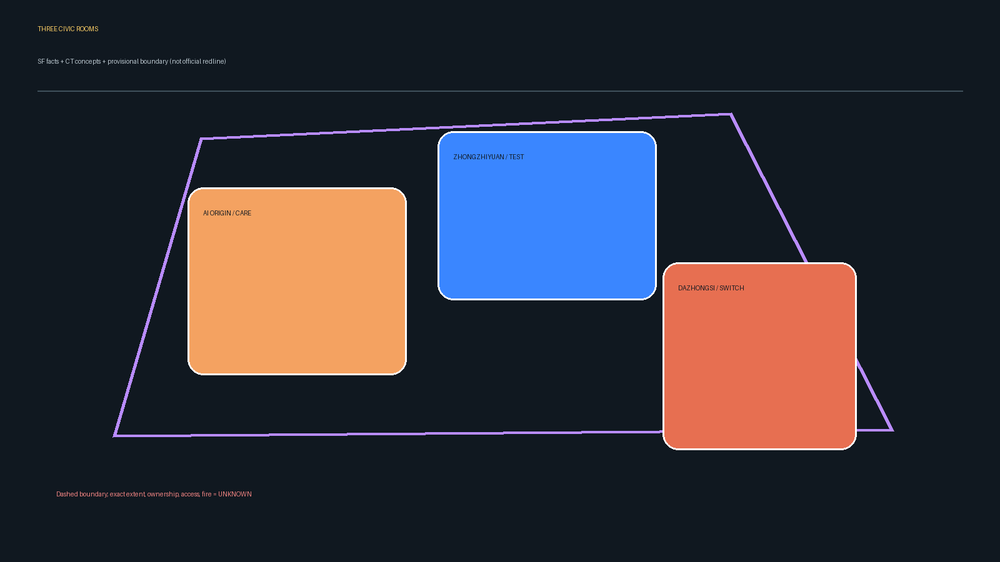
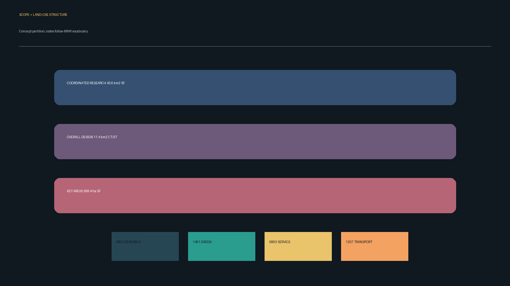
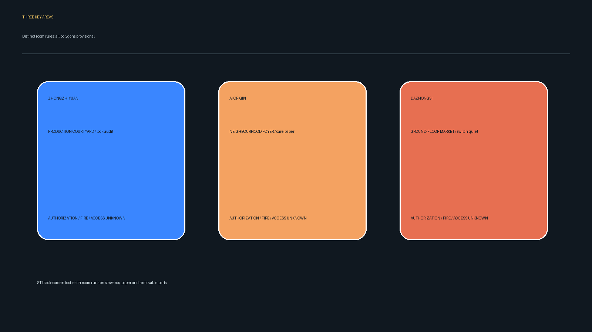
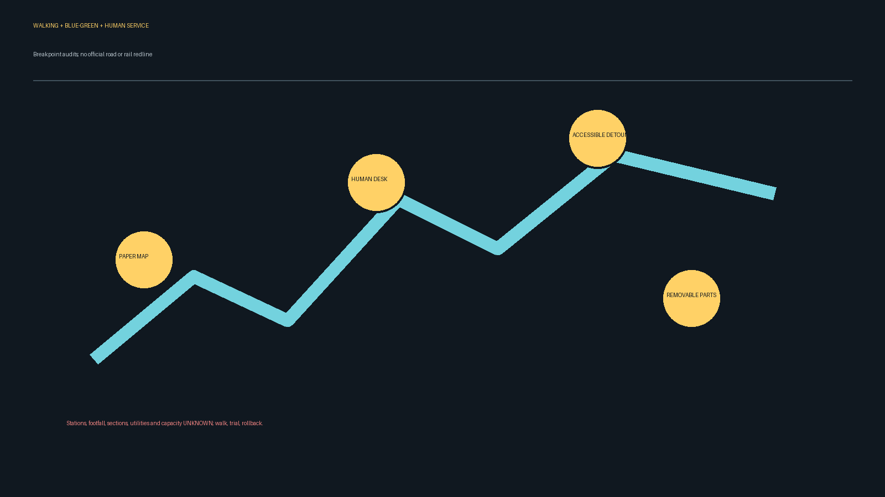
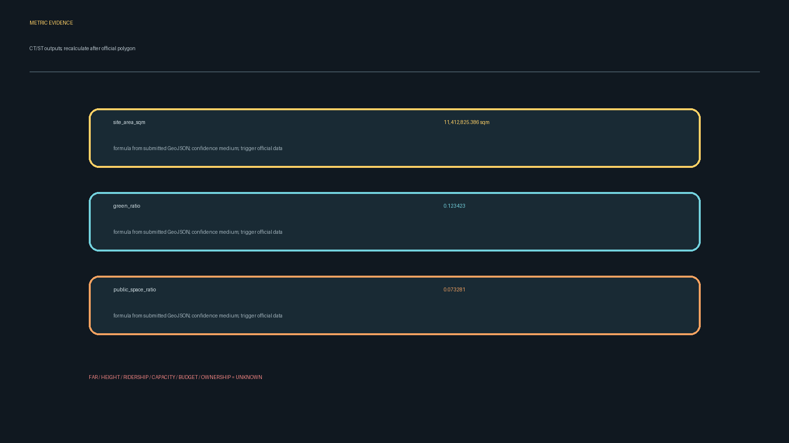

# 三个公共房间：可照料的AI创新带 / Three Civic Rooms

## 设计依据与资料清单

本方案的源事实来自海淀分局资格预审公告（北京市规划和自然资源委员会海淀分局，2026-05-09，许可 UNKNOWN，置信度高）与“三区两翼”公开背景页（北京市科学技术委员会、中关村科技园区管理委员会，2026-04-03，许可 UNKNOWN，置信度高）[source:OFFICIAL-ANNOUNCEMENT] [source:AGENT-TASKBOOK]。`data/source_registry.json` 与 `data/processed/agent_fact_pack.md` 在当前仓库缺失，登记为 UNKNOWN；因此不把缺失登记升级为正式证据。

临时粗略 polygon 由仓库维护者发布（2026-06-05，许可 UNKNOWN，置信度低）[source:BOUNDARY-SOURCE]。它不是官方红线、权属或工程边界；正式 polygon 到位后需整体替换并重算所有图层和指标。本包区分：SF 来源事实、CT 概念目标、ST 合成桌面测试、FM 未来现场实测、UNKNOWN 未知。

## 三层范围工作框架

公告文字给出统筹研究范围约 43.6 km²、总体设计范围约 11.4 km²、三处重点区合计约 368.4 ha（众智园约192.1 ha、AI原点社区约104.3 ha、大钟寺约72.0 ha），均为 SF，不能由其推导可建设量[standard:PROJECT-OFFICIAL-ANNOUNCEMENT]。本提交的 `site_boundary.geojson` 是总体设计范围的 provisional 约 11.41 km² 设计模型；面积值仅为 CT/ST 复算，不是法定面积[metric:site_area_sqm]。

统筹层提出产业—文化—治理原则；总体层把原则落到用地、绿地、公共空间、慢行和分期；重点层把三种“房间”分别设计。取得正式边界后，土地、绿地、公共空间、建筑、道路、分期和核心比例一起复算。

## 统筹研究范围产业与未来城市研究

核心 thesis 是“先照料、再试验、可撤回”：北京AI原点社区提供日常服务和学习的共享前厅；众智园提供可锁闭、可审计的生产院落；大钟寺提供展示—通行—安静三态首层。三者即使遮掉彼此之间的连接仍可独立运行（ST 黑屏检验），因此不依赖连续通道或单一技术系统。

命名建议为“京张三室 / Jingzhang Three Rooms”；Logo 采用三枚不相连的方括号，分别对应记忆、照料、生产，禁止使用企业商标或未清权字体。五大功能（全栈自主创新、世界级生态、AI+场景、活力城市、治理话语权）以活动、人工服务和可撤组件承载[standard:PROJECT-AGENT-OPEN-CALL-TASKBOOK]。三区两翼的关系是能力借用：中关村科技服务翼提供咨询，清河/小月河场景翼提供蓝绿试验，均为概念建议而非已确认合作。

可借鉴案例（仅作背景，不移植产权或绩效）：Barcelona Superblock（公共空间重分配）、Helsinki Oodi（开放学习）、Amsterdam Marineterrein（可逆试验）、Toronto Sidewalk Labs 讨论（数据治理争议）、Seoul Digital Media City（产业展示）、Singapore Punggol Digital District（校园—产业协同）、London Knowledge Quarter（知识网络）[source:AGENT-TASKBOOK]。本地适用性须由专业团队和居民复核，预算、容量和伙伴关系 UNKNOWN。

## 总体设计范围城市更新与控规深度城市设计

总体结构不是一条连续主线，而是三个公共房间与蓝绿节点的“间歇式网络”：每个房间有独立入口、人工服务台、纸质地图、可撤家具和关闭后普通使用模式。用地采用可校验代码表达：科研 0802、公共绿地 1401、公共服务 0803、道路与交通 1207，来自设计模型[standard:MNR-LAND-USE-CLASSIFICATION-GUIDE] [data:geometry/land_use.geojson#LU-001]。

交通策略是断点优先：在道路和轨道站点的具体红线、客流、容量均 UNKNOWN 的前提下，仅提出步行过街、非机动车停放和低速接驳的测量清单；不声明新增车站或道路工程。蓝绿系统以清河/小月河的现场核验为前提，先用低对比度绿地面和可撤雨棚表达[standard:MOHURD-URBAN-DESIGN-MEASURES]。

## 重点区域详细设计

**众智园 AI自主创新加速区（PROV-KEY-001）｜可审计的生产院落。** 以边缘前场—锁闭测试院落—人工导览三层门槛组织研发展示；研发区不得被公众穿越。产业测试场景包括安全治理沙盒、端侧算力驿站、清河低碳创新廊。管理方、产权、消防和设备风险 UNKNOWN；书面授权和专业复核未完成不启动[data:geometry/key_areas.geojson#PROV-KEY-001]。

**北京AI原点社区（PROV-KEY-002）｜可照料的邻里前厅。** 以儿童、老人、轮椅用户和低数字能力居民的日常可达优先，纸质预约与人工排班占默认路径；开发者活动只能借用不影响日常服务的时段。入口、厕所、照度、噪声和开放时段 UNKNOWN[data:geometry/key_areas.geojson#PROV-KEY-002]。

**大钟寺 AI产业聚集区（PROV-KEY-003）｜可切换的首层市场。** 在产权人逐点授权的灰空间中，用可撤展板和可收座椅切换“通行优先—短展—安静”。产权、消防、无障碍、客流和首层公共性 UNKNOWN；任一条件未核验即保持通行状态[data:geometry/key_areas.geojson#PROV-KEY-003]。

三处不可互换：众智园的安全门槛不能迁入社区；社区的照料时段不能被产业展示挤占；大钟寺的首层切换不能替代研发院落。每次跨区借用需记录授权、责任人、数据期限和撤回条件。

## AI 创新生态、人才画像与 AI+ 场景

五类画像：独居老人（人工问询、纸图、座椅、电话申诉）；儿童与照护者（监护人同意、无录像、可见陪同点）；轮椅用户（无障碍绕行、低位信息、人工陪行）；无智能手机/低识字居民（图示、口述、现场排队）；非AI轮班工人（交接时段、休息点、拒绝测试权）。这些是设计假设，非人口统计事实。

十张场景卡均以人工等价路径运行：

1. 开源发布厅（AI原点，人工主持）；2. 安全治理沙盒（众智园，纸笔测试）；3. 端侧算力驿站（待授权，人工登记）；4. 慢行断点诊断（公园节点，人工走查）；5. 国际路演客厅（大钟寺，人工导览）；6. 清河低碳创新廊（众智园，人工观察）；7. 近校成果转化街（AI原点，纸质预约）；8. 数据要素会客厅（大钟寺，人工合规问答）；9. AI生活服务样板街（社区首层，人工服务台）；10. 全球AI活动周路线（三室分时活动，纸质路线）。其中 1、2、3 为产业测试/验证场景（CT），不代表已验证效果。

AI只可对匿名纸卡做可选主题计数；不做人脸识别、身份推断、自动资格判断或持续跟踪。人工主持人拥有开停权。单次严重安全、无障碍或隐私事件即暂停；一般投诉达到授权方确认的阈值再评估。网络/电力/模型异常时转纸表人工计数，撤走设备、删除临时数据、恢复普通空间；现场管理员受理当面、电话和纸笔申诉并出具收据，响应时限为 CT 待确认。每张场景卡都登记服务对象、空间载体、数据最小化、人工复核、拒绝入口、运营责任和风险；儿童默认不录像且由监护人陪同。场景是否启动由授权方签字，工作人员缺席即取消并回到普通使用。该运行协议对应 [standard:GENERATIVE-AI-INTERIM-MEASURES] 与 [depth:municipal_new_infrastructure]，并以 `compliance_matrix.json` 的 agent.3、agent.4 记录为机器复核依据。

## 用地、建筑规模与拆改留方案

`land_use.geojson` 完整分区覆盖 provisional site boundary；`buildings.geojson` 仅表达概念基底，不代表现状、权属或可建规模[depth:land_use_layout]。建筑高度、层数、FAR、总建筑面积、拆除和新建结论均 UNKNOWN；保留/改造/拆除/新建须在官方控规、现状测绘、权属、消防和工程条件到位后由专业团队确认[standard:MOHURD-CONTROL-DETAILED-PLANNING]。本方案只建议“先可撤、后永久”的更新顺序。概念层把建筑分为保留观察、可逆改造和待核验三类：保留观察只做导视和家具；可逆改造使用不穿透结构的展板、座椅和纸图；待核验对象不标面积和高度。基底面积只在 `metrics.json` 作为设计模型输出，不能替代规划许可；任何拆改动作都要通过产权、消防、结构、无障碍和公众告知闸门。该表达满足 [depth:retain_renovate_demolish]，但不把建议写成建设结论。

## 交通、轨道、市政与公共服务设施

提出三项可逆动作：入口前的步行断点走查、非机动车临时泊位试摆、站点—房间的纸质导视。轨道站点名称、客流、道路断面、停车供给、地下管线、能源与算力容量均 UNKNOWN；不画官方红线。公共服务以人工服务台、电话和纸图为底线，AI建议只作匿名汇总并可关闭[standard:BARRIER-FREE-ENVIRONMENT-LAW]。每次走查记录轮椅绕行、儿童推车、夜班工人交接和老人休息需求，记录表不含身份；未达到专业无障碍、消防和照度要求时不摆设、不引流。道路与交通图层只表达概念中心线，现场测量后可撤销或重画；不宣称新增轨道、站点、道路或停车容量。该方法对应 [depth:traffic_rail_slow_parking] 与 [data:geometry/roads.geojson#ROAD-001]，并把网络断电时的人工导视作为恢复路径。

## 蓝绿空间、公共空间与城市风貌

京张遗址公园、清河/小月河的精确范围和文保控制 UNKNOWN；本包只以低对比度绿地面表达“待核验的蓝绿机会”，不把其称为公园红线。风貌建议采用耐久、可撤、低反光材料和清晰双语导视，保留历史叙事的多声部而不制作未授权影像。绿地与公共空间面积来自同一组概念 GeoJSON，分别支撑遮阴、停留、儿童照料和开发者交流；它们是设计模型指标，不是现状绿地率。现场将测量树荫、积水、照度、噪声、无障碍连续性与夜间安全感，缺测即保持 UNKNOWN。导视用线型、文字和触感区分 SF/CT/ST/FM，不靠颜色单独传达；地标节点采用可撤展板而非永久构筑物，待文保、消防和管理授权后再深化[standard:MOHURD-URBAN-DESIGN-MEASURES] [data:geometry/green_space.geojson#GREEN-001]。

三个 AI 朝圣/荣誉展示节点为概念候选：①“百年记忆台”展示可核验史料；②“开源贡献墙”展示自愿署名贡献；③“可撤测试门”展示安全与退出记录。三者均需版权、文保、消防和管理授权，具体点位 UNKNOWN。

## 更新项目清单、实施政策与分期计划

P0 资料清权与现场核验（FM）；P1 三处小尺度可撤试点（CT/ST）；P2 人工主持评估、申诉与删除审计；P3 专业深化或终止。项目依赖、实施主体、预算、资金、时间和伙伴关系 UNKNOWN；未取得授权不启动。建议年度活动包括开发者开放日、遗址史料工作坊、无障碍走查和安全治理复盘，均为概念运营提案。更新项目清单按房间区分：众智园为“锁闭测试院落+安全治理展板”；AI原点为“共享前厅+纸质排班台”；大钟寺为“首层可撤展板+安静时段标识”。每个项目都设置授权、消防、无障碍、儿童 safeguarding、数据删除五道闸门；任一资料缺失则保持普通空间模式。分期图层 `phasing.geojson` 只示意空间讨论范围，阶段日期和责任主体不构成承诺；公开记录包括停止原因、申诉收据数、删除确认和复开签字，但不发布个人信息[depth:phasing_implementation] [data:geometry/phasing.geojson#PHASE-001]。

## 指标体系、面积复算与合规矩阵

核心视觉指标从本包几何复算：`site_area_sqm=11412825.386 sqm`、`green_ratio=0.123423`、`public_space_ratio=0.073281`，均为 CT/ST、medium confidence，待官方 polygon 到位后重算[metric:site_area_sqm] [metric:green_ratio] [metric:public_space_ratio]。公告约面积是 SF 背景，不用于建设量。FAR、高度、客流、容量、预算、产权和 ridership 均 UNKNOWN。`compliance_matrix.json` 覆盖公告 1.3/1.4/1.5 与 agent.1–agent.6；`standard_matrix.json` 和 `design_depth_matrix.json` 覆盖专业依据[depth:overall_spatial_structure]。

## 风险、版权与合规说明

仅使用仓库官方公开页、用户清权任务书和维护者临时几何；来源许可未知处明确写 UNKNOWN。图件由本提交生成，字体使用系统字体栈；不含人物肖像、企业商标、远程瓦片或个人数据。方案不是批准、投资、施工或合作承诺；涉及产权、消防、无障碍、照度、噪声、文保、隐私和数据保留必须由专业团队与授权方复核[standard:GENERATIVE-AI-INTERIM-MEASURES]。风险登记包括空间争议、技术成熟度、公平包容、运营成本和政策不确定性；每项 AI 功能都有人工/低技等价、停止条件、申诉渠道和恢复行为。若来源、授权或删除凭证缺失，则不进入下一阶段；若缺失工具阻止验证，包保持本地草稿并记录工具 blocker。详见 `report/copyright_statement.md` [depth:risk_missing_data]。

## 参考资料

本节书目对应正文判断与结构化来源索引 [source:OFFICIAL-ANNOUNCEMENT]。

1. 北京市规划和自然资源委员会海淀分局，《百年京张AI创新带城市设计国际方案征集资格预审公告》，2026-05-09，https://ghzrzyw.beijing.gov.cn/zhengwuxinxi/tzgg/hd/202605/t20260509_4643047.html，许可 UNKNOWN。
2. 北京市科学技术委员会、中关村科技园区管理委员会，“三区两翼”打造世界级AI集聚地，2026-04-03，https://kw.beijing.gov.cn/xwdt/kcyx/xwdtcyfz/202604/t20260403_4573808.html，许可 UNKNOWN。
3. 住房和城乡建设部，《城市设计管理办法》，2017-03-14，https://www.mohurd.gov.cn/gongkai/zc/wjk/art/2023/art_17339_775476.html，许可 UNKNOWN。
4. 自然资源部，《国土空间调查、规划、用途管制用地用海分类指南》，2023-11-22，https://www.gov.cn/zhengce/zhengceku/202311/content_6917279.htm，许可 UNKNOWN。
5. 仓库维护者，临时粗略边界 GeoJSON，2026-06-05，`brief/site-package/geometry/provisional_boundaries.geojson`，许可 UNKNOWN。
6. 仓库维护者，《空间诊断、三处重点区、指标账本与试点卡》工作材料，访问 2026-08-29，许可 UNKNOWN，置信度中/低。
