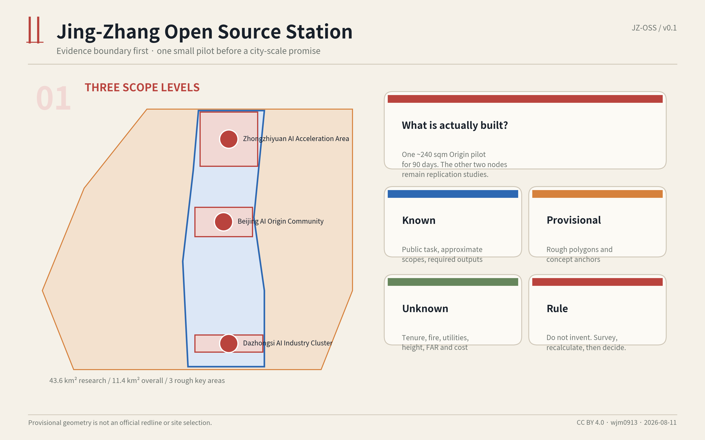
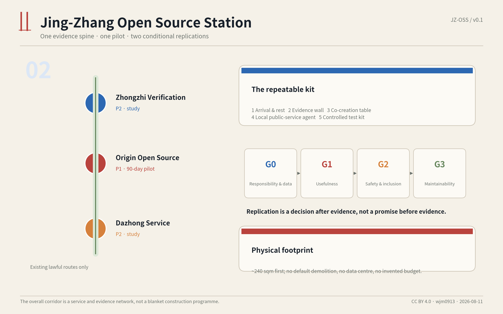
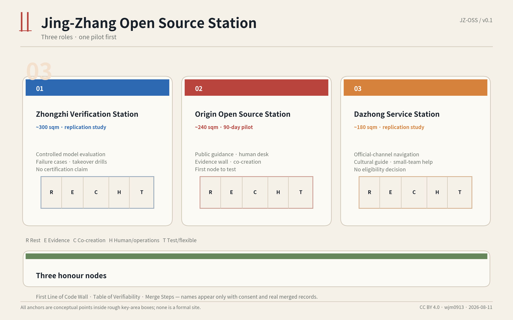
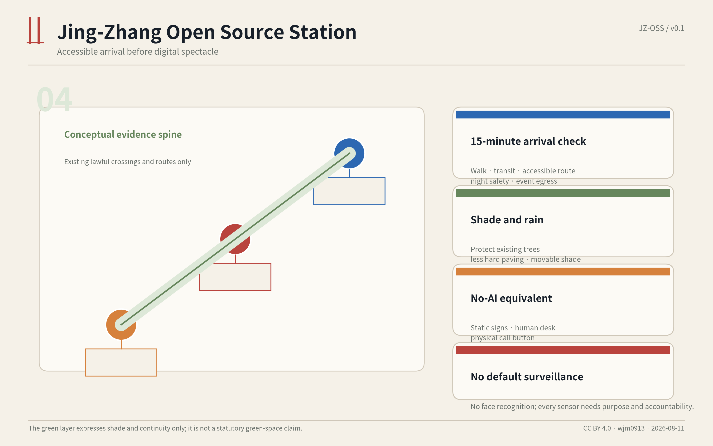
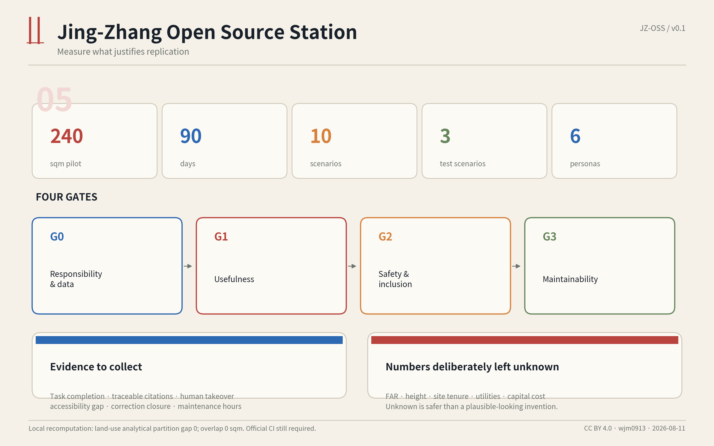

# Jing-Zhang Open Source Station: One Pilot and Three Replicable Low-Cost AI Public-Service Nodes

> Core judgment: make AI a staffed, traceable, optional and maintainable public-service place first; discuss an innovation belt only after that works.

## Design Basis and Source List

The proposal takes the public announcement's three-level scope, three key areas and deliverable context as its controlling brief, and uses the repository's machine-readable taskbook, source registry, professional-standard snapshots and validation rules as its working basis. [source:DATA-SRC-OFFICIAL-ANNOUNCEMENT-20260509] [source:DATA-SRC-AGENT-TASKBOOK-20260518] Only public material, cleared repository material and agent-generated design layers are used. No personal data, internal planning material, commercial basemap or unlicensed image is submitted.

Precise official `SITE_BOUNDARY` and three `KEY_AREA` polygons are not publicly available in the repository. The text and drawings therefore use maintainer-produced rough provisional boundaries derived from the announcement's textual extent and approximate area. They are for generation, communication and intake self-check only; key-area rectangle edges are not parcels, road redlines or formal station sites. [source:DATA-SRC-PROVISIONAL-BOUNDARIES-20260605] When official GIS/CAD becomes available, scope, areas, ratios, walking length, anchors and all figures must be recalculated. [metric:site_area_sqm]

Professionally, the proposal separates known conditions, design suggestions and items requiring confirmation. It does not present concept nodes as regulatory-planning conclusions or invent FAR, height, demolition, budget or approval. [standard:MOHURD-CONTROL-DETAILED-PLANNING] Spatial work coordinates public space, building interfaces, walkability, accessibility and urban character. [standard:MOHURD-URBAN-DESIGN-MEASURES]

## Three-Level Scope Framework

The three levels follow a deliberate rule: do not spread construction across the strategy level, build only a network relationship at the overall level, and bring the key-area work down to one small unit. [depth:three_level_scope_framework]

**Coordinated research area, about 43.6 sq km:** no full-area redraw is proposed. Research focuses on how one repeatable public AI node could connect universities, firms, residents, visitors and public services. Its outputs are service protocols, operating gates, scenario cards and an annual open programme rather than a large construction list. [data:geometry/constraints.geojson#CONSTRAINT-RESEARCH-SCOPE]

**Overall design area, about 11.4 sq km:** the Jing-Zhang Heritage Park and existing walking links form a discovery and arrival layer. A conceptual open-source evidence spine indicates consistent wayfinding, shade and rest points between nodes. It is not a new road or rail-crossing proposal and must use existing lawful routes. [data:geometry/roads.geojson#ROAD-OPEN-SPINE-01]

**Three key areas, about 368.4 ha:** one node type is assigned to each rough area. The Beijing AI Origin Community receives an approximately 240 sqm, 90-day public-service pilot. Zhongzhiyuan studies an approximately 300 sqm controlled verification node. Dazhongsi studies an approximately 180 sqm public-service and cultural-guidance node. [metric:key_area_total_sqm] The latter two do not start construction with the first pilot; they enter replication study only after evidence passes four gates.

This framework prevents the mistaken reading that all 43.6 sq km must be transformed. The actual physical object is one reversible small node; the larger scope supplies ecosystem relationships, public access and common rules.

## Coordinated Research Area: Industry and Future City Research

### Concept and identity: Open Station

The Chinese name is "Jing-Zhang Open Source Station" and the English name is the same identity. Its mark combines two parallel railway tracks with an open bracket: the tracks reference Jing-Zhang engineering culture, while the bracket represents readable, reviewable and contributable open-source practice. The visual system avoids a generic futuristic screen aesthetic. Black and white carry public content, railway red is reserved for risks and stopping, and evidence blue identifies sources and versions.

The overall structure is **one evidence spine, one pilot station and two replication studies**. It responds to the Centennial Jing-Zhang cultural belt, urban AI life-experience belt and AI-integrated innovation belt without turning them into three rounds of construction. Culture is experienced through sourced interpretation; daily life improves through rest, guidance, human support and accessibility; innovation becomes visible through public tests, issue tracking and version records. [standard:PROJECT-AGENT-OPEN-CALL-TASKBOOK]

### Five practical modules

Each station uses the same separable kit:

1. **Arrival and rest:** legible entrance, continuous shade, seating, water and charging - first solve whether people can comfortably stop.
2. **Evidence wall:** public sources, versions, limitations, issues and change logs - show why a statement is made.
3. **Co-creation table:** small events, developer demonstrations, resident feedback and human consultation - show who works together.
4. **Local public-service agent:** an audited local knowledge base supports Jing-Zhang history, site guidance and official-service navigation; each answer shows sources and can transfer to a person.
5. **Test kit:** bounded tests for traceable answers, accessible usability and low-speed robot takeover; the public is not treated as an undisclosed experiment.

### Five transferable cases

Cases contribute mechanisms rather than landmark forms. Singapore's Punggol Digital District informs the coordination of learning, industry and real-world test settings; Oodi informs a staffed, inclusive civic third place; Seoul Smart City Center informs co-located demonstration, exchange and support; King's Cross informs long-term heritage-led public-realm operation; Barcelona Superblock informs testing, evaluation and only then permanence. [source:CASE-PUNGGOL] [source:CASE-OODI] Their shared lesson is that a credible urban AI node needs daily use, human roles, public evidence, iteration and exit conditions - not only demonstration hardware. [source:CASE-SEOUL]

## Overall Design Area: Urban Renewal and Regulatory-Planning-Depth Urban Design

No change to existing statutory land use is proposed, no additional development intensity is claimed, and no unknown building is marked for demolition. `land_use.geojson` is a gap-free analytical partition for machine recomputation. It uses standard land-use codes but is labelled `analysis_helper` and cannot replace existing use, tenure or regulatory planning. [data:geometry/land_use.geojson#LU-01] [standard:MNR-LAND-USE-CLASSIFICATION-GUIDE]

Only four urban-renewal actions are proposed:

- **Prefer an existing vacant ground-floor room, management room or already paved park edge**, rather than constructing an AI landmark.
- **Use reversible fit-out and standard urban furniture** so equipment, panels and shade can be removed and the site restored after a failed pilot.
- **Connect through existing lawful walking routes** without assuming a new rail crossing or drawing unverified road redlines.
- **Design maintenance and human staffing in from the start**, including rear access, storage, isolation switches and incident records.

Development intensity, height, basement, fire compartments, utilities, tenure, footfall and parking remain data gaps. A design-depth item marked complete means the package provides an explicit boundary, layer, metric and next professional check; it does not mean unknown conditions have been approved. [depth:development_intensity_controls]

Urban character is low-profile and highly legible: station height follows existing canopies or ground-floor eaves; no high-luminance media wall is proposed; night lighting is limited to entrance, table and safe path; materials are durable, replaceable and recyclable. Railway culture appears through scale, numbering, timeline and material details rather than a replica historic station.

## Detailed Design for the Key Areas

### 1. Beijing AI Origin Community: Origin Open Source Station - first 90-day pilot

The first prototype targets approximately **240 sqm**, either within an existing ground-floor space plus a small waiting apron or in an approved single-level reversible module. The concept anchor lies inside the rough key-area polygon for communication only and is not a recommended parcel. [data:geometry/buildings.geojson#STATION-ORIGIN-01] A notional internal split is 60 sqm arrival/rest, 45 sqm evidence wall, 60 sqm co-creation table, 35 sqm staff/equipment back-of-house and 40 sqm flexible activity. The real plan must respond to the verified building and fire conditions.

The 90 days test only five questions: do people actually use it; can answers be traced; can disabled and older users complete tasks independently or with human support; does someone close issues; and are maintenance workload and failures bearable. Screen taps are not the sole success measure.

### 2. Zhongzhiyuan: Verification Station - replication study

An approximately 300 sqm verification node is studied only after the first pilot passes its gates. It supports model evaluation, data explanation, human-takeover drills and small controlled industry tests. [data:geometry/buildings.geojson#STATION-ZZ-01] It does not release unverified automation directly to the public and does not issue certification or imply government endorsement. Results record version, sample boundary, failure cases and stopping conditions.

### 3. Dazhongsi: Service Station - replication study

An approximately 180 sqm service node supports visitors, residents and small teams through official-service navigation, Jing-Zhang and Dazhongsi cultural guidance, activity information and human consultation. [data:geometry/buildings.geojson#STATION-DZS-01] It does not perform administrative approval or determine policy eligibility; personal matters receive only official-channel directions and human guidance.

The three sites are not three AI showrooms. They divide responsibility: Origin tests public value, Zhongzhiyuan tests technology and accountability, and Dazhongsi tests service translation. Three pilgrimage/honour features are proposed: the **First Line of Code Wall** at Origin, presenting licensed Beijing AI and open-source milestones; the **Table of Verifiability** at Zhongzhiyuan, publishing model cards, failure cases and takeover records; and the **Merge Steps** at Dazhongsi, annually recording adopted public contributions and issue fixes. Names appear only with permission and a real merged record.

## AI Innovation Ecosystem, Talent Profiles and AI+ Scenarios

### Six user personas

1. **Nearby resident:** needs activities, daily service and issue feedback without learning AI terminology.
2. **Older or disabled user:** needs large text, speech, low interaction burden and stable human help.
3. **Student or young developer:** needs small contributable tasks, open-source display and credible real problems.
4. **Research or company team:** needs controlled testing, failure records, data boundaries and responsibility interfaces.
5. **Visitor or family:** needs trustworthy, age-appropriate, multilingual Jing-Zhang interpretation.
6. **Operator or maintainer:** needs shutdown, rollback, content review, fault logging and daily inspection tools.

### Ten scenario cards

| ID | Scenario | User action | AI/spatial response | Human fallback and stop condition |
|---|---|---|---|---|
| SC-01 | Jing-Zhang heritage guide | Ask by QR or voice | Age-adjusted explanation, source and next stop | No factual answer without a source; transfer to human material |
| SC-02 | Accessible digital support | Use large text, speech or physical button | Simplified steps, read-out result and human-call option | Recognition failure or discomfort triggers human mode |
| SC-03 | Open-source display | Browse projects and contributions | Show licence, version and contributor-consent state | No unlicensed name or asset is displayed |
| SC-04 | Micro-event up to 30 people | Register for a public session | Show agenda, capacity and quiet-hour limits | No event if capacity or fire conditions are unclear |
| SC-05 | Public-service navigation | Describe a task | Point only to official channels and staff | Do not decide eligibility or fill sensitive forms |
| SC-06 | Multilingual visitor guide | Select language and available time | Produce a short route and cultural explanation | Low-confidence translation shows source text and human note |
| SC-07 | Traceable local-RAG test | Run a public question set | Report answer, citation, refusal and version | Roll back if citation-error threshold is breached |
| SC-08 | Accessibility usability test | Complete defined tasks | Record anonymous completion and barrier types | No face recording; stop immediately for a safety barrier |
| SC-09 | Controlled low-speed robot test | Observe or participate in a closed period | Expose speed, route, takeover and emergency-stop state | No isolation, takeover operator or working stop means no run |
| SC-10 | Community issue closure | Submit an issue and choose public/anonymous | Create issue, owner and status | No personal data publication; overdue issues move to human coordination |

SC-07 to SC-09 are three test/validation scenarios. They follow desktop, closed environment and then limited opening; public space is not a default test ground. [metric:test_validation_scenario_count] All scenarios share a minimum architecture: audited local knowledge, retrieval/citation layer, model service, human workstation, content versions, issue tracking and aggregate service statistics without personal profiling. Models may change; evidence, human fallback and stopping must remain.

The ecosystem is not measured only by how many large firms are attracted. The station provides three participation scales: a one-hour task for correction or accessibility testing; a one-week prototype or data-cleaning task; and a one-quarter operating or public-evaluation contribution. Each contribution has an issue, review and archive so activity does not disappear after an event.

## Land Use, Building Scale and Retain-Renovate-Demolish-New-Build Strategy

The default building policy is **no demolition, existing space first, and reversible addition only when necessary**. [depth:retain_renovate_demolish]

- **Retain:** verified safe, accessible and tenured ground-floor rooms, shade, paving and public seating.
- **Micro-renovate:** entrance wayfinding, movable evidence panels, acoustic treatment, outlets, lighting, accessibility details and maintenance access.
- **Reversible new element:** only where no existing room is usable and approval permits; a one-level module is not a permanent landmark and no height/structure is fixed now.
- **Demolish:** no demolition conclusion is made. Anything affecting heritage, trees, utilities or public movement moves to professional verification.

The three concept footprints total approximately 720 sqm; the first pilot is about 240 sqm. [metric:total_station_footprint_sqm] These figures control prototype scale and support machine checks. They do not establish FAR or land supply. Height, gross floor area, structure, MEP capacity and cost remain unknown instead of being filled with plausible-looking numbers.

Back-of-house is essential, not leftover space. It includes staff, content review, restart, emergency stop, cleaning, storage, spares and incident recording. Unstaffed hours retain only static guidance and a clear service line; high-risk interaction is closed.

## Transport, Rail, Municipal and Public-Service Facilities

Transport relies on walking, cycling, public-transport interchange and existing lawful routes. The approximately 9.7 km open-source evidence spine is a relationship diagram for consistent wayfinding, shade, rest and information. It is not a new-road length and does not prove direct rail crossing. [metric:slow_mobility_length_m]

Before formal site selection, each station needs a 15-minute walking-access study, continuous accessible route, night safety, emergency access, loading, bicycle parking and event-egress check. The small node should not trigger a large new car park; service vehicles use existing management arrangements where feasible.

Municipal and digital infrastructure stay light: use verified existing power and network first; support local cache and offline degradation; provide master and zoned isolation switches plus daily inspection; do not build an on-site data centre. Public Wi-Fi, cameras, sensors and robots are not defaults. They require a defined purpose, minimal data, notice and accountable operator. [depth:municipal_new_infrastructure]

Public service follows three boundaries: AI supplies information assistance, not administrative eligibility or medical/legal conclusions; important processes have human access; and a person who declines AI still receives basic guidance, rest and consultation. Accessibility is a baseline across entrance, route, seat, text, speech, controls and staffing, not one special scenario.

## Blue-Green Space, Public Space and Urban Character

Public space is judged by whether people can stay, not only look. The three concept arrival/waiting aprons total about 2,970 sqm; actual extents must follow trees, fire safety, traffic and management boundaries. [metric:public_space_apron_sqm] Furniture includes movable tables, backed seats, wheelchair companion positions, shade and low-level night lighting. A giant screen does not displace public space.

The blue-green layer does not create statutory green space. About 193,000 sqm of conceptual shaded strip expresses continuous canopy, rain-friendly treatment, reduced hard paving and protection of existing trees. [data:geometry/green_space.geojson#GREEN-OPEN-SPINE-01] Professional deepening requires a tree survey, sponge-city conditions, soil, utilities and maintenance responsibility.

Urban character uses railway scale and open-source evidence: kilometre-style numbers for wayfinding, track-gauge proportions for furniture joints and version numbers for updated exhibits. These are contemporary and restrained, not a faux-historic station. Every text-bearing figure has a Chinese/English pair, with information ahead of decoration. [depth:blue_green_public_space]

## Renewal Project List, Policy Tools and Phasing

### Four gates instead of a fixed promise schedule

**G0 Responsibility and data:** confirm tenure, operator, content review, data scope, fire safety, accessibility, equipment responsibility and complaint channel. Any missing item blocks site deployment.

**G1 Usefulness:** during 90 days, prove that people use it, core tasks are solved, citations trace, staff can take over and faults can be repaired. Measure task completion, repeat use, correction closure and staff burden rather than invocation volume alone.

**G2 Safety and inclusion:** complete accessible-task tests, content-risk sampling, privacy review, robot emergency-stop drill and no-AI-equivalent-path check. Pause for serious misinformation, failed takeover or exclusion.

**G3 Maintainability:** identify annual content update, staffing, spares, model/network cost, cleaning and event responsibility. Without maintenance, do not replicate.

### Phases

- **P0 Evidence and site verification:** obtain official boundary/site files and compare sites through footfall, accessibility, fire, utilities and tenure surveys.
- **P1 90-day Origin pilot:** start with static guidance, human service and traceable answers; open events and tests gate by gate.
- **P2 Two replication studies:** only after G1-G3, deepen the Zhongzhiyuan verification type and Dazhongsi service type.
- **P3 Network operation:** connect nodes with common content standards, issue tracking and an annual public report; no total node count is pre-committed.

Policy suggestions focus on operating interfaces rather than land incentives: a public-material licence/version protocol, a coordination checklist for reversible pilots, compensation for accessibility participants, a cross-department issue-routing rule and annual independent review. These are research suggestions, not adopted policy. [data:geometry/phasing.geojson#PH-STATION-ORIGIN-01]

## Metrics, Area Recalculation and Compliance Matrix

Metrics fall into three groups: **boundary checks** verify geometry consistency; **prototype metrics** keep the node small and maintainable; **operating evidence** decides whether replication is justified. [depth:metrics_recalculation]

| Metric | Current value | Boundary of interpretation |
|---|---:|---|
| Provisional overall design area | about 11.413 million sqm | provisional, not official redline |
| Three provisional key areas | about 3.693 million sqm | rough rectangles for intake checks only |
| Analytical land-use gap ratio | 0 | topology check, not regulatory completeness |
| Analytical land-use overlap | 0 sqm | same boundary |
| Concept station nodes | 3 | one pilot, two replication studies |
| First Origin station | about 240 sqm | concept scale, pending verified space |
| Scenario cards | 10 | includes 3 test/validation scenarios |
| User personas | 6 | includes operator/maintainer |
| Pilot window | 90 days | candidate window, not approved programme |
| FAR/height/cost | unknown | data gap is not filled with invented numbers |

Suggested operating measures, without fake precision, are task completion, citation traceability, human-takeover success, accessibility task gap, correction closure time, equipment availability, repeat visit, maintenance hours and severe incidents. P0 should set thresholds with the operator, accessibility participants and professionals.

`compliance_matrix.json` covers announcement clauses 1.3, 1.4, 1.5 and agent.1-agent.6. `standard_matrix.json` covers mandatory standards. `design_depth_matrix.json` maps all fifteen required depth items to narrative, geometry, metrics and drawings. `complete` means a complete evidence chain, not an approval status.

## Risk, Copyright and Compliance Statement

**Planning and engineering risk:** boundary, tenure, roads, buildings, fire safety, heritage, utilities and public-facility data are incomplete. The response is prominent provisional labelling, explicit unknowns, investigation before site selection and full recalculation when official data arrives. [depth:risk_missing_data]

**AI and content risk:** historical error, stale service link, translation error and unsafe generation. The response is an audited knowledge base, visible sources, locked versions, refusal, human review, issues and rapid rollback.

**Privacy and exclusion risk:** excessive collection, default cameras, facial recognition, speech errors and digital-only access. Facial recognition is excluded by default and personal profiles do not drive recommendations. Raw speech is not retained long-term. Every important service has a non-AI and human route.

**Robot and event risk:** low-speed conflict, failed emergency stop, overcrowding and night disturbance. Robots run only with isolation, low speed, takeover operator and working emergency stop. Events have capacity, quiet hours and an on-site owner; otherwise they are cancelled.

**Operating risk:** obsolete equipment, stale content and a short-lived event cycle. G3 maintainability, an annual public report, spares, content owner and exit plan manage this. Restoring the site and publishing why a pilot failed is a valid outcome.

Text, code-generated diagrams, charts and HTML are original for this submission under CC BY 4.0. External cases are cited as facts and links; their images, drawings and brand assets are not copied. Geometry comes only from repository provisional boundaries and agent-generated design, without a commercial basemap. See `report/copyright_statement.md`.

This is a conceptual open-call proposal and material for professional deepening. It is not government approval, statutory planning, formal site selection, investment commitment, procurement requirement, engineering-feasibility conclusion or partnership endorsement.

## References

1. Haidian Branch of the Beijing Municipal Commission of Planning and Natural Resources, qualification pre-announcement for the Centennial Jing-Zhang AI Innovation Belt urban-design call. [source:DATA-SRC-OFFICIAL-ANNOUNCEMENT-20260509]
2. `open-city-ai/haidian` machine-readable brief, source registry, provisional geometry and standard snapshots. [source:SITE-PACKAGE]
3. JTC Singapore, Punggol Digital District. [source:CASE-PUNGGOL]
4. Helsinki Central Library Oodi. [source:CASE-OODI]
5. Seoul Metropolitan Government, Seoul Smart City Center. [source:CASE-SEOUL]
6. King's Cross Estate ten-year retrospective. [source:CASE-KINGS-CROSS]
7. Barcelona City Council, Superblock pilot and exchange material. [source:CASE-BARCELONA]

Publishers, intended uses and limitations are registered in `sources.json`; data gaps and their impacts are registered in `assumptions.json`.
