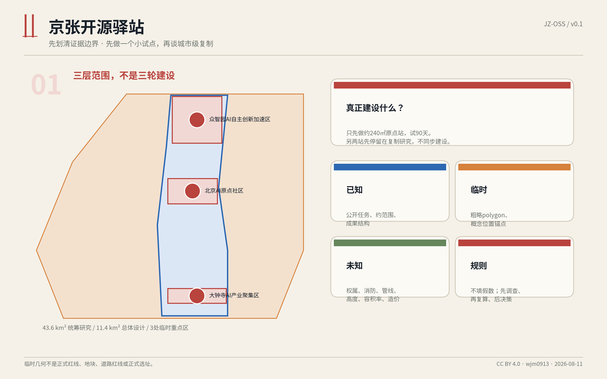
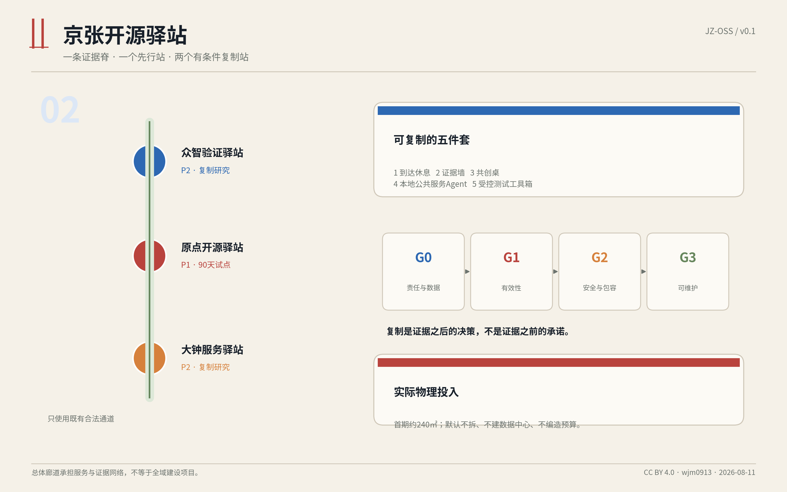
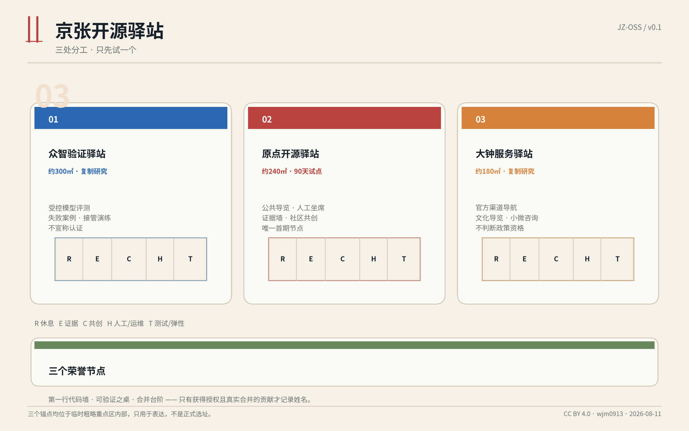
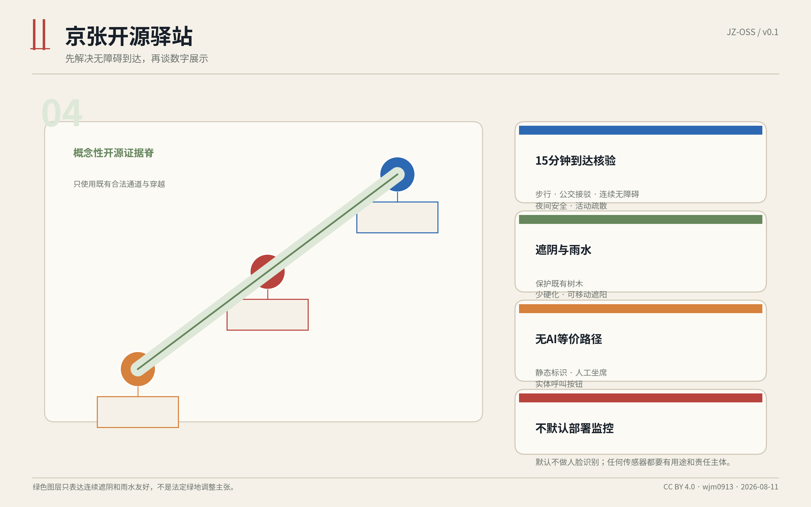
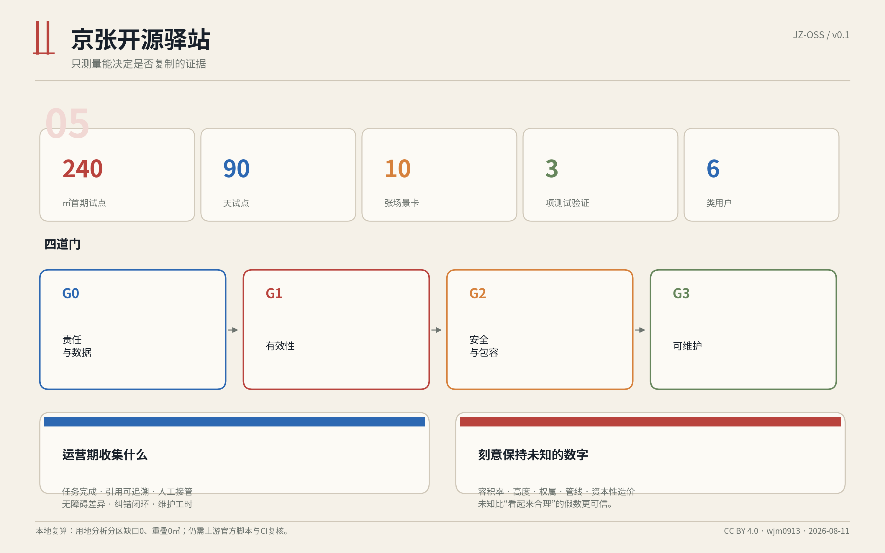

# 京张开源驿站：一处先行、三型复制的低成本 AI 公共服务节点

> 核心判断：先把 AI 做成一处有人值守、可追溯、可退出、能维护的公共服务节点，再讨论“创新带”。

## 设计依据与资料清单

本方案以公开征集公告确定的三层范围、三处重点区域和成果要求为主控依据，以仓库中的机器可读任务书、来源登记、专业标准快照和校验规则作为工作底稿。[source:DATA-SRC-OFFICIAL-ANNOUNCEMENT-20260509] [source:DATA-SRC-AGENT-TASKBOOK-20260518] 方案只使用公开资料、仓库已清权资料和 Agent 自行生成的概念图层，不上传个人信息、内部规划资料、商业底图或未授权图片。

当前仓库没有公开的正式 `SITE_BOUNDARY` 与三处 `KEY_AREA` 精确 polygon。本文和图件使用维护者根据公告文字四至与约面积制作的临时粗略边界，仅用于生成、表达与自检；矩形重点区的边不得解释为地块、道路红线或正式站点位置。[source:DATA-SRC-PROVISIONAL-BOUNDARIES-20260605] 官方 GIS/CAD 到位后，范围、面积、比例、慢行长度、节点位置和全部图件必须重算。[metric:site_area_sqm]

专业上，本方案遵循“已知条件、设计建议、待确认事项”分层表达，不把概念节点写成控规结论，也不虚构容积率、高度、拆迁、资金和审批。[standard:MOHURD-CONTROL-DETAILED-PLANNING] 空间设计强调公共空间、建筑界面、步行连续、无障碍与城市风貌协同。[standard:MOHURD-URBAN-DESIGN-MEASURES]

## 三层范围工作框架

三层范围采用“战略不铺摊子、总体只建网络、重点区落到一个小单元”的工作法。[depth:three_level_scope_framework]

**统筹研究范围约 43.6 平方公里**：不做全域形态重画，只研究一种可复制的公共 AI 节点如何连接高校、企业、居民、游客和公共服务。输出是服务协议、运营门槛、场景清单和年度开放机制，而不是大规模建设清单。[data:geometry/constraints.geojson#CONSTRAINT-RESEARCH-SCOPE]

**总体设计范围约 11.4 平方公里**：以京张遗址公园及其慢行联系为“发现与到达层”，提出一条概念性的开源慢行证据脊。它不是新道路或铁路穿越方案，只表示节点之间应通过现有合法通道、清晰导向和连续遮阴联系。[data:geometry/roads.geojson#ROAD-OPEN-SPINE-01]

**三处重点区域约 368.4 公顷**：每个区域只设置一个不同职责的节点原型。北京 AI 原点社区先做约 240 平方米、90 天的公共服务试点；众智园研究约 300 平方米的受控验证节点；大钟寺研究约 180 平方米的公共服务与文化导览节点。[metric:key_area_total_sqm] 后两处不与首期同步建设，只有首期证据通过四道门才进入复制研究。

该框架刻意避免“43.6 平方公里都要改造”的误读。真正的建设对象是一个可逆的小节点；整体范围承担的是生态联系、公共可达与规则一致性。

## 统筹研究范围产业与未来城市研究

### 总体概念与品牌：Open Station / 开源驿站

品牌中文名为“京张开源驿站”，英文名为 “Jing-Zhang Open Source Station”，识别符号由两条平行铁轨和一个开放括号构成：铁轨对应京张工程文化，开放括号对应可阅读、可复核、可贡献的开源方式。视觉系统不追求“未来感大屏”，而采用黑白基础、铁路红提示和证据蓝三类信息层级：黑白承载公共内容，红色只用于风险/停止，蓝色用于来源与版本。

总体空间结构可概括为 **“一条证据脊、一个先行站、两个待验证复制站”**。它回应百年京张文化带、都市 AI 生活体验带和 AI 融合创新带，但不把三条带等同于三轮建设：文化通过可查来源和现场叙事被感知；生活体验通过休息、导览、人工服务和无障碍被改善；创新通过公开测试、问题单和版本记录被看见。[standard:PROJECT-AGENT-OPEN-CALL-TASKBOOK]

### 五个可落地模块

每个驿站采用同一套可拆分模块：

1. **到达与休息**：清楚门头、连续遮阴、座椅、饮水与充电，先解决“能不能停下来”。
2. **证据墙**：公开数据来源、版本、局限、问题单和改进记录，回答“为什么这么说”。
3. **共创桌**：小型活动、开发者演示、居民反馈和人工咨询，回答“谁在一起做”。
4. **本地公共服务 Agent**：基于经过审核的本地知识库回答京张历史、场地导览和公共服务导航；每条回答显示来源并可转人工。
5. **测试工具箱**：在明确边界内测试可追溯问答、无障碍可用性和低速机器人接管，不把公众当作未经告知的试验对象。

### 五个外部案例的转译

案例研究只抽取可验证机制，不复制地标造型。新加坡 Punggol Digital District 提供了学习、产业与真实环境协同的参考；Oodi 提供有人值守、包容且可学习的公共第三空间参考；首尔 Smart City Center 提供展示、交流和支持服务集中于一处的参考；King's Cross 提供遗产与长期公共空间运营结合的参考；Barcelona Superblock 提供先试点、再评估、再固定的公共空间更新方法。[source:CASE-PUNGGOL] [source:CASE-OODI] 其共同启示是：一个可信的 AI 城市节点，应同时有日常用途、人工角色、公开证据、迭代机制和退出条件，而不只是演示设备。[source:CASE-SEOUL]

## 总体设计范围城市更新与控规深度城市设计

本方案不建议改变现行用地性质，不提出新增开发强度，也不对未知建筑做拆除判断。`land_use.geojson` 是为了机器复算建立的无缝分析分区，使用统一用地代码，但明确标注为 `analysis_helper`，不得替代现状用地、权属或控规。[data:geometry/land_use.geojson#LU-01] [standard:MNR-LAND-USE-CLASSIFICATION-GUIDE]

总体设计范围只提出四项城市更新动作：

- **优先利用既有首层空置房间、管理用房或已硬化公园边角**，避免为 AI 新建地标建筑。
- **采用可逆装修与标准化城市家具**，设备、展墙和遮阳可拆卸，试点失败时可以恢复原状。
- **通过合法既有慢行通道连接节点**，不假设新增跨铁路通道，不画未经证明的道路红线。
- **把维护和人工值守纳入设计**，设备后侧留检修、存放和断电位置，避免“建完没人管”。

开发强度、建筑高度、地下空间、消防分区、管线、权属、客流和停车均列为待正式数据补齐项。设计深度的“完成”表示已给出明确的判断边界、图层、指标和下一步专业核验，不表示这些未知条件已经获得批准。[depth:development_intensity_controls]

空间风貌遵循低识别、高可读原则：驿站高度服从既有树冠和首层檐口；不设置高亮巨屏；夜间照明只覆盖门头、桌面和安全路径；材料优先耐候、可替换、可回收。铁路文化通过尺度、编号、时间线和材料细节呈现，不复制历史构筑物。

## 重点区域详细设计

### 1. 北京 AI 原点社区：原点开源驿站 - 首期 90 天试点

首期原型目标面积约 **240 平方米**，可由一处既有首层空间加门前等候区组成，或使用经批准的单层可逆模块。概念锚点位于临时重点区内部，仅用于表达，不是推荐地块。[data:geometry/buildings.geojson#STATION-ORIGIN-01] 室内建议分为：60 平方米到达/休息，45 平方米证据墙，60 平方米共创桌，35 平方米人工与设备后台，40 平方米弹性活动区。实际分区必须根据正式房屋和消防条件调整。

90 天只验证五件事：是否有人真的来用；回答是否能追溯来源；无障碍和老年用户是否能独立或在人工帮助下完成任务；问题是否有人闭环；维护成本和故障是否可承受。试点不以屏幕点击量作为唯一成功指标。

### 2. 众智园：众智验证驿站 - 复制研究

约 300 平方米的验证型节点只在首期通过门槛后研究，职责是模型评测、数据说明、人工接管演练和产业场景的小规模受控测试。[data:geometry/buildings.geojson#STATION-ZZ-01] 它不直接面向公众上线未经验证的自动化能力，不对企业提供“认证”或政府背书。测试结果必须记录版本、样本边界、失败案例和停止条件。

### 3. 大钟寺：大钟服务驿站 - 复制研究

约 180 平方米的服务型节点面向游客、居民和小微团队，重点是公共服务导航、京张与大钟寺文化导览、活动信息和人工咨询。[data:geometry/buildings.geojson#STATION-DZS-01] 它不承担行政审批，不替代政务窗口，不承诺具体政策资格；涉及个人事项时，只提供官方入口和人工引导。

三站不是三座“AI 展厅”，而是一套职责分工：原点站验证公共价值，众智站验证技术和责任，大钟站验证服务转化。三个概念性朝圣/荣誉节点分别为：原点站的 **“第一行代码墙”**，展示经许可的北京 AI 发展与开源时间线；众智站的 **“可验证之桌”**，公开模型卡、失败案例和人工接管记录；大钟站的 **“合并台阶”**，按年度记录被采纳的公开贡献和问题修复。名字上墙必须基于明确授权和真实合并记录。

## AI 创新生态、人才画像与 AI+ 场景

### 六类用户画像

1. **附近居民**：需要活动、生活服务和问题反馈，不希望被迫学习复杂 AI 术语。
2. **老年人和无障碍用户**：需要大字、语音、低操作负担和稳定的人工协助。
3. **学生与青年开发者**：需要可贡献的小任务、开源展示和可信的真实问题。
4. **科研/企业团队**：需要受控测试、失败记录、数据边界和责任接口。
5. **游客与亲子家庭**：需要可信、分龄、多语言的京张文化导览。
6. **运营维护人员**：需要断电、回滚、内容审核、故障登记和每日巡检工具。

### 十张场景卡

| ID | 场景 | 用户动作 | AI/空间响应 | 人工兜底与停止条件 |
|---|---|---|---|---|
| SC-01 | 京张历史导览 | 扫码或语音提问 | 给出分龄讲解、来源和下一节点 | 来源缺失则不回答事实，转人工资料 |
| SC-02 | 无障碍数字支持 | 使用大字/语音/实体按钮 | 简化步骤、读出结果、显示人工呼叫 | 识别失败或用户不适即切人工 |
| SC-03 | 开源成果展示 | 浏览项目与贡献 | 展示许可、版本、贡献者授权状态 | 无授权姓名和资产不上墙 |
| SC-04 | 30 人以内微活动 | 报名公开分享 | 提供议程、容量与安静时段提示 | 超容量、消防条件不明则不举办 |
| SC-05 | 公共服务导航 | 描述要办的事项 | 只指向官方渠道和现场人工服务 | 不判断资格，不代填敏感信息 |
| SC-06 | 多语言游客导览 | 选择语言与时间 | 生成短路线和文化解释 | 翻译低置信度时显示原文与人工说明 |
| SC-07 | 本地 RAG 可追溯测试 | 评测一组公开问题 | 输出答案、引用、拒答与版本 | 引用错误率超过门槛即回滚版本 |
| SC-08 | 无障碍可用性测试 | 完成规定任务 | 记录匿名任务完成与障碍类型 | 不录制人脸；出现安全障碍立即停止 |
| SC-09 | 低速机器人受控测试 | 在封闭时段观察/参与 | 展示速度、路线、接管和急停状态 | 无隔离、无接管员、急停失败则不运行 |
| SC-10 | 社区问题闭环 | 提交问题并选择公开/匿名 | 生成问题单、责任人和处理状态 | 不公开个人信息；逾期转人工协调 |

SC-07 至 SC-09 是三项测试验证场景，全部采用“先桌面、后封闭、再有限开放”的顺序，不把公共空间默认变成测试场。[metric:test_validation_scenario_count] 场景使用同一套最小技术架构：审核后的本地知识库、检索与引用层、模型服务、人工工作台、内容版本库、问题单和不含个人画像的聚合统计。模型可以更换，但证据、人工兜底和停止能力必须保留。

人才与生态不以“引进多少头部企业”为唯一目标。驿站提供三类可持续参与入口：一小时可完成的资料纠错和无障碍测试；一周可完成的场景原型和数据清理；一个季度可完成的运营共创与公开评估。贡献必须有问题单、评审和归档，避免活动结束后失联。

## 用地、建筑规模与拆改留方案

本方案的建筑策略是 **“不拆为默认，先用既有，新增必须可逆”**。[depth:retain_renovate_demolish]

- **保留**：经核验安全、可达、权属清楚的既有首层空间、遮阴、铺装和公共座椅。
- **微改造**：门头导向、可移动展墙、声学处理、插座、照明、无障碍细节和后台检修。
- **可逆新增**：只有既有房间不可用且审批允许时，才考虑单层模块；模块不作为永久地标，不先确定高度和结构体系。
- **拆除**：本阶段不提出任何建筑拆除结论。影响遗产、树木、地下管线或公共通行的内容全部进入专业核验。

三个站点的概念建筑足迹合计约 720 平方米，其中首期约 240 平方米。[metric:total_station_footprint_sqm] 这些数值只用于原型尺度和机器复算；不会据此计算容积率或宣称土地供给。建筑高度、总建筑面积、结构、机电容量和造价均保持未知，避免用“看起来完整”的假数字替代现场调查。

运营后台不是剩余空间，而是必要功能：应包含人工坐席、内容审核、设备重启、急停、清洁存放、备件和事件记录。任何无人值守时段只保留静态导览和明确的服务热线，不开放高风险交互。

## 交通、轨道、市政与公共服务设施

交通策略以步行、骑行、公共交通接驳和现有合法通道为前提。概念性“开源慢行证据脊”约 9.7 公里，只用于说明三站在视觉导向、树荫、休息点和信息系统上应连续，不是新建道路长度，也不证明铁路两侧可以直接穿越。[metric:slow_mobility_length_m]

每个驿站在正式选址前必须完成 15 分钟步行可达、无障碍连续性、夜间安全、应急车辆、装卸、共享单车停放和活动日疏散核验。停车遵循“不因小节点新增大规模机动车停车”的原则；确需服务车辆时使用既有管理条件。

市政与新型基础设施采取轻量方案：优先使用既有合规电力和网络；关键服务支持本地缓存和断网降级；设备具备总电源、分区断电和每日巡检；不在现场建设数据中心。公共 Wi-Fi、摄像头、传感器和机器人均不是默认配置，只有在明确用途、最小化数据、告知和责任主体后才可启用。[depth:municipal_new_infrastructure]

公共服务坚持三条边界：AI 只做信息辅助，不作行政资格和医疗法律结论；所有重要流程提供人工入口；用户可以不使用 AI 仍获得基本导览、休息和咨询。无障碍不是单独一个“特殊场景”，而是门头、动线、座椅、文字、语音、操作和人工服务的共同基线。

## 蓝绿空间、公共空间与城市风貌

公共空间设计以“可停留而非只可观看”为标准。三个节点外侧设置概念性到达与等候区，合计约 2,970 平方米；实际范围需服从现状树木、消防、交通和管理边界。[metric:public_space_apron_sqm] 家具采用可移动桌椅、靠背座椅、轮椅伴随位、遮阳和夜间低位照明；不以巨型屏幕挤占公共空间。

蓝绿策略不主张新划法定绿地。图层中的约 19.3 万平方米概念绿荫带，只表达沿线连续遮阴、雨水友好、减少硬化和保护既有树木的原则。[data:geometry/green_space.geojson#GREEN-OPEN-SPINE-01] 正式深化应以树木普查、海绵条件、土壤、管线和养护责任为依据。

城市风貌采用“铁路尺度 + 开源证据”的细节体系：里程编号用于导向，铆钉/轨距比例用于家具分缝，版本号用于展项更新；这些元素以现代、克制方式出现，不做仿古站房。所有含文字图件使用中英双语配对，信息优先于装饰。[depth:blue_green_public_space]

## 更新项目清单、实施政策与分期计划

### 四道门，而不是一张固定时间表

**G0 责任与数据门**：明确场地权属、运营主体、内容审核、数据范围、消防、无障碍、设备责任和投诉渠道。任何一项不清楚，不进入现场。

**G1 有效性门**：90 天内至少证明有人使用、核心问题能解决、引用能追溯、人工能接管、故障能修复。指标以任务完成、重复使用、纠错闭环和人工负担为主，不以“调用量”替代价值。

**G2 安全与包容门**：完成无障碍任务测试、内容风险抽检、隐私检查、机器人急停演练和无 AI 等价路径核验。出现严重误导、无法接管或排除特定人群时暂停。

**G3 可维护门**：确认年度内容更新、人员班次、设备备件、网络/模型费用、清洁和活动组织有责任主体。没有维护方案，不复制第二站。

### 分期

- **P0 资料与现场核验**：取得正式边界/场地文件，完成选址比较、客流、无障碍、消防、管线和权属调查。
- **P1 原点站 90 天试点**：先上线静态导览、人工服务和可追溯问答；活动与测试逐项开门。
- **P2 两类复制研究**：只有 G1-G3 通过后，分别深化众智园验证型、大钟寺服务型节点。
- **P3 网络化运营**：以统一内容标准、问题单和年度公开报告连接节点；不预设节点总数。

政策建议集中在运营接口而非土地优惠：建立公开资料许可与版本制度、可逆试点简化协调清单、无障碍参与补偿、问题单跨部门转办规则和年度独立复核。所有政策均为研究建议，不代表政府已经采纳。[data:geometry/phasing.geojson#PH-STATION-ORIGIN-01]

## 指标体系、面积复算与合规矩阵

指标分为三类：**边界复算指标**用于检查几何一致性；**原型规模指标**用于控制小而可维护；**运营证据指标**用于决定是否复制。[depth:metrics_recalculation]

| 指标 | 当前值 | 解释边界 |
|---|---:|---|
| 临时总体设计范围 | 约 1,141.28 万平方米 | provisional，不是官方红线 |
| 三处临时重点区合计 | 约 369.29 万平方米 | 临时矩形，仅用于自检 |
| 用地分析分区缺口率 | 0 | 机器拓扑检查，不是控规完整性 |
| 用地分析分区重叠 | 0 平方米 | 同上 |
| 驿站概念节点 | 3 个 | 1 个试点、2 个复制研究 |
| 首期原点站 | 约 240 平方米 | 概念尺度，待正式房屋核验 |
| 十张场景卡 | 10 | 其中 3 个测试验证场景 |
| 用户画像 | 6 类 | 包含运营维护者 |
| 试点周期 | 90 天 | 候选周期，不是已批工期 |
| 容积率/高度/造价 | 未知 | 不用假数填补资料缺口 |

运营期建议记录但不预设伪精确目标的指标包括：任务完成率、引用可追溯率、人工接管成功率、无障碍任务完成差异、纠错关闭时长、设备可用时长、重复到访、维护工时和严重事件。正式阈值应在 P0 与运营主体、无障碍参与者和专业团队共同确定。

`compliance_matrix.json` 覆盖公告 1.3、1.4、1.5 和 agent.1-agent.6；`standard_matrix.json` 覆盖强制专业标准；`design_depth_matrix.json` 将十五项正式设计深度映射到正文、图层、指标和图纸。所谓 `complete` 是证据链完整，不是批准状态。

## 风险、版权与合规说明

**规划与工程风险**：边界、权属、道路、建筑、消防、遗产、管线和公共服务设施资料不足。应对方式是醒目标注 provisional、保留未知值、先调查后选址，并在正式数据到位后整包重算。[depth:risk_missing_data]

**AI 与内容风险**：历史事实错误、服务入口过期、翻译偏差、模型生成不当内容。应对方式是审核知识库、来源展示、版本锁定、拒答、人工复核、问题单和快速回滚。

**隐私与排除风险**：过度采集、默认摄像、人脸识别、语音误识别和纯数字入口可能排除部分用户。方案默认不使用人脸识别，不以个人画像作推荐；语音原始数据不长期保存；任何关键服务均有非 AI 和人工路径。

**机器人与活动风险**：低速设备冲突、急停失败、活动超员和夜间扰民。机器人只在明确隔离、低速、接管员和急停条件下测试；活动设置容量、安静时段和现场负责人，未满足条件即取消。

**运营风险**：设备陈旧、内容无人更新、活动短期热闹后停摆。通过 G3 可维护门、年度公开报告、备件清单、内容责任人和退出方案控制。失败不是必须掩盖的结果；恢复原状和公开失败原因同样是合格的试点产出。

文本、代码生成图、图表和 HTML 为本次原创，采用 CC BY 4.0；外部案例只引用事实与链接，不复制其图片、图纸或品牌资产。地图几何仅来自仓库的临时边界与 Agent 生成设计，不包含商业底图。完整声明见 `report/copyright_statement.md`。

本方案是开源征集中的概念建议与专业深化材料，不构成政府批准、法定规划、正式选址、投资承诺、采购需求、工程可行性结论或合作背书。

## 参考资料

1. 北京市规划和自然资源委员会海淀分局：《百年京张 AI 创新带城市设计国际方案征集资格预审公告》。[source:DATA-SRC-OFFICIAL-ANNOUNCEMENT-20260509]
2. `open-city-ai/haidian` 机器可读任务书、来源登记、临时边界与专业标准快照。[source:SITE-PACKAGE]
3. JTC Singapore, Punggol Digital District。[source:CASE-PUNGGOL]
4. Helsinki Central Library Oodi。[source:CASE-OODI]
5. Seoul Metropolitan Government, Seoul Smart City Center。[source:CASE-SEOUL]
6. King's Cross Estate 十年运营回顾。[source:CASE-KINGS-CROSS]
7. Barcelona City Council, Superblock 试点与交流资料。[source:CASE-BARCELONA]

所有来源的发布者、用途和限制登记在 `sources.json`；资料缺口及其影响登记在 `assumptions.json`。
