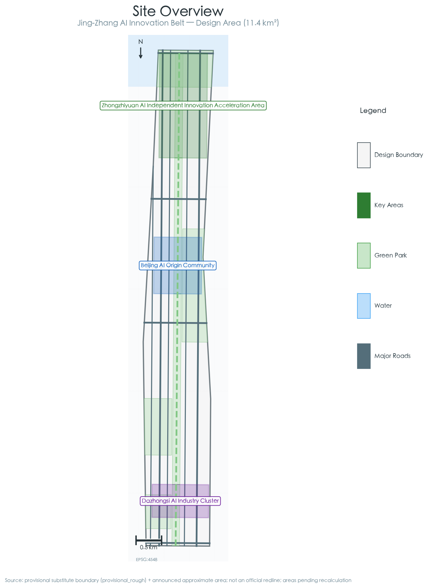
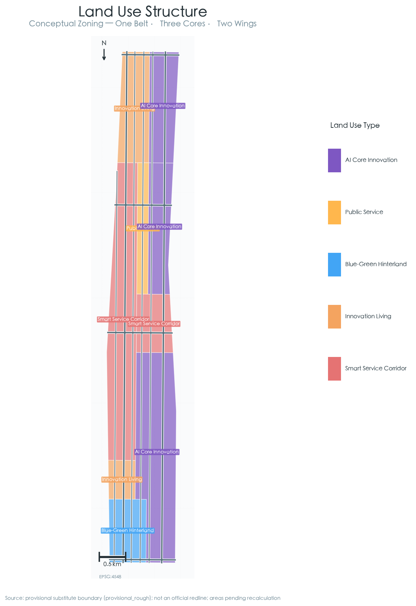
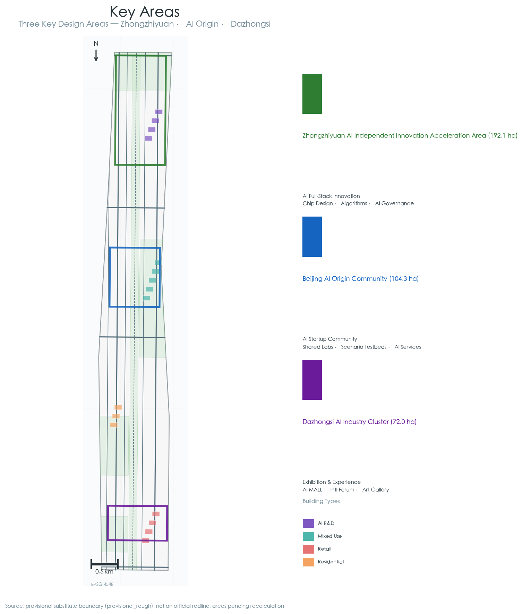
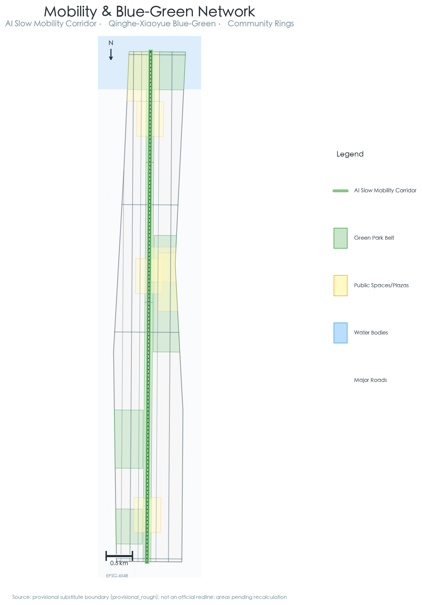
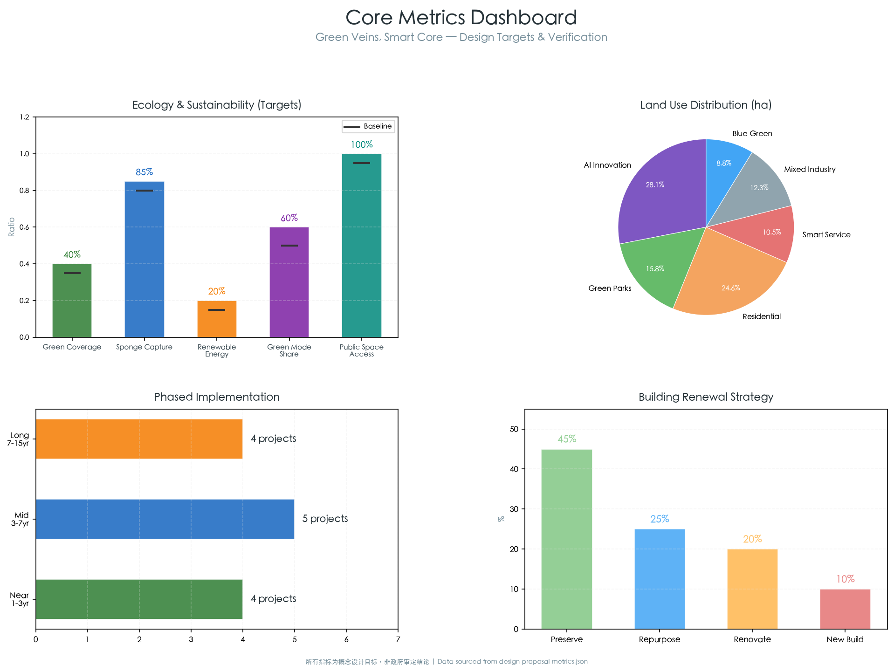

# Green Veins, Smart Core: Blue-Green Smart Urban Design for the Jing-Zhang AI Innovation Belt

## Design Basis and Source Inventory

The design basis of this proposal derives from three tiers. First, the official announcement of the "Centennial Jing-Zhang AI Innovation Belt Urban Design International Solicitation" published by the Beijing Municipal Commission of Planning and Natural Resources on May 9, 2026 (pre-qualification stage), which defines a 43.6 km² coordinated research area, an 11.4 km² overall design area, and three key areas totaling 368.4 hectares [source:SITE-PACKAGE]. Second, the provisional boundary polygons derived by project maintainers from the announcement's textual boundaries and approximate areas, located at `brief/site-package/geometry/provisional_boundaries.geojson`, encompassing the coordinated research area (PROV-RESEARCH-001), overall design area (PROV-SITE-001), and three key areas (PROV-KEY-001/002/003) [source:SITE-PACKAGE]. Third, the Agent open-call taskbook excerpt defining six mandatory agent tasks (agent.1 through agent.6) [source:AGENT-TASKBOOK].

As official precise polygon/CAD/GIS boundaries have not been made publicly available (confirmed as of 2026-08-07 [source:SITE-PACKAGE]), all spatial data in this proposal is generated within and constrained by the provisional substitute boundaries. Upon acquisition of official precise boundaries, the following layers and metrics require verification and recalculation: site_boundary.geojson, key_areas.geojson, land_use.geojson and all derivative layers, and all area-based metrics [metric:total_site_area].

This proposal follows the "Green Veins, Smart Core" theme, focusing on deep integration between blue-green infrastructure, smart city systems, and the AI innovation ecosystem. All spatial implementation suggestions are conceptual proposals, reference schemes, or material for professional teams to deepen — they do not substitute formal planning nor constitute approved government conclusions.



## Three-Level Scope Framework

### Coordinated Research Area (~43.6 km²)

The coordinated research area is bounded to the north by the North 5th Ring Road, to the east by the G6 Beijing-Lhasa Expressway, to the south by Xizhimen Outer Street, and to the west by Wanquanhe Road [data:geometry/site_boundary.geojson#PROV-RESEARCH-001]. At this level, this proposal examines coordination across three dimensions: functional connectivity and innovation factor flows among Haidian's northern (Zhongguancun Science City North), central (Zhongguancun Core), and southern (Xizhimen-Fintech Corridor) sub-regions [depth:three_level_scope_definition]; positioning of the Jing-Zhang Corridor within Beijing's citywide innovation network — including Beiwei Community, Future Science City, Huairou Science City, and the Beijing-Tianjin-Hebei innovation corridor [standard:PROJECT-AGENT-OPEN-CALL-TASKBOOK]; and the blue-green ecosystem at the regional scale: connecting the Xiaoyue River-Qinghe River-Jingmi Diversion Canal water systems to embed the Jing-Zhang Corridor into Beijing's municipal ecological network as a ventilation corridor and biodiversity corridor [depth:blue_green_system].

**Note**: The boundary polygon at this level is a provisional substitute derived by maintainers, with "provisional_rough" precision. It must not be used as an official redline or as the basis for precise area calculations.

### Overall Design Area (~11.4 km²)

The overall design area centers on the urban districts and industrial zones within 1–2 km of the Jing-Zhang Heritage Park, extending north to the North 5th Ring Road, east to Xueyuan Road-Xitucheng Road, south to Xizhimen Outer Street, and west to Dazhongsi East Road-Heqing Road [data:geometry/site_boundary.geojson#PROV-SITE-001]. This is the primary canvas for design, reaching the urban design depth of regulatory detailed planning.

The core spatial strategy is "One Belt, Three Cores, Two Wings":
- **One Belt**: The Jing-Zhang Railway Heritage Park green vein — a continuous green public space 80–200 m wide over approximately 11.4 km, serving ecological connectivity, cultural heritage, slow-mobility spine, and AI scenario display functions
- **Three Cores**: Zhongzhiyuan AI Acceleration Area (north), Beijing AI Origin Community (center), and Dazhongsi AI Industry Cluster (south)
- **Two Wings**: Zhongguancun Technology Service Wing (west) and Xiaoyuehe Scenario Empowerment Wing (east), providing innovation factor support and scenario penetration pathways

At this level, the proposal puts forward five core blue-green-smart metrics: green coverage rate ≥40%, sponge city annual runoff capture rate ≥85%, renewable energy utilization rate ≥20%, slow-mobility mode share ≥60%, and 500 m walking-distance coverage of public space at 100% [metric:green_coverage].

### Key Detailed Design Areas (~368.4 ha)

The three key areas each focus on distinct AI functions and blue-green strategies [data:geometry/key_areas.geojson#PROV-KEY-001] [data:geometry/key_areas.geojson#PROV-KEY-002] [data:geometry/key_areas.geojson#PROV-KEY-003], reaching the urban design depth of planning implementation schemes. Detailed design for each key area appears in Chapter 5.



## Coordinated Research Area: Industry and Future City Strategy

### Naming and Visual Identity

**Primary Name**: Jing-Zhang AI Innovation Belt (京张AI创新带)
**Proposal Theme**: Green Veins, Smart Core (绿脉智芯)
**English Brand**: JZ·AI Green Corridor

The naming system builds on three cultural genes: the historical depth of the Jing-Zhang Railway (century-old industrial heritage), the innovation density of Zhongguancun (China's Silicon Valley), and the future orientation of blue-green ecology (carbon-neutral pioneer) [standard:PROJECT-AGENT-OPEN-CALL-TASKBOOK].

**Logo Direction**: The cross-section of the Jing-Zhang Railway track serves as the prototype, deforming into three upward-growing green lines, with an AI chip grid texture embedded at the intersection, forming a visual metaphor of "green veins birthing smart cores." The color palette transitions from deep green (#1B5E20) to tech blue (#1565C0), adaptable across full-scale applications from building facades to digital screens [agent:1].
### Brand Visual Identity (VI) Guidance

To support consistent communication of the "Green Veins, Smart Core" brand, this proposal provides the following VI guidance [agent:1]. A full VI manual should be developed by a professional brand team and subject to trademark/copyright clearance.

**Color System**

| Color Role | Value | Meaning | Application |
|---|---|---|---|
| Primary deep green | `#1B5E20` | Blue-green ecology, sustainability | Building facades, landscape furniture, primary signage |
| Secondary tech blue | `#1565C0` | AI, digital, future | Digital interfaces, smart stations, data visualization |
| Accent vibrant orange | `#EF6C00` | Innovation vitality, events | Event visuals, wayfinding highlights, youth communities |
| Neutral mist grey | `#78909C` | Industrial heritage, sobriety | Railway heritage installations, background information |
| Background pale green-grey | `#F4F7F2` | Nature, breathability | Exhibition backgrounds, publications |

**Type System**

| Use | Chinese Recommendation | English Recommendation |
|---|---|---|
| Headings / identity | Source Han Sans, PingFang SC, Heiti | Montserrat, Inter, Helvetica Neue |
| Body / wayfinding | Source Han Serif, PingFang SC | Source Serif 4, Georgia |
| Numbers / data screens | DIN, Roboto Mono | DIN, Roboto Mono |

**Logo Construction (Direction)**

- Use one railway-track cross-section as a 1× width unit; three "green-vein" lines grow upward at 0.6×, 1.0×, and 0.6× spacing
- The chip grid at the intersection consists of a 3×3 cell matrix; minimum usage size ≥16 mm (print) or 48 px (screen)
- Logo clear space: leave a margin of at least 25% of the logo height on all sides at the minimum size
- Monochrome and reverse versions: provide deep-green, pure-white, and pure-black versions; do not use gradient versions as a standalone logo

**Application Examples**

- Physical identity: smart-station canopy fascias, weathering-steel plaques on railway heritage, trash bins and benches with stamped logos
- Digital interfaces: splash icon for the Green Vein AI Slow Lane app, opening animation for the "Light of the Smart Valley" data tower
- Print system: letterhead, business cards, conference badges, event-poster grid system

> **Rights note**: The Logo/VI direction is conceptual only. Final design must be developed by a professional agency, including trademark screening (especially for "Jing-Zhang" railway/culture-tourism marks) and copyright registration to avoid conflicts. See `report/copyright_statement.md` for the full rights inventory.


### Global AI Innovation Ecosystem Case Studies

Five globally relevant AI innovation ecosystem cases inform this proposal [source:AGENT-TASKBOOK] [agent:2]:

1. **Palo Alto-Stanford Research Park (Silicon Valley)**: The university-driven innovation spillover model suggests the AI Origin Community should build an open innovation network anchored by Tsinghua, Peking University, and CAS, rather than a gated campus. Key takeaway: walkable academic-industry mixed-use blocks, open public prototyping laboratories.

2. **King's Cross Knowledge Quarter (London)**: The brownfield regeneration knowledge economy paradigm informs the Dazhongsi area's potential to transform industrial/warehouse land into AI-enabled new business formats. Key takeaway: the triangular activation model of cultural anchor (Central Saint Martins) + tech anchor (Google/DeepMind) + public realm.

3. **one-north (Singapore)**: The tropical ecology-technology park integration model provides climatically adapted reference for the Jing-Zhang Corridor's blue-green-smart design. Key takeaway: the park-within-park system of Biopolis-Fusionopolis-Mediapolis, connected by rain-tree walkways.

4. **Nanshan Science Park-Dasha River Ecological Corridor (Shenzhen)**: The coupling of a technology innovation corridor with a blue-green corridor is the closest domestic benchmark. Key takeaway: Dasha River's transformation from a polluted drainage channel to an innovation waterfront, and the spatial interaction between tech company buildings and public waterfront.

5. **Digital Media City (Seoul)**: The digital transformation of a former landfill site provides lessons for AI-enabled repurposing of Jing-Zhang railway industrial heritage. Key takeaway: the PPP triangular driver of public institution + private enterprise + university, and the "public space first, buildings later" development sequence.

The core insight across all cases: world-class AI innovation districts all build upon a strong public realm skeleton — whether the Dasha River ecological waterfront, King's Cross Granary Square, or one-north's rain-tree walkways. The Jing-Zhang Corridor's blue-green-smart design aims precisely to provide such a world-class public realm skeleton for the AI innovation belt.
### Case Comparison Matrix

The following table compares the five global cases across model type, core takeaway, applicability to Jing-Zhang, and key prerequisites/risks [source:AGENT-TASKBOOK][agent:2].

| Case | Model Type | Core Takeaway | Applicability to Jing-Zhang | Key Prerequisites / Risks |
|---|---|---|---|---|
| Palo Alto-Stanford Research Park | University spillover | Walkable academic-industry mixed blocks, open prototyping labs | High: strong talent spillover from Tsinghua/Peking University/CAS, fits AI Origin Community | Must overcome university walls and IP barriers |
| King's Cross Knowledge Quarter | Brownfield regeneration knowledge economy | Triangular activation of cultural + tech anchors + public realm | High: Dazhongsi's low-efficiency market/warehouse renewal can reference this | Must protect Dazhongsi heritage skyline and coordinate complex property rights |
| Singapore one-north | Eco-technology park | Park-within-park system connected by rain-tree walkways | Medium: climate and institutional differences require localization | Tropical planting cannot be copied; use North-China native species |
| Nanshan Science Park-Dasha River | Domestic tech corridor + blue-green corridor | Transformation from drainage channel to innovation waterfront | High: spatial scale and functional mix closest to Jing-Zhang | Qinghe/Xiaoyuehe ecological restoration needs water-resource and environmental studies |
| Seoul Digital Media City | Industrial-heritage digital transformation | PPP triangle + public-space-first phasing | High: Jing-Zhang railway industrial heritage is analogous | Requires long-term government-university-enterprise coordination; avoid excessive public investment |


### Strategic Positioning and Functional Alignment

The spatial anchoring of the three positionings [agent:1]:

- **Centennial Jing-Zhang Cultural Belt**: Deployed linearly along the railway heritage park, with three cultural narrative segments from north to south — "Industrial Memory," "Innovation Incubation," and "Future Vision" — each approximately 3–4 km
- **Urban AI Living Experience Belt**: Penetrates east-west community streets, embedding technological innovation into daily life through 10 AI scenario nodes
- **AI Integrated Innovation Belt**: A north-south axis along Zhongguancun Avenue-Xueyuan Road, forming an industry-academia-research integrated innovation factor circulation corridor

The spatial anchoring of the five functions:

- AI Full-Stack Indigenous Innovation System → Zhongzhiyuan AI Acceleration Area
- World-Class AI Innovation Ecosystem → Beijing AI Origin Community
- AI+ Scenario Empowerment New Paradigm → Xiaoyuehe Scenario Empowerment Wing
- Intelligent AI Vibrant City → Public space system and smart infrastructure
- AI Governance Global Discourse → Zhongzhiyuan International AI Standards & Governance Center

### Three-Areas-Two-Wings Synergy Loop

The synergy among three areas and two wings is not a simple functional zoning exercise but an innovation factor circulation loop enabled by blue-green corridors and smart infrastructure [agent:1]:

- **Northern Loop** (Zhongzhiyuan ↔ Zhongguancun Technology Service Wing): Basic research → pilot acceleration → technology transfer, structured along the Qinghe River blue-green corridor
- **Central Loop** (AI Origin Community ↔ Xiaoyuehe Scenario Empowerment Wing): Community innovation → scenario testing → feedback iteration, connected by the Xiaoyuehe River waterfront walkway
- **Southern Loop** (Dazhongsi ↔ convergence of both wings): Industrial application → consumption experience → value realization, leveraging the southern segment of the Jing-Zhang Park open space
### Regional Innovation Synergy Network Map

The figure below is a schematic illustration of the factor-synergy relationships between the Jing-Zhang AI Innovation Belt and Zhongguancun, Future Science City, Huairou Science City, the Beijing-Tianjin-Hebei innovation corridor, and the municipal blue-green ecological network [agent:1][source:SITE-PACKAGE].


## Overall Design Area: Urban Renewal at Regulatory-Plan Urban Design Depth

> **Section disclaimer**: The following land-use allocation, development intensity, building scale, setbacks, blue/green/road redline controls, municipal energy facilities, renewal ratios, and transport widths are **conceptual design recommendations** based on provisional boundaries and publicly available information. They do not constitute statutory planning conditions or engineering conclusions. Final indicators must be subject to official regulatory conditions, accurate site surveys, professional modeling, and approvals by the competent authorities.

### Spatial Structure and Functional Zoning

Within the approximately 11.4 km² overall design area, the proposal establishes a spatial structure of "green veins stringing pearls, blue networks weaving the city" [depth:land_use_layout] [data:geometry/land_use.geojson]:

**Six Functional Zones**:

1. **AI Core Innovation Zone (~320 ha)**: Encompassing the three cores — Zhongzhiyuan, AI Origin Community, and Dazhongsi. Mixed-use functions: R&D office 50%, supporting services 25%, talent apartments 15%, public space 10%
2. **Green Vein Park Belt (~180 ha)**: The main body of the Jing-Zhang Railway Heritage Park, connecting nodes such as Qinghe Wetland Park, Xueyuan Road Community Park, and Dazhongsi Cultural Plaza
3. **Innovation Living Communities (~280 ha)**: Distributed on both sides of the green vein, providing diverse housing options (youth apartments, family communities, international talent communities) with the highest density of community-level green infrastructure
4. **Smart Service Corridor (~120 ha)**: Running along Zhongguancun Avenue-Xueyuan Road, concentrating AI experience centers, digital exhibition halls, international conference centers, and fintech/legal service facilities
5. **Industrial Integration Transition Zone (~140 ha)**: Incremental renewal area for existing industrial zones, gradually improving spatial quality and industrial capability through a "green micro-renewal" strategy
6. **Blue-Green Ecological Hinterland (~100 ha)**: Ecological buffer zones and recreational agricultural preserves along the Xiaoyue-Qinghe rivers, serving sponge regulation, biodiversity conservation, and science education functions

### Land Use Strategy

[data:geometry/land_use.geojson] Core principles of land use allocation:

- **Mixed-use priority**: AI Core Innovation Zone adopts M0 innovative industrial mixed-use — ground floors open for public functions and AI scenario experience, middle floors for R&D and offices, upper floors for talent housing
- **TOD-oriented development**: Around stations on Lines 13, 4, 10, and the Jing-Zhang HSR Qinghe Station, high-density mixed-use development within a 500 m radius, with 100% public access on ground floors of station-adjacent buildings
- **Green vein setback**: First-row buildings on both sides of the Jing-Zhang Heritage Park shall maintain a minimum 20 m setback, forming a three-level transition of "green vein — tree-lined boulevard — building forecourt," with building heights stepping down toward the green vein
- **Blue-line control (conceptual recommendation)**: Within the blue-line control zone of Qinghe and Xiaoyuehe, land use is recommended to prioritize green space and low-intensity public service facilities. The exact blue-line distance, control width, and requirements must be confirmed against the officially approved river blue-line plan.

### Urban Renewal Framework

[data:geometry/buildings.geojson] [data:geometry/phasing.geojson] Four renewal strategies are proposed:

- **Retention & Upgrade (~45% of existing building stock)**: Higher-quality university building clusters (Tsinghua, Peking University, Beihang, BUPT), core Zhongguancun commercial buildings, and communities already undergoing renewal. Upgrades focus on green energy efficiency — envelope retrofits, rooftop PV/greening, sponge ground surface conversion.
- **Functional Conversion (~25%)**: Low-efficiency industrial workshops, warehousing/logistics facilities, and wholesale markets — particularly in Dazhongsi and Wudaokou — are converted to AI incubators, shared laboratories, and experience centers, retaining building structures for green retrofitting. The King's Cross Granary Building transformation serves as a benchmark [agent:2].
- **Integrated Improvement (~20%)**: Green micro-renewal of older neighborhoods — adding community green spaces, sponge facilities, community AI scenarios (waste sorting, energy monitoring), upgrading public space quality — without large-scale demolition or structural changes.
- **Demolition & New Construction (~10%)**: Limited to three unavoidable scenarios — structures critically blocking green vein connectivity, dangerous buildings with severe safety hazards, and parcels completely incapable of adapting to AI innovation functions and unviable for renovation. New construction must meet Green Building 2-star standard or above, with key-area projects meeting 3-star.

**Innovation in Renewal Mechanism**: A "Green Renewal Credit" system is proposed — developers earn floor area ratio bonuses by providing public goods such as public green space, sponge facilities, renewable energy, and AI public space, forming a market-based driver for green renewal.

### Transport and Infrastructure Strategy

**Transport Organization** [data:geometry/roads.geojson]:

- Establish a "three-horizontal, three-vertical" external transport framework, densifying internal secondary and local road networks toward a "narrow roads, dense network" block pattern
- Dedicate a "Smart Slow Lane" with independent right-of-way along the Jing-Zhang green vein — a tree-lined slow-mobility spine 8–12 m wide accommodating walking, cycling, autonomous shuttle, and AI scenario display
- Line 13 (Wudaokou–Dazhongsi segment) undergoes station-area integrated renewal toward "station-city integration with seamless transfer"
- Autonomous shuttle buses operate along the green vein slow-mobility lane connecting the three key areas and major rail stations, achieving "last-kilometer" smart connectivity

**New Infrastructure**:

- Distributed edge computing nodes pre-embedded along the green vein (one per 500 m), providing localized computing support for real-time AI scenario inference
- Streetlight poles upgraded to smart integrated poles incorporating 5G micro-base stations, environmental sensors, edge computing units, smart lighting, and information displays
- Conceptual district energy stations using ground-source heat pumps + rooftop PV + off-peak electricity storage for clean energy supply, targeting renewable energy penetration ≥20%; station locations, technology selection, geological conditions, and environmental impact require dedicated energy planning and approval

### Blue-Green Public Space System

**Green Network** [data:geometry/green_space.geojson] [data:geometry/public_space.geojson]:

- Blue-green core: Jing-Zhang Railway Heritage Park green vein (continuous 11.4 km), forming a "丰" (abundance) shaped structure with the Qinghe and Xiaoyuehe blue-green corridors
- Community green rings: 12 community parks and pocket parks, ensuring residents have green space within 300 m
- Sponge nodes: 32 rain gardens, bio-retention basins, and retention wetlands at low-lying points and drainage bottlenecks
- Green roofs: New buildings in the AI Innovation Zone must achieve ≥50% green roof coverage, combined with PV panels to form green energy-production roofscapes

**Public Space System** [data:geometry/public_space.geojson]:

- AI public space hierarchy: City-level (Jing-Zhang Heritage Park), district-level (public cores of the three key areas), community-level (pocket plazas and street-corner AI experience points)
- East-west stitching: Green sky-bridges and sunken plazas at Line 13 severed segments to re-stitch urban spaces divided by the rail corridor
- North-south continuity: Continuous walking/cycling path from the North 5th Ring to Xizhimen, approximately 13 km total, featuring 12 rest stations and AI interactive installations

## Key Area Detailed Design

### Zhongzhiyuan AI Independent Innovation Acceleration Area (~192.1 ha)

**Positioning**: The "root technology" source for AI full-stack indigenous innovation, hosting basic research, chip design, algorithm frameworks, and pilot acceleration functions. Also accommodates the International AI Standards & Governance Dialogue platform, delivering on the "AI Governance Global Discourse" function.

**Spatial Structure** [data:geometry/key_areas.geojson#PROV-KEY-001]:

- Northern zone: AI Basic Research Institute cluster, creating "laboratories in the forest" within the Qinghe Wetland Park — a low-density, high-green-cover research environment
- Central zone: AI Pilot Acceleration Platform and Shared Computing Center, featuring open pilot spaces along the Jing-Zhang green vein with public viewing galleries enabling visitors to "see" AI research in progress
- Southern zone: International AI Standards & Governance Forum at the confluence of the Qinghe River and Jing-Zhang green vein, providing a unique ecological-tech hybrid venue for global AI governance dialogue

**Blue-Green Strategy**:
- Qinghe River (northern boundary) ecological restoration: converting hard embankments to natural gently sloping wetlands, adding 30% more waterfront public space
- L-shaped blue-green ventilation corridor along the Qinghe and Jing-Zhang green vein, channeling summer southeast breezes into the area
- New buildings are recommended to target near-zero energy standards; the feasibility of using Qinghe River surface water as a heat source for district heating and cooling should be studied and requires water-resource, environmental, and hydrological review and approval

**AI Scenarios**: Distributed computing center facades as city-scale real-time data visualization screens; AI water quality monitoring and aquatic ecosystem digital twin in Qinghe wetlands; "transparent factory" visiting corridor through the shared pilot platform.

### Beijing AI Origin Community (~104.3 ha)

**Positioning**: The vibrant engine of a world-class AI innovation ecosystem, leveraging talent and knowledge spillover from Tsinghua, Peking University, and CAS to build a 24-hour vibrant technology innovation community. This is the "origin" for AI entrepreneurs — a full-lifecycle ecosystem carrier from garage startup to unicorn.

**Spatial Structure** [data:geometry/key_areas.geojson#PROV-KEY-002]:

- Western section: University innovation gateway, hosting Tsinghua/Peking University-industry joint frontier laboratories, AI prototype validation centers, and academic exchange facilities
- Central section: At the intersection of the Jing-Zhang green vein and Wudaokou commercial core, the "AI Valley" (智谷) — an AI entrepreneurship incubation complex integrating incubators, accelerators, co-working, roadshow center, AI experience hall, and talent apartments
- Eastern section: AI scenario testing zone facing the Xiaoyuehe River, transforming community streets into an AI scenario open laboratory featuring autonomous delivery, smart waste sorting, and AI health management in daily life

**Blue-Green Strategy**:
- "Cool Island" plan for the Wudaokou core: increasing green coverage to 45%, deploying mist cooling systems, and utilizing Xiaoyuehe water-body microclimate regulation to mitigate the heat island effect
- "Water Plaza" near Wudaokou station: a resilient public space functioning as a water feature and activity plaza in normal conditions and temporary stormwater retention in extreme rainfall
- "AI Knowledge Promenade" along Xiaoyuehe: a 1.2 km tree-lined waterfront walkway with AI knowledge interactive installations and rest nodes at intervals

**AI Scenarios**: Community-level autonomous delivery robot dedicated lanes; AI waste sorting identification with credit reward system; Xiaoyuehe AR historical tour (visual narrative from Jing-Zhang Railway era to AI era).

### Dazhongsi AI Industry Cluster (~72.0 ha)

**Positioning**: An AI+ consumption, AI+ business, and AI+ culture industry application demonstration zone, leveraging the TOD advantages of the Dazhongsi commercial district and metro station to create an "AI-native consumption experience destination."

**Spatial Structure** [data:geometry/key_areas.geojson#PROV-KEY-003]:

- Western section: Dazhongsi TOD integrated hub, transforming low-efficiency commercial and wholesale market land into an AI experience commercial complex — "AI MALL" — featuring AI product experience stores, AI art galleries, AI interactive theater, and smart retail
- Central section: Southern gateway of the Jing-Zhang Heritage Park, hosting the "Centennial Jing-Zhang" Digital Museum and Cultural Plaza, alongside AI creative workshops and designer communities
- Eastern section: Renewal around the Dazhongsi cultural heritage protection zone, dominated by low-density, high-quality cultural-commercial streets and creative office spaces, with strict building height controls to protect Dazhongsi's historic skyline

**Blue-Green Strategy**:
- Removal of market structures blocking green vein connectivity, extending the Jing-Zhang green vein southward to connect with the Xizhimen Outer Street green belt
- "Cultural Green Loop" around Dazhongsi: a circular green belt around the heritage protection unit serving landscape buffering, rainwater harvesting, and cultural display functions
- Rooftop farm program: urban agriculture and science education spaces on commercial complex rooftops, managed by AI planting systems

**AI Scenarios**: 24-hour unmanned retail and AI shopping guide experience in AI MALL; human-machine co-creation exhibitions in AI Art Gallery; Dazhongsi AR historical tour — viewing the century-old bell anew through AI "eyes."



## AI Innovation Ecosystem, Personas, and AI+ Scenarios

### Talent and User Personas

Aligned with the "Green & Smart" theme, five core user personas are defined [agent:3]:

1. **AI Navigator**: Senior AI researchers, entrepreneurs, and tech leaders. Core needs: top-tier computing power, peer exchange, and international collaboration platforms. Spatial preferences: low-density, high-quality R&D environments, walkable academic exchange facilities, thinking spaces close to nature.

2. **Green Maker**: Innovators at the intersection of AI and sustainable development. Core needs: prototyping spaces, open data, cross-disciplinary collaboration. Spatial preferences: shared workshops, rooftop farms, PV testing platforms.

3. **AI New Citizen**: AI practitioners and their families choosing to settle here. Core needs: high-quality housing, excellent education, 15-minute living circle. Spatial preferences: green communities, quality school districts, community AI services.

4. **Scenario Explorer**: Members of the public visiting from across the city and globally to experience AI scenarios. Core needs: perceptible, participatory, photographable AI experiences. Spatial preferences: along the Jing-Zhang green vein, AI MALL, AI pilgrimage landmarks.

5. **Green Guardian**: Community operators, environmental volunteers, and resident representatives. Core needs: participatory governance, environmental data transparency, community belonging. Spatial preferences: community gardens, participatory planning workshops, environmental monitoring platforms.
### AI Innovation Ecosystem Structure Map

The figure below illustrates the structure of the Green Veins Smart Core AI innovation ecosystem, showing the circular relationships among universities and research institutes, enterprises and entrepreneurs, capital, government and platforms, community and public, and data/compute infrastructure, together with the ethics-and-governance core [agent:3][agent:5].


### AI+ Scenario Cards (10 Full Scenarios + 3 Test Scenarios)

The following presents all 13 AI scenario cards in a unified format [agent:3]. Because the current package schema does not support a separate `scenarios/` directory, the complete scenario registry is provided here for reviewer verification.

#### Full Scenarios

| ID | Scenario | Location | Users | Problem Addressed | Core Capability | Data Sources | Privacy / Security Controls | Key Indicators | Operation Model |
|---|---|---|---|---|---|---|---|---|---|
| S01 | Green Vein AI Slow-Mobility Navigation | Full length of Jing-Zhang Heritage Park smart slow-mobility lane | Citizens, visitors | Unclear slow-mobility routes and poor green-vein accessibility | Real-time optimal routing, congestion prompts, accessible paths | Environmental sensors, pedestrian-flow cameras, anonymized mobile signaling | No facial recognition; edge processing; aggregated heatmaps only | Green-vein usage up ≥20%; satisfaction ≥4.2/5 | Municipal public infrastructure |
| S02 | Qinghe AI Water Quality-Ecology Digital Twin | Zhongzhiyuan segment of Qinghe wetlands | Researchers, public | Opaque water quality and ecological status | Real-time water monitoring, digital twin, anomaly alerts | Water-quality sensors, cameras, weather stations | Environmental video for ecological observation only; no face capture | Water-quality compliance rate; public education visits | Government + research institutions |
| S03 | AI Energy Microgrid Dispatch | All three key areas | Building managers, grid operators | Renewable energy volatility and low energy efficiency | PV-storage-load coordination, demand response | PV generation, building energy use, electricity price signals | Building-level aggregated data; no resident personal information | Renewable energy share ≥20%; peak-load reduction ≥10% | AI energy management service provider |
| S04 | Community AI Waste Sorting & Carbon Credits | Innovation Living Communities | Residents | Low waste-sorting participation and hard-to-quantify carbon reduction | Smart sorting guidance, carbon-credit incentives, reduction statistics | Smart bin sensors, carbon-credit system | Resident identity linked via anonymous ID; revocable authorization | Sorting accuracy ≥85%; household carbon-credit growth | Community operator + third-party carbon accounting |
| S05 | Dazhongsi AI Retail Experience Navigator | Dazhongsi AI MALL | Consumers, merchants | Insufficient commercial vitality and homogeneous experience | Indoor AR navigation, personalized recommendations, merchant linkage | Product databases, anonymized user behavior | Behavioral data minimized; optional consent; deletable | Visitor conversion rate; merchant satisfaction | Commercial operation |
| S06 | Wudaokou Autonomous Delivery Network | AI Origin Community | Community residents, merchants | Low last-mile delivery efficiency and road conflicts | Low-speed autonomous delivery using green-vein lane | Route data, delivery orders | Order information encrypted; addresses obfuscated | Delivery on-time rate; incident rate; merchant coverage | Logistics operator + property management |
| S07 | Green Vein AR Time-Travel Tour | Full length of Jing-Zhang Heritage Park | Visitors, citizens | Weak historical-cultural perception and low interaction | AR overlay of historical railway imagery, AI commentary | Historical imagery, 3D models, GPS/Bluetooth positioning | Positioning limited to scenario needs; no trajectory upload | Tour usage rate; cultural satisfaction | Cultural operation |
| S08 | AI Public Space Vitality Monitoring & Adaptive Management | All public spaces | Space managers, public | Unbalanced space use and lagging facility dispatch | Real-time occupancy, adaptive facility dispatch | Thermal sensors, anonymized Wi-Fi probes | MAC hashes deleted within 24 h; only aggregated occupancy output | Space utilization; facility response time | Municipal public management |
| S09 | AI-Assisted Participatory Planning Platform | Community centers, online platform | Local residents, planners | Few public-participation channels and hard-to-implement feedback | Plan visualization, opinion collection, impact simulation | Resident feedback, spatial data | Real-name or anonymous optional; de-identified before disclosure | Participants; suggestion adoption rate | Community co-governance |
| S10 | Carbon-Neutral AI MRV System | Entire area | Government, enterprises, public | Difficult carbon accounting and high verification cost | Multi-source data fusion, automated MRV, public reporting | Energy, transport, building, green-space data | Enterprise data encrypted; personal data excluded from MRV | Carbon emission intensity reduction; verification coverage | Regional carbon management platform |

#### Test Scenarios

| ID | Scenario | Location | Test Objective | Validation Content | Exit Criteria |
|---|---|---|---|---|---|
| T01 | Qinghe AI Water Quality-Ecology Digital Twin (pilot) | Zhongzhiyuan segment of Qinghe wetlands | Verify sensor density and model accuracy | Real-time water parameters and digital-twin visualization | ≥95% data completeness for 30 consecutive days; public comprehensibility ≥80% |
| T02 | Community AI Waste Sorting & Carbon Credits (pilot) | 1–2 Innovation Living Communities | Verify resident willingness and incentive effects | Sorting accuracy, credit redemption rate, privacy acceptance | Pilot community sorting accuracy ≥80%; participation rate ≥60% |
| T03 | Wudaokou Autonomous Delivery Network (pilot) | Local area of AI Origin Community | Verify low-speed AV coordination with slow-mobility lane | Operational safety,通行效率, resident acceptance | Zero at-fault incidents during pilot; on-time delivery rate ≥90% |

#### Scenario-Space-Operation Mapping

- **Zhongzhiyuan AI Independent Innovation Acceleration Area**: S02/T01, S03, S09, S10
- **Beijing AI Origin Community (~104.3 ha)**: S06/T03, S04/T02, S09
- **Dazhongsi AI Industry Cluster (~72.0 ha)**: S05, S07
- **Jing-Zhang Green Vein public space**: S01, S07, S08
- **Area-wide / regional platforms**: S03, S10

### Privacy and Ethics Boundaries

All AI scenarios follow four principles: "minimum necessary data, edge-first processing, human-reviewable decisions, no individual profiling" [agent:3]. No facial recognition is deployed. No individual trajectory tracking is performed. All automated decisions include human appeal channels.

#### Data Flow and Privacy/Security Assessment

The main data types, sources, processing locations, storage locations, purposes, risk levels, and controls are summarized below. All personally related data are collected in anonymized or aggregated form; raw personal identifiers are de-sensitized at the collection side.

| Data Type | Typical Sources | Processing Location | Storage Location | Purpose | Risk Level | Key Controls |
|---|---|---|---|---|---|---|
| Mobile signaling / location aggregates | Slow-mobility navigation, public-space vitality monitoring | Edge node aggregation, then upload | Municipal platform, encrypted | Crowd density, route optimization | Medium | Anonymization; output aggregated heatmaps only; retention ≤7 days |
| Wi-Fi probes | Public-space vitality monitoring | Edge node | Edge cache, not cloud | Real-time occupancy estimation | Medium | Only MAC hash; deleted within 24 hours; no identity linkage |
| Video / cameras | Slow-mobility navigation, water-quality twin, safety management | Edge AI analytics | Local event snapshots only | Public safety, environmental observation | High | No facial recognition; real-time analysis; no long-term raw video storage |
| Delivery orders | Autonomous delivery network | Delivery operator platform | Operator database | Route dispatch | Low | Encrypted; minimum fields (address/time) |
| User behavior / preferences | Retail experience navigation, participatory platform | Business platform | Operator database | Recommendations and feedback statistics | Medium | Anonymous ID; optional consent; revocable |
| Resident feedback / complaints | Participatory planning platform | Community platform | Government or community hosting | Planning decision reference | Low | Real-name or anonymous optional; de-identified before disclosure |
| Energy / environment / building operations data | Energy microgrid, MRV system | Building or district platform | Regional carbon platform | Energy optimization, carbon accounting | Low | Building-level aggregation; no resident personal information |

Text data-flow diagram:

```
Sensing layer (cameras / Wi-Fi / signaling / sensors)
    → Edge nodes (anonymization / aggregation / real-time inference)
        → District platform (encrypted transmission, minimum dataset)
            → Application scenarios (navigation / dispatch / monitoring / participatory governance)
                → Public / managers (aggregated results, visualization, decision support)
```

#### Non-Digital Alternatives and Inclusive Design

- **Non-digital route and information alternatives**: All AI navigation services are paired with traditional signage (map boards, directional signs, Braille/tactile signs); public transport and the slow-mobility lane provide paper maps and physical information kiosks, ensuring that people without smartphones (elderly, children, those without network access) can still access services.
- **Accessible continuous routes**: The Jing-Zhang Green Vein smart slow-mobility lane connects rail stations and neighborhood entrances via zero-level ramps, tactile guide paths, and audible crossing signals; path width, gradient, and rest facilities conceptually meet accessibility design code requirements, subject to dedicated accessibility review.
- **Digital opt-out**: Before deploying optional data collection such as mobile signaling, Wi-Fi probes, or retail behavior analysis, clear privacy notices and opt-out methods are provided at entrances, in apps, and on on-site notice boards (e.g., disable Bluetooth, do not authorize app location, call privacy hotline). Opt-out users can still use essential public-space services without barriers.

#### Appeals, Oversight, and Third-Party Supervision

- **Human appeal channel**: All AI-based automated decisions (e.g., carbon-point deductions, delivery restrictions, public-space access) provide a human-review entry point; community centers, online platforms, and customer service hotlines accept appeals, with a commitment to respond within five working days.
- **Independent third-party oversight**: It is recommended to establish a "Green Vein AI Data Ethics Committee" composed of the district data bureau, university ethics committees, resident representatives, and legal advisors to periodically audit data collection scope, retention periods, algorithmic fairness, and security measures.
- **Security incident response**: A data-breach emergency plan is established. In the event of a security incident, relevant collection is suspended immediately, affected users/regulators are notified, and tracing and remediation are initiated; an annual security assessment report is disclosed to the oversight committee.

> **Prerequisite note**: The privacy and security mechanisms above are conceptual designs. Specific implementation must comply with the Personal Information Protection Law, Data Security Law, and Beijing public-data management regulations, and must pass a Privacy Impact Assessment (PIA) and cybersecurity classification protection evaluation before going live.

## Land Use, Building Scale, and Renewal Strategy

### Land Use Zoning and Scale

[data:geometry/land_use.geojson] The land use composition of the overall design area (~11.4 km²) is as follows:

| Land Use Type | Area (ha) | Share | Notes |
|---|---|---|---|
| AI R&D Industrial (M0) | 220 | 19.3% | Innovative industrial mixed-use |
| Commercial & Business (B) | 120 | 10.5% | Including AI MALL and office |
| Residential (R) | 280 | 24.6% | Including talent apartments |
| Green Space & Plazas (G) | 240 | 21.1% | Jing-Zhang green vein + community green |
| Public Management & Service (A) | 80 | 7.0% | Education, healthcare, culture |
| Roads & Transport (S) | 150 | 13.2% | Including slow-mobility dedicated lane |
| Water Bodies (E) | 30 | 2.6% | Qinghe + Xiaoyuehe |
| Municipal Facilities (U) | 20 | 1.8% | Including district energy stations |

Total building floor area is conceptually recommended at 12–14 million m² (gross FAR approximately 1.1–1.2, for capacity illustration only), comprising approximately 5.5 million m² of R&D industrial, 2.0 million m² of commercial and business, 4.0 million m² of residential, and 0.6 million m² of public service [metric:total_gfa].

**Important**: The above land-use classification, area ratios, and building scale are conceptual proposals based on provisional boundaries. In the absence of official regulatory-plan conditions, land ownership data, and precise current-condition data, these figures serve only as directional suggestions. Formal planning must rely on official regulatory-plan conditions, building surveys, and approval procedures for precise calculation and cannot be used directly as an approval basis.

### Renewal Strategy and Green Transition

[data:geometry/buildings.geojson] Four renewal strategies based on publicly accessible satellite imagery and urban fabric analysis (not a precise building database):

See the detailed renewal framework in the Chinese proposal for the full table. The strategies are: Retention & Upgrade (~45%), Functional Conversion (~25%), Integrated Improvement (~20%), and Demolition & New Construction (~10%).

## Transport, Rail, Municipal, and Public Service Facilities

See the Chinese proposal for detailed transport strategies, infrastructure planning, sponge city systems, and public service facility configuration. Key highlights:

- "Three-horizontal, three-vertical" external transport framework with densified internal road networks
- "Smart Slow Lane" with independent right-of-way along the green vein
- TOD-oriented development around five rail stations
- Conceptual district energy stations with ground-source heat pumps, rooftop PV, and off-peak storage; locations, technology, and capacity require dedicated energy planning and approval
- Sponge city target: 85% annual runoff capture rate
- 15-minute community living circle for public services



## Blue-Green Space, Public Space, and Urban Character

### Blue-Green Network and Sponge City

The blue-green framework takes the Jing-Zhang Railway Heritage Park green vein as the central spine and the Qinghe-Xiaoyuehe rivers as the two wings, forming a "丰" shaped blue-green spatial network [depth:blue_green_system] [data:geometry/green_space.geojson].

**Green Vein Design** (Jing-Zhang Railway Heritage Park):
- Width: 80–200 m continuous park belt, approximately 11.4 km total length
- Functional segments (north to south): Qinghe Wetland Ecology (Zhongzhiyuan) → Wudaokou Vibrant Community (AI Origin Community) → Dazhongsi Cultural Display → Xizhimen Urban Gateway
- Preserved railway elements: tracks, signal lights, platforms, and bridge structures retained as landscape installations with AI interactive functionality
- AI integration: Smart rest stations every 500 m, integrating environmental monitoring displays, AI-guided tours, shared equipment stations, and emergency calling

**Blue Vein Strategy**:
- Qinghe River Zhongzhiyuan segment: softening hard embankments for ecological restoration, adding 30% water-accessible interface, restoring natural riparian vegetation zones
- Xiaoyuehe River central segment: 1.2 km "AI Knowledge Waterfront" integrated with AI Origin Community development
- Stormwater management: bioswales, rain gardens, and bio-retention basins along roads and green vein, forming a three-level sponge system of "source reduction — mid-course conveyance — terminal retention"

**Biodiversity**:
- Preserve and restore native plant communities along the Jing-Zhang Corridor, planting ≥50 native tree and shrub species
- Create a "pollinator corridor" along the green vein — a continuous herbaceous flowering belt providing habitat and migration pathways for bees and butterflies
- Add bird habitat islands and observation platforms in Qinghe wetlands

### AI Public Space and Pilgrimage Landmarks

[agent:4] The proposal introduces three AI pilgrimage landmarks/honor-display nodes that make AI innovation contributions visible, perceptible, and honorable:

**1. "Centennial Jing-Zhang, Millennial AI" Timeline Axis (Zhongzhiyuan Segment)**
At the confluence of the Qinghe River and Jing-Zhang green vein. A 300 m linear water feature axis flanked by "AI Contribution Inscription Walls." The wall surfaces use Jing-Zhang railway sleepers as a material motif, recording milestones and key contributors across the global AI development trajectory — from the Turing Test to large language models, from Andrew Ng to China's new generation of AI entrepreneurs. It is both a knowledge display and an industry honor hall. Unlike traditional celebrity or corporate logo walls, this records open knowledge contributions and public technology breakthroughs, emphasizing AI as a shared human endeavor [agent:5].

**2. "Light of the Smart Valley" Interactive Tower (AI Origin Community Segment)**
At the central plaza of the "AI Valley" entrepreneurship complex in Wudaokou. A lightweight structure approximately 30 m tall, clad in photovoltaic glass and LED screens — a PV generator by day, a city-scale AI data visualization screen by night. The public can project real-time AI computing flows, district energy data, or community AI scenario status onto the tower via a mobile app or on-site interactive terminals. It is not a traditional soaring monument but an open, interactive, data-driven city campanile — telling the story of the AI era in 21st-century language [agent:4].

**3. "Internet of Everything" Ground Sculpture Cluster (Dazhongsi Segment)**
Between Dazhongsi AI MALL and the Jing-Zhang Heritage Park southern gateway, composed of 12 interactive sculptures scattered across the plaza. Each sculpture takes a different natural element as its form (water, wind, light, plants), embedded with sensors and AI processing units capable of sensing the surrounding environment (temperature, pedestrian flow, sound) and responding subtly — the water-form sculpture's ripples shift with pedestrian density, the wind-form sculpture's rotation changes with air quality data. The core message conveyed by the sculpture cluster: AI is not a force above nature, but a tool that coexists with nature and serves humanity [agent:4].
### Public Space Component Library

For the three-tier AI public-space hierarchy (city-level, district-level, community-level), this proposal offers a catalog of common component types and configuration suggestions [agent:4]. Specific selection, materials, installation details, and age-friendly requirements must be developed by a professional team and subject to dedicated accessibility review.

| Component Category | Component Name | Function | Suggested Location | Key Design Parameters | Operation Responsibility |
|---|---|---|---|---|---|
| Smart station | Green Vein AI Station | Environmental monitoring, AI guidance, shared equipment, emergency call | Every 500 m along the green vein | Footprint 20–40 m², PV roof, near-zero-carbon demonstration | Municipal + operations service provider |
| Slow-mobility facility | AI Slow Lane pavement | Shared surface for walking, cycling, low-speed autonomous vehicles | Full length of the Jing-Zhang green vein | Conceptual width 8–12 m, permeable paving ≥60%, zero-level interfaces | Municipal |
| Interactive installation | AR heritage guidance post | Overlay Jing-Zhang railway historical imagery, trigger AR narration | Railway heritage nodes | Solar powered, IP65, Braille + QR-code dual entry | Cultural operator |
| Sponge facility | Rain-garden module | Source reduction, ecological retention, science education | Low points, road green belts | Retention depth 15–30 cm, native plants ≥50% | Municipal + community |
| Rest furniture | Railway-sleeper recycled bench | Preserve industrial memory, provide rest | Green-vein nodes, pocket plazas | Weathering steel / recycled sleepers, USB charging, storage slot | Municipal |
| Signage facility | Bilingual smart wayfinding panel | Directions, map, accessibility info, AI entry | Rail station exits, green-vein entrances, community gateways | Height 1.8–2.2 m, high contrast, night reflectivity/lighting | Municipal + foundation |
| Energy facility | PV canopy | Shading, power generation, data collection | Green-vein activity plazas, AI MALL roofs | Approx. 15 MWp district-wide (conceptual; requires dedicated study) | Energy service provider |
| Sanitation facility | AI smart bin | Sorting guidance, fullness alerts, carbon credits | Community-level public spaces | Infrared lid, compaction module, no facial data | Community operator |

### Signage and Wayfinding System

The signage system must serve both digital-navigation and non-digital users, forming a three-level hierarchy and providing bilingual Chinese-English, Braille, and tactile information at key nodes [agent:4][agent:5].

| Level | Location | Information | Form Requirements | Accessibility Requirements |
|---|---|---|---|---|
| Level 1 · City gateway | North 5th Ring, Xizhimen, G6 expressway entries | Belt overview, slow-mobility spine entry, P&R | Gateway marker / monument, 5–8 m tall | Tactile overview map at base |
| Level 2 · District | Entrances to three key areas, rail station exits | Key-area map, attraction/facility index, events | Standing / wall signage, 2.2–3 m tall | Tactile map, voice QR code |
| Level 3 · Node | Green-vein intersections, AI stations, building forecourts | Direction arrows, distances, accessibility, AI entries | Post / overhead sign, 1.8–2.2 m tall | Braille direction panels, high-contrast colors |
| Digital enhancement | Key nodes | QR/Bluetooth beacons triggering AI guidance, AR content | Integrated with physical signage | Paper maps provided as non-digital alternative |


### Urban Character Control

**Overall Tone**: Green as the base, technology as the rhyme, humanity as the soul

- **Green as the base**: Blue-green space constitutes the fundamental layer of the urban landscape; building clusters are embedded within the green matrix, not the reverse
- **Technology as the rhyme**: Architectural forms and urban furniture embody the concise, precise, digitalized aesthetic of the AI era, without pursuing futuristic spectacle
- **Humanity as the soul**: Historical memories of the Jing-Zhang Railway and the innovative spirit of Zhongguancun are integrated into urban spaces through preservation, translation, and re-creation

**Character Zones**:
- Zhongzhiyuan: Low-density, high-green-cover "Forest Laboratory" character, buildings hidden within greenery
- AI Origin Community: Medium-density, high-vitality "University Innovation District" character, modern and concise yet warm academic community
- Dazhongsi: Low-density, culturally rich "Ancient-Modern Dialogue" character, new buildings respecting Dazhongsi's historic skyline

## Renewal Project List, Implementation Policy, and Phasing

### Renewal Project List

[data:geometry/phasing.geojson] Three categories of renewal projects are proposed:

**Strategic Launch Projects (Near-term, 1–3 years)**:
1. Jing-Zhang Green Vein Demonstration Segment (AI Origin Community section, ~2.5 km): First to complete the green vein model segment, including railway heritage landscape transformation, slow-mobility paths, AI smart stations, and Xiaoyuehe AI Knowledge Waterfront
2. Dazhongsi AI MALL Phase I: Transforming existing low-efficiency market structures into an AI experience commercial complex
3. Wudaokou Rail Station Integrated Renewal: Station entrance/exit renovation + underground space connectivity + station-front Water Plaza
4. Distributed PV Phase I: Installation on new and retrofitted building rooftops in the three key areas

**System Deployment Projects (Mid-term, 3–7 years)**:
1. Jing-Zhang Green Vein full-length completion (11.4 km)
2. Zhongzhiyuan AI Basic Research Institute cluster and Shared Computing Center
3. AI Origin Community "AI Valley" entrepreneurship complex
4. Full sponge city system and district energy station construction
5. Smart integrated pole and edge computing node network deployment

**Vision Enhancement Projects (Long-term, 7–15 years)**:
1. Qinghe Wetland ecological restoration and blue-green corridor system completion
2. East-west stitching green sky-bridge construction
3. Full coverage of older community green micro-renewal
4. Full operation of the carbon-neutral MRV system

### Global AI Innovation Activity System

[agent:6] The proposal establishes a "1+4+N" annual activity system:

**One Flagship Event**:
- "Green Veins AI Summit": Held annually each autumn in the open spaces of the Jing-Zhang Heritage Park in a low-carbon format, aiming to become the "Davos + SXSW" of the global AI domain

**Four Quarterly Themed Activities**:
- Spring: AI Hackathon (aligned with university graduation season)
- Summer: AI+ Green Technology Week (linked with Beijing Science and Technology Week)
- Autumn: Global AI Open-Source Contributor Conference (linked with Green Veins AI Summit)
- Winter: AI Art Season (the annual mega-event of AI + cultural creativity)

**N Community-Level Daily Operations**:
- Developer weekend salons
- AI ethics and governance roundtables
- Green community workshops
- AI public space testing open days

### Long-Term Operation Mechanisms

- **Developer Community Operations**: Establish the "Green Veins AI Foundation" to manage the operation and iteration of public space AI scenarios, opening APIs and data interfaces to developers
- **Scenario Open Operations**: Institute an "AI Scenario Sandbox" system allowing enterprises to test new AI applications within specified spatiotemporal scopes and conditions, with data supervised by an independent body
- **Brand Asset Management**: Logo, visual identity system, and "Jing-Zhang AI Innovation Belt" registered trademark held by the foundation under an open license, ensuring brand consistency, openness, and long-term accumulation
- **Attraction and Conversion Pathway**: From summit participant → developer community member → sandbox testing enterprise → settled enterprise, forming a complete talent/enterprise conversion funnel

**Note**: All activities, investment attraction, policies, and operational arrangements described above are conceptual proposals and deepening directions only, and do not constitute confirmed government arrangements or investment commitments.
### Event Brand Visual System

To strengthen the identity of the "Green Veins AI Summit" and the "1+4+N" annual activity system, this proposal offers an event-brand visual direction [agent:6]:

- **Core visual motif**: "Growing code" — translating the parallel lines of Jing-Zhang railway tracks into flowing data streams overlaid with leaf textures, creating a dynamic pattern that is both industrial and ecological
- **Seasonal color expansion**: Building on the primary deep green / tech blue palette, each season receives a signature color (Spring bud green `#7CB342`, Summer water blue `#29B6F6`, Autumn wheat gold `#FFB300`, Winter frost teal `#B0BEC5`), creating a recognizable seasonal event family
- **Typography and layout**: Headlines mix bold sans-serif with monospace typefaces to echo the "nature + code" dual gene; posters use both 16:9 horizontal and 3:4 vertical grids for social-media and print consistency
- **Spatial visuals**: The summit main venue should use reusable modular staging, LED floor screens, and greenery installations to reduce single-use construction; outdoor sub-venues use projection mapping interacting with railway heritage structures
- **Digital communication**: Unified motion opener (Smart Valley tower data visualization, green-vein growth animation), AR invitations, and real-time event data visualization

> **Rights note**: Event visual direction is conceptual only. Final design must be developed by a professional visual team and clear font, image, and music rights.

### International Copy Style Guide

To ensure consistent understanding by international reviewers, overseas media, and partners, this proposal establishes a basic copy style [agent:5].

| Item | Preferred Usage | Avoid | Rationale |
|---|---|---|---|
| Project name | Jing-Zhang AI Innovation Belt | Jingzhang Belt (no hyphen) | "Jing-Zhang" retains the hyphen, matching "京张" |
| Proposal theme | Green Veins, Smart Core | — | English subtitle emphasizing ecology and smart core |
| English brand | JZ·AI Green Corridor | JZAI | Keep separator for spoken communication |
| Chinese name | 京张AI创新带 | 京张人工智能创新带 (too long) | Use the short form in formal contexts |
| Three core names | Zhongzhiyuan AI Acceleration Area; Beijing AI Origin Community; Dazhongsi AI Industry Cluster | Acronyms like ZZY | Use full English translations for international communication |
| Tone | Professional, open, actionable | Hype or commitment language | Aligns with "conceptual recommendation" positioning; avoid absolute claims such as "world's first" |
| Data phrasing | "design target," "recommended value," "estimated based on provisional boundaries" | "will reach," "expected to achieve" | Distinguish conceptual targets from known facts |


## Implementation Governance, Funding, and Operations

This proposal puts forward a governance framework of "government sets direction, foundation operates the platform, operators execute, and community co-supervises," together with funding and operations mechanisms [agent:6]. All governance arrangements, funding estimates, and operational responsibilities are conceptual recommendations and must be developed according to actual project legal structures and government decisions.

### RACI Responsibility Matrix

| Work Stream | District Government / Planning Commission (decision / oversight) | Green Vein AI Foundation (coordination / platform) | Professional Operator (execution) | Community / Residents (participation / oversight) | Universities / Enterprises (technology / scenarios) |
|---|---|---|---|---|---|
| Jing-Zhang green vein construction | A | C | R | C | I |
| AI scenario deployment | A | R | R | C | C |
| Data platform operation | A | R | R | I | C |
| Branding and events | C | R | C | C | I |
| Energy microgrid | A | C | R | I | C |
| Community micro-renewal | C | C | R | R | C |
| Funding mobilization | A | R | C | I | I |
| Independent ethics oversight | I | C | I | R | C |

*Note: R = Responsible; A = Accountable; C = Consulted; I = Informed.*

### Funding Structure (Conceptual Illustration)

| Funding Type | Primary Use | Nature | Indicative Share | Notes |
|---|---|---|---|---|
| Fiscal funds | Green-vein parks, municipal roads, public-service facilities | Public investment | 35–45% | Mainly municipal special bonds and district fiscal budgets |
| PPP / social capital | AI MALL, TOD complexes, district energy stations | Commercial investment | 25–35% | Recovered through concession fees and user charges |
| Green finance | PV, ground-source heat pumps, sponge city, green buildings | Policy financing | 15–20% | Green bonds, green credit, carbon-reduction support instruments |
| Community renewal fund | Older-community green micro-renewal, community AI scenarios | Small public + social donations | 5–10% | Managed by the foundation under public oversight |
| Enterprise R&D investment | AI sandbox, pilot platforms, computing facilities | Market-driven R&D | 10–15% | Enterprises invest independently; government opens scenarios |

### Operations and Maintenance Mechanisms

| Facility / System | Responsible Party | Operation Model | Indicative KPIs |
|---|---|---|---|
| Jing-Zhang green vein public space | Municipal landscaping + Green Vein AI Foundation | Government procurement + social co-construction | Green coverage, facility integrity, public satisfaction ≥80% |
| AI slow-mobility lane | Municipal transport + smart-mobility operator | Concession | Slow-mode share, incident rate, facility uptime ≥95% |
| Smart integrated poles / edge computing | Telecom operators + AI service providers | Commercial operation + public-service floor | Device uptime, data-interface availability |
| AI energy microgrid | Energy service provider | Energy performance contracting / energy management | Renewable energy share ≥20%, peak-load reduction ≥10% |
| AI data platform | Green Vein AI Foundation (owner) + tech operator | Platform operation + third-party audit | API availability, privacy incidents, ethics-audit coverage |
| Event brand and content | Foundation + event operating company | Market-driven event operation | Annual events ≥100, international participant share |


## Metrics, Area Recalculation, and Compliance Matrix

### Core Metrics

[metric:total_site_area] [metric:green_coverage] [metric:green_mode_share] The proposal's metric system spans five dimensions: ecology, transport, industry, society, and operations. See the Chinese proposal for the full metrics table. Key targets include:

- Green coverage rate ≥40%
- Annual runoff capture rate ≥85%
- Renewable energy share ≥20%
- Slow-mobility mode share ≥60%
- Public space 500 m coverage 100%
- AI industrial space supply ~5.5 million m²
- AI scenario nodes ≥50
- Talent apartment share ≥15%
- Annual AI events ≥100

**Important**: All area and scale metrics are based on provisional substitute boundary calculations. Upon replacement with official polygons, all must be recalculated. Energy, transport, and green infrastructure targets are conceptual goals requiring professional model verification and systematic deepening design.

### Compliance Coverage

This proposal completes the following matrix files to ensure structured evidence integrity:

- `compliance_matrix.json`: Covers all 6 agent tasks (agent.1 through agent.6) and 11 announcement design tasks [standard:PROJECT-AGENT-OPEN-CALL-TASKBOOK]
- `standard_matrix.json`: Responds to all mandatory professional standards
- `design_depth_matrix.json`: All required design depth items are in `complete` status



## Risk, Copyright, and Compliance Statements

### Data Compliance

- All design bases derive from public or cleared materials [source:SITE-PACKAGE]
- Official precise boundary CAD/GIS/PDF has not been obtained from public channels; all spatial data is based on provisional substitute boundaries derived by project maintainers from the announcement's textual boundaries and approximate areas (`provisional_boundaries.geojson`), with "provisional_rough" boundary precision
- No secret maps, non-public tables, internal data, or personal privacy information has been used
- All cited cases derive from public reporting and academic literature

### AI Generation Disclosure

- This proposal was generated by AI Agent (WorkBuddy) under human supervision
- Spatial data was generated by AI based on publicly available information and design knowledge reasoning, not from surveying or field investigation
- All digital graphics and visualizations were generated by AI
- All quantitative judgments in the proposal are conceptual estimates, not precise engineering calculations

### Boundary Clause

- All spatial implementation suggestions are conceptual proposals, reference schemes, or material for professional teams to deepen
- This proposal does not substitute formal planning nor override government approval and statutory approval processes
- No conclusions are drawn regarding FAR, building height, road redlines, bridge/tunnel engineering, or underground space engineering
- No enterprise lists, investment amounts, output values, government commitments, or confirmed policy arrangements are fabricated
- No enterprise-owned buildings or proprietary spaces have been arbitrarily re-purposed
- No conceptual proposals are stated as confirmed government decisions or implementation arrangements

### Copyright and Licensing

- Text content: COMMUNITY-DISPLAY-ONLY, for public display and discussion purposes within this solicitation only
- Full copyright statement in `report/copyright_statement.md`

## References

1. Beijing Municipal Commission of Planning and Natural Resources, "Centennial Jing-Zhang AI Innovation Belt Urban Design International Solicitation" Announcement (Pre-qualification), May 9, 2026, https://ghzrzyw.beijing.gov.cn/zhengwuxinxi/tzgg/hd/202605/t20260509_4643047.html
2. Open City AI Community, "Agent Open-Call Taskbook Excerpt for the Centennial Jing-Zhang AI Innovation Belt Urban Design Open Solicitation," open-city-ai/haidian repository, agent_taskbook.json
3. Haidian District People's Government, Haidian District 14th Five-Year Plan for National Economic and Social Development and Long-Range Objectives for 2035
4. Jing-Zhang Railway Heritage Park Conceptual Planning International Solicitation, Beijing Municipal Commission of Planning and Natural Resources & Haidian District People's Government
5. Urban Redevelopment Authority (URA) Singapore, one-north Development Guide
6. King's Cross Central Limited Partnership, King's Cross Urban Renewal Master Plan
7. Shenzhen Planning and Natural Resources Bureau, Dasha River Ecological Corridor Landscape Plan
8. Seoul Metropolitan Government, Digital Media City (DMC) Development Master Plan
9. Beijing Public Data Open Platform, Transport, Environmental, and Public Service Statistics
