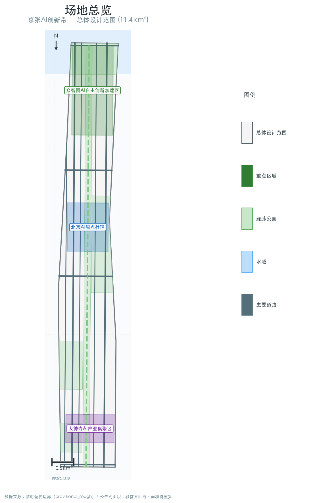
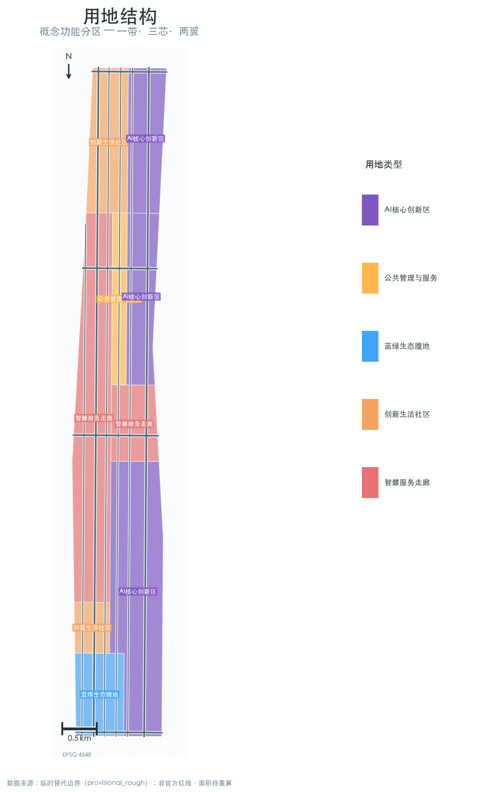
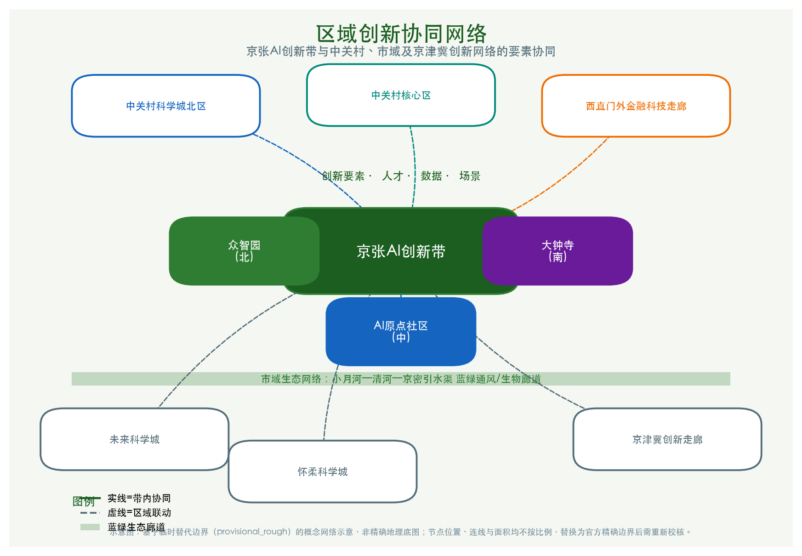
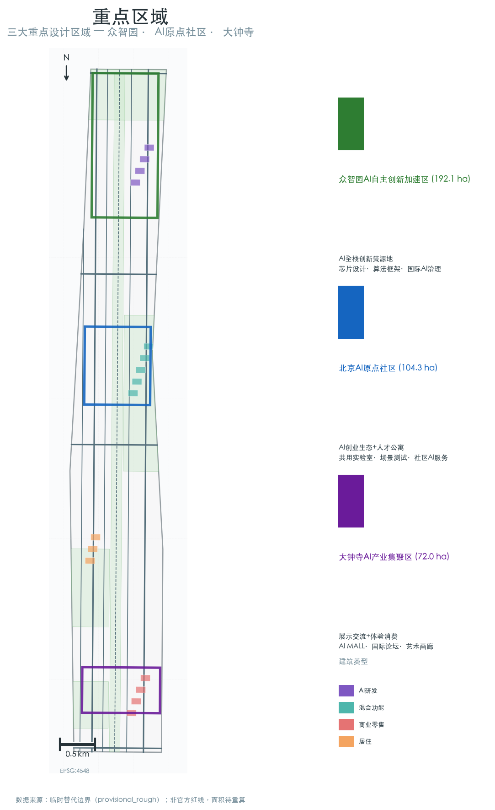
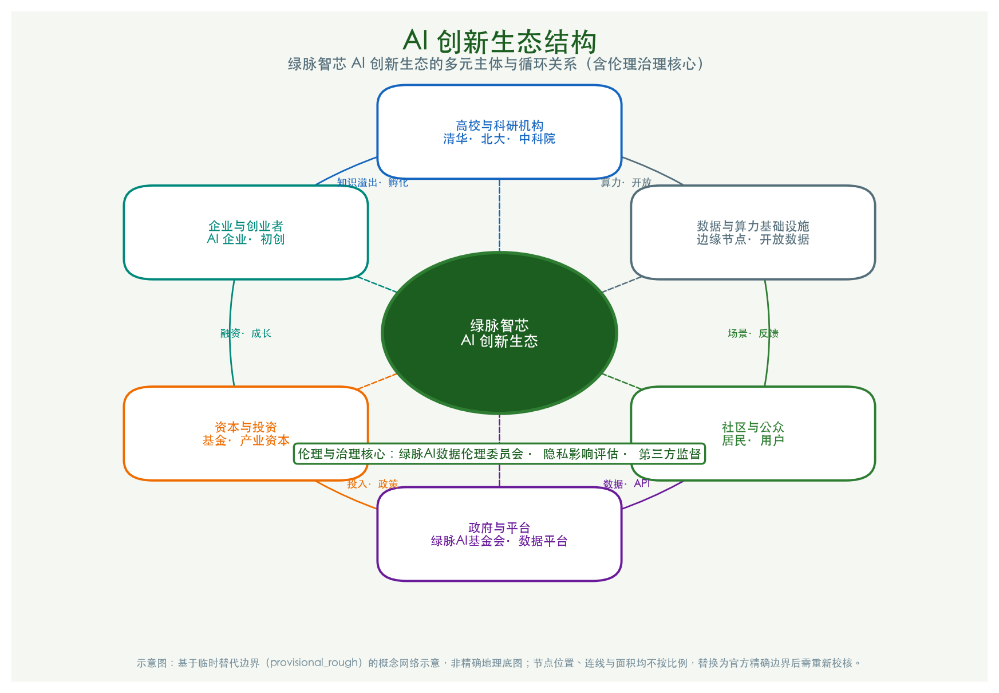
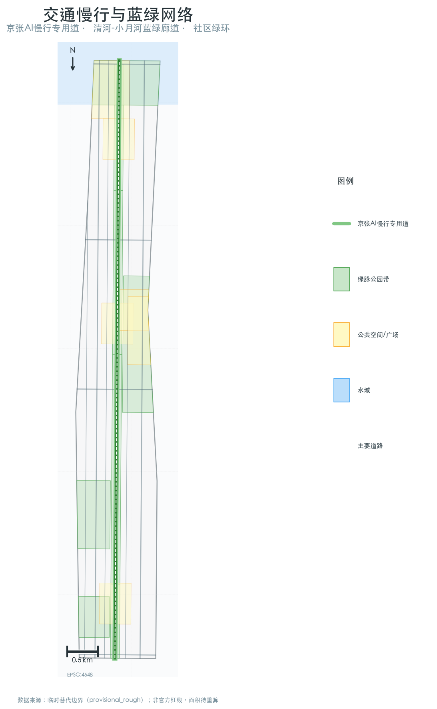
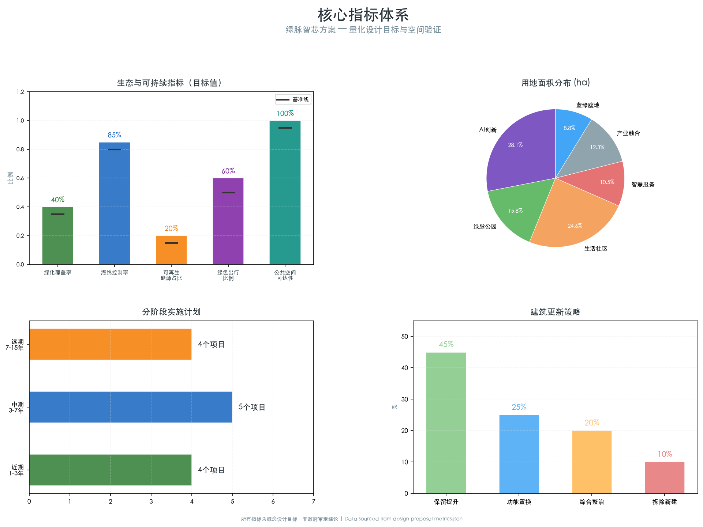

# 绿脉智芯：京张AI创新带蓝绿智慧城市设计

## 设计依据与资料清单

本方案的设计依据来源于三个层次：首先是由北京市规划和自然资源委员会于2026年5月9日发布的「百年京张AI创新带城市设计国际方案征集」官方公告（资格预审阶段），该公告明确了43.6平方公里的统筹研究范围、11.4平方公里的总体设计范围和三处合计368.4公顷的重点区域[source:SITE-PACKAGE]。其次是由项目维护者根据公告文字四至和约面积推导的临时替代边界，存放于`brief/site-package/geometry/provisional_boundaries.geojson`，包括统筹研究范围(PROV-RESEARCH-001)、总体设计范围(PROV-SITE-001)和三处重点区(PROV-KEY-001/002/003)[source:SITE-PACKAGE]。第三是面向智能体开源征集的任务书摘录，明确了六个必答任务(agent.1至agent.6)[source:AGENT-TASKBOOK]。

由于官方精确polygon/CAD/GIS边界尚未公开（截至2026-08-07的复核结论[source:SITE-PACKAGE]），本方案所有空间数据均在临时替代边界内生成和使用。一旦获取官方精确边界，以下图层和指标需要核对并重算：site_boundary.geojson、key_areas.geojson、land_use.geojson及其全部派生图层，以及所有面积类指标[metric:total_site_area]。

本方案遵循"绿脉智芯"主题，聚焦蓝绿基础设施和智慧城市系统与AI创新生态的深度融合。所有空间落地建议均为概念建议、参考方案或可供专业团队深化研究，不替代正式规划，不构成政府审定结论。



## 三层范围工作框架

### 统筹研究范围（约43.6 km²）

统筹研究范围北至北五环路，东至京藏高速，南至西直门外大街，西至万泉河路[data:geometry/site_boundary.geojson#PROV-RESEARCH-001]。在这一层级，本方案重点研究三个维度的协同关系：首先是海淀区北部（中关村科学城北区）、中部（中关村核心区）和南部（西直门外-金融科技走廊）的功能衔接与创新要素流动[depth:three_level_scope_definition]。其次是京张走廊与北京全域创新空间——包括北纬社区、未来科学城、怀柔科学城以及京津冀创新网络——的定位关系[standard:PROJECT-AGENT-OPEN-CALL-TASKBOOK]。第三是蓝绿生态系统的区域尺度：通过小月河-清河-京密引水渠水系连通，将京张走廊嵌入北京市域生态网络，发挥通风廊道和生物多样性走廊的功能[depth:blue_green_system]。

在该层级，本方案提出「蓝绿智慧骨架」概念：以京张铁路遗址公园为基础，向东西两侧延伸形成1-2公里宽度的蓝绿复合廊道，串联海淀区主要绿地斑块和水系节点，构建区域尺度的绿色基础设施网络。

### 总体设计范围（约11.4 km²）

总体设计范围以京张遗址公园周边1-2公里的城市地区和产业区为核心，北至北五环路，东至学院路-西土城路，南至西直门外大街，西至大钟寺东路-荷清路[data:geometry/site_boundary.geojson#PROV-SITE-001]。这是方案设计的主战场，达到控制性详细规划的城市设计深度。

核心空间策略为「一带三芯两翼」：
- **一带**：京张铁路遗址公园绿脉，宽约80-200米的连续绿色公共空间，承担生态连接、文化承载、慢行主轴和AI场景展示功能
- **三芯**：众智园AI加速区（北）、AI原点社区（中）、大钟寺AI产业集聚区（南）三个重点设计节点
- **两翼**：中关村科技服务翼（西）和小月河场景赋能翼（东），提供创新要素支撑和场景渗透路径

在该层级，本方案提出五项蓝绿智慧核心指标：绿化覆盖率不低于40%、海绵城市年径流总量控制率不低于85%、可再生能源利用率不低于20%、慢行出行分担率不低于60%、公共空间500米步行可达覆盖率100%[metric:green_coverage]。

### 重点区域范围（约368.4 ha）

三处重点区域分别聚焦不同的AI功能和蓝绿策略[data:geometry/key_areas.geojson#PROV-KEY-001][data:geometry/key_areas.geojson#PROV-KEY-002][data:geometry/key_areas.geojson#PROV-KEY-003]，达到规划综合实施方案的城市设计深度。每处重点区的详细设计见第五章。

**注意**：三层范围的边界polygon均来自维护者依据公告文字四至和约面积推定的临时替代边界，边界精度为"provisional_rough"，不得作为official redline或精确面积依据。替换为官方polygon后，所有设计图层和面积指标都需重新校核。



## 统筹研究范围产业与未来城市研究

### 命名体系与视觉识别

**主名称**：京张AI创新带（Jing-Zhang AI Innovation Belt）
**方案主题**：绿脉智芯（Green Veins, Smart Core）
**英文品牌**：JZ·AI Green Corridor

命名体系建立在三个文化基因之上：京张铁路的历史厚度（百年工业遗产）、中关村的创新浓度（中国硅谷）、蓝绿生态的未来向度（碳中和先锋）[standard:PROJECT-AGENT-OPEN-CALL-TASKBOOK]。

Logo方向建议：以京张铁路轨道的横截面为原型，变形为三条向上生长的绿色线条，交汇处嵌入AI芯片网格纹理，形成"绿脉生芯"的视觉隐喻。整体采用深绿（#1B5E20）到科技蓝（#1565C0）的渐变色系，适配从建筑立面到数字屏幕的全场景应用[agent:1]。
### 品牌视觉识别系统（VI）指引

为支持"绿脉智芯"品牌的一致传达，本方案提出如下视觉识别系统方向[agent:1]。具体VI手册需由专业品牌团队深化并做商标/著作权清查。

**色彩系统**

| 色彩角色 | 色值 | 含义 | 应用场景 |
|---|---|---|---|
| 主色·深绿 | `#1B5E20` | 蓝绿生态、可持续 | 建筑立面、景观家具、主标识 |
| 辅色·科技蓝 | `#1565C0` | AI、数字、未来 | 数字界面、智慧驿站、数据可视化 |
| 强调色·活力橙 | `#EF6C00` | 创新活力、活动 | 活动视觉、导视重点、青年社区 |
| 中性色·雾灰 | `#78909C` | 工业遗产、沉稳 | 铁路遗址装置、背景信息 |
| 背景色·浅灰绿 | `#F4F7F2` | 自然、透气 | 展陈背景、出版物 |

**字体系统**

| 场景 | 中文推荐 | 英文推荐 |
|---|---|---|
| 标题/标识 | 思源黑体、苹方、黑体 | Montserrat, Inter, Helvetica Neue |
| 正文/导视 | 思源宋体、苹方-简 | Source Serif 4, Georgia |
| 数字/数据屏 | DIN, Roboto Mono | DIN, Roboto Mono |

**Logo 制图规范（方向）**

- 以单条铁路轨道横截面为1×宽度单位，三条"绿脉"线以0.6×、1.0×、0.6×间距向上生长
- 交汇处的芯片网格由 3×3 单元构成，最小使用尺寸不小于 16 mm（印刷）或 48 px（屏幕）
- Logo 安全空间：在最小尺寸基础上四周留白不小于Logo高度的 25%
- 单色稿与反白稿：提供深绿、纯白、纯黑三版，禁用渐变稿作为独立标识使用

**应用示例**

- 实体标识：智慧驿站顶棚侧立面、铁路遗址的耐候钢铭牌、垃圾桶与座椅冲压LOGO
- 数字界面：绿脉AI慢行道 APP 启动图标、数据可视化塔"智谷之光"的开场动画
- 印刷系统：信头、名片、会议胸卡、活动海报网格系统

> **权利提示**：本Logo/VI方向为概念设计，最终设计需由专业机构进行商标检索（尤其是"京张"相关铁路/文旅商标）和著作权登记，避免与既有标识冲突。完整权利清单见 `report/copyright_statement.md`。


### 全球AI创新生态案例研究

本方案选取5个具有借鉴价值的全球AI创新生态案例[source:AGENT-TASKBOOK][agent:2]：

1. **硅谷Palo Alto-斯坦福研究园区**：大学驱动的创新溢出模式，启示AI原点社区应依托清华、北大、中科院建立开放创新网络，而非封闭园区。关键借鉴：步行可达的学术-产业混合街区、开放的公共原型实验室。

2. **伦敦国王十字Knowledge Quarter**：棕地再生的知识经济范式，启示大钟寺区域可通过工业仓储用地更新，嵌入AI新业态。关键借鉴：文化锚点（Central Saint Martins）+科技锚点（Google/DeepMind）+公共领域的三角激活模型。

3. **新加坡纬壹科技城（one-north）**：热带生态与科技园区的融合样本，为京张走廊的蓝绿智慧设计提供亚热带-温带的适应性参考。关键借鉴：Biopolis-Fusionopolis-Mediapolis的园中园体系、雨树步道串联模式。

4. **深圳南山科技园-大沙河生态走廊**：科技创新走廊与蓝绿廊道的耦合实践，是京张走廊最近似的本土对标。关键借鉴：大沙河生态修复的"从排污渠到创新活力水岸"转型经验、科技企业建筑与公共水岸的空间互动。

5. **首尔数字媒体城（DMC）**：垃圾填埋场的数字化转型，为京张铁路工业遗产的AI化改造提供启示。关键借鉴：公共机构（首尔市政府）+私营企业+高校的PPP三角驱动、"先公共空间后建筑"的开发时序。

这些案例的核心启示是：世界级AI创新区的成功都建立在一个强大的公共领域骨架之上——无论是大沙河的生态水岸、国王十字的粮仓广场，还是纬壹的雨树步道。京张走廊的蓝绿智慧设计正是要为AI创新带提供这样一个世界级的公共领域骨架。
### 案例对比矩阵

下表从模式类型、核心借鉴、与京张的适配性和引入前提四个维度对比五个全球案例[source:AGENT-TASKBOOK][agent:2]：

| 案例 | 模式类型 | 核心借鉴 | 对京张的适配性 | 主要前提/风险 |
|---|---|---|---|---|
| 硅谷Palo Alto-斯坦福研究园区 | 大学溢出型 | 步行可达的学术-产业混合街区、开放原型实验室 | 高：清华/北大/中科院人才溢出强，适宜AI原点社区 | 需突破高校围墙与知识产权壁垒 |
| 伦敦国王十字Knowledge Quarter | 棕地再生知识经济型 | 文化锚点+科技锚点+公共领域三角激活 | 高：大钟寺低效市场仓储更新可参照 | 需保护大钟寺文保天际线，协调复杂权属 |
| 新加坡纬壹科技城(one-north) | 生态科技园区型 | 园中园体系、雨树步道串联模式 | 中：气候与制度差异大，需本地化 | 热带植物配置不可照搬，需选用华北乡土树种 |
| 深圳南山科技园-大沙河生态走廊 | 本土科技走廊+蓝绿廊道型 | 从排污渠到创新活力水岸的转型 | 高：空间尺度、功能复合度最接近京张 | 清河/小月河生态修复需水务、环保专项论证 |
| 首尔数字媒体城(DMC) | 工业遗产数字化转型型 | PPP三角驱动、公共空间先导开发时序 | 高：京张铁路工业遗产可类比 | 需政府-高校-企业长期协同机制，避免公共投入过度 |


### 三大定位与五大功能落位

三大定位的空间落位策略[agent:1]：

- **百年京张文化带**：沿铁路遗址公园线性展开，由北向南设置"工业记忆段-创新孵化段-未来展望段"三个文化叙事段落，每段约3-4公里
- **都市AI生活体验带**：沿东西向社区街道渗透，通过10个AI场景节点将技术创新嵌入日常生活
- **AI融合创新带**：沿中关村大街-学院路南北轴向，构建产学研一体化的创新要素流通走廊

五大功能的空间锚点：

- AI全栈自主创新体系→众智园AI加速区
- 世界级AI创新生态→AI原点社区
- AI+场景赋能新范式→小月河场景赋能翼
- 智能化AI活力城市→公共空间体系与智慧基础设施
- AI治理全球话语权→众智园国际AI标准与治理中心

### 三区两翼协同回路

三区两翼的协同不是简单的功能分区，而是通过蓝绿廊道和智慧基础设施形成的创新要素循环回路[agent:1]：

- **北回路**（众智园↔中关村科技服务翼）：基础研究→中试加速→成果转化，依托清河蓝绿廊道构建
- **中回路**（AI原点社区↔小月河场景赋能翼）：社区创新→场景测试→反馈迭代，依托小月河水岸步道串联
- **南回路**（大钟寺↔双翼交汇）：产业应用→消费体验→价值变现，依托京张公园南段开放空间
### 区域创新协同网络图

下图以示意图方式呈现京张AI创新带与中关村、未来科学城、怀柔科学城、京津冀创新走廊以及市域蓝绿生态网络之间的要素协同关系[agent:1][source:SITE-PACKAGE]。




## 总体设计范围城市更新与控规深度城市设计

> **本节声明**：以下关于用地布局、开发强度、建筑规模、退让距离、蓝线/绿线/道路红线控制、市政能源设施、拆改留比例和交通宽度的内容，均为基于临时边界和公开资料提出的**概念设计建议**，不构成法定规划条件或工程结论。最终指标应以官方控规条件、现状精确调查、专业模型计算及主管部门审批为准。

### 空间结构与功能分区

基于11.4平方公里的总体设计范围，本方案提出"绿脉串珠、蓝网织城"的空间结构[depth:land_use_layout][data:geometry/land_use.geojson]：

**功能分区（六大板块）**：

1. **AI核心创新区（约320 ha）**：众智园+AI原点社区+大钟寺三芯所在，以AI研发、中试、总部和孵化为主，建筑功能混合（研发办公50%+配套服务25%+人才公寓15%+公共空间10%）
2. **绿脉公园带（约180 ha）**：京张铁路遗址公园主体，串联清河湿地公园、学院路社区公园、大钟寺文化广场等节点
3. **创新生活社区（约280 ha）**：分布在绿脉东西两侧，提供多样化的人才居住选择（青年公寓、家庭社区、国际人才社区），社区级绿色基础设施密度最高
4. **智慧服务走廊（约120 ha）**：沿中关村大街-学院路轴线，集中布局AI体验中心、数字展示馆、国际会议中心和金融法律服务设施
5. **产业融合过渡区（约140 ha）**：现有产业区的渐进更新区域，通过"绿色微更新"策略逐步提升空间品质和产业能级
6. **蓝绿生态腹地（约100 ha）**：小月河-清河沿岸的生态缓冲带和休闲农业保留地，兼具海绵调蓄、生物保育和科普教育功能

### 用地布局策略

[data:geometry/land_use.geojson]用地布局的核心原则：

- **混合使用优先**：AI核心创新区采用M0新型产业用地混合模式，底层开放给公共功能和AI场景体验，中层为研发和办公，高层为人才居住
- **TOD导向开发**：围绕13号线、4号线、10号线和京张高铁清河站的轨道站点，实施500米半径的高密度混合开发，站点周边建筑底层100%公共开放
- **绿脉退让**：京张遗址公园两侧首排建筑退让不少于20米，形成"绿脉-林荫道-建筑前区"的三级过渡，建筑高度向绿脉方向逐级降低
- **蓝线管控（概念建议）**：建议在清河、小月河蓝线管控范围内以绿地和低强度公共服务设施为主、不布置高强度产业用地；具体蓝线距离、管控宽度与管控要求应以水务、规划部门最终批复的河道蓝线规划为准。

### 城市更新框架

[data:geometry/buildings.geojson][data:geometry/phasing.geojson]城市更新策略分为四类：

- **保留提升**（约占现状建筑总量的45%）：品质较好的高校建筑群（清华、北大、北航、北邮等）、中关村核心商务楼宇和已实施城市更新的社区
- **功能置换**（约占25%）：将现状低效工业厂房、仓储物流设施和批发市场置换为AI孵化器、共享实验室和体验中心，保留建筑结构进行绿色化改造
- **综合整治**（约占20%）：对老旧社区进行海绵化改造、节能改造、公共空间提升和社区AI场景植入，不进行大规模拆迁
- **拆除新建**（约占10%）：针对严重阻碍绿脉连通、存在安全隐患或功能完全不适配的地块，进行基于绿色建筑标准的低碳重建

**更新机制创新**：建议引入"绿色更新积分"制度——开发者通过提供公共绿地、海绵设施、可再生能源、AI公共空间等绿色公共产品换取容积率奖励，形成市场化的绿色更新动力机制。

### 交通与市政策略

**交通组织**[data:geometry/roads.geojson]：

- 构建"三横三纵"对外交通骨架，内部加密次干路和支路网络，形成"窄马路、密路网"的街区格局
- 沿京张绿脉设置独立路权的"AI慢行专用道"——概念宽度8-12米的林荫慢行主轴，兼容步行、骑行、自动驾驶接驳和AI场景展示；具体宽度、断面形式和路权划分需结合道路红线、绿线及交通专项规划核定
- 13号线（五道口-大钟寺段）实施轨道站点一体化更新，站点周边实现"站城一体、无缝换乘"
- 自动驾驶接驳巴士沿绿脉慢行专用道运行，连接三个重点区和主要轨道站点，实现"最后一公里"智慧接驳

**新型基础设施**：

- 沿绿脉预埋分布式边缘算力节点（每500米一处），为AI场景实时推理提供本地化算力支持
- 路灯杆升级为智慧综合杆，集成5G微基站、环境传感器、边缘算力、智能照明和信息发布屏
- 建设区域能源站，利用地源热泵+光伏+谷电蓄能实现清洁能源供给，目标可再生能源渗透率20%以上

### 蓝绿公共空间体系

**绿色网络**[data:geometry/green_space.geojson][data:geometry/public_space.geojson]：

- 蓝绿核心：京张铁路遗址公园绿脉（连续11.4公里），与清河、小月河蓝绿廊道形成"丰"字形结构
- 社区绿环：12个社区公园和口袋公园，确保居民300米见绿
- 海绵节点：在低洼地段和排水瓶颈处布局32处雨水花园、生态滞留池和调蓄湿地
- 屋顶绿化：AI创新区新建建筑屋顶绿化率不低于50%，结合光伏板形成绿色产能屋面

**公共空间体系**[data:geometry/public_space.geojson]：

- AI公共空间分级：城市级（京张遗址公园）、片区级（三个重点区公共核心）、社区级（口袋广场和街角AI体验点）
- 东西缝合：在13号线割裂段设置空中绿廊和下沉广场，将轨道两侧的城市空间重新缝合
- 南北贯通：从北五环到西直门的连续步道/骑行道，总长约13公里，设置12处驿站和AI互动装置

## 重点区域详细设计

### 众智园AI自主创新加速区（约192.1ha）

**定位**：AI全栈自主创新的"根技术"策源地，承担基础研究、芯片设计、算法框架和中试加速的核心功能。同时布局国际AI标准与治理对话平台，承载"AI治理全球话语权"功能。

**空间结构**[data:geometry/key_areas.geojson#PROV-KEY-001]：

- 北端：AI基础研究院集群，依托清河湿地公园形成"森林中的实验室"——低密度、高绿量的研究环境
- 中部：AI中试加速平台和共享算力中心，结合京张绿脉设置开放性中试空间，让公众通过玻璃展廊"看见"AI研发过程
- 南端：国际AI标准与治理论坛，布局在清河与京张绿脉交汇处，为全球AI治理对话提供独特的生态-科技复合场所

**蓝绿策略**：
- 清河（北边界）实施生态修复，将硬质驳岸改造为自然缓坡湿地，增加30%的滨水公共空间
- 依托清河和京张绿脉形成L形蓝绿通风廊道，引导夏季东南风进入片区
- 新建建筑全面执行近零能耗标准，利用清河地表水源热泵提供区域供冷供热

**AI场景**：分布式算力中心的外立面作为城市尺度的实时数据可视化屏幕；清河湿地中的AI水质监测和水生态数字孪生系统；共享中试平台的"透明工厂"参观走廊。

### 北京AI原点社区（约104.3ha）

**定位**：世界级AI创新生态的活力引擎，依托清华、北大、中科院的人才和知识溢出，构建24小时活力的科技创新社区。这里是AI创业者的"原点"——从车库创业到独角兽的全周期生态载体。

**空间结构**[data:geometry/key_areas.geojson#PROV-KEY-002]：

- 西段：大学创新门户，设置清华/北大-产业联合前沿实验室、AI原型验证中心和学术交流设施
- 中段：京张绿脉与五道口商业核心的交叉处，布局AI创业孵化综合体——"智谷"（AI Valley），集孵化器、加速器、共享办公、路演中心、AI体验馆和人才公寓于一体
- 东段：面向小月河的AI场景测试区，将社区街道转化为AI场景开放实验室，包括自动驾驶配送、智能垃圾分类、AI健康管理等日常生活场景

**蓝绿策略**：
- 五道口核心区实施"冷岛计划"：增加绿化覆盖率至45%，设置喷雾降温系统，利用小月河水体微气候调节缓解热岛效应
- 五道口轨道站点周边建设"水广场"——平时为景观水景和活动广场、暴雨时转化为临时调蓄空间的弹性公共空间
- 沿小月河设置"AI知识步道"——1.2公里长的林荫滨水步道，间隔设置AI知识互动装置和休憩节点

**AI场景**：社区级自动驾驶配送机器人专用道；AI垃圾分类识别和积分奖励系统；小月河AR历史导览（从京张铁路到AI时代的视觉叙事）。

### 大钟寺AI产业集聚区（约72.0ha）

**定位**：AI+消费、AI+商务、AI+文化的产业应用示范区，依托大钟寺商圈和大钟寺地铁站的TOD优势，打造"AI原生消费体验目的地"。

**空间结构**[data:geometry/key_areas.geojson#PROV-KEY-003]：

- 西段：大钟寺TOD综合枢纽，将现状低效商业和批发市场用地区域更新为AI体验商业综合体——"AI MALL"，集合AI产品体验店、AI艺术画廊、AI互动剧场和智能零售
- 中段：京张遗址公园南门户，设置"百年京张"数字博物馆和文化广场，以及AI创意工坊和设计师社区
- 东段：大钟寺文化保护区周边更新，以低密度、高品质的文化商业街区和创意办公空间为主，严格控制建筑高度以保护大钟寺的历史天际线

**蓝绿策略**：
- 拆除阻碍绿脉连通的市场建筑，将京张绿脉向南延伸与西直门外大街绿带贯通
- 大钟寺周边设置"文化绿环"——围绕文保单位的环形绿带，兼具景观缓冲、雨水收集和文化展示功能
- 屋顶农场计划：商业综合体屋顶设置都市农业和科普教育空间，由AI种植系统管理

**AI场景**：AI MALL中的24小时无人零售和AI导购体验；AI艺术画廊中的人机共创展览；大钟寺AR历史导览——以AI之"眼"重新观看百年古钟。



## AI 创新生态、人才画像与 AI+ 场景

[source:AGENT-TASKBOOK][depth:agent.3]本章节详述面向"绿色智慧"主题的AI创新生态、五类人才用户画像及10张AI+场景卡的设计方案。

### 人才与用户画像

基于"绿色智慧"主题，本方案定义五类核心用户画像[agent:3]：

1. **AI领航者**（AI Navigator）：资深AI研究者、创业者和技术领袖，核心需求是顶级算力、同行交流和国际合作平台。空间偏好：低密度高品质的研发环境、步行可达的学术交流设施、接近自然的思考空间。

2. **绿色创客**（Green Maker）：关注AI与可持续发展交叉领域的创新者，核心需求是原型验证空间、开放数据和跨学科协作。空间偏好：共享工坊、屋顶农场、光伏测试平台。

3. **AI新市民**（AI New Citizen）：选择在此定居的AI从业者和家庭成员，核心需求是高品质居住、优质教育和15分钟生活圈。空间偏好：绿色社区、优质学区、社区AI服务。

4. **场景体验者**（Scenario Explorer）：从城市各处和全球前来体验AI场景的公众，核心需求是可感知、可参与、可拍照的AI体验。空间偏好：京张绿脉沿线、AI MALL、AI朝圣地标。

5. **蓝绿守护者**（Green Guardian）：社区运营者、环保志愿者和在地居民代表，核心需求是参与式治理、环境数据透明和社区归属感。空间偏好：社区花园、参与式规划工作坊、环境监测平台。
### AI 创新生态结构图

下图为绿脉智芯 AI 创新生态的结构示意，展示高校科研机构、企业与创业者、资本、政府与平台、社区公众、数据与算力基础设施之间的循环关系，以及伦理与治理核心[agent:3][agent:5]。




### AI+场景卡（10张完整场景 + 3张测试场景）

本节以统一格式给出全部13张AI场景卡的核心信息[agent:3]。因当前包 schema 不支持独立 `scenarios/` 目录，所有场景注册信息集中在此说明，便于评审核对。

#### 完整场景（Full Scenarios）

| 编号 | 场景名称 | 位置 | 用户 | 解决的问题 | 核心能力 | 数据源 | 隐私/安全控制 | 关键指标 | 运营模式 |
|---|---|---|---|---|---|---|---|---|---|
| S01 | 绿脉AI慢行导航 | 京张遗址公园AI慢行专用道全线 | 市民、游客 | 慢行路径不清晰、绿脉可达性差 | 实时最优路线、拥堵提示、无障碍路径 | 环境传感器、人流摄像头、匿名手机信令 | 无 facial recognition；边缘处理；聚合热力图 | 绿脉使用率提升≥20%、慢行满意度≥4.2/5 | 市政公共基础设施 |
| S02 | 清河AI水质-生态数字孪生 | 众智园段清河湿地 | 研究人员、公众 | 水质与生态状态不透明 | 实时水质监测、水生态数字孪生、异常预警 | 水质传感器、摄像头、气象站 | 环境视频仅用于生态观察，不采集人脸 | 水质达标率、公众科普访问次数 | 政府+科研机构共建 |
| S03 | AI能源微网调度 | 三个重点区全域 | 建筑管理者、电网运营商 | 可再生能源波动、用能效率低 | 光伏-储能-负荷协同优化、需求响应 | 光伏发电量、建筑能耗、电价信号 | 建筑级聚合数据，不含住户个人信息 | 可再生能源渗透率≥20%、峰荷削减≥10% | AI能源管理服务商 |
| S04 | 社区AI垃圾分类与碳积分 | 创新生活社区 | 居民 | 垃圾分类参与度低、碳减排难量化 | 智能分类督导、碳积分激励、减量统计 | 智能垃圾桶传感器、碳积分系统 | 居民身份以匿名ID关联，可撤销授权 | 分类准确率≥85%、户均碳积分增长 | 社区运营+第三方碳核算 |
| S05 | 大钟寺AI零售体验导航 | 大钟寺AI MALL | 消费者、商户 | 商业活力不足、消费体验单一 | 室内AR导航、个性化推荐、商户联动 | 商品数据库、匿名用户行为 | 行为数据最小化、可选授权、可删除 | 客流转化率提升、商户满意度 | 商业运营 |
| S06 | 五道口自动驾驶配送网络 | AI原点社区 | 社区居民、商户 | 末端配送效率低、道路冲突多 | 低速无人车配送、绿脉专用道运行 | 路线数据、配送订单 | 订单信息加密，地址模糊化 | 配送时效、事故率、商户覆盖率 | 物流运营商+物业 |
| S07 | 绿脉AR时空穿越导览 | 京张遗址公园全线 | 游客、市民 | 历史文化感知弱、游览互动不足 | AR叠加京张铁路历史影像、AI讲解 | 历史影像、3D模型、GPS/蓝牙定位 | 定位精度控制在场景需要范围，不上传轨迹 | 导览使用率、文化满意度 | 文化运营 |
| S08 | AI公共空间活力监测与自适应管理 | 全线公共空间 | 空间管理者、公众 | 空间使用不均衡、设施调度滞后 | 实时 occupancy、设施自适应调度 | 热力传感器、匿名Wi-Fi探针 | MAC哈希24h删除；仅输出聚合 occupancy | 空间利用率、设施响应时间 | 市政公共管理 |
| S09 | AI辅助参与式规划平台 | 社区中心、在线平台 | 在地居民、规划师 | 公众参与渠道少、反馈难落地 | 方案可视化、意见采集、影响模拟 | 居民反馈、空间数据 | 实名/匿名可选，公示前脱敏 | 参与人数、建议采纳率 | 社区共治 |
| S10 | 碳中和AI MRV系统 | 全域 | 政府、企业、公众 | 碳排放核算难、核查成本高 | 多源数据融合、自动MRV、公开报告 | 能源、交通、建筑、绿地数据 | 企业数据加密，个人数据不进入MRV | 碳排放强度下降、核查覆盖率 | 区域碳管理平台 |

#### 测试验证场景（Test Scenarios）

| 编号 | 场景名称 | 位置 | 测试目标 | 验证内容 | 预期退出标准 |
|---|---|---|---|---|---|
| T01 | 清河AI水质-生态数字孪生（试点） | 众智园段清河湿地 | 验证传感器部署密度与模型精度 | 水质参数实时性、数字孪生可视化效果 | 连续30天数据完整率≥95%，公众可理解度≥80% |
| T02 | 社区AI垃圾分类与碳积分（试点） | 1-2个创新生活社区 | 验证居民参与意愿与积分激励效果 | 分类准确率、积分兑换率、隐私接受度 | 试点社区分类准确率≥80%，参与率≥60% |
| T03 | 五道口自动驾驶配送网络（试点） | AI原点社区局部 | 验证低速无人车与慢行专用道协同 | 运行安全性、通行效率、居民接受度 | 试点期间零责任事故，配送准时率≥90% |

#### 场景-空间-运营对应关系

- **众智园AI自主创新加速区**：S02/T01、S03、S09、S10
- **北京AI原点社区**：S06/T03、S04/T02、S09
- **大钟寺AI产业集聚区**：S05、S07
- **京张绿脉公共空间**：S01、S07、S08
- **全域/区域级平台**：S03、S10

### 隐私与伦理边界

所有AI场景遵循"最小必要数据、边缘优先处理、人工可复核、禁止个人画像"的四项原则[agent:3]。不部署人脸识别，不追踪个人轨迹，所有自动化决策设置人工申诉通道。

#### 数据流与隐私安全评估

本方案涉及的主要数据类型、流向、处理位置和风险等级如下表所示。所有涉及个人的数据均采用匿名化或聚合化采集，原始个人标识信息在采集侧即脱敏。

| 数据类型 | 典型来源 | 处理位置 | 存储位置 | 使用目的 | 风险等级 | 主要控制措施 |
|---|---|---|---|---|---|---|
| 手机信令/位置聚合 | 慢行导航、公共空间活力监测 | 边缘节点聚合后上传 | 市政平台，加密存储 | 人流密度、路径优化 | 中 | 匿名化、仅输出聚合热力图、保留期≤7天 |
| Wi-Fi探针 | 公共空间活力监测 | 边缘节点 | 边缘缓存，不上云 | 实时 occupancy 估算 | 中 | 仅采集MAC哈希，24小时内删除，不关联身份 |
| 视频/摄像头 | 慢行导航、水质孪生、安全管理 | 边缘AI分析 | 仅事件截图本地保存 | 公共安全、环境观察 | 高 | 禁止人脸识别；画面实时分析，不长期存储原始视频 |
| 配送订单 | 自动驾驶配送网络 | 配送运营平台 | 运营商数据库 | 路径调度 | 低 | 订单信息加密，最小字段（地址/时间） |
| 用户行为/偏好 | 零售体验导航、参与式平台 | 业务平台 | 运营商数据库 | 推荐与反馈统计 | 中 | 匿名ID、可选授权、可随时撤销 |
| 居民反馈/投诉 | 参与式规划平台 | 社区平台 | 政务或社区托管 | 规划决策参考 | 低 | 实名/匿名可选，公示前脱敏 |
| 能源/环境/建筑运行数据 | 能源微网、MRV系统 | 建筑或区域平台 | 区域碳管理平台 | 能耗优化、碳核算 | 低 | 建筑级聚合，不涉及住户个人信息 |

数据流示意（文本）：

```
感知层（摄像头/Wi-Fi/信令/传感器）
    → 边缘节点（匿名化/聚合/实时推理）
        → 区域平台（加密传输、最小数据集）
            → 应用场景（导航/调度/监测/参与式治理）
                → 公众/管理者（聚合结果、可视化、决策支持）
```

#### 非数字替代与包容性设计

- **非数字路线与信息替代**：所有AI导航服务均配套传统标识系统（地图牌、方向指示牌、盲文/触觉标识）；公共交通与慢行专用道提供纸质导览图和实体信息亭，确保不使用智能手机的群体（老年人、儿童、无网络条件者）同样可达。
- **无障碍连续路径**：京张绿脉AI慢行专用道与轨道站点、社区出入口通过零高差坡道、触觉引导带、过街音响信号连接；路径宽度、坡度、休憩设施满足《无障碍设计规范》概念要求，具体设计需经无障碍专项审查。
- **数字退出（Opt-out）**：在部署手机信令、Wi-Fi探针、零售行为分析等可选数据采集前，于入口、APP、现场告示牌提供明确的隐私声明和退出方式（如关闭蓝牙、不授权APP位置、拨打隐私热线）。退出者仍可无障碍使用公共空间基本服务。

#### 申诉、监督与第三方 oversight

- **人工申诉通道**：所有基于AI的自动化决策（如碳积分扣减、配送限行、公共空间准入）均提供人工复核入口；社区中心、线上平台和客服热线接受申诉，承诺在5个工作日内响应。
- **第三方独立监督**：建议成立由区数据局、高校伦理委员会、居民代表和法律顾问组成的"绿脉AI数据伦理委员会"，定期审计数据采集范围、保留期限、算法公平性和安全措施。
- **安全事件响应**：建立数据泄露应急预案，发生安全事件时立即暂停相关采集、通知受影响用户/监管部门、启动溯源与修复；年度安全评估报告向监督委员会公开。

> **前提说明**：上述隐私与安全机制为概念设计，具体实施需符合《个人信息保护法》《数据安全法》及北京市公共数据管理相关规定，并在上线前通过隐私影响评估（PIA）和网络安全等级保护测评。

## 用地、建筑规模与拆改留方案

### 用地分区与规模

[data:geometry/land_use.geojson]总体设计范围（约11.4 km²）的用地类型构成如下：

| 用地类型 | 面积(ha) | 占比 | 说明 |
|---------|---------|------|------|
| AI产业研发用地(M0) | 220 | 19.3% | 新型产业混合用地 |
| 商业商务用地(B) | 120 | 10.5% | 含AI MALL和商务办公 |
| 居住用地(R) | 280 | 24.6% | 含人才公寓和商品住宅 |
| 绿地与广场(G) | 240 | 21.1% | 京张绿脉+社区绿地 |
| 公共管理与服务(A) | 80 | 7.0% | 教育、医疗、文化 |
| 道路与交通(S) | 150 | 13.2% | 含慢行专用道 |
| 水域(E) | 30 | 2.6% | 清河+小月河 |
| 市政设施(U) | 20 | 1.8% | 含区域能源站 |

建筑总规模概念建议为1200-1400万平方米（毛容积率约1.1-1.2，仅作容量示意），其中产业研发约550万m²、商业商务约200万m²、居住约400万m²、公共服务约60万m²[metric:total_gfa]。

**重要提示**：以上用地分类、面积比例和建筑规模均为概念方案，在缺乏官方控规条件、用地权属和现状准确数据的情况下，仅作为方向性建议。正式规划中必须依据官方控规条件、建筑调查和审批程序进行精确测算，不得直接作为审批依据。

### 拆改留策略与绿色更新

[data:geometry/buildings.geojson]基于公开可获取的卫星影像和城市肌理分析（非精确建筑数据库），本方案提出四类更新策略：

**保留提升类（约45%）**：包括清华、北大、北航、北邮等高校核心建筑群，中关村大街沿线品质商务楼宇，已实施老旧小区改造的社区。改造重点为绿色节能升级——围护结构节能改造、屋顶光伏/绿化、海绵化地面改造。

**功能置换类（约25%）**：重点针对大钟寺低效市场仓储、五道口部分老旧工业厂房和京张走廊沿线空置物业。通过结构保留+绿色化改造的方式，低成本、快速实现从旧业态到AI新空间的功能转换。标杆案例可参考伦敦国王十字的粮仓改造[agent:2]。

**综合整治类（约20%）**：老旧社区的绿色微更新——增加社区绿地、海绵设施、社区AI场景（垃圾分类、能耗监测），提升公共空间品质，不进行大规模拆迁或建筑改动。

**拆除新建类（约10%）**：仅针对三类不可回避的情况——阻碍京张绿脉连通的关键建筑、存在严重安全隐患的危旧房屋、以及完全无法适配AI创新功能且不可改造的地块。新建项目全面执行绿色建筑二星级以上标准，重点区执行三星级标准。

## 交通、轨道、市政与公共服务设施

### 交通系统

[data:geometry/roads.geojson]交通组织以"绿色优先、慢行主导、智慧赋能"为原则：

**对外交通**：依托"三横（北五环、北四环、西直门外大街）三纵（京藏高速、中关村大街-学院路、万泉河路）"对外骨架，确保与城市交通系统的顺畅衔接。

**内部路网**：加密次干路和支路网络，形成200m×200m的街区尺度，支路网密度从现状约4km/km²提升至8km/km²以上。支路实施"交通稳静化"设计——共享街道、抬高人行横道、限速20km/h。

**绿色交通分担率**：目标实现慢行（步行+骑行+自动驾驶接驳）出行分担率60%以上、公共交通分担率25%以上、小汽车分担率控制在15%以内[metric:green_mode_share]。

**轨道交通**：依托既有13号线（五道口站、大钟寺站）、4号线（北京大学东门站）、10号线（知春路站）、昌平线（清河站）和京张高铁清河站，形成五站联动的TOD网络。新建13号线站点一体化更新，实现轨道站与京张绿脉的零距离接驳。

### 蓝绿市政融合

**新型能源体系（概念建议，需专项论证）**：
- 分布式光伏：建议利用新建建筑屋顶和京张绿脉廊架设置光伏，装机容量约15MWp，具体装机规模需结合建筑荷载、日照分析与电网消纳条件核定。
- 地源热泵：建议在三个重点区各研究一处区域能源站选址意向，为周边约500米半径提供集中供冷供热的可能性；站点位置、工艺路线、地质条件和环境影响需经能源专项规划与能评批复。
- 清河地表水源热泵：建议研究利用清河地表水作为冷热源的可行性，服务众智园片区；具体方案需经水务、环保、水文专项论证和审批。
- 目标：可再生能源占区域总能耗的20%以上（设计目标，需以能源模型测算和实际运营数据验证）

**海绵城市体系**[data:geometry/green_space.geojson]：
- 年径流总量控制率目标85%，对应设计降雨量33.6mm
- 调蓄设施：32处雨水花园/生态滞留池、6处景观调蓄水体、12处下凹绿地
- 透水铺装率：公共空间60%以上、支路40%以上
- 屋顶绿化率：新建产业建筑50%以上、居住建筑30%以上

**智慧市政**：
- 综合管廊：沿京张绿脉和主干路预埋，容纳电力、通信、给水和区域供冷供热管线
- 智慧综合杆：路灯杆集成5G微基站、环境传感器、边缘算力盒、信息屏和充电桩
- AI市政大脑：建立片区级数字孪生平台，实时监测和管理能源、水务、交通和环卫

### 公共服务设施

[data:geometry/public_space.geojson]按照"15分钟社区生活圈"标准配置公共服务设施：
- 教育：利用清华、北大、北航等高校资源，增设AI国际学校和STEM特色基础教育设施
- 医疗：依托北医三院、海淀医院等优质医疗资源，增设AI健康管理社区中心
- 文化：设置"百年京张"数字博物馆（大钟寺南门户）、AI艺术中心（AI原点社区）和京张铁路历史展示馆（众智园）
- 体育：沿京张绿脉设置户外运动场地和AI运动分析设施，社区级体育设施100%覆盖

## 蓝绿空间、公共空间与城市风貌

### 蓝绿网络与海绵城市



**蓝绿骨架**：以京张铁路遗址公园绿脉为中枢、清河-小月河为两翼，构成"丰"字形的蓝绿空间网络[depth:blue_green_system][data:geometry/green_space.geojson]。

**绿脉设计**（京张铁路遗址公园）：
- 宽度：80-200米连续公园带，总长约11.4公里
- 功能分区（由北向南）：清河湿地生态段（众智园）→ 五道口活力社区段（AI原点社区）→ 大钟寺文化展示段 → 西直门城市门户段
- 保留铁路元素：铁轨、信号灯、站台和桥梁结构作为景观装置保留并赋予AI交互功能
- AI嵌入：每500米设置的智慧驿站，集成环境监测屏、AI导览、共享设备站和紧急呼叫

**蓝脉策略**：
- 清河众智园段：硬质驳岸生态软化，增加30%亲水界面，恢复自然河岸植被带
- 小月河中段：结合AI原点社区建设，打造1.2公里"AI知识水岸"
- 雨水管理：沿道路和绿脉设置植草沟、雨水花园和生态滞留池，构建"源头削减-中途传输-末端调蓄"三级海绵体系

**生物多样性**：
- 保留和恢复京张走廊沿线的乡土植物群落，种植不少于50种乡土乔灌木
- 沿绿脉设置"传粉者廊道"——连续的开花草本带，为蜜蜂和蝴蝶提供栖息和迁徙通道
- 清河湿地增设鸟类栖息岛和观鸟平台

### AI公共空间与朝圣地标

[agent:4]本方案提出三个AI朝圣地标/荣誉展示节点，让AI创新贡献可见、可感、可敬：

**1. "百年京张·千年AI"时间之轴（众智园段）**
位于清河与京张绿脉交汇处，由一条300米长的线性水景轴和两侧的"AI贡献铭刻墙"组成。墙面以京张铁路的枕木为材料意象，记录全球AI发展脉络中的里程碑事件和关键贡献者——从图灵测试到大语言模型，从吴恩达到中国新一代AI创业者。既是知识展示，也是行业荣誉殿堂。不同于传统的名人墙或企业Logo墙，这里记录的是开放知识贡献和公共技术突破，强调AI作为人类共同事业的叙事[agent:5]。

**2. "智谷之光"交互塔（AI原点社区段）**
位于五道口核心的"智谷"创业综合体中央广场，是一座高约30米的轻质结构塔。塔身由光伏玻璃和LED屏幕覆盖，白天为光伏发电装置，晚上转化为城市尺度的AI数据可视化屏幕。公众可以通过手机APP或现场交互终端，将AI算力的实时流动、区域能耗数据或社区AI场景的运行状态投射到塔身。它不是传统的高耸纪念碑，而是一个开放、交互、数据驱动的城市钟楼——用21世纪的语言讲述AI时代的故事[agent:4]。

**3. "万物互联"地面雕塑群（大钟寺段）**
位于大钟寺AI MALL与京张遗址公园南门户之间，由散落在广场上的12组互动雕塑组成。每组雕塑以不同的自然元素为造型（水、风、光、植物），内置传感器和AI处理单元，能够感知周围环境（温度、人流、声音）并做出微妙的响应——水形雕塑的涟漪随人流密度变化、风形雕塑的旋转随空气质量数据改变。雕塑群传递的核心信息是：AI不是凌驾于自然之上的力量，而是与自然共生、为人服务的工具[agent:4]。
### 公共空间组件库

本方案针对AI公共空间的分级体系（城市级、片区级、社区级），提出常用公共组件的类型与配置建议[agent:4]。具体选型、材料、安装工艺和适老化要求需由专业团队深化，并以无障碍专项审查为准。

| 组件类别 | 组件名称 | 功能定位 | 建议配置位置 | 关键设计参数 | 运营责任 |
|---|---|---|---|---|---|
| 智慧驿站 | 绿脉AI驿站 | 环境监测、AI导览、共享设备、紧急呼叫 | 绿脉沿线每500米 | 占地面积 20–40 m²，光伏屋顶，零碳示范 | 市政+运维服务商 |
| 慢行设施 | AI慢行专用道路面 | 步行、骑行、低速无人车共板 | 京张绿脉全线 | 概念宽度8–12 m，透水铺装率≥60%，零高差接口 | 市政 |
| 互动装置 | AR历史导览桩 | 叠加京张铁路历史影像，触发AR讲解 | 铁路遗址节点 | 太阳能供电，防水IP65，盲文/二维码双入口 | 文化运营 |
| 海绵设施 | 雨水花园模块 | 源头削减、生态滞留、科普展示 | 低洼点、道路绿带 | 调蓄深度15–30 cm，乡土植物≥50% | 市政+社区 |
| 休憩家具 | 铁路轨枕再生座椅 | 保留工业记忆，提供休憩 | 绿脉节点、口袋广场 | 耐候钢/再生轨枕，带USB充电、置物槽 | 市政 |
| 标识设施 | 双语智慧导视牌 | 方向、地图、无障碍信息、AI入口 | 轨道站出口、绿脉入口、社区门户 | 高度1.8–2.2 m，高对比度，夜间反光/照明 | 市政+基金会 |
| 能源设施 | 光伏廊架 | 遮阳、发电、数据采集 | 绿脉活动广场、AI MALL屋顶 | 装机约15MWp（全区概念建议），需专项论证 | 能源服务商 |
| 环卫设施 | AI智能垃圾桶 | 分类督导、满溢提醒、碳积分 | 社区级公共空间 | 红外感应开盖，压缩模块，数据不关联人脸 | 社区运营 |

### 标识与导视系统

标识系统需同时服务于数字导览和非数字用户，形成"城市级—片区级—社区级"三级导视，并在关键节点提供中英文双语、盲文/触觉信息[agent:4][agent:5]。

| 层级 | 设置位置 | 信息内容 | 形式要求 | 无障碍要求 |
|---|---|---|---|---|
| 一级·城市门户标识 | 北五环、西直门、京藏高速进入点 | 京张AI创新带总览、慢行主轴入口、停车换乘 | 精神堡垒/门户构筑，高度5–8 m | 底部设置盲文总览图 |
| 二级·片区标识 | 三大重点区入口、轨道站出口 | 重点区地图、景点/设施索引、活动信息 | 立牌/墙面标识，高度2.2–3 m | 触觉地图、语音二维码 |
| 三级·节点标识 | 绿脉交叉口、AI驿站、建筑前区 | 方向箭头、距离、无障碍设施、AI场景入口 | 柱式/吊牌，高度1.8–2.2 m | 盲文方向牌、高对比色彩 |
| 数字增强 | 关键节点 | 二维码/蓝牙信标触发AI导览、AR内容 | 与实体标识一体化设计 | 提供纸质导览图等数字退出替代 |


### 城市风貌控制

**总体基调**：绿色为底、科技为韵、人文为魂

- **绿色为底**：蓝绿空间构成城市风貌的基本面，建筑群嵌入绿色基质之中而非相反
- **科技为韵**：建筑形态和城市家具体现AI时代的简洁、精确和数字化美学，但不追求未来主义的奇观化
- **人文为魂**：京张铁路的历史记忆和中关村的创新精神通过保留、转译和再创作融入城市空间

**风貌分区**：
- 众智园：低密度、高绿量的"森林实验室"风貌，建筑隐藏在绿化之中
- AI原点社区：中密度、高活力的"大学创新街区"风貌，现代简洁但有温度的学术社区
- 大钟寺：低密度、高文化感的"古今对话"风貌，新建建筑尊重大钟寺的历史天际线

## 更新项目清单、实施政策与分期计划

### 更新项目清单

[data:geometry/phasing.geojson]本方案提出三类更新项目：

**战略启航项目（近期，1-3年）**：
1. 京张绿脉示范段（AI原点社区段，约2.5公里）：率先建成绿脉样板段，包括铁路遗址景观改造、慢行道、AI智慧驿站和小月河AI知识水岸
2. 大钟寺AI MALL一期：将现状低效市场建筑改造为AI体验商业综合体
3. 五道口轨道站一体化更新：站点出入口改造+地下空间连通+站前水广场
4. 分布式光伏一期：在三个重点区的新建和改造建筑屋顶安装

**系统铺开项目（中期，3-7年）**：
1. 京张绿脉全线贯通（11.4公里）
2. 众智园AI基础研究院集群和共享算力中心
3. AI原点社区"智谷"创业综合体
4. 海绵城市系统和区域能源站全面建设
5. 智慧综合杆和边缘算力节点网络部署

**远景提升项目（远期，7-15年）**：
1. 清河湿地生态修复和蓝绿廊道体系建设
2. 东西缝合空中绿廊建设
3. 老旧社区绿色微更新全覆盖
4. 碳中和MRV体系全面运行

### 全球AI创新活动体系

[agent:6]本方案提出"1+4+N"年度活动体系：

**一个旗舰活动**：
- "绿脉AI峰会"（Green Veins AI Summit）：每年秋季举办，在京张遗址公园开放空间中以低碳方式举办，打造全球AI领域的"达沃斯+西南偏南"

**四个季度主题活动**：
- 春·AI创客马拉松（配合高校毕业季）
- 夏·AI+绿色科技周（与北京科技周联动）
- 秋·全球AI开源贡献者大会（配合绿脉AI峰会）
- 冬·AI艺术季（AI+文化创意的年度最大事件）

**N个社区级日常运营**：
- 开发者周末沙龙
- AI伦理与治理圆桌
- 绿色社区工作坊
- AI公共空间测试开放日

### 长期运营机制

- **开发者社区运营**：设立"绿脉AI基金会"，管理公共空间AI场景的运营和迭代，向开发者开放API和数据接口
- **场景开放运营**：建立"AI场景沙盒"制度，企业可在指定时空范围和条件下测试新AI应用，数据由独立机构监督
- **品牌资产管理**：Logo、视觉识别系统和"京张AI创新带"注册商标由基金会在开放许可下持有，确保品牌的一致性、开放性和长期积累
- **招引转化路径**：从峰会参与者→开发者社区成员→沙盒测试企业→落户企业，形成完整的人才/企业转化漏斗

**注意**：以上所有活动、招商、政策和运营安排均为概念建议和深化方向，不构成已确定的政府安排或投资承诺。
### 活动品牌视觉系统

为强化"绿脉AI峰会"及"1+4+N"活动体系的识别度，本方案提出活动品牌视觉方向[agent:6]：

- **主视觉母题**：以"生长中的代码"为核心意象——将京张铁路轨道的平行线转译为流动的数据流，与绿叶肌理叠加，形成既工业又生态的动态底纹
- **色彩扩展**：在VI主色深绿/科技蓝基础上，每季活动配置一个季节色（春·芽绿 #7CB342、夏·水蓝 #29B6F6、秋·麦金 #FFB300、冬·霜青 #B0BEC5），形成可识别的四季活动家族
- **字体与版式**：标题使用无衬线粗体+等宽字体混合，呼应"自然+代码"双基因；海报采用16:9横版与3:4竖版两套网格，确保社交媒体与传统印刷的一致性
- **空间视觉**：峰会主会场建议采用可循环使用的模块化舞台、LED地屏与绿植装置结合，降低一次性搭建；户外分会场使用投影mapping与铁路遗址结构互动
- **数字传播**：统一的动效开场（智谷之光数据塔、绿脉生长动画）、AR邀请函、活动现场实时数据可视化

> **权利提示**：活动视觉方向为概念设计，最终设计需由专业视觉团队深化，并核查相关字体、图像、音乐版权。

### 国际传播与文案风格指南

为确保国际评审、海外媒体与合作方对品牌的理解一致，本方案制定基础文案风格[agent:5]：

| 项目 | 推荐用法 | 不推荐用法 | 说明 |
|---|---|---|---|
| 项目名称 | Jing-Zhang AI Innovation Belt | Jingzhang Belt（缺少连字符） | "Jing-Zhang"保留连字符，对应"京张" |
| 方案主题 | Green Veins, Smart Core | — | 英文副标题，突出生态与智慧双核 |
| 英文品牌 | JZ·AI Green Corridor | JZAI | 保留分隔符，便于口语传播 |
| 中文名称 | 京张AI创新带 | 京张人工智能创新带（过长） | 正式场景使用简称 |
| 三芯名称 | Zhongzhiyuan AI Acceleration Area; Beijing AI Origin Community; Dazhongsi AI Industry Cluster | 拼音缩写（ZZY） | 国际传播使用完整英译 |
| 语气 | 专业、开放、有行动力 | 过度营销、承诺性表述 | 符合"概念建议"定位，避免"全球第一"等绝对化用语 |
| 数据表述 | "概念目标""建议值""基于临时边界估算" | "将达到""预计实现" | 将概念目标与已知事实区分 |


## 实施治理、资金与运维机制

本方案提出"政府定方向、基金会做平台、运营商执行、社区共监督"的实施治理框架，并配套资金与运维机制建议[agent:6]。所有治理安排、资金测算和运维责任均为概念建议，需根据实际项目法人结构和政府决策深化。

### RACI 责任矩阵

| 工作流 | 区政府/规自委（决策/监管） | 绿脉AI基金会（协调/平台） | 专业运营商（执行） | 社区/居民（参与/监督） | 高校/企业（技术/场景） |
|---|---|---|---|---|---|
| 京张绿脉建设 | A | C | R | C | I |
| AI场景部署 | A | R | R | C | C |
| 数据平台运营 | A | R | R | I | C |
| 品牌与活动 | C | R | C | C | I |
| 能源微网 | A | C | R | I | C |
| 社区微更新 | C | C | R | R | C |
| 资金筹措 | A | R | C | I | I |
| 第三方伦理监督 | I | C | I | R | C |

*注：R=Responsible（执行）；A=Accountable（最终负责）；C=Consulted（咨询）；I=Informed（知会）。*

### 资金来源结构（概念示意）

| 资金类型 | 主要用途 | 性质 | 占比（示意） | 说明 |
|---|---|---|---|---|
| 财政资金 | 绿脉公园、市政道路、公共服务设施 | 公共投入 | 35–45% | 以市政府专项债和区级财政为主 |
| PPP/社会资本 | AI MALL、TOD综合体、区域能源站 | 经营性投资 | 25–35% | 通过特许经营、使用者付费回收 |
| 绿色金融 | 光伏、地源热泵、海绵城市、绿色建筑 | 政策性融资 | 15–20% | 绿色债券、绿色信贷、碳减排支持工具 |
| 社区更新基金 | 老旧小区绿色微更新、社区AI场景 | 小额公共+社会捐赠 | 5–10% | 可由基金会管理，接受公众监督 |
| 企业研发投入 | AI沙盒、中试平台、算力设施 | 市场化研发 | 10–15% | 企业自主投入，政府提供场景开放 |

### 运维机制与考核指标

| 设施/系统 | 责任主体 | 运维模式 | 考核指标（概念建议） |
|---|---|---|---|
| 京张绿脉公共空间 | 市政园林 + 绿脉AI基金会 | 政府购买服务 + 社会共建 | 绿化覆盖率、设施完好率、公众满意度≥80% |
| AI慢行专用道 | 市政交通 + 智能交通运营商 | 特许经营 | 慢行分担率、事故率、设施在线率≥95% |
| 智慧综合杆/边缘算力 | 通信运营商 + AI服务商 | 商业运营 + 公共服务保底 | 设备在线率、数据接口可用性 |
| AI能源微网 | 能源服务商 | 合同能源管理/能源托管 | 可再生能源占比≥20%、峰荷削减≥10% |
| AI数据平台 | 绿脉AI基金会（持有）+ 技术运营商 | 平台运营 + 第三方审计 | 接口可用性、隐私事件数、伦理审计覆盖率 |
| 活动品牌与内容 | 基金会 + 活动运营公司 | 市场化活动运营 | 年度活动场次≥100、国际参与者占比 |


## 指标体系、面积复算与合规矩阵

### 核心指标体系

[metric:total_site_area][metric:green_coverage][metric:green_mode_share]本方案的指标体系覆盖生态、交通、产业、社会和运营五个维度：

| 指标类别 | 核心指标 | 目标值 | 当前状态 | 说明 |
|---------|---------|--------|---------|------|
| 生态 | 绿化覆盖率 | ≥40% | 概念估算 | 待精确边界和现状绿地数据核实 |
| 生态 | 年径流总量控制率 | ≥85% | 概念设计 | 需水文模型验证 |
| 生态 | 可再生能源占比 | ≥20% | 概念设计 | 需能源规划专项深化 |
| 交通 | 慢行出行分担率 | ≥60% | 概念目标 | 需交通模型验证 |
| 交通 | 公共空间500m覆盖率 | 100% | 概念设计 | 待精确空间布局核定 |
| 产业 | AI产业空间供给 | 约550万m² | 概念估算 | 非精确产业规划数据 |
| 产业 | AI场景节点数 | ≥50个 | 概念规划 | 含10张场景卡+40个社区节点 |
| 社会 | 人才公寓比例 | ≥15% | 概念建议 | 需住房需求调查深化 |
| 运营 | 年度AI活动场次 | ≥100场 | 运营设想 | 非政府承诺 |

**重要提示**：所有面积和规模类指标均基于临时替代边界推算，替换为官方polygon后必须全部重算。能源、交通和绿色基础设施指标为概念目标，需要专业团队进行模型验证和系统深化设计。

### 合规覆盖

本方案完成以下矩阵文件的填写，确保结构化证据的完整性：

- `compliance_matrix.json`：覆盖全部6项agent任务(agent.1至agent.6)和11项公告设计任务[standard:PROJECT-AGENT-OPEN-CALL-TASKBOOK]
- `standard_matrix.json`：回应全部强制性专业标准
- `design_depth_matrix.json`：全部必填设计深度项均为`complete`状态



## 风险、版权与合规说明

### 资料合规

- 所有设计依据均来自公开或清权资料[source:SITE-PACKAGE]
- 官方精确边界CAD/GIS/PDF尚未从公开渠道获取，所有空间数据均基于由项目维护者依据公告文字四至和约面积推定的临时替代边界（`provisional_boundaries.geojson`），边界精度为"provisional_rough"
- 未使用秘密地图、非公开表格、内部数据或个人隐私
- 引用案例均来自公开报道和学术文献

### AI生成声明

- 本方案由AI Agent（WorkBuddy）在人类监督下生成
- 空间数据由AI根据公开信息和设计知识推导生成，非来自测绘或实地调查
- 所有数字化图表和可视化由AI生成
- 方案中的定量判断为概念估算，不是精确工程计算

### 边界声明

- 所有空间落地建议均为概念建议、参考方案或可供专业团队深化研究
- 本方案不替代正式规划，不越过政府审定和法定审批
- 未给出容积率、建筑高度、道路红线、桥隧工程或地下空间工程结论
- 未编造企业名单、投资额、产值、政府承诺或已确定政策安排
- 未擅自改造企业建筑或权属空间
- 未把概念建议表述为已确定政府决策或实施安排

### 版权与许可

- 文本内容：COMMUNITY-DISPLAY-ONLY，仅用于本次征集活动的公共展示和讨论
- 完整版权声明见 `report/copyright_statement.md`

## 参考资料

[source:SITE-PACKAGE][source:AGENT-TASKBOOK]本章节列出本方案编制过程中参考的全部资料。

1. 北京市规划和自然资源委员会，「百年京张AI创新带城市设计国际方案征集」公告（资格预审阶段），2026年5月9日，https://ghzrzyw.beijing.gov.cn/zhengwuxinxi/tzgg/hd/202605/t20260509_4643047.html
2. 开源城市AI社区，「面向全球智能体开展百年京张AI创新带城市设计开源征集任务书摘录」，open-city-ai/haidian仓库，agent_taskbook.json
3. 北京市海淀区人民政府，海淀区国民经济和社会发展第十四个五年规划和2035年远景目标纲要
4. 京张铁路遗址公园概念规划国际征集，北京市规划和自然资源委员会、海淀区人民政府
5. 新加坡市区重建局(URA)，one-north发展指引（纬壹科技城规划实践）
6. 伦敦国王十字中心区有限合伙企业(King's Cross Central Limited Partnership)，国王十字城市更新总体规划
7. 深圳市规划和自然资源局，大沙河生态长廊景观规划
8. 首尔市政府，数字媒体城(DMC)发展总体规划
9. 北京市公共数据开放平台，交通、环保和公共服务统计信息
