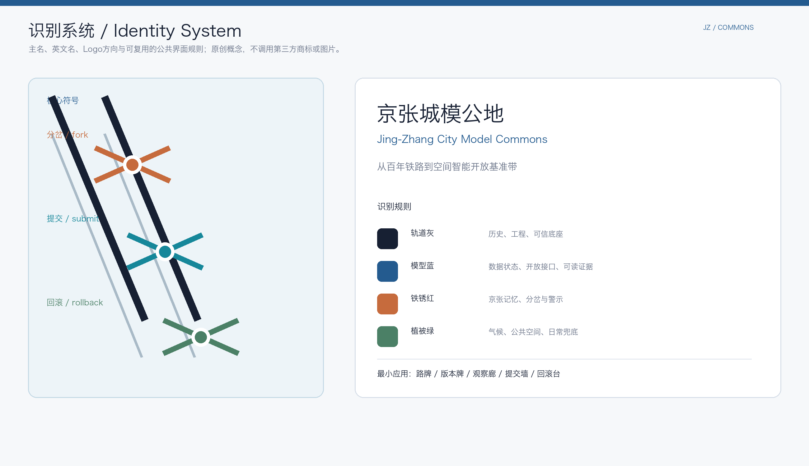
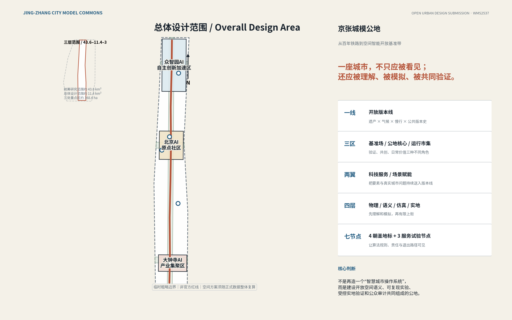
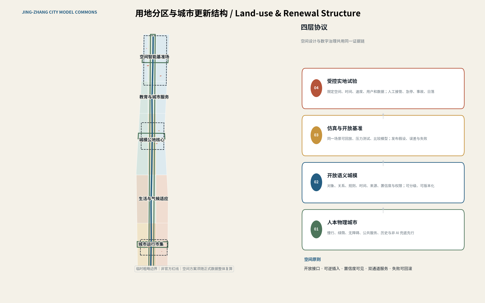
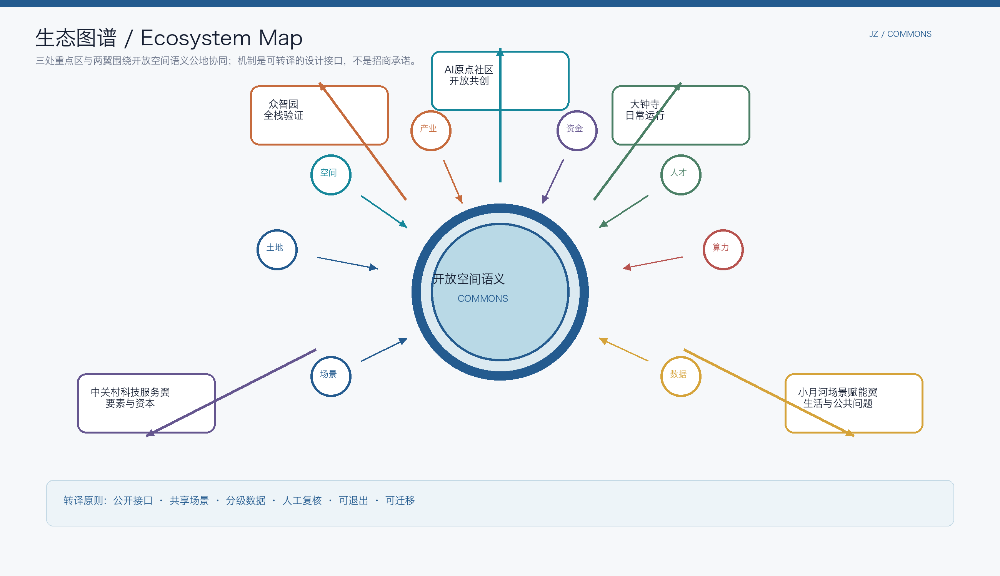
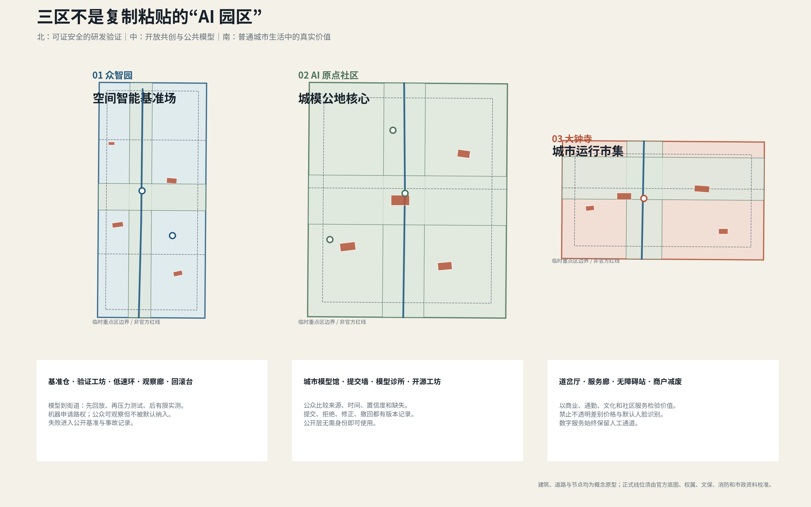
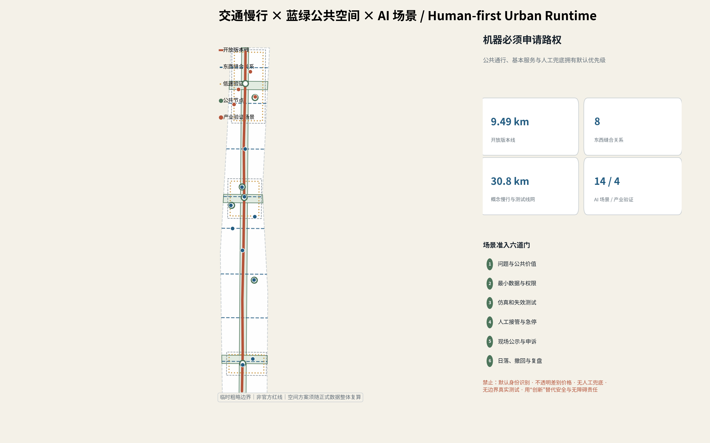
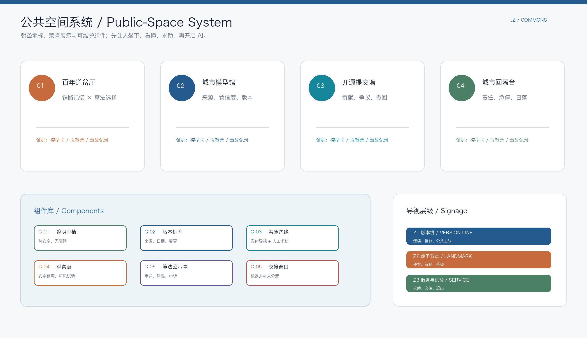
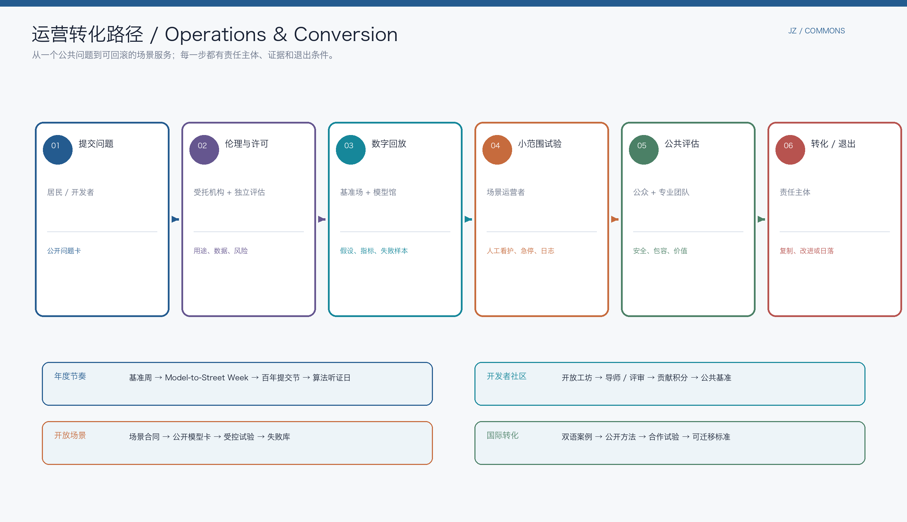
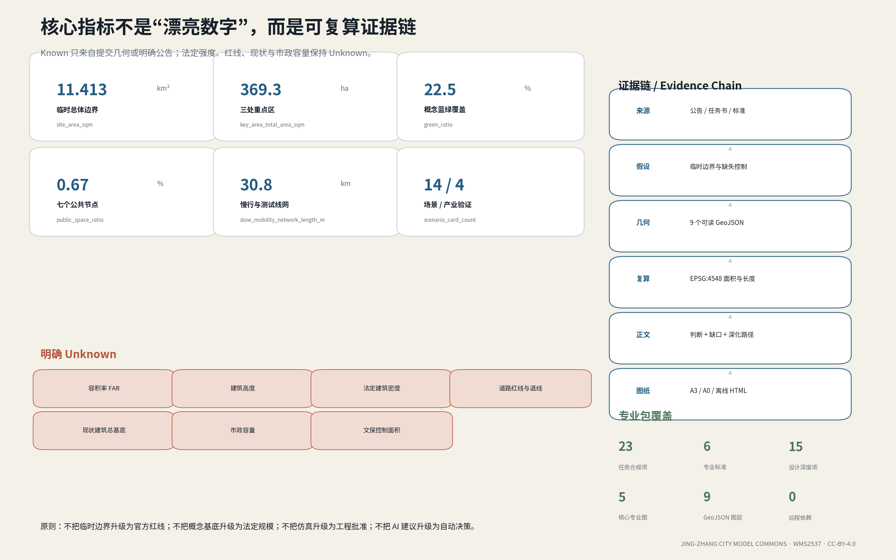

# Jing-Zhang City Model Commons

**Jing-Zhang City Model Commons**  
**From Centennial Railway to an Open Spatial Intelligence Benchmark Belt**

> A city should not only be seen; it should be understood, simulated, and jointly verified.

A century ago, the Jing-Zhang Railway wrote engineering knowledge into the landscape. Zhongguancun later turned knowledge into open collaboration and industrial innovation. For the AI era, this proposal makes a third infrastructure turn: it treats the city's spatial knowledge - roads, buildings, green space, public services, risks, rules, versions, and uncertainty - as a public, reproducible, and socially auditable **city-model commons**. AI is not reduced to cameras, screens, robots, or park slogans; it becomes a governed capability running through a **sensing - semantics - simulation - validation - operations - accountability** loop.

The proposal forms a **version line, Three Zones and Two Wings, four protocol layers, and seven nodes**. The Jing-Zhang Railway Heritage Park and its public spaces become an open version line; Zhongzhiyuan, the Beijing AI Origin Community, and Dazhongsi take responsibility for spatial-intelligence benchmarking, open co-creation, and everyday service. The Zhongguancun Technology Services Wing and Xiaoyue River Scenario Enablement Wing provide resources and real problems. Physical public space, an open semantic city model, simulation benchmarks, and controlled field trials form four protocol layers. Four landmark nodes and three service/test nodes make governance visible to ordinary people.

The proposal does not promise a fully automated city. It answers a more basic question: **How can people, models, robots, and professional teams safely share the same spatial facts in a future city?**

## Taskbook Positioning, Brand, and Overall Coordination Loop

The taskbook's required language is translated directly into spatial roles, public interfaces, and operating responsibilities rather than replaced with private concepts. [source:DATA-SRC-AGENT-TASKBOOK-20260518]

| Taskbook requirement | Jing-Zhang City Model Commons response | Locatable deliverable |
| --- | --- | --- |
| **Three positionings**: Centennial Jing-Zhang cultural belt; urban AI life-experience belt; AI-integrated innovation belt | A historical version line, everyday dual-channel services, and a model-to-street validation chain form one public loop | Overall diagram, cultural narrative, scenario cards, validation sites |
| **Five functions**: full-stack independent AI innovation; world-class AI ecosystem; AI-enabled scenario paradigm; intelligent active city; global AI-governance voice | Zhongzhiyuan handles benchmarks and safety; Origin Community handles open ecosystem; the Xiaoyue Wing and Dazhongsi handle daily scenarios; model cards, audits, and rollback produce governance outputs | [data:geometry/key_areas.geojson#KEY-001] [metric:scenario_card_count] [metric:industry_validation_scenario_count] |
| **Three Zones and Two Wings** | Three key areas are connected by the version line; the Zhongguancun wing supplies talent, standards, capital, and international services; the Xiaoyue wing supplies resident, ecological, care, and civic questions | [data:geometry/key_areas.geojson#KEY-001] [data:geometry/key_areas.geojson#KEY-002] [data:geometry/key_areas.geojson#KEY-003] |

The primary name is **Jing-Zhang City Model Commons**. The logo direction uses two railway traces and three reversible branch nodes: orange represents history and choice, cyan represents open submission, and green represents rollback and everyday fallback. Rail grey, model blue, rust red, vegetation green, and warm white form a minimal identity system. This is an original direction study; no third-party trademark, font, person, or image is used. Trademark, font, and legibility checks remain required before adoption. [assumption:A-BRAND-001]

## Design Basis and Source List

The proposal is based on the official qualification announcement, the cleared agent-facing taskbook, the repository site package, formal professional standards, and public international case studies. [source:DATA-SRC-OFFICIAL-ANNOUNCEMENT-20260509] [source:DATA-SRC-AGENT-TASKBOOK-20260518] [source:PLANNING-LIMITS] The evidence base covers three scales, Three Zones and Two Wings, six open-call agent tasks, scenario requirements, and operation requirements. Professional sources support public-space, urban-character, regulatory-boundary, and land-use terminology. [standard:PROJECT-OFFICIAL-ANNOUNCEMENT] [standard:PROJECT-AGENT-OPEN-CALL-TASKBOOK] [standard:MOHURD-URBAN-DESIGN-MEASURES] [standard:MOHURD-CONTROL-DETAILED-PLANNING] [standard:MNR-LAND-USE-CLASSIFICATION-GUIDE]

**Evidence is managed in three confidence tiers.** Tier 1 consists of the official announcement, rights-cleared taskbook, and formal standards; these define requirements, public facts, and professional methods. Tier 2 consists of the repository's explicitly marked provisional boundary; it supports generation, visualization, and self-check only. Tier 3 consists of missing official polygons, regulatory plans, road redlines, existing buildings, ownership, heritage, fire-safety, and municipal-capacity data; these remain gaps and are never guessed by AI. [source:DATA-SRC-PROVISIONAL-BOUNDARIES-20260605] [assumption:A-BOUNDARY-001] [assumption:A-CONTROLS-001]

The submission uses EPSG:4326 exchange GeoJSON and recalculates areas and lengths in EPSG:4548. The current provisional overall boundary recalculates to approximately **11.413 km²**, about 0.11% from the announced approximately 11.4 km². This agreement only shows that the provisional geometry is useful for concept work; it does not make it an official planning boundary or approved area. [data:geometry/site_boundary.geojson#SITE-001] [metric:site_area_sqm] [metric:site_area_deviation_ratio]

For the overall area and all areas outside the verified local official-source evidence unit, Floor Area Ratio, building height, statutory building coverage, road setbacks, existing building footprint, municipal capacity, and heritage-control area remain **unknown**. Dazhongsi HD00-1603-01/03A has bounded official control evidence, but it does not replace the provisional overall geometry or constitute approval of this proposal. Buildings, roads, land use, and phasing are reference proposals for professional elaboration, not approval, demolition, construction, engineering alignment, investment, or implementation commitments. [metric:floor_area_ratio] [metric:building_height_m] [metric:official_building_density] [metric:road_redline_setback_m] [metric:existing_building_footprint_sqm] [depth:existing_conditions_diagnosis] [depth:risk_missing_data]

### Haidian evidence baseline and regional interfaces: public fact → design response → verification gate

This section records traceable public signals without turning statistics into a future forecast. Regional collaboration is proposed as an interface, not a partnership, investment, mutual-recognition, or government-endorsement claim. The machine-readable register is `[data:visual/assets/site_evidence_baseline.json#OBS-BJ-POP-2024]`.

| Public signal (as of 2026-08-09) | Design response | Next evidence gate |
| --- | --- | --- |
| Beijing's 2024 resident population was approximately 21.832 million; the official release also supplies rail and regional-development context [source:DATA-SRC-BEIJING-2024-STATISTICS] | Do not assume population growth or future footfall; test service reliability and adaptive reuse by time, user, and person-hours | Obtain official station, walking, service-coverage, and time-of-day observations before sizing or phasing |
| Haidian's 2024 bulletin describes a knowledge- and service-intensive economy, with tertiary industry at 92.49% of regional GDP and a high-tech innovation base [source:DATA-SRC-HAIDIAN-2024-STATISTICS] | Make research → validation → public explanation → everyday adoption a spatial chain, not an AI-only district | Confirm institutions, building capacity, ownership, demand, and operating responsibility through official or commissioned surveys |
| Beijing's public ageing report supplies an ageing-society context [source:DATA-SRC-BEIJING-AGEING-2024] | Shade, seating, physical signs, human help, and accessible continuity come before optional AI; older adults, disabled users, carers, and people who decline data collection retain non-digital routes | Run a consented all-ages accessibility and heat-safety walk and publish breaks, help demand, and negative findings |
| The official public description presents the Jing-Zhang heritage park as an approximately 9 km urban-renewal and green-space system, including bridge-space and Line 13 context [source:DATA-SRC-JINGZHANG-PARK-20230630] | Treat the heritage green spine as an open version line with station–park–service handoffs; do not invent stations, redlines, or bridge engineering | Reconcile official station, road, heritage, ownership, fire, and emergency data before fixing a physical line |
| The current public Haidian work-report context places AI, data, safety, and the innovation belt in an ongoing district-development conversation [source:DATA-SRC-HAIDIAN-2026-WORK-REPORT] | Make the commons a translation layer for research, safe testing, public service, and accountability, without calling it an approved programme | Assign a confirmed owner, data permission, safety review, public-service baseline, and exit decision to each future pilot |

### Dazhongsi local official-source evidence: bounded guardrails, not a full-area redline

The Beijing public-resource transaction page and its official attachments add a traceable local official-source evidence unit inside the Dazhongsi key area: HD00-1603-01 and HD00-1603-03A total **39,522.111 m²**, with a planning-land survey report, multi-plan supply review, municipal/traffic plan, and water-impact review. [source:DATA-SRC-DAZHONGSI-TRANSACTION-20251231] [source:DATA-SRC-DAZHONGSI-SURVEY-20250806] [source:DATA-SRC-DAZHONGSI-SUPPLY-REVIEW-20251218] [source:DATA-SRC-DAZHONGSI-MUNICIPAL-TRAFFIC-2025] [source:DATA-SRC-DAZHONGSI-WATER-20250819] [data:visual/assets/site_evidence_baseline.json#OBS-DAZHONGSI-BLUE-JING-LIJIA-2025] [metric:dazhongsi_local_unit_area_sqm]

| Verified local fact | Use in this proposal | What it does not prove |
| --- | --- | --- |
| HD00-1603-01 control height **60 m**, FAR **2.45**, above-ground building scale 96,656.065 m², and minimum green ratio **25%** [metric:dazhongsi_local_b4_height_control_m] [metric:dazhongsi_local_b4_far_control] [metric:dazhongsi_local_b4_green_ratio_min] | Local massing/green guardrails for the Dazhongsi service corridor, station interface, and reversible renewal; prioritize open ground floors, accessibility, and maintainability | Not a FAR, height, or statutory green-ratio rule for the 72 ha key area or 11.4 km² overall design area |
| At least **30 m** building-control-line setback from North Third Ring Road [source:DATA-SRC-DAZHONGSI-SUPPLY-REVIEW-20251218] [metric:dazhongsi_north_third_ring_setback_m] | A local check for safety, shade, walking continuity, and station-to-public-space connections; not drawn as a new redline | Does not replace the overall road-redline, fire, access, or engineering dataset |
| Approximately **300 m** Dazhongsi station-integration context; local report includes a 3,190-person/hour peak model and approximately 0.14 ha bicycle parking [source:DATA-SRC-DAZHONGSI-MUNICIPAL-TRAFFIC-2025] [metric:dazhongsi_station_integration_radius_m] | Limit the first Runtime Market proof to station–service-corridor–public-space accessibility, human help, and operating-cost tests | Not a whole-belt demand baseline, approved parking supply, or certified engineering capacity |
| 2027 planning year and maximum combined runoff coefficient **0.34**, with rainwater/sewage destinations specified [source:DATA-SRC-DAZHONGSI-WATER-20250819] [metric:dazhongsi_runoff_coefficient_max] | Make water-sensitive retrofit, maintenance responsibility, and extreme-weather rollback part of the local pilot gate and cost record | Not a whole-belt water model or sponge-city approval |

The survey report contains point coordinates, but its visible text does not provide complete GIS CRS, axis-order, and unit metadata. This package therefore **does not write those local coordinates into GeoJSON or replace the provisional KEY-003 polygon**. Confirm the surveying authority's CRS and permission first, then reconstruct and field-check the boundary. [assumption:A-BOUNDARY-001] [assumption:A-CONTROLS-001] [depth:existing_conditions_diagnosis]

**Five regional interfaces.** The proposal uses a problem–capability–credential exchange rather than a list of institutions. Each direction requires separate consent, uses de-identified or public material, and records rights/IP, safety responsibility, maintenance ownership, refusal, withdrawal, and non-recognition paths in the interface contract. [source:DATA-SRC-HAIDIAN-15FYP-20251208] [assumption:A-REGIONAL-SYNERGY-001] [data:visual/assets/site_evidence_baseline.json#REG-NORTH-LATITUDE]

| Directional counterpart | Jing-Zhang input | Minimum exchange output | Intake and exit gate |
| --- | --- | --- | --- |
| Beiwèi Community / AI Origin Community | Resident questions, accessibility gaps, non-digital service experience | De-identified problem card, human-service gap, close reason | Community consent, rights/privacy review, named safety/operating owner, maintenance-record owner, and withdrawal path; participation does not authorize deployment |
| Future Science City | Edge models, embodied devices, engineering-validation questions | Model card, device passport, failure list, re-test condition | Voluntary test participation; test owner, IP, safety scope, maintenance/recall owner, and withdrawal/re-test path are explicit; results are not automatically recognized |
| Huairou Science City | Measurement, calibration, and research-method questions | Calibration note, uncertainty statement, independent-review question | Consent/permission, professional safety responsibility, rights/IP, maintenance handoff, and withdrawal path are confirmed; no assumed facility or data access |
| Beijing E-Town | Engineering, manufacturing, supply-chain, and maintenance questions | Interoperability evidence, maintenance requirement, stop/recall condition | Voluntary participation, product-safety/consumer-rights review, maintenance/recall owner, and withdrawal path; no procurement claim |
| Beijing-Tianjin-Hebei | Cross-city common problems and portable rules | Location-agnostic schema, negative result, version difference, maintenance handoff | Local consent and legal, safety, operating, rights/IP, maintenance-handoff, and withdrawal/no-recognition review in each jurisdiction; no copying of coordinates, personal data, or approval conclusions |

The value of this regional loop is lower duplication and translation cost, not the number of signed partners. Without an operating baseline, no collaboration-performance value is filled in. [metric:regional_interface_count]

## Three-Level Scope Framework

The three scales should not be flattened into one plan with one level of precision. The approximately **43.61 km² Coordinated Research Area** asks how Haidian's universities, research, capital, scenarios, public services, and international networks form a spatial-intelligence ecosystem. The approximately **11.41 km² Overall Design Area** asks how public space, land use, walking and cycling, climate resilience, renewal, and new infrastructure become continuous. The three key areas, approximately **369.3 ha** in provisional geometry, support actionable spatial prototypes, user interfaces, operating responsibility, and test boundaries. [data:geometry/constraints.geojson#RESEARCH-001] [data:geometry/key_areas.geojson#KEY-001] [data:geometry/key_areas.geojson#KEY-002] [data:geometry/key_areas.geojson#KEY-003] [metric:coordinated_research_area_sqm] [metric:key_area_total_area_sqm]

**One open version line.** The value of the Jing-Zhang Railway is not a nostalgic backdrop but an engineering ethic that can be calibrated, checked, and carried across generations. Version markers, source notes, model observations, accessible services, and rollback interfaces follow the heritage and climate green spine so every experiment records why it changed, who approved it, whom it affects, and how it can be withdrawn.

**Three Zones.** The northern Zhongzhiyuan is a spatial-intelligence benchmark campus that turns algorithms, embodied intelligence, simulation, and urban-operation problems into reproducible benchmarks. The central Beijing AI Origin Community is the city-model commons core, putting universities, developers, residents, and city professionals around one public model interface. The southern Dazhongsi is an urban runtime market, testing whether AI improves ordinary commerce, commuting, community service, and culture.

**Two Wings.** The Zhongguancun Technology Services Wing provides IP, capital, standards, legal support, talent, and internationalization services. The Xiaoyue River Scenario Enablement Wing provides living, ecological, sports, care, and civic-governance questions. They are not closed parks; they are input channels that continuously submit problems, data permissions, test needs, and evaluation results to the version line.

**Four protocol layers.** The physical layer protects human space and non-AI fallback. The semantic layer structures objects, relationships, rules, and confidence. The simulation layer reproduces and stress-tests scenarios digitally first. The field layer permits only scenarios that pass governance gates and stay within a limited area. Versions, evidence, and responsibility connect the layers instead of one super-platform owning the whole system. [metric:spatial_model_protocol_layer_count] [depth:three_level_scope_framework]

## Coordinated Research Area: Industry and Future City Research

### 1. Industry judgment: spatial intelligence needs a public model-to-street validation chain

One bottleneck in today's AI industry is the missing middle layer between digital models and complex real space. A two-dimensional classifier can say "this is a refrigerator"; urban operation also needs to know where it is, what it touches, whether it is passable, which rules apply, and how risk could be simulated. The Jing-Zhang belt can connect Haidian's models, robots, software, urban governance, and universities into one chain: **open spatial data - semantic annotation - simulation benchmark - safety evaluation - controlled deployment - operational feedback - standards output**.

This shifts the industry question from "how many AI companies are attracted?" to three verifiable outcomes: whether spatial semantics and benchmarks are reusable across models, devices, and years; whether companies can prove safety, accessibility, and public value in a real district at reasonable cost; and whether failed trials become public knowledge rather than being removed from promotional systems. Zhongzhiyuan handles hard validation, Origin Community handles open collaboration, Dazhongsi tests everyday value, and the two wings supply resources and problems. [source:DATA-SRC-AGENT-TASKBOOK-20260518] [depth:overall_spatial_structure]

### 2. Seven global cases: translate mechanisms, do not copy the packaging

| Case | Transferable mechanism | Jing-Zhang translation | Explicitly not copied |
| --- | --- | --- | --- |
| Singapore Punggol Digital District | Open digital platform, APIs, digital-twin pre-validation, research-industry proximity | Tiered open city model and a simulate-first, street-later test chain [source:CASE-PUNGGOL] | No single-vendor lock-in or all-area identity convenience |
| Seoul S-Map Open Lab | 3D city data, open lab, wind simulation, research feedback | Turn the city model from a display asset into reproducible experimental infrastructure [source:CASE-SEOUL-SMAP] | A 3D model is not treated as the complete truth |
| Helsinki Kalasatama | Small agile pilots, resident co-creation, quality-of-life outcomes | Prove public value through a community model clinic and short cycles [source:CASE-KALASATAMA] | Residents are not passive sensors or test subjects |
| Toyota Woven City | Bounded real-world test, inventor-user co-validation | Physical separation, emergency stop, observation walk, and responsibility register at Zhongzhiyuan [source:CASE-WOVEN-CITY] | The belt is not closed as a corporate campus |
| London SHIFT | Real-area testing, cross-institutional collaboration, inclusive innovation | Scenario admission committee and public performance evaluation [source:CASE-SHIFT-LONDON] | Innovation does not bypass safety or accessibility duties |
| Barcelona 22@ | Industry, housing, public space, and heritage renewal in parallel | Embed AI functions in mixed districts rather than a pure office island [source:CASE-BARCELONA-22AT] | No evidence-free demolition in the name of innovation |
| Toronto Quayside | Digital-governance controversy, independent review, public-interest debate | Minimum collection, exit, public audit, and sunset clauses in spatial design [source:CASE-QUAYSIDE] | Efficiency cannot replace democratic authorization and accountability |

### AI innovation ecosystem and industry-space mapping

The seven cases provide mechanism references only; they are not company, investment, or policy commitments. The translated ecosystem connects eight taskbook mechanisms - land, space, industry, finance, talent, compute, data, and scenarios - to one public, tiered, and withdrawable spatial-semantic commons. Each mechanism has a spatial carrier and an auditable output. [source:DATA-SRC-AGENT-TASKBOOK-20260518] [metric:ecosystem_case_count]

| Mechanism | Spatial carrier | Public output | Commitment not made |
| --- | --- | --- | --- |
| Land / space | Three levels, version line, and key-area nodes | Concept interfaces, portable components, spatial-needs list | No land approval, redline, or ownership conclusion |
| Industry / finance | Zhongzhiyuan validation chain and Zhongguancun wing | Test contracts, methods, risks, and exit conditions | No invented company list, investment amount, or fiscal arrangement |
| Talent / compute | Origin Community, open workshops, benchmark vault | Contribution records, model cards, public benchmarks | No opaque talent selection |
| Data / scenarios | Xiaoyue wing and Dazhongsi runtime market | Tiered data catalogue, failure library, scenario evaluation | No internal data or personal privacy in the public layer |

### 3. Future urban form: protocol matters more than shape

AI-native does not mean more screens or strange curved buildings. The proposal defines five operational rules: **open interfaces rather than closed systems; reversible insertions rather than one-off megastructures; visible model confidence rather than performed omniscience; dual-channel public service rather than a forced AI gate; rollback after failure rather than sunk technical cost.** Spatially this means a continuous green spine, open ground floors, shared workshops, observation walks, low-speed test loops, and small replaceable elements. Institutionally it means model cards, version records, algorithm notices, human takeover, appeal, and exit.

`geometry/land_use.geojson` divides the same provisional boundary into fifteen conceptual parcels in EPSG:4548, forming a south daily-service, central open-learning, and north research-validation gradient. This is a functional relationship and professional-deepening interface, not a regulatory-plan amendment. [data:geometry/land_use.geojson#LU-001] [data:geometry/land_use.geojson#LU-008] [data:geometry/land_use.geojson#LU-014] [metric:land_use_gap_area_sqm] [metric:land_use_overlap_area_sqm] [depth:land_use_layout]

## Overall Design Area: Urban Renewal and Regulatory-Plan-Level Urban Design

The overall structure is a **version line, three segments, eight stitches, four protocols, and seven nodes**. The version line is approximately **9.49 km**; the three segments serve daily service, open co-creation, and research validation. The eight east-west stitches express restored walking connections without presuming a bridge, tunnel, road redline, or construction form. Four protocols connect spatial design and digital governance; seven nodes make abstract rules usable in public space. [data:geometry/roads.geojson#ROAD-001] [metric:open_version_line_length_m] [metric:east_west_stitch_count]

### Land use and function

The Overall Design Area is organized into three horizontal roles and five longitudinal bands. The central narrow band is a composite spine of park, heritage narrative, public model interface, and climate infrastructure rather than an ordinary technology landscape axis. The west prioritizes everyday city life, housing, education, and culture; the east receives research, enterprise services, community services, and commerce. The south centers Dazhongsi daily AI services and culture; the middle centers Origin Community education, open workshops, and shared services; the north centers Zhongzhiyuan research and validation. [data:geometry/land_use.geojson#LU-003] [data:geometry/land_use.geojson#LU-007] [data:geometry/land_use.geojson#LU-013]

### Buildings and renewal

The building layer provides twelve carrier prototypes only: spatial-intelligence benchmark vault, embodied-validation workshop, model-to-street accelerator, edge-compute operations station, city-model museum, open workshop, community model clinic, public developer lounge, Centennial Switch Hall, everyday intelligent-service arcade, accessible co-pilot station, and merchant waste-reduction co-creation station. [data:geometry/buildings.geojson#BLD-001] [data:geometry/buildings.geojson#BLD-005] [data:geometry/buildings.geojson#BLD-009]

These footprints are reproducible but cannot infer storeys, total floor area, statutory coverage, or demolition. Formal renewal uses a **retain, repair, add, demolish** evidence gate: retain valuable and adaptable buildings first; repair with open ground floors, accessibility, shade, raised floors, and courtyard stitching; add detachable modules only where a verified function gap exists; discuss demolition only when ownership, structure, heritage, fire safety, and regulatory-plan evidence is complete. [metric:building_footprint_area_sqm] [metric:proposed_building_coverage_ratio] [assumption:A-EXISTING-001] [depth:retain_renovate_demolish]

### Regulatory-plan and urban-character boundary

The proposal provides functional layout, spatial relationships, interface types, walking continuity, and carrier prototypes without inventing formal intensity. Height, FAR, coverage, and setbacks remain unknown. When official material arrives, nodes can shrink, move, merge, or be removed without discarding the overall protocol. Urban character uses rail grey, rust red, model blue, vegetation green, and warm white. Model blue is reserved for information and state; the belt is not turned into a cyberpunk display street. [metric:floor_area_ratio] [metric:building_height_m] [depth:development_intensity_controls] [depth:height_massing_character]

## Detailed Design of Key Areas

### Zhongzhiyuan: spatial-intelligence benchmark campus / Model-to-Street Benchmark Campus

Zhongzhiyuan is the northern core for full-stack independent innovation and demonstrable safety. Its spatial sequence is **benchmark vault - validation workshop - low-speed loop - public observation walk - rollback desk**. The vault stores public 3D scenes, semantic tasks, and evaluation protocols; the workshop supports robot, edge-model, and sensor interoperability; the low-speed loop fixes speed, time, test subject, and physical boundaries; the observation walk lets people see trials without being automatically enrolled; the rollback desk shows test state, responsible party, human emergency stop, and incidents. [data:geometry/key_areas.geojson#KEY-001] [data:geometry/buildings.geojson#BLD-002] [data:geometry/roads.geojson#ROAD-TEST-01] [data:geometry/public_space.geojson#PS-004]

The objective is not a one-off grand campus but a repeatable **model-to-street** process: digital replay - safety gate - small controlled trial - difference analysis - benchmark update - decision to expand. Failures enter the public version record. Embodied robots do not receive default right-of-way over pedestrians; every test retains a human marshal, physical emergency stop, and non-wireless fallback. [assumption:A-SCENARIO-001]

### Beijing AI Origin Community: city-model commons core / Open City Model Commons

Origin Community is the most important public interface. It forms a network of **city-model museum - open-submission wall - community model clinic - developer lounge - open ground floor**. The museum lets people compare source, time, confidence, and alternatives rather than only viewing a polished 3D model. The submission wall records every human or agent contribution, review, rejection, correction, and withdrawal. The model clinic translates why an algorithm made a decision into questions residents can understand and collects real counterexamples. [data:geometry/key_areas.geojson#KEY-002] [data:geometry/buildings.geojson#BLD-005] [data:geometry/public_space.geojson#PS-002] [data:geometry/public_space.geojson#PS-003]

Daytime use serves universities, researchers, and start-ups; evenings serve residents, students, and communities; weekends host open annotation, model check-ups, accessibility walks, and planning simulations. Spatial models are tiered as public, controlled, and sensitive. People can use the public layer without being tracked. Any dataset created from resident feedback must display purpose, retention, and exit route. [assumption:A-SEMANTIC-TWIN-001] [assumption:A-PRIVACY-001]

### Dazhongsi: urban runtime market / Urban Runtime Market

Dazhongsi tests whether AI creates tangible value in ordinary commerce, commuting, culture, and community service. Its sequence is **Centennial Switch Hall - everyday intelligent-service arcade - accessible service station - waste-reduction co-creation station - night slow interface**. The Switch Hall connects railway engineering history and algorithmic choice through the idea of a branch. The arcade aggregates cross-shop queues, stock, waste reduction, and event information. The accessible station combines physical wayfinding, human service, and opt-in AI co-piloting. The waste station helps merchants share anonymized supply, demand, and food-waste data. [data:geometry/key_areas.geojson#KEY-003] [data:geometry/buildings.geojson#BLD-009] [data:geometry/public_space.geojson#PS-001]

The first local proof uses the official-source evidence unit HD00-1603-01/03A: 60 m, FAR 2.45, a 25% minimum green ratio, and a 30 m North Third Ring setback are guardrails for this unit only; the approximately 300 m Dazhongsi station-integration context and 0.34 runoff coefficient become accessibility, stormwater-maintenance, and operating-cost gates. They do not cover the provisional 72 ha Dazhongsi key area or change the sequence “reuse first, validate, then expand.” [source:DATA-SRC-DAZHONGSI-SUPPLY-REVIEW-20251218] [source:DATA-SRC-DAZHONGSI-MUNICIPAL-TRAFFIC-2025] [source:DATA-SRC-DAZHONGSI-WATER-20250819] [metric:dazhongsi_local_b4_height_control_m] [metric:dazhongsi_local_b4_far_control] [metric:dazhongsi_local_b4_green_ratio_min] [metric:dazhongsi_north_third_ring_setback_m] [metric:dazhongsi_station_integration_radius_m] [metric:dazhongsi_runoff_coefficient_max]

This area forbids opaque differential pricing, facial recognition as a default public-service gate, and replacing merchant or user appeal with an algorithm. Night activity relies on lighting, visible staff, continuous seating, and clear evacuation routes rather than "smart monitoring" alone. The three key areas are detailed through explicit roles, interfaces, users, operations, and governance boundaries; exact building lines still require official base maps and professional survey. [depth:three_key_area_detailed_design]

## AI Innovation Ecosystem, Personas, and AI+ Scenarios

### Seven core user personas

| Persona | Key goal | Common failure | Commons response |
| --- | --- | --- | --- |
| Spatial-AI researcher / developer | Real, diverse, reproducible scenes and evaluation | Beautiful data with inconsistent semantics; irreproducible experiments | Open benchmarks, versioned scenes, error samples, model cards |
| Founder / small company | Prove safety and public value at low cost | Success only in a closed demo; no path into a real district | Model-to-street process, shared test facilities, scenario contracts |
| Student / young talent | Learning, internship, social life, and low-threshold public space | AI park serves firms but not everyday growth | Open workshop, developer lounge, learning and mentor matching |
| Resident / family / merchant | Commuting, care, consumption, leisure, and stable business | Passive collection, opaque rules, no human fallback | Model clinic, algorithm notice, human window, exit right |
| Older or disabled user | Continuous accessibility, clear information, trusted help | Digitization adds more gates and operating burden | Co-pilot station, physical wayfinding, human service, issue reporting |
| Front-line city operator | Maintenance, emergency response, complaint, permissions, responsibility | Fragmented platforms; unexplained model advice | Shared object semantics, event log, human takeover, rollback |
| Visitor / global participant | Understand Jing-Zhang culture, experience open innovation, contribute questions | Exhibition-only participation | Multilingual guide, open submission, annual benchmark, public review |

Personas test space and service; they are not used for opaque population modelling. [metric:persona_count]

### Fourteen AI scenario cards

| ID | Scenario and main space | Direct user value | Minimum data and model | Human / exit / risk boundary |
| --- | --- | --- | --- | --- |
| SC-01 | Railway-memory multimodal guide; version line and Centennial Switch Hall | Understand Jing-Zhang history through location, time, and object evidence | Opt-in scan/location; public archive and local multimodal retrieval | No continuous tracking; contested history receives human curatorial review |
| SC-02 | All-age accessible co-pilot; whole belt and accessible stations | Slope, surface, seating, lift, and human-help information | Opt-in use; obstacles, facility state, anonymous feedback | Physical wayfinding, phone, and human service remain |
| SC-03 | Heat-safe route agent; green spine and east-west stitches | Choose shade, water, and rest during heat waves | Temperature, radiation, shade, facility state | No identity; official alerts govern extreme weather |
| SC-04 | Coordinated safe school route; education communities | Find conflicts and improve space rather than monitor children | Junction conditions, anonymous flows, parent reports | No default face or long-term child trace; school retains human responsibility |
| SC-05 | Community health-service navigation; Origin Community | Match public-health, booking, accessibility, and care resources | Opt-in need; service catalogue only | No diagnosis or doctor replacement; sensitive data stays out of public model |
| SC-06 | Public-rule and service explainer; algorithm notice kiosk | Translate planning rules, scenario rules, and appeal paths | Public rules, workflow, versioned knowledge base | Not legal advice; complex questions go to human window |
| SC-07 | Urban learning and mentor matching; open workshop | Connect classes, events, projects, and mentors | Opt-in profile, public events, skill tags | No hidden profile deciding access; users can view/delete data |
| SC-08 | Public-space booking and co-governance; museum surroundings | Coordinate events, noise, facilities, and neighbour feedback transparently | Public slots, capacity, anonymous views | Community rules first; human mediator handles conflict |
| SC-09 | Commercial waste reduction and queue routing; Dazhongsi | Reduce waste, waiting, and merchant operating cost | Aggregate stock, flow, queue, waste | No individual differential pricing; merchant and customer can exit |
| SC-10 | Emergency evacuation digital rehearsal; whole belt | Compare people flow, accessibility, and rescue options before incidents | City model, capacity assumptions, drill data | Simulation does not replace fire approval; assumptions and error range published |
| SC-11* | Embodied-intelligence last-500-metre validation; Zhongzhiyuan | Validate low-speed delivery, inspection, and assisted mobility | Robot state, environmental obstacles, event log | Physical separation, speed cap, human marshal, stop, public incident record |
| SC-12* | Open spatial-intelligence benchmark; Zhongzhiyuan | Compare localization, semantic understanding, navigation, and planning | Public/synthetic scenes, label confidence, common evaluation protocol | Prevent leaderboard-only optimization; hidden tests and external audit |
| SC-13* | Edge-model and sensor interoperability sandbox; Zhongzhiyuan | Lower integration cost across devices, models, and city systems | Standard interfaces, simulated data, minimum real data | Network isolation, tiered permissions, supply-chain and failure drills |
| SC-14* | Low-carbon building operations validation; northern carrier prototypes | Evaluate comfort, energy, and maintenance together | Environment and equipment data, no identity | Human override, comfort floor, fail-safe, rebound assessment |

`*` denotes an industry testing and validation scenario. Scenario points are located in machine layers, but their positions, areas, and operating conditions are conceptual recommendations. [data:geometry/public_space.geojson#SCN-01] [data:geometry/public_space.geojson#SCN-11] [data:geometry/public_space.geojson#SCN-14] [metric:scenario_card_count] [metric:industry_validation_scenario_count]

### Scenario - space - operation mapping

Scenario cards enter design discussion only after specifying who acts in which space, with what data, under whose responsibility, and when the system stops. The complete machine copy is `visual/assets/scenario_space_operation_matrix.json`; the table below is the same-source review summary. [assumption:A-SCENARIO-001]

| Scenario group | Spatial interface | Operating responsibility | Output / exit condition |
| --- | --- | --- | --- |
| SC-01 railway guide, SC-06 rule explainer | Version line, Centennial Switch Hall, algorithm notice kiosks | Human curator and public-service window | Source cards and human review; disputes go to people; no continuous tracking |
| SC-02 accessible co-pilot, SC-03 heat-safe route | Green spine, east-west stitches, accessible co-pilot stations | Public-space operator | Accessibility and heat-risk reports; physical wayfinding always works |
| SC-04 school route, SC-05 health navigation | Education community, Origin Community service arcade | School / service institution human lead | Anonymous issue list; no child trace; no diagnosis |
| SC-07 learning match, SC-08 public-space co-governance | Open workshop, model-museum surroundings | Community operator and coordinator | Course / booking / conflict record; users can view, delete, and exit |
| SC-09 waste reduction, SC-10 evacuation rehearsal | Dazhongsi service arcade and runtime market | Merchant alliance / fire and professional team | Aggregate performance and simulation assumptions; no approval replacement or differential pricing |
| SC-11 embodied validation, SC-12 open benchmark | Zhongzhiyuan low-speed loop and validation workshop | Scenario operator plus independent evaluator | Safety gate, incident log, benchmark version; speed cap, stop, sunset |
| SC-13 interoperability, SC-14 low-carbon operations | Benchmark vault and carrier prototypes | Device / building operations team | Interface, comfort, and maintenance reports; human fallback on network failure |

The mapping also defines privacy and human-review boundaries. The public layer keeps only anonymous or actively submitted data needed for the task. High-impact recommendations must be explainable, appealable, and human-controllable. Scenarios that fail safety, permission, inclusion, or operations gates stay in digital replay only.

### From scenarios to an industry ecosystem

Each scenario produces a city-algorithm model card: problem, user, spatial extent, training/runtime data, confidence, known failures, human owner, non-AI path, appeal, incident, sunset date, and expansion conditions. Companies receive a trusted route into a real scenario rather than unrestricted city data; the city receives replaceable, comparable, withdrawable services rather than black boxes. The annual Jing-Zhang Spatial Intelligence Open Benchmark publishes strong results as well as failure modes and unresolved questions. [assumption:A-SCENARIO-001] [depth:risk_missing_data]

### First Proof Package, Use Envelopes, and 2035 Success Conditions

The proposal does not launch all fourteen scenario cards at once. It first uses two minimum viable proof paths—one public and one industry path—to demonstrate public and innovation value. Both are conceptual recommendations, not approved projects.

| First proof path | Users / space | Minimum operating chain | First evidence and exit condition |
| --- | --- | --- | --- |
| A Public Pilot: Version Line All-Ages Co-Pilot | Older adults, disabled users, child caregivers, and commuters; railway-heritage park—green spine—Dazhongsi service nodes | Physical map, seat, shade, and human help → user-initiated AI route suggestion → public-space operator review → heat-safety and accessibility follow-up | Report accessibility breaks, heat risk, help response, and non-AI use; stop on continuous tracking, default face capture, no human channel, or unexplained advice |
| B Industry Pilot: Zhongzhiyuan Last-500-Metre Validation | Robotics / edge-model teams, observing public, and independent evaluators; low-speed loop—validation workshop—observation walk | Digital replay → safety / permission gate → speed-capped field test → incident / discrepancy report → expansion decision | Pass reproducibility, human takeover, emergency stop, incident, and sunset drills; any critical failure returns to simulation |

#### Operating and economic loop

| Layer | Candidate cost bearer (not a commitment) | Use return | Expansion gate |
| --- | --- | --- | --- |
| Public base | Urban renewal, park operations, and public-service packages | Continuous accessibility, heat safety, dwell time, and public understanding | Low-cost components remain maintainable; non-AI path works |
| Shared validation facility | Universities, companies, and research platforms share use or pay by scenario; public-interest scenarios may be waived | Lower real-world validation cost, reusable benchmarks, and safety evidence | Independent evaluation, named responsibility, operations and exit budget |
| Everyday runtime market | Merchants / service operators participate against actual use return; no single-vendor lock-in | Less waiting and waste, better access and night service | Merchants and users can exit; no differential pricing |
| Governance and evaluation | Maintenance, audit, and exit costs are itemized in each project package | Lower long-term lock-in and failure externality | Model card, version, appeal, incident, and sunset records complete |

#### Population use envelopes

Total population is not a growth assumption. Validate first by time and user envelope: weekday commute / school peaks, weekday research / care / visitor daytime, resident / commerce evenings, and family / event weekends. The first phase records person-hours, service requests, accessibility breaks, human-fallback use, and trial count—not invented long-range footfall.

#### 2035 pass conditions (design targets, not government commitments)

- **Public.** Every high-impact AI scenario has a readable model card, human channel, appeal, emergency stop, and exit.
- **Innovation.** At least two reproducible “model-to-street” benchmark chains remain available; failures are as searchable as successes.
- **Economics.** Every expansion publishes construction cost, annual operations, exit cost, cost per validation, and actual use.
- **Space.** Reuse existing parks, ground floors, under-bridge space, and adaptable buildings first; public space remains safe when AI fails.

## Land Use, Building Scale, and Retain-Renovate-Demolish Strategy

The land-use proposal completely partitions the provisional overall boundary into fifteen conceptual parcels using residential, community service, research, education, culture, commerce, park, and plaza codes. These codes make the proposal machine-readable and support functional discussion only. [standard:MNR-LAND-USE-CLASSIFICATION-GUIDE] [data:geometry/land_use.geojson#LU-001] [metric:land_use_feature_count] [metric:land_use_partition_area_sqm]

**Land use is not a stack of AI-only districts.** South-side commerce and culture remain everyday city life; the middle mixes education, community, and research; the north strengthens research validation while retaining the public green spine and service connections. The commons is a cross-use public protocol: it can appear in park information signs, open ground floors, public workshops, test courtyards, and city-maintenance stations without replacing ordinary urban functions with AI land.

The building layer reports only approximately **3.25 ha** of conceptual footprint for twelve carrier prototypes, about 0.284% of the provisional overall boundary. This is not statutory building coverage and does not represent total floor area. [data:geometry/buildings.geojson#BLD-001] [metric:building_footprint_area_sqm] [metric:proposed_building_coverage_ratio]

### Conceptual program mix and talent/output indicators

The table below aggregates `land_use.geojson` by functional band in EPSG:4548 as a **conceptual program mix**. It compares spatial roles; it is not a statutory land-use ratio, development intensity, or approval conclusion. Together with seven cases, seven personas, fourteen scenario cards, and four industry validation sites, it forms a reviewable innovation and talent/output frame. [metric:conceptual_program_mix_area_sqm] [metric:program_mix_dazhongsi_ratio] [metric:program_mix_life_ratio] [metric:program_mix_origin_ratio] [metric:program_mix_education_ratio] [metric:program_mix_benchmark_ratio]

| Functional band | Share of provisional overall boundary | Design intent | Follow-up evidence |
| --- | ---: | --- | --- |
| Dazhongsi open market and public service | 20.97% | Everyday consumption, culture, accessibility, and waste reduction | Existing commerce, flows, fire safety, and ownership |
| Living community and climate adaptation | 22.65% | Housing, shade, heat safety, and public service | Existing population, green space, and service radius |
| AI Origin learning and open collaboration | 25.66% | Education, community model clinic, and open workshop | University/community agreements and operating capacity |
| Education community and city services | 12.48% | Learning, care, public explanation, and service | School, public-service, and accessibility inventory |
| Zhongzhiyuan research validation and translation | 18.24% | Benchmark, interoperability, controlled testing, and translation | Existing buildings, laboratory safety, and equipment interfaces |

These shares answer whether spatial relationships are legible, not how much may be built. FAR, building height, existing footprint, parking supply, transit-station interface, municipal capacity, and heritage controls stay unknown and must be recalculated together when formal material arrives.

Retain-renovate-demolish decisions use five evidence tests: cultural and social value; existing structure and safety; functional fit and reversibility; carbon and resource cost; ownership and implementation impact. No single model score triggers demolition. The priority is open ground floors, accessibility, shade, shared courtyards, and detachable modules; building-by-building conclusions require survey and public procedure. [assumption:A-EXISTING-001] [depth:retain_renovate_demolish]

## Transport, Rail, Municipal Infrastructure, and Public Services

The transport rule is **people have default right-of-way; machines must request right-of-way**. The approximately **30.8 km** conceptual network includes the open version line, eight east-west stitches, and three low-speed validation loops. The version line serves walking, cycling, heritage interpretation, heat safety, and accessibility. The stitches express improved cross-connections without presuming a bridge, tunnel, road redline, or construction form. The validation loops define speed, geofencing, time, and human supervision. [data:geometry/roads.geojson#ROAD-001] [data:geometry/roads.geojson#ROAD-STITCH-01] [data:geometry/roads.geojson#ROAD-TEST-01] [metric:slow_mobility_network_length_m] [depth:traffic_rail_slow_parking]

Static transport is not based on the idea that autonomous driving will eliminate parking. Formal work must use official transit-station data, walking access, loading, accessible parking, shared mobility, and fire-safety needs for zone management. Low-speed robots use separate waiting and handover areas; they may not occupy ordinary pedestrian space in blind spots, crowded periods, or without human takeover.

New infrastructure follows **few poles, many uses, maintainable, replaceable**. Environmental sensing, wayfinding, edge compute, charging, network, and maintenance interfaces are integrated at nodes with named owners. Sensitive data stays out of the public layer. When network or model service fails, basic lighting, wayfinding, movement, and help remain available. Formal power, network, drainage, fire, and waste capacities are unknown; no engineering-feasibility conclusion is made. [metric:municipal_capacity_index] [assumption:A-CONTROLS-001] [depth:municipal_new_infrastructure]

**Transit-station and static-transport interface.** The concept does not invent station coordinates or traffic data. The professional team must use an official rail/station list to check each station's walking radius, accessibility continuity, transfer conflict, loading window, fire route, shared mobility, and accessible parking. Parking is managed through zones, shared supply, short stay, loading, emergency, and exit rules rather than assumed away by autonomous driving. Formal parking supply and its station relationship remain unknown. [metric:rail_station_integration_index] [metric:parking_supply_sqm] [depth:traffic_rail_slow_parking]

**Municipal interface checklist.** Every public node reserves responsibility cards for lighting, drainage, waste, network, edge compute, charging, and human help. The card comes before equipment procurement; in a network, power, or model failure, physical wayfinding, basic lighting, and human help remain. Capacity, utilities, loads, and fire conditions are not reliable enough to read diagram points as engineering layouts. [metric:municipal_capacity_index] [depth:municipal_new_infrastructure]

Public service uses a **dual channel**: an embodied map beside AI navigation, a human window beside a chatbot, telephone or on-site access beside digital booking, and a responsible person beside every automated recommendation. The city model can surface accessibility breaks, heat risk, and service gaps; it must not treat people or problems absent from the model as absent from the city.

## Blue-Green Network, Public Space, and Urban Character

The green system combines a continuous Centennial Jing-Zhang climate-heritage spine and three east-west cooling fingers. The design layer recalculates approximately **22.5%** of the provisional overall boundary as green space; this is a conceptual layer result, not a statutory green ratio. [data:geometry/green_space.geojson#GREEN-001] [metric:green_space_area_sqm] [metric:green_ratio] [depth:blue_green_public_space]

The spine carries railway memory, walking and cycling, shade, stormwater, biodiversity, heat safety, and public model observation. Digital facilities follow **sit first, shade first, understand first, interact later**: seating, water, toilets, accessibility, and safe lighting precede interactive screens. Environmental AI collects only the temperature, humidity, radiation, soil, and anonymous-flow data needed for a task; it does not default to identity collection. [assumption:A-PRIVACY-001]

Seven public nodes occupy approximately **0.67%** of the overall boundary conceptually. Their value is not area but public intelligibility and visible institutions. [metric:public_space_area_sqm] [metric:public_space_ratio]

1. **Centennial Switch Hall**: a railway switch expresses engineering choice and connects Jing-Zhang history to algorithmic decisions without a giant tech gate.
2. **City-Model Museum**: shows model, source, date, confidence, and missing data together; a render is not treated as fact.
3. **Open-Submission Wall**: records contribution, dispute, rejection, correction, withdrawal, and failure as a public version history.
4. **City Rollback Desk**: shows test state, responsible party, human stop, incident, appeal, and sunset date.
5. **Accessible Co-Pilot Station**: physical wayfinding, rest, and human help come first; AI is opt-in.
6. **Algorithm Notice Kiosk**: places data purpose, model limits, and appeal routes where service happens.
7. **Agent Test Garden**: a physically separated, low-speed test space with observation walk; the whole district is not a laboratory.

The brand symbol is a railway trace through an open grid that branches into three actions - branch, submit, rollback - at the key areas. The Chinese primary name is **Jing-Zhang City Model Commons**. Character is built from reversible structures, clear materials, low light pollution, and maintainability. [data:geometry/public_space.geojson#PS-001] [data:geometry/public_space.geojson#PS-007] [metric:pilgrimage_landmark_count] [assumption:A-BRAND-001]

### Honor display and public-space component library

Four honor/pilgrimage nodes are continuing public-evidence interfaces rather than one-time photo installations. The Switch Hall explains history and choice; the City-Model Museum shows source and confidence; the Open-Submission Wall records contribution and dispute; the Rollback Desk publishes responsibility, stop, incident, and sunset. Contributions move through five states: **submit - review - adopt - reproduce - withdraw**. Traffic, identity, or commercial sponsorship cannot replace public-value review. [metric:pilgrimage_landmark_count] [metric:public_space_component_count]

| Component | Location and role | Maintenance owner | Safety / accessibility floor |
| --- | --- | --- | --- |
| C-01 Shade seating | Green spine and node edges; heat safety and staying first | Public-space operator | Continuous seat, wheelchair companion space, night lighting |
| C-02 Version marker | Every model/scenario entrance; source, date, and change | Commons trustee | Large type, tactile/Braille direction, human question route |
| C-03 Accessible co-pilot edge | Version line and service stations; physical guide plus human help | Service-window lead | Opt-in AI; phone and on-site route remain |
| C-04 Observation walk and handover window | Zhongzhiyuan test boundary; separate people, robots, equipment | Scenario operator | Physical separation, speed cap, stop, clear evacuation |
| C-05 Algorithm notice kiosk | Origin Community and Dazhongsi arcade | Model-card owner | Purpose, limits, appeal, and exit readable |
| C-06 Honor / contribution plaque | Submission wall and museum; public contribution | Independent evaluator | No unauthorized portrait, trademark, or third-party material |

### Component proof-mile handoff: from “a component exists” to “a team can take it over”

Each component has a spatial anchor, user group, owner type, minimum data and retention, human takeover, maintenance record, positive and negative evidence, and a stop/retirement decision. These are small acceptance contracts for a future professional or operating team, not proof that anything has been built, funded, approved, or operated. The machine register is `[data:visual/assets/proof_mile_delivery.json#C-01]`.

| Component | Opening gate | Positive evidence | Negative evidence and exit |
| --- | --- | --- | --- |
| C-01 Shade seating | Consented all-ages heat/accessibility walk; owner and repair record first | Continuous usable seat, wheelchair companion space, and answered help request | Unsafe surface/shade or unmaintainable condition → close/relocate and publish why |
| C-02 Version marker | Maintainer reviews source, version, date, confidence, and change note | A person can identify source, uncertainty, and challenge route | Stale source, unexplained change, or no correction → hide/revert |
| C-03 Accessible co-pilot edge | Opt-in AI plus phone, in-person, and physical-wayfinding channels | User can choose understandable AI or human help and complete/recover a route | AI-only barrier, failed explanation, or lost service after opt-out → disable AI |
| C-04 Observation walk and handover window | Permission, risk assessment, separation, training, and stop drill | Reproducible run, successful handover, clear people/equipment boundary | Boundary breach, near miss, stop failure, or irreproducible result → return to simulation |
| C-05 Algorithm notice kiosk | Model card, on-site notice, appeal owner, and sunset date | People understand purpose, limits, human owner, and challenge route | Stale notice, unfair effect, or unanswered appeal → withdraw algorithmic service |
| C-06 Honor / contribution plaque | Licence, consent, review state, withdrawal, and accessible display | Contribution is reproducible, attributable by consent, challengeable, and retractable | Rights, privacy, accuracy, or access unresolved → quarantine/remove |

This proof mile changes “use return” from a promotional number into handover evidence. A component moves from concept to a small live use only when positive and negative evidence, repair responsibility, and an exit decision are all legible; no effect value is filled without an operating baseline.

Wayfinding has three language levels: Z1 **Version Line** for continuous walking/cycling, version markers, direction, and service; Z2 **Landmark** for staying, explanation, honor, and cultural narrative; Z3 **Service** for help, handover, observation, and exit. International short line: **A city model people can question.** It describes a public-interface direction and is not an official brand authorization.

## Renewal Projects, Implementation Policy, and Phasing

### Project packages

| Project package | Core delivery | Evidence gate for the next stage |
| --- | --- | --- |
| P1 Public data catalogue and minimum city-model base | Data tiers, object semantics, version, source, confidence, permission, and deletion | Safety, privacy, licence, and third-party review |
| P2 Open version-line public-space repair | Shade, seating, accessibility, physical wayfinding, version markers, three low-risk nodes | Everyday-use evaluation beats display-only effect |
| P3 Origin Community commons core | City-model museum, open workshop, model clinic, public submission | Residents, developers, and operators can use and appeal |
| P4 Zhongzhiyuan model-to-street benchmark | Benchmark vault, validation workshop, low-speed loop, observation walk, rollback desk | Incident, human takeover, network failure, and withdrawal drills pass |
| P5 Dazhongsi urban runtime market | Accessibility, merchant waste reduction, queue routing, cultural guide, night slow interface | No differential pricing; human service and merchant exit remain |
| P6 Two-wing scenario and service network | Zhongguancun resources, Xiaoyue living scenarios, scenario contracts, evaluation | Each scenario has owner, budget source, and sunset clause |
| P7 Open standards and international program | Spatial-intelligence benchmark, Model-to-Street Week, public failure library, standards output | Method, reproducibility, and conflict-of-interest statement public |

### Three phases

**Phase 1: public base and reversible interfaces.** Complete the data catalogue, model-card protocol, privacy rules, physical wayfinding, shade, and three low-risk public nodes without depending on major construction.  
**Phase 2: controlled validation in the three key areas.** After ethics, safety, responsibility, and rollback gates pass, start Origin Community co-creation, Zhongzhiyuan industry validation, and Dazhongsi daily service.  
**Phase 3: calibrate with official data and connect the network.** When official boundary, regulatory plan, existing conditions, ownership, municipal, and heritage data arrive, recalculate the whole package; retain valid protocols and migrate or delete unsuitable modules. [data:geometry/phasing.geojson#PHASE-001] [data:geometry/phasing.geojson#PHASE-002] [data:geometry/phasing.geojson#PHASE-003] [metric:phase_count] [depth:phasing_implementation]

### Long-term operations and global program

The suggested operating structure has five parties: public mission publisher, city-model commons trustee, scenario operators, independent evaluators, and a public jury/feedback network. The city opens only data and space required for a task. Operators carry maintenance, incident, human-takeover, and exit costs. Independent evaluators publish public-value, safety, inclusion, and operations reports.

The annual program is not a one-off technology festival; it is four mutually constraining institutions: the **Jing-Zhang Spatial Intelligence Open Benchmark** compares model capability and failure; **Model-to-Street Week** shows the simulation-to-street evidence chain; the **Centennial Submission Festival** invites agents, students, and residents to submit spatial questions and improvements; and **City Algorithm Hearing Day** publishes model cards, disputes, incidents, and sunset decisions for high-impact scenarios. No recruitment, funding, date, or government implementation is promised here. [source:DATA-SRC-AGENT-TASKBOOK-20260518] [metric:annual_event_system_count] [assumption:A-OPERATIONS-001] [depth:renewal_project_list]

### Developer community, open scenarios, and international translation

The minimum long-term loop is **submit a problem - ethics and licence review - digital replay - small controlled trial - public evaluation - translate or exit**. The developer community uses open workshops, mentors/reviewers, contribution records, and public benchmarks. Every open scenario has a scenario contract and model card specifying data purpose, responsible party, human takeover, incident, sunset, and expansion. International translation uses bilingual cases, public methods, partner trials, and portable standards; it does not turn recruitment, funding, or government arrangements into facts. [source:DATA-SRC-AGENT-TASKBOOK-20260518] [metric:conversion_gate_count]

## Metrics, Area Recalculation, and Compliance Matrix

Only metrics that can be recalculated from submitted geometry or explicit task material are marked **known**. The provisional overall boundary is approximately **11.413 km²**; the three provisional key areas total approximately **369.3 ha**; conceptual green space is **22.5%**; seven public nodes are **0.67%**; the conceptual walking/cycling and test network is approximately **30.8 km**; and four of fourteen scenarios are industry validation scenarios. [metric:site_area_sqm] [metric:announced_overall_design_area_sqm] [metric:key_area_count] [metric:key_area_total_area_sqm] [metric:green_ratio] [metric:public_space_ratio] [metric:slow_mobility_network_length_m] [metric:scenario_node_count] [metric:industry_validation_scenario_count]

`geometry/land_use.geojson` is partitioned from the same provisional boundary in EPSG:4548; topology review reports zero gaps and overlaps; the layers are written back to EPSG:4326 for exchange. [metric:land_use_gap_area_sqm] [metric:land_use_overlap_area_sqm] [depth:metrics_recalculation]

Explicitly unknown metrics are FAR, building height, statutory building coverage, road setbacks, existing building footprint, municipal capacity, and heritage-control area. Unknown is not a lack of ambition; it is a professional boundary. Every future exact value must state source, version, coordinate system, formula, and approval status. [metric:floor_area_ratio] [metric:building_height_m] [metric:official_building_density] [metric:road_redline_setback_m] [metric:municipal_capacity_index] [metric:heritage_control_area_sqm]

The machine evidence package includes nine GeoJSON layers, metrics, assumptions, sources, a 23-item task compliance matrix, a six-item standard-response matrix, a fifteen-item design-depth matrix, and the self-check record. [data:geometry/site_boundary.geojson#SITE-001] [data:geometry/constraints.geojson#RESEARCH-001] [data:geometry/land_use.geojson#LU-001] [data:geometry/buildings.geojson#BLD-001] [data:geometry/roads.geojson#ROAD-001] [data:geometry/green_space.geojson#GREEN-001] [data:geometry/public_space.geojson#PS-001] [data:geometry/phasing.geojson#PHASE-001]

## Risk, Copyright, and Compliance

**Privacy risk.** The commons does not put identity, continuous trace, face, or sensitive health data in the public layer by default. It uses data minimization, edge processing, short retention, tiered permission, purpose limitation, and deletion. High-impact algorithms must be disclosed where service happens. [assumption:A-PRIVACY-001]

**Technology maturity and safety risk.** Simulation reduces but does not remove field risk. Industry validation is bounded by area, speed, time, and people, with human takeover, physical stop, network-failure policy, incident record, and sunset. An innovation pilot cannot replace fire, traffic, accessibility, or product-safety responsibility. [assumption:A-SCENARIO-001]

**Spatial and implementation risk.** Official boundary, regulatory plan, ownership, existing buildings, heritage, roads, and municipal data are missing. All lines, building prototypes, land use, and phasing are therefore conceptual reference proposals. When formal data arrives, the whole package must be calibrated; changing only the boundary while keeping old metrics is not acceptable. [standard:MOHURD-CONTROL-DETAILED-PLANNING] [data:geometry/constraints.geojson#RESEARCH-001]

**Fairness and public acceptance risk.** Public service retains human and non-AI channels. Older people, disabled people, children, and people with low digital skills do not lose basic service because they refuse data collection. Model error, complaint, and withdrawal need accessible routes; the package cannot show only success.

**Operations and vendor lock-in risk.** Open object semantics, replaceable interfaces, portable data, maintenance registers, and exit budgets reduce lock-in. Every scenario submits a stop plan at admission so a pilot does not become unmaintained electronic waste.

Text, charts, infographics, spatial prototypes, and brand direction are original to this proposal and submitted under CC-BY-4.0. Adoption still requires font, trademark, third-party historical-material, map, and data-rights checks. Public cases are used for mechanism study only; their copyrighted design drawings are not copied. [assumption:A-BRAND-001]

Professional-depth index: [depth:existing_conditions_diagnosis] [depth:three_level_scope_framework] [depth:overall_spatial_structure] [depth:land_use_layout] [depth:development_intensity_controls] [depth:height_massing_character] [depth:retain_renovate_demolish] [depth:traffic_rail_slow_parking] [depth:municipal_new_infrastructure] [depth:blue_green_public_space] [depth:three_key_area_detailed_design] [depth:renewal_project_list] [depth:phasing_implementation] [depth:metrics_recalculation] [depth:risk_missing_data]

## References

Formal task and professional bases: the Haidian qualification announcement; the cleared repository taskbook; the provisional-boundary note; the planning-control gap register; the Urban Design Management Measures; the Regulatory Detailed Planning Measures; and the national land-use classification guide. [source:DATA-SRC-OFFICIAL-ANNOUNCEMENT-20260509] [source:DATA-SRC-AGENT-TASKBOOK-20260518] [source:DATA-SRC-PROVISIONAL-BOUNDARIES-20260605] [source:PLANNING-LIMITS] [source:DATA-SRC-MOHURD-URBAN-DESIGN-MEASURES] [source:DATA-SRC-MOHURD-CONTROL-DETAILED-PLANNING] [source:DATA-SRC-MNR-LAND-USE-CLASSIFICATION-202311] [standard:MOHURD-ARCH-DESIGN-DEPTH-2016]

International mechanism cases: Punggol Digital District, Seoul S-Map Open Lab, Smart Kalasatama, Toyota Woven City, SHIFT London, Barcelona 22@, and Toronto Quayside. [source:CASE-PUNGGOL] [source:CASE-SEOUL-SMAP] [source:CASE-KALASATAMA] [source:CASE-WOVEN-CITY] [source:CASE-SHIFT-LONDON] [source:CASE-BARCELONA-22AT] [source:CASE-QUAYSIDE]

The Jing-Zhang City Model Commons does not promise that AI will decide for the city. It sets stricter public conditions: spatial facts have sources, models show uncertainty, trials have boundaries, services have human fallback, errors can be appealed, and systems can roll back. The centennial railway leaves an engineering trace; this open benchmark belt aims to leave a capacity to **understand the city together, validate intelligence together, and carry responsibility together**.
