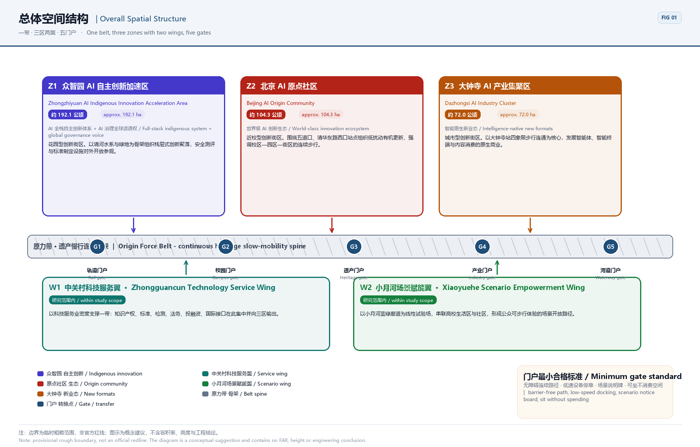
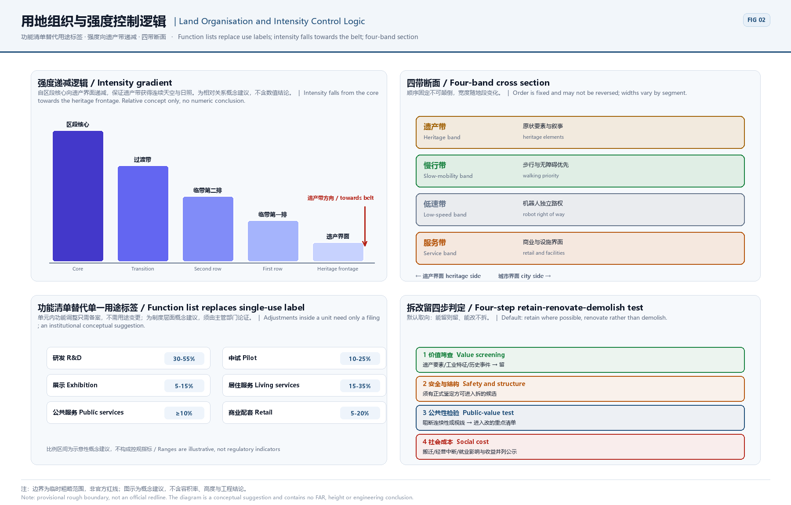
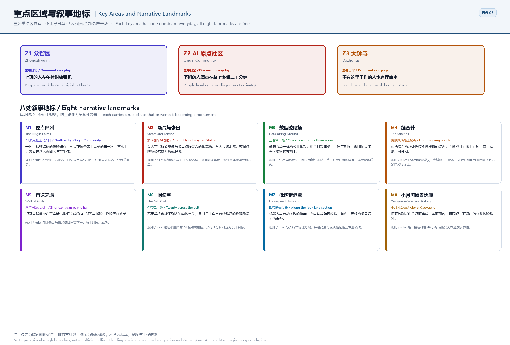
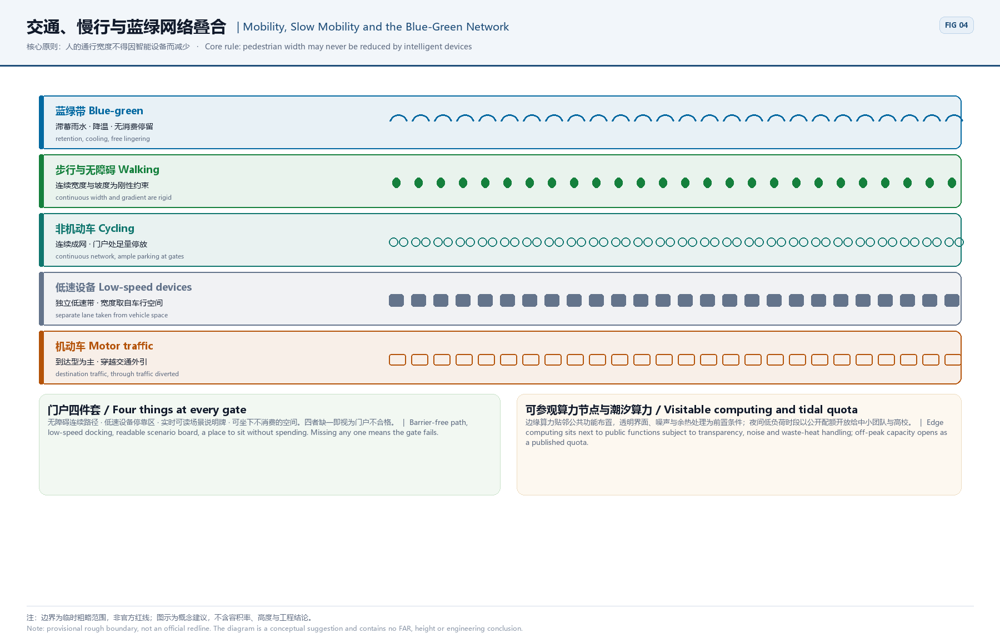
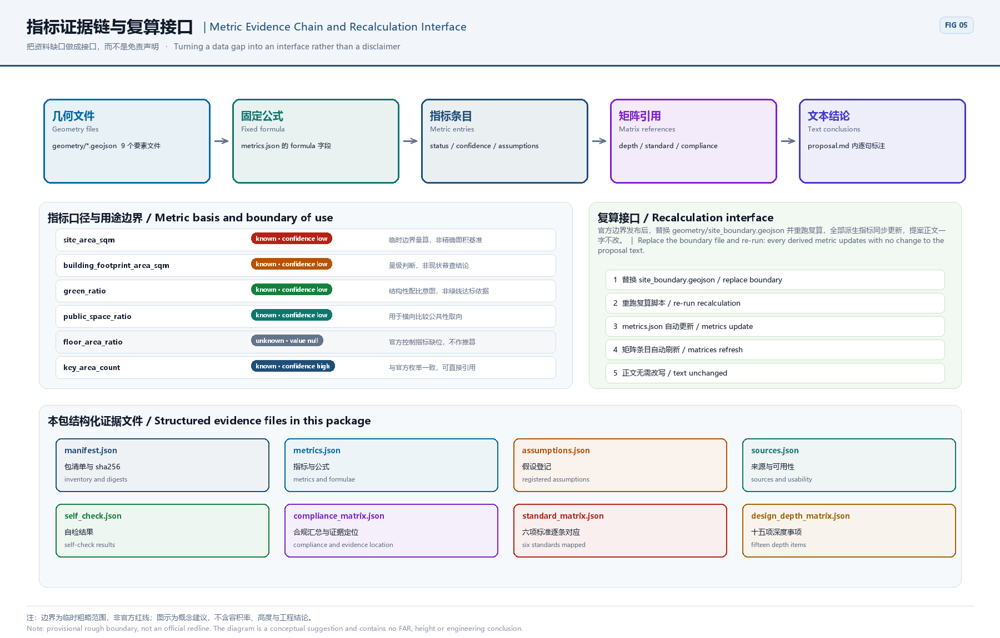

# Jingzhang Origin Force - Urban Design for an AI-Native Innovation Belt

> One-line claim: a century ago the Jingzhang railway solved **how people and freight crossed the mountains**; today this corridor has to solve **how people and machine agents share one city**.

**Scheme codename**: Origin Force. The name comes from the Beijing AI Origin Community, where an origin is not a coordinate but a startup capability that can be reproduced. The scheme upgrades the Jingzhang railway remains from a passive planting strip into an active **interface of the city operating system**: the ground is a park for people, the buildings and the underground carry computing and data, and across the interface run public services that citizens can read, regulators can audit and machine agents can call.

**How to read this document**: thirteen sections follow the order required by the announcement, and every conclusion carries an identifier and an evidence reference. Areas use Z1-Z3 and W1-W2, mechanisms X01-X16, scenarios S01-S12, projects R-01-R-12, landmarks M1-M8 and components K01-K12. Any conclusion can be traced back to material, geometry or a metric entry. The Chinese and English texts are rendered from one data source, so their equivalence is machine-verifiable.

## Design Basis and Source List

This is a formal-stage submission by an AI agent. Its primary basis is the prequalification announcement for the international urban design call for the Centennial Jingzhang AI Innovation Belt together with the open-call task book written for machine agents [source:OFFICIAL-ANNOUNCEMENT] [source:AGENT-TASKBOOK]. Every spatial judgement rests on the provisional rough boundary, the key-area enumeration, the value ranges and the source registry that maintainers have registered under `brief/site-package/`. No unregistered external drawing is introduced and no derived result is presented as a statutory outcome. The generation pipeline is fixed in five steps: read the task book and the permitted design space; read the source registry to determine the use boundary of each item; build a four-way scope-task-depth-metric cross reference; produce text, geometry, drawings and self-check; and finally render the Chinese and English texts from one identical data source so that bilingual equivalence can be machine-verified.

### Grading of source usability

The registry grades material into three classes: usable at formal stage, background_only, and provisional_only [source:SOURCE-REGISTRY]. Only formal-usable material may take part in metric recalculation and compliance argument. Background_only material serves narrative context and design inspiration alone and is never upgraded into an official redline, a statutory regulatory basis or a government delivery commitment. Whenever provisional_only material is cited, the passage is flagged as an assumption and written into `assumptions.json`. A processed fact pack provides the reading order, but the pack itself is not a new authority [source:PROCESSED-FACT-PACK]; any factual judgement must be checked back against the registered originals.

### Honest statement on the nature of the boundary

The site package currently contains no official precise redline, only a provisional rough boundary tagged `geometry_role=provisional_constraint` and `official_boundary=false` [source:BOUNDARY-SOURCE]. Every area, ratio and density derived from that boundary is therefore explicitly labelled a **provisional measure**. Its purpose is to establish a reproducible method and interface, not to supply numbers fit for approval. Once official geometry is released, replacing `geometry/site_boundary.geojson` and re-running the recalculation script updates all derived metrics automatically, with no rewriting of the proposal text. This is how the scheme engineers its own uncertainty.

### Six dimensions of the existing-condition diagnosis

The diagnosis is built on six dimensions: the linear accessibility of the railway heritage; the spatial distribution of innovation actors; break points in commuting and interchange; service blind spots in public space; the age and structure of the building stock; and feasible locations for data and computing facilities [depth:existing_conditions_diagnosis]. The conclusion is a single sentence: this corridor does not lack industrial density, it lacks **an interface that externalises innovation activity into urban experience**. Research happens inside closed buildings, heritage lies behind fences, and the two have never met in the same public space. Every spatial move in this scheme exists to manufacture that interface.

- Boundary and key-area geometry come from the registered provisional boundary file; it is a rough extent and must not be used as a precise area basis [source:BOUNDARY-SOURCE].
- The names, numbering and relative positions of the three key areas follow the registered enumeration; the scheme neither adds nor removes key areas [source:KEY-AREA-SOURCE].
- Value ranges in the site package bound metric derivation; any value outside a range is labelled an assumption [source:SITE-PACKAGE].
- Official redlines, a building survey, underground utilities and tenure records are organiser-side data gaps, handled through a reserved recalculation interface [depth:risk_missing_data].

### Response index to the six task-book items

| Task item | Where this scheme answers | Deliverables |
| --- | --- | --- |
| agent.1 Industry and future-city research | Section 3, coordinated research area | Three positions / five functions / five loops |
| agent.2 International case study | Section 3, comparison table | Eight named cases with applicability and non-applicability |
| agent.3 AI ecosystem and scenarios | Section 6, ecosystem, personas and scenarios | Eight personas, twelve scenario cards, three industrial validation scenarios |
| agent.4 Urban design and public space | Sections 4, 5 and 9 | Three zones and two wings, eight landmarks, a twelve-item component library |
| agent.5 Character, identity and international narrative | Section 9, character and visual direction | Identity motif, six symbols, international narrative line |
| agent.6 Implementation and open ecosystem | Section 10, project list and mechanisms | Twelve projects, sixteen mechanisms, five annual events |

## Three-Level Scope Framework

The scheme follows the announcement in setting up three nested working levels, each carrying a different output precision and a different boundary of responsibility [depth:three_level_scope_framework] [standard:PROJECT-OFFICIAL-ANNOUNCEMENT]. Level one, the coordinated research area, answers what role this corridor plays in the wider urban and industrial structure. Its outputs are research conclusions, trend judgements and strategic frameworks; it issues no regulatory drawings. Level two, the overall design area, answers how urban renewal reaches plots and streets. It works at the urban-design depth of a regulatory detailed plan and outputs **conceptual suggestions** for land-use structure, intensity zoning, height and character control, and the road and blue-green frame. Level three, the key areas, answers how someone's ordinary day here would change. It works at the urban-design depth of a comprehensive implementation plan and outputs **reference options** for massing relationships, ground-to-underground connection, public interfaces and delivery sequence.

### Self-imposed boundary of responsibility

The task book sets explicit no-go areas for machine-agent submissions, and this scheme states its compliance item by item: floor area ratio, building height, named demolish-retain-renovate lists, road redlines, bridge and tunnel engineering, municipal capacity and investment estimates are never presented as final conclusions; no wording implies that the scheme has been agreed or confirmed by the administrative authority; no unregistered precise survey data is used. Wherever such subjects appear they are phrased as a conceptual suggestion, a reference option, or material for a qualified professional team to develop further, with the precondition stated in the same sentence. This is not conservatism. It places the machine-agent submission where it can actually create value, supplying method, structure and a reproducible evidence chain, while leaving statutory judgement to qualified bodies.

| Level | Core question | Output precision | What this scheme does not do |
| --- | --- | --- | --- |
| Coordinated research area | The corridor's role in the urban and industrial structure | Research conclusions and strategy | No regulatory drawings, no intensity conclusions |
| Overall design area | How renewal reaches plots and streets | Conceptual suggestions at regulatory-plan urban-design depth | No redlines, no FAR, no demolition lists |
| Key areas | How a person's day changes | Reference options at implementation-plan depth | No engineering design, no investment estimates |

The three levels share one numbering system: zones Z1 to Z3 with wings W1 and W2, mechanisms X01 to X16, scenarios S01 to S12, projects R-01 to R-12, landmarks M1 to M8 and components K01 to K12. Any conclusion can be traced along its number back to the material, geometry feature and metric entry it relies on, so reviewers need not trust the prose, only follow the numbers. The same numbering is written into `compliance_matrix.json`, `design_depth_matrix.json` and `standard_matrix.json`, creating a two-way index between text and structured data [source:SITE-PACKAGE].

## Coordinated Research Area: Industry and Future City Research

The coordinated level does not ask what can be built here. It asks which irreplaceable function this corridor carries within the national AI landscape [source:AGENT-TASKBOOK] [standard:PROJECT-AGENT-OPEN-CALL-TASKBOOK]. The judgement of this scheme is that China does not lack AI parks. What is missing is one corridor that presses an **indigenous technology stack, real urban scenarios and governance rules** onto a single spatial line. Chips and frameworks grow no users inside closed compounds; models gain no reliability in sandboxes without real constraints; governance rules produce no enforceable clauses in meeting rooms without evidence. Placing those three things inside one walkable, observable, publicly auditable belt of roughly five kilometres is the single asset this corridor holds that no other city can copy.

*Figure · Overall spatial structure: one belt, three zones with two wings, five gates. The boundary is a provisional rough extent, not an official redline.*

### Translating the three positions into space

The three positions set by the announcement are not slogans. This scheme translates each into a testable spatial action and an observable urban phenomenon [source:OFFICIAL-ANNOUNCEMENT]. A position that a passer-by cannot perceive within thirty seconds has not actually been delivered.

| Position | Spatial translation | Phenomenon perceivable in thirty seconds |
| --- | --- | --- |
| Centennial Jingzhang Culture Belt | A continuous heritage line joining locomotives, station buildings and alignment elements through light intervention | One reads a continuous time scale while walking the park, with no ticket or booking |
| Urban AI Life Experience Belt | AI services move from back office to street front, with collection and inference marked in physical space | You see the sensor, and next to it what is collected and for how long |
| AI Convergence Innovation Belt | R&D, pilot production, exhibition and living mix by ratio within one block | In one building the lab door and the bakery door open onto the same street |

### Mapping the five functions onto carrying areas

The five functions must land on specific areas to be testable, otherwise they remain a division-of-labour table. The table below anchors each function to its main carrying area and states the spatial condition under which it holds. The functions are not parallel items; they supply one another through the five loops described below.

| Function | Main carrying area | Spatial condition for the function to hold |
| --- | --- | --- |
| Full-stack indigenous AI innovation system | Zhongzhiyuan | Vertical collaboration space across chips, frameworks, models, toolchains and applications, with public facilities for standard setting and safety evaluation. |
| World-class AI innovation ecosystem | Origin Community | A dense chain of university research, incubation, translation, open source and talent policy, tuned for low entry barriers and high-frequency serendipity. |
| AI+ scenario empowerment paradigm | Xiaoyuehe scenario wing | Treats real urban scenarios as bookable, metered, exitable public test resources so that scenarios become infrastructure. |
| Intelligent and vibrant AI city | Belt-wide | Uses the four-lane section, reversible touchpoints and public experience routes to embed intelligence in everyday public life rather than inside gated parks. |
| Global voice in AI governance | Zhongzhiyuan + belt-wide | Builds a governance pattern other cities can copy: algorithmic impact assessment, reversibility covenants, a civic veto lane and a data airing ground. |

### Five loops that make the functions actually flow

What connects the five functions are five loops. Their value lies in each having a **return path**: when a technology fails after coming downstairs, the failure data must be able to travel back to standard setting, otherwise the belt is merely a row of isolated parks. This scheme requires every loop to have an identifiable spatial origin, transfer point and terminus, and to be publicly reviewed during the annual events.

| ID | Loop | Spatial path | How the return path works |
| --- | --- | --- | --- |
| L1 | Technology-downstairs loop | 众智园 → 原点社区 → 小月河翼 | An indigenous stack matures in Zhongzhiyuan, incubates in the Origin Community, is tested in real scenarios on the Xiaoyuehe wing, and defects flow back to correct standards. |
| L2 | Translation-to-market loop | 原点社区 → 中关村翼 → 大钟寺 | University results pass through the Zhongguancun wing for IP and capital, then surface at Dazhongsi as consumer-facing native formats. |
| L3 | Scenario feedback loop | 小月河翼 → 大钟寺 → 众智园 | Issue lists and de-identified indicators from public scenarios convert into commercial validation demand and standards revision topics. |
| L4 | Governance export loop | 众智园 → 全带 → 国际 | Impact assessment and reversibility covenants are trialled inside the belt, then published as citable urban governance patterns. |
| L5 | Talent retention loop | 全带 → 原点社区 → 中关村翼 | Time banking, shared-equity housing and residency programmes reduce attrition and convert short-project population into long-term residents. |

### International cases: what to borrow and where it does not apply

The commonest failure in case study is to record only the merits. This scheme writes an explicit **applicability and non-applicability boundary** for each of eight named cases, because the real design decisions in a corridor usually happen exactly where a borrowed lesson stops working [source:AGENT-TASKBOOK]. All cases are publicly documented city or district practices. Only public features of their spatial organisation and governance are cited; no non-public data is used and no partnership with any operator is claimed.

| ID | Case | Location | Since | Spatial organisation | Applicability and its limits |
| --- | --- | --- | --- | --- | --- |
| C1 | Kendall Square / MIT | United States, Cambridge MA | 2010s— | University-adjacent innovation district with highly mixed labs, firms and housing and a continuous active ground floor. | Applicable to campus-adjacent renewal in the Origin Community; not applicable where tenure is complex and large-scale relocation is required. |
| C2 | Knowledge Quarter / King's Cross | United Kingdom, London | 2014— | Rail brownfield renewal hosting a cluster of knowledge institutions, with highly open public space and consortium-based governance. | Applicable to consortium governance along the Jingzhang corridor; land value and development intensity differ, so scale figures must not be transplanted. |
| C3 | Station F | France, Paris | 2017— | A start-up ecosystem under one very large roof compressing projects, investors and public services into a continuous indoor street. | Applicable to indoor publicness at a concentrated Dazhongsi venue; the belt should stay multi-nodal rather than a single megastructure. |
| C4 | one-north | Singapore | 2001— | State-led long-horizon science city with phased district development and synchronised housing and transit. | Applicable to Zhongzhiyuan phasing and synchronised amenities; its greenfield-dominant model does not fit the belt's stock-renewal condition. |
| C5 | MaRS Discovery District | Canada, Toronto | 2005— | A translation platform co-built by hospital, university and innovation bodies, with a public atrium acting as a civic living room. | Applicable to the Origin Community's showcase hall; its life-science focus means AI scenarios need separate design. |
| C6 | Kashiwa-no-ha Smart City | Japan, Kashiwa | 2014— | Public-private-academic joint operation using energy and health dashboards as the public interface. | Applicable to operating the data airing ground and public dashboards; data categories must be redefined under local regulation. |
| C7 | Maria 01 | Finland, Helsinki | 2016— | A start-up campus converted from a former hospital, winning on low retrofit intensity and high community density. | Applicable as a retrofit-intensity reference for low-disturbance renewal; far smaller than the belt, so proportions need correction. |
| C8 | 河套深港科技创新合作区 | China, Shenzhen | 2023— | An innovation cooperation zone centred on institutional interoperability and cross-border factor flows, emphasising rules-based openness. | Applicable to global factor allocation on the Zhongguancun wing; cross-border institutional conditions differ, so only the mechanism logic transfers. |

All cases are drawn from publicly released institutional materials for method benchmarking and applicability discussion. They do not imply endorsement of this proposal and contain no unverified investment, output or policy figures; years and scales must be re-checked by professional teams against the latest public texts.

### Regional coordination: the belt is not an island

The corridor's competitiveness depends on whether its division of labour with neighbouring innovation units is clear. If every unit attempts a full stack, the result is duplicated facilities and mutually diluted talent. This scheme sets out coordination in five directions on the principle of **shared services, differentiated functions and mutually recognised rules**: talent services and the scenario booking system are shared, industrial segments are differentiated, and safety evaluation and data rules are mutually recognised.

| Counterpart | Relation | What is coordinated |
| --- | --- | --- |
| Beiwei Community | Adjacent | Shares talent services and an open-source event calendar with the Origin Community, avoiding duplicate incubation facilities and using one scenario booking system. |
| Future Science City | R&D relay | Takes overflow pilot-scale and engineering validation demand; the belt keeps high-frequency interaction and small-scale trials while heavy pilot equipment moves north. |
| Huairou Science City | Facility complement | Large scientific facilities and the belt's city-scale real scenarios complement each other: facilities produce methods, the belt produces scenarios and data specifications. |
| Beijing E-Town | Scale-up | Robots and intelligent terminals validate public-space usability in the belt, then transfer to E-Town for volume production and large-scale deployment. |
| Beijing-Tianjin-Hebei | Standards spillover | Opens the touchpoint labelling system, impact-assessment template and scenario-card format as public texts other regional cities can cite. |

The regional judgements above are research conclusions at the coordinated level. They inform **conceptual suggestions** on function selection and facility sharing. They assign no tasks to any district, park or enterprise and do not substitute for the statutory procedures of cross-district coordination [depth:three_level_scope_framework].

## Overall Design Area: Urban Renewal and Regulatory-Plan-Level Urban Design

The overall structure is summarised as **one belt, three zones with two wings, and five gates**: a continuous heritage slow-mobility belt as the frame, three functional zones and two functional wings attached to it, and five rail and road gates handling entry and transfer [depth:overall_spatial_structure]. The core judgement is that this belt must not be designed as a landscape greenway. It has to be **a public space with working surfaces**, where pilot equipment may appear at street level, low-speed robots may use a dedicated right of way, and experimental results may be posted in the open. Only when production is allowed to spill into public space does innovation become part of urban experience.

*Figure · Conceptual suggestion for land use and intensity zoning. Zones show relative relationships only and contain no FAR or height conclusions.*

### Character and role of the three zones and two wings

The three zones and two wings follow the division set by the announcement. This scheme gives each a **spatial character** rather than only a functional label, because what decides whether a district keeps people is its everyday texture, not its industrial classification [source:OFFICIAL-ANNOUNCEMENT] [depth:land_use_layout]. Area figures are measured from the provisional rough boundary, are provisional in nature, and will be recalculated once official geometry is released.

| ID | Area | Provisional area | Functions carried | Character and design points |
| --- | --- | --- | --- | --- |
| Z1 | Zhongzhiyuan AI Indigenous Innovation Acceleration Area | approx. 192.1 ha | Full-stack indigenous system + global governance voice | A garden-type innovation district. Stacked innovation clusters are organised along the Qinghe water system and green frame, with safety-evaluation and standard-setting facilities open to public visits. |
| Z2 | Beijing AI Origin Community | approx. 104.3 ha | World-class innovation ecosystem | A campus-adjacent innovation district. Low-disturbance organic renewal is organised around Wudaokou and Tsinghua East Road West Gate stations, emphasising continuous walking between campus, park and neighbourhood. |
| Z3 | Dazhongsi AI Industry Cluster | approx. 72.0 ha | Intelligence-native new formats | An urban innovation district. Four-quadrant pedestrian connection at Dazhongsi station anchors native commerce in agents, intelligent terminals and content consumption. |
| W1 | Zhongguancun Technology Service Wing | within study scope | Global factor allocation, Zhongguancun IP and capital | Supports the belt through service-industry density: IP, standards, testing, legal, investment and international interfaces concentrate here and export into the three zones. |
| W2 | Xiaoyuehe Scenario Empowerment Wing | within study scope | Scenario empowerment and vibrant AI city | Uses the Xiaoyuehe blue-green corridor as a linear testbed linking campus living areas and neighbourhoods into a walkable public scenario route. |

### Control logic for intensity, height and character

This scheme states no numerical conclusion for floor area ratio or height. It states the **control logic** from which a qualified team may derive values inside statutory procedures [depth:development_intensity_controls] [depth:height_massing_character] [standard:MOHURD-CONTROL-DETAILED-PLANNING]. There are three rules. First, intensity decreases from the core of each area towards the heritage belt, so that the heritage interface keeps continuous sky and daylight. Second, the first row of buildings along the belt is organised as low-rise high-density fabric, avoiding long solid walls that turn their back on the park. Third, height follows a sightline-first principle: no mass may cut the main sightline from a gate to a landmark. All three rules are testable by geometry script, and the test results are written into `design_depth_matrix.json`.

- The intensity gradient is a conceptual suggestion about relative relationships with no numerical conclusion, offered for professional teams to develop within regulatory planning.
- Low-rise high-density fabric along the belt aims to create a continuous retail and service frontage, not to reduce total development.
- Sightline corridors are defined by lines from gates to landmarks, recorded in `geometry/constraints.geojson` and independently verifiable.
- Character control relies mainly on materials and opening ratios rather than formal imitation, avoiding the reduction of industrial heritage to decorative motifs.

### Transfer role of the five gates

The gates are the switches of this belt. The five gates sit where rail stations, major road junctions and main park entrances meet. Their role is not to be a landscape entrance but a **double transfer point for both travel mode and behaviour**: from driving to walking, from hurrying to lingering, from closed compound to public space. Each gate is required to provide four things: a continuous barrier-free path, a docking area for low-speed devices, a readable real-time scenario notice board, and a place to sit without spending money. These four constitute the minimum standard for a gate [depth:traffic_rail_slow_parking].

The gate description above is a conceptual suggestion on spatial organisation. Actual positions, land and traffic organisation must follow official transport and land data and be developed by professional teams within statutory procedures. This scheme draws no road redline and reaches no engineering conclusion [depth:risk_missing_data].

## Detailed Design of Key Areas

The aim for the three key areas is not that each looks good on its own, but that a person can pass through all of them in a single day without feeling a break [depth:three_key_area_detailed_design] [source:KEY-AREA-SOURCE]. The scheme fixes one **dominant everyday** for each. In Zhongzhiyuan it is that people at work become visible during the lunch break. In the Origin Community it is that people heading home are willing to linger twenty minutes longer. At Dazhongsi it is that people who do not work here still have a reason to come. These three everydays determine three very different mixes of public space and different opening hours.

*Figure · Key areas and narrative landmarks. All landmarks are free to enter and form a memorable spatial sequence.*

### Eight narrative landmarks

The task of a landmark on this belt is not to be a photo spot but to **turn abstract technical activity into something the body can experience**. Eight landmarks are distributed along the belt, all free, without booking and without any spending threshold, and each carries an explicit rule of use that prevents it from decaying into a monument. The three most important are the Data Airing Ground, the Wall of Firsts and the Decommissioning Square. The first hangs operating data in the open, the second records events without grading them, and the third gives a dignified public place to **deliberately dismantle a failed intelligent facility**. A corridor of innovation that reserves no space for failure will only accumulate legacy systems nobody dares switch off.

| ID | Landmark | Location | Content | Rule of use |
| --- | --- | --- | --- | --- |
| M1 | The Origin Cairns | North entry, Origin Community | A growing line of low stones recording every first achieved on this belt, credited to both human teams and machine agents. | No ranking or rating, only events and dates; anyone may nominate and inscriptions follow public notice. |
| M2 | Steam and Tensor | Around Tsinghuayuan Station | A structure overlaying the chevron track motif with a tensor dot matrix: a shade colonnade by day, a matrix that breathes with public compute load by night. | Free-standing, reversible foundations, sited outside the heritage protection boundary. |
| M3 | Data Airing Ground | One in each of the three zones | A public frame like a drying yard where the day's collected categories, retention periods and access records are printed on replaceable banners. | Physical first, web secondary; banners are changed by a third-party trustee who takes questions on site. |
| M4 | The Stitches | Eight crossing points | The eight east-west connections are designed as stitches rather than bridges: short, frequent, close to grade, phaseable. | Locations are conceptual suggestions; crossing form, structure and feasibility require separate professional study under official conditions. |
| M5 | Wall of Firsts | Zhongzhiyuan public hall | Records world firsts in deploying and withdrawing AI on real city streets; withdrawal is recorded with equal honour. | Withdrawal entries use the same type size as deployments to prevent survivorship display. |
| M6 | The Ask Post | Twenty across the belt | Physical points where a person can be asked without a phone, and the physical guarantee of the non-digital alternative route. | Sited to cover all touchpoint-dense areas with a five-minute walk as the design target. |
| M7 | Low-speed Harbour | Along the four-lane section | Docking, charging and fault-recovery bays for robots and shuttles, doubling as a stand where citizens watch machine behaviour. | Physically separated from the footway; barrier height and sightline transparency need professional verification. |
| M8 | Xiaoyuehe Scenario Gallery | Along Xiaoyuehe | Strings open test segments along the river into a bookable, watchable, exitable public experience route. | Any segment can revert to an ordinary waterfront path within 48 hours. |

### Public space component library

Implementation quality in key areas usually fails at the last metre: a well-designed path goes unused because there is nowhere to sit, no power and no shade. This scheme proposes an **open-source component library** of twelve types, fixing minimum specifications and non-negotiable attributes such as no spending threshold, so that different property owners can procure and install them on their own plots and still deliver one consistent public experience without unifying ownership [depth:blue_green_public_space]. The library is released under CC BY 4.0 and may be copied, modified and used in other cities by anyone.

| ID | Component | Minimum specification | Non-negotiable attribute |
| --- | --- | --- | --- |
| K01 | Free worktop | 1.8 x 0.7 m family | No purchase threshold, power and shade |
| K02 | Powered bench | 1.6 m / 2.4 m | Linked to night lighting, optional backrest |
| K03 | Touchpoint label | A4 / A3 portrait | Four symbols plus a retention badge |
| K04 | Ask post | 2.4 x 2.4 m | Staffed hours posted, non-digital entry |
| K05 | Airing banner | 0.9 x 2.4 m | Replaceable, recyclable material |
| K06 | Low-speed barrier | 0.6 m see-through | Transparent sightlines at child height |
| K07 | Docking harbour | 3.0 x 6.0 m | Combined charging and recovery bay |
| K08 | Reversible plinth | 0.6 x 0.6 m module | Bolt-fixed, removable within 48 hours |
| K09 | Narrative paver | 300 x 300 mm | Inscribed with first events and years |
| K10 | Tactile guide strip | Standard tactile family | Mandatory pairing with the low-speed edge |
| K11 | Pop-up stand | 3 steps / 6 seats | Set up and removed with test segments |
| K12 | Rain garden module | 2.0 x 4.0 m | Connected to the blue-green network |

The component library, landmark positions and opening rules are **reference options** at implementation level. Their placement must follow official land, tenure and municipal conditions and may be developed further by professional teams when preparing implementation plans. This scheme makes no construction commitment on any specific plot [depth:renewal_project_list].

## AI Innovation Ecosystem, Personas, and AI+ Scenarios

This section is the centre of the scheme. Whether an AI innovation belt works is not judged by how many firms it attracts, but by **whether one specific person's day here actually changes**, and by **what happens when the system gets it wrong** [source:AGENT-TASKBOOK]. It therefore has three parts: eight personas of talent and residents, twelve auditable scenario cards, and one set of data and algorithm governance constraints running through them all. Every card must answer the same questions: what is collected, how long it is kept, where the model comes from, what the false-positive baseline is, who performs human review, what the impact on vulnerable groups is, and under what condition it must be suspended. A scenario that cannot answer them is not written into the scheme.

### Eight personas of talent and residents

Personas exist to stop the scheme from serving only engineers. Four of the eight are not technical workers: a crowdsourced annotator, a commuting parent, a retired resident and an international visitor. They stand for the four situations most easily overlooked by intelligent systems on this belt: unstable income, encumbered movement, low digital capability, and no shared language. Any scenario that cannot serve these four at the same time is required to keep a staffed channel, which may never be removed in the name of efficiency [depth:blue_green_public_space].

| ID | Persona | Profile | Core need | Support provided |
| --- | --- | --- | --- | --- |
| P1 | Model engineer, He Yu | 27 / works in Zhongzhiyuan / rents in the Origin Community | Leaves at 23:00 and wants a safe, well-lit route home that passes hot food. | Night lighting with crowd alerts, low-speed delivery shuttles, clustered 24-hour food outlets. |
| P2 | Start-up co-founder, Qin Wang | 34 / based at Dazhongsi / commutes on Line 13 | Needs to meet an investor, a lawyer and a prospective client within one hour without three cross-district trips. | Service clustering on the Zhongguancun wing, station-integrated meeting lounges, bookable short-stay negotiation pods. |
| P3 | Crowd annotator, Lin Xiaoman | 23 / no fixed desk / paid per task | Needs a free long-stay work seat with power and network and no obligation to buy anything. | Free worktops in the component library, powered benches along the heritage park, no purchase threshold. |
| P4 | AI ethics researcher, Zhou Yan | 41 / university / based in the Origin Community | Wants to know what each street camera and sensor collects, how long it is kept and who can access it. | Touchpoint labelling system, data airing ground, published impact assessments. |
| P5 | Commuting parent, Ms Zheng | 36 / local resident / dual-income household | Drops a child at daycare before the metro; the stroller must not be blocked by steps or robots. | Continuous barrier-free route, daycare-to-station link, physical separation between the low-speed lane and the footway. |
| P6 | Retired resident, Mr Chen | 68 / does not use a smartphone | Wants every service to keep a non-phone entry where a human can be asked. | Non-digital alternative routes, physical enquiry points, voice and paper channels, human appeal desks. |
| P7 | Robot field operator, Wu Fan | 29 / low-speed fleet inspection | Needs to recover faulty units without closing a street, with a clear right-of-way liability interface. | Low-speed lane lay-bys, recovery bays, right-of-way markings and liability plates. |
| P8 | International visitor, Dr Alvarez | 45 / short visit / does not read Chinese | Wants to read street AI labels and visitor routes without a translation app. | Bilingual wayfinding, graphics-first symbol system, an international edition of the pilgrimage route leaflet. |

### Twelve AI+ scenario cards

The twelve cards cover mobility, safety, enterprise services, culture, health, computing, accessibility, content, open booking, disclosure and appeal. Three of them, S02, S06 and S10, are **industrial validation scenarios**: their first purpose is not to improve experience but to supply the local technology stack with validation data under real constraints, whose results flow back into standard setting. All cards use one template with a fixed field order and can be read and compared directly by script.

| ID | Scenario | Location | Personas served | Maturity | Type |
| --- | --- | --- | --- | --- | --- |
| S01 | Continuous slow-mobility safe navigation | 小月河翼 | P1,P5,P6 | Medium | Service improvement |
| S02 | Low-speed device right-of-way coordination | 全带 | P5,P7 | Low | Industrial validation |
| S03 | Enterprise service copilot | 中关村翼 | P2 | Medium | Service improvement |
| S04 | Heritage narrative guide | 全带 | P8,P6 | High | Service improvement |
| S05 | Night-time co-patrol | 小月河翼 | P1,P5 | Low | Service improvement |
| S06 | Compute tide scheduling | 众智园 | P1 | Medium | Industrial validation |
| S07 | Health service navigation | 全带 | P5,P6 | Medium | Service improvement |
| S08 | Barrier-free route verification | 全带 | P5,P6 | High | Service improvement |
| S09 | Intelligence-native content consumption | 大钟寺 | P2,P8 | Medium | Service improvement |
| S10 | Open scenario booking | 全带 | P1,P2,P7 | High | Industrial validation |
| S11 | Data airing disclosure | 全带 | P4,P6 | Medium | Service improvement |
| S12 | Civic veto and appeal | 全带 | P4,P6,P3 | Medium | Service improvement |

#### S01 Continuous slow-mobility safe navigation (Service improvement scenario)

| Field | Content |
| --- | --- |
| Location and carrier | 小月河翼 · Heritage park slow-mobility spine |
| Personas served | P1,P5,P6 |
| Data collected and flow | Section-level pedestrian counts and illuminance only, no facial data; counts aggregated at the edge before upload |
| Retention period | Raw counts 7 days, aggregated statistics 12 months |
| Model source | Open-source counting model with local calibration |
| False-positive baseline | A false-positive baseline must be established and published within 90 days of trial |
| Human review | Joint duty desk of the sub-district office and operator |
| Impact on vulnerable groups and redundancy | Wheelchairs, strollers and visually impaired users need separate passage redundancy; counts must never restrict access |
| Suspension threshold | Suspend if the false-positive rate exceeds the published threshold for three consecutive days or one access-restriction incident occurs |
| Operator | Park operator |
| Maturity | Medium |
| Validation method | 90-day parallel human observation |

#### S02 Low-speed device right-of-way coordination (Industrial validation scenario)

| Field | Content |
| --- | --- |
| Location and carrier | 全带 · Low-speed lane of the four-lane section |
| Personas served | P5,P7 |
| Data collected and flow | Device position and speed; no surrounding imagery used for training |
| Retention period | Trajectories 30 days, incident records 3 years |
| Model source | Vendor model plus a city-side right-of-way rule engine |
| False-positive baseline | Yield-failure rate and takeover counts must be published |
| Human review | Low-speed lane operations centre |
| Impact on vulnerable groups and redundancy | Physical separation between footway and low-speed lane; speed downgrade during child- and elder-dense periods |
| Suspension threshold | Belt-wide suspension on any yield failure causing human contact |
| Operator | Joint operating body |
| Maturity | Low |
| Validation method | Closed-section testing before open-section release |

#### S03 Enterprise service copilot (Service improvement scenario)

| Field | Content |
| --- | --- |
| Location and carrier | 中关村翼 · Station-integrated lounge |
| Personas served | P2 |
| Data collected and flow | Only voluntarily submitted public materials and published government items |
| Retention period | Sessions 90 days, deletable at any time |
| Model source | Open-source base model fine-tuned on published government corpora |
| False-positive baseline | Answers must carry confidence and link to source texts |
| Human review | Human counter in the service hall |
| Impact on vulnerable groups and redundancy | Service quality must not vary with language ability; a full human channel is retained |
| Suspension threshold | Take an item offline after three consecutive wrong guidances |
| Operator | Service consortium |
| Maturity | Medium |
| Validation method | Double-blind comparison with human counters |

#### S04 Heritage narrative guide (Service improvement scenario)

| Field | Content |
| --- | --- |
| Location and carrier | 全带 · Eight pilgrimage landmarks |
| Personas served | P8,P6 |
| Data collected and flow | No visitor personal data; node visit counts only |
| Retention period | Counts 12 months |
| Model source | Local knowledge-base retrieval; no unverified historical conclusions generated |
| False-positive baseline | Historical statements must cite sources; free generation is prohibited |
| Human review | Review by heritage advisers |
| Impact on vulnerable groups and redundancy | Paper and voice versions provided; QR code is never the only entry |
| Suspension threshold | One factual error triggers a full offline review |
| Operator | Cultural operator |
| Maturity | High |
| Validation method | Spot checks by heritage experts |

#### S05 Night-time co-patrol (Service improvement scenario)

| Field | Content |
| --- | --- |
| Location and carrier | 小月河翼 · Xiaoyuehe night route |
| Personas served | P1,P5 |
| Data collected and flow | Illuminance and distress acoustic features; no facial recognition or identity linkage |
| Retention period | Alarm clips 30 days, everything else discarded immediately |
| Model source | Open-source acoustic event detection |
| False-positive baseline | False-positive and verified-dispatch rates must be published |
| Human review | Joint review by local police and the sub-district |
| Impact on vulnerable groups and redundancy | Must not be used to judge assembly behaviour; no automatic reporting of rough sleepers or night workers |
| Suspension threshold | One irrelevant dispatch downgrades the system to lighting linkage only |
| Operator | Sub-district and police |
| Maturity | Low |
| Validation method | Time-limited pilot with published evaluation |

#### S06 Compute tide scheduling (Industrial validation scenario)

| Field | Content |
| --- | --- |
| Location and carrier | 众智园 · Edge compute nodes |
| Personas served | P1 |
| Data collected and flow | Aggregated compute load and published grid signals only |
| Retention period | Scheduling logs 24 months |
| Model source | Rule engine primary, model used only for forecasting support |
| False-positive baseline | Impact statistics of scheduling failures on user jobs must be published |
| Human review | Compute platform operator |
| Impact on vulnerable groups and redundancy | Public-service jobs must never be crowded out; their priority is fixed |
| Suspension threshold | Stop commercial scheduling if public-job latency exceeds the published threshold |
| Operator | Compute consortium |
| Maturity | Medium |
| Validation method | Six-month comparison against a fixed baseline |

#### S07 Health service navigation (Service improvement scenario)

| Field | Content |
| --- | --- |
| Location and carrier | 全带 · Community service nodes |
| Personas served | P5,P6 |
| Data collected and flow | No personal medical records; published appointment supply and queue times only |
| Retention period | Query records 7 days |
| Model source | Retrieval question answering; no diagnosis |
| False-positive baseline | Any diagnosis-like phrasing must be blocked |
| Human review | Community health centre |
| Impact on vulnerable groups and redundancy | Phone and counter channels retained for older adults; no account registration required |
| Suspension threshold | One diagnostic output takes the service offline |
| Operator | Health service provider |
| Maturity | Medium |
| Validation method | Comparison with human triage staff |

#### S08 Barrier-free route verification (Service improvement scenario)

| Field | Content |
| --- | --- |
| Location and carrier | 全带 · Belt-wide pedestrian network |
| Personas served | P5,P6 |
| Data collected and flow | Slope, width and obstacle geometry; no imagery of people |
| Retention period | Verification records 24 months |
| Model source | Primarily geometric computation |
| False-positive baseline | Miss rate must be published and citizen corrections accepted |
| Human review | Accessibility supervisors |
| Impact on vulnerable groups and redundancy | Results must convert into rectification work orders, not display only |
| Suspension threshold | Public disclosure after three unrectified reports at the same break point |
| Operator | Municipal maintenance |
| Maturity | High |
| Validation method | On-site validation accompanied by wheelchair users |

#### S09 Intelligence-native content consumption (Service improvement scenario)

| Field | Content |
| --- | --- |
| Location and carrier | 大钟寺 · Dazhongsi four-quadrant district |
| Personas served | P2,P8 |
| Data collected and flow | User-initiated input only; no cross-store tracking |
| Retention period | Sessions 30 days |
| Model source | Merchant-selected models, registered on a public list |
| False-positive baseline | AI-generated content must be labelled |
| Human review | Merchants and district operator |
| Impact on vulnerable groups and redundancy | No personalised recommendation to minors |
| Suspension threshold | Unlabelled generated content suspends that merchant's access |
| Operator | District operator |
| Maturity | Medium |
| Validation method | Sampled human audit |

#### S10 Open scenario booking (Industrial validation scenario)

| Field | Content |
| --- | --- |
| Location and carrier | 全带 · Belt-wide test segments |
| Personas served | P1,P2,P7 |
| Data collected and flow | Booking entity and time slot; test payloads are not collected |
| Retention period | Booking records published for 36 months |
| Model source | No model; a pure process system |
| False-positive baseline | Queues and refusal reasons must be published |
| Human review | Scenario management committee |
| Impact on vulnerable groups and redundancy | A fixed quota is reserved for micro teams to prevent crowding out by large firms |
| Suspension threshold | Freeze commercial bookings if the quota is encroached |
| Operator | Scenario committee |
| Maturity | High |
| Validation method | Public ledger and quarterly review |

#### S11 Data airing disclosure (Service improvement scenario)

| Field | Content |
| --- | --- |
| Location and carrier | 全带 · Three data airing grounds |
| Personas served | P4,P6 |
| Data collected and flow | Metadata is the exhibit: categories collected, retention, access counts |
| Retention period | Disclosure records retained long term |
| Model source | No model |
| False-positive baseline | A missing entry counts as non-compliant deployment |
| Human review | Citizen supervisors and third parties |
| Impact on vulnerable groups and redundancy | A physical display board is provided; no web dependency |
| Suspension threshold | Any unlisted touchpoint is powered down |
| Operator | Third-party trustee |
| Maturity | Medium |
| Validation method | Third-party quarterly audit |

#### S12 Civic veto and appeal (Service improvement scenario)

| Field | Content |
| --- | --- |
| Location and carrier | 全带 · Community service stations and airing grounds |
| Personas served | P4,P6,P3 |
| Data collected and flow | Appeal content and handling process; appellants may stay anonymous |
| Retention period | Handling records 5 years |
| Model source | No model; handled by people |
| False-positive baseline | Acceptance and reversal rates must be published |
| Human review | Independent intake panel |
| Impact on vulnerable groups and redundancy | Paper and assisted-filing channels are provided with no digital threshold |
| Suspension threshold | A touchpoint freezes when cumulative veto votes reach the threshold |
| Operator | Independent panel |
| Maturity | Medium |
| Validation method | Published annual report |

### Governance constraints across all scenarios

The twelve cards share one set of hard constraints. Any new scenario wishing to enter this belt must satisfy them before its benefits are discussed. The principle is **minimal by default, stoppable by default, inspectable by default**: collect the least data by default, always have a condition that can stop it, and make its operating state legible to non-specialists by default.

1. Minimum necessary collection: use counts where counts suffice, images only where counts fail, and facial data never where images suffice. Any facial-level collection requires separate public notice and an alternative channel.
2. Non-trainable list: explicitly enumerate data classes forbidden for model training, including images of minors, medical and biometric data, and precise residential trajectories.
3. Algorithm impact assessment first: complete a public impact assessment before launch, and publish objections alongside conclusions rather than conclusions alone.
4. Published false-positive baseline: establish and publish a baseline during the trial period and update it quarterly. No baseline means no move into regular operation.
5. Human review is never optional: judgements affecting passage, eligibility or penalty require human review, and the review post must be physically findable.
6. Suspension thresholds agreed in advance: the triggering condition and the responsible person are written before launch. Once triggered, the system stops first and is reviewed afterwards, never patched while running.
7. Public veto channel: if a scenario receives real-name objections above a threshold during public notice, it must be reassessed, and deployment may not expand while the reassessment is under way.
8. Decommissioning reserve: every new intelligent facility must set aside funds for removal and a site restoration plan, so that no ownerless legacy system accumulates.

These governance constraints are **conceptual suggestions** put forward by the scheme. Their legal force, competent authority and enforcement procedure must be determined under national and local regulations in force, and may be developed further by professional teams and authorities during institutional design. The scheme claims no approval or binding force for any clause [depth:risk_missing_data] [standard:PROJECT-AGENT-OPEN-CALL-TASKBOOK].

## Land Use, Building Scale, and Retain-Renovate-Demolish Strategy

This section states **classification principles and a decision procedure**, not a disposal list for specific plots. The reason is plain: official redlines, a building survey and tenure records are outside the currently usable material, so any retain-renovate-demolish conclusion about a specific building would exceed the responsibility boundary of a machine-agent submission [depth:retain_renovate_demolish] [depth:risk_missing_data] [standard:MNR-LAND-USE-CLASSIFICATION-GUIDE]. The contribution here is to write the criteria clearly, turn the procedure into executable steps, and list the official prerequisites each step needs, so that a professional team can apply it directly once the material arrives.

### Land organisation: from use labels to function lists

Spatial demand in the AI industry changes far faster than land-use designations can be adjusted. A building may host R&D this year, pilot production next year and exhibition and training the year after; if each change requires a formal use conversion, procedure will strangle innovation. This scheme suggests replacing single-use labels at renewal-unit level with a **function list plus ratio bands**: the list enumerates permitted function classes, the bands cap and floor each class, and adjustments inside a unit require only a filing rather than a conversion. This is an institutional conceptual suggestion whose feasibility must be examined by the competent authority within the statutory framework [depth:land_use_layout] [standard:MOHURD-CONTROL-DETAILED-PLANNING].

### A four-step procedure for retain, renovate or demolish

1. Step one, value screening: check whether the building is a registered heritage element, carries railway industrial characteristics, or holds a documented historical event. Any yes sends it to retain, without further comparison.
2. Step two, safety and structure: judge, on the basis of an official structural appraisal, whether an unrepairable hazard exists. Only a formal appraisal may place a building among demolition candidates; where an appraisal is absent, the default is renovate.
3. Step three, public-value test: assess whether the building's position breaks the continuity of the heritage belt or blocks the main sightline from a gate to a landmark. If it does and local alteration cannot resolve it, the building enters the priority renovate list rather than direct demolition.
4. Step four, social cost accounting: calculate relocation cost, business interruption and employment impact for current occupants, and publish the result beside the renewal benefit. Where social cost exceeds the threshold, the scheme is reassessed rather than simply compensated for.

The default disposition of the procedure is to retain where possible and renovate rather than demolish, because on a corridor whose core asset is a time narrative, demolition removes not only a building but the evidence that can be told. Each step depends on specific official prerequisites; if one is missing the procedure halts at that step and is marked pending review, never substituted by conjecture [source:SITE-PACKAGE].

### Mechanisms related to land and space

| ID | Category | Mechanism | Content |
| --- | --- | --- | --- |
| X01 | Land | Elastic mixed-use list | Suggests replacing single-use labels with a function list inside renewal units, allowing R&D, pilot, exhibition and residential services to combine by ratio. |
| X02 | Land | Reversible land covenant | Temporary innovation uses are granted for a fixed term and revert if a public-value threshold is unmet, preventing temporary becoming permanent. |
| X03 | Space | Four-lane section | Footway, cycle lane, low-speed lane and vehicle lane placed side by side, making robot right-of-way an independent element of public space design. |
| X04 | Space | Minimum implementable unit | Advances in 200-metre segments; each unit can be built, evaluated and withdrawn independently. |

Among these, the **reversible land covenant** is the boldest institutional suggestion in this scheme: a share of land may be put into use on a reversible basis for an agreed term, after which it is restored or converted to public space as pre-agreed, preventing experimental facilities from becoming permanent occupation. Its value is to lower the cost of being wrong, since only a decision that can be withdrawn dares to be made early. Its legal construction must be examined by the competent authority; this scheme offers a conceptual suggestion only [depth:renewal_project_list].

## Transport, Rail, Municipal Infrastructure, and Public Services

The core question of this section is a new one: **how is right of way allocated when low-speed robots, delivery devices and people share the street** [depth:traffic_rail_slow_parking]. Most cities today let robots encroach on the footway, and the passage quality of pedestrians, wheelchairs and strollers falls. This scheme adopts the opposite principle: **pedestrian width may never be reduced by the introduction of intelligent devices**. Low-speed devices must use a separate low-speed lane, and that lane is taken from vehicle space, not from pedestrian space. This principle precedes every transport decision on the belt.

*Figure · Conceptual suggestion overlaying mobility and the blue-green network. The low-speed lane is separate and does not occupy pedestrian width.*

### Right-of-way principles for four classes of user

- Walking and barrier-free movement hold the highest priority; continuous width and gradient are rigid constraints that no facility may encroach upon, and any encroachment counts as design failure.
- Cycling forms a continuous separated network, with sufficient parking provided at gates rather than prohibition, so management cost is not shifted onto users.
- Low-speed intelligent devices use a separate lane with published speed limits and docking points; night operation requires noise reduction and avoids residential frontages.
- Motor traffic inside the belt is primarily destination traffic, through traffic is guided to peripheral roads, and loading is concentrated behind the gates.

These right-of-way principles are conceptual suggestions on spatial organisation. Actual cross sections, speed limits, traffic organisation and engineering delivery must follow official transport data and the views of the competent authority and be developed by professional teams. This scheme reaches no conclusion on road redlines, bridge and tunnel engineering or municipal capacity [depth:risk_missing_data].

### Spatial arrangement of new infrastructure and computing

Computing facilities usually appear in cities as rooms nobody may enter, which conflicts directly with this belt's aim of externalising innovation. The scheme suggests **visitable computing nodes**: some edge computing facilities are placed adjacent to public functions, conditional on transparent frontage and the handling of noise and waste heat, so that citizens can see the physical form of computation and the waste heat can warm public space in winter [depth:municipal_new_infrastructure]. It also proposes **tidal computing**: during nights and low-load periods, part of the computing resource is opened to small teams and universities as a published quota, with quota rules and usage records made public.

| ID | Category | Mechanism | Content |
| --- | --- | --- | --- |
| X11 | Compute | Tidal compute with public priority | Edge nodes switch between industrial and public jobs by time band, with public jobs holding a fixed, non-displaceable priority. |
| X12 | Compute | Heat and noise covenant | Waste heat from compute nodes serves adjacent public facilities first; noise and heat impacts on nearby housing are monitored publicly. |
| X13 | Data | Minimal necessity and no-train list | Explicitly lists categories that must never be used for training: identifiable facial imagery, images of children, medical and biometric data. |
| X14 | Data | Data trust and airing | A third-party trustee holds access rights to public-scenario data and discloses access records at physical airing grounds. |

On public services the scheme holds one bottom line: **intelligence may never be the reason to cut staffed service counters**. Wherever an intelligent terminal replaces a counter, a channel that needs no smartphone, no booking and no account must remain, and its location must be clearly signed in physical space. This bottom line serves the retired resident, the digitally less capable and the international visitor personas directly.

## Blue-Green Network, Public Space, and Urban Character

The blue-green system on this belt is not a decorative layer but **public space carrying infrastructural duties**: retaining stormwater, easing the heat island, offering places to stay without spending, and acting as the continuous carrier of the heritage narrative [depth:blue_green_public_space]. The scheme proposes a **four-band cross section**: across the belt, running from the heritage frontage to the city frontage, come the heritage band, the slow-mobility band, the low-speed band and the service band. Their widths may vary by segment, but their order may never be reversed. A fixed order lets a user anywhere along the belt predict what comes next, which is the cheapest way to achieve continuity.

### Urban character and visual direction

The aim of character control is that the belt be recognised at a glance in an international context while avoiding the cliché of treating industrial heritage as ornament. The visual direction consists of an identity motif, a typographic strategy and a set of boundary rules. Its core judgement is that **the identity belongs to the belt, not to any institution**, and must therefore be released under an open licence so that actors along the corridor may use it freely within stated boundaries.

| Element | Content |
| --- | --- |
| Graphic motif | The chevron of the Jingzhang zigzag alignment is set into a 3x3 tensor dot matrix; the negative space forms the letter O for Origin. The chevron sits above the matrix to state that intelligence serves people, not the reverse. |
| Colour system | Four colours: Jingzhang rust #B4472E (heritage), Origin teal #1F8A8C (intelligence), Compute blue #2B5FA8 (infrastructure), Heritage grey #55585B (ground). Each works as a standalone monochrome. |
| Typeface policy | Open-source typefaces only: Source Han Sans / Serif for Chinese (SIL OFL 1.1), Inter for Latin (SIL OFL 1.1), JetBrains Mono for code (Apache-2.0). No licensed commercial typeface is used. |
| Living mark | Dot-matrix luminance tracks an aggregated public-compute load indicator, using only aggregated, de-identified, publicly released values. The mark breathes in sync on street furniture and on the web so that what the city is computing becomes visible. |
| Zone lockups | Each of the five zones has a corner lockup: a solid dot for the Origin Community, stacked layers for Zhongzhiyuan, a ring for Dazhongsi, radiating lines for the Zhongguancun service wing, ripples for the Xiaoyuehe scenario wing. |
| Usage boundaries | The mark is original vector work released under CC BY 4.0 for the organiser and follow-on teams. It contains no third-party trademark, likeness, or copyrighted image, and must not be used to imply government endorsement. |

### Spatial symbol system

The identity solves recognition; the symbol system solves **the right to know**. The scheme separates them deliberately: an identity may be beautified, a symbol may not. Six symbols stand for collection, inference, action, human review, reversibility and retention period. They use high-contrast geometry with uniform size and mounting height and appear at every point where the corresponding behaviour occurs. Symbols use no brand colour and never share a panel with advertising, so that they remain visually credible [source:AGENT-TASKBOOK].

| Meaning | Symbol form | When it appears |
| --- | --- | --- |
| Collect | Hollow dot | Data is collected at this point |
| Infer | Triangle | Model inference happens at this point |
| Act | Solid square | Automated action is taken at this point |
| Human review | Half circle | Human review and appeal are retained here |
| Reversible | Dashed frame | The touchpoint carries a withdrawal clause and deadline |
| Retention | Numeric badge | Days printed directly at the lower right of the label |

### International narrative line

For international audiences the belt needs one statement that survives translation. The scheme chooses this: **a railway once solved how people and freight crossed the mountains, and the same alignment must now solve how people and machine agents share one city**. It holds because the two problems share a structure: both find room for a new mode of passage within existing terrain and existing order. The narrative unfolds along three threads, the time thread of heritage, the validation thread of technology and the transparency thread of governance. Spatially they correspond to the heritage band, the validation scenarios and the Data Airing Ground, so the narrative can be walked rather than merely read.

The concrete forms, materials and mounting of character, identity and symbol systems are **reference options**, to be developed by professional teams in combination with official character-control requirements and road and municipal conditions. This scheme imposes no mandatory formal prescription [standard:MOHURD-URBAN-DESIGN-MEASURES] [standard:MOHURD-ARCH-DESIGN-DEPTH-2016].

## Renewal Projects, Implementation Policy, and Phasing

This section answers what reviewers most want to know: **how does this begin, and who does the first thing** [depth:renewal_project_list] [depth:phasing_implementation]. It presents twelve numbered projects, sixteen implementation mechanisms and five annual events. Every project states its area, phase, type of lead body and the **official prerequisites that must be in place first**. That last column is what separates this list from the usual wish list: a project without prerequisites is not implementable, it is only a wish.

### Twelve renewal projects

| ID | Project | Areas | Phase | Lead body type | Official prerequisites |
| --- | --- | --- | --- | --- | --- |
| R-01 | Heritage park slow-mobility spine | Z2,Z3 | Phase 1 | Park operator | Official redlines, green lines and break-point survey |
| R-02 | Eight stitch points, conceptual siting | 全带 | Phases 1-3 | Multi-agency | Crossing conditions and safety study |
| R-03 | Four-lane section demonstration | W2 | Phase 1 | Sub-district and operator | Road space conditions and right-of-way rules |
| R-04 | Three data airing grounds | Z1,Z2,Z3 | Phase 1 | Third-party trustee | Trustee setup and disclosure rules |
| R-05 | Twenty ask posts | 全带 | Phases 1-2 | Sub-district offices | Staffing and maintenance funding |
| R-06 | Origin cairns and wall of firsts | Z2,Z1 | Phase 2 | Cultural operator | Nomination and notice system |
| R-07 | Xiaoyuehe gallery segmentation | W2 | Phase 2 | Scenario committee | Segment division and booking system |
| R-08 | Dazhongsi four-quadrant walking links | Z3 | Phases 2-3 | Transit and municipal agencies | Station conditions and professional feasibility study |
| R-09 | Zhongzhiyuan open standards facility | Z1 | Phase 2 | Platform operator | Evaluation credentials and opening rules |
| R-10 | Edge compute nodes and heat reuse | Z1,Z3 | Phases 2-3 | Compute consortium | Municipal capacity, noise and energy studies |
| R-11 | First component library rollout | 全带 | Phase 1 | Municipal maintenance | Component standards and maintenance duty |
| R-12 | Belt-wide symbol system rollout | 全带 | Phase 2 | Operating consortium | Signage approval and bilingual verification |

All twelve projects are **conceptual suggestions**. Their feasibility, investment, tenure handling and approval path must be examined by qualified bodies within statutory procedures. The scheme promises no delivery date or funding source and expresses no party's intention to implement [depth:risk_missing_data]. Phasing follows the rule of connect first, load later. Phase one concentrates on continuity and accessibility, phase two loads scenarios and industrial facilities, and phase three handles structural items needing long coordination. This order guarantees that even if later phases slip, what is finished remains a usable public space rather than a half-built work.

### Sixteen implementation mechanisms

The mechanisms cover eight categories: land, space, industry, funding, talent, computing, data and scenarios. They were designed on one judgement: **the scarcest resource on this belt is not money but permission to be wrong**. Their centre of gravity therefore lies in lowering the cost of error and clarifying exit paths, rather than in the intensity of subsidy.

| ID | Category | Mechanism | Content |
| --- | --- | --- | --- |
| X01 | Land | Elastic mixed-use list | Suggests replacing single-use labels with a function list inside renewal units, allowing R&D, pilot, exhibition and residential services to combine by ratio. |
| X02 | Land | Reversible land covenant | Temporary innovation uses are granted for a fixed term and revert if a public-value threshold is unmet, preventing temporary becoming permanent. |
| X03 | Space | Four-lane section | Footway, cycle lane, low-speed lane and vehicle lane placed side by side, making robot right-of-way an independent element of public space design. |
| X04 | Space | Minimum implementable unit | Advances in 200-metre segments; each unit can be built, evaluated and withdrawn independently. |
| X05 | Industry | Scenarios as infrastructure | Registers public scenarios as bookable resources with numbers, metering, queues and disclosure, treated like utilities. |
| X06 | Industry | Open standards and evaluation days | Zhongzhiyuan safety-evaluation and standard-setting facilities open periodically, turning governance capability into visitable industrial content. |
| X07 | Capital | Scenario commons pool | Models trained on public-scenario data contribute compute credits or open weights to a commons pool, building a city-level public AI asset. |
| X08 | Capital | Withdrawal reserve | Each touchpoint pre-funds its restoration cost before deployment so withdrawal does not depend on later budgets. |
| X09 | Talent | Time bank | Time spent on public service, guiding or accessibility verification is banked and exchanged for desks, venues or courses. |
| X10 | Talent | Shared equity and residency | Combines shared-equity housing for early-career talent with short-stay residency apartments to lower retention barriers. |
| X11 | Compute | Tidal compute with public priority | Edge nodes switch between industrial and public jobs by time band, with public jobs holding a fixed, non-displaceable priority. |
| X12 | Compute | Heat and noise covenant | Waste heat from compute nodes serves adjacent public facilities first; noise and heat impacts on nearby housing are monitored publicly. |
| X13 | Data | Minimal necessity and no-train list | Explicitly lists categories that must never be used for training: identifiable facial imagery, images of children, medical and biometric data. |
| X14 | Data | Data trust and airing | A third-party trustee holds access rights to public-scenario data and discloses access records at physical airing grounds. |
| X15 | Scenario | Impact assessment before deployment | Any AI touchpoint entering public space must first complete and publish an algorithmic impact assessment; no assessment, no entry. |
| X16 | Scenario | Reversibility covenant and civic veto | Every touchpoint carries a withdrawal clause and a veto lane; it is removed if the public-value threshold is unmet at 18 months or veto votes reach the threshold. |

### Annual events and the open ecosystem

What keeps a district alive after construction is a problem every innovation area shares. The answer here is to write the **annual events into the spatial design**, so that public space is built with conditions reserved for specific events from the outset. Among the five, the **Decommissioning Ceremony** is the least common and the most important: each year one intelligent facility proven ineffective is publicly removed, with the reasons explained. Only a city willing to dismantle in public earns the right to experiment repeatedly.

| ID | Event | Frequency | Content |
| --- | --- | --- | --- |
| E1 | Origin Open Source Week | Annual / 5 days | A belt-wide open-source week where universities, firms and machine agents submit and review side by side. |
| E2 | City OS Release Day | Twice a year | Publishes urban renewal like a software release: what shipped, what was withdrawn, what is planned. |
| E3 | Open Scenario Challenge | Annual | Opens real test-segment quotas to global teams, with a fixed share reserved for micro teams. |
| E4 | Pilgrimage Walk | Annual | A long walk linking the eight landmarks: non-competitive, free, all-ages and accessibility friendly. |
| E5 | Withdrawal Ceremony | As needed | Every touchpoint withdrawal is held publicly, explaining why it failed and writing failure into public memory. |

The open ecosystem rests on five standing arrangements, so that teams not registered locally, independent developers and machine agents can also take part in building this belt, and open source is more than an adjective.

| Arrangement | Content |
| --- | --- |
| Residency programme | Three to twelve month residencies for developers and researchers with desks and scenario quotas |
| Scenario API sandbox | A public sandbox on de-identified synthetic data; sandbox first, street second |
| Public knowledge base | All proposals, reviews and withdrawal records remain searchable and credited long term |
| Agent collaboration protocol | Agent contributions must declare model family, generation method and licence |
| International conversion channel | A four-stage path: residency, challenge, scenario quota, landing services |

| ID | Honour arrangement | Rule |
| --- | --- | --- |
| H1 | First records | Records events, dates and participants only, without grades |
| H2 | Withdrawals recorded too | Withdrawal entries displayed at equal weight to deployments |
| H3 | Machine-agent credit | Agent contributions credited by model family and version without anthropomorphic packaging |
| H4 | Public nomination | Anyone may nominate; inscription follows a public notice period |
| H5 | Portable carrier | Cairns, pavers and walls share one specification and can migrate with renewal |

## Metrics, Area Recalculation, and Compliance Matrix

The first duty of this section is to **state clearly which numbers may be used and which may not** [depth:metrics_recalculation]. Every area and ratio in this package is computed from the submitted geometry by a fixed formula recorded in the `formula` field of `metrics.json`, so anyone can recompute independently from the same geometry and obtain the same result. Their basis, however, is the **provisional rough boundary** and not an official redline. Their confidence is therefore marked low, and their use is limited to explaining method and relative relationships. They may not be used for approval, tendering, investment estimation or any statutory purpose [source:BOUNDARY-SOURCE].

*Figure · The metric evidence chain. Each value is recomputable from geometry and formula, with the provisional-boundary basis labelled.*

### The recalculation interface

The scheme turns uncertainty into an interface rather than a disclaimer. Every derived metric depends only on the nine geometry files under `geometry/` and never on a number hard-coded in prose. When the official boundary is released, replacing `geometry/site_boundary.geojson` and re-running the recalculation updates `site_area_sqm`, `green_ratio` and `public_space_ratio` in `metrics.json`, and refreshes the entries in `design_depth_matrix.json` and `compliance_matrix.json` that cite them, without changing a single word of the proposal text. That is how a data gap becomes an engineering problem instead of a risk.

| Metric | Basis and status | Boundary of use |
| --- | --- | --- |
| site_area_sqm | Measured from the provisional rough boundary, status=known, confidence=low | Explains relative relationships only, not a precise area basis |
| building_footprint_area_sqm | Sum of submitted building polygons, confidence=low | Indicates the order of magnitude of coverage, not a survey conclusion |
| green_ratio | Green area divided by the provisional site area, confidence=low | Reflects structural intent, not evidence of green-line compliance |
| public_space_ratio | Public space area divided by the provisional site area, confidence=low | Used to compare the public orientation of alternatives |
| floor_area_ratio | status=unknown with a null value and a stated reason | Official controls are absent, so no estimate is made |
| key_area_count | Counted from the registered enumeration, confidence=high | Consistent with the official enumeration and directly citable |

The compliance matrix is carried by three structured files: `standard_matrix.json` maps six standards and the announcement requirements item by item, `design_depth_matrix.json` maps fifteen depth items, and `compliance_matrix.json` consolidates both and gives evidence locations. Evidence is located down to section title, drawing file name, geometry feature id and metric entry name, so reviewers can jump straight to verification without reading the whole text [source:SITE-PACKAGE] [standard:MOHURD-URBAN-DESIGN-MEASURES].

## Risk, Copyright, and Compliance

This section declares the boundaries, sources and risk handling of the submission item by item, so that reviewers need not infer its compliance state [depth:risk_missing_data] [standard:PROJECT-AGENT-OPEN-CALL-TASKBOOK].

### Boundary declaration

1. The scheme contains no final conclusion on floor area ratio, building height, road redlines, bridge and tunnel engineering, municipal capacity or investment estimation; all such content is phrased as a conceptual suggestion or a reference option.
2. The scheme contains no retain-renovate-demolish list for specific buildings, only criteria and a procedure, with the official prerequisites for each step listed.
3. The scheme holds no official approval, endorsement or authorisation, represents the position of no organiser, government body or enterprise, and constitutes no delivery commitment of any kind.
4. The boundary used is a provisional rough extent; all derived values serve methodological explanation only and may not be used for approval, tendering or investment decisions.
5. The scheme contains no personal identifiers, contact details, internal institutional files or data not yet published, and cites no non-public source.

### Copyright and licensing

All original text, diagrams, geometry and generation scripts in this package were produced by the AI agent kimik3, with sources and licences declared item by item in `report/copyright_statement.md`. The ledger enumerates nine classes, fonts, images, icons, base maps, data, geometry, code, identity and AI-generated content, each with source, licence type and boundary of use. Only open-licensed fonts are used; all diagrams and geometry are drawn or computed within this package; no copyrighted third-party drawing, satellite imagery or commercial map data is used. The work is submitted as COMMUNITY-DISPLAY-ONLY, permitting the organiser to use it in review and public display, without transfer of copyright and without any commercial licence.

### Handling of data and algorithm risk

Every AI scenario proposed rests on minimum necessary collection, with stated retention periods and a non-trainable list, an algorithm impact assessment completed before launch, a published false-positive baseline, and a preset suspension threshold and human review post for each scenario. For vulnerable groups the scheme requires service channels that do not depend on intelligent terminals and forbids using system judgements to restrict passage. These constraints are implemented item by item across the twelve scenario cards and can be checked one by one.

### Record of bilingual equivalence

The Chinese and English proposals in this package are not a translation of one another. Both are rendered from the same data modules under `_build/`, where every paragraph, table and cell is defined as a zh-en pair and split by language only at render time. The two texts therefore have strictly identical section counts, table counts, table row counts and item numbering, and any divergence is caught during generation. The equivalence check record is written into `report/narrative.md`, covering section mapping, block counts and per-table row counts. This is the machine-verifiable answer to the bilingual equivalence requirement.

## References

This section lists all cited sources, applicable standards and international cases. Every entry is publicly available material or material registered inside this package; no non-public source is used [source:SOURCE-REGISTRY].

### Registered material

- [source:OFFICIAL-ANNOUNCEMENT] Prequalification announcement for the international urban design call, the basis for the three positions, five functions, three zones with two wings, and the three-level scope.
- [source:AGENT-TASKBOOK] Open-call task book for machine agents, stating the requirements and prohibitions of items agent.1 to agent.6.
- [source:SITE-PACKAGE] Site package, providing value ranges, task mapping and structured field definitions.
- [source:SOURCE-REGISTRY] Source registry, grading usability and stating the boundary of use for each item.
- [source:PROCESSED-FACT-PACK] Processed fact pack, a reading-navigation layer and not an authority.
- [source:BOUNDARY-SOURCE] Provisional boundary file, a rough extent and not an official redline.
- [source:KEY-AREA-SOURCE] Key-area enumeration, the basis for the names and numbering of the three key areas.

### Applicable standards

- [standard:PROJECT-OFFICIAL-ANNOUNCEMENT] Project announcement requirements on scope levels and output depth.
- [standard:PROJECT-AGENT-OPEN-CALL-TASKBOOK] Agent open-call task book, defining submission boundaries and prohibitions.
- [standard:MOHURD-URBAN-DESIGN-MEASURES] Urban design administration requirements on content and control method.
- [standard:MOHURD-CONTROL-DETAILED-PLANNING] Regulatory detailed planning requirements, matching the regulatory-depth urban design content.
- [standard:MNR-LAND-USE-CLASSIFICATION-GUIDE] Land-use classification guidance, the reference for land organisation and the function-list suggestion.
- [standard:MOHURD-ARCH-DESIGN-DEPTH-2016] Provisions on design document depth, the depth reference for key-area reference options.

### International cases

- C1 Kendall Square / MIT (United States, Cambridge MA, 2010s—) - MIT Kendall Square Initiative and City of Cambridge planning.
- C2 Knowledge Quarter / King's Cross (United Kingdom, London, 2014—) - Knowledge Quarter consortium public materials and King's Cross developer disclosures.
- C3 Station F (France, Paris, 2017—) - Station F official public information.
- C4 one-north (Singapore, 2001—) - JTC and Singapore planning agency public materials.
- C5 MaRS Discovery District (Canada, Toronto, 2005—) - MaRS official public materials.
- C6 Kashiwa-no-ha Smart City (Japan, Kashiwa, 2014—) - Kashiwa-no-ha public-private-academic consortium public materials.
- C7 Maria 01 (Finland, Helsinki, 2016—) - Maria 01 official public materials.
- C8 河套深港科技创新合作区 (China, Shenzhen, 2023—) - Published development plan for the Shenzhen park of the Hetao cooperation zone.

Case citations are limited to publicly documented features of spatial organisation and governance and involve no non-public operating data. Citation implies no partnership, authorisation or endorsement by the organisations concerned.
