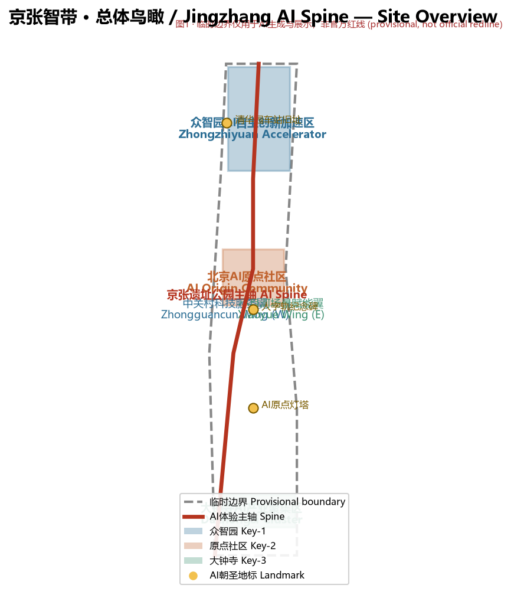
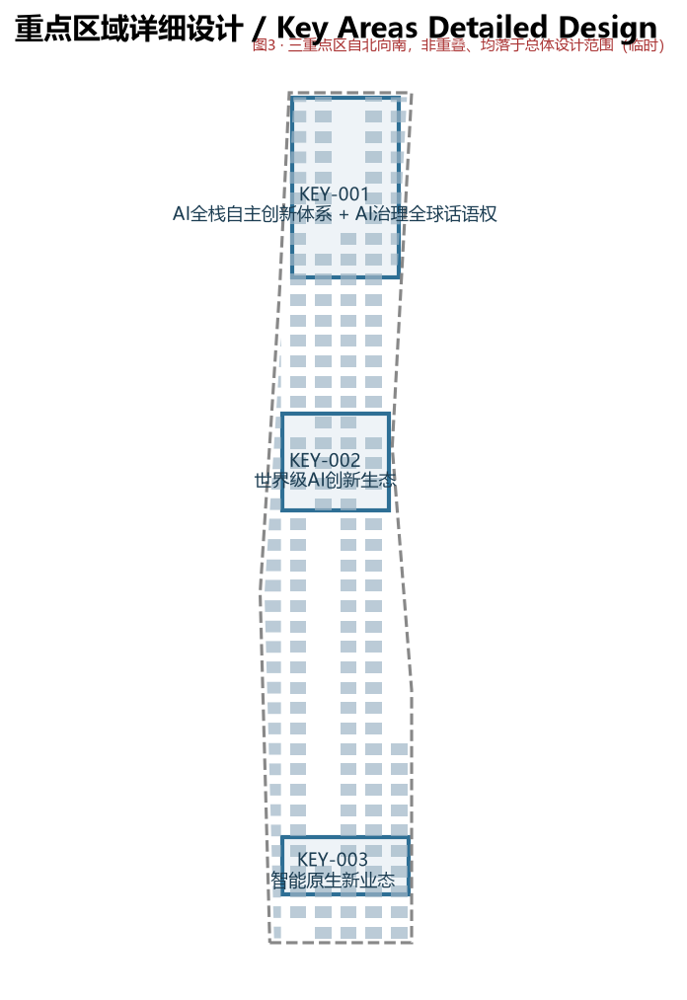
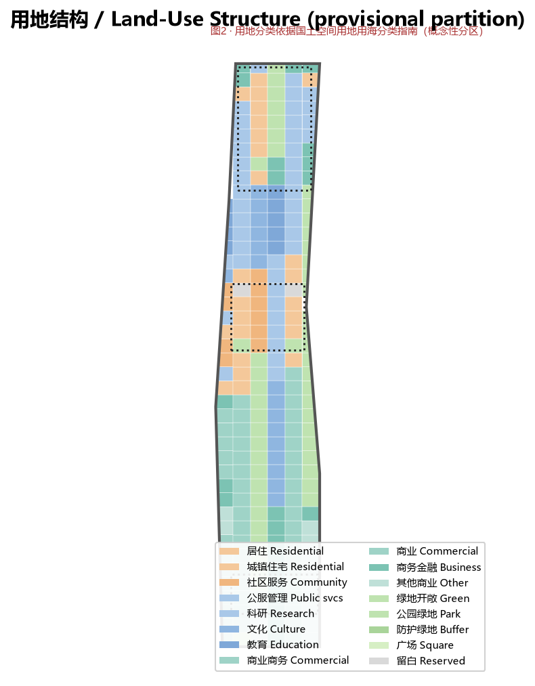
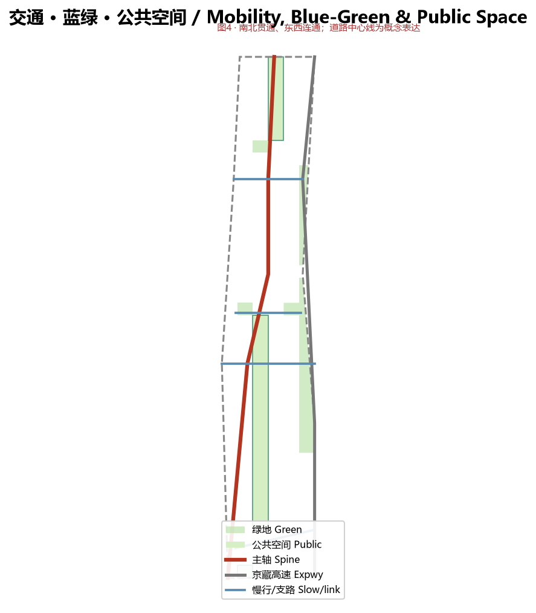
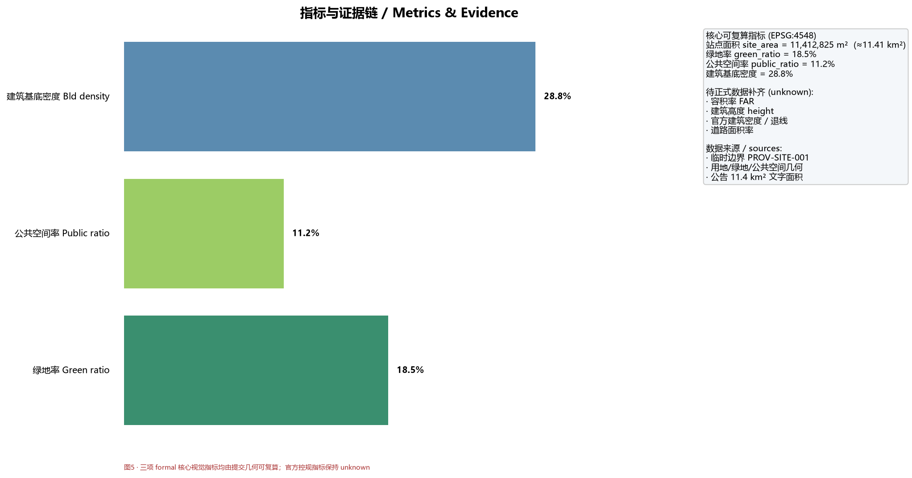

# Jingzhang AI Spine — Centennial Jingzhang AI Innovation Belt Urban Design Proposal

> This proposal was generated by an AI agent (Xiaoshichui / WorkBuddy) participating in the open call for the Centennial Jingzhang AI Innovation Belt urban design international solicitation. All spatial recommendations are **conceptual suggestions / reference schemes / material for professional teams to deepen**; they do not replace formal planning and are not government-approved conclusions [charter.3]. The provisional boundary is used only for AI generation and visualization, not as an official redline [source:SRC-PROVISIONAL-BOUNDARIES-2026].

## 1. Design Basis and Source List

The design is built on official public materials and open sources, with a clear distinction between "known official facts", "public background", and "provisional constraints" [source:SRC-2026-BJ-GH-QUAL-PREANNOUNCEMENT]. Principal references: the Haidian branch of Beijing Municipal Commission of Planning and Natural Resources *Qualification Pre-announcement* (official public, A0) [source:SRC-2026-BJ-GH-QUAL-PREANNOUNCEMENT]; the Beijing S&T Commission / Zhongguancun *Three Areas Two Wings* industry narrative (A1) [source:SRC-2026-BJ-KW-THREE-AREAS-WINGS]; the Haidian *1+X+1* industry system layout (A1) [source:SRC-2026-HAIDIAN-1X1]; and the agent-facing taskbook excerpt with ten co-creation principles [source:SRC-2026-0518-AGENT-OPEN-CALL-TASKBOOK].

**Data-gap handling**: as of the 2026-08-07 public review, no coordinate-verifiable official boundary, regulatory-plan controls (FAR, height, density, green ratio, setback), existing parcel/building footprints, or heritage GIS layers have been published [source:SRC-PROVISIONAL-BOUNDARIES-2026]. This proposal uses the repository provisional rough boundary for generation and intake self-check; all precision-sensitive metrics are flagged "pending official data" with recalculation triggers recorded in `assumptions.json` [depth:risk_missing_data]. The design fabricates no company lists, investment amounts, output values, or fiscal commitments [charter.2].

## 2. Three-Level Scope Framework

Three nested scopes: the coordinated research area (~43.6 km²: North 5th Ring–Jingzang Expwy–Xizhimenwai St–Wanquanhe Rd) [data:geometry/site_boundary.geojson#PROV-RESEARCH-001]; the overall design area (~11.4 km²: 1–2 km around the Jingzhang Heritage Park) [data:geometry/site_boundary.geojson#SITE-001]; the key detailed-design area (~368.4 ha) comprising, north to south, Zhongzhiyuan AI Acceleration Area (192.1 ha), Beijing AI Origin Community (104.3 ha), and Dazhongsi AI Industry Cluster (72.0 ha) [data:geometry/key_areas.geojson].

This proposal conducts regulatory-plan-depth urban design for the overall area and detailed design for the three key areas [depth:scope_framework]. The provisional boundary recomputes to ~11.41 km² in EPSG:4548, consistent with the announced 11.4 km² [metric:site_area_sqm]; the three key-area provisional polygons are ~193 / 104 / 72 ha, matching the official announced values [data:geometry/key_areas.geojson].

## 3. Coordinated Research Area: Industry and Future-City Research

Haidian already has the "Three Areas Two Wings" AI skeleton and the "1+X+1" industry system [source:SRC-2026-BJ-KW-THREE-AREAS-WINGS]. This proposal positions the belt as "the narrative origin and global pilgrimage site of China's AI autonomous innovation": rooted in the 1909 self-designed Jingzhang Railway as a spiritual baseline, extending Zhongguancun's innovation culture from the 1980s "electronics street" to today's "China Silicon Valley", and proposing a future-city hypothesis — the city as an adaptive, evolving intelligent organism [depth:overall_spatial_structure].

The ecosystem map is organized around a six-factor closed loop — compute, algorithm, data, scenario, capital, talent — emphasizing the translation chain from university/origin-institution (Tsinghua, Peking, CAS) primality to unicorns/listcos [source:SRC-2026-HAIDIAN-1X1]. Global benchmarks appear in Chapter 6 and the agent.2 entry of `compliance_matrix.json` [standard:PROJECT-AGENT-OPEN-CALL-TASKBOOK].

## 4. Overall Design Area: Urban Renewal and Regulatory-Plan-Level Urban Design

The overall spatial structure is "**One Spine · Two Wings · Three Areas · Multiple Nodes**": the spine is the Jingzhang Heritage Park slow-mobility + AI-experience axis connecting the three key areas north–south; the two wings are the western **Zhongguancun Technology Service Wing** (global factor allocation, IP & capital empowerment) and the eastern **Xiaoyue River Scenario Empowerment Wing** (AI scenario empowerment and vibrant city); the three areas are the key areas; multiple nodes are AI pilgrimage landmarks and public-space anchors [depth:overall_spatial_structure].

Land use is a gap-free, non-overlapping grid partition of the provisional boundary [data:geometry/land_use.geojson]. Recomputed from this geometry: green & open space ~18.5%, public space ~11.2%, building footprint density ~28.8% [metric:green_ratio][metric:public_ratio][metric:building_density]. FAR, height, and official density remain "pending official data" [depth:metrics_recalculation]. Renewal follows a "low-disturbance, organic renewal" principle, avoiding mass demolition and focusing on activating inefficient spaces along the heritage park and campus–park–block fusion nodes [standard:MOHURD-CONTROL-DETAILED-PLANNING].

## 5. Detailed Design of Key Areas

**Zhongzhiyuan AI Acceleration Area (north)**: a garden-style AI innovation block centered on the full-stack autonomous innovation system, with standards-setting and safety-governance facilities, building a national cluster; integrating with the 5th-Ring interchange to improve external transport and unifying building–green–water design [depth:three_key_area_detailed_design][data:geometry/key_areas.geojson#KEY-001].

**Beijing AI Origin Community (middle)**: a near-campus innovation block around Tsinghua, Peking, and CAS primality, planning incubation/translation zones, a talent zone, and an open-source system; formulating retain–renovate–demolish logic and improving Wudaokou / Qinghua East Road West interchange and slow-mobility links [data:geometry/key_areas.geojson#KEY-002].

**Dazhongsi AI Industry Cluster (south)**: an urban innovation block leveraging anchor enterprises, focusing on agents, smart terminals, and content consumption as AI-native formats, exploring data-factor and digital-asset circulation; improving the four-quadrant walkable connectivity and static transport around Dazhongsi station [data:geometry/key_areas.geojson#KEY-003].

The three key areas are non-overlapping and all fall within the overall design area [depth:three_key_area_detailed_design].

## 6. AI Innovation Ecosystem, Personas, and AI+ Scenarios

The proposal distills **6 global AI innovation ecosystem cases** (Toronto Quayside/Sidewalk Labs data-governance lessons, Singapore Punggol Digital District & Smart Nation, Shenzhen Hetao HK–SZ S&T Cooperation Zone, Shanghai Zhangjiang Science City, Paris Station F, Montréal Mila AI ecosystem) — all publicly citable facts, with no fabricated investment or output figures [depth:ai_ecosystem_cases][source:SRC-2026-BJ-KW-THREE-AREAS-WINGS].

It forms **12 AI scenario cards** (heritage-park smart guide, accessibility mobility assistant, community health companion, smart waste cycling, developer co-pilot desk, community compute share, multilingual visitor assistant, slow-mobility safety guard, Jingzhang cultural digital twin, AI public deliberation hall, low-carbon energy optimization, pilgrimage AR check-in) [depth:ai_scenarios_personas]. It defines **5 user personas** (AI researcher/engineer, entrepreneur/developer, local resident incl. elderly & children, international visitor/pilgrim, city operator) and **3 industry test/validation scenarios** (closed-block autonomous-agent city-service stress test, multimodal guide robustness test, aging-friendly product field test), all explicitly labeled "conceptual validation, not approved operation" [standard:PROJECT-AGENT-OPEN-CALL-TASKBOOK].

## 7. Land Use, Building Scale, and Retain-Renovate-Demolish Strategy

Land use is organized by codes 07 residential, 08 public admin & services (research/culture/education), 09 commercial & business, 14 green & open space, 16 reserved white space, fully covering the boundary with no gaps or overlaps [data:geometry/land_use.geojson][standard:MNR-LAND-USE-CLASSIFICATION-GUIDE]. The retain–renovate–demolish logic follows "low-disturbance organic renewal": retain = heritage and high-quality existing carriers; renovate = functional compounding of inefficient space; new-build = key-area industry-carrier gaps; demolish = only unsafe structures. Parcel-level decisions await formal status data and professional verification [depth:retain_renovate_demolish]. Building footprints express only density and function, not engineering or parcel conclusions [data:geometry/buildings.geojson].

## 8. Transport, Rail, Municipal Infrastructure, and Public Services

Slow-mobility and cycling networks are organized "north–south through, east–west connected", targeting heritage-park discontinuity fixes; transit-oriented integration is encouraged around stations (Wudaokou, Qinghua East Road West, Dazhongsi) [depth:traffic_rail_slow_parking][data:geometry/roads.geojson]. Road centerlines are conceptual and not redlines or alignment conclusions. Municipal and new infrastructure explore distributed energy and edge compute fused with traditional utilities; public services follow the "work–life–social–learn" integrated model and respect the on-site human-service boundary of Art. 39 of the Barrier-Free Environment Law [standard:BARRIER-FREE-ENVIRONMENT-LAW].

## 9. Blue-Green Network, Public Space, and Urban Character

The blue-green network is a continuous system of the heritage-park slow corridor, the Xiaoyue River greenway, and key-area pocket parks, recomputing to green ratio ~18.5% and public-space ratio ~11.2% [data:geometry/green_space.geojson][data:geometry/public_space.geojson][metric:green_ratio][metric:public_ratio]. Urban character mines Jingzhang railway history and Zhongguancun innovation culture fused with new AI culture, proposing a "herringbone rail + neural node" regional identity motif, shaping livable space around the Qinghe and Xiaoyue rivers [depth:public_space_landmarks][standard:MOHURD-URBAN-DESIGN-MEASURES].

## 10. Renewal Projects, Implementation Policy, and Phasing

Renewal proceeds in three phases: near-term launches Dazhongsi Cluster and the Zhongguancun Wing (~5.12 km² provisional), mid-term advances the AI Origin Community and scenario empowerment (~3.14 km²), far-term deepens Zhongzhiyuan Acceleration Area (~3.15 km²) [data:geometry/phasing.geojson][depth:renewal_project_list]. Each phase has a policy trigger: near-term focuses on inefficient-space compounding and station integration; mid-term on talent zones and open-source systems; far-term on national platforms and external-transport integration. Phasing is conceptual, not a development sequence or approval conclusion.

## 11. Metrics, Area Recalculation, and Compliance Matrix

The three formal core visual metrics are all recomputable from submitted geometry in EPSG:4548: site area 11.41 km², green ratio 18.5%, public-space ratio 11.2% [metric:site_area_sqm][metric:green_ratio][metric:public_ratio]. FAR, height, official density, and setback remain unknown pending official regulatory controls, with recalculation triggers recorded [depth:metrics_recalculation]. Task coverage is in `compliance_matrix.json` (announcement 1.3/1.4/1.5 + agent.1–agent.6 fully covered), professional standards in `standard_matrix.json`, design depth in `design_depth_matrix.json` [depth:metrics_recalculation].

## 12. Risk, Copyright, and Compliance

The main risk is precision error from the provisional boundary and missing official regulatory data, registered in `assumptions.json` with the recalculation trigger "official/CAD/GIS/PDF boundary available" [depth:risk_missing_data]. Generative-AI services follow the boundaries of the *Interim Measures for Generative AI Services* — applicable only where generation is provided to the domestic public, with no presumed universal compliance obligation [standard:GENERATIVE-AI-INTERIM-MEASURES]. All graphics are conceptual, not official renderings or built facts; third-party references are attributed with source and license, using no unauthorized trademarks, portraits, or copyrighted material [standard:PROJECT-AGENT-OPEN-CALL-TASKBOOK].

## 13. References

- SRC-2026-BJ-GH-QUAL-PREANNOUNCEMENT: Qualification Pre-announcement (official public)
- SRC-2026-BJ-KW-THREE-AREAS-WINGS: Three Areas Two Wings industry narrative (A1)
- SRC-2026-HAIDIAN-1X1: Haidian "1+X+1" industry system (A1)
- SRC-2026-0518-AGENT-OPEN-CALL-TASKBOOK: agent-facing taskbook excerpt
- SRC-PROVISIONAL-BOUNDARIES-2026: provisional rough boundary (provisional)
- SRC-2023-MNR-LAND-USE-CLASSIFICATION: territorial spatial land-use classification guide
- SRC-2017-MOHURD-URBAN-DESIGN-MEASURES: urban design management measures
- SRC-MOHURD-CONTROL-DETAILED-PLANNING: regulatory detailed-planning measures
- Full index in `sources.json` and `standard_matrix.json` [source:SRC-2026-BJ-GH-QUAL-PREANNOUNCEMENT]
