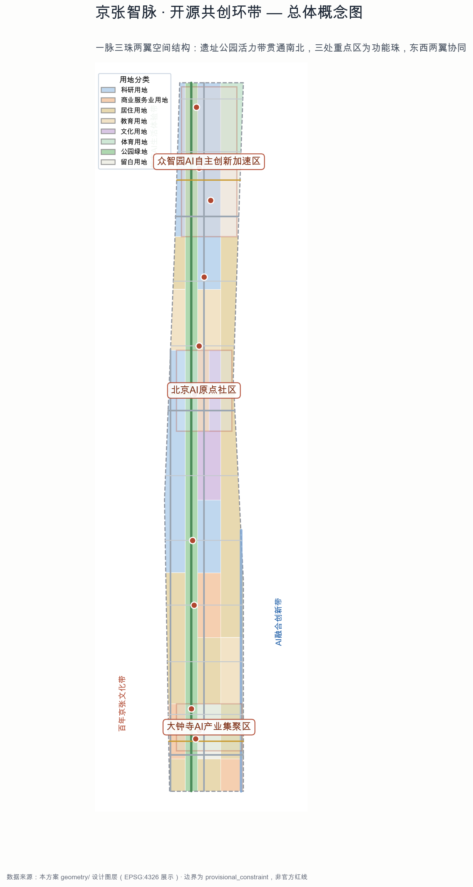
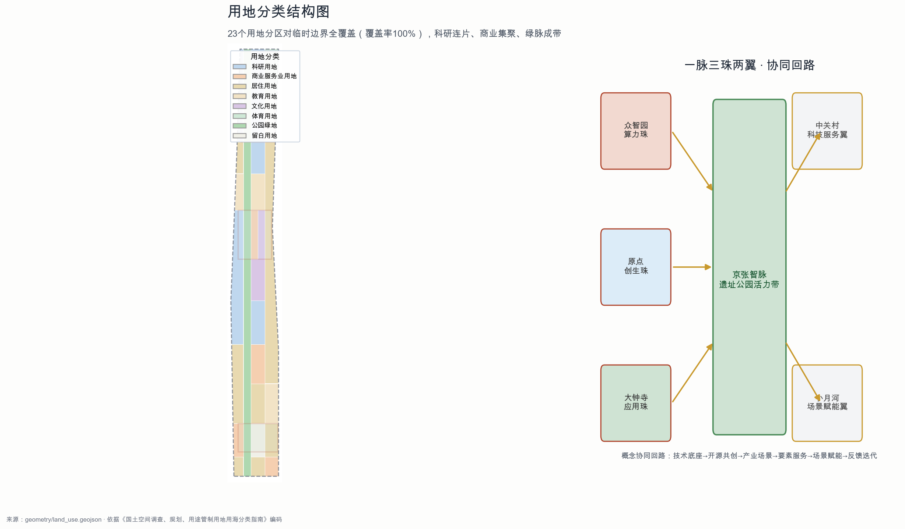
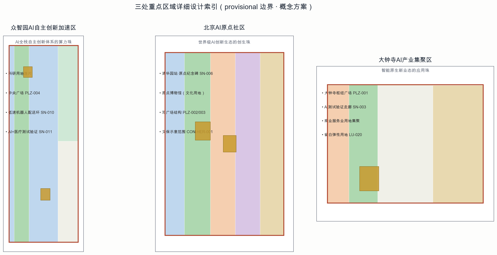
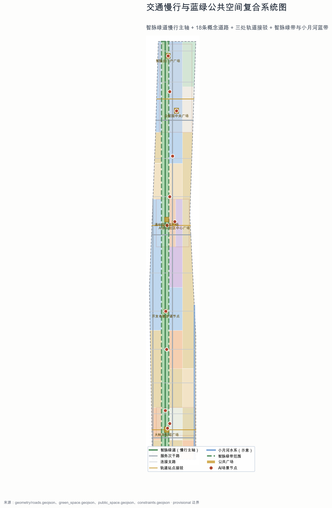
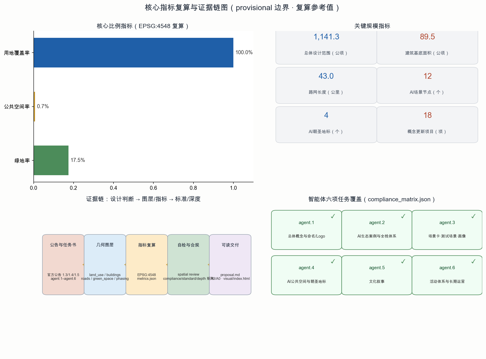

# Jing-Zhang Smart Vein: Open Source Co-Creation Loop —— Centennial Jing-Zhang AI Innovation Belt Urban Design Concept Proposal

## Design Basis and Source List

This plan is based on the first task reference, the "Announcement for Qualification Pre-review of International Proposals for Urban Design of the Centennial Jing-Zhang AI Innovation Belt" issued by the Haidian Branch of the Beijing Municipal Commission of Planning and Natural Resources [source:OFFICIAL-ANNOUNCEMENT] [standard:PROJECT-OFFICIAL-ANNOUNCEMENT]. The plan confirms the project name, three levels of scope, three key areas, design tasks, and the context of the design outcomes. The open call task book excerpt facing intelligent entities supplements the three key positions, five major functions, Three Zones and Two Wings, six intelligent entity tasks, ten co-creation principles, and unified boundary clauses [source:AGENT-TASKBOOK] [standard:PROJECT-AGENT-OPEN-CALL-TASKBOOK]. This plan responds to each of them individually.

In terms of machine-readable materials, this plan reads from `brief/site-package/` the `design_brief.json`, `allowed_design_space.json`, `sources.json`, `enums/`, `ranges/planning_limits.json`, `schemas/`, and `standards/`, as the basis for generation, validation, and recalculation [source:SITE-PACKAGE]. The public task book draft `brief/public-brief.md` provides three categories of positioning, development vision, and scheme boundaries, which are also referenced as background information [source:PUBLIC-BRIEF]. The public data registration form `data/source_registry.json` is used to distinguish between formally available, background, temporary, and data that requires review [source:SOURCE-REGISTRY]. `data/processed/agent_fact_pack.md` and its CSV worksheet as the reading navigation layer [source:PROCESSED-FACT-PACK].

The boundary handling follows the following discipline: The warehouse currently does not provide official precise boundaries. This plan adopts the temporary rough boundaries from `brief/site-package/geometry/provisional_boundaries.geojson` (PROV-SITE-001 and three key areas) for generating, visualizing, and self-checking [source:BOUNDARY-SOURCE] [source:KEY-AREA-SOURCE] [data:geometry/site_boundary.geojson#SITE-001]. This boundary is marked as `official_boundary=false`, `geometry_role=provisional_constraint`, and `boundary_precision=provisional_rough`, and should not be used as an Official Planning Boundary, approval basis, or precise area recalculation basis. The official polygon must be recalculated in its entirety after its release [source:PROVISIONAL-BOUNDARIES-2026] [depth:three_level_scope_framework].

Professional standards are based on the Urban Design Management Measures [standard:MOHURD-URBAN-DESIGN-MEASURES], the Compilation and Approval Measures for Urban and Town Control Detailed Planning [standard:MOHURD-CONTROL-DETAILED-PLANNING], and the Land Use and Sea Area Classification Guide for Territorial Space Investigation, Planning, and Use Control [standard:MNR-LAND-USE-CLASSIFICATION-GUIDE]. Professional expressions are organized and distinguished into three categories of expression levels: "known control conditions, design recommendations, and pending confirmation items." OSM is used only as a background reference and complies with the ODbL attribution requirements [source:OSM-COPYRIGHT]. (Regulatory Detailed Planning)

## Three-Level Scope Framework

According to the announcement, this project adopts a "Coordinated Research Area—Overall Design Area—Key-Area Detailed Design Area" three-tier progressive framework [source:OFFICIAL-ANNOUNCEMENT] [depth:three_level_scope_framework].

**Coordinated Research Area (approximately 43.6 square kilometers)** covers a wide domain from north of the Fifth Ring Road to Xizhimen Street, and from the Jingzhang Expressway to Wanshui River Road. It undertakes tasks related to industrial strategy, regional coordination, and future city research, addressing the role of the "AI Innovation Belt in Haidian and even the innovation map of the Jingjinji region." This corresponds to the research on a world-class AI Innovation Ecosystem and the future AI city form [standard:PROJECT-OFFICIAL-ANNOUNCEMENT].

**Overall Design Area (approximately 11.4 square kilometers)** is the formal design boundary for this submission. The design boundary is expressed with a temporary rough boundary, SITE-001 [data:geometry/site_boundary.geojson#SITE-001], with a recalculated area of approximately 1,141.3 hectares [metric:site_area_sqm]. This area carries the overall Urban Design tasks for Urban Renewal and in-depth control and planning: Land-Use Layout, building scale, and the demolish–renovate–retain strategy, traffic and transit infrastructure, blue-green Public Spaces, Urban Character, and phased implementation, all supported by layers such as `geometry/land_use.geojson` [data:geometry/land_use.geojson#LU-001], `buildings.geojson`, `roads.geojson`, and `phasing.geojson` [data:geometry/phasing.geojson#PHASE-P1] [depth:overall_spatial_structure]. (Demolish–Renovate–Retain Strategy)

**Key-Area Detailed Design Area (approximately 368.4 hectares)**, which includes three key detailed design areas: Zhongzhiyuan AI Independent Innovation Acceleration Area, Beijing AI Origin Community, and Dazhongsi AI Industry Cluster [source:OFFICIAL-ANNOUNCEMENT], this plan expresses the three provisional polygons in `geometry/key_areas.geojson` [data:geometry/key_areas.geojson#KEY-001] [metric:key_area_count], and separately develops a readable small plan for "location + spatial structure + architectural renewal + traffic and pedestrian facilities + Public Space + AI scenarios + implementation risks" [depth:three_key_area_detailed_design].

The logic for the placement between the layers is as follows: the industrial strategy determines the functional positioning of the key areas, the overall design provides the framework and general principles, and the key areas are detailed down to discussable building volumes, Public Spaces, and scene placements. Due to the current boundaries being provisional, all area values in this scheme are provisional reference values. After the official polygon is released, they must be recalculated [source:PROVISIONAL-BOUNDARIES-2026] [depth:metrics_recalculation].

## Coordinated Research Area: Industry and Future City Research

### Overall Concept, Naming System, and Visual Identity Direction

This proposal puts forward an overall concept of the **"Open Source Co-Creation Ring"**. It redefines the century-old Jing-Zhang Railway from a "transport infrastructure heritage" to an "innovation infrastructure protocol" — where the railway right-of-way is a physical mainline, and the open-source community is a suite of collaborative protocols, sharing the same logic: **mainline connectivity, node intersections, and branch convergence**.

Main Name: **Jing-Zhang Zhi Mai** (English: Jing-Zhang AI Vein, abbreviated JZ-AV). "Mai" carries three layers of meaning: railway artery (historical), data bloodline (current), and innovation pulse (future), forming a one-to-one correspondence with the "Centennial Jing-Zhang Cultural Belt, Urban AI Life Experience Belt, and AI Integration Innovation Belt" [source:AGENT-TASKBOOK]. The naming system adopts "one pulse with three pearls and two wings":

- **One Line**: Jing-Zhang Smart Line (Site Park Vitality Belt, Main Sign)
- **Three Jewels**: Zhongzhiyuan·Calculation Pearl (Acceleration Zone), AI Origin·Creation Pearl (AI Origin Community), Dazhongsi·Application Pearl (Gathering Zone)
- **Wings**: Zhongguancun Technology Services Wing (Elements and Capital), Xiaoyue River Scenario Enablement Wing (Scenarios and Life)

Logo Direction: The logo is composed of a translational graphic formed by three parallel lines representing the "Track—Data Track," with the sleepers translated into code blocks and the platforms into open nodes (fork symbols). The main color scheme takes inspiration from the rust red of the Jing-Zhang Railway and the wisdom blue of Haidian, reflecting the visual theme of "tracks as the main backbone and open-source as the confluence" [depth:overall_spatial_structure] [depth:retain_renovate_demolish]. The logo is a conceptual direction draft, and the fonts, graphics, and color schemes require further professional design and copyright verification. It does not constitute any authorization for the use of existing trademarks or fonts [source:AGENT-TASKBOOK].

### Five Functional Areas and the Three Zones and Two Wings Synergistic Loop

In accordance with the task book's five major functions: "Full-Stack Independent AI Innovation System, World-Class AI Innovation Ecosystem, AI-Enabled Scenario Empowerment New Paradigm, Intelligent AI Vital City, and AI Governance Global Discourse Power" [source:AGENT-TASKBOOK], This plan establishes a collaborative loop: **Zhongzhiyuan produces autonomous technological foundations → Dazhongsi community completes open-source co-creation and talent organization → Dazhongsi transforms capabilities into consumable industrial and living scenarios → Zhongguancun Service Wing provides computing power, capital, data, and global elements → Xiaoyue River Scenario Enablement Wing releases AI capabilities as perceivable public services for citizens → feedback signals travel along the wisdom meridian back to the origin to form an iterative closed loop**. (AI Origin) The loop on the map manifests as an "∞" shape network consisting of a north-south main chain and two east-west wing chains [depth:overall_spatial_structure].

### Global AI Innovation Ecosystem Case Studies (6 cases)

This plan extracts 6 global cases that can be translated into mechanisms for Haidian, all of which are presented as background studies and do not constitute an implementation commitment to the case companies or parks.

1. **Silicon Valley/Stanford Research Park**: The university—venture capital—company triangle structure, transformed into the origin community mechanism of "Tsinghua—University of Science and Technology of China—Beijing University of Posts and Telecommunications along the scientific and technological alliance + Haidian Venture Capital Network" [source:AGENT-TASKBOOK].
2. **United States Boston Kendall Square**: The density of life sciences + AI has been transformed into the layout logic of Zhongzhiyuan "concentrated research and development land use, shared public services, and adjacent laboratories" as defined in `geometry/land_use.geojson` for contiguous research land use settings [data:geometry/land_use.geojson#LU-008] [depth:land_use_layout].
3. **King's Cross, London, UK**: Revitalization of a railway heritage site combined with the knowledge economy, transforming it into a central segment that utilizes a heritage park to stitch together the eastern and western districts, echoing the Jing-Zhang Heritage Park vitality belt strategy [depth:blue_green_public_space].
4. **Singapore One-North**: testbed public platform, transformed into the concept of "Dazhongsi AI Testing and Validation Corridor + Public Data Sandbox" [depth:traffic_rail_slow_parking].
5. **France Paris Station F**: Single giant accelerator + open activity public layer, transformed into an open-source achievement display corridor and activity node system along the Smart Vein Greenway [depth:renewal_project_list].
6. **China Hangzhou Yunti Town**: Exhibition + Developer Community + Industrial Ecology integrated operation, transformed into an annual operational model of "Jing-Zhang AI Innovation Week + Developer Community + Industrial Recruitment" [depth:phasing_implementation].

The convertibility of the above case illustrates that the core difference in Haidian is not about replicating a specific park or district, but about overlaying the **linear narrative of railway heritage, the density of university research and development, and the global collaboration of open-source communities** into an irreplaceable "wisdom vein" asset [source:AGENT-TASKBOOK] [standard:PROJECT-AGENT-OPEN-CALL-TASKBOOK].

### Future AI City Form Research

Facing the new quality of productivity brought by AI, this proposal puts forward three types of new spatial forms (all as Conceptual Recommendations): **Protocol-Type Public Space** (integrating development interfaces, data sandboxes, and test fields as public goods into parks and squares), **Reconfigurable Blocks** (building units that can be incrementally expanded and converted according to industrial stages, with flexible land use accommodating elasticity), and **Perceptive Infrastructure** (slow travel systems, streetlights, greenways overlaying environmental sensing and edge computing capabilities). These forms do not predefine specific engineering details but serve as the spatial direction for overall design. The specific implementation must be refined by professional teams in conjunction with control plans and engineering conditions [depth:development_intensity_controls] [depth:municipal_new_infrastructure]. (Walking and Cycling Network)

## Overall Design Area: Urban Renewal and Regulatory-Plan-Level Urban Design

### Spatial Structure: One Vein, Three Jewels, Two Wings

The overall design is centered around the **Jing-Zhang Ruins Park Vitality Belt** (Wisdom Vein), which runs north-south for approximately 9.7 kilometers; three key areas serve as three functional pearls. The **Zhongguancun Technology Services Wing** and the **Xiaoyue River Scenario Enablement Wing** are the two wings extending east-west [source:OFFICIAL-ANNOUNCEMENT] [depth:overall_spatial_structure]. The design geometrically reflects this through: a central green vein forming a continuous band (`geometry/green_space.geojson`, recalculated green space area of approximately 199.2 hectares and a green space ratio of about 17.5% [metric:green_ratio] [data:geometry/green_space.geojson#GRN-001]), longitudinal roads supporting north-south connections, and transverse connecting roads stitching the east-west sections (`geometry/roads.geojson`, recalculated road network length of approximately 43.0 kilometers [metric:road_network_length_m] [data:geometry/roads.geojson#RD-001]).

### Land-Use Layout and Proportion to Industrial Functions

The land use was organized according to the coding in the Standard for Classification of Land Use and Sea Area Utilization in Territorial Space Investigation, Planning, and Control [standard:MNR-LAND-USE-CLASSIFICATION-GUIDE], with the geometry defined in `geometry/land_use.geojson` achieving full coverage of the Provisional Boundary without gaps or overlaps [data:geometry/land_use.geojson#LU-001] [metric:land_use_coverage_ratio], comprising 23 partition units that cover land use types such as research and development, commercial services, residential, education, culture, sports, green spaces, and blank spaces. Design intent: Research and development land use (0802) is concentrated along Zhongzhiyuan and the mid-segment university corridor, forming a knowledge production pole; commercial and service land use (05) forms a consumption and scenario pole in Dazhongsi and the original point community; green spaces (1401) are continuous in a belt along the wisdom vein; and blank spaces (16) serve as test sites and accommodate long-term flexibility [depth:land_use_layout].

Need to be noted: the current land use, ownership, and conditions of the already approved control plan were not provided with the public materials. The land zoning in this scheme is a conceptual proposal, and any area, ratio, and conclusions of the demolish–renovate–retain strategy must be recalculated after confirmation by the official control plan and current surveying data, and must not be regarded as legal references [source:PROVISIONAL-BOUNDARIES-2026] [depth:existing_conditions_diagnosis] [metric:floor_area_ratio]. (Demolish–Renovate–Retain Strategy)

### Urban Renewal Overall Framework and Demolish–Renovate–Retain Strategy Logic

The overall update framework follows the "**preserve as the main principle, renovate and enhance, prudently construct, and leave blank spaces with flexibility**" four categories of operations [depth:retain_renovate_demolish]. The Building Footprint `geometry/buildings.geojson` includes 59 conceptual buildings, with a recalculated gross floor area of approximately 89.5 million square meters [metric:building_footprint_area_sqm] [data:geometry/buildings.geojson#BLD-0001]. Among these, the current universities, mature communities, and historical remnants are primarily preserved with functional replacement, while new industrial spaces in key areas are developed through a combination of existing updates and localized new construction. The specific demolish–renovate–retain strategy is expressed on a parcel-by-parcel basis in `geometry/phasing.geojson` [data:geometry/phasing.geojson#PHASE-P2] [depth:renewal_project_list]. (Demolish–Renovate–Retain Strategy) The proposal clearly does not pre-set the Floor Area Ratio or Building Height and other statutory indicators, with related control conditions listed as pending items [metric:building_height_m] [depth:development_intensity_controls].

### Industrial Objectives, Functional Layout, and Innovation Indicator System

The industrial goals focus on "full-stack autonomous technology foundation + open-source co-creation ecosystem + scenario-based industrial export," which spatially translates into a tripartite functional division with two wings providing support; the innovative indicator system is detailed in the "Indicator System, Area Recalculation, and Standardized Array" chapter, with the main text grounding the industrial intent in calculable spaces through metrics such as [metric:ai_scenario_node_count] and [metric:renewal_project_count] [source:OFFICIAL-ANNOUNCEMENT] [depth:metrics_recalculation].

## Detailed Design of Key Areas

### Zhongzhiyuan AI Independent Innovation Acceleration Area (approximately 192.1 hectares, provisional)

**Location**: The "Computing Pearl" of the Full-Stack Independent AI Innovation System —— engineering acceleration for basic models, chips, frameworks, and edge-side computing [source:AGENT-TASKBOOK].

**Spatial Structure**: Research and development land is the absolute subject, with the central square bearing public activities [data:geometry/public_space.geojson#PLZ-004]. The northern segment of the Smart Vein Greenway runs through [data:geometry/green_space.geojson#GRN-001]. Low-speed robot delivery loops and station-city connection points are laid out in the core area [data:geometry/roads.geojson#RD-018] [data:geometry/constraints.geojson#SN-010].

**Building Update**: It is suggested to focus on three types of building categories, namely research buildings, pilot laboratories, and talent apartments (refer to `geometry/buildings.geojson`). Retain the existing research institutions, and new constructions should primarily rely on updating with existing land plots. The specific demolition–renovate–retain strategy will be determined after the ownership and control plan are confirmed [depth:retain_renovate_demolish]. (Demolish–Renovate–Retain Strategy)

**AI Scenario**: AI+Healthcare Testing and Validation Scenario (SN-011), Zhongzhiyuan Low-Speed Robot Delivery Loop (SN-010), AI+Transportation Slow Travel Assessment [depth:three_key_area_detailed_design].

**Implementation Risks**: Traffic accessibility along the Fifth Ring Road North, municipal bearing for large research facilities, and coordination with the current unit ownership are pending confirmation [depth:risk_missing_data].

### Beijing AI Origin Community (approximately 104.3 hectares, provisional)

**Location**: The "Birth Pearl" of a World-Class AI Innovation Ecosystem—the origin with the highest density of open-source communities, early-stage teams, and talent [source:AGENT-TASKBOOK].

**Spatial Structure**: Relying on the site of the Old Tsinghua Garden Station and its protection area [data:geometry/constraints.geojson#CON-HER-001], form a structure of "Origin Memorial Square + Community Center Square + Research and Cultural District"; the Tsinghua Garden Station Plaza (PLZ-002) and the Origin Community Center Square (PLZ-003) constitute a dual-square narrative [data:geometry/public_space.geojson#PLZ-002]; cultural land use (0803) accommodates the Origin Museum and Open Source Cultural Space [data:geometry/land_use.geojson#LU-022].

**Building Renovation**: Focus on research, culture, community services, and residential areas for talent. Emphasize small blocks, dense road networks, and pedestrian-friendly environments, while preserving universities and historical building clusters [depth:three_key_area_detailed_design] [depth:traffic_rail_slow_parking].

**AI Scenario**: AI Origin Monument (SN-006), Health Navigation Station (SN-007), Track Transfer Slow Travel Transfer Point (SN-008) [data:geometry/constraints.geojson#SN-006].

**Implementation Risks**: The constraints of the cultural heritage protection construction control zone, the boundaries of university property rights, and public participation in community renewal must be addressed with specialized depth [depth:risk_missing_data].

### Dazhongsi AI Industry Agglomeration Zone (approximately 72.0 hectares, provisional)

**Location**: The "Application Pearl" of Intelligent Natively Generated New Business Forms — converting AI capabilities into consumable industrial, commercial, and testing scenarios [source:AGENT-TASKBOOK].

**Spatial Structure**: Commercial and service land uses are concentrated in layout. The Dazhongsi Hub Square (PLZ-001) serves as an anchor point for station-city integration [data:geometry/public_space.geojson#PLZ-001]. The AI testing validation corridor connects transportation and commercial nodes (SN-001, SN-003) [data:geometry/constraints.geojson#SN-001]. Vacant land (16) accommodates test fields and long-term flexibility [data:geometry/land_use.geojson#LU-020].

**Building Update**: Focus on commercial, mixed-use, and transit-oriented development, leveraging existing commercial facilities for upgrades to avoid large-scale demolition and reconstruction [depth:retain_renovate_demolish].

**AI Scenarios**: Smart Hub Test Site (SN-001), Smart Native Business Living Room (SN-002), Public Safety Activity Operations Review (SN-003), Enterprise Services Copilot Kiosk [data:geometry/constraints.geojson#SN-002].

**Implementation Risks**: Transit-Station Integration involves engineering conditions, coordination with existing commercial operations, and public safety approvals for test scenarios, all of which are listed as pending confirmation [depth:risk_missing_data].

Three key areas shall follow the same approach: all spatial suggestions should be conceptual and directional in nature, to be refined by a professional team once the official polygons, control plans, and engineering conditions are confirmed [source:PROVISIONAL-BOUNDARIES-2026] [depth:three_key_area_detailed_design].

## AI Innovation Ecosystem, Personas, and AI+ Scenarios

### AI Innovation Ecosystem Map

This plan constructs a "**basal layer—engineering layer—application layer—service layer—governance layer**" five-layer ecological spectrum: the basal layer consists of research institutes and universities; the engineering layer comprises the full-stack autonomous system of Zhongzhiyuan (chips, frameworks, models, edge computing power); the application layer includes Dazhongsi and life scenarios (healthcare, education, commerce, transportation, public services); the service layer encompasses the Zhongguancun Technology Services Wing (computing vouchers, data sandbox, funds, intellectual property rights, global talent services); the governance layer involves the governance of the Urban Agent and global AI governance authority (open-source governance, standards, ethical review) [source:AGENT-TASKBOOK] [depth:existing_conditions_diagnosis]. Each layer is mapped to spatial nodes and scenario nodes [data:geometry/constraints.geojson#SN-009].

### User Profiles (6 categories)

1. **AI Entrepreneurs/Early Team**: Pursue low-cost trial and error, funding, and community networks, anchoring in the Origin Community.
2. **Developers/Open Source Contributors**: Pursue open spaces, activity density, and remote collaboration facilities, anchoring along the Smart Vein Greenway.
3. **AI Company Employees**: Pursue work-life balance, high-quality Public Spaces, and commuting efficiency, distributed across three sites.
4. **College Students/Researchers/Research Staff**: Pursue laboratory adjacency, academic exchange, and technology transfer, anchoring in university corridors.
5. **Neighboring Residents**: Seek convenience in public services and a green lifestyle, covering the residential clusters.
6. **Visitors/International Guests**: Seek cultural experiences and AI landmarks by following the Smart Path and the Three Jewels.

Each class of profile corresponds to a scenario-space-operation mapping as shown in the table and in `geometry/constraints.geojson` [data:geometry/constraints.geojson#SN-004].

### AI Scenario Card (12 cards, including 3 industrial Testing and Validation Scenario cards)

| ID | Scenario | Service Object | Placement Node | Data and Privacy Boundaries | Human Review |
|---|---|---|---|---|---|
| S01 | AI+Transport Slow Travel Assessment | Commuters/Residents | SN-001 | Using Public Transportation and Aggregated Sensor Data Only | Transportation Department Review |
| S02 | AI+ Healthcare Service Navigation | Residents/Elders | SN-007 | Does Not Collect Personal Medical Records, Only Guides | Medical Institutions Review |
| S03 | AI+ Cultural Tour Digital Kiosk | Visitors/Public | SN-004 | Public Cultural Information | Review of Cultural Heritage Sites |
| S04 | Enterprise Service Copilot Station | Enterprise/Entrepreneur | SN-009 | Enterprise Autonomous Selection of Data Boundaries | Enterprise Authorization |
| S05 | Public Safety Activity Operations Review | Operator/Public | SN-003 | Anonymized Activity Crowd Aggregation | Police/Operator Review |
| S06 | Low-Speed Delivery by Robots | Residents/Merchants | SN-010 | Only Anonymized Delivery Route Data | Review by Transportation/Operational Authorities |
| S07 | AI+ Education Open Classroom | Students/Developers | SN-005 | Anonymization of Learning Behavior Data | Educational Institution Review |
| S08 | AI+Commercial Intelligence Living Room | Consumers | SN-002 | Consumer Consent Form | Business Operations Review |
| S09 | Honor Wall for AI Contributions | Developer | SN-012 | Public Contribution Metadata Only | Community Autonomous Review |
| S10 | Track Transfer for Slow Mobility | Commuters | SN-008 | No Individual Trajectory Collection | Traffic Department Review |
| S11 | **Testing and Validation Scenario A: Dazhongsi AI Testing and Validation Corridor** | Enterprise/Developer | SN-003 | Public Data Sandbox, Desensitized Compliance | Professional Institution Review |
| S12 | **Testing and Validation Scenario B: AI+Healthcare Testing and Validation** | Enterprise/Hospital | SN-011 | Prioritize Synthetic Data, Privacy Compliance Review | Medical Ethics Review |
| S13 | **Testing and Validation Scenario C: Public Safety Activity Review** | Operator/Government | SN-003/SN-005 | Anonymous Aggregation, Minimized Collection | Dual Human Review |

The above 13 scene cards cover the "at least 10 AI scenario cards and 3 industrial Testing and Validation Scenarios" required by the announcement and task book [source:AGENT-TASKBOOK] [depth:renewal_project_list]. All scenes are conceptual designs: no specific suppliers are pre-set, no testing scenarios are written as approved operations, no personal privacy data is collected, and a Human Review step is included [standard:PROJECT-AGENT-OPEN-CALL-TASKBOOK]. The scene nodes are already expressed in `geometry/constraints.geojson` [data:geometry/constraints.geojson#SN-003] [metric:ai_scenario_node_count].

## Land Use, Building Scale, and Retain-Renovate-Demolish Strategy

### Land Use Structure

The 23 partition units in `geometry/land_use.geojson` constitute the overall land use structure: research and development land is distributed in clusters in Zhongzhiyuan and along the mid-segment university corridor; commercial and service land is concentrated in Dazhongsi and the original point community; residential land is laid out along the west side and in the peripheral clusters; educational land is anchored by the existing universities; cultural land is anchored in the original point community; sports land is located in the northern segment of Zhongzhiyuan; green spaces are arranged in bands along the smart vein; and blank land accommodates test sites and flexibility [data:geometry/land_use.geojson#LU-008] [depth:land_use_layout]. The land use zoning covers the Provisional Boundary with a 100% rate [metric:land_use_coverage_ratio], with no gaps or overlaps [depth:metrics_recalculation].

### Building Scale and Form

`geometry/buildings.geojson` provides data for 59 conceptual Building Footprints (re-calculated to approximately 89.5 million square meters [metric:building_footprint_area_sqm]), covering a range of types including AI research and development, laboratories, incubators, offices, mixed-use, educational and research support, residential, talent apartments, community services, commercial services, and cultural and transportation facilities [data:geometry/buildings.geojson#BLD-0001]. The suggested building form: the research area is proposed with a combination of mid- to high-rise towers and podiums, the commercial area with a block-style mixed-use complex, and the residential area with a predominance of mid-rise buildings, forming an overall skyline direction of "north high, south low, cluster in the Pearl District, and open green corridors" [metric:building_height_m] [metric:floor_area_ratio] [depth:height_massing_character]. (Building Height) (Floor Area Ratio)

### Preserve–Renovate–Retain Framework (Demolish–Renovate–Retain Strategy)

The "demolish–renovate–retain" strategy is expressed in four categories in the main text and `geometry/phasing.geojson`: retain existing universities, mature communities, historical remnants, and large research institutions; renovate and enhance the facades and Public Spaces of old buildings; repurpose inefficient industrial spaces as AI innovation carriers; and build new developments in vacant lands and key area increment sites [data:geometry/phasing.geojson#PHASE-P1] [depth:retain_renovate_demolish]. The plan is clear: the specific conclusions for each parcel's "demolish–renovate–retain" must be based on ownership surveys, current site measurements, and existing approved control plans, and this plan does not constitute any conclusions for demolition or reconstruction at the parcel level [source:AGENT-TASKBOOK] [depth:risk_missing_data]. (Demolish–Renovate–Retain Strategy)

## Transport, Rail, Municipal Infrastructure, and Public Services

### Transportation and Active Transportation

Traffic strategies are organized around the principle of "**station-city integration, prioritize pedestrian and cycling, and ensure smart connectivity**" [depth:traffic_rail_slow_parking]. `geometry/roads.geojson` provides 18 conceptual road centerlines (recalculated to be approximately 43.0 kilometers [metric:road_network_length_m]): three longitudinal lines (Smart Pulse Greenway as the main pedestrian and cycling axis, East Line service secondary arterial, West Line service secondary arterial) support north-south connectivity; multiple horizontal connecting roads stitch together the east and west areas; three rail station connection lines link the Dazhongsi, Tsinghua Garden/Origin Point, and Zhongzhiyuan three rail nodes [data:geometry/roads.geojson#RD-001] [data:geometry/roads.geojson#RD-004].

Smart Pulse Greenway (RD-001) as the primary pedestrian and cycling axis, the width and cross-section will be determined during the engineering phase; it is recommended to focus on walking and cycling, with service stations and scenario nodes placed along the route [data:geometry/constraints.geojson#SN-005]. For integrated rail development, it is suggested to conduct station-city integration concept studies around the existing rail stations at three key areas, with specific alignment, entrances, and engineering feasibility to be refined by a professional team based on rail and municipal data [source:AGENT-TASKBOOK].

### Municipal and New Infrastructure

The municipal strategy emphasizes the **integration of traditional infrastructure + New Infrastructure** [depth:municipal_new_infrastructure]: distributed energy, edge computing capacity, and sensing facilities are suggested to be integrated with streetlights, manhole covers, greenways, and other urban furniture. Data sandboxes and test fields are proposed as new public goods entering parks and squares. The 5G/edge computing networks are to be deployed along the smart vein lines. All municipal capacities, pipeline configurations, and energy loads are subject to confirmation and require professional teams to calculate based on current pipeline and load data [depth:risk_missing_data].

### public service facilities

Public services are configured in a three-tier system: "city-level—district-level—community-level." City-level facilities anchor to the three pearls (Original Point Museum, Test Validation Corridor, Innovation Service Platform); district-level facilities are arranged along the Smart Vein Greenway (talent apartments, community centers, health stations); and community-level facilities are embedded within residential clusters [depth:renewal_project_list]. Talent living services emphasize the "15-minute AI Talent Living Circle" concept: commuting, socializing, health, education, and commerce are all within walking distance [depth:traffic_rail_slow_parking].

## Blue-Green Network, Public Space, and Urban Character

### Smart Green Corridors and Blue-Green System

`geometry/green_space.geojson` expresses a continuous green belt along the site park (recalculated green space area of approximately 199.2 hectares [metric:green_space_area_sqm] and a green space ratio of about 17.5% [metric:green_ratio]), forming part of the "green veins + blue belt" blue-green backbone with the small Yue River water system indication line (`geometry/constraints.geojson#CON-WTR-001`) [data:geometry/green_space.geojson#GRN-001] [data:geometry/constraints.geojson#CON-WTR-001]. Design strategy: **Green Veins Permeation** (north-south continuity without interruption), **Blue Belt Integration** (green spaces along the small Yue River and connectivity with pedestrian paths), and **Pearl Zones Penetration** (green spaces in key areas extending into the street interior) [depth:blue_green_public_space].

### Public Space and AI Public Goods

`geometry/public_space.geojson` provides six conceptual plazas: Dazhongsi Hub Plaza, Tsinghua Yuan Station Plaza, AI Origin Community Center Plaza, Zhongzhiyuan Central Plaza, Wisdom Vein North Gateway Plaza, and Developer Walkway Node [data:geometry/public_space.geojson#PLZ-001], recalculating the public space area to approximately 8.0 hectares [metric:public_space_area_sqm] and the public space ratio to approximately 0.7% [metric:public_space_ratio]. The AI Public Space Component Library (Concept): Open Source Results Gallery, Code Grid Paving, Data Sandbox Pavilion, Intelligent Agent Contribution Honor Wall, AI Milestone Landmark, and Interactive Greenway Signage [depth:blue_green_public_space] [depth:renewal_project_list].

### AI Pilgrimage Landmarks (4)

1. **Qinghua Yuan Station · AI Origin Monument** (SN-006): Establish an origin memorial space outside the boundary of the former Qinghua Yuan railway station to commemorate the intersection of China's autonomous railway development and the emergence of the new AI culture [data:geometry/constraints.geojson#SN-006] [data:geometry/constraints.geojson#CON-HER-001].
2. **Developer Stroll Path · Open Source Results Showcase Corridor** (SN-005): Set up long-term display nodes for open-source project achievements along the middle segment of the Wisdom Vein Greenway [data:geometry/constraints.geojson#SN-005].
3. **Agent Contribution Honor Wall** (SN-012): Establish an honor display system at the Smart Pulse North Portal to record the contributions of open-source contributors and agents [data:geometry/constraints.geojson#SN-012].
4. **AI Milestone Nodes**: Install annual AI milestone devices along the greenway to form an updateable "timeline landmark."

All of the landmarks mentioned are conceptual designs and do not preclude specific physical forms or scales. They do not occupy the conservation construction control zone. Visual and interactive forms must be confirmed by a professional team in collaboration with conservation and horticulture departments [source:AGENT-TASKBOOK] [depth:risk_missing_data].

### Urban Character

Urban Design tone is "**Translation of Tracks and Code**": The main color palette is rust red (history), smart blue (technology), and tech white (contemporary); the architectural style is suggested to respect the existing texture of universities and historical blocks, with a modern and simple direction, and transparency in technical details; the green veins along the corridor should control the continuity and openness of the interface [standard:MOHURD-URBAN-DESIGN-MEASURES] [depth:height_massing_character]. Specific height, massing, and style controls must be based on the control plan and urban design guidelines; this proposal only outlines the direction [depth:development_intensity_controls].

## Renewal Projects, Implementation Policy, and Phasing

### Update Project List (18 Concept Projects)

This proposal presents 18 concept renewal projects, categorized as follows: heritage park revitalization (4 items), industrial carrier renewal (5 items), integrated station-city development (3 items), Public Space and greenway (3 items), AI scenarios and test facilities (3 items), corresponding to [metric:renewal_project_count]. The project list is based on the three-phase spaces in `geometry/phasing.geojson` and the scenario nodes in `geometry/constraints.geojson` [data:geometry/phasing.geojson#PHASE-P1] [depth:renewal_project_list].

### Implementation Entity and Participation Mechanism (Concept)

The proposal suggests three categories of implementation subjects to advance collaboratively: **government and planning departments** (overall coordination, planning and approval alignment, open access to public data), **professional teams and operational entities** (deepening Urban Design, engineering implementation, scenario and event operations), and **diverse stakeholders** (universities, enterprises, developer communities, residents, and the public). Participation mechanisms are recommended to include annual public opinion consultations, co-creation by developer communities, recruitment of pilot enterprise scenarios, and community advisory boards, all of which are conceptual design mechanisms. The specific subject arrangements and responsibility divisions must be confirmed by the organizing institution and relevant government departments [source:AGENT-TASKBOOK] [depth:phasing_implementation].

**Implementation Evaluation Criteria (Concept)**: To facilitate tracking the implementation progress by subsequent professional teams, this plan suggests monitoring the progress with measurable indicators: in the near term (P1), the focus will be on the number of **scene nodes** (number of open test scenarios), the improvement area of Public Spaces, and public satisfaction; in the medium term (P2), the focus will be on the number of community renewal projects, the activity level of the developer community (annual event sessions and contributor numbers); in the long term (P3), the focus will be on the proportion of research and development carriers built, the number of enterprise tenants, and innovation output indicators (patent and open-source project numbers). All these indicators are conceptual monitoring frameworks, and the formal evaluation indicators must be determined by the organizing body and professional teams together [depth:phasing_implementation] [metric:renewal_project_count] [metric:ai_scenario_node_count].

### Implement Policy Recommendations (Concept)

Policy recommendations focus on four categories of tools: **spatial flexibility** (buffer zones and convertible uses), **elemental assurance** (computing vouchers, data sandboxes, talent housing), **Scenario Access** (public data openness and test site admission), and **governance coordination** (honors for intelligent body contributions and open-source governance). All policies are merely suggested directions and do not constitute government commitments, business attraction arrangements, or funding allocations [source:AGENT-TASKBOOK] [depth:phasing_implementation].

### Phased Plan

- **Recently (P1, approximately 39.9-40.0°N south)**: South portal and Dazhongsi scenario core—first create perceivable AI scenarios and Public Spaces, rapidly forming a "seed application" demonstration [data:geometry/phasing.geojson#PHASE-P1].
- **Mid-term (P2, Mid-phase)**: AI Origin Community and Zhima Middle Segment —— Origin Memorial, Open Source Exhibition Corridor, Community Update [data:geometry/phasing.geojson#PHASE-P2].
- **Long-term (P3, Northern Area)**: Zhongzhiyuan Full-stack Innovation Hub —— complete formation of the research carrier and testing and validation system [data:geometry/phasing.geojson#PHASE-P3] [metric:phasing_zone_count].

### Global AI Innovation Ecosystem and Long-Term Operations (agent.6)

In response to Task Six of the task book [source:AGENT-TASKBOOK], this proposal puts forward: **Annual Activity System** (Jing-Zhang AI Innovation Week, Open Source Hackathon, Developer Conference, AI Governance Forum, Results Release Season), **Activity Brand and Communication System** (Zhi Mai VI Extension, Annual Theme Color, Bilingual Communication), **Developer Community Operations** (Online Collaboration + Offline Nodes, Honor Wall and Milestone Contribution Records), **Scenario Access Operations** (Appointment System for Test Sites, Public Data Sandbox, Enterprise Service Kiosk), **Public Experience Routes** (Zhi Mai One-Day Tour: Original Monument → Exhibition Corridor → Business Lounge → Test Corridor), **International Communication and Attraction Conversion** (Using Open Source Results and Competitions as Entry Points, Establishing a Funnel from Community Participation to Corporate Implementation). All activities and operational arrangements are Conceptual Recommendations, not pre-setting government funding, timelines, or performance commitments [standard:PROJECT-AGENT-OPEN-CALL-TASKBOOK] [depth:phasing_implementation].

## Metrics, Area Recalculation, and Compliance Matrix

### Indicator Framework

The core indicator system of this plan (all calculable from `geometry/*.geojson` and `metrics.json`):

| Indicator | Recalculated Value | Formula | Data File |
|---|---|---|---|
| Overall Design Area | Approximately 1,141.3 hectares | EPSG:4548 Polygon Area | site_boundary.geojson [metric:site_area_sqm] |
| Land Coverage Ratio | 100% | Union of Land Use Areas/Boundary Area | land_use.geojson [metric:land_use_coverage_ratio] |
| Green Space Ratio | Approximately 17.5% | Green Space Area / Boundary Area | green_space.geojson [metric:green_ratio] |
| Public Space Rate | Approximately 0.7% | Square Area / Boundary Area | public_space.geojson [metric:public_space_ratio] |
| Building Footprint Area | Approximately 89.5 hectares | Aggregate Base Area | buildings.geojson [metric:building_footprint_area_sqm] |
| Road Network Length | Approximately 43.0 kilometers | Line Element Length and | roads.geojson [metric:road_network_length_m] |
| Number of Key Areas | 3 | Count | key_areas.geojson [metric:key_area_count] |
| Number of Phasing Zones | 3 | Count | phasing.geojson [metric:phasing_zone_count] |
| AI Scenario Node | 12 | Count | constraints.geojson [metric:ai_scenario_node_count] |
| AI Sacred Landmark | 4 | Count | constraints.geojson [metric:ai_landmark_count] |
| Concept Update Project | 18 | Count | proposal.md [metric:renewal_project_count] |

Floor Area Ratio, Building Height, and other statutory indicators are in an unknown state, with the reasons and pending conditions as seen in [metric:floor_area_ratio] [metric:building_height_m] [depth:development_intensity_controls].

### Area Recalculation and Conformal Matrix

Area recalculation was unified under EPSG:4548, corresponding one-to-one with the pending items in `data/processed/missing_data_checklist.csv` [depth:metrics_recalculation]; the `compliance_matrix.json` covers all tasks from announcement 1.3/1.4/1.5 and the six tasks from agent.1-agent.6; the `standard_matrix.json` covers five mandatory professional standards; and the `design_depth_matrix.json` covers all fifteen formal design depth items [depth:risk_missing_data]. Each item in the compliance matrix constitutes an Evidence Chain [source:OFFICIAL-ANNOUNCEMENT] with the article sections, geometric layers, indicators, drawings, visualization sections, and sources.

## Risk, Copyright, and Compliance

### Materials and Copyright Boundaries

This plan uses only the data registered in `data/source_registry.json` as officially available, cleared, or provisional [source:SOURCE-REGISTRY]; no unauthorized maps, undisclosed data, personal privacy data, or unauthorized trademarks/fonts/images/avatars are used. The logo and visual direction are concept drafts, and the referenced fonts, graphics, and case company names do not constitute authorized use. Formal use must complete copyright and trademark verification [see the explanation in report/copyright_statement.md] [source:AGENT-TASKBOOK].

### Conceptual Recommendation Attribute Declaration

In accordance with the unified boundary terms of the task book [source:AGENT-TASKBOOK], this scheme includes all spatial arrangements, activity operations, policy, and brand suggestions as **Conceptual Recommendations or reference schemes** for further professional development. It does not replace formal planning, does not constitute the government's approval conclusion, and does not involve adjustments to the control detailed plan, Floor Area Ratio, Building Height, road red lines, engineering feasibility, investment estimates, development sequence, or approval judgments [standard:PROJECT-AGENT-OPEN-CALL-TASKBOOK] [depth:risk_missing_data].

### List of Missing Materials

- Official precise redlines and three key area official polygons (currently provisional, to be recalculated in full upon publication) [source:PROVISIONAL-BOUNDARIES-2026].
- The Floor Area Ratio, height, density, green space ratio, and setback conditions [metric:floor_area_ratio] as approved in the existing control plan.
- Existing buildings, ownership, utility lines, rail line positions, and engineering conditions.
- Precise boundaries of the cultural heritage protection area and the construction control zone.

### AI-generated Responsibility

This proposal was generated by an AI agent; the author and contributors are responsible for the facts, citations, copyright, and final expression; all citations are recorded in `sources.json`, assumptions are assumed to be registered in `assumptions.json`, and the self-check results are found in `self_check.json` [depth:risk_missing_data].

## References

1. Beijing Municipal Commission of Planning and Natural Resources Haidian Branch: Qualification Pre-Review Announcement for International Urban Design Proposals for the Centennial Jing-Zhang AI Innovation Belt (2026-05-09) [source:OFFICIAL-ANNOUNCEMENT]
2. The following text is an excerpt from the task book for the "Centennial Jing-Zhang AI Innovation Belt Urban Design Open Call" (users provide clear rights documentation, May 18, 2026) [source:AGENT-TASKBOOK] (Centennial Jing-Zhang AI Innovation Belt Open Call for Urban Design)
3. Beijing Municipal Science and Technology Commission, Beijing Zhongguancun Science and Technology Park Management Committee: "Three Zones and Two Wings in Building a World-Class AI Agglomeration Area" (2026-04-03)
4. Ministry of Housing and Urban-Rural Development:《 Urban Design management measures 》(2017)[standard:MOHURD-URBAN-DESIGN-MEASURES]
5. Ministry of Housing and Urban-Rural Development:《 cities, towns control detailed planning preparation and approval method 》[standard:MOHURD-CONTROL-DETAILED-PLANNING] Regulatory Detailed Planning
6. Ministry of Natural Resources: Land and Sea Use Classification Guide for Territorial Space Investigation, Planning, and Control (2023-11-22) [standard:MNR-LAND-USE-CLASSIFICATION-GUIDE]
7. warehouse brief/site-package, brief/public-brief.md, data/source_registry.json, data/processed/processed-fact-pack [source:SITE-PACKAGE] [source:PUBLIC-BRIEF] [source:SOURCE-REGISTRY] [source:PROCESSED-FACT-PACK]
8. Provisional Rough Boundaries provisional_boundaries.geojson (2026-06-05) [source:BOUNDARY-SOURCE] [source:KEY-AREA-SOURCE] [source:PROVISIONAL-BOUNDARIES-2026]
9. OpenStreetMap Copyright and License (background reference, ODbL) [source:OSM-COPYRIGHT]
10. The geometry/*.geojson, metrics.json, compliance_matrix.json, standard_matrix.json, design_depth_matrix.json, self_check.json, report/proposal.html, drawings/*.pdf, visual/index.html
