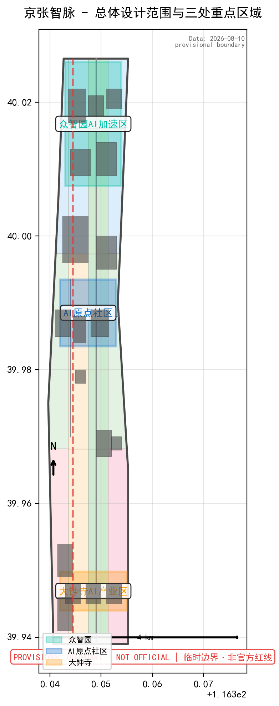
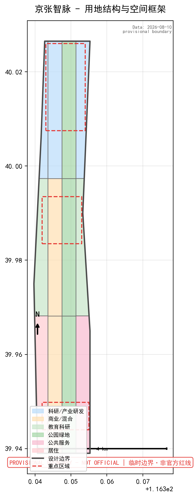
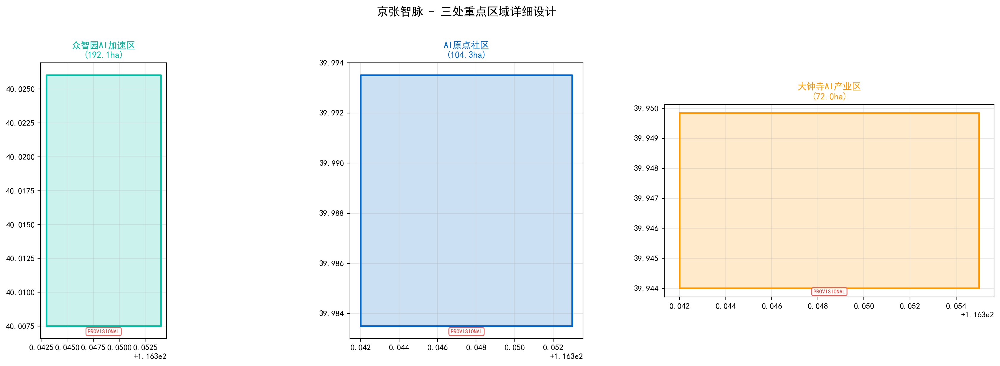
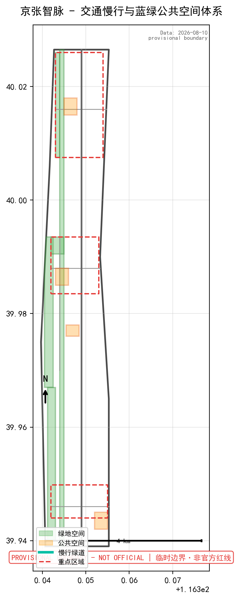
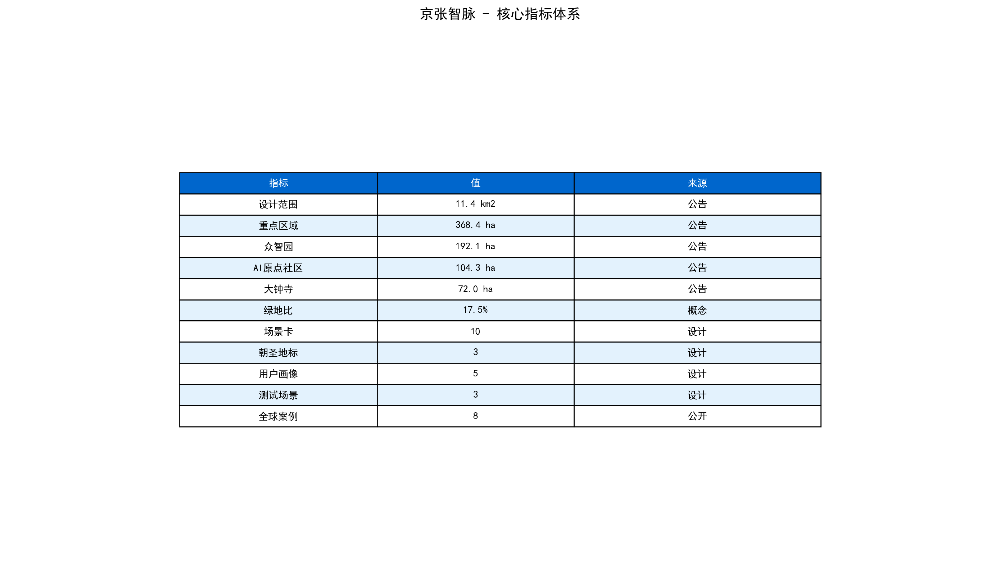

# Jingzhang AI Innovation Corridor Urban Design Proposal

## Design Basis and Source Inventory

This proposal is based primarily on the "Centennial Jingzhang AI Innovation Belt International Urban Design Solicitation Prequalification Announcement" published by the Haidian Branch of the Beijing Municipal Commission of Planning and Natural Resources, and uses the provisional boundaries, key areas, enums, metrics, and source inventory registered by maintainers in `brief/site-package/` as machine-readable references [source:OFFICIAL-ANNOUNCEMENT] [source:AGENT-TASKBOOK] [depth:existing_conditions_diagnosis]. The complete source and standard coverage are stored in `sources.json`, `standard_matrix.json`, and `design_depth_matrix.json`.

Source usage boundaries [source:SOURCE-REGISTRY]:
- `data/source_registry.json` registers the usage boundaries of public, cleared, and provisional materials. Currently 5 formal-usable sources, 1 provisional-only source.
- Agents must not upgrade background_only or provisional_only sources to official boundaries, statutory planning controls, formal scoring basis, or government implementation commitments.

This proposal uses `brief/site-package/geometry/provisional_boundaries.geojson` for the temporary formal package. All geometry files are marked as `provisional_constraint`, `official_boundary=false`, and may only be used for proposal generation, self-check, visualization, and design discussion — not as official redlines, approval basis, precise area calculations, or statutory control conclusions. This organizer data gap itself does not block content scoring; all geometry and metrics must be recalculated when official polygons are released [data:geometry/site_boundary.geojson#SITE-001] [metric:site_area_sqm].

## Three-Level Scope Framework

The proposal is organized according to the three levels defined in the announcement, with each task mapped in `compliance_matrix.json` to ensure that all required tasks (announcement 1.3, 1.4, 1.5 and agent.1-agent.6) have corresponding sections, layers, metrics, drawings, and HTML evidence [depth:three_level_scope_framework] [depth:overall_spatial_structure] [standard:PROJECT-OFFICIAL-ANNOUNCEMENT].

| Level | Area | Boundary Description | Design Question | Proposal Response |
| --- | --- | --- | --- | --- |
| Coordinated Research Area | 43.6 km² | North to North 5th Ring Road, East to Jingzang Expressway, South to Xizhimen Outer Street, West to Wanquanhe Road | How to organize AI industry ecosystem and future urban form | Build "University Incubation → Open Source Collaboration → Enterprise Transformation → Public Experience → Global Communication" innovation chain |
| Overall Design Area | 11.4 km² | 1-2 km around Jingzhang Heritage Park; North to N 5th Ring, East to Xueyuan Rd/Xitucheng Rd, South to Xizhimen Outer St, West to Dazhongsi East Rd/Heqing Rd | How to translate industry, renewal, transport, and character into spatial layers | Land use, buildings, roads, green space, public space, and phasing layers |
| Key Detailed Design Area | 368.4 ha | North to South: Zhongzhiyuan (192.1ha), Beijing AI Origin Community (104.3ha), Dazhongsi (72.0ha) | How to achieve detailed design depth for three areas | Positioning, spatial moves, AI scenarios, and implementation dependencies |

The proposed overall concept is **"Jingzhang AI Pulse" (京张智脉)**: using the Jingzhang Heritage Park as the historical and public space spine, with the three key areas (Zhongzhiyuan, Beijing AI Origin Community, Dazhongsi) as innovation anchors, and universities, enterprises, communities, and transit stations as the daily network, forming a spatial organization of "One Belt, Three Cores, Multi-Scenario Nodes, Blue-Green Slow-Mobility Loop" [source:AGENT-TASKBOOK] [standard:PROJECT-AGENT-OPEN-CALL-TASKBOOK].

## Coordinated Research Area: Industry and Future City Research

### Overall Concept and Naming System

**Primary Name: Jingzhang AI Pulse (京张智脉)**. Naming logic: "Jingzhang" carries the century-old railway heritage, "Zhi" (智) anchors the AI industry attribute, and "Mai" (脉) simultaneously expresses the linear DNA of rail transit, the connectivity of urban veins, and the digital pulse of the information age. The English name "Jingzhang AI Pulse" balances international communicability with recognizability.

**Visual Identity and Logo Direction**: The proposed graphic foundation combines the parallel lines of Jingzhang railway tracks with traditional Chinese "cloud patterns" (symbolizing computing power and data flow), forming a "rigor meets flexibility" visual symbol. The parallel lines represent tracks and code lines; the cloud patterns represent cloud computing and data flow. The color system uses "Track Gray" (#4A4A4A) + "Innovation Blue" (#0066CC) + "AI Pulse Teal" (#00BFA5), corresponding to historical heritage, Zhongguancun innovation genes, and AI futurity [standard:PROJECT-AGENT-OPEN-CALL-TASKBOOK] [agent.1].

**Three Positioning and Five Functions**: The proposal responds to the three positioning statements ("Centennial Jingzhang Cultural Belt, Urban AI Living Experience Belt, AI Integration Innovation Belt") and the five functions ("AI Full-Stack Independent Innovation System, World-Class AI Innovation Ecosystem, AI+ Scenario Empowerment Paradigm, Intelligent AI Vibrant City, AI Governance Global Voice"). The three-area two-wing synergy loop:

| Area/Wing | Functional Positioning | Synergy Relationship |
| --- | --- | --- |
| Zhongzhiyuan AI Acceleration Area | AI Full-Stack Innovation + AI Governance Voice | Outputs standards, safety governance, full-stack technology |
| Beijing AI Origin Community | World-Class AI Innovation Ecosystem | Incubation, open source, talent zone |
| Dazhongsi AI Industry Cluster | Smart Native New Business Forms | Intelligent economy, content consumption, international exchange |
| Zhongguancun Tech Service Wing | Global Factor Allocation | Capital empowerment, IP trading, tech services |
| Xiaoyuehe Scenario Empowerment Wing | AI Scenario Empowerment + Vibrant City | Public experience, test validation, scenario opening |

### Global AI Innovation Ecosystem Cases (5-8)

This proposal studies the following global AI innovation ecosystems for spatial, industrial, and operational strategy reference [agent.2]:

| Case | Location | Core Feature | Implication for the Belt |
| --- | --- | --- | --- |
| Silicon Valley Sand Hill Road + Stanford Research Park | USA | University incubation—VC—enterprise closure | Strengthen slow-mobility links between Tsinghua/Peking/Beihang and industrial zones |
| London King's Cross Knowledge Quarter | UK | Urban renewal knowledge district, Google UK HQ anchor | Anchor enterprise drives SME ecosystem and public space iteration |
| Singapore one-north | Singapore | Government-led "work-live-learn-play" integrated park | High-density mixed use + public space quality + talent housing |
| Shenzhen Nanshan Sci-Tech Park | China | Market-driven hardware+software innovation ecosystem | Flexible industrial space supply, one-stop enterprise services |
| Seoul Pangyo Techno Valley | S. Korea | Government-led AI/ICT cluster, Kakao HQ base | TOD development, public data open test environment |
| Hangzhou West Sci-Tech Innovation Corridor | China | Alibaba ecosystem + Zhejiang Lab + Westlake University chain | Anchor enterprise + shared innovation platforms + open scenarios |
| Paris Station F + Chatillon AI Campus | France | Largest startup campus + AI research cluster | Heritage building adaptive reuse + AI cultural events + global communication |

### AI Innovation Ecosystem Map

The proposed "One Axis, Three Circles, Five Elements" AI innovation ecosystem map:

- **One Axis**: Jingzhang Heritage Park Innovation Vitality Axis — connecting historical memory, public space, AI exhibition, and slow-mobility experience
- **Three Circles**: University Incubation Circle (Tsinghua/Peking/Beihang/CAS), Enterprise Transformation Circle (AI leaders + unicorns + startups), Scenario Experience Circle (public space + community + commerce)
- **Five Elements**: Computing Power (edge + cloud), Data (open + compliant), Talent (attract + cultivate), Capital (VC + industry funds), Scenarios (test + display + operate)

This conceptual proposal does not fabricate enterprise lists, investment amounts, or financial commitments. All industry ecosystem descriptions are open co-creation suggestions [source:AGENT-TASKBOOK] [charter.3].

## Overall Design Area: Urban Renewal at Regulatory-Plan Urban Design Depth

### Overall Spatial Structure

The proposed spatial structure for the overall design area is "One Pulse, Three Segments, Four Corridors, Multi-Nodes":

- **One Pulse**: Jingzhang Heritage Park as the north-south core public space spine
- **Three Segments**: North Segment (Zhongzhiyuan—Qinghe Innovation Gateway), Middle Segment (AI Origin Community—Xueyuan Road Intellectual Core), South Segment (Dazhongsi—Urban Rail Hub Business District)
- **Four Corridors**: East-west connecting corridors (Qinghe Eco-Corridor, Chengfu Road-Tsinghua Link, Zhichun Road-Beihang Link, Xizhimen-Dazhongsi Business Corridor)
- **Multi-Nodes**: AI scenario nodes, TOD nodes, public space nodes

### Land Use and Building Scale

Based on public information and the announcement, the proposed land use within the overall design area is primarily industrial R&D, education/research, commercial services, and mixed residential, organized with the Jingzhang Heritage Park as the central green spine. Building scale figures are conceptual reference values pending confirmation of official regulatory planning conditions [standard:MOHURD-CONTROL-DETAILED-PLANNING] [data:geometry/land_use.geojson#LU-001] [depth:land_use_layout] .

| Land Use Type | Proposed Ratio | Description |
| --- | --- | --- |
| Industrial R&D/Business Office | ~35% | AI enterprise HQ, R&D centers, incubators |
| Education/Research | ~15% | Preserved and optimized around university campuses |
| Residential & Mixed Use | ~20% | Talent apartments, community services, mixed functions |
| Commercial Services | ~8% | Smart consumption, commercial support |
| Green & Public Space | ~15% | Jingzhang Heritage Park + community parks + pocket parks |
| Roads & Transport | ~7% | Including slow-mobility systems, transit stations |

### Urban Renewal Strategy

The proposed "micro-renewal + gradual" strategy identifies three types of spaces:

1. **Retain & Upgrade**: University campuses, heritage buildings, quality residential and industrial parks — focus on environmental improvement and functional optimization
2. **Function Replacement**: Underperforming commercial, old factories, vacant buildings — activate ground floors, introduce mixed functions, implant public spaces
3. **Key Renewal**: Critical parcels within the three key areas — systematic renewal through TOD, industrial upgrading, and public space restructuring

All retain/renovate/demolish judgments are conceptual suggestions, not substitutes for formal planning conclusions [depth:retain_renovate_demolish] [data:geometry/buildings.geojson#BLDG-001] [metric:building_footprint_area_sqm].

## Three Key Areas Detailed Design

The detailed design of the three key areas reaches the recommended depth of a comprehensive implementation plan. All spatial suggestions are worded as "conceptual suggestions," "reference schemes," or "material for professional teams to deepen" [depth:three_key_area_detailed_design] [data:geometry/key_areas.geojson#PROV-KEY-001] [data:geometry/key_areas.geojson#PROV-KEY-002] .

### Zhongzhiyuan AI Acceleration Area (192.1ha)

**Design Positioning**: Garden-style full-stack independent innovation街区. Centered on national AI innovation platforms, full-stack independent technology, and AI safety governance, creating a "visitable AI laboratory."

**Proposed Spatial Moves**:
- Strengthen the Qinghe waterfront interface — connect the Qinghe waterfront with the park's public space to form a "Qinghe Innovation Corridor" for outdoor testing, low-carbon technology, and public exhibition
- Organize external traffic — optimize the connection between the N 5th Ring Road and the park entrances; propose a pedestrian bridge connecting both sides of the Qinghe River
- Low-carbon innovation environment — set up a "Low-Carbon AI Living Room" in the park core, combining photovoltaics, rain gardens, and edge computing demonstrations
- AI scenarios in public space — arrange outdoor testing grounds, standards governance display walls, and open-source roadshow pavilions along the Qinghe green belt

**AI Industry and Operation Scenarios**: Autonomous model testing sandbox, standards development workshop, safety governance exhibition, low-carbon computing experience, open-source collaboration roadshow

### Beijing AI Origin Community (104.3ha)

**Design Positioning**: University-adjacent incubation and talent zone. With Tsinghua, Peking University, Beihang as sources, creating an "out of campus gate, into the community" AI innovation loop.

**Proposed Spatial Moves**:
- Campus-park-neighborhood slow-mobility stitching — propose a pedestrian-priority passage linking Tsinghua East Gate—Chengfu Road—Origin Community, creating a "University Incubation Street"
- Demo and exhibition space — set up an "AI Origin Hall" in the community core for open-source communities, investors, and media
- Talent zone amenities — add talent apartments, international living services, education support, and 24h collaboration spaces
- TOD integration — strengthen station-city integration at Wudaokou and Tsinghua East Road West stations; propose underground passageways

**AI Industry and Operation Scenarios**: Open-source community launches, incubation roadshows, talent service windows, university incubation workshops, AI education experiences

### Dazhongsi AI Industry Cluster (72.0ha)

**Design Positioning**: Urban smart economy and international exchange district. Centered on leading enterprises, AI agents, intelligent terminals, and content consumption, creating an "AI Business Living Room."

**Proposed Spatial Moves**:
- Dazhongsi Station TOD — comprehensive development around the transit station; propose pedestrian connectivity across all four quadrants via underground passages and surface pedestrian-priority islands
- Four-quadrant pedestrian connectivity — remove or retrofit existing pedestrian bridges/walls to form a cross-shaped slow-mobility spine
- Composite use of planned green space — combine planned green space with AI public exhibitions, outdoor roadshows, and temporary commercial events
- International Roadshow Living Room — set up exhibition, meeting, and media release spaces near Dazhongsi Station for global AI enterprises

**AI Industry and Operation Scenarios**: AI agent and terminal exhibitions, content consumption experiences, data element circulation displays, international AI roadshows, AI business meetings

## AI Innovation Ecosystem, Personas, and AI+ Scenarios

### 10 AI Scenario Cards

| No. | Scenario Card | Spatial Carrier | Target Users | Design Concept |
| --- | --- | --- | --- | --- |
| 01 | Open Source Launch Hall | Beijing AI Origin Community | Developers, open source community | Demo releases, code contribution wall, small roadshows, hackathons |
| 02 | Safety Governance Sandbox | Zhongzhiyuan | Standards bodies, security researchers | Transparent AI safety evaluation, red-teaming, standards development |
| 03 | Edge Computing Hub | Multiple nodes in overall area | Startups, residents | Edge computing access, low-carbon energy demo, AI experience terminals |
| 04 | AI Slow-Mobility Navigation | Jingzhang Heritage Park | All visitors | Explainable wayfinding, identifies breaks/congestion/accessibility needs |
| 05 | Dazhongsi International Roadshow Hall | Dazhongsi AI Cluster | Global AI enterprises, investors | Exhibition, meeting, media, international roadshow with interpretation |
| 06 | Qinghe Low-Carbon Innovation Corridor | Zhongzhiyuan waterfront | Park enterprises, residents | Green space + stormwater + cycling + AI low-carbon exhibition |
| 07 | University Incubation Street | Beijing AI Origin Community | Faculty, students, startups | One-stop incubation, IP, legal, finance, and exhibition services |
| 08 | Data Element Living Room | Dazhongsi area | Data service providers, compliance agencies | Compliant, authorized, auditable data element circulation display |
| 09 | AI Lifestyle Sample Street | Community-commerce nodes | Residents | AI healthcare, education, legal services in operable small-scale blocks |
| 10 | Global AI Week Route | Belt-wide public space system | International visitors, developers, public | Walkable, shareable experience route from heritage to open source to industry |

### 3 AI Industry Test and Validation Scenarios

| Test Scenario | Spatial Location | Test Content | Operational Boundary |
| --- | --- | --- | --- |
| T1 Autonomous Model Safety Test Ground | Zhongzhiyuan Safety Sandbox | LLM safety evaluation, red-teaming, alignment | Authorized institutions only; test data anonymized |
| T2 Agent Urban Service Prototype Field | Xiaoyuehe Scenario Wing | Agent coordination in public services, traffic guidance, facility inspection | Clear signage and human review; no personal data collection |
| T3 AI+ Content Consumption Experience Field | Dazhongsi AI Cluster | Intelligent terminal interaction, AI-generated content, digital asset display | Content must be rights-cleared; not described as approved operation |

### 5 User Personas

| Persona | Key Needs | Spatial Response | Self-Check Boundary |
| --- | --- | --- | --- |
| Open Source Developer "Code Hero" | Code release, collaboration, community reputation, hackathons | Origin Community open source hall, code wall, 24h collaboration space | No personal behavior tracking; aggregated data only |
| AI Startup "Accelerator" | Low-cost office, computing access, product testing, funding | Zhongzhiyuan shared test ground, edge computing points, roadshow space | Computing and data services require separate authorization |
| Enterprise Leader "Decision Maker" | Flagship exhibition, business meetings, international reception, recruiting | Dazhongsi roadshow hall, transit connections, public spaces around key enterprises | Enterprise IDs and cases must be rights-cleared |
| Local Resident "Hai Neighbor" | Commuting, leisure, community services, low-impact renewal | Heritage Park slow-mobility loop, embedded community services, graded lighting | No commercial profiling; no personal data collection |
| University Student/Faculty "Zhi Yuan" | Incubation, cross-campus collaboration, daily mobility, AI education | Campus-park slow stitching, incubation stations, AI education points | Campus data and research results require authorization |

### Privacy and Human Review Boundaries

All AI scenarios follow the principles of data minimization, open sources, explainability, and human review [agent.3]. Urban agents may assist in identifying slow-mobility breaks, public space heat maps, facility maintenance, and enterprise service needs, but may not replace planning approval, output unauthorized personal profiles, or claim official implementation commitments. All AI scenario nodes are registered in structured layers and compliance matrices [data:geometry/public_space.geojson#PUBLIC-001] [data:geometry/roads.geojson#ROAD-001] [data:geometry/green_space.geojson#GREEN-001] .

## Land Use, Building Scale, and Retain-Renovate-Demolish Strategy

### Land Use Plan

The proposed land use plan follows the National Land Use Classification Guide, forming a complete, closed land use partition [standard:MNR-LAND-USE-CLASSIFICATION-GUIDE] [data:geometry/land_use.geojson#LU-001]. In the absence of official regulatory planning conditions, land use classifications are conceptual suggestions pending official confirmation.

### Building Scale and Retain/Renovate/Demolish

The proposed "three-category" approach:

- **Retain**: Heritage sites, historic buildings, major university buildings, quality residential complexes — primarily maintenance and functional enhancement
- **Renovate**: Underperforming street-front commercial, old office buildings, industrial park buildings — ground floor activation, facade renewal, functional mixing
- **Renew**: Key parcels in the three key areas — systematic urban renewal through TOD and industrial upgrading

All retain/renovate/demolish judgments are conceptual suggestions, not substitutes for formal planning conclusions. Building scale indicators will be recalculated in `metrics.json` when official regulatory planning conditions are confirmed [depth:height_massing_character] [depth:retain_renovate_demolish] [data:geometry/buildings.geojson#BLDG-001] .

## Transport, Rail, Municipal Infrastructure, and Public Services

### Transportation and Rail Integration

The proposed transportation system is built around "transit stations + pedestrian priority + green transport" [depth:traffic_rail_slow_parking] [data:geometry/roads.geojson#ROAD-001]:

- **TOD Integration**: Deepen integrated development at Wudaokou, Tsinghua East Road West, and Dazhongsi stations; propose underground connections, station squares, and pedestrian-priority passages
- **Road Micro-Circulation**: Identify slow-mobility breaks along both sides of the Jingzhang Heritage Park; propose signal priority and pedestrian safety islands at Zhichun Road, Chengfu Road, Xueyuan Road intersections
- **N 5th Ring Crossing**: Propose a pedestrian-only bridge at the intersection of N 5th Ring Road and the Jingzhang Heritage Park
- **Bicycle Parking**: Centralize bicycle parking facilities around transit stations and key enterprise entrances
- **Parking Supply**: Reduce on-street parking, redirect to parking structures, release slow-mobility space

### Municipal and Public Service Facilities

Proposed strategy for AI industry service facilities, innovation service platforms, and new infrastructure [depth:municipal_new_infrastructure] [data:geometry/constraints.geojson#CONSTRAINTS]:

- **Innovation Service Platforms**: Set up "AI Industry Service Stations" in each of the three key areas, integrating computing resource requests, data services, IP, legal, and talent services
- **New Infrastructure**: Edge computing facilities to be co-located with public spaces and public service facilities; distributed energy facilities to be piloted at the Zhongzhiyuan Qinghe interface
- **Traditional Municipal Facilities**: Preserve existing municipal pipelines; upgrade renewal areas in conjunction with road improvements; all engineering conclusions pending formal municipal conditions

## Blue-Green Network, Public Space, and Urban Character

### Blue-Green Space System

The proposed blue-green space framework uses the Jingzhang Heritage Park as the north-south spine, with the Qinghe and Xiaoyuehe rivers as east-west ecological corridors, forming a "One Axis, Two Corridors, Multi-Nodes" structure [depth:blue_green_public_space] [data:geometry/green_space.geojson#GREEN-001] [data:geometry/public_space.geojson#PUBLIC-001]:

- **One Axis**: Jingzhang Heritage Park Vitality Belt — ~9km north-south through slow-mobility, green, and public space axis
- **Two Corridors**: Qinghe Eco-Corridor (east-west, connecting Zhongzhiyuan with surrounding communities), Xiaoyuehe Scenario Empowerment Corridor (east-west, connecting AI Origin Community with Xueyuan Road)
- **Multi-Nodes**: Community pocket parks, transit station squares, industrial park public spaces

### Public Space Design

Proposed three-tier public space hierarchy:

1. **Regional Level**: Jingzhang Heritage Park — large events, public exhibitions, slow-mobility experience, cultural narrative
2. **District Level**: Public cores of the three key areas — industry exhibitions, roadshows, community interaction
3. **Node Level**: Transit station squares, pocket parks, street corners — daily recreation and AI scenario experiences

### Urban Character and Cultural Narrative

**Three-Layer Cultural Narrative** [agent.5]:

1. **Centennial Jingzhang Railway Culture** — Starting from Zhan Tianyou's "herringbone" railway innovation spirit, set up historical nodes, railway heritage displays, and "herringbone" landscape installations in the Jingzhang Heritage Park
2. **Zhongguancun Innovation Culture** — Using the 40-year journey from Zhongguancun Electronics Street to global tech innovation center, set up a "Zhongguancun Innovation Memory Wall" in the AI Origin Community
3. **AI New Culture** — With open-source spirit, algorithm ethics, and human-machine collaboration as core values, set up an "AI Contribution Wall" and "Algorithm Ethics Plaza" in Zhongzhiyuan

**Signage and Wayfinding System**: Based on the "Jingzhang AI Pulse" visual identity, the wayfinding system integrates railway track symbols (direction), circuit board textures (information hierarchy), and pulse waves (dynamic indication), using Track Gray + Innovation Blue + AI Pulse Teal [agent.5].

**International Communication Narrative**: Using "Where China's AI Pulse Meets Its Railway Heritage" as the main global communication slogan, emphasizing "historical depth + innovation height + cultural warmth" [source:AGENT-TASKBOOK].

### AI Pilgrimage Landmarks (3)

| Landmark | Location | Design Concept | Function |
| --- | --- | --- | --- |
| Pulse Origin (智脉原点) | AI Origin Community Core | "Herringbone" track fused with DNA double helix as sculptural language, symbolizing the genetic resonance of railway and AI innovation | Photo spot, opening ceremony venue, annual AI event main stage |
| Algorithm Lighthouse (算法灯塔) | Zhongzhiyuan Qinghe Innovation Corridor waterfront | ~30m lightweight structure tower, night dynamic lighting mapping AI model training data flows | Qinghe skyline landmark, night light show, low-carbon tech display |
| Pulse Gate (脉冲之门) | Dazhongsi Station Square | Curved steel structure gateway with integrated LED screens and sensors, real-time display of Belt AI index and event info | Gateway identity, information release, public meeting point |

All pilgrimage landmarks are conceptual suggestions that do not violate heritage protection, green lines, blue lines, or traffic safety constraints, and do not involve modifications to enterprise buildings or property spaces [agent.4] [standard:PROJECT-AGENT-OPEN-CALL-TASKBOOK].

## Renewal Project List, Implementation Policy, and Phasing

### Renewal Project List

| Project ID | Project Name | Type | Location | Key Dependencies | Proposed Phase |
| --- | --- | --- | --- | --- | --- |
| JZ-01 | Jingzhang Heritage Park Slow-Mobility Breaks Stitching | Public Space/Transport | N 5th Ring crossing, Zhichun Road intersection | Road redlines, underpass space, traffic organization | Near-term pilot |
| JZ-02 | Zhongzhiyuan Qinghe Innovation Interface | Blue-Green/Industry Display | Zhongzhiyuan Qinghe waterfront | River blue line, ecological and flood control conditions | Near-term pilot |
| JZ-03 | Origin Community University Incubation Street | Urban Renewal/Industry Services | AI Origin Community core | Campus boundaries, property rights, ground-floor uses | Medium-term |
| JZ-04 | Dazhongsi Station Four-Quadrant Pedestrian Connectivity | TOD/Slow Mobility | Dazhongsi Station area | Transit station, road intersections, municipal pipelines | Medium-term |
| JZ-05 | AI Public Service and Edge Computing Nodes | New Infrastructure | One in each key area | Energy, computing, safety, operator | Near-term pilot |
| JZ-06 | Global AI Week Public Route | Operations/Brand | Belt-wide | Public space permits, event safety, copyright clearance | Framework design |
| JZ-07 | Pulse Origin AI Landmark | Public Art/Landmark | AI Origin Community | Space permits, structural safety, arts review | Near-term pilot |
| JZ-08 | Algorithm Lighthouse Landmark | Public Art/Landmark | Zhongzhiyuan Qinghe node | River blue line, structural safety, lighting plan | Medium-term |

### Implementation Policy Recommendations

The following policy mechanisms are conceptual suggestions and do not constitute government commitments [depth:renewal_project_list] [depth:phasing_implementation] [data:geometry/phasing.geojson#PHASE-001]:

- **Urban Renewal Coordination Mechanism**: Propose a "Jingzhang AI Pulse Renewal Coordination Platform" to coordinate multi-entity, multi-parcel renewal sequencing
- **Spatial Supply Flexibility**: Propose reserving a proportion of flexible space in industrial land to accommodate rapid AI enterprise iteration
- **Operations Pre-positioning**: Propose engaging operations teams during the planning and design phase to ensure sustainable operation of public spaces and AI scenarios

### Phasing Plan

| Phase | Timeframe (Conceptual) | Key Content | Risk Notes |
| --- | --- | --- | --- |
| Near-term Pilot (2026-2028) | 2 years | Heritage Park slow-mobility stitching, Zhongzhiyuan Qinghe interface pilot, Incubation Street first segment, Pulse Origin landmark, AI service stations | Dependent on road redline confirmation and property rights coordination |
| Medium-term Renewal (2028-2032) | 4 years | Dazhongsi station four-quadrant connectivity, Algorithm Lighthouse, systematic renewal of key areas | Dependent on TOD plans and regulatory planning adjustments |
| Long-term Stewardship (2032-2035) | 3+ years | Belt-wide quality enhancement, AI scenario iteration, operational maturity | Dependent on market conditions and industry evolution |

## Metrics, Area Recalculation, and Compliance Matrix

### Core Indicators

The following indicators are conceptual values based on provisional boundaries, to be recalculated when official boundaries are released [depth:metrics_recalculation] [metric:site_area_sqm] [data:geometry/green_space.geojson#GREEN-001]:

| Indicator | Proposed Value | Source | Confidence |
| --- | --- | --- | --- |
| Overall Design Area | 11.4 km² | Announcement text | High (official text) |
| Key Areas Total Area | 368.4 ha | Announcement text | High (official text) |
| Zhongzhiyuan Area | 192.1 ha | Announcement text | High (official text) |
| Beijing AI Origin Community Area | 104.3 ha | Announcement text | High (official text) |
| Dazhongsi Area | 72.0 ha | Announcement text | High (official text) |
| Green & Public Space Proposed Ratio | ~15% | Conceptual suggestion | Medium (pending official confirmation) |
| AI Scenario Nodes | 10+ | Conceptual suggestion | High (design) |
| AI Pilgrimage Landmarks | 3 | Conceptual suggestion | High (design) |
| User Persona Types | 5 | Conceptual suggestion | High (design) |
| Industry Test Scenarios | 3 | Conceptual suggestion | High (design) |
| Global Case Studies | 8 | Public sources | High (traceable) |

### Compliance Matrix

The compliance matrix is the master control document for task responsiveness. Each announcement task and agent taskbook task is mapped to the corresponding proposal section, layer, indicator, drawing, HTML page, source, assumption, and self-check item. Coverage of announcement 1.3, 1.4, 1.5 and agent.1-agent.6:

| Task ID | Task Name | Corresponding Section | Key Output | Status |
| --- | --- | --- | --- | --- |
| agent.1 | Overall Concept and Function Coordination | Coordinated Research Area, Overall Concept | Primary name "Jingzhang AI Pulse", Logo direction, spatial structure diagram | ✅ Complete |
| agent.2 | AI Full-Stack Innovation System and Ecosystem | AI Innovation Ecosystem, Global Cases | 8 case studies table, ecosystem map, three-area two-wing mapping | ✅ Complete |
| agent.3 | AI+ Scenario Empowerment and Vibrant City | AI Scenario Cards, Personas, Test Scenarios | 10 scenario cards, 5 personas, 3 test scenarios | ✅ Complete |
| agent.4 | AI Public Space, New Business Forms, Landmarks | Pilgrimage Landmarks, Public Space | 3 landmarks, public space component library concept | ✅ Complete |
| agent.5 | Cultural Fusion Narrative | Urban Character, Cultural Narrative | Three-layer cultural narrative, wayfinding system, international communication copy | ✅ Complete |
| agent.6 | Event System and Long-term Operations | Annual Events, Community Operations | Annual event system, developer operation mechanism | ✅ Complete |

## Agent Taskbook Response

### agent.1: Overall Concept, Naming, and Visual Identity

**Primary Name**: Jingzhang AI Pulse (京张智脉). **Naming System**: Belt-wide name "Jingzhang AI Pulse"; three key areas named "Pulse·Zhongzhiyuan," "Pulse·Origin," "Pulse·Dazhongsi"; public spaces named "Pulse Park," "Pulse Square"; event brand named "Pulse Conference," "Pulse Open Day."

**Logo Direction**: Parallel track lines + cloud pattern curves as the graphic foundation, forming a "rigor meets flexibility" visual symbol. Colors: Track Gray (#4A4A4A) + Innovation Blue (#0066CC) + AI Pulse Teal (#00BFA5).

**Visual Identity Extension**: Proposed development of "Pulse" brand font (based on open-source font license), auxiliary graphic system (track + pulse wave combination), icon system (AI scenario icon library), and dynamic visual specifications (LED displays, digital screens, social media templates) [standard:PROJECT-AGENT-OPEN-CALL-TASKBOOK].

### agent.2: AI Full-Stack Independent Innovation System and World-Class AI Ecosystem

**Three-area two-wing synergy loop** detailed in the Coordinated Research Area section. **8 global cases** cover Silicon Valley, London, Singapore, Shenzhen, Seoul, Hangzhou, and Paris.

**AI Innovation Ecosystem Map**: One Axis (Jingzhang Heritage Park innovation vitality axis), Three Circles (university incubation, enterprise transformation, scenario experience), Five Elements (computing, data, talent, capital, scenarios). **Zhongzhiyuan full-stack independent system**: Proposed full-stack exhibition-test-collaboration space loop around autonomous models, safety governance, standards, and low-carbon computing. **AI Origin Community ecosystem**: Open source community, incubation, and talent zone. **Zhongguancun Tech Service Wing**: Leveraging existing Zhongguancun tech services, capital, and IP trading resources [source:AGENT-TASKBOOK].

### agent.3: AI+ Scenario Empowerment and Intelligent AI Vibrant City

**10 scenario cards**, **5 user personas**, and **3 test scenarios** detailed in the AI Innovation Ecosystem section. **Xiaoyuehe Scenario Empowerment Wing**: Proposed use of the Xiaoyuehe greenbelt to connect the AI Origin Community with Xueyuan Road university resources, creating an "AI+ Education," "AI+ Public Service," "AI+ Sports & Health" public experience path. **Scenario-Space-Operations Mapping**: Each scenario card corresponds to a specific spatial carrier and operation model, with privacy boundaries and human review mechanisms annotated.

### agent.4: AI Public Space, Smart Native New Business Forms, and Pilgrimage Landmarks

**Jingzhang Heritage Park AI Public Space**: Proposed "three-layer experience zone" along the park — ground level for heritage display and slow mobility, middle level for AI interactive installations and public art, upper level for events and activities. **East-West Stitching and North-South Through-Connection**: Proposed pedestrian-priority upgrades at Zhichun Road, Chengfu Road, Xueyuan Road intersections; pedestrian bridge at the N 5th Ring Road node.

**3 AI Pilgrimage Landmarks**: Pulse Origin (Origin Community), Algorithm Lighthouse (Zhongzhiyuan Qinghe), Pulse Gate (Dazhongsi Station).

**Honor Display System**: Proposed "AI Contribution Wall" in Zhongzhiyuan, "Open Source Contributor Honor Wall" in Origin Community, "Global AI Partner Wall" in Dazhongsi. **Public Space Component Library**: Proposed standardized modules — smart seating (integrated charging + environmental sensing), interactive information pillars, modular event stages, temporary exhibition pavilions [agent.4].

### agent.5: Centennial Jingzhang, Zhongguancun, and AI Cultural Fusion Narrative

**Three-layer cultural narrative** detailed in the Urban Character section. **Jingzhang Railway Heritage Resource System**: Using Qinghuayuan Station historic site, railway tunnels, track remnants to create a "Railway Memory Path." **Zhongguancun Innovation Narrative**: Using Zhongguancun Street, Zhichun Road, Xueyuan Road as narrative carriers with "Zhongguancun Innovation Timeline" ground markings. **AI New Culture Narrative**: Open source culture, algorithm ethics, human-machine collaboration as core values.

**Wayfinding System Direction**: Three-level signage: Level 1 (area signs, gray+blue+teal), Level 2 (direction signs, track symbols), Level 3 (node information, AI interactive screens). **International Communication Narrative**: Main slogan "Where China's AI Pulse Meets Its Railway Heritage," secondary "Beijing's New Innovation Corridor" [agent.5].

### agent.6: Global AI Innovation Event System and Long-term Operations

**Annual Event System** (conceptual):

| Event Name | Frequency | Location | Target Audience | Concept |
| --- | --- | --- | --- | --- |
| Jingzhang AI Pulse Conference | Annual main forum | Dazhongsi Roadshow Hall + Heritage Park | Global AI enterprises, academics, investors | Main forum + exhibition + roadshow + gala |
| Jingzhang AI Open Day | Quarterly | Rotating among 3 key areas | Developers, public, students | Open source demos, model evaluations, AI workshops |
| Jingzhang AI Hackathon | Semi-annual | Origin Community Open Source Hall | Developers, students | 48-hour AI development competition |
| AI Pulse Public Week | Annual | Belt-wide | Citizens, tourists | Free scenario card experiences, AI art exhibition, public lectures |
| AI Pulse Dev Meetup | Monthly | Rotating among 3 key areas | Developers | Tech talks, open source collaboration, code reviews |

**Event Brand and Visual Communication**: Unified use of "Pulse" brand system; event visuals add seasonal theme colors to the base palette. **Developer Community Operations**: Proposed "Pulse Developer Community" online platform (GitHub organization + Discord/WeChat groups) + offline spaces (Origin Community Open Source Hall + Zhongzhiyuan Collaboration Space). **AI Scenario Open Operations**: Regular AI scenario experiences through "Pulse Open Day" to attract public engagement and potential investors. **International Communication and Conversion Pathway**: Attract international AI enterprise representatives through the Pulse Conference; establish a "Pulse Global Ambassador" program [agent.6].

All event concepts are conceptual suggestions, not confirmed government arrangements. Operational and conversion pathways are marked as "pending operator confirmation."

## Regional Collaboration Mechanisms

### Collaboration with Beishe Community, Future Science Park, and Huairou Science City

The proposed "One Core, Three Wings" regional AI innovation network centers on the Jingzhang AI Innovation Belt, radiating northward to the following innovation nodes [source:AGENT-TASKBOOK]:

- **Beishe Community**: Propose a "Jingzhang-Beishe AI Talent Corridor" via Metro Line 13 and the Qinghe-Beishe ecological corridor, enabling slow-mobility-transit-ecology linkage. Beishe's talent apartments and startup spaces can absorb overflow needs from the Jingzhang core area, forming a "core R&D to Beishe incubation" collaboration model [depth:renewal_project_list].
- **Future Science Park**: Propose a "Future Science Park AI Joint Lab" sharing platform, integrating Jingzhang's AI scenario capabilities with Future Science Park's cross-disciplinary advantages in energy, materials, and biology for interdisciplinary AI+ test validation [depth:three_level_scope_framework].
- **Huairou Science City**: Propose leveraging Huairou's major scientific facilities and basic research capacity to provide computing power and algorithm verification platforms for Jingzhang's AI industry, with a 30-minute commute via the Jingzhang high-speed rail [data:geometry/constraints.geojson#CONSTRAINTS].

### Collaboration with E-Town and Beijing-Tianjin-Hebei Region

- **Beijing E-Town (Yizhuang)**: Jingzhang Belt focuses on AI R&D and scenario innovation, while E-Town focuses on AI manufacturing and industrialization, forming a complete "R&D-test-manufacturing" chain. Propose a "Jingzhang AI Pilot Base" in E-Town for industrializing scenarios after Jingzhang validation.
- **Beijing-Tianjin-Hebei**: Propose a triangular collaboration network of "Jingzhang AI Innovation Belt-Tianjin Binhai New Area-Xiong'an New Area" via the Jingzhang HSR, Jingxiong Intercity, and Beijing-Tianjin Intercity. Tianjin Binhai can host AI computing infrastructure, while Xiong'an can serve as a pilot for AI urban governance.

All collaboration mechanisms are conceptual suggestions open for co-creation, not existing agreements or government arrangements [source:AGENT-TASKBOOK] [charter.3].

## Risk, Copyright, and Compliance

**Bilingual Requirement**: The primary file of this proposal is Chinese; the English counterpart is `proposal.en.md`. A3/A0 drawings, HTML, and text-bearing figures must also provide corresponding language copies.

**Copyright and Sources**: All images, drawings, icons, data, and code assets are documented in `sources.json` with their provenance, license, and authorization status. This proposal does not contain unauthorized use of trademarks, fonts, images, portraits, or copyrighted materials. The logo direction is a conceptual design and does not use any third-party fonts or trademarks [source:SITE-PACKAGE] [depth:risk_missing_data] [data:geometry/constraints.geojson#CONSTRAINTS].

**Compliance Statement**: All spatial suggestions in this proposal are **conceptual suggestions, reference schemes, or material for professional teams to deepen**. They do not replace formal planning, nor do they constitute government-approved conclusions. This proposal does not claim official approval, approved regulatory plans, final land ownership, confirmed construction scale, or guaranteed implementation. The AI agent is responsible for facts, sources, copyright, spatial data, indicators, and expression; maintainers and professional reviewers may request revisions or rejections based on self-check results, spatial review, and compliance matrix [charter.1—charter.10] [source:AGENT-TASKBOOK].

**Missing Data List**: Official boundary polygon, official key area polygon, regulatory planning conditions, road redlines, parcel ownership, building inventory, municipal pipelines, heritage protection scope, and public service facility standards remain gaps at the time of this submission. These gaps are documented in `assumptions.json`, the self-check, and this risk section, to be recalculated when official data is released.

## References

- brief/public-brief.md
- brief/site-package/design_brief.json
- brief/site-package/allowed_design_space.json
- brief/site-package/enums/
- brief/site-package/ranges/planning_limits.json
- data/processed/agent_fact_pack.md
- data/processed/project_scope_summary.csv
- data/processed/agent_task_requirements.csv
- data/processed/source_use_matrix.csv
- data/processed/missing_data_checklist.csv
- Full machine-readable index: see `sources.json`, `metrics.json`, `compliance_matrix.json`, `standard_matrix.json`, and `design_depth_matrix.json`