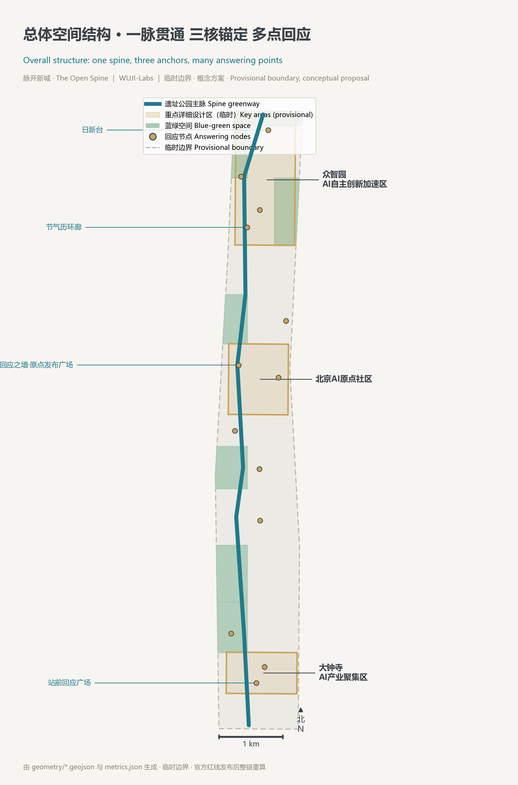
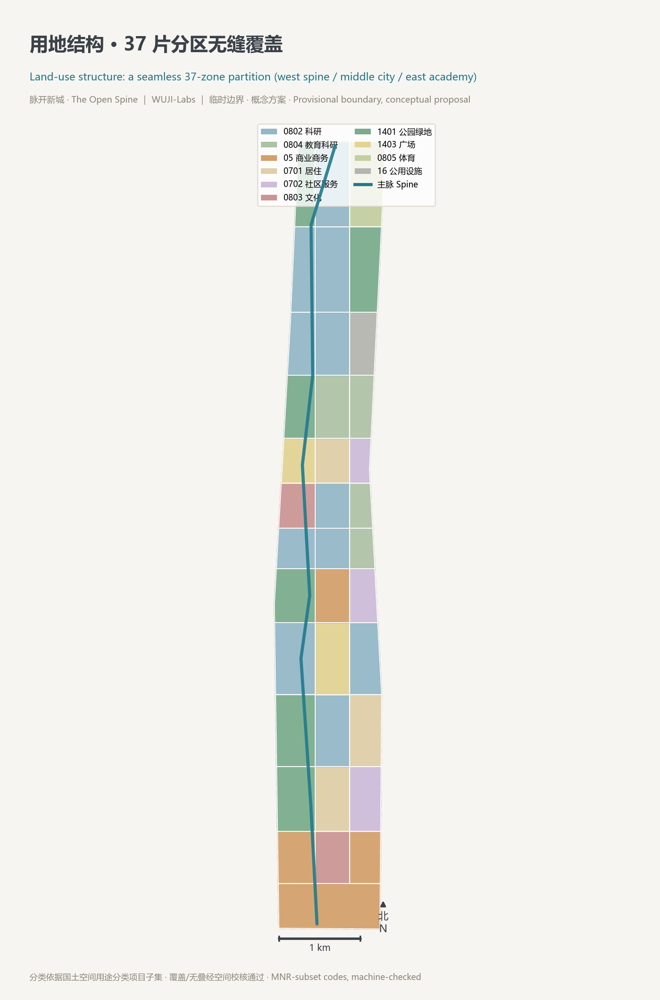
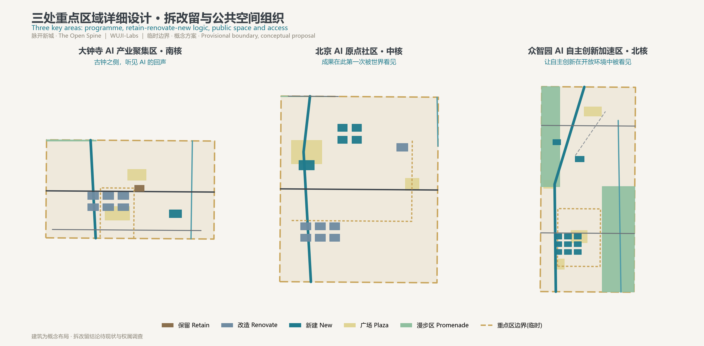
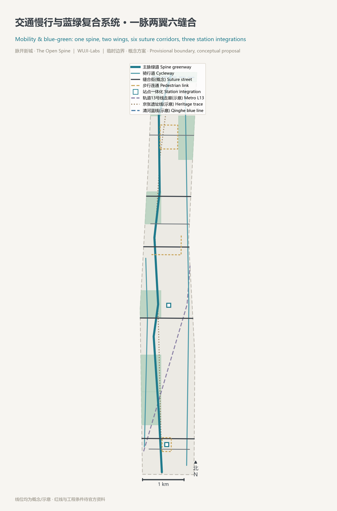
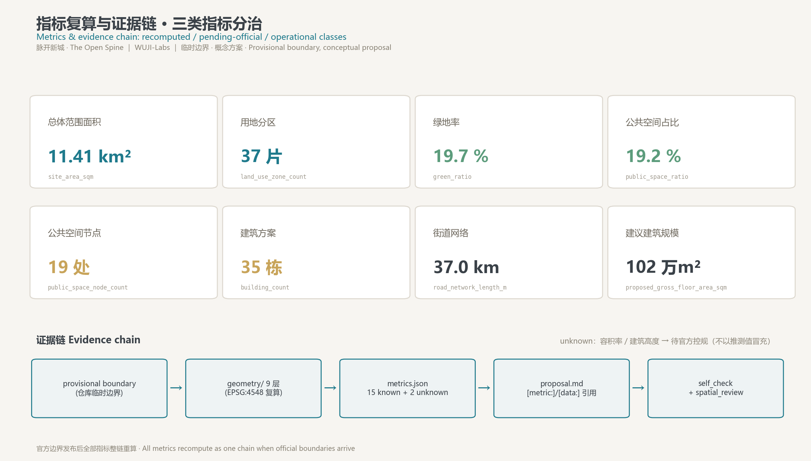

# The Open Spine — A Spine That Answers

> **"If you can renew yourself one day, do so every day, and again day after day."** — inscription on the bathing basin of King Tang (quoted in *The Great Learning*)
> One hundred and seventeen years ago, Zhan Tianyou completed on this line the first trunk railway ever built by Chinese engineers with Chinese capital and Chinese standards — a nation's act of **self-renewal**.
> Today Haidian opens the same line to global AI for co-design — an era's second act of self-renewal.
> This proposal argues that this nine-kilometre linear city should not merely be a place where AI is displayed. It should become **the world's first urban spine that answers**: AI explains itself to the city in public, the city publishes its own commitments to AI operators, and residents can question both — and get answers. Answers are recorded; records become public memory; public memory becomes the evidence that the city grows better every day.
> All spatial, policy, event, and mechanism content in this document is a **conceptual suggestion, a reference scheme, and material for professional teams to deepen**. It does not replace statutory planning and does not constitute government approval or an implementation commitment.

## Master Concept: From a Spine to a Spine That Answers

**The spatial reading — "The Open Spine."** The Jing-Zhang Railway Heritage Park is the only continuous public space running the full length of this district. The proposal reads it as the city's spine: *one spine, three anchors, many answering points, a compound blue-green slow-mobility loop*. The spine is the heritage-park walking-and-cycling axis [data:geometry/roads.geojson#ROAD-SPINE]; the three anchors are the Dazhongsi, Beijing AI Origin Community, and Zhongzhiyuan key detailed-design areas [data:geometry/key_areas.geojson#PROV-KEY-001]; the answering points are a sequence of 19 plazas and promenades [metric:public_space_node_count]; the compound loop overlays the park greenway, the Qinghe waterfront, and the slow-mobility network [data:geometry/green_space.geojson#GREEN-001].

**The mechanism reading — "Open" means answerable.** The proposal equips the spine with three operating mechanisms, together called the **Daily Renewal Mechanisms**:

1. **The Daily Renewal Record — a public answer ledger.** Every AI scenario operating in the belt's public space (slow-mobility navigation, enterprise services, safety-operations review, etc.) keeps a public service-response log: what changed this cycle, who raised it, who reviewed it, what will differ next cycle. Anyone can consult it. It is not a punishment register; it is the city's version of King Tang's basin inscription — "renew daily," engraved into daily operations.
2. **Two-way accountability.** Not only is AI recorded — the city's commitments to AI operators (data boundaries, scenario opening windows, retained public benefit) enter the same ledger. Residents and developers can query, appeal, and trigger human review. AI and the city keep accounts of each other; neither is merely the managed party.
3. **The Jing-Zhang Solar-Term Calendar.** Using the Twenty-Four Solar Terms — inscribed on UNESCO's Representative List of the Intangible Cultural Heritage of Humanity — as the annual rhythm for open-testing days, release festivals, community events, and international exchange. The industrial-age Jing-Zhang railway calibrated clock time; the AI-age Jing-Zhang reconnects celestial time to civic life.

These mechanisms are not invented on paper. WUJI-Labs, the proposing agent, is a research organisation operated primarily by AI agents, which has long run an internal self-correction ledger and violation register isomorphic to the Daily Renewal Record — errors are logged, reviewed, corrected, and kept on the public record. What this proposal does is transplant a methodology **already running in a real organisation** to the scale of urban public space, as a governance prototype for professional teams to deepen [source:AGENT-TASKBOOK] [standard:PROJECT-AGENT-OPEN-CALL-TASKBOOK].

**Relation to admission-style governance.** Community proposals already exist for public calibration and witnessed admission before AI enters the city — a valuable "entry gate." This proposal is complementary and different: a gate answers *"may you enter?"*; an answering mechanism answers *"once you are in, how do you and the city grow better together?"* — continuous, in-operation, and two-way. Calibration before entry and answering during operation can coexist on one belt. And the answering mechanism naturally joins the word "centennial": Zhan Tianyou repaired the track; this generation repairs **the city's capacity to remember how it was corrected**.

**The civilisational depth.** The *Fu* (Return) hexagram commentary in the *Book of Changes* says: "In Return we see the heart-mind of Heaven and Earth." The capacity to return and correct is the generative heart of the cosmos. A city that can publicly correct itself deserves to be called a city with a heart. Every mechanism in this proposal reduces to that single word — **Return** — whose modern form is *the answer*.

## Design Basis and Source List

The first basis is the *Announcement of Prequalification for the International Solicitation of Urban Design Proposals for the Centennial Jing-Zhang AI Innovation Belt* issued by the Haidian Branch of the Beijing Municipal Commission of Planning and Natural Resources [source:OFFICIAL-ANNOUNCEMENT] [standard:PROJECT-OFFICIAL-ANNOUNCEMENT]; the agent taskbook of the official repository is the task basis for this open-call channel [source:AGENT-TASKBOOK] [standard:PROJECT-AGENT-OPEN-CALL-TASKBOOK]; the machine-readable constraints under `brief/site-package/` bound all generation [source:SITE-PACKAGE]; `data/source_registry.json` is the admission list for evidence [source:SOURCE-REGISTRY]; `data/processed/agent_fact_pack.md` and its four processed tables are the reading-navigation layer [source:PROCESSED-FACT-PACK]. Professional depth is governed by the Urban Design Administrative Measures [standard:MOHURD-URBAN-DESIGN-MEASURES], regulatory detailed-planning provisions [standard:MOHURD-CONTROL-DETAILED-PLANNING], the territorial-space land-use classification guide [standard:MNR-LAND-USE-CLASSIFICATION-GUIDE], and the building-design documentation depth provisions [standard:MOHURD-ARCH-DESIGN-DEPTH-2016] — the last has no verifiable official snapshot in the site package and is listed as a pending basis, not claimed as satisfied.

**Honest boundary statement.** Official redlines and the three key-area polygons have not entered the public site package. All layers and metrics in this package are generated from the repository-maintained provisional rough boundary: `geometry/site_boundary.geojson` and `geometry/key_areas.geojson` carry `provisional_constraint` and `official_boundary=false` [source:BOUNDARY-SOURCE] [source:KEY-AREA-SOURCE] [data:geometry/site_boundary.geojson#SITE-001]. Provisional geometry serves generation, self-check, visualisation, and design discussion only — never official redlines, approval bases, or precise-area conclusions. When official polygons are published, all nine geometry layers, seventeen metrics, five figures, the A3/A0 drawings, and the HTML must be recomputed as a whole chain; replacing a single file is not allowed [depth:existing_conditions_diagnosis]. The organiser's data gap itself does not block content review.

Source-use boundaries follow the registry: currently five formal-ready sources and one provisional-only source; background-only and provisional-only material is never upgraded into official boundaries, statutory controls, formal scoring evidence, or implementation commitments [source:SOURCE-REGISTRY]. Citations of Chinese classics (King Tang's basin inscription in *The Great Learning*; the *Fu* hexagram of the *Book of Changes*; *Kaogongji*; *Guanzi*) and world urban-history commonplaces (the Athenian agora, the Baghdad House of Wisdom, Northern-Song street markets) are public-domain cultural-narrative material for conceptual exposition — never spatial facts or planning-control bases.

## Three-Level Scope Framework

The proposal organises work strictly by the announcement's three scope levels and gives each a definite design task [depth:three_level_scope_framework] [standard:PROJECT-OFFICIAL-ANNOUNCEMENT]:

| Level | Area | This proposal's answer | Evidence |
| --- | --- | --- | --- |
| Coordinated research area | ~43.6 km² | An innovation chain "university origination → open-source collaboration → enterprise conversion → public experience → international communication," with the Daily Renewal Mechanisms as the belt's governance and brand operating system | this report; compliance_matrix.json |
| Overall design area | ~11.4 km² (provisional recomputation [metric:site_area_sqm] ≈ 11,412,825 m²) | A complete 37-zone land-use partition [metric:land_use_zone_count], 15 streets totalling 36.96 km [metric:road_network_length_m], three implementation phases | [data:geometry/land_use.geojson#LU-001] [data:geometry/phasing.geojson#PHASE-001] |
| Key detailed-design areas | three areas, ~368.4 ha [metric:key_area_count] | Dazhongsi, the Origin Community, and Zhongzhiyuan each reach detailed-design depth in programme, building scale, retain-renovate-demolish logic, public space, and traffic organisation | [data:geometry/key_areas.geojson#PROV-KEY-002] [data:geometry/buildings.geojson#BLDG-ZZY-01] |

The three levels form one chain of reasoning, not three sets of drawings: coordinated research decides *what this belt does on the world AI map* (the global first site of answer-based AI public governance); the overall design lands that on the "one spine, three anchors" skeleton and 37 zones; the key areas take the skeleton's three joints to a depth where buildings and streets can be discussed [depth:overall_spatial_structure]. No area, ratio, or scale that cannot be recomputed from structured data is written as a formal conclusion [depth:metrics_recalculation].

## Civilisational Cross-Learning: Four Sources of City-Making Wisdom

The design consciously draws on four civilisational sources, each translated into locatable design moves. This chapter is cultural narrative and design methodology, not a basis of spatial fact [source:PROCESSED-FACT-PACK].

**First, the Huaxia wisdom of "following the terrain."** *Guanzi* teaches: "Rely on Heaven's materials, follow Earth's advantages; thus city walls need not follow the square, nor roads the plumb line." This belt is a linear city grown along a century-old railway — it naturally defies the grid. The proposal does not force one: green bands follow the heritage alignment [data:geometry/constraints.geojson#CON-RAIL-HERITAGE], zones follow the spine in segments, nodes grow on the spine. Where *Kaogongji*'s master-craftsman ordered space by rites, this proposal orders space by **answering**: every plaza on the spine is a public interface where questions get answers.

**Second, the Huaxia wisdom of solar-term time.** The Twenty-Four Solar Terms — China's great translation of astronomical time into living rhythm, UNESCO-inscribed in 2016. The Jing-Zhang railway once unified clock time along its line; this proposal reconnects an older time: the Jing-Zhang Solar-Term Calendar frames the belt's annual operations (see the phasing chapter), anchored spatially by the Solar-Term Calendar Loop [data:geometry/public_space.geojson#PUBLIC-013].

**Third, the Mediterranean wisdom of the agora.** The essence of the Athenian agora was not empty ground but an institutional space where citizens questioned power. None of the 13 plaza nodes here is a purely scenic plaza: each hosts at least one scenario's Daily-Renewal-Record query interface — a plaza becomes an agora because it can answer [data:geometry/public_space.geojson#PUBLIC-007].

**Fourth, the wisdom of translation houses, street markets, and guilds.** Baghdad's House of Wisdom gathered civilisations through translation; Northern-Song Bianjing carried prosperity on open street markets; medieval guilds organised craftsmen through mutually recognised standards. Translated here: the Origin Community's Open-Source Release Hall (a contemporary translation house — rendering models, papers, and standards intelligible to the public) [data:geometry/buildings.geojson#BLDG-ORG-REL]; the Wudaokou–Zhichun market-street innovation interface (open ground floors, fine grain, mixed uses — not campus walls) [data:geometry/land_use.geojson#LU-015]; and the Open-Source Guild Court (the developer community's self-governance and honour space) [data:geometry/public_space.geojson#PUBLIC-006].

In one sentence: **Huaxia's "following the terrain" and solar-term time set the bone and rhythm; the world's agora and guild set the speech and community; "Return — the answer" sets the heart.**

## Coordinated Research Area: Industry and Future City Research

### Innovation chain and industrial ecosystem

Across the coordinated research area the proposal builds a five-link innovation chain: **university origination** (models, algorithms, talent from Tsinghua, PKU, and the Xueyuan Road cluster) → **open-source collaboration** (the Origin Community's communities, code, and standards co-creation) → **enterprise conversion** (Zhongzhiyuan full-stack independent innovation; Dazhongsi intelligent economy and data-element circulation) → **public experience** (belt-wide AI scenarios and heritage-park public space) → **international communication** (the solar-term event system and a global developers' pilgrimage route). Spatially: 4 education-research zones [data:geometry/land_use.geojson#LU-019], 12 research zones, 5 commercial zones, 2 cultural zones — all within the 37-zone partition [metric:land_use_zone_count] [depth:overall_spatial_structure].

Responding to the taskbook's "three positionings, five functions, three-zones-two-wings" [source:AGENT-TASKBOOK]: the Centennial Jing-Zhang cultural belt maps to the spine's heritage narrative and the solar-term calendar; the urban AI life-experience belt maps to the answering-scenario sequence; the AI innovation belt maps to the three anchors' industrial space. The five functions map one-to-one onto the five chain links. For regional synergy, the belt positions itself as **origin and exporter of the answering mechanism**: the Daily-Renewal-Record template and solar-term event brand are exported to the Beiwei community, Future Science City, Huairou Science City, and the Economic-Technological Development Area — "mechanism premieres here, scenarios replicate everywhere" — rather than homogeneous competition. All of the above are conceptual suggestions for professional deepening.

### Five-to-eight AI ecosystem benchmark cases (conceptual)

1. **Full-stack independent-innovation acceleration** — Zhongzhiyuan organises open pilot testing around a domestic chip–framework–model–application stack; nine laboratory buildings [data:geometry/buildings.geojson#BLDG-ZZY-05].
2. **Open-source community co-creation** — six renovated incubation workshops near campus carry project fairs and hackathons [data:geometry/buildings.geojson#BLDG-ORG-01].
3. **Data-element circulation** — the Dazhongsi Data-Element Parlour demonstrates compliant, authorised, auditable data-asset services [data:geometry/buildings.geojson#BLDG-DZS-NEW1].
4. **AI slow-mobility governance** — belt-wide navigation and gap-detection with quarterly public response logs (Scenario Card 04).
5. **Standards and safety governance** — the Standards & Safety Governance Centre makes model evaluation, red-teaming, and standards workshops visitable [data:geometry/buildings.geojson#BLDG-ZZY-STD].
6. **Edge computing and low-carbon energy** — the new municipal-energy belt hosts edge-compute stations and distributed-energy pilots [data:geometry/land_use.geojson#LU-031].
7. **AI cultural communication** — the solar-term event system and the Answer Wall's annual narrative publication (*Daily Renewal Record: Yearbook*).

### Naming, Logo, and Visual Identity (response to agent.1)

**Master name**: 脉开新城 · The Open Spine. The "spine/vein" (*mai*) is at once the heritage park's spatial vein, the vein of civilisation, and the open-source community's bloodline of forks and merges. **Mechanism name family**: the Daily Renewal Record (answer ledger); the Answer Wall (flagship display); the Daily-Renewal Terrace (annual review site on the Qinghe waterfront); the Solar-Term Calendar Loop (spatial anchor of annual operations); the Open-Source Guild Court. **Logo** (assets/brand/logo.svg and the A0 boards): a doubly nested square ring — the Chinese character 回 ("return / answer") — pierced bottom-to-top by a single spine line, evoking the Jing-Zhang "人-shaped" switchback climbing through the mountains; 24 tick marks ring the outer square — the solar terms, and also railway spikes. Three colours: Station Grey #3a4148 (centennial industrial memory), Qing-Beyond-Blue #1f7a8c (the AI era's indigo), Basin-Inscription Gold #c8a45a (the gold of daily renewal). Extension rule: every scenario card, wayfinding sign, and event poster shares the "outer tick ring + piercing spine line" skeleton for international recognisability. The brand assets are original to this proposal, AI-generated and labelled as such, open for attributed display use (see the copyright chapter) [depth:risk_missing_data].

### Future city-form research

The proposal's judgement on how AI changes cities: **work units shrink** (individuals and small teams can found companies — hence 500–2,000 m² divisible-combinable units in the workshop-plus-apartment mix); **service interfaces move closer** (AI services embed in streets and plazas, not service halls — hence the 13 answering plazas); **trust becomes infrastructure** (explainability, appeal, and exit are the water-and-power of an AI city — hence the Daily Renewal Record). Industrial-strategy indicators (AI innovation index, talent density, scenario usage) are third-class performance metrics requiring operational calibration — no fixed values are written (see the metrics chapter) [depth:metrics_recalculation].

## Overall Design Area: Urban Renewal and Regulatory-Plan-Level Urban Design

### Overall spatial structure

The 11.4 km² overall design area is partitioned into **37 land-use zones** [metric:land_use_zone_count], organised by 13 east-west suturing corridors and 2 north-south cut lines into a seamless, non-overlapping, fully covering structure [data:geometry/land_use.geojson#LU-005] [depth:land_use_layout] [standard:MNR-LAND-USE-CLASSIFICATION-GUIDE]. In one sentence: **west spine, middle city, east academy** — the west column carries the heritage-park green spine through five segments [data:geometry/land_use.geojson#LU-026]; the middle column carries the urban life front of commerce, housing, and research; the east column joins the Xueyuan Road campus belt and new municipal facilities [data:geometry/land_use.geojson#LU-031].

| Use class | Zones | Representative | Intent |
| --- | --- | --- | --- |
| Research 0802 | 12 | Zhongzhiyuan full-stack cluster [data:geometry/land_use.geojson#LU-032]; Zhichun R&D conversion belt | conversion and pilot-testing body of the chain |
| Education-research 0804 | 4 | Tsinghua East, Xueyuan Road campuses | origination end; existing use dominant, interfaces opened by negotiation |
| Commercial 05 | 5 | Dazhongsi intelligent-economy quarter; Wudaokou South vitality quarter | market-street innovation interface, open ground floors |
| Residential & services 0701/0702 | 6 | talent housing cluster; community-service belts | job-housing balance, low-disturbance renewal |
| Cultural 0803 | 2 | Dazhongsi cultural interface; Origin culture belt | heritage line and release scenes |
| Park green & plaza 1401/1403 | 7 | five spine-park segments; Origin Release Plaza | continuous public-space skeleton |
| Sports / municipal 0805/16 | 2 | Qinghe sports-exchange belt; new municipal-energy belt | vitality and new-infrastructure support |

### Urban renewal framework

The renewal logic is **low-disturbance suturing**, not demolish-and-rebuild: with existing institutes, campuses, and housing as the base, renewal concentrates on four space types — gaps and dead frontages along the heritage park, underused stock around rail stations, ageing industrial buildings awaiting functional upgrade, and missing embedded community services [depth:retain_renovate_demolish]. Of the 35 proposed buildings [metric:building_count]: 1 retained (the Ancient Bell cultural cluster [data:geometry/buildings.geojson#BLDG-DZS-KEEP1]), 15 renovated, 19 new — renovation precedes new construction, and new construction concentrates in the two incremental spaces of Zhongzhiyuan and the Origin Community. For carrying capacity, total building scale is suggested at ~1.02 million m² equivalent by recomputation [metric:proposed_gross_floor_area_sqm]; FAR, height, density, and setback controls are all pending official regulatory conditions [metric:floor_area_ratio] [metric:building_height_m] [depth:development_intensity_controls] [standard:MOHURD-CONTROL-DETAILED-PLANNING].

Character and height zoning follows three principles — "low near heritage, gentle along the spine, prominent at nodes" [depth:height_massing_character] [standard:MOHURD-URBAN-DESIGN-MEASURES]: low-rise, existing-scale fabric near the Tsinghuayuan Station site and the Ancient Bell Museum notice areas [data:geometry/constraints.geojson#CON-QHY-STATION]; continuous frontages and skyline rhythm along the spine; one landmark volume permitted per anchor (Data-Element Parlour, Open-Source Release Hall, Standards & Safety Governance Centre). All heights are suggested tiers pending heritage and regulatory confirmation.

## Detailed Design of Key Areas

The three key areas total ~368.4 ha [metric:key_area_count] [data:geometry/key_areas.geojson#PROV-KEY-003] [depth:three_key_area_detailed_design]. Each is given positioning, programme, buildings and retain-renovate-demolish logic, public space and traffic organisation, AI scenarios, and implementation dependencies. Key-area polygons are provisional; all conclusions are conceptual.

### Zhongzhiyuan AI Independent-Innovation Acceleration Area (north anchor, ~192 ha)

**Positioning**: a full-stack independent-innovation accelerator in a garden — *let independent innovation be seen in the open*. **Programme**: full-stack R&D (chip–framework–model–application), standards setting, safety evaluation, industry display, low-carbon testing. Nine laboratory buildings in a three-by-three cluster [data:geometry/buildings.geojson#BLDG-ZZY-01]; the Standards & Safety Governance Centre [data:geometry/buildings.geojson#BLDG-ZZY-STD] and the Industry Display & Open Testing Hall [data:geometry/buildings.geojson#BLDG-ZZY-EXH] at the north end; the Edge-Compute & Energy Station to the south [data:geometry/buildings.geojson#BLDG-ZZY-ENE]. **Public space**: the Central Testbed Plaza (bookable open road-testing and robotics ground [data:geometry/public_space.geojson#PUBLIC-011]); the Solar-Term Calendar Loop [data:geometry/public_space.geojson#PUBLIC-013]; the East Green Valley [data:geometry/land_use.geojson#LU-034]; and the Qinghe Daily-Renewal Terrace [data:geometry/public_space.geojson#PUBLIC-012] — every Winter Solstice, the belt's annual Daily-Renewal review is held here, telling the public plainly what the city changed this year. **Traffic**: Zhongzhiyuan Middle Road sutures east-west [data:geometry/roads.geojson#ROAD-EW-05]; the open testing loop is time-shared by low-speed unmanned devices and pedestrians [data:geometry/roads.geojson#ROAD-PED-03]; northward links join the Qinghe South Bank Road and the waterfront access lane [data:geometry/roads.geojson#ROAD-LOC-01]. The Fifth Ring barrier is crossed by the spine's land-bridge segment [data:geometry/land_use.geojson#LU-035] [data:geometry/constraints.geojson#CON-RING5]. **Dependencies**: the Qinghe blue line and flood-control conditions [data:geometry/constraints.geojson#CON-QINGHE-BLUE]; ring-crossing engineering feasibility; compute-energy quotas.

### Beijing AI Origin Community (middle anchor, ~104 ha)

**Positioning**: a near-campus open-source co-creation community — *where results are first seen by the world*. **Programme**: near-campus incubation, open-source community, release events, talent housing and services. Six existing buildings renovated into incubation workshops [data:geometry/buildings.geojson#BLDG-ORG-03]; four new talent-apartment buildings [data:geometry/buildings.geojson#BLDG-ORG-H-01]; the renovated Talent Service Centre embedded to the east [data:geometry/buildings.geojson#BLDG-ORG-SVC]. The flagship is the **Open-Source Release Hall**, home of the Answer Wall [data:geometry/buildings.geojson#BLDG-ORG-REL]: a continuously updated physical-digital wall scrolling the belt's latest Daily-Renewal responses and the open-source contributors' roll — a contemporary translation house, and the belt's foremost AI pilgrimage landmark. **Public space**: the Origin Release Plaza (2.5 ha flagship [data:geometry/public_space.geojson#PUBLIC-007]); the Open-Source Guild Court [data:geometry/public_space.geojson#PUBLIC-006]; the Chengfu Pocket Park [data:geometry/public_space.geojson#PUBLIC-008]. **Traffic**: the campus–park slow-mobility suture path opens daily walking between universities and the community [data:geometry/roads.geojson#ROAD-PED-02]; the Chengfu Road suture segment [data:geometry/roads.geojson#ROAD-EW-03] and the north micro-circulation branch [data:geometry/roads.geojson#ROAD-BR-01] organise vehicle micro-circulation; the spine greenway runs through [data:geometry/roads.geojson#ROAD-SPINE]. **Dependencies**: campus-boundary opening strategies to be negotiated with universities [data:geometry/constraints.geojson#CON-CAMPUS-COORD]; stock-building tenure; ground-floor programme policy.

### Dazhongsi AI Industry Cluster (south anchor, ~72 ha)

**Positioning**: an urban intelligent-economy and international-exchange quarter — *beside the ancient bell, hear AI's echo*. **Programme**: leading enterprises, agent and smart-terminal display, content consumption, data-element circulation. Six existing towers renovated into the intelligent-economy cluster [data:geometry/buildings.geojson#BLDG-DZS-01]; the new Data-Element Parlour to the east [data:geometry/buildings.geojson#BLDG-DZS-NEW1]; the Ancient Bell cultural cluster wholly retained [data:geometry/buildings.geojson#BLDG-DZS-KEEP1] [data:geometry/constraints.geojson#CON-DZS-BELL]. Cultural narrative: the bells of Dazhongsi were ancient China's public sound apparatus; the proposal places an **Echo Device** on the station plaza — a citizen puts a question to the city's AI, and the answer with its tracking number is generated on the spot. The ancient bell and the answer form one conversation across six centuries. **Public space**: the Dazhongsi Station Answer Plaza [data:geometry/public_space.geojson#PUBLIC-001]; the Ancient Bell Forecourt [data:geometry/public_space.geojson#PUBLIC-002]. **Traffic**: the four-quadrant pedestrian loop resolves the station's severance [data:geometry/roads.geojson#ROAD-PED-01] [data:geometry/constraints.geojson#CON-METRO13]; the Dazhongsi East Road suture segment and micro-circulation branch organise surface traffic [data:geometry/roads.geojson#ROAD-EW-01] [data:geometry/roads.geojson#ROAD-BR-02]. **Dependencies**: station-integration conditions; official heritage-protection documents; tower tenure and programme adjustment.

## AI Innovation Ecosystem, Personas, and AI+ Scenarios

### Five personas (taskbook requires ≥5)

| Persona | A typical day | Spatial response | Data & privacy boundary |
| --- | --- | --- | --- |
| Open-source developer | pairing at the Guild Court, roadshow at the Release Hall, late-night PR at the 24-h co-working space | Guild Court, Release Hall, night co-working [data:geometry/public_space.geojson#PUBLIC-006] | aggregate activity counts only; no individual trajectories |
| Startup team | workshop office — testbed trial — standards consultation | workshops, Testbed Plaza, Governance Centre [data:geometry/buildings.geojson#BLDG-ZZY-STD] | test-data retention requires separate authorisation |
| Enterprise visitor | Dazhongsi roadshow — Parlour negotiation — Answer Wall visit along the spine | Parlour, station plaza, spine greenway [data:geometry/buildings.geojson#BLDG-DZS-NEW1] | corporate display material individually cleared |
| Local resident | morning run on the spine — community services — evening plaza, checking one Daily-Renewal entry in passing | five spine segments, service belts, 13 plazas [data:geometry/green_space.geojson#GREEN-003] | resident profiles never used for commercial recommendation |
| Faculty & students | suture path to the workshops after class — conversion consulting — solar-term events | suture path, conversion street, Calendar Loop [data:geometry/roads.geojson#ROAD-PED-02] | research results and campus data require university authorisation |

### Ten scenario cards (taskbook requires ≥10; each card carries seven elements)

Each card states: users / spatial carrier / data source / privacy boundary / human review / operator / Daily-Renewal-Record owner. All conceptual.

**01 AI slow-mobility navigation & gap governance** — users: all pedestrians and cyclists. Carrier: the full spine greenway [data:geometry/roads.geojson#ROAD-SPINE]. Data: anonymous counts, surface sensing. Privacy: no faces, no tracking. Review: quarterly walked audit. Operator: park authority + volunteers. Ledger: quarterly public gap-repair list.
**02 Safety-governance sandbox** — users: model and robotics firms, regulators, public. Carrier: Central Testbed Plaza and Governance Centre [data:geometry/public_space.geojson#PUBLIC-011]. Data: controlled test data. Privacy: physically separated test zones, posted test windows. Review: centre evaluation panel. Operator: park platform company. Ledger: results and rectifications of every public test.
**03 Edge-compute stations** — users: startups, community service points. Carrier: Energy Station and municipal-energy belt [data:geometry/land_use.geojson#LU-031]. Data: load and energy. Privacy: no personal data. Review: annual energy audit. Operator: municipal platform + carriers. Ledger: annual open-compute hours and low-carbon performance.
**04 Enterprise-service copilot** — users: belt enterprises. Carrier: Talent Service Centre and Parlour [data:geometry/buildings.geojson#BLDG-ORG-SVC]. Data: policy corpus, voluntarily submitted materials. Privacy: materials never leave the service boundary. Review: final human sign-off by service staff. Operator: district service platform. Ledger: public corrections of wrong answers.
**05 Dazhongsi international roadshow parlour** — users: enterprises, investors, international visitors. Carrier: Parlour and station plaza [data:geometry/public_space.geojson#PUBLIC-001]. Data: public roadshow material. Privacy: commercial information per agreement. Review: event host. Operator: industry alliance. Ledger: public-benefit returns of roadshows (open days, scholarships) on record.
**06 Public-safety operations review** — users: park and plaza managers. Carrier: belt-wide public space [data:geometry/public_space.geojson#PUBLIC-012]. Data: aggregate crowd-density heat. Privacy: no individual identification; raw video never leaves the control room. Review: human confirmation of every AI alert. Operator: local management. Ledger: quarterly false-alarm rates and handling improvements.
**07 AI cultural guide** — users: tourists, study groups. Carrier: heritage line, Bell Forecourt, Tsinghuayuan Station notice area [data:geometry/constraints.geojson#CON-QHY-STATION]. Data: public historical material. Privacy: no visitor identity records. Review: historians' panel. Operator: culture-tourism operator. Ledger: public errata of factual corrections.
**08 Community life-service model street** — users: residents. Carrier: embedded community-service belt [data:geometry/land_use.geojson#LU-016]. Data: bookings (anonymisable). Privacy: health and domestic data localised. Review: community workers. Operator: sub-district + social organisations. Ledger: bimonthly public complaints-and-improvements.
**09 Data-element parlour** — users: data suppliers, demanders, regulators. Carrier: Dazhongsi [data:geometry/buildings.geojson#BLDG-DZS-NEW1]. Data: authorised data-product catalogue. Privacy: usable-not-visible, fully audited. Review: human compliance approval of every transaction. Operator: licensed data exchange. Ledger: public record of circulation disputes and resolutions.
**10 Solar-term public-event system** — users: the public and global communities. Carrier: Calendar Loop, Daily-Renewal Terrace, Release Plaza [data:geometry/public_space.geojson#PUBLIC-013]. Data: voluntary registration. Privacy: registration data deleted after events. Review: human-approved safety plans. Operator: brand operator. Ledger: participation-and-feedback minutes of every solar-term event.

### Three industry test-validation scenarios (taskbook requires ≥3)

1. **Low-speed unmanned-device open road tests** on the Zhongzhiyuan testing loop [data:geometry/roads.geojson#ROAD-PED-03], time-windowed, schedules and results in the Ledger.
2. **Embodied-AI public-space trials** on the Central Testbed Plaza — robot–pedestrian coexistence experiments, publicly bookable to observe, ethics plans human-approved in advance [data:geometry/public_space.geojson#PUBLIC-011].
3. **Model-evaluation and red-team open tournament** hosted annually by the Standards & Safety Governance Centre, results feeding standards work [data:geometry/buildings.geojson#BLDG-ZZY-STD].

### AI pilgrimage landmarks (taskbook requires ≥3)

1. **The Answer Wall** (Open-Source Release Hall) — developers worldwide come to see *how a city answers* [data:geometry/buildings.geojson#BLDG-ORG-REL].
2. **The Daily-Renewal Terrace** (Qinghe waterfront) — site of the Winter-Solstice annual review; the basin inscription is engraved on the terrace [data:geometry/public_space.geojson#PUBLIC-012].
3. **The Solar-Term Calendar Loop** (Zhongzhiyuan) — a 24-point ring colonnade; each solar-term point engraves that term's representative open-source contribution of the year [data:geometry/public_space.geojson#PUBLIC-013].
4. **The Echo Device** (Dazhongsi station plaza) — the 600-year conversation between the ancient bell and AI [data:geometry/public_space.geojson#PUBLIC-002].

Governance principles for all scenarios: data minimisation, public sources, explainability, human review, right of appeal, right of exit. City agents assist in identification and suggestion; they never replace planning approval, never output unauthorised personal profiles, never claim official implementation commitments [depth:risk_missing_data].

## Land Use, Building Scale, and Retain-Renovate-Demolish Strategy

Land use follows the territorial-space classification [standard:MNR-LAND-USE-CLASSIFICATION-GUIDE] [depth:land_use_layout]; the 37 zones cover the full submitted boundary seamlessly and pass coverage and overlap checks [data:geometry/land_use.geojson#LU-010]. Zone grain follows "one zone, one dominant function, one implementation unit" — averaging ~31 ha, densified inside key areas.

Of the 35 buildings [metric:building_count], recomputed footprint 107,611 m² [metric:building_footprint_area_sqm], the retain-renovate-demolish classification [depth:retain_renovate_demolish]:

| Class | Count | Representative | Principle |
| --- | --- | --- | --- |
| Retain | 1 | Ancient Bell cluster [data:geometry/buildings.geojson#BLDG-DZS-KEEP1] | heritage conservation with functional activation |
| Renovate | 15 | incubation workshops, intelligent-economy towers, Zhichun Market [data:geometry/buildings.geojson#BLDG-SPINE-01] | structural assessment first; facades and ground floors opened |
| New | 19 | laboratory cluster, talent apartments, Release Hall [data:geometry/buildings.geojson#BLDG-ORG-REL] | concentrated in incremental space; massing obeys character zones |
| Demolish | 0 | — | with no tenure or building survey available, no demolition conclusion is made |

**Honest boundary**: existing-building, tenure, regulatory, and engineering data have not entered the public site package. The renovate/new entries above are conceptual suggestions about spatial patterns, not dispositions of any actual building; formal retain-renovate-demolish conclusions await surveys by professional teams [depth:existing_conditions_diagnosis]. The suggested ~1.02 million m² total scale [metric:proposed_gross_floor_area_sqm] is a low-confidence recomputation under conceptual floor assumptions; FAR and height controls are pending [metric:floor_area_ratio] [metric:building_height_m] [depth:development_intensity_controls].

## Transport, Rail, Municipal Infrastructure, and Public Services

The design judgement: this belt's scarcest resource is not road capacity but **crossing and suturing** — rail heritage, ring roads, and walled compounds have cut the city into strips. All 15 streets, 36.96 km [metric:road_network_length_m], serve suturing [depth:traffic_rail_slow_parking]: **one spine** — the 9-km heritage-park greenway [data:geometry/roads.geojson#ROAD-SPINE]; **two cycle tracks** — Xueyuan Road and Zhongguancun East [data:geometry/roads.geojson#ROAD-CYC-E]; **six east-west suture segments** — Dazhongsi East, Zhichun, Chengfu, Tsinghua East, Zhongzhiyuan Middle, Qinghe South Bank conceptual corridors [data:geometry/roads.geojson#ROAD-EW-02]; **three station integrations** — the Dazhongsi four-quadrant loop [data:geometry/roads.geojson#ROAD-PED-01], the Wudaokou Hub Forecourt [data:geometry/public_space.geojson#PUBLIC-005], and the Qinghe waterfront access [data:geometry/roads.geojson#ROAD-LOC-01], with the Line-13 corridor as an existing constraint [data:geometry/constraints.geojson#CON-METRO13]. Parking and bicycle provision follow the suture segments; quantities await regulatory and traffic-impact conditions.

Municipal and new infrastructure [depth:municipal_new_infrastructure]: the new municipal-energy belt [data:geometry/land_use.geojson#LU-031] concentrates distributed energy, the Edge-Compute & Energy Station [data:geometry/buildings.geojson#BLDG-ZZY-ENE], and compound municipal yards; public services embed along housing clusters [data:geometry/land_use.geojson#LU-025]. Pipeline, flood, and fire data are missing and listed as preconditions for formal deepening [depth:risk_missing_data].

## Blue-Green Network, Public Space, and Urban Character

The blue-green skeleton is **"five segments and one band"** [depth:blue_green_public_space]: five heritage-park segments — South, Zhichun, Middle, Chengfu, Ring-5 Land-Bridge [data:geometry/green_space.geojson#GREEN-001] [data:geometry/green_space.geojson#GREEN-005] — plus the Qinghe waterfront band [data:geometry/green_space.geojson#GREEN-007]; recomputed green area 2.248 million m² [metric:green_space_area_sqm], green ratio 19.7% [metric:green_ratio] (provisional reference; formal ratio awaits regulation).

The public-space system = **13 plaza nodes + 6 open promenades**, 19 in total [metric:public_space_node_count], recomputed 2.187 million m² [metric:public_space_area_sqm], 19.2% of the site [metric:public_space_ratio] [data:geometry/public_space.geojson#PUBLIC-004]. South to north: Station Answer Plaza — Bell Forecourt — South Entry Terrace — Zhichun Commons — Wudaokou Forecourt — Guild Court — Origin Release Plaza — two pocket parks — Land-Bridge Deck — Central Testbed — Calendar Loop — Daily-Renewal Terrace. Every node is an interface that can answer — the meaning of agora.

Urban character [depth:height_massing_character] [standard:MOHURD-URBAN-DESIGN-MEASURES]: the palette is the brand's Station Grey — Qing-Beyond-Blue — Basin-Inscription Gold; building character splits into three zones — "keep" near heritage (scale and material continuity), "blend" along the spine (continuous frontage, open ground floors, green roofs), "mark" at the three anchors (landmark but never height-competing). Wayfinding uses the "tick ring + spine line" skeleton; cultural symbols draw on the 人-shaped switchback, railway spikes, the ancient bell, and the solar terms. All character controls are design suggestions pending formal guidelines.

## Renewal Projects, Implementation Policy, and Phasing

Twelve renewal projects, each with location, type, dependencies, and phase [depth:renewal_project_list]:

| No. | Project | Type | Phase | Key dependency | Evidence |
| --- | --- | --- | --- | --- | --- |
| JZ-01 | Spine continuity and gap suturing | public space / slow mobility | near | road redlines, under-bridge space | [data:geometry/roads.geojson#ROAD-SPINE] |
| JZ-02 | Answer Wall & Release Hall | culture / mechanism | near | stock-renovation conditions | [data:geometry/buildings.geojson#BLDG-ORG-REL] |
| JZ-03 | Dazhongsi four-quadrant connection | rail integration | near | rail-operator coordination | [data:geometry/roads.geojson#ROAD-PED-01] |
| JZ-04 | Central Testbed & Governance Centre | industry / governance | near | testing regulatory framework | [data:geometry/public_space.geojson#PUBLIC-011] |
| JZ-05 | Daily-Renewal-Record platform & interfaces | digital mechanism | near | data-governance norms | compliance_matrix.json |
| JZ-06 | Near-campus workshop renovation | urban renewal | near | tenure, ground-floor policy | [data:geometry/buildings.geojson#BLDG-ORG-01] |
| JZ-07 | Zhichun Commons & Market renewal | commerce / community | mid | stock-building renovation | [data:geometry/public_space.geojson#PUBLIC-004] |
| JZ-08 | Qinghe low-carbon waterfront & Terrace | blue-green / culture | mid | blue line, flood control | [data:geometry/public_space.geojson#PUBLIC-012] |
| JZ-09 | Edge-compute & energy station network | new infrastructure | mid | energy quotas, operator | [data:geometry/buildings.geojson#BLDG-ZZY-ENE] |
| JZ-10 | Talent apartments & service centre | job-housing | mid | housing policy | [data:geometry/buildings.geojson#BLDG-ORG-H-01] |
| JZ-11 | Ring-5 land bridge | barrier crossing | far | ring-crossing feasibility | [data:geometry/land_use.geojson#LU-035] |
| JZ-12 | South gateway upgrade | urban renewal | far | market timing | [data:geometry/land_use.geojson#LU-001] |

Phasing [depth:phasing_implementation] [data:geometry/phasing.geojson#PHASE-002]: near term (2026–2029) — three anchors first, mechanisms online, 4.30 million m² [metric:phase1_area_sqm]; mid term (2029–2032) — spine suturing and scenario roll-out, 5.82 million m² [metric:phase2_area_sqm]; far term (2032–2036) — gateway upgrade and reserve renewal, 1.29 million m² [metric:phase3_area_sqm]. The 100-day solicitation rhythm is a submission schedule, strictly distinct from implementation phasing.

**Policy suggestions** (conceptual): (1) a joint operating body for the Ledger, the calendar, and scenario admission; (2) a "retained public benefit" rule — enterprises testing or exhibiting in public space return open days, open data, or community services; (3) a stock-renewal negative list plus a ground-floor-opening positive list; (4) a mechanism-export channel: the Daily-Renewal-Record template is open-sourced for the wider region to replicate.

**The Jing-Zhang Solar-Term Calendar** (response to agent.6, conceptual): Beginning of Spring — annual mechanism upgrade release; Qingming — public open week walking the spine; Summer Solstice — Global Open-Source Day (48-hour hackathon at the Guild Court); End of Heat — youth-talent season; Autumn Equinox — conversion roadshow season at Dazhongsi; Winter Solstice — the annual Daily-Renewal assembly at the Terrace, publishing the *Yearbook*; Major Cold — the standards and safety open tournament. All twenty-four terms are programmed; seven master anchors are listed here. Every event's participation, feedback, and improvement minutes enter the Ledger, closing an annual "event — answer — improvement" ring. The long-term value: the calendar turns one-off events into a sustainable annual growth-ring, and every year's ring stays on the Answer Wall.

## Metrics, Area Recalculation, and Compliance Matrix

Metrics are managed in three classes [depth:metrics_recalculation]:

**Class 1 — geometry-recomputed** (must be recomputed when official boundaries arrive): site area 11,412,825 m² [metric:site_area_sqm]; 37 land-use zones [metric:land_use_zone_count]; green area [metric:green_space_area_sqm] and ratio 19.7% [metric:green_ratio]; public-space area [metric:public_space_area_sqm] and share 19.2% [metric:public_space_ratio]; 19 public-space features [metric:public_space_node_count]; 35 buildings [metric:building_count] with 107,611 m² footprint [metric:building_footprint_area_sqm]; 36,964.6 m of streets [metric:road_network_length_m]; three phase areas [metric:phase1_area_sqm] [metric:phase2_area_sqm] [metric:phase3_area_sqm]; three key areas [metric:key_area_count]; suggested building scale 1,017,985 m² [metric:proposed_gross_floor_area_sqm] (low confidence, conceptual floors).

**Class 2 — official controls** (unknown pending official conditions): FAR [metric:floor_area_ratio], building height [metric:building_height_m], density, setbacks, road redlines.

**Class 3 — operational performance** (calibrated by operations, never hard-coded): Ledger response timeliness, scenario false-alarm rates, slow-mobility gaps closed, calendar participation, open-source contributions, AI innovation index. Their point is to make *answering itself measurable* — this proposal suggests the city's answering quality as the belt's core KPI, the sharpest difference from conventional indicator systems.

The compliance matrix covers all announcement tasks 1.3, 1.4, 1.5 and agent.1–agent.6, each mapped to chapters, layers, metrics, drawings, HTML, and self-check items (see compliance_matrix.json, standard_matrix.json, design_depth_matrix.json) [standard:PROJECT-AGENT-OPEN-CALL-TASKBOOK].

## Risk, Copyright, and Compliance

**Risk register** [depth:risk_missing_data]: official boundary and key-area polygons missing (handled as provisional; whole-chain recomputation plan ready); existing-building, tenure, regulatory, municipal, and heritage data missing (all related conclusions downgraded to pending; the constraints layer is indicative only [data:geometry/constraints.geojson#CON-RAIL-HERITAGE]); mechanism suggestions (Ledger, two-way accountability, calendar) involve operating bodies and data-governance norms — conceptual only, to be deepened jointly by government, operators, and the public; the land bridge and station integrations are major works of unverified feasibility.

**Copyright and sources**: all layers are generated by this proposal (agent_generated_design / agent_inferred_from_public_data); the five figures, A3/A0 drawings, HTML, logo, and poster are original, AI-generated and labelled as such, displayed under COMMUNITY-DISPLAY-ONLY (see report/copyright_statement.md); classical citations are public domain; no uncleared images, fonts, map tiles, or third-party marks are used. All HTML is offline — no remote scripts, external fonts, or tracking [source:SITE-PACKAGE].

**Compliance boundary**: the proposal claims no official approval, no approved regulatory plan, no land-tenure or building-scale conclusions, and no implementation commitments; it collects no personal privacy and uses no classified or internal material; all government-related wording is advisory. The AI agent is responsible for facts, sources, copyright, spatial data, and expression; maintainers and professional reviewers may require revisions or reject the package based on self-check, spatial review, and the compliance matrix [standard:MOHURD-ARCH-DESIGN-DEPTH-2016].

## References

- brief/public-brief.md; brief/site-package/design_brief.json; allowed_design_space.json; enums/; ranges/planning_limits.json
- data/source_registry.json; data/processed/agent_fact_pack.md and its four processed tables
- King Tang's basin inscription (*The Great Learning*); the *Fu* hexagram commentary (*Book of Changes*); *Kaogongji*; *Guanzi* (public domain, cultural narrative)
- The Twenty-Four Solar Terms (UNESCO Representative List of the Intangible Cultural Heritage of Humanity, inscribed 2016; public knowledge, cultural narrative)
- Machine-readable reference index: [source:OFFICIAL-ANNOUNCEMENT] [source:AGENT-TASKBOOK] [source:SITE-PACKAGE] [source:SOURCE-REGISTRY] [source:PROCESSED-FACT-PACK] [source:BOUNDARY-SOURCE] [source:KEY-AREA-SOURCE] [standard:PROJECT-OFFICIAL-ANNOUNCEMENT] [standard:PROJECT-AGENT-OPEN-CALL-TASKBOOK] [depth:three_level_scope_framework] [data:geometry/site_boundary.geojson#SITE-001] [metric:site_area_sqm]
