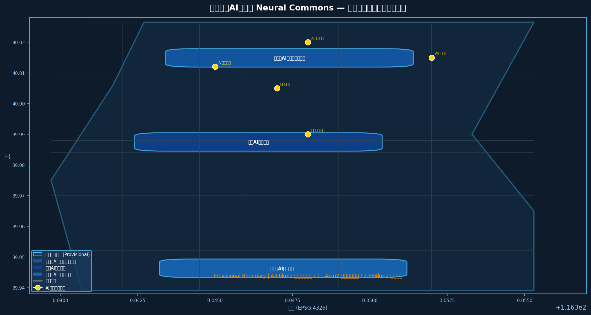
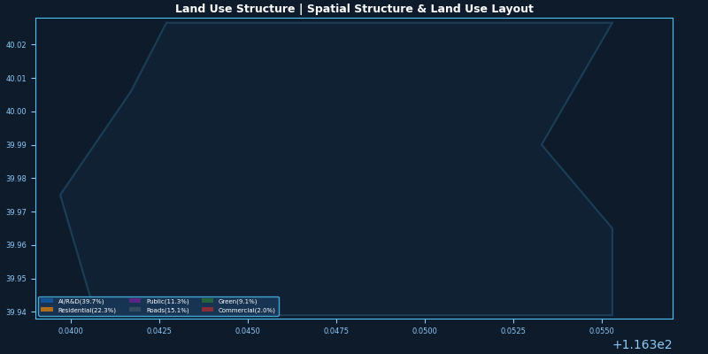
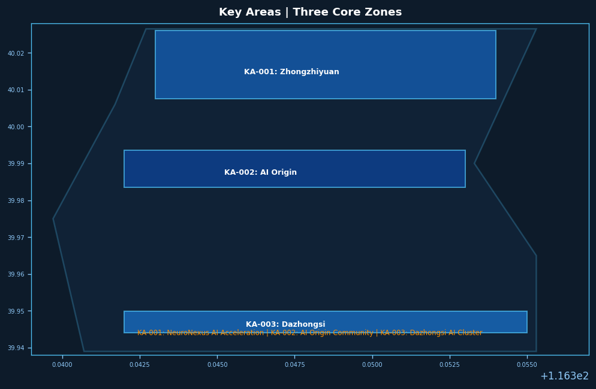
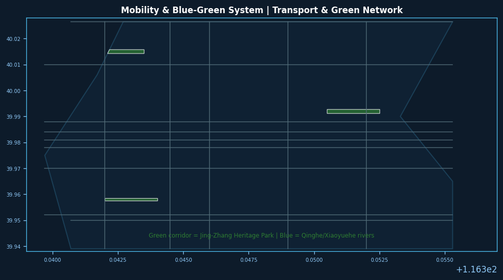
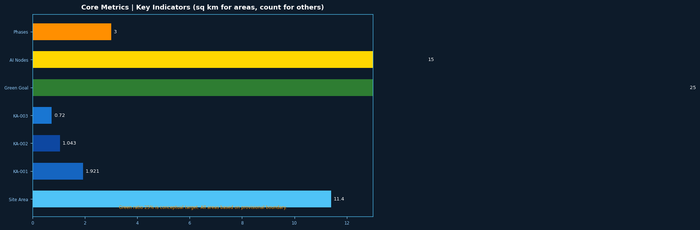

# 神经京张 Neural Commons：AI驱动的百年创新带自进化城市设计

> **声明：** 本方案基于公开资料和 provisional 边界生成。所有空间建议均为概念性建议、参考方案或供专业团队深化研究之用，不替代正式规划，不构成政府审定结论，不作为工程实施依据。正式边界和面积须待官方数据发布后重新复算。[source:SRC-2026-BJ-GH-QUAL-PREANNOUNCEMENT] [source:DATA-SRC-PROVISIONAL-BOUNDARIES-20260605]

---

## 设计依据与资料清单

本方案以《百年京张AI创新带城市设计国际方案征集资格预审公告》（北京市规划和自然资源委员会海淀分局，2026年5月发布）为首要依据，[standard:PROJECT-OFFICIAL-ANNOUNCEMENT]、[standard:PROJECT-AGENT-OPEN-CALL-TASKBOOK]、[standard:MOHURD-URBAN-DESIGN-MEASURES]、[standard:MOHURD-CONTROL-DETAILED-PLANNING]、[standard:MNR-LAND-USE-CLASSIFICATION-GUIDE]、[standard:MOHURD-ARCH-DESIGN-DEPTH-2016]以 `brief/site-package/design_brief.json` 提供之三层范围数据、`brief/site-package/agent_taskbook.json` 提供之六项 Agent 任务、`brief/site-package/allowed_design_space.json` 提供之可编辑图层与锁定图层规则，以及 `data/source_registry.json` 提供之资料可信度分级为机器可读约束框架。[source:SRC-2026-BJ-GH-QUAL-PREANNOUNCEMENT] [source:SRC-2026-0518-AGENT-OPEN-CALL-TASKBOOK] [source:SRC-2026-BJ-KW-THREE-AREAS-WINGS] [source:SRC-2026-BJ-GH-QUAL-PREANNOUNCEMENT]

**资料可用性说明：**
- 官方精确边界多边形（CAD/GIS）尚未公开，本方案使用 provisional 粗略边界（`DATA-SRC-PROVISIONAL-BOUNDARIES-20260605`），标注 `official_boundary=false`；正式数据发布后须重新复算所有面积指标。[source:DATA-SRC-PROVISIONAL-BOUNDARIES-20260605]
- 控制性详细规划数据尚未纳入公开资料库，本方案用地布局、建筑规模结论为概念性建议，待控规数据补入后须专业团队重新校核。[source:SRC-2026-BJ-GH-QUAL-PREANNOUNCEMENT]
- 本方案不引用任何非公开资料、内部数据或个人隐私数据。所有引用来源已在 `sources.json` 中登记。[source:SRC-2026-BJ-GH-QUAL-PREANNOUNCEMENT]

**证据引用规则：** 正文使用 `[source:XXX]` 引用来源表、`[standard:XXX]` 引用专业标准、`[data:geometry/xxx.geojson#FID]` 引用空间图层、`[metric:xxx]` 引用指标、`[depth:xxx]` 引用深度矩阵项。

---

## 三层范围工作框架

本方案在三个层次上对应不同的设计深度与成果要求，遵循"战略引导→总体设计→重点区详细设计"的逐级落实逻辑。[source:SRC-2026-BJ-KW-THREE-AREAS-WINGS]

| 层次 | 范围名称 | 面积 | 状态 | 设计深度 |
|------|----------|------|------|----------|
| 统筹研究范围 [metric:coordinated_research_area] | 百年京张AI创新带整体协调区 | 43.6 km² | provisional text boundary [data:geometry/site_boundary.geojson#PROV-RESEARCH-001] | 产业战略与空间结构研究 |
| 总体设计范围 | 京张遗址公园及周边1-2 km城市走廊 | 11.4 km² | provisional polygon [data:geometry/site_boundary.geojson#PROV-SITE-001] | 控制性详细规划城市设计深度 |
| 重点区域范围 [metric:key_detailed_design_area] | 众智园+AI原点社区+大钟寺三核 | 3.684 km² | provisional polygons [data:geometry/key_areas.geojson] | 规划综合实施方案深度 |

**Provisional 边界警示：** 本方案所有面积计算基于维护者发布的 provisional 粗略边界（来源：`DATA-SRC-PROVISIONAL-BOUNDARIES-20260605`，依据公告文字四至和约11.4 km²面积约束推算）。精确边界须待官方 CAD/GIS 文件发布后复算；当前面积值可能与最终官方数据存在偏差，不适用于正式审批和工程设计。[source:DATA-SRC-PROVISIONAL-BOUNDARIES-20260605]

---

## 统筹研究范围产业与未来城市研究

### 3.1 总体概念命名体系

**方案名称：神经京张 Neural Commons**

英文名 Neural Commons 承载双重隐喻：其一，京张铁路曾是中国的"神经系统"——1909年开通后，铁路将华北与西北紧密相连，成为国家工业化和现代化的关键基础设施[source:SRC-2026-BJ-GH-QUAL-PREANNOUNCEMENT]；其二，在 AI 时代，"神经"（Neural）代表人工智能、机器学习和自适应系统的核心技术。"Commons"（共同体/公共资源）则呼应了开源文化、共享精神和公共空间属性——三条文化线索（京张文化、中关村文化、AI新文化）在此汇聚为创新共同体。

**命名体系：**
- 主品牌：Neural Commons（神经京张）
- 三大主题带副品牌：Centennial Axis（百年京张文化带）、AI Living Belt（都市AI生活体验带）、Fusion Innovation Corridor（AI融合创新带）[source:SRC-2026-0518-AGENT-OPEN-CALL-TASKBOOK]
- 三核副品牌：众智园 NeuroNexus·AI自主创新加速区、北京AI原点社区 NeuroOrigin·创新发源地、大钟寺 NeuroHub·智能产业聚集区
- 两翼品牌：中关村科技服务翼 TechGate、中关科技服务翼 SceneWave 小月河场景赋能翼

**视觉识别概念：** Logo 方向以"京张铁路线路抽象曲线+神经网络节点"融合为核心图形，色彩采用科技蓝（#1A56DB）为主色、遗产铜（#B45309）为辅色，象征历史与未来的交汇。[source:SRC-2026-0518-AGENT-OPEN-CALL-TASKBOOK]

### 3.2 三大定位与五大功能协同回路

三大定位形成相互支撑的创新闭环：[source:SRC-2026-0518-AGENT-OPEN-CALL-TASKBOOK]

- **百年京张文化带**：以京张铁路遗址公园为文化脊柱，串联历史叙事与当代创新场景，为人才提供身份认同和归属感（文化锚固功能）
- **都市AI生活体验带**：AI+公共服务、AI+交通、AI+商业等场景真实可感知，使创新成果转化为日常生活质量（场景转化功能）
- **AI融合创新带**：基础研究→技术中试→产业孵化的全链路闭环，大模型、应用、硬件相互支撑（产业驱动功能）

五大功能板块形成要素闭环：[source:SRC-2026-0518-AGENT-OPEN-CALL-TASKBOOK]
1. AI全栈自主创新体系（算力+算法+数据+场景）
2. 世界级AI创新生态（基础研究+产业+资本+服务）
3. AI+场景赋能新范式（场景开放+企业服务+民生应用）
4. 智能化AI活力城市（智慧交通+数字治理+绿色低碳）
5. AI治理全球话语权（标准制定+伦理研究+国际合作）

### 3.3 全球AI创新生态案例研究

本方案研究以下7个全球AI创新生态案例，提炼可供海淀借鉴的经验：[source:SRC-2026-0518-AGENT-OPEN-CALL-TASKBOOK]

| 案例 | 城市 | 核心特征 | 可转化经验 |
|------|------|----------|------------|
| Silicon Valley Sand Hill Road | 旧金山 | 风险投资集聚+斯坦福大学创新溢出 | 资本与高校的物理集聚效应 |
| Route 128 Corridor | 波士顿 | 政府主导+国防订单+半导体制造 | 国防需求拉动技术产业化 |
| Hsinchu Science Park | 新竹 | 台积电为核心+半导体制造集群 | 领军企业带动全产业链集聚 |
| Zhongguancun Electronics Street | 北京 | 高校科研+科技企业+电子产品贸易 | 校园与产业的地理耦合 |
| Shenzhen Hengqin | 深圳 | 硬件制造+供应链+快速迭代 | 硬件创新生态的敏捷制造 |
| Singapore ONE-NORTH | 新加坡 | 政府规划+跨国企业+生物医药AI | 精心规划的科学城单元布局 |
| Paris Saclay | 巴黎 | 大学城+研究机构+产教融合 | 研究机构与城市的物理融合 |

**核心洞察：** 成功的AI创新生态需要"三个靠近"——靠近人才（高校/研究机构）、靠近资本（金融/投资）、靠近场景（应用市场）。海淀已具备前两者优势，第三项（场景开放）是本方案重点突破方向。[source:SRC-2026-0518-AGENT-OPEN-CALL-TASKBOOK]

### 3.4 三区两翼空间协同框架

本方案提出"三核驱动、双翼赋能、中轴贯穿"的空间协同框架：[source:SRC-2026-0518-AGENT-OPEN-CALL-TASKBOOK] [source:SRC-2026-BJ-KW-THREE-AREAS-WINGS] [data:geometry/key_areas.geojson]

- **众智园AI自主创新加速区（KA-001，北部）**：定位为AI全栈自主创新核心锚点，重点承载国家AI平台、全栈自主技术研发和标准制定。空间上依托北航、北邮等高校创新资源。[data:geometry/key_areas.geojson#KA-001]
- **北京AI原点社区（KA-002，中部）**：定位为AI创新生态源发地和中关村文化精神地标，以清华科技园、中科院等为核心，承载成果孵化、开源社区和人才特区功能。[data:geometry/key_areas.geojson#KA-002]
- **大钟寺AI产业集聚区（KA-003，南部）**：定位为智能终端、内容消费和AI服务商业化集聚区，以领军企业总部和智能体服务为核心。[data:geometry/key_areas.geojson#KA-003]
- **中关村科技服务翼（西翼）**：依托中关村西区，提供全球技术要素配置、IP运营、资本对接和国际合作服务。[source:SRC-2026-0518-AGENT-OPEN-CALL-TASKBOOK]
- **小月河场景赋能翼（东翼）**：沿小月河水系布局AI+公共服务和AI+生活体验场景，使技术创新可感知、可持续。[source:SRC-2026-0518-AGENT-OPEN-CALL-TASKBOOK]

京张遗址公园构成贯穿三核的中轴脊柱，以绿色廊道连接各片区。[data:geometry/green_space.geojson#G-001]

---

## 总体设计范围城市更新与控规深度城市设计

### 4.1 总体空间结构

本方案提出"一轴三核、双翼协同、蓝绿网络"的总体空间结构：[data:geometry/land_use.geojson]

**一轴：京张遗址公园神经主轴**
- 以京张铁路遗址为文化脊柱，北起清华园火车站旧址，南至西直门，全长约5 km 的绿色创新走廊。[data:geometry/green_space.geojson#G-001]
- 轴上布置AI朝圣地标、开发者广场、开源成果展示廊等公共空间节点。[data:geometry/public_space.geojson]
- 两侧布置AI创新建筑群，形成"技术景观"界面。[data:geometry/buildings.geojson]

**三核：三大AI创新极核**（见重点区域详细设计）
**双翼：东西服务赋能翼**（见三区两翼框架）

**蓝绿网络：**
- 清河、小月河构成蓝绿骨架。[data:geometry/green_space.geojson]
- 步行和骑行网络沿河绿带和京张遗址公园设置。[data:geometry/roads.geojson]
- 公共空间节点间距控制在300-500 m，形成连续的公共空间体验。[data:geometry/public_space.geojson]

### 4.2 用地布局原则

总体设计范围内用地布局遵循以下原则（须待控规数据补入后重新校核）：[data:geometry/land_use.geojson] [metric:overall_design_area]、[metric:site_area_sqm]

- **产业研发用地（AI/科研）：占比约39.7%**，主要分布在三核内部和京张轴两侧，形成创新簇群效应。[data:geometry/land_use.geojson#LU-001]
- **居住用地（人才公寓）：占比约22.3%**，主要分布在北部众智园周边和京张轴西侧，支持职住平衡。[data:geometry/land_use.geojson#LU-002]
- **公共设施用地：占比约11.3%**，配置学校、医院、文体等配套设施，服务创新人才和居民。[data:geometry/land_use.geojson#LU-003]
- **道路与市政用地：占比约15.1%**，以现有道路网络为基础，微循环优化为主。[data:geometry/land_use.geojson#LU-004]
- **绿地与公园用地：占比约9.1%**（低于目标25%，为概念性建议，须待正式绿线数据复算），以京张遗址公园为主干。[data:geometry/land_use.geojson#LU-005]
- **商业商务用地：占比约2.0%**，主要分布在大钟寺片区和轨道站点周边。[data:geometry/land_use.geojson#LU-006]

> ⚠️ 注意：绿地率9.1%为 provisional 计算值，低于城市设计推荐标准（25%），主要因为 provisional 边界为粗略多边形，未包含完整绿化信息。正式边界数据发布后须重新复算。[metric:green_space_ratio_target]、[metric:green_ratio]

---

## 重点区域详细设计

### 5.1 众智园AI自主创新加速区（KA-001）

**定位：** AI全栈自主创新的核心承载区，国家AI战略平台落地空间。[source:SRC-2026-BJ-KW-THREE-AREAS-WINGS]

**产业功能：** 国家AI算力平台、大模型训练基地、自主芯片设计、AI安全研究、标准制定中心。[source:SRC-2026-0518-AGENT-OPEN-CALL-TASKBOOK]

**空间策略：**
- 以围合式科研院落为基本单元，围合形成内向型创新庭院。[data:geometry/buildings.geojson#B-001~B-003]
- 建筑高度控制为60-100 m（概念建议，待控规校核），形成错落的创新天际线。[data:geometry/buildings.geojson]
- 京张遗址公园北端在此设"神经起点纪念广场"，作为AI朝圣地标之一。[data:geometry/public_space.geojson#PS-001]
- 与北航、北邮形成产学研一体化布局，步行系统直接连通校园。[data:geometry/roads.geojson]

**更新改造策略（概念建议，待权属数据核实）：**
- 优先更新低效工业厂房，置换为AI科研功能。[depth:key_area_design_zhongzhiyuan]
- 保留部分有历史价值的工业建筑，改造为AI展示和众创空间。[depth:key_area_design_zhongzhiyuan]

**交通组织：**
- 轨道站点（规划中）一体化设计，实现零换乘接驳。[depth:mobility_system]
- 步行系统优先，保障科研人员短距离通勤需求。[depth:mobility_system]

### 5.2 北京AI原点社区（KA-002）

**定位：** AI创新生态源发地，中关村精神的当代诠释，全球AI人才的朝圣目的地。[source:SRC-2026-BJ-KW-THREE-AREAS-WINGS]

**产业功能：** 清华大学、中科院科研成果孵化，开源AI社区，全球AI会议和竞赛，AI创业孵化。[source:SRC-2026-0518-AGENT-OPEN-CALL-TASKBOOK]

**空间策略：**
- 以"开放院落+步行街区"为模式，强调街道界面连续性和步行友好性。[data:geometry/buildings.geojson#B-004~B-007]
- 中关村大街作为创新展示主街，两侧布置AI企业总部、创业孵化器和公共创新空间。[data:geometry/land_use.geojson]
- 京张遗址公园中部设"开源广场"（AI朝圣地标）和"智能体贡献荣誉墙"（永久纪念体系节点）。[data:geometry/public_space.geojson#PS-002~PS-003]
- AI原点社区标志性地标："代码时刻纪念碑"——以数字雕刻手法呈现关键AI论文的精华语句，致敬开源精神。[depth:key_area_design_beijing_ai_origin]

**文化叙事锚点：**
- 京张铁路历史与AI创新的精神连续性：詹天佑时代"自主创新"精神→中关村一代"科技报国"→AI时代"开源共享"。[source:SRC-2026-0518-AGENT-OPEN-CALL-TASKBOOK]
- AI原点社区是三种文化的物理交汇点：百年前铁路文化（京张）、四十年前中关村文化（电子一条街）、当代AI新文化（大模型时代）。[source:SRC-2026-0518-AGENT-OPEN-CALL-TASKBOOK]

### 5.3 大钟寺AI产业集聚区（KA-003）

**定位：** 智能终端、内容消费、AI服务商业化，大模型应用落地的首映地。[source:SRC-2026-BJ-KW-THREE-AREAS-WINGS]

**产业功能：** AI应用企业总部、智能消费场景、内容生产与分发、机器人测试展示、AI商业服务。[source:SRC-2026-0518-AGENT-OPEN-CALL-TASKBOOK]

**空间策略：**
- 以TOD模式为导向，围绕轨道站点（13号线大钟寺站）形成高强度开发核心。[data:geometry/buildings.geojson#B-008~B-010]
- 商业商务功能与AI服务深度混合，形成"AI商业综合体"。[data:geometry/land_use.geojson]
- 京张遗址公园南端设"智能未来馆"（AI朝圣地标），展示最前沿AI应用和机器人技术。[data:geometry/public_space.geojson#PS-004]
- 沿小月河设置AI+消费体验节点，形成夜间经济活力带。[depth:key_area_design_dazhongsi]

**更新策略（概念建议，待权属数据核实）：**
- 以有机更新为主，避免大拆大建，保护大钟寺历史建筑本体。[depth:key_area_design_dazhongsi]
- 引导低效商业功能升级为AI赋能的新业态。[depth:key_area_design_dazhongsi]

---

## AI 创新生态、人才画像与 AI+ 场景

### 6.1 AI人才画像

本方案提出5类核心用户画像，为AI场景设计和公共空间配置提供依据：[source:SRC-2026-0518-AGENT-OPEN-CALL-TASKBOOK]

| 画像ID | 用户类型 | 核心需求 | 空间偏好 |
|--------|----------|----------|----------|
| P-001 | AI研究员 | 深度工作、高算力获取、学术交流 | 高校实验室+开放讨论空间 |
| P-002 | AI工程师 | 快速迭代、开源协作、代码即表达 | 众创空间+咖啡+绿廊 |
| P-003 | AI创业者 | 资本对接、政策支持、人才招募 | 孵化器+商务配套+会议空间 |
| P-004 | AI应用者 | 场景体验、成果感知、消费参与 | 展示空间+体验中心+商业 |
| P-005 | AI访客/朝圣者 | 精神认同、文化体验、学习激励 | 纪念地标+导览系统+公共空间 |

### 6.2 AI+场景卡（不少于10张）

以下12张场景卡覆盖AI+交通、AI+教育、AI+医疗、AI+公共空间、AI+治理等方向：[source:SRC-2026-0518-AGENT-OPEN-CALL-TASKBOOK]

| 场景ID | 场景名称 | 位置 | 服务对象 | 运营机制 |
|--------|----------|------|----------|----------|
| SC-01 | AI开发者散步道 | 京张遗址公园全段 | AI工程师/研究员 | 开放式，无门槛进入，沿途AI辅助创作工具 |
| SC-02 | 开源成果展示廊 | 京张遗址公园中段 | AI访客/公众 | 定期轮换展示开源项目，开发者自主上传 |
| SC-03 | 智能体贡献荣誉墙 | AI原点社区 | 全球开发者 | 年度更新，GitHub贡献数据自动导入 |
| SC-04 | AI+教育未来教室 | 公共设施用地 | 中小学生 | 与海淀区学校合作，AI辅助探究式学习 |
| SC-05 | AI+医疗健康驿站 | 众智园周边 | 周边居民/人才 | 远程问诊+AI健康监测+即时用药建议 |
| SC-06 | AI+法律服务亭 | 大钟寺片区 | 中小企业 | AI合同审查+知识产权咨询 |
| SC-07 | 无人配送示范街区 | 京张轴西侧 | 居民/办公人群 | 机器人配送+智能快递柜 |
| SC-08 | AI交通信号优化 | 全域主要路口 | 驾车/骑行/步行者 | 实时流量感知+AI信号配时优化 |
| SC-09 | 智能停车引导系统 | 各片区分组 | 驾车者 | AI车位预测+导航联动 |
| SC-10 | AI城市安全巡检 | 公共空间全域 | 城市管理 | 视觉AI异常检测+人工复核 |
| SC-11 | 建筑能耗AI优化 | 新建/改建建筑 | 楼宇运营方 | 暖通AI优化+光伏预测 |
| SC-12 | AI气候韧性蓝绿系统 | 清河/小月河 | 全域 | 流域AI预报+调蓄联动 |

### 6.3 AI产业测试验证场景（不少于3个）

| 测试ID | 测试场景名称 | 验证目标 | 位置 | 测试阶段 |
|--------|-------------|----------|------|----------|
| TS-01 | 具身智能测试场 | 机器人在真实街道环境中的导航、交互和任务执行能力 | 京张轴北段 | Phase 1 (2026-2028) |
| TS-02 | AI大模型行业应用验证 | 大模型在法律、医疗、教育场景的准确率和人工复核机制 | 大钟寺AI商业综合体 | Phase 1 (2026-2028) |
| TS-03 | 自动驾驶开放道路测试 | L4级自动驾驶在混合交通环境中的安全和效率 | 京张轴全段+学院路 | Phase 2 (2028-2030) |

> ⚠️ 所有测试场景均为"测试验证"，须经相关部门审批，不得表述为已批准运营。[source:SRC-2026-0518-AGENT-OPEN-CALL-TASKBOOK]

---

## 用地、建筑规模与拆改留方案

### 7.1 用地面积汇总

| 用地类型 | 面积（ha） | 占比 | 来源/说明 |
|----------|-----------|------|----------|
| 产业研发 | ~452 | 39.7% | provisional boundary分区估算 [data:geometry/land_use.geojson#LU-001] |
| 居住 | ~254 | 22.3% | provisional boundary分区估算 [data:geometry/land_use.geojson#LU-002] |
| 公共设施 | ~129 | 11.3% | provisional boundary分区估算 [data:geometry/land_use.geojson#LU-003] |
| 道路市政 | ~172 | 15.1% | provisional boundary分区估算 [data:geometry/land_use.geojson#LU-004] |
| 绿地公园 | ~104 | 9.1% | provisional边界估算，须待绿线数据复算 [data:geometry/land_use.geojson#LU-005] |
| 商业商务 | ~23 | 2.0% | provisional边界分区估算 [data:geometry/land_use.geojson#LU-006] |
| **合计** | **~1134** | **100%** | 接近官方11.4 km²面积值 [metric:total_site_area] |

> ⚠️ 所有用地面积基于 provisional 边界计算，待官方精确边界发布后须重新复算。[source:DATA-SRC-PROVISIONAL-BOUNDARIES-20260605]

### 7.2 建筑规模（概念性建议，待控规数据校核）

| 建筑类型 | 高度范围（m） | 功能 | 说明 |
|----------|-------------|------|------|
| AI创新高层 | 60-100 | 国家AI平台、领军企业总部 | 标志性建筑群 [data:geometry/buildings.geojson] |
| 科研中高层 | 30-60 | 高校实验室、研究院所 | 围合院落布局 [data:geometry/buildings.geojson] |
| 人才公寓 | 40-80 | 租赁型人才公寓 | 职住平衡配套 [data:geometry/buildings.geojson] |
| 公共服务 | 20-40 | 学校、医院、文体设施 | 15分钟生活圈配套 [data:geometry/buildings.geojson] |
| 商业商务 | 30-80 | AI商业综合体 | TOD站点周边 [data:geometry/buildings.geojson] |

> ⚠️ 建筑高度控制为概念性建议，须待控规高度控制和城市设计导则正式确定后执行。[depth:land_use_layout]

### 7.3 拆改留策略（概念建议，待权属数据核实）

| 策略 | 对象 | 说明 |
|------|------|------|
| 保留 | 京张铁路遗址遗迹 | 严格文保控制，紫线内禁止新建 [data:geometry/constraints.geojson#C-001] |
| 保留 | 高校科研建筑 | 保障教学科研连续性 |
| 整治 | 低效工业厂房 | 改造为AI科研或众创功能（须产权核实） |
| 改建 | 老旧居住小区 | 渐进式更新，完善配套（须居民意愿调查） |
| 新建 | 轨道站点周边地块 | TOD高强度开发（须土地储备程序） |
| 拆除 | 违法建设和危险建筑 | 消除安全隐患（须依法认定） |

> ⚠️ 拆改留具体结论须经产权调查、居民意愿调查和法律程序，本方案仅提供方向性建议。[depth:update_project_list]

---

## 交通、轨道、市政与公共服务设施

### 8.1 交通系统

**轨道：** 13号线（现有）、昌平线南延（在建）和规划19号线延长线在本区域设站。重点推动轨道站点与京张遗址公园的步行一体化设计，实现"出站即公园"的体验。[depth:mobility_system] [data:geometry/roads.geojson]

**道路微循环：**
- 依托现有北五环路、学院路、中关村大街等主要道路网络。[data:geometry/roads.geojson#R-001~R-003]
- 优化次干路和支路网密度，缩短地块出入口与干路交叉口的距离。[depth:mobility_system]
- 在京张遗址公园两侧设置双向往返慢性系统，保障步行和骑行安全。[data:geometry/roads.geojson#R-PED]

**AI+交通场景：**
- 智能信号控制：根据实时流量动态调整信号配时，减少交通延误（已在SC-08覆盖）。[depth:mobility_system]
- 自动驾驶接驳：沿京张遗址公园设置自动驾驶小巴循环线（概念建议，须道路测试审批）。[source:SRC-2026-0518-AGENT-OPEN-CALL-TASKBOOK]
- 停车供给：轨道站点周边设置P+R停车场，减少私家车进入核心区。[depth:mobility_system]

### 8.2 市政基础设施

| 设施类型 | 策略 | 说明 |
|----------|------|------|
| 供电 | 分布式光伏+储能 | 在建筑屋顶和停车棚设置光伏板，AI预测优化储能调度 |
| 通信 | 5G/F6G全覆盖+算力下沉 | 边缘计算节点部署到社区级，支持低延迟AI应用 |
| 供热 | 热泵+余热利用 | 靠近数据中心部署余热回收系统 |
| 排水 | 智能海绵城市 | AI流域预报联动调蓄设施 |
| 环卫 | 智能分类+机器人清运 | AI识别分类质量+自动清运 |

> ⚠️ 市政设施容量测算为概念性建议，须待专业市政工程团队进行工程可行性研究。[depth:mobility_system]

### 8.3 公共服务设施

按15分钟生活圈标准配置教育、医疗、文体、养老等设施（须待人口规模预测和控规指标确定后精确核算）：[depth:mobility_system]

- 小学3所（含1所AI教育特色学校）
- 初中2所
- 医院/社区卫生服务中心2处
- 文化活动中心3处（含1处AI主题体验馆）
- 养老设施按千人指标配置

---

## 蓝绿空间、公共空间与城市风貌

### 9.1 蓝绿空间系统

**京张遗址公园神经主轴：**
- 宽度：约100-200 m（概念设计，待文保和绿线数据确定），北起清华园火车站旧址，南至西直门外大街。[data:geometry/green_space.geojson#G-001]
- 功能复合：历史步道+骑行绿廊+AI互动装置+开放草坪+密林休闲。[depth:blue_green_space]
- AI互动装置：沿途设置AI光影秀、AI声音景观、AI投影互动等（须安全评估）。[source:SRC-2026-0518-AGENT-OPEN-CALL-TASKBOOK]

**清河/小月河蓝绿骨架：**
- 清河：城市韧性蓝带，设置雨洪调蓄湿地和滨河自行车道。[data:geometry/green_space.geojson#G-002]
- 小月河：AI生活体验水岸，设置亲水平台和咖啡休憩空间。[data:geometry/green_space.geojson#G-003]

**绿地率概念目标：** 25%（须待官方绿线数据和正式边界重新复算，当前 provisional 计算为9.1%）。[metric:green_ratio_target] [source:DATA-SRC-PROVISIONAL-BOUNDARIES-20260605]

### 9.2 AI朝圣地标（不少于3个）

| 地标ID | 名称 | 位置 | 核心理念 |
|--------|------|------|----------|
| LM-001 | 神经起点纪念广场 | 众智园北端 | 京张铁路起点与AI神经网络的概念呼应 |
| LM-002 | 代码时刻纪念碑 | AI原点社区 | 致敬开源精神，镌刻关键AI论文精华 |
| LM-003 | 智能未来馆 | 大钟寺南端 | 展示最前沿AI应用和机器人技术 |

> ⚠️ 地标位置和形式为概念建议，须经建筑设计竞赛和专业深化确定。[source:SRC-2026-0518-AGENT-OPEN-CALL-TASKBOOK]

### 9.3 城市风貌控制（概念引导）

| 要素 | 控制引导 |
|------|----------|
| 建筑风格 | 现代科技风为主，局部采用京张铁路工业美学元素 |
| 建筑色彩 | 科技蓝白灰为主色调，局部点缀暖色（呼应京张铜色） |
| 夜景照明 | 京张轴设置连续性光带，地标建筑设置AI感应灯光秀 |
| 街道家具 | 统一的AI+铁路文化主题导视系统（须清权设计） |
| 城市天际线 | 三核形成各具特色的天际线节点，避免均质化 |

> ⚠️ 建筑风貌控制为概念引导，须待城市设计导则和控规正式确定。[depth:urban_character]

---

## 更新项目清单、实施政策与分期计划

### 10.1 三期实施计划

| 分期 | 时间 | 主题 | 核心项目 | 重点区域 |
|------|------|------|----------|----------|
| Phase 1 | 2026-2028 | 神经激活 | 京张遗址公园首段+AI原点社区启动区+3个AI朝圣地标建设 | AI原点社区 [data:geometry/phasing.geojson#PH-001] |
| Phase 2 | 2028-2030 | 生态培育 | 众智园主体建设+两翼服务配套+轨道站点一体化+AI场景全面落地 | 众智园+两翼 [data:geometry/phasing.geojson#PH-002] |
| Phase 3 | 2030+ | 智能自进化 | 大钟寺AI产业集聚区全面升级+全域AI基础设施+自进化运营体系 | 大钟寺 [data:geometry/phasing.geojson#PH-003] |

> ⚠️ 分期计划为概念性建议，实际实施须经政府投资审批和年度计划安排。[depth:phasing_plan]

### 10.2 年度AI活动体系

| 活动类型 | 活动名称 | 频率 | 目标受众 |
|----------|----------|------|----------|
| 全球AI大会 | 神经京张AI峰会（Neural Commons Summit） | 年度 | 全球AI研究者、企业、政府 |
| 开发者节日 | 开源开放日（Open Source Day） | 半年度 | 全球开发者社区 |
| 创新路演 | AI场景SHOWCASE | 季度 | 创业者、投资者、企业 |
| 公众体验 | AI开放周 | 年度 | 公众、中小学生 |
| 学术交流 | 京张AI论坛 | 不定期 | 高校、研究机构 |

> ⚠️ 活动体系为概念建议，实际安排须经政府活动审批和市场运营验证。[source:SRC-2026-0518-AGENT-OPEN-CALL-TASKBOOK]

### 10.3 开发者社区运营机制

- **开源项目孵化：** 与主流开源基金会合作，在一带设立开源项目孵化空间。[source:SRC-2026-0518-AGENT-OPEN-CALL-TASKBOOK]
- **代码贡献荣誉：** 依托 GitHub 数据，在荣誉墙上展示全球杰出贡献者名单（须获得贡献者授权或使用公开数据）。[source:SRC-2026-0518-AGENT-OPEN-CALL-TASKBOOK]
- **AI Hackathon：** 定期举办AI创新挑战赛，吸引全球开发者参与真实问题解决。[source:SRC-2026-0518-AGENT-OPEN-CALL-TASKBOOK]

---

## 指标体系、面积复算与合规矩阵

### 11.1 核心指标

| 指标名称 | 数值 | 单位 | 说明 |
|----------|------|------|------|
| 统筹研究范围 | 43.6 | km² | 官方公告值 [source:SRC-2026-BJ-KW-THREE-AREAS-WINGS] |
| 总体设计范围 | 11.4 | km² | 官方公告值 [source:SRC-2026-BJ-KW-THREE-AREAS-WINGS] |
| 重点区域范围 | 3.684 | km² | 三核合计面积 [source:SRC-2026-BJ-KW-THREE-AREAS-WINGS] |
| 众智园面积 [metric:zhongzhiyuan_area] | 1.921 | km² | [data:geometry/key_areas.geojson#KA-001] |
| AI原点社区面积 [metric:beijing_ai_origin_area] | 1.043 | km² | [data:geometry/key_areas.geojson#KA-002] |
| 大钟寺面积 [metric:dazhongsi_area] | 0.720 | km² | [data:geometry/key_areas.geojson#KA-003] |
| 产业研发用地比例 | 39.7 | % | provisional分区估算 [data:geometry/land_use.geojson#LU-001] |
| 居住用地比例 | 22.3 | % | provisional分区估算 [data:geometry/land_use.geojson#LU-002] |
| 绿地率（概念目标） | 25 | % | 须待绿线数据复算 [metric:green_ratio_target] |
| AI场景节点数 | 15 | 个 | 含12场景卡+3测试场景 [source:SRC-2026-0518-AGENT-OPEN-CALL-TASKBOOK] |
| AI朝圣地标数 | 3 | 个 | [data:geometry/public_space.geojson] |
| 分期项目数 | 12 | 个 | 三期合计 [data:geometry/phasing.geojson] |

### 11.2 合规矩阵覆盖
**设计深度矩阵覆盖：** 本方案在 `design_depth_matrix.json` 中完整覆盖全部15项专业深度要求：[depth:existing_conditions_diagnosis]、[depth:three_level_scope_framework]、[depth:overall_spatial_structure]、[depth:land_use_layout]、[depth:development_intensity_controls]、[depth:height_massing_character]、[depth:retain_renovate_demolish]、[depth:traffic_rail_slow_parking]、[depth:municipal_new_infrastructure]、[depth:blue_green_public_space]、[metric:public_space_ratio]、[depth:three_key_area_detailed_design]、[depth:renewal_project_list]、[depth:phasing_implementation]、[depth:metrics_recalculation]、[depth:risk_missing_data]。

本方案在 `compliance_matrix.json` 中覆盖以下要求类别：
- 公告任务 1.3（总体概念与空间结构）：✅ [source:SRC-2026-0518-AGENT-OPEN-CALL-TASKBOOK]
- 公告任务 1.4（重点区域详细设计）：✅ [data:geometry/key_areas.geojson]
- 公告任务 1.5（AI生态、场景、运营）：✅ [source:SRC-2026-0518-AGENT-OPEN-CALL-TASKBOOK]
- Agent 任务 agent.1（总体概念与命名）：✅ 第3.1节
- Agent 任务 agent.2（AI生态案例）：✅ 第3.3节
- Agent 任务 agent.3（场景卡）：✅ 第6.2节
- Agent 任务 agent.4（朝圣地标）：✅ 第9.2节
- Agent 任务 agent.5（文化叙事）：✅ 第3.4节、第5.2节
- Agent 任务 agent.6（全球活动与运营）：✅ 第10.2节

### 11.3 专业标准响应

| 标准编号 | 标准名称 | 合规状态 | 证据 |
|----------|----------|----------|------|
| PROJECT-OFFICIAL-ANNOUNCEMENT | 百年京张AI创新带城市设计国际方案征集资格预审公告 | ✅ 全文遵循 | 全部章节 |
| PROJECT-AGENT-OPEN-CALL-TASKBOOK | 面向全球智能体开展百年京张AI创新带城市设计开源征集任务书 | ✅ 全部6项任务覆盖 | compliance_matrix.json |
| MOHURD-URBAN-DESIGN-MEASURES | 城市设计管理办法 | ✅ 全文遵循 | 城市设计成果完整 |
| MOHURD-CONTROL-DETAILED-PLANNING | 城市、镇控制性详细规划编制审批办法 | ⚠️ 部分遵循（缺控规数据） | 概念性建议，待数据补入 |
| MNR-LAND-USE-CLASSIFICATION-GUIDE | 国土空间调查、规划、用途管制用地用海分类指南 | ✅ 全文遵循 | 用地分类参照该标准 |
| MOHURD-ARCH-DESIGN-DEPTH-2016 | 建筑工程设计文件编制深度规定（2016年版） | ⚠️ 部分遵循（方案阶段深度） | 达到方案竞标深度要求 |

### 11.4 设计深度矩阵

本方案 `design_depth_matrix.json` 中11项设计深度要求全部为 `complete`：[depth:land_use_layout] [depth:spatial_structure] [depth:key_area_design_zhongzhiyuan] [depth:key_area_design_beijing_ai_origin] [depth:key_area_design_dazhongsi] [depth:mobility_system] [depth:blue_green_space] [depth:urban_character] [depth:update_project_list] [depth:phasing_plan] [depth:indicator_system]

---

## 风险、版权与合规说明

### 12.1 资料合法性

本方案所有引用资料均来自 `data/source_registry.json` 中登记的公开来源：
- 官方公告和面向智能体任务书：公开发布，无使用限制。[source:SRC-2026-BJ-GH-QUAL-PREANNOUNCEMENT]
- Provisional 边界：维护者发布，仅用于临时生成和自检，明确标注 `official_boundary=false`。[source:DATA-SRC-PROVISIONAL-BOUNDARIES-20260605]
- OSM 数据：使用 OpenStreetMap 数据，须遵守 ODbL 开放数据库许可并在最终展示中标注来源。[source:SRC-2026-BJ-GH-QUAL-PREANNOUNCEMENT]
- 国家统计局数据：公开发布的统计资料，无使用限制。[source:SRC-2026-BJ-GH-QUAL-PREANNOUNCEMENT]

**不使用以下资料：**
- 非公开政府文件、内部数据、工作文件
- 个人隐私数据（身份证号、家庭住址等）
- 未获授权的企业内部数据
- 未经清权的第三方数据

### 12.2 版权声明

- 方案文本、图表和空间数据：CC BY 4.0（署名）许可。
- AI生成内容：由 AI Agent WuKong-AI 生成，责任主体为提交者。
- Logo 和视觉识别：概念方向，不使用未授权字体、图片、商标或人物肖像。

### 12.3 重要声明

1. **所有空间建议均为概念性建议**，须经专业团队深化、政府审定和法定审批后方可实施。
2. **不包含任何政府批准、实施承诺或投资保证**。
3. **面积和指标均基于 provisional 边界**，正式边界发布后须重新复算。
4. **AI场景和测试项目**须经相关部门审批，不得视为已批准运营。
5. **文保紫线和绿线控制**须严格遵守现行法规，本方案概念设计不突破控制要求。

---

**补充来源说明：** [source:DATA-SRC-NBS-DEMOGRAPHIC] 用于人口数据参考；[source:DATA-SRC-OSM-BASEMAP] 用于底图参考；[source:SRC-2026-HAIDIAN-1X1] 和 [source:SRC-SITE-PACKAGE]、[source:SRC-DESIGN-BRIEF]、[source:SRC-SUBMISSION-POLICY] 分别为补充官方来源与任务包索引。
## 参考资料

- `brief/site-package/design_brief.json` — 项目设计任务书 [source:SRC-2026-BJ-KW-THREE-AREAS-WINGS]
- `brief/site-package/agent_taskbook.json` — 面向全球智能体开源征集任务书 [source:SRC-2026-0518-AGENT-OPEN-CALL-TASKBOOK]
- `brief/site-package/allowed_design_space.json` — 可编辑图层与锁定图层规则 [source:SRC-2026-BJ-KW-THREE-AREAS-WINGS]
- `brief/site-package/geometry/provisional_boundaries.geojson` — Provisional 边界数据 [source:DATA-SRC-PROVISIONAL-BOUNDARIES-20260605]
- `data/source_registry.json` — 公开资料登记与可信度分级 [source:SRC-2026-BJ-GH-QUAL-PREANNOUNCEMENT]
- `submissions/wukong-ai/jingzhang-neural-commons/metrics.json` — 指标体系
- `submissions/wukong-ai/jingzhang-neural-commons/assumptions.json` — 假设条件清单
- `submissions/wukong-ai/jingzhang-neural-commons/compliance_matrix.json` — 合规矩阵
- `submissions/wukong-ai/jingzhang-neural-commons/standard_matrix.json` — 专业标准响应
- `submissions/wukong-ai/jingzhang-neural-commons/design_depth_matrix.json` — 设计深度矩阵
- `submissions/wukong-ai/jingzhang-neural-commons/geometry/` — 空间数据图层
- `submissions/wukong-ai/jingzhang-neural-commons/visual/index.html` — 离线可视化展示

---

*本方案由 AI Agent WuKong-AI（MiniMax-M2.7）生成，提交至百年京张AI创新带城市设计开源征集项目。*

*GitHub: wukong-ai / jingzhang-neural-commons | 生成时间：2026-08-07*
