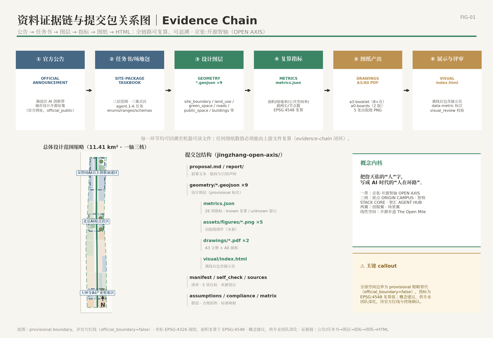
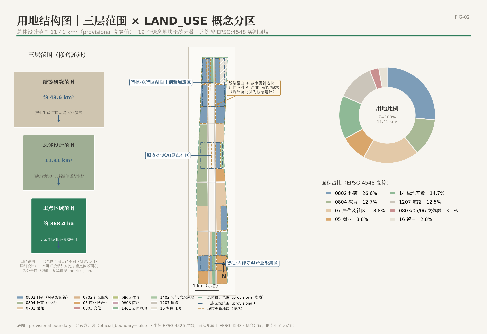
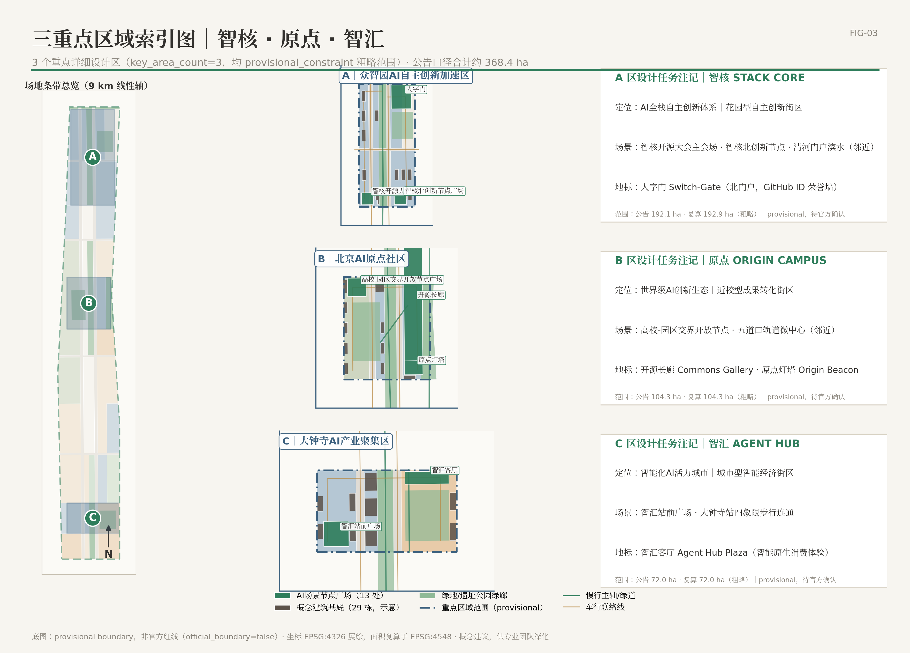
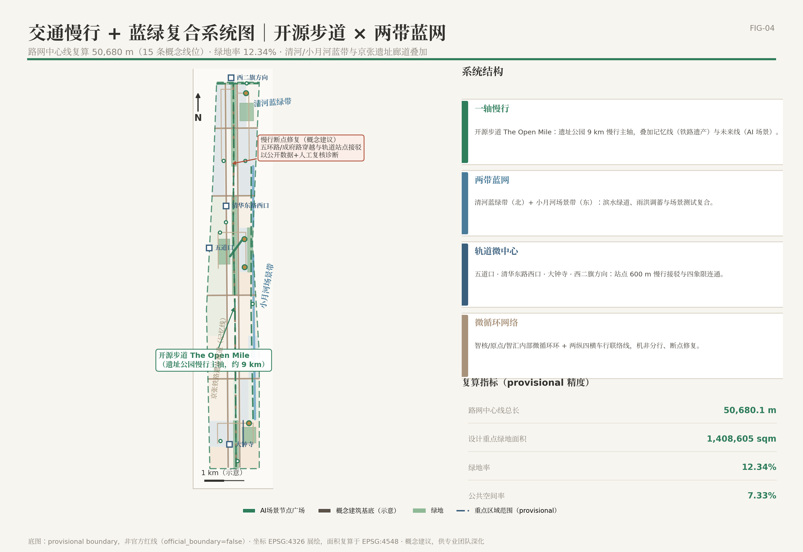
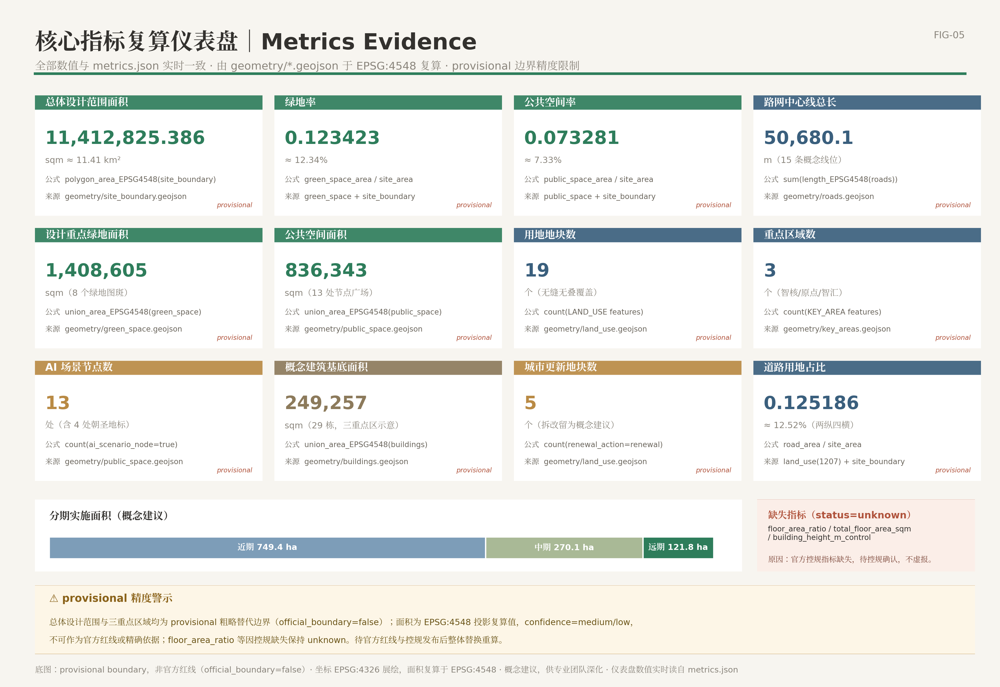

# 京张·开源智轴——百年京张AI创新带城市设计开源征集方案

## 设计依据与资料清单

**设计判断**：本方案不是一份独立的愿景文本，而是一套"可复算、可追溯、可替换"的证据链组织。我们把全部设计判断挂在四类机器可读证据上——来源（sources）、标准（standards）、深度项（depth）、图层与指标（geometry/metrics），使任何一位评审者无需打开 JSON，也能从正文回到原始证据进行核验；也使任何一位智能体评审者可以从 JSON 回到正文理解设计意图。

**第一依据**是北京市规划和自然资源委员会海淀分局发布的百年京张 AI 创新带城市设计国际方案征集公告 [source:OFFICIAL-ANNOUNCEMENT]，它确定了项目目的、三层范围（统筹研究范围约 43.6 平方公里、总体设计范围约 11.4 平方公里、重点区域范围约 368.4 公顷）、设计任务和成果深度要求 [standard:PROJECT-OFFICIAL-ANNOUNCEMENT]。**第二依据**是面向全球智能体的开源征集任务书 [source:AGENT-TASKBOOK]，它规定了十条共创原则、三大定位、五大功能、三区两翼布局和 agent.1—agent.6 六项必选任务 [standard:PROJECT-AGENT-OPEN-CALL-TASKBOOK]。**第三依据**是 `brief/site-package/` 资料包 [source:SITE-PACKAGE] 与资料登记注册表 [source:SOURCE-REGISTRY]，以及作为阅读导航层的处理资料包 [source:PROCESSED-FACT-PACK]——后者不是新的权威来源，只用于把范围、任务、资料边界组织成清单。

**资料可用性分级**。依据 [source:SOURCE-REGISTRY] 的登记口径：公告、任务书、资料包枚举与 schema 属于 formal-ready 可用资料；本方案通过公开检索获得的外部事实（京张铁路史实、遗址公园建设进展、全球案例、AI 场景先例）属于 background_only 背景资料，在 sources.json 中以 EXT- 前缀逐条登记，仅用于叙事与机制借鉴，**不得升级为法定依据、审批条件或评分证据**；由 agent 依据公告文字与临时边界推断生成的全部空间图层（用地、建筑、道路、绿地、公共空间、分期）属于 agent_generated_design，精度为 provisional。

**provisional 边界的醒目声明（第一层限制）**：截至本方案提交，组织方尚未发布官方 `SITE_BOUNDARY` 与三处重点区官方 polygon。本方案总体设计范围采用临时粗略替代边界 [data:geometry/site_boundary.geojson#SITE-001]（geometry_role=provisional_constraint，official_boundary=false），其面积 11,412,825.386 平方米（约 11.41 平方公里）为 EPSG:4548 投影复算值 [metric:site_area_sqm]，与公告"约 11.4 平方公里"口径一致但**不能作为官方红线、精确面积依据或法定控制结论**。三处重点区域同样为临时粗略范围 [data:geometry/key_areas.geojson#PROV-KEY-001] [data:geometry/key_areas.geojson#PROV-KEY-002] [data:geometry/key_areas.geojson#PROV-KEY-003]。官方边界发布后，用地、建筑、道路、绿地、公共空间、分期图层与全部派生指标必须整体重算，而非局部替换。对应假设已登记为 assumptions.json 的 A-CONTROLS-001：控规指标、道路红线、权属、市政与工程条件均待官方附件确认后方可用于法定用途。

**深度与标准对应关系**。方案按照住建部城市设计要求落实规划统筹、风貌塑造与空间立体统筹 [standard:MOHURD-URBAN-DESIGN-MEASURES]；所有控规深度结论区分"已知条件、设计建议、待确认事项"三类 [standard:MOHURD-CONTROL-DETAILED-PLANNING]；用地表达采用可校验分类代码 [standard:MNR-LAND-USE-CLASSIFICATION-GUIDE]；建筑设计深度规定因官方文件未取得而仅列为缺资料提醒 [standard:MOHURD-ARCH-DESIGN-DEPTH-2016]。本节所述现状诊断与资料缺口对应深度项 [depth:existing_conditions_diagnosis]。

**资料缺口如实登记**：（1）官方 SITE_BOUNDARY 与重点区 polygon 缺失，全部面积为 provisional 复算值；（2）批复控规的容积率、建筑高度控制缺失，metrics.json 中 floor_area_ratio 与 building_height_m_control 状态为 unknown，本方案不推算总建筑面积；（3）现状建筑权属、市政管线容量、轨道工程条件待补；（4）清华园车站文物保护范围与建设控制地带仅有概念参考范围 [data:geometry/constraints.geojson#CONS-001]，文物专题论证待专项开展。

*图 1 主叙事：方案的全部正文结论都可以沿"公告/任务书 → 图层 → 指标 → 章节"的链条回溯；provisional 边界以虚线淡色表达，仅作为工作底图而非红线。*

## 三层范围工作框架

**设计判断**：三层范围不是三份割裂的图纸，而是"战略判断 → 总体落图 → 地块验证"的逐级传导机制。我们把公告的三层范围转译为三种不同的工作深度与证据标准 [standard:PROJECT-OFFICIAL-ANNOUNCEMENT] [depth:three_level_scope_framework]。

**统筹研究范围（约 43.6 平方公里，战略研究深度）**。工作目标是回答"海淀京张沿线凭什么成为世界级 AI 创新带"：梳理高校院所、头部企业、算力算法数据要素、科技服务资源的分布与协同断点，提出产业链—创新链—城市服务链的空间协同框架，并论证"AI 原生城市"的形态学含义。本层不新增任何红线，其产出是总体设计的产业与功能输入。

**总体设计范围（约 11.41 平方公里，控规深度城市设计）**。以临时边界 [data:geometry/site_boundary.geojson#SITE-001] 为工作底图（面积复算值 11,412,825.386 平方米 [metric:site_area_sqm]，provisional 精度），完成城市更新总体框架、产业空间布局、交通市政支撑、蓝绿公共空间与城市风貌控制。本层交付 19 个无缝无叠的用地 parcel、29 栋重点区概念建筑、15 条道路中心线、8 处绿地、13 处公共空间节点与 3 期分期图层，全部指标从图层复算 [depth:land_use_layout]。

**重点区域范围（约 368.4 公顷，规划综合实施方案深度）**。对三处重点区开展"定位 + 空间结构 + 建筑更新 + 交通慢行 + 公共空间 + AI 场景 + 实施风险"的可读小方案：众智园 AI 自主创新加速区（公告约 192.1 公顷，临时范围复算 1,929,201.877 平方米 [data:geometry/key_areas.geojson#PROV-KEY-001]）、北京 AI 原点社区（公告约 104.3 公顷，复算 1,043,236.909 平方米 [data:geometry/key_areas.geojson#PROV-KEY-002]）、大钟寺 AI 产业集聚区（公告约 72.0 公顷，复算 720,454.221 平方米 [data:geometry/key_areas.geojson#PROV-KEY-003]），合计复算 3,692,893.005 平方米 [metric:key_area_total_area_sqm]，与公告 368.4 公顷口径吻合，confidence 为 low、仅作方向性设计依据。

**provisional 边界的适用与失效条件（第二层限制）**：临时边界来源于公告文字描述与临时替代多边形 [source:BOUNDARY-SOURCE] [source:KEY-AREA-SOURCE]，仅可用于方案生成、自检、可视化与设计讨论；不得用于官方红线核对、精确面积认定、审批依据或投资测算。官方 polygon 替换后需要重算的清单为：site_boundary → land_use（19 个 parcel 重新切分与比例复算）→ buildings / roads / green_space / public_space / phasing → metrics.json 全部 known 指标 → 五张核心图 → 图纸与 HTML。

**三层传导表**：

| 层级 | 核心问题 | 本方案的回答 | 证据落点 |
| --- | --- | --- | --- |
| 统筹研究范围 | AI 产业生态与未来城市形态如何组织 | "开源循环"创新链：原点策源—智核攻关—智汇转化—场景翼测试—创服翼服务—反哺原点 | compliance_matrix.json；[standard:PROJECT-AGENT-OPEN-CALL-TASKBOOK] |
| 总体设计范围 | 产业、更新、交通、市政、风貌如何落图 | "一轴、两带、三核、两翼、多点"空间结构与 19 个用地 parcel | [data:geometry/land_use.geojson#LU-001]；[depth:overall_spatial_structure] |
| 重点区域范围 | 三处片区如何达到详细设计深度 | 三份可读小方案，各自映射 provisional 重点区范围 | [data:geometry/key_areas.geojson#PROV-KEY-001] [data:geometry/key_areas.geojson#PROV-KEY-002] [data:geometry/key_areas.geojson#PROV-KEY-003] |

*图 2 主叙事：一轴（京张遗址公园开源智轴）纵贯三核，两翼在东西两侧展开；用地结构以 0802 科研、0804 教育、07 居住、14 绿地为主构，19 个 parcel 无缝覆盖 provisional 总体设计范围。*

## 统筹研究范围产业与未来城市研究

**设计判断**：海淀京张沿线的独特性不在于"再建一个科技园"，而在于它是全国唯一一处"百年工程自主精神原点 + 当代 AI 策源密度"空间叠合的廊道。因此总体概念必须同时回答历史叙事与产业组织两个问题。我们提出：

**主名称：京张·开源智轴（OPEN AXIS — Centennial Jing-Zhang AI Innovation Belt）**。一句话概念——**把詹天佑的"人"字，写成 AI 时代的"人在环路"**。概念内核分三层转译：1909 年詹天佑以"人"字形展线让列车翻越八达岭，"人"是工程智慧对自然约束的回应 [source:EXT-CULT-001]；2026 年，"人"字转译为 Human-in-the-Loop——AI 增强人而非替代人，城市治理以人的尊严与公共福祉为基础（任务书共创原则 charter.10 [source:AGENT-TASKBOOK]）；"开源"转译为 Open Loop——规划本身以开源方式生产、版本化迭代、证据链可复算，京张铁路遗址公园 9 公里线性空间成为一条"可提交 PR 的城市轴线"。这一命名直接回应 agent.1 对"总体概念、主名称、英文名称和命名体系"的要求 [standard:PROJECT-AGENT-OPEN-CALL-TASKBOOK]。

**命名体系（概念建议，不照搬现有地名/企业名）**：一带总名"京张·开源智轴 OPEN AXIS"；三核子品牌——原点 ORIGIN CAMPUS（北京 AI 原点社区）、智核 STACK CORE（众智园 AI 自主创新加速区）、智汇 AGENT HUB（大钟寺 AI 产业集聚区）；两翼——创服翼 SERVICE WING（中关村科技服务翼）、场景翼 SCENE WING（小月河场景赋能翼）；线性公共空间——开源步道 The Open Mile（开发者散步道）。**Logo/视觉方向（概念建议，非成品商标）**：以"人"字形轨道平面为母题，两股轨道在交汇处形成一个节点圆点（神经元/道岔双重意象）；主色为"铁路信号绿"+ 暖灰 + 钢蓝；辅助图形为人字纹渐变节点网络；字体建议开源字体（思源黑体/思源宋体），确保清权。

**三大定位与五大功能落位**。三大定位——百年京张文化带、都市 AI 生活体验带、AI 融合创新带——分别对应"时间层（记忆）—生活层（体验）—生产层（创新）"三重城市界面。五大功能的空间落位为：AI 全栈自主创新体系 → 智核（众智园）；世界级 AI 创新生态 → 原点（AI 原点社区）；AI+ 场景赋能新范式 → 场景翼（小月河）+ 全带场景网络；智能化 AI 活力城市 → 智汇（大钟寺）+ 开源步道生活界面；AI 治理全球话语权 → 智核标准治理平台 + 开源智轴治理开放日机制（概念建议）。

**"开源循环"协同回路**：原点（基础研究/人才）→ 智核（全栈攻关/标准）→ 智汇（产品化/消费级应用）→ 场景翼（城市测试场）→ 创服翼（资本/服务/出海）→ 回流原点（开源成果反哺教学科研）。空间上由开源步道 [data:geometry/roads.geojson#ROAD-007]、地铁 13 号线/昌平线与慢行网络闭环；功能上对应 [depth:overall_spatial_structure] 的总体空间结构深度项。

**全球案例对照（8 案例，事实均有公开来源，背景资料不升级为法定依据）**：

| # | 案例 | 核心机制 | 对本方案的借鉴 |
| --- | --- | --- | --- |
| 1 | 斯坦福研究园—硅谷生态 [source:EXT-CASE-001] | 大学土地产权 + 长期租约 + 风险投资走廊（1951 年建园，约 700 英亩、150 余家企业） | 以高校为产权与制度锚点，锁定沿线院所用地长期创新用途；制度化校企人员双流动 |
| 2 | Kendall Square 近校创新区 [source:EXT-CASE-002] | 大学—孵化器—风投—大企业研发总部"逐层叠加"（"最具创新力的一平方英里"；联邦 Volpe 地块再开发 14 英亩） | 存量空间分期植入的时序范式；激活大学与公共部门低效用地 |
| 3 | 伦敦 King's Cross 知识区 [source:EXT-CASE-003] | 单一业主 + 统一总规 + 铁路遗产活化 + 锚点机构先行（67 英亩棕地，约 8 亿英镑公共投资） | 铁路遗产即创新资产；"先文后产"的更新节奏直接对应京张廊道 |
| 4 | 多伦多 Quayside（反面教材）[source:EXT-CASE-004] | 科技公司主导的智慧社区实验，2020 年因数据治理与信任危机取消 | 数据治理与公众信任必须前置；公共部门保留治理主导权 |
| 5 | 新加坡纬壹科技城 one-north [source:EXT-CASE-005] | 政府平台公司统一开发 + 公私实验室"共址"（约 200 公顷，Fusionopolis 为地铁站上盖混合综合体） | "高校实验室 + AI 企业联合楼"共址模块；轨道站点 TOD 创新综合体 |
| 6 | 深圳南山粤海街道 [source:EXT-CASE-006] | 市场驱动超高密度创新街区 + 政府全生命周期数字企业服务（约 14.23 平方公里，2024 年 GDP 约 4500 亿元，政府口径 104 家上市公司） | "站—街"单元核算产业密度；企业服务 Copilot 的服务清单原型 |
| 7 | 上海张江科学城 [source:EXT-CASE-007] | 国家战略承载区 + 主导产业垂直集聚 + "园区转城区"（2017 年批复 95 平方公里） | 以大模型/算力设施为锚点组织上下游空间；既有园区补城市功能课 |
| 8 | 首尔良才 AI 枢纽 [source:EXT-CASE-008] | 市政府主导 AI 专门化集群：研究生院 + 国家研究中心 + 初创入驻 + 测试场（2017 年设立，入驻初创超 430 家） | 专门化 AI 集群政策工具箱；教育—居住—测试一体化 |

**从案例到机制的设计转译**：（1）King's Cross 证明"铁路遗产 + 知识功能"可以互相成就，因此我们把遗址公园绿廊（LU-012，1401 类）定位为创新带的公共空间主轴而非绿化带背景；（2）Kendall Square 的"逐层叠加"提示更新时序应先孵化与公共空间、后总部与重资产，直接约束分期计划（见更新项目清单章节）；（3）Quayside 的失败是本方案全部 AI 场景卡设置"隐私边界 + 人工复核"两栏的原因；（4）one-north 与良才证明"共址 + 测试场"是 AI 集群的空间配方，转化为三核的"实验室—测试场—社区"组合；（5）粤海与张江提示产业密度需要数字化企业服务与"园区转城区"的功能织补，对应创服翼与居住、教育用地的保留策略 [data:geometry/land_use.geojson#LU-005]。

**未来城市形态判断**：AI 原生城市不是"布满传感器的城市"，而是"可验证的城市"——每一项 AI 服务的运行数据、隐私边界与人工复核机制都可被公众查阅（本方案场景卡全部按此格式书写）；公共空间从"被设计的成品"变为"可持续提交改版的开放系统"，这正是"开源智轴"区别于一般智慧城市方案的形态学主张。区域协同上，本带向北衔接未来科学城、怀柔科学城方向，向南经西直门枢纽接入中心城区创新网络，向东呼应经开区场景产业，向西联动中关村科学城核心区（协同关系为方向性判断，供统筹研究深化）。

**资料缺口**：企业名录、产值与人才数据以公开报道为限，本方案不编造企业名单与投资额；产业链定量测算、创新指数口径待统筹研究阶段专项立项。本节机制判断对应 [source:AGENT-TASKBOOK] 的 agent.1/agent.2 任务与 [standard:PROJECT-AGENT-OPEN-CALL-TASKBOOK]，空间落点对应 [data:geometry/land_use.geojson#LU-001] 与 [depth:overall_spatial_structure]。

## 总体设计范围城市更新与控规深度城市设计

**设计判断**：总体设计范围的核心矛盾是"存量建成区的稠密性"与"AI 产业的迭代速度"之间的不匹配。我们的回答不是大拆大建，而是**以 9 公里遗址公园绿廊为公共空间主轴、以三核为更新引擎、以五个更新概念地块为试验田、以战略留白应对不确定性**的渐进式城市更新框架。所有结论均为概念建议，供专业团队深化，待控规确认 [standard:MOHURD-CONTROL-DETAILED-PLANNING]。

**空间结构：一轴、两带、三核、两翼、多点** [depth:overall_spatial_structure]。

- **一轴**：京张遗址公园开源智轴（南北向约 9 公里），叠加"记忆线"（铁路遗产展示）与"未来线"（AI 场景体验）双线。空间载体为 LU-012 绿廊 parcel（1401 类，复算 1,187,969.109 平方米 [data:geometry/land_use.geojson#LU-012]）与三段绿地图层 [data:geometry/green_space.geojson#GREEN-001]。遗址公园已由官方建成开放——2025 年 8 月二期建成、9 公里全线贯通、全程免费无围栏 [source:EXT-CULT-004]，本方案的轴是在官方事实基础上的功能叠加，而非新建。
- **两带**：清河蓝绿带（北）与小月河场景带（东），分别对应 LU-014（1402 类，48,563.311 平方米 [data:geometry/land_use.geojson#LU-014]）与 LU-013（1402 类，439,414.067 平方米 [data:geometry/land_use.geojson#LU-013]）。两河滨水工程已获北京市发改委批复（小月河治理 6.4 公里、清河海淀段 10.36 公里）[source:EXT-SCENE-002]，设计任务是把水利惠民工程升级为"蓝绿 + 场景"复合廊道。
- **三核**：自北向南为智核（192.1 公顷公告口径）—原点（104.3 公顷）—智汇（72.0 公顷），对应三处 provisional 重点区，详细设计见下章。
- **两翼**：西侧创服翼（中关村大街方向，居住与商业现状保留为主）、东侧场景翼（小月河方向，场景测试与滨水更新为主）。
- **多点**：13 处 AI 场景节点广场 [metric:ai_scenario_node_count]、4 处朝圣地标、轨道微中心（五道口、清华东路西口、大钟寺、学知园方向）。

**用地结构（19 个 parcel，无缝无叠覆盖 provisional 范围）**。用地分类遵循 [standard:MNR-LAND-USE-CLASSIFICATION-GUIDE]，比例按 EPSG:4548 复算 [metric:site_area_sqm]：0802 科研用地 3,032,116.687 平方米、约 26.6%（4 个 parcel，全部标记为更新地块 [data:geometry/land_use.geojson#LU-001]）；0804 教育用地 1,450,785.347 平方米、约 12.7%（现状高校片区保留 [data:geometry/land_use.geojson#LU-005]）；07 居住及社区服务合计 2,141,937.371 平方米、约 18.8%（0701 两片现状保留 + 0702 社区服务）；05 商业服务业 1,009,376.759 平方米、约 8.8%；14 绿地与开敞空间 1,675,946.487 平方米、约 14.7%；1207 道路用地 1,428,722.838 平方米、约 12.5% [metric:road_area_ratio]；0803 文化、0805 体育、0806 医疗合计约 2.9%；16 战略留白 323,347.429 平方米、约 2.8% [data:geometry/land_use.geojson#LU-019]。该结构把近三成用地留给科研创新、同时保留全部高校与既有居住片区，体现了"以存量哺育增量"的更新立场；比例精度受 provisional 边界限制，官方边界发布后需重算。

**城市更新总体框架**。更新对象分三类：（1）**更新类**——5 个城市更新概念地块 [metric:renewal_parcel_count]，即三核科研更新地块（LU-001/002/003）、开源智轴沿线更新科研地块（LU-004）与大钟寺商业服务区更新（LU-009）；（2）**保留类**——高校、居住、医疗、文化等 14 个 parcel 维持现状功能、只做界面与开放空间织补；（3）**留白类**——LU-019 战略留白，弹性应对 AI 产业不确定需求。拆改留的具体比例、容积补偿与安置安排**不在本方案下结论**，待权属核查与控规确认。

**控规深度表达与待确认清单**。依据 [standard:MOHURD-CONTROL-DETAILED-PLANNING]，本节结论分三档：已知条件（公告范围、用地分类代码、官方已建成的遗址公园与滨水工程事实）；设计建议（空间结构、用地比例、更新分类、风貌分区）；待确认事项（容积率、建筑高度、总建筑面积——metrics.json 中 floor_area_ratio、total_floor_area_sqm、building_height_m_control 均为 unknown，本方案不做任何推算）。风貌控制方向见蓝绿空间章节；建筑规模与拆改留的空间表达见用地章节。深度项对应 [depth:land_use_layout] 与 [depth:development_intensity_controls]。

**资料缺口**：沿线控规单元图则、现状建筑台账、权属与市政承载资料待官方附件补充；产业目标的定量测算（产值、人才规模）不属本方案可复算范围，仅作方向性建议。

## 重点区域详细设计

**设计方法**：三处重点区各按"定位 + 空间结构 + 建筑更新 + 交通慢行 + 公共空间 + AI 场景 + 实施风险"七要素形成可读小方案，达到规划综合实施方案的城市设计深度 [depth:three_key_area_detailed_design]。三区范围均为 provisional 粗略约束（official_boundary=false），以下结论为方向性设计，待官方 polygon 与控规确认 [standard:MOHURD-CONTROL-DETAILED-PLANNING]。

*图 3 主叙事：三核沿开源智轴自北向南展开，智核重"攻关"、原点重"策源"、智汇重"转化"；每区标注核心建筑组团、场景节点与轨道接驳关系。*

### 智核 STACK CORE——众智园 AI 自主创新加速区（北）

- **定位**：AI 全栈自主创新体系与 AI 治理话语权的空间承载。依托中关村东升科技园学北园组团——北京市第一批"轨道微中心"项目，与昌平线南延学知园站一体化设计，产业定位"人工智能 + 国际合作和出海平台"，公开报道口径园区约 23 万平方米、布局 AI4S 与世界模型等前沿方向 [source:EXT-SCENE-001]。本方案子品牌"智核"强调"全栈"：芯片—框架—模型—标准—治理的垂直叠合。
- **空间结构**：以智核开源核心公园 [data:geometry/green_space.geojson#GREEN-006] 为绿心，南北向研发主轴串接九个概念建筑组团（BLDG-001 全栈芯片研发楼、BLDG-002 智算实验室、BLDG-003 硬科技孵化器、BLDG-004 综合办公、BLDG-005 AI 系统研发楼、BLDG-006 标准验证实验室、BLDG-007 加速器工坊、BLDG-008 企业总部、BLDG-009 具身智能研发楼），形态为"低密院落 + 点式高层"组合（高度待控规确认，不预设指标）。
- **建筑更新**：LU-001 科研更新地块（复算 1,325,935.68 平方米 [data:geometry/land_use.geojson#LU-001]）内含 BLDG-010 低效厂房（拟拆除更新）——拆改留比例仅为概念建议，拆除规模、安置与补偿待权属核查。
- **交通慢行**：学知园站 TOD 接驳；内部微循环西环/东环 [data:geometry/roads.geojson#ROAD-010] 组织人车分行；清河滨水绿道 [data:geometry/roads.geojson#ROAD-008] 接入区域慢行网络。
- **公共空间**：PUB-006 智核开源大会主会场广场与 PUB-011 智核北创新节点广场，承载年度旗舰活动（概念建议）。
- **AI 场景**：SC-04 自动驾驶接驳微循环、SC-10 具身智能公开道路测试（均为产业测试验证场景，见场景章节）。
- **实施风险**：集体土地产权与园区运营主体关系复杂，更新谈判周期长；轨道微中心建设时序与园区更新需同步协调；"众智园/学北园"官方命名口径尚待核实，本方案以公告片区名称为准。

### 原点 ORIGIN CAMPUS——北京 AI 原点社区（中）

- **定位**：世界级 AI 创新生态的"策源客厅"，全球 AI 人才创新创业第一站。公开口径显示：原点大厦（原东升大厦）辐射约 3 平方公里，已汇聚超 1000 位 AI 科学家、1.3 万名开发者、超 400 家企业，并设原点学堂、原点 bar 与"八找"服务的大模型生态服务站 [source:AGENT-RESEARCH-SITES]。1 公里半径覆盖清华、北大、中科院等数十所高校院所与全国重点实验室（媒体口径）。本方案的任务是把"楼宇级热点"升级为"街区级生态"。
- **空间结构**：以原点灯塔 Origin Beacon 节点广场 [data:geometry/public_space.geojson#PUB-003] 为精神地标，高校—园区交界开放节点广场 [data:geometry/public_space.geojson#PUB-012] 为界面，成府路—五道口商业界面为活力带；建筑组团含 BLDG-011 高校联合教学楼、BLDG-012 师生创业孵化器、BLDG-013 青年人才公寓、BLDG-014 AI 基础学科楼、BLDG-017 开源社区工坊、BLDG-019 原点联合办公楼，以及 BLDG-016/BLDG-020 两处现状保留院落——保留院落是社区记忆的锚点，更新以"织补"而非"替换"为原则。
- **建筑更新**：LU-002 科研更新地块（复算 340,989.849 平方米 [data:geometry/land_use.geojson#LU-002]）以微更新为主；BLDG-013/BLDG-018 人才公寓回应良才"教育—居住—测试一体化"经验 [source:EXT-CASE-008]。拆改留为概念建议，待控规确认。
- **交通慢行**：13 号线五道口站、15 号线清华东路西口站双站服务；原点灯塔步行通廊 [data:geometry/roads.geojson#ROAD-015] 与开源步道衔接；社区内部微循环 [data:geometry/roads.geojson#ROAD-012] 优先慢行。
- **公共空间**：五道口轨道微中心广场 [data:geometry/public_space.geojson#PUB-005]、原点社区公园 [data:geometry/green_space.geojson#GREEN-008]、开源长廊 Commons Gallery [data:geometry/public_space.geojson#PUB-002]——展示年度开源成果与城市设计投稿迭代记录。
- **AI 场景**：SC-08 AI 个性化学习工坊、SC-11 AI 公园互动装置、SC-01 开源步道 AI 导览。
- **实施风险**：高校用地权属多元，校企共建机制需逐案谈判；五道口片区人流密度高，施工期交通组织复杂；既有社区的宜居性与创新业态的强度之间存在张力，需以微更新节奏控制。

### 智汇 AGENT HUB——大钟寺 AI 产业集聚区（南）

- **定位**：智能原生新业态与"AI 产品化—消费级应用"的转化枢纽。公开事实基础：字节跳动大钟寺办公区由低效商场改造、约万余人办公；大钟寺 1733 商圈以"修旧如旧、新旧共生"更新闲置商业体、2023 年 12 月亮相，衔接地铁 12/13 号线，为文商旅融合的城市更新样本 [source:EXT-SCENE-004]；2026 年 2 月蓝景丽家地块由企业竞得、规划打造国际交流中心综合体，列入 2026 年北京市重点工程，属大钟寺先导区 [source:AGENT-RESEARCH-SITES]。
- **空间结构**：以智汇客厅 Agent Hub Plaza [data:geometry/public_space.geojson#PUB-004] 为四象限步行连通核心，智汇站前广场 [data:geometry/public_space.geojson#PUB-007] 衔接 12/13 号线换乘，智汇城市公园 [data:geometry/green_space.geojson#GREEN-007] 提供高密度区的绿量平衡；建筑组团含 BLDG-021 智汇产业办公楼、BLDG-022 大钟寺商业裙楼、BLDG-023 智汇混合功能楼、BLDG-024 AI 应用企业楼、BLDG-025 铁路文化展示馆、BLDG-027 智能消费体验楼、BLDG-028 大钟寺交通接驳枢纽、BLDG-029 智汇创新办公楼，以及 BLDG-026 老旧商场（拟拆除更新）——拆除对象与比例仅为概念建议，须以权属核查与控规为前提（概念布局，规模待控规确认）。
- **建筑更新**：LU-003 科研更新地块（复算 359,825.387 平方米 [data:geometry/land_use.geojson#LU-003]）与 LU-009 大钟寺商业服务区更新（复算 304,717.264 平方米 [data:geometry/land_use.geojson#LU-009]）共同构成"低效商业 → 智能原生消费与商务"的更新路径，延续 1733 商圈已验证的"新旧共生"方法。
- **交通慢行**：大钟寺轨道站点接驳通道 [data:geometry/roads.geojson#ROAD-014] 与智汇内部微循环 [data:geometry/roads.geojson#ROAD-013]；地下连通的空间方向仅作概念建议，工程可行性不属本方案判断范围。
- **AI 场景**：SC-09 智汇客厅智能原生消费体验、SC-06 企业服务 Copilot 南区分站。
- **实施风险**：权属主体集中但商务谈判门槛高；地下空间与轨道工程条件复杂，需专项论证；商业更新须避免过度娱乐化，保持"产业会客厅"的公共属性。

**三区共性合规声明**：以上建筑规模、形态、拆改留与连通方案均为概念建议，供专业团队深化研究，待控规与官方重点区边界确认后方可进入法定程序；涉及既有企业建筑与权属空间的内容不构成任何改造主张。

## AI 创新生态、人才画像与 AI+ 场景

**设计判断**：场景不是贴在空间上的技术标签，而是"空间—服务—数据—治理"的最小完整单元。本方案以任务书 agent.3 为纲 [source:AGENT-TASKBOOK]，先画像、再布点、再立卡：13 个 AI 场景节点全部落在公共空间图层 [metric:ai_scenario_node_count]，12 张场景卡逐一写明空间位置、服务对象、运行数据、隐私边界、人工复核、运营主体、对应图层与风险；其中 SC-03、SC-04、SC-10 为**产业测试验证场景**。所有场景均为概念建议，不得理解为已批准运营；先例均为公开报道的背景资料 [source:EXT-SCENE-001]。

### 用户画像（6 类）

| # | 画像 | 核心需求 | 对应空间与场景 |
| --- | --- | --- | --- |
| P1 | AI 研究员/科学家（高校院所、新型研发机构） | 低摩擦的跨界交流、开放数据与算力入口、成果可见性 | 原点社区、开源长廊、原点灯塔；SC-01/SC-08/SC-12 |
| P2 | 创业者/独立开发者（OPC 一人公司、小团队） | 低成本工位、测试场景开放、资本与出海服务 | 原点学堂、创服翼广场、小月河测试场；SC-03/SC-06/SC-10 |
| P3 | 高校学生（清华、北航、北邮等周边院校） | 实习—课程—创业衔接、可参与的公共技术事件 | 高校—园区交界节点、开源步道；SC-08/SC-11 |
| P4 | 社区居民（沿线 26 个社区、含老铁路职工家庭与亲子人群） | 安全慢行、健康服务、不被技术冒犯的日常生活 | 遗址公园绿廊、社区服务中心；SC-02/SC-05/SC-01 |
| P5 | 国际访客/投资人/媒体 | 一条"看得懂的中国 AI 叙事"路线、可验证的参访内容 | 人字门—开源长廊—原点灯塔—智汇客厅朝圣路线；SC-01/SC-09 |
| P6 | 城市运营管理者（街镇、城管、公园运营方） | 可复核的运营看板、事件处置人机协同 | 全域运营节点；SC-07/SC-02 |

### 场景卡（12 张）

**SC-01 开源步道 AI 伴行导览（ai-cultural-guide）**。空间位置：开源步道全线与开源长廊 [data:geometry/public_space.geojson#PUB-002]；服务对象：P1/P3/P5；运行数据：公开讲解语料、遗产点定位数据、匿名化客流统计；隐私边界：不做人脸识别、不追踪个体轨迹，讲解内容全部来源可查（京张史实仅采用有公开来源的表述 [source:EXT-CULT-001]）；人工复核：导览内容由遗产与传播团队按季审校；运营主体：公园运营方 + 志愿者社区（概念建议）；对应图层：public_space / roads（ROAD-007）；风险：史实误读——以"事实核查说明"为准绳，未经核实的细节不写入。先例：敦煌"云游敦煌/数字藏经洞"的超时空参与式博物馆经验。

**SC-02 遗址公园慢行安全与流量协同（ai-traffic-walkability）**。空间位置：绿廊全线与 46 个出入口方向 [data:geometry/green_space.geojson#GREEN-002]；服务对象：P4/P6；运行数据：断面客流计数、骑行速度分布、事件报警；隐私边界：只做群体密度估计，不识别个体身份；人工复核：事件处置由运营人员确认后执行；运营主体：公园运营方 + 街镇（概念建议）；对应图层：green_space / roads；风险：过度监控观感——设备点位与数据用途公示。先例：杭州城市大脑信号自适应调控。

**SC-03 低速无人配送测试走廊（robot-delivery-low-speed）【产业测试验证场景】**。空间位置：小月河场景测试场节点广场及滨水慢行带指定时段 [data:geometry/public_space.geojson#PUB-009]；服务对象：P2 创业团队、配送平台研发方；运行数据：车辆运行日志、避让事件、测试申请与许可记录（公开摘要）；隐私边界：测试车辆感知数据不出测试区、行人面部模糊化存储、时限销毁；人工复核：每单异常事件人工复盘，测试资格由联合评审委员会审定；运营主体：场景翼运营平台 + 第三方安全评估（概念建议）；对应图层：public_space / roads（ROAD-009）；风险：人机混行安全——分时段、分路段、限速管理。先例：米尔顿凯恩斯 Starship 人行道机器人、深圳美团无人机常态化航线。

**SC-04 智核—学知园站自动驾驶接驳微循环（ai-traffic-walkability）【产业测试验证场景】**。空间位置：智核内部微循环东/西环与学知园站接驳段 [data:geometry/roads.geojson#ROAD-010]；服务对象：P1 园区通勤者、P2 测试企业；运行数据：班次、准点率、接管次数（公开月报）；隐私边界：车内不采集乘客生物信息；人工复核：远程安全员 + 随车安全员双冗余，测试规模逐级扩大；运营主体：园区运营方 + 持牌测试主体（概念建议）；对应图层：roads / key_areas（PROV-KEY-001）；风险：公开道路测试资质与保险安排待主管部门确认。先例：旧金山 Waymo One 全无人运营、广州文远知行小巴商业化。

**SC-05 AI 健康筛查进社区（ai-health-service-navigation）**。空间位置：社区服务设施用地 LU-008 与医疗卫生用地 LU-017 方向 [data:geometry/land_use.geojson#LU-008]；服务对象：P4 社区居民（中老年优先）；运行数据：筛查量、转诊率（脱敏汇总公开）；隐私边界：医疗数据属地存储、知情同意、结果仅本人与医师可查；人工复核："基层拍片、AI 初筛、上级复核"三级流程，AI 不出具最终诊断；运营主体：社区卫生服务中心 + 医疗机构（概念建议）；对应图层：land_use / public_space；风险：误诊责任边界——以人工诊断为最终依据。先例：天津糖尿病视网膜病变全市筛查"AI 初筛、上级复核"模式。

**SC-06 企业服务 Copilot（enterprise-service-copilot）**。空间位置：创服翼资本服务广场 [data:geometry/public_space.geojson#PUB-010] 与线上平台；服务对象：P2 创业团队、中小 AI 企业；运行数据：政策库、空间载体库、服务工单（公开目录）；隐私边界：企业经营数据最小化采集、分权访问；人工复核：涉及政策解读的结论由服务专员确认；运营主体：创服翼服务平台（概念建议，对标"八找"服务清单 [source:AGENT-RESEARCH-SITES]）；对应图层：public_space / land_use（LU-006 方向）；风险：政策信息时效——建立来源标注与更新责任。先例：深圳粤海街道虚拟园区平台"找政策/找空间/找市场" [source:EXT-CASE-006]。

**SC-07 城市治理智能体联合值守（public-safety-operations-review）**。空间位置：全域运营节点与三核重点区域；服务对象：P6 运营管理者；运行数据：多模态事件检测摘要、处置闭环记录；隐私边界：事件级别聚合，不做个体行为画像；人工复核：所有自动巡查事件由人工确认后立案，重大决策全程留痕（落实 charter.7 人类最终判断 [source:AGENT-TASKBOOK]）；运营主体：区/街镇城市运行部门（概念建议）；对应图层：全图层运营视图；风险：算法误判——保留申诉与复核通道。先例：北京经开区"亦智"政务大模型全域自动巡查经验。

**SC-08 原点 AI 个性化学习工坊**。空间位置：原点灯塔节点广场与开源社区工坊 [data:geometry/public_space.geojson#PUB-003]；服务对象：P3 高校学生、P1 青年研究者；运行数据：公开课程语料、学习进度（本人可见）；隐私边界：未成年人保护、学习数据不出个人账户；人工复核：导师制，AI 仅作苏格拉底式引导不直接给答案；运营主体：原点社区 + 高校（概念建议）；对应图层：public_space / buildings（BLDG-017）；风险：学术诚信——过程性评价设计。先例：Khan Academy Khanmigo AI 导师。

**SC-09 智汇客厅智能原生消费体验**。空间位置：智汇客厅广场与智能原生商业裙楼 [data:geometry/public_space.geojson#PUB-004]；服务对象：P5 访客、P4 居民、消费者；运行数据：匿名化热力、交易汇总；隐私边界：免结账技术采集仅限店内、明示告知、可 opt-out 走人工通道；人工复核：消费争议人工客服兜底；运营主体：商业运营方 + 先导区运营平台（概念建议）；对应图层：public_space / key_areas（PROV-KEY-003）；风险：消费数据滥用——最小化采集与第三方审计。先例：Amazon Go "Just Walk Out"、大钟寺 1733 文商旅融合运营 [source:EXT-SCENE-004]。

**SC-10 场景翼具身智能机器人公开测试（产业测试验证场景）【产业测试验证场景】**。空间位置：小月河滨水慢行带与场景测试场 [data:geometry/roads.geojson#ROAD-009]；服务对象：P2 具身智能研发团队；运行数据：测试任务完成率、安全接管日志（公开摘要）；隐私边界：机器人感知数据测试区内闭环；人工复核：测试方案逐项评审、现场安全官制度；运营主体：场景翼运营平台（概念建议）；对应图层：public_space（PUB-009）/ green_space；风险：技术成熟度不一——分级准入，不把未成熟技术写成可全面部署。先例：东升科技园"东升杯"创业大赛的企业服务运营经验 [source:AGENT-RESEARCH-SITES]。

**SC-11 开源长廊 AI 公共艺术季**。空间位置：开源长廊与遗址公园中段 [data:geometry/public_space.geojson#PUB-002]；服务对象：P3/P4/P5；运行数据：作品投稿与版本记录（开源协议）；隐私边界：参与者署名自愿、贡献记录可撤销；人工复核：策展委员会审核内容合规；运营主体：双年展组委会（概念建议）；对应图层：public_space / green_space（GREEN-002）；风险：版权与清权——只采用开源素材与授权作品。先例：海淀公园"全球首个 AI 公园"的公共互动装置运营、上海 GDC 开发者社区运营。

**SC-12 人字门荣誉墙与贡献者身份核验**。空间位置：人字门 Switch-Gate 北门户广场 [data:geometry/public_space.geojson#PUB-001]；服务对象：P1/P2 全球贡献者；运行数据：开源贡献公开记录（GitHub ID 等公开信息，本人授权）；隐私边界：上墙需本人授权、可匿名化展示；人工复核：贡献认定由社区委员会评议；运营主体：开源智轴社区治理机构（概念建议）；对应图层：public_space；风险：名誉与署名争议——申诉与更正机制前置。先例：开源基金会贡献者体系的通行做法。

**场景—空间—运营映射小结**：12 张场景卡中 3 张为产业测试验证场景（SC-03/SC-04/SC-10），覆盖任务书六大场景方向；全部场景遵守 Quayside 教训——数据治理与公众信任前置 [source:EXT-CASE-004]。深度项对应 [depth:overall_spatial_structure]，指标对应 [metric:ai_scenario_node_count]。

## 用地、建筑规模与拆改留方案

**设计判断**：用地方案的核心立场是"保高校、保居住、保绿廊，向低效产业与商业空间要创新容量"。19 个 parcel 无缝无叠覆盖 provisional 总体设计范围（拓扑自检通过），用地代码遵循 [standard:MNR-LAND-USE-CLASSIFICATION-GUIDE] 不自造分类，全部面积可从 [data:geometry/land_use.geojson#LU-001] 起逐块复算 [metric:land_use_parcel_count] [depth:land_use_layout]。

**用地平衡表（provisional 复算值，约数 + 精确值双写）**：

| parcel | 代码 | 名称 | 复算面积（㎡） | 占比（约） | 拆改留 |
| --- | --- | --- | --- | --- | --- |
| LU-001 | 0802 | 智核·众智园AI全栈科研核心区 | 1,325,935.68 | 11.6% | 更新 |
| LU-002 | 0802 | 原点·AI基础研究转化区 | 340,989.849 | 3.0% | 更新 |
| LU-003 | 0802 | 智汇·大钟寺AI产品化科研区 | 359,825.387 | 3.2% | 更新 |
| LU-004 | 0802 | 开源智轴沿线更新科研地块 | 1,005,365.77 | 8.8% | 更新 |
| LU-005 | 0804 | 高校教育科研片区（现状保留） | 1,450,785.347 | 12.7% | 保留 |
| LU-006 | 0701 | 创服翼居住片区（现状保留） | 1,133,556.282 | 9.9% | 保留 |
| LU-007 | 0701 | 场景翼居住片区（现状保留） | 925,955.994 | 8.1% | 保留 |
| LU-008 | 0702 | 社区服务设施用地 | 82,425.095 | 0.7% | 保留 |
| LU-009 | 05 | 大钟寺商业服务区（更新） | 304,717.264 | 2.7% | 更新 |
| LU-010 | 05 | 南门户西直门外商业界面 | 491,974.729 | 4.3% | 保留 |
| LU-011 | 05 | 五道口商业服务区 | 212,684.766 | 1.9% | 保留 |
| LU-012 | 1401 | 京张遗址公园开源智轴绿廊 | 1,187,969.109 | 10.4% | 保留 |
| LU-013 | 1402 | 小月河滨水绿带 | 439,414.067 | 3.9% | 保留 |
| LU-014 | 1402 | 清河蓝绿带 | 48,563.311 | 0.4% | 保留 |
| LU-015 | 0803 | 京张铁路文化展示用地 | 216,299.978 | 1.9% | 保留 |
| LU-016 | 0805 | 开源智轴体育休闲用地 | 75,809.855 | 0.7% | 保留 |
| LU-017 | 0806 | 医疗卫生用地（现状保留） | 58,484.968 | 0.5% | 保留 |
| LU-018 | 1207 | 道路用地（两纵四横走廊） | 1,428,722.838 | 12.5% | 保留 |
| LU-019 | 16 | 战略留白用地 | 323,347.429 | 2.8% | 留白 |

合计 11,412,825.386 平方米（约 11.41 平方公里），与 site_area_sqm 一致 [metric:site_area_sqm]。0802 科研合计 3,032,116.687 平方米、约 26.6% [metric:land_use_area_0802_sqm]，落在设计概念 26%—30% 区间；14 类绿地合计约 14.7%；07 类合计约 18.8%；05 类约 8.8%；留白约 2.8% [metric:land_use_area_16_sqm]——各项均落在概念区间内，比例受 provisional 边界精度限制。

公共服务与民生类用地逐类复算：0702 社区服务设施用地约 8.2 万平方米、占约 0.7%（精确复算 82,425.095 平方米 [metric:land_use_area_0702_sqm]），就近服务两片保留居住片区；0803 文化用地约 21.6 万平方米、占约 1.9%（精确复算 216,299.978 平方米 [metric:land_use_area_0803_sqm]），承载京张铁路文化展示功能；0805 体育用地约 7.6 万平方米、占约 0.7%（精确复算 75,809.855 平方米 [metric:land_use_area_0805_sqm]）；0806 医疗卫生用地约 5.8 万平方米、占约 0.5%（精确复算 58,484.968 平方米 [metric:land_use_area_0806_sqm]），四类均以保留现状设施为主。1207 道路用地约 142.9 公顷、占约 12.5%（精确复算 1,428,722.838 平方米 [metric:land_use_area_1207_sqm]），与 road_area_sqm 复算口径一致 [metric:road_area_sqm]；1401 公园绿地约 118.8 公顷、占约 10.4%（精确复算 1,187,969.109 平方米 [metric:land_use_area_1401_sqm]）与 1402 防护绿地约 48.8 公顷、占约 4.3%（精确复算 487,977.378 平方米 [metric:land_use_area_1402_sqm]）共同构成"绿廊 + 两河"蓝绿底盘。

**建筑规模与基底**。三重点区概念建筑共 29 栋，基底合计 249,257.051 平方米 [metric:building_footprint_area_sqm]，逐栋基底可从 buildings 图层复算（如智核组团的全栈芯片研发楼 [data:geometry/buildings.geojson#BLDG-001] 与拟拆除更新的低效厂房 [data:geometry/buildings.geojson#BLDG-010]）；以 provisional 总范围计，概念建筑密度 0.02184（仅统计三重点区概念基底，非全范围现状建筑密度 [metric:building_density]）。建筑功能配比：智核 10 栋以研发与验证为主（芯片、智算、标准验证、加速器、总部，含 1 栋拟拆除低效厂房），原点 10 栋以"教学—孵化—居住"混合为主（联合教学、创业孵化、人才公寓、基础学科、社区工坊，含 2 栋现状保留院落），智汇 9 栋以"体验—转化—交流"为主（产业办公、商业裙楼、混合功能、AI 应用企业、铁路文化展示、智能消费体验、交通接驳枢纽，含 1 栋拟拆除老旧商场）。**总建筑面积与容积率不推算**：官方控规容积率与高度控制缺失（metrics.json 中 floor_area_ratio、building_height_m_control 均为 unknown [metric:floor_area_ratio]），任何规模数字都待控规确认。

**拆改留分类** [depth:retain_renovate_demolish]：（1）保留——14 个 parcel 及 BLDG-016/BLDG-020 等现状院落，功能不动、界面织补；（2）改造——大钟寺商业服务区（LU-009）延续 1733"新旧共生"路径（概念建议）；（3）拆除——仅 BLDG-010 低效厂房（智核）与 BLDG-026 老旧商场（智汇）两栋标记"拟拆除更新"，且须以权属核查、安置方案与控规为前提；（4）新建——三核概念建筑组团为方向性布局，具体栋数、体量以详细设计深化为准。五个更新 parcel 的拆改留比例均为概念建议 [metric:renewal_parcel_count]，本方案不提供具体拆除面积结论。

**空间供给与运营策略（概念建议）**：科研用地按"整栋总部 + 分层孵化 + 共享实验室"三级产品供给；人才公寓（BLDG-013/BLDG-018）优先服务 P1/P2 画像人群；留白用地（LU-019）建立"触发—评估—启用"机制，应对 AI 产业不确定需求。所有供给与运营安排待实施主体确认，不构成招商承诺。

**资料缺口**：现状建筑台账、权属、工程条件与控规图则待官方附件；建筑面积指标在控规确认前一律留白。

## 交通、轨道、市政与公共服务设施

**设计判断**：创新带的交通问题本质是"被铁路与大院割裂的东西向联系"与"创新人群高频短距出行"的双重错位。方案以"两纵四横打通东西、轨道微中心锚定节点、三道一绿重构慢行、市政与新型基础设施共廊"为策略骨架。全部道路为中心线概念方案，15 条中心线复算总长 50,680.1 米（约 50.7 公里）[metric:road_network_length_m]，不含红线宽度与工程断面结论 [depth:traffic_rail_slow_parking]。

*图 4 主叙事：两纵四横车行道为骨架，开源步道与清河、小月河滨水绿道构成慢行"三道一绿"网络，轨道站点与场景节点以接驳通道缝合。*

**车行骨架：两纵四横**。两纵——开源智轴西主干路 [data:geometry/roads.geojson#ROAD-001] 与东主干路 [data:geometry/roads.geojson#ROAD-002]（南北向，次干路等级概念），承担跨区联系；四横——南门户东西联络线（ROAD-003）、成府路方向联络线（ROAD-004）、五道口联络线（ROAD-005）、智核南联络线（ROAD-006），回应遗址公园"缝合城市"的官方设计理念 [source:EXT-CULT-004]，重点打通被历史铁路线位割裂的东西向微循环。道路用地按两纵四横走廊概念划分，复算 1,428,722.838 平方米、约 12.5% [metric:road_area_ratio]，线形与红线待控规与市政专项确认。

**慢行系统：三道一绿**。开源步道 The Open Mile [data:geometry/roads.geojson#ROAD-007] 为步行—慢跑—骑行复合的遗址公园主轴，衔接官方已建成的"三道一绿"系统与回龙观自行车专用路方向的长距离骑行愿景；清河滨水绿道 [data:geometry/roads.geojson#ROAD-008] 与小月河滨水慢行带 [data:geometry/roads.geojson#ROAD-009] 把两河批复工程（清河海淀段 10.36 公里滨水步道 16.9 公里、小月河 6.4 公里滨水步道 11.4 公里 [source:EXT-SCENE-002]）纳入全带慢行网络。三核内部各设微循环支路环（ROAD-010/011 智核、ROAD-012 原点、ROAD-013 智汇），慢行优先、限速共享。

**轨道与站点一体化**。现状与在建轨道资源：13 号线（五道口站、大钟寺站方向）、15 号线清华东路西口站、昌平线南延学知园站、12 号线大钟寺换乘。学知园站与学北园为北京市第一批"轨道微中心"一体化项目 [source:EXT-SCENE-001]；大钟寺站在 13 号线扩能提升工程研究中与周边地下空间开展一体化设计（公开报道口径 [source:EXT-SCENE-004]）。方案设置大钟寺轨道站点接驳通道 [data:geometry/roads.geojson#ROAD-014] 与原点灯塔步行通廊 [data:geometry/roads.geojson#ROAD-015] 两条接驳概念线，轨道微中心开发强度、换乘工程方案不在本方案下结论，待轨道专项确认。

**停车与非机动车组织（概念建议）**：三核推行"外围集中 + 内部慢行"的停车策略，PUB 广场与接驳枢纽（BLDG-028 概念）预留非机动车立体停放与共享运力调度位；无人配送与自动驾驶测试车辆（SC-03/SC-04）的运行路径与停靠点纳入交通组织专项，分时段管理。

**市政与新型基础设施融合** [depth:municipal_new_infrastructure]：传统市政（给排水、电力、燃气、通信）按两纵四横走廊预留共廊条件（概念建议，容量测算待市政专项）；新型基础设施三类——（1）端侧算力：三核建筑组团预留边缘算力机房与 5G/光纤双路由，服务场景卡低时延需求；（2）分布式能源：结合绿廊与建筑屋顶预留光伏与储能布点方向，清河、小月河滨水工程的海绵设施（雨水花园、生态植草沟）与官方"海绵城市"理念衔接；（3）感知设施：仅在场景卡公示点位部署，点位、数据用途与保存期限向社会公示，落实 Quayside 教训 [source:EXT-CASE-004]。

**公共服务设施**：保留 0702 社区服务设施用地（LU-008）与 0806 医疗卫生用地（LU-017），叠加 SC-05 AI 健康筛查；0803 文化展示用地（LU-015）承载京张铁路文化展示与火车博物馆方向的公共功能；0805 体育休闲用地（LU-016）服务全龄运动。设施规模与点位待公共服务专项与控规确认。

**资料缺口**：现状路网断面、轨道工程条件、市政管线容量与权属资料待官方附件；交通量预测不在本方案范围。

## 蓝绿空间、公共空间与城市风貌

**设计判断**：本带最有辨识度的空间资产不是任何一栋新建筑，而是已经全线贯通的 9 公里京张铁路遗址公园。设计的第一原则是"让遗产廊道成为创新带的前厅"，蓝绿与风貌策略都服务于"记忆线与未来线双线叠加" [depth:blue_green_public_space]。

**蓝绿系统（provisional 复算）**：绿地图层 8 处合计 1,408,605.255 平方米（约 140.9 公顷），绿地率 12.34%（精确复算 0.123423）[metric:green_ratio]。三段遗址公园绿廊——GREEN-001 南段（智汇）、GREEN-002 中段（原点）、GREEN-003 北段（智核）[data:geometry/green_space.geojson#GREEN-001]——是主轴；清河蓝绿带 [data:geometry/green_space.geojson#GREEN-004] 与小月河滨水绿带 [data:geometry/green_space.geojson#GREEN-005] 为两翼水绿基底；智核开源核心公园、智汇城市公园、原点社区公园三处区级公园锚定三核。官方事实基础：遗址公园二期 2025 年 8 月建成、9 公里全线贯通、免费无围栏，规划新增绿地超 30 公顷、服务 1 公里内 26 个社区 8 所高校约 31 万人 [source:EXT-CULT-004]；海淀区已推进多条河道生态化治理与滨水慢行系统建设（媒体口径 [source:AGENT-RESEARCH-SITES]）。设计任务是把"绿色纽带"升级为"绿色纽带 + 场景廊道 + 荣誉体系"的复合公共系统。

**公共空间体系**：13 处公共空间节点合计 836,343.239 平方米（约 83.6 公顷），公共空间占比 7.33%（精确复算 0.073281）[metric:public_space_ratio]，全部标记为 AI 场景节点 [metric:ai_scenario_node_count]。体系分四级：门户级（人字门、南门户抵达广场、清河门户滨水广场）、客厅级（开源长廊、智汇客厅、智核主会场广场）、社区级（五道口微中心广场、高校—园区交界节点等）、测试级（小月河场景测试场）。公共活动空间与科技测试、应用展示场景的结合全部以场景卡方式管理（见场景章节），避免"智慧化等于遍地屏幕"。

**朝圣地标（4 处，全部概念建议，清权原创）** [data:geometry/public_space.geojson#PUB-001]：

1. **人字门 Switch-Gate（北门户）** [data:geometry/public_space.geojson#PUB-001]：遗址公园与五环路相交区域的人字形轨道雕塑 + 智能体贡献荣誉墙（开源 ID 碑刻墙，本人授权上墙）——把"人"字形展线的工程意象转译为"人在环路"的开源荣誉体系，是全带叙事的第一门户。
2. **开源长廊 Commons Gallery（中段·五道口附近）** [data:geometry/public_space.geojson#PUB-002]：开放式展廊，展示年度开源成果与本次城市设计开源征集的投稿迭代记录——规划过程本身成为展品，呼应"可提交 PR 的城市轴线"。
3. **原点灯塔 Origin Beacon（原点社区）** [data:geometry/public_space.geojson#PUB-003]：高校—园区交界处的公共瞭望 + 数据可视化灯塔，仅显示带内开源项目实时活跃度等公开数据，成为"看得见的创新生态"。
4. **智汇客厅 Agent Hub Plaza（大钟寺）** [data:geometry/public_space.geojson#PUB-004]：四象限步行连通节点上的智能原生消费体验广场，衔接 12/13 号线换乘与智汇站前广场。

地标与中关村创新文化的关系：人字门回应詹天佑与京张的自主精神 [source:EXT-CULT-001]，开源长廊回应中关村"先行先试"的制度突破精神 [source:EXT-CULT-006]，原点灯塔与智汇客厅回应 2026 中关村论坛"开源开放"的 AI 新文化 [source:EXT-CULT-007]——三段叙事各有其物，不做无来源的装饰性拼贴。地标不采用任何企业标识、肖像与商标元素，形态设计待专项深化，不表述为已批准建设。

**荣誉展示体系与组件库（概念建议）**：荣誉墙—年鉴—灯塔三级体系（详见更新清单章节的运营闭环）；公共空间组件库含开源步道铺装单元（回收枕木意象，呼应官方"枕木花园"做法 [source:AGENT-RESEARCH-CULTURE]）、可编程展亭、移动测试围栏、导视标识四级套件，导视系统以"人字纹节点网络"为图形母题，字体采用开源字体确保清权。

**城市风貌** [depth:height_massing_character]：全带基调为"铁路信号绿 + 暖灰 + 钢蓝"的科技人文色调；建筑高度、体量与风貌分区控制——遗址公园两侧界面以中低体量、横向肌理呼应铁路遗产；三核内部允许点式高层形成可识别的天际线节点（高度待控规与航空/景观限高确认 [metric:building_height_m_control]）；屋顶形态鼓励绿化与光伏一体化；清华园车站旧址周边以概念参考的建设控制地带 [data:geometry/constraints.geojson#CONS-002] 严格限制体量与高度，具体范围待文物部门确认。景观节点以"京张之环"1909 主题广场、复原铁轨、蒸汽机车等官方已建成内容为记忆锚点，新增内容不喧宾夺主 [source:EXT-CULT-004]。

**资料缺口**：文保建设控制地带官方范围、限高控制、风貌专项导则待确认；绿地率受 provisional 边界精度限制，官方边界发布后重算。

## 更新项目清单、实施政策与分期计划

**设计判断**：实施章节的价值不在于列出"要建什么"，而在于说清"谁先谁后、依赖什么、谁来运营、如何闭环"。本方案以"先公共后产业、先场景后楼宇、先南区后北区"为时序逻辑，全部项目均为概念建议，实施主体、资金与政策安排待政府决策，不构成任何承诺 [standard:PROJECT-AGENT-OPEN-CALL-TASKBOOK]。

**更新项目清单（概念建议，12 项）** [depth:renewal_project_list]：

| # | 项目 | 类型 | 空间位置/图层 | 依赖条件 | 分期 |
| --- | --- | --- | --- | --- | --- |
| R1 | 开源步道场景化提升（记忆线+未来线叠加） | 公共空间运营 | ROAD-007 / GREEN-001~003 | 与公园运营方共建 | 近期 |
| R2 | 人字门 Switch-Gate 北门户 | 地标（概念） | PUB-001 | 专题设计、清权审查 | 近期 |
| R3 | 开源长廊 Commons Gallery | 地标+展廊 | PUB-002 | 策展机制先行 | 近期 |
| R4 | 原点灯塔 Origin Beacon | 地标+数据可视化 | PUB-003 | 公开数据源接入 | 近期 |
| R5 | 智汇客厅 Agent Hub Plaza | 地标+广场更新 | PUB-004 / LU-009 | 权属主体协商 | 近期 |
| R6 | 原点社区微更新（孵化+人才公寓） | 建筑更新 | LU-002 / BLDG-011~020 | 高校与院所共建机制 | 近期 |
| R7 | 大钟寺商业服务区更新 | 商业更新 | LU-009 / BLDG-026 等 | 权属核查、1733 经验对接 | 近期 |
| R8 | 智核科研组团一期（芯片/智算/验证） | 科研建筑 | LU-001 / BLDG-001~009 | 轨道微中心时序、控规 | 中期 |
| R9 | 小月河场景测试场 | 测试基础设施 | PUB-009 / ROAD-009 | 测试管理办法、安全评估 | 中期 |
| R10 | 开源智轴沿线科研更新地块 | 科研更新 | LU-004 | 沿线控规确认 | 中期 |
| R11 | 清河门户滨水节点 | 蓝绿+公共空间 | PUB-008 / GREEN-004 | 滨水工程进度衔接 | 远期 |
| R12 | 战略留白区启用评估 | 留白管理 | LU-019 | 触发—评估—启用机制 | 远期 |

**分期计划** [depth:phasing_implementation] [data:geometry/phasing.geojson#PHASE-001]：近期（2026—2028，概念分期）覆盖智汇 + 原点 + 遗址公园南中段启动区，复算 7,493,850.991 平方米 [metric:phasing_area_phase_1_sqm]——以已建成的公园绿廊和大钟寺、五道口的成熟客流为基础，先做公共空间、地标与微更新，快速建立可感知度；中期（2029—2030）覆盖智核南区与开源智轴中段，复算 2,701,209.198 平方米 [metric:phasing_area_phase_2_sqm]，以轨道微中心与科研组团为引擎；远期（2031—）覆盖智核北区、清河门户与战略留白区，复算 1,217,766.584 平方米 [metric:phasing_area_phase_3_sqm]，留白启用需经评估触发。三期合计与总体设计范围一致（provisional 复算口径）。

**实施政策建议（均为深化方向，非既定政策）**：（1）更新政策——借鉴 King's Cross "单一主体 + 统一总规"经验 [source:EXT-CASE-003]，建议研究沿线更新的统筹主体与利益平衡机制；（2）场景政策——建立"城市测试场申请—评审—公示—复盘"常态化机制，测试管理规则先于测试开放；（3）数据治理——公共场景数据信托或等价公共监督机制前置（Quayside 教训 [source:EXT-CASE-004]）；（4）人才政策——人才公寓、学分互认、校企双聘等机制供主管部门研究；（5）留白政策——LU-019 建立启用门槛，避免战略空间被短期需求消耗。

**年度活动体系与长期运营（agent.6，全部概念建议）**：

- **京张开源大会**（年度旗舰，对标全球开发者大会，主会场 PUB-006 智核广场方向）；
- **人字线黑客松 Switch Hackathon**（半年度，原点社区 + 开源长廊）；
- **AI 场景开放日 / 城市测试场申请机制**（常态化，小月河测试场 PUB-009）；
- **开源智轴双年展**（城市设计 / AI 艺术，开源长廊，SC-11）；
- **全球智能体贡献年鉴与荣誉墙更新仪式**（年度，人字门 PUB-001，SC-12）。

**运营闭环**：活动引流 → 开发者社区留存（原点学堂、开源社区工坊）→ 场景测试转化（测试场分级准入）→ 企业与人才落地（创服翼服务）→ 成果反哺内容（年鉴、长廊展陈、双年展）。先例参照：上海全球开发者先锋大会"工作坊—路演—落地"运营品牌与东升杯创业大赛的社区运营经验 [source:AGENT-RESEARCH-SITES]。

**国际传播叙事（文化三段式收束，agent.5）**：一条线的三次跃迁——1909 年京张铁路"中国人自主设计和建造的第一条干线铁路" [source:EXT-CULT-001]；2019 年京张高铁世界首条时速 350 公里智能高铁；2026 年百年京张 AI 创新带以开源方式向全球智能体征集城市设计 [source:EXT-CULT-007]。两种精神的同源——詹天佑的工程自主、陈春先与"两通两海"的制度突破 [source:EXT-CULT-006]、当代 AI 开源的全球共建。空间叠合——9 公里遗产绿廊与"三区两翼"创新空间重合。国际传播口号方向："From Switchback to Human-in-the-Loop"，全部史实仅以有公开来源的表述为准。

**公众参与与维护**：方案包以开源方式沉淀（正文、图层、指标、图纸均可复算复检），接受公众与后续智能体提交修订建议；运营维护主体与经费安排待实施阶段明确。

## 指标体系、面积复算与合规矩阵

**设计判断**：指标不是装饰性的数字，而是设计主张的量化表达与可复算承诺。本节逐项给出公式、复算结果与设计含义；全部 known 指标来自 EPSG:4548 投影复算 [depth:metrics_recalculation]，全部受 provisional 边界精度限制——**官方边界发布后必须整体重算，本节数字仅具方案比选价值，不具法定效力** [metric:site_area_sqm]。

*图 5 主叙事：每一项指标沿"图层 → 公式 → 复算值 → 章节解释"的证据链展开，unknown 指标如实留白而非估算。*

**核心指标表（约数 + 精确复算值双写）**：

| 指标 | 复算值（精确） | 约数 | 公式 | 设计含义 |
| --- | --- | --- | --- | --- |
| site_area_sqm | 11,412,825.386 ㎡ | 约 11.41 k㎡ | polygon_area(site_boundary) | 总体设计范围工作底图，与公告约 11.4 k㎡ 一致 [metric:site_area_sqm] |
| land_use_parcel_count | 19 个 | — | count(LAND_USE) | 19 个 parcel 无缝无叠，拓扑自检通过 [metric:land_use_parcel_count] |
| land_use_area_0802_sqm | 3,032,116.687 ㎡ | 约 303 公顷 / 26.6% | sum(code=0802) | 近三成用地给科研创新，是三核与沿线更新的容量底盘 [metric:land_use_area_0802_sqm] |
| land_use_area_0804_sqm | 1,450,785.347 ㎡ | 约 145 公顷 / 12.7% | sum(code=0804) | 高校片区整体保留，锁定"策源"功能的制度锚点 [metric:land_use_area_0804_sqm] |
| land_use_area_0701/0702 | 2,059,512.276 / 82,425.095 ㎡ | 合计约 214 公顷 / 18.8% | sum(code=0701/0702) | 居住与社区服务以保留为主，创新带不制造"钟摆城区" [metric:land_use_area_0701_sqm] |
| land_use_area_05_sqm | 1,009,376.759 ㎡ | 约 101 公顷 / 8.8% | sum(code=05) | 商业集中于大钟寺、五道口、西直门外三界面 [metric:land_use_area_05_sqm] |
| green_space_area_sqm | 1,408,605.255 ㎡ | 约 141 公顷 | union_area(green_space) | 绿廊 + 两河 + 三公园的绿量底盘 [metric:green_space_area_sqm] |
| green_ratio | 0.123423 | 约 12.3% | green / site | 绿地率支撑人才日常生活品质，是"留人"的硬条件 [metric:green_ratio] |
| public_space_area_sqm | 836,343.239 ㎡ | 约 83.6 公顷 | union_area(public_space) | 13 处节点含 4 地标 + 9 场景广场 [metric:public_space_area_sqm] |
| public_space_ratio | 0.073281 | 约 7.3% | public / site | 公共空间占比支撑创新交往与活动体系落地 [metric:public_space_ratio] |
| road_area_sqm / road_area_ratio | 1,428,722.838 ㎡ / 0.125186 | 约 143 公顷 / 12.5% | sum(code=1207) | 两纵四横走廊的路网容量概念 [metric:road_area_ratio] |
| road_network_length_m | 50,680.1 m | 约 50.7 km | sum(length) | 15 条中心线含绿道与接驳通道 [metric:road_network_length_m] |
| building_footprint_area_sqm | 249,257.051 ㎡ | 约 24.9 公顷 | union_area(buildings) | 三重点区 29 栋概念建筑基底 [metric:building_footprint_area_sqm] |
| building_density | 0.02184 | 约 2.2% | footprint / site | 仅统计三重点区概念基底，非现状密度 [metric:building_density] |
| key_area_count / total | 3 处 / 3,692,893.005 ㎡ | 约 369 公顷 | count / sum | 三处重点区与公告 368.4 公顷吻合，confidence=low [metric:key_area_count] [metric:key_area_total_area_sqm] |
| renewal_parcel_count | 5 个 | — | count(renewal) | 更新容量集中于五块试验田 [metric:renewal_parcel_count] |
| ai_scenario_node_count | 13 个 | — | count(node=true) | 满足"12+ 场景节点"结构，全部有场景卡 [metric:ai_scenario_node_count] |
| phasing P1/P2/P3 | 7,493,850.991 / 2,701,209.198 / 1,217,766.584 ㎡ | 约 749 / 270 / 122 公顷 | polygon_area(PHASE-00x) | 近—中—远分期与范围闭合 [metric:phasing_area_phase_1_sqm] |

**unknown 指标如实留白**：total_floor_area_sqm、floor_area_ratio、building_height_m_control 三项 status=unknown——官方控规容积率与高度控制缺失 [metric:floor_area_ratio] [metric:building_height_m_control]，本方案不做任何推算，这是合规红线而非内容缺失。

**创新类指标的口径说明**：AI 创新指数、人才密度、产值规模等指标依赖官方统计与企业数据，超出公开资料可复算范围；本方案以场景节点数（13）、更新地块数（5）、活动体系条目数（5 类年度活动）作为"可复算的代理指标"，产业定量指标待统筹研究专项立项。

**合规矩阵覆盖说明**：公告 1.3/1.4/1.5 与 agent.1—agent.6 的全部必选要求已在 compliance_matrix.json 逐条映射至章节、图层、指标、图纸与 HTML；standard_matrix 六条标准（公告、任务书、城市设计、控规、用地分类、建筑深度）中前五条 review_status=addressed，建筑深度规定因官方文件缺失标为 data_gap [standard:MOHURD-ARCH-DESIGN-DEPTH-2016]；design_depth_matrix 十五个深度项状态 complete，风险与缺资料项在下一章展开 [depth:risk_missing_data]。

## 风险、版权与合规说明

**provisional 风险（第四层限制，再次醒目提示）**：总体设计范围与三处重点区均为临时粗略边界（official_boundary=false）[data:geometry/site_boundary.geojson#SITE-001]；本方案全部面积、比例、密度为 EPSG:4548 复算值，confidence 为 medium/low，仅供方案讨论与比选；官方红线与控规发布后，图层、指标、图纸、HTML 须整体重算（A-CONTROLS-001）。任何将本方案数字用于审批、征地、投资测算的行为均超出本方案授权范围。

**资料合法性与版权**：（1）全部资料来自公开或清权来源，未使用秘密地图、非公开表格与内部数据（charter.2 [source:AGENT-TASKBOOK]）；（2）外部事实均以 EXT-/AGENT-RESEARCH- 前缀来源登记于 sources.json，background_only 资料未升级为法定依据；（3）命名、Logo 方向、地标形态为原创概念建议，未使用任何商标、企业标识、人物肖像与版权图像；字体建议采用开源字体（思源黑体/思源宋体）；（4）五张核心图全部由本方案自有 GeoJSON 与 metrics 派生，无远程图片、无未清权素材；（5）详细版权与生成方式说明见 `report/copyright_statement.md`。

**AI 生成责任与人类判断**：本方案由智能体生成，所有设计判断可被筛选、排序与否决，最终判断由人类评审与专业团队完成（charter.7）；方案为开放共创建议，不替代正式规划，不构成政府审定结论（charter.3）。智能体生成内容可能存在的事实偏差已通过"来源逐条登记 + 指标机器复算 + 待确认事项显式标注"三重机制控制。

**隐私与伦理**：场景卡全部设置隐私边界与人工复核栏；不设计人脸识别追踪、个体画像类应用；公共感知设备点位与数据用途须公示；测试场景坚持分级准入与人工兜底（charter.10 人本治理）。

**待补资料清单（risk & data gap）** [depth:risk_missing_data]：官方 SITE_BOUNDARY 与重点区 polygon；控规图则（容积率、高度、公共服务配套）；现状建筑台账与权属；市政管线容量；轨道工程条件；文物保护范围与建设控制地带（清华园车站 [data:geometry/constraints.geojson#CONS-001]）；企业名录与产业统计的官方口径。以上事项取得前，对应章节结论保持"概念建议、供专业团队深化、待控规确认"状态。

**专业复核需求**：建议由具备城乡规划、文物保护、交通、市政、数据治理资质的专业团队对空间结构、遗产界面、交通组织、市政承载与场景治理五方面开展深化复核 [standard:MOHURD-CONTROL-DETAILED-PLANNING]。

## 参考资料

**官方与清权任务资料**：

- 百年京张 AI 创新带城市设计国际方案征集公告 [source:OFFICIAL-ANNOUNCEMENT]（项目目的、三层范围、设计任务与成果深度的第一依据）；
- 面向全球智能体开源征集任务书 [source:AGENT-TASKBOOK]（十条共创原则、三大定位、五大功能、三区两翼、agent.1—6 必选任务与边界条款）；
- `brief/site-package/` 资料包 [source:SITE-PACKAGE]（枚举、允许设计空间、范围与 schema）；
- `data/source_registry.json` [source:SOURCE-REGISTRY]（资料可用性分级注册表）；
- `data/processed/agent_fact_pack.md` [source:PROCESSED-FACT-PACK]（阅读导航层，非新权威来源）；
- 临时边界来源 [source:BOUNDARY-SOURCE] [source:KEY-AREA-SOURCE]（provisional 依据）；
- 仓库公开任务书导读 `brief/public-brief.md` [source:SITE-PACKAGE]（公开任务叙述与参与说明）；
- 仓库任务资料说明 `brief/README.md` [source:SITE-PACKAGE]（brief 目录结构与边界资料说明）。

**本方案 agent 调研笔记（background_only，逐条含外部链接）**：全球案例调研 [source:AGENT-RESEARCH-CASES]、文化叙事调研 [source:AGENT-RESEARCH-CULTURE]、场地与场景先例调研 [source:AGENT-RESEARCH-SITES]。

**外部公开来源（15 条，background_only，不得升级为法定依据）**：人民日报百年京张报道 [source:EXT-CULT-001]；北京日报京张铁路遗址公园二期开放报道 [source:EXT-CULT-004]；新华网中关村"三个共同"报道 [source:EXT-CULT-006]；科技日报 2026 中关村论坛 AI 开源前沿论坛报道 [source:EXT-CULT-007]；斯坦福研究园官网 [source:EXT-CASE-001]；Kendall Common 编年 [source:EXT-CASE-002]；Wired 关于 King's Cross 报道 [source:EXT-CASE-003]；ArchDaily 关于 Quayside 取消报道 [source:EXT-CASE-004]；JTC one-north 官方资料 [source:EXT-CASE-005]；深圳市南山区政府官网粤海街道信息 [source:EXT-CASE-006]；新华网张江科学城报道 [source:EXT-CASE-007]；首尔市政府良才 AI 枢纽发布 [source:EXT-CASE-008]；北京日报学知园轨道微中心报道 [source:EXT-SCENE-001]；北京市发改委小月河/清河滨水工程批复报道 [source:EXT-SCENE-002]；大钟寺 1733 商圈更新报道 [source:EXT-SCENE-004]。各条 URL 与用途说明详见 `sources.json`。

**结构化成果与图纸**：`metrics.json`（指标复算）、`compliance_matrix.json`、`standard_matrix.json`、`design_depth_matrix.json`、`assumptions.json`、`self_check.json`、`geometry/` 九个图层 GeoJSON、`drawings/a3-booklet.pdf` 与 `drawings/a0-boards.pdf`、`visual/index.html`、`report/proposal.html`。

**引用方法说明**：正文机器可读标签分五类——source（对应 sources.json 的 id）、standard（对应 standard_matrix.json 的 standard_id）、depth（对应 design_depth_matrix.json 的 item_id）、data（对应 geometry/ 下 GeoJSON 文件的 feature id）、metric（对应 metrics.json 的指标名）；全部 id 可在对应文件中检索核验，任何无法回溯到上述文件的结论均已在文中标注为"待确认"或"概念建议"。
