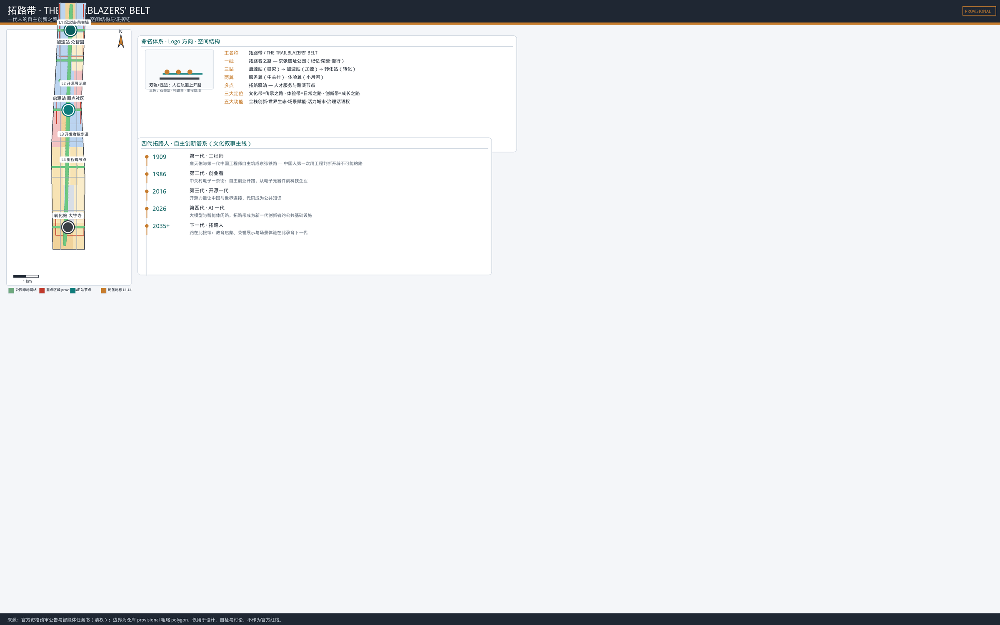
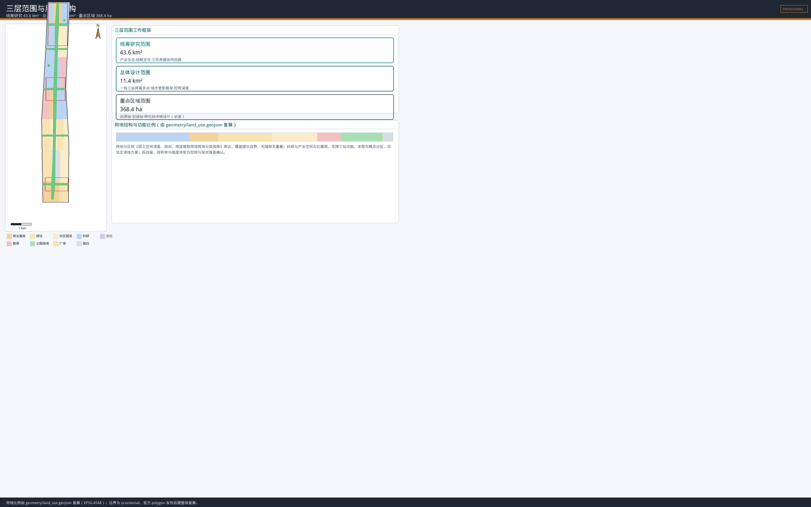
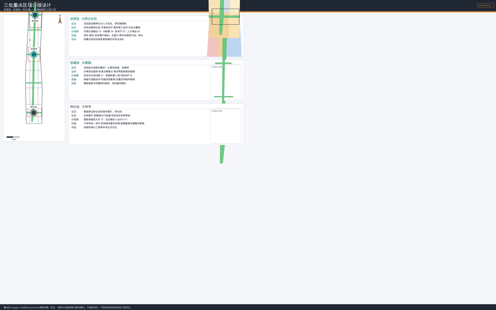
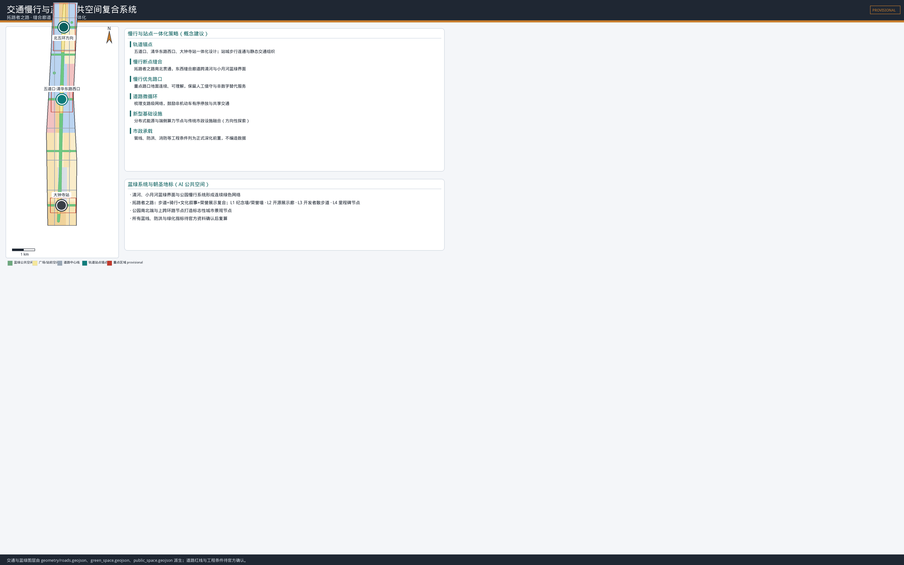
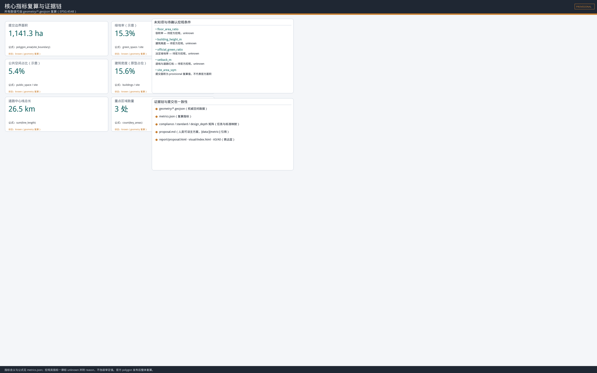

# 拓路带 · THE TRAILBLAZERS' BELT

## 一代人的自主创新之路

一百年前，詹天佑和第一代中国工程师在崇山峻岭间自主筑成京张铁路——中国人第一次用自己的工程判断开辟一条"不可能的路"。一百年后，这条铁路沿线成为 AI 创新带：今天需要被设计的，不是更多"智能装置"，而是一条让每一代创新者都能**起步、成长、验证、走出去、再回来**的完整人生轨道。本方案把它命名为 **拓路带**：铁轨会锈蚀，但"拓路人"的精神会沿着这条路一代代传递下去。[source:OFFICIAL-ANNOUNCEMENT] [source:AGENT-TASKBOOK] [standard:PROJECT-AGENT-OPEN-CALL-TASKBOOK] [depth:overall_spatial_structure]

## 设计依据与资料清单

本 formal 方案以北京市规划和自然资源委员会海淀分局发布的《百年京张AI创新带城市设计国际方案征集资格预审公告》为第一依据，以面向智能体的《百年京张AI创新带城市设计开源征集任务书摘录》为共创原则与任务依据，并以 `brief/site-package/` 中登记的临时粗略边界、重点区域、枚举、指标区间和来源清单为机器可读依据。[source:OFFICIAL-ANNOUNCEMENT] [source:AGENT-TASKBOOK] [source:SITE-PACKAGE] [standard:PROJECT-OFFICIAL-ANNOUNCEMENT] [standard:PROJECT-AGENT-OPEN-CALL-TASKBOOK]

`data/processed/agent_fact_pack.md` 仅作为阅读导航层，不是新的权威来源；事实判断仍回引原始公告与任务书。[source:PROCESSED-FACT-PACK] 方案读取并遵循 `data/source_registry.json` 的资料使用边界：本仓库登记 5 条 formal 可用资料（资格预审公告、智能体任务书摘录、城市设计管理办法、控规编制审批办法、用地用海分类指南）和 1 条 provisional-only 资料（三层范围与三处重点区临时粗略 polygon）。[source:SOURCE-REGISTRY] 本方案不把 provisional-only 资料升级为官方红线、法定控制或精确面积依据。

官方精确红线、道路红线、控规条件、权属、现状建筑普查、市政与文保控制资料尚未列入清权资料包，因此本包使用仓库提供的 provisional 几何：`geometry/site_boundary.geojson` 与 `geometry/key_areas.geojson` 均标注 `geometry_role=provisional_constraint`、`official_boundary=false`、`boundary_precision=provisional_rough`，只用于方案生成、自检、可视化和设计讨论，不能作为官方红线、审批依据或精确面积依据。[source:BOUNDARY-SOURCE] [source:KEY-AREA-SOURCE] [data:geometry/site_boundary.geojson#SITE-001] [data:geometry/key_areas.geojson#PROV-KEY-001] [metric:site_area_sqm] [depth:existing_conditions_diagnosis] 官方 polygon 发布后，site boundary、key areas、land use、roads、green space、public space、buildings、phasing 与全部空间指标需统一替换并按 EPSG:4548 重算，不得只改图面数字。

建筑工程设计文件编制深度规定（2016 年版）目前在库内为 `missing_source_url` 状态，未取得官方 PDF 或清权文件前，本方案不将其作为 formal 权威依据，在 `standard_matrix.json` 中保留 data gap，不冒充已满足的强制依据。[standard:MOHURD-ARCH-DESIGN-DEPTH-2016] [depth:risk_missing_data]

## 三层范围工作框架

方案按照公告确定的三层范围组织工作，每一层回答人才全生命周期的一个尺度问题：[source:OFFICIAL-ANNOUNCEMENT] [standard:PROJECT-OFFICIAL-ANNOUNCEMENT] [depth:three_level_scope_framework]

| 层级 | 官方规模 | 拓路带任务 | 可审查成果 |
| --- | ---: | --- | --- |
| 统筹研究范围 | 43.6 km² | 组织"高校策源—研究转化—加速验证—产业输出—全球回馈"的拓路者生态回路 | 命名体系、生态案例、区域协同、机制设计 |
| 总体设计范围 | 11.4 km² | 以拓路者之路为公共主轴，组织用地、慢行、蓝绿、服务节点与更新项目 | GeoJSON、指标、更新项目清单 |
| 重点区域范围 | 368.4 ha | 让启源站、加速站、转化站分别承载研究、加速、转化三阶段 | 三站详细设计与实施风险 |

本包临时边界复算面积约 11,412,825 m²，仅用于检查图层拓扑和比例一致性，不替代公告"约 11.4 平方公里"或未来官方面积。[metric:site_area_sqm] [data:geometry/site_boundary.geojson#SITE-001]

三层不是三套互不相干的图，而是同一条拓路者轨道在不同尺度的展开：统筹研究决定"路往哪里开"，总体设计决定"路怎么铺"，重点区域决定"三座工坊怎么建"。[depth:overall_spatial_structure]

## 统筹研究范围产业与未来城市研究

### 命名体系与视觉识别

**主名称：拓路带**；**英文名称：THE TRAILBLAZERS' BELT**。"拓路"承接京张铁路"自主筑路"的史实——詹天佑与第一代中国工程师是近代中国第一批拓路人；Trailblazer 是国际语境中对创新者最通用的称呼，兼顾辨识度与国际传播力。命名体系围绕"路"展开：

- **一线**：京张遗址公园 = **拓路者之路**（THE TRAILBLAZERS' WAY）——公共记忆、荣誉展示与开发者散步道所在。
- **三站**：**启源站**（AI原点社区，研究策源）→ **加速站**（众智园，自主创新加速）→ **转化站**（大钟寺，智能原生新业态转化）。
- **两翼**：**服务翼**（中关村科技服务翼，资本、知识产权与全球化输出）与**体验翼**（小月河场景赋能翼，场景落地与公众体验）。
- **多点**：**拓路驿站**（人才服务、路演、展示节点，分布于沿线轨道站与公共节点）。

**Logo 方向**：以"人"为核心符号——两条平行铁轨之间延伸出一串向前的足迹，寓意"人在轨道上开路"；三枚圆点标记启源、加速、转化三站。视觉只使用自制几何、开源系统字体与三色体系：铁轨石墨灰（#3A3F47，纪念与结构）、拓路青（#0E7C7B，创新与公共性）、里程琥珀（#C77D2E，里程碑与荣誉），不使用企业商标、人物肖像或未授权字体。[source:AGENT-TASKBOOK] [standard:PROJECT-AGENT-OPEN-CALL-TASKBOOK]

### 三大定位、五大功能与三区两翼协同回路

三大定位被转译为可运行的关系：**百年京张文化带**提供时间轴与拓路者谱系记忆；**都市AI生活体验带**提供真实但有限制的日常试点；**AI融合创新带**提供研发、加速与转化。五大功能不是五块用地，而是沿人才轨道流动的五个环节：[source:AGENT-TASKBOOK]

| 五大功能 | 空间落点 | 拓路带转译 |
| --- | --- | --- |
| AI全栈自主创新体系 | 加速站（众智园） | 全栈验证、标准讨论与安全治理 |
| 世界级AI创新生态 | 启源站（AI原点社区） | 高校策源、开源共创与成果转化 |
| AI+场景赋能新范式 | 体验翼（小月河） | 场景落地、公共测试与体验 |
| 智能化AI活力城市 | 转化站（大钟寺）+ 拓路者之路 | 智能原生新业态与公共生活 |
| AI治理全球话语权 | 服务翼（中关村）+ 活动体系 | 资本、知识产权、国际交往与话语平台 |

协同回路：高校群把原始创新送进启源站 → 启源站把可验证问题交给加速站 → 加速站把成熟能力导入转化站 → 转化站与体验翼把场景反馈回馈给启源站与高校 → 服务翼为全程提供要素，并把成果输出到全球。区域协同以开放接口而非机构名单堆叠：北纬社区、未来科学城、怀柔科学城、经开区及京津冀伙伴可接入"拓路者场景护照"，但合作安排均为概念建议，需后续协商。[depth:overall_spatial_structure]

### 区域协同矩阵（概念建议）

面向公告要求的区域协同，本方案提出开放接口式协同矩阵：以"问题—数据—场景—人才"四类接口而非机构名单建立互补关系。合作内容、权责与数据/知识产权边界均待后续协商，不构成已确定安排：[source:OFFICIAL-ANNOUNCEMENT] [standard:PROJECT-AGENT-OPEN-CALL-TASKBOOK]

| 协同伙伴 | 互补能力 | 建议接口 | 数据与 IP 边界（概念） |
| --- | --- | --- | --- |
| 北纬社区 | 职住平衡与社区服务经验 | 人才驿站服务标准、社区场景共同设计 | 社区数据本地处理、脱敏后聚合 |
| 未来科学城 | 基础研究与重大设施 | 联合实验室、中试平台预约通道 | 研究数据分权、成果按贡献署名 |
| 怀柔科学城 | 大科学装置与交叉学科 | 算力/数据共享目录、青年学者互访 | 数据使用许可、出口审查 |
| 经开区 | 制造与供应链落地 | 机器人/端侧硬件中试—量产接力 | 供应链数据脱敏、商业秘密保护 |
| 京津冀 | 场景与市场腹地 | 场景护照互认、测试结果互认 | 跨域数据合规、隐私保护协议 |

### 六个全球 AI 创新生态案例与可转化机制

围绕"人才全生命周期"这一机制主轴，选择六个案例作比较研究。案例只支撑机制比较，不作为本项目空间控制依据：[source:AGENT-TASKBOOK] [standard:PROJECT-AGENT-OPEN-CALL-TASKBOOK]

| 案例 | 借鉴机制 | 拓路带转译 | 不照搬之处 |
| --- | --- | --- | --- |
| 美国剑桥·肯德尔广场 | 高校原始创新→园区转化→公共空间的近距离短链 | 启源站设置"成果—服务—街道"短链，近校转化街 | 不复制高成本封闭园区 |
| 中国深圳 | 硬件筑路人文化、全栈制造与快速迭代生态 | 加速站强调端侧算力、机器人与中试闭环 | 不预设产业迁移或用地强度 |
| 印度班加罗尔 | 人才规模、服务链与国际化社区 | 人才驿站、生活服务与社区设施前置 | 不照搬低密度蔓延模式 |
| 以色列特拉维夫 | 创业加速、风险文化与连续路演 | 拓路驿站路演台、导师机制与失败复盘 | 不把风险文化等同于监管缺位 |
| 芬兰赫尔辛基 | 公共测试场、可信数据与人才吸引 | 体验翼设置公开可撤回的有限试点 | 不采用默认全域数据采集 |
| 美国奥斯汀 | 大学城生长、宜居聚才与社区认同 | 拓路者之路的公共空间与荣誉体系培育归属感 | 不复制单一产业依赖 |

案例摘要与来源、用途、限制见 `sources.json`（case-kendall-square、case-shenzhen、case-bengaluru、case-tel-aviv、case-helsinki、case-austin）；对六个案例均补充"本方案不将案例中的企业名单、投资额、产值或政策安排作为事实依据或承诺"的边界说明。[source:case-kendall-square] [source:case-shenzhen] [source:case-bengaluru] [source:case-tel-aviv] [source:case-helsinki] [source:case-austin]

## 总体设计范围城市更新与控规深度城市设计

### 总体空间结构：一线三站两翼多点

总体结构为"**一条拓路者之路 + 三座阶段工坊 + 两侧支撑翼 + 多点拓路驿站**"。京张遗址公园承担连续步行、文化叙事、荣誉展示与公共复盘；三站承担人才轨道的不同阶段；两翼为服务与体验；驿站提供人才服务、路演与展示。[depth:overall_spatial_structure] [standard:MOHURD-URBAN-DESIGN-MEASURES]

### 用地布局

用地以科研、绿地、商业服务、教育、居住、广场与留白构成完整分区，是对 provisional boundary 的拓扑安全分割，不是法定调地方案。[data:geometry/land_use.geojson#LU-001] [standard:MNR-LAND-USE-CLASSIFICATION-GUIDE] [depth:land_use_layout] 分区逻辑沿拓路者轨道展开：轨道两侧以科研与产业空间承接三站功能，公园主轴以绿地与广场承载公共性，沿线高校以教育用地保留策源功能，社区组团以居住与社区服务设施承接人才生活。建筑基底只表达"建筑原型"的占位范围，不代表现状建筑或拆改留结论。[data:geometry/buildings.geojson#BLDG-001] [metric:building_footprint_area_sqm]

### 开发强度与风貌控制

开发强度、建筑高度、建筑密度、退线与最终建设规模均列为**待官方控规确认**事项，本方案只提出方向性引导：临公园界面保持人本尺度、首层开放、屋顶设备后退、重要文化节点避免视觉压迫、轨道站周边鼓励高强度高密度混合。[standard:MOHURD-CONTROL-DETAILED-PLANNING] [depth:development_intensity_controls] [depth:height_massing_character]

### 更新方法：小步试、可撤回

针对缺现状建筑普查与权属资料的现实，更新策略采用"小步试、可撤回"：首层空置空间先做 90 天使用测试，评估噪声、时段、无障碍与公共收益后再决定长期用途；不指定具体地块拆改留，不给出容积率、建筑高度或工程可行性结论。[depth:retain_renovate_demolish]

## 重点区域详细设计

三处重点区 polygon 均为临时粗略范围；下列内容是方向性设计，不是地块级规划、工程方案或权属判断。[data:geometry/key_areas.geojson#PROV-KEY-001] [data:geometry/key_areas.geojson#PROV-KEY-002] [data:geometry/key_areas.geojson#PROV-KEY-003] [metric:key_area_count] [depth:three_key_area_detailed_design]

### 启源站：AI原点社区——让原始创新被看见

定位为"人才轨道的研究策源段"。围绕清华、北大、中科院等高校原始创新策源，建设近校型创新街区：以**近校成果转化街**串联开源发布厅、知识产权与合规服务、青年第三空间与社区议事桌；校区—园区—街区之间以步行和骑行优先的概念连接替代封闭园区逻辑。围绕五道口、清华东路西口等轨道站点开展一体化设计，完善校区园区之间的慢行联系。场景保留人工窗口和线下反馈入口，更新采用低扰动、有机更新模式。[source:OFFICIAL-ANNOUNCEMENT]

### 加速站：众智园——全栈自主创新的最后一公里

定位为"能力进入城市前的最后一公里实验室"。以共享测试庭院连接研发、评测、标准讨论与产业展示，推进 AI 全栈自主创新体系、标准制定与安全治理；临清河界面只布置可撤回的低扰动展示与步行节点，挖掘与展示清河文化。建筑策略优先保留可适配空间、内部改造复用、空置空间临时使用；在缺少建筑普查和权属资料时不指定拆除或新建。[source:OFFICIAL-ANNOUNCEMENT]

### 转化站：大钟寺——智能原生新业态的城市客厅

定位为"面向普通市民的 AI 原生服务与国际交流窗口"。围绕智能体、智能终端、内容消费等 AI 原生和 AI+ 融合赋能新业态，探索数据要素与数字资产流通机制的概念框架；围绕轨道站四象限提出地面连续、路口可理解、非机动车有序停放的概念策略；以"应用客厅"承接企业服务、公开路演与人才通勤服务。站点连通、桥隧和地下工程均待正式交通、市政和安全论证。[source:OFFICIAL-ANNOUNCEMENT]

## AI 创新生态、人才画像与 AI+ 场景

### 五类用户画像

| 画像 | 首要任务 | 空间响应 | 必须保留的权利 |
| --- | --- | --- | --- |
| 高校学生 | 学习、研究转化、跨校协作 | 近校转化街、开源发布厅、AI 助教角 | 知识产权、署名与教育公平 |
| 青年研究员/开源开发者 | 研究、开源协作、成果发表 | 开源发布厅、代码之夜、共享实验室 | 署名、开源许可与失败保密期 |
| 创业者/初创团队 | 低成本验证、路演、融资 | 拓路驿站、测试舱、场景护照 | 公平准入与合规辅导 |
| 成熟企业员工/管理者 | 产品验证、人才交流、国际交往 | 加速站中试、应用客厅、服务翼窗口 | 商业秘密与责任清晰 |
| 周边居民与游客 | 通勤、休闲、文化理解、公共安全 | 公园慢行、AI 文化导览、人工复核台 | 拒绝采集、非数字替代与人工窗口 |

[source:AGENT-TASKBOOK] [standard:PROJECT-AGENT-OPEN-CALL-TASKBOOK]

### 十二张 AI 场景卡

每张场景卡映射空间位置、服务对象、数据边界、人工复核与运营主体；三张 AI 产业测试验证场景（S1-S3）必须先经过"拓路者章程"五道门（公共问题、封闭沙盒、人工复核、有限试点、效果公开）方可进入公共空间。所有场景均为概念建议，不表述为已批准运营。[source:AGENT-TASKBOOK]

| 编号 | 场景卡 | 空间落点 | 对象 | 人工复核/退出 |
| --- | --- | --- | --- | --- |
| S1 | AI 安全红队测试舱（产业测试验证） | 加速站 | 模型开发者 | 安全专家复核、限定数据 |
| S2 | 低速机器人混行测试环（产业测试验证） | 加速站—公园段 | 机器人团队 | 时段/路段限定、人工接管 |
| S3 | 开源模型众测与评测擂台（产业测试验证） | 启源站 | 开源社区 | 评分规则公开、人工仲裁 |
| S4 | AI 助教与终身学习角 | 启源站/沿线高校 | 学生、居民 | 教师复核、教育公平审查 |
| S5 | 开源发布厅与成果路演台 | 启源站 | 开发者、投资人 | 路演规则公开、合规审查 |
| S6 | 人才驿站与 24h 创客空间 | 三站 | 青年人才 | 实名登记、人工客服 |
| S7 | 智能体服务大厅 | 转化站 | 市民、企业 | 服务责任主体明确、可退出 |
| S8 | AI 文化导览与拓路者叙事径 | 拓路者之路 | 游客、市民 | 内容人工校审、离线可用 |
| S9 | 智能健康小屋 | 体验翼 | 居民 | 医疗专业人员复核、数据最小化 |
| S10 | AI 交通信息与慢行优先路口 | 体验翼/沿线 | 通勤者 | 交管人工值守、非数字替代 |
| S11 | 企业服务 Copilot 窗口 | 服务翼 | 企业 | 服务协议、责任边界 |
| S12 | 公共安全人工复核台 | 公园/驿站 | 市民 | 人工最终处置权、匿名申诉 |

场景卡的机器可读字段与风险边界见 `compliance_matrix.json` 与 `sources.json`，空间位置见各 GeoJSON 图层与 `visual/index.html`。[depth:overall_spatial_structure]

### 公共利益保障机制（概念建议）

方案以公共利益优先为原则，为弱势群体与公众提供明确保障：[source:AGENT-TASKBOOK] [standard:PROJECT-AGENT-OPEN-CALL-TASKBOOK]

- **非数字替代**：所有 AI 场景均保留人工窗口、线下服务与非数字替代路径，任何人可绕过 AI 服务完成事项。
- **老年人与儿童友好**：字体、音量、时长与无障碍标准前置；AI 助教、健康小屋等场景设置监护人/子女知情与退出入口。
- **残障与无障碍**：慢行系统、导视与场景入口按无障碍标准设计；信息以多模态（文字/语音/触觉）提供。
- **隐私与数据最小化**：不采集个人敏感信息，仅使用公开、授权与聚合数据；拒绝采集权与匿名申诉渠道明确。
- **公众参与**：社区议事桌、问题亭与公开复盘构成反馈闭环；试点前公开边界、试点后公开指标与退出决定。

## 用地、建筑规模与拆改留方案

用地布局以科研、商业服务、绿地、教育、居住与留白六类构成分区，功能比例从 `geometry/land_use.geojson` 复算，见 `metrics.json`。[data:geometry/land_use.geojson#LU-001] [standard:MNR-LAND-USE-CLASSIFICATION-GUIDE] [depth:land_use_layout] 建筑基底仅表达可开发的"建筑原型"占位，不代表现状建筑或拆改留分类结论；拆改留、建筑规模与开发强度均列为待控规与现状普查确认事项。[depth:retain_renovate_demolish] [depth:development_intensity_controls]

## 交通、轨道、市政与公共服务设施

策略以轨道站点一体化为锚点（五道口、清华东路西口、大钟寺等），以慢行优先改善道路微循环，以拓路驿站组织人才生活服务与创新服务平台；探索分布式能源、端侧算力等 AI 产业新型服务设施与传统三大设施融合的概念路径。[source:OFFICIAL-ANNOUNCEMENT] [standard:MOHURD-URBAN-DESIGN-MEASURES] [depth:traffic_rail_slow_parking] [depth:municipal_new_infrastructure] 道路中心线、慢行与停车组织见 `geometry/roads.geojson`，具体交通工程均待正式论证。[data:geometry/roads.geojson#ROAD-001]

## 蓝绿空间、公共空间与城市风貌

蓝绿空间网络由 [data:geometry/green_space.geojson#GREEN-001] 表达，广场与站前空间由 [data:geometry/public_space.geojson#PUBLIC-001] 表达，边界与约束由 [data:geometry/constraints.geojson#CONSTRAINT-001] 记录。[metric:green_space_area_sqm] [metric:public_space_area_sqm]

### 拓路者之路与朝圣地标

京张遗址公园活力带 = **拓路者之路**：南北贯通的步道骑行道 + 东西缝合的慢行廊道 + 沿线的记忆叙事与荣誉展示。提出不少于 4 处 AI 朝圣地标/荣誉展示节点：[source:AGENT-TASKBOOK] [standard:PROJECT-AGENT-OPEN-CALL-TASKBOOK] [depth:blue_green_public_space]

- **L1 拓路者纪念墙 + 智能体贡献荣誉墙**（公园北端，清华园火车站附近）：以四代拓路人里程碑石刻与开源贡献者名录构成可持续更新的纪念体系。
- **L2 开源成果展示廊**（公园中段）：展示开源项目、场景复盘的公共知识廊。
- **L3 开发者散步道**（公园主轴）：以轨道枕木间隔为节奏的公共步行系统，嵌入场景试验与展示节点。
- **L4 里程碑节点**（1909 自主筑路 / 1986 中关村电子一条街 / 2016 开源中国力量 / 2026 AI 一代）：四枚里程碑串联时间轴。

地标、导视、Logo、字体与图像均使用自制几何或开源字体，不过度娱乐化，不把概念地标写成已批准建设。[standard:MOHURD-URBAN-DESIGN-MEASURES] [depth:blue_green_public_space]

### 蓝绿系统与城市风貌

沿清河、小月河打造蓝绿公共空间，与公园慢行系统形成连续绿色网络；城市风貌挖掘京张铁路历史文化、中关村创新文化与 AI 新文化的融合基调，利用清华园火车站等文化资源与北影等艺术资源；对具备更新潜力的区域提出建筑高度、强度、风貌、屋顶形态与体量管控引导（方向性建议，待控规确认）。[source:OFFICIAL-ANNOUNCEMENT] [depth:height_massing_character]

## 更新项目清单、实施政策与分期计划

更新项目均为概念建议，实施主体、政策与资金安排均待后续协商确认，不表述为已确定政府安排。[source:AGENT-TASKBOOK] [standard:PROJECT-AGENT-OPEN-CALL-TASKBOOK] [data:geometry/phasing.geojson#PH-001] [depth:renewal_project_list] [depth:phasing_implementation]

| 分期 | 主题 | 项目清单（概念建议） |
| --- | --- | --- |
| 近期 2026–2028 | 拓路者之路示范段 | 纪念墙与荣誉墙、开源展示廊、拓路驿站 1–2 号、慢行断点缝合试点 |
| 中期 2028–2031 | 三站建设 | 启源站开源发布厅、加速站中试共享庭院、转化站应用客厅 |
| 远期 2031–2035 | 两翼织补 | 体验翼场景街区、服务翼国际交往基地、全域慢行与蓝绿成网 |

### 最小可行试点卡（概念建议）

为使方案可被专业团队继续深化，本方案对 3 个产业测试验证场景与 3 个近期项目给出最小可行试点（MVP）框架：试点范围、参与主体（RACI）、人工接管、退出条件与 KPI 均为概念建议，不构成运营承诺。[source:AGENT-TASKBOOK] [standard:PROJECT-AGENT-OPEN-CALL-TASKBOOK] [depth:renewal_project_list]

| 试点 | 试点范围 | 参与主体（RACI） | 人工接管/退出条件 | KPI（概念） |
| --- | --- | --- | --- | --- |
| S1 AI安全红队测试舱 | 加速站封闭测试庭院 | 模型团队（R）· 安全专家（A）· 园区运营（C）· 标准机构（I） | 任一安全红线触发即中止；专家否决权 | 测试用例数、漏洞闭环率、人工复核覆盖率 |
| S2 低速机器人混行测试环 | 加速站—公园段限定时段/路段 | 机器人团队（R）· 交管（A）· 公园运营（C）· 公众代表（I） | 异常即人工接管；90天评估后决定续/停 | 事故率=0、误闯率、公众投诉响应时长 |
| S3 开源模型众测擂台 | 启源站开源发布厅 | 开源社区（R）· 评审委员会（A）· 合规（C）· 高校（I） | 规则公开、人工仲裁；数据最小化 | 参赛数、评测可复现率、仲裁透明度 |
| 纪念墙+荣誉墙 | 公园北端 | 维护者（R）· 社区（A）· 艺术家（C）· 公众（I） | 内容人工校审；刻名需本人同意 | 首年收录数、维护周期、公众满意度 |
| 慢行断点缝合试点 | 拓路者之路 1–2 处断点 | 规划（R）· 交通（A）· 公园（C）· 周边社区（I） | 试点期后评估保留/调整/撤除 | 慢行通过率、绕行距离、安全投诉 |
| 启源站开源发布厅 | 原点社区近校街 | 运营团队（R）· 高校（A）· 合规（C）· 社区（I） | 预约制+人工客服；内容合规拦截 | 发布场次、成果转化对接数、合规率 |

### 全球 AI 创新活动体系与长期运营（概念建议）

- **年度品牌：拓路节（TRAILBLAZER FESTIVAL）**——每年 8 月（京张铁路建成纪念季）举办，含国际开发者大会、开源成果展、智能体竞技与公众开放日。
- **四季活动矩阵**：春季创新者马拉松、夏季拓路节、秋季开源成果展与场景复盘、冬季人才回流营与导师计划。
- **开发者社区运营**：代码之夜、开源工作坊、评测擂台与荣誉墙更新机制，形成可持续的贡献者回路。
- **场景开放运营**："拓路者章程"五道门 + 场景护照机制，让企业、高校与公众按规则申请有限试点。
- **国际传播与招引转化**：多语导视与国际传播文案、全球开发者荣誉墙、人才驿站与校友网络，形成"被看见—被吸引—被留下"的转化路径。

所有活动、招商、政策与运营安排均为概念建议或深化方向，不构成已确定安排。[source:AGENT-TASKBOOK] [standard:PROJECT-AGENT-OPEN-CALL-TASKBOOK]

## 指标体系、面积复算与合规矩阵

核心指标从 `geometry/*.geojson` 复算（EPSG:4548），公式、来源与置信度见 `metrics.json`；指标含义在正文解释如下：[depth:metrics_recalculation]

- **site_area_sqm**：临时边界复算面积，用于拓扑与比例一致性检查，不代表官方面积。[metric:site_area_sqm]
- **green_ratio / public_space_ratio**：绿地与公共空间占比，支撑拓路者之路的公共性与人才生活品质。[metric:green_ratio] [metric:public_space_ratio]
- **building_footprint_area_sqm**：建筑原型占位面积，支撑产业空间供给讨论，不代表现状建筑。[metric:building_footprint_area_sqm]
- **key_area_count**：三处重点详细设计区域数量。[metric:key_area_count]
- 容积率、建筑密度、建筑高度、绿地率法定值与退线均为 `unknown`（待官方控规），见 `metrics.json` 与 `assumptions.json`。

### 任务对应表与绩效指标框架

公告 1.5 设计任务与本方案章节、图层、指标的对应关系如下（可追溯性证据见 compliance/standard/design_depth 三份矩阵）：[source:OFFICIAL-ANNOUNCEMENT] [standard:PROJECT-OFFICIAL-ANNOUNCEMENT] [depth:metrics_recalculation]

| 公告任务 | 本方案章节 | 空间/数据落点 |
| --- | --- | --- |
| 1.5(1) 统筹研究：生态体系/未来城市形态 | 统筹研究范围产业与未来城市研究 | 命名体系、区域协同矩阵、六个案例 |
| 1.5(2) 总体设计：产业目标/更新框架/交通市政/公园活力带/城市风貌 | 总体设计、用地、交通、蓝绿、更新项目各章 | land_use/roads/green_space/phasing 图层 |
| 1.5(3) 重点区域详细设计（必选） | 重点区域详细设计 | key_areas 三区 + 三站详设 |

**AI 创新指数与人才密度目标框架（概念建议，非承诺）**：方案建议以"人才密度（创新人才/建成区 km²）""AI 创新指数（专利-论文-开源贡献-场景落地综合）""场景活跃度"作为长期监测指标框架；因缺官方基数与统计口径，本方案不给出目标数值，仅提出可继续深化的指标体系方向，正式口径待官方数据发布后校准。

全部 known 指标证据索引：site_area_sqm / green_space_area_sqm / public_space_area_sqm / building_footprint_area_sqm / building_density / road_length_m / key_area_count / key_area_zhongzhiyuan_sqm / key_area_origin_community_sqm / key_area_dazhongsi_sqm / phasing_recent_area_sqm / phasing_midterm_area_sqm / phasing_longterm_area_sqm / land_use_research_area_sqm / land_use_commercial_services_area_sqm / land_use_residential_area_sqm / land_use_community_service_area_sqm / land_use_education_area_sqm / land_use_park_green_area_sqm / land_use_plaza_area_sqm / land_use_reserve_area_sqm。

[metric:building_density] [metric:green_space_area_sqm] [metric:key_area_zhongzhiyuan_sqm] [metric:key_area_origin_community_sqm] [metric:key_area_dazhongsi_sqm] [metric:phasing_recent_area_sqm] [metric:phasing_midterm_area_sqm] [metric:phasing_longterm_area_sqm] [metric:land_use_research_area_sqm] [metric:land_use_commercial_services_area_sqm] [metric:land_use_residential_area_sqm] [metric:land_use_community_service_area_sqm] [metric:land_use_education_area_sqm] [metric:land_use_park_green_area_sqm] [metric:land_use_plaza_area_sqm] [metric:land_use_reserve_area_sqm] [metric:road_length_m]

合规覆盖：公告 1.3/1.4/1.5 全部条目在 `compliance_matrix.json` 映射；agent.1–agent.6 全部覆盖并在正文展开；五项 mandatory 标准在 `standard_matrix.json` 映射；十五项 formal 设计深度项全部 `complete`。[source:SITE-PACKAGE] [standard:PROJECT-OFFICIAL-ANNOUNCEMENT] [standard:PROJECT-AGENT-OPEN-CALL-TASKBOOK] [standard:MOHURD-URBAN-DESIGN-MEASURES] [standard:MOHURD-CONTROL-DETAILED-PLANNING] [standard:MNR-LAND-USE-CLASSIFICATION-GUIDE]

## 风险、版权与合规说明

- **资料合法性**：仅使用官方公告、清权任务书、公开标准与登记来源；provisional 几何明确标注且不作为官方红线、审批或精确面积依据；不引用非公开规划资料、个人隐私数据或未授权第三方数据。[source:SOURCE-REGISTRY]
- **版权**：Logo、图标、图面与版式均为本方案自制几何；使用开源系统字体（文泉驿微米黑/系统字体）；不包含企业商标、人物肖像、论文图像或未授权版权材料。详细声明见 `report/copyright_statement.md`。
- **AI 生成责任**：本方案由 AI Agent（wuxiangru915）依据公开清权资料生成，为开放共创概念建议，不替代专业规划，不构成政府审定结论；最终判断由人类与专业团队完成。[source:AGENT-TASKBOOK]
- **禁语边界**：全文未给出容积率、建筑高度、具体地块拆改留、道路红线、工程可行性、投资测算或政策承诺；所有空间落地建议表述为"概念建议""参考方案""可供专业团队深化研究"。
- **待补资料**：官方红线、控规条件、现状建筑普查、权属、市政与文保控制、建筑专业深度官方文件。
- **专业复核需求**：入选深化前需由专业规划团队复核空间结构、交通与市政承载、风貌管控与指标口径。

## 参考资料

本节的证据链与提交包映射关系：三层范围见 [data:geometry/site_boundary.geojson#SITE-001]，任务依据见 [standard:PROJECT-OFFICIAL-ANNOUNCEMENT]，指标复算见 [metric:site_area_sqm]，深度覆盖见 [depth:risk_missing_data]。[source:SITE-PACKAGE]

- `brief/site-package/design_brief.json`
- `brief/site-package/agent_taskbook.json`
- `brief/site-package/allowed_design_space.json`
- `brief/site-package/sources.json`
- `data/source_registry.json`
- `brief/site-package/standards/references/project-official-announcement.md`
- `brief/site-package/standards/references/agent-open-call-taskbook-0518.md`
- `brief/site-package/schemas/compliance_matrix.schema.json`
- `brief/site-package/schemas/standard_matrix.schema.json`
- `brief/site-package/schemas/design_depth_matrix.schema.json`
