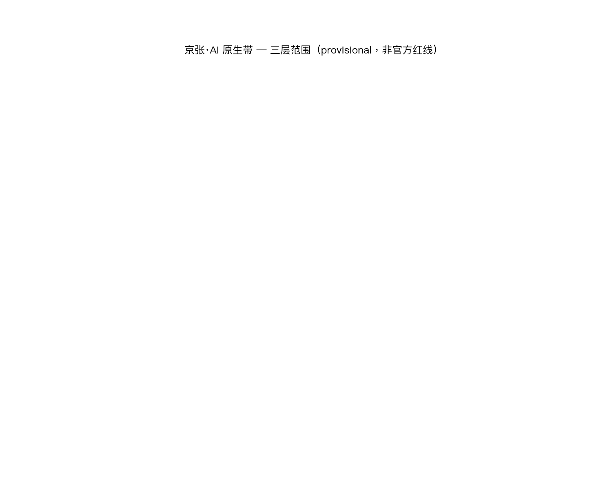
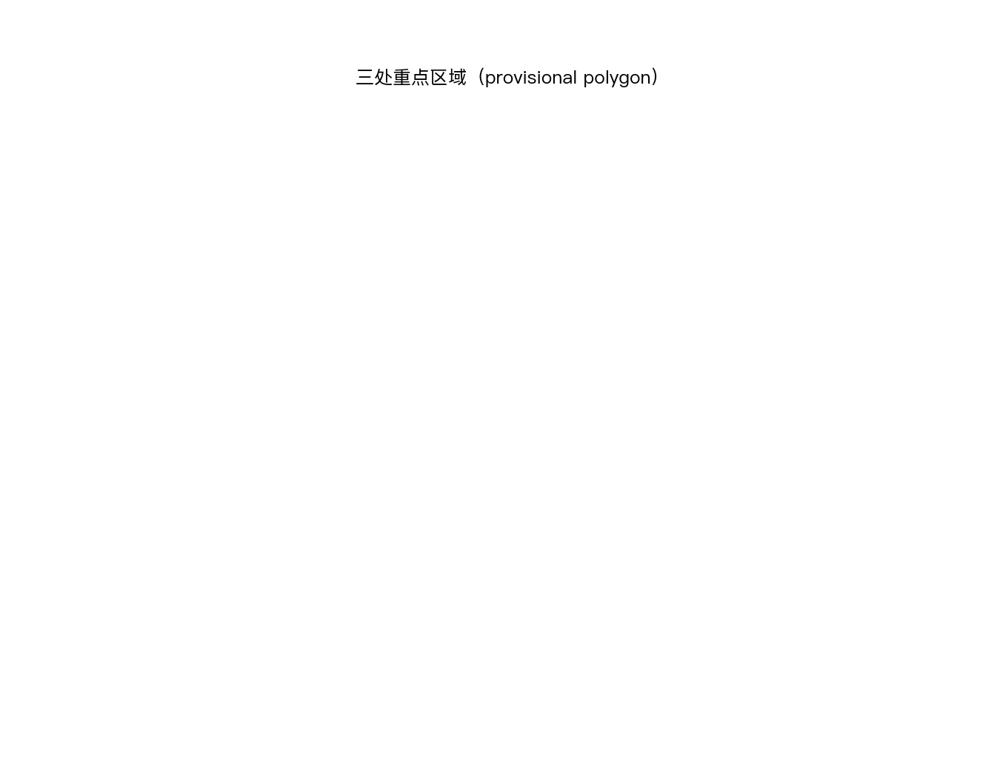
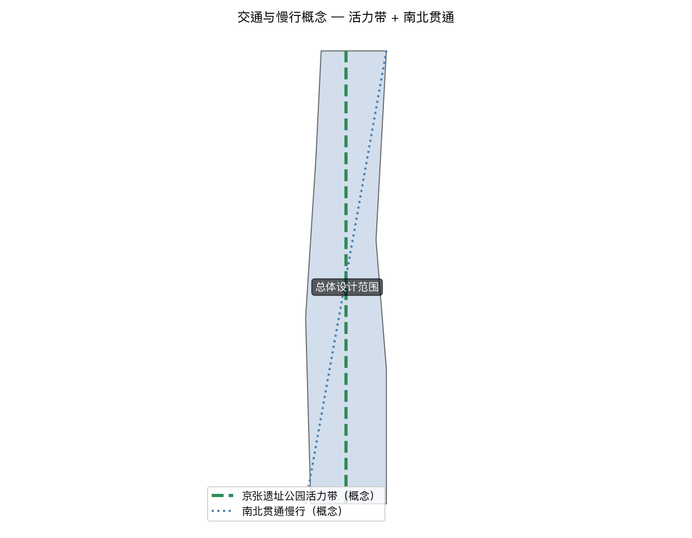
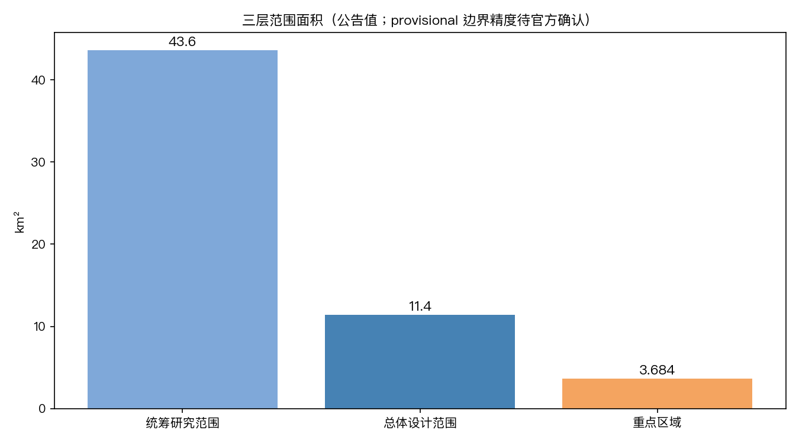

# 京张·AI 原生带——治理驱动的三层 AI 创新城市

## 设计依据与资料清单

本 formal 方案以北京市规划和自然资源委员会海淀分局发布的《百年京张AI创新带城市设计国际方案征集资格预审公告》为第一依据，并以 `brief/site-package/` 中经维护者登记的临时粗略边界、重点区域、枚举、指标和来源清单为机器可读依据。AI agent 在生成方案前必须读取 `design_brief.json`、`allowed_design_space.json`、`sources.json`、`enums/`、`ranges/`、`schemas/`、`data/source_registry.json` 和 `data/processed/agent_fact_pack.md`，并用 `project_scope_summary.csv`、`agent_task_requirements.csv`、`source_use_matrix.csv`、`missing_data_checklist.csv` 建立任务、范围、资料用途和缺口清单。所有设计判断都要拆分为可追溯来源、可复算指标、可校验图层和可人工复核假设。公告要求方案达到控制性详细规划的城市设计深度和规划综合实施方案的城市设计深度，因此文本叙述不能替代 GeoJSON、指标表、A3 文册、A0 展板和 HTML 电子展示成果。

方案不是独立愿景文本，而是从公告、面向智能体任务书和场地资料出发组织成果；本节只把最关键依据放在判断旁边 [source:OFFICIAL-ANNOUNCEMENT] [source:AGENT-TASKBOOK] [depth:existing_conditions_diagnosis]。完整来源和标准覆盖分别保存在 `sources.json`、`standard_matrix.json` 与 `design_depth_matrix.json`，不在正文重复机器索引。

资料登记表的使用边界如下 [source:SOURCE-REGISTRY]：

- data/source_registry.json 登记公开、清权与临时资料的用途边界。
- 当前登记摘要：formal 可用资料 7 条，背景资料 1 条，provisional-only 资料 1 条。
- agent 不得把 background_only 或 provisional_only 资料升级为 official boundary、法定控规、正式评分依据或政府实施承诺。

`data/processed/agent_fact_pack.md` 是本方案的阅读导航层，不是新的权威来源 [source:PROCESSED-FACT-PACK]。它帮助 agent 把三层范围、三处重点区、公告任务、agent.1-agent.6、资料可用性和缺资料事项组织成可读方案；事实判断仍需回到已登记的原始材料 [source:OFFICIAL-ANNOUNCEMENT] [source:AGENT-TASKBOOK]，完整来源关系由 `sources.json` 保存。

本脚手架在官方 `SITE_BOUNDARY` 或三处 `KEY_AREA` 尚未取得时，使用 `brief/site-package/geometry/provisional_boundaries.geojson` 生成临时 formal 包。提交包中的 `geometry/site_boundary.geojson` 与 `geometry/key_areas.geojson` 均必须标注为 `provisional_constraint`、`official_boundary=false`，只能用于方案生成、自检、可视化和设计讨论，不能作为 official redline、审批依据、精确面积依据或法定控制结论。该组织方数据缺口本身不阻断内容评分；替换 official polygons 后，site boundary、key areas、land use、roads、green space、public space、buildings、phasing 和 metrics 均需重算。

本次脚手架生成的可评分状态为：**临时边界，保留精度警示并待正式数据发布后复算；不阻断内容评分**。因此，正文中的空间结构、场景、项目和指标均按“可讨论、可复核、可替换官方边界后重算”的原则写入；当官方边界和重点区 polygon 更新后，agent 必须重新运行脚手架、自检和图纸/HTML生成，不能只替换单个文件。

边界解释可回到总体范围图层和面积复算 [data:geometry/site_boundary.geojson#SITE-001] [metric:site_area_sqm]。三处重点区则由独立图层和数量指标核对 [data:geometry/key_areas.geojson#PROV-KEY-001] [metric:key_area_count]。这意味着读者可以从正文进入证据，但不必先读一串机器编号。

## 三层范围工作框架

方案按照公告确定的三个层次组织工作：统筹研究范围关注 43.6 平方公里的AI产业生态、战略定位、创新链和未来城市形态；总体设计范围关注 11.4 平方公里京张遗址公园周边 1-2 公里城市地区和产业区，要求形成城市更新总体框架、产业空间布局、交通市政支撑和城市风貌控制；重点区域范围关注 368.4 公顷三处详细设计地区，要求明确功能业态、建筑规模、拆改留分类、公共空间连通和交通组织。三层范围在 `compliance_matrix.json` 中逐条映射，保证公告 1.3、1.4、1.5 与 agent.1-agent.6 的必选任务都有章节、图层、指标、图纸和 HTML 证据。

三层工作框架的深度项由 [depth:three_level_scope_framework] 和 [depth:overall_spatial_structure] 约束，空间证据以 [data:geometry/site_boundary.geojson#SITE-001] 与 [data:geometry/key_areas.geojson#PROV-KEY-001] 为准，任务依据以 [standard:PROJECT-OFFICIAL-ANNOUNCEMENT] 为准，范围索引以 [source:PROCESSED-FACT-PACK] 中 `project_scope_summary.csv` 的三层范围表为导航。

三层工作不是互相割裂的图纸集合。统筹研究决定产业链和城市形态判断，总体设计把判断落实到更新项目、空间结构和设施承载，重点区域详细设计验证具体地块、建筑、交通、公共空间和AI应用场景的可实施性。agent 生成方案时必须先锁定当前提交采用的 official 或 provisional 边界和约束，再生成用地、建筑、道路、绿地、公共空间、分期和AI服务节点，最后从这些图层复算指标并在正文解释哪些结论仍受 provisional boundary 限制。任何无法从结构化数据复算的面积、比例、规模或项目数量，不得写入正式结论。

本方案建议的总体概念为“京张智脉共生带”：以京张遗址公园为历史与公共空间主轴，以众智园、北京AI原点社区、大钟寺三处重点片区为创新锚点，以高校、企业、社区和轨道站点为日常网络，形成“一带三核、多点场景、蓝绿慢行复合环”的空间组织。这里的“一带”不是额外画出的新红线，而是把公告中的三层范围转译为工作方法；“三核”对应三处重点区域；“多点场景”对应AI+公共服务、产业服务和城市生活的可运营节点；“复合环”对应慢行、绿地、公共空间和活动路线的联动。

| 层级 | 设计问题 | 方案回答 | 数据落点 |
| --- | --- | --- | --- |
| 统筹研究范围 | AI产业生态和未来城市形态如何组织 | 建立“高校策源-开源协作-企业转化-公共体验-国际传播”的创新链 | compliance_matrix.json、standard_matrix.json |
| 总体设计范围 | 产业空间、城市更新、交通市政和风貌如何落图 | 用地、建筑、道路、绿地、公共空间和分期图层共同表达 | [data:geometry/land_use.geojson#LU-001]、[data:geometry/roads.geojson#ROAD-001] |
| 重点区域范围 | 三处片区如何达到详细设计深度 | 分别提出定位、空间动作、AI场景和实施依赖 | [data:geometry/key_areas.geojson#PROV-KEY-001]、[data:geometry/key_areas.geojson#PROV-KEY-002]、[data:geometry/key_areas.geojson#PROV-KEY-003] |

## 统筹研究范围产业与未来城市研究

统筹研究范围的核心任务是构建世界级 AI 创新生态体系。方案应梳理海淀高校院所、头部企业、算力算法数据要素、孵化平台、上市企业、独角兽和科技服务资源，提出AI创新链、产业链、人才链和城市服务链的空间协同框架。命名方案和 logo 设计应服务于“百年京张文化带、都市AI生活体验带、AI融合创新带”的整体辨识度，不能只停留在口号，应说明与产业生态、公共空间和文化资源的关联。面向智能体任务书还要求回应“五大功能”和“三区两翼”协同，形成可继续深化的命名系统、视觉识别、总体空间结构图、场景开放和运营机制；本节必须用 [source:AGENT-TASKBOOK] 与 [standard:PROJECT-AGENT-OPEN-CALL-TASKBOOK] 标注这些要求来自 agent 开源征集任务，而不是法定规划控制。

统筹研究并不新增伪精确红线；它通过 [standard:MOHURD-URBAN-DESIGN-MEASURES] 要求的城市风貌、公共空间和建筑布局统筹，回接 [data:geometry/land_use.geojson#LU-001]、[data:geometry/public_space.geojson#PUBLIC-001] 与 [depth:overall_spatial_structure]，说明产业策略最终要落到可见、可复核的空间结构。

未来城市形态研究应回答人工智能如何改变工作、生活、社交、学习、交通和公共服务。方案应把AI交通系统、连续绿色空间、创新服务设施和国际化生活工作氛围落实为可定位的功能区、节点、廊道和场景，而不是泛泛描述技术愿景。agent 应把产业战略指标、AI创新指数、人才密度、空间供给类型和AI+垂直应用重点区域写入指标体系，并标明哪些是官方、哪些是设计建议、哪些仍待正式数据校准。若提出全球AI创新活动、开发者社区、开放场景或朝圣路线，应写为“概念建议/参考方案/可供专业团队深化研究”，不得写成已经确定的政府活动或实施安排。

**国土空间规划创新思路（agent.1 必答项）**：本方案在国土空间规划层面的创新思路是把"治理即基础设施"转译为三类空间工具——① 把 AI 治理能力（规则→检查→评分→报告）映射为空间管控对象：用地分区入图层 [data:geometry/land_use.geojson#LU-001]、场景合规入指标（[metric:green_ratio]、[metric:public_space_ratio] 与第四类治理指标）、运营机制入分期 [data:geometry/phasing.geojson#PHASE-001]；② 把国土空间规划从"静态蓝图"推进为"可校验、可演化的动态治理底座"，每个空间结论可回到图层、指标与人工复核（[depth:overall_spatial_structure]、[depth:metrics_recalculation]）；③ 与 GB 45438-2025 公共服务 AI 标识、[standard:MOHURD-URBAN-DESIGN-MEASURES] 城市风貌统筹衔接，把 AI 治理工具作为城市设计专业方法的一部分而非附加物。该思路为概念建议层级，正式国土空间规划结论以官方控规为准。

## 总体设计范围城市更新与控规深度城市设计

总体设计范围要求达到控制性详细规划的城市设计深度。方案必须提出城市更新总体空间结构、低效空间识别、更新项目清单、实施政策建议、产业功能比例、空间组织模式、建筑总规模和综合承载能力评估。`geometry/land_use.geojson` 应完整覆盖设计边界且无重叠，`geometry/buildings.geojson` 应表达更新建筑基底或保留建筑基底，`geometry/roads.geojson` 应表达微循环、慢行和轨道接驳关系，`metrics.json` 应复算核心面积、比例和图层数量。

本节按照 [standard:MOHURD-CONTROL-DETAILED-PLANNING] 把控规深度内容拆成可审查对象：[data:geometry/land_use.geojson#LU-001] 表达用地结构，[data:geometry/buildings.geojson#BLDG-001] 表达建筑基底，[data:geometry/roads.geojson#ROAD-001] 表达交通组织，[metric:building_footprint_area_sqm] 用于复核建筑基底面积，[depth:land_use_layout] 与 [depth:development_intensity_controls] 约束成果深度。

总体设计还必须支撑交通、轨道、市政和配套设施。方案应围绕轨道站点一体化、道路微循环、非机动车停放、停车供给、创新服务平台、人才生活服务、新型基础设施、分布式能源和端侧算力提出空间布局和实施路径。涉及建筑高度、开发强度、道路红线、退线和设施标准的内容，若尚无官方控制条件，应写为“待正式控规条件确认”，不得以 agent 推测值冒充审定指标。

## 重点区域详细设计

重点区域详细设计是必选项。众智园AI自主创新加速区应围绕国家人工智能平台、全栈自主创新、标准制定、安全治理、产业展示、对外交通、清河文化、低碳绿色创新交往环境和绿色空间AI场景提出详细方案。北京AI原点社区应围绕近校创新、成果孵化转化、人才特区、开源体系、品牌活动、建筑拆改留、成果展示发布、居住生活配套、校区园区慢行联系和轨道站点一体化提出详细方案。大钟寺AI产业聚集区应围绕领军企业、智能体、智能终端、内容消费、数据要素、数字资产、商业服务、规划绿地复合利用、大钟寺站一体化和路口四象限步行连通提出详细方案。

三处重点区域详细设计必须引用 [data:geometry/key_areas.geojson#PROV-KEY-001]、[data:geometry/key_areas.geojson#PROV-KEY-002]、[data:geometry/key_areas.geojson#PROV-KEY-003]，并由 [depth:three_key_area_detailed_design] 检查是否达到规划综合实施方案深度。若只描述“打造示范区”而没有功能、建筑、交通、公共空间和实施项目证据，应被视为未完成。

三处重点区域必须在 `geometry/key_areas.geojson` 中出现。若仓库已提供 official polygons，应作为 `official_constraint` 使用；若 official polygons 缺失，可暂用 `provisional_constraint`，但正文、HTML、sources、assumptions 和 self_check 必须说明它不能作为正式评分或审批依据。`compliance_matrix.json` 应分别覆盖公告 1.5.3.1、1.5.3.2、1.5.3.3。设计表达应包含功能业态、建筑规模、建筑形态、拆改留分类、公共空间系统、交通组织、慢行连通和实施项目。HTML 页面应能切换查看三处重点区域，A3 文册和 A0 展板应至少包含重点片区总图、局部详图和指标说明。

| 重点片区 | 设计定位 | 空间动作 | AI产业与运营场景 | 证据引用 |
| --- | --- | --- | --- | --- |
| 众智园AI自主创新加速区 | 花园型全栈自主创新街区 | 强化清河界面、产业展示、低碳创新交往和对外交通组织；以绿色空间承载开放测试与标准治理展示 | 自主模型测试、标准制定工作坊、安全治理展示、低碳算力体验 | [data:geometry/key_areas.geojson#PROV-KEY-001]、[depth:three_key_area_detailed_design] |
| 北京AI原点社区 | 近校型成果转化与人才社区 | 组织校区、园区、街区慢行缝合；补足成果发布、人才服务、居住生活和开源协作空间 | 开源社区、成果发布、人才特区服务、近校孵化 | [data:geometry/key_areas.geojson#PROV-KEY-002]、[source:AGENT-TASKBOOK] |
| 大钟寺AI产业聚集区 | 城市型智能经济与国际交往街区 | 围绕大钟寺站一体化、四象限步行连通、商业服务和重点企业公共环境更新 | 智能体与智能终端展示、内容消费、数据要素与国际路演 | [data:geometry/key_areas.geojson#PROV-KEY-003]、[metric:key_area_count] |

## AI 创新生态、人才画像与 AI+ 场景

### 6.1 全球 AI 创新生态案例与可转化机制

方案选取六个具有代表性的全球 AI 创新生态，提取"可转化机制"而非堆砌介绍（来源全部登记于 sources.json，守公告"不得编造企业、产值、投资额或政策承诺"的禁区）。六个案例覆盖"治理光谱"三档，为后文合规底座（第 12 节）提供论据。

| 案例 | 核心机制 | 可转化点 | 三区映射 | 治理维度 |
| --- | --- | --- | --- | --- |
| 新加坡 [source:CASE-SG-TRUSTED-ECOSYSTEM] | AI Verify 测试框架 + 全球 AI 沙盒，"可信生态"打包治理 | 开放可预约的"安全治理沙盒"节点（场景卡 02）；能力-合规双认证 → 城市 AI 服务可信指数雏形 | 众智园 | 治理即基础设施——治理工具成为生态吸引力 |
| 杭州 [source:CASE-HZ-BRAIN-3] | 城市大脑 3.0：交通/内涝/城管数据转化为公共服务；"AI 天眼"防内涝实证 [source:CASE-HZ-AI-EYE] | AI+公共服务场景卡的现成参照；城市运行数据底座；跨部门调度 → 三区协同回路 | 大钟寺 | 城市级 AI 治理实证，被世界城市日论坛称为全球标杆 [source:CASE-HZ-GLOBAL-BENCHMARK] |
| 深圳 [source:CASE-SZ-15YEAR-PLAN] | 全栈自主 + 全域全时应用（十五五规划）；硬件供应链到整机-模型-应用闭环 | 众智园"全栈自主创新加速区"直接对标；"全域全时应用" → AI+公共服务全覆盖策略 | 众智园 | 强规划引领——与新加坡软治理构成光谱两端（书稿 7.8.1 工具谱系） |
| 硅谷 [source:CASE-SV-TALENT-WAR] | 人才-资本-大厂传导循环 | 三区联动"锚点-孵化-人才"三角；人才争夺战警示 → 原点社区人才留存制度 | 三区联动 | 市场自发并非万能——2025 人才争夺致初创空心化（"僵尸初创"），佐证"不能全靠市场自发" |
| 特拉维夫 [source:CASE-TL-REVOLVING-DOOR] | "旋转门"人才循环 + 军转民技术溢出 | 原点社区"近校人才特区"：高校人才像旋转门一样带成果进园区（场景卡 07 成果转化街） | 原点社区 | 技术双用的用途边界治理 → AI 技术"用途登记"概念 |
| 奥斯汀 [source:CASE-AU-UT-DISCOVERY] | 大学-城市共生：UT Austin 创业转化项目驱动科技繁荣 | 原点社区（清华园近校）最强对标：高校-园区-城市三环；大学即孵化器 | 原点社区 | 成果转化须清权（知识产权边界）——对应场景卡"校园数据/成果需授权"合规标签 |

> 六个案例共同指向一个判断：**成功的 AI 创新生态都把"治理"内置为基础设施**——新加坡的测试框架、杭州的城市大脑、深圳的规划体系、硅谷的市场纪律，治理不是事后约束而是生态吸引力的一部分。这正是本方案"治理驱动的 AI 原生城市"主张的全球证据基础，也是第 12 节合规底座的论据来源。

**本方案三个原创主张（方案级原创点显性化）**：① **治理即基础设施**——把治理工具（测试、标识、审计）设计为可参观、可预约、可监管的城市空间与公共服务（场景卡 02 安全治理沙盒、08 数据要素会客厅），治理不是约束创新而是生态吸引力；② **四可治理底座**——可管（制度）→可控（检查）→可信（披露）→可持续（更新）的递进治理框架，作为城市智能体治理（track: civic-agent-governance）的运行机制（12.1 展开，进入 compliance_matrix.json 第四类治理指标）；③ **端侧算力公共品**——算力作为类似水电气的基础设施供给（场景卡 03），端侧优先、云端按需，与公共服务、低碳能源复合布局。三个主张与 6 案例机制、10 张场景卡、第四类治理指标形成"主张—案例—场景—指标"四层呼应，是区别于"功能堆砌"的方案级原创点。

### 6.2 AI 创新生态图谱

生态图谱（visual 产物）按"全栈要素 × 三区承接 × 治理底座"组织：算力 → 模型 → 数据 → 场景 → 人才 → 资本六要素，对应众智园（算力/模型）、原点社区（人才/场景）、大钟寺（产业/资本）三区承接；"规则 → 检查 → 评分 → 报告"治理引擎贯穿全栈，形成京张带的"AI 原生生态图谱"。

**中关村科技服务翼支撑机制（agent.2 必答项）**：中关村科技服务翼是把中关村既有的科技服务能力组织成面向 AI 创新全栈的八大支撑机制，落到"三区两翼"空间框架（[source:AGENT-TASKBOOK]）：土地（低成本产业空间与弹性供地建议）、空间（创新服务设施布局，见 [data:geometry/public_space.geojson#PUBLIC-001]）、产业（链主带动与中小企业协同）、资金（天使—创投—产投接力建议）、人才（近校人才特区与国际人才服务，见场景卡 07）、算力（端侧算力驿站 + 公共算力池，见场景卡 03）、数据（数据要素会客厅与授权链审计，见场景卡 08）、场景（场景开放清单与合规前置）。八大机制不新增伪精确指标，作为"三区两翼"的支撑叙事与项目清单（JZ-01~06）的机制来源，均为概念建议层级。

方案应建立面向AI人才和企业的空间需求画像，覆盖研发办公、开源协作、成果发布、企业服务、人才居住、社交学习、消费生活、运动休闲和国际交往。AI+场景应围绕公告提出的交通、服务、消费、医疗、教育、法律、生活服务等方向，形成产业发展场景和AI赋能城市功能场景。每个场景应说明服务对象、空间位置、数据来源、隐私边界、人工复核机制和运营主体。

AI 场景必须落到空间和治理边界：公共空间场景引用 [data:geometry/public_space.geojson#PUBLIC-001]，慢行与交通场景引用 [data:geometry/roads.geojson#ROAD-001]，开放空间场景引用 [data:geometry/green_space.geojson#GREEN-001] 和 [metric:public_space_ratio]、[metric:green_ratio]。这些引用让评审者知道场景不是口号，而是位于具体图层和指标中的设计对象。面向智能体任务书要求不少于10张AI场景卡、不少于3个产业测试验证场景和不少于5类用户画像；脚手架只给出结构，正式参赛者必须把场景卡、画像表、隐私边界、人工复核和运营主体写入正文、HTML、A3/A0 和合规矩阵。### 6.3 AI 场景卡（10 张，含合规标签）

每张场景卡按任务书 schema 的五个内置维度展开（users / context / data_inputs / public_value / risks / human_review），并附加本方案的**合规标签**（隐私边界 + 治理维度）。以下为 10 张场景卡的合规深化要点（完整卡面见 visual/index.html 与 compliance_matrix.json）：

| 场景卡 | 空间载体 | 隐私边界（数据最小化） | 人工复核机制 | 治理维度 |
| --- | --- | --- | --- | --- |
| 01 开源发布厅 | 原点社区 | 不采集个人行为轨迹；活动数据只做聚合统计 | 发布内容人工审核 | 版权/开源许可合规 |
| 02 安全治理沙盒 | 众智园 | 沙盒测试数据脱敏后本地留存 | 红队结果人工复核（不当自动化结论） | **治理即基础设施**（对齐新加坡 AI Verify） |
| 03 端侧算力驿站 | 总体范围节点 | 端侧处理优先，云端不上传原始数据 | 算力服务协议人工确认 | 算力公共品（书稿 7.3 治理） |
| 04 AI 慢行导航 | 遗址公园活力带 | 低侵入传感（计数不识别个体） | 拥挤判断人工复核 | 防过度监控（任务书禁区） |
| 05 大钟寺国际路演客厅 | 大钟寺 | 访客信息仅用于活动组织 | 企业案例/标识清权后展示 | 数据出境与跨境合规 |
| 06 清河低碳创新廊 | 众智园临清河 | 环境传感（空气/水）不关联个人 | 环保数据复核后公开 | 绿蓝线约束（GAP-HERITAGE） |
| 07 近校成果转化街 | 原点社区 | 校园数据/科研成果需授权 | 成果转化协议人工核验 | **知识产权边界**（对齐奥斯汀） |
| 08 数据要素会客厅 | 大钟寺 | 数据展示仅用脱敏样例 | 数据授权链人工审计 | **数据合规前置**（数安法） |
| 09 AI 生活服务样板街 | 社区商业交汇 | 公共服务数据最小化采集 | 服务建议人工复核（不当自动化医疗/法律结论） | 公共服务合规（GB 45438 标识） |
| 10 全球 AI 活动周路线 | 一带公共空间 | 人流聚合统计不识别个人 | 活动安全分级人工复核 | 活动运营合规 |

**产业测试验证场景（≥3，任务书必答）**：
- 场景 02 安全治理沙盒 → AI 模型安全评测（对齐新加坡 AI Verify 机制）
- 场景 03 端侧算力驿站 → 端侧 AI 应用测试场（硬件-软件闭环，对齐深圳全栈）
- 场景 08 数据要素会客厅 → 数据要素流通测试（数安法合规前置）

**治理原则（贯穿全部场景卡）**：数据最小化采集、公开来源可溯源、可解释输出、人工复核兜底——任何场景不得成为"隐私侵害、过度监控或无法人工复核"的载体（任务书 agent.3 明令禁区）。

| 用户画像 | 典型需求 | 空间响应 | 自检边界 |
| --- | --- | --- | --- |
| 开源开发者 | 发布、协作、测试、社区声誉 | 原点社区开源发布厅、公共代码墙、夜间协作空间 | 不采集个人行为轨迹；活动数据只做聚合统计 |
| 初创团队 | 低成本办公、算力入口、产品试验场 | 众智园共享测试场、端侧算力服务点、标准治理咨询 | 算力和数据服务需另行授权 |
| 头部企业访客 | 展示、商务、国际接待、人才招聘 | 大钟寺国际路演客厅、轨道站点接驳、重点企业周边公共空间 | 企业标识和案例须清权 |
| 周边居民 | 通勤、休闲、社区服务、低扰动更新 | 京张遗址公园慢行环、社区服务嵌入、夜间照明和活动分级 | 不将居民画像用于商业推荐 |
| 高校师生 | 成果转化、跨校协作、日常慢行 | 校区-园区慢行缝合、成果转化驿站、AI教育体验点 | 校园数据和科研成果需授权 |

| 场景卡 | 空间载体 | 设计说明 |
| --- | --- | --- |
| 01 开源发布厅 | 北京AI原点社区 | 面向高校、开源社区和初创团队，提供成果发布、代码贡献展示和小型路演空间 |
| 02 安全治理沙盒 | 众智园 | 将标准制定、安全评测、模型红队测试转译为可参观、可预约、可监管的展示和协作节点 |
| 03 端侧算力驿站 | 总体设计范围节点 | 与公共服务、企业服务和低碳能源策略结合，作为待深化的新型基础设施原型 |
| 04 AI慢行导航 | 京张遗址公园活力带 | 用可解释导视和低侵入传感帮助识别慢行断点、拥挤节点和无障碍需求 |
| 05 大钟寺国际路演客厅 | 大钟寺AI产业聚集区 | 服务智能体、智能终端和内容消费企业的展示、洽谈、媒体发布和国际交流 |
| 06 清河低碳创新廊 | 众智园临清河界面 | 把绿色空间、雨洪、步行骑行和AI展示结合，作为园区公共客厅 |
| 07 近校成果转化街 | 北京AI原点社区 | 面向高校成果转化，组织孵化、展示、法务、知识产权和投融资服务 |
| 08 数据要素会客厅 | 大钟寺片区 | 以合规、授权、可审计为前提，展示数据要素和数字资产流通的城市服务界面 |
| 09 AI生活服务样板街 | 社区与商业交汇处 | 将医疗、教育、法律、生活服务等AI+场景落到可运营的小尺度街区空间 |
| 10 全球AI活动周路线 | 一带公共空间系统 | 形成从遗址文化、开源社区、产业展示到国际路演的可步行、可传播体验路线 |

agent 生成的AI治理建议必须遵守数据最小化、公开来源、可解释和人工复核原则。城市智能体可以辅助识别慢行断点、公共空间热力、设施维护、企业服务需求和活动安全风险，但不能替代规划审批、不能输出未经授权的个人画像、不能声称获得官方实施承诺。所有AI场景节点应进入结构化图层或合规矩阵，便于评审者看到它们与产业、空间和公共利益之间的关系。

## 用地、建筑规模与拆改留方案

用地方案应依据国土空间调查、规划、用途管制分类等公开标准表达，形成完整、闭合、无缝的用地分区。建筑方案应区分保留、改造、更新、新建或待确认对象，明确建筑基底、功能、规模、风貌、屋顶、体量和高度控制的建议层级。若缺少现状建筑、权属、控规和工程条件，方案只能提出方法和待校准清单，不能编造拆改留结论。

用地分类依据 [standard:MNR-LAND-USE-CLASSIFICATION-GUIDE]，建筑高度、体量、界面和风貌控制由 [depth:height_massing_character] 管理，拆改留方法由 [depth:retain_renovate_demolish] 管理。用地和建筑的主要证据是 [data:geometry/land_use.geojson#LU-001]、[data:geometry/buildings.geojson#BLDG-001] 和 [metric:building_footprint_area_sqm]。

建筑规模和强度指标必须与 `metrics.json` 和图层一致。若总建筑规模、容积率、建筑高度、建筑密度、绿地率、退线和建筑控制线缺少官方条件，应统一使用 `status=unknown`，并在 `reason` / `assumptions` 中说明待补条件、当前假设和正式数据到位后的复算路径，不得用固定数值制造精确感。A3 文册应给出更新项目清单和指标复核表，A0 展板应把关键空间结构和重点片区表达清楚，HTML 页面应提供指标和图层联动查看。

## 交通、轨道、市政与公共服务设施

交通方案应回应公告对轨道站点一体化、道路微循环、慢行断点、对外交通、停车、非机动车停放和绿色交通系统的要求。重点应覆盖北五环、京张遗址公园跨环路节点、五道口、清华东路西口、大钟寺站及重点企业周边交通联系。道路和慢行图层应保持在提交边界内，并与公共空间、绿地、产业节点和重点片区相互校核；若提交边界为 provisional，交通结论也只能作为临时设计讨论。

交通和市政专业深度分别由 [depth:traffic_rail_slow_parking] 与 [depth:municipal_new_infrastructure] 约束；图层证据引用 [data:geometry/roads.geojson#ROAD-001]、[data:geometry/public_space.geojson#PUBLIC-001]；约束图层为 data_gap 空集（官方控规控制线未发布，见 assumptions A-CONTROLS-001），不虚构约束要素。当道路红线、管线、消防和市政条件缺失时，应通过 assumptions 说明待补，而不是把策略写成审定条件。

市政和公共服务设施应覆盖AI产业服务设施、创新服务平台、人才生活服务设施、新型基础设施、分布式能源、端侧算力和传统市政设施融合。方案应说明设施标准、空间布局、服务半径、运营模式和分期实施逻辑。缺少管线、能源、排水、防洪、消防等工程资料时，应列为正式深化前置条件。

**AI 原生数据底座（设施层的差异化）**：在传统市政之上叠加三层 AI 原生设施——① 公共数据底座（脱敏公共数据开放接口，参照杭州城市大脑数据调度机制 [source:CASE-HZ-BRAIN-3]）；② 端侧算力与 AI 标识网络（AI 生成内容标识按 GB 45438-2025 统一部署 [standard:GB-45438-PUBLIC-SERVICE-AI-MARKING]，见 12.1）；③ 城市运行传感的"低侵入"部署（只计数不识别个体，防过度监控，守任务书 agent.3 禁区）。三层设施共同构成"AI 原生城市"的物理承载，也是四可治理底座（12.1）的设施落点。

## 蓝绿空间、公共空间与城市风貌

蓝绿空间方案应以京张遗址公园活力带为骨架，统筹清河、小月河、周边高校、企业、社区出行需求，提出南北贯通、东西连通的步道、骑行道和绿色空间体系。方案应识别慢行断点、上跨环路节点、公园南端和北端景观节点，提出停车、体育、创新交往、科技测试、应用展示和公共服务复合利用策略。

**小月河场景赋能翼与公共体验路径（agent.3 必答项）**：小月河作为场景赋能翼，沿河组织一条公共体验路径，串联端侧算力体验点、AI 慢行导视、社区服务嵌入、低碳展示与成果发布节点；路径采用低侵入传感（计数不识别个体）、人工复核兜底与防过度监控设计（[standard:GB-45438-PUBLIC-SERVICE-AI-MARKING] 标识原则），节点布局为概念建议，落入 [data:geometry/roads.geojson#ROAD-001] 慢行体系与 [data:geometry/green_space.geojson#GREEN-001] 绿地系统的复合界面，正式位置待官方边界与控规确认后复算。

蓝绿公共空间由设计深度项和绿地、公共空间图层共同校核 [depth:blue_green_public_space] [data:geometry/green_space.geojson#GREEN-001] [data:geometry/public_space.geojson#PUBLIC-001]。绿地与公共空间比例在正文解释设计意义，完整复算保存在 `metrics.json`；城市风貌、公共空间和建筑控制的统筹则回到专业标准矩阵 [standard:MOHURD-URBAN-DESIGN-MEASURES]。

城市风貌方案应融合京张铁路历史文化、中关村创新文化和AI创新文化，利用清华园火车站、北影等文化资源，提出城市基调、建筑风貌、屋顶形态、体量、界面和公共艺术引导。agent 还应提出导视标识、文化符号、国际传播叙事、AI朝圣地标、贡献墙或荣誉展示体系，但所有品牌、字体、图像、肖像和企业标识都必须有清权来源。风貌控制应分清官方管控、设计建议和待确认条件，严禁在没有文保或控规依据时给出伪精确控制线。

**荣誉展示体系与公共空间组件库（agent.4 必答项）**：荣誉展示体系由开源贡献者墙、成果年度展、AI 服务可信指数展示屏三类节点构成，服务开发者社区荣誉激励与公众透明度，所有标识与企业形象均需清权（report/copyright_statement.md 记录）；公共空间组件库定义可复用、可组合的标准化模块——导视、座椅、信息屏、测试桩、无障碍件、活动电源——作为场景卡落地的空间语言，组件规格为设计建议，不预设伪精确尺寸。

**中关村创新文化与 AI 新文化叙事（agent.5 必答项）**：叙事主线为"从百年京张铁路到 AI 原生带"——京张铁路（中国自主创新起点，清华园火车站等文化资源）→ 中关村（科技体制改革与创新文化）→ AI 原生带（治理驱动的第三代创新空间），把文化资源系统、空间表达载体、导视符号系统与城市气质统一为一条可传播叙事；国际传播以英文名"JZ AI-Native Belt"与"治理即基础设施"主张为锚（见 6.1 案例与 12.1 四可底座），叙事与载体均为概念建议，文化资源利用以文保与产权清权为前提。

## 更新项目清单、实施政策与分期计划

实施方案应形成可审查的更新项目清单，说明项目位置、类型、功能、责任主体、依赖条件、实施阶段、风险和评估指标。政策建议应覆盖城市更新统筹实施、空间供给、运营机制、产业服务、公共参与、数据治理和产权协同。`geometry/phasing.geojson` 应表达分期范围，`compliance_matrix.json` 应把每个任务与分期和图纸挂接。

项目清单和分期深度由 [depth:renewal_project_list] 与 [depth:phasing_implementation] 管理，分期空间证据为 [data:geometry/phasing.geojson#PHASE-001]。如果没有权属、资金、实施主体和审批路径，方案必须把它写成实施风险，而不是承诺落地。

| 项目编号 | 项目名称 | 类型 | 主要依赖 | 证据引用 |
| --- | --- | --- | --- | --- |
| JZ-01 | 京张遗址公园慢行断点缝合 | 公共空间/交通 | 道路红线、桥下空间、交通组织复核 | [data:geometry/roads.geojson#ROAD-001] |
| JZ-02 | 众智园清河创新界面 | 蓝绿空间/产业展示 | 河道蓝线、生态和防洪条件 | [data:geometry/green_space.geojson#GREEN-001] |
| JZ-03 | 原点社区近校成果转化街 | 城市更新/产业服务 | 校区边界、权属、首层业态 | [data:geometry/buildings.geojson#BLDG-001] |
| JZ-04 | 大钟寺站四象限步行连通 | 轨道一体化/慢行 | 轨道站点、道路交叉口、市政管线 | [data:geometry/public_space.geojson#PUBLIC-001] |
| JZ-05 | AI公共服务与端侧算力节点 | 新基建/公共服务 | 能源、算力、安全和运营主体 | 约束见 assumptions A-CONTROLS-001（data_gap） |
| JZ-06 | 全球AI活动周公共路线 | 运营/品牌 | 公共空间许可、活动安全、版权清权 | [data:geometry/phasing.geojson#PHASE-001] |

分期应与 100 天征集设计周期形成区分：征集周期是提交成果的时间要求，实施分期是城市更新和项目建设的推进路径。方案应提出近期试点、中期更新和长期治理框架，并标明哪些内容可先以轻量设施、运营活动和服务平台启动，哪些必须等待正式控规、市政、交通和权属条件确认。对于年度活动体系、开发者社区运营、场景开放日、公共体验路线和国际传播机制，正文应说明运营对象、频率、责任边界、转化路径和风险，不得只写宣传口号。

**AI 场景开放运营机制与公共体验运营（agent.6 必答项）**：AI 场景开放运营机制 = 场景开放清单（10 张场景卡对应的开放运营节点，见 compliance_matrix.json）+ 开放节奏（年度活动周、季度场景开放日、月度社区活动）+ 开发者社区运营（开源协作、成果发布、红队共建、治理沙盒预约）+ 公共体验与地标运营（3 处 AI 朝圣地标、公共体验路线、贡献墙/可信指数屏）。每项标注运营对象、频率、责任边界、转化路径与风险：例如活动周路线（JZ-06）以公共空间许可、活动安全分级与版权清权为前置条件，数据要素会客厅（JZ-05）以授权链审计与合规前置为运营门槛。以上均为概念建议，不构成政府活动或实施承诺。

## 指标体系、面积复算与合规矩阵

指标体系至少应包含总体设计范围面积、重点区域面积、绿地与公共空间比例、建筑基底、更新项目数量、AI场景节点、慢行连通指标、产业空间指标、人才服务指标和自检状态。所有 known 指标必须能从 GeoJSON 或可信来源复算；unknown 指标必须给出原因和正式提交前置条件。`scripts/spatial_review.py` 和 `scripts/visual_review.py` 的结果是 formal 自检的重要证据。

指标复算遵循统一的设计深度要求 [depth:metrics_recalculation]。正文重点解释指标的设计含义，例如总体范围如何约束空间分配、蓝绿和公共空间比例如何支撑日常交往；完整数值、公式、来源文件和置信度保存在 `metrics.json`。示例关键指标可由总体范围和绿地数据复核 [metric:site_area_sqm] [data:geometry/green_space.geojson#GREEN-001]。

合规矩阵是任务响应性的主控文件。每条公告任务和 agent_taskbook 任务必须对应到报告章节、图层、指标、图纸、HTML 页面、来源、假设和自检项。未能覆盖公告 1.3、1.4、1.5 或 agent.1-agent.6 的任一必选任务，方案不得进入 formal professional scoring。

本方案另设**第四类治理指标**（对应四可治理底座 12.1，进入 compliance_matrix.json）：可管（AI 服务准入数/标准覆盖数）、可控（安全测试通过率/复核率）、可信（披露完整度/人工复核完成率）、可持续（规则库版本更新频次）。治理指标不冒充规划条件，只作为城市智能体治理机制（track: civic-agent-governance）的运行证据。

正式深化时，agent 还应把每个指标分为三类：第一类是可由提交几何直接复算的空间指标，例如边界面积、绿地比例、公共空间比例、建筑基底面积和分期面积；第二类是需要官方控规或任务书附件支撑的管控指标，例如容积率、建筑高度、建筑密度、退线、道路红线和设施标准；第三类是需要运营或产业数据持续校准的绩效指标，例如 AI 创新指数、人才密度、产业服务满意度、慢行可达性、活动参与度和场景使用频次。三类指标应分别进入 `metrics.json`、`assumptions.json` 和 `compliance_matrix.json`，避免把运营愿景误写成审定规划条件。

## 风险、版权与合规说明

### 12.1 四可治理底座（差异化核心）

本方案的城市智能体治理（track: civic-agent-governance）采用**四可框架**：可管（Governability）→ 可控（Controllability）→ 可信（Trustworthiness）→ 可持续（Sustainability）。四者不是并列要求，而是递进逻辑——可管是制度前提，可控是能力条件，可信是社会基础，可持续是时间维度；任何一可长期缺失则治理失败。

| 四可 | 城市层落点 | 京张带机制 |
| --- | --- | --- |
| **可管**（制度） | 法规/标准/许可 | AI 公共服务准入规则（个保法/数安法/网安法）、城市 AI 服务标准（对齐 GB 45438-2025 内容标识强制国标） |
| **可控**（检查） | 测试/审计/监管 | 场景卡 02 安全治理沙盒（对齐新加坡 AI Verify）、AI 服务安全基线测试（越狱/偏见/有害内容/提示注入） |
| **可信**（披露） | 标识/透明度/问责 | AI 生成内容标识（GB 45438-2025）、公共服务数据披露、人工复核兜底 |
| **可持续**（更新） | 标准演进/机制迭代 | 治理规则库版本化、标准随技术演进更新（书稿 7.7.3"安全最低标准不能留给市场自发决定"） |

**治理即基础设施（主张）**：六个生态案例（6.1）共同证明——成功的 AI 创新生态都把治理内置为基础设施（新加坡 AI Verify、杭州城市大脑、深圳规划体系、硅谷市场纪律）。京张带的合规底座不是"约束创新"，而是"让 AI 城市可信的吸引力"。

**工具谱系（书稿 7.8.1）**：硬管制（政务 AI 服务许可）→ 软治理（披露要求、标准测试、数据要素合规前置）→ 自我治理（开发者社区自律、开源共识）——三层谱系在众智园/原点社区/大钟寺分别落地。

**要求双语言。** 方案主文件可使用中文或英文，但必须通过 `proposal.en.md` 或 `proposal.zh.md` 提供完整对照译文；A3/A0、HTML 和含文字图件也必须提供对应语言副本，并优先使用 `docs/terminology-glossary.md` 的赛事推荐译法。v2 包缺少任一必需译稿、语言映射或有效文件时，finalize 与 CI 会阻断提交。所有图片、图纸、图标、数据和代码资产必须在 `sources.json` 或 `report/copyright_statement.md` 中说明来源、许可和授权状态。HTML 页面不得加载远程脚本、远程地图瓦片、远程字体、iframe、表单或外部 API，不得跟踪评审者行为。

风险和缺资料清单由风险深度项、约束图层和场地包共同校核 [depth:risk_missing_data] [source:SITE-PACKAGE]；约束图层为 data_gap 空集（见 assumptions A-CONTROLS-001）。`missing_data_checklist.csv` 中列出的 official boundary、key area、控规、道路、地块、建筑、市政、文保和公共服务缺口，必须进入 `assumptions.json`、自检和正文风险章节。任何缺少官方控规、道路红线、权属、市政、消防或文保条件的结论，都必须降级为待确认事项；完整专业核对保存在标准矩阵中。

本方案不声称官方批准、审定控规、最终土地权属、最终建设规模或保证实施。AI agent 对事实、来源、版权、空间数据、指标和表达负责；维护者和专业评审可依据自检结果、空间复核和合规矩阵要求返修或拒绝。

## 参考资料

本方案全部来源登记于 `sources.json`（20 条，含权威分级与访问日期）。正文引用的主要类别：

**官方任务依据（A0）**：资格预审公告、面向智能体任务书、城市设计管理办法、控规编制审批办法、国土空间用地分类指南（完整列表见 sources.json 与 source_use_matrix.csv）。

**provisional 资料**：三层范围与三处重点区域临时粗略 polygon（仅用于生成、可视化、自检，不得作为 official 边界）。

**生态案例来源（13 条，见 sources.json CASE-*）**：
- 新加坡：PDPC 可信生态工具、全球 AI 沙盒（治理即基础设施）
- 杭州：城市大脑 3.0、AI 天眼防内涝、世界城市日全球标杆
- 深圳：十五五规划人工智能专项、具身智能规模化
- 硅谷：AI 人才争夺战、逆向收购（市场失灵）
- 特拉维夫：军转民旋转门、Startup Genome 生态报告
- 奥斯汀：UT Austin 成果转化、Physical AI 集群

**标准锚定（进入 standard_matrix.json）**：GB 45438-2025（AI 内容标识，A0）、个保法/数安法/网安法、城市设计相关标准。

- brief/public-brief.md
- brief/site-package/design_brief.json
- brief/site-package/allowed_design_space.json
- brief/site-package/enums/
- brief/site-package/ranges/planning_limits.json
- data/processed/agent_fact_pack.md
- data/processed/project_scope_summary.csv
- data/processed/agent_task_requirements.csv
- data/processed/source_use_matrix.csv
- data/processed/missing_data_checklist.csv
- 完整机器索引：见 `sources.json`、`metrics.json`、`compliance_matrix.json`、`standard_matrix.json` 与 `design_depth_matrix.json`
- 本节书目入口依据场地包登记，完整出处和许可见结构化来源清单 [source:SITE-PACKAGE]
