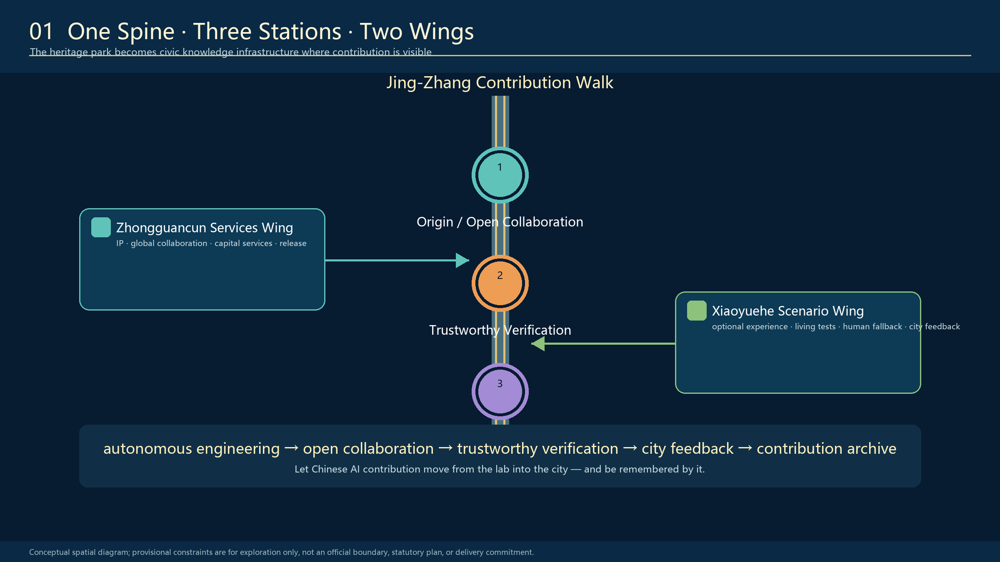

<!-- PARTICIPANT-DESIGN: Jing-Zhang City as Agent. Prepared by Codex for www41818520-coder. All spatial moves are conceptual suggestions for professional deepening; provisional geometry is explicitly retained pending organiser-supplied official files. -->

# Jing-Zhang City as Agent: A Capable City, Governed by Its People

> **Core proposition: give the city capability and give people authority. People ask; the city responds.**

“City as Agent” is neither software vocabulary pasted onto the city nor a proposal to hand the city to a super-AI. A city is already a continuously operating public system. What the existing city lacks is a closed loop in which problems are visible, tools are callable, actions are verifiable, processes are accountable and people can take over. The proposal translates the Agent cycle of sensing, asking, collaborating, acting, verifying and learning into one walkable public baseline, three task platforms, nine civic interfaces and a long-term operating institution.

## Design Basis and Source List

The proposal follows the official announcement, the agent taskbook and the repository site package. The public materials still do not provide organiser-owned precise official redlines or key-area polygons suitable for approval. `geometry/site_boundary.geojson` and `geometry/key_areas.geojson` therefore remain `provisional_constraint` with `official_boundary=false`. They support conceptual design, visual placement and machine recalculation only; they are not parcel, road, heritage or engineering redlines. When official files are released, boundary, key areas, land use, roads, green space, public space, buildings, phasing and metrics must be updated together. [source:OFFICIAL-ANNOUNCEMENT] [source:AGENT-TASKBOOK] [depth:existing_conditions_diagnosis]

Every spatial judgement follows three evidence rules: public information is never upgraded into an approval conclusion; a design suggestion must locate itself in a layer, metric or implementation project; and missing official information remains unknown rather than hidden behind false precision. [source:SOURCE-REGISTRY] [standard:PROJECT-OFFICIAL-ANNOUNCEMENT]

## Three-Level Scope Framework

The task has three scales: the 43.6 km² coordinated research area organises the AI innovation ecosystem and future urban form; the approximately 11.4 km² overall design area organises renewal, transport, municipal infrastructure, public space and character around the Jing-Zhang heritage park; and three key areas totalling approximately 368.4 ha test spatial prototypes, scenarios and delivery mechanisms. Machine-recalculated provisional geometry is used only for internal package consistency and cannot replace announced scale or official redlines. [data:geometry/site_boundary.geojson#SITE-001] [data:geometry/key_areas.geojson#PROV-KEY-001] [depth:three_level_scope_framework]

### Why the city becomes an Agent

The Chinese voice of the Jing-Zhang Railway is not a nostalgic motif but an engineering ethic: confront real terrain and constraints, measure, test, correct, maintain and take responsibility. AI-enabled city-building one century later must follow the same principles. Technology becomes urban capability only after it declares its boundary, accepts human review, allows public correction and retains an accountable record.

The spatial structure is “One Public Baseline, Three Task Platforms and Nine Civic Interfaces.” The heritage park retains walking, resting, photography and non-digital service. A continuous but expanding and contracting Information Canopy shows anonymised task state. Zhongzhiyuan, Beijing AI Origin and Dazhongsi respectively undertake sensing and calibration, collaboration and tool use, and takeover and memory. Nine interfaces connect universities, enterprises, communities, rail stations, public services and park operations. [depth:overall_spatial_structure] [standard:MOHURD-URBAN-DESIGN-MEASURES]

## Coordinated Research Area: Industry and Future City Research

The ecosystem is not an enterprise inventory but a complete chain of basic research, open-source rights clearance, engineering incubation, professional testing, small urban samples, and industrial and international communication. Universities produce knowledge and methods; enterprises and developers make tools; professional bodies verify safety and boundaries; real neighbourhoods provide low-risk feedback; and capital, intellectual property and international collaboration support only outcomes that have passed public-value review. [source:AGENT-TASKBOOK] [standard:PROJECT-AGENT-OPEN-CALL-TASKBOOK]

“City as Agent” also creates a new innovation space: laboratories, semi-open working platforms, real urban interfaces and public-memory spaces together become research infrastructure. The ecosystem is judged not by screen count but by whether research reaches real tasks, people can refuse or correct a service, and failures become readable knowledge for the next cycle.

The identity uses railway rust red, signal bone white, information cyan-blue and verification green. Red represents the historical baseline and the right to pause; cyan-blue represents task flow; bone white represents a maintainable public base; green represents completion after public verification. The Chinese slogan “A capable city, governed by its people” communicates a global proposition: autonomous innovation, engineering responsibility, public value and people’s governance must stand together.

## Overall Design Area: Urban Renewal and Regulatory-Plan-Level Urban Design

The overall design does not blanket 11.4 km² with devices. It aligns four systems:

1. **Land use and renewal:** AI research, open park, industrial services and community support reinforce one another.
2. **Mobility and stitching:** the north-south heritage-park slow-mobility spine meets nine east-west interfaces that connect rail, campuses, communities and industry.
3. **Blue-green public space:** railway park, rain gardens, continuous shade and public verification places form the ordinary urban baseline.
4. **Information and tasks:** status canopy, three platforms, human windows and work-unit relays make civic tasks visible, routable and open to takeover.

Current land-use, building, road and phasing layers are conceptual design proposals. Development intensity, building height, precise retain-renovate-demolish decisions, road redlines and engineering feasibility remain pending. Professional teams must deepen them after official controls, ownership, survey, heritage, municipal and transport information is available. [data:geometry/land_use.geojson#LU-001] [data:geometry/roads.geojson#ROAD-001] [depth:development_intensity_controls]

## Detailed Design of Key Areas

The three key areas do not repeat one form; together they complete one city-scale Agent. [data:geometry/key_areas.geojson#PROV-KEY-001] [data:geometry/key_areas.geojson#PROV-KEY-002] [depth:three_key_area_detailed_design]

### 1. Zhongzhiyuan: Public Verification Garden — SENSE + VERIFY

The urban problem is the missing public interface between strong innovation capacity and communities, ecology and everyday experience. Spatial moves include a low-intervention environmental calibration belt, an accessible public verification loop, a university-park joint test bench, a non-collection bypass and a staffed explanation desk. University laboratories, park operators, community representatives and professional reviewers share responsibility. Display cannot substitute for certification, and sensitive or commercially confidential data cannot enter the public interface.

### 2. Beijing AI Origin: Civic Works Commons — PLAN + TOOL USE

Universities, enterprises and public space are close to one another, yet they lack a common workplace that converts real problems into projects and maintains them over time. A flagship Information Platform, open-source tool bench, small urban test field, human takeover point and accountable sign-off desk form a semi-open intelligent workplace. People can ask; developers and enterprises can call tools; but action boundaries, owners, pause state and human alternatives must remain visible.

### 3. Dazhongsi: City Echo Exchange — TAKEOVER + MEMORY

Rail, commerce and community flows converge, yet complaints, scenario feedback and innovation outcomes rarely become public memory. A station-city service interface, dispute-review hall, open-source gallery, contribution wall and annual shutdown drill allow human takeover when services fail. The proposal makes no claims about station operation, property rights, tenancy, road reconstruction or underground engineering feasibility.

Each key area first uses existing public paths and reversible sites. A 3 m prototype tests use, safety, light and sound, accessibility and human fallback before expansion. Official polygons will trigger clipping, recalculation and interface relocation.

## AI Innovation Ecosystem, Personas, and AI+ Scenarios

Five core personas are corridor residents and families; wheelchair users and people with limited mobility; university students and teachers; AI developers and entrepreneurs; and city-service and maintenance staff. Visitors and global developers form an optional sixth group but cannot displace everyday rights. Every person has the right to know what a system does, refuse data collection, request human help, challenge a result and leave a scenario. [source:AGENT-TASKBOOK] [depth:traffic_rail_slow_parking]

| ID | AI+ scenario | Primary place | Human boundary and exit |
| --- | --- | --- | --- |
| S01 | Ecological calibration and rain observation | Zhongzhiyuan | Professional judgement; sensor-free path retained |
| S02 | Accessible route explanation | Corridor walk | Physical signs and staffed enquiry remain primary |
| S03 | Community-service navigation | Community interface | Service remains available without registration or face recognition |
| S04 | City-question proposal | AI Origin | Voluntary submission; no behavioural profiling |
| S05 | Public AI tutor test | Education space | Teacher review; protection of minors |
| S06 | Health-service navigation | Dazhongsi | Resource and referral navigation only; no diagnosis |
| S07 | Low-disturbance night safety guidance | Whole corridor | Human patrol and ordinary lighting cannot be replaced |
| S08 | Cycling parking and transfer assistance | Station interface | No automatic penalty; human appeal retained |
| S09 | Transparent commercial recommendation | Dazhongsi | Basis, price, complaint and withdrawal are visible |
| S10 | Explainable enterprise-service matching | Technology-services wing | Human consultant review; no policy-result promise |
| S11 | Bilingual railway-culture guide | Heritage park | Paper, physical signs and human guide run in parallel |
| S12 | City-question echo and archive | Three platforms | Aggregated anonymity; public can request adjustment or pause |

Three priority hard tests are: misinformation, privacy and clinical human fallback for health services; bias, minor protection and teacher takeover for education; and recommendation basis, complaint, withdrawal and non-digital alternatives for commerce and public service. Every scenario contract includes a real problem, minimum data, professional responsibility, human alternative, public verification and scheduled exit.

## Land Use, Building Scale, and Retain-Renovate-Demolish Strategy

Conceptual land use comprises continuous zones for research and innovation, open park, industrial service and community support. It explains functional coordination rather than statutory reclassification. The building layer only shows a potential renewal carrier for professional discussion. Complete existing-building, ownership, structure, fire, heritage and regulatory information is absent, so the proposal makes no parcel-level demolition, construction, height or FAR decision. [data:geometry/land_use.geojson#LU-001] [data:geometry/buildings.geojson#BLDG-001] [depth:retain_renovate_demolish]

Retain-renovate-demolish is a decision protocol rather than a predetermined result: verify heritage and ownership first; assess structure and use safety; prioritise repair and reversible adaptation where existing space can carry public service; use demountable modules for new structures and avoid rail relics, trees, utilities and fire access; obtain separate approval for every permanent intervention.

## Transport, Rail, Municipal Infrastructure, and Public Services

Ordinary urban capability comes first: continuous walking and cycling, accessible detours, rail transfer, shaded rest, legible wayfinding and staffed enquiry must work with AI switched off. Nine east-west interfaces express collaborative directions between campuses, communities, industry, stations and park; they are not bridge, tunnel or road alignments. [data:geometry/roads.geojson#ROAD-001] [depth:traffic_rail_slow_parking]

The Information Platform is the core facility prototype. Its continuous ribbon roof provides shade and rain cover while displaying project state. The civic workbench supports computers, tools and authorised information interfaces. A staffed window handles minimisation, takeover and complaints. A work-unit relay routes tasks to a university, enterprise, community service or public agency. Results return to the same place for public verification. The canopy displays anonymised task state, never personal trajectories. [data:geometry/public_space.geojson#PUBLIC-001] [depth:municipal_new_infrastructure]

Begin with a reversible 3 m prototype and expand through an approximately 6 m conceptual module. Final span, structure, material, waterproofing, luminance, acoustics, power, network, fire, accessibility and utility conditions require survey and specialist design.

## Blue-Green Network, Public Space, and Urban Character

The railway heritage is first an everyday public space, not an AI-exhibition background. Walking, photography, play, reading and shaded rest remain. Rain gardens, continuous canopy, low-disturbance night lighting and Information Platforms support this ordinary baseline. Water extends beyond local board boundaries as an ecological context, but it does not replace river blue lines or flood conclusions. [data:geometry/green_space.geojson#GREEN-001] [data:geometry/public_space.geojson#PUBLIC-001] [depth:blue_green_public_space]

The architecture combines reflective stainless steel, bone-white structure, low-luminance cyan-blue information light and railway-signal red. Its technological character comes from visible information flow, real work, modular maintenance and day-night state change, not from a sealed black object. The cultural route follows Measure—Build—Switch Track—Open Source—Verify, linking Jing-Zhang engineering culture, Zhongguancun innovation culture and public responsibility for AI.

## Renewal Projects, Implementation Policy, and Phasing

| Project | Content | Place | Critical dependency |
| --- | --- | --- | --- |
| P01 Continuous public baseline | Slow mobility, accessibility, shade, human service | Whole corridor | Survey, heritage, transport, park operation |
| P02 Three task platforms | Calibration, collaboration, takeover | Three key areas | Site authority, accountable host, fire and maintenance |
| P03 Nine civic interfaces | University, community, enterprise, station collaboration | Corridor nodes | Ownership, roads, rail and flow data |
| P04 Information Canopy system | Status display, relay, human takeover | Platforms and work units | Privacy, network, luminance, energy and safety |
| P05 Public railway memory | Developer walk, outcome gallery, honour wall | Heritage park | Heritage, copyright and distinction between proposal, selection and implementation |
| P06 Twelve AI+ scenarios | Health, education, commerce and others | Real neighbourhoods | Sector responsibility, legal data use and non-AI alternative |
| P07 Annual open verification season | Questions, prototype, verification, archive | Four-season cycle | Host, budget, safety and international-authorisation conditions |
| P08 Data and exit institution | Minimum data, shutdown and recalculation | Whole lifecycle | Audit, complaint, archive and accountable sign-off |

Delivery uses four reversible gates. G0 (0–3 months) completes survey, ownership, utilities, heritage, needs and data audits. G1 (3–6 months) tests a 3 m prototype for shutdown, light and sound, accessibility and human fallback. G2 (6–18 months) pilots one node in each key area and publishes work-order status. G3 annually decides continuation, restriction, relocation or exit according to public value, safety and maintenance capacity. [data:geometry/phasing.geojson#PHASE-001] [depth:renewal_project_list] [depth:phasing_implementation]

The annual loop is Spring City Questions, Summer Open Co-creation, Autumn Public Verification and Winter Works Archive. It is a reference operating framework, not an announced government event or implementation commitment.

## Metrics, Area Recalculation, and Compliance Matrix

| Metric | Current status | Meaning |
| --- | --- | --- |
| Overall design scale | Announced approx. 11.4 km²; provisional geometry recalculates 11.4128 km² | Internal package consistency only; recalculate with official boundary |
| Key areas | 3 | Provisional rough extents pending official polygons |
| Green ratio | 12.34% | Recalculated from submission design layer; not an existing or approved index |
| Public-space ratio | 7.33% | Recalculated from submission design layer; not a statutory control |
| Illustrative building footprint | 310,807 m² | Design-proposal layer, not approved building scale |
| FAR, building height and precise retain-renovate-demolish | unknown | No official controls or complete professional survey; no invented conclusion |

GeoJSON and `metrics.json` support recalculation; `compliance_matrix.json` checks task coverage; `standard_matrix.json` and `design_depth_matrix.json` record standards and professional depth. Official data will trigger replacement of provisional geometry, metric recalculation, key-area placement review, and synchronised updates to drawings, narrative and manifest. [metric:site_area_sqm] [metric:green_ratio] [depth:metrics_recalculation]

## Risk, Copyright, and Compliance

This is an open co-creation proposal, not a planning approval, engineering-feasibility study or construction document. It cannot establish road redlines, property disposition, building demolition, station alteration, bridge, tunnel or underground feasibility, traffic capacity, structural safety, medical judgement or public-investment commitment. [data:geometry/constraints.geojson#CONSTRAINTS] [depth:risk_missing_data] [standard:MOHURD-CONTROL-DETAILED-PLANNING]

Professional deepening must obtain official boundary and controls; cadastral and ownership records; heritage and archaeology requirements; existing-building and structural survey; transport, rail and parking information; municipal utilities and energy; fire, flood and accessibility requirements; visitor flow and operation; funding and security governance; and the legal basis and public-interest case for each AI service. Images, marks, fonts, datasets, cases and contributor names require rights clearance before implementation.

Every AI service requires an accountable operator, human reviewer, escalation and complaint route, non-AI alternative, minimum-data rule, scheduled exit and named authority for return to service. People are not data sources “kept in the loop”; they are urban subjects with the rights to ask, verify, refuse and take over.

## References

References are not a decorative end list. The proposal separates them into task authority, spatial constraints, public background and participant-generated design. The official announcement establishes the three scope levels, professional outputs and mandatory tasks. The agent taskbook establishes the six Agent tasks, scenario counts, review dimensions and co-creation limits. The site package supplies currently available provisional geometry, enumerations, metric structure and validation contract. The source registry determines whether a source can support a formal claim, background narrative or provisional lead. Complete titles, links, limits and processing paths are recorded in `sources.json`. [source:OFFICIAL-ANNOUNCEMENT] [source:AGENT-TASKBOOK]

Spatial layers and metrics are not new authoritative sources; they are reproducible participant-generated design evidence derived from the registered materials. `geometry/site_boundary.geojson` and `geometry/key_areas.geojson` explicitly retain provisional status. Land use, buildings, roads, green space, public space and phasing express design logic only. `metrics.json` records formula, source file, confidence and recalculation conditions. Official redlines, regulatory controls, ownership, heritage, utilities and engineering information remain professional-deepening gaps and cannot be replaced by OSM, renderings or provisional rectangles. [source:SITE-PACKAGE] [source:SOURCE-REGISTRY]

Reviewers can move from claim-adjacent `[source:...]`, `[data:...]`, `[metric:...]`, `[standard:...]` and `[depth:...]` labels into machine evidence, then return to the A0/A3 drawings to understand spatial judgement. This two-way relationship prevents drawings from becoming unsupported slogans and prevents JSON from becoming a black box that humans must decipher unaided.
