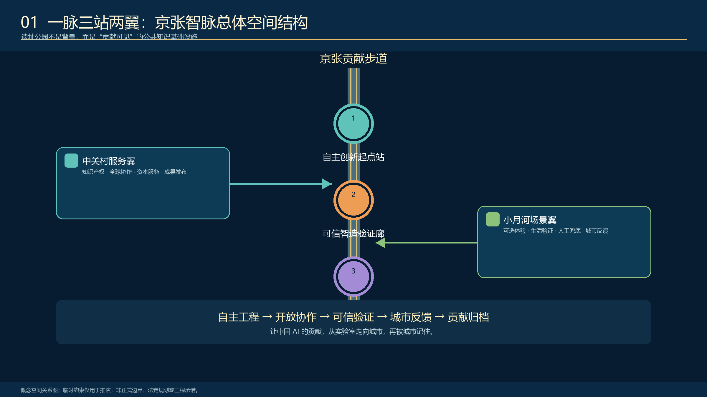
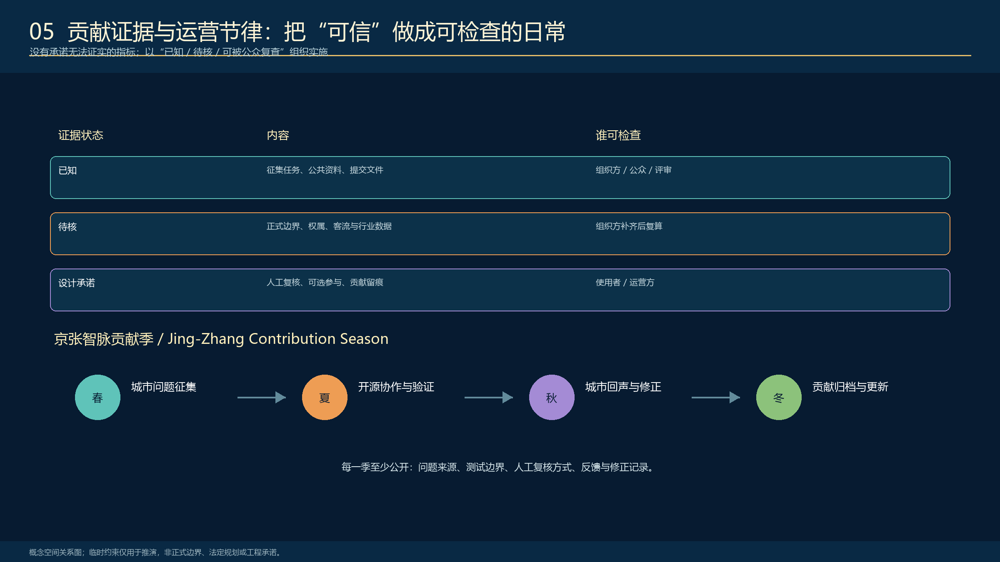

<!-- PARTICIPANT-DESIGN: Jing-Zhang City as Agent. Prepared by Codex for www41818520-coder. All spatial moves are conceptual suggestions for professional deepening; provisional geometry is explicitly retained pending organiser-supplied official files. -->

# 京张城市智能体：城市有智，人民作主

> **核心命题：让城市有能力，人民有权力。人民提问，城市作答。**

“城市即 Agent”不是把软件术语贴到城市上，也不是把城市交给一个超级 AI。城市本来就是持续运行的公共系统；既有城市真正缺少的，是问题可见、工具可调用、行动可验证、过程可追责、公众可接管的闭环。本方案把 Agent 的感知、提问、协作、行动、复验与学习，转译为一条可步行的公共基线、三座任务月台、九道城市接口和一套长期运营制度。

## 设计依据与资料清单

方案以正式公告、面向智能体任务书和仓库场地包为依据。当前公开资料仍未提供可作为审批依据的官方精确红线和三处重点区多边形；`geometry/site_boundary.geojson` 与 `geometry/key_areas.geojson` 因此保持 `provisional_constraint`、`official_boundary=false`。它们只用于概念设计、图面落位和机器复算，不是地块、道路、文保或工程红线。官方文件发布后，边界、重点区、用地、道路、绿地、公共空间、建筑、分期和指标必须同步更新。[source:OFFICIAL-ANNOUNCEMENT] [source:AGENT-TASKBOOK] [depth:existing_conditions_diagnosis]

本方案所有空间判断遵循三条证据规则：公开来源不升级为审批结论；设计建议必须能定位到图层、指标或实施项目；官方资料缺失处保持未知，不用看似精确的数值掩盖不确定性。[source:SOURCE-REGISTRY] [standard:PROJECT-OFFICIAL-ANNOUNCEMENT]

## 三层范围工作框架

任务包含三个尺度：43.6 平方公里统筹研究范围用于组织 AI 创新生态和未来城市形态；约 11.4 平方公里总体设计范围用于组织京张遗址公园及两侧城市更新、交通市政、公共空间与风貌；三处重点区合计约 368.4 公顷，用于验证空间原型、场景和实施机制。临时几何的机器复算值只用于包内一致性检查，不能替代公告规模或正式红线。[data:geometry/site_boundary.geojson#SITE-001] [data:geometry/key_areas.geojson#PROV-KEY-001] [depth:three_level_scope_framework]

### 城市为什么成为 Agent

京张铁路的中国声音不是复古图案，而是一套工程伦理：面对真实地形和约束，持续测量、试验、纠偏、维护并承担责任。百年后的 AI 城市建设也必须遵循同样原则。技术只有在公开边界、接受人工复核、允许公众纠正并留下责任记录后，才能成为城市能力。

空间结构为“一条公共基线、三座任务月台、九道城市接口”：遗址公园保持散步、休憩、拍照和非数字服务；连续而有收有放的信息檐带显示脱敏后的任务状态；众智园、北京 AI 原点、大钟寺分别承担感知校准、协作工具和接管记忆；九道接口连接高校、企业、社区、轨道站点、公共服务和公园运营。[depth:overall_spatial_structure] [standard:MOHURD-URBAN-DESIGN-MEASURES]

## 统筹研究范围产业与未来城市研究

产业生态不是企业清单，而是一条“基础研究—开源清权—工程孵化—专业测试—城市小样本—产业与国际传播”的完整链。高校与科研机构提出知识和方法，企业与开发者形成工具，专业机构验证安全和边界，真实街区提供低风险反馈，资本、知识产权和国际合作只服务于已经通过公共价值验证的成果。[source:AGENT-TASKBOOK] [standard:PROJECT-AGENT-OPEN-CALL-TASKBOOK]

“城市即 Agent”同时提供一种新的创新空间：实验室、半开放工作月台、真实城市接口和公共记忆场共同构成研发基础设施。评价创新生态不看屏幕数量，而看研究能否进入真实任务、公众能否拒绝或纠正、失败能否转化为下一轮可读取的知识。

品牌系统使用铁路铁锈红、信号骨白、信息青蓝和复验绿：红色代表历史基准与暂停权，青蓝代表任务流，骨白代表可维护的公共基座，绿色代表经过公众复验的完成状态。中文主口号“城市有智，人民作主”面向全球表达一项中国主张：自主创新必须与工程责任、公共价值和人民治理共同成立。

## 总体设计范围城市更新与控规深度城市设计

总体设计不把 11.4 平方公里一次性铺满设备，而以四套对齐系统组织更新：

1. **用地与更新系统**：AI 研发创新、公园开放、产业服务、社区配套互相支撑。
2. **交通与缝合系统**：南北遗址公园慢行主轴与九道东西城市接口叠合，连接轨道、校园、社区与产业。
3. **蓝绿公共空间系统**：铁路公园、雨水花园、连续树荫、公众复验场构成普通城市基线。
4. **信息与任务系统**：状态檐带、三座月台、人工窗口和工作单位中继使城市任务可见、可送达、可接管。

当前用地、建筑、道路和分期图层是概念性设计提案。开发强度、建筑高度、精确拆改留、道路红线和工程可行性保持待确认；专业团队应在官方控规、权属、现状测绘、文保、市政和交通资料齐备后深化。[data:geometry/land_use.geojson#LU-001] [data:geometry/roads.geojson#ROAD-001] [depth:development_intensity_controls]

## 重点区域详细设计

三处重点区不复制同一造型，而共同完成一个城市 Agent。[data:geometry/key_areas.geojson#PROV-KEY-001] [data:geometry/key_areas.geojson#PROV-KEY-002] [depth:three_key_area_detailed_design]

### 1. 众智园：公众验证花园 — SENSE + VERIFY

城市问题是强创新能力与沿线社区、生态和日常体验之间缺少公开验证接口。空间动作包括低干预环境校准带、无障碍公众复验环、高校—公园联合测试台、非采集旁路和人工解释席。高校实验室、公园运营、社区代表和专业审查共同负责；技术展示不能替代认证，敏感或商业保密数据不得进入公共界面。

### 2. 北京 AI 原点：城市工务共同体 — PLAN + TOOL USE

城市问题是高校、企业和公共空间彼此邻近，却缺少把真实问题转化为项目并持续维护的共同工作场。旗舰信息月台、开源工具工作台、城市小样本试验场、人工接管与责任签字席构成半开放智能办公空间。公众可以提问，开发者和企业可以调用工具，但行动边界、负责人、暂停状态和人工替代必须公开。

### 3. 大钟寺：城市回声交换站 — TAKEOVER + MEMORY

城市问题是轨道、商业和社区客流汇聚，但服务投诉、场景反馈与创新成果难以沉淀为公共记忆。站城生活服务接口、争议复核厅、开源成果廊、贡献墙和年度停机演练场让服务失败仍能被人工接管。方案不预设站点运营、产权、商业租赁、道路改造或地下工程可行性。

三处重点区均先依托既有公共路径和可逆场地，以 3 米样机验证使用、安全、声光、无障碍和人工替代，再决定是否扩展。官方多边形发布后必须重新裁切、复算并校核接口位置。

## AI 创新生态、人才画像与 AI+ 场景

五类核心人物是：沿线居民与家庭、轮椅及行动不便使用者、高校师生、AI 开发者与创业者、城市服务与维护人员。访客和全球开发者可作为第六类扩展人群，但不能挤压日常使用权。每类人都拥有知道系统在做什么、拒绝数据采集、要求人工帮助、质疑结果和退出场景的权利。[source:AGENT-TASKBOOK] [depth:traffic_rail_slow_parking]

| 编号 | AI+ 场景 | 主要空间 | 人工边界与退出 |
| --- | --- | --- | --- |
| S01 | 生态校准与雨洪观察 | 众智园 | 专业人员判断；无传感器路径保留 |
| S02 | 无障碍路径解释 | 全线慢行界面 | 物理标识和人工问询优先 |
| S03 | 社区服务导航 | 社区接口 | 不注册、不刷脸也可获得服务 |
| S04 | 城市问题提案 | AI 原点 | 自愿提交；不形成行为画像 |
| S05 | AI 助教公开测试 | 教育空间 | 教师复核；保护未成年人 |
| S06 | 健康服务导航 | 大钟寺 | 只做资源与转诊导航，不诊断 |
| S07 | 夜间低扰动安全引导 | 全线 | 人工巡查和普通照明不能被替代 |
| S08 | 骑行停放与换乘辅助 | 站点接口 | 不自动处罚；保留人工申诉 |
| S09 | 透明商业推荐 | 大钟寺 | 公开依据、价格、投诉与撤回 |
| S10 | 企业服务可解释匹配 | 科技服务翼 | 人工顾问复核，不承诺政策结果 |
| S11 | 铁路文化双语导览 | 遗址公园 | 纸质、实体标识和人工讲解并行 |
| S12 | 城市问题回声与归档 | 三座月台 | 匿名汇总；公众可要求调整或暂停 |

三项优先硬测试分别是：医疗/健康场景的误导、隐私和人工兜底；教育场景的偏差、未成年人保护和教师接管；商业/公共服务场景的推荐依据、投诉、撤回和非数字替代。任何场景都必须具备真实问题、最小数据、专业责任、人工替代、公开复验和到期退出六项合同。

## 用地、建筑规模与拆改留方案

概念用地采用研发创新、公园开放、产业服务和社区配套四类连续分区，用于说明功能协同而非法定地类调整。建筑图层只表达可供专业团队讨论的更新承载示意；缺少完整现状建筑、权属、结构、消防、文保和控规资料，因此不作单体拆除、新建、高度或容积率结论。[data:geometry/land_use.geojson#LU-001] [data:geometry/buildings.geojson#BLDG-001] [depth:retain_renovate_demolish]

拆改留采用决策协议而非预判结果：先核实文保与权属，再做结构和使用安全评估；能够承载公共服务的既有空间优先修缮和可逆改造；新增构筑物采用可拆卸模块并避让铁路遗存、树木、管线和消防通道；任何永久建设均需另行审批。

## 交通、轨道、市政与公共服务设施

交通策略以普通城市能力优先：连续步行和骑行、无障碍绕行、轨道换乘、树荫休息、清晰导向和人工问询必须在 AI 关闭时仍然成立。九道东西接口用于表达高校、社区、产业、站点与公园之间的协作方向，不是桥隧或道路工程线位。[data:geometry/roads.geojson#ROAD-001] [depth:traffic_rail_slow_parking]

信息月台是核心设施原型：连续飘带屋顶兼具遮阳避雨和项目状态显示；公众工务台支持电脑、工具和授权信息界面；人工窗口负责脱敏、接管和投诉；工作单位中继把任务发送至高校、企业、社区服务或管理部门；结果返回同一场所供公众复验。信息檐带只显示脱敏后的任务状态，不公开个人轨迹。[data:geometry/public_space.geojson#PUBLIC-001] [depth:municipal_new_infrastructure]

建议从 3 米可逆样机开始，按约 6 米概念模数扩展；最终跨度、结构、材料、防水、屏幕亮度、声环境、供配电、网络、消防、无障碍和管线条件均须现场测绘与专项深化。

## 蓝绿空间、公共空间与城市风貌

铁路遗址首先是日常公共空间，不是 AI 展馆背景。保留散步、拍照、玩耍、阅读和林下休息，将雨水花园、连续树荫、低扰动夜景与信息月台结合。水系在图面中超越局部边界，表达区域生态连续性，但不替代河道蓝线或防洪结论。[data:geometry/green_space.geojson#GREEN-001] [data:geometry/public_space.geojson#PUBLIC-001] [depth:blue_green_public_space]

构筑物采用反射不锈钢、骨白结构、低亮青蓝信息光和铁路信号红。科技感来自可见的信息流、真实工作、模块化维护和昼夜状态变化，而不是黑色封闭体量。文化路线依次讲述“测量—建造—转轨—开源—验证”，把京张工程文化、中关村创新文化和 AI 公共责任连接起来。

## 更新项目清单、实施政策与分期计划

| 项目 | 内容 | 空间 | 关键依赖 |
| --- | --- | --- | --- |
| P01 公共基线连续化 | 慢行、无障碍、树荫、人工服务 | 全线 | 测绘、文保、交通与公园运营 |
| P02 三座任务月台 | 校准、协作、接管 | 三重点区 | 场地授权、责任主体、消防与维护 |
| P03 九道城市接口 | 高校、社区、企业、站点协作 | 沿线节点 | 权属、道路、轨道与人流资料 |
| P04 信息檐带系统 | 状态显示、中继、人工接管 | 月台与工作单位 | 隐私、网络、亮度、能耗与安全 |
| P05 铁路文化公共记忆 | 开发者步道、成果廊、荣誉墙 | 遗址公园 | 文保、版权、入选与实施状态区分 |
| P06 十二类 AI+ 场景 | 医疗、教育、商业等 | 真实街区 | 行业责任、数据合法性、非 AI 替代 |
| P07 年度开放验证季 | 提问、样机、复验、归档 | 四季循环 | 主办、预算、安全与国际协作授权 |
| P08 数据与退出制度 | 最小数据、停机、复算 | 全周期 | 审计、投诉、归档和责任签字 |

实施采用四道可逆门：G0（0—3 月）完成测绘、权属、管线、文保、需求和数据审计；G1（3—6 月）完成 3 米样机及断电、声光、无障碍和人工替代测试；G2（6—18 月）在三重点区开展节点试点并公开工单；G3 按年度公共价值、安全和维护能力决定续期、限制、迁移或退出。[data:geometry/phasing.geojson#PHASE-001] [depth:renewal_project_list] [depth:phasing_implementation]

年度运营为“春季城市提问—夏季开放共创—秋季公众复验—冬季工务归档”。这是一套参考运营框架，不是已确定的政府活动或实施承诺。

## 指标体系、面积复算与合规矩阵

| 指标 | 当前状态 | 解释 |
| --- | --- | --- |
| 总体设计规模 | 公告约 11.4 km²；临时几何复算 11.4128 km² | 只用于投稿包内部一致性，待官方边界复算 |
| 重点区域 | 3 处 | 临时粗略范围，待官方多边形替换 |
| 绿地比例 | 12.34% | 投稿设计图层复算值，不是现状或审定指标 |
| 公共空间比例 | 7.33% | 投稿设计图层复算值，不是法定控制指标 |
| 建筑基底示意 | 310,807 m² | 设计提案图层，不是审定建筑规模 |
| 容积率、建筑高度、精确拆改留 | unknown | 缺少官方控规和现状专业资料，不编造结论 |

指标由 GeoJSON 与 `metrics.json` 复算，任务覆盖由 `compliance_matrix.json` 校核，专业标准和成果深度由 `standard_matrix.json`、`design_depth_matrix.json` 记录。官方数据发布后必须替换临时几何、重算面积与比例、校核三重点区落位并同步更新图纸、正文和 manifest。[metric:site_area_sqm] [metric:green_ratio] [depth:metrics_recalculation]

## 风险、版权与合规说明

本方案是开放共创建议，不是规划审定、工程可行性或施工文件。不得由本方案推导道路红线、产权处置、建筑拆建、站点改造、桥隧地下工程、交通容量、结构安全、医疗判断或政府投资承诺。[data:geometry/constraints.geojson#CONSTRAINTS] [depth:risk_missing_data] [standard:MOHURD-CONTROL-DETAILED-PLANNING]

专业深化必须补齐：官方边界与控规、地籍和权属、文物和考古、现状建筑与结构、交通轨道和停车、市政管线与能源、消防防洪和无障碍、人流和运营、资金与安全管理、AI 服务合法性和公共利益论证。所有图像、标志、字体、数据、案例和贡献者姓名在实施前须完成权利清理。

每个 AI 服务必须明确运营主体、人工复核人、升级投诉路径、非 AI 替代、最小数据、到期退出和具名复役责任。人民不是被“放在回路里”的数据源，而是拥有提问、复验、拒绝和接管权的城市主体。

## 参考资料

本方案不把参考资料作为文末装饰，而把它们分成任务依据、空间约束、公开背景和投稿者设计四类。正式公告决定三层范围、专业成果和必答任务；面向智能体任务书决定六项 Agent 任务、场景数量、评审维度和共创边界；场地包提供当前可用的临时几何、枚举、指标结构和校验契约；来源登记表决定每份资料能否用于 formal 结论、背景叙事或只能作为待核线索。完整标题、链接、使用限制和处理路径均登记在 `sources.json`。[source:OFFICIAL-ANNOUNCEMENT] [source:AGENT-TASKBOOK]

空间图层和指标不是新的权威资料，而是投稿者根据上述来源生成的可复算设计证据。`geometry/site_boundary.geojson` 与 `geometry/key_areas.geojson` 明确保留临时性质；用地、建筑、道路、绿地、公共空间和分期只表达设计逻辑；`metrics.json` 记录公式、来源文件、置信度和待复算条件。官方红线、控规、权属、文保、市政和工程资料仍是专业深化缺口，不能由 OSM、效果图或临时矩形替代。[source:SITE-PACKAGE] [source:SOURCE-REGISTRY]

评审者可以从正文中的 `[source:...]`、`[data:...]`、`[metric:...]`、`[standard:...]` 和 `[depth:...]` 标签进入机器证据，再回到 A0/A3 图纸理解空间判断。这个双向关系确保图纸不是脱离数据的口号，JSON 也不是要求人类自行阅读的黑箱。
