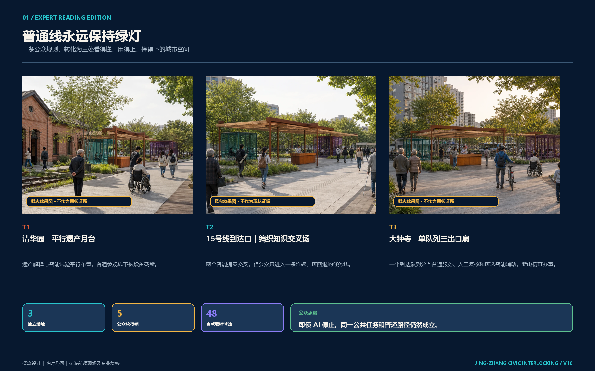
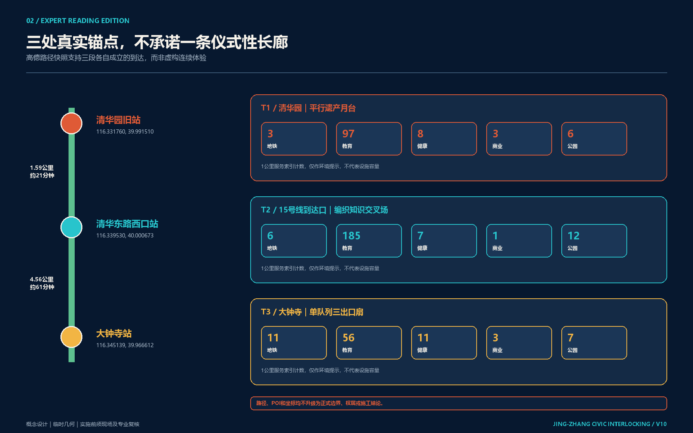
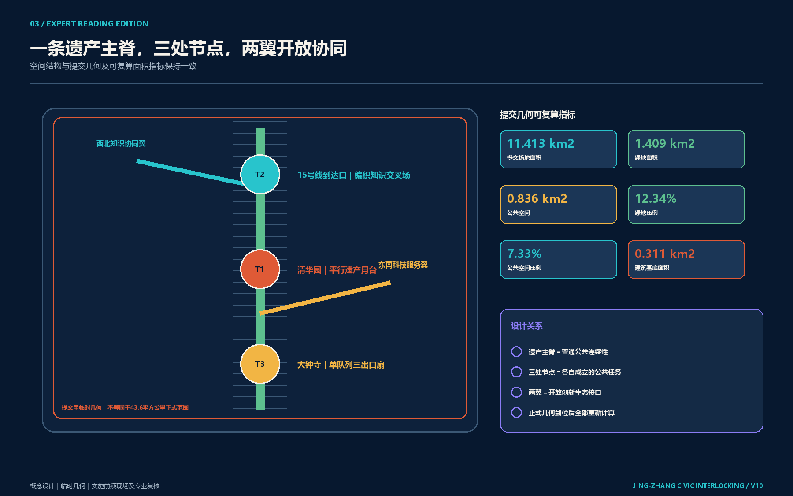
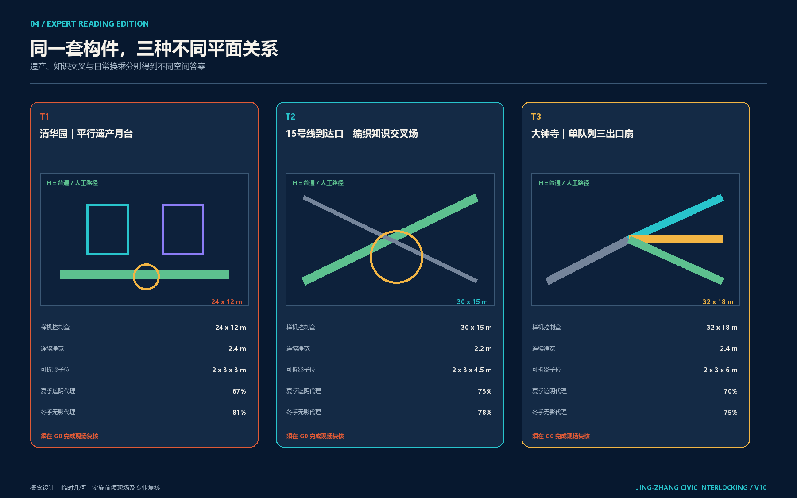
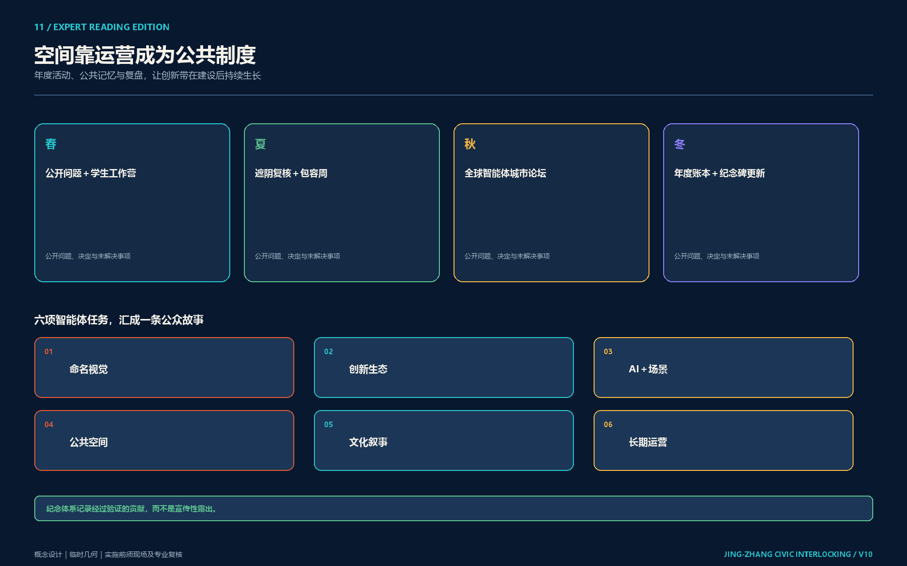
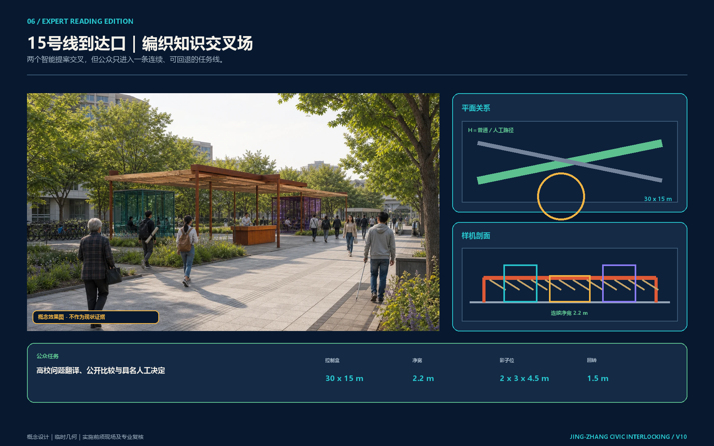
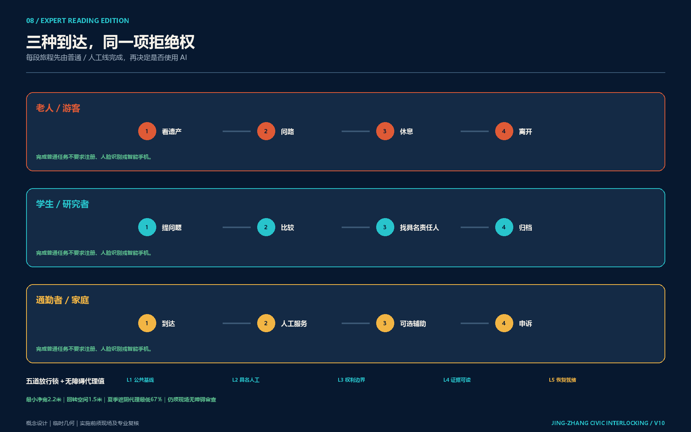
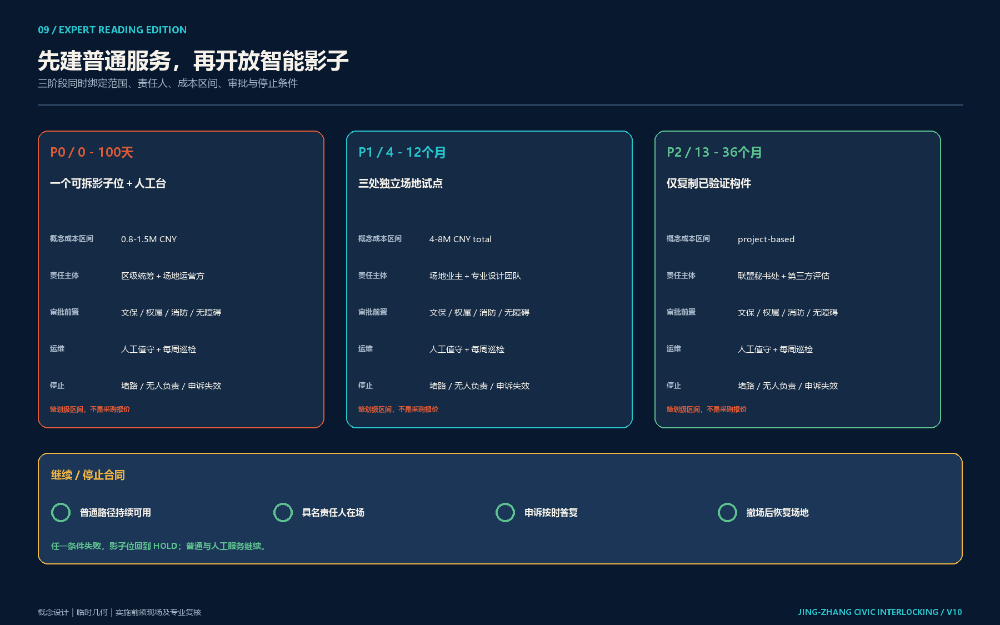
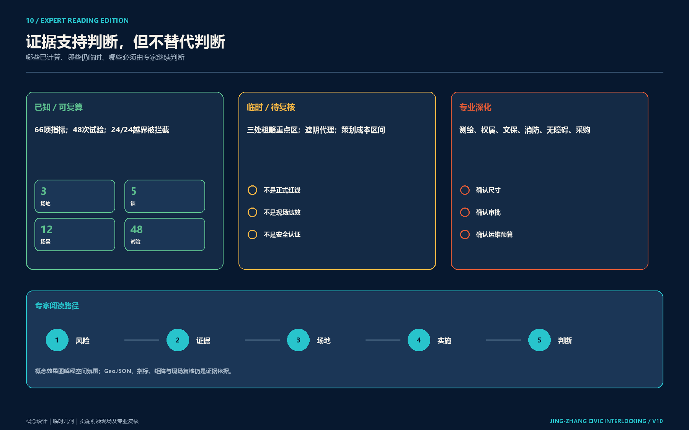

<!-- PARTICIPANT-DESIGN: Jing-Zhang City as Agent. Prepared by Codex for www41818520-coder. All spatial moves are conceptual suggestions for professional deepening; provisional geometry is explicitly retained pending organiser-supplied official files. -->

# 京张市民联锁：普通线永远保持绿灯

> **核心命题：让城市有能力，人民有权力。人民提问，城市作答。**

> **图面身份：** 上图三处空间场景为 AI 辅助的参赛者概念示意，不是现状照片、官方资料、审批成果或已建工程；五张必需图、指标、GeoJSON、风险与假设登记册构成可核验证据层。[assumption:A-RENDER-001]

## 专家快速判断

**问题。** AI 场景最容易把普通服务变成技术入口、把建议责任变成无人负责的界面，也容易在试点结束后留下无法维护的设备与数据。

**空间答案。** 一条无需设备、始终可走的 H 普通/人工线串联清华园旧站、15 号线到达口和大钟寺；两个可拆的智能影子位只在五锁齐备时临时放行。三处分别处理遗产解释、知识协作和人工接管，不复制同一种亭子。

**实施答案。** 首百日先完成资料锁定、无设备需求记录、3 米可逆样机、五类故障演练和一次继续/修改/退出决定，规划级资源假设为 80—150 万元；随后三处可逆试点的规划级资源假设为 400—800 万元。两组数值均不是报价、预算或采购承诺，责任主体与审批条件须在 G0 书面确认。[assumption:A-COST-001] [assumption:A-OWNER-002] [assumption:A-PERMIT-001]

**阅读方式。** A3 手册保留 11 页决策主线；A0 在同一主线后追加五张 V9 精选技术证据图。新场景图回答“人在空间里经历什么”，原图回答“设计从哪里来、如何测试、谁负责、如何退出”。

## 市民联锁：空间放行机制

“城市即 Agent”不是把软件术语贴到城市上，也不是把城市交给一个超级 AI。V12 把京张铁路最重要的工程隐喻转成城市设计：铁路联锁用于避免冲突进路；**市民联锁**则要求智能行动只有在公共基线、具名人工、权利边界、证据可读、恢复就绪五项同时锁定时才能进入可见的影子试验。这里不是声称套用铁路信号技术，更不构成安全认证，而是把“何时不得行动”做成人人看得见的平面、剖面、灯态和责任合同。[standard:PROJECT-AGENT-OPEN-CALL-TASKBOOK] [depth:overall_spatial_structure]

五道联锁分别是：L1 同一任务在无设备的普通路径上可完成；L2 现场能找到具名人工责任人；L3 数据、工具、权限和申诉边界已锁定；L4 版本、证据、异议和状态在断电时仍可读；L5 人工接管、撤除、删除和恢复已演练。任一锁缺失，智能支线保持不可见，普通/人工 H 线继续工作。每次决定生成十二字段“路线卡”，记录任务、场地、拓扑、普通路径、智能范围、人工责任、锁态、异议、结果、恢复、到期与哈希，不把成功分数当公共证明。[data:visual/assets/civic-interlocking-route-card-schema.json] [metric:interlocking_lock_count] [metric:interlocking_route_card_field_count]

三处重点区不复制一个亭子，而形成三种关系：清华园旧站是 24×12 米“平行遗产月台”，无屏 H 线与两个 3×3 米可拆影子位平行；15号线到达口是 30×15 米“编织知识交叉场”，同一问题穿过两份有界建议后交给人工节点；大钟寺是 32×18 米“单队列三出口扇”，同一队列可选安静普通服务、人工复核或有边界的智能辅助。三者最小连续净宽 2.2 米、均预留直径 1.5 米回转空间，但这些只是标准化方案盒，G0 仍须由现场无障碍、消防、文保、交通和产权专业复核。[data:visual/assets/civic-interlocking-spatial-topologies.json] [metric:interlocking_spatial_topology_count] [assumption:A-INTERLOCK-001]

方案生成没有从一个偏好答案直接出图。四条独立设计根在同一 120 米标准路径上比较：R1 中心信号塔、R2 分布式智能亭、R3 应用优先无感路线、R4 市民联锁场；它们按普通路径连续度、人工责任可见度、智能面积可逆率、夏季遮阴代理和流线冲突代理复算。前三者分别因单点权力、人工责任不可见或普通路径断裂触发硬退件，只有 R4 同时通过四道空间门后才进入设计评议；代理值只筛除不可接受状态，不替代专业选择。[data:visual/assets/civic-interlocking-design-roots.json] [metric:interlocking_design_root_count] [metric:interlocking_eligible_root_count]

十二类城市场景再分别运行正常、证据模糊、权限越界、断电四种合成夹具，共 48 次哈希寻址试验：12 次只允许影子放行，24 次保持停止，12 次转人工接管，24/24 个注入的模糊或越界状态被捕获。它们验证的是设计合同，不是现场成果或安全认证；真正运行仍需审批、现场基线与独立复测。[data:visual/assets/civic-interlocking-trials.json] [metric:interlocking_trial_count] [assumption:A-INTERLOCK-001]

三个标准化方案盒还按构筑物投影区间计算“夏季被遮路线／总路线”和“冬季无影路线／总路线”代理，最低分别为 67% 与 75%；这只是比较遮阴构成的几何算术，不包含树木生长、天空视域、反射、风热或真实气象，不能替代日照、微气候和热舒适模拟。[metric:prototype_summer_shade_proxy_min] [metric:prototype_winter_unshadowed_proxy_min] [assumption:A-SHADE-001]

> **一句话交付：普通服务线永远保持绿灯；五锁齐备，智能支线才获得一次有期限、可撤回的影子进路。**

## 设计依据与资料清单

方案以正式公告、面向智能体任务书和仓库场地包为依据。当前公开资料仍未提供可作为审批依据的官方精确红线和三处重点区多边形；`geometry/site_boundary.geojson` 与 `geometry/key_areas.geojson` 因此保持 `provisional_constraint`、`official_boundary=false`。它们只用于概念设计、图面落位和机器复算，不是地块、道路、文保或工程红线。官方文件发布后，边界、重点区、用地、道路、绿地、公共空间、建筑、分期和指标必须同步更新。[source:OFFICIAL-ANNOUNCEMENT] [source:AGENT-TASKBOOK] [depth:existing_conditions_diagnosis]

图 1 以高德具名坐标和步行路径锁定三处体验锚点，并把周边公共服务、教育、交通与文化设施作为现场核验清单；它不把点位或路径升级为边界、产权、连续步道或工程结论。正式定位、连续净宽、坡度、过街和保护关系必须在 G0 现场复核。[source:AMAP-SPATIAL-SNAPSHOT-20260821]

本方案所有空间判断遵循三条证据规则：公开来源不升级为审批结论；设计建议必须能定位到图层、指标或实施项目；官方资料缺失处保持未知，不用看似精确的数值掩盖不确定性。[source:SOURCE-REGISTRY] [standard:PROJECT-OFFICIAL-ANNOUNCEMENT]

## 三层范围工作框架

任务包含三个尺度：43.6 平方公里统筹研究范围用于组织 AI 创新生态和未来城市形态；约 11.4 平方公里总体设计范围用于组织京张遗址公园及两侧城市更新、交通市政、公共空间与风貌；三处重点区合计约 368.4 公顷，用于验证空间原型、场景和实施机制。临时几何的机器复算值只用于包内一致性检查，不能替代公告规模或正式红线。[data:geometry/site_boundary.geojson#SITE-001] [data:geometry/key_areas.geojson#PROV-KEY-001] [depth:three_level_scope_framework]

### 城市为什么成为 Agent

京张铁路的中国声音不是复古图案，而是一套工程伦理：面对真实地形和约束，持续测量、试验、纠偏、维护并承担责任。百年后的 AI 城市建设也必须遵循同样原则。技术只有在公开边界、接受人工复核、允许公众纠正并留下责任记录后，才能成为城市能力。

空间结构为“一条公共基线、三座任务月台、九道城市接口”：遗址公园保持散步、休憩、拍照和非数字服务；连续而有收有放的信息檐带显示脱敏后的任务状态；众智园、北京 AI 原点、大钟寺分别承担感知校准、协作工具和接管记忆；九道接口连接高校、企业、社区、轨道站点、公共服务和公园运营。[depth:overall_spatial_structure] [standard:MOHURD-URBAN-DESIGN-MEASURES]

## 统筹研究范围产业与未来城市研究

产业生态不是企业清单，而是一条“基础研究—开源清权—工程孵化—专业测试—城市小样本—产业与国际传播”的完整链。高校与科研机构提出知识和方法，企业与开发者形成工具，专业机构验证安全和边界，真实街区提供低风险反馈，资本、知识产权和国际合作只服务于已经通过公共价值验证的成果。[source:AGENT-TASKBOOK] [standard:PROJECT-AGENT-OPEN-CALL-TASKBOOK]

“城市即 Agent”同时提供一种新的创新空间：实验室、半开放工作月台、真实城市接口和公共记忆场共同构成研发基础设施。评价创新生态不看屏幕数量，而看研究能否进入真实任务、公众能否拒绝或纠正、失败能否转化为下一轮可读取的知识。

六个全球案例只提取机制，不复制形态：

| 案例 | 可转化机制 | 京张转译 | 不直接照搬 |
| --- | --- | --- | --- |
| 巴塞罗那 22@ | 创新区与住房、公共空间、设施和交通同步更新 | 把 AI 研发与铁路公园、社区服务和慢行界面绑定 | 不以地产增量替代公共价值 |
| 新加坡 LaunchPad @ one-north | 模块化空间、孵化器、资本网络和真实测试场协同 | 形成“实验室—信息月台—小样本试点—产业服务”链 | 不承诺企业数量、投资额或招商结果 |
| 剑桥 Kendall Square | 以创新空间、混合功能、首层活力、开放空间和公共审查约束增长 | 为研发载体配置公众可进入首层与社区回馈 | 不套用其开发强度和土地制度 |
| 伦敦 Knowledge Quarter | 一英里内研究、文化、企业和地方政府会员制协作 | 以铁路文化和高校资源建立跨机构年度共同议题 | 不把机构邻近等同于自动协同 |
| 赫尔辛基 AI Register | 公开城市 AI 用途、责任与反馈入口 | 信息檐带同步公开任务状态、负责人、暂停和退出 | 不公开个人轨迹或敏感业务数据 |
| Barcelona Decidim | 开源、可追溯并连接线上线下的公众参与 | 纸面、人工、无账号与数字入口共同进入同一任务回执 | 不把平台点击量当作居民授权 |

这些案例形成四条海淀转化原则：创新空间必须混合而非封闭；测试必须有真实场景和退出；产业网络必须有公共接口；算法必须可解释、可反馈并保留线下参与。[source:CASE-22BARCELONA] [source:CASE-LAUNCHPAD] [source:CASE-HELSINKI-AI-REGISTER]

区域协同采用“输入—试验—回传”而非挂牌联盟：北纬社区输入居民和生活问题，未来科学城输入工程与产业试验需求，怀柔科学城输入大科学装置相关研究议题，经开区输入规模化制造与产业应用问题，京津冀协同节点提供跨区域验证场景；京张创新带负责公开问题、组织有界样机、形成可复核工单，再把经过验证的工具、失败记录和开放标准回传合作方。所有合作主体、数据、预算和活动均待另行授权。

品牌系统使用铁路铁锈红、信号骨白、信息青蓝和复验绿：红色代表历史基准与暂停权，青蓝代表任务流，骨白代表可维护的公共基座，绿色代表经过公众复验的完成状态。中文主口号“城市有智，人民作主”面向全球表达一项中国主张：自主创新必须与工程责任、公共价值和人民治理共同成立。

标志采用“铁路道岔 + 对话回执”构形：两条平行轨道在中央形成可切换道岔，外轮廓同时构成打开的对话框；静态状态为骨白线，提问为青蓝，待人工复核为铁锈红，通过公众复验为绿色。标志只表达任务状态，不使用渐变人脸、城市大脑或政府徽记；在月台檐带、步道标记、网页、工单和荣誉墙上均保持同一状态语义。

## 总体设计范围城市更新与控规深度城市设计

总体设计不把 11.4 平方公里一次性铺满设备，而以四套对齐系统组织更新：

1. **用地与更新系统**：AI 研发创新、公园开放、产业服务、社区配套互相支撑。
2. **交通与缝合系统**：南北遗址公园慢行主轴与九道东西城市接口叠合，连接轨道、校园、社区与产业。
3. **蓝绿公共空间系统**：铁路公园、雨水花园、连续树荫、公众复验场构成普通城市基线。
4. **信息与任务系统**：状态檐带、三座月台、人工窗口和工作单位中继使城市任务可见、可送达、可接管。

当前用地、建筑、道路和分期图层是概念性设计提案。开发强度、建筑高度、精确拆改留、道路红线和工程可行性保持待确认；专业团队应在官方控规、权属、现状测绘、文保、市政和交通资料齐备后深化。[data:geometry/land_use.geojson#LU-001] [data:geometry/roads.geojson#ROAD-001] [depth:development_intensity_controls]

## 重点区域详细设计

三处重点区不复制同一造型，而共同完成一个城市 Agent。[data:geometry/key_areas.geojson#PROV-KEY-001] [data:geometry/key_areas.geojson#PROV-KEY-002] [depth:three_key_area_detailed_design]

### 1. 众智园：公众验证花园 — SENSE + VERIFY

城市问题是强创新能力与沿线社区、生态和日常体验之间缺少公开验证接口。空间动作包括低干预环境校准带、无障碍公众复验环、高校—公园联合测试台、非采集旁路和人工解释席。高校实验室、公园运营、社区代表和专业审查共同负责；技术展示不能替代认证，敏感或商业保密数据不得进入公共界面。

### 2. 北京 AI 原点：城市工务共同体 — PLAN + TOOL USE

城市问题是高校、企业和公共空间彼此邻近，却缺少把真实问题转化为项目并持续维护的共同工作场。旗舰信息月台、开源工具工作台、城市小样本试验场、人工接管与责任签字席构成半开放智能办公空间。公众可以提问，开发者和企业可以调用工具，但行动边界、负责人、暂停状态和人工替代必须公开。

### 3. 大钟寺：城市回声交换站 — TAKEOVER + MEMORY

城市问题是轨道、商业和社区客流汇聚，但服务投诉、场景反馈与创新成果难以沉淀为公共记忆。站城生活服务接口、争议复核厅、开源成果廊、贡献墙和年度停机演练场让服务失败仍能被人工接管。方案不预设站点运营、产权、商业租赁、道路改造或地下工程可行性。

### V12 场地锚点校核：三段独立可用，而非一条被承诺的连续步道

以清华园车站旧址、清华东路西口地铁站（15号线）和大钟寺地铁站（12、13号线）作为体验推演锚点。2026年8月21日的高德服务快照锁定 3 个具名坐标、15 组一公里分类索引和 3 条两两步行核验：旧站—15号线约 1.59 km / 21 分钟，旧站—大钟寺约 4.13 km / 55 分钟，15号线—大钟寺约 4.56 km / 61 分钟。这个量级否定了“一条连续轻松漫步线”的先验，因此本方案把文化解释、知识抵达和日常服务做成三段可独立成立的公共接口。[source:AMAP-SPATIAL-SNAPSHOT-20260821] [metric:amap_named_anchor_count] [metric:amap_poi_snapshot_count]

一公里索引仅用于提出待核问题：清华园旧站周边索引为地铁 3、教育 97、医疗 8、商业 3、公园广场 6；15号线锚点为 6、185、7、1、12；大钟寺为 11、56、11、3、7。分类可能重叠，数值不代表需求、品质或容量，路线也不是无障碍认证、最终线路、建设承诺或法定空间结论。G0 必须由现场踏勘、产权/文保/交通/无障碍专业复核替换快照；未完成复核不得进入 G1。[source:AMAP-SPATIAL-SNAPSHOT-20260821] [metric:amap_walking_route_check_count]

| 节点项目卡 | 先做什么 | 人工责任与可验证结果 | 不成立时如何退出 |
| --- | --- | --- | --- |
| P09 清华园静默解释入口 | 以可撤除的纸本导览、无屏历史标识和普通休憩替代“打卡装置”。 | 由文保/场地专业人员复核解释内容；每次更新留版本、来源和公众异议入口。 | 未获保护要求确认、普通通行受阻或解释被证伪时，撤除临时载体并恢复无设备导览。 |
| P10 15号线知识抵达界面 | 在不改动站体的前提下，测试“问题投递—人工回答—公开回执”的街道级服务桌。 | 具名值守人每班记录纸本/电话等同任务渠道；以完成率、等待时间、申诉与人工接管为共同验收。 | 值守缺席、非数字渠道失效或申诉不可达时，当班暂停智能环节，仅保留普通导向。 |
| P11 大钟寺日常服务界面 | 面向换乘、社区卫生与周边消费的非强制信息服务，禁止将推荐作为通行前提。 | 服务责任方公开推荐依据、投诉入口和每月撤回数量；以人工复核后的纠错时长衡量。 | 出现误导、暗黑模式、数据越界或恢复未完成时，撤下推荐模块并保留静态服务信息。 |

三处重点区均先依托既有公共路径和可逆场地，以 3 米样机验证使用、安全、声光、无障碍和人工替代，再决定是否扩展。每次试验必须产生同一张四字段公共回执：问题与版本、责任人、证据状态、下次决定/停止日期；缺一项即不放行。官方多边形发布后必须重新裁切、复算并校核接口位置。

三份首发合同构成专业深化的交接起点：众智园建议由属地规划、高校实验室与公园运营联合牵头，前置排水、冬季防滑、消防、权属、数据安全和人工接管；AI 原点建议由属地规划、园区运营与高校联合牵头，前置无障碍、夜间安静、人工窗口和开源发布权责；大钟寺建议由属地规划、轨道或商业运营与社区联合牵头，前置消防、客流、噪声、雨洪和站城协调。三者均从 G0 资料锁定进入 G1 3 米样机，只有普通路径、人工替代和停止条件同时通过，才进入 G2 节点试点；G3 每年决定续期、限制、迁移或退出。[data:geometry/phasing.geojson#PHASE-001] [depth:three_key_area_detailed_design]

三处不是同一个设施复制三遍，而是顺序承担三个不同问题：众智园回答“能否可信”，AI 原点回答“能否说清”，大钟寺回答“能否进入日常并在失败时恢复”。每处只选择一个 3 米试验舱，先记录普通路径、人工窗口、停机状态、投诉和恢复，再讨论任何扩展。这样，场地不是概念的背景，而是决定协议能否放行的证据发生地。

## AI 创新生态、人才画像与 AI+ 场景

五类核心人物是：沿线居民与家庭、轮椅及行动不便使用者、高校师生、AI 开发者与创业者、城市服务与维护人员。访客和全球开发者可作为第六类扩展人群，但不能挤压日常使用权。每类人都拥有知道系统在做什么、拒绝数据采集、要求人工帮助、质疑结果和退出场景的权利。[source:AGENT-TASKBOOK] [depth:traffic_rail_slow_parking]

“人民作主”被落实为七条可现场检查的权利：无设备参与权对应纸面、电话和人工窗口；匿名提案权对应不记名入口；数据退出权对应删除与撤回登记台；人工复核权对应责任签字席和争议复核厅；任务状态知情权对应信息檐带和纸面公告；结果申诉权对应人工复议；无障碍与最低开放标准要求测试、失败和关闭期间无障碍路径始终可用。任何一项缺失，AI 场景不得进入 G2 试点。[standard:PROJECT-AGENT-OPEN-CALL-TASKBOOK] [depth:public_service_facilities]

| 编号 | AI+ 场景 | 主要空间 | 人工边界与退出 |
| --- | --- | --- | --- |
| S01 | 生态校准与雨洪观察 | 众智园 | 专业人员判断；无传感器路径保留 |
| S02 | 无障碍路径解释 | 全线慢行界面 | 物理标识和人工问询优先 |
| S03 | 社区服务导航 | 社区接口 | 不注册、不刷脸也可获得服务 |
| S04 | 城市问题提案 | AI 原点 | 自愿提交；不形成行为画像 |
| S05 | AI 助教公开测试 | 教育空间 | 教师复核；保护未成年人 |
| S06 | 健康服务导航 | 大钟寺 | 只做资源与转诊导航，不诊断 |
| S07 | 夜间低扰动安全引导 | 全线 | 人工巡查和普通照明不能被替代 |
| S08 | 骑行停放与换乘辅助 | 站点接口 | 不自动处罚；保留人工申诉 |
| S09 | 透明商业推荐 | 大钟寺 | 公开依据、价格、投诉与撤回 |
| S10 | 企业服务可解释匹配 | 科技服务翼 | 人工顾问复核，不承诺政策结果 |
| S11 | 铁路文化双语导览 | 遗址公园 | 纸质、实体标识和人工讲解并行 |
| S12 | 城市问题回声与归档 | 三座月台 | 匿名汇总；公众可要求调整或暂停 |

三项优先硬测试分别是：医疗/健康场景的误导、隐私和人工兜底；教育场景的偏差、未成年人保护和教师接管；商业/公共服务场景的推荐依据、投诉、撤回和非数字替代。任何场景都必须具备真实问题、最小数据、专业责任、人工替代、公开复验和到期退出六项合同。

权利矩阵不把“公众参与”折算为点击量。每一类使用者都要能在不注册、不刷脸、不使用智能手机的条件下完成核心任务；对行动不便者，旁路、人工窗口和失败恢复必须连续可用；对未成年人和健康服务使用者，专业人员拥有不可被模型替代的最终责任。[metric:rights_acceptance_count] [depth:public_service_facilities]

三类行业场景共用六步放行合同，但专业责任不同：健康服务由具备资格的服务人员确认边界，教育由教师定义任务并接管，商业推荐必须公开依据和撤回入口。桌面推演先主动制造误导、偏差、断网、投诉积压和人员离岗，再验证普通服务能否恢复；不能恢复的样机不进入 G2。[metric:industry_hard_test_count] [depth:risk_missing_data]

## 六项 Agent 任务的完整交付索引

V9 不把“覆盖任务”理解为在矩阵里打勾，而把任务书要求压缩成可由专业团队继续工作的六份交接合同。每份合同都说明空间对象、使用者、运营者、证据、停止条件和下一步专业责任；任何尚未获得授权的主体均标记为“建议角色”，不写成既定政府安排。[source:AGENT-TASKBOOK] [standard:PROJECT-AGENT-OPEN-CALL-TASKBOOK]

| Agent 任务 | 本方案的核心交付 | 可核验载体 | 专业深化的第一问 |
| --- | --- | --- | --- |
| agent.1 总体概念与品牌 | 市民联锁、五锁命名、信号构形、四根比较、三区两翼接口 | 正文、五张主图、品牌规则 | 名称、符号、放行条件和空间是否形成同一套公众语义 |
| agent.2 创新生态 | 七段创新链、八类要素保障、六个全球案例、五类区域接力 | 案例表、生态链、指标与来源 | 研究如何经过验证进入城市而不越权承诺 |
| agent.3 AI+ 场景 | 八类人物、十二张场景卡、48 次联锁试验、84 条桌面演练 | 场景表、哈希路线卡、机器回执 | 模糊、越权、断电和人员缺席时是否自动保持停止或转人工 |
| agent.4 公共空间与地标 | 始终开放的 H 线、三种空间拓扑、五道实体联锁、三段独立到达 | 空间图、拓扑数据、样机剖面 | 三处关系是否可用、可停、可拆、可维护并各自成立 |
| agent.5 文化叙事 | 六站文化路线、五级导视、双语信息句法 | 叙事表、标识规则、国际传播文案 | 铁路、中关村与 AI 是否通过真实工作而非装饰连接 |
| agent.6 活动与运营 | 十二月节目单、六门转化漏斗、年度总账、退出机制 | 首百日、RACI、年度台账 | 活动结束后谁维护、谁答复、谁决定退出 |

### Agent.1｜命名、标志和空间语法

**正式主名称：京张市民联锁；英文：Jing-Zhang Civic Interlocking；公众短句：普通线永远保持绿灯；国际短句：The ordinary line stays green。**“联锁”不是软件品牌或铁路安全认证，而是五项放行条件的公共空间语法。三处重点区使用同一命名句法：地点名 + 空间拓扑 + 当前锁态；临时项目使用“任务编号 + 场地 + 当前结果”，从名称上避免把影子试验误写成建成项目。

标志采用“平行轨道 + 开放对话框 + 可切换道岔”的单色构形。轨道表示百年工程基准，对话框表示公众提问，道岔表示人工接管和退出选择。它必须提供黑白、反白、高对比和小尺寸版本，不使用人脸、政府徽记、企业商标或未经授权字体。色彩只有四个状态用途：铁锈红 = 历史基准/停止，信息青 = 提问/处理中，复验绿 = 通过公开复验，骨白 = 普通公共服务；色彩从不单独承担信息，必须配文字与形状。

| 三定位 / 五功能 | 空间翻译 | 公众能看见的回执 |
| --- | --- | --- |
| 百年京张文化带 | 测量—建造—转轨—开源—复验六站路线 | 事实来源、解释人、修订日期 |
| 都市 AI 生活体验带 | 十二个有普通替代的日常场景 | 是否使用 AI、如何拒绝、去哪里找人 |
| AI 融合创新带 | 原点提问—众智验证—大钟寺采用的接力 | 问题、测试边界、责任角色、下一门 |
| 自主创新 / 世界生态 | 高校、实验室、开发者和专业审查的七段链 | 项目许可证、证据等级、失败记录 |
| 场景赋能 / 活力城市 / 全球话语 | 街区小样本、四季活动和双语公共档案 | 采纳、修改、暂停、退出四种状态 |

### Agent.2｜七段创新链与八类要素保障

创新生态不是企业名单，而是一条带有责任移交的七段链：**基础问题 → 开源与清权 → 工程原型 → 独立验证 → 城市小样本 → 专业采用 → 公共归档**。每一段都有输入、持有人、证据门与退回路径；未经独立验证的原型不能以“产业成果”进入展示和招商叙事。六个全球案例只用于提取组织机制，不能移植其土地、资金、监管或市场条件。[source:CASE-22BARCELONA] [source:CASE-LAUNCHPAD] [source:CASE-KENDALL]

| 要素 | 京张建议接口 | 最低交付 | 不得替代的正式工作 |
| --- | --- | --- | --- |
| 土地 | 现状建筑和公共界面优先，永久建设后置 | 权属与可用时段确认 | 供地、规划许可、征拆决定 |
| 空间 | 3 米可逆月台、开放长桌、受控测试边 | 日常/测试/恢复三态图 | 建筑、结构、消防施工图 |
| 产业 | 真实问题单和专业采用方 | 一份使用边界与失败模式 | 企业承诺、订单和产业规模 |
| 资金 | L1/L2/L3 资源带 + 恢复保证 | 建设、运营、投诉、撤场四本账 | 财政安排、融资和投资收益 |
| 人才 | 学生—开发者—专业人员—维护者接力 | 具名角色和交接时间 | 编制、岗位和人才政策承诺 |
| 算力 | 边缘小样本，断网仍有普通路径 | 容量、能耗、停机与替代记录 | 未核定的数据中心和能源方案 |
| 数据 | 最少数据、匿名入口、到期删除 | 来源、许可、字段、保留期 | 个人画像、内部或敏感数据 |
| 场景 | 三处重点区 + 小月河翼的受控测试 | 基线、负例、人工复核、退出 | 以演示代替真实公共绩效 |

区域协同采用“问题接力”而不是挂牌联盟。北部社区可输入日常服务问题，未来科学城输入工程验证问题，怀柔科学城输入科学装置转译问题，经开区输入制造与机器人真实工况，京津冀节点输入跨城复测问题；京张只回传测试协议、匿名结果、失败记录和复测要求，不传递原始个人数据，也不虚构合作已经成立。[metric:regional_collaboration_input_count] [depth:overall_spatial_structure]

### Agent.3｜八类人物、十二场景与 84 条负例演练

同一场景不能用“公众”概括所有人。以下八类人物画像是待实地访谈验证的设计镜头，不是人口统计结论；它们用于寻找谁承担失败成本，并决定普通路径必须保留什么。

| 人物 | 一天中的关键任务 | 需要的空间/服务 | 必须测试的失败 |
| --- | --- | --- | --- |
| 周边居民与照护家庭 | 通勤、接送、休息、表达意见 | 安静时段、座椅、纸面入口、人工窗口 | 活动占路、投诉无人回应 |
| 老年人与非智能机用户 | 问路、就医转介、缴费与生活服务 | 大字导视、电话/纸面、真人服务 | 被强制扫码、误导后无人接管 |
| 残障人士 | 连续通行、获取多模态信息、现场办事 | 无障碍连续线、触觉/语音、人工协助 | 样机挡路、断电后信息消失 |
| 儿童、学生与教师 | 学习、实验、解释工具局限 | 教师在场的开放课堂、未成年人保护 | 偏差、诱导、未经同意采集 |
| 科研人员与开发者 | 提问题、复现实验、发布版本 | 工具长桌、测试记录、清权与版本档案 | 演示不可复现、责任人缺席 |
| 创业团队与中小企业 | 找场地、测试、合规与采用方 | 服务清单、短期路演、真实小样本 | 把入驻或资本写成承诺 |
| 维护者与一线服务人员 | 值守、停机、投诉、修复、撤场 | 后台不隐藏、手动开关、备件和工单 | 人员离岗、维护预算中断 |
| 游客与国际人才 | 了解历史、双语办事、周末体验 | 真实历史导览、多语信息、普通参观线 | 翻译错误、活动挤占日常服务 |

十二个场景沿用正文 S01—S12，但每个场景执行七条桌面分支：一条合格基线，以及**责任人缺席、最少数据越界、普通路径失效、无法暂停、申诉积压、恢复未完成**六条负例，共形成 84 条可重复演练。合格基线必须被允许继续；72 条负例必须被阻断并生成原因、人工责任、恢复动作和下一次复测日期。当前结果只证明规则闭合，不证明现场安全、有效或获得批准。[metric:ai_scenario_count] [metric:rights_acceptance_count] [depth:risk_missing_data]

三类优先行业合同进一步区分专业责任：健康场景只做资源与转介导航，合格医务或健康服务人员拥有最终判断；教育场景由教师定义任务、检查偏差并保护未成年人；商业场景必须公开推荐依据、价格、退款和人工客服。三者共同满足无设备、匿名、退出、人工复核、状态知情、申诉、无障碍七项权利，缺一不得进入 G2。[metric:industry_hard_test_count] [metric:public_right_count]

### Agent.4｜普通主线、八件组件和四处地标

公共空间设计从“AI 不工作时城市是否仍然成立”开始。南北普通主线提供连续步行、无障碍、树荫、休息、实体导视和人工问询；AI 只在受控节点叠加。组件遵循同一接口尺寸逻辑，但最终尺寸必须由测绘、消防、无障碍、结构和文保团队复核。

| 组件 | 日常作用 | 测试作用 | 失败/撤场状态 |
| --- | --- | --- | --- |
| C01 普通路径带 | 不参与也能连续通过 | 对照 AI 路径等价性 | 永不随系统停机关闭 |
| C02 树荫休息岛 | 座椅、饮水、等候 | 低技术反馈和陪同观察 | 移除设备仍保留休憩 |
| C03 问题门 | 纸卡、电话、无账户提问 | 显示编号和受理边界 | 收口时公布去向 |
| C04 公共工务台 | 人工受理和公开工作 | 受控工具、版本与证据 | 断电后用纸面继续 |
| C05 接管席 | 投诉、复核、人工决定 | 主动停机与角色切换 | 具名人员缺席即停测 |
| C06 状态檐带 | 时间、状态、普通替代 | 显示 Gate 与到期日 | 低亮静态板替代屏幕 |
| C07 验证花园 | 生态和日常公园 | 低扰动、可围合小样本 | 清点设备并恢复场地 |
| C08 贡献与版本墙 | 历史、版本、清权署名 | 展示提交/评审/入选差异 | 争议内容立即撤下复核 |

四处可深化地标不是四座雕塑，而是四种公共工作：**清华园问题门**提出问题且不附着文物；**AI 原点开源道岔**公开版本、责任和暂停状态；**众智可信验证花园**让测试、接管和生态恢复同时可见；**大钟寺城市回声站**处理采用、投诉、退款和年度归档。它们组成约 90 分钟的可选择公共路线：历史基准—提出问题—共同工作—公开验证—进入日常—回看贡献。沿线任一节点关闭，游客与居民仍能按普通主线完成参观和通行。[metric:pilgrimage_landmark_count] [depth:three_key_area_detailed_design]

### Agent.5｜“测量—转轨—开源—复验”的文化路线

文化不是给科技装置贴一层铁路纹样。詹天佑与京张铁路提供“面对真实地形、测量、试验、纠偏和承担责任”的工程伦理；中关村提供“问题驱动、开放协作、快速试验和知识扩散”的创新传统；AI 新文化增加“最少数据、人工复核、公众申诉和可撤回”的治理责任。三者在同一条路线中由真实动作连接。

| 文化站 | 核心问题 | 空间载体 | 双语信息句法 |
| --- | --- | --- | --- |
| 01 测量 | 我们知道什么、不知道什么 | 现状与临时边界说明 | FACT / UNKNOWN / SOURCE DATE |
| 02 建造 | 约束如何塑造方案 | 铁路工程与现状构造导览 | CONSTRAINT / RESPONSE / REVIEWER |
| 03 转轨 | 何时必须换方案 | 道岔符号和人工接管席 | PAUSE / TAKE OVER / WHY |
| 04 开源 | 谁贡献、如何复现 | 版本墙和开发者步道 | VERSION / LICENSE / MAINTAINER |
| 05 复验 | 结果是否经得起公众质疑 | 验证花园与复测台 | BASELINE / FAILURE / RETEST |
| 06 归档 | 城市学到了什么 | 回声站与年度总账 | DECISION / CHANGE / EXPIRY |

导视分五级：L0 普通通行、L1 历史事实、L2 AI 任务状态、L3 风险与接管、L4 版本与贡献。每一级同时提供中文、简明英文、图形和日期；英文不直译口号，而说明行动，例如 “This service is optional. A staffed route is available.” 国际传播不以“最智能城市”作无法核验的比较，而以一句可验证承诺展开：**Beijing built its first railway by measuring the ground; the next century of AI begins by making every urban experiment answerable.**

### Agent.6｜十二月节目单、六门转化和年度总账

活动不是一次发布会，而是使问题、人才、企业和公众持续相遇的运营基础设施。建议秘书处只承担日历、证据、品牌和年度报告；三片区站负责现场交接；科技服务翼与场景赋能翼提供专业服务；公众委员会复核高影响场景与投诉。所有机构名称均为建议职能，须经授权确定。

| 月份 | 公共节目 | 主要参与者 | 必须留下的回执 |
| --- | --- | --- | --- |
| 1 | 年度问题征集与旧项目到期清点 | 社区、维护者 | 问题来源、到期/退出清单 |
| 2 | 无设备与无障碍基线周 | 老年人、残障人士、服务人员 | 同任务路径与障碍记录 |
| 3 | 城市提问季 | 学校、社区、国际人才 | 问题护照和不受理理由 |
| 4 | 开源清权与数据最小化月 | 开发者、法务、数据责任人 | 许可、字段和删除日期 |
| 5 | 三米样机公开检查 | 规划、消防、无障碍、公众 | 结构外的概念检查清单 |
| 6 | 失败演练月 | 运营者、维护者、专业人员 | 84 条桌面回执与修复任务 |
| 7 | 健康/教育专业测试周 | 医务人员、教师、家长 | 人工判断和停止记录 |
| 8 | 智能商业透明体验月 | 商户、消费者、客服 | 依据、价格、退款和申诉 |
| 9 | 全球开发者维护周 | 开源社区、高校、企业 | 版本、维护者和复现说明 |
| 10 | 城市回声与公众复验月 | 居民、游客、独立复测者 | 采纳/修改/暂停建议 |
| 11 | 运营与恢复预算审议 | 运营、财务、公众代表 | 下一年全生命周期资源带 |
| 12 | 失败与改进年会 | 全体角色 | 年度总账、退役和下一年问题 |

从活动到长期价值经过六门转化：**问题登记 G0 → 权利/基线 G1 → 可逆样机 G2 → 独立复测 G3 → 专业采用 G4 → 公共归档/到期退出 G5**。转化率不是越高越好；被及时拒绝、暂停或退出同样是治理成果。企业和资本服务只在 G3 后介入，并分别提供合规、知识产权、采购前测试和融资咨询，不能把咨询写成政策、订单或投资承诺。年度总账至少披露：新登记问题、被拒绝问题及理由、进入样机数、失败分支、人工接管、公众申诉、恢复时间、到期退出、维护与撤场资源带、来源和许可更新。[metric:annual_operation_cycle_count] [depth:phasing_implementation]

### 本地证据账：把“三区两翼”从口号变成可核验接口

V9 新增五项本地公开依据，目的不是堆砌新闻数字，而是校准方案的问题、位置和组织接口。北京市科委公开材料确认约 9 公里遗址公园创新链路、三区两翼及“校区—园区—街区”融合方向；北京市政府公开报道说明 AI 原点社区的一公里转化圈和全产业链生态；清华大学校史馆材料用于校准清华园车站的历史叙事；北京市文物局材料只证明保护范围与建设控制地带的存在，正式图件未到位前不数字化为红线；遗址公园开放报道只用于现状活动背景。所有宣传性数量均保留发布日期和发布者口径，不直接成为绩效基线。[source:BEIJING-THREE-ZONES-20260403] [source:BEIJING-AI-ORIGIN-20260401] [source:TSINGHUA-STATION-CONSERVATION]

| 本地事实或方向 | 本方案响应 | 不作出的推断 |
| --- | --- | --- |
| 约 9 公里遗址公园是创新链路 | 普通主线连续、三处重点区分工接力 | 不据此推断道路红线或连续建设范围 |
| 三区两翼形成耦合网络 | 原点转译、众智复验、大钟寺采用；两翼提供服务与场景 | 不把相邻机构写成已签约协作 |
| 原点社区强调一公里转化圈 | 七段创新链设置清权、原型、验证和采用门 | 不把报道中的企业数量当作本项目绩效 |
| 清华园车站承载铁路与进京历史 | 设置站外问题门、安静历史边和纸质导览 | 不附着文物、不代替文物影响评估 |
| 已公开保护范围与建设控制要求 | 任何固定、开挖、照明、标识先进入文保证据门 | 没有正式图件就不绘制“精确保护线” |

区域协同被写成五个待协商接口：高校把可公开问题与实验能力交给原点转译台；园区把真实问题单、责任人和测试资源交给众智验证；科技服务翼提供合规、知识产权和资本咨询但不承诺审批或投资；场景赋能翼提供社区、生态和日常服务反馈但不采集个人轨迹；大钟寺把采用、投诉、退款、退出和年度归档返回全线。每个接口都要有提供方、接收方、最少数据、许可、到期日和失败回退，缺一只保留为意向。[metric:regional_interface_count] [depth:industry_future_city_study]

### 1:1 站外原型：五个空间分区与同任务人工基线

首个实物不是“AI 大屏”，而是清华园车站外、非文物附着的 **3 米可逆试验舱 + 连续普通旁路**。五个分区依次为：Z1 普通旁路，保证不参与试验仍可通行；Z2 问题门，提供纸卡、电话和双语说明；Z3 人工前台，受理匿名问题、解释边界并执行接管；Z4 公共回执台，只显示脱敏编号、责任角色、状态、证据门和复核日期；Z5 安静历史边，不设屏幕，以实体文字和人工讲解保留铁路叙事。3 米只锁定试验舱长度，普通旁路建议净宽不小于 1.8 米；最终尺寸、结构、消防、承载、文保与无障碍均须现场专项复核。[metric:prototype_length_m] [metric:prototype_spatial_zone_count] [source:TSINGHUA-STATION-CONSERVATION]

一次完整演示必须主动经历“正常—断电—转人工—撤除—恢复”。断电后 Z1 继续通行、Z2 使用纸卡、Z3 人工办理、Z4 切换静态板、Z5 不受影响；人工负责人缺席、旁路被占、申诉不可用或撤场未恢复时，试验当场停止。只有权属同意、正式文保边界、消防人流、无障碍、结构、电力、运营主体、公众测试和恢复资金同时齐备，才可从桌面演练进入现场评审；本方案不声称已经获得任何一项许可。[depth:three_key_area_detailed_design] [depth:risk_missing_data]

十二场景执行“同任务等价”验收，而不是比较 AI 是否更炫。无设备、拒绝授权或系统停机的人必须仍能完成同一基本任务；比较任务完成率、所需时间、费用、信息准确性、无障碍条件和申诉入口。人工路径长期不可用、额外收费或明显更差时，AI 路径同样不得放行。[metric:same_task_equivalence_scenario_count]

| 场景组 | 人工或低技术路径 | G2 放行前的同任务证据 |
| --- | --- | --- |
| S01/S06 问题受理与文化导览 | 纸卡、固定展签、人工讲解 | 不注册、不用手机也能提问并完成参观 |
| S02/S03 无障碍与公共服务 | 触读图、人工窗口、人工带行 | 现场核验路线，关键信息经人工复核 |
| S04/S05 教育与健康导航 | 教师、医务或健康人员、电话转介 | 不采集画像或病历，专业人员最终判断 |
| S07/S11 夜间与商业服务 | 普通照明、现场客服、退款窗口 | 不参加试验仍可通行、消费、投诉和退款 |
| S08/S09 换乘与可信模型 | 实体导视、持证人员面谈、人工审查 | AI 不自动处罚、不输出专业认证结论 |
| S10/S12 机器人与生态观察 | 安全员、人工搬运、人工记录与专业复测 | 急停、接管、恢复和纸面记录均可用 |

### 十一项目组合：八条走廊项目 + 三份锚点合同

实施清单不以年份自动升级。G0 锁定问题与资料；G1 锁定权利、人工基线、责任和恢复；G2 只允许小规模可逆样机；G3 独立复测并公开失败；G4 决定采用、缩小、修改或退出；G5 归档版本、贡献、来源和到期状态。及时拒绝或退出是有效成果，不以“项目越多越好”作为考核。[metric:operation_conversion_gate_count] [depth:renewal_project_list]

| 项目 | 下一证据门 | 近期动作 | 资源级 | 失败即停止 |
| --- | --- | --- | --- | --- |
| P01 普通主线连续化 | G0→G1 | 测绘步行、无障碍、遮阴、照明与人工服务 | L1 | 旁路不连续或维护责任缺失 |
| P02 清华园问题门原型 | G1→G2 | 文保审查、站外 1:1 可逆样机、断电演练 | L2 | 附着文物、无法撤除或恢复资金缺失 |
| P03 三处东西缝合口 | G0→G1 | 分时步行与骑行审计、夜间核验 | L1 | 红线、消防或无障碍条件不清 |
| P04 众智可信验证花园 | G1→G2 | 发布测试章程、急停、人工接管和独立复测 | L2 | 责任主体或清权数据缺失 |
| P05 原点开源转译台 | G1→G2 | 贡献登记、许可检查、问题转译和版本墙 | L1/L2 | 许可冲突、无人维护或申诉积压 |
| P06 大钟寺城市回声站 | G1→G2 | 小型服务演示、投诉退款和客流核验 | L2 | 消防、容量、退款或人工客服缺失 |
| P07 小月河公民科学 | G1→G2 | 便携传感器与人工观察、生态复测 | L1 | 设备漂移、生态扰动或维护中断 |
| P08 年度开放验证季 | G2→G3 | 问题季、测试月、开放周、失败年会 | L1/L2 | 预算、安全、容量或撤场方案缺失 |

首百日把八条走廊项目与三份锚点合同压缩为五个工作包：D0—15 锁定资料和责任；D16—30 完成公众与同任务人工基线；D31—60 搭建一个 1:1 可逆样机；D61—85 运行 84 条桌演并主动测试断电、接管与恢复；D86—100 由具名人类责任方作出继续、修改或退出决定。RACI 必须至少覆盖规划、场地运营、高校、社区、安全/权利与维护六类角色；它是建议责任矩阵，不是假定机构已授权。[metric:first_100_days_work_package_count] [metric:first_100_days_action_count] [metric:implementation_project_count]

### 年度运营总账：从活动流量转向公共价值与退出能力

建议建立“一秘书处、三片区站、两专业翼、一公众委员会”的运营结构。秘书处维护日历、品牌、来源和年度报告；三片区站承接项目；科技服务翼与场景赋能翼提供专业服务；公众委员会复核高影响场景、无设备基线、投诉和退出。具体机构、预算与权限必须由人类治理程序确定。

十二月节目单不是十二场发布会：1 月清点到期项目，2 月做无设备与无障碍基线，3 月发布城市问题，4 月清权与开源，5 月原型诊所，6 月安全和负例月，7 月健康/教育专业测试，8 月商业与退款测试，9 月国际协议互测，10 月公众复验，11 月维护与撤场，12 月失败与改进年会。每月必须输出可核验回执；没有维护主体、恢复资源或公众价值的项目不续期。[metric:annual_operation_cycle_count]

年度总账固定披露十类字段：新登记问题、拒绝及理由、进入样机数、84 条桌演结果、人工接管、公众申诉、恢复时间、到期退出、维护/撤场资源级、来源与许可更新。招商、融资和活动人次只能作为附录，不能替代问题解决率、同任务等价、失败透明度和恢复能力。[metric:annual_public_ledger_field_count] [depth:phasing_implementation]

## 用地、建筑规模与拆改留方案

概念用地采用研发创新、公园开放、产业服务和社区配套四类连续分区，用于说明功能协同而非法定地类调整。建筑图层只表达可供专业团队讨论的更新承载示意；缺少完整现状建筑、权属、结构、消防、文保和控规资料，因此不作单体拆除、新建、高度或容积率结论。[data:geometry/land_use.geojson#LU-001] [data:geometry/buildings.geojson#BLDG-001] [depth:retain_renovate_demolish]

拆改留采用决策协议而非预判结果：先核实文保与权属，再做结构和使用安全评估；能够承载公共服务的既有空间优先修缮和可逆改造；新增构筑物采用可拆卸模块并避让铁路遗存、树木、管线和消防通道；任何永久建设均需另行审批。

## 交通、轨道、市政与公共服务设施

交通策略以普通城市能力优先：连续步行和骑行、无障碍绕行、轨道换乘、树荫休息、清晰导向和人工问询必须在 AI 关闭时仍然成立。九道东西接口用于表达高校、社区、产业、站点与公园之间的协作方向，不是桥隧或道路工程线位。[data:geometry/roads.geojson#ROAD-001] [depth:traffic_rail_slow_parking]

信息月台是核心设施原型：连续飘带屋顶兼具遮阳避雨和项目状态显示；公众工务台支持电脑、工具和授权信息界面；人工窗口负责脱敏、接管和投诉；工作单位中继把任务发送至高校、企业、社区服务或管理部门；结果返回同一场所供公众复验。信息檐带只显示脱敏后的任务状态，不公开个人轨迹。[data:geometry/public_space.geojson#PUBLIC-001] [depth:municipal_new_infrastructure]

建议从 3 米可逆样机开始，按约 6 米概念模数扩展；最终跨度、结构、材料、防水、屏幕亮度、声环境、供配电、网络、消防、无障碍和管线条件均须现场测绘与专项深化。

样机剖面只锁定四项性能，不预判建筑形式：普通等价路径净宽建议不小于 1.8 米且不设置采集；工务台断电仍可读取任务状态；人工接管席公开具名责任与投诉路径；状态檐带可拆、低亮、无声并不得阻断消防和无障碍通行。3 米是测试舱长度而非工程定型尺寸，必须由现场测绘和专项设计复核。[metric:ordinary_route_clear_width_m] [metric:prototype_length_m]

## 蓝绿空间、公共空间与城市风貌

铁路遗址首先是日常公共空间，不是 AI 展馆背景。保留散步、拍照、玩耍、阅读和林下休息，将雨水花园、连续树荫、低扰动夜景与信息月台结合。水系在图面中超越局部边界，表达区域生态连续性，但不替代河道蓝线或防洪结论。[data:geometry/green_space.geojson#GREEN-001] [data:geometry/public_space.geojson#PUBLIC-001] [depth:blue_green_public_space]

构筑物采用反射不锈钢、骨白结构、低亮青蓝信息光和铁路信号红。科技感来自可见的信息流、真实工作、模块化维护和昼夜状态变化，而不是黑色封闭体量。文化路线依次讲述“测量—建造—转轨—开源—验证”，把京张工程文化、中关村创新文化和 AI 公共责任连接起来。

三座 AI 朝圣地标形成从历史到未来的连续叙事：众智园的“公众校准环”记录问题如何被复验；AI 原点的“开源道岔”展示工具、版本、责任人与暂停状态；大钟寺的“城市回声碑庭”由智能体贡献荣誉墙、人工智能里程碑和年度成果节点组成。碑刻仅用于入选且完成版权、身份与状态清理的贡献，并明确区分“提交、评审、入选、深化、实施”。

## 更新项目清单、实施政策与分期计划

| 项目 | 内容 | 空间 | 关键依赖 |
| --- | --- | --- | --- |
| P01 公共基线连续化 | 慢行、无障碍、树荫、人工服务 | 全线 | 测绘、文保、交通与公园运营 |
| P02 三座任务月台 | 校准、协作、接管 | 三重点区 | 场地授权、责任主体、消防与维护 |
| P03 九道城市接口 | 高校、社区、企业、站点协作 | 沿线节点 | 权属、道路、轨道与人流资料 |
| P04 信息檐带系统 | 状态显示、中继、人工接管 | 月台与工作单位 | 隐私、网络、亮度、能耗与安全 |
| P05 铁路文化公共记忆 | 开发者步道、成果廊、荣誉墙 | 遗址公园 | 文保、版权、入选与实施状态区分 |
| P06 十二类 AI+ 场景 | 医疗、教育、商业等 | 真实街区 | 行业责任、数据合法性、非 AI 替代 |
| P07 年度开放验证季 | 提问、样机、复验、归档 | 四季循环 | 主办、预算、安全与国际协作授权 |
| P08 数据与退出制度 | 最小数据、停机、复算 | 全周期 | 审计、投诉、归档和责任签字 |

实施采用四道可逆门：G0（0—3 月）完成测绘、权属、管线、文保、需求和数据审计；G1（3—6 月）完成 3 米样机及断电、声光、无障碍和人工替代测试；G2（6—18 月）在三重点区开展节点试点并公开工单；G3 按年度公共价值、安全和维护能力决定续期、限制、迁移或退出。[data:geometry/phasing.geojson#PHASE-001] [depth:renewal_project_list] [depth:phasing_implementation]

首百日不承诺开工，而是完成五个可撤回动作：D0—15 锁定边界、权属、管线、文保和数据责任；D16—30 以纸面、现场和无设备方式记录需求；D31—60 制作一处 3 米样机；D61—85 演练断网、误导、投诉、人员离岗和无障碍绕行；D86—100 由责任主体依据公开回执决定继续、修改或退出。RACI 只表达建议责任关系，实际牵头单位须经授权确认。[metric:first_100_days_work_package_count] [depth:phasing_implementation]

首发资源采用等级与规划级区间共同表达：P0 首百日按 80—150 万元控制调研、公众参与、3 米样机、人工值守、测试与复原；P1 三处可逆试点按 400—800 万元控制专业深化、临时设施、配套、运营与独立评估。L1 为现状空间内的标识、纸面工单和移动家具；L2 为 3 米可逆样机、临时电源和人工值守；L3 为需要专项设计和审批的半永久节点。上述区间不是报价、审定投资或采购承诺，待测绘、工程量、税费、权属、审批和运营周期明确后由专业造价复核。未核实场地、运维预算、消防、结构和夜间管理前，不进入 L3。每一项年度运营费必须覆盖人工窗口、无障碍维护、投诉处理、系统停用和拆除恢复，而不只覆盖软件订阅。[assumption:A-COST-001]

年度运营为“春季城市提问—夏季开放共创—秋季公众复验—冬季工务归档”。这是一套参考运营框架，不是已确定的政府活动或实施承诺。

运营闭环由四类常设机制支撑：社区月度纸面与现场提问保证无设备参与；高校和开源社区每季度维护工具、测试和清权；企业只以真实问题、测试资源和具名责任进入项目，不购买公共结论；国际伙伴通过双语问题库、年度开放验证季和可复用协议开展交换。每一年度输出公开问题清单、样机记录、复验说明、退出清单和下一年度议题，未形成维护主体或公共价值证据的项目不续期。

## 指标体系、面积复算与合规矩阵

| 指标 | 当前状态 | 解释 |
| --- | --- | --- |
| 总体设计规模 | 公告约 11.4 km²；临时几何复算 11.4128 km² | 只用于投稿包内部一致性，待官方边界复算 |
| 重点区域 | 3 处 | 临时粗略范围，待官方多边形替换 |
| 绿地比例 | 12.34% | 投稿设计图层复算值，不是现状或审定指标 |
| 公共空间比例 | 7.33% | 投稿设计图层复算值，不是法定控制指标 |
| 建筑基底示意 | 310,807 m² | 设计提案图层，不是审定建筑规模 |
| 容积率、建筑高度、精确拆改留 | unknown | 缺少官方控规和现状专业资料，不编造结论 |

**指标口径说明。** 绿地比例 12.3423% 的计算为 1,408,600.768 ÷ 11,412,825.386 平方米；公共空间比例 7.3281% 的计算为 836,345.643 ÷ 11,412,825.386 平方米。分母是投稿包的临时总体设计几何，分子是本方案目前明确绘制的绿地与公共空间图层。[metric:site_area_sqm] [metric:green_space_area_sqm] [metric:public_space_area_sqm]

因此两项数值只表示“已绘制设计图层覆盖率”，不是现状绿地率、遗址公园开放空间率、重点区实际指标或法定规划控制值；不得据此推断重点区比例更高。官方边界、完整现状分类和专业控制条件发布后，分子与分母必须同时复算。[metric:green_ratio] [metric:public_space_ratio]

指标由 GeoJSON 与 `metrics.json` 复算，任务覆盖由 `compliance_matrix.json` 校核，专业标准和成果深度由 `standard_matrix.json`、`design_depth_matrix.json` 记录。官方数据发布后必须替换临时几何、重算面积与比例、校核三重点区落位并同步更新图纸、正文和 manifest。[metric:site_area_sqm] [metric:green_ratio] [depth:metrics_recalculation]

## 风险、版权与合规说明

本方案是开放共创建议，不是规划审定、工程可行性或施工文件。不得由本方案推导道路红线、产权处置、建筑拆建、站点改造、桥隧地下工程、交通容量、结构安全、医疗判断或政府投资承诺。[data:geometry/constraints.geojson#CONSTRAINTS] [depth:risk_missing_data] [standard:MOHURD-CONTROL-DETAILED-PLANNING]

专业深化必须补齐：官方边界与控规、地籍和权属、文物和考古、现状建筑与结构、交通轨道和停车、市政管线与能源、消防防洪和无障碍、人流和运营、资金与安全管理、AI 服务合法性和公共利益论证。所有图像、标志、字体、数据、案例和贡献者姓名在实施前须完成权利清理。

每个 AI 服务必须明确运营主体、人工复核人、升级投诉路径、非 AI 替代、最小数据、到期退出和具名复役责任。人民不是被“放在回路里”的数据源，而是拥有提问、复验、拒绝和接管权的城市主体。

风险控制按五类公开登记：公开资料边界由 `sources.json` 和临时几何标签约束；隐私保护采用匿名普通路径、最小数据、撤回与删除回执；版权与概念效果图来源由 `report/copyright_statement.md` 和 `assets/media/concept-scenes.md` 说明；实施风险以成本、主体、审批、运维和停止条件共同进入 G0；医疗、教育、商业及公共服务输出必须由具名专业人员人工复核。任一条件失效，智能影子位回到 HOLD，普通服务继续。[assumption:A-RENDER-001] [assumption:A-PERMIT-001]

## 参考资料

本方案不把参考资料作为文末装饰，而把它们分成任务依据、空间约束、公开背景和投稿者设计四类。正式公告决定三层范围、专业成果和必答任务；面向智能体任务书决定六项 Agent 任务、场景数量、评审维度和共创边界；场地包提供当前可用的临时几何、枚举、指标结构和校验契约；来源登记表决定每份资料能否用于 formal 结论、背景叙事或只能作为待核线索。完整标题、链接、使用限制和处理路径均登记在 `sources.json`。[source:OFFICIAL-ANNOUNCEMENT] [source:AGENT-TASKBOOK]

空间图层和指标不是新的权威资料，而是投稿者根据上述来源生成的可复算设计证据。`geometry/site_boundary.geojson` 与 `geometry/key_areas.geojson` 明确保留临时性质；用地、建筑、道路、绿地、公共空间和分期只表达设计逻辑；`metrics.json` 记录公式、来源文件、置信度和待复算条件。官方红线、控规、权属、文保、市政和工程资料仍是专业深化缺口，不能由 OSM、效果图或临时矩形替代。[source:SITE-PACKAGE] [source:SOURCE-REGISTRY]

评审者可以从正文中的 `[source:...]`、`[data:...]`、`[metric:...]`、`[standard:...]` 和 `[depth:...]` 标签进入机器证据，再回到 A0/A3 图纸理解空间判断。这个双向关系确保图纸不是脱离数据的口号，JSON 也不是要求人类自行阅读的黑箱。
